# CUDA Programming Guide v13.3 中文译本

> [!IMPORTANT]
> **非官方中文翻译。** 本译本不代表 NVIDIA 官方中文文档；如译文与官方英文原文存在差异，应以官方英文原文为准。

- **对应版本：** Release 13.3
- **官方原文：** [https://docs.nvidia.com/cuda/cuda-programming-guide/index.html](https://docs.nvidia.com/cuda/cuda-programming-guide/index.html)
- **法律声明：** [https://docs.nvidia.com/cuda/cuda-programming-guide/notices.html](https://docs.nvidia.com/cuda/cuda-programming-guide/notices.html)
- **授权说明：** 本译本及所用 NVIDIA 原图依据译者已取得的 NVIDIA 书面授权公开发布；具体授权范围与限制以该书面授权及 NVIDIA Notices 为准。

## 1.1. 简介

*英文原题：Introduction*  
*官方原文：[https://docs.nvidia.com/cuda/cuda-programming-guide/01-introduction/introduction.html](https://docs.nvidia.com/cuda/cuda-programming-guide/01-introduction/introduction.html)*

### 1.1.1. 图形处理单元

*图形处理单元*（GPU）最初是一种面向 3D 图形的专用处理器，以固定功能硬件的形式加速实时 3D 渲染中的并行操作。经过数代演进，GPU 的可编程性不断增强。到 2003 年，图形流水线的部分阶段已可完全编程，能够针对 3D 场景或图像的各个组成部分并行运行自定义代码。

2006 年，NVIDIA 推出了 *统一计算设备架构*（CUDA），使各种计算工作负载都能脱离图形 API，利用 GPU 的高吞吐能力。

此后，CUDA 和 GPU 计算被用于加速几乎所有类型的计算工作负载：既包括流体动力学、能量输运等科学模拟，也包括数据库和数据分析等商业应用。此外，GPU 的能力与可编程性还支撑了新算法和技术的发展，应用范围从图像分类延伸到扩散模型、大语言模型等生成式人工智能。

### 1.1.2. 使用 GPU 的优势

在价格和功耗相近的情况下，GPU 能够提供比 CPU 更高的指令吞吐量和内存带宽。许多应用程序可利用这些能力，在 GPU 上获得远高于 CPU 的运行速度（参见 [GPU 加速应用](https://www.nvidia.com/en-us/accelerated-applications/)）。FPGA 等其他计算设备也具有很高的能效，但编程灵活性远不及 GPU。

GPU 和 CPU 的设计目标不同。CPU 旨在尽可能快地执行一系列操作（即一个线程），并可并行执行数十个线程；GPU 则以较低的单线程性能为代价，擅长并行执行数千个线程，从而获得更高的总体吞吐量。

GPU 专为高度并行的计算而设计，将更多晶体管用于数据处理单元；CPU 则将更多晶体管用于数据缓存和流控制。[图 1](#section-1-1-2) 展示了 CPU 与 GPU 芯片资源分配方式的示意对比。


*图 1 GPU 将更多晶体管用于数据处理*

### 1.1.3. 快速入门

利用 GPU 计算能力的方法有很多。本指南介绍如何使用 C++ 等高级语言对 CUDA GPU 平台进行编程。不过，即使不直接编写 GPU 代码，应用程序也能通过多种方式使用 GPU。

各领域持续增长的算法与例程集合可通过专用库获得。如果已有库提供所需实现，尤其是 NVIDIA 提供的库，直接使用它通常比从头重新实现算法更高效，也能获得更好的性能。cuBLAS、cuFFT、cuDNN 和 CUTLASS 等库可帮助开发者避免重复实现已经成熟的算法。这些库还针对各代 GPU 架构进行了优化，兼顾开发效率、性能与可移植性。

还有一些框架，特别是用于人工智能的框架，提供 GPU 加速构建块。其中许多框架通过利用上述 GPU 加速库来实现加速。

此外，NVIDIA Warp、OpenAI Triton 等领域特定语言（DSL）可编译为直接在 CUDA 平台上运行的代码，为 GPU 编程提供了比本指南所述高级语言更高层的抽象。

[NVIDIA 加速计算中心](https://github.com/NVIDIA/accelerated-computing-hub) 包含教授 GPU 和 CUDA 计算的资源、示例和教程。

---

## 1.2. 编程模型

*英文原题：Programming Model*  
*官方原文：[https://docs.nvidia.com/cuda/cuda-programming-guide/01-introduction/programming-model.html](https://docs.nvidia.com/cuda/cuda-programming-guide/01-introduction/programming-model.html)*

本章介绍了与任何语言无关的高级 CUDA 编程模型。此处介绍的术语和概念适用于任何支持的编程语言中的 CUDA。后面的章节将用 C++ 来说明这些概念。

### 1.2.1. 异构系统

CUDA 编程模型以异构计算系统为前提，即系统同时包含 GPU 和 CPU。CPU 及其直接连接的内存分别称为 *主机* 和 *主机内存*；GPU 及其直接连接的内存分别称为 *设备* 和 *设备内存*。在某些片上系统（SoC）中，它们可能位于同一封装内；规模较大的系统则可能包含多个 CPU 或 GPU。

CUDA 应用程序会在 GPU 上执行一部分代码，但总是从 CPU 开始执行。运行在 CPU 上的代码称为主机代码；它可以调用 CUDA API 在主机内存与设备内存之间复制数据、启动 GPU 代码，并等待数据复制或 GPU 代码执行完毕。CPU 与 GPU 可以同时执行代码；通常，尽可能提高二者的利用率才能获得最佳性能。

应用程序在 GPU 上执行的代码称为 *设备代码*；出于历史原因，在 GPU 上被调用执行的函数称为 *内核*。开始运行内核的操作称为 *启动内核*。可以将一次内核启动理解为启动大量线程，使其在 GPU 上并行执行内核代码。GPU 线程的行为与 CPU 线程类似，但二者存在一些对正确性和性能都很重要的差异，后文将进一步说明（参见[第 3.2.2.1.1 节](#section-3-2-2-1-1)）。

### 1.2.2. GPU 硬件模型

与其他编程模型一样，CUDA 也依赖一个关于底层硬件的概念模型。就 CUDA 编程而言，可以将 GPU 视为一组 *流式多处理器*（SM），并进一步组织为若干 *图形处理簇*（GPC）。每个 SM 都包含本地寄存器文件、统一数据缓存，以及多个执行计算的功能单元。统一数据缓存为 *共享内存* 和 L1 缓存提供物理资源；L1 缓存与共享内存在其中所占的容量可在运行时配置。不同 GPU 架构中，各类 SM 内存的容量和功能单元的数量可能不同。

> [!NOTE]
> **说明**
> GPU 的实际硬件布局或其物理执行编程模型的方式可能会有所不同。这些差异不会影响使用 CUDA 编程模型编写的软件的正确性。

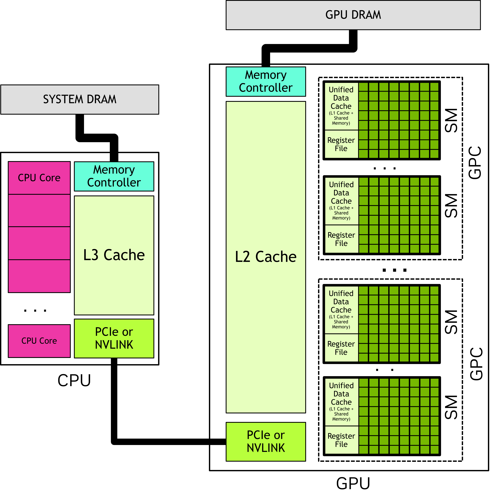

*图 2 GPU 包含多个流式多处理器（SM），每个 SM 内含多个功能单元。图形处理簇（GPC）由若干 SM 组成；GPU 则由连接到 GPU 内存的一组 GPC 构成。CPU 通常包含多个核心以及一个连接到系统内存的内存控制器。CPU 与 GPU 通过 PCIe、NVLink 等互连相连。*

#### 1.2.2.1. 线程块和网格

应用程序启动内核时会创建大量线程，通常可达数百万个。这些线程按块组织，即 *线程块*；线程块又组织成 *网格*。同一网格中的所有线程块具有相同的大小和维数。[图 3](#section-1-2-2-1) 给出了线程块网格的示意图。


*图 3 线程块网格。每个箭头代表一个线程（箭头数量不代表实际线程数）。*

线程块和网格可以是 1、2 或 3 维。这些维度可以简化单个线程到工作单元或数据项的映射。

启动内核时，需要通过特定的 *执行配置* 指定网格和线程块的维度。执行配置还可能包含簇大小、流和 SM 配置设置等可选参数，后文将分别介绍。

借助内置变量，执行内核的每个线程都能确定自己在线程块内的位置、该线程块在网格内的位置，以及启动所用线程块和网格的维度。由此可为一次内核启动中的每个线程确定唯一标识；该标识通常用于决定线程负责处理哪些数据或操作。

线程块的所有线程都在单个 SM 中执行。这使得线程块内的线程能够有效地相互通信和同步。线程块内的线程都可以访问片上共享内存，可用于在线程块的线程之间交换信息。

一个网格可能由数百万个线程块组成，而执行该网格的 GPU 可能只有数十或数百个 SM。一个线程块中的所有线程均由同一个 SM 执行，并且在大多数情况下会在该 SM 上一直运行到完成。[^1] 调度器不保证线程块之间的执行顺序，因此线程块不能依赖其他线程块的结果；被依赖的线程块可能要等当前线程块完成后才能获得调度。[图 4](#section-1-2-2-1) 给出了将网格中的线程块分配给 SM 的示例。


*图 4 每个 SM 都有一个或多个活动线程块。本例中，每个 SM 同时调度三个线程块；网格中的线程块分配给各 SM 的顺序不受保证。*

CUDA 编程模型允许任意规模的网格在任意规模的 GPU 上运行，无论 GPU 只有一个 SM 还是数千个 SM。为此，除少数例外情况外，该模型要求不同线程块中的线程之间不存在数据依赖关系。也就是说，同一网格中，一个线程不应依赖另一线程块中线程的结果，也不应与之同步。一个线程块内的所有线程同时驻留在同一 SM 上；网格中的不同线程块则由可用 SM 调度，并可按任意顺序执行。简而言之，CUDA 编程模型要求线程块能够以任意顺序并行或串行执行。

##### 1.2.2.1.1. 线程块簇

除线程块外，计算能力 9.0 及以上的 GPU 还支持名为 *簇* 的可选分组层级。一个簇由一组线程块组成，并且与线程块和网格一样，可以按一维、二维或三维布局。[图 5](#section-1-2-2-1-1) 展示了同时按簇组织的线程块网格。指定簇不会改变网格的维数，也不会改变线程块在网格中的索引。


*图 5 当指定簇时，线程块位于网格中的相同位置，但在包含簇中也有一个位置。*

指定簇后，相邻线程块将分组为一个簇，从而获得额外的同步与簇级通信能力。具体而言，一个簇中的所有线程块都在同一个 GPC 内执行。[图 6](#section-1-2-2-1-1) 展示了指定簇后线程块如何调度到 GPC 中的 SM。由于这些线程块在同一个 GPC 内并发调度，处于不同线程块但同属一个簇的线程可通过[协作组](#section-2-3-6)提供的软件接口相互通信和同步。簇中的线程还可访问该簇内所有线程块的共享内存，这称为[分布式共享内存](#section-2-3-3-8)。簇的最大大小由硬件决定，并因设备而异。

[图 6](#section-1-2-2-1-1) 展示了如何在一个 GPC 的多个 SM 上同时调度簇内线程块。簇内线程块在网格中始终彼此相邻。

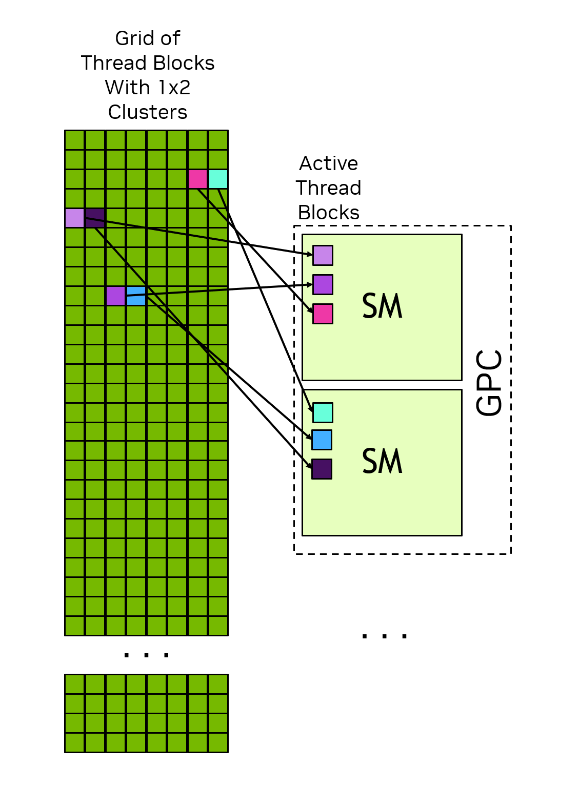

*图 6 指定簇后，簇内线程块按簇形状排列在网格中，并同时调度到同一个 GPC 的多个 SM 上。*

#### 1.2.2.2. 线程束和 SIMT

在线程块中，线程被组织成每组 32 个线程的 *线程束*。线程束按 *单指令多线程*（SIMT）范式执行内核代码。在 SIMT 中，线程束中的所有线程都执行相同的内核代码，但每个线程可能沿不同的代码分支执行。也就是说，尽管程序中的所有线程都执行相同代码，各线程却不必遵循相同的执行路径。

线程在一个线程束中执行时，会被分配到某个线程束通道。线程束通道编号为 0 到 31；线程块中的线程会按 [硬件多线程](#section-3-2-2-2) 所述的确定方式分配到各线程束。

线程束中的所有线程同时执行同一条指令。如果其中一部分线程进入某个控制流分支而其余线程不进入，则在执行该分支时，不进入分支的线程会被屏蔽。例如，若某个条件仅对线程束中一半的线程成立，则另一半线程会被屏蔽，由活动线程执行对应指令。[图 7](#section-1-2-2-2) 展示了这种情况。线程束中的不同线程采用不同代码路径时，称为 *线程束分歧*。因此，让同一线程束中的线程遵循相同的控制流路径，可以最大限度地提高 GPU 利用率。


*图 7 在本例中，只有线程索引为偶数的线程执行 if 语句体；执行该语句体时，其余线程会被屏蔽。*

在 SIMT 模型中，线程束中的所有线程以锁步方式通过内核。硬件执行可能有所不同。有关此区别的重要性的更多信息，请参阅 [独立线程执行](#section-3-2-2-1-1) 部分。不鼓励利用有关线程束执行如何实际映射到真实硬件的知识。 CUDA 编程模型和 SIMT 表示线程束中的所有线程一起执行代码。只要遵循编程模型，硬件就可以以对程序透明的方式优化屏蔽通道。如果程序违反此模型，则可能会导致未定义的行为，这些行为在不同的 GPU 硬件中可能会有所不同。

编写 CUDA 代码时并非必须显式考虑线程束，但理解线程束执行模型有助于掌握[全局内存访问合并](#section-2-3-4-1)和[共享内存存储体访问模式](#section-2-3-4-2)等概念。一些高级编程技术会让一个线程块内的不同线程束承担专门任务，以限制线程束分歧并提高资源利用率。这些优化都利用了线程在执行时按线程束分组这一事实。

由线程束执行方式可知，线程块的线程总数最好是 32 的倍数。使用任意线程数在语法上都合法，但总数不是 32 的倍数时，线程块的最后一个线程束会有若干通道在整个执行期间闲置，从而可能降低该线程束的功能单元利用率，并使内存访问效率不理想。

> SIMT 通常与单指令多数据 (SIMD) 并行性进行比较，但也有一些重要的区别。在 SIMD 中，执行遵循单个控制流路径，而在 SIMT 中，允许每个线程遵循其自己的控制流路径。因此，SIMT 不像 SIMD 那样具有固定的数据宽度。关于 SIMT 的更详细讨论可以在 [SIMT 执行模型](#section-3-2-2-1) 中找到。

#### 1.2.2.3. Tile CUDA 编程

除了前面章节中介绍的 SIMT 模型外，CUDA 还支持 Tile 编程模型。在 Tile 编程中，程序员在整个线程块级别编写代码，描述对称为 **Tile** 的多维数据集合的操作。编译器将这些操作映射到块的各个线程。

Tile 内核以线程块网格的形式启动，如 [线程块和网格](#section-1-2-2-1) 所述。每个线程块执行 Tile 内核，并可查询自身在网格中的位置，以确定其负责的数据区域。程序员只需指定网格维度；每个线程块的线程数由编译器根据内核中的 Tile 操作确定（见[图 8](#section-1-2-2-3)）。

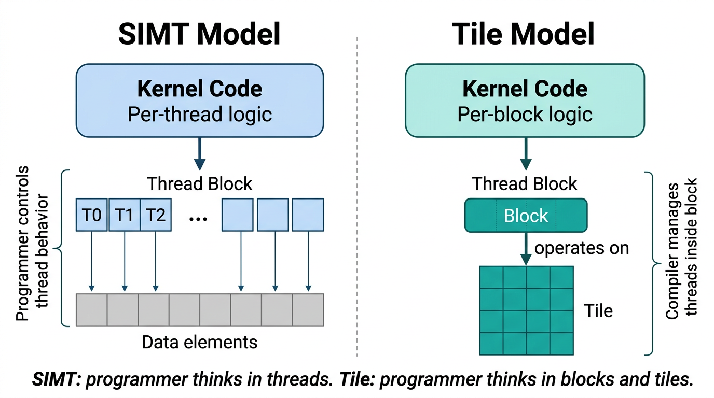

*图 8 SIMT 和 Tile 编程模型中的程序员视图。在 SIMT 中，程序员编写逐线程代码，并控制每个线程如何访问数据。在 Tile 编程中，程序员编写对 Tile 进行操作的逐线程块代码；编译器将这些操作映射到线程块中的各线程。*

在 Tile 内核内，该块执行单个控制流。程序员指定 Tile 上的操作，编译器将工作分配到块的线程上。支持条件和循环等标准控制流结构，但由于该块遵循单个控制流，因此不存在线程束分歧的概念。标量操作（例如计算索引或循环边界）由块的单个线程执行。 Tile 操作，例如逐个元素添加两个 Tile，由块的所有线程共同并行执行。

重要的是不要将块（执行单元）与 Tile（数据单元）混淆。单个块可以创建不同形状和数据类型的许多 Tile 并对其进行操作。

##### 1.2.2.3.1. 数组和 Tile

Tile 内核使用两种类型的数据： **数组** 和 **Tile**。数组（或全局数组）是存储在设备内存中的元素的多维容器。数组是可变的：它们的内容可以通过内核中的存储操作进行修改。数组具有形状和数据类型。

Tile 是仅存在于 Tile 代码内部、且局部于单个线程块的多维值集合。Tile 不可变：对 Tile 执行的每项操作都会生成一个新 Tile，而不会修改原有 Tile。与数组不同，Tile 不一定在内存中具有对应表示；编译器决定 Tile 数据的存储方式，可以使用寄存器、共享内存或 SM 的其他资源。Tile 各维的大小必须为 2 的幂，并且必须在编译时已知（即能在内核执行前确定，而不是在执行期间计算）。Tile 不能作为内核参数传递，而是完全在 Tile 代码内部创建和使用。

##### 1.2.2.3.2. Tile 空间和数据移动

数据通过加载与存储操作在数组和 Tile 之间移动。这些操作使用 **Tile 空间**：从概念上把数组划分为大小相等且互不重叠的 Tile 所形成的索引空间。例如，对于形状为 (M, N) 的二维数组，若加载操作指定 Tile 形状为 (tm, tn)，则该数组在概念上被划分为 \(\lceil M/t_m \rceil\) 行、\(\lceil N/t_n \rceil\) 列的 Tile。Tile 空间中的索引（例如 (i, j)）标识要加载的 Tile。加载操作返回一个形状为 (tm, tn) 的 Tile，其中包含数组中对应的元素。当 Tile 越过数组边界时（例如数组维度不是 Tile 维度的整数倍），加载操作还会规定如何处理越界元素，例如用零填充（见[图 9](#section-1-2-2-3-2)）。


*图 9 Tile 空间和数据移动。形状为 (M, N) 的二维数组在概念上被划分为形状为 (t_m, t_n) 的 Tile 网格。在 Tile 空间索引 (i, j) 处执行加载会返回相应的 Tile。数组边界之外的元素可用零填充。存储操作会把 Tile 写回数组中指定的 Tile 空间索引处。*

存储操作执行相反的过程：给定一个 Tile 及其 Tile 空间索引，把 Tile 元素写入数组中的对应区域。超出数组边界的写入会被静默丢弃。Tile 程序还支持聚集与散布操作，可从数组中的任意位置加载数据，或把数据存储到任意位置。

##### 1.2.2.3.3. Tile 上的操作

Tile 程序提供一组作用于 Tile 的内置操作，包括逐元素算术、矩阵乘法、沿一个或多个轴的归约（例如求和和求最大值）、形状操作（例如重塑和转置）以及类型转换。当一次操作组合两个形状不同的 Tile 时，较小的 Tile 会在操作执行前自动扩展，以匹配较大 Tile 的形状。

##### 1.2.2.3.4. 与 SIMT 编程的关系

Tile 编程与 SIMT 编程在 CUDA 中并存。一个应用程序可以同时包含 SIMT 内核和 Tile 内核，两类内核都能操作设备内存中的同一份数据；编程模型按内核选择。Tile 编程并不取代 SIMT 编程：SIMT 对各线程提供细粒度控制，对某些算法和优化技术仍不可或缺；Tile 编程则提供更高层抽象，可简化内核开发。由于线程级决策交由编译器处理，同一个 Tile 内核无需修改源代码即可在不同 GPU 架构上运行。两种模型均建立在前文所述的相同底层硬件——SM、线程块和网格——之上，也使用下文将介绍的同一设备内存空间。

### 1.2.3. GPU 内存

在现代计算系统中，有效利用内存与充分利用执行计算的功能单元同样重要。异构系统具有多个内存空间；除缓存外，GPU 还包含多种可编程的片上内存。以下各节将详细介绍这些内存空间。

#### 1.2.3.1. 异构系统中的 DRAM 内存

GPU 和 CPU 都直接连接到 DRAM 芯片。在多 GPU 系统中，每个 GPU 都有自己的内存。从设备代码的角度看，连接到 GPU 的 DRAM 称为 *全局内存*，因为该 GPU 中的所有 SM 均可访问它；“全局”并不表示系统中的任何组件都一定能访问它。连接到 CPU 的 DRAM 称为 *系统内存* 或 *主机内存*。

与 CPU 一样，GPU 也使用虚拟内存寻址。在当前支持的所有系统上，CPU 与 GPU 共用一个统一虚拟地址空间。这意味着 CPU 和系统中的每个 GPU 各自占有唯一且互不重叠的虚拟地址范围。对于给定的虚拟地址，可以判断它位于 GPU 内存还是系统内存；在多 GPU 系统中，还能确定该地址属于哪个 GPU 的内存。

CUDA API 可以分配 GPU 内存和 CPU 内存，并可在 CPU 与 GPU 的内存分配之间、同一 GPU 内部，或多 GPU 系统的不同 GPU 之间复制数据。需要时，应用程序可以显式控制数据的局部性。下文介绍的[统一内存](#section-1-2-3-3)则允许 CUDA 运行时或系统硬件自动处理内存放置。

#### 1.2.3.2. GPU 中的片上存储器

除了全局内存之外，每个 GPU 都有一些片上存储器。每个 SM 都有自己的寄存器文件和共享内存。这些存储器是 SM 的一部分，可以从 SM 内执行的线程极其快速地访问。

寄存器文件存储线程局部变量，这些变量通常由编译器分配。共享内存可由线程块或集群内的所有线程访问。共享内存可用于在线程块或集群的线程之间交换数据。

SM 中的寄存器文件和统一数据缓存的大小是有限的。 SM 寄存器文件的大小、统一数据缓存以及如何为 L1 和共享内存平衡配置统一数据缓存可以在 [每个计算能力的内存信息](#section-5-1-3) 中找到。寄存器文件、共享内存空间和 L1 缓存在线程块中的所有线程之间共享。

要把线程块调度到 SM，每个线程所需的寄存器数乘以线程块中的线程数，必须小于或等于 SM 的可用寄存器数。如果线程块所需的寄存器总数超过寄存器文件容量，内核便无法启动；此时必须减少线程块中的线程数，使该线程块满足启动条件。

共享内存分配在线程块级别完成。也就是说，与每个线程的寄存器分配不同，共享内存的分配对于整个线程块是公共的。

##### 1.2.3.2.1. 缓存

除可编程存储器外，GPU 还具有 L1 和 L2 缓存。每个 SM 都有一个 L1 缓存，它是统一数据缓存的一部分；容量更大的 L2 缓存则由 GPU 中的所有 SM 共享，如[图 2](#section-1-2-2)的 GPU 框图所示。每个 SM 还有独立的[常量缓存](#section-2-3-3-5)，用于缓存全局内存中被声明为在内核生命周期内保持不变的值。编译器也可以把内核参数放入常量内存，使其与 L1 数据缓存分开缓存，从而提高内核性能。

#### 1.2.3.3. 统一内存

应用程序在 GPU 或 CPU 上显式分配的内存，只能由相应设备上运行的代码访问。也就是说，CPU 内存只能由 CPU 代码访问，而 GPU 内存只能由运行在 GPU 上的内核访问。[^2] CUDA 提供在 CPU 与 GPU 之间复制内存的 API，使应用程序能在恰当时机把数据显式复制到所需内存中。

称为 *统一内存* 的 CUDA 功能允许应用程序进行可从 CPU 或 GPU 访问的内存分配。 CUDA 运行时或底层硬件可以在需要时访问数据或将数据重新定位到正确的位置。即使使用统一内存，也可以通过将内存迁移保持在最低限度并从直接连接到数据所在内存的处理器访问尽可能多的数据来获得最佳性能。

系统的硬件特性决定了如何实现存储空间之间的数据访问和交换。 [统一内存](#section-2-6-2) 部分介绍了统一内存系统的不同类别。 [统一内存](#section-4-1) 部分包含有关统一内存在所有情况下的使用和行为的更多详细信息。

[^1]: 在某些情况下，例如使用 [CUDA 动态并行](#section-4-18)等功能时，线程块可能被挂起到内存中。此时，SM 状态会保存到 GPU 内存的系统管理区域，SM 则被释放以执行其他线程块。这类似于 CPU 的上下文切换，但并不常见。

[^2]: [映射内存](#section-2-6-3-1) 是一个例外：它属于 CPU 内存，但分配时带有允许 GPU 直接访问的属性。不过，映射访问经由 PCIe 或 NVLink 互连进行；GPU 无法利用并行性掩盖其较高延迟和较低带宽。因此，映射内存不能作为统一内存或把数据放入恰当内存空间的高性能替代方案。

---

## 1.3. CUDA 平台

*英文原题：The CUDA platform*  
*官方原文：[https://docs.nvidia.com/cuda/cuda-programming-guide/01-introduction/cuda-platform.html](https://docs.nvidia.com/cuda/cuda-programming-guide/01-introduction/cuda-platform.html)*

NVIDIA CUDA 平台由多种软硬件组件以及为异构系统计算而开发的关键技术组成。本章介绍对应用程序开发者十分重要的 CUDA 平台基本概念与组件。与[编程模型](#section-1-2)一章相同，本章不针对某一种编程语言，而适用于 CUDA 平台上的各种编程方式。

### 1.3.1. 计算能力和流式多处理器版本

每款 NVIDIA GPU 都有一个 *计算能力*（CC）编号，用于说明该 GPU 支持的功能并规定若干硬件参数。这些规格列于[第 5.1 节](#section-5-1)的附录中。NVIDIA GPU 及其计算能力的完整列表维护在 [CUDA GPU 计算能力页面](https://developer.nvidia.com/cuda-gpus)上。

计算能力采用 X.Y 格式，其中 X 为主版本号，Y 为次版本号。例如，CC 12.0 的主版本号为 12，次版本号为 0。计算能力与 SM 版本号直接对应：例如，CC 12.0 GPU 中的 SM 版本为 `sm_120`，该版本标识也用于标记二进制代码。

[第 5.1.1 节](#section-5-1-1) 显示如何查询和确定系统中 GPU 的计算能力。

### 1.3.2. CUDA 工具包和 NVIDIA 驱动程序

可以将 *NVIDIA 驱动程序* 视为 GPU 的操作系统。它是必须安装在主机操作系统中的软件组件，任何 GPU 用途（包括显示与图形功能）都离不开它。NVIDIA 驱动程序是 CUDA 平台的基础，同时还支持 Vulkan、Direct3D 等其他 GPU 接口。NVIDIA 驱动程序版本号的形式如 R580。

*CUDA 工具包* 是用于编写、构建和分析 GPU 计算软件的一组库、头文件与工具。CUDA 工具包是独立于 NVIDIA 驱动程序的软件产品。

*CUDA 运行时* 是 CUDA 工具包提供的一个重要库。它通过 API 和若干语言扩展处理常见任务，例如分配内存、在 GPU 与其他 GPU 或 CPU 之间复制数据，以及启动内核。CUDA 运行时所提供的 API 称为 CUDA 运行时 API。

[CUDA 兼容性](https://docs.nvidia.com/deploy/cuda-compatibility/index.html)文档详细说明不同 GPU、NVIDIA 驱动程序与 CUDA 工具包版本之间的兼容关系。

#### 1.3.2.1. CUDA 运行时 API 和 CUDA 驱动程序 API

CUDA 运行时 API 构建在更底层的 *CUDA 驱动程序 API* 之上；后者由 NVIDIA 驱动程序直接公开。本指南主要介绍 CUDA 运行时 API。必要时，仅使用驱动程序 API 也能实现运行时 API 的全部功能，而且某些功能只能通过驱动程序 API 使用。应用程序可以选择其中一种 API，也可以同时使用两者。[CUDA 驱动程序 API](#section-3-3)一节介绍了二者之间的互操作性。

CUDA 运行时 API 函数的完整 API 参考可在 [CUDA 运行时 API 文档](https://docs.nvidia.com/cuda/cuda-runtime-api/index.html) 中找到。

CUDA 驱动程序 API 的完整 API 参考可以在 [CUDA 驱动程序 API 文档](https://docs.nvidia.com/cuda/cuda-driver-api/index.html) 中找到。

### 1.3.3. 并行线程执行（PTX）

CUDA 平台中有一个基础但有时并不显眼的层次，即 *并行线程执行*（PTX）虚拟指令集架构（ISA）。PTX 是面向 NVIDIA GPU 的高级汇编语言，在真实 GPU 硬件的物理 ISA 之上提供了一层抽象。与其他平台类似，应用程序可以直接使用这种汇编语言编写，但这样做会给软件开发带来不必要的复杂性和难度。

领域特定语言和高级语言的编译器可以生成 PTX 代码作为中间表示（IR），再由 NVIDIA 的离线或即时编译（JIT）工具生成可执行的 GPU 二进制代码。因此，除 NVIDIA 工具（例如 [NVCC：NVIDIA CUDA 编译器](#section-2-7)）直接支持的语言外，其他语言也可以面向 CUDA 平台进行编程。

由于 GPU 功能会随时间演进，PTX 虚拟 ISA 规范采用版本化管理。与 SM 版本相同，PTX 版本也与计算能力对应。例如，支持计算能力 8.0 全部功能的 PTX 版本称为 `compute_80`。

有关 PTX 的完整文档可以在 [PTX ISA](https://docs.nvidia.com/cuda/parallel-thread-execution/index.html) 中找到。

### 1.3.4. cubin 与胖二进制

CUDA 应用程序与库通常使用 C++ 等高级语言编写。高级语言先编译为 PTX，随后 PTX 再编译为面向物理 GPU 的真实二进制代码，即 *CUDA 二进制*（简称 *cubin*）。cubin 采用特定 SM 版本对应的二进制格式，例如 `sm_120`。

使用 GPU 计算的可执行文件和库二进制文件同时包含 CPU 代码与 GPU 代码。GPU 代码存放在称为 *胖二进制*（fatbin）的容器中。一个 fatbin 可以包含面向多个不同目标的 cubin 和 PTX。例如，构建应用程序时可同时嵌入针对多种 GPU 架构（即不同 SM 版本）的二进制代码。应用程序运行时，GPU 代码会加载到具体 GPU 上，并从 fatbin 中选用最适合该 GPU 的二进制版本。


*图 10 可执行文件或库的二进制文件包含 CPU 二进制代码和用于容纳 GPU 代码的 fatbin 容器。fatbin 可以包含 cubin GPU 二进制代码和 PTX 虚拟 ISA 代码；PTX 代码可针对未来目标进行 JIT 编译。*

fatbin 还可以包含一个或多个版本的 GPU PTX 代码，其用途见 [PTX 兼容性](#section-1-3-4-2)。[图 10](#section-1-3-4) 给出了一个应用程序或库二进制文件的示例，其中包含多个版本的 cubin GPU 代码以及一个版本的 PTX 代码。

#### 1.3.4.1. 二进制兼容性

NVIDIA GPU 在特定条件下保证二进制兼容性。具体而言，在同一计算能力主版本内，次版本大于或等于 cubin 目标版本的 GPU 可以加载并执行该 cubin。例如，如果应用程序包含为计算能力 8.6 编译的 cubin，则计算能力为 8.6 或 8.9 的 GPU 均可加载并执行它；计算能力 8.0 的 GPU 则不能，因为其 CC 次版本 0 低于代码的目标次版本 6。

NVIDIA GPU 的不同计算能力主版本之间不保证二进制兼容。也就是说，为计算能力 8.6 编译的 cubin 代码不能加载到计算能力 9.0 的 GPU 上。

讨论二进制代码时，通常使用上例中的 `sm_86` 一类版本标识，表示该二进制代码面向计算能力 8.6 构建。开发者正是通过这种形式向 NVIDIA CUDA 编译器 [nvcc](#section-2-7) 指定二进制构建目标，因此这种简写很常用。

> [!NOTE]
> **说明**
> 二进制兼容性承诺仅适用于 NVIDIA 工具（例如 `nvcc`）创建的二进制文件。不支持手动编辑或生成 NVIDIA GPU 二进制代码；以任何方式修改二进制文件都会使兼容性承诺失效。

#### 1.3.4.2. PTX 兼容性

如 [cubin 与胖二进制](#section-1-3-4)所述，GPU 代码也可以 PTX 形式存放在可执行文件中。应用程序保存某一计算能力版本的 PTX 后，便可在运行时将该 PTX 即时编译为任何不低于其目标计算能力的二进制代码。例如，应用程序若包含面向 `compute_80` 的 PTX，运行时便可将其即时编译为 `sm_120` 等后续 SM 版本。由此可在不重新构建应用程序或库的情况下，为未来 GPU 提供前向兼容性。

#### 1.3.4.3. 即时编译

应用程序在运行时加载的 PTX 代码由设备驱动程序编译为二进制代码，这一过程称为即时编译（JIT）。JIT 会增加应用程序加载时间，但可使应用程序受益于新版设备驱动程序所包含的编译器改进，也能让应用程序在构建时尚不存在的设备上运行。

设备驱动程序即时编译应用程序的 PTX 代码时，会自动缓存生成的二进制代码，以免后续运行应用程序时重复编译。设备驱动程序升级后，这个称为计算缓存（compute cache）的缓存会自动失效，从而使应用程序能够受益于新驱动程序内置 JIT 编译器的改进。

自 CUDA 最早版本以来，运行时对 PTX 进行 JIT 编译的方式与时机已变得更加灵活，应用程序可以更细致地控制是否以及何时即时编译部分或全部内核。[延迟加载](#section-4-7)一节介绍了相关选项及 JIT 行为的控制方式；[CUDA 环境变量](#section-5-2)还列出了控制即时编译行为的环境变量。

除使用 `nvcc` 编译 CUDA C++ 设备代码外，也可以使用 NVRTC 在运行时将 CUDA C++ 设备代码编译为 PTX。NVRTC 是 CUDA C++ 运行时编译库；更多信息参见 NVRTC 用户指南。

---

## 2.1. CUDA C++ 入门

*英文原题：Intro to CUDA C++*  
*官方原文：[https://docs.nvidia.com/cuda/cuda-programming-guide/02-basics/intro-to-cuda-cpp.html](https://docs.nvidia.com/cuda/cuda-programming-guide/02-basics/intro-to-cuda-cpp.html)*

本章通过展示 CUDA 编程模型中的若干基本概念如何在 C++ 中呈现，对这些概念作一介绍。

本编程指南重点介绍 CUDA 运行时 API。它是在 C++ 中使用 CUDA 最常见的方式，并构建在更底层的 CUDA 驱动程序 API 之上。

[CUDA 运行时 API 和 CUDA 驱动程序 API](#section-1-3-2-1) 讨论 API 之间的差异，[CUDA 驱动程序 API](#section-3-3) 讨论编写混合 API 的代码。

本指南假定已安装 CUDA 工具包和 NVIDIA 驱动程序并且存在受支持的 NVIDIA GPU。有关安装必要的 CUDA 组件的说明，请参阅 [CUDA 快速入门指南](https://docs.nvidia.com/cuda/cuda-quick-start-guide/index.html)。

### 2.1.1. 使用 NVCC 编译

用 C++ 编写的 GPU 代码使用 NVIDIA CUDA 编译器 `nvcc` 编译。`nvcc` 是一个编译器驱动程序，它通过简单、熟悉的命令行选项简化 C++ 或 PTX 代码的编译过程，并调用一组工具完成不同的编译阶段。

本指南给出的 `nvcc` 命令行可在已安装 CUDA 工具包的 Linux 系统、Windows 命令提示符或 PowerShell 中使用，也可在已安装 CUDA 工具包的 Windows Subsystem for Linux（WSL）中使用。本指南的 [nvcc 一章](#section-2-7)介绍常见用法；完整文档参见 [nvcc 用户手册](https://docs.nvidia.com/cuda/cuda-compiler-driver-nvcc/index.html)。

### 2.1.2. 内核

正如 [CUDA 编程模型](#section-1-2) 简介中提到的，在 GPU 上执行的可以从主机调用的函数称为内核。内核被编写为由许多并行线程同时运行。

#### 2.1.2.1. 指定内核

内核使用 `__global__` 声明说明符定义。该说明符告知编译器：应为 GPU 编译此函数，并允许通过内核启动来调用它。内核启动是开始执行内核的操作，通常由 CPU 发起。内核函数的返回类型必须为 `void`。

```cuda
// Kernel definition
__global__ void vecAdd(float* A, float* B, float* C)
{

}
```

#### 2.1.2.2. 启动内核

并行执行内核的线程数在内核启动时指定，这组参数称为执行配置。同一内核的不同调用可以使用不同的执行配置，例如采用不同的线程数或线程块数。

从 CPU 代码启动内核有两种方式：[三重尖括号语法](#section-2-1-2-2-1)和 `cudaLaunchKernelEx`。本节介绍最常用的三重尖括号语法；使用 `cudaLaunchKernelEx` 启动内核的示例详见[第 3.1.1 节](#section-3-1-1)。

##### 2.1.2.2.1. 三重尖括号语法

三重尖括号语法是用于启动内核的 [CUDA C++ 语言扩展](#section-5-4-3)。它使用 `<<< >>>` 包围内核启动的执行配置；配置参数在尖括号内以逗号分隔，形式类似函数实参列表。下面给出 `vecAdd` 内核的启动语法。

```cuda
 __global__ void vecAdd(float* A, float* B, float* C)
 {

 }

int main()
{
    ...
    // Kernel invocation
    vecAdd<<<1, 256>>>(A, B, C);
    ...
}
```

三重尖括号中的前两个参数分别是网格维度和线程块维度。对于一维线程块或网格，可以直接用整数指定维度。

上面的代码启动一个包含 256 个线程的线程块。每个线程都执行完全相同的内核代码。[线程与网格索引内置变量](#section-2-1-2-3)一节将说明每个线程如何利用其在线程块和网格中的索引，选择自己要处理的数据。

每个线程块的线程数存在上限，因为块内所有线程都驻留在同一个流式多处理器（SM）上，并共享该 SM 的资源。在当前 GPU 上，一个线程块最多可包含 1024 个线程。如果资源允许，一个 SM 上可以同时调度多个线程块。

内核启动相对于主机线程异步执行。也就是说，运行时会安排内核在 GPU 上执行，但主机代码不会等待内核执行完毕（甚至不会等待其开始执行）便会继续。要确认内核已经完成，必须在 GPU 与 CPU 之间执行某种同步。最基本的方法是同步整个 GPU，见[同步 CPU 和 GPU](#section-2-1-4)；更精细的同步方法将在[异步执行](#section-2-5)中介绍。

使用二维或三维网格或线程块时，以 CUDA 类型 `dim3` 指定网格和线程块维度。下面的代码片段启动 `MatAdd` 内核：线程块网格大小为 16 × 16，每个线程块大小为 8 × 8。

```cuda
int main()
{
    ...
    dim3 grid(16,16);
    dim3 block(8,8);
    MatAdd<<<grid, block>>>(A, B, C);
    ...
}
```

#### 2.1.2.3. 线程与网格索引内置变量

在内核代码中，CUDA 提供内置变量，用于访问执行配置参数以及线程或线程块的索引。

> - `threadIdx` 给出线程在其线程块内的索引。线程块中的每个线程将具有不同的索引。
> - `blockDim` 给出线程块的尺寸，该尺寸在内核启动的执行配置中指定。
> - `blockIdx` 给出网格内线程块的索引。每个线程块都会有不同的索引。
> - `gridDim` 给出了网格的尺寸，该尺寸是在启动内核时在执行配置中指定的。

这些内置变量都是包含 `.x`、`.y` 和 `.z` 成员的三分量向量。启动配置中未指定的维度默认为 1。`threadIdx` 和 `blockIdx` 从零开始计数；也就是说，`threadIdx.x` 的取值范围为 0 到 `blockDim.x-1`（含两端）。`.y` 和 `.z` 成员在各自维度上的规则相同。

类似地，`blockIdx.x` 的取值范围为 0 到 `gridDim.x-1`（含两端），`.y` 和 `.z` 维也分别遵循相同规则。

这些内置变量使每个线程都能确定自己应完成的工作。回到 `vecAdd` 内核：它接收三个浮点向量参数，对 `A` 与 `B` 逐元素相加，并把结果存入 `C`。内核并行执行，每个线程完成一次加法；具体计算哪个元素，由该线程在线程块和网格中的索引决定。

```cuda
__global__ void vecAdd(float* A, float* B, float* C)
{
   // calculate which element this thread is responsible for computing
   int workIndex = threadIdx.x + blockDim.x * blockIdx.x

   // Perform computation
   C[workIndex] = A[workIndex] + B[workIndex];
}

int main()
{
    ...
    // A, B, and C are vectors of 1024 elements
    vecAdd<<<4, 256>>>(A, B, C);
    ...
}
```

此示例用 4 个线程块、每块 256 个线程，对长度为 1024 的向量执行加法。在第一个线程块中，`blockIdx.x` 为 0，因此每个线程的 `workIndex` 就是其 `threadIdx.x`。在第二个线程块中，`blockIdx.x` 为 1，因而 `blockDim.x * blockIdx.x` 等于 `blockDim.x`，本例中为 256；该线程块中各线程的 `workIndex` 为 `threadIdx.x + 256`。第三个线程块中的 `workIndex` 则为 `threadIdx.x + 512`。

`workIndex` 的这种计算对于一维并行化来说非常常见。扩展到二维或三维通常在每个维度中遵循相同的模式。

##### 2.1.2.3.1. 边界检查

上例假定向量长度是线程块大小（本例为 256 个线程）的整数倍。为了让内核处理任意长度的向量，可以像下面这样增加边界检查，确保内存访问不越过数组边界；随后即可启动足够多的线程块，即使最后一个线程块中会有部分线程不执行实际工作。

```cuda
__global__ void vecAdd(float* A, float* B, float* C, int vectorLength)
{
     // calculate which element this thread is responsible for computing
     int workIndex = threadIdx.x + blockDim.x * blockIdx.x

     if(workIndex < vectorLength)
     {
         // Perform computation
         C[workIndex] = A[workIndex] + B[workIndex];
     }
}
```

使用上面的内核代码，可以启动比需要的更多的线程，而不会导致对数组的越界访问。当 `workIndex` 超过 `vectorLength` 时， 线程退出并且不执行任何工作。在不执行任何工作的块中启动额外的线程不会产生较大的开销成本，但是应避免启动其中没有线程执行工作的线程块。此内核现在可以处理不是块大小倍数的向量长度。

所需线程块数等于所需线程总数（本例即向量长度）除以每个线程块的线程数，并向上取整。下面给出只用一次整数除法实现这一计算的常见写法：在除法前给被除数加上 `threads - 1`，即可达到向上取整的效果；只有当向量长度不能被每块线程数整除时，才会额外增加一个线程块。

```cuda
// vectorLength is an integer storing number of elements in the vector
int threads = 256;
int blocks = (vectorLength + threads-1)/threads;
vecAdd<<<blocks, threads>>>(devA, devB, devC, vectorLength);
```

[CUDA 核心计算库 (CCCL)](https://nvidia.github.io/cccl/unstable/) 提供了一个方便的实用程序 `cuda::ceil_div`，用于执行此上限除法来计算内核启动所需的块数。通过包含头文件 `<cuda/cmath>` 即可使用此实用程序。

```cuda
// vectorLength is an integer storing number of elements in the vector
int threads = 256;
int blocks = cuda::ceil_div(vectorLength, threads);
vecAdd<<<blocks, threads>>>(devA, devB, devC, vectorLength);
```

这里选择每个线程块包含 256 个线程并非硬性要求，但通常是一个合适的起点。

### 2.1.3. GPU 计算中的内存

要使用上面的 `vecAdd` 内核，数组 `A`、`B` 和 `C` 必须位于 GPU 可访问的内存中。实现这一点有多种方式，本节将演示其中两种；其他方式将在后文的[统一内存](#section-2-6-2)章节中介绍。GPU 代码可用的内存空间已在 [GPU 内存](#section-1-2-3)中作过概述，并将在 [GPU 设备内存空间](#section-2-3-3)中详细说明。

#### 2.1.3.1. 统一内存

统一内存是 CUDA 运行时的一项功能，它允许 NVIDIA 驱动程序管理主机和设备之间的数据移动。使用 `cudaMallocManaged` API 或通过使用 `__managed__` 说明符声明变量来分配内存。 NVIDIA 驱动程序将确保无论何时 GPU 或 CPU 尝试访问该内存都可以访问该内存。

下面的代码显示了启动 `vecAdd` 内核的完整函数，该函数使用统一内存作为将在 GPU 上使用的输入和输出向量。 `cudaMallocManaged` 分配可从 CPU 或 GPU 访问的缓冲区。这些缓冲区是使用 `cudaFree` 释放的。

```cuda
void unifiedMemExample(int vectorLength)
{
    // Pointers to memory vectors
    float* A = nullptr;
    float* B = nullptr;
    float* C = nullptr;
    float* comparisonResult = (float*)malloc(vectorLength*sizeof(float));

    // Use unified memory to allocate buffers
    cudaMallocManaged(&A, vectorLength*sizeof(float));
    cudaMallocManaged(&B, vectorLength*sizeof(float));
    cudaMallocManaged(&C, vectorLength*sizeof(float));

    // Initialize vectors on the host
    initArray(A, vectorLength);
    initArray(B, vectorLength);

    // Launch the kernel. Unified memory will make sure A, B, and C are
    // accessible to the GPU
    int threads = 256;
    int blocks = cuda::ceil_div(vectorLength, threads);
    vecAdd<<<blocks, threads>>>(A, B, C, vectorLength);
    // Wait for the kernel to complete execution
    cudaDeviceSynchronize();

    // Perform computation serially on CPU for comparison
    serialVecAdd(A, B, comparisonResult, vectorLength);

    // Confirm that CPU and GPU got the same answer
    if(vectorApproximatelyEqual(C, comparisonResult, vectorLength))
    {
        printf("Unified Memory: CPU and GPU answers match\n");
    }
    else
    {
        printf("Unified Memory: Error - CPU and GPU answers do not match\n");
    }

    // Clean Up
    cudaFree(A);
    cudaFree(B);
    cudaFree(C);
    free(comparisonResult);

}
```

CUDA 在所有受支持的操作系统和 GPU 上都提供统一内存，但底层机制与性能可能因系统架构而异。更多信息见[统一内存](#section-2-6-2)。在某些 Linux 系统上，例如具有[地址转换服务](#section-2-6-2-2-1)或[异构内存管理](#section-2-6-2-2-2)的系统，全部系统内存会自动成为统一内存，无需使用 `cudaMallocManaged` 或 `__managed__` 说明符。

#### 2.1.3.2. 显式内存管理

显式管理各内存空间中的分配及其间的数据迁移有助于提高应用程序性能，但也会使代码更为冗长。下面的代码使用 `cudaMalloc` 在 GPU 上显式分配内存；释放 GPU 内存仍使用前一个统一内存示例中的 `cudaFree` API。

```cuda
void explicitMemExample(int vectorLength)
{
    // Pointers for host memory
    float* A = nullptr;
    float* B = nullptr;
    float* C = nullptr;
    float* comparisonResult = (float*)malloc(vectorLength*sizeof(float));
    
    // Pointers for device memory
    float* devA = nullptr;
    float* devB = nullptr;
    float* devC = nullptr;

    //Allocate Host Memory using cudaMallocHost API. This is best practice
    // when buffers will be used for copies between CPU and GPU memory
    cudaMallocHost(&A, vectorLength*sizeof(float));
    cudaMallocHost(&B, vectorLength*sizeof(float));
    cudaMallocHost(&C, vectorLength*sizeof(float));

    // Initialize vectors on the host
    initArray(A, vectorLength);
    initArray(B, vectorLength);

    // start-allocate-and-copy
    // Allocate memory on the GPU
    cudaMalloc(&devA, vectorLength*sizeof(float));
    cudaMalloc(&devB, vectorLength*sizeof(float));
    cudaMalloc(&devC, vectorLength*sizeof(float));

    // Copy data to the GPU
    cudaMemcpy(devA, A, vectorLength*sizeof(float), cudaMemcpyDefault);
    cudaMemcpy(devB, B, vectorLength*sizeof(float), cudaMemcpyDefault);
    cudaMemset(devC, 0, vectorLength*sizeof(float));
    // end-allocate-and-copy

    // Launch the kernel
    int threads = 256;
    int blocks = cuda::ceil_div(vectorLength, threads);
    vecAdd<<<blocks, threads>>>(devA, devB, devC, vectorLength);
    // wait for kernel execution to complete
    cudaDeviceSynchronize();

    // Copy results back to host
    cudaMemcpy(C, devC, vectorLength*sizeof(float), cudaMemcpyDefault);

    // Perform computation serially on CPU for comparison
    serialVecAdd(A, B, comparisonResult, vectorLength);

    // Confirm that CPU and GPU got the same answer
    if(vectorApproximatelyEqual(C, comparisonResult, vectorLength))
    {
        printf("Explicit Memory: CPU and GPU answers match\n");
    }
    else
    {
        printf("Explicit Memory: Error - CPU and GPU answers to not match\n");
    }

    // clean up
    cudaFree(devA);
    cudaFree(devB);
    cudaFree(devC);
    cudaFreeHost(A);
    cudaFreeHost(B);
    cudaFreeHost(C);
    free(comparisonResult);
}
```

CUDA API `cudaMemcpy` 用于将数据从驻留在 CPU 上的缓冲区复制到驻留在 GPU 上的缓冲区。除了目标指针、源指针和字节大小之外， `cudaMemcpy` 的最终参数是 `cudaMemcpyKind_t`。它可以具有以下值：

- `cudaMemcpyHostToDevice` 用于从 CPU 复制到 GPU
- `cudaMemcpyDeviceToHost` 用于从 GPU 到 CPU 的副本
- `cudaMemcpyDeviceToDevice` 用于同一 GPU 内或不同 GPU 之间的复制

在此示例中， `cudaMemcpyDefault` 作为最后一个参数传递给 `cudaMemcpy`。这会导致 CUDA 使用源指针和目标指针的值来确定要执行的复制类型。

`cudaMemcpy` API 是同步。也就是说，在复制完成之前它不会返回。异步副本在 [在 CUDA 流中启动内存传输](#section-2-5-2-3) 中引入。

该代码使用 `cudaMallocHost` 在 CPU 上分配[页锁定内存](#section-2-6-3)。页锁定内存可以提高复制性能，并且是执行[异步](#section-2-5-2-3)内存传输的必要条件。通常，用于向 GPU 发送数据或从 GPU 接收数据的 CPU 缓冲区应使用页锁定内存；但锁定过多主机内存可能降低某些系统的性能，因此最佳实践是仅锁定实际参与 GPU 数据传输的缓冲区。

#### 2.1.3.3. 内存管理和应用程序性能

从上面的例子可以看出，显式内存管理更加冗长，需要程序员指定主机和设备之间的副本。这是显式内存管理的优点和缺点：它可以更好地控制何时在主机和设备之间复制数据、内存驻留在何处以及确切地在何处分配哪些内存。显式内存管理可以提供控制内存传输并将其与其他计算重叠的性能机会。

使用统一内存时，可以通过后文[内存建议和预取](#section-2-6-2-4)介绍的 CUDA API 向管理统一内存的 NVIDIA 驱动程序提供提示，从而在保留统一内存便利性的同时，获得显式内存管理的部分性能优势。

### 2.1.4. 同步 CPU 和 GPU

如 [启动内核](#section-2-1-2-2) 中所述， 内核启动相对于调用它们的 CPU 线程来说是异步。这意味着 CPU 线程的控制流将在内核完成之前（甚至可能在其启动之前）继续执行。为了保证内核在主机代码中继续执行之前已经完成执行，一些同步机制是必要的。

同步 GPU 和主机线程的最简单方法是使用 `cudaDeviceSynchronize`，它会阻止主机线程，直到 GPU 上所有先前发布的工作完成。在本章的示例中，这已经足够了，因为在 GPU 上仅执行单个操作。在较大的应用程序中，可能有多个 [流](#section-2-5-2) 在 GPU 上执行工作，并且 `cudaDeviceSynchronize` 将等待所有流中的工作完成。在这些应用程序中，建议使用 [流同步](#section-2-5-2-4) API 仅与特定流或 [CUDA 事件](#section-2-5-3) 同步。这些将在 [异步执行](#section-2-5) 章节中详细介绍。

### 2.1.5. 把它们放在一起

以下代码清单给出本章简单向量加法内核的完整实现，包括全部主机代码以及用于验证结果正确性的实用函数。示例默认使用长度为 1024 的向量，也可通过可执行文件的命令行参数指定其他长度。

**统一内存**

```cuda
#include <cuda_runtime_api.h>
#include <memory.h>
#include <cstdlib>
#include <ctime>
#include <stdio.h>
#include <cuda/cmath>

__global__ void vecAdd(float* A, float* B, float* C, int vectorLength)
{
    int workIndex = threadIdx.x + blockIdx.x*blockDim.x;
    if(workIndex < vectorLength)
    {
        C[workIndex] = A[workIndex] + B[workIndex];
    }
}

void initArray(float* A, int length)
{
     std::srand(std::time({}));
    for(int i=0; i<length; i++)
    {
        A[i] = rand() / (float)RAND_MAX;
    }
}

void serialVecAdd(float* A, float* B, float* C,  int length)
{
    for(int i=0; i<length; i++)
    {
        C[i] = A[i] + B[i];
    }
}

bool vectorApproximatelyEqual(float* A, float* B, int length, float epsilon=0.00001)
{
    for(int i=0; i<length; i++)
    {
        if(fabs(A[i] -B[i]) > epsilon)
        {
            printf("Index %d mismatch: %f != %f", i, A[i], B[i]);
            return false;
        }
    }
    return true;
}

//unified-memory-begin
void unifiedMemExample(int vectorLength)
{
    // Pointers to memory vectors
    float* A = nullptr;
    float* B = nullptr;
    float* C = nullptr;
    float* comparisonResult = (float*)malloc(vectorLength*sizeof(float));

    // Use unified memory to allocate buffers
    cudaMallocManaged(&A, vectorLength*sizeof(float));
    cudaMallocManaged(&B, vectorLength*sizeof(float));
    cudaMallocManaged(&C, vectorLength*sizeof(float));

    // Initialize vectors on the host
    initArray(A, vectorLength);
    initArray(B, vectorLength);

    // Launch the kernel. Unified memory will make sure A, B, and C are
    // accessible to the GPU
    int threads = 256;
    int blocks = cuda::ceil_div(vectorLength, threads);
    vecAdd<<<blocks, threads>>>(A, B, C, vectorLength);
    // Wait for the kernel to complete execution
    cudaDeviceSynchronize();

    // Perform computation serially on CPU for comparison
    serialVecAdd(A, B, comparisonResult, vectorLength);

    // Confirm that CPU and GPU got the same answer
    if(vectorApproximatelyEqual(C, comparisonResult, vectorLength))
    {
        printf("Unified Memory: CPU and GPU answers match\n");
    }
    else
    {
        printf("Unified Memory: Error - CPU and GPU answers do not match\n");
    }

    // Clean Up
    cudaFree(A);
    cudaFree(B);
    cudaFree(C);
    free(comparisonResult);

}
//unified-memory-end

int main(int argc, char** argv)
{
    int vectorLength = 1024;
    if(argc >=2)
    {
        vectorLength = std::atoi(argv[1]);
    }
    unifiedMemExample(vectorLength);		
    return 0;
}
```

**显式内存管理**

```cuda
#include <cuda_runtime_api.h>
#include <memory.h>
#include <cstdlib>
#include <ctime>
#include <stdio.h>
#include <cuda/cmath>

__global__ void vecAdd(float* A, float* B, float* C, int vectorLength)
{
    int workIndex = threadIdx.x + blockIdx.x*blockDim.x;
    if(workIndex < vectorLength)
    {
        C[workIndex] = A[workIndex] + B[workIndex];
    }
}

void initArray(float* A, int length)
{
     std::srand(std::time({}));
    for(int i=0; i<length; i++)
    {
        A[i] = rand() / (float)RAND_MAX;
    }
}

void serialVecAdd(float* A, float* B, float* C,  int length)
{
    for(int i=0; i<length; i++)
    {
        C[i] = A[i] + B[i];
    }
}

bool vectorApproximatelyEqual(float* A, float* B, int length, float epsilon=0.00001)
{
    for(int i=0; i<length; i++)
    {
        if(fabs(A[i] -B[i]) > epsilon)
        {
            printf("Index %d mismatch: %f != %f", i, A[i], B[i]);
            return false;
        }
    }
    return true;
}

//explicit-memory-begin
void explicitMemExample(int vectorLength)
{
    // Pointers for host memory
    float* A = nullptr;
    float* B = nullptr;
    float* C = nullptr;
    float* comparisonResult = (float*)malloc(vectorLength*sizeof(float));
    
    // Pointers for device memory
    float* devA = nullptr;
    float* devB = nullptr;
    float* devC = nullptr;

    //Allocate Host Memory using cudaMallocHost API. This is best practice
    // when buffers will be used for copies between CPU and GPU memory
    cudaMallocHost(&A, vectorLength*sizeof(float));
    cudaMallocHost(&B, vectorLength*sizeof(float));
    cudaMallocHost(&C, vectorLength*sizeof(float));

    // Initialize vectors on the host
    initArray(A, vectorLength);
    initArray(B, vectorLength);

    // start-allocate-and-copy
    // Allocate memory on the GPU
    cudaMalloc(&devA, vectorLength*sizeof(float));
    cudaMalloc(&devB, vectorLength*sizeof(float));
    cudaMalloc(&devC, vectorLength*sizeof(float));

    // Copy data to the GPU
    cudaMemcpy(devA, A, vectorLength*sizeof(float), cudaMemcpyDefault);
    cudaMemcpy(devB, B, vectorLength*sizeof(float), cudaMemcpyDefault);
    cudaMemset(devC, 0, vectorLength*sizeof(float));
    // end-allocate-and-copy

    // Launch the kernel
    int threads = 256;
    int blocks = cuda::ceil_div(vectorLength, threads);
    vecAdd<<<blocks, threads>>>(devA, devB, devC, vectorLength);
    // wait for kernel execution to complete
    cudaDeviceSynchronize();

    // Copy results back to host
    cudaMemcpy(C, devC, vectorLength*sizeof(float), cudaMemcpyDefault);

    // Perform computation serially on CPU for comparison
    serialVecAdd(A, B, comparisonResult, vectorLength);

    // Confirm that CPU and GPU got the same answer
    if(vectorApproximatelyEqual(C, comparisonResult, vectorLength))
    {
        printf("Explicit Memory: CPU and GPU answers match\n");
    }
    else
    {
        printf("Explicit Memory: Error - CPU and GPU answers to not match\n");
    }

    // clean up
    cudaFree(devA);
    cudaFree(devB);
    cudaFree(devC);
    cudaFreeHost(A);
    cudaFreeHost(B);
    cudaFreeHost(C);
    free(comparisonResult);
}
//explicit-memory-end

int main(int argc, char** argv)
{
    int vectorLength = 1024;
    if(argc >=2)
    {
        vectorLength = std::atoi(argv[1]);
    }
    explicitMemExample(vectorLength);		
    return 0;
}
```

这些可以使用 nvcc 构建和运行，如下所示：

```bash
$ nvcc vecAdd_unifiedMemory.cu -o vecAdd_unifiedMemory
$ ./vecAdd_unifiedMemory
Unified Memory: CPU and GPU answers match
$ ./vecAdd_unifiedMemory 4096
Unified Memory: CPU and GPU answers match
```

```bash
$ nvcc vecAdd_explicitMemory.cu -o vecAdd_explicitMemory
$ ./vecAdd_explicitMemory
Explicit Memory: CPU and GPU answers match
$ ./vecAdd_explicitMemory 4096
Explicit Memory: CPU and GPU answers match
```

在这些示例中，所有线程都在独立工作，不需要相互协调或同步。线程通常需要与其他线程合作和沟通才能开展工作。块内的线程可以通过[共享内存](#section-2-3-3-2)共享数据并同步以协调内存访问。

同步在块级别的最基本机制是 `__syncthreads()` 内建函数，它充当屏障，其中块中的所有线程必须等待，然后才允许任何线程继续。 [共享内存](#section-2-3-3-2) 给出了使用共享内存的示例。

为了高效合作，共享内存预计将是每个处理器核心附近的低延迟内存（很像 L1 缓存），而 `__syncthreads()` 预计将是轻量级的。 `__syncthreads()` 仅同步单个线程块内的线程。

只有某些功能支持线程块之间同步。例如，[线程块簇](#section-1-2-2-1-1)允许簇内线程块同步，[协作组 API](#section-4-4)则提供创建跨线程块同步域的机制。

当同步保留在线程块内时，通常可以获得最佳性能。线程块仍然可以使用 [原子记忆功能](#section-2-3-5) 处理常见结果，这将在接下来的部分中介绍。

[第3.2.4节](#section-3-2-4) 部分涵盖了 CUDA 同步原语，这些原语提供非常细粒度的控制，以最大限度地提高性能和资源利用率。

### 2.1.6. 运行时初始化

CUDA 运行时为系统中的每个设备创建一个 [CUDA 上下文](#section-3-3-1)。该上下文是设备的主上下文，会在首次调用需要该设备具有活动上下文的运行时函数时初始化，并由应用程序中的所有主机线程共享。创建上下文时，如有必要，设备代码会进行[即时编译](#section-1-3-4-3)并加载到设备内存；整个过程对应用程序透明。为实现互操作性，也可从驱动程序 API 访问 CUDA 运行时创建的主上下文，详见[运行时与驱动程序 API 的互操作性](#section-3-3-4)。

从 CUDA 12.0 开始，`cudaInitDevice` 和 `cudaSetDevice` 调用初始化与指定设备关联的运行时和主 [上下文](#section-3-3-1)。运行时将隐式使用设备 0 并根据需要进行自初始化，以处理运行时 API 请求（如果这些请求发生在这些调用之前）。这在计时运行时函数调用以及将第一次调用的错误代码解释到运行时时非常重要。在 CUDA 12.0 之前，`cudaSetDevice` 不会初始化运行时。

`cudaDeviceReset` 破坏当前设备的主上下文。如果在销毁主上下文后调用 CUDA 运行时 API，将为该设备创建一个新的主上下文。

> [!NOTE]
> **说明**
> CUDA 接口使用全局状态，该状态在主机程序启动期间初始化并在主机程序终止期间销毁。在 main 之后的程序启动或终止期间使用任何这些接口（隐式或显式）将导致未定义的行为。
>
> 从 CUDA 12.0 开始，在更改主机线程的当前设备后，`cudaSetDevice` 显式初始化运行时（如果尚未初始化）。以前版本的 CUDA 延迟了新设备上的运行时初始化，直到在 `cudaSetDevice` 之后进行第一个运行时调用。因此，检查 `cudaSetDevice` 的返回值是否有初始化错误非常重要。
>
> 参考手册的错误处理和版本管理部分中的运行时函数不会初始化运行时。

### 2.1.7. CUDA 中的错误检查

每个 CUDA API 返回枚举类型 `cudaError_t` 的值。在示例代码中，这些错误通常不会被检查。在生产应用程序中，最佳实践是始终检查和管理每个 CUDA API 调用的返回值。如果没有错误，返回的值为 `cudaSuccess`。许多应用程序选择实现实用程序宏，如下所示

```cuda
#define CUDA_CHECK(expr_to_check) do {            \
    cudaError_t result  = expr_to_check;          \
    if(result != cudaSuccess)                     \
    {                                             \
        fprintf(stderr,                           \
                "CUDA Runtime Error: %s:%i:%d = %s\n", \
                __FILE__,                         \
                __LINE__,                         \
                result,\
                cudaGetErrorString(result));      \
    }                                             \
} while(0)
```

该宏使用 `cudaGetErrorString` API，它返回一个人类可读的字符串，描述特定 `cudaError_t` 值的含义。使用上述宏，应用程序将在 `CUDA_CHECK(expression)` 宏内调用 CUDA 运行时 API 调用，如下所示：

```cuda
    CUDA_CHECK(cudaMalloc(&devA, vectorLength*sizeof(float)));
    CUDA_CHECK(cudaMalloc(&devB, vectorLength*sizeof(float)));
    CUDA_CHECK(cudaMalloc(&devC, vectorLength*sizeof(float)));
```

如果这些调用中的任何一个检测到错误，都会使用此宏将其打印到 `stderr`。该宏对于较小的项目很常见，但可以适应较大应用程序中的日志系统或其他错误处理机制。

> [!NOTE]
> **说明**
> 需要特别注意，任意 CUDA API 调用返回的错误状态也可能来自此前发起的异步操作。[异步错误处理](#section-2-5-4-2)一节对此有更详细的说明。

#### 2.1.7.1. 错误状态

CUDA 运行时为每个主机线程维护 `cudaError_t` 状态。该值默认为 `cudaSuccess`，只要发生错误就会被覆盖。 `cudaGetLastError` 返回当前错误状态，然后将其重置为 `cudaSuccess`。或者，`cudaPeekAtLastError` 返回错误状态而不重置它。

使用[三重尖括号语法](#section-2-1-2-2-1)启动内核不会返回 `cudaError_t`。建议在启动后立即检查错误状态，以发现本次内核启动的即时错误，或启动前遗留的[异步错误](#section-2-1-7-2)。此时返回 `cudaSuccess` 并不表示内核已经成功执行，甚至不表示内核已经开始执行；它只说明传给运行时的内核实参与执行配置未触发错误，而且错误状态中没有先前遗留的启动错误或异步错误。

#### 2.1.7.2. 异步错误

CUDA 内核启动以及许多运行时 API 都是异步的。[异步执行](#section-2-5)一章将详细讨论异步 CUDA 运行时 API。每当发生错误时，CUDA 错误状态都会被设置，并覆盖此前的错误状态。因此，异步操作执行期间发生的错误，要到下一次检查错误状态时才会报告。如前所述，这次检查可能是调用 `cudaGetLastError` 或 `cudaPeekAtLastError`，也可能是调用任何返回 `cudaError_t` 的 CUDA API。

当 CUDA 运行时 API 函数返回错误时，错误状态不会清除。这意味着来自异步错误的错误代码（例如内核的无效内存访问）将由每个 CUDA 运行时 API 返回，直到通过调用 `cudaGetLastError` 清除错误状态。

```cuda
    vecAdd<<<blocks, threads>>>(devA, devB, devC);
    // check error state after kernel launch
    CUDA_CHECK(cudaGetLastError());
    // wait for kernel execution to complete
    // The CUDA_CHECK will report errors that occurred during execution of the kernel
    CUDA_CHECK(cudaDeviceSynchronize());
    
```

> [!NOTE]
> **说明**
> `cudaError_t` 值 `cudaErrorNotReady` 可能由 `cudaStreamQuery` 和 `cudaEventQuery` 返回，不被视为错误，并且不会由 `cudaPeekAtLastError` 或 `cudaGetLastError` 报告。

#### 2.1.7.3. `CUDA_LOG_FILE`

识别 CUDA 错误的另一个好方法是使用 `CUDA_LOG_FILE` 环境变量。设置此环境变量后，CUDA 驱动程序会将遇到的错误消息写入环境变量中指定路径的文件中。例如，采用以下错误的 CUDA 代码，该代码尝试启动大于任何体系结构支持的最大值的线程块。

```cuda
__global__ void k()
{ }

int main()
{
        k<<<8192, 4096>>>(); // Invalid block size
        CUDA_CHECK(cudaGetLastError());
        return 0;
}
```

构建并运行此程序，在内核启动使用 [第2.1.7节](#section-2-1-7) 中所示的宏检测并报告错误后进行检查。

```bash
$ nvcc errorLogIllustration.cu -o errlog
$ ./errlog
CUDA Runtime Error: /home/cuda/intro-cpp/errorLogIllustration.cu:24:1 = invalid argument
```

但是，当应用程序在 `CUDA_LOG_FILE` 设置为文本文件的情况下运行时，该文件包含有关错误的更多信息。

```bash
$ env CUDA_LOG_FILE=cudaLog.txt ./errlog
CUDA Runtime Error: /home/cuda/intro-cpp/errorLogIllustration.cu:24:1 = invalid argument
$ cat cudaLog.txt
[12:46:23.854][137216133754880][CUDA][E] One or more of block dimensions of (4096,1,1) exceeds corresponding maximum value of (1024,1024,64)
[12:46:23.854][137216133754880][CUDA][E] Returning 1 (CUDA_ERROR_INVALID_VALUE) from cuLaunchKernel
```

将 `CUDA_LOG_FILE` 设置为 `stdout` 或 `stderr` 将分别打印到标准输出和标准错误。使用 `CUDA_LOG_FILE` 环境变量，即使应用程序没有对 CUDA 返回值实施正确的错误检查，也可以捕获和识别 CUDA 错误。这种方法对于调试来说非常强大，但是环境变量本身不允许应用程序处理运行时上的 CUDA 错误并从中恢复。 CUDA 的 [错误日志管理](#section-4-8) 功能还允许向驱动程序注册回调函数，每当检测到错误时就会调用该回调函数。这可用于捕获和处理运行时的错误，也可将 CUDA 错误日志记录无缝集成到应用程序的现有日志记录系统中。

[第 4.8 节](#section-4-8) 显示了 CUDA 错误日志管理功能的更多示例。错误日志管理和 `CUDA_LOG_FILE` 可用于 NVIDIA 驱动程序 r570 版及更高版本。

### 2.1.8. 设备函数与主机函数

`__global__` 说明符用于指示内核的入口点。即，将调用在 GPU 上并行执行的函数。大多数情况下， 内核是从主机启动的，但是也可以使用 [动态并行](#section-4-18) 从另一个内核中启动内核。

说明符 `__device__` 指示应该为 GPU 编译函数，并且可以从其他 `__device__` 或 `__global__` 函数调用。函数（包括类成员函数、函子和 lambda）可以指定为 `__device__` 和 `__host__`，如下例所示。

### 2.1.9. 变量说明符

[CUDA 说明符](#section-5-4-1-2) 可用于静态变量声明来控制放置。

- `__device__` 指定变量存储在[全局内存](#section-2-3-3-1)中
- `__constant__` 指定变量存储在 [常量内存](#section-2-3-3-5) 中
- `__managed__` 指定变量存储为 [统一内存](#section-2-6-2)
- `__shared__` 指定变量存储在 [共享内存](#section-2-3-3-2) 中

当在 `__device__` 或 `__global__` 函数内声明变量时没有指定符，则在可能的情况下将其分配到寄存器，并在必要时分配到 [局部内存](#section-2-3-3-4)。在 `__device__` 或 `__global__` 函数之外声明的任何没有说明符的变量都将在系统内存中分配。

#### 2.1.9.1. 检测设备编译

当使用 `__host__ __device__` 指定函数时，将指示编译器为该函数生成 GPU 和 CPU 代码。在此类函数中，可能需要使用预处理器仅为函数的 GPU 或 CPU 副本指定代码。检查 `__CUDA_ARCH__` 是否已定义是最常见的方法，如下例所示。

> [!NOTE]
> **原文勘误**
> Release 13.3 正文将预定义宏误写为 `__CUDA_ARCH_`。此处已按 CUDA 编译器实际定义的宏名更正为 `__CUDA_ARCH__`。

### 2.1.10. 线程块簇

从计算能力 9.0 开始，CUDA 编程模型提供一个由线程块组成的可选层级，称为线程块簇。正如线程块中的线程保证共同调度到一个流式多处理器上一样，簇中的线程块也保证共同调度到一个图形处理簇（GPC）上。

与线程块类似，簇也被组织成线程块簇的一维、二维或三维网格，如 [图 5](#section-1-2-2-1-1) 所示。

用户可以指定簇中的线程块数量；CUDA 将每簇最多 8 个线程块作为可移植的簇大小。对于不足以支持 8 个多处理器的 GPU 硬件或 MIG 配置，最大簇大小会相应减小。如何识别这些较小配置，以及支持每簇超过 8 个线程块的更大配置，取决于具体架构；可使用 `cudaOccupancyMaxPotentialClusterSize` API 查询。

簇内所有线程块保证共同调度到同一个图形处理簇（GPC）并同时执行，因此可通过[协作组](#section-4-4) API 的 `cluster.sync()` 执行硬件支持的同步。簇组还提供成员函数：`num_threads()` 与 `num_blocks()` 分别按线程数和线程块数查询簇组大小，`dim_threads()` 与 `dim_blocks()` 则分别查询线程和线程块在簇组中的维度。

属于同一簇的线程块可以访问 *分布式共享内存*，即簇内所有线程块共享内存的组合。簇内线程块可读取、写入分布式共享内存中的任意地址，或对其执行原子操作。[分布式共享内存](#section-2-3-3-8)一节给出了使用分布式共享内存计算直方图的示例。

> [!NOTE]
> **说明**
> 对启用簇支持的内核，为保持兼容性，`gridDim` 变量仍表示以线程块数计的网格大小。可使用[协作组](#section-4-4) API 查询线程块在簇中的秩。

#### 2.1.10.1. 使用三重尖括号语法启动线程块簇

可通过编译时内核属性 `__cluster_dims__(X,Y,Z)`，或 CUDA 内核启动 API `cudaLaunchKernelEx` 为内核启用线程块簇。以下示例展示如何使用编译时内核属性启动簇。内核属性指定的簇大小在编译时固定，随后可使用经典的 `<<<...>>>` 语法启动内核；若内核使用编译时簇大小，启动时便不能修改该大小。

```cpp
// Kernel definition
// Compile time cluster size 2 in X-dimension and 1 in Y and Z dimension
__global__ void __cluster_dims__(2, 1, 1) cluster_kernel(float *input, float* output)
{

}

int main()
{
    float *input, *output;
    // Kernel invocation with compile time cluster size
    dim3 threadsPerBlock(16, 16);
    dim3 numBlocks(N / threadsPerBlock.x, N / threadsPerBlock.y);

    // The grid dimension is not affected by cluster launch, and is still enumerated
    // using number of blocks.
    // The grid dimension must be a multiple of cluster size.
    cluster_kernel<<<numBlocks, threadsPerBlock>>>(input, output);
}
```

---

## 2.2. CUDA Python 入门

*英文原题：Intro to CUDA Python*  
*官方原文：[https://docs.nvidia.com/cuda/cuda-programming-guide/02-basics/intro-to-cuda-python.html](https://docs.nvidia.com/cuda/cuda-programming-guide/02-basics/intro-to-cuda-python.html)*

本章介绍使用 Python 进行 CUDA 内核编程。CUDA Python 生态系统包含种类丰富且持续发展的工具与库。本章先介绍其中若干组件，再借助这些组件说明如何在 Python 中编写和执行 GPU 代码。

Python 中有许多利用 GPU 计算的方法，其中很多不需要显式编写 GPU 内核。[CUDA Python 生态系统](#section-2-2-1)的部分组件提供直接在 GPU 上执行操作的函数，开发者无需编写特定的 GPU 控制代码。[NVIDIA 加速计算中心](https://github.com/NVIDIA/accelerated-computing-hub)提供[《加速 Python 用户指南》](https://github.com/NVIDIA/accelerated-computing-hub/tree/main/Accelerated_Python_User_Guide/notebooks)，介绍并讨论多种支持 Python GPU 加速计算的库与工具。希望快速、便捷地使用 GPU 而不直接编写 GPU 代码的用户，可以从该资源入门。

另一方面，本章重点介绍对 GPU 的直接控制以及在 Python 中编写在 GPU 上执行的内核。本章重点介绍 Python 中的 [CUDA 单指令多线程 (SIMT)](#section-1-2-2-2) 编程。

### 2.2.1. CUDA Python 生态系统

CUDA Python 是一个由工具和库组成的生态系统，支持 Python 中的 GPU 计算。以下列表介绍了 CUDA Python 的主要部分，并非此处涵盖的内容所必需的全部内容。此列表改编自 [CUDA Python github 存储库](https://github.com/NVIDIA/cuda-python) 中的完整列表。

**主要组件**——用于控制 GPU 和运行库所提供的 GPU 代码

- `cuda.core`——用于控制 CUDA（例如进行内存与设备管理）的 Python 风格接口；它为 Python 提供与 CUDA 运行时面向 CUDA C++ 所提供功能相对应的能力。
- `cuda.compute`——提供 [CUDA 核心计算库（CCCL）](https://nvidia.github.io/cccl/unstable/python/compute.html)所实现 GPU 加速函数的 Python 模块。
- `CuPy`——提供 NumPy 例程 GPU 加速版本以及 GPU `ndarray` 数据容器的 Python 库。

**内核编写组件**

- `cuda.lang`——一种 Python 领域特定语言（DSL），用于以 Python 语言子集在 SIMT 编程模型中编写 CUDA 内核和设备函数。
- `cuda.coop`——提供 [CUDA 核心计算库（CCCL）](https://nvidia.github.io/cccl/unstable/python/coop.html)中设备端可调用原语的 Python 模块，供 `cuda.lang` 使用。
- `cuda.tile`——一种 Python 领域特定语言（DSL），用于在 Tile 编程模型中编写 CUDA 内核和设备函数。

**其他组件**

- `cuda.pathfinder` - 用于定位 Python 环境中安装的 CUDA 组件的实用程序
- `cuda.bindings`——CUDA 库与实用组件的底层 Python 绑定，包括 CUDA 驱动程序 API、CUDA 运行时 API、NVRTC、NVVM 等。`cuda.bindings` 通过 CUDA 驱动程序和 CUDA 运行时组件提供与 `cuda.core` 相同的功能。不过，`cuda.bindings` 提供的是 C 语言 API 的 Python 封装，而非原生的 Python 风格接口。

#### 2.2.1.1. 在 Python 中使用 CUDA 库

CUDA C++ 拥有丰富的库生态系统，无需直接编写内核或 GPU 代码即可获得 GPU 加速。CUDA C++ 于 2006 年推出时，可用库还很少，开发者基本需要自行编写 GPU 内核。此后，[大量 CUDA-X 库](https://developer.nvidia.com/cuda/cuda-x-libraries)陆续出现，使开发者无需编写多少 GPU 代码（甚至完全不必编写）便可在 C++ 中利用 GPU 计算。

CUDA Python 生态系统则从另一个方向发展而来：在开发者能够直接使用 Python 语法和语义编写自定义内核之前，CuPy 等 Python 库便已向 Python 开发者提供了计算和算法的 GPU 加速实现。其中许多库为使用 CUDA C++ 实现的 GPU 代码提供了 Python 绑定。

如今，只要 GPU 加速库具备满足需求所需的表达能力，几乎总应优先使用它们；其中许多实现已经过 GPU 计算专家调优。当没有可用的库，或现有库不足以满足需求时，也可以像使用 C++ 一样，直接在 Python 中编写 GPU 内核和设备函数。

#### 2.2.1.2. 本章范围

尽管开发者应尽可能优先使用现有库，本章余下内容仍将说明需要自定义 GPU 代码时应如何在 Python 中实现。与[第 2.1 节](#section-2-1)介绍 C++ 的方式相同，本章先讲解如何定义 GPU 内核，再介绍如何使用 CuPy 提供的 GPU 加速 `ndarray` 在 GPU 上分配内存，并在 CPU 与 GPU 之间传递数据。

#### 2.2.1.3. 进行设置

一般而言，大多数 CUDA Python 生态系统组件都可从 PyPI 获取，并可使用 `pip` 或常见的 Python 包管理器安装。所有软件包都要求系统已安装最新的 NVIDIA 驱动程序。编写或运行 CUDA Python 应用程序通常不需要安装 CUDA 工具包。

有关针对不同平台安装和配置 CUDA Python 的信息，请参阅 [NVIDIA 开发者专区上的 CUDA Python](https://developer.nvidia.com/how-to-cuda-python)。

#### 2.2.1.4. 运行 CUDA Python 应用程序

CUDA Python 应用程序，无论是使用 CUDA 加速库还是具有用户编写的 GPU 代码，都以与传统 Python 应用程序相同的方式运行。在本节中，示例将始终通过调用 `python3` 从命令行运行，如下所示，以执行名为 `cuda-python-app.py` 的程序。

```bash
$ python3 cuda-python-app.py
```

### 2.2.2. Python 中的 SIMT 内核

如 [CUDA 编程模型](#section-1-2)的介绍所述，在 GPU 上执行且可由主机调用的函数称为内核。CUDA 提供两种不同的编程模型：[SIMT（单指令多线程）](#section-1-2-2-2)和 [CUDA Tile](#section-1-2-2-3)。SIMT 内核由大量并行线程同时运行；这一概念在 CUDA Python 与 CUDA C++ 中完全相同。本章使用 SIMT 内核介绍 CUDA Python。

#### 2.2.2.1. 指定内核

在 CUDA Python 中指定内核之前，必须导入包 `numba.cuda`。这通常如下所示完成。

```python
from numba import cuda
```

这会导入 `numba.cuda` 包，并允许我们使用该包提供的 `cuda` 命名空间的组件。

要将函数指定为 CUDA Python 中的内核，请将装饰器 `@cuda.jit` 放置在函数定义上方的行上，如下所示。

```python
from numba import cuda

@cuda.jit
def function(input_array, output_array):
    ...
```

这样会在首次启动内核时，针对当前 GPU 对其进行 JIT 编译。若未另行指定 GPU，则使用默认 CUDA 设备，本节示例均采用这种方式。

#### 2.2.2.2. 启动内核

执行内核的线程数在内核启动时指定，这组参数称为执行配置。每次调用内核都可以采用不同的执行配置，例如使用不同的线程块大小或线程块数。

##### 2.2.2.2.1. 内核启动

启动内核时，应把执行配置放在内核名称之后、函数实参之前的方括号 `[ ]` 中。配置参数的顺序与[第 2.1.2.2.1 节](#section-2-1-2-2-1)介绍的 C++ 三重尖括号语法相同，具体如下：

```python
kernel_name[number_of_thread_blocks, threads_per_block](arguments, ...)
```

下面的代码片段显示了如何定义内核，然后在 Python 源文件中调用。

```python
from numba import cuda

@cuda.jit
def my_kernel(input, output):
    ...

## launch the kernel
my_kernel[num_thread_blocks, threads_per_block](in_array, out_array)
```

每个线程块的线程数存在上限，因为块内所有线程都驻留在同一个流式多处理器（SM）上，并共享该 SM 的资源。在当前 GPU 上，一个线程块最多可包含 1024 个线程。如果资源允许，一个 SM 上可以同时调度多个线程块。

##### 2.2.2.2.2. 多维网格和线程块

CUDA 中的线程块及其网格都可以是一维、二维或三维。一维网格或线程块可在执行配置中直接用整数指定；二维或三维网格与线程块则分别使用二元组或三元组。下面展示二维启动，其中 `gridX`、`gridY` 是网格的 x、y 维度，`blockX`、`blockY` 是每个线程块的 x、y 维度。

```python
from numba import cuda

@cuda.jit
def function(input, output):
    ...

## launch the kernel
function[(gridX, gridY), (blockX, blockY)](in_array, out_array)
```

#### 2.2.2.3. 线程与网格索引内置函数

[第1.2.2.1节](#section-1-2-2-1) 介绍了线程和网格，[第2.2.2.2节](#section-2-2-2-2) 展示了如何为内核启动指定网格和线程块大小。在内核内，每个线程都可以访问执行配置的参数以及网格内的线程索引和线程块索引。

可以从内核函数中访问以下变量以确定线程的身份：

- `cuda.threadIdx.[xyz]` 给出线程在其线程块内的索引。线程块中的每个线程将具有不同的索引。
- `cuda.blockDim.[xyz]` 给出线程块的尺寸，该尺寸在内核启动的执行配置中指定。
- `cuda.blockIdx.[xyz]` 给出网格中线程块的索引。每个线程块都会有不同的索引。
- `cuda.gridDim.[xyz]` 给出了网格的尺寸，该尺寸是在内核启动时在执行配置中指定的。

每个变量都是具有 `.x`、`.y` 和 `.z` 成员的三分量向量。内核启动的执行配置中未指定的维度，其维度值默认为 1、索引值默认为 0。

`cuda.threadIdx` 和 `cuda.blockIdx` 为零索引。也就是说， `cuda.threadIdx.x` 将采用从 0 到（包括 `cuda.blockDim.x - 1`）的值。 `.y` 和 `.z` 在各自的维度上操作相同。

下面的简单向量加法内核逐元素相加两个向量。该函数接收数组 `A`、`B` 和 `C`，实现逐元素向量加法 `C = A + B`。

```python
# C = A + B vector addition
@cuda.jit
def vecadd(A, B, C):
    idx = cuda.threadIdx.x + cuda.blockIdx.x * cuda.blockDim.x
    C[idx] = A[idx] + B[idx]
```

内核首先计算网格中线程的唯一索引。该内核假设它是在 1 维网格中与 1 维线程块一起启动的。 `idx` 变量是从 0 到 `N-1` 的唯一索引，其中 N 是网格中线程的总数，即 `N = cuda.gridDim.x * cuda.blockDim.x`。

上面代码块中所示的计算线程索引的模式非常常见，Numba 为该操作提供了简写语法： `cuda.grid(n)`，其中 `n` 是维度数。在上面的示例中，该行

```python
idx = cuda.threadIdx.x + cuda.blockIdx.x * cuda.blockDim.x
```

可以简写为：

```python
idx = cuda.grid(1)
```

值得注意的是，该内核没有显式检查对 `A`、`B` 或 `C` 的越界访问。本章假定它们是由 CuPy 创建的 `ndarray`，详见[第 2.2.3.3 节](#section-2-2-3-3)。使用 CuPy `ndarray` 时，数组类型会隐式执行边界检查。

### 2.2.3. GPU 计算中的内存

> [!NOTE]
> **说明**
> Python 包（例如 CuPy）通过直接调用 CUDA C++ API（例如[第 2.1.3.2 节](#section-2-1-3-2)介绍的 API）管理 GPU 内存。多个 Python 包都提供用于控制 GPU 内存分配的封装与实用工具；本指南仅介绍 CuPy。除非另有说明，这些包采用的概念大体相同，其行为通常也与对应的 C++ 接口类似。

如[第 1.2.3 节](#section-1-2-3)所述，GPU 具有与其直接连接的 DRAM。内核要使用的数据数组通常必须先位于 GPU DRAM 中，才能由内核访问。在 Python 中，控制数据的内存位置、即在 CPU 与 GPU 之间移动数据，是程序员的责任。这与[第 2.1.3.2 节](#section-2-1-3-2)介绍的 C++ 显式内存管理相同。

#### 2.2.3.1. 在 GPU 上实例化数组

CuPy 提供在 GPU 上创建指定类型和维度的 `ndarray` 对象，以及在 CPU 与 GPU 之间复制数据的函数。CuPy 中许多函数的签名与 NumPy 中用于创建 `ndarray` 的函数相似。下面给出几个使用 CuPy 在 GPU 内存中创建并填充数组的示例。

```python
import cupy as cp
import numpy as np

## create a matrix of zeros on the GPU
## when a datatype is not specified, float32 is used by default
A_device = cp.zeros((1024, 1024))

## create an array of 2^20 random doubles on the GPU
B_device = cp.rand.random((2**20), dtype=np.double)

## create an array of zeroes with the same shape and datatype as an existing array
C_device = cp.zeros_like(A)
```

#### 2.2.3.2. 在主机和 GPU 内存之间复制数组

CuPy 还可把数据从驻留在 CPU 内存中的 NumPy `ndarray` 复制到驻留在 GPU 内存中的 CuPy 数组。

```python
import cupy as cp
import numpy as np

## Create an array in host memory
A_host = np.zeros((1024, 1024))
## Copy the array to the GPU
A_device = cp.array(A_host)

## Create an array in GPU memory
B_device = cp.rand.random((1024, 1024))
## copy the array to host memory
B_host = cp.asnumpy(B_device)
```

#### 2.2.3.3. ndarray 对象类型

上一节中显示的 `ndarray` 对象存在于主机内存或 GPU 内存中，但不能同时存在于两者中。将驻留在主机上的数组作为参数传递给内核将导致错误。将驻留在 GPU 内存中的数组传递给正常的 Python 函数（即不是内核）也会导致错误。 CuPy 不会隐式执行 CPU 和 GPU 之间的复制，因为它们可能会很昂贵，而且过多的数据复制会损害性能。因此，CuPy 要求程序员注意何时在 CPU 和 GPU 之间复制数据。

在 GPU 内核中使用 `ndarray` 类型的一个优点是，数组自身携带各维度的边界信息。如[第 2.2.2.3 节](#section-2-2-2-3)所示，当实际所需线程数略少于执行线程块或网格所包含的线程总数时，数组类型会自动执行边界检查，内核代码不必自行检查越界访问。

### 2.2.4. 同步 CPU 和 GPU

与 C++ 一样，CUDA Python 的内核启动相对于主机线程是异步的。也就是说，启动内核后主机代码会继续在 CPU 上执行，并不能保证内核已经执行完毕，甚至不能保证内核已经开始执行。要确保 GPU 内核执行完毕，主机线程必须以某种方式与 GPU 同步。

最简单的同步方式是同步整个 GPU。这项设备级同步操作由 CUDA 驱动程序提供，CuPy 和 numba.cuda 均通过各自的 `synchronize()` 方法将其公开给 Python。

```python
import cupy as cp
from numba import cuda

...

## Wait on host thread for all pending GPU work to complete
## this uses the interface provided by cupy
cp.cuda.Device().synchronize()

## Wait on host thread for all pending GPU work to complete
## this uses the interface provided by numba.cuda
cuda.synchronize()
```

> [!NOTE]
> **原文勘误**
> Release 13.3 原示例把 Python 占位语句写成了无效的 `..`，并调用了 CuPy 中不存在的顶层函数 `cp.synchronize()`。此处分别更正为有效的 `...` 和 CuPy 设备同步方法 `cp.cuda.Device().synchronize()`；Numba 的 `cuda.synchronize()` 保持不变。

设备范围同步会阻塞主机线程，直至 GPU 上先前提交的全部工作完成。更细粒度的同步可通过 CUDA 流实现，详见[第 2.5 节](#section-2-5)。在 Python 中使用流时，建议通过 `cuda.core` 创建 CUDA 流，并仅在需要时与特定流同步。

### 2.2.5. 把它们放在一起

下面的代码清单以 Python 给出经典的首个 GPU 示例：并行向量加法内核。

```python
import numpy as np
from numba import cuda
import cupy as cp

## Defines a CUDA kernel to perform C = A + B vector addition
@cuda.jit
def vecadd(A, B, C):
    work_index = cuda.grid(1)
    C[work_index] = A[work_index] + B[work_index]

# note that vector size is not a power of 2 nor a multiple of the block_size defined below
vector_size = 2**24 + 11

device = cp.cuda.Device()
## Create device arrays of uniform random float32 values as input, and an array of zeros 
## as the result vector
a = cp.random.uniform(-1, 1, vector_size)
b = cp.random.uniform(-1, 1, vector_size)
c = cp.zeros_like(a)

block_size = 256
grid_size = int(np.ceil(vector_size/block_size))
vecadd[grid_size, block_size](a, b, c)

## synchronize the CPU thread and the GPU to ensure that the kernel has completed
## this is included to illustrate good practices, even though the copy below would implicitly wait for
## the kernel to complete
device.synchronize()

## Copy all 3 arrays to the CPU as ndarrays
a_np = cp.asnumpy(a)
b_np = cp.asnumpy(b)
c_np = cp.asnumpy(c)

## Perform the copy on the CPU to verify the answer
expected = a_np + b_np

## Test that the answer is correct, within floating point epsilon
np.testing.assert_array_almost_equal(c_np, expected)

## The assert will print diagnostics and abort
## so this only prints if the assertion passes
print("Test succeeded")
```

在此示例中，CuPy 创建 `A` 和 `B` 输入数组并将其初始化为 GPU 上的随机值。它们仅被复制到代码末尾的 CPU，以便 CPU 也可以执行向量加法并验证 CPU 和 GPU 答案是否匹配。

### 2.2.6. CUDA Python 中的错误检查

任何影响 GPU 的操作（从内存分配和复制到内核启动）都可能导致出现错误情况。如 C++ 的 [第2.1.7节](#section-2-1-7) 中所示，确保在与 GPU 交互的过程中没有发生错误是最佳实践。

在 Python 中，CUDA 错误会引发异常，如果未捕获异常，则会终止程序。可以使用正常的 Python 语法捕获异常。下面的示例显示了与上面相同的向量添加，但故意添加了一个错误：每个块的线程数量 2048 大于任何当前 GPU 可以运行的数量。这将导致内核无法启动，并引发异常，此代码将捕获该异常。

```python
import numpy as np
from numba import cuda
import cupy as cp

## Defines a CUDA kernel to perform C = A + B vector addition
@cuda.jit
def vecadd(A, B, C):
    work_index = cuda.grid(1)
    C[work_index] = A[work_index] + B[work_index]

try:
    vector_size = 2**24 + 11

    device = cp.cuda.Device()
    a = cp.random.uniform(-1, 1, vector_size)
    b = cp.random.uniform(-1, 1, vector_size)
    c = cp.zeros_like(a)

    ## this block size is too large for any current GPUs
    block_size = 2048
    grid_size = int(np.ceil(vector_size/block_size))
    # Error: launching kernel with invalid block size
    vecadd[grid_size, block_size](a, b, c)

    device.synchronize()
    print("Test did not encounter any errors")

except Exception as e:
    print(f"Exception occurred: {e}")
```

运行此代码会导致错误被捕获并显示，如下所示：

```bash
$ python3 vecadd_error.py
Exception occurred: CUDA_ERROR_INVALID_VALUE: This indicates that one or more of the parameters passed to the API call is not within an acceptable range of values.
```

程序捕获异常后正常退出。如果删除 `try:` 和 `except:` 后运行此代码，程序将异常终止，并在控制台输出包含同一错误信息的回溯。

---

## 2.3. 编写 SIMT 内核

*英文原题：Writing SIMT Kernels*  
*官方原文：[https://docs.nvidia.com/cuda/cuda-programming-guide/02-basics/writing-cuda-kernels.html](https://docs.nvidia.com/cuda/cuda-programming-guide/02-basics/writing-cuda-kernels.html)*

CUDA 内核的编写方式很大程度上可以与针对给定问题编写传统 CPU 代码的方式相同。然而，GPU 有一些独特的功能可用于提高性能。此外，了解 GPU 上的线程的调度方式、它们如何访问内存以及它们的执行过程如何进行可以帮助开发人员编写内核，从而最大限度地利用可用计算资源。

本章介绍了使用 C++ 和 Python 中的 [SIMT 编程模型](#section-1-2-2-2) 编写内核的更多细节。

### 2.3.1. SIMT 基础知识

从开发者的角度看，CUDA 线程是并行执行的基本单位。[第 1.2.2.2 节](#section-1-2-2-2)介绍了 GPU 执行所采用的基本 SIMT 模型，[SIMT 执行模型](#section-3-2-2-1)则给出进一步说明。SIMT 模型允许每个线程维护独立状态与控制流；从功能上说，各线程可以沿不同代码路径执行。不过，编写内核时若能尽量减少同一线程束内线程走不同路径的情况，便可显著提升性能。

### 2.3.2. 线程层次结构

线程被组织成线程块，然后又被组织成网格。网格可以是 1、2 或 3 维，并且可以使用 `gridDim` 内置变量在内核内查询网格的大小。线程块也可以是 1、2 或 3 维。可以使用 `blockDim` 内置变量在内核内部查询线程块的大小。线程块的索引可以使用`blockIdx`内置变量来查询。在线程块中，线程的索引是使用 `threadIdx` 内置变量获得的。这些内置变量用于为每个线程计算唯一的全局线程索引，从而使每个线程能够从全局内存加载/存储特定数据，并根据需要执行唯一的代码路径。

**C++**

- `gridDim.[x|y|z]`：分别为 `x`、 `y` 和 `z` 维度中网格的大小。这些值对于所有线程都是相同的，并且是内核启动执行配置集的一部分。
- `blockDim.[x|y|z]`：分别为 `x`、 `y` 和 `z` 维度中块的大小。这些值对于所有线程都是相同的，并且是内核启动处执行配置集的一部分。
- `blockIdx.[x|y|z]`：分别为 `x`、 `y` 和 `z` 维度中块的索引。这些值在线程之间会有所不同，以指示正在执行哪个线程块。
- `threadIdx.[x|y|z]`：分别为 `x`、 `y` 和 `z` 维度中线程的索引。这些值在线程之间会有所不同，以指示正在执行哪个线程。

**Python**

- `cuda.threadIdx.[xyz]`：分别为线程在 `x`、`y` 和 `z` 维度中的索引。这些值因线程而异，用于标识当前执行的线程。
- `cuda.blockDim.[xyz]`：分别为 `x`、 `y` 和 `z` 维度中的块的大小。这些值对于所有线程都是相同的，并且是内核启动执行配置集的一部分。
- `cuda.blockIdx.[xyz]`：分别为 `x`、 `y` 和 `z` 维度中块的索引。这些值在线程之间会有所不同，以指示哪个线程块正在执行。
- `cuda.gridDim.[xyz]`：分别为网格在 `x`、`y` 和 `z` 维度中的大小。这些值对所有线程都相同，并属于内核启动时设置的执行配置。

> [!NOTE]
> **原文勘误**
> Release 13.3 原文把 `cuda.threadIdx.[xyz]` 与 `cuda.gridDim.[xyz]` 的说明对调了：前者实际表示线程索引，后者实际表示网格维度。上文已按 Numba CUDA 的真实 API 语义更正。

使用多维线程块和网格只是为了方便，并不影响性能。块的线程可预测地线性化：第一个索引 `x` 移动最快，其次是 `y`，然后是 `z`。这意味着在线程索引的线性化中，`threadIdx.x` 的连续值表示连续的线程，`threadIdx.y` 的步长为 `blockDim.x`，而 `threadIdx.z` 的步长为 `blockDim.x * blockDim.y`。这会影响线程分配给线程束的方式，如 [硬件多线程](#section-3-2-2-2) 中详述。

[图 11](#section-2-3-2) 显示了 2D 网格和 1D 线程块的简单示例。


*图 11 网格的线程块*

#### 2.3.2.1. 线程块同步

此前示例不需要同步同一线程块内的线程。当线程块内的线程协同工作或访问相同内存地址时，尤其是使用下文所述的[共享内存](#section-2-3-3-2)时，必须进行同步以避免竞态条件和内存访问冒险。

块内同步的最基本形式称为 `syncthreads`

### 2.3.3. GPU 设备内存空间

CUDA 设备具有多个可由内核内的 CUDA 线程访问的内存空间。 [表 1](#section-2-3-3) 显示了常见内存类型、其线程作用域及其生命周期的摘要。以下部分更详细地解释了每种内存类型。

**表 1 内存类型、范围和生命周期**

| 内存类型 | 适用范围 | 终身 | 地点 |
| --- | --- | --- | --- |
| 全球 | 网格 | 应用 | 设备 |
| 常数 | 网格 | 应用 | 设备 |
| 共享 | 块 | 内核 | SM |
| 本地 | 线程 | 内核 | 设备 |
| 注册 | 线程 | 内核 | SM |

#### 2.3.3.1. 全局内存

全局内存（也称为设备内存）是用于存储可由内核中的所有线程访问的数据的主内存空间。它类似于 CPU 系统中的 RAM。在 GPU 上运行的内核可以直接访问全局内存，就像在 CPU 上运行的代码可以访问系统内存一样。

全局内存是持久的。也就是说，在全局内存中进行的分配以及存储在其中的数据将持续存在，直到分配被释放或直到应用程序终止。 `cudaDeviceReset` 还释放所有分配。

全局内存分配有 CUDA API 调用，例如 `cudaMalloc` 和 `cudaMallocManaged`。可以使用 CUDA 运行时 API 调用（例如 `cudaMemcpy`）将数据从 CPU 内存复制到全局内存中。使用 `cudaFree` 释放使用 CUDA API 进行的全局内存分配。

在启动内核之前，应用程序通过 CUDA API 调用分配并初始化全局内存。内核执行期间，CUDA 线程可以读取全局内存中的数据，并将运算结果写回全局内存。内核执行完毕后，写入全局内存的结果可以复制回主机，也可由 GPU 上的其他内核继续使用。

由于网格中的所有线程都可以访问全局内存，因此必须注意避免线程之间的数据争用。由于从主机启动的 CUDA 内核具有返回类型 `void`，因此将内核计算的数值结果返回到主机的唯一方法是将这些结果写入全局内存。

下面显示的内核是说明全局内存用法的简单示例，其中三个数组 `A`、 `B` 和 `C` 位于全局内存中，并由该向量添加内核访问。

**C++**

```cuda
__global__ void vecAdd(float* A, float* B, float* C, int vectorLength)
{
    int workIndex = threadIdx.x + blockIdx.x*blockDim.x;
    if(workIndex < vectorLength)
    {
        C[workIndex] = A[workIndex] + B[workIndex];
    }
}
```

**Python**

```python
@cuda.jit
def vecadd(A, B, C):
    work_index = cuda.grid(1)
    C[work_index] = A[work_index] + B[work_index]
```

#### 2.3.3.2. 共享内存

共享内存是线程块中所有线程都可以访问的内存空间。它物理上位于每个 SM 上，并使用与 L1缓存（统一数据缓存）相同的物理资源。共享内存中的数据在内核执行过程中保持不变。共享内存可以被视为用户管理的暂存器，供在内核执行期间使用。虽然与全局内存相比尺寸较小，但由于共享内存位于每个 SM 上，因此与访问全局内存相比，带宽更高，延迟更低。

由于共享内存可由线程块中的所有线程访问，因此必须注意避免同一线程块内线程之间的数据争用。在 C++ 中，可使用 `__syncthreads()` 同步同一线程块内的线程；Python 中对应使用 `cuda.syncthreads()`。该函数会阻塞线程块内的所有线程，直至所有线程都到达 `__syncthreads()` 或 `cuda.syncthreads()` 的调用点。

**C++**

```cuda
// assuming blockDim.x is 128
__global__ void example_syncthreads(int* input_data, int* output_data) 
{
    __shared__ int shared_data[128];
    shared_data[threadIdx.x] = input_data[blockDim.x*blockIdx.x + threadIdx.x];

    // All threads synchronize, guaranteeing all writes to 'shared_data' are ordered 
    // before any thread is unblocked from '__syncthreads()':
    __syncthreads();

    // A single thread safely reads 'shared_data':
    if (threadIdx.x == 0) {
        float sum = 0;
        for (int i = 0; i < blockDim.x; ++i) {
            sum += shared_data[i];
        }
        output_data[blockIdx.x] = sum;
    }
}
```

**Python**

```python
import numpy as np
from numba import cuda
import cupy as cp
```

```python
@cuda.jit
def example_syncthreads(input_data, output_data):
    shared_data = cuda.shared.array(shape=128, dtype=np.int32)
    
    shared_data[cuda.threadIdx.x] = input_data[cuda.blockIdx.x*cuda.blockDim.x + cuda.threadIdx.x]
    cuda.syncthreads()

    if cuda.threadIdx.x == 0:
        sum = 0.0
        for x in shared_data: 
            sum = sum + x
        output_data[cuda.blockIdx.x] = sum
```

共享内存的大小根据所使用的 GPU 架构而变化。由于共享内存和 L1 缓存共享相同的物理空间，因此使用共享内存会减少内核的可用 L1 缓存的大小。此外，如果内核没有使用共享内存，则整个物理空间将被 L1 缓存使用。 CUDA 运行时 API 提供了在每个 SM 和每个线程块基础上查询共享内存大小的函数，使用 `cudaGetDeviceProperties` 函数并调查 `cudaDeviceProp.sharedMemPerMultiprocessor` 和`cudaDeviceProp.sharedMemPerBlock` 设备属性。

CUDA 运行时 API 提供了函数 `cudaFuncSetCacheConfig` 来告诉运行时是否为共享内存分配更多空间，或者为 L1 缓存分配更多空间。此函数指定对运行时的偏好，但不保证得到尊重。运行时可以根据可用资源和内核的需求自由做出决策。

共享内存可以静态和动态分配。

##### 2.3.3.2.1. 共享内存的静态分配

要静态分配共享内存，程序员必须使用 C++ 中的 `__shared__` 说明符或 Python 中的 `cuda.shared.array()` 在内核内声明变量。该数组将在共享内存中分配，并将在内核执行期间持续存在。以这种方式声明的共享内存的大小必须在编译时指定。例如，以下代码片段位于内核的主体中，声明一个包含 1024 个元素的 `float` 类型的共享内存数组。

**C++**

```cpp
__shared__ float sharedArray[1024];
```

**Python**

```python
from numba import cuda
import numpy as np

shared_array = cuda.shared.array(shape=1024, dtype=np.float32)
```

此声明后，线程块中的所有线程将有权访问此共享内存数组。

##### 2.3.3.2.2. 共享内存的动态分配

在 C++ 中动态分配共享内存时，可把每个线程块所需的共享内存字节数作为三重尖括号中的第三个可选启动参数，例如 `functionName<<<grid, block, sharedMemoryBytes>>>()`。省略该参数时，其默认值为 0。

在 Python 中，必须使用 `cuda.core.launch()` 启动内核。其 `LaunchConfig` 参数接受 `cuda.core.LaunchConfig` 对象；该对象的 `shmem_size` 字段与 C++ 三重尖括号中的第三个启动参数作用相同。

在内核内部，程序员可以在 C++ 中使用带有空 `[]` 的 `extern __shared__` 说明符来声明将在内核启动处动态分配的变量。在 Python 中，使用与静态分配共享内存相同的 `cuda.shared.array` 方法，并将 `shape` 参数设置为 0。

**C++**

```cpp
extern __shared__ float sharedArray[];
```

**Python**

```python
from numba import cuda
import numpy as np

## setting shape=0 indicates that this array will be dynamically sized by the kernel launch's execution configuration
shared_array = cuda.shared.array(shape=0, type=np.float32)
```

需要注意的是，内核只能有一个动态分配的共享数组。如果想要多个动态分配的共享内存数组，则必须分配并手动分区一个足以包含所有所需数组的动态分配的共享内存数组。例如，在 C++ 中，如果需要以下等价的内容：

**C++**

```cpp
short array0[128];
float array1[64];
int   array2[256];
```

在动态分配的共享内存中，可以通过以下方式声明和初始化数组：

**C++**

```cpp
extern __shared__ float array[];

short* array0 = (short*)array;
float* array1 = (float*)&array0[128];
int*   array2 =   (int*)&array1[64];
```

说明指针需要与它们指向的类型对齐，因此以下代码不起作用，因为 `array1` 未与 4 字节对齐。

**C++**

```cpp
extern __shared__ float array[];
short* array0 = (short*)array;
float* array1 = (float*)&array0[127];
```

在 Python 中，由于没有指针，因此这种形式的类型双关不可用。

#### 2.3.3.3. 寄存器

寄存器位于 SM 上并具有线程本地作用域。寄存器使用由编译器管理，寄存器在内核执行期间用于线程本地存储。每个 SM 的寄存器数量和每个线程块的寄存器数量可以使用 GPU 的 `regsPerMultiprocessor` 和 `regsPerBlock` 设备属性进行查询。

编译 C++ 代码时，开发者可通过 NVCC 的 `-maxrregcount` 选项[指定内核可使用的最大寄存器数](https://docs.nvidia.com/cuda/cuda-compiler-driver-nvcc/index.html#maxrregcount-amount-maxrregcount)。限制内核使用的寄存器数量，可能使更多线程块同时调度到一个 SM 上，但也可能造成更多寄存器溢出。寄存器溢出是指为给其他值腾出寄存器空间，必须将当前保存在片上寄存器中的值写入全局内存，并在稍后重新读回。

#### 2.3.3.4. 局部内存

局部内存与寄存器类似，是由 NVCC 管理的线程局部存储，但其物理位置位于全局内存空间。“局部”描述的是逻辑作用域，而不是物理位置。内核执行期间，局部内存用于保存线程的私有数据。编译器可能放入局部内存的自动变量包括：

- 无法确定它们是否使用常量索引的数组，
- 大型结构或数组会消耗太多寄存器空间，
- 如果内核使用的寄存器多于可用的寄存器，则任何变量都会发生寄存器溢出。

由于局部内存空间驻留在设备内存中，因此局部内存访问具有与全局内存访问相同的延迟和带宽，并且受到与 [合并全局内存访问](#section-2-3-4-1) 中所述的相同的内存合并要求的约束。然而，局部内存的组织方式使得连续的 32 位字由连续的线程 ID 访问。因此，只要线程束中的所有线程访问相同的相对地址，例如数组变量中的相同索引或结构变量中的相同成员，访问就会完全合并。

#### 2.3.3.5. 常量内存

常量内存具有网格范围，并且在应用程序的生命周期内均可访问。常量内存驻留在设备上，并且对内核是只读的。

在 C++ 中，变量或数组在任何内核或函数之外使用 `__constant__` 说明符声明。

在 Python 中，指定方法`const_array = numba.cuda.const.array_like(ary)` **在内核代码内**创建一个常量内存数组，其中包含主机数组`ary`中存储的数据

常量内存表示变量：

- 驻留在常量内存空间，
- 每个设备都有一个不同的对象，
- 可从网格中的所有线程以及通过运行时库 ( `cudaGetSymbolAddress()` / `cudaGetSymbolSize()` / `cudaMemcpyToSymbol()` / `cudaMemcpyFromSymbol()` ) 从 C++ 主机访问。

在 C++ 中，常量内存具有创建它的上下文的生命周期。在 Python 中，常量内存具有声明它的内核的生命周期。

常量内存的总量可以通过 `totalConstMem` 设备属性元素查询。

常量内存对于每个线程将以只读方式使用的少量数据很有用。常量内存相对于其他存储器较小，通常每个设备 64KB。

下面是声明和使用常量内存的示例片段。

**C++**

```cpp
// In your .cu file
__constant__ float coeffs[4];

__global__ void compute(float *out) {
    int idx = threadIdx.x;
    out[idx] = coeffs[0] * idx + coeffs[1];
}

// In your host code
float h_coeffs[4] = {1.0f, 2.0f, 3.0f, 4.0f};
cudaMemcpyToSymbol(coeffs, h_coeffs, sizeof(h_coeffs));
compute<<<1, 10>>>(device_out);
```

**Python**

```python
from numba import cuda
import numpy as np

host_array = np.zeros(128, dtype=np.float32)
## fill host_array with other data

@cuda.jit
def kernel(args):
    ...

    const_array = cuda.const.array_like(a)

    # this access now goes through constant memory
    a = const_array[cuda.threadIdx.x]
```

#### 2.3.3.6. 缓存

GPU 器件具有多级缓存结构，其中包括 L2 和 L1 缓存。

L2 缓存位于设备上，由所有 SM 共享。可通过 `cudaGetDeviceProperties` 返回的设备属性中的 `l2CacheSize` 成员查询 L2 缓存容量。

如上面 [共享内存](#section-2-3-3-2) 中所述，L1 缓存物理上位于每个 SM 上，并且与共享内存使用的物理空间相同。如果内核没有使用共享内存，则整个物理空间将由 L1 缓存使用。

L2 和 L1 缓存可以通过允许开发人员指定各种缓存行为的函数进行控制。这些函数的详细信息可在 [配置 L1/共享内存平衡](#section-3-2-6)、 [L2 缓存控制](#section-4-13) 和 [低级加载和存储函数](#section-5-4-8-3) 中找到。

如果不使用这些提示，编译器和运行时将尽力有效地利用缓存。

#### 2.3.3.7. 纹理和表面内存

> [!NOTE]
> **说明**
> 一些旧版 CUDA 代码可能使用纹理内存，因为在早期 NVIDIA GPU 上，它在某些情况下具有性能优势。在当前所有受支持的 GPU 上，这类场景均可通过直接加载与存储指令处理；对于非纹理数据加载，纹理和表面内存指令已不再提供性能优势。

GPU 可能提供专门的指令，用于从图像加载在 3D 渲染中作为纹理使用的数据。CUDA 通过[纹理对象 API](https://docs.nvidia.com/cuda/cuda-runtime-api/group__CUDART__TEXTURE__OBJECT.html)和[表面对象 API](https://docs.nvidia.com/cuda/cuda-runtime-api/group__CUDART__SURFACE__OBJECT.html)公开这些指令及其使用机制。

在任何当前支持的 NVIDIA GPU 上，纹理和表面内存不会为 CUDA 中的非图形应用程序提供任何性能优势。在读取纹理或表面数据进行渲染时，这些 API 仍然很有用，例如为 [NVIDIA OptiX](https://developer.nvidia.com/rtx/ray-tracing/optix) 编写命中着色器，它使用 CUDA 作为其着色器语言。

对于在现有代码库上工作但仍然使用这些 API 进行非纹理加载的开发人员来说，仍然可以在旧版 [CUDA C++ 编程指南](https://docs.nvidia.com/cuda/archive/13.0.0/cuda-c-programming-guide/index.html#texture-and-surface-memory) 中找到这些 API 的说明。

#### 2.3.3.8. 分布式共享内存

> [!NOTE]
> **说明**
> 使用[线程块簇](#section-1-2-2-1-1)时可以使用分布式共享内存。线程块簇依赖目前仅由 C++ 提供的[协作组 API](#section-4-4)。

[线程块簇](#section-1-2-2-1-1)在计算能力 9.0 中引入，并通过[协作组](#section-4-4)提供软件接口。簇内线程可以访问该簇中所有参与线程块的共享内存。这些分区共享内存的集合称为 *分布式共享内存*，相应地址空间称为分布式共享内存地址空间。线程块簇中的线程可读取、写入该地址空间中的任意位置或执行原子操作，无论地址属于本地还是远程线程块。无论内核是否使用分布式共享内存，共享内存容量（静态或动态）仍按线程块指定；分布式共享内存总量等于每簇线程块数乘以每线程块共享内存容量。

访问分布式共享内存中的数据需要所有线程块都存在。用户可以保证所有线程块已开始使用 [类簇组](#section-5-6-3-1-2) 中的 `cluster.sync()` 执行。用户还需要确保所有分布式共享内存操作发生在线程块退出之前，例如，如果远程线程块尝试读取给定的线程块的共享内存，则程序需要确保远程读取的共享内存线程块完成后才可以退出。

下面以一个简单的直方图计算为例，说明如何使用线程块簇在 GPU 上优化它。计算直方图的常用方法是先在每个线程块的共享内存中计算，再对全局内存执行原子操作；这种方法受共享内存容量限制。当直方图区间无法全部容纳在共享内存中时，通常只能直接在全局内存中计算直方图并执行原子操作。分布式共享内存为 CUDA 提供了一个中间层级：可根据直方图区间数据的大小，选择在普通共享内存、分布式共享内存或全局内存中直接计算。

下面的 CUDA 内核示例显示了如何计算共享内存或分布式共享内存中的直方图，具体取决于直方图箱的数量。

**C++**

```cpp
#include <cooperative_groups.h>

// Distributed Shared memory histogram kernel
__global__ void clusterHist_kernel(int *bins, const int nbins, const int bins_per_block, const int *__restrict__ input,
                                    size_t array_size)
{
    extern __shared__ int smem[];
    namespace cg = cooperative_groups;
    int tid = cg::this_grid().thread_rank();

    // Cluster initialization, size and calculating local bin offsets.
    cg::cluster_group cluster = cg::this_cluster();
    unsigned int clusterBlockRank = cluster.block_rank();
    int cluster_size = cluster.dim_blocks().x;

    for (int i = threadIdx.x; i < bins_per_block; i += blockDim.x)
    {
    smem[i] = 0; //Initialize shared memory histogram to zeros
    }

    // cluster synchronization ensures that shared memory is initialized to zero in
    // all thread blocks in the cluster. It also ensures that all thread blocks
    // have started executing and they exist concurrently.
    cluster.sync();

    for (int i = tid; i < array_size; i += blockDim.x * gridDim.x)
    {
    int ldata = input[i];

    //Find the right histogram bin.
    int binid = ldata;
    if (ldata < 0)
        binid = 0;
    else if (ldata >= nbins)
        binid = nbins - 1;

    //Find destination block rank and offset for computing
    //distributed shared memory histogram
    int dst_block_rank = (int)(binid / bins_per_block);
    int dst_offset = binid % bins_per_block;

    //Pointer to target block shared memory
    int *dst_smem = cluster.map_shared_rank(smem, dst_block_rank);

    //Perform atomic update of the histogram bin
    atomicAdd(dst_smem + dst_offset, 1);
    }

    // cluster synchronization is required to ensure all distributed shared
    // memory operations are completed and no thread block exits while
    // other thread blocks are still accessing distributed shared memory
    cluster.sync();

    // Perform global memory histogram, using the local distributed memory histogram
    int *lbins = bins + cluster.block_rank() * bins_per_block;
    for (int i = threadIdx.x; i < bins_per_block; i += blockDim.x)
    {
    atomicAdd(&lbins[i], smem[i]);
    }
}
```

上述内核可在运行时启动，簇大小取决于所需的分布式共享内存容量。如果直方图足够小，能够放入一个线程块的共享内存，便可使用大小为 1 的簇启动内核。以下代码片段展示如何根据共享内存需求动态启动簇内核。

**C++**

```cpp
// Launch via extensible launch
{
    cudaLaunchConfig_t config = {0};
    config.gridDim = array_size / threads_per_block;
    config.blockDim = threads_per_block;

    // cluster_size depends on the histogram size.
    // ( cluster_size == 1 ) implies no distributed shared memory, just thread block local shared memory
    int cluster_size = 2; // size 2 is an example here
    int nbins_per_block = nbins / cluster_size;

    //dynamic shared memory size is per block.
    //Distributed shared memory size =  cluster_size * nbins_per_block * sizeof(int)
    config.dynamicSmemBytes = nbins_per_block * sizeof(int);

    CUDA_CHECK(::cudaFuncSetAttribute((void *)clusterHist_kernel, cudaFuncAttributeMaxDynamicSharedMemorySize, config.dynamicSmemBytes));

    cudaLaunchAttribute attribute[1];
    attribute[0].id = cudaLaunchAttributeClusterDimension;
    attribute[0].val.clusterDim.x = cluster_size;
    attribute[0].val.clusterDim.y = 1;
    attribute[0].val.clusterDim.z = 1;

    config.numAttrs = 1;
    config.attrs = attribute;

    cudaLaunchKernelEx(&config, clusterHist_kernel, bins, nbins, nbins_per_block, input, array_size);
}
```

### 2.3.4. 内存性能

确保正确的内存使用是在 CUDA 内核中实现高性能的关键。本节讨论从 CUDA 内核中的全局内存和共享内存实现高内存吞吐量的一些一般原则和示例。全局内存性能是大多数内核的首要性能考虑因素。当线程对未显式加载或创建的数据进行操作时，通常会使用共享内存，因此了解共享内存的性能相关特征也很重要。

以下小节将通过逐步改进对示例矩阵转置内核中的全局和共享内存的访问来说明内存访问的重要方面。

#### 2.3.4.1. 合并全局内存访问

全局内存通过 32 字节的内存事务访问。当某个 CUDA 线程请求从全局内存读取一个数据字时，所属线程束会将束内所有线程的内存请求合并为满足请求所需数量的内存事务；事务数量取决于各线程访问的数据字大小，以及这些地址在线程间的分布。例如，某线程请求一个 4 字节数据字时，线程束实际向全局内存发起的事务总大小至少为 32 字节。要最高效地使用内存系统，线程束应充分利用每个事务取回的全部数据：如果同一线程束中的其他线程能使用该 32 字节事务中的其他 4 字节数据字，就能获得最高的内存访问效率。

举个简单的例子，如果线程束中的连续线程请求内存中连续的 4 字节字，则线程束将请求总共 128 字节的内存，并且所需的 128 字节将在四个 32 字节内存事务中获取。这导致线程束中的线程 100% 使用内存事务。 [图 12](#section-2-3-4-1) 说明了完美合并内存访问的示例。


*图 12 合并内存访问*

相反，最糟糕的情况是连续的线程访问内存中彼此相距 32 字节或更多的数据元素。在这种情况下，线程束将被迫为每个线程发出 32 字节内存事务，内存流量的总字节数将为 32 字节乘以 32 线程/线程束 = 1024 字节。然而，使用的内存量仅为 128 字节（线程束中的每个线程为 4 字节），因此内存利用率仅为 128 / 1024 = 12.5%。这是对内存系统的非常低效的使用。 [图 13](#section-2-3-4-1) 说明了这个未合并内存访问的示例。


*图 13 未合并的内存访问*

实现合并内存访问的最直接方法是使用连续的线程来访问内存中的连续元素。例如，对于使用 1d 线程块启动的内核，之前显示的向量加法内核将实现合并内存访问。请注意线程如何访问三个数组：连续的线程 (由 `workIndex` 的连续值表示）访问数组中的连续元素。

**C++**

```cuda
__global__ void vecAdd(float* A, float* B, float* C, int vectorLength)
{
    int workIndex = threadIdx.x + blockIdx.x*blockDim.x;
    if(workIndex < vectorLength)
    {
        C[workIndex] = A[workIndex] + B[workIndex];
    }
}
```

**Python**

```python
## Defines a CUDA kernel to perform C = A + B vector addition
@cuda.jit
def vecadd(A, B, C):
    work_index = cuda.grid(1)
    C[work_index] = A[work_index] + B[work_index]
```

不要求连续的线程访问连续的内存元素来实现合并内存访问，这只是实现合并的典型方式。如果线程束中的不同线程以某种线性或排列方式从相同的 32 字节内存段访问元素，则会发生合并内存访问。换句话说，实现合并内存访问的最佳方法是最大化已用字节与传输字节的比率。

概念化全局内存合并的一种等效方法是考虑需要多少全局内存事务来满足来自单个线程束的单个加载指令请求的 32 个地址。在最好的情况下，需要单个全局内存事务来满足所有负载。对于完美的合并访问到 4 字节数据元素，将需要 4 个全局内存事务。在最坏的情况下，可能需要 32 个全局内存事务来满足来自单个线程束的单个加载指令所请求的地址。一般来说，当满足负载所需的全局内存事务数量尽可能小时，性能最佳。

> [!NOTE]
> **说明**
> 确保正确的合并或全局内存访问是编写高性能 CUDA 内核的最重要的性能考虑因素之一。应用程序必须尽可能高效地使用内存系统。

##### 2.3.4.1.1. 使用全局内存的矩阵转置示例

举一个简单的例子：考虑一个非原地矩阵转置内核，它把大小为 N × N 的 32 位浮点方阵从矩阵 `a` 转置到矩阵 `c`。该示例使用二维网格，并假定每个二维线程块包含 32 × 32 个线程，即 `blockDim.x = 32`、`blockDim.y = 32`，因此每个线程块处理矩阵中的一个 32 × 32 Tile。每个线程操作矩阵中的唯一元素，所以无需显式同步线程。[图 14](#section-2-3-4-1-1)展示了该矩阵转置过程，图后给出内核源代码。


*图 14 使用全局内存进行矩阵转置每个矩阵顶部和左侧的标签是 2d 线程块索引，也可以被视为 Tile 索引，其中每个小方块表示将由 2d 操作的矩阵的 Tile 线程块。在此示例中，Tile 大小为 32 x 32 个元素，因此每个小方块代表矩阵的 32 x 32 Tile。绿色阴影方块显示了转置操作之前和之后示例 Tile 的位置。*

**C++**

```cpp
/* macro to index a 1D memory array with 2D indices in row-major order */
/* ld is the leading dimension, i.e. the number of columns in the matrix     */

#define INDX( row, col, ld ) ( ( (row) * (ld) ) + (col) )

/* CUDA kernel for matrix transpose */

__global__ void cuda_transpose(int m, float *a, float *c )
{
    int myCol = blockDim.x * blockIdx.x + threadIdx.x;
    int myRow = blockDim.y * blockIdx.y + threadIdx.y;

    if( myRow < m && myCol < m )
    {
        c[INDX( myCol, myRow, m )] = a[INDX( myRow, myCol, m )];
    } /* end if */
    return;
} /* end cuda_transpose */
```

**Python**

```python
import numpy as np
from numba import cuda
import cupy as cp

## Matrix transpose kernel, one thread per matrix element launched with 
## 2D thread block on 2D grid to match matrix size
@cuda.jit
def transpose(a, c):
    col = cuda.blockDim.x * cuda.blockIdx.x + cuda.threadIdx.x
    row = cuda.blockDim.y * cuda.blockIdx.y + cuda.threadIdx.y
    c[(col,row)] = a[(row,col)]
```

为了确定该内核是否正在实现合并内存访问，需要确定连续的线程是否正在访问连续的内存元素。在 2d 线程块中，`x` 索引移动速度最快，因此 `threadIdx.x` 的连续值应该访问内存的连续元素。 `threadIdx.x` 出现在 `myCol` 中，可以观察到，当 `myCol` 是 `INDX` 宏的第二个参数时，连续的线程正在读取 `a` 的连续值，因此 `a` 的读取是完美合并的。

但是， `c` 的写入不会合并，因为 `threadIdx.x` 的连续值（再次检查 `myCol`）正在将元素写入 `c`，这些元素是彼此分开的 `ld` （前导维度）元素。观察到这一点是因为现在 `myCol` 是 `INDX` 宏的第一个参数，并且随着 `INDX` 的第一个参数递增 1，内存位置会更改 `ld`。当 `ld` 大于 32 时（每当矩阵大小大于 32 时就会发生），这相当于 [图 13](#section-2-3-4-1) 中所示的病态情况。

为了减轻这些未合并的写入，可以使用共享内存，这将在下一节中描述。

#### 2.3.4.2. 共享内存访问模式

共享内存有 32 个组，这些组的组织方式使得连续的 32 位字映射到连续的组。每个存储体每个时钟周期的带宽为 32 位。

当同一线程束中的多个线程尝试访问同一存储体中的不同元素时，会发生存储体冲突。在这种情况下，对该存储体中的数据的访问将被串行化，直到该存储体中的数据被所有请求它的线程获得。这种访问的序列化会导致性能损失。

当同一线程束中的多个线程访问（读取或写入）同一共享内存位置时，会发生此情况的两个例外。对于读访问，该字被广播到请求的线程。对于写访问，每个共享内存地址仅由线程之一写入（线程执行写入操作未定义）。

[图 15](#section-2-3-4-2)展示了若干跨步访问示例。存储体中的红色方框表示共享内存中的唯一位置。


*图 15 跨步共享内存以 32 位存储体大小模式访问。左线性寻址，步长为 32 位字（无存储体冲突）。中间线性寻址，跨度为两个 32 位字（双向存储体冲突）。右线性寻址，跨度为三个 32 位字（无存储体冲突）。*

[图 16](#section-2-3-4-2)展示了若干使用广播机制的内存读取示例。存储体中的红色方框表示共享内存中的唯一位置；如果多个箭头指向同一位置，该位置的数据会广播给所有请求它的线程。


*图 16 对共享内存的不规则访问。左：通过随机置换实现无冲突访问。中：线程 3、4、6、7 和 9 访问存储体 5 中的同一个字，因此无冲突。右：无冲突的广播访问（各线程访问同一存储体中的同一个字）。*

> [!NOTE]
> **说明**
> 避免存储体冲突是编写使用共享内存的高性能 CUDA 内核的重要性能考虑因素。

##### 2.3.4.2.1. 使用共享内存的矩阵转置示例

在前面的示例 [使用全局内存的矩阵转置示例](#section-2-3-4-1-1) 中，说明了矩阵转置的实现，该实现在功能上是正确的，但未针对全局内存的有效使用进行优化，因为 `c` 矩阵的写入未正确合并。在此示例中，共享内存将被视为用户管理的缓存，以暂存来自全局内存的加载和存储，从而导致合并全局内存的读取和写入访问。

**C++**

```cuda
#define THREADS_PER_BLOCK_X 32
#define THREADS_PER_BLOCK_Y 32

/* macro to index a 1D memory array with 2D indices in column-major order */
/* ld is the leading dimension, i.e. the number of rows in the matrix     */

#define INDX( row, col, ld ) ( ( (col) * (ld) ) + (row) )

/* CUDA kernel for shared memory matrix transpose */
__global__ void smem_transpose(int m,
                                    float *a,
                                    float *c )
{

    /* declare a statically allocated shared memory array */

    __shared__ float smemArray[THREADS_PER_BLOCK_X][THREADS_PER_BLOCK_Y];

    /* determine my row and column indices for the error checking code */

    const int myRow = blockDim.x * blockIdx.x + threadIdx.x;
    const int myCol = blockDim.y * blockIdx.y + threadIdx.y;

    /* determine my row tile and column tile index */

    const int tileX = blockDim.x * blockIdx.x;
    const int tileY = blockDim.y * blockIdx.y;

    if( myRow < m && myCol < m )
    {
        /* read from global memory into shared memory array */
        smemArray[threadIdx.x][threadIdx.y] = a[INDX( tileX + threadIdx.x, tileY + threadIdx.y, m )];
    } /* end if */

    /* synchronize the threads in the thread block */
    __syncthreads();

    if( myRow < m && myCol < m )
    {
        /* write the result from shared memory to global memory */
        c[INDX( tileY + threadIdx.x, tileX + threadIdx.y, m )] = smemArray[threadIdx.y][threadIdx.x];
    } /* end if */
    return;

} 
```

**Python**

```python
import numpy as np
from numba import cuda
import cupy as cp

## Matrix transpose kernel, one thread per matrix element launched with 
## 2D thread block on 2D grid to match matrix size
## Stages input to shared memory
@cuda.jit
def smem_transpose(a, c):
    smemArray = cuda.shared.array(shape=(32, 32), dtype=np.float32)

    tile_col = cuda.blockDim.x * cuda.blockIdx.x
    tile_row = cuda.blockDim.y * cuda.blockIdx.y

    smemArray[(cuda.threadIdx.x, cuda.threadIdx.y)] = a[(tile_row + cuda.threadIdx.y, tile_col + cuda.threadIdx.x)]

    cuda.syncthreads()
    
    c[(tile_col + cuda.threadIdx.y, tile_row + cuda.threadIdx.x)] = smemArray[(cuda.threadIdx.y, cuda.threadIdx.x)]
```

本示例中说明的基本性能优化是为了确保在访问全局内存时，内存访问正确合并。在执行副本之前，每个线程计算其 `tileRow` 和 `tileCol` 索引。这些是将要操作的特定 Tile 的索引，这些 Tile 索引基于线程块正在执行。同一线程块中的每个线程具有相同的 `tileRow` 和 `tileCol` 值，因此可以将其视为该特定线程块将操作的 Tile 的起始位置。

然后，内核使用以下语句继续每个线程块将矩阵的 32 x 32 Tile 从全局内存复制到共享内存。由于线程束的大小为 32 线程，因此该复制操作将由 32 线程束执行，不保证线程束之间的顺序。

**C++**

```cpp
smemArray[threadIdx.x][threadIdx.y] = a[INDX( tileRow + threadIdx.y, tileCol + threadIdx.x, m )];
```

**Python**

```python
smemArray[(cuda.threadIdx.x, cuda.threadIdx.y)] = a[(tile_row + cuda.threadIdx.y, tile_col + cuda.threadIdx.x)]
```

请注意，由于 `threadIdx.x` 出现在 `INDX` 的第二个参数中，相邻线程会访问内存中的连续元素，因此对 `a` 的读取能够完全合并。在 Python 中，把 `cuda.threadIdx.x` 用作索引元组的最后一个分量可获得相同效果，使对 `a` 的访问完全合并。

内核下一步调用 `__syncthreads()` / `cuda.syncthreads()`。这可确保线程块中的所有线程在继续执行前均已完成上述代码，从而在下一步开始前完成从 `a` 到共享内存的写入。下一步需要从共享内存读取数据，因此这一同步至关重要。若没有 `__syncthreads()` / `cuda.syncthreads()` 调用，便无法保证线程块中的所有线程束都已完成对 `a` 的读取并写入共享内存，某些线程束就可能过早开始读取。线程处理或存储并非由自身加载的数据时，必须通过同步确保相应元素已完成加载后再访问。

此时，对每个线程块而言，共享内存数组中都保存了一个与原矩阵排列顺序相同的 32 × 32 Tile。为正确转置 Tile 内元素，从 `smemArray` 读取时交换 `threadIdx.x` 与 `threadIdx.y`；为把整个 Tile 写入 `c` 中的正确位置，写入时还要交换 `tileRow` 与 `tileCol`。为确保内存访问正确合并，下面的语句仍把 `threadIdx.x` 用作 `INDX` 的第二个参数。Python 版本同样通过将 `cuda.threadIdx.x` 放在矩阵索引元组的最后一个分量来实现。

**C++**

```cpp
c[INDX( tileCol + threadIdx.y, tileRow + threadIdx.x, m )] = smemArray[threadIdx.y][threadIdx.x];
```

**Python**

```python
c[(tile_col + cuda.threadIdx.y, tile_row + cuda.threadIdx.x)] = smemArray[(cuda.threadIdx.y, cuda.threadIdx.x)]
```

此内核说明了共享内存的两种常见用法。

- 共享内存用于暂存来自全局内存的数据，以确保对全局内存的读取和写入都正确合并。
- 共享内存用于允许同一线程块中的线程之间共享数据。

##### 2.3.4.2.2. 共享内存存储体冲突

在 [第2.3.4.2节](#section-2-3-4-2) 中，描述了共享内存的存储体结构。在前面的矩阵转置示例中，实现了对全局内存的正确合并内存访问，但没有考虑共享内存存储体冲突是否存在。考虑以下 2d 共享内存声明，

**C++**

```cpp
__shared__ float smemArray[32][32];
```

**Python**

```python
from numba import cuda
import numpy as np

smemArray = cuda.shared.array(shape=(32,32), dtype=np.float32)
```

假设内核预计将以 32 x 32 线程的二维线程块启动。由于线程束为 32 线程，因此特定线程束中的每个线程将具有 `threadIdx.y` 的固定值，并且将具有 `0 <= threadIdx.x < 32`。

[图 17](#section-2-3-4-2-2) 的左侧面板说明了线程束中的线程访问 `smemArray` 列中的数据时的情况。线程束 0 正在通过 `smemArray[31][0]` 访问内存位置 `smemArray[0][0]`(Python 中的 `smemArray[(0,0)]` 到 `smemArray[(31,0)]`)。在 C++ 和 Python 中，多维数组排序中，最后一个索引移动最快，因此线程束 0 中的连续线程正在访问相距 32 个元素的内存位置。如图中所示，颜色表示存储体，通过线程束 0 向下访问整个列会产生 32 路存储体冲突。

[图 17](#section-2-3-4-2-2) 的右侧面板说明了线程束中的线程跨 `smemArray` 行访问数据时的情况。线程束 0 正在通过 `smemArray[0][31]` 访问内存位置 `smemArray[0][0]`(Python 中的 `smemArray[(0,0)]` 到 `smemArray[(0,31)]`)。在这种情况下，线程束 0 中的连续线程正在访问相邻的内存位置。如图中所示，颜色表示存储体，并且线程束 0 跨整行的访问不会导致存储体冲突。理想的场景是线程束中的每个线程访问具有不同颜色的共享内存位置。

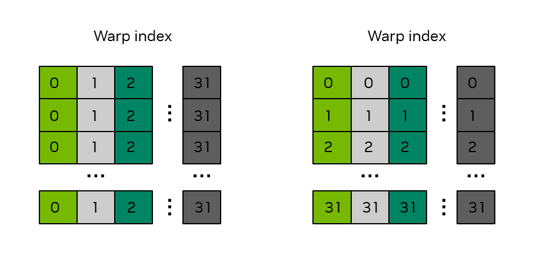

*图 17 32 × 32 共享内存数组的存储体结构。方框中的数字表示线程束索引，颜色表示各共享内存位置所属的存储体。*

返回到 [第2.3.4.2.1节](#section-2-3-4-2-1) 的示例，可以检查共享内存的用法来确定存储体冲突是否存在。共享内存的第一次使用是来自全局内存的数据存储到共享内存时：

**C++**

```cpp
smemArray[threadIdx.x][threadIdx.y] = a[INDX( tileRow + threadIdx.y, tileCol + threadIdx.x, m )];
```

**Python**

```python
smemArray[(cuda.threadIdx.x, cuda.threadIdx.y)] = a[(tile_row + cuda.threadIdx.y, tile_col + cuda.threadIdx.x)]
```

由于数组按行优先顺序存储，同一线程束中 `threadIdx.x` 连续的线程会以 32 个元素为步长访问 `smemArray`，因为 `threadIdx.x` 是该数组的第一个索引。这会产生 32 路存储体冲突，如[图 17](#section-2-3-4-2-2)左图所示。

共享内存的第二个用法是将来自共享内存的数据写回全局内存时：

**C++**

```cpp
c[INDX( tileCol + threadIdx.y, tileRow + threadIdx.x, m )] = smemArray[threadIdx.y][threadIdx.x];
```

**Python**

```python
c[(tile_col + cuda.threadIdx.y, tile_row + cuda.threadIdx.x)] = smemArray[(cuda.threadIdx.y, cuda.threadIdx.x)]
```

在这种情况下，由于 `threadIdx.x` 是 `smemArray` 数组中的第二个索引，因此同一线程束中的连续线程将以 1 元素的步长访问 `smemArray`。这会导致没有存储体冲突，并由 [图 17](#section-2-3-4-2-2) 的右侧面板进行说明。

如 [第2.3.4.2.1节](#section-2-3-4-2-1) 中所示的矩阵转置内核具有一种没有存储体冲突的共享内存访问和一种具有 32 路存储体冲突的访问。避免存储体冲突的常见修复方法是通过向数组的列维度加 1 来填充共享内存，如下所示：

**C++**

```cpp
__shared__ float smemArray[THREADS_PER_BLOCK_X][THREADS_PER_BLOCK_Y+1];
```

**Python**

```python
smemArray = cuda.shared.array(shape=(32, 32 + 1), dtype=np.float32)
```

对 `smemArray` 声明的这一微小调整将消除存储体冲突。为了说明这一点，考虑 [图 18](#section-2-3-4-2-2)，其中共享内存数组已被声明为大小为 32 x 33。可以观察到，无论同一线程束中的线程是沿着整列还是跨整行访问共享内存数组，存储体冲突都会被消除，即相同线程束访问位置中的线程具有不同的颜色。


*图 18 32 × 33 共享内存数组的存储体结构。方框中的数字表示线程束索引，颜色表示各共享内存位置所属的存储体。*

### 2.3.5. 原子操作

高性能 CUDA 内核需要尽可能充分地表达算法中的并行性。GPU 内核执行的异步特性要求各线程尽量独立工作，但线程不可能始终完全独立；如[共享内存](#section-2-3-3-2)一节所示，同一线程块中的线程可以通过相应机制交换数据并进行同步。

在整个网格的级别上，没有这样的机制来同步网格中的所有线程。然而，有一种机制可以通过使用原子函数来提供同步对全局内存位置的访问。原子函数允许线程获取全局内存位置上的锁，并在该位置上执行读取-修改-写入操作。当持有锁时，其他线程不能访问同一位置。

#### 2.3.5.1. C++ `std::atomic` 风格的原子操作

在 C++ 中， CUDA 提供与名称类似的 C++ 标准库原子 `cuda::std::atomic` 和 `cuda::std::atomic_ref` 类似的语法和行为。 CUDA 还提供扩展的 C++ 原子 `cuda::atomic` 和 `cuda::atomic_ref`，允许用户指定原子操作的 [线程作用域](#section-3-2-3)。 [原子函数](#section-5-4-5) 中介绍了原子函数的详细信息。

使用 `cuda::atomic_ref` 执行设备范围原子加法的示例如下，其中 `array` 是浮点数组，`result` 是指向全局内存中的位置的浮点指针，该位置是存储数组总和的位置。

**C++**

```cpp
__global__ void sumReduction(int n, float *array, float *result) {
...
tid = threadIdx.x + blockIdx.x * blockDim.x;

cuda::atomic_ref<float, cuda::thread_scope_device> result_ref(result);
result_ref.fetch_add(array[tid]);
...
}
```

应谨慎使用原子函数，因为它们强制执行线程同步，这可能会影响性能。

#### 2.3.5.2. Python 中的内存原子操作

在 Python 中，原子内存操作由 `numba.cuda.atomic` 命名空间中的 GPU 代码可用的函数提供。可用的典型操作包括 `add`、 `sub`、 `max`、 `min` 和 `compare_and_swap`。支持的原子操作的完整列表可在 [Numba CUDA 文档](https://numba.pydata.org/numba-doc/dev/cuda/intrinsics.html) 中找到。

以下代码给出了一个使用原子内存访问计算数组全部元素之和的内核示例。每个线程块先把数组的一部分加载到共享内存，再由该线程块中的一个线程计算局部和，并对结果数组 `s` 执行原子加法。由于数据位于靠近 SM 计算资源的共享内存中，即使仅由一个线程求和，通常仍能获得合理的性能。

**Python**

```python
import numpy as np
from numba import cuda
import cupy as cp

@cuda.jit
def sum_reduce(a, s):
    ## create a shared array to support a block size up to 512 threads
    ## even though we'll use fewer in this example
    shared_staging = cuda.shared.array(shape=512, dtype=np.float32)

    ## Load values into shared memory and then synchronize to make sure all loads completed
    shared_staging[cuda.threadIdx.x] = a[cuda.blockIdx.x*cuda.blockDim.x + cuda.threadIdx.x]
    cuda.syncthreads()

    ## only thread 0 of each block does the local additions, followed by a single
    ## atomic operation per thread block
    local_sum = float(0.0)
    if cuda.threadIdx.x == 0:
        for i in range(cuda.blockDim.x):
            local_sum = local_sum + shared_staging[i]
        cuda.atomic.add(s, 0, local_sum)
    

array_length = 2**18

a = cp.ones(array_length)
s = cp.zeros(1, dtype=np.float32)

block_size = 256
grid_size = int(array_length/block_size)
sum_reduce[grid_size, block_size](a, s)

s_host = cp.asnumpy(s)
print(f"Sum is {int(s_host[0])}, expected {array_length}")
```

在这个简单的示例中，输入数组全为 1，因此正确的总和与 `array_length` 相同。

如果线

```cpp
cuda.atomic.add(s, 0, local_sum)
```

相反是非原子添加

```cpp
s[0] = s[0] + local_sum
```

此时对 `s[0]` 的访问不再是原子的，`s[0]` 的最终值将小于 `array_length`。而且，该值可能每次运行都不同，在 SM 数量不同的 GPU 上也可能不同。这说明该代码必须使用原子内存访问才能保证正确性。

> [!NOTE]
> **说明**
> 该示例虽然功能完整，但并非用于展示如何编写达到峰值性能的 GPU 归约操作。NVIDIA 的 [CUDA 核心计算库（CCCL）](https://github.com/nvidia/cccl)为包括归约在内的多种操作提供了高性能原语。为兼顾开发效率与性能，开发者应优先使用这些经过充分调优的实现，而不是重新实现相同算法。Python 可通过 [`cuda.coop` 包](https://nvidia.github.io/cccl/unstable/python/coop.html)使用这些原语。

C++ 中也提供了类似的原子，这在 [第5.4.5.1节](#section-5-4-5-1) 中进行了讨论，但建议使用 `std::atomic` -like 原子，并且在 CUDA C++ 中被认为是最佳实践。

### 2.3.6. 协作组

[协作组](#section-4-4)是 CUDA C++ 提供的软件工具，使应用程序能够定义可相互同步的线程组，即使这些线程跨越多个线程块、单个 GPU 上的多个网格，甚至多个 GPU。CUDA 编程模型通常允许线程块或线程块簇内的线程高效同步，但本身既不提供指定小于线程块或簇的线程组的机制，也不提供跨线程块同步的机制或保证。

协作组通过软件提供上述两类能力。它允许应用程序创建跨越线程块和簇边界的线程组，但也会带来一定的语义约束和性能影响，详见[协作组](#section-4-4)专题。

### 2.3.7. 内核启动和占用率

启动 CUDA 内核时，CUDA 线程会根据启动配置组织为线程块和网格。内核启动后，调度器将线程块分配给各 SM。应用程序既不能控制或查询某个线程块具体在哪个 SM 上执行，调度器也不保证任何执行顺序；因此，程序的正确性不能依赖特定的调度顺序或调度方案。

一个 SM 能调度多少线程块，取决于给定线程块所需的硬件资源以及该 SM 的可用资源。内核启动后，调度器开始把线程块分配给各 SM；只要某个 SM 仍有未被其他线程块占用的足够资源，调度器就可继续向其分配线程块。如果暂时没有任何 SM 能接纳新的线程块，调度器会等待，直到某个 SM 完成先前分配的线程块并释放资源，再继续分配工作。该过程持续到所有线程块均已调度并执行完毕。

`cudaGetDeviceProperties` 函数允许应用程序通过 [设备属性](https://docs.nvidia.com/cuda/cuda-runtime-api/structcudaDeviceProp.html#structcudaDeviceProp) 查询每个 SM 的限制。说明每个 SM 和每个线程块有限制。

- `maxBlocksPerMultiProcessor`：每个 SM 的最大驻留块数。
- `sharedMemPerMultiprocessor`：每个 SM 可用的共享内存数量（以字节为单位）。
- `regsPerMultiprocessor`：每个 SM 可用的 32 位寄存器的数量。
- `maxThreadsPerMultiProcessor`：每个 SM 的最大驻留线程数。
- `sharedMemPerBlock`：线程块可以分配的共享内存的最大数量（以字节为单位）。
- `regsPerBlock`：线程块可以分配的 32 位寄存器的最大数量。
- `maxThreadsPerBlock`：每个线程块的线程的最大数量。

CUDA 内核的占用率是活动线程束数量与 SM 支持的最大活动线程束数量的比率。一般来说，最好将占用率设置得尽可能高，这样可以隐藏延迟并提高性能。

为了计算占用率，需要知道刚才描述的 SM 的资源限制，并且需要知道所讨论的 CUDA 内核需要什么资源。要确定每个内核的资源使用情况，在程序编译期间，可以使用 `--resource-usage` [选项](https://docs.nvidia.com/cuda/cuda-compiler-driver-nvcc/index.html#resource-usage-res-usage) 到 `nvcc`，这将显示内核所需的寄存器和共享内存的数量。

为了进行说明，请考虑计算能力 10.0 等设备，其设备属性在 [表 2](#section-2-3-7) 中枚举。

**表 2 SM 资源示例**

| 资源 | 价值 |
| --- | --- |
| `maxBlocksPerMultiProcessor` | 32 |
| `sharedMemPerMultiprocessor` | 233472 |
| `regsPerMultiprocessor` | 65536 |
| `maxThreadsPerMultiProcessor` | 2048 |
| `sharedMemPerBlock` | 49152 |
| `regsPerBlock` | 65536 |
| `maxThreadsPerBlock` | 1024 |

如果内核作为 `testKernel<<<512, 768>>>()` 启动，即每个块 768 线程，则每个 SM 一次只能执行 2 个线程块。调度程序无法为每个 SM 分配超过 2 个线程块，因为 `maxThreadsPerMultiProcessor` 为 2048。因此占用率将为 (768 * 2) / 2048，即 75%。

如果以内核配置 `testKernel<<<512, 32>>>()` 启动，即每个线程块 32 个线程，则每个 SM 不会触及 `maxThreadsPerMultiProcessor` 限制；但由于 `maxBlocksPerMultiProcessor` 为 32，调度器最多只能向每个 SM 分配 32 个线程块。因此，SM 上的驻留线程总数为 32 个块 × 每块 32 个线程，即 1024 个线程。计算能力 10.0 的 SM 最多可驻留 2048 个线程，所以本例的占用率为 1024 / 2048，即 50%。

使用共享内存可以完成相同的分析。例如，如果内核使用 100KB 的共享内存，则调度程序将只能为每个 SM 分配 2 个线程块，因为该 SM 上的第三个线程块将需要另外 100KB 共享内存总共 300KB，超过每个 SM 可用的 233472 字节。

每个块的线程和每个块的共享内存使用情况由程序员显式控制，并且可以进行调整以实现所需的占用率。程序员对寄存器使用的控制有限，因为编译器和运行时将尝试优化寄存器使用。然而，程序员可以通过 `--maxrregcount` [选项](https://docs.nvidia.com/cuda/cuda-compiler-driver-nvcc/index.html#maxrregcount-amount-maxrregcount) 到 `nvcc` 指定每个线程块的最大寄存器数量。如果内核需要的寄存器多于指定数量，则内核可能会溢出到局部内存，这将改变内核的性能特征。在某些情况下，即使发生溢出，限制寄存器也允许调度更多的线程块，这反过来会增加占用率并可能导致性能的净提高。

---

## 2.4. 编写 Tile 内核

*英文原题：Writing Tile Kernels*  
*官方原文：[https://docs.nvidia.com/cuda/cuda-programming-guide/02-basics/writing-tile-kernels.html](https://docs.nvidia.com/cuda/cuda-programming-guide/02-basics/writing-tile-kernels.html)*

CUDA Tile 提供了一种不同于前文 SIMT（单指令多线程）模型的 GPU 内核编写方式。Tile 编程允许程序员以另一种方式表达并行性，把最底层的并行工作交给编译器和内置操作处理，从而更方便地使用 NVIDIA GPU 的最新高性能功能，例如[张量内存加速器（TMA）](#section-4-11-2-2)单元和 Tensor Core。

- Python 可通过 cuTile Python 包 `cuda.tile` 使用 CUDA Tile 编程。
- CUDA Tile C++ 可在 CUDA 工具包中从 13.3 版本开始使用。

围绕 Tile 内核执行分配设备内存、在主机和设备之间传输数据以及排序内核启动等任务的应用程序代码与前面针对 SIMT 内核描述的章节相同。 Tile 内核在使用标准 CUDA API 分配的全局内存上运行，其结果以相同的方式复制回主机。唯一改变的是程序员在内核本身内部编写代码的内容。

在 SIMT 内核中，程序员根据单个线程进行思考：计算全局线程索引、加载线程的元素、对它们执行操作并存储结果。在 Tile 内核中，程序员在整个块的级别上思考：加载许多元素的 Tile，对整个 Tile 执行操作，并存储结果。编译器负责将 Tile 操作映射到每个块的硬件线程，这是 SIMT 程序员显式处理的问题。

本章专门讨论这种差异：如何编写内核入口点和其中的 Tile 操作。每个模式都在 CuTile Python ( `cuda.tile` ) 和 CUDA Tile C++ ( `cuda::tiles` ) 中进行演示，它们共享一个公共的编译器后端 (CUDA Tile IR) 因此共享相同的执行语义。

按照惯例，Tile API 在两种语言中都是 `ct` 的别名。

- Python 中使用 `import cuda.tile as ct`
- C++ 中的 `namespace ct = cuda::tiles`

在 Python 中，Tile API 位于如上所示导入的模块 `cuda.tile` 中。

> [!NOTE]
> **原文勘误**
> Release 13.3 原文此处将 Python 模块写成 `cuda.tiles`，但本节给出的实际包名和导入语句均为 `cuda.tile`。上文已按真实 API 名称更正。

在 C++ 中，Tile API 位于 `cuda::tiles` 命名空间中，该命名空间由头文件 `cuda_tile.h` 公开。

```cuda
#include "cuda_tile.h"
namespace ct = cuda::tiles;
```

以下代码片段中的 `ct.` / `ct::` 前缀指的是您正在阅读的任何语言中的 Tile API。

### 2.4.1. 内核和函数声明

Tile 内核是 GPU 入口点，在启动网格中的每个块上执行一次。Tile 函数可由 Tile 内核或另一个 Tile 函数调用，但其自身不是入口点。与 SIMT 内核一样，主机代码不能直接调用 Tile 内核，而必须[启动它](#section-2-4-2)。

在 CUDA Tile C++ 中：

- `__tile_global__` 是 `__global__` 的 Tile 类似物，并标记 Tile 内核入口点
- `__tile__` 是 `__device__` 的 Tile 对应项，表示应为 GPU 编译、并可由其他 `__tile__` 或 `__tile_global__` 函数调用的函数。

数组和标量参数的传递方式与 SIMT 内核中的传递方式相同。 Tile 代码和 SIMT 代码可以共存：单个 `.cu` 文件可以定义 `__tile_global__` 和 `__global__` 内核，并且单个主机程序可以启动这两者。

> [!NOTE]
> **说明**
> 目前，`__tile__` 函数无法从 `__global__` 或 `__device__` 函数调用。同样，`__device__` 函数不能从 `__tile_global__` 或 `__tile__` 函数调用。在 CUDA 的未来版本中可能会取消此限制。

在 cuTile Python 中：

- `@ct.kernel` 装饰器将函数标记为 Tile 内核入口点
- `@ct.function` 装饰器标记可从 Tile 内核或另一个 Tile 函数调用的函数。

实际上，从内核调用的任何函数都会自动编译为 Tile 代码，因此 `@ct.function` 装饰器是可选的。数组参数接受任何公开 DLPack 或 CUDA 数组接口的设备驻留数组。例如，PyTorch 张量和 CuPy 数组。标量参数直接传递。

**C++**

```cuda
#include "cuda_tile.h"

// Tile kernel entry point. Cannot be called directly; must be launched.
__tile_global__ void my_kernel(float* a, float* b, float* c) {
    ...
}

// Tile function. Callable from tile kernels and tile functions.
__tile__ float helper(float x, float y) {
    return x + y;
}
```

**Python**

```python
import cuda.tile as ct

# Tile kernel entry point. Cannot be called directly; must be launched.
@ct.kernel
def my_kernel(a, b, c):
    ...

# Tile function. Callable from tile kernels and tile functions.
# @ct.function is optional, any function called from tile code
# is automatically compiled as tile code.
@ct.function
def helper(x, y):
    return x + y
```

### 2.4.2. 启动内核

Tile 内核在 Tile 块的网格上启动，就像 SIMT 内核在线程块的网格上启动一样。程序员指定网格形状，最多三个维度。从程序员的角度来看，每个 Tile 块都由单个逻辑线程执行。块内的并行性由编译器管理。

在 C++ 中，Tile 内核沿用 SIMT 熟悉的三重尖括号启动语法。第一个尖括号参数是网格形状（Tile 块数量）；第二个参数在 SIMT 中表示每块线程数，而 Tile 内核的线程数由编译器在内部确定，因此第二个参数 **必须为** `1`。Tile 内核同时也是普通 CUDA 内核，所以可通过运行时现有的 `cudaLaunchKernel` 和 `cudaLaunchKernelEx` API，使用同样的 `grid, 1` 配置启动。这有利于把 Tile 内核集成到已经通过这些 API 驱动内核启动的代码库中。

在 Python 中，`ct.launch` 采用四个位置参数：CUDA 流、指定每个维度中 Tile 块数量的网格元组、内核对象和元组内核参数。

**C++**

```cuda
my_kernel<<<dim3(num_blocks_x, num_blocks_y), 1>>>(a, b, c);  // second arg must be 1
```

**Python**

```python
import torch

stream = torch.cuda.current_stream()     # CUDA stream object
grid = (num_blocks_x, num_blocks_y, 1)   # tile-block grid (x, y, z)
ct.launch(stream, grid, my_kernel, (a, b, c))
```

#### 2.4.2.1. 网格大小模式

一种常见的模式是启动足够的块来覆盖整个数组，包括可能在一维或多维上超过数组大小的最终块。

**C++**

```cuda
int num_blocks = (N + tile_size - 1) / tile_size;   // ceil division -> covers partial tail
kernel<<<num_blocks, 1>>>(in, out, N);
```

**Python**

```python
import math

grid = (math.ceil(N / TILE),)   # ceil division -> covers partial tail
ct.launch(stream, grid, my_kernel, (arr_in, arr_out, TILE))
```

处理数组大小不能完全被 Tile 大小整除的情况将在 [第2.4.6节](#section-2-4-6) 的小节中讨论。

### 2.4.3. 查询线程块位置

每个块都需要知道它在网格中的位置，以便确定要处理数据的哪一部分。在 SIMT 中，程序员结合`blockIdx`和`threadIdx`来计算全局线程索引。在 Tile 代码中，只需要块索引。编译器处理块内的所有线程级索引。

在 C++ 中，`ct::bid()` 返回包含所有三个维度的块索引的 `uint3`。 `ct::num_blocks()` 返回 `dim3`，其中包含每个维度中的块总数（由内核启动参数确定）。通过 `.x`、`.y`、`.z` 访问各个组件。

在 Python 中，`ct.bid(axis)` 将当前块沿给定轴（0、1 或 2）的索引作为 `int32` 标量返回。 `ct.num_blocks(axis)` 返回沿该轴的块总数 - 对于边界检查和循环计数很有用。

**C++**

```cuda
#include "cuda_tile.h"

__tile_global__ void my_kernel(float* a, float* b, float* c) {
    namespace ct = cuda::tiles;
    int bid_x = ct::bid().x;          // block index along .x
    int bid_y = ct::bid().y;          // block index along .y
    int num_x = ct::num_blocks().x;   // total blocks along .x
}
```

**Python**

```python
@ct.kernel
def my_kernel(a, b, c):
    bid_x = ct.bid(0)          # block index along axis 0
    bid_y = ct.bid(1)          # block index along axis 1
    num_x = ct.num_blocks(0)   # total blocks along axis 0
```

### 2.4.4. 创建 Tile

确定块的身份后，下一个问题是 Tile 内核实际操作什么。这就是 Tile：一个固定大小的多维标量元素数组，其形状和元素类型在编译时已知。Tile 的每个维度必须是 2 的幂。Tile 具有值语义：复制 Tile 会复制其元素，两个副本彼此完全独立。尽管如此，复制开销仍然很低，因为编译器控制 Tile 在硬件内部的表示方式；程序员无需为 Tile 分配或释放内存。

实际上，Tile 是通过从数组 ( [Tile-空间加载和存储](#section-2-4-6-1) ) 加载数据或使用生成用指定模式填充的 Tile 的工厂函数来创建的。

在 C++ 中， Tile 类型是显式的： `ct::tile<T, ct::shape<dims...>>`，其中 `T` 是元素类型，而 `ct::shape<dims...>` 将维度编码为模板参数（整数值是沿每个轴的编译时大小）。例如，`ct::tile<float, ct::shape<8>>` 是 8 个浮点的一维 Tile,`ct::tile<float, ct::shape<4, 4>>` 是 4×4 浮点 Tile。因为形状是类型的一部分，所以它在编译时始终是已知的。

工厂函数采用完整的 Tile 类型（下面的 `Tile`）作为模板参数：

- `ct::zeros<Tile>()` 和 `ct::ones<Tile>()` - Tile 用零或一填充。
- `ct::full<Tile>(val)` - Tile，其中每个元素都有值 `val`。
- `ct::iota<Tile>()` - Tile 包含 `(0, 1, ..., N-1)`，其中 `N` 是 Tile 的大小。

本章中的 C++ 示例使用 `using` 别名（例如 `using f32x4x4 = ct::tile<float, ct::shape<4, 4>>`），使 Tile 类型在调用点保持易读。

在 Python 中，Tile 工厂的 `shape` 元组和 `dtype` 参数都是编译时值。Python 字面量（如 `(64, 64)` 和 `ct.float32`）自然满足这一要求。也可以通过以 `Constant` 注解的内核参数提供这些值，如下文 [Python 常量](#section-2-4-5-1) 所示。生成的 Tile 通过 `.shape`、`.dtype` 和 `.ndim` 属性公开其编译时属性。

工厂的职能是：

- `ct.zeros(shape, dtype)` 和 `ct.ones(shape, dtype)` - Tile 用零或一填充。
- `ct.full(shape, fill_value, dtype)`——创建以任意常量值填充的 Tile。
- `ct.arange(size, dtype=...)` - 1-D Tile 包含 `[0, 1, ..., size-1]`。

**C++**

```cuda
#include "cuda_tile.h"

__tile__ void factories() {
    namespace ct = cuda::tiles;

    using i32x8   = ct::tile<int,   ct::shape<8>>;      // 1-D: 8 ints
    using f32x4x4 = ct::tile<float, ct::shape<4, 4>>;   // 2-D: 4x4 floats

    auto z      = ct::zeros<f32x4x4>();       // all zeros
    auto o      = ct::ones<f32x4x4>();        // all ones
    auto filled = ct::full<f32x4x4>(3.14f);   // all 3.14
    auto seq    = ct::iota<i32x8>();          // {0, 1, 2, 3, 4, 5, 6, 7}
}
```

**Python**

```python
import cuda.tile as ct

@ct.function
def factories():
    zeros  = ct.zeros((64, 64), dtype=ct.float32)            # 64x64 tile of 0.0
    ones   = ct.ones((128,), dtype=ct.float16)               # 128-element tile of 1.0
    filled = ct.full((32, 32), 3.14, dtype=ct.float32)       # 32x32 tile of 3.14
    seq    = ct.arange(8, dtype=ct.int32)                    # [0, 1, 2, 3, 4, 5, 6, 7]
```

### 2.4.5. 编译时常量

Tile 编译器为 Tile 形状、数据类型和其他结构参数的每种组合生成专用机器代码。因此，影响生成代码的值必须在编译时已知。也就是说，Tile 的形状和数据类型必须在编译时已知。 [创建 Tile](#section-2-4-4) 使用文字来指定 Tile 形状和数据类型： `ct.zeros((64, 64), dtype=ct.float32)` 和 `ct::tile<int, ct::shape<8>>`。

该形状还可以作为编译时已知值通过内核接口传递，如以下部分所示。

#### 2.4.5.1. Python `constant[T]`

内核参数上的 `ct.Constant[T]` 类型提示会将其标记为 *嵌入常量*。这意味着在内核中每次使用该参数，都等同于在相应位置直接写入其字面值。类型参数可省略；不带类型参数的 `ct.Constant` 可以嵌入任意类型的常量。`ct.Constant` 最常用于整数参数，例如以 `ct.Constant[int]` 驱动 Tile 形状和循环边界。

**Python**

```python
import cuda.tile as ct

@ct.kernel
def my_kernel(TILE: ct.Constant[int]):
    # TILE is constant-embedded: wherever TILE appears, the compiler sees its
    # literal value (e.g., 128) and generates specialized code. Here TILE drives
    # the shape of a factory-built tile.
    zeros = ct.zeros((TILE,), dtype=ct.float32)
```

#### 2.4.5.2. C++ `integral_constant` 与 `_ic` 字面量

在 CUDA Tile C++ 中，编译时值通过 `ct::integral_constant` 表示，该类型的数值在类型本身中进行编码。 `ct::literals` 命名空间中的 `_ic` 文字提供了简洁的简写：`0_ic` 生成 `ct::integral_constant<0>` 值。

采用编译时值的 API 接受非类型模板参数 (NTTP) 形式和 `_ic` 文字形式。例如，`ct::cat` 沿给定维度连接两个 Tile，并且该维度必须在编译时已知。下面两行使用相同的编译时轴调用 `ct::cat`；它们的区别仅在于编译时值的写入位置：

**C++**

```cuda
#include "cuda_tile.h"

__tile__ void concat_demo() {
    namespace ct = cuda::tiles;
    using namespace ct::literals;

    using T = ct::tile<int, ct::shape<4, 8>>;
    T lhs = ct::full<T>(0);
    T rhs = ct::full<T>(1);

    auto a = ct::cat<0>(lhs, rhs);     // NTTP form
    auto b = ct::cat(lhs, rhs, 0_ic);  // _ic form
}
```

`_ic` 字面量还经常出现在另一类场景中。`ct::extents` 和 `ct::shape` 都有 NTTP 形式（例如 `ct::extents<std::uint32_t, 4, 8>`）和大括号形式。与 NTTP 形式不同，大括号形式接受运行时值，因此当一个或多个维度只在启动时才已知时，应使用这种形式：编译时维度使用 `_ic` 字面量，运行时维度使用普通变量。`ct::tensor_span` 和 `ct::partition_view` 等 Tile 空间 API（见 [Tile 空间加载与存储](#section-2-4-6-1)）使用这种形式封装此类数组：

**C++**

```cuda
auto shape2d = ct::extents{8_ic, length};  // 8 is compile-time; length is runtime
```

`_ic` 文字是编译时值的统一简写，只要值形式 API 参数需要一个，例如 `ct::cat` 维度或 `extents` 或 `shape` 组件。

### 2.4.6. 加载和存储 Tile

正如[第1.2.2.3.1节](#section-1-2-2-3-1)首先介绍的，CUDA Tile 编程模型中有两个关键的内存对象：Tile 和数组。数组是全局内存中元素的多维容器，对 Tile 内核的所有块都可见。 Tile 也是元素的多维容器，但对于 CUDA Tile 代码的单个块而言是本地的。 Tile 通常是数组元素的子集。本节讨论从数组加载到 Tile 中，以便它们可以在 Tile 内核中使用，并将 Tile 存储回数组。

后续章节将介绍两种加载和存储 Tile 的方法

- [Tile-空间加载和存储](#section-2-4-6-1) 涵盖使用 Tile 空间索引的加载和存储，这些索引使用视图对象，这些视图对象规定了数组元素如何映射到 Tile 的可预测模式
- [聚集与分散](#section-2-4-6-2) 涵盖了加载和存储，它们使用索引或指针的 Tile 来指示数组的元素，该元素分别是加载或存储时 Tile 元素的源或目标

**性能说明**：在支持的硬件上，编译器可把 Tile 空间加载降低为张量内存加速器（TMA）操作，其速度显著高于逐元素聚集。（C++ 相关内容另见 [C++ 性能技巧](#section-2-4-12)。）

程序员必须决定越界元素在加载时取什么值。当使用屏蔽变体时，在 Python 和 C++ 中，越界写入会被默默丢弃。

#### 2.4.6.1. Tile 空间加载与存储

通过 Tile 空间加载，将创建一个视图对象，该对象指定如何将数组分区为 Tile 大小的区域的网格。这种映射称为 *Tile-空间* ,Tile 内核可以使用 Tile 空间索引一次加载或存储一个区域。

Tile 空间加载思想的核心是数组的 *平铺视图*，它指定如何将数组的元素映射到指定大小的 Tile。 [图 19](#section-2-4-6-1) 中显示的平铺视图是一个 *分区视图*，它是一个 Tile 空间，具有指定大小的非重叠 Tile,Tile 之间没有间隙。

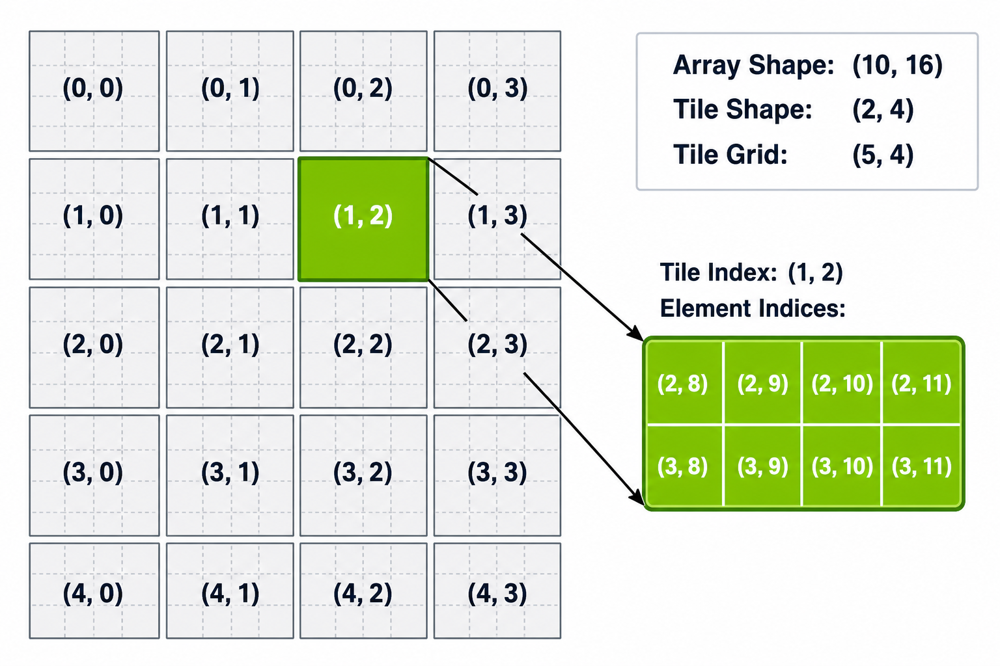

*图 19 Tile 分区视图的空间索引。将形状 (10, 16) 的二维数组划分为形状 (2, 4) 的 Tile，生成形状 (5, 4) 的 Tile 网格。每个单元显示其 Tile 空间索引 (i, j)。 Tile 空间索引 (1, 2) 处的突出显示区域涵盖元素索引 (2, 8) 到 (3, 11)。*

当数组维度不能完全整除为 Tile 时，在一维或多维中跨越数组边界的 Tile 将被部分填充。程序员可以指定加载这些 Tile 时的行为，这将在 [第2.4.6.1.3节](#section-2-4-6-1-3) 中介绍。

> [!NOTE]
> **说明**
> 此处的示例和说明使用分区视图来说明 Tile 空间加载和存储，因为这是 CUDA Tile 代码中支持的第一个视图类型。其他视图类型预计会在 CUDA Tile 的后续版本中添加。

##### 2.4.6.1.1. 使用分区视图加载与存储

结构化 Tile 空间加载是在全局内存与 Tile 之间移动数据的首选方式。内核必须先构建定义 Tile 空间的视图对象，再按 Tile 空间索引逐个加载或存储 Tile。

在 C++中，分区视图的构造分为两步：

- `ct::tensor_span` - 将原始指针与 `ct::extents` 配对，为指针提供多维结构。
- `ct::partition_view` - 将跨度划分为固定大小 Tile 的网格并公开在 Tile 空间坐标中操作的 `.load(idx...)` / `.store(tile, idx...)` 方法。

在 Python 中，`Array.tiled_view(tile_shape)` 返回一个 `TiledView`，它将数组划分为给定形状的 Tile。该视图公开采用 Tile 空间索引的 `.load(index)` / `.store(index, tile)` 方法，直接镜像 C++ `partition_view`。

> [!NOTE]
> **说明**
> 本章中的 C++ 示例代码使用 `__restrict__` 注解指针参数，并在内核主体开头附近调用 `ct::assume_aligned(ptr, 16_ic)`。这些都是重要的性能注解，[第 2.4.12 节](#section-2-4-12) 将进一步介绍。数字字面量上的 `_ic` 后缀（例如 `128_ic`、`8_ic`）将其标记为编译时常量，如 [编译时常量](#section-2-4-5) 中所述。

**C++**

```cuda
__tile_global__ void vec_add(float* __restrict__ a, float* __restrict__ b, float* __restrict__ out) {
    namespace ct = cuda::tiles;
    using namespace ct::literals;

    a   = ct::assume_aligned(a,   16_ic);
    b   = ct::assume_aligned(b,   16_ic);
    out = ct::assume_aligned(out, 16_ic);

    // Step 1: attach a shape to each raw pointer. 128_ic marks 128 as a compile-time constant.
    auto aSpan = ct::tensor_span{a,   ct::extents{128_ic}};
    auto bSpan = ct::tensor_span{b,   ct::extents{128_ic}};
    auto oSpan = ct::tensor_span{out, ct::extents{128_ic}};

    // Step 2: partition each span into a tile space of fixed 8-element tiles.
    auto aView = ct::partition_view{aSpan, ct::shape{8_ic}};
    auto bView = ct::partition_view{bSpan, ct::shape{8_ic}};
    auto oView = ct::partition_view{oSpan, ct::shape{8_ic}};

    int  bx    = ct::bid().x;             // this block's tile-space index along .x
    auto aTile = aView.load(bx);          // pick the bx-th tile of a
    auto bTile = bView.load(bx);
    oView.store(aTile + bTile, bx);       // write the tile back at the bx-th position of out
}
```

**Python**

```python
@ct.kernel
def vec_add(a, b, c, TILE: ct.Constant[int]):
    a_view = a.tiled_view((TILE,))
    b_view = b.tiled_view((TILE,))
    c_view = c.tiled_view((TILE,))

    bid = ct.bid(0)
    a_tile = a_view.load((bid,))
    b_tile = b_view.load((bid,))
    c_view.store((bid,), a_tile + b_tile)
```

##### 2.4.6.1.2. Python 单次调用加载与存储

Python 另外提供了一种一次性调用形式，该形式在每次加载和存储时采用内联 Tile 形状，而无需显式视图对象。 `ct.load(array, index, shape)` 在给定的 Tile 空间索引处读取给定形状的 Tile。 `ct.store(array, index, tile)` 是对应的写入。

`ct.load` / `ct.store` 与 `Array.tiled_view` 表达相同的 Tile 空间访问模式，区别在于 Tile 形状的指定位置。使用 `Array.tiled_view` 时，Tile 形状只需与视图对象绑定一次；使用 `ct.load` / `ct.store` 时，则在每次调用中直接给出 Tile 形状。若多个加载和存储会复用同一种分区方式，应优先使用 `tiled_view`；若只执行一次加载或存储，使用 `ct.load` / `ct.store` 通常更简洁。

**Python**

```python
@ct.kernel
def vec_add(a, b, c, TILE: ct.Constant[int]):
    bid = ct.bid(0)                                    # this block's tile-space index along axis 0
    a_tile = ct.load(a, index=(bid,), shape=(TILE,))   # (index, shape) = pick the bid-th TILE-sized region of a
    b_tile = ct.load(b, index=(bid,), shape=(TILE,))
    ct.store(c, index=(bid,), tile=a_tile + b_tile)    # write the tile back to the bid-th region of c
```

##### 2.4.6.1.3. Tile 空间边界处理

在 C++中，`partition_view`提供了未屏蔽和屏蔽的变体：

- `.load(idx...)` / `.store(tile, idx...)` 假设 Tile 完全在界内。部分越界访问是未定义的行为。
- 
    **`.load_masked(idx...)` / `.store_masked(tile, idx...)` 安全地处理部分边缘 Tile。**
    
    - `.load_masked()` 出界位置默认补零；可以选择替代填充模式（例如浮点数 Tile 的 NaN）。
- `.store_masked()` 静默丢弃越界写入。

当数组可被 Tile 大小整除时，首选使用未屏蔽的加载和存储变体。当必须处理边界条件时，即使对于完全填充的 Tile 也可以使用屏蔽变体。

这也是指南中第一个数组维度为运行时值的 C++ 示例。 `ct::extents{N}` 接受运行时维度，并且 `ct::extents` 支持编译时 ( `_ic` ) 和运行时值的任意组合，因此跨度和分区视图可以包装其大小仅在内核启动处已知的数组。

在 Python 中，`ct.load` 接受 `padding_mode` 参数，该参数控制越界元素接收的值。两种常用的模式是：

- `PaddingMode.ZERO` - 越界元素用零填充。
- `PaddingMode.UNDETERMINED`(默认值)- 越界元素值留给实现。当程序员知道 Tile 完全在界内时，这是合适的。

对于存储，`ct.store` 始终静默丢弃对越界位置的写入，不需要 `padding_mode` 参数。相同规则也适用于 `tiled_view`；它在创建视图时确定 `padding_mode`。

**C++**

```cuda
__tile_global__ void edge_safe(float* __restrict__ in, float* __restrict__ out, int N) {
    namespace ct = cuda::tiles;
    using namespace ct::literals;

    in  = ct::assume_aligned(in,  16_ic);
    out = ct::assume_aligned(out, 16_ic);

    // ct::extents{N} uses a runtime dimension; 128_ic stays compile-time.
    auto inView  = ct::partition_view{ct::tensor_span{in,  ct::extents{N}}, ct::shape{128_ic}};
    auto outView = ct::partition_view{ct::tensor_span{out, ct::extents{N}}, ct::shape{128_ic}};

    int  bx   = ct::bid().x;
    auto tile = inView.load_masked(bx);    // masked load: OOB lanes default to 0
    outView.store_masked(tile, bx);        // masked store: OOB writes silently discarded
}
```

**Python**

```python
@ct.kernel
def edge_safe(arr_in, arr_out, TILE: ct.Constant[int]):
    bid = ct.bid(0)
    tile = ct.load(arr_in, index=(bid,), shape=(TILE,),
                   padding_mode=ct.PaddingMode.ZERO)   # OOB lanes of a partial edge tile become 0
    ct.store(arr_out, index=(bid,), tile=tile)         # OOB writes are silently discarded
```

在 C++ 内核中，`.load_masked()` 和 `.store_masked()` 负责处理部分越界的边缘 Tile。在 Python 内核中，对加载使用 `PaddingMode.ZERO` 可确保这类 Tile 的越界元素补零，而 `ct.store` 会静默丢弃超出数组边界的写入。完整的填充模式、屏蔽选项和填充值集合参见各语言的 API 参考（[CUDA Tile C++ 视图填充](https://docs.nvidia.com/cuda/cuda-tile-cpp-api-reference/constant_wrappers_and_flags.html#view-padding)、[cuTile Python 填充模式](https://docs.nvidia.com/cuda/cutile-python/data.html#padding-modes)）。

从完全位于数组外部的 Tile 加载或存储是未定义的。这里讨论的边界处理仅适用于在一维或多维中部分出界的 Tile。

#### 2.4.6.2. 聚集与散布

[Tile 空间加载与存储](#section-2-4-6-1)中的 Tile 空间加载使用分区视图，为数组定义规则且按块对齐的分区。当访问模式不规则或依赖数据（例如查找表或排列）时，聚集与散布操作允许通过任意索引或地址，从数组中不规则、不连续的元素加载 Tile，或把 Tile 存储到这些位置。

聚集和分散操作在 C++ 和 Python 中看起来略有不同：

- Python 使用传递给 `ct.gather()` / `ct.scatter()` 的整数索引 Tile，并具有内置边界检查。
- C++ 把指针 Tile 传给 `ct::load()` / `ct::store()`；其屏蔽变体 `ct::load_masked()` 和 `ct::store_masked()` 接受布尔掩码 Tile，用于[处理数组边界处的 Tile](#section-2-4-6-2-1)。

在 C++ 中，通过形成指针的 Tile（每个元素一个指针）并将指针 Tile 传递给 `ct::load()` 或 `ct::store()` 来聚集和分散工作。标量指针和整数 Tile 之间的算术按元素执行，生成指针的 Tile。这是在 C++ 中构造聚集/分散索引 Tile 的标准习惯用法。

在 Python 中，`ct.gather` 加载索引 Tile 中每个索引处的元素。默认情况下，边界检查处于启用状态：越界索引返回一个填充值（默认为零，可通过 `padding_value=` 配置)，并且可以使用 `check_bounds=False` 禁用。 `ct.scatter` 每个索引存储一个值；越界写入会被默默丢弃。

**C++**

```cuda
__tile_global__ void vec_add_gather(int* __restrict__ a, int* __restrict__ b, int* __restrict__ out) {
    namespace ct = cuda::tiles;
    using namespace ct::literals;
    using i32x8 = ct::tile<int, ct::shape<8>>;

    a   = ct::assume_aligned(a,   16_ic);
    b   = ct::assume_aligned(b,   16_ic);
    out = ct::assume_aligned(out, 16_ic);

    int bx       = ct::bid().x;
    auto offsets = 8 * bx + ct::iota<i32x8>();   // element-level offsets, one per lane

    // scalar pointer + int tile = tile of pointers (one pointer per offset).
    auto aPtrs = a + offsets;
    auto bPtrs = b + offsets;

    auto aTile = ct::load(aPtrs);                // gather: one load per pointer
    auto bTile = ct::load(bPtrs);
    ct::store(out + offsets, aTile + bTile);     // scatter: one store per pointer
}
```

**Python**

```python
@ct.kernel
def vec_add_gather(a, b, c, TILE: ct.Constant[int]):
    bid = ct.bid(0)
    indices = bid * TILE + ct.arange(TILE, dtype=ct.int32)   # one element index per lane

    a_tile = ct.gather(a, indices)                           # load a[indices[i]] per lane
    b_tile = ct.gather(b, indices)
    ct.scatter(c, indices, a_tile + b_tile)                  # store one value per index into c
```

##### 2.4.6.2.1. 聚集与散布的边界处理

[聚集与分散](#section-2-4-6-2) 中引入的聚集/分散操作的边界处理遵循不同的规则。

在 Python 中，`ct.gather` 和 `ct.scatter` 默认提供边界安全性。越界读取返回填充值（默认为零），越界写入则被静默丢弃。当能够证明每个索引都在范围内时，可以禁用边界检查；此后若发生越界访问，其行为未定义。可选掩码与填充值选项参见 API 参考（[CUDA Tile C++ 加载操作](https://docs.nvidia.com/cuda/cuda-tile-cpp-api-reference/memory_operations.html#load-operations)、[cuTile Python 加载/存储操作](https://docs.nvidia.com/cuda/cutile-python/operations.html#load-store)）。

在 C++ 中，边界检查不是自动的。程序员构造一个布尔掩码（例如，通过将偏移量与数组长度进行比较）并将其传递给 `ct::load_masked` 或 `ct::store_masked` :

**C++**

```cuda
__tile_global__ void gather_safe(int* __restrict__ arr, int* __restrict__ out, int N) {
    namespace ct = cuda::tiles;
    using namespace ct::literals;
    using i32x8 = ct::tile<int, ct::shape<8>>;

    arr = ct::assume_aligned(arr, 16_ic);
    out = ct::assume_aligned(out, 16_ic);

    int bx       = ct::bid().x;
    auto offsets = 8 * bx + ct::iota<i32x8>();   // element-level offsets, one per lane
    auto mask    = offsets < N;                  // boolean tile: true where the offset is in-bounds

    auto ptrs = arr + offsets;                   // tile of pointers, one per offset
    auto tile = ct::load_masked(ptrs, mask, 0);  // masked lanes get the pad value 0
    ct::store_masked(out + offsets, tile, mask); // masked lanes are skipped on the store
}
```

### 2.4.7. 控制流

从程序员的角度来看，Tile 内核每个块遵循单个控制流路径。条件和循环边界中的标量值驱动控制流，而主体内的 Tile 操作则通过编译器分布在硬件线程上。

并非所有控制流构造都受支持。例如，Tile 代码中不允许从循环内部返回。有关限制的完整列表，请参阅每种语言的 API 参考（[CUDA Tile C++ 通用原理](https://docs.nvidia.com/cuda/cuda-tile-cpp-api-reference/general_principles.html)、 [cuTile Python 控制流程](https://docs.nvidia.com/cuda/cutile-python/execution.html#control-flow) )。

#### 2.4.7.1. 循环

一种常见的模式是从数组中迭代 Tile，依次处理每个数组。

在 C++ 中，`ct::irange` 是一个正向范围，表示从下限开始、以可选正步长递增且不包含上限的整数序列。使用 `ct::irange` 可向编译器提供迭代边界的结构化信息，以便更好地优化生成的代码。要应用这些优化，循环变量必须通过针对 `ct::irange` 的 range-for 表达式绑定。

在 Python 中，Tile 代码中均支持内置 `range()`、 `for`、 `while` 和嵌套循环。

步骤参数必须严格为正；不支持负步长范围。

以下单块内核对一维数组的所有 Tile 求和：

**C++**

```cuda
__tile_global__ void tile_sum(float* __restrict__ arr, float* __restrict__ out, int num_tiles) {
    namespace ct = cuda::tiles;
    using namespace ct::literals;
    using f32x8 = ct::tile<float, ct::shape<8>>;

    arr = ct::assume_aligned(arr, 16_ic);
    out = ct::assume_aligned(out, 16_ic);

    auto inView  = ct::partition_view{ct::tensor_span{arr, ct::extents{8 * num_tiles}},
                                      ct::shape{8_ic}};
    auto outView = ct::partition_view{ct::tensor_span{out, ct::extents{8_ic}},
                                      ct::shape{8_ic}};

    auto acc = ct::full<f32x8>(0.0f);
    // range-for over ct::irange gives the compiler structured iteration bounds.
    for (auto k : ct::irange(0, num_tiles)) {
        auto tile = inView.load(k);
        acc = acc + tile;                               // accumulate the k-th tile into acc
    }
    outView.store(acc, 0);                              // write the final result as the 0-th tile of out
}
```

**Python**

```python
@ct.kernel
def tile_sum(arr, out, TILE: ct.Constant[int], N_TILES: ct.Constant[int]):
    # Intended grid: (1,) -- a single block sums all tiles of arr.
    acc = ct.zeros((TILE,), dtype=ct.float32)
    for k in range(N_TILES):                            # range() works natively in tile code
        tile = ct.load(arr, index=(k,), shape=(TILE,))
        acc = acc + tile                                # accumulate the k-th tile into acc
    ct.store(out, index=(0,), tile=acc)                 # write the final result as the 0-th tile of out
```

#### 2.4.7.2. 条件分支

标准 `if` / `else` 条件正常工作。由于每个块遵循单个控制流路径，因此 [线程束内的分支分歧](#section-1-2-2-2) 的注意事项不适用于 Tile 内核。

**C++**

```cuda
__tile_global__ void conditional_load(float* __restrict__ arr, float* __restrict__ out, int N) {
    namespace ct = cuda::tiles;
    using namespace ct::literals;
    using f32x8 = ct::tile<float, ct::shape<8>>;

    arr = ct::assume_aligned(arr, 16_ic);
    out = ct::assume_aligned(out, 16_ic);

    auto inView  = ct::partition_view{ct::tensor_span{arr, ct::extents{N}}, ct::shape{8_ic}};
    auto outView = ct::partition_view{ct::tensor_span{out, ct::extents{N}}, ct::shape{8_ic}};

    int bx   = ct::bid().x;
    int nb_x = ct::num_blocks().x;

    auto tile = ct::full<f32x8>(0.0f);    // default for the last-block branch
    // Scalar condition -> one control-flow path per block; no divergence to reason about.
    if (bx < nb_x - 1) {
        tile = inView.load(bx);           // all blocks except the last
    }
    outView.store_masked(tile, bx);       // masked to handle a potentially partial final tile
}
```

**Python**

```python
@ct.kernel
def conditional_load(arr, out, TILE: ct.Constant[int]):
    bid = ct.bid(0)
    # Scalar condition -> one control-flow path per block; no divergence to reason about.
    if bid < ct.num_blocks(0) - 1:
        tile = ct.load(arr, index=(bid,), shape=(TILE,))    # all blocks except the last
    else:
        tile = ct.zeros((TILE,), dtype=ct.float32)          # last block: emit zeros
    ct.store(out, index=(bid,), tile=tile)
```

### 2.4.8. 逐元素算术和广播

Tile 支持标准的逐元素算术。当两个操作数具有兼容但不同的形状时，在执行操作之前广播较小的操作数以匹配。

#### 2.4.8.1. 广播

广播遵循 NumPy 语义：标量在 Tile 中重复，单例维度（长度 1）被拉伸以匹配其他操作数的相应维度，并且通过将缺失的前导维度视为单例，将较低等级的操作数与较高等级操作数的尾部维度对齐。如果两个相应的维度既非单一且不相等，则该操作是错误的。

下面的示例在一次加法中同时展示单例维度扩展与秩提升：形状为 8×2 的二阶 Tile 先提升为 1×8×2，再与形状为 4×1×2 的三阶 Tile 一起广播到公共形状 4×8×2。

**C++**

```cuda
auto x = ct::iota<ct::tile<int, ct::shape<8, 2>>>();      // 8x2   (rank 2)
auto y = ct::iota<ct::tile<int, ct::shape<4, 1, 2>>>();   // 4x1x2 (rank 3)
auto z = x + y;                                           // x promoted to 1x8x2, then broadcasts to 4x8x2
```

**Python**

```python
x = ct.full((8, 2),    3, dtype=ct.int32)   # 8x2   (rank 2)
y = ct.full((4, 1, 2), 5, dtype=ct.int32)   # 4x1x2 (rank 3)
z = x + y                                    # x promoted to 1x8x2, then broadcasts to 4x8x2
```

#### 2.4.8.2. 算术运算符

所有支持的算术运算符按元素应用于 Tile 并生成广播形状的新 Tile。与 Tile 组合的标量在每个元素上广播。当操作数类型不同时，保留更多信息的类型更受青睐：

- **Tile 与 Tile 组合**：结果是具有更大精度或范围的类型的 Tile。例如：
- `int + float` 的结果为 `float`
- `int16 + int32` 的结果为 `int32`
- **标量与 Tile 组合**：如果标量的类型可由 Tile 的元素类型精确表示（例如整数字面量 `2` 与 `int` Tile 组合，或 `2.0f` 与 `float` Tile 组合），运算就在 Tile 的元素类型中进行。如果标量必须窄化才能适配 Tile 的元素类型（例如字面量 `2.5` 与 `int` Tile 组合），两种语言的处理方式不同：
    - Python 将结果提升为可以同时容纳两者的类型
    - C++ 拒绝该表达式，因为它的格式不正确

下面的代码片段展示了两种语言对该标量与 Tile 组合的不同处理方式：

**C++**

```cuda
using i32x8 = ct::tile<int, ct::shape<8>>;
i32x8 x = ct::full<i32x8>(3);

x + 2;       // OK - int literal matches int tile element type
x + 2.5;     // ill-formed - 2.5 would narrow to int
```

**Python**

```python
x = ct.full((8,), 3, dtype=ct.int32)

x + 2          # int32 - int literal matches int32 tile dtype
x + 2.5        # float32 - result promoted to hold both
```

在实践中，如果可以的话，请在 Tile 的元素类型中写入标量文字，并在需要不同精度时显式转换。当操作数加载到 Tile 时，相同的规则适用于内核内部：

**C++**

```cuda
__tile_global__ void elementwise(float* __restrict__ a, float* __restrict__ b, float* __restrict__ out, int N) {
    namespace ct = cuda::tiles;
    using namespace ct::literals;

    a   = ct::assume_aligned(a,   16_ic);
    b   = ct::assume_aligned(b,   16_ic);
    out = ct::assume_aligned(out, 16_ic);

    auto aView = ct::partition_view{ct::tensor_span{a,   ct::extents{N}}, ct::shape{8_ic}};
    auto bView = ct::partition_view{ct::tensor_span{b,   ct::extents{N}}, ct::shape{8_ic}};
    auto cView = ct::partition_view{ct::tensor_span{out, ct::extents{N}}, ct::shape{8_ic}};

    int  bx = ct::bid().x;
    auto x  = aView.load(bx);
    auto y  = bView.load(bx);
    // 2.0f matches the float tiles' element type, so no narrowing conversion is required.
    // The scalar is broadcast across every element; + then runs elementwise.
    auto z  = 2.0f * x + y;
    cView.store(z, bx);
}
```

**Python**

```python
@ct.kernel
def elementwise(a, b, c, TILE: ct.Constant[int]):
    bid = ct.bid(0)
    x = ct.load(a, index=(bid,), shape=(TILE,))
    y = ct.load(b, index=(bid,), shape=(TILE,))
    # 2.0 is a loosely typed float constant; with float tiles, the result stays float.
    # Scalars are broadcast across every element of the tile, then + runs elementwise.
    z = 2.0 * x + y
    ct.store(c, index=(bid,), tile=z)
```

当您需要对舍入模式或次正规处理进行显式控制时，接受这些参数作为参数的 [数学函数](#section-2-4-9-5) (例如， `ct.add`、 `ct::add`）由 CUDA Tile API 提供。

### 2.4.9. Tile 基元

工厂函数（[创建 Tile](#section-2-4-4)）、加载与存储（[Tile 空间加载与存储](#section-2-4-6-1)），以及逐元素算术（[逐元素算术和广播](#section-2-4-8)）都是 *Tile 原语*，即语言本身提供的操作。程序员以 Tile 粒度编写这些操作，编译器再将其映射到硬件，包括可用时的 Tensor Core。本节介绍 CUDA Tile 提供的其他原语。

#### 2.4.9.1. 矩阵乘法

两个 Tile 的矩阵乘法，是实现两个数组间矩阵乘法的基本运算。CUDA Tile 为 Tile 提供两种矩阵乘形式：纯矩阵乘（matmul）`a @ b`，以及矩阵乘加（mma）`a @ b + acc`。在 mma 中，累加器把部分积从一个 K-Tile 传递到下一个 K-Tile，这对分块矩阵乘法的内层循环很有帮助。`matmul` 与 `mma` 均支持二维矩阵乘、三维批量矩阵乘，以及为操作数和累加器混用不同数据类型（精度）。关于秩与元素类型的约束，参见相应操作的 API 参考（[CUDA Tile C++ 矩阵乘法](https://docs.nvidia.com/cuda/cuda-tile-cpp-api-reference/matrix_multiplication.html)、[cuTile Python matmul](https://docs.nvidia.com/cuda/cutile-python/operations.html#matmul)）。

下面的内核采用一种常见模式：无论输入精度如何，都在 FP32 中累加，并在存储时转换为输出元素类型。Python 版本使用具有 FP32 类型 `acc` 的 `ct.mma(a, b, acc)`；C++ 版本使用显式 FP32 累加器类型的 `ct::mma(a, b, acc)`。K 循环迭代 `ceil(K / tk)` 次，以覆盖 A 的右边缘和 B 的下边缘；加载部分 K-Tile 时补零（Python 使用 `PaddingMode.ZERO`，C++ 使用 `.load_masked()`），C 的部分 M/N 边缘 Tile 则通过存储端丢弃越界写入来处理（Python 使用 `ct.store`，C++ 使用 `.store_masked()`）。

**C++**

```cuda
__tile_global__ void gemm(const __half* __restrict__ A, const __half* __restrict__ B, float* __restrict__ C,
                          std::size_t M, std::size_t K, std::size_t N) {
    namespace ct = cuda::tiles;
    using namespace ct::literals;
    using f32_acc = ct::tile<float, ct::shape<32, 32>>;

    A = ct::assume_aligned(A, 16_ic);
    B = ct::assume_aligned(B, 16_ic);
    C = ct::assume_aligned(C, 16_ic);

    constexpr auto tm = 32_ic;
    constexpr auto tn = 32_ic;
    constexpr auto tk = 16_ic;

    auto aView = ct::partition_view{ct::tensor_span{A, ct::extents{M, K}}, ct::shape{tm, tk}};
    auto bView = ct::partition_view{ct::tensor_span{B, ct::extents{K, N}}, ct::shape{tk, tn}};
    auto cView = ct::partition_view{ct::tensor_span{C, ct::extents{M, N}}, ct::shape{tm, tn}};

    auto [bx, by, bz] = ct::bid();
    auto acc = ct::full<f32_acc>(0.0f);                 // FP32 accumulator

    std::size_t num_k = (K + tk - 1) / tk;
    for (auto k : ct::irange(std::size_t{0}, num_k)) {
        acc = ct::mma(aView.load_masked(bx, k),         // zero-pad partial K-tile
                      bView.load_masked(k, by),
                      acc);                             // acc += a @ b
    }
    cView.store_masked(acc, bx, by);                    // drop OOB edge lanes
}
```

**Python**

```python
@ct.kernel
def gemm(A, B, C,
         tm: ct.Constant[int], tn: ct.Constant[int], tk: ct.Constant[int]):
    bx, by = ct.bid(0), ct.bid(1)
    num_k  = ct.num_tiles(A, axis=1, shape=(tm, tk))    # number of K-tiles

    acc = ct.full((tm, tn), 0, dtype=ct.float32)        # FP32 accumulator
    for k in range(num_k):
        a = ct.load(A, index=(bx, k), shape=(tm, tk),
                    padding_mode=ct.PaddingMode.ZERO)   # zero-pad partial K-tile
        b = ct.load(B, index=(k, by), shape=(tk, tn),
                    padding_mode=ct.PaddingMode.ZERO)
        acc = ct.mma(a, b, acc)                         # acc += a @ b

    ct.store(C, index=(bx, by), tile=acc.astype(C.dtype))  # cast + store
```

#### 2.4.9.2. 归约与扫描

归约是将 Tile 折叠为一个标量或一行标量的工具。计算 softmax 的分母、层范数的均值和方差或注意力评分的最大值都涉及归约操作。

需要首先理解的是结果形状。Python 默认移除归约轴（可通过 `keepdims=True` 将其保留为长度 1）；C++ 始终保留归约轴，从而维持 Tile 的秩。下面两个代码片段都沿轴 1 对 2 × 4 Tile 进行归约，输出形状清楚地体现了二者差异。

**C++**

```cuda
using namespace ct::literals;
using i32x2x4 = ct::tile<int, ct::shape<2, 4>>;

auto x = ct::iota<i32x2x4>();                         // [[0,1,2,3],[4,5,6,7]]
auto row_sums = ct::sum(x, 1_ic);                     // shape (2, 1) - axis kept
// row_sums == [[6], [22]]
```

**Python**

```python
x   = ct.arange(8, dtype=ct.int32).reshape((2, 4))    # [[0,1,2,3],[4,5,6,7]]
s   = ct.sum(x, axis=1)                               # shape (2,)    - axis dropped
s_k = ct.sum(x, axis=1, keepdims=True)                # shape (2, 1)  - axis kept
# s == [6, 22];  s_k == [[6], [22]]
```

扫描是归约的对应操作，会沿指定轴产生累积结果。例如，前缀和（`cumsum`）生成与输入维数相同的输出，其中某个索引处的值等于指定轴上截至并包含该索引的所有元素之和。各语言提供的完整操作集合参见 API 参考：[CUDA Tile C++ 归约与扫描](https://docs.nvidia.com/cuda/cuda-tile-cpp-api-reference/reductions_and_scans.html)、[cuTile Python 归约](https://docs.nvidia.com/cuda/cutile-python/operations.html#reduction)与[扫描](https://docs.nvidia.com/cuda/cutile-python/operations.html#scan)。

#### 2.4.9.3. 转置和排列

两个相关的原语重新排序 Tile 的轴而不触及其数据：`transpose` 交换前两个轴，`permute` 进行任意重新排序。它们出现在 Tile 的逻辑布局在操作之间必须改变的任何地方，例如实现 matmul 操作数的转置、交换注意力块中的行和列，或者在广播之前排列轴。

在 Python 中，对秩为 2 的 Tile 调用 `ct.transpose(x)` 会交换其两个轴；对于更高秩的 Tile，则需要显式提供 `axis0` / `axis1` 参数。`ct.permute(x, axes)` 接受轴索引元组。在 C++ 中，`ct::transpose(x)` 交换前两个维度并保留其余维度，`ct::permute(x, map)` 则接受描述新顺序的 `ct::dimension_map`。

**C++**

```cuda
using namespace ct::literals;
using t2d = ct::tile<int, ct::shape<2, 4>>;
using t3d = ct::tile<int, ct::shape<2, 2, 2>>;

auto tx = ct::iota<t2d>();
auto ty = ct::transpose(tx);                                     // shape (4, 2)

auto tz = ct::iota<t3d>();
auto tw = ct::permute(tz, ct::dimension_map{2_ic, 0_ic, 1_ic});  // axes (0,1,2) -> (2,0,1)
```

**Python**

```python
tx = ct.arange(8, dtype=ct.int32).reshape((2, 4))
ty = ct.transpose(tx)                                            # shape (4, 2)

tz = ct.arange(8, dtype=ct.int32).reshape((2, 2, 2))
tw = ct.permute(tz, (2, 0, 1))                                   # axes (0,1,2) -> (2,0,1)
```

#### 2.4.9.4. 逐元素选择

逐元素选择是条件表达式的 Tile 形式：给定一个布尔 Tile 和两个操作数 Tile，每个输出元素都根据对应的布尔值从两个操作数中择一。条件会广播到操作数形状；操作数类型必须兼容。各语言的精确规则参见 API 参考（[CUDA Tile C++ 选择](https://docs.nvidia.com/cuda/cuda-tile-cpp-api-reference/tile_operations.html#cuda-tiles-select)、[cuTile Python 选择](https://docs.nvidia.com/cuda/cutile-python/operations.html#selection)）。Python 写作 `ct.where(cond, x, y)`，C++ 写作 `ct::select(cond, lhs, rhs)`。

**C++**

```cuda
using namespace ct::literals;
auto cond = ct::iota<ct::tile<int, ct::shape<4>>>() < 2;   // {T, T, F, F}
auto t    = ct::full<ct::tile<float, ct::shape<4>>>( 1.0f);
auto f    = ct::full<ct::tile<float, ct::shape<4>>>(-1.0f);
auto r    = ct::select(cond, t, f);                        // {1, 1, -1, -1}
```

**Python**

```python
cond    = ct.arange(4, dtype=ct.int32) < 2                 # [T, T, F, F]
x_true  = ct.full((4,),  1.0, dtype=ct.float32)
x_false = ct.full((4,), -1.0, dtype=ct.float32)
result  = ct.where(cond, x_true, x_false)                  # [1, 1, -1, -1]
```

#### 2.4.9.5. 数学函数

常见的按元素数学运算可在 Tile 代码中作为 `ct` 命名空间中的函数使用：

- `add` , `sub` , `mul`
- `truediv` , `floordiv` , `cdiv`
- `mod`
- `pow`
- `exp` , `exp2` , `log` , `log2`
- `sqrt` , `rsqrt`
- `sin` , `cos` , `tan`
- `sinh` , `cosh` , `tanh`
- `minimum` , `maximum`
- `negative`
- `floor` , `ceil`

每个函数对输入 Tile 按元素应用其运算，并返回相同形状的 Tile。这些操作也适用于 Tile 代码中的标量。

有关支持的逐元素操作的确切详细信息和完整列表，请参阅 API 参考资料：

- [cuTile Python 数学运算](https://docs.nvidia.com/cuda/cutile-python/operations.html#math) .
- [CUDA Tile C++ 数学运算](https://docs.nvidia.com/cuda/cuda-tile-cpp-api-reference/math_operations.html) .

### 2.4.10. 原子内存操作

Tile 代码中有两种需要使用内存原子的情况：

- 在 *跨块争用* 中，每个块都会生成部分结果，并使用原子操作将其与全局内存位置中其他块的部分结果合并。
- 在 *块内竞争* 中，Tile 的多个元素被写入内存中的同一位置。

对 Tile 执行原子操作时，会对 Tile 的 *每个元素* 执行一次原子更新。逐元素操作是原子的，但整个调用并非单个原子操作；各元素原子操作的执行顺序未指定。

在 Python 中，原子操作通过数组索引寻址目标，约定与 `ct.gather` 和 `ct.scatter` 相同。可选参数用于控制边界检查、内存序和线程作用域。默认设置（启用边界检查、`ACQ_REL`、设备作用域）使普通调用只需传入数组、索引和更新值。`TiledView` 还以实例方法公开相同的原子操作（例如 `TiledView.atomic_add(index, update)`）；这些方法通过 Tile 空间索引寻址目标，不返回旧值，并会降低为 PTX 原子归约。当不需要旧值时，建议使用性能更好的 `TiledView` 形式。

在 C++ 中，原子操作接受一个指针及其对应值：对于单个位置，传入原始指针和标量；对于多个位置，传入指针 Tile 和值 Tile。内存序是在调用点指定的编译时类型标记，例如 `ct::memory_order_relaxed_t{}`。线程作用域也是同类类型标记，省略时默认具有系统范围的可见性。

#### 2.4.10.1. 跨块竞争

在下面的代码示例中，不同线程块会写入同一内存位置 `out`，因而产生跨线程块争用。如果不使用原子操作，并行运行这些线程块将得到错误结果。这里采用设备线程作用域（C++ 中为 `ct::thread_scope_device_t{}`；Python 的线程作用域默认即为设备作用域），因为内存操作的结果必须对设备上运行的所有线程块可见。Python 内核使用 `TiledView.atomic_add`，是因为每个线程块的局部和只需累加到 `out[0]`，无需取得或保留该位置的先前值。

**C++**

```cuda
__tile_global__ void block_sum(int* __restrict__ arr, int* __restrict__ out, std::size_t N) {
    namespace ct = cuda::tiles;
    using namespace ct::literals;
    constexpr auto TILE = 16_ic;

    arr = ct::assume_aligned(arr, 16_ic);
    out = ct::assume_aligned(out, 16_ic);

    auto aView = ct::partition_view{ct::tensor_span{arr, ct::extents{N}},
                                    ct::shape{TILE}};
    int bid = ct::bid().x;
    auto tile    = aView.load_masked(bid);        // partial final tile -> OOB lanes default to 0
    auto partial = ct::sum(tile, 0_ic);           // reduce to a 1-element tile

    ct::atomic_add(out, (int)partial,             // accumulate the scalar into out[0]
                   ct::memory_order_relaxed_t{},  // single-location accumulator -> relaxed suffices
                   ct::thread_scope_device_t{});  // visible across the device
}
```

**Python**

```python
@ct.kernel
def block_sum(arr, out, TILE: ct.Constant[int]):
    bid = ct.bid(0)
    # partial final tile -> OOB lanes default to 0
    tile    = ct.load(arr, index=(bid,), shape=(TILE,),
                      padding_mode=ct.PaddingMode.ZERO)
    partial = ct.sum(tile)                               # reduce to a scalar
    out.tiled_view((1,)).atomic_add((0,), partial)       # atomically accumulate into out[0]
```

#### 2.4.10.2. 块内竞争

下面的代码片段会发生块内争用，因为 Tile 中的所有值都以原子方式加到内存中的同一位置。

在此示例中，`ptrs` Tile 的每个元素都指向内存中的同一位置 `slot`。由 `ct::iota<i32x16>()` 创建的 Tile 中，每个元素都以原子方式加到该内存位置保存的值上。从一个 Tile 向同一内存地址发出的多个原子操作，其执行顺序未指定。线程块作用域 `ct::thread_scope_block_t{}` 表示原子操作结果只需在本线程块内可见。

**C++**

```cuda
using i32x16 = ct::tile<int, ct::shape<16>>;

int* slot = /* pointer to the contended location */;

// 16 lanes all aim at the same address. Add is commutative, so the
// unspecified ordering doesn't affect this sum; block scope suffices
// since contention stays within one block.
auto ptrs = ct::full<ct::tile<int*, ct::shape<16>>>(slot);
ct::atomic_add(ptrs, ct::iota<i32x16>(),
            ct::memory_order_relaxed_t{},
            ct::thread_scope_block_t{});
```

> [!NOTE]
> **说明**
> 这仅出于说明目的而显示。要将 Tile 求和为块内的标量，[第2.4.9.2节](#section-2-4-9-2) 中所示的 Tile 归约操作是首选方法。

#### 2.4.10.3. 支持的原子操作

Tile 代码支持各种原子内存操作，这些操作的不同之处在于写入的值与内存中存在的值的组合方式：

- `atomic_and` - 在传递的值和内存中的值之间执行按元素原子按位 AND
- `atomic_or` - 在传递的值和内存中的值之间执行元素级原子按位或
- `atomic_xor` - 在传递的值和内存中的值之间执行按元素原子按位 XOR
- `atomic_max` - 在传递的值和内存中的值之间执行逐元素比较，并将较大的值存储到内存中
- `atomic_min` - 在传递的值和内存中的值之间执行逐元素比较，并将较小的值存储到内存中
- `atomic_add` - 将传递的值添加到内存中的值并将结果存储到内存中
- `atomic_xchng` - 将传递的值写入内存并返回写入之前内存中的值
- `atomic_cas` - 在内存中的值和作为参数传递的期望值之间执行逐元素比较。如果它们匹配，则内存中的值将替换为所需的值

有关所有支持的原子内存操作的完整文档，请参阅 [CUDA Tile C++ API 参考](https://docs.nvidia.com/cuda/cuda-tile-cpp-api-reference/memory_operations.html) 或 [cuTile Python API 参考](https://docs.nvidia.com/cuda/cutile-python/operations.html#atomic) 的内存操作部分。

### 2.4.11. 优化提示

优化提示是附加到源代码构造（例如 Tile 内核函数、加载/存储调用点）的元数据，用于指导编译器生成代码。提示不改变程序语义：无论是否存在提示，内核都应具有相同的行为，因此可以在不影响正确性的前提下添加、删除或调整提示；编译器也可以忽略任何提示。

提示有两个共同的属性：

- **提示是针对每个构造的。** 提示适用于特定的内核函数或其附加的特定调用表达式，而不是周围的代码。
- **可以根据架构指定提示。** 对于不同的 GPU 架构，每个提示可以设置为不同的值，或者设置为适用于每个目标的单个值。

这两种语言以不同的方式显示提示：

- C++ 使用放置在相关声明或语句上的 C++ 属性。
- Python 在内核装饰器和各个内存操作调用点使用关键字参数。

提示类型集（每个提示实际控制的内容）在两种语言之间共享，并记录在 [提示种类](#section-2-4-11-3) 中。

#### 2.4.11.1. C++ – `cutile::hint` 属性

在 C++ 中，提示用 C++ 属性 `cutile::hint` 表示：

```cuda
[[ cutile::hint(arch, kind1=value1, kind2=value2, ...) ]]
```

第一个参数是目标体系结构，使用与 `__CUDA_ARCH__` 宏相同的约定编码为整数（例如， `900` 表示 `sm_90` , `1000` 表示 `sm_100` )。特殊值 `0` 表示适用于每个目标体系结构的 *与架构无关* 提示。每个剩余参数都是一个 `kind=value` 对，用于指定提示类型及其值。

`cutile::hint` 属性适用于其前面的构造：

- 对于 Tile 内核函数，将该属性放在函数声明上。
- 对于内存操作（例如 `ct::load`、 `ct::store` 和 `ct::partition_view` 加载/存储)，请将其放在包含调用的表达式语句上。

其他安置有限制；请参阅 [CUDA Tile C++ 提示规范](https://docs.nvidia.com/cuda/cuda-tile-cpp-api-reference/optimization_hints.html#hint-specification) 了解完整的规则集。

下面的内核展示了这两种位置：内核级提示为 `sm_90` 和 `sm_100` 设置不同的 `num_cta_in_cga`，表达式语句级提示则把某次特定加载标记为高带宽流量操作。

**C++**

```cuda
[[ cutile::hint(900,  num_cta_in_cga=4),    // sm_90:  prefer 4 CTAs per cluster
   cutile::hint(1000, num_cta_in_cga=8) ]]  // sm_100: prefer 8 CTAs per cluster
__tile_global__ void optimization_hints(float* __restrict__ in,
                                        float* __restrict__ out) {
    namespace ct = cuda::tiles;
    using namespace ct::literals;

    in  = ct::assume_aligned(in,  16_ic);
    out = ct::assume_aligned(out, 16_ic);

    auto inSpan  = ct::tensor_span{in,  ct::extents{128_ic}};
    auto outSpan = ct::tensor_span{out, ct::extents{128_ic}};
    auto inView  = ct::partition_view{inSpan,  ct::shape{8_ic}};
    auto outView = ct::partition_view{outSpan, ct::shape{8_ic}};

    int bx = ct::bid().x;

    // Expression-statement hint: tag this particular load as bandwidth-heavy.
    ct::tile<float, ct::shape<8>> tile;
    [[ cutile::hint(0, latency=8) ]]
    tile = inView.load(bx);

    outView.store(tile, bx);
}
```

当相同类型的多个提示应用于同一构造时，特定于体系结构的提示会覆盖与体系结构无关的提示。

#### 2.4.11.2. Python——装饰器参数与调用点关键字

Python 通过两种方式公开提示：

- **内核级提示** 是 `@ct.kernel(...)` 装饰器的关键字参数。编译后的内核对象还有一个 `.replace_hints(**hints)` 方法，该方法返回一个带有覆盖提示的新内核；新的内核拥有自己的 JIT 缓存，这使得 `replace_hints` 成为自动调整循环的自然构建块。
- **逐调用提示** 是内存操作调用点上的关键字参数：`ct.load` / `ct.store`、`TiledView.load` / `TiledView.store` 和 `ct.gather` / `ct.scatter`。

要按架构指定值，可将其封装在 `cuda.tile.ByTarget(*, default=..., sm_XXX=..., sm_YYY=...)` 中。架构键必须是 `"sm_<major><minor>"` 形式的字符串（例如 `"sm_100"` 或 `"sm_120"`）。普通的非 `ByTarget` 值适用于所有目标；它在 Python 中等价于 C++ 里带 `arch=0` 的架构无关提示。

下面的内核是 [上面的 C++ 示例](#section-2-4-11-1) 的直接 Python 对应项：`ByTarget` 携带内核级提示，`latency=8` 关键字携带每次调用提示，`replace_hints` 生成重新调整的提示内核，无需编辑源代码。

**Python**

```python
@ct.kernel(num_ctas=ByTarget(sm_90=4, sm_100=8))
def optimization_hints(in_, out, TILE: ct.Constant[int]):
    bid = ct.bid(0)

    # Per-call hint: this particular load is bandwidth-heavy.
    tile = ct.load(in_, index=(bid,), shape=(TILE,), latency=8)

    ct.store(out, index=(bid,), tile=tile)

# Autotuning: produce a new kernel with overridden hints without editing the
# source. The new kernel has its own JIT cache.
tuned_kernel = optimization_hints.replace_hints(num_ctas=8)
```

#### 2.4.11.3. 提示类别

以下提示由两种语言共享。每个提示中的 **C++ 名称** 与 **Python 名称** 只是同一底层提示的不同拼写；提示的适用位置、取值与含义均相同。

##### 2.4.11.3.1. 每簇 CTA 数

- **C++名称：** `num_cta_in_cga`(内核属性)。
- **Python 名称：** `num_ctas`（`@ct.kernel` 装饰器参数）。
- **允许值：** `1`、`2`、`4`、`8`、`16`。在 `sm_80` 上，仅 `1` 适用。
- **含义：** 启动内核时，编译器应为每个协作组阵列（CGA）优先采用的协作线程阵列（CTA）数量。

##### 2.4.11.3.2. 占用率

- **C++名称：** `occupancy`(内核属性)。
- **Python 名称：** `occupancy`（`@ct.kernel` 装饰器参数）。
- **允许值：** `[1, 32]` 包含范围内的任何整数。
- **含义：** 每个流式多处理器 (SM) 的活动 CTA 目标数量。编译器将该值视为建议，并将在代码生成期间尝试遵循它。

##### 2.4.11.3.3. 内存访问延迟

- **C++名称：** `latency`(包含调用的表达式语句的属性)。
- **Python 名称：** `latency`（调用点上的关键字参数）。
- **适用于：** Tile 空间加载与存储（C++ 中的 `ct::partition_view`；Python 中的 `Array.tiled_view` 和 `ct.load` / `ct.store`），以及聚集/散布（C++ 中以指针 Tile 调用的 `ct::load` / `ct::store`；Python 中的 `ct.gather` / `ct.scatter`）。
- **允许值：** 闭区间 `[1, 10]` 内的任意整数；`1` 表示 DRAM 流量较小，`10` 表示流量较大。较大的值通常会使编译器安排更深的预取。

##### 2.4.11.3.4. 允许使用 TMA

- **C++名称：** `allow_tma`(包含调用的表达式语句的属性)。
- **Python 名称：** `allow_tma`（调用点上的关键字参数）。
- **适用于：** 仅限 Tile 空间加载与存储（C++ 中的 `ct::partition_view`；Python 中的 `Array.tiled_view` 和 `ct.load` / `ct.store`）。聚集和散布操作不接受此提示。
- **允许值：** `true` / `false`（C++）或 `True` / `False`（Python）。默认允许 TMA；将提示设为 `false` / `False` 会指示编译器不要在支持 TMA 的硬件上把这次特定加载或存储降低为 TMA 操作。

### 2.4.12. C++ 性能技巧

本指南中的 C++ 内核都使用相同的少量注释和习惯用法。本节解释了它们的作用以及它们的重要性。

#### 2.4.12.1. 对内存中的数组使用 `__restrict__` 指针

`__restrict__` 关键字告诉编译器通过指针访问的内存区域在指针的生命周期内只能通过该指针访问。参见 [第 5.4.1.4 节](#section-5-4-1-4)。

在 Tile C++ 中，在内存中使用符合这些条件的数组并使用 `__restrict__` 关键字标记指向它们的指针对于良好的内存操作性能至关重要。

要了解原因，请考虑使用指针不是 `__restrict__` 的数组的按元素复制：

**C++**

```cuda
__tile_global__ void tile_elementwise_copy(float* out, float const* in) {
    namespace ct = cuda::tiles;

    using f32x64 = ct::tile<float, ct::shape<64>>;
    using i32x64 = ct::tile<int, ct::shape<64>>;

    auto inPtrs  = in  + 64 * ct::bid().x + ct::iota<i32x64>();
    auto outPtrs = out + 64 * ct::bid().x + ct::iota<i32x64>();

    auto data = ct::load(inPtrs);   // (1)
    ct::store(outPtrs, data);       // (2)
}
```

在 CUDA Tile 程序中，通常可以忽略编译器如何并行化 Tile 操作。然而，我们将在这里考虑它，以了解为什么使用非重叠数组使编译器能够生成性能更好的代码。

考虑编译器如何并行化 `load` 和 `store` Tile 操作。如果输入和输出数组不重叠，则 `load` 可以并行化为一组独立的内存读取操作。类似地，`store` 可以并行化为多个存储器写入操作，每个操作仅取决于其写入的数据元素的加载操作。

然而，如果输入和输出数组可能重叠，则编译器必须确保整个 Tile 的所有内存加载操作在发出任何内存存储操作之前已完成，以确保正确的程序语义。否则，存储操作可能会在加载操作中读取元素之前执行并覆盖该元素，从而导致程序执行不正确。这限制了编译器交错读取和写入的能力，因为所有读取必须在发出任何写入之前完成。

简而言之，当编译器不能保证数组不重叠时，它必须生成更保守的代码。这就是为什么使用非重叠数组并在其指针上使用 `__restrict__` 关键字通知编译器有助于实现最佳性能。

当内存区域可以被另一个指针访问时，用 `__restrict__` 标记指针将导致未定义的行为。

#### 2.4.12.2. 将数组指针标记为 16 字节对齐

将指向数组的指针标记为与 `ct::assume_aligned` 对齐的 16 字节：

```cuda
__tile_global__ void foo(float* __restrict__ in) {
    namespace ct = cuda::tiles;
    using namespace ct::literals;

    in = ct::assume_aligned(in, 16_ic);

    ct::tensor_span t{in, ct::extents{256_ic, 256_ic}};
    ct::partition_view{t, ct::shape{4_ic, 4_ic}};

    // ...
}
```

此对齐保证对于 `ct::partition_view` 使用张量内存加速器 (TMA) 是必需的。使用此技术时，您必须在运行时处提供 16 字节对齐的指针，否则行为未定义。

CUDA 内存分配器（例如 `cudaMalloc`）返回的指针保证至少 16 字节对齐。

#### 2.4.12.3. 优先选择 `ct::partition_view` 进行内存访问

对于结构化内存访问，应优先使用 `ct::partition_view`，而不是聚集与散布形式的 `ct::load` 和 `ct::store`。在支持的硬件上，编译器可把基于视图的形式降低为张量内存加速器（TMA）操作，其速度显著高于逐元素聚集。聚集/散布的适用场景见[聚集与散布](#section-2-4-6-2)。

#### 2.4.12.4. 使用 `ct::irange` 进行有界循环

在固定范围内迭代时，使用 `ct::irange` 而不是普通的 `for` 循环。结构化形式允许编译器应用管道化和矢量化等优化，当循环边界和步骤是不透明整数表达式时，这些优化不可用（请参阅 [控制流程](#section-2-4-7) ):

```cuda
for (auto idx : ct::irange(lowerBound, upperBound, step)) {
    // ...
}
```

---

## 2.5. 异步执行

*英文原题：Asynchronous Execution*  
*官方原文：[https://docs.nvidia.com/cuda/cuda-programming-guide/02-basics/asynchronous-execution.html](https://docs.nvidia.com/cuda/cuda-programming-guide/02-basics/asynchronous-execution.html)*

### 2.5.1. 什么是异步并发执行？

CUDA 允许并发或重叠执行多个任务，具体来说：

- 主机上的计算
- 设备上的计算
- 内存从主机传输到设备
- 内存从设备传输到主机
- 给定设备内存内的内存传输
- 设备之间的内存传输

并发通过异步接口表示，其中调度函数调用或内核启动立即返回。异步调用通常在分派操作完成之前返回，并且可能在异步操作开始之前返回。然后，应用程序可以在执行最初分派的操作的同时自由执行其他任务。当需要初始分派操作的最终结果时，应用程序必须执行某种形式的同步以确保相关操作已完成。并发执行模式的典型示例是主机和设备内存传输与计算的重叠，从而减少或消除其开销。


*图 20 异步并发使用 CUDA 流执行*

一般来说，异步接口通常提供三种主要方式来与调度操作同步

- **阻塞方法**，其中应用程序调用阻塞或等待操作完成的函数
- **非阻塞方法** 或轮询方法，其中应用程序调用立即返回并提供有关操作状态的信息的函数
- **回调方法**，即在操作完成时执行预先注册的函数。

尽管编程接口是异步的，实际能否并发执行各种操作仍取决于 CUDA 版本以及所用硬件的计算能力；相关细节将在本指南后文说明（参见[计算能力](#section-5-1)）。

在 [同步 CPU 和 GPU](#section-2-1-4) 中，引入了 CUDA 运行时函数 `cudaDeviceSynchronize()`，这是一个阻塞调用，等待所有先前发出的工作完成。需要 `cudaDeviceSynchronize()` 调用的原因是因为内核启动是异步并立即返回。 CUDA 为同步提供了用于阻塞和非阻塞方法的 API，甚至支持使用主机端回调函数。

CUDA 中执行异步的核心 API 组件是 **CUDA 流** 和 **CUDA 事件**。在本节的其余部分中，我们将解释如何使用这些元素来表达 CUDA 中的异步执行。

相关主题是 **CUDA 图**：它允许预先定义异步操作及其依赖关系，并以很小的开销重复执行。我们将在[第 2.5.9.2 节：CUDA 图与流捕获简介](#section-2-5-9-2)中作初步介绍，并在[第 4.2 节：CUDA 图](#section-4-2)中全面讨论。

### 2.5.2. CUDA 流

在最基本的层面上，CUDA 流是一个抽象，它允许程序员表达一系列操作。流的运行方式类似于工作队列，程序可以向其中添加要按顺序执行的操作，例如内存复制或内核启动。执行给定流的队列前面的操作，然后将其出列，从而允许下一个排队的操作到达前面并考虑执行。流中操作的执行顺序是连续的，并且操作按照它们排队到流中的顺序执行。

一个应用程序可以同时使用多个流。在这种情况下，运行时将根据 GPU 资源的状态从具有可用工作的流中选择要执行的任务。流可以被分配一个优先级，作为运行时影响调度的提示，但不保证特定的执行顺序。

在流中运行的 API 函数调用和内核启动相对于主机线程是异步。应用程序可以通过等待流任务为空来与它同步，也可以在设备级别进行同步。

CUDA 有一个默认的流，没有特定流的操作和内核启动会排队到这个默认的流中。未指定流的代码示例隐式使用此默认流。默认的流具有一些特定的语义，这些语义将在 [阻塞和非阻塞流和默认的流](#section-2-5-6) 小节中讨论。

#### 2.5.2.1. 创建和销毁 CUDA 流

CUDA 流可以使用 `cudaStreamCreate()` 函数创建。该函数调用初始化流句柄，该句柄可用于在后续函数调用中识别流。

```c
cudaStream_t stream;        // Stream handle
cudaStreamCreate(&stream);  // Create a new stream

// stream based operations ...

cudaStreamDestroy(stream);  // Destroy the stream
```

如果当应用程序调用 `cudaStreamDestroy()` 时设备仍在流 `stream` 中工作，则流将在被销毁之前完成流中的所有工作。

#### 2.5.2.2. 在 CUDA 流中启动内核

常用的三重尖括号语法也可把内核提交到指定流；流以额外的启动配置参数给出。下面的示例把名为 `kernel` 的内核提交到句柄为 `stream` 的流，该句柄类型为 `cudaStream_t`，并假定已预先创建：

```c
kernel<<<grid, block, shared_mem_size, stream>>>(...);
```

内核启动是异步，函数调用立即返回。假设内核启动成功，内核将在流 `stream` 中执行，并且应用程序可以自由地在 CPU 上或在 GPU 上的其他流中执行其他任务，同时内核正在执行。

#### 2.5.2.3. 在 CUDA 流中启动内存传输

要启动到流的内存传输，我们可以使用函数 `cudaMemcpyAsync()`。此函数类似于 `cudaMemcpy()` 函数，但它需要一个附加参数来指定用于内存传输的流。下面代码块中的函数调用将 `size` 字节从 `src` 指向的主机内存复制到流 `stream` 中 `dst` 指向的设备内存。

```c
// Copy `size` bytes from `src` to `dst` in stream `stream`
cudaMemcpyAsync(dst, src, size, cudaMemcpyHostToDevice, stream);
```

与其他异步函数调用一样，该函数调用立即返回，而 `cudaMemcpy()` 函数会阻塞，直到内存传输完成。为了安全地访问传输结果，应用程序必须使用某种形式的同步来确定操作已完成。

其他 CUDA 内存传输函数（例如 `cudaMemcpy2D()`）也有异步变体。

> [!NOTE]
> **说明**
> 要异步执行涉及 CPU 内存的复制，主机缓冲区必须是页锁定的。对非页锁定主机内存调用 `cudaMemcpyAsync()` 仍能正常工作，但会退化为同步行为，不能与其他工作重叠，因而无法获得异步内存传输的性能优势。建议程序使用 `cudaMallocHost()` 分配用于向 GPU 发送数据或从 GPU 接收数据的缓冲区。

#### 2.5.2.4. 流同步

与流同步的最简单方法是等待流任务为空。这可以通过两种方式完成，使用 `cudaStreamSynchronize()` 函数或 `cudaStreamQuery()` 函数。

`cudaStreamSynchronize()` 函数会阻塞，直至该流中的所有工作执行完毕。

```c
// Wait for the stream to be empty of tasks
cudaStreamSynchronize(stream);

// At this point the stream is done
// and we can access the results of stream operations safely
```

如果我们不想阻塞，而只是需要快速检查流是否为空，我们可以使用 `cudaStreamQuery()` 函数。

```c
// Have a peek at the stream
// returns cudaSuccess if the stream is empty
// returns cudaErrorNotReady if the stream is not empty
cudaError_t status = cudaStreamQuery(stream);

switch (status) {
    case cudaSuccess:
        // The stream is empty
        std::cout << "The stream is empty" << std::endl;
        break;
    case cudaErrorNotReady:
        // The stream is not empty
        std::cout << "The stream is not empty" << std::endl;
        break;
    default:
        // An error occurred - we should handle this
        break;
};
```

### 2.5.3. CUDA 事件

CUDA 事件是一种将标记插入 CUDA 流的机制。它们本质上就像示踪粒子，可用于跟踪流中的任务进度。想象一下将两个内核启动到一个流中。如果没有这样的跟踪事件，我们就只能确定流是否为空。如果我们有一个操作依赖于第一个内核的输出，那么我们将无法安全地启动该操作，直到我们知道流为空，此时两个内核都已完成。

CUDA 事件可以更精确地表达这一需求。把事件排入流中、置于第一个内核之后且第二个内核之前，主机即可等待该事件到达流的执行前端。事件完成时，第一个内核已结束，而第二个内核尚未开始，因此可以安全启动依赖操作。以这种方式使用 CUDA 事件，可构建操作与流之间的依赖关系图；这一图结构与后文的 [CUDA 图](#section-2-5-9-2)直接对应。

CUDA 事件还保留时间信息，可用于对内核启动和内存传输进行计时。

#### 2.5.3.1. 创建和销毁 CUDA 事件

可以使用 `cudaEventCreate()` 和 `cudaEventDestroy()` 函数创建和销毁 CUDA 事件。

```c
cudaEvent_t event;

// Create the event
cudaEventCreate(&event);

// do some work involving the event

// Once the work is done and the event is no longer needed
// we can destroy the event
cudaEventDestroy(event);
```

该应用程序负责在不再需要事件时销毁它们。

#### 2.5.3.2. 将事件插入 CUDA 流

可以使用 `cudaEventRecord()` 函数将 CUDA 事件插入到流中。

```c
cudaEvent_t event;
cudaStream_t stream;

// Create the event
cudaEventCreate(&event);

// Insert the event into the stream
cudaEventRecord(event, stream);
```

#### 2.5.3.3. CUDA 流中的计时操作

CUDA 事件可用于对各种流操作（包括内核）的执行进行计时。当事件到达流的前面时，它会记录时间戳。通过用两个事件包围流中的内核，我们可以获得内核执行持续时间的准确计时，如下面的代码片段所示：

```c
cudaStream_t stream;
cudaStreamCreate(&stream);

cudaEvent_t start;
cudaEvent_t stop;

// create the events
cudaEventCreate(&start);
cudaEventCreate(&stop);

 // record the start event
cudaEventRecord(start, stream);

// launch the kernel
kernel<<<grid, block, 0, stream>>>(...);

// record the stop event
cudaEventRecord(stop, stream);

// wait for the stream to complete
// both events will have been triggered
cudaStreamSynchronize(stream);

// get the timing
float elapsedTime;
cudaEventElapsedTime(&elapsedTime, start, stop);
std::cout << "Kernel execution time: " << elapsedTime << " ms" << std::endl;

// clean up
cudaEventDestroy(start);
cudaEventDestroy(stop);
cudaStreamDestroy(stream);
```

#### 2.5.3.4. 检查 CUDA 事件状态

与检查流状态的情况一样，我们可以以阻塞或非阻塞方式检查事件的状态。

`cudaEventSynchronize()` 会阻塞，直至事件完成。在下面的代码片段中，流中依次排入第一个内核、事件和第二个内核。通过 `cudaEventSynchronize()` 等待第一个内核之后的事件完成，原则上便可立即启动依赖任务，而此时 `kernel2` 可能尚未执行完毕。

```c
cudaEvent_t event;
cudaStream_t stream;

// create the stream
cudaStreamCreate(&stream);

// create the event
cudaEventCreate(&event);

// launch a kernel into the stream
kernel<<<grid, block, 0, stream>>>(...);

// Record the event
cudaEventRecord(event, stream);

// launch a kernel into the stream
kernel2<<<grid, block, 0, stream>>>(...);

// Wait for the event to complete
// Kernel 1 will be  guaranteed to have completed
// and we can launch the dependent task.
cudaEventSynchronize(event);
dependentCPUtask();

// Wait for the stream to be empty
// Kernel 2 is guaranteed to have completed
cudaStreamSynchronize(stream);

// destroy the event
cudaEventDestroy(event);

// destroy the stream
cudaStreamDestroy(stream);
```

可以使用 `cudaEventQuery()` 以非阻塞方式检查 CUDA 事件是否完成。下面的示例把两个内核排入同一条流：`kernel1` 生成需要复制回主机的数据，同时 CPU 还有其他工作要做。代码先把 `kernel1`、事件 `event` 和 `kernel2` 依次排入 `stream1`，随后进入 CPU 工作循环，并间歇查询事件是否完成。事件完成表明 `kernel1` 已结束，此时便在 `stream2` 中发起设备到主机的复制。这样可以让 CPU 工作、GPU 内核执行和设备到主机复制相互重叠。

```c
cudaEvent_t event;
cudaStream_t stream1;
cudaStream_t stream2;

size_t size = LARGE_NUMBER;
float* d_data;
float* h_data;

// Create some data
cudaMalloc(&d_data, size);
cudaMallocHost(&h_data, size);

// create the streams
cudaStreamCreate(&stream1);   // Processing stream
cudaStreamCreate(&stream2);   // Copying stream
bool copyStarted = false;

//  create the event
cudaEventCreate(&event);

// launch kernel1 into the stream
kernel1<<<grid, block, 0, stream1>>>(d_data, size);
// enqueue an event following kernel1
cudaEventRecord(event, stream1);

// launch kernel2 into the stream
kernel2<<<grid, block, 0, stream1>>>();

// while the kernels are running do some work on the CPU
// but check if kernel1 has completed because then we will start
// a device to host copy in stream2
while ( not allCPUWorkDone() || not copyStarted ) {
    doNextChunkOfCPUWork();

    // peek to see if kernel 1 has completed
    // if so enqueue a non-blocking copy into stream2
    if ( not copyStarted ) {
        if( cudaEventQuery(event) == cudaSuccess ) {
            cudaMemcpyAsync(h_data, d_data, size, cudaMemcpyDeviceToHost, stream2);
            copyStarted = true;
        }
    }
}

// wait for both streams to be done
cudaStreamSynchronize(stream1);
cudaStreamSynchronize(stream2);

// destroy the event
cudaEventDestroy(event);

// destroy the streams and free the data
cudaStreamDestroy(stream1);
cudaStreamDestroy(stream2);
cudaFree(d_data);
free(h_data);
```

### 2.5.4. 流的回调函数

CUDA 提供了一种从流内启动主机上功能的机制。目前有两个函数可用于此目的： `cudaLaunchHostFunc()` 和 `cudaAddCallback()`。但是， `cudaAddCallback()` 预计将被弃用，因此应用程序应使用 `cudaLaunchHostFunc()`。

使用`cudaLaunchHostFunc()`

`cudaLaunchHostFunc()`函数的签名如下：

```c
cudaError_t cudaLaunchHostFunc(cudaStream_t stream, void (*func)(void *), void *data);
```

哪里

- `stream`：启动回调函数的流。
- `func`：要启动的回调函数。
- `data`：指向要传递给回调函数的数据的指针。

主机函数本身是一个简单的 C 函数，其签名为：

```c
void hostFunction(void *data);
```

`data` 参数指向函数可以解释的用户定义的数据结构。使用此类回调函数时需要记住一些注意事项。特别是，主机函数不能调用任何 CUDA API。

为了与统一内存一起使用，提供以下执行保证：

- 流在函数执行期间被视为空闲。因此，例如，该函数可能始终使用附加到其排队的流的内存。
- 开始执行该函数与同步该函数之前记录在同一流中的事件具有相同的效果。因此，它会同步在该函数之前已“加入”的流。
- 在执行所有前面的主机函数和流回调之前，将设备工作添加到任何流不会产生使流处于活动状态的效果。因此，例如，如果工作已在使用事件的函数调用之后进行排序，则即使工作已添加到另一个流，函数也可能使用全局附加内存。
- 除上述情况外，主机函数执行完毕不会使流变为活动状态。如果该函数之后没有设备工作，流将保持空闲；连续的主机函数或流回调之间若没有设备工作，流同样会一直保持空闲。因此，例如，可在流末尾的主机函数中发出信号来实现流同步。

#### 2.5.4.1. 使用 `cudaStreamAddCallback()`

> [!NOTE]
> **说明**
> `cudaStreamAddCallback()` 函数预计将被弃用和删除，此处讨论是为了完整性，并且因为它可能仍出现在现有代码中。应用程序应使用或切换到使用 `cudaLaunchHostFunc()`。

`cudaStreamAddCallback()`函数的签名如下：

```c
cudaError_t cudaStreamAddCallback(cudaStream_t stream, cudaStreamCallback_t callback, void* userData, unsigned int flags);
```

哪里

- `stream`：启动回调函数的流。
- `callback`：要启动的回调函数。
- `userData`：指向要传递给回调函数的数据的指针。
- `flags`：目前，为了将来的兼容性，该参数必须为 0。

`callback` 函数的签名与我们使用 `cudaLaunchHostFunc()` 函数时的情况略有不同。在本例中，回调函数是一个具有以下签名的 C 函数：

```c
void callbackFunction(cudaStream_t stream, cudaError_t status, void *userData);
```

现在传递函数的位置

- `stream`：启动回调函数的流句柄。
- `status`：触发回调的流操作的状态。
- `userData`：指向传递给回调函数的数据的指针。

特别是，`status` 参数将包含流的当前错误状态，该状态可能已由之前的操作设置。与 `cudaLaunchHostFunc()` func 情况类似，在主机函数完成之前，流将不会激活并前进到任务，并且不能从回调函数内调用 CUDA 函数。

#### 2.5.4.2. 异步错误处理

在 cuda 流中，错误可能源自流中的任何操作，包括内核启动和内存传输。在同步流之前，这些错误可能不会在运行时传播回用户，例如，通过等待事件或调用 `cudaStreamSynchronize()`。有两种方法可以找出流中可能发生的错误。

- 使用函数 `cudaGetLastError()` - 该函数返回并清除当前上下文中任何流中遇到的最后一个错误。如果两次调用之间没有发生其他错误，则立即第二次调用 cudaGetLastError() 将返回 `cudaSuccess`。
- 使用函数 `cudaPeekAtLastError()` - 该函数返回当前上下文中的最后一个错误，但不会清除它。

这两个函数都将错误作为 `cudaError_t` 类型的值返回。可使用函数 cudaGetErrorName() 和 cudaGetErrorString() 生成错误的可打印名称。

使用这些函数的示例如下所示：

```c
// Some work occurs in streams.
cudaStreamSynchronize(stream);

// Look at the last error but do not clear it
cudaError_t err = cudaPeekAtLastError();
if (err != cudaSuccess) {
    printf("Error with name: %s\n", cudaGetErrorName(err));
    printf("Error description: %s\n", cudaGetErrorString(err));
}

// Look at the last error and clear it
cudaError_t err2 = cudaGetLastError();
if (err2 != cudaSuccess) {
    printf("Error with name: %s\n", cudaGetErrorName(err2));
    printf("Error description: %s\n", cudaGetErrorString(err2));
}

if (err2 != err) {
    printf("As expected, cudaPeekAtLastError() did not clear the error\n");
}

// Check again
cudaError_t err3 = cudaGetLastError();
if (err3 == cudaSuccess) {
    printf("As expected, cudaGetLastError() cleared the error\n");
}
```

> [!TIP]
> **提示**
> 同步期间出现错误时，尤其是流中包含大量操作时，往往难以准确定位出错的操作。一种实用的调试方法是设置环境变量 `CUDA_LAUNCH_BLOCKING=1` 后再运行应用程序；该变量会使程序在每次内核启动后同步，从而有助于追踪究竟是哪个内核或传输导致错误。同步开销可能很高，因此设置该变量后，应用程序的运行速度可能显著下降。

### 2.5.5. CUDA 流的顺序约束

了解流、事件和回调函数的基本机制后，还必须考虑流中异步操作的顺序语义；这些语义使应用程序能够安全地推理流内操作的先后关系。出于性能优化目的，少数特殊功能会放宽这些语义。例如，[程序化依赖启动](#section-4-5)借助专用属性和内核启动机制让两个内核重叠执行；使用[异步批量内存复制函数](#section-3-1-5)批处理传输时，运行时也可并发执行彼此不重叠的批量复制。

最重要的是 CUDA 流是所谓的有序流。这意味着流中操作的执行顺序与这些操作排队的顺序相同。流中的操作不能跳过其他操作。内存操作（例如复制）由运行时跟踪，并且始终在下一个操作之前完成，以便允许相关的内核安全访问正在传输的数据。

### 2.5.6. 阻塞流、非阻塞流与默认流

在 CUDA 中，流有两种类型：阻塞和非阻塞。该名称可能会有点误导，因为阻塞和非阻塞语义仅指流如何与默认流同步。默认情况下，使用 `cudaStreamCreate()` 创建的流会阻止流。为了创建非阻塞流，`cudaStreamCreateWithFlags()` 函数必须与 `cudaStreamNonBlocking` 标志一起使用：

```c
cudaStream_t stream;
cudaStreamCreateWithFlags(&stream, cudaStreamNonBlocking);
```

非阻塞流可以通过 `cudaStreamDestroy()` 以通常的方式销毁。

#### 2.5.6.1. 旧式默认流

阻塞流与非阻塞流的主要区别，在于它们如何同 **默认流** 同步。CUDA 提供旧式默认流（也称 NULL 流或流 ID 为 0 的流）：内核启动未指定流时，以及调用阻塞式 `cudaMemcpy()` 时，都会使用该流。旧式默认流由所有主机线程共享，并且属于阻塞流。提交到该默认流的操作会与所有其他阻塞流同步；也就是说，它必须等待其他阻塞流完成后才能执行。

```c
cudaStream_t stream1, stream2;
cudaStreamCreate(&stream1);
cudaStreamCreate(&stream2);

kernel1<<<grid, block, 0, stream1>>>(...);
kernel2<<<grid, block>>>(...);
kernel3<<<grid, block, 0, stream2>>>(...);

cudaDeviceSynchronize();
```

默认的流行为意味着在上面的代码片段中，kernel2 将等待 kernel1 完成，kernel3 将等待 kernel2 完成，即使原则上所有三个内核可以同时执行。通过创建非阻塞流我们可以避免这种同步行为。在下面的代码片段中我们创建了两个非阻塞流。默认的流将不再与这些流同步，原则上所有三个内核可以同时执行。因此，我们不能假设内核的任何执行顺序，并且应该执行显式的同步 (例如使用相当严厉的 `cudaDeviceSynchronize()` 调用)，以确保内核已完成。

```c
cudaStream_t stream1, stream2;
cudaStreamCreateWithFlags(&stream1, cudaStreamNonBlocking);
cudaStreamCreateWithFlags(&stream2, cudaStreamNonBlocking);

kernel1<<<grid, block, 0, stream1>>>(...);
kernel2<<<grid, block>>>(...);
kernel3<<<grid, block, 0, stream2>>>(...);

cudaDeviceSynchronize();
```

#### 2.5.6.2. 每个线程默认流

从 CUDA 7 开始，CUDA 允许每个主机线程拥有自己的独立默认流，而不再共享旧式默认流。要启用此行为，必须使用 `nvcc` 编译器选项 `--default-stream per-thread`，或定义预处理器宏 `CUDA_API_PER_THREAD_DEFAULT_STREAM`。启用后，每个主机线程都拥有独立的默认流，该流不会像旧式默认流那样与其他流同步。在这种情况下，[旧式默认流示例](#section-2-5-6-1)将呈现与[非阻塞流示例](#section-2-5-6-1)相同的同步行为。

### 2.5.7. 显式同步

有多种方法可以显式地相互同步流。

`cudaDeviceSynchronize()` 等待，直到所有主机线程的所有流中的所有前面的命令都完成。

`cudaStreamSynchronize()` 将流作为参数，并等待给定流中的所有先前命令完成。它可用于将主机与特定的流同步，从而允许其他流继续在设备上执行。

`cudaStreamWaitEvent()` 采用流和事件作为参数（有关事件的说明，请参阅 [CUDA 事件](#section-2-5-3))，并使在调用 `cudaStreamWaitEvent()` 后添加到给定流的所有命令延迟执行，直到给定事件已完成。

`cudaStreamQuery()` 为应用程序提供了一种方法来了解流中所有前面的命令是否已完成。

### 2.5.8. 隐式同步

如果在 NULL 流上提交任何 CUDA 操作，则来自不同流的两个操作不能同时运行，除非流是非阻塞流（使用 `cudaStreamNonBlocking` 标志创建)。

应用程序应遵循以下准则，以提高并发内核执行的潜力：

- 所有独立操作应在相关操作之前发出，
- 任何类型的同步都应尽可能延迟。

### 2.5.9. 杂项和高级主题

#### 2.5.9.1. 流优先级

如前所述，开发人员可以将优先级分配给 CUDA 流。需要使用 `cudaStreamCreateWithPriority()` 函数创建优先流。该函数采用两个参数：流句柄和优先级。一般的方案是较低的数字对应较高的优先级。可以使用 `cudaDeviceGetStreamPriorityRange()` 函数查询给定设备和上下文的给定优先级范围。流的默认优先级为 0。

```c
int minPriority, maxPriority;

// Query the priority range for the device
cudaDeviceGetStreamPriorityRange(&minPriority, &maxPriority);

// Create two streams with different priorities
// cudaStreamDefault indicates the stream should be created with default flags
// in other words they will be blocking streams with respect to the legacy default stream
// One could also use the option `cudaStreamNonBlocking` here to create a non-blocking streams
cudaStream_t stream1, stream2;
cudaStreamCreateWithPriority(&stream1, cudaStreamDefault, minPriority);  // Lowest priority
cudaStreamCreateWithPriority(&stream2, cudaStreamDefault, maxPriority);  // Highest priority
```

我们应该说明流的优先级只是对运行时的提示，并且通常主要适用于内核启动，并且可能不考虑内存传输。流优先级不会抢占已经执行的工作，或保证任何特定的执行顺序。

#### 2.5.9.2. CUDA 图与流捕获简介

CUDA 流允许程序按顺序指定操作序列、内核或内存副本。使用多个流和交叉流依赖关系与 `cudaStreamWaitEvent`，应用程序可以指定操作的完整有向无环图 (DAG)。某些应用程序可能具有需要在整个执行过程中运行多次的操作序列或 DAG 操作。

针对这种情况，CUDA 提供了 CUDA 图功能。本节介绍 CUDA 图以及创建图的一种机制——*流捕获*；更完整的讨论见 [CUDA 图](#section-4-2)。捕获或创建图有助于降低主机线程反复发出同一串 API 调用的延迟与 CPU 开销：应用程序只需调用一次 API 来定义图中的操作，随后即可多次执行生成的图。

CUDA 图的工作方式如下：

1. 该图是应用程序的 *被捕获*。第一次执行图形时会执行此步骤。该图也可以使用 CUDA 图 API 手动组成。
2. 该图是 *实例化*。此步骤在捕获图表后完成一次。此步骤可以设置执行图所需的所有各种运行时结构，以便尽快启动其组件。
3. 在其余步骤中，预实例化的图将根据需要执行多次。由于执行图操作所需的所有运行时结构都已经就位，因此图执行的 CPU 开销被最小化。

```c
#define N 500000 // tuned such that kernel takes a few microseconds

// A very lightweight kernel
__global__ void shortKernel(float * out_d, float * in_d){
    int idx=blockIdx.x*blockDim.x+threadIdx.x;
    if(idx<N) out_d[idx]=1.23*in_d[idx];
}

bool graphCreated=false;
cudaGraph_t graph;
cudaGraphExec_t instance;

// The graph will be executed NSTEP times
for(int istep=0; istep<NSTEP; istep++){
    if(!graphCreated){
        // Capture the graph
        cudaStreamBeginCapture(stream, cudaStreamCaptureModeGlobal);

        // Launch NKERNEL kernels
        for(int ikrnl=0; ikrnl<NKERNEL; ikrnl++){
            shortKernel<<<blocks, threads, 0, stream>>>(out_d, in_d);
        }

        // End the capture
        cudaStreamEndCapture(stream, &graph);

        // Instantiate the graph
        cudaGraphInstantiate(&instance, graph, NULL, NULL, 0);
        graphCreated=true;
    }

    // Launch the graph
    cudaGraphLaunch(instance, stream);

    // Synchronize the stream
    cudaStreamSynchronize(stream);
}
```

[CUDA 图](#section-4-2)一节提供更多详细信息。

### 2.5.10. 异步执行摘要

本节的要点是：

> - 异步 API 允许我们表达并发任务的执行，从而提供表达各种操作重叠的方式。实际实现的并发取决于可用的硬件资源和计算能力。
> - CUDA 中用于异步执行的关键抽象是流、事件和回调函数。
> - 同步可在事件、流和设备级别实现
> - 默认的流是一个阻塞流，它与所有其他阻塞流同步，但不与非阻塞流同步
> - 通过 `--default-stream per-thread` 编译器选项或 CUDA_API_PER_THREAD_DEFAULT_STREAM 预处理器宏，可以使用每个线程默认流来避免默认的流行为。
> - 流可以使用不同的优先级创建，这是对运行时的提示，并且可能不考虑内存传输。
> - CUDA 提供 API 函数来减少或重叠内核启动和内存传输（例如 CUDA 图形、批量内存传输和编程相关内核启动）的开销。

---

## 2.6. 统一内存与系统内存

*英文原题：Unified and System Memory*  
*官方原文：[https://docs.nvidia.com/cuda/cuda-programming-guide/02-basics/understanding-memory.html](https://docs.nvidia.com/cuda/cuda-programming-guide/02-basics/understanding-memory.html)*

异构系统包含多个可存储数据的物理内存。主机 CPU 连接到 DRAM，系统中的每个 GPU 也各自连接到 DRAM。数据位于访问它的处理器所连接的内存中时，性能最佳。CUDA 提供[显式控制内存布局](#section-2-1-3-2)的 API，但这会使软件设计更冗长、更复杂；因此，CUDA 还提供多项功能，用于简化不同物理内存之间的数据分配、放置与迁移。

本章的目的是介绍和解释这些特性以及它们对于应用程序开发人员的功能和性能意味着什么。统一内存有几种不同的表现形式，具体取决于所使用的操作系统、驱动程序版本和 GPU。本章将展示如何确定适用哪种统一内存范式以及统一内存的功能在每个范式中的行为方式。后面的[统一内存章节](#section-4-1)更详细地解释了统一内存。

本章将定义和解释以下概念：

- [统一虚拟地址空间](#section-2-6-1)——CPU 内存和各 GPU 内存在同一虚拟地址空间内分别占有不同范围
- [统一内存](#section-2-6-2)——一项 CUDA 功能，可提供在 CPU 与 GPU 之间自动迁移的托管内存
    > - [有限统一内存](#section-2-6-2-3)——功能受到一定限制的统一内存范式
    > - [完整统一内存](#section-2-6-2-2) - 完全支持统一内存功能
    > - [具有硬件一致性的完整统一内存](#section-2-6-2-2-1) - 使用硬件功能完全支持统一内存
    > - [统一内存提示](#section-2-6-2-4) - 用于指导特定分配的统一内存行为的 API
- [页锁定主机内存](#section-2-6-3) - 不可分页的系统内存，这对于某些 CUDA 操作是必需的
    > - [映射内存](#section-2-6-3-1) - 直接从内核访问主机内存的机制（与统一内存不同）

此外，此处介绍了讨论统一和系统内存时使用的以下术语：

- [异构内存管理](#section-2-6-2-2-2)（HMM）——Linux 内核的一项功能，可通过软件一致性实现完整统一内存
- [地址转换服务](#section-2-6-2-2-1)（ATS）——当 GPU 通过 NVLink 芯片到芯片（C2C）互连连接到 CPU 时可用的一项硬件功能，可为完整统一内存提供硬件一致性。

### 2.6.1. 统一虚拟寻址

在同一个操作系统进程内，系统使用单一统一虚拟地址空间涵盖全部主机内存和所有 GPU 的全局内存。无论通过 CUDA API（例如 `cudaMalloc`、`cudaMallocHost`）还是系统分配 API（例如 `new`、`malloc`、`mmap`）分配，主机和各设备上的所有内存都位于该地址空间中。CPU 与每个 GPU 在其中分别占有唯一的地址范围；这种机制称为统一虚拟寻址（UVA）。

这意味着：

- 任何内存的位置（即 CPU 或 GPU 所在的内存）都可以使用 `cudaPointerGetAttributes()` 从指针的值确定
- `cudaMemcpy*()` 的 `cudaMemcpyKind` 参数可以设置为 `cudaMemcpyDefault`，以自动根据指针确定复制类型

### 2.6.2. 统一内存

*统一内存* 是 CUDA 内存功能，允许从 CPU 或 GPU 上运行的代码访问称为 *托管内存* 的内存分配。统一内存显示在 [C++ 中的 CUDA 简介](#section-2-1-3-1) 中。统一内存可在 CUDA 支持的所有系统上使用。

在某些系统上，必须显式分配托管内存。托管内存可以通过几种不同的方式在 CUDA 中显式分配：

- CUDA API `cudaMallocManaged`
- CUDA API `cudaMallocFromPoolAsync`，其中使用 `allocType` 创建的池设置为 `cudaMemAllocationTypeManaged`
- 带有 `__managed__` 说明符的全局变量（请参阅 [内存空间说明符](#section-5-4-1-2) )

在具有 [HMM](#section-2-6-2-2-2) 或 [ATS](#section-2-6-2-2-1) 的系统上，所有系统内存都隐式为托管内存，无论其如何分配。无需特殊分配。

#### 2.6.2.1. 统一内存范式

统一内存的功能和行为因操作系统、Linux 上的内核版本、GPU 硬件以及 GPU-CPU 互连而异。可以通过使用 `cudaDeviceGetAttribute` 查询几个属性来确定可用的统一内存形式：

- `cudaDevAttrConcurrentManagedAccess` - 1 表示完全统一内存支持，0 表示有限支持
- `cudaDevAttrPageableMemoryAccess` - 1 表示完全支持所有系统内存统一内存，0 表示仅完全支持托管内存显式分配的内存统一内存
- `cudaDevAttrPageableMemoryAccessUsesHostPageTables` - 表示 CPU/GPU 一致性的机制：1是硬件，0是软件。

[图 21](#section-2-6-2-1) 说明了如何直观地确定统一内存范例，后面是实现相同逻辑的 [代码示例](#section-2-6-2-1-1)。

统一内存操作有四种范式：

- [完全支持显式托管内存分配](#section-2-6-2-2)
- [完全支持所有具有软件一致性的分配](#section-2-6-2-2)
- [完全支持所有具有硬件一致性的分配](#section-2-6-2-2-1)
- [有限的统一内存支持](#section-2-6-2-3)

当完全支持可用时，它可能需要显式分配，或者所有系统内存可能隐式为统一内存。当所有内存都隐式统一时，一致性机制可以是软件或硬件。 Windows 和某些 Tegra 设备对统一内存的支持有限。


*图 21 当前所有 GPU 均使用统一虚拟地址空间，并支持统一内存。`cudaDevAttrConcurrentManagedAccess` 为 1 时提供完整统一内存支持，否则仅提供有限支持。在完整支持模式下，若 `cudaDevAttrPageableMemoryAccess` 也为 1，则全部系统内存均为统一内存；否则，只有通过 `cudaMallocManaged` 等 CUDA API 分配的内存属于统一内存。当全部系统内存均为统一内存时，`cudaDevAttrPageableMemoryAccessUsesHostPageTables` 指示一致性由硬件（值为 1）还是软件（值为 0）提供。*

[表 3](#section-2-6-2-1) 将与 [图 21](#section-2-6-2-1) 相同的信息显示为表，并包含指向本章相关部分的链接以及本指南后面部分中更完整的文档。

**表 3 统一内存范例概述**

| 统一内存范式 | 设备属性 | 完整文档 |
| --- | --- | --- |
| [有限的统一内存支持](#section-2-6-2-3) | `cudaDevAttrConcurrentManagedAccess` 为 0 | [统一内存于 Windows、WSL 和 Tegra](#section-4-1-3) [CUDA 用于 Tegra 内存管理](https://docs.nvidia.com/cuda/cuda-for-tegra-appnote/index.html#memory-management) [统一内存上 Tegra](https://docs.nvidia.com/cuda/cuda-for-tegra-appnote/index.html#effective-usage-of-unified-memory-on-tegra) |
| [完全支持显式托管内存分配](#section-2-6-2-2) | `cudaDevAttrPageableMemoryAccess` 为 0,`cudaDevAttrConcurrentManagedAccess` 为 1 | [仅支持 CUDA 托管内存的设备上的统一内存](#section-4-1-2) |
| [完全支持所有具有软件一致性的分配](#section-2-6-2-2) | `cudaDevAttrPageableMemoryAccessUsesHostPageTables` 为 0,`cudaDevAttrPageableMemoryAccess` 为 1,`cudaDevAttrConcurrentManagedAccess` 为 1 | [具有完整 CUDA 统一内存支持的设备上的统一内存](#section-4-1-1) |
| [完全支持所有具有硬件一致性的分配](#section-2-6-2-2-1) | `cudaDevAttrPageableMemoryAccessUsesHostPageTables` 为 1,`cudaDevAttrPageableMemoryAccess` 为 1,`cudaDevAttrConcurrentManagedAccess` 为 1 | [具有完整 CUDA 统一内存支持的设备上的统一内存](#section-4-1-1) |

##### 2.6.2.1.1. 统一内存范式：代码示例

以下代码示例演示了按照 [图 21](#section-2-6-2-1) 的逻辑，对于系统中的每个 GPU 查询设备属性并确定统一内存范例。

```cuda
void queryDevices()
{
    int numDevices = 0;
    cudaGetDeviceCount(&numDevices);
    for(int i=0; i<numDevices; i++)
    {
        cudaSetDevice(i);
        cudaInitDevice(0, 0, 0);
        int deviceId = i;

        int concurrentManagedAccess = -1;     
        cudaDeviceGetAttribute (&concurrentManagedAccess, cudaDevAttrConcurrentManagedAccess, deviceId);    
        int pageableMemoryAccess = -1;
        cudaDeviceGetAttribute (&pageableMemoryAccess, cudaDevAttrPageableMemoryAccess, deviceId);
        int pageableMemoryAccessUsesHostPageTables = -1;
        cudaDeviceGetAttribute (&pageableMemoryAccessUsesHostPageTables, cudaDevAttrPageableMemoryAccessUsesHostPageTables, deviceId);

        printf("Device %d has ", deviceId);
        if(concurrentManagedAccess){
            if(pageableMemoryAccess){
                printf("full unified memory support");
                if( pageableMemoryAccessUsesHostPageTables)
                    { printf(" with hardware coherency\n");  }
                else
                    { printf(" with software coherency\n"); }
            }
            else
                { printf("full unified memory support for CUDA-made managed allocations\n"); }
        }
        else
        {   printf("limited unified memory support: Windows, WSL, or Tegra\n");  }
    }
}
```

#### 2.6.2.2. 完整的统一内存功能支持

大多数 Linux 系统具有完整的统一内存支持。如果设备属性 `cudaDevAttrPageableMemoryAccess` 为 1，则所有系统内存，无论是由 CUDA API 还是系统 API 分配，都作为统一内存运行，并具有完整功能支持。这包括使用 `mmap` 创建的文件支持的内存分配。

如果 `cudaDevAttrPageableMemoryAccess` 为 0，则只有由 CUDA 分配为托管内存的内存才表现为统一内存。使用系统 API 分配的内存不受管理，并且不一定可以从 GPU 内核访问。

一般而言，对于获得完整功能支持的统一内存分配：

- 托管内存通常分配在第一次触及的处理器的内存空间中
- 当托管内存被当前所在处理器以外的处理器使用时，通常会迁移
- 托管内存以内存页（软件一致性）或缓存行（硬件一致性）的粒度进行迁移或访问
- 允许内存超额分配：应用程序分配的托管内存可以超过 GPU 实际可用的物理内存容量

分配和迁移行为可能与上述不同。这可能会影响使用 [提示和预取](#section-2-6-2-4) 的程序员。完整的统一内存支持可以在 [具有完整 CUDA 统一内存支持的设备上的统一内存](#section-4-1-1) 中找到。

##### 2.6.2.2.1. 具有硬件一致性的完整统一内存

在 Grace Hopper 和 Grace Blackwell 等硬件上，使用 NVIDIA CPU 并且 CPU 和 GPU 之间的互连是 NVLink 芯片到芯片 (C2C)，可以使用地址转换服务 (ATS)。当 ATS 可用时，`cudaDevAttrPageableMemoryAccessUsesHostPageTables` 为 1。

使用 ATS，除了对所有主机分配的完整统一内存支持之外：

- 驻留在 GPU 上的托管分配（例如 `cudaMallocManaged`）可以从 CPU 访问，无需迁移（`cudaDevAttrDirectManagedMemAccessFromHost` 将为 1)
- CPU 和 GPU 之间的链接支持本机原子（`cudaDevAttrHostNativeAtomicSupported` 将为 1)
- 与软件一致性相比，硬件对一致性的支持可以提高性能

ATS 提供 [HMM](#section-2-6-2-2-2) 的全部功能。ATS 可用时，HMM 会自动禁用。有关硬件一致性与软件一致性的进一步讨论，参见 [CPU 和 GPU 页表：硬件一致性与软件一致性](#section-4-1-1-2-1-2)。

> [!NOTE]
> **说明**
> 硬件一致性不允许访问仅 GPU 的分配，例如从主机使用 `cudaMalloc` 进行的分配。

##### 2.6.2.2.2. HMM——具有软件一致性的完整统一内存

*异构内存管理*（HMM）是 Linux 操作系统（需使用适当内核版本）上的一项功能，可通过软件一致性提供[完整统一内存支持](#section-2-6-2-2)。HMM 使通过 PCIe 连接的 GPU 获得 ATS 的部分能力与便利。

在至少具有 Linux 内核 6.1.24、6.2.11 或 6.3 或更高版本的 Linux 上，异构内存管理 (HMM) 可能可用。以下命令可用于查找寻址模式是否为 `HMM`。

```cpp
$ nvidia-smi -q | grep Addressing
Addressing Mode : HMM
```

当 HMM 可用时，支持 [完整统一内存](#section-2-6-2-2)，并且所有系统分配都隐式为统一内存。如果系统还具有 [ATS](#section-2-6-2-2-1)，则禁用 HMM 并使用 ATS，因为 ATS 提供 HMM 的所有功能以及更多功能。

#### 2.6.2.3. 有限的统一内存支持

在 Windows（包括适用于 Linux 的 Windows 子系统 WSL）和部分 Tegra 系统上，只能使用统一内存功能的有限子集。这些系统仍支持托管内存，但 CPU 与 GPU 之间的迁移行为有所不同。

- 托管内存首先分配在 CPU 的物理内存中
- 托管内存的迁移粒度比虚拟内存页面更大
- 当 GPU 开始执行时，托管内存迁移到 GPU
- 当 GPU 处于活动状态时，CPU 不得访问托管内存
- 当 GPU 同步时，托管内存迁移回 CPU
- 不允许对 GPU 内存进行超额分配
- 只有由 CUDA 作为托管内存显式分配的内存是统一的

该范例的完整介绍可以在 [统一内存于 Windows、WSL 和 Tegra](#section-4-1-3) 中找到。

#### 2.6.2.4. 内存建议和预取

程序员可以向管理统一内存的 NVIDIA 驱动程序提供提示，帮助其尽可能提高应用程序性能。CUDA API `cudaMemAdvise` 允许程序员指定内存分配的属性，从而影响内存的放置位置，以及从另一设备访问时是否迁移该内存。

`cudaMemPrefetchAsync` 允许程序员建议把特定分配异步迁移到另一位置。常见用法是在启动内核之前，先发起对该内核将使用的数据的迁移；这样，数据复制便可与其他 GPU 内核的执行重叠。

[性能提示](#section-4-1-4)一节介绍可传递给 `cudaMemAdvise` 的不同提示，并给出 `cudaMemPrefetchAsync` 的使用示例。

### 2.6.3. 页锁定主机内存

在[介绍性代码示例](#section-2-1-5)中，`cudaMallocHost` 用于在 CPU 上分配内存。它会在主机上分配 *页锁定* 内存（也称为 *pinned* 内存）。通过传统机制（如 `malloc`、`new` 或 `mmap`）得到的主机分配并非页锁定内存，因此可能被操作系统换出到磁盘或在物理内存中重新定位。

[异步在 CPU 和 GPU 之间复制](#section-2-5-2-3) 需要页锁定主机内存。页锁定主机内存还提高了同步副本的性能。页锁定内存可以是 [映射的](#section-2-6-3-1) 到 GPU，以便从 GPU 内核直接访问。

CUDA 运行时提供 API 来分配页锁定主机内存或页锁定现有分配：

- `cudaMallocHost` 分配页锁定主机内存
- `cudaHostAlloc` 默认行为与 `cudaMallocHost` 相同，但也采用标志来指定其他内存参数
- `cudaFreeHost` 释放用 `cudaMallocHost` 或 `cudaHostAlloc` 分配的内存
- `cudaHostRegister` 对在 CUDA API 之外分配的一系列现有内存进行页锁定，例如使用 `malloc` 或 `mmap`

`cudaHostRegister` 可把第三方库或其他不受开发人员控制的代码所分配的主机内存注册为页锁定内存，以便用于异步复制或内存映射。

> [!NOTE]
> **说明**
> 页锁定主机内存可供系统中所有 GPU 用于异步复制和映射内存。
>
> 页锁定主机内存不会在非 I/O 一致 Tegra 设备上进行缓存。此外，非 I/O 一致 Tegra 设备不支持 `cudaHostRegister()`。

#### 2.6.3.1. 映射内存

在具有 [HMM](#section-2-6-2-2-2) 或 [ATS](#section-2-6-2-2-1) 的系统上，所有主机内存都可以使用主机指针从 GPU 直接访问。当 ATS 或 HMM 不可用时，可以通过 *映射* 将内存分配到 GPU 的内存空间中，使 GPU 可以访问主机分配。映射内存始终是页锁定的。

下面的代码示例将说明直接在映射的主机内存上操作的以下数组副本内核。

```cuda
__global__ void copyKernel(float* a, float* b)
{
        int idx = threadIdx.x + blockDim.x * blockIdx.x;
        a[idx] = b[idx];
}
```

当内核需要访问尚未复制到 GPU 的数据时，映射内存可能有用；但从内核访问映射内存，需要经 CPU–GPU 互连（PCIe 或 NVLink-C2C）发起事务。与设备内存访问相比，这类操作延迟更高、带宽更低。因此，对大多数内核内存需求而言，不应把映射内存视为[统一内存](#section-2-6-2)或[显式内存管理](#section-2-1-3-2)的高性能替代方案。

##### 2.6.3.1.1. cudaMallocHost 和 cudaHostAlloc

使用 `cudaMallocHost` 或 `cudaHostAlloc` 分配的主机内存会自动映射。这些 API 返回的指针可以直接在内核代码中使用来访问主机上的内存。主机内存通过 CPU-GPU 互连进行访问。

**cudaMallocHost**

```cuda
void usingMallocHost() {
  float* a = nullptr;
  float* b = nullptr;
  
  CUDA_CHECK(cudaMallocHost(&a, vLen*sizeof(float)));
  CUDA_CHECK(cudaMallocHost(&b, vLen*sizeof(float)));

  initVector(b, vLen);
  memset(a, 0, vLen*sizeof(float));

  int threads = 256;
  int blocks = vLen/threads;
  copyKernel<<<blocks, threads>>>(a, b);
  CUDA_CHECK(cudaGetLastError());
  CUDA_CHECK(cudaDeviceSynchronize());

  printf("Using cudaMallocHost: ");
  checkAnswer(a,b);
}
```

**cudaHostAlloc**

```cuda
void usingCudaHostAlloc() {
  float* a = nullptr;
  float* b = nullptr;

  CUDA_CHECK(cudaHostAlloc(&a, vLen*sizeof(float), cudaHostAllocMapped));
  CUDA_CHECK(cudaHostAlloc(&b, vLen*sizeof(float), cudaHostAllocMapped));

  initVector(b, vLen);
  memset(a, 0, vLen*sizeof(float));

  int threads = 256;
  int blocks = vLen/threads;
  copyKernel<<<blocks, threads>>>(a, b);
  CUDA_CHECK(cudaGetLastError());
  CUDA_CHECK(cudaDeviceSynchronize());

  printf("Using cudaHostAlloc: ");
  checkAnswer(a, b);
}
```

##### 2.6.3.1.2. cudaHostRegister

当 ATS 和 HMM 不可用时，系统分配器进行的分配仍然可以使用 `cudaHostRegister` 映射为直接从 GPU 内核进行访问。然而，与使用 CUDA API 创建的内存不同，无法使用主机指针从内核访问该内存。设备内存区域中的指针必须使用 `cudaHostGetDevicePointer()` 获得，并且该指针必须用于内核代码中的访问。

```cuda
void usingRegister() {
  float* a = nullptr;
  float* b = nullptr;
  float* devA = nullptr;
  float* devB = nullptr;

  a = (float*)malloc(vLen*sizeof(float));
  b = (float*)malloc(vLen*sizeof(float));
  CUDA_CHECK(cudaHostRegister(a, vLen*sizeof(float), 0 ));
  CUDA_CHECK(cudaHostRegister(b, vLen*sizeof(float), 0  ));

  CUDA_CHECK(cudaHostGetDevicePointer((void**)&devA, (void*)a, 0));
  CUDA_CHECK(cudaHostGetDevicePointer((void**)&devB, (void*)b, 0));

  initVector(b, vLen);
  memset(a, 0, vLen*sizeof(float));

  int threads = 256;
  int blocks = vLen/threads;
  copyKernel<<<blocks, threads>>>(devA, devB);
  CUDA_CHECK(cudaGetLastError());
  CUDA_CHECK(cudaDeviceSynchronize());

  printf("Using cudaHostRegister: ");
  checkAnswer(a, b);
}
```

##### 2.6.3.1.3. 比较统一内存和映射内存

映射内存使 CPU 内存可从 GPU 进行访问，但不保证所有系统都支持所有类型的访问（例如原子访问）。统一内存保证支持所有访问类型。

映射内存保留在 CPU 内存中，这意味着所有 GPU 访问都必须通过 CPU 和 GPU 之间的连接：PCIe 或 NVLink。通过这些链路进行的访问的延迟明显高于对 GPU 内存的访问，并且总可用带宽较低。因此，对所有内核内存访问使用映射内存不太可能充分利用 GPU 计算资源。

统一内存最常迁移到访问它的处理器的物理内存。第一次迁移后，内核对同一内存页或缓存行的重复访问可以利用完整的 GPU 内存带宽。

> [!NOTE]
> **说明**
> 在之前的文档中，映射内存也被称为 *零拷贝* 内存。
>
> 在采用[统一虚拟寻址](#section-2-6-1)之前，CUDA 应用程序需要调用额外 API（`cudaSetDeviceFlags` 和 `cudaDeviceMapHost`）来启用内存映射；现在已不再需要这些调用。
>
> 从主机或其他 GPU 的角度看，对映射主机内存执行的原子函数（参见[原子函数](#section-5-4-5)）不具有原子性。
>
> CUDA 运行时要求从主机和其他设备的角度来看，从设备发起的对主机内存的 1 字节、2 字节、4 字节、8 字节和 16 字节自然对齐加载和存储保留为单次访问。在某些平台上，内存原子可能会被硬件分解为单独的加载和存储操作。这些组件加载和存储操作对于保留自然对齐的访问具有相同的要求。 CUDA 运行时不支持 PCI Express 总线拓扑，其中 PCI Express 桥分割 8 字节自然对齐操作，而 NVIDIA 不知道任何分割 16 字节自然对齐操作的拓扑。

### 2.6.4. 总结

- 在具有异构内存管理 (HMM) 或地址转换服务 (ATS) 的 Linux 平台上，所有系统分配的内存都是托管内存
- 在没有 HMM 或 ATS 的 Linux 平台上、Tegra 处理器上以及所有 Windows 平台上，必须使用 CUDA 分配托管内存：
    > - `cudaMallocManaged` 或
    > - `cudaMallocFromPoolAsync` 以及使用 `allocType=cudaMemAllocationTypeManaged` 创建的池
    > - 带有 `__managed__` 说明符的全局变量
- 在 Windows 和 Tegra 处理器上，统一内存具有限制
- 在通过 NVLink-C2C 与 ATS 连接的系统上，使用 `cudaMallocManaged` 分配的设备内存可由 CPU 或其他 GPU 直接访问

---

## 2.7. NVCC：NVIDIA CUDA 编译器

*英文原题：NVCC: The NVIDIA CUDA Compiler*  
*官方原文：[https://docs.nvidia.com/cuda/cuda-programming-guide/02-basics/nvcc.html](https://docs.nvidia.com/cuda/cuda-programming-guide/02-basics/nvcc.html)*

[NVIDIA CUDA 编译器](https://docs.nvidia.com/cuda/cuda-compiler-driver-nvcc/index.html) `nvcc` 是 NVIDIA 用于编译 CUDA C/C++ 与 [PTX](https://docs.nvidia.com/cuda/parallel-thread-execution/index.html) 代码的工具链。它属于 [CUDA 工具包](https://developer.nvidia.com/cuda-toolkit)，由编译器、链接器以及 PTX 和 [cubin](#section-1-3-4) 汇编器等多个工具组成。顶层 `nvcc` 工具负责协调编译流程，并在每个阶段调用相应工具。

`nvcc` 驱动 CUDA 代码的离线编译，这与 CUDA 运行时编译器 [NVRTC](https://docs.nvidia.com/cuda/nvrtc/index.html) 驱动的在线或即时 (JIT) 编译形成鲜明对比。

本章介绍了构建应用程序所需的 `nvcc` 的最常见用途和详细信息。 `nvcc` 的完整覆盖可在 [nvcc 文档](https://docs.nvidia.com/cuda/cuda-compiler-driver-nvcc/index.html) 中找到。

### 2.7.1. CUDA 源文件与头文件

使用 `nvcc` 编译的源文件可以同时包含在 CPU 上执行的主机代码和在 GPU 上执行的设备代码。`nvcc` 接受常见的 C/C++ 源文件扩展名：`.c`、`.cpp`、`.cc`、`.cxx` 仅包含主机代码；`.cu` 文件则可包含设备代码，或主机代码与设备代码的混合。包含设备代码的头文件通常使用 `.cuh` 扩展名，以区别于仅含主机代码的 `.h`、`.hpp`、`.hh`、`.hxx` 等头文件。

| 文件扩展名 | 描述 | 内容 |
| --- | --- | --- |
| `.c` | C 源文件 | 仅限主机代码 |
| `.cpp` , `.cc` , `.cxx` | C++源文件 | 仅限主机代码 |
| `.h` , `.hpp` , `.hh` , `.hxx` | C/C++ 头文件 | 设备代码、主机代码、主机/设备代码的混合 |
| `.cu` | CUDA 源文件 | 设备代码、主机代码、主机/设备代码的混合 |
| `.cuh` | CUDA 头文件 | 设备代码、主机代码、主机/设备代码的混合 |

### 2.7.2. NVCC 编译工作流程

在初始阶段，`nvcc` 将设备代码与主机代码分开，并将它们的编译分别分派给 GPU 和主机编译器。

要编译主机代码，CUDA 编译器 `nvcc` 需要兼容的主机编译器可用。 CUDA 工具包定义了 [Linux](https://docs.nvidia.com/cuda/cuda-installation-guide-linux/index.html#host-compiler-support-policy) 和 [Windows](https://docs.nvidia.com/cuda/cuda-installation-guide-microsoft-windows/index.html#system-requirements) 平台的主机编译器支持策略。

仅包含主机代码的文件可以直接使用 `nvcc` 或主机编译器构建。生成的目标文件可以与 `nvcc` 中的目标文件组合，其中包含链接时的 GPU 代码。

GPU 编译器将 C/C++ 设备代码编译为 PTX 汇编代码。 GPU 编译器针对编译命令行中指定的每个虚拟机指令集架构（例如 `compute_90`）运行。

随后，各份 PTX 代码会传给 `ptxas`，由它为目标硬件 ISA 生成 [cubin 文件](#section-1-3-4)。硬件 ISA 由其 [SM 版本](#section-1-3-1)标识。

可以把多个 PTX 与 cubin 目标嵌入应用程序或库中的同一个二进制 [fatbin](#section-1-3-4) 容器，使单个二进制文件支持多个虚拟 ISA 与目标硬件 ISA。

上述工具的调用和协调由 `nvcc` 自动完成。 `-v` 选项可用于显示完整的编译工作流程和工具调用。 `-keep` 选项可用于将编译期间生成的 [中间文件](https://docs.nvidia.com/cuda/cuda-compiler-driver-nvcc/#keeping-intermediate-phase-files) 保存在当前目录或 `--keep-dir` 指定的目录中。

以下示例说明了 CUDA 源文件 `example.cu` 的编译工作流程：

```cuda
// ----- example.cu -----
#include <stdio.h>
__global__ void kernel() {
    printf("Hello from kernel\n");
}

void kernel_launcher() {
    kernel<<<1, 1>>>();
    cudaDeviceSynchronize();
}

int main() {
    kernel_launcher();
    return 0;
}
```

`nvcc`基本编译流程：


*高级 nvcc 流程*

具有多个 PTX 和 Cubin 架构的 `nvcc` 编译工作流程：


*高层 nvcc 流多架构*

有关 `nvcc` 编译工作流程的更详细说明可以在 [编译器文档](https://docs.nvidia.com/cuda/cuda-compiler-driver-nvcc/#the-cuda-compilation-trajectory) 中找到。

### 2.7.3. NVCC 基本用法

使用 `nvcc` 编译 CUDA 源文件的基本命令是：

```bash
nvcc <source_file>.cu -o <output_file>
```

`nvcc` 接受通用编译器标志，用于指定包含目录 `-I <path>` 和库路径 `-L <path>`、链接其他库 `-l<library>` 以及定义宏 `-D<macro>=<value>`。

```bash
nvcc example.cu -I path_to_include/ -L path_to_library/ -lcublas -o <output_file>
```

#### 2.7.3.1. NVCC 生成 PTX 与 cubin

默认情况下，`nvcc` 为 CUDA 工具包支持的最早的 GPU 架构（最低的 `compute_XY` 和 `sm_XY` 版本）生成 PTX 和 Cubin，以最大限度地提高兼容性。

- `-arch` [选项](https://docs.nvidia.com/cuda/cuda-compiler-driver-nvcc/index.html#gpu-architecture-arch) 可用于生成特定 GPU 架构的 PTX 和 Cubin。
- `-gencode` [选项](https://docs.nvidia.com/cuda/cuda-compiler-driver-nvcc/index.html#generate-code-specification-gencode) 可用于为多个 GPU 架构生成 PTX 和 Cubin。

支持的虚拟和真实 GPU 架构的完整列表可以通过分别传递 `--list-gpu-code` 和 `--list-gpu-arch` 标志来获取，或者通过参考 `nvcc` 文档中的 [虚拟架构列表](https://docs.nvidia.com/cuda/cuda-compiler-driver-nvcc/index.html#virtual-architecture-feature-list) 和 [GPU 架构列表](https://docs.nvidia.com/cuda/cuda-compiler-driver-nvcc/index.html#gpu-feature-list) 部分来获取。

```bash
nvcc --list-gpu-code # list all supported real GPU architectures
nvcc --list-gpu-arch # list all supported virtual GPU architectures
```

```bash
nvcc example.cu -arch=compute_<XY> # e.g. -arch=compute_80 for NVIDIA Ampere GPUs and later
                                   # PTX-only, GPU forward compatible

nvcc example.cu -arch=sm_<XY>      # e.g. -arch=sm_80 for NVIDIA Ampere GPUs and later
                                   # PTX and Cubin, GPU forward compatible

nvcc example.cu -arch=native       # automatically detects and generates Cubin for the current GPU
                                   # no PTX, no GPU forward compatibility

nvcc example.cu -arch=all          # generate Cubin for all supported GPU architectures
                                   # also includes the latest PTX for GPU forward compatibility

nvcc example.cu -arch=all-major    # generate Cubin for all major supported GPU architectures, e.g. sm_80, sm_90,
                                   # also includes the latest PTX for GPU forward compatibility
```

更高级的用法允许单独指定 PTX 和 Cubin 目标：

```bash
# generate PTX for virtual architecture compute_80 and compile it to Cubin for real architecture sm_86, keep compute_80 PTX
nvcc example.cu -arch=compute_80 -gpu-code=sm_86,compute_80 # (PTX and Cubin)

# generate PTX for virtual architecture compute_80 and compile it to Cubin for real architecture sm_86, sm_89
nvcc example.cu -arch=compute_80 -gpu-code=sm_86,sm_89    # (no PTX)
nvcc example.cu -gencode=arch=compute_80,code=sm_86,sm_89 # same as above

# (1) generate PTX for virtual architecture compute_80 and compile it to Cubin for real architecture sm_86, sm_89
# (2) generate PTX for virtual architecture compute_90 and compile it to Cubin for real architecture sm_90
nvcc example.cu -gencode=arch=compute_80,code=sm_86,sm_89 -gencode=arch=compute_90,code=sm_90
```

用于引导 GPU 代码生成的 `nvcc` 命令行选项的完整参考可以在 [nvcc 文档](https://docs.nvidia.com/cuda/cuda-compiler-driver-nvcc/index.html#options-for-steering-gpu-code-generation) 中找到。

#### 2.7.3.2. 主机代码编译说明

不包含设备代码或符号的编译单元，即源文件及其头文件，可以直接使用主机编译器进行编译。如果任何编译单元使用 CUDA 运行时 API 函数，则应用程序必须与 CUDA 运行时库链接。 CUDA 运行时可用作静态库和共享库，分别为 `libcudart_static` 和 `libcudart`。默认情况下，`nvcc` 链接到静态 CUDA 运行时库。要使用 CUDA 运行时的共享库版本，请在编译或链接命令上将标志 `--cudart=shared` 传递给 `nvcc`。

`nvcc` 允许通过 `-ccbin <compiler>` 参数指定用于主机函数的主机编译器。还可以定义环境变量 `NVCC_CCBIN` 来指定 `nvcc` 使用的主机编译器。 `nvcc` 的 `-Xcompiler` 参数将参数传递给主机编译器。例如，在下面的示例中， `-O3` 参数由 `nvcc` 传递到主机编译器。

```bash
nvcc example.cu -ccbin=clang++

export NVCC_CCBIN='gcc'
nvcc example.cu -Xcompiler=-O3
```

#### 2.7.3.3. GPU 代码的分离编译

`nvcc` 默认采用 *全程序编译*，要求所有 GPU 代码和符号都出现在使用它们的编译单元中。CUDA 设备函数也可以调用其他编译单元中定义的设备函数，或访问其中定义的设备变量；为此，必须在 `nvcc` 命令行中指定 `-rdc=true` 或其别名 `-dc`，以启用跨编译单元的设备代码链接。链接不同编译单元中的设备代码与符号的能力称为 *分离编译*。

分离编译可提供更灵活的代码组织、缩短编译时间，并可能生成更小的二进制文件。与全程序编译相比，它也会增加一定的构建复杂度。设备代码链接可能影响性能，因此默认不启用；[链接时优化（LTO）](#section-2-7-4-4)可帮助降低分离编译的性能开销。

分离编译需要满足以下条件：

- 在一个编译单元中定义的非 `const` 设备变量必须在其他编译单元中使用 `extern` 关键字引用。
- 所有 `const` 设备变量都必须使用 `extern` 关键字定义和引用。
- 所有 CUDA 源文件 `.cu` 必须使用 `-dc` 或 `-rdc=true` 标志进行编译。

主机函数和设备函数默认具有外部链接，无需使用 `extern` 关键字。请注意，[从 CUDA 13 开始](https://developer.nvidia.com/blog/cuda-c-compiler-updates-impacting-elf-visibility-and-linkage/)，`__global__` 函数以及 `__managed__` / `__device__` / `__constant__` 变量默认具有内部链接。

在以下示例中，`definition.cu` 定义变量和函数，而 `example.cu` 引用它们。这两个文件分别编译并链接到最终的二进制文件中。

```cuda
// ----- definition.cu -----
extern __device__ int device_variable = 5;
__device__        int device_function() { return 10; }
```

```cuda
// ----- example.cu -----
extern __device__ int  device_variable;
__device__        int device_function();

__global__ void kernel(int* ptr) {
    device_variable = 0;
    *ptr            = device_function();
}
```

```bash
nvcc -dc definition.cu -o definition.o
nvcc -dc example.cu    -o example.o
nvcc definition.o example.o -o program
```

### 2.7.4. 常用编译器选项

本节介绍可与 `nvcc` 一起使用的最相关的编译器选项，涵盖语言功能、优化、调试、分析和构建方面。所有选项的完整描述可以在 [nvcc 文档](https://docs.nvidia.com/cuda/cuda-compiler-driver-nvcc/index.html#command-option-description) 中找到。

#### 2.7.4.1. 语言功能

`nvcc` 支持 C++ 核心语言功能，从 C++03 到 [C++23 语言特性](#section-5-3-5)。 `-std` 标志可用于指定要使用的语言标准：

- `--std={c++03|c++11|c++14|c++17|c++20|c++23}`

此外，`nvcc`支持以下语言扩展：

- `-restrict`：断言所有内核指针参数都是 [限制](#section-5-4-1-4) 指针。
- `-extended-lambda`：允许在 lambda 声明中使用 `__host__`、 `__device__` 注释。
- `-expt-relaxed-constexpr` :（实验标志）允许主机代码调用 `__device__ constexpr` 函数，允许设备代码调用 `__host__ constexpr` 函数。

有关这些功能的更多详细信息，请参阅 [扩展的拉姆达](#section-5-3-8-2) 和 [常量表达式](#section-5-3-11-3) 部分。

#### 2.7.4.2. 调试选项

`nvcc` 支持以下选项来生成调试信息：

- `-g`：生成主机代码的调试信息。 `gdb/lldb` 和类似工具依赖此类信息进行主机代码调试。
- `-G`：生成设备代码的调试信息。 [cuda-gdb](https://docs.nvidia.com/cuda/cuda-gdb/index.html) 依赖此类信息进行设备代码调试。该标志还定义了 `__CUDACC_DEBUG__` 宏。
- `-lineinfo`：生成设备代码的行号信息。此选项不影响执行性能，并可配合 [Compute Sanitizer](https://developer.nvidia.com/compute-sanitizer) 跟踪内核执行。

`nvcc` 默认情况下对 GPU 代码使用最高优化级别 `-O3`。调试标志 `-G` 会阻止某些编译器优化，因此调试代码的性能预计会低于非调试代码。可以定义 `-DNDEBUG` 标志来禁用运行时断言，因为它们也会减慢执行速度。

#### 2.7.4.3. 优化选项

`nvcc` 提供了许多用于优化性能的选项。本节旨在对开发人员可能认为有用的一些可用选项进行简要调查，并提供更多信息的链接。完整的覆盖范围可以在 [nvcc 文档](https://docs.nvidia.com/cuda/cuda-compiler-driver-nvcc/index.html) 中找到。

- `-Xptxas` 将参数传递给 PTX 汇编器工具 `ptxas`。 `nvcc` 文档为 `ptxas` 提供了 [有用参数列表](https://docs.nvidia.com/cuda/cuda-compiler-driver-nvcc/index.html#ptxas-options)。例如，`-Xptxas=-maxrregcount=N` 指定每个线程要使用的最大寄存器数。
- `-extra-device-vectorization`：启用更积极的设备代码矢量化。
- `--apply-controls=/path/to/file` 将高级控制文件 (ACF) 传递到 nvcc 和 ptxas 中。该文件更改了默认编译行为，并使其更有针对性地针对特定工作负载。使用高级控制文件可能会导致编译失败或运行时执行不正确。使用风险自负。有关如何生成高级控制文件的更多信息，请参阅 [CompileIQ Github 页面](https://github.com/NVIDIA/CompileIQ)。
- [浮点计算](#section-5-5) 部分和 [nvcc 文档](https://docs.nvidia.com/cuda/cuda-compiler-driver-nvcc/index.html#use-fast-math-use-fast-math) 中介绍了对浮点行为提供细粒度控制的其他标志。

以下标志从编译器获取输出，这在更高级的代码优化中非常有用：

- `-res-usage`：编译后打印资源使用报告。它包括为每个内核函数分配的寄存器数量、共享内存、常量内存和局部内存。
- `-opt-info=inline`：打印有关内联函数的信息。
- `-Xptxas=-warn-lmem-usage`：如果使用局部内存则发出警告。
- `-Xptxas=-warn-spills`：如果寄存器溢出到局部内存，则发出警告。

#### 2.7.4.4. 链接时优化（LTO）

由于跨文件优化机会有限，[分离编译](#section-2-7-3-3)的性能可能低于全程序编译。链接时优化（LTO）通过在链接阶段跨分离编译文件执行优化来缓解这一问题，但会增加编译时间。LTO 可恢复全程序编译的大部分性能，同时保留分离编译的灵活性。

`nvcc` 需要 `-dlto` [旗帜](https://docs.nvidia.com/cuda/cuda-compiler-driver-nvcc/index.html#dlink-time-opt-dlto) 或 `lto_<SM version>` 链接时优化目标来启用 LTO:

```bash
nvcc -dc -dlto -arch=sm_100 definition.cu -o definition.o
nvcc -dc -dlto -arch=sm_100 example.cu    -o example.o
nvcc -dlto definition.o example.o -o program
```

```bash
nvcc -dc -arch=lto_100 definition.cu -o definition.o
nvcc -dc -arch=lto_100 example.cu    -o example.o
nvcc -dlto definition.o example.o -o program
```

#### 2.7.4.5. 分析选项

可以直接使用 [Nsight Compute](https://developer.nvidia.com/nsight-compute) 和 [Nsight Systems](https://developer.nvidia.com/nsight-systems) 分析 CUDA 应用程序，无需在编译时添加额外标志。不过，`nvcc` 生成的附加信息可把源文件与生成代码关联起来，从而辅助性能分析：

- `-lineinfo`：生成设备代码的行号信息；这允许在分析工具中查看源代码。分析工具要求原始源代码位于编译代码的同一位置。
- `-src-in-ptx`：将原始源代码保留在 PTX 中，避免上述`-lineinfo`的限制。需要 `-lineinfo`。

#### 2.7.4.6. fatbin 压缩

默认情况下，`nvcc` 会压缩应用程序或库二进制文件中存储的 [fatbin](#section-1-3-4)。可使用以下选项控制 fatbin 压缩：

- `-no-compress`：禁用 fatbin 的压缩。
- `--compress-mode={default|size|speed|balance|none}`：设置压缩模式。`speed` 侧重缩短解压缩时间，`size` 侧重减小 fatbin 体积，`balance` 在速度与体积之间折中。默认模式为 `speed`；`none` 禁用压缩。

#### 2.7.4.7. 编译器性能选项

`nvcc` 提供了分析和加速编译过程本身的选项：

- `-t <N>`：用于并行编译多个 GPU 架构的单个编译单元的 CPU 线程的数量。
- `-split-compile <N>`：用于并行化优化阶段的 CPU 线程的数量。
- `-split-compile-extended <N>`：更激进的分割编译形式。需要链接时优化。
- `-Ofc <N>`：设备代码编译速度级别。
- `-time <filename>`：生成一个逗号分隔值 (CSV) 表以及每个编译阶段所花费的时间。
- `-fdevice-time-trace`：生成设备代码编译的时间跟踪。

---

## 3.1. 高级 CUDA API 与功能

*英文原题：Advanced CUDA APIs and Features*  
*官方原文：[https://docs.nvidia.com/cuda/cuda-programming-guide/03-advanced/advanced-host-programming.html](https://docs.nvidia.com/cuda/cuda-programming-guide/03-advanced/advanced-host-programming.html)*

本节将介绍更高级的 CUDA API 和功能的使用。这些主题涵盖的技术或功能通常不需要 CUDA 内核修改，但仍然可以从主机端影响应用程序级行为，包括 GPU 工作执行和性能以及 CPU 端性能。

### 3.1.1. cudaLaunchKernelEx

最初引入[三重尖括号语法](#section-2-1-2-2-1)时，内核的[启动配置](#section-5-4-3)只有四个可编程参数：

- 线程块尺寸
- 网格尺寸
- 动态共享内存（可选，如果未指定则为 0）
- 流（如果未指定，则使用默认流）

某些 CUDA 功能可以受益于内核启动提供的附加属性和提示。 `cudaLaunchKernelEx` 使程序能够通过 `cudaLaunchConfig_t` 结构设置上述执行配置参数。此外，`cudaLaunchConfig_t` 结构允许程序传入零个或多个 `cudaLaunchAttributes` 来控制或建议内核启动的其他参数。例如，本章后面讨论的 `cudaLaunchAttributePreferredSharedMemoryCarveout` (请参阅 [配置 L1/共享内存平衡](#section-3-2-6)）是使用 `cudaLaunchKernelEx` 指定的。本章稍后讨论的 `cudaLaunchAttributeClusterDimension` 属性用于指定内核启动所需的簇大小。

支持的属性及其含义的完整列表，见 [CUDA 运行时 API 参考文档](https://docs.nvidia.com/cuda/cuda-runtime-api/group__CUDART__TYPES.html#group__CUDART__TYPES_1gfc5ed48085f05863b1aeebb14934b056)。

### 3.1.2. 启动线程块簇

前文介绍的[线程块簇](#section-1-2-2-1-1)是计算能力 9.0 及以上设备提供的可选线程块组织层级。它保证簇内线程块在同一个 GPC 上并发执行，使规模大于单个 SM 所能容纳的线程组也能交换数据并相互同步。

[第 2.1.10.1 节](#section-2-1-10-1)展示了如何使用三重尖括号语法指定并启动采用线程块簇的内核。其中，`__cluster_dims__` 属性指定启动内核必须使用的簇维度；使用三重尖括号语法时，簇大小由该属性隐式确定。

#### 3.1.2.1. 使用 `cudaLaunchKernelEx` 启动线程块簇

与[使用三重尖括号语法启动线程块簇](#section-2-1-10-1)不同，通过 `cudaLaunchKernelEx` 可在每次启动时配置线程块簇大小。以下代码示例展示如何用它启动簇内核。

```cpp
// Kernel definition
// No compile time attribute attached to the kernel
__global__ void cluster_kernel(float *input, float* output)
{

}

int main()
{
    float *input, *output;
    dim3 threadsPerBlock(16, 16);
    dim3 numBlocks(N / threadsPerBlock.x, N / threadsPerBlock.y);

    // Kernel invocation with runtime cluster size
    {
        cudaLaunchConfig_t config = {0};
        // The grid dimension is not affected by cluster launch, and is still enumerated
        // using number of blocks.
        // The grid dimension should be a multiple of cluster size.
        config.gridDim = numBlocks;
        config.blockDim = threadsPerBlock;

        cudaLaunchAttribute attribute[1];
        attribute[0].id = cudaLaunchAttributeClusterDimension;
        attribute[0].val.clusterDim.x = 2; // Cluster size in X-dimension
        attribute[0].val.clusterDim.y = 1;
        attribute[0].val.clusterDim.z = 1;
        config.attrs = attribute;
        config.numAttrs = 1;

        cudaLaunchKernelEx(&config, cluster_kernel, input, output);
    }
}
```

有两种与线程块簇相关的 `cudaLaunchAttribute` 类型：`cudaLaunchAttributeClusterDimension` 和 `cudaLaunchAttributePreferredClusterDimension`。

属性 ID `cudaLaunchAttributeClusterDimension` 指定执行簇所需的维度，其值 `clusterDim` 是三维量。网格的 x、y、z 各维必须分别能被对应的簇维度整除。这与在内核定义上使用编译时 `__cluster_dims__` 属性类似（见[使用三重尖括号语法启动线程块簇](#section-2-1-10-1)），但该属性可在运行时更改，使同一内核的不同启动使用不同簇大小。

在计算能力 10.0 及以上的 GPU 上，属性 ID `cudaLaunchAttributePreferredClusterDimension` 还允许应用程序指定首选簇维度。首选维度必须是由内核 `__cluster_dims__` 属性或 `cudaLaunchKernelEx` 的 `cudaLaunchAttributeClusterDimension` 属性所指定最小簇维度的整数倍。因此，指定首选簇大小时还必须指定最小簇大小；网格的 x、y、z 各维必须分别能被对应的首选簇维度整除。

所有线程块都会在维度不小于最小簇维度的簇中执行。系统会尽可能采用首选簇维度，但不保证所有簇都采用该维度；实际线程块将在最小簇维度或首选簇维度的簇中执行。因此，使用首选簇维度的内核必须在这两种簇维度下都能正确运行。

#### 3.1.2.2. 以块作为簇

当使用 `__cluster_dims__` 注释定义内核时，网格中的簇数是隐式的，可以根据网格的大小除以指定的簇大小来计算。

```cpp
__cluster_dims__((2, 2, 2)) __global__ void foo();

// 8x8x8 clusters each with 2x2x2 thread blocks.
foo<<<dim3(16, 16, 16), dim3(1024, 1, 1)>>>();
```

在上述示例中，内核以 16×16×16 个线程块组成的网格启动，对应 8×8×8 个簇组成的网格。

内核还可以使用 `__block_size__` 属性，在定义内核时指定所需的线程块大小和簇大小。使用该属性后，三重尖括号启动语法中的网格维度按簇计，而不是按线程块计，如下所示。

```cpp
// Implementation detail of how many threads per block and blocks per cluster
// is handled as an attribute of the kernel.
__block_size__((1024, 1, 1), (2, 2, 2)) __global__ void foo();

// 8x8x8 clusters.
foo<<<dim3(8, 8, 8)>>>();
```

`__block_size__` 接受两个字段，每个字段都是含 3 个元素的元组：第一个元组表示线程块维度，第二个元组表示簇大小。若未传入第二个元组，则默认使用 `(1,1,1)`。内核启动还要指定动态共享内存大小和/或流时，`<<<>>>` 中的第二个实参必须使用占位值 `1`；任何其他值都会导致未定义行为。

请注意，不能同时指定 `__block_size__` 和 `__cluster_dims__` 的第二个元组，也不能在 `__cluster_dims__` 为空时使用 `__block_size__`。指定 `__block_size__` 的第二个元组即表示启用“以块作为簇”；此时，编译器会把 `<<<>>>` 中的第一个实参解释为簇数量，而不是线程块数量。

### 3.1.3. 有关流和事件的更多信息

[CUDA 流](#section-2-5-2)一节介绍了 CUDA 流的基础知识。默认情况下，提交到同一 CUDA 流的操作按顺序执行：前一个操作完成前，后一个操作不会开始。较新的[程序化依赖启动和同步](#section-4-5)功能是唯一例外。使用多个 CUDA 流可以实现并发执行，使用 [CUDA 图](#section-4-2)也可以；两种方法还可结合使用。

在不同 CUDA 流上提交的工作可以在特定情况下同时执行，例如，如果没有事件依赖项、如果没有隐式同步、如果有足够的资源等。

如果在 NULL 流上的任何 CUDA 操作在它们之间提交，来自不同 CUDA 流的独立操作不能同时运行，除非流是非阻塞的 CUDA 流。这些是使用带有 `cudaStreamNonBlocking` 标志的 `cudaStreamCreateWithFlags()` 运行时 API 创建的流。为了提高并发 GPU 工作执行的潜力，建议用户创建非阻塞 CUDA 流。

还建议用户选择足以解决其问题的最不通用的同步选项。例如，如果要求 CPU 等待（阻止）特定 CUDA 流上的所有工作完成，则对该流使用 `cudaStreamSynchronize()` 比 `cudaDeviceSynchronize()` 更可取，因为后者将不必要地等待 GPU 的工作在所有 CUDA 流的设备上完成。如果要求 CPU 等待而不阻塞，那么使用 `cudaStreamQuery()` 并在轮询循环中检查其返回值可能会更好。

使用 CUDA 事件 ( [CUDA 事件](#section-2-5-3) ) 也可以实现类似的同步效果，例如，通过在该流上记录事件并调用 `cudaEventSynchronize()` 以阻塞方式等待该中捕获的工作事件完成。同样，这比使用 `cudaDeviceSynchronize()` 更好、更集中。调用 `cudaEventQuery()` 并检查其返回值（例如在轮询循环中）将是一种非阻塞替代方案。

如果此操作发生在应用程序的关键路径中，则显式同步方法的选择尤其重要。 [表 4](#section-3-1-3) 提供了主机的各种同步选项的高级摘要。

**表 4 主机显式同步选项摘要**

|  | 等待指定流 | 等待指定事件 | 等待设备上的所有工作 |
| --- | --- | --- | --- |
| 非阻塞（需要轮询循环） | cudaStreamQuery() | cudaEventQuery() | 不适用 |
| 阻塞 | cudaStreamSynchronize() | cudaEventSynchronize() | cudaDeviceSynchronize() |

为表达 CUDA 流之间的依赖关系，建议使用[CUDA 事件](#section-2-5-3)中介绍的禁用计时事件。用户可以调用 `cudaStreamWaitEvent()`，使后续提交到指定流的操作等待先前记录的事件完成（该事件例如可记录在另一条流上）。请注意，调用任何等待或查询事件的 CUDA API 前，用户都有责任确保已经调用 `cudaEventRecord()`；未记录的事件会始终返回成功。

CUDA 事件默认携带计时信息，因为它们可用于调用 `cudaEventElapsedTime()` API。但仅用于表达跨流依赖关系的 CUDA 事件不需要计时信息。对此类事件，建议在创建时禁用计时信息以提高性能；可使用带 `cudaEventDisableTiming` 标志的 `cudaEventCreateWithFlags()` API 实现。

#### 3.1.3.1. 流优先级

流的相对优先级可以在创建时使用 `cudaStreamCreateWithPriority()` 指定。可以使用 `cudaDeviceGetStreamPriorityRange()` 函数获取允许的优先级范围（按[最高优先级，最低优先级]排序）。在运行时中，GPU 调度程序利用流优先级来确定任务执行顺序，但这些优先级仅用作提示而不是保证。选择要启动的工作时，较高优先级流中的待处理任务优先于较低优先级流中的待处理任务。高优先级任务不会抢占已经运行的低优先级任务。 GPU 在任务执行期间不会重新评估工作队列，并且增加流的优先级不会中断正在进行的工作。流优先级在不强制执行严格排序的情况下影响任务执行，因此用户可以利用流优先级来影响任务执行，而无需依赖严格的排序保证。

以下代码示例获取当前设备允许的优先级范围，并创建两个具有最高和最低可用优先级的非阻塞 CUDA 流。

```cpp
// get the range of stream priorities for this device
int leastPriority, greatestPriority;
cudaDeviceGetStreamPriorityRange(&leastPriority, &greatestPriority);

// create streams with highest and lowest available priorities
cudaStream_t st_high, st_low;
cudaStreamCreateWithPriority(&st_high, cudaStreamNonBlocking, greatestPriority));
cudaStreamCreateWithPriority(&st_low, cudaStreamNonBlocking, leastPriority);
```

#### 3.1.3.2. 显式同步

如前所述，流可以通过多种方式与其他流同步。下面提供了不同粒度级别的常用方法：

- `cudaDeviceSynchronize()` 等待，直到所有主机线程的所有流中的所有前面的命令都完成。
- `cudaStreamSynchronize()` 将流作为参数，并等待给定流中的所有先前命令完成。它可用于将主机与特定的流同步，从而允许其他流继续在设备上执行。
- `cudaStreamWaitEvent()` 采用流和事件作为参数（有关事件的说明，请参阅 [CUDA 事件](#section-2-5-3))，并使在调用 `cudaStreamWaitEvent()` 后添加到给定流的所有命令延迟执行，直到给定事件已完成。
- `cudaStreamQuery()` 为应用程序提供了一种方法来了解流中的所有先前命令是否已完成。

#### 3.1.3.3. 隐式同步

如果主机线程在两个命令之间发出以下任一操作，则来自不同流的两个命令不能同时运行：

- 页锁定主机内存分配
- 设备内存分配
- 设备内存置值操作
- 两个地址之间的内存复制到同一设备内存
- 任何 CUDA 命令到 NULL 流
- L1/共享内存分配比例之间的切换

需要依赖性检查的操作包括与正在检查的启动相同的流内的任何其他命令以及对该流上的 `cudaStreamQuery()` 的任何调用。因此，应用程序应遵循以下准则来提高并发内核执行的潜力：

- 所有独立操作应在相关操作之前发出，
- 任何类型的同步都应尽可能延迟。

### 3.1.4. 程序化依赖内核启动

如前所述，CUDA 流的语义保证内核按顺序执行。因此，如果连续启动两个内核，且第二个内核依赖第一个内核的结果，那么第二个内核开始执行时，其依赖数据一定已经可用。不过，第一个内核可能早已把后续内核所需的数据写入全局内存，随后仍有其他工作；同样，依赖内核在真正需要这些数据之前，也可能先执行一部分独立工作。在硬件资源允许的情况下，两个内核的执行便可部分重叠，同时还可能隐藏第二个内核的部分启动开销。除硬件资源可用性外，可实现的重叠程度还取决于内核的具体结构，例如：

- 第一个内核在执行过程中何时完成第二个内核所依赖的工作？
- 在执行过程中，第二个内核何时开始处理第一个内核中的数据？

由于可重叠程度高度取决于具体内核，因而很难完全自动化。CUDA 提供了一种机制，让应用程序开发人员显式指定两个内核之间的同步点；这项技术称为程序化依赖启动。下图展示了这一过程。


*程序化依赖内核启动*

PDL 具有三个主要组成部分。

1. 第一个内核（称为 *主内核*）必须调用 `cudaTriggerProgrammaticLaunchCompletion()`，表明它已完成后续依赖内核（称为 *次内核*）所依赖的全部工作。
2. 次内核在完成不依赖主内核的工作后，调用 `cudaGridDependencySynchronize()`，等待主内核完成其所依赖的工作。
3. 启动次内核时必须指定特殊属性 `cudaLaunchAttributeProgrammaticStreamSerialization`，并把其 `programmaticStreamSerializationAllowed` 字段设为 `1`。

以下代码片段显示了如何完成此操作的示例。

```c
__global__ void primary_kernel() {
    // Initial work that should finish before starting secondary kernel

    // Trigger the secondary kernel
    cudaTriggerProgrammaticLaunchCompletion();

    // Work that can coincide with the secondary kernel
}

__global__ void secondary_kernel()
{
    // Initialization, Independent work, etc.

    // Will block until all primary kernels the secondary kernel is dependent on have
    // completed and flushed results to global memory
    cudaGridDependencySynchronize();

    // Dependent work
}

// Launch the secondary kernel with the special attribute

// Set Up the attribute
cudaLaunchAttribute attribute[1];
attribute[0].id = cudaLaunchAttributeProgrammaticStreamSerialization;
attribute[0].val.programmaticStreamSerializationAllowed = 1;

// Set the attribute in a kernel launch configuration
 cudaLaunchConfig_t config = {0};

// Base launch configuration
config.gridDim = grid_dim;
config.blockDim = block_dim;
config.dynamicSmemBytes= 0;
config.stream = stream;

// Add special attribute for PDL
config.attrs = attribute;
config.numAttrs = 1;

// Launch primary kernel
primary_kernel<<<grid_dim, block_dim, 0, stream>>>();

// Launch secondary (dependent) kernel using the configuration with
// the attribute
cudaLaunchKernelEx(&config, secondary_kernel);
```

### 3.1.5. 批量内存传输

CUDA 开发中的常见模式是使用批处理技术。通过批处理，我们粗略地表示我们将多个（通常较小的）任务组合在一起形成一个（通常较大的）操作。批次中的成分不一定全部相同，尽管它们通常是相同的。这种想法的一个例子是 cuBLAS 提供的批量矩阵乘法运算。

与 CUDA 图和 PDL 类似，批处理旨在减少逐项分派任务的开销。对内存传输而言，发起传输本身会产生一定的 CPU 与驱动程序开销；而普通 `cudaMemcpyAsync()` 函数目前也不一定向驱动程序提供足够的优化信息，例如源位置与目标位置提示。在 Tegra 平台上，传输可以由 SM 或复制引擎（CE）执行，当前由驱动程序的启发式策略选择。使用 SM 可能获得更高传输速度，却会占用一部分计算能力；使用 CE 的传输速度可能较低，但能释放 SM 执行其他工作，从而提高应用程序总体性能。

基于上述考虑，CUDA 设计了 `cudaMemcpyBatchAsync()` 函数及其相关函数 `cudaMemcpyBatch3DAsync()`，以便优化批量内存传输。除源指针和目标指针列表外，这些 API 还使用内存复制属性表达所需的顺序约束，并提供源位置、目标位置以及是否希望传输与计算重叠等提示（传输与计算重叠目前仅受带有复制引擎 CE 的 Tegra 平台支持）。

首先考虑最简单的情形：从页锁定主机内存向设备内存执行简单的批量数据传输。

```cpp
std::vector<void *> srcs(batch_size);
std::vector<void *> dsts(batch_size);
std::vector<size_t> sizes(batch_size);

// Allocate the source and destination buffers
// initialize with the stream number
for (size_t i = 0; i < batch_size; i++) {
    cudaMallocHost(&srcs[i], sizes[i]);
    cudaMalloc(&dsts[i], sizes[i]);
    cudaMemsetAsync(srcs[i], sizes[i], stream);
}

// Setup attributes for this batch of copies
cudaMemcpyAttributes attrs = {};
attrs.srcAccessOrder = cudaMemcpySrcAccessOrderStream;

// All copies in the batch have same copy attributes.
size_t attrsIdxs = 0;  // Index of the attributes

// Launch the batched memory transfer
cudaMemcpyBatchAsync(&dsts[0], &srcs[0], &sizes[0], batch_size,
    &attrs, &attrsIdxs, 1 /*numAttrs*/, nullptr /*failIdx*/, stream);
```

`cudaMemcpyBatchAsync()` 函数的前几个参数似乎立即有意义。它们由包含源指针和目标指针以及传输大小的数组组成。每个数组必须有“batch_size”元素。新的信息来自属性。该函数需要一个指向属性数组的指针以及相应的属性索引数组。原则上，也可以传递 `size_t` 数组，在该数组中可以记录失败传输的索引，但是在这里传递 `nullptr` 是安全的，在这种情况下，将不会记录失败的索引。

转向属性，在这种情况下，传输是同构的。因此，我们只使用一个属性，该属性将应用于所有传输。这是由 attrIndex 参数控制的。原则上这可以是一个数组。数组的元素 *我* 包含属性数组的 *我* -th 元素所应用的第一次传输的索引。在这种情况下，attrIndex 被视为单个元素数组，其值“0”意味着 `attribute[0]` 将应用于索引为 0 及以上的所有传输，换句话说，所有传输。

最后，请注意我们将 `srcAccessOrder` 属性设为 `cudaMemcpySrcAccessOrderStream`。这表示源数据按常规流顺序访问；换言之，内存复制会等待先前所有处理这些源指针或目标指针所指数据的内核执行完毕。

在下一个示例中，我们将考虑异构批量传输的更复杂的情况。

```c
std::vector<void *> srcs(batch_size);
std::vector<void *> dsts(batch_size);
std::vector<size_t> sizes(batch_size);

// Allocate the src and dst buffers
for (size_t i = 0; i < batch_size - 10; i++) {
    cudaMallocHost(&srcs[i], sizes[i]);
    cudaMalloc(&dsts[i], sizes[i]);
}

int buffer[10];

for (size_t i = batch_size - 10; i < batch_size; i++) {
    srcs[i] = &buffer[10 - (batch_size - i];
    cudaMalloc(&dsts[i], sizes[i]);
}

// Setup attributes for this batch of copies
cudaMemcpyAttributes attrs[2] = {};
attrs[0].srcAccessOrder = cudaMemcpySrcAccessOrderStream;
attrs[1].srcAccessOrder = cudaMemcpySrcAccessOrderDuringApiCall;

size_t attrsIdxs[2];
attrsIdxs[0] = 0;
attrsIdxs[1] = batch_size - 10;

// Launch the batched memory transfer
cudaMemcpyBatchAsync(&dsts[0], &srcs[0], &sizes[0], batch_size,
    &attrs, &attrsIdxs, 2 /*numAttrs*/, nullptr /*failIdx*/, stream);
```

这里包含两类传输：`batch_size-10` 次从页锁定主机内存到设备内存的传输，以及 10 次从主机数组到设备内存的传输。此外，缓冲区数组位于主机端且只在当前作用域内存在；其地址属于所谓的 *临时指针*。由于 API 调用是异步的，调用返回后该指针可能已失效。要使用此类临时指针执行复制，必须把属性中的 `srcAccessOrder` 设为 `cudaMemcpySrcAccessOrderDuringApiCall`。

我们现在有两个属性，第一个属性适用于索引从 0 开始且小于 `batch_size-10` 的所有传输。第二个适用于索引从 `batch_size-10` 开始且小于 `batch_size` 的所有传输。

如果缓冲区数组不是在栈上分配，而是通过 `malloc` 在堆上分配，其数据就不再是临时的，而会一直有效，直至显式释放该指针。此时，如何暂存复制操作取决于系统能力：若系统支持硬件托管内存，或可通过地址转换实现 GPU 对主机内存的一致性访问，则最好采用流顺序约束；否则，立即暂存传输更为合适。在这种情况下，应将属性的 `srcAccessOrder` 设为 `cudaMemcpyAccessOrderAny`。

`cudaMemcpyBatchAsync` 函数还允许程序员提供源位置和目标位置提示。为此，应设置 `cudaMemcpyAttributes` 结构的 `srcLocation` 和 `dstLocation` 字段。这两个字段的类型均为 `cudaMemLocation`；该结构包含位置类型和位置 ID。这里使用的 `cudaMemLocation` 与调用 `cudaMemPrefetchAsync()` 时用于向运行时提供预取提示的结构相同。下面的代码示例展示了如何为从设备到主机某个特定 NUMA 节点的传输设置提示：

```c
// Allocate the source and destination buffers
std::vector<void *> srcs(batch_size);
std::vector<void *> dsts(batch_size);
std::vector<size_t> sizes(batch_size);

// cudaMemLocation structures we will use tp provide location hints
// Device device_id
cudaMemLocation srcLoc = {cudaMemLocationTypeDevice, dev_id};

// Host with numa Node numa_id
cudaMemLocation dstLoc = {cudaMemLocationTypeHostNuma, numa_id};

// Allocate the src and dst buffers
for (size_t i = 0; i < batch_size; i++) {
    cudaMallocManaged(&srcs[i], sizes[i]);
    cudaMallocManaged(&dsts[i], sizes[i]);

    cudaMemPrefetchAsync(srcs[i], sizes[i], srcLoc, 0, stream);
    cudaMemPrefetchAsync(dsts[i], sizes[i], dstLoc, 0, stream);
    cudaMemsetAsync(srcs[i], sizes[i], stream);
}

// Setup attributes for this batch of copies
cudaMemcpyAttributes attrs = {};

// These are managed memory pointers so Stream Order is appropriate
attrs.srcAccessOrder = cudaMemcpySrcAccessOrderStream;

// Now we can specify the location hints here.
attrs.srcLocHint = srcLoc;
attrs.dstlocHint = dstLoc;

// All copies in the batch have same copy attributes.
size_t attrsIdxs = 0;

// Launch the batched memory transfer
cudaMemcpyBatchAsync(&dsts[0], &srcs[0], &sizes[0], batch_size,
    &attrs, &attrsIdxs, 1 /*numAttrs*/, nullptr /*failIdx*/, stream);
```

最后要介绍的是用于提示我们是否要使用 SM 还是 CE 进行传输的标志。该字段是 `cudaMemcpyAttributesflags::flags`，可能的值为：

- `cudaMemcpyFlagDefault` – 默认行为
- `cudaMemcpyFlagPreferOverlapWithCompute` – 这暗示系统应该更喜欢使用 CE 进行与计算重叠的传输。在非 Tegra 平台上会忽略此标志

综上所述，“cudaMemcpyBatchAsync”的要点如下：

- `cudaMemcpyBatchAsync` 函数（及其 3D 变体）允许程序员指定一批内存传输，从而允许分摊传输设置开销。
- 除源指针、目标指针和传输大小外，该函数还可接受一个或多个内存复制属性，用于说明所传输的内存类型、源指针对应的流顺序约束、源位置与目标位置提示，以及是否希望在可能时使传输与计算重叠、是否使用 SM 执行传输。
- 鉴于上述信息，运行时可以尝试最大程度地优化传输。

### 3.1.6. 环境变量

CUDA 提供各种环境变量（请参阅 [第 5.2 节](#section-5-2) )，这些变量会影响执行和性能。如果未显式设置它们，CUDA 将为它们使用合理的默认值，但可能需要根据具体情况进行特殊处理，例如，出于调试目的或提高性能。

例如，可能需要增加 `CUDA_DEVICE_MAX_CONNECTIONS` 环境变量的值，以减少来自不同 CUDA 流的独立工作由于错误依赖关系而被序列化的可能性。当使用相同的底层资源时，可能会引入这种错误的依赖关系。建议首先使用默认值，并仅在出现性能问题时探索此环境变量的影响（例如，跨 CUDA 流的独立工作的意外序列化，不能归因于其他因素，例如缺乏可用的 SM 资源）。值得注意的是，在 MPS 的情况下，该环境变量具有不同的（较低的）默认值。

同样，对于延迟敏感的应用程序，将 `CUDA_MODULE_LOADING` 环境变量设置为 `EAGER` 可能更合适，以便将由于模块加载而导致的所有开销移至应用程序初始化阶段及其关键阶段之外。当前默认模式是惰性模块加载。在此默认模式下，通过在应用程序的初始化阶段添加各种内核的“预热”调用，可以实现与急切模块加载类似的效果，以强制模块加载更快发生。

有关各种 CUDA 环境变量的详细信息，请参阅 [CUDA 环境变量](#section-5-2)。建议在启动应用程序 *之前* 设置环境变量的新值；尝试在应用程序内部设置它们可能不会生效。

---

## 3.2. 高级内核编程

*英文原题：Advanced Kernel Programming*  
*官方原文：[https://docs.nvidia.com/cuda/cuda-programming-guide/03-advanced/advanced-kernel-programming.html](https://docs.nvidia.com/cuda/cuda-programming-guide/03-advanced/advanced-kernel-programming.html)*

本章首先深入介绍 NVIDIA GPU 的硬件模型，随后讲解 CUDA 内核代码中用于提高内核性能的若干高级功能，并阐述线程作用域、异步执行及相关同步原语等概念。这些概念为理解内核代码可用的高级性能功能奠定基础。

本编程指南下一部分中专门介绍这些功能的章节中包含对其中一些功能的详细描述。

- 本章介绍的 [高级同步原语](#section-3-2-4)，在 [第 4.9 节](#section-4-9) 和 [第 4.10 节](#section-4-10) 中都有完整介绍。
- [异步数据副本](#section-3-2-5)，包括张量内存加速器（TMA），在本章中进行了介绍，并在 [第 4.11 节](#section-4-11) 中进行了完整介绍。

### 3.2.1. 使用 PTX

*并行线程执行*（PTX）是 CUDA 用于抽象硬件 ISA 的虚拟机指令集架构，已在[第 1.3.3 节](#section-1-3-3)介绍。直接编写 PTX 是一种高级优化技术，大多数开发人员并不需要，应将其视为最后手段。不过，在应用中极度注重性能的少数关键路径上，PTX 提供的细粒度控制可能带来收益，哪怕幅度很小也可能具有显著价值。全部 PTX 指令见 [PTX ISA 文档](https://docs.nvidia.com/cuda/parallel-thread-execution/index.html)。

**`cuda::ptx` 命名空间**

在代码中直接使用 PTX 的一种方法，是使用 [libcu++](https://nvidia.github.io/cccl/unstable/libcudacxx/) 中的 `cuda::ptx` 命名空间。该命名空间提供直接映射到 PTX 指令的 C++ 函数，从而简化这些指令在 C++ 应用程序中的使用。更多信息参见 [`cuda::ptx` 命名空间](https://nvidia.github.io/cccl/unstable/libcudacxx/ptx_api.html)文档。

**内联 PTX**

在代码中包含 PTX 的另一种方法是使用内联 PTX。该方法在相应的 [文档](https://docs.nvidia.com/cuda/inline-ptx-assembly/index.html) 中有详细描述。这与在 CPU 上编写汇编代码非常相似。

### 3.2.2. 硬件实现

流式多处理器（SM，参见 [GPU 硬件模型](#section-1-2-2)）用于同时执行数百个线程。为管理如此多的线程，SM 采用一种称为 *SIMT（单指令多线程）* 的独特并行计算模型，详见 [SIMT 执行模型](#section-3-2-2-1)。指令以流水线方式执行，既利用单个线程内的指令级并行性，也通过同步硬件多线程扩展线程级并行性，详见[硬件多线程](#section-3-2-2-2)。与 CPU 核心不同，SM 按序发射指令，不执行分支预测或推测执行。

[SIMT 执行模型](#section-3-2-2-1) 和 [硬件多线程](#section-3-2-2-2) 部分描述了所有设备共有的 SM 的架构特征。 [计算能力](#section-5-1) 部分提供了不同计算能力的设备的详细信息。

NVIDIA GPU 架构使用小端表示。

#### 3.2.2.1. SIMT 执行模型

每个 SM 以每组 32 个并行线程的方式创建、管理、调度并执行线程，这样的线程组称为 *线程束*。同一线程束中的线程从相同程序地址开始执行，但各自拥有独立的指令地址计数器和寄存器状态，因此可以独立分支并执行。英文术语 warp 源自织布领域。*半线程束* 指线程束的前 16 个或后 16 个线程；*四分之一线程束* 则指依次划分的四组、每组 8 个线程。

线程束一次执行一条公共指令，因此当线程束的所有 32 个线程的执行路径一致时，即可实现最高效率。如果线程束的线程通过数据相关条件分支分支，则线程束执行所采用的每个分支路径，禁用不在该路径上的线程。分支分歧仅发生在线程束内；不同的线程束独立执行，无论它们执行的是公共还是不相交的代码路径。

SIMT 架构类似于 SIMD（单指令多数据）向量组织，因为一条指令会控制多个处理元素。关键区别在于，SIMD 向量组织向软件公开 SIMD 宽度，而 SIMT 指令描述单个线程的执行与分支行为。与 SIMD 向量机相比，SIMT 既允许程序员为相互独立的标量线程编写线程级并行代码，也允许为协同线程编写数据并行代码。就正确性而言，程序员通常可以忽略 SIMT 行为；但若尽量避免线程束内线程发生分歧，往往能显著提升性能。这类似于缓存行：设计正确性时可以忽略缓存行大小，追求峰值性能时则必须在代码结构中予以考虑。相比之下，向量架构要求软件把加载操作合并为向量，并显式管理分歧。

##### 3.2.2.1.1. 独立线程调度

在计算能力低于 7.0 的 GPU 上，一个线程束的 32 个线程共享同一个程序计数器，并通过活动掩码标识当前参与执行的线程。因此，同一线程束中处于不同程序区域或执行状态的线程无法彼此发送信号或交换数据；对于需要使用锁或互斥量保护细粒度共享数据的算法，竞争线程所属线程束不同可能导致死锁。

在计算能力 7.0 及以上的 GPU 中，*独立线程调度* 允许不同线程充分并发，而不受线程束边界限制。采用独立线程调度时，GPU 为每个线程维护执行状态，包括程序计数器和调用栈，并能以单线程粒度让出执行资源，从而提高执行资源利用率，或允许一个线程等待另一线程产生数据。调度优化器负责把同一线程束中的活动线程组合为 SIMT 执行单元。这样既保留了早期 NVIDIA GPU 上 SIMT 执行的高吞吐量，又提供了更大的灵活性：线程可以在线程束内部以更细的粒度发生分歧并重新汇合。

独立线程调度可能破坏依赖早期 GPU 架构隐式线程束同步行为的代码。所谓 *线程束同步代码*，假定同一线程束中的线程在每条指令上锁步执行；但线程可在线程束内部以更细粒度发生分歧并重新汇合后，这一假定便不再成立，实际参与执行的线程组可能与预期不同。为确保兼容性，应重新审查面向 CC 7.0 之前 GPU 编写的所有线程束同步代码（例如没有显式同步的线程束内归约），并使用 `__syncwarp()` 显式同步，以保证其在各代 GPU 上行为正确。

> [!NOTE]
> **说明**
> 线程束中参与当前指令的线程称为 *活动线程*，未参与的线程称为 *非活动线程*（已屏蔽）。线程可能因多种原因而处于非活动状态，例如比同束其他线程更早退出、采用不同于线程束当前执行路径的分支，或位于线程数并非线程束大小整数倍的线程块末尾。
>
> 如果线程束执行一条非原子指令，且线程束中的多个线程写入全局或共享内存中的同一位置，则对该位置发生的串行化写入次数可能随设备计算能力而异。不过，在所有计算能力下，最终由哪个线程完成写入都未定义。
>
> 如果线程束执行的 [原子的](#section-5-4-5) 指令针对线程束的多个线程读取、修改和写入全局内存中的同一位置，则对该位置的每次读取/修改/写入都会发生，并且它们都会被序列化，但它们发生的顺序是未定义的。

#### 3.2.2.2. 硬件多线程

当 SM 获得一个或多个待执行线程块时，会把它们划分为线程束，再由 *线程束调度器* 调度各线程束。线程块划分为线程束的方式始终相同：每个线程束包含线程 ID 连续递增的一组线程，第一个线程束从线程 0 开始。[线程层次结构](#section-2-3-2)说明了线程 ID 与线程块内线程索引的对应关系。

一个块中线程束的总数定义如下：

\(\text{ceil}\left( \frac{T}{W_{size}}, 1 \right)\)

- *T* 是每个线程块的线程数，
- *Wsize* 是线程束大小，等于 32，
- ceil(x, y) 表示将 x 向上舍入到最接近的 y 的倍数。

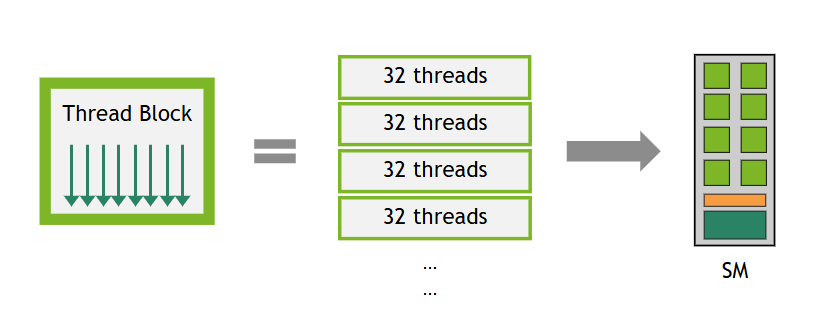

*图 22 线程块被划分为 32 线程的线程束。*

SM 所处理的每个线程束，其执行上下文（程序计数器、寄存器等）在线程束的整个生命周期内都驻留在片上，因此线程束切换没有额外开销。每个指令发射周期中，线程束调度器会选择一个活动线程已准备好执行下一条指令的线程束，并向该束的[活动线程](#section-3-2-2-1-1)发射指令。

每个 SM 都有一组在线程束之间划分的 32 位寄存器，以及在线程块之间划分的[共享内存](#section-2-3-3-2)。对给定内核而言，能够在 SM 上同时驻留并执行的线程块数和线程束数，取决于内核使用的寄存器与共享内存量，以及 SM 可提供的寄存器与共享内存量。每个 SM 的驻留线程块数和线程束数还分别受最大值限制。这些限制和 SM 可用的寄存器、共享内存容量均取决于设备的计算能力，具体数值见[计算能力](#section-5-1)。如果单个 SM 的可用资源不足以执行至少一个线程块，内核将启动失败。确定一个线程块所分配寄存器总数与共享内存总量的方法，详见[占用率](#section-2-3-7)一节。

#### 3.2.2.3. 异步执行特性

近几代 NVIDIA GPU 提供异步执行功能，使 GPU 内的数据移动、计算与同步可以更多地重叠。借助这些功能，从 GPU 代码发起的某些操作能够与同一线程块中的其他 GPU 代码异步执行。这里的异步执行不同于[第 2.5 节](#section-2-5)讨论的异步 CUDA API；后者使 GPU 内核启动或内存操作能够彼此异步，或相对于 CPU 异步执行。

计算能力 8.0（NVIDIA Ampere GPU 架构）引入了从全局到共享内存和异步屏障的硬件加速异步数据副本（请参阅 [NVIDIA A100 Tensor Core GPU 架构](https://images.nvidia.com/aem-dam/en-zz/Solutions/data-center/nvidia-ampere-architecture-whitepaper.pdf) )。

计算能力 9.0（NVIDIA Hopper GPU 架构）通过[张量内存加速器（TMA）](#section-3-2-5)扩展异步执行能力。TMA 可在全局内存与共享内存之间双向传输大块数据和多维张量，并支持异步事务屏障以及异步矩阵乘加运算（详见[《深入了解 Hopper 架构》](https://developer.nvidia.com/blog/nvidia-hopper-architecture-in-depth/)）。

CUDA 提供可由线程在设备代码中调用的 API，以使用这些功能。异步编程模型规定了异步操作相对于 CUDA 线程的行为。

异步操作由 CUDA 线程发起，却如同由另一个线程执行；这个概念上的执行者称为 *异步线程*。在良构程序中，一个或多个 CUDA 线程会与异步操作同步，但发起异步操作的 CUDA 线程不一定属于这些同步线程。异步线程始终与发起该操作的 CUDA 线程相关联。

异步操作使用同步对象来表示其完成，该对象可以是屏障或管道。这些同步对象在 [高级同步基元](#section-3-2-4) 中详细解释，它们在执行异步内存操作中的作用在 [异步数据副本](#section-3-2-5) 中演示。

##### 3.2.2.3.1. 异步线程和异步代理

异步操作访问内存的方式可能不同于常规操作。为区分这些内存访问路径，CUDA 引入 *异步线程*、*通用代理* 与 *异步代理* 等概念。常规加载和存储通过通用代理执行。某些异步指令（例如 [LDGSTS](#section-4-11-1) 和 [STAS/REDAS](#section-4-11-3)）建模为异步线程在通用代理中执行；另一些异步指令（例如使用 TMA 的批量异步复制，以及 `tcgen05.*`、`wgmma.mma_async.*` 等部分 Tensor Core 操作）则建模为异步线程在异步代理中执行。

**在通用代理中运行的异步线程**。发起异步操作时，该操作会关联一个不同于发起操作之 CUDA 线程的异步线程。通用代理中 *先前* 对同一地址执行的常规加载和存储，保证排在异步操作之前；但 *后续* 对同一地址执行的常规加载和存储不保证维持原有顺序，在异步线程完成前可能形成竞态。

**在异步代理中运行的异步线程**。发起异步操作时，该操作会关联一个不同于发起操作之 CUDA 线程的异步线程。*先前和后续* 对同一地址执行的常规加载与存储都不保证维持原有顺序。需要使用代理栅栏跨不同代理进行同步，以确保正确的内存顺序约束。[使用张量内存加速器（TMA）](#section-4-11-2)展示了如何使用代理栅栏，确保通过 TMA 执行异步复制时的正确性。

有关这些概念的更多详细信息，请参阅 [PTX ISA](https://docs.nvidia.com/cuda/parallel-thread-execution/index.html?highlight=proxy#proxies) 文档。

### 3.2.3. 线程作用域

CUDA 线程构成[线程层次结构](#section-2-3-2)，正确使用这一层次结构是编写正确且高性能 CUDA 内核的关键。在该层次结构中，内存操作的可见性与同步范围并不统一，因此 CUDA 编程模型引入了 *线程作用域*：它定义哪些线程能够观察某个线程的加载与存储，并规定哪些线程可以通过原子操作、屏障等同步原语彼此同步。每个作用域在内存层次结构中都有相应的一致性点。

线程作用域在 [CUDA PTX](https://docs.nvidia.com/cuda/parallel-thread-execution/index.html?highlight=thread%2520scopes#scope) 中公开，也作为 [libcu++](https://nvidia.github.io/cccl/unstable/libcudacxx/extended_api/memory_model.html#thread-scopes) 库的扩展提供。下表定义了可用的线程作用域：

| CUDA C++ 线程作用域 | CUDA PTX 线程作用域 | 描述 | 内存层次结构中的一致性点 |
| --- | --- | --- | --- |
| `cuda::thread_scope_thread` |  | 内存操作仅对本地线程可见。 | – |
| `cuda::thread_scope_block` | `.cta` | 内存操作对同一线程块中的其他线程可见。 | L1 |
|  | `.cluster` | 内存操作对同一线程块簇中的其他线程可见。 | L2 |
| `cuda::thread_scope_device` | `.gpu` | 内存操作对于同一 GPU 设备中的其他线程是可见的。 | L2 |
| `cuda::thread_scope_system` | `.sys` | 内存操作对同一系统中的其他线程（CPU、其他 GPU）可见。 | L2 + 互连缓存 |

[高级同步基元](#section-3-2-4) 和 [异步数据副本](#section-3-2-5) 部分演示了线程作用域的使用。

### 3.2.4. 高级同步基元

本节介绍同步原语的三个系列：

- [作用域原子操作](#section-3-2-4-1)：将 C++ 内存序与 CUDA 线程作用域结合，使线程可在线程块、簇、设备或系统作用域内安全通信（参见[线程作用域](#section-3-2-3)）。
- [异步屏障](#section-3-2-4-2)：将同步拆分为到达阶段与等待阶段，可用于跟踪异步操作的进度。
- [管道](#section-3-2-4-3)，它分阶段工作并协调多缓冲区生产者-消费者模式，通常用于与 [异步数据副本](#section-3-2-5) 重叠计算。

#### 3.2.4.1. 作用域原子操作

[第 5.4.5 节](#section-5-4-5)概述了 CUDA 提供的原子函数。本节重点介绍支持 [C++ 标准原子内存序](https://en.cppreference.com/w/cpp/atomic/memory_order.html)语义的 *作用域原子操作*，可通过 [libcu++](https://nvidia.github.io/cccl/unstable/libcudacxx/extended_api/synchronization_primitives.html) 库或编译器内置函数使用。作用域原子操作使程序能够在 CUDA 线程层次结构的恰当层级高效同步，从而兼顾复杂并行算法的正确性与性能。

##### 3.2.4.1.1. 线程作用域与内存顺序约束

作用域原子操作结合了两个关键概念：

- **线程作用域**：定义哪些线程能够观察原子操作的效果（参见[线程作用域](#section-3-2-3)）。
- **内存序**：定义相对于其他内存操作的顺序约束（参见 [C++ 标准原子内存语义](https://en.cppreference.com/w/cpp/atomic/memory_order.html)）。

**CUDA C++ `cuda::atomic`**

```cuda
#include <cuda/atomic>

__global__ void block_scoped_counter() {
    // Shared atomic counter visible only within this block
    __shared__ cuda::atomic<int, cuda::thread_scope_block> counter;

    // Initialize counter (only one thread should do this)
    if (threadIdx.x == 0) {
        counter.store(0, cuda::memory_order_relaxed);
    }
    __syncthreads();

    // All threads in block atomically increment
    int old_value = counter.fetch_add(1, cuda::memory_order_relaxed);

    // Use old_value...
}
```

**内置原子函数**

```cuda
__global__ void block_scoped_counter() {
    // Shared counter visible only within this block
    __shared__ int counter;

    // Initialize counter (only one thread should do this)
    if (threadIdx.x == 0) {
        __nv_atomic_store_n(&counter, 0,
                            __NV_ATOMIC_RELAXED,
                            __NV_THREAD_SCOPE_BLOCK);
    }
    __syncthreads();

    // All threads in block atomically increment
    int old_value = __nv_atomic_fetch_add(&counter, 1,
                                          __NV_ATOMIC_RELAXED,
                                          __NV_THREAD_SCOPE_BLOCK);

    // Use old_value...
}
```

此示例实现了 *线程块作用域原子计数器*，展示作用域原子操作的基本概念：

- **共享变量**：线程块中的所有线程通过 `__shared__` 内存共享同一个计数器。
- **原子类型声明**：`cuda::atomic<int, cuda::thread_scope_block>` 创建具有线程块作用域可见性的原子整数。
- **单次初始化**：只由线程 0 初始化计数器，避免初始化阶段出现竞态条件。
- **线程块同步**：`__syncthreads()` 确保所有线程继续执行前都能看到初始化后的计数器。
- **原子递增**：每个线程以原子方式递增计数器，并取得递增前的值。

这里选择 `cuda::memory_order_relaxed`，因为只需要保证读-修改-写操作不可分割，而不要求不同内存位置之间具有顺序约束。对于简单计数操作，各次递增的顺序不影响正确性。

对于生产者-消费者模式，获取-释放语义确保正确的排序：

**CUDA C++ `cuda::atomic`**

```cuda
__global__ void producer_consumer() {
    __shared__ int data;
    __shared__ cuda::atomic<bool, cuda::thread_scope_block> ready;

    if (threadIdx.x == 0) {
        // Producer: write data then signal ready
        data = 42;
        ready.store(true, cuda::memory_order_release);  // Release ensures data write is visible
    } else {
        // Consumer: wait for ready signal then read data
        while (!ready.load(cuda::memory_order_acquire)) {  // Acquire ensures data read sees the write
            // spin wait
        }
        int value = data;
        // Process value...
    }
}
```

**内置原子函数**

```cuda
__global__ void producer_consumer() {
    __shared__ int data;
    __shared__ bool ready; // Only ready flag needs atomic operations

    if (threadIdx.x == 0) {
        // Producer: write data then signal ready
        data = 42;
        __nv_atomic_store_n(&ready, true,
                            __NV_ATOMIC_RELEASE,
                            __NV_THREAD_SCOPE_BLOCK);  // Release ensures data write is visible
    } else {
        // Consumer: wait for ready signal then read data
        while (!__nv_atomic_load_n(&ready,
                                   __NV_ATOMIC_ACQUIRE,
                                   __NV_THREAD_SCOPE_BLOCK)) {  // Acquire ensures data read sees the write
            // spin wait
        }
        int value = data;
        // Process value...
    }
}
```

##### 3.2.4.1.2. 性能考虑因素

- *使用尽可能窄的作用域*：线程块作用域原子操作通常远快于系统作用域原子操作。
- *优先使用较弱的内存序*：只有在正确性确实需要时才使用更强的顺序约束。
- *考虑内存位置*：共享内存中的原子操作通常快于全局内存中的原子操作。

#### 3.2.4.2. 异步屏障

异步屏障不同于 `__syncthreads()` 这类单阶段屏障：线程通知屏障自己已经“到达”的操作，与等待其他参与者到达的“等待”操作相互分离。到达与等待之间，线程可以继续执行不依赖屏障结果的工作，从而更充分地利用等待时间。异步屏障既可用于 CUDA 线程之间的生产者-消费者模式，也可让复制操作在完成时向屏障发出“到达”信号，以支持内存层次结构中的异步数据复制。

计算能力 7.0 及以上的设备支持异步屏障。计算能力 8.0 及以上的设备还为共享内存中的异步屏障提供硬件加速，可对线程块内任意线程子集进行硬件同步，显著细化了同步粒度；此前架构只能在线程束整体（`__syncwarp()`）或线程块整体（`__syncthreads()`）层级加速同步。

CUDA 编程模型通过 `cuda::std::barrier` 提供异步屏障；这是 [libcu++](https://nvidia.github.io/cccl/unstable/libcudacxx/extended_api/synchronization_primitives/barrier.html) 库中符合 ISO C++ 标准的屏障。除实现 [`std::barrier`](https://en.cppreference.com/w/cpp/thread/barrier.html) 外，该库还提供 CUDA 专用扩展，可选择屏障的线程作用域以提高性能，并公开更底层的 [`cuda::ptx`](https://nvidia.github.io/cccl/unstable/libcudacxx/ptx_api.html) API。`cuda::barrier` 可与 `cuda::ptx` 互操作：通过 `friend` 函数 `cuda::device::barrier_native_handle()` 取得屏障的原生句柄，再将其传给 `cuda::ptx` 函数。CUDA 还为线程块作用域共享内存中的异步屏障提供了[原语 API](#section-5-6-1)。

下表概述不同线程作用域可用的异步屏障。

> | 线程作用域 | 内存位置 | 到达屏障 | 等待屏障 | 硬件加速 | CUDA API |
> | --- | --- | --- | --- | --- | --- |
> | 线程块 | 本地共享内存 | 允许 | 允许 | 是（8.0+） | `cuda::barrier`、`cuda::ptx`、原语 |
> | 簇 | 本地共享内存 | 允许 | 允许 | 是（9.0+） | `cuda::barrier`、`cuda::ptx` |
> | 簇 | 远程共享内存 | 允许 | 不允许 | 是（9.0+） | `cuda::barrier`、`cuda::ptx` |
> | 设备 | 全局内存 | 允许 | 允许 | 否 | `cuda::barrier` |
> | 系统 | 全局内存/统一内存 | 允许 | 允许 | 否 | `cuda::barrier` |

**时间分离的同步**

如果没有异步到达等待屏障，则在使用 [协作组](#section-4-4) 时，可以使用 `__syncthreads()` 或 `block.sync()` 实现线程块内的同步。

```cpp
#include <cooperative_groups.h>

__global__ void simple_sync(int iteration_count) {
    auto block = cooperative_groups::this_thread_block();

    for (int i = 0; i < iteration_count; ++i) {
        /* code before arrive */

         // Wait for all threads to arrive here.
        block.sync();

        /* code after wait */
    }
}
```

线程会在同步点 `block.sync()` 阻塞，直到所有线程均到达该同步点。此外，同步点之前发生的内存更新保证对同步点之后的所有块内线程可见。

该模式分为三个阶段：

- 在同步点 **之前** 执行的代码产生内存更新，这些更新将在同步点 **之后** 被读取。
- 同步点。
- 同步点 **之后** 的代码可以看到同步点 **之前** 发生的内存更新。

使用异步屏障代替，时间分割同步模式如下。

**CUDA C++ `cuda::barrier`**

| `#include <cuda/barrier> #include <cooperative_groups.h> __device__ void compute(float *data, int iteration); __global__ void split_arrive_wait(int iteration_count, float *data) { using barrier_t = cuda::barrier<cuda::thread_scope_block>; __shared__ barrier_t bar; auto block = cooperative_groups::this_thread_block(); if (block.thread_rank() == 0) { // Initialize barrier with expected arrival count. init(&bar, block.size()); } block.sync(); for (int i = 0; i < iteration_count; ++i) { /* code before arrive */ // This thread arrives. Arrival does not block a thread. barrier_t::arrival_token token = bar.arrive(); compute(data, i); // Wait for all threads participating in the barrier to complete bar.arrive(). bar.wait(std::move(token)); /* code after wait */ } }` |
| --- |

**CUDA C++ `cuda::ptx`**

| `#include <cuda/ptx> #include <cooperative_groups.h> __device__ void compute(float *data, int iteration); __global__ void split_arrive_wait(int iteration_count, float *data) { __shared__ uint64_t bar; auto block = cooperative_groups::this_thread_block(); if (block.thread_rank() == 0) { // Initialize barrier with expected arrival count. cuda::ptx::mbarrier_init(&bar, block.size()); } block.sync(); for (int i = 0; i < iteration_count; ++i) { /* code before arrive */ // This thread arrives. Arrival does not block a thread. uint64_t token = cuda::ptx::mbarrier_arrive(&bar); compute(data, i); // Wait for all threads participating in the barrier to complete mbarrier_arrive(). while(!cuda::ptx::mbarrier_try_wait(&bar, token)) {} /* code after wait */ } }` |
| --- |

**CUDA C 原语**

| `#include <cuda_awbarrier_primitives.h> #include <cooperative_groups.h> __device__ void compute(float *data, int iteration); __global__ void split_arrive_wait(int iteration_count, float *data) { __shared__ __mbarrier_t bar; auto block = cooperative_groups::this_thread_block(); if (block.thread_rank() == 0) { // Initialize barrier with expected arrival count. __mbarrier_init(&bar, block.size()); } block.sync(); for (int i = 0; i < iteration_count; ++i) { /* code before arrive */ // This thread arrives. Arrival does not block a thread. __mbarrier_token_t token = __mbarrier_arrive(&bar); compute(data, i); // Wait for all threads participating in the barrier to complete __mbarrier_arrive(). while(!__mbarrier_try_wait(&bar, token, 1000)) {} /* code after wait */ } }` |
| --- |

在此模式中，同步点拆分为到达点 `bar.arrive()` 和等待点 `bar.wait(std::move(token))`。线程第一次调用 `bar.arrive()` 时开始参与 `cuda::barrier`。调用 `bar.wait(std::move(token))` 后，线程会一直阻塞，直到参与线程对 `bar.arrive()` 的调用次数达到传给 `init()` 的预期到达计数。参与线程调用 `bar.arrive()` 前发生的内存更新，保证在参与线程从 `bar.wait(std::move(token))` 返回后可见。需要注意，`bar.arrive()` 本身不会阻塞线程；线程可以继续执行不依赖其他参与线程到达前所产生内存更新的工作。

*到达并等待* 模式有五个阶段：

- 到达点 **之前** 的代码产生内存更新，这些更新将在等待点 **之后** 被读取。
- 使用隐式内存栅栏到达点（即相当于 `cuda::atomic_thread_fence(cuda::memory_order_seq_cst, cuda::thread_scope_block)` )。
- 到达点与等待点 **之间** 的代码。
- 等待点。
- 等待点 **之后** 的代码可以看到到达点 **之前** 发生的更新。

有关异步屏障的完整使用指南，请参阅[异步屏障](#section-4-9)。

#### 3.2.4.3. 管道

CUDA 编程模型提供管道同步对象，用作将异步内存复制安排为多个阶段的协调机制，从而便于实现双缓冲或多缓冲的生产者-消费者模式。管道是具有 *头部* 和 *尾部* 的双端队列，按先进先出（FIFO）顺序处理工作。生产者线程向管道头部提交工作，消费者线程则从管道尾部取出工作。

管道通过 [libcu++](https://nvidia.github.io/cccl/unstable/libcudacxx/extended_api/synchronization_primitives/pipeline.html) 库中的 `cuda::pipeline` API 和[原语 API](#section-5-6-2)公开。下表说明两类 API 的主要功能。

| `cuda::pipeline` API | 描述 |
| --- | --- |
| `producer_acquire` | 获取管道内部队列中的可用阶段。 |
| `producer_commit` | 提交在管道的当前获取阶段上调用 `producer_acquire` 后发出的异步操作。 |
| `consumer_wait` | 等待管道最旧阶段中的异步操作完成。 |
| `consumer_release` | 把管道中最旧的阶段释放给管道对象以供复用；随后生产者可获取该阶段。 |

| 基元 API | 描述 |
| --- | --- |
| `__pipeline_memcpy_async` | 请求提交从全局到共享内存的内存副本以进行异步评估。 |
| `__pipeline_commit` | 提交在管道当前阶段调用之前发出的异步操作。 |
| `__pipeline_wait_prior(N)` | 等待除最后 N 次提交到管道之外的所有异步操作的完成。 |

`cuda::pipeline` API 具有更丰富的接口，限制更少，而原语 API 仅支持跟踪从全局内存到共享内存的异步副本，具有特定的大小和对齐要求。原语 API 提供与带有 `cuda::thread_scope_thread` 的 `cuda::pipeline` 对象等效的功能。

有关详细的使用模式和示例，请参阅 [管道](#section-4-10)。

### 3.2.5. 异步数据副本

在内存层次结构中高效移动数据，是 GPU 计算获得高性能的基础。传统同步内存操作会迫使线程在数据传输期间空等。GPU 本质上通过并行性隐藏内存延迟：某个线程束等待内存操作完成时，SM 切换去执行另一线程束。但即使延迟得以隐藏，它仍可能限制内存带宽利用率与计算资源效率。为缓解这些瓶颈，现代 GPU 架构提供硬件加速的异步数据复制机制，使线程继续执行其他工作时，内存传输可独立进行。

异步数据副本通过将内存传输的启动与等待其完成分离来实现计算与数据移动的重叠。这样，线程可以在内存延迟期间执行有用的工作，从而提高整体吞吐量和资源利用率。

> [!NOTE]
> **说明**
> 虽然本节的概念与前文[异步执行](#section-2-5)一章相似，但前文讨论的是内核执行与内存传输（例如由 `cudaMemcpyAsync` 发起的传输）相对于彼此或 CPU 的异步，可将其视为应用程序不同组件之间的异步。
>
> 本节所说的异步，是指在不阻塞 GPU 线程的情况下，在 GPU DRAM（即全局内存）与共享内存、张量内存等 SM 片上内存之间传输数据。这种异步发生在一次内核启动的执行过程内部。

要了解异步副本如何提高性能，检查常见的 GPU 计算模式会很有帮助。 CUDA 应用程序通常采用 *复制和计算* 模式：

- 从全局内存获取数据，
- 将数据存储到共享内存，并且
- 对共享内存数据执行计算，并可能将结果写回全局内存。

该模式中的 *复制* 阶段通常写成 `shared[local_idx] = global[global_idx]`。编译器会将这次从全局内存到共享内存的复制展开为两步：先从全局内存读入寄存器，再从寄存器写入共享内存。

当这种模式用于迭代算法时，每个线程块都需在执行 `shared[local_idx] = global[global_idx]` 之后同步，以确保计算阶段开始前，对共享内存的所有写入均已完成。计算阶段结束后，线程块还需再次同步，以防共享内存在所有线程完成计算前被覆盖。以下代码片段展示了这种模式。

```cpp
#include <cooperative_groups.h>

__device__ void compute(int* global_out, int const* shared_in) {
    // Computes using all values of current batch from shared memory.
    // Stores this thread's result back to global memory.
}

__global__ void without_async_copy(int* global_out, int const* global_in, size_t size, size_t batch_sz) {
  auto grid = cooperative_groups::this_grid();
  auto block = cooperative_groups::this_thread_block();
  assert(size == batch_sz * grid.size()); // Exposition: input size fits batch_sz * grid_size

  extern __shared__ int shared[]; // block.size() * sizeof(int) bytes

  size_t local_idx = block.thread_rank();

  for (size_t batch = 0; batch < batch_sz; ++batch) {
    // Compute the index of the current batch for this block in global memory.
    size_t block_batch_idx = block.group_index().x * block.size() + grid.size() * batch;
    size_t global_idx = block_batch_idx + threadIdx.x;
    shared[local_idx] = global_in[global_idx];

    // Wait for all copies to complete.
    block.sync();

    // Compute and write result to global memory.
    compute(global_out + block_batch_idx, shared);

    // Wait for compute using shared memory to finish.
    block.sync();
  }
}
```

借助异步数据复制，从全局内存到共享内存的数据移动可以异步进行，从而在等待数据到达期间更高效地利用 SM。

```cpp
#include <cooperative_groups.h>
#include <cooperative_groups/memcpy_async.h>

__device__ void compute(int* global_out, int const* shared_in) {
    // Computes using all values of current batch from shared memory.
    // Stores this thread's result back to global memory.
}

__global__ void with_async_copy(int* global_out, int const* global_in, size_t size, size_t batch_sz) {
  auto grid = cooperative_groups::this_grid();
  auto block = cooperative_groups::this_thread_block();
  assert(size == batch_sz * grid.size()); // Exposition: input size fits batch_sz * grid_size

  extern __shared__ int shared[]; // block.size() * sizeof(int) bytes

  size_t local_idx = block.thread_rank();

  for (size_t batch = 0; batch < batch_sz; ++batch) {
    // Compute the index of the current batch for this block in global memory.
    size_t block_batch_idx = block.group_index().x * block.size() + grid.size() * batch;

    // Whole thread-group cooperatively copies whole batch to shared memory.
    cooperative_groups::memcpy_async(block, shared, global_in + block_batch_idx, block.size());

    // Compute on different data while waiting.

    // Wait for all copies to complete.
    cooperative_groups::wait(block);

    // Compute and write result to global memory.
    compute(global_out + block_batch_idx, shared);

    // Wait for compute using shared memory to finish.
    block.sync();
  }
}
```

[`cooperative_groups::memcpy_async`](#section-5-6-3-2-1) 函数将 `block.size()` 个元素从全局内存复制到 `shared` 中。此操作在语义上如同由另一个线程执行；复制完成后，该操作会与当前线程对 [`cooperative_groups::wait`](#section-5-6-3-2-2) 的调用同步。在复制完成前，修改全局内存中的数据，或读写共享内存中的数据，都会引入数据竞争。

该示例说明了所有异步复制操作的基本思想：将内存传输的发起与完成解耦，使线程能在数据后台传输期间执行其他工作。CUDA 编程模型提供了多类 API 来使用这些能力，其中包括[协作组](#section-5-6-3-2-1)和 [libcu++](https://nvidia.github.io/cccl/unstable/libcudacxx/extended_api/asynchronous_operations/memcpy_async.html) 库提供的 `memcpy_async` 函数，以及更底层的 `cuda::ptx` 与原语 API。这些 API 语义相近：它们将对象从源处复制到目标处，语义上如同由另一个线程执行；复制完成后，可通过不同的完成机制进行同步。

现代 GPU 架构为异步数据移动提供多种硬件机制。

- LDGSTS（计算能力 8.0 及以上）支持从全局内存到共享内存的高效小规模异步传输。
- 张量内存加速器（TMA，计算能力 9.0 及以上）扩展了这些能力，提供为大规模多维数据传输优化的批量异步复制操作。
- STAS 指令（计算能力 9.0 及以上）支持在线程块簇内，从寄存器到分布式共享内存的小规模异步传输。

这些机制支持不同的数据路径、传输大小和对齐要求，允许开发人员为其特定的数据访问模式选择最合适的方法。以下表概述了 GPU 内异步副本支持的数据路径。

**表 5 异步复制可能的源和目标内存空间。空单元格表示不支持源-目标对。**

| 方向 | 方向 | 复制机制 | 复制机制 |
| --- | --- | --- | --- |
| 源 | 目标 | 异步复制 | 批量异步复制 |
| `global` | `global` |  |  |
| `shared::cta` | `global` |  | 支持（TMA，9.0 及以上） |
| `global` | `shared::cta` | 支持（LDGSTS，8.0 及以上） | 支持（TMA，9.0 及以上） |
| `global` | `shared::cluster` |  | 支持（TMA，9.0 及以上） |
| `shared::cluster` | `shared::cta` |  | 支持（TMA，9.0 及以上） |
| `shared::cta` | `shared::cta` |  |  |
| 寄存器 | `shared::cluster` | 支持（STAS，9.0 及以上） |  |

[使用 LDGSTS](#section-4-11-1)、[使用张量内存加速器（TMA）](#section-4-11-2)和[使用 STAS](#section-4-11-3)将进一步详解这些机制。

### 3.2.6. 配置 L1/共享内存平衡

如[一级数据缓存](#section-2-3-3-6)所述，SM 上的 L1 与共享内存使用同一物理资源，该资源称为统一数据缓存。在大多数架构上，如果内核很少使用或完全不使用共享内存，则可将统一数据缓存配置为架构所允许的最大 L1 缓存容量。

在每个内核的粒度上，都可配置统一数据缓存中为共享内存保留的部分。应用程序可设置 `carveout`（即首选共享内存容量），并在启动内核前调用 [`cudaFuncSetAttribute`](https://docs.nvidia.com/cuda/cuda-runtime-api/group__CUDART__EXECUTION.html#group__CUDART__EXECUTION_1g317e77d2657abf915fd9ed03e75f3eb0) 函数。

```cpp
cudaFuncSetAttribute(kernel_name, cudaFuncAttributePreferredSharedMemoryCarveout, carveout);
```

应用程序可将 `carveout` 设为该架构所支持最大共享内存容量的整数百分比。除了整数百分比外，还提供了三个便捷枚举值作为 `carveout` 参数。

- `cudaSharedmemCarveoutDefault`
- `cudaSharedmemCarveoutMaxL1`
- `cudaSharedmemCarveoutMaxShared`

支持的最大共享内存容量和 `carveout` 档位因架构而异；详细信息请参阅[各计算能力支持的共享内存容量](#section-5-1-3)。

如果所选的整数百分比不能精确对应到受支持的共享内存容量，则使用下一个更大的容量。例如，计算能力 12.0 的设备支持的最大共享内存容量为 100 KB；将 `carveout` 设为 50% 时，得到的共享内存容量为 64 KB，而非 50 KB，因为该计算能力支持的共享内存容量为 0、8、16、32、64 和 100 KB。

传给 `cudaFuncSetAttribute` 的函数必须使用 `__global__` 声明。驱动程序将 `cudaFuncSetAttribute` 解释为一项提示；如果执行该内核有此需要，驱动程序可选择不同的 `carveout` 档位。

> [!NOTE]
> **说明**
> 另一个 CUDA API `cudaFuncSetCacheConfig` 也允许应用程序调整内核的 L1 与共享内存平衡。但该 API 会对内核启动时的共享内存/L1 平衡方案施加硬性要求。因此，交错启动共享内存划分方案不同的内核时，会因共享内存重新划分而导致不必要的[启动序列化](#section-3-1-3-3)。建议使用 `cudaFuncSetAttribute`：如果执行该函数或避免频繁切换有此需要，驱动程序可选择其他配置。

每个线程块需要分配超过 48 KB 共享内存的内核依赖于具体架构。因此，这类内核必须使用[动态共享内存](#section-2-3-3-2-2)，而不能使用静态定长数组；同时还需要通过 `cudaFuncSetAttribute` 显式选择启用，如下所示。

```cpp
// Device code
__global__ void MyKernel(...)
{
  extern __shared__ float buffer[];
  ...
}

// Host code
int maxbytes = 98304; // 96 KB
cudaFuncSetAttribute(MyKernel, cudaFuncAttributeMaxDynamicSharedMemorySize, maxbytes);
MyKernel <<<gridDim, blockDim, maxbytes>>>(...);
```

---

## 3.3. CUDA 驱动程序 API

*英文原题：The CUDA Driver API*  
*官方原文：[https://docs.nvidia.com/cuda/cuda-programming-guide/03-advanced/driver-api.html](https://docs.nvidia.com/cuda/cuda-programming-guide/03-advanced/driver-api.html)*

本指南前面的章节介绍了 CUDA 运行时。如 [CUDA 运行时 API 与 CUDA 驱动程序 API](#section-1-3-2-1) 所述，CUDA 运行时构建在更底层的 CUDA 驱动程序 API 之上。本节介绍 CUDA 运行时 API 与驱动程序 API 之间的部分差异，以及二者的混合使用方法。绝大多数应用都无需直接使用 CUDA 驱动程序 API，也能充分发挥性能。不过，新接口有时会先在驱动程序 API 中提供，而一些高级接口（例如[虚拟内存管理](#section-4-16)）则仅通过驱动程序 API 公开。

驱动程序 API 由 CUDA 驱动动态库实现：Windows 上为 `nvcuda.dll`，Linux 上为 `libcuda.so`。安装设备驱动程序时，该库会被复制到系统中；其所有入口点均以 `cu` 为前缀。

> [!NOTE]
> **原文勘误**
> Release 13.3 原文把驱动库文件名写为 `cuda.dll` 和 `cuda.so`；实际平台文件名分别为 Windows 的 `nvcuda.dll` 与 Linux 的 `libcuda.so`。原文表 6 还把 `CUtexref` 标为 “Texture object”；该类型实际是纹理引用句柄，纹理对象句柄为 `CUtexObject`。下表已按真实 API 语义更正。

这是一种基于句柄的命令式 API：大多数对象都通过不透明句柄引用，操作对象时可将相应句柄传给函数。

驱动程序 API 中可用的对象在 [表 6](#section-3-3) 中进行了汇总。

**表 6 CUDA 驱动程序 API 中可用的对象**

| 对象 | 句柄 | 描述 |
| --- | --- | --- |
| 设备 | `CUdevice` | 支持 CUDA 的设备 |
| 上下文 | `CUcontext` | 大致等同于 CPU 进程 |
| 模块 | `CUmodule` | 大致等同于动态库 |
| 函数 | `CUfunction` | 内核 |
| 堆内存 | `CUdeviceptr` | 指向设备内存的指针 |
| CUDA 数组 | `CUarray` | 设备上一维或二维数据的不透明容器，可通过纹理引用或表面引用读取 |
| 纹理引用 | `CUtexref` | 描述如何解释纹理内存数据的纹理引用句柄 |
| 表面引用 | `CUsurfref` | 描述如何读写 CUDA 数组的对象 |
| 流 | `CUstream` | 描述 CUDA 流的对象 |
| 事件 | `CUevent` | 描述 CUDA 事件的对象 |

调用任何驱动程序 API 函数之前，必须先使用 `cuInit()` 初始化驱动程序 API。随后还必须创建一个绑定到特定设备的 CUDA 上下文，并将其设为调用方主机线程的当前上下文，详见[上下文](#section-3-3-1)。

在 CUDA 上下文中，主机代码会显式加载包含内核的 PTX 或二进制对象，详见[模块](#section-3-3-2)。因此，以 C++ 编写的内核必须分离编译为 *PTX* 或二进制对象；随后通过 API 入口点启动，详见[内核执行](#section-3-3-3)。

希望应用能在未来设备架构上运行时，必须加载 *PTX* 而非二进制代码。这是因为二进制代码面向特定架构，因而不兼容未来架构；*PTX* 代码则由设备驱动程序在加载时编译成二进制代码。

以下是使用驱动程序 API 编写的 [内核](#section-2-1-2) 示例的主机代码：

```cpp
int main()
{
    int N = ...;
    size_t size = N * sizeof(float);

    // Allocate input vectors h_A and h_B in host memory
    float* h_A = (float*)malloc(size);
    float* h_B = (float*)malloc(size);

    // Initialize input vectors
    ...

    // Initialize
    cuInit(0);

    // Get number of devices supporting CUDA
    int deviceCount = 0;
    cuDeviceGetCount(&deviceCount);
    if (deviceCount == 0) {
        printf("There is no device supporting CUDA.\n");
        exit (0);
    }

    // Get handle for device 0
    CUdevice cuDevice;
    cuDeviceGet(&cuDevice, 0);

    // Create context
    CUcontext cuContext;
    cuCtxCreate(&cuContext, 0, cuDevice);

    // Create module from binary file
    CUmodule cuModule;
    cuModuleLoad(&cuModule, "VecAdd.ptx");

    // Allocate vectors in device memory
    CUdeviceptr d_A;
    cuMemAlloc(&d_A, size);
    CUdeviceptr d_B;
    cuMemAlloc(&d_B, size);
    CUdeviceptr d_C;
    cuMemAlloc(&d_C, size);

    // Copy vectors from host memory to device memory
    cuMemcpyHtoD(d_A, h_A, size);
    cuMemcpyHtoD(d_B, h_B, size);

    // Get function handle from module
    CUfunction vecAdd;
    cuModuleGetFunction(&vecAdd, cuModule, "VecAdd");

    // Invoke kernel
    int threadsPerBlock = 256;
    int blocksPerGrid =
            (N + threadsPerBlock - 1) / threadsPerBlock;
    void* args[] = { &d_A, &d_B, &d_C, &N };
    cuLaunchKernel(vecAdd,
                   blocksPerGrid, 1, 1, threadsPerBlock, 1, 1,
                   0, 0, args, 0);

    ...
}
```

完整代码可以在 `vectorAddDrv` CUDA 示例中找到。

### 3.3.1. 上下文

CUDA 上下文类似于 CPU 进程。通过驱动程序 API 执行操作时，其所有资源与操作都封装在 CUDA 上下文中；销毁上下文时，系统会自动清理这些资源。除模块、纹理引用或表面引用等对象外，每个上下文还有独立的地址空间。因此，不同上下文中的 `CUdeviceptr` 值会引用不同的内存位置。

一个主机线程在同一时刻只能有一个当前设备上下文。使用 `cuCtxCreate()` 创建上下文时，该上下文会成为调用方主机线程的当前上下文。如果线程没有有效的当前上下文，则在上下文中运行的 CUDA 函数（大多数不涉及设备枚举或上下文管理的函数）会返回 `CUDA_ERROR_INVALID_CONTEXT`。

每个主机线程都有一个当前上下文栈。`cuCtxCreate()` 将新上下文压入栈顶。调用 `cuCtxPopCurrent()` 可使该上下文与主机线程分离；随后上下文处于“浮动”状态，可被压入任意主机线程，成为其当前上下文。`cuCtxPopCurrent()` 还会恢复先前的当前上下文（若存在）。

系统还为每个上下文维护使用计数。`cuCtxCreate()` 创建的上下文初始使用计数为 1；`cuCtxAttach()` 递增该计数，`cuCtxDetach()` 则递减该计数。调用 `cuCtxDetach()` 或 `cuCtxDestroy()` 使使用计数降为 0 时，上下文将被销毁。

驱动程序 API 可与运行时互操作。通过 `cuDevicePrimaryCtxRetain()`，驱动程序 API 可访问由运行时管理的主上下文（参见[运行时初始化](#section-2-1-6)）。

使用计数有助于在同一上下文中运行的第三方代码相互操作。例如，若加载了三个使用同一上下文的库，每个库都会调用 `cuCtxAttach()` 递增使用计数，并在使用完上下文后调用 `cuCtxDetach()` 递减该计数。对大多数库而言，应用应在加载或初始化库之前创建上下文；这样，应用可根据自身的启发式策略创建上下文，库只需在传入的上下文中工作。如果某个库希望创建自己的上下文——其 API 客户端可能并不知情，也可能已创建或尚未创建自身的上下文——则应使用 `cuCtxPushCurrent()` 和 `cuCtxPopCurrent()`，如下图所示。

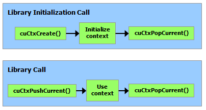

*图 23 库的上下文管理*

### 3.3.2. 模块

模块是可动态加载的设备代码与数据包，类似于 Windows 中的 DLL，由 `nvcc` 输出（参见[使用 NVCC 编译](#section-2-1-1)）。函数、全局变量、纹理引用或表面引用等所有符号的名称都保留在模块作用域中，因而独立第三方编写的模块可在同一 CUDA 上下文中互操作。

此代码示例加载模块并检索某些内核的句柄：

```cpp
CUmodule cuModule;
cuModuleLoad(&cuModule, "myModule.ptx");
CUfunction myKernel;
cuModuleGetFunction(&myKernel, cuModule, "MyKernel");
```

此代码示例从 PTX 代码编译并加载新的模块并解析编译错误：

```cpp
#define BUFFER_SIZE 8192
CUmodule cuModule;
CUjit_option options[3];
void* values[3];
char* PTXCode = "some PTX code";
char error_log[BUFFER_SIZE];
int err;
options[0] = CU_JIT_ERROR_LOG_BUFFER;
values[0]  = (void*)error_log;
options[1] = CU_JIT_ERROR_LOG_BUFFER_SIZE_BYTES;
values[1]  = (void*)BUFFER_SIZE;
options[2] = CU_JIT_TARGET_FROM_CUCONTEXT;
values[2]  = 0;
err = cuModuleLoadDataEx(&cuModule, PTXCode, 3, options, values);
if (err != CUDA_SUCCESS)
    printf("Link error:\n%s\n", error_log);
```

此代码示例从多个 PTX 代码编译、链接和加载新的模块，并解析链接和编译错误：

```cpp
#define BUFFER_SIZE 8192
CUmodule cuModule;
CUjit_option options[6];
void* values[6];
float walltime;
char error_log[BUFFER_SIZE], info_log[BUFFER_SIZE];
char* PTXCode0 = "some PTX code";
char* PTXCode1 = "some other PTX code";
CUlinkState linkState;
int err;
void* cubin;
size_t cubinSize;
options[0] = CU_JIT_WALL_TIME;
values[0] = (void*)&walltime;
options[1] = CU_JIT_INFO_LOG_BUFFER;
values[1] = (void*)info_log;
options[2] = CU_JIT_INFO_LOG_BUFFER_SIZE_BYTES;
values[2] = (void*)BUFFER_SIZE;
options[3] = CU_JIT_ERROR_LOG_BUFFER;
values[3] = (void*)error_log;
options[4] = CU_JIT_ERROR_LOG_BUFFER_SIZE_BYTES;
values[4] = (void*)BUFFER_SIZE;
options[5] = CU_JIT_LOG_VERBOSE;
values[5] = (void*)1;
cuLinkCreate(6, options, values, &linkState);
err = cuLinkAddData(linkState, CU_JIT_INPUT_PTX,
                    (void*)PTXCode0, strlen(PTXCode0) + 1, 0, 0, 0, 0);
if (err != CUDA_SUCCESS)
    printf("Link error:\n%s\n", error_log);
err = cuLinkAddData(linkState, CU_JIT_INPUT_PTX,
                    (void*)PTXCode1, strlen(PTXCode1) + 1, 0, 0, 0, 0);
if (err != CUDA_SUCCESS)
    printf("Link error:\n%s\n", error_log);
cuLinkComplete(linkState, &cubin, &cubinSize);
printf("Link completed in %fms. Linker Output:\n%s\n", walltime, info_log);
cuModuleLoadData(cuModule, cubin);
cuLinkDestroy(linkState);
```

通过使用多个线程可以加速模块链接/加载过程的某些部分，包括加载 cubin 时。此代码示例使用 `CU_JIT_BINARY_LOADER_THREAD_COUNT` 来加速模块加载。

```cpp
#define BUFFER_SIZE 8192
CUmodule cuModule;
CUjit_option options[3];
void* values[3];
char* cubinCode = "some cubin code";
char error_log[BUFFER_SIZE];
int err;
options[0] = CU_JIT_ERROR_LOG_BUFFER;
values[0]  = (void*)error_log;
options[1] = CU_JIT_ERROR_LOG_BUFFER_SIZE_BYTES;
values[1]  = (void*)BUFFER_SIZE;
options[2] = CU_JIT_BINARY_LOADER_THREAD_COUNT;
values[2]  = 0; // Use as many threads as CPUs on the machine
err = cuModuleLoadDataEx(&cuModule, cubinCode, 3, options, values);
if (err != CUDA_SUCCESS)
    printf("Link error:\n%s\n", error_log);
```

完整代码可以在 `ptxjit` CUDA 示例中找到。

### 3.3.3. 内核执行

`cuLaunchKernel()` 使用给定的执行配置启动内核。

参数有两种传递方式：一是通过指针数组（`cuLaunchKernel()` 的倒数第二个参数）传递，其中第 n 个指针对应第 n 个参数，并指向从中复制该参数的内存区域；二是通过额外选项之一（`cuLaunchKernel()` 的最后一个参数）传递。

当参数作为额外选项（`CU_LAUNCH_PARAM_BUFFER_POINTER` 选项）传递时，它们作为指向单个缓冲区的指针传递，其中通过匹配设备代码中每个参数类型的对齐要求，假定参数相对于彼此正确偏移。

设备代码中内置向量类型的对齐要求列于[表 43](#section-5-4-2-3)。对于其他所有基本类型，设备代码与主机代码的对齐要求相同，因此可使用 `__alignof()` 获取。唯一例外是：主机编译器将 `double` 和 `long long`（在 64 位系统上还包括 `long`）对齐到单字边界，而非双字边界时（例如使用 `gcc` 编译选项 `-mno-align-double`），对齐要求会有所不同，因为这些类型在设备代码中始终对齐到双字边界。

`CUdeviceptr` 是一个整数，但代表一个指针，因此它的对齐要求是 `__alignof(void*)`。

以下代码示例使用宏 ( `ALIGN_UP()` ) 调整每个参数的偏移量以满足其对齐要求，并使用另一个宏 ( `ADD_TO_PARAM_BUFFER()` ) 将每个参数添加到传递给 `CU_LAUNCH_PARAM_BUFFER_POINTER` 选项的参数缓冲区。

```cpp
#define ALIGN_UP(offset, alignment) \
      (offset) = ((offset) + (alignment) - 1) & ~((alignment) - 1)

char paramBuffer[1024];
size_t paramBufferSize = 0;

#define ADD_TO_PARAM_BUFFER(value, alignment)                   \
    do {                                                        \
        paramBufferSize = ALIGN_UP(paramBufferSize, alignment); \
        memcpy(paramBuffer + paramBufferSize,                   \
               &(value), sizeof(value));                        \
        paramBufferSize += sizeof(value);                       \
    } while (0)

int i;
ADD_TO_PARAM_BUFFER(i, __alignof(i));
float4 f4;
ADD_TO_PARAM_BUFFER(f4, 16); // float4's alignment is 16
char c;
ADD_TO_PARAM_BUFFER(c, __alignof(c));
float f;
ADD_TO_PARAM_BUFFER(f, __alignof(f));
CUdeviceptr devPtr;
ADD_TO_PARAM_BUFFER(devPtr, __alignof(devPtr));
float2 f2;
ADD_TO_PARAM_BUFFER(f2, 8); // float2's alignment is 8

void* extra[] = {
    CU_LAUNCH_PARAM_BUFFER_POINTER, paramBuffer,
    CU_LAUNCH_PARAM_BUFFER_SIZE,    &paramBufferSize,
    CU_LAUNCH_PARAM_END
};
cuLaunchKernel(cuFunction,
               blockWidth, blockHeight, blockDepth,
               gridWidth, gridHeight, gridDepth,
               0, 0, 0, extra);
```

结构体的对齐要求等于其各字段对齐要求的最大值。因此，包含内建向量类型、`CUdeviceptr`，或未按双字边界对齐的 `double` / `long long` 的结构体，其主机代码与设备代码对齐要求可能不同，填充方式也可能不同。例如，下面的结构体在主机代码中完全不填充，但设备代码会在字段 `f` 后填充 12 字节，因为字段 `f4` 要求 16 字节对齐。

```cpp
typedef struct {
    float  f;
    float4 f4;
} myStruct;
```

### 3.3.4. 运行时和驱动程序 API 之间的互操作性

应用程序可以将运行时 API 代码与驱动程序 API 代码混合。

如果通过驱动程序 API 创建上下文并将其设为当前上下文，后续运行时 API 调用会使用该上下文，而不会再创建新上下文。

如果运行时被初始化，则可以使用`cuCtxGetCurrent()`来检索初始化期间创建的上下文。此上下文可由后续驱动程序 API 调用使用。

运行时隐式创建的上下文称为主上下文（参见[运行时初始化](#section-2-1-6)）。可通过[主上下文管理](https://docs.nvidia.com/cuda/cuda-driver-api/group__CUDA__PRIMARY__CTX.html)函数，使用驱动程序 API 管理该上下文。

设备内存可以使用 API 进行分配和释放。 `CUdeviceptr` 可以转换为常规指针，反之亦然：

```cpp
CUdeviceptr devPtr;
float* d_data;

// Allocation using driver API
cuMemAlloc(&devPtr, size);
d_data = (float*)devPtr;

// Allocation using runtime API
cudaMalloc(&d_data, size);
devPtr = (CUdeviceptr)d_data;
```

这特别意味着，使用驱动程序 API 编写的应用可以调用使用运行时 API 编写的库（例如 cuFFT、cuBLAS 等）。

参考手册的设备和版本管理部分中的所有功能都可以互换使用。

---

## 3.4. 多 GPU 系统编程

*英文原题：Programming Systems with Multiple GPUs*  
*官方原文：[https://docs.nvidia.com/cuda/cuda-programming-guide/03-advanced/multi-gpu-systems.html](https://docs.nvidia.com/cuda/cuda-programming-guide/03-advanced/multi-gpu-systems.html)*

多 GPU 编程可利用多 GPU 系统更高的总体算术性能、更大的内存容量与更高的内存带宽，使应用能够处理单个 GPU 无法承载的问题规模，并达到超越单个 GPU 的性能水平。

CUDA 通过主机 API、驱动程序基础设施和支持 GPU 硬件技术实现多 GPU 编程：

- 主机线程 CUDA 上下文管理
- 系统中所有处理器的统一内存寻址
- GPU 之间的点对点批量内存传输
- 细粒度 GPU 对等加载/存储内存访问
- 更高层抽象与配套系统软件，例如 CUDA 进程间通信、使用 [NCCL](https://developer.nvidia.com/nccl) 执行的并行归约，以及基于 NVLink 和/或 GPUDirect RDMA，通过 [NVSHMEM](https://developer.nvidia.com/nvshmem)、MPI 等 API 实现的通信

从最基本的层面看，多 GPU 编程要求应用同时管理多个活动的 CUDA 上下文，将数据分发至各 GPU，在这些 GPU 上启动内核完成计算，然后传递或汇集结果，供应用后续处理。具体实现方式取决于如何将应用算法、可用并行性与现有代码结构，最有效地映射到合适的多 GPU 编程模式。常见模式包括：

- 单个主机线程驱动多个 GPU
- 多个主机线程，每个驱动自己的 GPU
- 多个单线程主机进程，每个进程驱动自己的 GPU
- 多个主机进程包含多个线程，每个进程驱动自己的 GPU
- 多节点 NVLink 互连集群：GPU 由线程驱动，进程则运行在跨集群节点的多个操作系统实例中

GPU 可通过设备内存之间的内存传输与对等访问相互通信，因而适用于上述每种多设备工作分配模式。通过查询并启用 GPU 对等内存访问，再利用 NVLink 在设备之间进行高带宽传输和更细粒度的加载/存储操作，可实现高性能、低延迟的 GPU 通信。

CUDA 统一虚拟寻址（UVA）支持同一主机进程内的多个 GPU 相互通信：只需少量额外步骤，即可查询并启用高性能的对等内存访问与传输，例如通过 NVLink 进行传输。

通过进程间通信（IPC）与虚拟内存管理（VMM）API，可在由不同主机进程管理的多个 GPU 之间进行通信。[进程间通信](#section-4-15)介绍了高层 IPC 概念与节点内 CUDA IPC API。高级虚拟内存管理（VMM）API 同时支持节点内与多节点 IPC，可在 Linux 和 Windows 上使用，并可按分配粒度控制内存缓冲区的 IPC 共享方式，详见[虚拟内存管理](#section-4-16)。

CUDA 本身提供了在一组 GPU（可能包括主机）之间实现集合操作所需的 API，但不直接提供高层多 GPU 集合 API。这类多 GPU 集合由抽象层次更高的 CUDA 通信库提供，例如 [NCCL](https://developer.nvidia.com/nccl) 和 [NVSHMEM](https://developer.nvidia.com/nvshmem)。

### 3.4.1. 多设备上下文和执行管理

应用程序使用多个 GPU 时，首先需要枚举可用的 GPU 设备，再根据设备的硬件属性、CPU 亲和性以及与对等设备的连接情况选择合适设备，并为应用程序要使用的每个设备创建 CUDA 上下文。

#### 3.4.1.1. 设备枚举

以下代码示例演示如何查询启用 CUDA 的设备的数量、枚举每个设备并查询其属性。

```cpp
int deviceCount;
cudaGetDeviceCount(&deviceCount);
int device;
for (device = 0; device < deviceCount; ++device) {
    cudaDeviceProp deviceProp;
    cudaGetDeviceProperties(&deviceProp, device);
    printf("Device %d has compute capability %d.%d.\n",
           device, deviceProp.major, deviceProp.minor);
}
```

#### 3.4.1.2. 设备选择

主机线程可以随时通过调用 `cudaSetDevice()` 来设置它当前正在操作的设备。设备内存分配和内核启动是在当前设备上进行的； 流和事件是与当前设置的设备关联创建的。在主机线程调用 `cudaSetDevice()` 之前，当前设备默认为设备 0。

以下代码示例说明了设置当前设备如何影响后续内存分配和内核执行操作。

```cpp
size_t size = 1024 * sizeof(float);
cudaSetDevice(0);            // Set device 0 as current
float* p0;
cudaMalloc(&p0, size);       // Allocate memory on device 0
MyKernel<<<1000, 128>>>(p0); // Launch kernel on device 0

cudaSetDevice(1);            // Set device 1 as current
float* p1;
cudaMalloc(&p1, size);       // Allocate memory on device 1
MyKernel<<<1000, 128>>>(p1); // Launch kernel on device 1
```

#### 3.4.1.3. 多设备流、事件和内存复制行为

如果将内核提交到不与当前设备关联的流，内核启动会失败，如以下代码示例所示。

```cpp
cudaSetDevice(0);               // Set device 0 as current
cudaStream_t s0;
cudaStreamCreate(&s0);          // Create stream s0 on device 0
MyKernel<<<100, 64, 0, s0>>>(); // Launch kernel on device 0 in s0

cudaSetDevice(1);               // Set device 1 as current
cudaStream_t s1;
cudaStreamCreate(&s1);          // Create stream s1 on device 1
MyKernel<<<100, 64, 0, s1>>>(); // Launch kernel on device 1 in s1

// This kernel launch will fail, since stream s0 is not associated to device 1:
MyKernel<<<100, 64, 0, s0>>>(); // Launch kernel on device 1 in s0
```

即使向不与当前设备关联的流提交内存复制，该复制也会成功。

如果输入事件与输入流关联到不同设备，`cudaEventRecord()` 将失败。

如果两个输入事件关联到不同设备，`cudaEventElapsedTime()` 将失败。

即使输入事件关联到不同于当前设备的设备，`cudaEventSynchronize()` 和 `cudaEventQuery()` 也会成功。

即使输入流与输入事件关联到不同设备，`cudaStreamWaitEvent()` 也会成功。因此，可使用 `cudaStreamWaitEvent()` 使多个设备相互同步。

每个设备都有自己的[默认流](#section-2-5-6)。因此，某设备默认流中的命令，与任意其他设备默认流中的命令之间，可能乱序执行，也可能并发执行。

### 3.4.2. 多设备点对点传输和内存访问

#### 3.4.2.1. 点对点内存传输

CUDA 可以在设备之间执行内存传输，并利用专用复制引擎和 NVLink 硬件，在可以进行点对点内存访问时最大限度地提高性能。

`cudaMemcpy` 可使用复制类型 `cudaMemcpyDeviceToDevice` 或 `cudaMemcpyDefault`。

否则，必须使用 `cudaMemcpyPeer()`、 `cudaMemcpyPeerAsync()`、 `cudaMemcpy3DPeer()` 或 `cudaMemcpy3DPeerAsync()` 执行复制，如以下代码示例所示。

```cpp
cudaSetDevice(0);                   // Set device 0 as current
float* p0;
size_t size = 1024 * sizeof(float);
cudaMalloc(&p0, size);              // Allocate memory on device 0

cudaSetDevice(1);                   // Set device 1 as current
float* p1;
cudaMalloc(&p1, size);              // Allocate memory on device 1

cudaSetDevice(0);                   // Set device 0 as current
MyKernel<<<1000, 128>>>(p0);        // Launch kernel on device 0

cudaSetDevice(1);                   // Set device 1 as current
cudaMemcpyPeer(p1, 1, p0, 0, size); // Copy p0 to p1
MyKernel<<<1000, 128>>>(p1);        // Launch kernel on device 1
```

在两个不同设备的内存之间进行复制时（使用隐式 *NULL* 流）：

- 只有先前向任一设备提交的所有命令均已完成，复制才会开始；并且
- 复制会先执行完毕，之后向任一设备提交的命令才能开始执行（参见[异步执行](#section-2-5)）。

与流的正常行为一致，两个设备内存之间的异步副本可能与另一个流中的副本或内核重叠。

如果在两个设备之间启用了对等访问，例如，如 [点对点内存访问](#section-3-4-2-2) 中所述，则这两个设备之间的对等内存复制不再需要通过主机进行暂存，因此速度更快。

#### 3.4.2.2. 点对点内存访问

根据系统属性，尤其是 PCIe 和/或 NVLink 拓扑，设备可能能够寻址彼此的内存；也就是说，在一个设备上执行的内核可以解引用指向另一设备内存的指针。若 `cudaDeviceCanAccessPeer()` 对指定的两个设备返回 `true`，便表示二者支持对等内存访问。

必须调用 `cudaDeviceEnablePeerAccess()` 启用两个设备之间的点对点内存访问，如以下代码示例所示。在未启用 NVSwitch 的系统上，每个设备在全系统范围内最多可支持 8 个对等连接。

统一虚拟地址空间用于两个设备（请参阅 [统一虚拟地址空间](#section-2-6-1) )，因此可以使用相同的指针来寻址两个设备的内存，如下面的代码示例所示。

```cpp
cudaSetDevice(0);                   // Set device 0 as current
float* p0;
size_t size = 1024 * sizeof(float);
cudaMalloc(&p0, size);              // Allocate memory on device 0
MyKernel<<<1000, 128>>>(p0);        // Launch kernel on device 0

cudaSetDevice(1);                   // Set device 1 as current
cudaDeviceEnablePeerAccess(0, 0);   // Enable peer-to-peer access
                                    // with device 0

// Launch kernel on device 1
// This kernel launch can access memory on device 0 at address p0
MyKernel<<<1000, 128>>>(p0);
```

> [!NOTE]
> **说明**
> 使用 `cudaDeviceEnablePeerAccess()` 启用对等内存访问，会全局作用于对等设备上先前和此后的所有 GPU 内存分配。通过 `cudaDeviceEnablePeerAccess()` 启用某设备的对等访问后，该对等设备上的设备内存分配操作会承受额外运行时开销，因为新分配的内存必须立即可供当前设备及任何其他有权访问的对等设备使用。这会引入随对等设备数量按乘法关系增长的开销。
>
> 更易扩展的替代方案是使用 CUDA 虚拟内存管理 API，仅在需要时，于分配阶段显式创建可供对等设备访问的内存区域。在分配内存时显式请求对等可访问性，可使不向对等设备公开的分配免受额外运行时开销；同时，还能正确限定对等可访问数据结构的作用范围，改善软件可调试性与可靠性（参见[虚拟内存管理](#section-4-16)）。

#### 3.4.2.3. 点对点内存一致性

多个设备上的网格并发执行线程时，必须使用同步操作来保证内存访问的顺序与正确性。跨设备同步的线程在 `thread_scope_system` [同步作用域](https://nvidia.github.io/cccl/unstable/libcudacxx/extended_api/memory_model.html#thread-scopes)上运行。同样，内存操作属于 `thread_scope_system` [内存同步域](https://docs.nvidia.com/cuda/cuda-c-programming-guide/#memory-synchronization-domains)。

如果只有一个 GPU 访问某个对象，CUDA 原子函数可对对等设备内存中的该对象执行“读取—修改—写入”操作。对等原子性的要求与限制见 CUDA 内存模型中的[原子性要求](https://nvidia.github.io/cccl/unstable/libcudacxx/extended_api/memory_model.html#atomicity)。

#### 3.4.2.4. 多设备托管内存

托管内存可用于支持点对点访问的多 GPU 系统。关于多设备并发访问托管内存的具体要求，以及使 GPU 独占访问托管内存的 API，请参阅[多 GPU](#section-4-1-3-1)。

#### 3.4.2.5. 主机 IOMMU 硬件、PCI 访问控制服务和 VM

尤其在 Linux 上，CUDA 和显示驱动程序不支持在启用 IOMMU 的裸机环境中进行 PCIe 点对点内存传输。但 CUDA 和显示驱动程序支持通过虚拟机直通使用 IOMMU。在裸机系统上运行 Linux 时，必须禁用 IOMMU，以免设备内存在无明显报错的情况下损坏。相反，为虚拟机配置 PCIe 直通时，应启用 IOMMU 并使用 VFIO 驱动程序。

在 Windows 上，上述 IOMMU 限制不存在。

另请参见 [在 64 位平台上分配 DMA 缓冲区](https://download.nvidia.com/XFree86/Linux-x86_64/510.85.02/README/dma_issues.html)。

此外，支持 IOMMU 的系统还可启用 PCI 访问控制服务（ACS）。PCI ACS 会把所有 PCI 点对点流量重定向至 CPU 根复合体；由于总体二分带宽降低，这可能造成显著的性能损失。

---

## 3.5. CUDA 功能导览

*英文原题：A Tour of CUDA Features*  
*官方原文：[https://docs.nvidia.com/cuda/cuda-programming-guide/03-advanced/feature-survey.html](https://docs.nvidia.com/cuda/cuda-programming-guide/03-advanced/feature-survey.html)*

本编程指南第 1–3 部分已从概念与简单代码示例两方面介绍 CUDA 和 GPU 编程的基础内容。本指南第 4 部分将介绍各项具体 CUDA 特性，并假定读者已掌握第 1–3 部分涵盖的概念。

CUDA 提供了面向不同问题的众多特性，但并非每项特性都适用于所有用例。本章将逐一概述这些特性，说明它们的预期用途以及可能帮助解决的问题。各特性按其旨在解决的问题类型粗略分类；某些特性（例如 CUDA 图）可同时归入多个类别。

[第 4 节](https://docs.nvidia.com/cuda/cuda-programming-guide/part4.html#cuda-features) 更完整地详细介绍了这些 CUDA 功能。

### 3.5.1. 提高内核性能

本节概述的特性旨在帮助内核开发者尽可能提高内核性能。

#### 3.5.1.1. 异步屏障

[异步屏障](#section-4-9)已在[第 3.2.4.2 节](#section-3-2-4-2)引入，它能够更精细地控制线程间同步。异步屏障将“到达”与“等待”两个阶段分离，使应用程序在等待其他线程到达时，仍可执行不依赖该屏障的工作。异步屏障可采用不同的[线程作用域](#section-3-2-3)。完整说明见[第 4.9 节](#section-4-9)。

#### 3.5.1.2. 异步数据复制与张量内存加速器（TMA）

在 CUDA 内核代码中，[异步数据复制](#section-4-11)是指在进行计算的同时，在共享内存与 GPU DRAM 之间移动数据的能力。这不应与 CPU 和 GPU 之间的异步内存复制混淆。该特性会使用异步屏障。[第 4.11 节](#section-4-11)详述了异步复制的用法。

#### 3.5.1.3. 管道

[管道](#section-4-10)是一种用于分阶段处理工作，并协调多缓冲区生产者—消费者模式的机制，常用于使计算与[异步数据复制](#section-4-11)重叠。[第 4.10 节](#section-4-10)提供了在 CUDA 中使用管道的详细说明与示例。

#### 3.5.1.4. 工作窃取与簇启动控制

工作窃取是在不均衡工作负载中维持资源利用率的技术：已完成手头任务的工作单元可从其他工作单元“窃取”任务。簇启动控制是在计算能力 10.0（Blackwell）中引入的特性，它使内核可直接控制尚在进行中的线程块调度，以便实时适应不均衡负载。某个线程块可取消另一个尚未启动的线程块或线程块簇，取得其索引，并立即开始执行窃取来的工作。这一流程可使 SM 保持忙碌，减少由不规则数据或运行时变化导致的空闲，从而实现更细粒度的负载均衡，而不必完全依赖硬件调度器。

[第 4.12 节](#section-4-12) 提供了如何使用此功能的详细信息。

### 3.5.2. 改善延迟

本节概述的特性都旨在降低某类延迟，但具体针对的延迟类型各不相同。它们总体上关注内核启动层级或更高层级的延迟，不包括内核内部的 GPU 内存访问延迟。

#### 3.5.2.1. 绿色上下文

[绿色上下文](#section-4-6)也称为 *执行上下文*，是 CUDA 的一项功能，允许程序创建仅在 GPU 的部分 SM 上执行工作的 [CUDA 上下文](#section-3-3-1)。默认情况下，一次内核启动的线程块可分派到 GPU 中任何能够满足内核资源需求的 SM。影响哪些 SM 能够执行线程块的因素很多，包括但不限于共享内存用量、寄存器用量、是否使用簇，以及线程块中的线程总数。

执行上下文允许将内核启动到专门创建的上下文中，进一步限制可用于执行内核的 SM 数量。重要的是，当程序创建了使用某组 SM 的绿色上下文后，GPU 上的其他上下文不会将线程块调度到分配给该绿色上下文的 SM 上。这也适用于主上下文，即 CUDA 运行时使用的默认上下文。因而，这些 SM 可专门保留给高优先级或延迟敏感的工作负载。

[第 4.6 节](#section-4-6)详细介绍绿色上下文的用法。CUDA 13.1 及更高版本的 CUDA 运行时支持绿色上下文。

#### 3.5.2.2. 流序内存分配

[流序内存分配器](#section-4-3)允许程序把 GPU 内存的分配与释放操作按顺序加入 [CUDA 流](#section-2-5-2)。`cudaMalloc` 与 `cudaFree` 会立即执行，而 `cudaMallocAsync` 与 `cudaFreeAsync` 则把内存分配或释放操作插入 CUDA 流。[第 4.3 节](#section-4-3)详细介绍这些 API。

#### 3.5.2.3. CUDA 图

[CUDA 图](#section-4-2)允许应用指定一系列 CUDA 操作（例如内核启动或内存复制）以及操作之间的依赖关系，从而在 GPU 上高效执行。通过 [CUDA 流](#section-2-5-2)可实现类似行为。事实上，创建图的一种机制就是[流捕获](#section-4-2-2-1-2)，它可将流中的操作记录到 CUDA 图中。也可使用 [CUDA 图 API](#section-4-2-2-1-1)创建图。

图创建后，可将其实例化并反复执行，因而非常适合表示重复性工作负载。图既能降低调用 CUDA 操作时的 CPU 启动开销，也能在预先提供完整工作负载的情况下启用额外优化。

[第 4.2 节](#section-4-2) 描述并演示了如何使用 CUDA 图。

#### 3.5.2.4. 程序化依赖启动

[程序化依赖启动](#section-4-5)是一项 CUDA 功能，允许依赖内核（即依赖先前内核输出的内核）在其所依赖的主内核完成前开始执行。依赖内核可先执行初始化代码及无关工作，直到真正需要主内核的数据时再阻塞等待。主内核可以在依赖内核所需数据就绪后发出信号，使依赖内核继续执行。这样可使两个内核的部分执行相互重叠，在缩短关键数据路径延迟的同时维持较高的 GPU 利用率。[第 4.5 节](#section-4-5)详细介绍程序化依赖启动。

#### 3.5.2.5. 延迟加载

[延迟加载](#section-4-7)功能可以控制 JIT 编译器在应用程序启动时的工作方式。若应用程序包含许多需要从 PTX 即时编译为 cubin 的内核，并在启动阶段编译全部内核，启动时间可能很长。默认情况下，模块要到实际需要时才会编译；可通过[环境变量](#section-5-2)改变这一行为，详见[第 4.7 节](#section-4-7)。

### 3.5.3. 功能扩展

本节所述特性的共同点，是它们都旨在增加额外的能力或功能。

#### 3.5.3.1. 扩展 GPU 内存

[扩展 GPU 内存](#section-4-17)（EGM）是 NVLink-C2C 连接系统提供的一项功能，使 GPU 能够高效访问系统中的全部内存。EGM 的详细说明见[第 4.17 节](#section-4-17)。

#### 3.5.3.2. 动态并行

CUDA 应用通常从 CPU 上运行的代码启动内核，但也可由 GPU 上运行的内核发起新的内核调用。这项特性称为 [CUDA 动态并行](#section-4-18)。[第 4.18 节](#section-4-18)详述了如何从 GPU 上运行的代码发起新的 GPU 内核启动。

### 3.5.4. CUDA 互操作性

#### 3.5.4.1. CUDA 与其他 API 的互操作性

除 CUDA 外，还有其他可在 GPU 上运行代码的机制。GPU 最初用于加速计算机图形，这一领域有自己的 API，例如 Direct3D 和 Vulkan。应用可能希望在使用 CUDA 进行计算的同时，通过某个图形 API 完成 3D 渲染。CUDA 提供了在 CUDA 上下文与 3D API 所使用的 GPU 上下文之间交换 GPU 数据的机制。例如，应用可先使用 CUDA 执行模拟，再通过 3D API 将结果可视化。具体实现方式是使部分缓冲区同时可由 CUDA 与图形 API 读取和/或写入。

允许与图形 API 共享缓冲区的相同机制也用于与通信机制共享缓冲区，这些通信机制可以在多节点环境中实现快速、直接的 GPU 到 GPU 通信。

[第 4.19 条](#section-4-19) 描述了 CUDA 如何与其他 GPU API 进行互操作，以及如何在 CUDA 与其他 API 之间共享数据，并为许多不同的 API 提供了具体示例。

#### 3.5.4.2. 进程间通信

对于规模很大的计算，通常会同时使用多个 GPU，汇集更多内存与计算资源共同解决问题。在单个系统内（即集群计算中所谓的一个节点内），可在单个主机进程中使用多个 GPU，详见[第 3.4 节](#section-3-4)。

使用跨越一台计算机或多台计算机的单独主机进程也很常见。当多个进程一起工作时，它们之间的通信称为进程间通信。 CUDA 进程间通信 (CUDA IPC) 提供在不同进程之间共享 GPU 缓冲区的机制。 [第 4.15 节](#section-4-15) 解释并演示了如何使用 CUDA IPC 在不同主机进程之间进行协调和通信。

### 3.5.5. 细粒度控制

#### 3.5.5.1. 虚拟内存管理

如[第 2.6.1 节](#section-2-6-1)所述，系统中的所有 GPU 与 CPU 内存共享同一统一虚拟地址空间。大多数应用直接使用 CUDA 提供的默认内存管理即可，无需改变其行为。但对于确有需要的应用，[CUDA 驱动程序 API](#section-3-3)也提供了对该虚拟内存空间布局的高级精细控制。这主要用于控制缓冲区在单个或多个系统的 GPU 之间共享时的行为。

[第 4.16 节](#section-4-16)介绍 CUDA 驱动程序 API 提供的这些控制、它们的工作原理，以及开发者在何种情况下能从中受益。

#### 3.5.5.2. 驱动程序入口点访问

从 CUDA 11.3 开始，[驱动程序入口点访问](#section-4-20)允许程序获取指向 CUDA 驱动程序 API 和 CUDA 运行时 API 的函数指针。开发者还可获取驱动程序函数特定变体的函数指针，以及访问较 CUDA 工具包所带版本更新的驱动程序中的函数。[第 4.20 节](#section-4-20)详述了驱动程序入口点访问。

#### 3.5.5.3. 错误日志管理

[错误日志管理](#section-4-8)提供了处理和记录 CUDA API 错误的实用工具。只需设置环境变量 `CUDA_LOG_FILE`，即可将 CUDA 错误直接捕获到 stderr、stdout 或文件中。错误日志管理还允许应用注册在 CUDA 遇到错误时触发的回调。[第 4.8 节](#section-4-8)提供了更详细的说明。

---

## 4.1. 统一内存

*英文原题：Unified Memory*  
*官方原文：[https://docs.nvidia.com/cuda/cuda-programming-guide/04-special-topics/unified-memory.html](https://docs.nvidia.com/cuda/cuda-programming-guide/04-special-topics/unified-memory.html)*

本节解释了统一内存可用的每种不同范例的详细行为和使用。 [前面关于统一内存的部分](#section-2-6-2) 展示了如何确定应用哪种统一内存范式，并简要介绍了每个范式。

如前所述，统一内存编程有四种范例：

- [完全支持显式托管内存分配](#section-4-1-1)
- [完全支持所有具有软件一致性的分配](#section-4-1-1)
- [完全支持所有具有硬件一致性的分配](#section-4-1-1)
- [有限的统一内存支持](#section-4-1-3)

涉及完整统一内存支持的前三个范例具有非常相似的行为和编程模型，并在 [具有完整 CUDA 统一内存支持的设备上的统一内存](#section-4-1-1) 中进行了介绍，并突出显示了任何差异。

最后一个范例，其中统一内存支持有限，在 [统一内存于 Windows、WSL 和 Tegra](#section-4-1-3) 中详细讨论。

### 4.1.1. 具有完整 CUDA 统一内存支持的设备上的统一内存

这些系统包括硬件一致性内存系统，例如 NVIDIA Grace Hopper 和启用了异构内存管理 (HMM) 的现代 Linux 系统。 HMM 是一个基于软件的内存管理系统，提供与硬件一致性内存系统相同的编程模型。

Linux HMM 要求 Linux 内核版本为 6.1.24+、6.2.11+ 或 6.3+，设备的计算能力为 7.5 或更高，并要求以[开放式 GPU 内核模块](https://docs.nvidia.com/datacenter/tesla/driver-installation-guide/kernel-modules.html#open-gpu-kernel-modules-installation)方式安装 535 或更高版本的 CUDA 驱动程序。

> [!NOTE]
> **说明**
> 我们将 CPU 和 GPU 的组合页面表的系统称为 *硬件相干* 系统。具有 CPU 和 GPU 单独页表的系统称为 *软件一致*。

硬件一致性系统（例如 NVIDIA Grace Hopper）为 CPU 和 GPU 提供逻辑组合页面表，请参阅 [CPU 和 GPU 页表：硬件一致性与软件一致性](#section-4-1-1-2-1-2)。以下部分仅适用于硬件一致性系统：

> - [访问计数器迁移](#section-4-1-1-2-7)

#### 4.1.1.1. 统一内存：深入示例

具有完整 CUDA 统一内存支持的系统，请参阅表 [统一内存范式概述](#section-2-6-2-1)，允许设备访问与设备交互的主机进程拥有的任何内存。

本节展示了一些高级用例，使用内核简单地将输入字符数组的前 8 个字符打印到标准输出流：

```cuda
__global__ void kernel(const char* type, const char* data) {
  static const int n_char = 8;
  printf("%s - first %d characters: '", type, n_char);
  for (int i = 0; i < n_char; ++i) printf("%c", data[i]);
  printf("'\n");
}
```

以下选项卡显示了如何使用系统分配的内存调用此内核的各种方法：

**`malloc`**

```cuda
void test_malloc() {
  const char test_string[] = "Hello World";
  char* heap_data = (char*)malloc(sizeof(test_string));
  strncpy(heap_data, test_string, sizeof(test_string));
  kernel<<<1, 1>>>("malloc", heap_data);
  ASSERT(cudaDeviceSynchronize() == cudaSuccess,
    "CUDA failed with '%s'", cudaGetErrorString(cudaGetLastError()));
  free(heap_data);
}
```

**托管**

```cuda
void test_managed() {
  const char test_string[] = "Hello World";
  char* data;
  cudaMallocManaged(&data, sizeof(test_string));
  strncpy(data, test_string, sizeof(test_string));
  kernel<<<1, 1>>>("managed", data);
  ASSERT(cudaDeviceSynchronize() == cudaSuccess,
    "CUDA failed with '%s'", cudaGetErrorString(cudaGetLastError()));
  cudaFree(data);
}
```

**堆栈变量**

```cuda
void test_stack() {
  const char test_string[] = "Hello World";
  kernel<<<1, 1>>>("stack", test_string);
  ASSERT(cudaDeviceSynchronize() == cudaSuccess,
    "CUDA failed with '%s'", cudaGetErrorString(cudaGetLastError()));
}
```

**文件范围静态变量**

```cuda
void test_static() {
  static const char test_string[] = "Hello World";
  kernel<<<1, 1>>>("static", test_string);
  ASSERT(cudaDeviceSynchronize() == cudaSuccess,
    "CUDA failed with '%s'", cudaGetErrorString(cudaGetLastError()));
}
```

**全局变量**

```cuda
const char global_string[] = "Hello World";

void test_global() {
  kernel<<<1, 1>>>("global", global_string);
  ASSERT(cudaDeviceSynchronize() == cudaSuccess,
    "CUDA failed with '%s'", cudaGetErrorString(cudaGetLastError()));
}
```

**全局范围的外部变量**

```cuda
// declared in separate file, see below
extern char* ext_data;

void test_extern() {
  kernel<<<1, 1>>>("extern", ext_data);
  ASSERT(cudaDeviceSynchronize() == cudaSuccess,
    "CUDA failed with '%s'", cudaGetErrorString(cudaGetLastError()));
}
```

```cpp
/** This may be a non-CUDA file */
char* ext_data;
static const char global_string[] = "Hello World";

void __attribute__ ((constructor)) setup(void) {
  ext_data = (char*)malloc(sizeof(global_string));
  strncpy(ext_data, global_string, sizeof(global_string));
}

void __attribute__ ((destructor)) tear_down(void) {
  free(ext_data);
}
```

请注意，`extern` 变量可能由完全不与 CUDA 交互的第三方库声明，其内存也由该库拥有和管理。

此外，堆栈变量以及文件范围和全局范围变量的说明只能通过 GPU 的指针进行访问。在此特定示例中，这很方便，因为字符数组已声明为指针：`const char*`。但是，请考虑以下具有全局范围整数的示例：

```cpp
// this variable is declared at global scope
int global_variable;

__global__ void kernel_uncompilable() {
  // this causes a compilation error: global (__host__) variables must not
  // be accessed from __device__ / __global__ code
  printf("%d\n", global_variable);
}

// On systems with pageableMemoryAccess set to 1, we can access the address
// of a global variable. The below kernel takes that address as an argument
__global__ void kernel(int* global_variable_addr) {
  printf("%d\n", *global_variable_addr);
}
int main() {
  kernel<<<1, 1>>>(&global_variable);
  ...
  return 0;
}
```

在上述示例中，需要向内核传递指向全局变量的 *指针*，而不是在内核中直接访问该全局变量。这是因为，未带 `__managed__` 说明符的全局变量默认声明为仅`__host__`；因此，目前大多数编译器不允许在设备代码中直接使用这些变量。

##### 4.1.1.1.1. 文件支持的统一内存

由于具有完整 CUDA 统一内存支持的系统允许设备访问主机进程拥有的任何内存，因此它们可以直接访问文件后备内存。

在这里，我们展示了上一节中所示初始示例的修改版本，以使用文件后备内存来打印来自 GPU 的字符串，直接从输入文件读取。在以下示例中，内存由物理文件支持，但该示例也适用于内存支持的文件。

```cuda
__global__ void kernel(const char* type, const char* data) {
  static const int n_char = 8;
  printf("%s - first %d characters: '", type, n_char);
  for (int i = 0; i < n_char; ++i) printf("%c", data[i]);
  printf("'\n");
}
```

```cuda
void test_file_backed() {
  int fd = open(INPUT_FILE_NAME, O_RDONLY);
  ASSERT(fd >= 0, "Invalid file handle");
  struct stat file_stat;
  int status = fstat(fd, &file_stat);
  ASSERT(status >= 0, "Invalid file stats");
  char* mapped = (char*)mmap(0, file_stat.st_size, PROT_READ, MAP_PRIVATE, fd, 0);
  ASSERT(mapped != MAP_FAILED, "Cannot map file into memory");
  kernel<<<1, 1>>>("file-backed", mapped);
  ASSERT(cudaDeviceSynchronize() == cudaSuccess,
    "CUDA failed with '%s'", cudaGetErrorString(cudaGetLastError()));
  ASSERT(munmap(mapped, file_stat.st_size) == 0, "Cannot unmap file");
  ASSERT(close(fd) == 0, "Cannot close file");
}
```

请注意，在没有 `hostNativeAtomicSupported` 属性的系统上（请参阅[主机原生原子操作](#section-4-1-1-2-3)），包括启用了 Linux HMM 的系统，不支持对文件后备内存进行原子访问。

##### 4.1.1.1.2. 与统一内存的进程间通信 (IPC)

> [!NOTE]
> **说明**
> 截至目前，将 IPC 与统一内存结合使用可能会产生显著的性能影响。

许多应用程序倾向于由每个进程管理一个 GPU，但仍需使用统一内存（例如进行内存超额分配），并从多个 GPU 访问该内存。

CUDA IPC（请参阅[进程间通信](#section-4-15)）不支持托管内存：此类内存的句柄不能通过本节讨论的任何机制共享。在完全支持 CUDA 统一内存的系统上，系统分配内存支持 IPC。与其他进程共享系统分配内存的访问权后，所采用的编程模型与[文件后备统一内存](#section-4-1-1-1-1)类似。

有关在 Linux 下创建支持 IPC 的系统分配内存的各种方法的更多信息，请参阅以下参考资料：

- [mmap 与 MAP_SHARED](https://man7.org/linux/man-pages/man2/mmap.2.html)
- [POSIX IPC API](https://pubs.opengroup.org/onlinepubs/007904875/functions/shm_open.html)
- [Linux memfd_create](https://man7.org/linux/man-pages/man2/memfd_create.2.html) .

请注意，此技术不能用于在不同主机及其设备之间共享内存。

#### 4.1.1.2. 性能调优

为了使用统一内存获得良好的性能，重要的是：

- 了解分页在系统上的工作原理，以及如何避免不必要的缺页故障
- 了解允许您将数据保存在访问处理器本地的各种机制
- 考虑调整您的应用程序以适应系统内存传输的粒度。

一般而言，性能提示（请参阅[性能提示](#section-4-1-4)）可能改善性能，但使用不当也可能使性能低于默认行为。另请注意，每条提示都会在主机端产生相应开销，因此它带来的性能提升至少要足以抵消这项开销才有价值。

##### 4.1.1.2.1. 内存分页和页面大小

为了更好地理解统一内存的性能影响，了解虚拟寻址、内存页面和页面大小非常重要。本小节尝试定义所有必要的术语并解释为什么分页对性能很重要。

统一内存当前支持的所有系统都使用虚拟地址空间：这意味着应用程序使用的内存地址表示 *虚拟的* 位置，该位置可能是 *映射的* 到内存实际驻留的物理位置。

所有当前支持的处理器（包括 CPU 和 GPU）另外使用内存 *寻呼*。由于所有系统都使用虚拟地址空间，因此内存页有两种类型：

- 虚拟页：由操作系统按进程跟踪的一段固定大小、连续的虚拟内存，可 *映射* 到物理内存。虚拟页与映射紧密相关；例如，同一虚拟地址可以使用不同的页大小映射到物理内存。
- 物理页：这表示处理器的主内存管理单元 (MMU) 支持的固定大小的连续内存块，虚拟页可以映射到其中。

目前，所有 x86_64 CPU 默认使用 4 KiB 物理页。Arm CPU 根据具体型号支持 4 KiB、16 KiB、32 KiB 和 64 KiB 等多种物理页大小。NVIDIA GPU 也支持多种物理页大小，但更倾向于使用 2 MiB 或更大的物理页。请注意，未来的硬件可能会改变这些大小。

虚拟页的默认页大小通常与物理页大小相对应，但应用程序可以使用不同的页大小，只要操作系统和硬件支持即可。通常，支持的虚拟页大小必须是 2 的幂和物理页大小的倍数。

跟踪虚拟页到物理页的映射的逻辑实体将被称为*页面表*，并且具有给定虚拟大小的给定虚拟页到物理页的每个映射被称为*页面表条目 (PTE)*。所有支持的处理器都为页面表提供特定的缓存，以加速虚拟地址到物理地址的转换。这些缓存称为 *转换后备缓冲区 (TLB)*。

应用程序的性能调优有两个重要方面：

- 虚拟页面大小的选择，
- 系统是否提供由 CPU 和 GPU 使用的组合页表，还是为每个 CPU 和 GPU 单独提供单独的页表。

###### 4.1.1.2.1.1. 选择正确的页面尺寸

一般来说，较小的页面大小会导致较少的（虚拟）内存碎片，但更多的 TLB 未命中，而较大的页面大小会导致更多的内存碎片，但较少的 TLB 未命中。此外，与较小页面大小相比，较大页面大小的内存迁移通常更昂贵，因为我们通常迁移整个内存页面。这可能会导致使用大页面大小的应用程序出现更大的延迟峰值。有关缺页故障的更多详细信息，另请参阅下一节。

性能调整的一个重要方面是，与 CPU 相比，GPU 上的 TLB 未命中通常要昂贵得多。这意味着，如果 GPU 线程频繁访问使用足够小的页面大小映射的统一内存的随机位置，则与使用足够大的页面大小映射的统一内存的相同访问相比，它可能会慢得多。虽然 CPU 线程随机访问使用小页面大小映射的大面积内存可能会出现类似的效果，但速度减慢不太明显，这意味着应用程序可能希望通过减少内存碎片来权衡这种速度减慢。

一般而言，应用程序不应针对某个处理器的物理页大小调优性能，因为物理页大小可能随硬件而变化。上述建议仅适用于虚拟页大小。

###### 4.1.1.2.1.2. CPU 和 GPU 页表：硬件一致性与软件一致性

硬件一致性系统（如 NVIDIA Grace Hopper）为 CPU 和 GPU 提供逻辑上合并的页表。这一点很重要：GPU 访问系统分配的内存时，会使用 CPU 为所请求内存创建的页表项。如果该页表项使用 CPU 默认的 4 KiB 或 64 KiB 页大小，访问大范围虚拟内存将引发大量 TLB 未命中，从而显著降低性能。

另一方面，在 CPU 和 GPU 各自拥有自己的逻辑页表的软件一致性系统上，应考虑不同的性能调整方面：为了保证一致性，这些系统通常使用 *缺页故障*，以防处理器访问映射到不同处理器的物理内存的内存地址。这种缺页故障意味着：

- 需要确保当前拥有的处理器（物理页面当前所在的位置）无法再访问该页面，无论是删除页面表条目还是更新它。
- 需要确保请求访问的处理器可以通过创建新页面表条目或更新现有条目来访问此页面，使其变得有效/活动。
- 支持该虚拟页面的物理页面必须移动/迁移到请求访问的处理器：这可能是一项昂贵的操作，并且工作量与页面大小成正比。

总体而言，在 CPU 和 GPU 线程频繁并发访问同一内存页的情况下，与软件一致性系统相比，硬件一致性系统提供了显著的性能优势：

- 更少的缺页故障：这些系统不需要使用缺页故障来模拟一致性或迁移内存，
- 较少争用：这些系统在缓存行粒度而不是页面大小粒度上是一致的，也就是说，当缓存行内的多个处理器存在争用时，仅交换远小于最小页面大小的缓存行，并且当不同处理器访问页面内的不同缓存行时，则不存在争用。

这会影响以下场景的性能：

- 从 CPU 和 GPU 同时对同一地址进行原子更新
- 从 CPU 线程发出 GPU 线程信号，反之亦然。

###### 4.1.1.2.1.3. 混合硬件和软件一致性

一些具有硬件一致性的系统（例如 NVIDIA DGX 站）也支持安装离散的、非一致性的 GPU 硬件。来自硬件一致性 GPU 的访问将继续使用基于硬件的一致性，如 [CPU 和 GPU 页表：硬件一致性与软件一致性](#section-4-1-1-2-1-2) 中所述，而来自离散 GPU 的访问将使用基于软件的一致性。

GPU 的两个类别之间可以共享统一地址空间。这会使访问行为因 GPU 类别而表现出不同的性能和迁移特征。具体而言，软件一致性 GPU 的访问会引发更多缺页故障和内存迁移，而硬件一致性 GPU 的访问则会产生更少的缺页故障，并在可能时使用远程映射。

为获得最佳性能，应限制两个 GPU 之间的数据共享，或使用显式复制。也可以采取调用 `cudaMemAdviseSetPreferredLocation` 等措施，确保频繁共享的数据在物理上驻留于 CPU 内存或具有一致性的 GPU 内存中；因为默认情况下，访问软件一致性内存需要触发缺页并迁移数据。

在混合一致性系统上，`cudaHostRegister` 和其他主机内存访问 API 对软件一致性 GPU 的行为也会发生变化。此类 GPU 不使用固定映射，而是使用 CPU 页表的软件镜像。因此，某些 GPU 访问可能会引发缺页故障，而在非混合一致性系统上不会；不过这类故障很少见，通常只会在内存压力下发生。

##### 4.1.1.2.2. 从主机直接统一内存访问

某些设备通过硬件支持主机对驻留在 GPU 上的统一内存执行一致的读取、写入和原子访问。这些设备的 `cudaDevAttrDirectManagedMemAccessFromHost` 属性为 1。所有硬件一致性系统都会为通过 NVLink 连接的设备设置此属性。在这些系统上，主机可以直接访问 GPU 驻留内存，而无需触发缺页故障或数据迁移。对于 CUDA 托管内存，要启用这种无缺页故障的直接访问，还必须设置位置类型为 `cudaMemLocationTypeHost` 的 `cudaMemAdviseSetAccessedBy` 提示；请参见以下示例。

**系统分配器**

```cuda
__global__ void write(int *ret, int a, int b) {
  ret[threadIdx.x] = a + b + threadIdx.x;
}

__global__ void append(int *ret, int a, int b) {
  ret[threadIdx.x] += a + b + threadIdx.x;
}

void test_malloc() {
  int *ret = (int*)malloc(1000 * sizeof(int));
  // for shared page table systems, the following hint is not necesary
  cudaMemLocation location = {.type = cudaMemLocationTypeHost};
  cudaMemAdvise(ret, 1000 * sizeof(int), cudaMemAdviseSetAccessedBy, location);

  write<<< 1, 1000 >>>(ret, 10, 100);            // pages populated in GPU memory
  cudaDeviceSynchronize();
  for(int i = 0; i < 1000; i++)
      printf("%d: A+B = %d\n", i, ret[i]);        // directManagedMemAccessFromHost=1: CPU accesses GPU memory directly without migrations
                                                  // directManagedMemAccessFromHost=0: CPU faults and triggers device-to-host migrations
  append<<< 1, 1000 >>>(ret, 10, 100);            // directManagedMemAccessFromHost=1: GPU accesses GPU memory without migrations
  cudaDeviceSynchronize();                        // directManagedMemAccessFromHost=0: GPU faults and triggers host-to-device migrations
  free(ret);
}
```

**托管**

```cuda
__global__ void write(int *ret, int a, int b) {
  ret[threadIdx.x] = a + b + threadIdx.x;
}

__global__ void append(int *ret, int a, int b) {
  ret[threadIdx.x] += a + b + threadIdx.x;
}

void test_managed() {
  int *ret;
  cudaMallocManaged(&ret, 1000 * sizeof(int));
  cudaMemLocation location = {.type = cudaMemLocationTypeHost};
  cudaMemAdvise(ret, 1000 * sizeof(int), cudaMemAdviseSetAccessedBy, location);  // set direct access hint

  write<<< 1, 1000 >>>(ret, 10, 100);            // pages populated in GPU memory
  cudaDeviceSynchronize();
  for(int i = 0; i < 1000; i++)
      printf("%d: A+B = %d\n", i, ret[i]);        // directManagedMemAccessFromHost=1: CPU accesses GPU memory directly without migrations
                                                  // directManagedMemAccessFromHost=0: CPU faults and triggers device-to-host migrations
  append<<< 1, 1000 >>>(ret, 10, 100);            // directManagedMemAccessFromHost=1: GPU accesses GPU memory without migrations
  cudaDeviceSynchronize();                        // directManagedMemAccessFromHost=0: GPU faults and triggers host-to-device migrations
  cudaFree(ret); 
```

`write` 内核完成后，将在 GPU 内存中创建并初始化`ret`。接下来，CPU 将再次使用相同的 `ret` 内存访问`ret`，然后是 `append` 内核。根据系统架构和硬件一致性的支持，此代码将显示不同的行为：

- 在具有 `directManagedMemAccessFromHost=1` 的设备上：CPU 对托管缓冲区的访问不会触发任何迁移；数据将保留在 GPU 内存中，任何后续的 GPU 内核都可以继续直接访问它，而不会造成故障或迁移
- 在 `directManagedMemAccessFromHost=0` 的设备上：CPU 访问托管缓冲区时会触发缺页故障并启动数据迁移；任何 GPU 内核首次尝试访问相同数据时也会触发缺页故障，并将页面迁移回 GPU 内存。

##### 4.1.1.2.3. 主机原生原子

某些设备（包括硬件一致性系统中通过 NVLink 连接的设备）支持对 CPU 驻留内存执行硬件加速的原子访问。这意味着对主机内存的原子访问无需通过缺页故障来模拟。对于这些设备，`cudaDevAttrHostNativeAtomicSupported` 属性为 1。

##### 4.1.1.2.4. 原子访问和同步原语

CUDA 统一内存支持主机线程和设备线程可用的全部原子操作，使二者能够通过并发访问同一共享内存位置进行协作。[libcu++](https://nvidia.github.io/cccl/unstable/libcudacxx/extended_api/synchronization_primitives.html) 库提供了多种面向主机与设备线程并发使用而优化的异构同步原语，包括 `cuda::atomic`、`cuda::atomic_ref`、`cuda::barrier` 和 `cuda::semaphore` 等。

在软件一致性系统上，不支持从设备到文件支持的主机内存的原子访问。以下示例代码在硬件一致性系统上有效，但在其他系统上表现出未定义的行为：

```cuda
#include <cuda/atomic>

#include <cstdio>
#include <fcntl.h>
#include <sys/mman.h>

#define ERR(msg, ...) { fprintf(stderr, msg, ##__VA_ARGS__); return EXIT_FAILURE; }

__global__ void kernel(int* ptr) {
  cuda::atomic_ref{*ptr}.store(2);
}

int main() {
  // this will be closed/deleted by default on exit
  FILE* tmp_file = tmpfile64();
  // need to allocate space in the file, we do this with posix_fallocate here
  int status = posix_fallocate(fileno(tmp_file), 0, 4096);
  if (status != 0) ERR("Failed to allocate space in temp file\n");
  int* ptr = (int*)mmap(NULL, 4096, PROT_READ | PROT_WRITE, MAP_PRIVATE, fileno(tmp_file), 0);
  if (ptr == MAP_FAILED) ERR("Failed to map temp file\n");

  // initialize the value in our file-backed memory
  *ptr = 1;
  printf("Atom value: %d\n", *ptr);

  // device and host thread access ptr concurrently, using cuda::atomic_ref
  kernel<<<1, 1>>>(ptr);
  while (cuda::atomic_ref{*ptr}.load() != 2);
  // this will always be 2
  printf("Atom value: %d\n", *ptr);

  return EXIT_SUCCESS;
}
```

在软件一致性系统上，对统一内存的原子访问可能会引发缺页故障，从而造成显著延迟。但并非这些系统中所有针对 CPU 内存的 GPU 原子操作都会如此：`nvidia-smi -q | grep "Atomic Caps Outbound"` 列出的操作可以避免缺页故障。

在硬件一致性系统上，主机与设备之间的原子操作无需触发缺页故障，但任何内存访问仍可能因其他原因发生故障。

##### 4.1.1.2.5. 统一内存的 Memcpy()/Memset() 行为

`cudaMemcpy*()` 和 `cudaMemset*()` 接受任何统一内存指针作为参数。

对于`cudaMemcpy*()`，指定为 `cudaMemcpyKind` 的方向是性能提示，如果任何参数是统一内存指针，则可能会产生更高的性能影响。

因此，建议遵循以下性能建议：

- 当统一内存的物理位置已知时，请使用准确的 `cudaMemcpyKind` 提示。
- 更喜欢 `cudaMemcpyDefault` 而不是不准确的 `cudaMemcpyKind` 提示。
- 始终使用已填充（已初始化）的缓冲区：避免使用这些 API 来初始化内存。
- 如果两个指针都指向系统分配内存，请避免使用`cudaMemcpy*()`；应改为启动内核或使用 CPU 内存复制算法（例如`std::memcpy`）。

##### 4.1.1.2.6. 统一内存分配器概述

在完全支持 CUDA 统一内存的系统上，可以通过多种分配器分配统一内存。下表概述了这些分配器及其功能。请注意，本节信息可能在未来的 CUDA 版本中发生变化。

**表 7 统一内存不同分配器支持概述**

| API | 放置策略 | 可从以下位置访问 | 基于访问的迁移[^2] | 页大小[^4][^5] |
| --- | --- | --- | --- | --- |
| `malloc`、`new`、`mmap` | 首次访问/提示[^1] | CPU、GPU | 是[^3] | 系统页大小或大页大小[^6] |
| `cudaMallocManaged` | 首次访问/提示 | CPU、GPU | 是 | CPU 驻留：系统页大小；GPU 驻留：2 MB |
| `cudaMalloc` | GPU | GPU | 否 | GPU 页大小：2 MB |
| `cudaMallocHost`、`cudaHostAlloc`、`cudaHostRegister` | CPU | CPU、GPU | 否 | CPU 映射：系统页大小；GPU 映射：2 MB |
| 内存池，位置类型为主机：`cuMemCreate`、`cudaMemPoolCreate` | CPU | CPU、GPU | 否 | CPU 映射：系统页大小；GPU 映射：2 MB |
| 内存池，位置类型为设备：`cuMemCreate`、`cudaMemPoolCreate`、`cudaMallocAsync` | GPU | GPU | 否 | 2 MB |

[^1]: 对于`mmap`，文件后备内存默认放置在 CPU 上，除非通过 `cudaMemAdviseSetPreferredLocation`（或`mbind`，请参阅下文要点）另行指定。

[^2]: 可以使用 `cudaMemAdvise` 覆盖此功能。即使禁用基于访问的迁移，如果后备内存空间已满，内存也可能会迁移。

[^3]: 文件后备内存不会根据访问进行迁移。

[^4]: 在大多数系统上，默认系统页面大小为 4 KiB 或 64 KiB，除非显式指定大页面大小（例如为 `mmap` 使用 `MAP_HUGETLB` /`MAP_HUGE_SHIFT`）。在这种情况下，系统上配置的任意大页面大小都受支持。

[^5]: GPU 驻留内存的页面大小可能会在未来的 CUDA 版本中演变。

[^6]: 目前，当将内存迁移到 GPU 或通过首次触摸将其放置在 GPU 上时，可能无法保留巨大的页面大小。

[统一内存对不同分配器的支持概述](#section-4-1-1-2-6) 表展示了若干类分配器的语义差异；可以考虑使用这些分配器来分配可由包括主机和设备在内的多个处理器同时访问的数据。有关 `cudaMemPoolCreate` 的更多详细信息，请参阅 [内存池](#section-4-3-3)；有关 `cuMemCreate` 的更多详细信息，请参阅 [虚拟内存管理](#section-4-16)。

在将设备内存作为 NUMA 域公开给系统的硬件一致性系统上，可以使用专用分配器（例如`numa_alloc_on_node`）将内存固定到指定的 NUMA 节点（主机或设备）。主机和设备均可访问该内存，且该内存不会迁移。类似地，`mbind` 也可将内存固定到指定 NUMA 节点，并使文件后备内存在首次访问前放置到该节点上。

以下内容适用于共享内存的分配器：

- 系统分配器（例如 `mmap`）允许使用 `MAP_SHARED` 标志在进程之间共享内存。CUDA 支持此功能，因此可在连接到同一主机的不同设备之间共享内存。不过，目前尚不支持跨多个主机和多个设备共享内存。有关详细信息，请参阅[统一内存的进程间通信（IPC）](#section-4-1-1-1-2)。
- 要通过多个主机上的网络访问统一内存或其他 CUDA 内存，请参阅所用通信库的文档，例如 [NCCL](https://docs.nvidia.com/deeplearning/nccl/user-guide/docs/index.html)、 [NVSHMEM](https://docs.nvidia.com/nvshmem/api/index.html)、 [开放 MPI](https://www.open-mpi.org/faq/?category=runcuda)、 [UCX](https://docs.mellanox.com/category/hpcx) 等。

##### 4.1.1.2.7. 访问计数器迁移

在硬件一致性系统上，访问计数器功能会跟踪 GPU 访问其他处理器所驻留内存的频率，据此把内存页迁移到最频繁访问这些页的处理器的物理内存中。该机制可指导 CPU 与 GPU 之间以及对等 GPU 之间的迁移，这一过程称为访问计数器迁移。

从 CUDA 12.4 开始，系统分配的内存支持访问计数器。请注意，基于文件的内存不会因访问而迁移。对于系统分配的内存，可以向具有相应设备 ID 的设备应用 `cudaMemAdviseSetAccessedBy` 提示，以启用访问计数器迁移。启用访问计数器后，可以将 `cudaMemAdviseSetPreferredLocation` 设为主机，以防止迁移。默认情况下，`cudaMallocManaged` 按缺页并迁移机制进行迁移。[^7]

驱动程序还可以使用访问计数器，更有效地缓解抖动或内存超额分配场景中的问题。

[^7]: 当设置了访问设备提示时，当前系统允许使用托管内存进行访问计数器迁移。这是一个实现细节，不应依赖于未来的兼容性。

##### 4.1.1.2.8. 避免从 CPU 频繁写入 GPU 常驻内存

如果主机访问统一内存，缓存未命中可能会在主机与设备之间产生超出预期的流量。许多 CPU 架构要求所有内存操作（包括写入）都经过缓存层次结构。如果内存驻留在 GPU 上，CPU 频繁写入该内存便可能造成缓存未命中：系统先将数据从 GPU 传到 CPU，再把实际值写入所请求的内存范围。在软件一致性系统上，这可能引入额外的缺页故障；在硬件一致性系统上，则可能增大 CPU 操作的延迟。因此，如果要与设备共享主机生成的数据，可考虑写入 CPU 驻留内存，并由设备直接读取。以下代码演示了如何使用统一内存实现这一点。

**系统分配器**

```cuda
  size_t data_size = sizeof(int);
  int* data = (int*)malloc(data_size);
  // ensure that data stays local to the host and avoid faults
  cudaMemLocation location = {.type = cudaMemLocationTypeHost};
  cudaMemAdvise(data, data_size, cudaMemAdviseSetPreferredLocation, location);
  cudaMemAdvise(data, data_size, cudaMemAdviseSetAccessedBy, location);

  // frequent exchanges of small data: if the CPU writes to CPU-resident memory,
  // and GPU directly accesses that data, we can avoid the CPU caches re-loading
  // data if it was evicted in between writes
  for (int i = 0; i < 10; ++i) {
    *data = 42 + i;
    kernel<<<1, 1>>>(data);
    cudaDeviceSynchronize();
    // CPU cache potentially evicted data here
  }
  free(data);
```

**托管**

```cuda
  int* data;
  size_t data_size = sizeof(int);
  cudaMallocManaged(&data, data_size);
  // ensure that data stays local to the host and avoid faults
  cudaMemLocation location = {.type = cudaMemLocationTypeHost};
  cudaMemAdvise(data, data_size, cudaMemAdviseSetPreferredLocation, location);
  cudaMemAdvise(data, data_size, cudaMemAdviseSetAccessedBy, location);

  // frequent exchanges of small data: if the CPU writes to CPU-resident memory,
  // and GPU directly accesses that data, we can avoid the CPU caches re-loading
  // data if it was evicted in between writes
  for (int i = 0; i < 10; ++i) {
    *data = 42 + i;
    kernel<<<1, 1>>>(data);
    cudaDeviceSynchronize();
    // CPU cache potentially evicted data here
  }
  cudaFree(data);
```

##### 4.1.1.2.9. 利用异步访问系统内存

如果应用程序需要与主机共享设备上的工作结果，有几种可能的选择：

1. 设备将其结果写入 GPU 驻留内存，使用 `cudaMemcpy*` 传输结果，主机读取传输的数据。
2. 设备直接将其结果写入 CPU 驻留内存，主机读取该数据。
3. 设备写入驻留于 GPU 的内存，主机直接访问该数据。

如果可以在设备上安排独立工作，同时由主机传输/访问结果，则首选选项 1 或 3。如果设备在主机访问结果之前一直处于饥饿状态，则选项 2 可能是首选。这是因为设备通常可以以比主机读取更高的带宽进行写入，除非使用许多主机线程来读取数据。

**1.显式复制**

```cuda
void exchange_explicit_copy(cudaStream_t stream) {
  int* data, *host_data;
  size_t n_bytes = sizeof(int) * 16;
  // allocate receiving buffer
  host_data = (int*)malloc(n_bytes);
  // allocate, since we touch on the device first, will be GPU-resident
  cudaMallocManaged(&data, n_bytes);
  kernel<<<1, 16, 0, stream>>>(data);
  // launch independent work on the device
  // other_kernel<<<1024, 256, 0, stream>>>(other_data, ...);
  // transfer to host
  cudaMemcpyAsync(host_data, data, n_bytes, cudaMemcpyDeviceToHost, stream);
  // sync stream to ensure data has been transferred
  cudaStreamSynchronize(stream);
  // read transferred data
  printf("Got values %d - %d from GPU\n", host_data[0], host_data[15]);
  cudaFree(data);
  free(host_data);
}
```

**2. 设备直写**

```cuda
void exchange_device_direct_write(cudaStream_t stream) {
  int* data;
  size_t n_bytes = sizeof(int) * 16;
  // allocate receiving buffer
  cudaMallocManaged(&data, n_bytes);
  // ensure that data is mapped and resident on the host
  cudaMemLocation location = {.type = cudaMemLocationTypeHost};
  cudaMemAdvise(data, n_bytes, cudaMemAdviseSetPreferredLocation, location);
  cudaMemAdvise(data, n_bytes, cudaMemAdviseSetAccessedBy, location);
  kernel<<<1, 16, 0, stream>>>(data);
  // sync stream to ensure data has been transferred
  cudaStreamSynchronize(stream);
  // read transferred data
  printf("Got values %d - %d from GPU\n", data[0], data[15]);
  cudaFree(data);
}
```

**3. 主机直读**

```cuda
void exchange_host_direct_read(cudaStream_t stream) {
  int* data;
  size_t n_bytes = sizeof(int) * 16;
  // allocate receiving buffer
  cudaMallocManaged(&data, n_bytes);
  // ensure that data is mapped and resident on the device
  cudaMemLocation device_loc = {};
  cudaGetDevice(&device_loc.id);
  device_loc.type = cudaMemLocationTypeDevice;
  cudaMemAdvise(data, n_bytes, cudaMemAdviseSetPreferredLocation, device_loc);
  cudaMemAdvise(data, n_bytes, cudaMemAdviseSetAccessedBy, device_loc);
  kernel<<<1, 16, 0, stream>>>(data);
  // launch independent work on the GPU
  // other_kernel<<<1024, 256, 0, stream>>>(other_data, ...);
  // sync stream to ensure data may be accessed (has been written by device)
  cudaStreamSynchronize(stream);
  // read data directly from host
  printf("Got values %d - %d from GPU\n", data[0], data[15]);
  cudaFree(data);
```

最后，在上面的显式复制示例中，可以使用主机或设备内核来显式执行此传输，而不是使用 `cudaMemcpy*` 来传输数据。对于连续数据，首选使用 CUDA 复制引擎，因为复制引擎执行的操作可能与主机和设备上的工作重叠。复制引擎可能会在 `cudaMemcpy*` 和 `cudaMemPrefetchAsync` API 中使用，但不能保证。复制引擎与 `cudaMemcpy*` API 调用一起使用。出于同样的原因，对于足够大的数据，显式复制优于直接主机读取：如果主机和设备执行的工作没有使各自的内存系统饱和，则复制引擎可以与主机和设备执行的工作同时执行传输。

复制引擎通常用于主机和设备之间以及 NVLink 连接系统内的对等设备之间的传输。由于复制引擎总数有限，与使用设备显式执行传输相比，某些系统的 `cudaMemcpy*` 带宽可能较低。在这种情况下，如果传输位于应用程序的关键路径中，则可能优选使用显式的基于设备的传输。

### 4.1.2. 仅支持 CUDA 托管内存的设备上的统一内存

对于计算能力 6.x 或更高版本但没有可分页内存访问的设备，请参阅表 [统一内存范式概述](#section-2-6-2-1)、 CUDA 托管内存完全受支持且一致，但 GPU 无法访问系统分配的内存。统一内存的编程模型和性能调整在很大程度上类似于 [具有完整 CUDA 统一内存支持的设备上的统一内存](#section-4-1-1) 部分中描述的模型，但值得注意的例外是系统分配器不能用于分配内存。因此，以下子节列表不适用：

- [统一内存：深入示例](#section-4-1-1-1)
- [CPU 和 GPU 页表：硬件一致性与软件一致性](#section-4-1-1-2-1-2)
- [原子访问和同步原语](#section-4-1-1-2-4)
- [访问计数器迁移](#section-4-1-1-2-7)
- [避免从 CPU 频繁写入 GPU-常驻内存](#section-4-1-1-2-8)
- [利用异步访问系统内存](#section-4-1-1-2-9)

### 4.1.3. Windows、WSL 和 Tegra 上的统一内存

> [!NOTE]
> **说明**
> 本节仅查看计算能力低于 6.0 的设备或 Windows 平台、`concurrentManagedAccess` 属性设置为 0 的设备。

计算能力低于 6.0 或 Windows 平台的设备、`concurrentManagedAccess` 属性设置为 0 的设备，请参阅 [统一内存范式概述](#section-2-6-2-1)，支持 CUDA 托管内存，但有以下限制：

- **数据迁移和一致性**：不支持按需将托管数据细粒度地迁移到 GPU。每次启动 GPU 内核时，通常都必须把全部托管内存传输到 GPU 内存，以避免内存访问故障。只有 CPU 端支持缺页故障。
- **GPU 内存超额分配**：分配的托管内存不能超过 GPU 物理内存的大小。
- **一致性和并发**：不能同时访问托管内存；当 GPU 内核处于活动状态时，如果 CPU 访问统一内存分配，由于缺少 GPU 缺页故障机制，系统无法保证一致性。

#### 4.1.3.1. 多 GPU

在含有计算能力低于 6.0 的设备的系统上，以及在 Windows 平台上，托管分配会借助 GPU 的对等功能自动对系统中的所有 GPU 可见。托管内存分配的行为与使用 `cudaMalloc()` 分配的非托管内存类似：当前活动设备是该物理分配的归属设备，系统中的其他 GPU 则通过 PCIe 总线以较低带宽访问该内存。

在 Linux 上，只要程序正在使用的所有 GPU 都支持对等访问，托管内存就会分配在 GPU 内存中。如果应用程序随后开始使用某个 GPU，而该 GPU 与任一已承载托管分配的其他 GPU 之间不支持对等访问，驱动程序便会将所有托管分配迁移到系统内存。此时，所有 GPU 都会受到 PCIe 带宽的限制。

在 Windows 上，如果对等映射不可用（例如，不同架构的 GPU 之间），则系统将自动回退到使用映射内存，无论两个 GPU 是否实际被程序使用。如果实际只使用一个 GPU，则需要在启动程序之前设置`CUDA_VISIBLE_DEVICES`环境变量。这限制了哪些 GPU 可见，并允许在 GPU 内存中分配托管内存。

或者，在 Windows 上，用户还可以将 `CUDA_MANAGED_FORCE_DEVICE_ALLOC` 设置为非零值，以强制驱动程序始终使用设备内存进行物理存储。当此环境变量设置为非零值时，该进程中使用的支持托管内存的所有设备都必须彼此点对点兼容。如果使用支持托管内存的设备，并且该设备与之前在该过程中使用的任何其他托管内存支持设备不点对点兼容，则将返回错误`::cudaErrorInvalidDevice`，即使已在这些设备上调用了`::cudaDeviceReset`。这些环境变量在 [CUDA 环境变量](#section-5-2) 中进行了描述。

#### 4.1.3.2. 一致性和并发

为了确保一致性，统一内存编程模型在 CPU 和 GPU 并发执行时对数据访问施加限制。实际上，当任何内核操作正在执行时，GPU 具有对所有托管数据的独占访问权限，并且不允许 CPU 访问它，无论特定内核是否正在主动使用该数据。并发 CPU/GPU 访问，即使是对不同的托管内存分配，也会导致分段错误，因为该页被认为对 CPU 不可访问。

例如，得益于 GPU 缺页故障功能，以下代码可在计算能力 6.x 的设备上成功运行，因为该功能解除了对并发访问的所有限制；但在 6.x 之前的架构和 Windows 平台上，CPU 在 GPU 内核运行期间访问 `y` 会导致失败：

```cpp
__device__ __managed__ int x, y=2;
__global__  void  kernel() {
    x = 10;
}
int main() {
    kernel<<< 1, 1 >>>();
    y = 20;            // Error on GPUs not supporting concurrent access

    cudaDeviceSynchronize();
    return  0;
}
```

程序必须先与 GPU 显式同步，才能访问 `y`；无论 GPU 内核实际上是否访问了 `y`（或任何托管数据），这一要求都适用：

```cpp
__device__ __managed__ int x, y=2;
__global__  void  kernel() {
    x = 10;
}
int main() {
    kernel<<< 1, 1 >>>();
    cudaDeviceSynchronize();
    y = 20;            //  Success on GPUs not supporting concurrent access
    return  0;
}
```

任何在逻辑上保证 GPU 工作已完成的函数调用，都可用于确保 GPU 工作完成；请参阅[显式同步](#section-3-1-3-2)。

请注意，如果在 GPU 处于活动状态时通过 `cudaMallocManaged()` 或 `cuMemAllocManaged()` 动态分配内存，那么在启动其他工作或同步 GPU 之前，该内存的行为未指定。此时从 CPU 访问该内存可能会引发分段错误，也可能不会。使用 `cudaMemAttachHost` 或 `CU_MEM_ATTACH_HOST` 标志分配的内存不受此限制。

#### 4.1.3.3. 流关联统一内存

CUDA 编程模型提供流作为程序指示内核启动之间的依赖性和独立性的机制。启动到同一个流中的内核保证连续执行，而启动到不同流中的内核允许同时执行。请参阅 [CUDA 流](#section-2-5-2) 部分。

##### 4.1.3.3.1. 流回调

如果 GPU 上没有其他可能访问托管数据的活动流，CPU 可以合法地从流回调中访问托管数据。此外，后续不再有设备工作的回调可用于同步，例如在回调内发出条件变量信号；否则，CPU 的访问权限仅在回调执行期间有效。请注意以下几点：

1. 当 GPU 处于活动状态时，始终允许 CPU 访问非托管映射内存数据。
2. 当 GPU 运行任何内核时，它被视为活动的，即使该内核不使用托管数据。如果内核可能使用数据，则禁止访问
3. 除了适用于非托管内存的多 GPU 访问之外，对托管内存的并发间 GPU 访问没有任何限制。
4. 并发 GPU 内核访问托管数据没有任何限制。

最后一点意味着 GPU 内核之间仍可能发生数据竞争，这与非托管 GPU 内存的现有行为相同。从 GPU 的角度看，托管内存与非托管内存的作用相同。以下代码示例演示了这些要点：

```cpp
int main() {
    cudaStream_t stream1, stream2;
    cudaStreamCreate(&stream1);
    cudaStreamCreate(&stream2);
    int *non_managed, *managed, *also_managed;
    cudaMallocHost(&non_managed, 4);    // Non-managed, CPU-accessible memory
    cudaMallocManaged(&managed, 4);
    cudaMallocManaged(&also_managed, 4);
    // Point 1: CPU can access non-managed data.
    kernel<<< 1, 1, 0, stream1 >>>(managed);
    *non_managed = 1;
    // Point 2: CPU cannot access any managed data while GPU is busy,
    //          unless concurrentManagedAccess = 1
    // Note we have not yet synchronized, so "kernel" is still active.
    *also_managed = 2;      // Will issue segmentation fault
    // Point 3: Concurrent GPU kernels can access the same data.
    kernel<<< 1, 1, 0, stream2 >>>(managed);
    // Point 4: Multi-GPU concurrent access is also permitted.
    cudaSetDevice(1);
    kernel<<< 1, 1 >>>(managed);
    return  0;
}
```

##### 4.1.3.3.2. 与流关联的托管内存允许更细粒度的控制

统一内存基于流独立模型，允许 CUDA 程序将托管分配与 CUDA 流显式关联。这样，程序员根据是否将数据启动到指定的流来指示内核对数据的使用。这为并发提供了基于程序特定数据访问模式的机会。控制这种行为的函数是：

```cpp
cudaError_t cudaStreamAttachMemAsync(cudaStream_t stream,
                                     void *ptr,
                                     size_t length=0,
                                     unsigned int flags=0);
```

`cudaStreamAttachMemAsync()` 函数将从 ptr 开始的内存长度字节与指定的流相关联。只要流中的所有操作都已完成，这就允许 CPU 访问该内存区域，无论其他流是否处于活动状态。实际上，这将活动的 GPU 对托管内存区域的独占所有权限制为每个流活动，而不是整个 GPU 活动。最重要的是，如果分配不与特定的流关联，则它对所有正在运行的内核都是可见的，无论其流为何。这是 `cudaMallocManaged()` 分配或 `__managed__` 变量的默认可见性；因此，简单情况规则是，当任何内核运行时，CPU 不得接触数据。

> [!NOTE]
> **说明**
> 通过将分配与特定的流相关联，该程序保证只有启动到该流中的内核才会接触该数据。统一内存系统不执行任何错误检查。

> [!NOTE]
> **说明**
> 除了允许更大的并发之外，使用 `cudaStreamAttachMemAsync()` 还可以在统一内存系统内实现数据传输优化，这可能会影响延迟和其他开销。

以下示例展示如何将 `y` 显式关联到主机，使 CPU 始终能够访问它。请注意，内核调用后特意省略了 `cudaDeviceSynchronize()`。此时，运行该内核的 GPU 再访问 `y` 会导致未定义行为。

```cpp
__device__ __managed__ int x, y=2;
__global__  void  kernel() {
    x = 10;
}
int main() {
    cudaStream_t stream1;
    cudaStreamCreate(&stream1);
    cudaStreamAttachMemAsync(stream1, &y, 0, cudaMemAttachHost);
    cudaDeviceSynchronize();          // Wait for Host attachment to occur.
    kernel<<< 1, 1, 0, stream1 >>>(); // Note: Launches into stream1.
    y = 20;                           // Success – a kernel is running but “y”
                                      // has been associated with no stream.
    return  0;
}
```

##### 4.1.3.3.3. 关于多线程主机程序的更详细的示例

`cudaStreamAttachMemAsync()` 的主要用途是使用 CPU 线程启用独立任务并行性。通常在此类程序中，CPU 线程会为其生成的所有工作创建自己的流，因为使用 CUDA 的 NULL 流会导致线程之间的依赖关系。托管数据对任何 GPU 流的默认全局可见性可能会导致难以避免多线程程序中 CPU 线程之间的交互。因此，函数 `cudaStreamAttachMemAsync()` 用于将线程的托管分配与线程自己的流关联，并且该关联在线程的生命周期内通常不会更改。这样的程序只需添加对 `cudaStreamAttachMemAsync()` 的单个调用即可使用统一内存进行数据访问：

```cpp
// This function performs some task, in its own , in its own private stream and can be run in parallel
void run_task(int *in, int *out, int length) {
    // Create a stream for us to use.
    cudaStream_t stream;
    cudaStreamCreate(&stream);
    // Allocate some managed data and associate with our stream.
    // Note the use of the host-attach flag to cudaMallocManaged();
    // we then associate the allocation with our stream so that
    // our GPU kernel launches can access it.
    int *data;
    cudaMallocManaged((void **)&data, length, cudaMemAttachHost);
    cudaStreamAttachMemAsync(stream, data);
    cudaStreamSynchronize(stream);
    // Iterate on the data in some way, using both Host & Device.
    for(int i=0; i<N; i++) {
        transform<<< 100, 256, 0, stream >>>(in, data, length);
        cudaStreamSynchronize(stream);
        host_process(data, length);    // CPU uses managed data.
        convert<<< 100, 256, 0, stream >>>(out, data, length);
    }
    cudaStreamSynchronize(stream);
    cudaStreamDestroy(stream);
    cudaFree(data);
}
```

在此示例中，分配-流关联仅建立一次，然后主机和设备都会重复使用数据。结果是比在主机和设备之间显式复制数据所产生的代码简单得多，尽管结果是相同的。

函数 `cudaMallocManaged()` 指定 cudaMemAttachHost 标志，该标志创建最初对设备端执行不可见的分配。 （默认分配对于所有流上的所有 GPU 内核都是可见的。）这确保了在数据分配和为特定流获取数据之间的时间间隔内不会与另一个线程的执行发生意外交互。

如果没有此标志，如果另一个线程启动的内核碰巧正在运行，则新的分配将被视为在 GPU 上使用。这可能会影响线程在能够显式将其附加到私有流之前从 CPU 访问新分配的数据的能力。因此，为了实现线程之间的安全独立，应指定此标志进行分配。

另一种方法是在分配附加到流后，在所有线程上放置进程范围的屏障。这将确保所有线程在启动任何内核之前完成其数据/流关联，从而避免危险。在流被销毁之前，需要第二个屏障，因为流销毁会导致分配恢复为其默认可见性。 `cudaMemAttachHost` 标志的存在既是为了简化此过程，也是因为并不总是可以在需要时插入全局屏障。

##### 4.1.3.3.4. 流关联统一内存的数据移动

对于其 `concurrentManagedAccess` 未设置的设备，与流关联的统一内存与 Memcpy()/Memset() 组合使用时的行为有所不同，并适用以下规则：

如果指定了 `cudaMemcpyHostTo*` 且源数据为统一内存，则如果副本流 [(1)](#section-4-1-3-3-4) 中的主机可以一致访问它，则将从主机访问它；否则将从设备访问它。当指定 `cudaMemcpy*ToHost` 并且目的地为统一内存时，类似的规则适用于目的地。

如果指定了 `cudaMemcpyDeviceTo*` 并且源数据是统一内存，则将从设备访问它。必须可以从副本流 [(2)](#section-4-1-3-3-4) 中的设备连贯地访问源；否则，返回错误。当指定 `cudaMemcpy*ToDevice` 并且目的地为统一内存时，类似的规则适用于目的地。

如果指定`cudaMemcpyDefault`，则在副本流中的设备无法以一致方式访问统一内存 [(2)](#section-4-1-3-3-4) 时，将从主机访问该内存。如果数据的首选位置为`cudaCpuDeviceId`，且副本流中的主机能够以一致方式访问该内存 [(1)](#section-4-1-3-3-4)，也会从主机访问；否则从设备访问。

当将 `cudaMemset*()` 与统一内存一起使用时，必须可以从用于 `cudaMemset()` 操作 [(2)](#section-4-1-3-3-4) 的流中的设备连贯地访问数据；否则，返回错误。

当通过 `cudaMemcpy*` 或 `cudaMemset*` 从设备访问数据时，操作的流被认为在 GPU 上处于活动状态。在此期间，如果 GPU 的设备属性 `concurrentManagedAccess` 的值为零，则对与流关联的数据或具有全局可见性的数据进行的任何 CPU 访问都将导致分段错误。程序必须适当同步，以确保在访问 CPU 中的任何关联数据之前操作已完成。

> 1. 从给定流中的主机一致访问意味着内存既不具有全局可见性，也不与给定流关联。

> 1. 可从给定流中的设备进行一致访问意味着存储器具有全局可见性或与给定流关联。

### 4.1.4. 性能提示

性能提示允许程序员向 CUDA 提供有关统一内存使用情况的更多信息。 CUDA 使用性能提示使托管内存更高效地提高应用程序性能。性能提示永远不会影响应用程序的正确性。性能提示仅影响性能。

> [!NOTE]
> **说明**
> 如果应用程序可以提高性能，则应仅使用统一内存性能提示。

性能提示可用于任何统一内存分配，包括 CUDA 托管内存。在完全支持 CUDA 统一内存的系统上，性能提示可以应用于所有系统分配的内存。

#### 4.1.4.1. 数据预取

`cudaMemPrefetchAsync` API 是异步流排序的 API，它可以将数据迁移到更靠近指定处理器的位置。数据可以在预取时被访问。直到流中的所有先前操作完成后，迁移才会开始，并在流中的任何后续操作之前完成。

```cpp
cudaError_t cudaMemPrefetchAsync(const void *devPtr,
                                 size_t count,
                                 struct cudaMemLocation location,
                                 unsigned int flags,
                                 cudaStream_t stream=0);
```

如果 `location.type` 是`cudaMemLocationTypeDevice`，则包含 `[devPtr, devPtr + count)` 的内存区域可以迁移到目标设备`location.id`，或者如果 `location.type` 是`cudaMemLocationTypeHost`，则包含 CPU，当预取任务在给定的 `stream` 中执行。有关`flags` 的详细信息，请参阅当前的[CUDA 运行时 API 文档](https://docs.nvidia.com/cuda/cuda-runtime-api/group__CUDART__MEMORY.html)。

考虑下面的简单代码示例：

**系统分配器**

```cuda
void test_prefetch_sam(const cudaStream_t& s) {
  // initialize data on CPU
  char *data = (char*)malloc(dataSizeBytes);
  init_data(data, dataSizeBytes);                                     
  cudaMemLocation location = {.type = cudaMemLocationTypeDevice, .id = myGpuId};

  // encourage data to move to GPU before use
  const unsigned int flags = 0;
  cudaMemPrefetchAsync(data, dataSizeBytes, location, flags, s);      

  // use data on GPU
  const unsigned num_blocks = (dataSizeBytes + threadsPerBlock - 1) / threadsPerBlock;
  mykernel<<<num_blocks, threadsPerBlock, 0, s>>>(data, dataSizeBytes);  

  // encourage data to move back to CPU
  location = {.type = cudaMemLocationTypeHost};
  cudaMemPrefetchAsync(data, dataSizeBytes, location, flags, s);      
  
  cudaStreamSynchronize(s);

  // use data on CPU
  use_data(data, dataSizeBytes);                                      
  free(data);
}
```

**托管**

```cuda
void test_prefetch_managed(const cudaStream_t& s) {
  // initialize data on CPU
  char *data;
  cudaMallocManaged(&data, dataSizeBytes);
  init_data(data, dataSizeBytes);                                     
  cudaMemLocation location = {.type = cudaMemLocationTypeDevice, .id = myGpuId};

  // encourage data to move to GPU before use
  const unsigned int flags = 0;
  cudaMemPrefetchAsync(data, dataSizeBytes, location, flags, s);

  // use data on GPU
  const unsigned num_blocks = (dataSizeBytes + threadsPerBlock - 1) / threadsPerBlock;
  mykernel<<<num_blocks, threadsPerBlock, 0, s>>>(data, dataSizeBytes); 

  // encourage data to move back to CPU
  location = {.type = cudaMemLocationTypeHost};
  cudaMemPrefetchAsync(data, dataSizeBytes, location, flags, s); 

  cudaStreamSynchronize(s);

  // use data on CPU
  use_data(data, dataSizeBytes);
  cudaFree(data);
}
```

> [!NOTE]
> **原文勘误：** 官方 Release 13.3 示例将 `unsigned` 误写为`uinsigned`；本译本已修正拼写，除此之外未改动该示例的非注释代码。

#### 4.1.4.2. 数据使用提示

当多个处理器同时访问相同的数据时，`cudaMemAdvise`可用于提示如何访问`[devPtr, devPtr + count)`处的数据：

```cpp
cudaError_t cudaMemAdvise(const void *devPtr,
                          size_t count,
                          enum cudaMemoryAdvise advice,
                          struct cudaMemLocation location);
```

该示例显示如何使用`cudaMemAdvise`：

```cuda
  init_data(data, dataSizeBytes);                                     
  cudaMemLocation location = {.type = cudaMemLocationTypeDevice, .id = myGpuId};

  // encourage data to move to GPU before use
  const unsigned int flags = 0;
  cudaMemPrefetchAsync(data, dataSizeBytes, location, flags, s);

  // use data on GPU
  const unsigned num_blocks = (dataSizeBytes + threadsPerBlock - 1) / threadsPerBlock;
  mykernel<<<num_blocks, threadsPerBlock, 0, s>>>(data, dataSizeBytes); 

  // encourage data to move back to CPU
  location = {.type = cudaMemLocationTypeHost};
  cudaMemPrefetchAsync(data, dataSizeBytes, location, flags, s); 

  cudaStreamSynchronize(s);

  // use data on CPU
  use_data(data, dataSizeBytes);
  cudaFree(data);
}
// test-prefetch-managed-end

static const int maxDevices = 1;
static const int maxOuterLoopIter = 3;
static const int maxInnerLoopIter = 4;

// test-advise-managed-begin
void test_advise_managed(cudaStream_t stream) {
  char *dataPtr;
  size_t dataSize = 64 * threadsPerBlock;  // 16 KiB
```

其中，`advice` 可以取以下值：

- 
**`cudaMemAdviseSetReadMostly` :**

这意味着数据大部分是被读取的，只是偶尔被写入。一般来说，它允许在该区域上权衡读取带宽和写入带宽。

- 
**`cudaMemAdviseSetPreferredLocation` :**

此提示把数据的首选位置设为指定设备的物理内存。它鼓励系统将数据保留在首选位置，但不作保证。为 `location.type` 传入 `cudaMemLocationTypeHost` 可将首选位置设为 CPU 内存。其他提示（例如 `cudaMemPrefetchAsync`）可能覆盖此提示，使内存从首选位置迁移。

- 
**`cudaMemAdviseSetAccessedBy` :**

在某些系统中，在从给定处理器访问数据之前建立到内存的映射可能有利于性能。此提示告诉系统，当 `location.type` 为 `cudaMemLocationTypeDevice` 时，数据将被 `location.id` 频繁访问，从而使系统假设创建这些映射是有回报的。此提示并不暗示数据应驻留在何处，但可以与 `cudaMemAdviseSetPreferredLocation` 组合来指定。在硬件一致性系统上，此提示会打开访问计数器迁移，请参阅 [访问计数器迁移](#section-4-1-1-2-7)。

每个建议也可以通过使用以下值之一来取消设置：`cudaMemAdviseUnsetReadMostly`、 `cudaMemAdviseUnsetPreferredLocation` 和`cudaMemAdviseUnsetAccessedBy`。

该示例显示如何使用`cudaMemAdvise`：

**系统分配器**

```cuda
void test_advise_sam(cudaStream_t stream) {
  char *dataPtr;
  size_t dataSize = 64 * threadsPerBlock;  // 16 KiB
  
  // Allocate memory using malloc or cudaMallocManaged
  dataPtr = (char*)malloc(dataSize);

  // Set the advice on the memory region
  cudaMemLocation loc = {.type = cudaMemLocationTypeDevice, .id = myGpuId};
  cudaMemAdvise(dataPtr, dataSize, cudaMemAdviseSetReadMostly, loc);

  int outerLoopIter = 0;
  while (outerLoopIter < maxOuterLoopIter) {
    // The data is written by the CPU each outer loop iteration
    init_data(dataPtr, dataSize);

    // The data is made available to all GPUs by prefetching.
    // Prefetching here causes read duplication of data instead
    // of data migration
    cudaMemLocation location;
    location.type = cudaMemLocationTypeDevice;
    for (int device = 0; device < maxDevices; device++) {
      location.id = device;
      const unsigned int flags = 0;
      cudaMemPrefetchAsync(dataPtr, dataSize, location, flags, stream);
    }

    // The kernel only reads this data in the inner loop
    int innerLoopIter = 0;
    while (innerLoopIter < maxInnerLoopIter) {
      mykernel<<<32, threadsPerBlock, 0, stream>>>((const char *)dataPtr, dataSize);
      innerLoopIter++;
    }
    outerLoopIter++;
  }

  free(dataPtr);
}
```

**托管**

```cuda
void test_advise_managed(cudaStream_t stream) {
  char *dataPtr;
  size_t dataSize = 64 * threadsPerBlock;  // 16 KiB

  // Allocate memory using cudaMallocManaged
  // (malloc may be used on systems with full CUDA Unified memory support)
  cudaMallocManaged(&dataPtr, dataSize);

  // Set the advice on the memory region
  cudaMemLocation loc = {.type = cudaMemLocationTypeDevice, .id = myGpuId};
  cudaMemAdvise(dataPtr, dataSize, cudaMemAdviseSetReadMostly, loc);

  int outerLoopIter = 0;
  while (outerLoopIter < maxOuterLoopIter) {
    // The data is written by the CPU each outer loop iteration
    init_data(dataPtr, dataSize);

    // The data is made available to all GPUs by prefetching.
    // Prefetching here causes read duplication of data instead
    // of data migration
    cudaMemLocation location;
    location.type = cudaMemLocationTypeDevice;
    for (int device = 0; device < maxDevices; device++) {
      location.id = device;
      const unsigned int flags = 0;
      cudaMemPrefetchAsync(dataPtr, dataSize, location, flags, stream);
    }

    // The kernel only reads this data in the inner loop
    int innerLoopIter = 0;
    while (innerLoopIter < maxInnerLoopIter) {
      mykernel<<<32, threadsPerBlock, 0, stream>>>((const char *)dataPtr, dataSize);
      innerLoopIter++;
    }
    outerLoopIter++;
  }
  
  cudaFree(dataPtr);
}
```

#### 4.1.4.3. 内存丢弃

`cudaMemDiscardBatchAsync` API 允许应用程序通知 CUDA 运行时：指定内存范围中的内容已不再有用。为支持设备内存超额分配，统一内存驱动程序会因基于缺页故障的迁移或内存逐出而自动传输内存；这些传输有时是多余的，可能严重降低性能。把地址范围标记为“丢弃”，表示应用程序已经用完该范围中的内容；随后发生预取或为其他分配腾出空间而逐出页面时，无需迁移这些数据。丢弃后若未先写入或预取便读取页面，将得到不确定值；丢弃后的新写入则保证对后续读取可见。对正在丢弃的地址范围并发执行访问或预取会导致未定义行为。

```cpp
cudaError_t cudaMemDiscardBatchAsync(void **dptrs,
                                    size_t *sizes,
                                    size_t count,
                                    unsigned long long flags,
                                    cudaStream_t stream);
```

该函数对 `dptrs` 和 `sizes` 数组中指定的地址范围执行一批内存丢弃。两个数组的长度必须与 `count` 指定的长度相同。每个内存范围必须引用通过 `cudaMallocManaged` 分配或通过 `__managed__` 变量声明的托管内存。

`cudaMemDiscardAndPrefetchBatchAsync` API 结合了丢弃和预取操作。调用 `cudaMemDiscardAndPrefetchBatchAsync` 在语义上等同于调用 `cudaMemDiscardBatchAsync` 后跟`cudaMemPrefetchBatchAsync`，但更优化。当应用程序需要内存位于目标位置但不需要内存的内容时，这非常有用。

```cpp
cudaError_t cudaMemDiscardAndPrefetchBatchAsync(void **dptrs,
                                               size_t *sizes,
                                               size_t count,
                                               struct cudaMemLocation *prefetchLocs,
                                               size_t *prefetchLocIdxs,
                                               size_t numPrefetchLocs,
                                               unsigned long long flags,
                                               cudaStream_t stream);
```

`prefetchLocs` 数组指定预取的目标，而 `prefetchLocIdxs` 指示每个预取位置适用于哪些操作。例如，如果一个批次有 10 个操作，前 6 个操作应预取到一个位置，而其余 4 个操作应预取到另一个位置，则 `numPrefetchLocs` 将为 2，`prefetchLocIdxs`将为 {0, 6}，而 `prefetchLocs` 将包含两个目标位置。

**重要考虑因素：**

- 从丢弃的范围读取而不进行后续写入或预取将返回不确定的值
- 可以通过写入范围或通过 `cudaMemPrefetchAsync` 预取来撤消丢弃操作
- 与丢弃操作同时发生的任何读取、写入或预取都会导致未定义的行为
- 所有设备的 `cudaDevAttrConcurrentManagedAccess` 必须具有非零值

#### 4.1.4.4. 查询托管内存数据使用属性

程序可以使用以下 API 查询 CUDA 托管内存上通过 `cudaMemAdvise` 或 `cudaMemPrefetchAsync` 分配的内存范围属性：

```cpp
cudaMemRangeGetAttribute(void *data,
                         size_t dataSize,
                         enum cudaMemRangeAttribute attribute,
                         const void *devPtr,
                         size_t count);
```

该函数查询从 `devPtr` 开始、大小为 `count` 字节的内存范围的属性。内存范围必须引用通过 `cudaMallocManaged` 分配或通过 `__managed__` 变量声明的托管内存。可以查询以下属性：

-`cudaMemRangeAttributeReadMostly`：如果整个内存范围都设置了 `cudaMemAdviseSetReadMostly` 属性，则返回 1，否则返回 0。
- `cudaMemRangeAttributePreferredLocation`：如果整个内存范围都以相应处理器作为首选位置，则返回 GPU 设备 ID 或 `cudaCpuDeviceId`；否则返回 `cudaInvalidDeviceId`。应用程序可根据托管指针的首选位置属性，通过此查询 API 决定由 CPU 还是 GPU 暂存数据。请注意，查询时内存范围的实际位置可能不同于首选位置。
-`cudaMemRangeAttributeAccessedBy`：将返回为该内存范围设置建议的设备列表。
- `cudaMemRangeAttributeLastPrefetchLocation`：返回上一次通过 `cudaMemPrefetchAsync` 显式请求将该内存范围预取到的位置。它只表示应用程序最近请求的目标位置，并不说明该预取操作是否已经完成，甚至不说明是否已经开始。
-`cudaMemRangeAttributePreferredLocationType`：它返回首选位置的位置类型，具有以下值：
-`cudaMemLocationTypeDevice`：如果内存范围中的所有页面都具有相同的 GPU 作为其首选位置，
-`cudaMemLocationTypeHost`：如果内存范围中的所有页面都将 CPU 作为其首选位置，
-`cudaMemLocationTypeHostNuma`：如果内存范围中的所有页面都具有相同的主机 NUMA 节点 ID 作为其首选位置，
-`cudaMemLocationTypeInvalid`：如果所有页面没有相同的首选位置，或者某些页面根本没有首选位置。
-`cudaMemRangeAttributePreferredLocationId`：如果相同地址范围的 `cudaMemRangeAttributePreferredLocationType` 查询返回`cudaMemLocationTypeDevice`，则返回设备序号。如果首选位置类型是主机 NUMA 节点，则返回主机 NUMA 节点 ID。否则，该 id 应该被忽略。
-`cudaMemRangeAttributeLastPrefetchLocationType`：返回通过 `cudaMemPrefetchAsync` 显式预取内存范围中所有页面的最后一个位置类型。返回以下值：
-`cudaMemLocationTypeDevice`：如果内存范围内的所有页面都预取到同一个 GPU,
-`cudaMemLocationTypeHost`：如果内存范围内的所有页面都已预取到 CPU,
-`cudaMemLocationTypeHostNuma`：如果内存范围内的所有页面都预取到同一主机 NUMA 节点 ID,
-`cudaMemLocationTypeInvalid`：如果所有页面都没有预取到同一位置，或者某些页面根本没有预取。
-`cudaMemRangeAttributeLastPrefetchLocationId`：如果同一地址范围的 `cudaMemRangeAttributeLastPrefetchLocationType` 查询返回`cudaMemLocationTypeDevice`，则它将是有效的设备序号，或者如果返回`cudaMemLocationTypeHostNuma`，则它将是有效的主机 NUMA 节点 ID。否则，该 id 应该被忽略。

另外，还可以使用相应的`cudaMemRangeGetAttributes`函数来查询多个属性。

#### 4.1.4.5. GPU 内存超额分配

统一内存允许应用程序 *超额分配* 任一处理器的内存。换言之，应用程序可以分配和共享容量超过系统中任一处理器内存容量的数组，从而对无法装入单个 GPU 的数据集执行核外处理，而不会显著增加编程模型的复杂度。

另外，还可以使用相应的`cudaMemRangeGetAttributes`函数来查询多个属性。

---

## 4.2. CUDA 图

*英文原题：CUDA Graphs*  
*官方原文：[https://docs.nvidia.com/cuda/cuda-programming-guide/04-special-topics/cuda-graphs.html](https://docs.nvidia.com/cuda/cuda-programming-guide/04-special-topics/cuda-graphs.html)*

CUDA Graphs 展示了 CUDA 中另一种工作提交模型。图是一系列通过依赖关系连接的操作，例如内核启动、数据移动等；这些操作的定义与执行相互分离，因此图只需定义一次，之后便可重复启动。将图的定义与执行分离可以实现多种优化：首先，由于大部分设置工作已提前完成，因此与流相比，CPU 启动开销更低；其次，向 CUDA 呈现完整工作流，可以实现流式、分段提交工作时无法实现的优化。

要理解图可能带来的优化，可以先考察流的执行过程：将内核提交到流时，主机驱动程序会执行一系列准备操作，以便在 GPU 上运行内核。这些设置与启动操作对每个内核都会产生开销。对于执行时间很短的 GPU 内核，该开销可能占端到端执行时间的很大比例。若把会重复执行的工作流构建为 CUDA 图，则可在实例化阶段一次性为整张图完成这些准备，之后便能以很低的开销反复启动该图。

### 4.2.1. 图结构

一个操作形成图中的一个节点。操作之间的依赖关系是边。这些依赖关系限制了操作的执行顺序。

一旦操作所依赖的节点完成，就可以随时安排操作。调度工作由 CUDA 系统负责。

#### 4.2.1.1. 节点类型

图节点可以是以下之一：

- 内核
- CPU 函数调用
- 内存复制
- 内存设置
- 空节点
- 等待 [CUDA 事件](#section-2-5-3)
- 录制 [CUDA 事件](#section-2-5-3)
- 发送 [外部信号量](#section-4-19-2) 信号
- 等待 [外部信号量](#section-4-19-2)
- [条件节点](#section-4-2-4)
- [内存节点](#section-4-2-5)
- child graph：执行单独的嵌套图，如下图。


*图 24 子图示例*

#### 4.2.1.2. 边缘数据

CUDA 12.3 引入了 CUDA 图上的边缘数据。此时，非默认边缘数据的唯一用途是启用 [程序化依赖启动](#section-4-5)。

一般来说，边缘数据修改边缘指定的依赖关系，由三部分组成：出端口、入端口和类型。传出端口指定何时触发关联边缘。传入端口指定节点的哪一部分依赖于关联的边。类型修改端点之间的关系。

端口值特定于节点类型和方向，并且边缘类型可能仅限于特定节点类型。在所有情况下，零初始化的边缘数据代表默认行为。传出端口 0 等待整个任务，传入端口 0 阻塞整个任务，并且边缘类型 0 与内存同步行为的完全依赖性相关联。

在各类图 API 中，可以通过与节点数组对应的并行数组选择性地指定边数据。若在输入参数中省略边数据，则使用全零数据；若在输出（查询）参数中省略边数据，只有被省略的数据全部为零时 API 才会接受，否则该调用会因丢失信息而返回 `cudaErrorLossyQuery`。

某些流捕获 API 也可以访问边数据，包括 `cudaStreamBeginCaptureToGraph()`、`cudaStreamGetCaptureInfo()` 和 `cudaStreamUpdateCaptureDependencies()`。在这些情况下，下游节点尚不存在；数据与一条悬空边（半边）关联，该边要么连接到之后捕获的节点，要么在流捕获终止时被丢弃。请注意，某些边类型不会等待上游节点完全结束。在判断流捕获是否已完全重新汇入起始流时，会忽略这些边；而且它们不能在捕获结束时被丢弃。请参阅 [流捕获](#section-4-2-2-1-2)。

没有节点类型定义额外的传入端口，只有内核节点定义额外的传出端口。有一种非默认依赖类型 `cudaGraphDependencyTypeProgrammatic`，用于在两个内核节点之间启用 [程序化依赖启动](#section-4-5)。

### 4.2.2. 构建和运行图

使用图的工作提交分为三个不同的阶段：定义、实例化和执行。

- 在 **定义** 或 **创作** 阶段，程序会创建图中操作的描述以及它们之间的依赖关系。
- **实例化** 会获取图模板的快照，对其进行验证，并完成大部分设置和初始化工作，以尽量减少启动时所需的工作。生成的实例称为*可执行图*。
- **可执行文件** 图可以启动到流中，类似于任何其他 CUDA 工作。它可以启动任意多次，而无需重复实例化。

#### 4.2.2.1. 图创建

可以通过两种机制创建图：使用显式图 API 和通过流捕获。

##### 4.2.2.1.1. 图 API

以下示例创建了下图所示的图（省略声明和其他样板代码）。其中使用 `cudaGraphCreate()` 创建图，并通过 `cudaGraphAddNode()` 添加内核节点及其依赖项。[CUDA 运行时 API 文档](https://docs.nvidia.com/cuda/cuda-runtime-api/group__CUDART__GRAPH.html)列出了可用于添加节点和依赖项的全部函数。

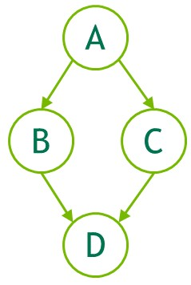

*图 25 使用图 API 创建图的示例*

```cuda
// Create the graph - it starts out empty
cudaGraphCreate(&graph, 0);

// Create the nodes and their dependencies
cudaGraphNode_t nodes[4];
cudaGraphNodeParams kParams = { cudaGraphNodeTypeKernel };
kParams.kernel.func         = (void *)kernelName;
kParams.kernel.gridDim.x    = kParams.kernel.gridDim.y  = kParams.kernel.gridDim.z  = 1;
kParams.kernel.blockDim.x   = kParams.kernel.blockDim.y = kParams.kernel.blockDim.z = 1;

cudaGraphAddNode(&nodes[0], graph, NULL, NULL, 0, &kParams);
cudaGraphAddNode(&nodes[1], graph, &nodes[0], NULL, 1, &kParams);
cudaGraphAddNode(&nodes[2], graph, &nodes[0], NULL, 1, &kParams);
cudaGraphAddNode(&nodes[3], graph, &nodes[1], NULL, 2, &kParams);
```

上面的示例显示了四个内核节点，它们之间具有依赖关系，以说明如何创建一个非常简单的图。在典型的用户应用程序中，还需要添加用于内存操作的节点，例如`cudaGraphAddMemcpyNode()`等。有关添加节点的所有图 API 函数的完整参考，请参阅 [CUDA 运行时 API 文档](https://docs.nvidia.com/cuda/cuda-runtime-api/group__CUDART__GRAPH.html)。

##### 4.2.2.1.2. 流捕获

流捕获提供了一种从现有的基于流的 API 创建图的机制。可以用 `cudaStreamBeginCapture()` 和 `cudaStreamEndCapture()` 调用包围向流提交工作的代码段（包括现有代码）。具体用法见下文。

```cuda
cudaGraph_t graph;

cudaStreamBeginCapture(stream);

kernel_A<<< ..., stream >>>(...);
kernel_B<<< ..., stream >>>(...);
libraryCall(stream);
kernel_C<<< ..., stream >>>(...);

cudaStreamEndCapture(stream, &graph);
```

对 `cudaStreamBeginCapture()` 的调用会将流置于捕获模式。当捕获流时，启动到流中的工作不会排队执行。相反，它被附加到逐步构建的内部图中。然后通过调用 `cudaStreamEndCapture()` 返回该图，这也结束了流的捕获模式。由流捕获主动构建的图被称为 *捕获图。*

除 `cudaStreamLegacy`（“NULL 流”）之外，任何 CUDA 流都可以用于流捕获；尤其可以使用 `cudaStreamPerThread`。如果程序使用旧版流，可将流 0 重新定义为每线程流，而无需更改程序功能。参见[阻塞流、非阻塞流与默认流](#section-2-5-6)。

是否正在捕获流可以使用 `cudaStreamIsCapturing()` 查询。

可以使用 `cudaStreamBeginCaptureToGraph()` 将工作捕获到现有图中。工作不是捕获到内部图，而是捕获到用户提供的图。

###### 4.2.2.1.2.1. 跨流依赖项和事件

流捕获可以处理用 `cudaEventRecord()` 和 `cudaStreamWaitEvent()` 表示的跨流依赖关系，前提是将正在等待的事件记录到同一捕获图中。

当事件记录在处于捕获模式的流中时，会产生 *捕获了事件。* 捕获的事件表示捕获图中的一组节点。

当流等待捕获的事件时，它会将流置于捕获模式（如果尚未处于捕获模式），并且流中的下一项将对捕获的事件中的节点具有额外的依赖性。然后，两个流被捕获到同一个捕获图。

当流捕获中存在交叉流依赖时，`cudaStreamEndCapture()`仍必须在调用`cudaStreamBeginCapture()`的同一个流中调用；这是 *产地流*。由于基于事件的依赖关系，任何其他被捕获到同一捕获图的流也必须连接回原点流。如下图所示。所有被捕获到同一捕获图的流都会在 `cudaStreamEndCapture()` 上退出捕获模式。未能重新加入源流将导致整个捕获操作失败。

```cuda
// stream1 is the origin stream
cudaStreamBeginCapture(stream1);

kernel_A<<< ..., stream1 >>>(...);

// Fork into stream2
cudaEventRecord(event1, stream1);
cudaStreamWaitEvent(stream2, event1);

kernel_B<<< ..., stream1 >>>(...);
kernel_C<<< ..., stream2 >>>(...);

// Join stream2 back to origin stream (stream1)
cudaEventRecord(event2, stream2);
cudaStreamWaitEvent(stream1, event2);

kernel_D<<< ..., stream1 >>>(...);

// End capture in the origin stream
cudaStreamEndCapture(stream1, &graph);

// stream1 and stream2 no longer in capture mode
```

上述代码返回的图如 [图 25](#section-4-2-2-1-1) 所示。

> [!NOTE]
> **说明**
> 当流退出捕获模式时，流中的下一个非捕获项（如果有）仍将依赖于最近的先前非捕获项，尽管中间项已被删除。

###### 4.2.2.1.2.2. 禁止和未处理的操作

同步或查询正在捕获的流或捕获的事件的执行状态是无效的，因为它们不代表计划执行的项目。当任何关联的流处于捕获模式时，查询包含活动流捕获的更广泛句柄（例如设备或上下文句柄）的执行状态或同步它也是无效的。

当捕获同一上下文中的任何流且不是使用 `cudaStreamNonBlocking` 创建时，任何尝试使用旧版流的行为都是无效的。这是因为旧版流句柄始终包含其他流；排队到旧版流会创建对正在捕获的流的依赖关系，查询或同步它会查询或同步正在捕获的流。

因此，在这种情况下调用同步 API 也是无效的。例如，`cudaMemcpy()` 是同步 API：它会将工作加入传统流，并在返回前与该流同步。

> [!NOTE]
> **说明**
> 作为一般规则，当依赖关系将捕获的内容与未捕获的内容连接起来并排队执行时，CUDA 更愿意返回错误而不是忽略依赖关系。将流置于或退出捕获模式时例外；这切断了模式转换之前和之后添加到流的项目之间的依赖关系。

如果某个正在捕获的流与一个捕获图关联，却等待了属于另一个捕获图的已捕获事件，则试图以此合并两个独立捕获图的做法无效。如果未指定 `cudaEventWaitExternal` 标志，正在捕获的流等待一个未捕获事件的做法也无效。

目前，图中不支持少数会将异步操作排入流的 API；如果用正在捕获的流调用这些 API（例如 `cudaStreamAttachMemAsync()`），将返回错误。

###### 4.2.2.1.2.3. 无效

当在流捕获期间尝试无效操作时，任何关联的捕获图都是 *无效的*。当捕获图无效时，进一步使用任何正在捕获的流或与该图关联的捕获事件都是无效的，并将返回错误，直到流捕获以 `cudaStreamEndCapture()` 结束。此调用将使关联的流退出捕获模式，但也会返回错误值和 NULL 图。

###### 4.2.2.1.2.4. 捕捉内省

可以使用 `cudaStreamGetCaptureInfo()` 检查活动的流捕获操作。用户可由此获取捕获状态、捕获在进程内唯一的 ID、底层图对象，以及流中下一个待捕获节点的依赖关系/边数据。利用这些依赖关系信息，可以取得流中最后一个已捕获节点的句柄。

##### 4.2.2.1.3. 把它们放在一起

[图 25](#section-4-2-2-1-1) 中的示例是一个简单的示例，旨在从概念上显示一个小图。在使用 CUDA 图的应用程序中，使用图 API 或流捕获会更加复杂。以下代码片段显示了图 API 和流捕获的并排比较，以创建 CUDA 图来执行简单的两阶段归约算法。

[图 26](#section-4-2-2-1-3)展示了这个 CUDA 图。该图由 `cudaGraphDebugDotPrint` 根据以下代码生成，经少量调整以提高可读性，再通过 [Graphviz](https://graphviz.org/) 渲染。

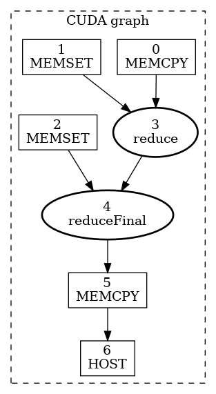

*图 26 经过两级简化的 CUDA 图示例内核*

**图 API**

```cuda
void cudaGraphsManual(float  *inputVec_h,
                      float  *inputVec_d,
                      double *outputVec_d,
                      double *result_d,
                      size_t  inputSize,
                      size_t  numOfBlocks)
{
   cudaStream_t                 streamForGraph;
   cudaGraph_t                  graph;
   std::vector<cudaGraphNode_t> nodeDependencies;
   cudaGraphNode_t              memcpyNode, kernelNode, memsetNode;
   double                       result_h = 0.0;

   cudaStreamCreate(&streamForGraph);

   cudaKernelNodeParams kernelNodeParams = {0};
   cudaMemcpy3DParms    memcpyParams     = {0};
   cudaMemsetParams     memsetParams     = {0};

   memcpyParams.srcArray = NULL;
   memcpyParams.srcPos   = make_cudaPos(0, 0, 0);
   memcpyParams.srcPtr   = make_cudaPitchedPtr(inputVec_h, sizeof(float) * inputSize, inputSize, 1);
   memcpyParams.dstArray = NULL;
   memcpyParams.dstPos   = make_cudaPos(0, 0, 0);
   memcpyParams.dstPtr   = make_cudaPitchedPtr(inputVec_d, sizeof(float) * inputSize, inputSize, 1);
   memcpyParams.extent   = make_cudaExtent(sizeof(float) * inputSize, 1, 1);
   memcpyParams.kind     = cudaMemcpyHostToDevice;

   memsetParams.dst         = (void *)outputVec_d;
   memsetParams.value       = 0;
   memsetParams.pitch       = 0;
   memsetParams.elementSize = sizeof(float); // elementSize can be max 4 bytes
   memsetParams.width       = numOfBlocks * 2;
   memsetParams.height      = 1;

   cudaGraphCreate(&graph, 0);
   cudaGraphAddMemcpyNode(&memcpyNode, graph, NULL, 0, &memcpyParams);
   cudaGraphAddMemsetNode(&memsetNode, graph, NULL, 0, &memsetParams);

   nodeDependencies.push_back(memsetNode);
   nodeDependencies.push_back(memcpyNode);

   void *kernelArgs[4] = {(void *)&inputVec_d, (void *)&outputVec_d, &inputSize, &numOfBlocks};

   kernelNodeParams.func           = (void *)reduce;
   kernelNodeParams.gridDim        = dim3(numOfBlocks, 1, 1);
   kernelNodeParams.blockDim       = dim3(THREADS_PER_BLOCK, 1, 1);
   kernelNodeParams.sharedMemBytes = 0;
   kernelNodeParams.kernelParams   = (void **)kernelArgs;
   kernelNodeParams.extra          = NULL;

   cudaGraphAddKernelNode(
      &kernelNode, graph, nodeDependencies.data(), nodeDependencies.size(), &kernelNodeParams);

   nodeDependencies.clear();
   nodeDependencies.push_back(kernelNode);

   memset(&memsetParams, 0, sizeof(memsetParams));
   memsetParams.dst         = result_d;
   memsetParams.value       = 0;
   memsetParams.elementSize = sizeof(float);
   memsetParams.width       = 2;
   memsetParams.height      = 1;
   cudaGraphAddMemsetNode(&memsetNode, graph, NULL, 0, &memsetParams);

   nodeDependencies.push_back(memsetNode);

   memset(&kernelNodeParams, 0, sizeof(kernelNodeParams));
   kernelNodeParams.func           = (void *)reduceFinal;
   kernelNodeParams.gridDim        = dim3(1, 1, 1);
   kernelNodeParams.blockDim       = dim3(THREADS_PER_BLOCK, 1, 1);
   kernelNodeParams.sharedMemBytes = 0;
   void *kernelArgs2[3]            = {(void *)&outputVec_d, (void *)&result_d, &numOfBlocks};
   kernelNodeParams.kernelParams   = kernelArgs2;
   kernelNodeParams.extra          = NULL;

   cudaGraphAddKernelNode(
      &kernelNode, graph, nodeDependencies.data(), nodeDependencies.size(), &kernelNodeParams);

   nodeDependencies.clear();
   nodeDependencies.push_back(kernelNode);

   memset(&memcpyParams, 0, sizeof(memcpyParams));

   memcpyParams.srcArray = NULL;
   memcpyParams.srcPos   = make_cudaPos(0, 0, 0);
   memcpyParams.srcPtr   = make_cudaPitchedPtr(result_d, sizeof(double), 1, 1);
   memcpyParams.dstArray = NULL;
   memcpyParams.dstPos   = make_cudaPos(0, 0, 0);
   memcpyParams.dstPtr   = make_cudaPitchedPtr(&result_h, sizeof(double), 1, 1);
   memcpyParams.extent   = make_cudaExtent(sizeof(double), 1, 1);
   memcpyParams.kind     = cudaMemcpyDeviceToHost;

   cudaGraphAddMemcpyNode(&memcpyNode, graph, nodeDependencies.data(), nodeDependencies.size(), &memcpyParams);
   nodeDependencies.clear();
   nodeDependencies.push_back(memcpyNode);

   cudaGraphNode_t    hostNode;
   cudaHostNodeParams hostParams = {0};
   hostParams.fn                 = myHostNodeCallback;
   callBackData_t hostFnData;
   hostFnData.data     = &result_h;
   hostFnData.fn_name  = "cudaGraphsManual";
   hostParams.userData = &hostFnData;

   cudaGraphAddHostNode(&hostNode, graph, nodeDependencies.data(), nodeDependencies.size(), &hostParams);
}
```

**流捕获**

```cuda
void cudaGraphsUsingStreamCapture(float  *inputVec_h,
                      float  *inputVec_d,
                      double *outputVec_d,
                      double *result_d,
                      size_t  inputSize,
                      size_t  numOfBlocks)
{
   cudaStream_t stream1, stream2, stream3, streamForGraph;
   cudaEvent_t  forkStreamEvent, memsetEvent1, memsetEvent2;
   cudaGraph_t  graph;
   double       result_h = 0.0;

   cudaStreamCreate(&stream1);
   cudaStreamCreate(&stream2);
   cudaStreamCreate(&stream3);
   cudaStreamCreate(&streamForGraph);

   cudaEventCreate(&forkStreamEvent);
   cudaEventCreate(&memsetEvent1);
   cudaEventCreate(&memsetEvent2);

   cudaStreamBeginCapture(stream1, cudaStreamCaptureModeGlobal);

   cudaEventRecord(forkStreamEvent, stream1);
   cudaStreamWaitEvent(stream2, forkStreamEvent, 0);
   cudaStreamWaitEvent(stream3, forkStreamEvent, 0);

   cudaMemcpyAsync(inputVec_d, inputVec_h, sizeof(float) * inputSize, cudaMemcpyDefault, stream1);

   cudaMemsetAsync(outputVec_d, 0, sizeof(double) * numOfBlocks, stream2);

   cudaEventRecord(memsetEvent1, stream2);

   cudaMemsetAsync(result_d, 0, sizeof(double), stream3);
   cudaEventRecord(memsetEvent2, stream3);

   cudaStreamWaitEvent(stream1, memsetEvent1, 0);

   reduce<<<numOfBlocks, THREADS_PER_BLOCK, 0, stream1>>>(inputVec_d, outputVec_d, inputSize, numOfBlocks);

   cudaStreamWaitEvent(stream1, memsetEvent2, 0);

   reduceFinal<<<1, THREADS_PER_BLOCK, 0, stream1>>>(outputVec_d, result_d, numOfBlocks);
   cudaMemcpyAsync(&result_h, result_d, sizeof(double), cudaMemcpyDefault, stream1);

   callBackData_t hostFnData = {0};
   hostFnData.data           = &result_h;
   hostFnData.fn_name        = "cudaGraphsUsingStreamCapture";
   cudaHostFn_t fn           = myHostNodeCallback;
   cudaLaunchHostFunc(stream1, fn, &hostFnData);
   cudaStreamEndCapture(stream1, &graph);
}
```

#### 4.2.2.2. 图实例化

通过图 API 或流捕获创建图后，都必须将其实例化为可执行图，随后才能启动。假设已成功创建 `cudaGraph_t graph`，以下代码将实例化该图并创建可执行图 `cudaGraphExec_t graphExec`：

```cuda
cudaGraphExec_t graphExec;
cudaGraphInstantiate(&graphExec, graph, NULL, NULL, 0);
```

#### 4.2.2.3. 图执行

创建图并将其实例化为可执行图后，即可启动该图。假设已成功创建 `cudaGraphExec_t graphExec`，以下代码片段会将图提交到指定流中启动：

```cuda
cudaGraphLaunch(graphExec, stream);
```

将所有内容放在一起并使用 [第 4.2.2.1.2 节](#section-4-2-2-1-2) 中的流捕获示例，以下代码片段将创建一个图、实例化它并启动它：

```cuda
cudaGraph_t graph;

cudaStreamBeginCapture(stream);

kernel_A<<< ..., stream >>>(...);
kernel_B<<< ..., stream >>>(...);
libraryCall(stream);
kernel_C<<< ..., stream >>>(...);

cudaStreamEndCapture(stream, &graph);

cudaGraphExec_t graphExec;
cudaGraphInstantiate(&graphExec, graph, NULL, NULL, 0);
cudaGraphLaunch(graphExec, stream);
```

### 4.2.3. 更新实例化图

当工作流程发生变化时，图就会过时并且必须进行修改。图结构（例如拓扑或节点类型）的重大更改需要重新实例化，因为必须重新应用与拓扑相关的优化。然而，通常只有节点参数（例如内核参数和内存地址）发生变化，而图拓扑保持不变。对于这种情况，CUDA 提供了一种轻量级的“图更新”机制，允许就地修改某些节点参数，而无需重建整个图，这比重新实例化要高效得多。

更新将在下次启动图时生效，因此它们不会影响之前的图启动，即使它们在更新时正在运行。图可以重复更新和重新启动，因此多个更新/启动可以在流上排队。

CUDA 提供了两种更新实例化图参数的机制，全图更新和单个节点更新。整个图更新允许用户提供拓扑相同的 `cudaGraph_t` 对象，其节点包含更新的参数。单个节点更新允许用户显式更新单个节点的参数。当更新大量节点时，或者当调用者未知图拓扑时（即，图由库调用的流捕获产生），使用更新的 `cudaGraph_t` 会更方便。当更改数量较小且用户拥有需要更新的节点的句柄时，首选使用单个节点更新。单个节点更新会跳过未更改节点的拓扑检查和比较，因此在许多情况下会更有效。

CUDA 还提供了一种启用和禁用各个节点而不影响其当前参数的机制。

以下部分更详细地解释了每种方法。

#### 4.2.3.1. 全图更新

`cudaGraphExecUpdate()` 允许使用拓扑相同的图（“更新”图）中的参数更新实例化图（“原始图”）。更新图的拓扑必须与用于实例化 `cudaGraphExec_t` 的原始图相同。此外，指定依赖项的顺序必须匹配。最后，CUDA 需要对汇聚节点（没有依赖关系的节点）进行一致排序。 CUDA 依赖于特定 API 调用的顺序来实现一致的接收器节点排序。

更明确地说，遵循以下规则将导致 `cudaGraphExecUpdate()` 确定性地对原始图中的节点和更新图中的节点进行配对：

1. 对于任何捕获流，必须以相同的顺序执行对该流进行操作的 API 调用，包括事件等待和不直接对应于节点创建的其他 API 调用。
2. 直接操作给定图节点的传入边（包括捕获的流 API、节点添加 API 和边添加/删除 API）的 API 调用必须以相同的顺序进行。此外，当在数组中指定这些 API 的依赖项时，在这些数组内指定依赖项的顺序必须匹配。
3. 接收器节点的顺序必须一致。接收器节点是调用 `cudaGraphExecUpdate()` 时最终图中没有依赖节点/传出边的节点。以下操作会影响接收器节点排序（如果存在）并且必须（作为组合集）以相同的顺序进行：
- 节点添加 API 产生接收器节点。
- 边缘移除导致节点成为汇聚节点。
- `cudaStreamUpdateCaptureDependencies()`，如果它从捕获流的依赖项集中删除接收器节点。
- `cudaStreamEndCapture()` .

以下示例显示如何使用 API 更新实例化图：

```cuda
cudaGraphExec_t graphExec = NULL;

for (int i = 0; i < 10; i++) {
    cudaGraph_t graph;
    cudaGraphExecUpdateResult updateResult;
    cudaGraphNode_t errorNode;

    // In this example we use stream capture to create the graph.
    // You can also use the Graph API to produce a graph.
    cudaStreamBeginCapture(stream, cudaStreamCaptureModeGlobal);

    // Call a user-defined, stream based workload, for example
    do_cuda_work(stream);

    cudaStreamEndCapture(stream, &graph);

    // If we've already instantiated the graph, try to update it directly
    // and avoid the instantiation overhead
    if (graphExec != NULL) {
        // If the graph fails to update, errorNode will be set to the
        // node causing the failure and updateResult will be set to a
        // reason code.
        cudaGraphExecUpdate(graphExec, graph, &errorNode, &updateResult);
    }

    // Instantiate during the first iteration or whenever the update
    // fails for any reason
    if (graphExec == NULL || updateResult != cudaGraphExecUpdateSuccess) {

        // If a previous update failed, destroy the cudaGraphExec_t
        // before re-instantiating it
        if (graphExec != NULL) {
            cudaGraphExecDestroy(graphExec);
        }
        // Instantiate graphExec from graph. The error node and
        // error message parameters are unused here.
        cudaGraphInstantiate(&graphExec, graph, NULL, NULL, 0);
    }

    cudaGraphDestroy(graph);
    cudaGraphLaunch(graphExec, stream);
    cudaStreamSynchronize(stream);
}
```

典型工作流程是使用流捕获或图 API 创建初始 `cudaGraph_t`，然后将该 `cudaGraph_t` 实例化并正常启动。初次启动后，使用与初始图相同的方法创建新的 `cudaGraph_t`，并调用 `cudaGraphExecUpdate()`。如果图更新成功（如上例中的 `updateResult` 参数所示），则启动更新后的 `cudaGraphExec_t`。如果更新因故失败，则调用 `cudaGraphExecDestroy()` 和 `cudaGraphInstantiate()` 销毁原来的 `cudaGraphExec_t`，再实例化一个新的可执行图。

也可以直接更新 `cudaGraph_t` 节点（即使用 `cudaGraphKernelNodeSetParams()`），然后再更新 `cudaGraphExec_t`；但使用下一节介绍的显式节点更新 API 会更高效。

条件句柄的标志和默认值会作为图更新的一部分进行更新。

有关使用和当前限制的更多信息，请参阅 [图 API](https://docs.nvidia.com/cuda/cuda-runtime-api/group__CUDART__GRAPH.html#group__CUDART__GRAPH)。

#### 4.2.3.2. 单个节点更新

实例化的图节点参数可以直接更新。这消除了实例化的开销以及创建新 `cudaGraph_t` 的开销。如果需要更新的节点数量相对于图中的节点总数而言较少，则最好单独更新节点。以下方法可用于更新 `cudaGraphExec_t` 节点：

**表 8 个单独节点更新 API**

| API | 节点类型 |
| --- | --- |
| `cudaGraphExecKernelNodeSetParams()` | 内核节点 |
| `cudaGraphExecMemcpyNodeSetParams()` | 内存复制节点 |
| `cudaGraphExecMemsetNodeSetParams()` | 内存设置节点 |
| `cudaGraphExecHostNodeSetParams()` | 主机节点 |
| `cudaGraphExecChildGraphNodeSetParams()` | 儿童图节点 |
| `cudaGraphExecEventRecordNodeSetEvent()` | 事件记录节点 |
| `cudaGraphExecEventWaitNodeSetEvent()` | 事件等待节点 |
| `cudaGraphExecExternalSemaphoresSignalNodeSetParams()` | 外部信号量信号节点 |
| `cudaGraphExecExternalSemaphoresWaitNodeSetParams()` | 外部信号量等待节点 |

有关使用和当前限制的更多信息，请参阅 [图 API](https://docs.nvidia.com/cuda/cuda-runtime-api/group__CUDART__GRAPH.html#group__CUDART__GRAPH)。

#### 4.2.3.3. 单个节点启用

可以使用 `cudaGraphNodeSetEnabled()` API 启用或禁用实例化图中的内核、memset 和 memcpy 节点。这允许创建一个图，其中包含所需功能的超集，可以为每次启动进行自定义。可以使用 `cudaGraphNodeGetEnabled()` API 查询节点的启用状态。

禁用的节点在功能上等同于空节点，直到重新启用为止。节点参数不受启用/禁用节点的影响。启用状态不受单个节点更新或使用 `cudaGraphExecUpdate()` 更新整个图的影响。节点禁用时的参数更新将在节点重新启用时生效。

有关用法和当前限制的更多信息，请参阅 [图 API](https://docs.nvidia.com/cuda/cuda-runtime-api/group__CUDART__GRAPH.html#group__CUDART__GRAPH)。

#### 4.2.3.4. 图更新限制

内核节点：

- 该函数所属的上下文不能更改。
- 其函数最初未使用 CUDA 动态并行的节点无法更新为使用 CUDA 动态并行的函数。

`cudaMemset` 和 `cudaMemcpy` 节点：

- 分配/映射操作数的 CUDA 设备无法更改。
- 源/目标内存必须从与原始源/目标内存相同的上下文分配。
- 仅可更改 1D `cudaMemset` / `cudaMemcpy` 节点。

其他 memcpy 节点限制：

- 不支持更改源或目标内存类型（例如 `cudaPitchedPtr`、`cudaArray_t` 等），也不支持更改传输类型（即 `cudaMemcpyKind`）。

外部信号量等待节点和记录节点：

- 不支持更改信号量的数量。

条件节点：

- 各图中的句柄创建及赋值顺序必须一致。
- 不支持更改节点参数（例如条件中的图数量、节点上下文等）。
- 更改条件体图中节点的参数须遵守上述规则。

内存节点：

- 如果 `cudaGraph_t` 当前实例化为不同的 `cudaGraphExec_t`，则无法使用 `cudaGraph_t` 更新 `cudaGraphExec_t`。

对主机节点、事件记录节点或事件等待节点的更新没有限制。

### 4.2.4. 有条件图节点

条件节点支持对其所包含的图进行条件执行和循环执行。这样便可完全在图中表示动态和迭代式工作流，使主机 CPU 能够并行执行其他工作。

当条件节点的依赖性得到满足时，在设备上执行条件值的评估。条件节点可以是以下类型之一：

- 条件 [中频节点](#section-4-2-4-3) 如果执行节点时条件值非零，则执行一次其主体图。可以提供可选的第二主体图，如果执行节点时条件值为零，则将执行一次。
- 条件 [WHILE 节点](#section-4-2-4-4) 如果执行节点时条件值非零，则执行其主体图，并将继续执行其主体图，直到条件值为零。
- 条件 [SWITCH 节点](#section-4-2-4-5) 如果条件值等于 n，则执行零索引的第 n 个主体图一次。如果条件值不对应于身体图，则不启动身体图。

通过 [条件句柄](#section-4-2-4-1) 访问条件值，该句柄必须在节点之前创建。设备代码可以使用 `cudaGraphSetConditional()` 设置条件值。创建句柄时，还可以指定一个在每次图启动时应用的默认值。

创建条件节点时，系统会创建一个空图并向用户返回其句柄，以便填充该图。可以使用[图 API](#section-4-2-2-1-1) 或 [`cudaStreamBeginCaptureToGraph()`](#section-4-2-2-1-2) 填充此条件主体图。

条件节点可以嵌套。

#### 4.2.4.1. 条件句柄

条件值由 `cudaGraphConditionalHandle` 表示，并由 `cudaGraphConditionalHandleCreate()` 创建。

该句柄必须与单个条件节点关联。句柄无法被破坏，因此无需跟踪它们。

如果创建句柄时指定了 `cudaGraphCondAssignDefault`，则每次图执行开始时，条件值都会初始化为指定的默认值。如果未提供此标志，则每次图执行开始时的条件值均未定义，代码不应假定该条件值会在多次执行之间保持不变。

与句柄关联的默认值和标志将在 [整个图更新](#section-4-2-3-1) 期间更新。

#### 4.2.4.2. 条件节点主体图要求

一般要求：

- 图的节点必须全部驻留在单个设备上。
- 该图只能包含内核节点、空节点、memcpy 节点、memset 节点、子图节点和条件节点。

内核节点：

- 不允许在图中使用 CUDA 动态并行或内核的设备图启动。
- 只要 MPS 未使用，就允许协作启动。

Memcpy/Memset 节点：

- 仅允许涉及设备内存和/或固定设备映射主机内存的副本/内存集。
- 不允许涉及 CUDA 数组的副本/内存集。
- 实例化时，两个操作数都必须可从当前设备访问。请注意，即使目标是另一设备上的内存，复制操作仍由图所在的设备执行。

#### 4.2.4.3. 条件 IF 节点

如果执行节点时条件非零，则 IF 节点的主体图将被执行一次。下图描绘了一个 3 节点图，其中中间节点 B 是条件节点：


*图 27 条件 IF 节点*

以下代码说明了如何创建包含 IF 条件节点的图。条件的默认值是使用上游内核设置的。条件的主体使用 [图 API](#section-4-2-2-1-1) 填充。

```cuda
__global__ void setHandle(cudaGraphConditionalHandle handle, int value)
{
    ...
    // Set the condition value to the value passed to the kernel
    cudaGraphSetConditional(handle, value);
    ...
}

void graphSetup() {
    cudaGraph_t graph;
    cudaGraphExec_t graphExec;
    cudaGraphNode_t node;
    void *kernelArgs[2];
    int value = 1;

    // Create the graph
    cudaGraphCreate(&graph, 0);

    // Create the conditional handle; because no default value is provided, the condition value is undefined at the start of each graph execution
    cudaGraphConditionalHandle handle;
    cudaGraphConditionalHandleCreate(&handle, graph);

    // Use a kernel upstream of the conditional to set the handle value
    cudaGraphNodeParams params = { cudaGraphNodeTypeKernel };
    params.kernel.func = (void *)setHandle;
    params.kernel.gridDim.x = params.kernel.gridDim.y = params.kernel.gridDim.z = 1;
    params.kernel.blockDim.x = params.kernel.blockDim.y = params.kernel.blockDim.z = 1;
    params.kernel.kernelParams = kernelArgs;
    kernelArgs[0] = &handle;
    kernelArgs[1] = &value;
    cudaGraphAddNode(&node, graph, NULL, 0, &params);

    // Create and add the conditional node
    cudaGraphNodeParams cParams = { cudaGraphNodeTypeConditional };
    cParams.conditional.handle = handle;
    cParams.conditional.type   = cudaGraphCondTypeIf;
    cParams.conditional.size   = 1; // There is only an "if" body graph
    cudaGraphAddNode(&node, graph, &node, 1, &cParams);

    // Get the body graph of the conditional node
    cudaGraph_t bodyGraph = cParams.conditional.phGraph_out[0];

    // Populate the body graph of the IF conditional node
    ...
    cudaGraphAddNode(&node, bodyGraph, NULL, 0, &params);

    // Instantiate and launch the graph
    cudaGraphInstantiate(&graphExec, graph, NULL, NULL, 0);
    cudaGraphLaunch(graphExec, 0);
    cudaDeviceSynchronize();

    // Clean up
    cudaGraphExecDestroy(graphExec);
    cudaGraphDestroy(graph);
}
```

IF 节点还可以有一个可选的第二主体图，如果条件值为零，则在执行节点时执行一次。

```cuda
void graphSetup() {
    cudaGraph_t graph;
    cudaGraphExec_t graphExec;
    cudaGraphNode_t node;
    void *kernelArgs[2];
    int value = 1;

    // Create the graph
    cudaGraphCreate(&graph, 0);

    // Create the conditional handle; because no default value is provided, the condition value is undefined at the start of each graph execution
    cudaGraphConditionalHandle handle;
    cudaGraphConditionalHandleCreate(&handle, graph);

    // Use a kernel upstream of the conditional to set the handle value
    cudaGraphNodeParams params = { cudaGraphNodeTypeKernel };
    params.kernel.func = (void *)setHandle;
    params.kernel.gridDim.x = params.kernel.gridDim.y = params.kernel.gridDim.z = 1;
    params.kernel.blockDim.x = params.kernel.blockDim.y = params.kernel.blockDim.z = 1;
    params.kernel.kernelParams = kernelArgs;
    kernelArgs[0] = &handle;
    kernelArgs[1] = &value;
    cudaGraphAddNode(&node, graph, NULL, 0, &params);

    // Create and add the IF conditional node
    cudaGraphNodeParams cParams = { cudaGraphNodeTypeConditional };
    cParams.conditional.handle = handle;
    cParams.conditional.type   = cudaGraphCondTypeIf;
    cParams.conditional.size   = 2; // There is both an "if" and an "else" body graph
    cudaGraphAddNode(&node, graph, &node, 1, &cParams);

    // Get the body graphs of the conditional node
    cudaGraph_t ifBodyGraph = cParams.conditional.phGraph_out[0];
    cudaGraph_t elseBodyGraph = cParams.conditional.phGraph_out[1];

    // Populate the body graphs of the IF conditional node
    ...
    cudaGraphAddNode(&node, ifBodyGraph, NULL, 0, &params);
    ...
    cudaGraphAddNode(&node, elseBodyGraph, NULL, 0, &params);

    // Instantiate and launch the graph
    cudaGraphInstantiate(&graphExec, graph, NULL, NULL, 0);
    cudaGraphLaunch(graphExec, 0);
    cudaDeviceSynchronize();

    // Clean up
    cudaGraphExecDestroy(graphExec);
    cudaGraphDestroy(graph);
}
```

#### 4.2.4.4. 有条件的 WHILE 节点

只要条件非零，WHILE 节点的主体图就会被执行。当执行节点时以及主体图完成后，将评估条件。下图描绘了一个 3 节点图，其中中间节点 B 是条件节点：


*图 28 条件 WHILE 节点*

以下代码说明了如何创建包含 WHILE 条件节点的图。该句柄是使用 *cudaGraphCondAssignDefault* 创建的，以避免需要上游内核。条件的主体使用 [图 API](#section-4-2-2-1-1) 填充。

```cuda
__global__ void loopKernel(cudaGraphConditionalHandle handle, char *dPtr)
{
   // Decrement the value of dPtr and set the condition value to 0 once dPtr is 0
   if (--(*dPtr) == 0) {
      cudaGraphSetConditional(handle, 0);
   }
}

void graphSetup() {
    cudaGraph_t graph;
    cudaGraphExec_t graphExec;
    cudaGraphNode_t node;
    void *kernelArgs[2];

    // Allocate a byte of device memory to use as input
    char *dPtr;
    cudaMalloc((void **)&dPtr, 1);

    // Create the graph
    cudaGraphCreate(&graph, 0);

    // Create the conditional handle with a default value of 1
    cudaGraphConditionalHandle handle;
    cudaGraphConditionalHandleCreate(&handle, graph, 1, cudaGraphCondAssignDefault);

    // Create and add the WHILE conditional node
    cudaGraphNodeParams cParams = { cudaGraphNodeTypeConditional };
    cParams.conditional.handle = handle;
    cParams.conditional.type   = cudaGraphCondTypeWhile;
    cParams.conditional.size   = 1;
    cudaGraphAddNode(&node, graph, NULL, 0, &cParams);

    // Get the body graph of the conditional node
    cudaGraph_t bodyGraph = cParams.conditional.phGraph_out[0];

    // Populate the body graph of the conditional node
    cudaGraphNodeParams params = { cudaGraphNodeTypeKernel };
    params.kernel.func = (void *)loopKernel;
    params.kernel.gridDim.x = params.kernel.gridDim.y = params.kernel.gridDim.z = 1;
    params.kernel.blockDim.x = params.kernel.blockDim.y = params.kernel.blockDim.z = 1;
    params.kernel.kernelParams = kernelArgs;
    kernelArgs[0] = &handle;
    kernelArgs[1] = &dPtr;
    cudaGraphAddNode(&node, bodyGraph, NULL, 0, &params);

    // Initialize device memory, instantiate, and launch the graph
    cudaMemset(dPtr, 10, 1); // Set dPtr to 10; the loop will run until dPtr is 0
    cudaGraphInstantiate(&graphExec, graph, NULL, NULL, 0);
    cudaGraphLaunch(graphExec, 0);
    cudaDeviceSynchronize();

    // Clean up
    cudaGraphExecDestroy(graphExec);
    cudaGraphDestroy(graph);
    cudaFree(dPtr);
}
```

#### 4.2.4.5. 条件 SWITCH 节点

如果执行节点时条件等于 n，则 SWITCH 节点的零索引第 n 个主体图将被执行一次。下图描绘了一个 3 节点图，其中中间节点 B 是条件节点：

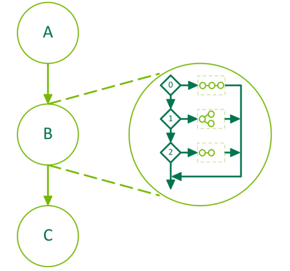

*图 29 条件 SWITCH 节点*

以下代码说明了如何创建包含 SWITCH 条件节点的图。使用上游内核设置条件值。条件语句的主体是使用 [图 API](#section-4-2-2-1-1) 填充的。

```cuda
__global__ void setHandle(cudaGraphConditionalHandle handle, int value)
{
    ...
    // Set the condition value to the value passed to the kernel
    cudaGraphSetConditional(handle, value);
    ...
}

void graphSetup() {
    cudaGraph_t graph;
    cudaGraphExec_t graphExec;
    cudaGraphNode_t node;
    void *kernelArgs[2];
    int value = 1;

    // Create the graph
    cudaGraphCreate(&graph, 0);

    // Create the conditional handle; because no default value is provided, the condition value is undefined at the start of each graph execution
    cudaGraphConditionalHandle handle;
    cudaGraphConditionalHandleCreate(&handle, graph);

    // Use a kernel upstream of the conditional to set the handle value
    cudaGraphNodeParams params = { cudaGraphNodeTypeKernel };
    params.kernel.func = (void *)setHandle;
    params.kernel.gridDim.x = params.kernel.gridDim.y = params.kernel.gridDim.z = 1;
    params.kernel.blockDim.x = params.kernel.blockDim.y = params.kernel.blockDim.z = 1;
    params.kernel.kernelParams = kernelArgs;
    kernelArgs[0] = &handle;
    kernelArgs[1] = &value;
    cudaGraphAddNode(&node, graph, NULL, 0, &params);

    // Create and add the conditional SWITCH node
    cudaGraphNodeParams cParams = { cudaGraphNodeTypeConditional };
    cParams.conditional.handle = handle;
    cParams.conditional.type   = cudaGraphCondTypeSwitch;
    cParams.conditional.size   = 5;
    cudaGraphAddNode(&node, graph, &node, 1, &cParams);

    // Get the body graphs of the conditional node
    cudaGraph_t *bodyGraphs = cParams.conditional.phGraph_out;

    // Populate the body graphs of the SWITCH conditional node
    ...
    cudaGraphAddNode(&node, bodyGraphs[0], NULL, 0, &params);
    ...
    cudaGraphAddNode(&node, bodyGraphs[4], NULL, 0, &params);

    // Instantiate and launch the graph
    cudaGraphInstantiate(&graphExec, graph, NULL, NULL, 0);
    cudaGraphLaunch(graphExec, 0);
    cudaDeviceSynchronize();

    // Clean up
    cudaGraphExecDestroy(graphExec);
    cudaGraphDestroy(graph);
}
```

### 4.2.5. 图内存节点

#### 4.2.5.1. 简介

图内存节点允许图创建和拥有内存分配。图内存节点具有 GPU 有序生命周期语义，它指示何时允许在设备上访问内存。这些 GPU 有序生命周期语义支持驱动程序-托管内存重用，并与流有序分配 API `cudaMallocAsync` 和 `cudaFreeAsync` 的语义相匹配，这些语义可以在创建图时捕获。

图分配在图的生命周期内具有固定的地址，包括重复实例化和启动。这允许图中的其他操作直接引用内存，而无需更新图，即使 CUDA 更改支持物理内存时也是如此。在图中，其图有序生命周期不重叠的分配可以使用相同的底层物理内存。

CUDA 可以在多个图的分配之间复用同一物理内存，并按照 GPU 排序的生命期语义为虚拟地址映射创建别名。例如，当不同的图启动到同一流中时，CUDA 可以让多个虚拟地址为同一物理内存创建别名，以满足生命期仅限于单个图的分配需求。

#### 4.2.5.2. API 基础知识

图内存节点是图节点表示内存分配或自由操作。简而言之，分配内存的节点称为分配节点。同样，释放内存的节点称为空闲节点。由分配节点创建的分配称为图分配。 CUDA 在节点创建时为图分配分配虚拟地址。虽然这些虚拟地址在分配节点的生命周期内是固定的，但分配内容在释放操作之后并不持久，并且可能会被引用不同分配的访问覆盖。

每次图运行时，图分配都会被视为重新创建。图分配的生命周期与节点的生命周期不同，当 GPU 执行到达分配图节点时开始，并在发生以下情况之一时结束：

- GPU 执行到达释放图节点
- GPU 执行到达释放 `cudaFreeAsync()` 流调用
- 释放后立即调用 `cudaFree()`

> [!NOTE]
> **说明**
> 即使销毁图会结束分配节点的生命周期，也不会自动释放任何仍处于活动状态的图内存分配。随后必须在另一个图中释放该分配，或使用 `cudaFreeAsync()` / `cudaFree()` 释放。

就像其他 [图结构](#section-4-2-1) 一样，图内存节点在图中按依赖边排序。程序必须保证访问图内存的操作：

- 在分配节点之后排序
- 在释放内存的操作之前命令

图分配生命周期根据 GPU 执行开始并通常结束（与 API 调用相反）。 GPU 排序是工作在 GPU 上运行的顺序，而不是工作排队或描述的顺序。因此，图分配被视为“GPU 有序”。

##### 4.2.5.2.1. 图节点 API

图内存节点可以通过节点创建 API `cudaGraphAddNode` 显式创建。添加 `cudaGraphNodeTypeMemAlloc` 节点时，所分配的地址会通过传入的 `cudaGraphNodeParams` 结构体的 `alloc::dptr` 字段返回给用户。图中所有使用该分配的操作都必须排在分配节点之后；同样，释放节点必须排在图中最后一次使用该分配的操作之后。释放节点使用 `cudaGraphAddNode` 和节点类型 `cudaGraphNodeTypeMemFree` 创建。

在下面的图中，有一个带有分配节点和空闲节点的示例图。内核节点 **一个**、 **乙** 和 **c** 排序在分配节点之后和空闲节点之前，以便内核可以访问分配。内核节点 **e** 未排序在 alloc 节点之后，因此无法安全地访问内存。内核节点 **d** 没有排在空闲节点之前，因此它无法安全地访问内存。

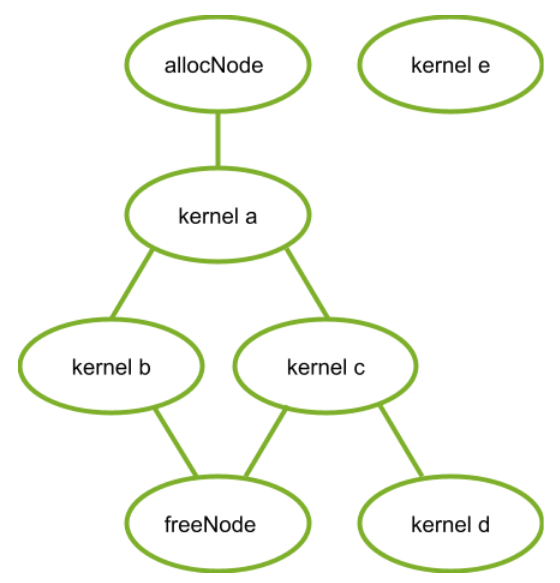

*图 30 内核节点*

以下代码片段在此图中建立图：

```cuda
// Create the graph - it starts out empty
cudaGraphCreate(&graph, 0);

// parameters for a basic allocation
cudaGraphNodeParams params = { cudaGraphNodeTypeMemAlloc };
params.alloc.poolProps.allocType = cudaMemAllocationTypePinned;
params.alloc.poolProps.location.type = cudaMemLocationTypeDevice;
// specify device 0 as the resident device
params.alloc.poolProps.location.id = 0;
params.alloc.bytesize = size;

cudaGraphAddNode(&allocNode, graph, NULL, NULL, 0, &params);

// create a kernel node that uses the graph allocation
cudaGraphNodeParams nodeParams = { cudaGraphNodeTypeKernel };
nodeParams.kernel.kernelParams[0] = params.alloc.dptr;
// ...set other kernel node parameters...

// add the kernel node to the graph
cudaGraphAddNode(&a, graph, &allocNode, NULL, 1, &nodeParams);
cudaGraphAddNode(&b, graph, &a, NULL, 1, &nodeParams);
cudaGraphAddNode(&c, graph, &a, NULL, 1, &nodeParams);
cudaGraphNode_t dependencies[2];
// kernel nodes b and c are using the graph allocation, so the freeing node must depend on them.  Since the dependency of node b on node a establishes an indirect dependency, the free node does not need to explicitly depend on node a.
dependencies[0] = b;
dependencies[1] = c;
cudaGraphNodeParams freeNodeParams = { cudaGraphNodeTypeMemFree };
freeNodeParams.free.dptr = params.alloc.dptr;
cudaGraphAddNode(&freeNode, graph, dependencies, NULL, 2, freeNodeParams);
// free node does not depend on kernel node d, so it must not access the freed graph allocation.
cudaGraphAddNode(&d, graph, &c, NULL, 1, &nodeParams);

// node e does not depend on the allocation node, so it must not access the allocation.  This would be true even if the freeNode depended on kernel node e.
cudaGraphAddNode(&e, graph, NULL, NULL, 0, &nodeParams);
```

##### 4.2.5.2.2. 流捕获

可以通过捕获相应的流有序分配和释放调用 `cudaMallocAsync` 和 `cudaFreeAsync` 来创建图内存节点。在这种情况下，捕获的分配 API 返回的虚拟地址可以由图中的其他操作使用。由于流有序依赖项将被捕获到图中，因此流有序分配 API 的排序要求保证图内存节点将根据捕获的流操作正确排序（对于正确编写的流代码）。

为清晰起见，以下代码片段省略内核节点 **d** 和 **e**，展示如何使用流捕获创建前述图：

```cuda
cudaMallocAsync(&dptr, size, stream1);
kernel_A<<< ..., stream1 >>>(dptr, ...);

// Fork into stream2
cudaEventRecord(event1, stream1);
cudaStreamWaitEvent(stream2, event1);

kernel_B<<< ..., stream1 >>>(dptr, ...);
// event dependencies translated into graph dependencies, so the kernel node created by the capture of kernel C will depend on the allocation node created by capturing the cudaMallocAsync call.
kernel_C<<< ..., stream2 >>>(dptr, ...);

// Join stream2 back to origin stream (stream1)
cudaEventRecord(event2, stream2);
cudaStreamWaitEvent(stream1, event2);

// Free depends on all work accessing the memory.
cudaFreeAsync(dptr, stream1);

// End capture in the origin stream
cudaStreamEndCapture(stream1, &graph);
```

##### 4.2.5.2.3. 在分配图之外访问和释放图内存

图分配不必由创建该分配的图释放。如果图未释放某个分配，该分配会在图执行完毕后继续存在，并且后续 CUDA 操作可以访问它。只要通过 CUDA 事件和其他流顺序约束机制，将访问操作排在分配操作之后，便可以在另一个图中访问该分配，也可以直接通过流操作访问。随后可以通过常规调用 `cudaFree` 或 `cudaFreeAsync` 释放该分配；也可以启动含有对应释放节点的另一个图，或再次启动创建该分配的图（前提是该图使用 [cudaGraphInstantiateFlagAutoFreeOnLaunch](#section-4-2-5-2-4) 标志实例化）。内存释放后再访问它是非法的；必须通过图依赖关系、CUDA 事件和其他流顺序约束机制，将释放操作排在所有访问该内存的操作之后。

> [!NOTE]
> **说明**
> 由于图分配可能共享底层物理内存，因此必须在所有设备操作完成后对自由操作进行排序。带外同步（例如计算内核内基于内存的同步）不足以在内存写入和释放操作之间进行排序。有关更多信息，请参阅与一致性和连贯性相关的 [虚拟别名支持](#section-4-16-5-3) 规则。

以下三个代码片段演示了如何访问分配图之外的图分配，并通过以下方式正确建立排序：使用单个流、在流之间使用事件以及使用烘焙到分配和释放图中的事件。

首先，使用单个流建立排序：

```cuda
// Contents of allocating graph
void *dptr;
cudaGraphNodeParams params = { cudaGraphNodeTypeMemAlloc };
params.alloc.poolProps.allocType = cudaMemAllocationTypePinned;
params.alloc.poolProps.location.type = cudaMemLocationTypeDevice;
params.alloc.bytesize = size;
cudaGraphAddNode(&allocNode, allocGraph, NULL, NULL, 0, &params);
dptr = params.alloc.dptr;

cudaGraphInstantiate(&allocGraphExec, allocGraph, NULL, NULL, 0);

cudaGraphLaunch(allocGraphExec, stream);
kernel<<< ..., stream >>>(dptr, ...);
cudaFreeAsync(dptr, stream);
```

二、在 CUDA 事件上记录并等待建立的排序：

```cuda
// Contents of allocating graph
void *dptr;

// Contents of allocating graph
cudaGraphAddNode(&allocNode, allocGraph, NULL, NULL, 0, &allocNodeParams);
dptr = allocNodeParams.alloc.dptr;

// contents of consuming/freeing graph
kernelNodeParams.kernel.kernelParams[0] = allocNodeParams.alloc.dptr;
cudaGraphAddNode(&freeNode, freeGraph, NULL, NULL, 1, dptr);

cudaGraphInstantiate(&allocGraphExec, allocGraph, NULL, NULL, 0);
cudaGraphInstantiate(&freeGraphExec, freeGraph, NULL, NULL, 0);

cudaGraphLaunch(allocGraphExec, allocStream);

// establish the dependency of stream2 on the allocation node
// note: the dependency could also have been established with a stream synchronize operation
cudaEventRecord(allocEvent, allocStream);
cudaStreamWaitEvent(stream2, allocEvent);

kernel<<< ..., stream2 >>> (dptr, ...);

// establish the dependency between the stream 3 and the allocation use
cudaStreamRecordEvent(streamUseDoneEvent, stream2);
cudaStreamWaitEvent(stream3, streamUseDoneEvent);

// it is now safe to launch the freeing graph, which may also access the memory
cudaGraphLaunch(freeGraphExec, stream3);
```

第三，使用图外部事件节点建立排序：

```cuda
// Contents of allocating graph
void *dptr;
cudaEvent_t allocEvent; // event indicating when the allocation will be ready for use.
cudaEvent_t streamUseDoneEvent; // event indicating when the stream operations are done with the allocation.

// Contents of allocating graph with event record node
cudaGraphAddNode(&allocNode, allocGraph, NULL, NULL, 0, &allocNodeParams);
dptr = allocNodeParams.alloc.dptr;
// note: this event record node depends on the alloc node

cudaGraphNodeParams allocEventNodeParams = { cudaGraphNodeTypeEventRecord };
allocEventNodeParams.eventRecord.event = allocEvent;
cudaGraphAddNode(&recordNode, allocGraph, &allocNode, NULL, 1, allocEventNodeParams);
cudaGraphInstantiate(&allocGraphExec, allocGraph, NULL, NULL, 0);

// contents of consuming/freeing graph with event wait nodes
cudaGraphNodeParams streamWaitEventNodeParams = { cudaGraphNodeTypeEventWait };
streamWaitEventNodeParams.eventWait.event = streamUseDoneEvent;
cudaGraphAddNode(&streamUseDoneEventNode, waitAndFreeGraph, NULL, NULL, 0, streamWaitEventNodeParams);

cudaGraphNodeParams allocWaitEventNodeParams = { cudaGraphNodeTypeEventWait };
allocWaitEventNodeParams.eventWait.event = allocEvent;
cudaGraphAddNode(&allocReadyEventNode, waitAndFreeGraph, NULL, NULL, 0, allocWaitEventNodeParams);

kernelNodeParams->kernelParams[0] = allocNodeParams.alloc.dptr;

// The allocReadyEventNode provides ordering with the alloc node for use in a consuming graph.
cudaGraphAddNode(&kernelNode, waitAndFreeGraph, &allocReadyEventNode, NULL, 1, &kernelNodeParams);

// The free node has to be ordered after both external and internal users.
// Thus the node must depend on both the kernelNode and the streamUseDoneEventNode.
dependencies[0] = kernelNode;
dependencies[1] = streamUseDoneEventNode;

cudaGraphNodeParams freeNodeParams = { cudaGraphNodeTypeMemFree };
freeNodeParams.free.dptr = dptr;
cudaGraphAddNode(&freeNode, waitAndFreeGraph, &dependencies, NULL, 2, freeNodeParams);
cudaGraphInstantiate(&waitAndFreeGraphExec, waitAndFreeGraph, NULL, NULL, 0);

cudaGraphLaunch(allocGraphExec, allocStream);

// establish the dependency of stream2 on the event node satisfies the ordering requirement
cudaStreamWaitEvent(stream2, allocEvent);
kernel<<< ..., stream2 >>> (dptr, ...);
cudaStreamRecordEvent(streamUseDoneEvent, stream2);

// the event wait node in the waitAndFreeGraphExec establishes the dependency on the "readyForFreeEvent" that is needed to prevent the kernel running in stream two from accessing the allocation after the free node in execution order.
cudaGraphLaunch(waitAndFreeGraphExec, stream3);
```

##### 4.2.5.2.4. cudaGraphInstantiateFlagAutoFreeOnLaunch

正常情况下，如果图具有未释放的内存分配，CUDA 将阻止重新启动图，因为同一地址的多次分配会泄漏内存。使用 `cudaGraphInstantiateFlagAutoFreeOnLaunch` 标志实例化图允许重新启动图，同时它仍然具有未释放的分配。在这种情况下，启动会自动插入一个没有未释放分配的异步。

启动时自动释放对于单生产者多消费者算法非常有用。在每次迭代中，生产者图都会创建多个分配，并且根据运行时条件，一组不同的消费者访问这些分配。这种类型的变量执行顺序意味着消费者无法释放分配，因为后续消费者可能需要访问。启动时自动释放意味着启动循环不需要跟踪生产者的分配 - 相反，该信息与生产者的创建和销毁逻辑保持隔离。一般来说，启动时自动释放简化了算法，否则该算法需要在每次重新启动之前释放图拥有的所有分配。

> [!NOTE]
> **说明**
> `cudaGraphInstantiateFlagAutoFreeOnLaunch` 标志不会改变图销毁时的行为。即使图是使用该标志实例化的，应用程序仍必须显式释放尚未释放的内存，以避免内存泄漏。以下代码展示如何使用 `cudaGraphInstantiateFlagAutoFreeOnLaunch` 简化单生产者/多消费者算法：

```cuda
// Create producer graph which allocates memory and populates it with data
cudaStreamBeginCapture(cudaStreamPerThread, cudaStreamCaptureModeGlobal);
cudaMallocAsync(&data1, blocks * threads, cudaStreamPerThread);
cudaMallocAsync(&data2, blocks * threads, cudaStreamPerThread);
produce<<<blocks, threads, 0, cudaStreamPerThread>>>(data1, data2);
...
cudaStreamEndCapture(cudaStreamPerThread, &graph);
cudaGraphInstantiateWithFlags(&producer,
                              graph,
                              cudaGraphInstantiateFlagAutoFreeOnLaunch);
cudaGraphDestroy(graph);

// Create first consumer graph by capturing an asynchronous library call
cudaStreamBeginCapture(cudaStreamPerThread, cudaStreamCaptureModeGlobal);
consumerFromLibrary(data1, cudaStreamPerThread);
cudaStreamEndCapture(cudaStreamPerThread, &graph);
cudaGraphInstantiateWithFlags(&consumer1, graph, 0); //regular instantiation
cudaGraphDestroy(graph);

// Create second consumer graph
cudaStreamBeginCapture(cudaStreamPerThread, cudaStreamCaptureModeGlobal);
consume2<<<blocks, threads, 0, cudaStreamPerThread>>>(data2);
...
cudaStreamEndCapture(cudaStreamPerThread, &graph);
cudaGraphInstantiateWithFlags(&consumer2, graph, 0);
cudaGraphDestroy(graph);

// Launch in a loop
bool launchConsumer2 = false;
do {
    cudaGraphLaunch(producer, myStream);
    cudaGraphLaunch(consumer1, myStream);
    if (launchConsumer2) {
        cudaGraphLaunch(consumer2, myStream);
    }
} while (determineAction(&launchConsumer2));

cudaFreeAsync(data1, myStream);
cudaFreeAsync(data2, myStream);

cudaGraphExecDestroy(producer);
cudaGraphExecDestroy(consumer1);
cudaGraphExecDestroy(consumer2);
```

##### 4.2.5.2.5. 子图中的内存节点

CUDA 12.9 引入了将子图所有权移至父图的功能。移动到父级的子图允许包含内存分配和空闲节点。这允许在将其添加到父图中之前独立构造包含分配或空闲节点的子图。

以下限制适用于移动后的子图：

- 无法独立实例化或销毁。
- 无法添加为单独父图的子图。
- 不能用作 cuGraphExecUpdate 的参数。
- 无法分配额外的内存或添加空闲节点。

```cuda
// Create the child graph
cudaGraphCreate(&child, 0);

// parameters for a basic allocation
cudaGraphNodeParams allocNodeParams = { cudaGraphNodeTypeMemAlloc };
allocNodeParams.alloc.poolProps.allocType = cudaMemAllocationTypePinned;
allocNodeParams.alloc.poolProps.location.type = cudaMemLocationTypeDevice;
// specify device 0 as the resident device
allocNodeParams.alloc.poolProps.location.id = 0;
allocNodeParams.alloc.bytesize = size;

cudaGraphAddNode(&allocNode, child, NULL, NULL, 0, &allocNodeParams);
// Additional nodes using the allocation could be added here
cudaGraphNodeParams freeNodeParams = { cudaGraphNodeTypeMemFree };
freeNodeParams.free.dptr = allocNodeParams.alloc.dptr;
cudaGraphAddNode(&freeNode, child, &allocNode, NULL, 1, freeNodeParams);

// Create the parent graph
cudaGraphCreate(&parent, 0);

// Move the child graph to the parent graph
cudaGraphNodeParams childNodeParams = { cudaGraphNodeTypeGraph };
childNodeParams.graph.graph = child;
childNodeParams.graph.ownership = cudaGraphChildGraphOwnershipMove;
cudaGraphAddNode(&parentNode, parent, NULL, NULL, 0, &childNodeParams);
```

#### 4.2.5.3. 优化内存重用

CUDA 通过两种方式重用内存：

- 图中的虚拟和物理内存重用基于虚拟地址分配，就像在流有序分配器中一样。
- 图之间的物理内存重用是通过虚拟别名完成的：不同的图可以将相同的物理内存映射到其唯一的虚拟地址。

##### 4.2.5.3.1. 解决图内的重用问题

CUDA 可以通过将相同的虚拟地址范围分配给生命周期不重叠的不同分配来重用图中的内存。由于虚拟地址可以重复使用，因此不能保证指向具有不相交生命周期的不同分配的指针是唯一的。

以下图显示添加一个新的分配节点 (2)，该节点可以重用从属节点 (1) 释放的地址。

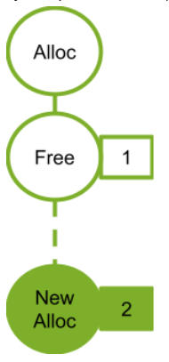

*图 31 添加新的分配节点 2 以下图显示添加新的分配节点 (4)。新的分配节点不依赖于空闲节点 (2)，因此无法重用关联分配节点 (2) 的地址。如果分配节点 (2) 使用了空闲节点 (1) 释放的地址，则新分配节点 3 将需要新地址。*

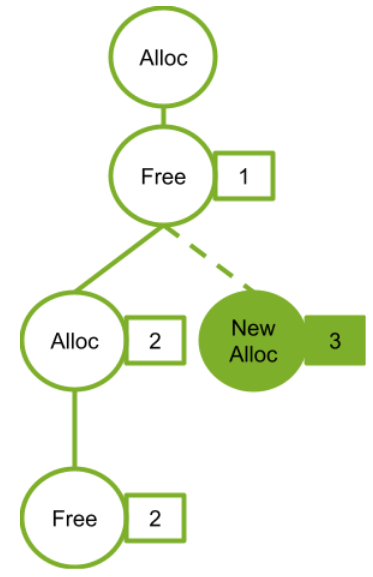

*图 32 添加新分配节点 3*

##### 4.2.5.3.2. 物理内存管理与分享

CUDA 负责按照 GPU 顺序到达分配节点之前将物理内存映射到虚拟地址。作为内存占用和映射开销的优化，如果多个图不同时运行，则它们可以使用相同的物理内存进行不同的分配；但是，如果物理页同时绑定到多个执行图，或者绑定到未释放的图分配，则无法重用物理页。

CUDA 可以在图实例化、启动或执行期间的任何时候更新物理内存映射。为了防止生存期内的图分配指向同一物理内存，CUDA 也可以在之后的图启动之间引入同步。与任何“分配-释放-再分配”模式一样，如果程序在分配的生命期之外访问指针，这个错误访问可能会在不发出警告的情况下读取或写入属于另一分配的有效数据（即使该分配的虚拟地址是唯一的）。Compute Sanitizer 工具可以捕获此错误。

以下图显示在同一流中顺序启动的图。在此示例中，每个图都释放其分配的所有内存。由于同一流中的图永远不会同时运行，因此 CUDA 可以而且应该使用相同的物理内存来满足所有分配。

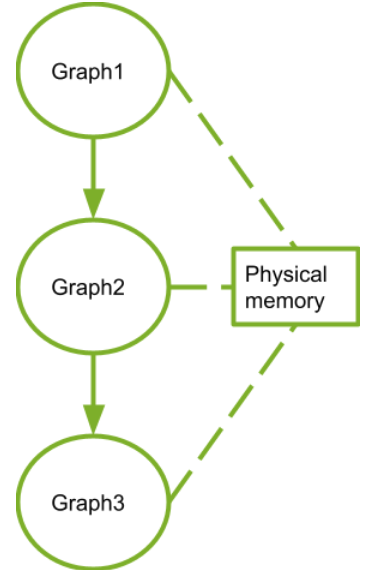

*图 33 顺序启动图*

#### 4.2.5.4. 性能考虑因素

当多个图启动到同一个流中时，CUDA 会尝试为它们分配相同的物理内存，因为这些图的执行不能重叠。作为优化，图的物理映射在启动之间保留，以避免重新映射的成本。如果稍后启动其中一个图，使其执行可能与其他图重叠（例如，如果将其启动到不同的流中），则 CUDA 必须执行一些重新映射，因为并发图需要不同的内存以避免数据损坏。

一般而言，CUDA 中图内存的重新映射可能由以下操作触发：

- 更改启动图的流
- 对图内存池执行修剪操作，显式释放未使用的内存（参见[物理内存占用](#section-4-2-5-5)）
- 当另一个图的未释放分配映射到同一内存时重新启动图将导致在重新启动之前重新映射内存

重新映射必须按执行顺序进行，但必须在该图的任何先前执行完成之后进行（否则仍在使用的内存可能会被取消映射）。由于这种顺序依赖性，以及因为映射操作是操作系统调用，所以映射操作可能相对昂贵。应用程序可以通过将包含分配内存节点的图一致地启动到相同的流中来避免这种成本。

##### 4.2.5.4.1. 首次启动与 cudaGraphUpload

图实例化期间无法分配或映射物理内存，因为此时尚不知道图将在哪个流中执行。映射会在图启动期间完成。调用 `cudaGraphUpload` 会立即执行图所需的全部映射，并将该图与上传流关联，从而将分配开销与启动操作分离。如果随后在同一流中启动该图，则无需进行额外的重新映射。

使用不同的流执行图上传和图启动，其行为类似于切换流，可能触发重新映射。此外，不相关的内存池管理操作可以从空闲池中取走内存，这可能抵消上传所带来的效果。

#### 4.2.5.5. 物理内存占地面积

异步分配的池管理行为意味着销毁包含内存节点的图（即使它们的分配是空闲的）不会立即将物理内存返回到操作系统以供其他进程使用。要将内存显式释放回操作系统，应用程序应使用 `cudaDeviceGraphMemTrim` API。

`cudaDeviceGraphMemTrim` 会解除映射并释放图内存节点所保留、但当前未使用的物理内存。尚未释放的分配以及已调度或正在运行的图都被视为正在使用物理内存，因此不受影响。修剪 API 可将物理内存归还给其他分配 API、应用程序或进程，但 CUDA 在下次启动被修剪的图时需要重新分配并映射这些内存。请注意，`cudaDeviceGraphMemTrim` 操作的池不同于 `cudaMemPoolTrimTo()` 所操作的池；图内存池不会公开给流序内存分配器。应用程序可通过 `cudaDeviceGetGraphMemAttribute` 查询图内存占用情况：`cudaGraphMemAttrReservedMemCurrent` 返回驱动程序为当前进程中的图分配保留的物理内存量，`cudaGraphMemAttrUsedMemCurrent` 返回当前至少被一个图映射的物理内存量。任一属性都可用于跟踪 CUDA 何时为图分配获取新的物理内存，也可用于评估共享机制节省的内存量。

#### 4.2.5.6. 对等访问

图分配可以配置为由多个 GPU 访问；在这种情况下，CUDA 会按需将分配映射到对等 GPU。CUDA 允许映射需求不同的图分配复用同一虚拟地址。发生这种情况时，该地址范围会映射到各个分配所需的全部 GPU。因此，某个分配有时可能获得比创建时所请求范围更广的对等访问；但依赖这些额外映射仍是错误的做法。

##### 4.2.5.6.1. 使用图节点 API 进行对等访问

`cudaGraphAddNode` API 接受分配节点参数结构的 `accessDescs` 数组字段中的映射请求。 `poolProps.location` 嵌入结构指定用于分配的驻留设备。假设需要从分配的 GPU 进行访问，因此应用程序不需要在 `accessDescs` 数组中为驻留设备指定条目。

```cuda
cudaGraphNodeParams allocNodeParams = { cudaGraphNodeTypeMemAlloc };
allocNodeParams.alloc.poolProps.allocType = cudaMemAllocationTypePinned;
allocNodeParams.alloc.poolProps.location.type = cudaMemLocationTypeDevice;
// specify device 1 as the resident device
allocNodeParams.alloc.poolProps.location.id = 1;
allocNodeParams.alloc.bytesize = size;

// allocate an allocation resident on device 1 accessible from device 1
cudaGraphAddNode(&allocNode, graph, NULL, NULL, 0, &allocNodeParams);

accessDescs[2];
// boilerplate for the access descs (only ReadWrite and Device access supported by the add node api)
accessDescs[0].flags = cudaMemAccessFlagsProtReadWrite;
accessDescs[0].location.type = cudaMemLocationTypeDevice;
accessDescs[1].flags = cudaMemAccessFlagsProtReadWrite;
accessDescs[1].location.type = cudaMemLocationTypeDevice;

// access being requested for device 0 & 2.  Device 1 access requirement left implicit.
accessDescs[0].location.id = 0;
accessDescs[1].location.id = 2;

// access request array has 2 entries.
allocNodeParams.accessDescCount = 2;
allocNodeParams.accessDescs = accessDescs;

// allocate an allocation resident on device 1 accessible from devices 0, 1 and 2. (0 & 2 from the descriptors, 1 from it being the resident device).
cudaGraphAddNode(&allocNode, graph, NULL, NULL, 0, &allocNodeParams);
```

##### 4.2.5.6.2. 使用流捕获进行对等访问

对于流捕获，分配节点记录捕获时分配池的对等可访问性。在捕获 `cudaMallocFromPoolAsync` 调用后更改分配池的对等可访问性不会影响图将为分配所做的映射。

```cuda
// boilerplate for the access descs (only ReadWrite and Device access supported by the add node api)
accessDesc.flags = cudaMemAccessFlagsProtReadWrite;
accessDesc.location.type = cudaMemLocationTypeDevice;
accessDesc.location.id = 1;

// let memPool be resident and accessible on device 0

cudaStreamBeginCapture(stream);
cudaMallocAsync(&dptr1, size, memPool, stream);
cudaStreamEndCapture(stream, &graph1);

cudaMemPoolSetAccess(memPool, &accessDesc, 1);

cudaStreamBeginCapture(stream);
cudaMallocAsync(&dptr2, size, memPool, stream);
cudaStreamEndCapture(stream, &graph2);

//The graph node allocating dptr1 would only have the device 0 accessibility even though memPool now has device 1 accessibility.
//The graph node allocating dptr2 will have device 0 and device 1 accessibility, since that was the pool accessibility at the time of the cudaMallocAsync call.
```

### 4.2.6. 设备图启动

许多工作流需要在运行时作出依赖于数据的决策，并根据决策执行不同操作。用户可能希望直接在设备上完成这一决策过程，而不是将其卸载到主机，因为后者可能需要在主机与设备之间往返传输数据。为此，CUDA 提供了从设备启动图的机制。

设备图启动提供了一种从设备执行动态控制流的便捷方法，无论是简单的循环还是复杂的设备端工作调度程序。

可以从设备启动的图此后将被称为设备图，而不能从设备启动的图将被称为主机图。

设备图可以从主机和设备启动，而主机图只能从主机启动。与主机启动不同，在之前启动的图正在运行时从设备启动设备图将导致错误，返回 `cudaErrorInvalidValue`；因此，设备图不能同时从设备启动两次。同时从主机和设备启动设备图将导致未定义的行为。

#### 4.2.6.1. 设备图创建

为了从设备启动图，必须为设备启动显式实例化它。这是通过将 `cudaGraphInstantiateFlagDeviceLaunch` 标志传递给 `cudaGraphInstantiate()` 调用来实现的。与主机图的情况一样，设备图结构在实例化时是固定的，如果不重新实例化就无法更新，并且实例化只能在主机上执行。为了能够在设备启动时实例化图，它必须遵守各种要求。

##### 4.2.6.1.1. 设备图要求

一般要求：

- 图的节点必须全部驻留在单个设备上。
- 该图只能包含内核节点、memcpy 节点、memset 节点和子图节点。

内核节点：

- 不允许在图中使用内核的 CUDA 动态并行。
- 只要 MPS 未使用，就允许协作启动。

Memcpy 节点：

- 仅允许涉及设备内存和/或固定设备映射主机内存的副本。
- 不允许涉及 CUDA 数组的副本。
- 实例化时，两个操作数都必须可从当前设备访问。请注意，即使目标是另一设备上的内存，复制操作仍由图所在的设备执行。

##### 4.2.6.1.2. 设备图上传

为了在设备上启动图，必须首先将其上传到设备以填充必要的设备资源。这可以通过两种方式之一来实现。

首先，可以通过 `cudaGraphUpload()` 或通过 `cudaGraphInstantiateWithParams()` 请求上传作为实例化的一部分来显式上传图。

或者，可以首先从主机启动图，主机将在启动过程中隐式执行此上传步骤。

所有三种方法的示例如下：

```cuda
// Explicit upload after instantiation
cudaGraphInstantiate(&deviceGraphExec1, deviceGraph1, cudaGraphInstantiateFlagDeviceLaunch);
cudaGraphUpload(deviceGraphExec1, stream);

// Explicit upload as part of instantiation
cudaGraphInstantiateParams instantiateParams = {0};
instantiateParams.flags = cudaGraphInstantiateFlagDeviceLaunch | cudaGraphInstantiateFlagUpload;
instantiateParams.uploadStream = stream;
cudaGraphInstantiateWithParams(&deviceGraphExec2, deviceGraph2, &instantiateParams);

// Implicit upload via host launch
cudaGraphInstantiate(&deviceGraphExec3, deviceGraph3, cudaGraphInstantiateFlagDeviceLaunch);
cudaGraphLaunch(deviceGraphExec3, stream);
```

##### 4.2.6.1.3. 设备图更新

设备图只能从主机更新，并且必须在可执行图更新后重新上传到设备才能使更改生效。这可以使用 [设备图上传](#section-4-2-6-1-2) 节中概述的相同方法来实现。与主机图不同，在应用更新时从设备启动设备图将导致未定义的行为。

#### 4.2.6.2. 设备启动

设备图可以通过 `cudaGraphLaunch()` 从主机和设备启动，它在设备上具有与主机上相同的签名。设备图通过主机和设备上的相同句柄启动。从设备启动时，设备图必须从另一个图启动。

设备端图启动是针对每个线程的，并且可能同时从不同的线程进行多次启动，因此用户需要选择一个线程来启动给定的图。

与主机端启动不同，设备图不能提交到普通 CUDA 流，只能提交到若干命名流；每个命名流代表一种特定的启动模式。下表列出了可用模式。

**表 9 仅用于设备图启动的流**

| 流 | 启动模式 |
| --- | --- |
| `cudaStreamGraphFireAndForget` | 即发即弃启动 |
| `cudaStreamGraphTailLaunch` | 尾部启动 |
| `cudaStreamGraphFireAndForgetAsSibling` | 兄弟启动 |

##### 4.2.6.2.1. 即发即弃启动

顾名思义，即发即弃启动会立即提交给 GPU，并独立于发起启动的图运行。在这种模式下，发起启动的图是父图，被启动的图是子图。


*图 34 即发即弃启动*

上图可以通过下面的示例代码生成：

```cuda
__global__ void launchFireAndForgetGraph(cudaGraphExec_t graph) {
    cudaGraphLaunch(graph, cudaStreamGraphFireAndForget);
}

void graphSetup() {
    cudaGraphExec_t gExec1, gExec2;
    cudaGraph_t g1, g2;

    // Create, instantiate, and upload the device graph.
    create_graph(&g2);
    cudaGraphInstantiate(&gExec2, g2, cudaGraphInstantiateFlagDeviceLaunch);
    cudaGraphUpload(gExec2, stream);

    // Create and instantiate the launching graph.
    cudaStreamBeginCapture(stream, cudaStreamCaptureModeGlobal);
    launchFireAndForgetGraph<<<1, 1, 0, stream>>>(gExec2);
    cudaStreamEndCapture(stream, &g1);
    cudaGraphInstantiate(&gExec1, g1);

    // Launch the host graph, which will in turn launch the device graph.
    cudaGraphLaunch(gExec1, stream);
}
```

一个图在其执行过程中最多可以有 120 个尚未完成的即发即弃启动图。此计数会在同一父图的各次启动之间重置。

###### 4.2.6.2.1.1. 图执行环境

为了充分理解设备端同步模型，首先需要理解执行环境的概念。

从设备端启动图时，该图会在自己的执行环境中启动。给定图的执行环境包含图中的所有工作，以及由它生成的所有即发即弃工作。只有该图本身和所有生成的子工作都执行完毕后，才认为该图已完成。

下图显示了上一节即发即弃示例代码所生成的执行环境层次。

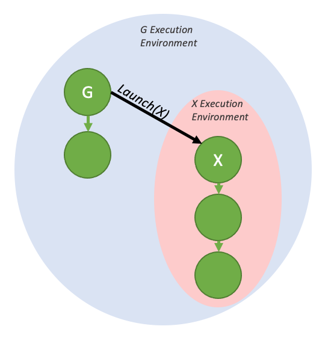

*图 35 具有执行环境的即发即弃启动*

执行环境同样具有层次结构，因此一个图的执行环境可以包含多层由即发即弃启动产生的子环境。


*图 36 嵌套的即发即弃执行环境*

当从主机启动图时，存在一个流环境，它是已启动图的执行环境的父级。流环境封装了作为整体启动的一部分生成的所有工作。当整个流环境标记为完成时，流启动完成（即现在可以运行下游相关工作）。


*图 37 流环境，可视化*

##### 4.2.6.2.2. 尾部启动

与主机端不同，设备端无法通过 `cudaDeviceSynchronize()` 或 `cudaStreamSynchronize()` 等传统方法与 GPU 上的设备图同步。为了建立串行工作依赖关系，CUDA 提供了另一种启动模式——尾部启动——来实现类似功能。

当图的执行环境完成（即该图及其所有子图都完成）时，尾部启动才会执行。当一个图完成时，尾部启动列表中下一个图的执行环境将取代已完成的环境，成为父环境的子环境。与即发即弃启动类似，一个图可以将多个图排入尾部启动队列。


*图 38 简单的尾部启动*

上述执行流程可以通过以下代码生成：

```cuda
__global__ void launchTailGraph(cudaGraphExec_t graph) {
    cudaGraphLaunch(graph, cudaStreamGraphTailLaunch);
}

void graphSetup() {
    cudaGraphExec_t gExec1, gExec2;
    cudaGraph_t g1, g2;

    // Create, instantiate, and upload the device graph.
    create_graph(&g2);
    cudaGraphInstantiate(&gExec2, g2, cudaGraphInstantiateFlagDeviceLaunch);
    cudaGraphUpload(gExec2, stream);

    // Create and instantiate the launching graph.
    cudaStreamBeginCapture(stream, cudaStreamCaptureModeGlobal);
    launchTailGraph<<<1, 1, 0, stream>>>(gExec2);
    cudaStreamEndCapture(stream, &g1);
    cudaGraphInstantiate(&gExec1, g1);

    // Launch the host graph, which will in turn launch the device graph.
    cudaGraphLaunch(gExec1, stream);
}
```

由给定图排队的尾部启动将按照排队时间一次执行一个。因此，第一个排队图将首先运行，然后是第二个，依此类推。


*图 39 尾部启动顺序约束*

由尾部图排队的尾部启动将在由尾部启动列表中的先前图排队的尾部启动之前执行。这些新的尾部启动将按照它们排队的顺序执行。


*图 40 从多个图入队时尾部启动顺序*

一个图最多可以有 255 个待处理的尾部启动。

###### 4.2.6.2.2.1. 尾部自启动

设备图可以将自身排队以进行尾部启动，尽管给定的图一次只能有一个自启动入队。为了查询当前正在运行的设备图以便可以重新启动，添加了一个新的设备端函数：

```cuda
cudaGraphExec_t cudaGetCurrentGraphExec();
```

如果当前运行的图是设备图，此函数将返回其句柄。如果当前执行的内核不是设备图中的节点，此函数将返回 NULL。

下面的示例代码显示了此函数在重新启动循环中的用法：

```cuda
__device__ int relaunchCount = 0;

__global__ void relaunchSelf() {
    int relaunchMax = 100;

    if (threadIdx.x == 0) {
        if (relaunchCount < relaunchMax) {
            cudaGraphLaunch(cudaGetCurrentGraphExec(), cudaStreamGraphTailLaunch);
        }

        relaunchCount++;
    }
}
```

##### 4.2.6.2.3. 兄弟启动

兄弟启动是即发即弃启动的一种变体：被启动的图不会成为发起启动图的执行环境的子环境，而是成为其父环境的子环境。兄弟启动等价于从发起启动图的父环境执行一次即发即弃启动。


*图 41 简单的兄弟启动*

上图可以通过下面的示例代码生成：

```cuda
__global__ void launchSiblingGraph(cudaGraphExec_t graph) {
    cudaGraphLaunch(graph, cudaStreamGraphFireAndForgetAsSibling);
}

void graphSetup() {
    cudaGraphExec_t gExec1, gExec2;
    cudaGraph_t g1, g2;

    // Create, instantiate, and upload the device graph.
    create_graph(&g2);
    cudaGraphInstantiate(&gExec2, g2, cudaGraphInstantiateFlagDeviceLaunch);
    cudaGraphUpload(gExec2, stream);

    // Create and instantiate the launching graph.
    cudaStreamBeginCapture(stream, cudaStreamCaptureModeGlobal);
    launchSiblingGraph<<<1, 1, 0, stream>>>(gExec2);
    cudaStreamEndCapture(stream, &g1);
    cudaGraphInstantiate(&gExec1, g1);

    // Launch the host graph, which will in turn launch the device graph.
    cudaGraphLaunch(gExec1, stream);
}
```

由于同级启动不会启动到启动图的执行环境中，因此它们不会对启动图排队的尾部启动进行门控。

### 4.2.7. 使用图 API

`cudaGraph_t` 对象不是线程安全的。用户有责任确保多个线程不会同时访问同一个 `cudaGraph_t`。

`cudaGraphExec_t` 不能与其自身同时运行。 `cudaGraphExec_t` 的启动将在先前启动同一可执行图之后进行。

图在流中执行，以便与其他异步工作建立顺序约束。不过，该流只用于施加顺序约束；它既不限制图内部的并行性，也不影响图节点的执行位置。

参见 [图 API。](https://docs.nvidia.com/cuda/cuda-runtime-api/group__CUDART__GRAPH.html#group__CUDART__GRAPH)

### 4.2.8. CUDA 用户对象

CUDA 用户对象可用于帮助管理 CUDA 异步工作所使用资源的生命期。该功能尤其适用于 [CUDA 图](#section-4-2) 和 [流捕获](#section-4-2-2-1-2)。

各种资源管理方案与 CUDA 图不兼容。例如，考虑基于事件的池或同步创建、异步销毁方案。

```cuda
// Library API with pool allocation
void libraryWork(cudaStream_t stream) {
    auto &resource = pool.claimTemporaryResource();
    resource.waitOnReadyEventInStream(stream);
    launchWork(stream, resource);
    resource.recordReadyEvent(stream);
}
```

```cuda
// Library API with asynchronous resource deletion
void libraryWork(cudaStream_t stream) {
    Resource *resource = new Resource(...);
    launchWork(stream, resource);
    cudaLaunchHostFunc(
        stream,
        [](void *resource) {
            delete static_cast<Resource *>(resource);
        },
        resource,
        0);
    // Error handling considerations not shown
}
```

这些方案对于 CUDA 图来说很困难，因为资源的非固定指针或句柄需要间接或图更新，并且每次提交工作时都需要同步 CPU 代码。如果这些注意事项对库的调用者隐藏，并且由于在捕获期间使用了不允许的 API，那么它们也不能与流捕获一起使用。存在多种解决方案，例如将资源公开给调用者。 CUDA 用户对象提供了另一种方法。

CUDA 用户对象把用户指定的析构回调与内部引用计数关联起来，类似于 C++ 的 `shared_ptr`。引用既可以由 CPU 上的用户代码持有，也可以由 CUDA 图持有。对于用户持有的引用，不同于 C++ 智能指针的是，并不存在表示引用的对象，因此用户必须自行跟踪引用。典型用法是在创建用户对象后，立即把唯一由用户持有的引用移交给 CUDA 图。

当引用与 CUDA 图关联时，CUDA 将自动管理图操作。克隆的 `cudaGraph_t` 保留源 `cudaGraph_t` 拥有的每个引用的副本，具有相同的多重性。实例化的 `cudaGraphExec_t` 保留源 `cudaGraph_t` 中每个引用的副本。当 `cudaGraphExec_t` 在未同步的情况下被销毁时，引用将保留，直到执行完成。

这是一个使用示例。

```cuda
cudaGraph_t graph;  // Preexisting graph

Object *object = new Object;  // C++ object with possibly nontrivial destructor
cudaUserObject_t cuObject;
cudaUserObjectCreate(
    &cuObject,
    object,  // Here we use a CUDA-provided template wrapper for this API,
             // which supplies a callback to delete the C++ object pointer
    1,  // Initial refcount
    cudaUserObjectNoDestructorSync  // Acknowledge that the callback cannot be
                                    // waited on via CUDA
);
cudaGraphRetainUserObject(
    graph,
    cuObject,
    1,  // Number of references
    cudaGraphUserObjectMove  // Transfer a reference owned by the caller (do
                             // not modify the total reference count)
);
// No more references owned by this thread; no need to call release API
cudaGraphExec_t graphExec;
cudaGraphInstantiate(&graphExec, graph, nullptr, nullptr, 0);  // Will retain a
                                                               // new reference
cudaGraphDestroy(graph);  // graphExec still owns a reference
cudaGraphLaunch(graphExec, 0);  // Async launch has access to the user objects
cudaGraphExecDestroy(graphExec);  // Launch is not synchronized; the release
                                  // will be deferred if needed
cudaStreamSynchronize(0);  // After the launch is synchronized, the remaining
                           // reference is released and the destructor will
                           // execute. Note this happens asynchronously.
// If the destructor callback had signaled a synchronization object, it would
// be safe to wait on it at this point.
```

子图节点中的图所拥有的引用与子图相关联，而不是与父图相关联。如果更新或删除子图，引用也会相应更改。如果使用 `cudaGraphExecUpdate` 或 `cudaGraphExecChildGraphNodeSetParams` 更新可执行图或子图，则会克隆新源图中的引用并替换目标图中的引用。在任一情况下，如果先前的启动未同步，则将保留将释放的任何引用，直到启动完成执行。

当前没有通过 CUDA API 等待用户对象析构函数的机制。用户可以从析构函数代码手动发出同步对象信号。此外，从析构函数中调用 CUDA API 是不合法的，类似于 `cudaLaunchHostFunc` 的限制。这是为了避免阻塞 CUDA 内部共享线程并阻止前进。如果依赖关系是单向的并且执行调用的线程不能阻止 CUDA 工作的前进进度，则向另一个线程发出信号以执行 API 调用是合法的。

用户对象是使用 `cudaUserObjectCreate` 创建的，这是浏览相关 API 的一个很好的起点。

---

## 4.3. 流序内存分配器

*英文原题：Stream-Ordered Memory Allocator*  
*官方原文：[https://docs.nvidia.com/cuda/cuda-programming-guide/04-special-topics/stream-ordered-memory-allocation.html](https://docs.nvidia.com/cuda/cuda-programming-guide/04-special-topics/stream-ordered-memory-allocation.html)*

### 4.3.1. 简介

使用 `cudaMalloc` 和 `cudaFree` 托管内存分配会导致 GPU 在所有正在执行的 CUDA 流之间进行同步。流序内存分配器使应用程序能够与启动到 CUDA 流中的其他工作（例如内核启动和异步副本）一起排序内存分配和释放。这通过利用流排序语义来重用内存分配来改善应用程序内存使用。分配器还允许应用程序控制分配器的内存缓存行为。当设置适当的释放阈值时，当应用程序表明它愿意接受更大的内存占用时，缓存行为允许分配器避免对操作系统进行昂贵的调用。该分配器还支持进程之间简单、安全的分配共享。

流序内存分配器：

> - 减少对自定义内存管理抽象的需求，并更轻松地为需要的应用程序创建高性能自定义内存管理。
> - 使多个库能够共享由驱动程序管理的公共内存池。这可以减少过多的内存消耗。
> - 允许驱动程序根据其对分配器和其他流管理 API 的了解来执行优化。

> [!NOTE]
> **说明**
> 自 CUDA 11.3 起，Nsight Compute 和下一代 CUDA 调试器就可以识别分配器。

### 4.3.2. 内存管理

`cudaMallocAsync` 和 `cudaFreeAsync` 是实现流序内存管理的 API。`cudaMallocAsync` 返回一个分配，`cudaFreeAsync` 则释放一个分配。两个 API 都接受流参数，用于定义该分配从何时起可用、到何时止不再可用。这些函数可以将内存操作与特定 CUDA 流关联，从而在不阻塞主机或其他流的情况下执行。避免 `cudaMalloc` 和 `cudaFree` 可能产生的高开销同步，可以提高应用程序性能。

这些 API 可用于通过内存池进一步优化性能，内存池管理和重用大内存块，以实现更高效的分配和释放。内存池有助于减少开销并防止碎片，从而在内存分配操作频繁的场景中提高性能。

#### 4.3.2.1. 分配内存

`cudaMallocAsync` 函数触发 GPU 上的异步内存分配，链接到特定的 CUDA 流。 `cudaMallocAsync` 允许在不妨碍主机或其他流的情况下进行内存分配，从而无需昂贵的同步。

> [!NOTE]
> **说明**
> 在确定分配驻留位置时，`cudaMallocAsync` 会忽略当前设备/上下文。相反，`cudaMallocAsync` 根据指定的内存池或提供的流确定适当的设备。

下面的清单说明了基本的使用模式：内存被分配、使用，然后释放回相同的流。

```cpp
void *ptr;
size_t size = 512;
cudaMallocAsync(&ptr, size, cudaStreamPerThread);
// do work using the allocation
kernel<<<..., cudaStreamPerThread>>>(ptr, ...);
// An asynchronous free can be specified without synchronizing the cpu and GPU
cudaFreeAsync(ptr, cudaStreamPerThread);
```

> [!NOTE]
> **说明**
> 当从进行分配的流以外的流访问分配时，用户必须保证访问发生在分配操作之后，否则行为未定义。

#### 4.3.2.2. 释放内存

`cudaFreeAsync()` 以流有序方式异步释放设备内存，这意味着内存释放被分配给特定的 CUDA 流，并且不会阻塞主机或其他流。

用户必须保证释放操作发生在分配操作和分配的任何使用之后。释放操作开始后对分配的任何使用都会导致未定义的行为。

应使用事件和/或流同步操作来保证从其他流对分配的任何访问在释放操作开始之前完成，如下例所示。

```cpp
cudaMallocAsync(&ptr, size, stream1);
cudaEventRecord(event1, stream1);
//stream2 must wait for the allocation to be ready before accessing
cudaStreamWaitEvent(stream2, event1);
kernel<<<..., stream2>>>(ptr, ...);
cudaEventRecord(event2, stream2);
// stream3 must wait for stream2 to finish accessing the allocation before
// freeing the allocation
cudaStreamWaitEvent(stream3, event2);
cudaFreeAsync(ptr, stream3);
```

使用 `cudaMalloc()` 分配的内存可以使用 `cudaFreeAsync()` 释放。如上所述，所有对内存的访问都必须在释放操作开始之前完成。

```cpp
cudaMalloc(&ptr, size);
kernel<<<..., stream>>>(ptr, ...);
cudaFreeAsync(ptr, stream);
```

同样，用 `cudaMallocAsync` 分配的内存可以用 `cudaFree()` 释放。当通过 `cudaFree()` API 释放此类分配时，驱动程序假定对分配的所有访问均已完成，并且不再执行同步。用户可以使用 `cudaStreamQuery` / `cudaStreamSynchronize` / `cudaEventQuery` / `cudaEventSynchronize` / `cudaDeviceSynchronize` 来保证相应的异步工作完成，并且 GPU 不会尝试访问分配。

```cpp
cudaMallocAsync(&ptr, size,stream);
kernel<<<..., stream>>>(ptr, ...);
// synchronize is needed to avoid prematurely freeing the memory
cudaStreamSynchronize(stream);
cudaFree(ptr);
```

### 4.3.3. 内存池

内存池封装了根据池属性和属性分配和管理的虚拟地址和物理内存资源。内存池的主要方面是它管理的内存的类型和位置。

所有 `cudaMallocAsync` 调用都使用内存池中的资源。如果未指定内存池，`cudaMallocAsync` 使用所给流所属设备的当前内存池。可以使用 `cudaDeviceSetMempool` 设置设备的当前内存池，并使用 `cudaDeviceGetMempool` 查询它。每个设备都有一个默认内存池；如果尚未调用 `cudaDeviceSetMempool`，则该默认池处于活动状态。

API `cudaMallocFromPoolAsync` 和 [`cudaMallocAsync` 的 C++ 重载](https://docs.nvidia.com/cuda/cuda-runtime-api/group__CUDART__HIGHLEVEL.html#group__CUDART__HIGHLEVEL_1ga31efcffc48981621feddd98d71a0feb) 允许用户指定要用于分配的池，而无需将其设置为当前池。API `cudaDeviceGetDefaultMempool` 和 `cudaMemPoolCreate` 返回内存池的句柄。`cudaMemPoolSetAttribute` 和 `cudaMemPoolGetAttribute` 控制内存池的属性。

> [!NOTE]
> **说明**
> 设备当前的内存池将是该设备的局部内存池。因此，在不指定内存池的情况下进行分配将始终产生流设备的本地分配。

#### 4.3.3.1. 默认/隐式池

可以通过调用 `cudaDeviceGetDefaultMempool` 来检索设备的默认内存池。来自设备默认内存池的分配是位于该设备上的不可迁移设备分配。这些分配始终可以从该设备访问。默认内存池的可访问性可以使用 `cudaMemPoolSetAccess` 进行修改，并使用 `cudaMemPoolGetAccess` 进行查询。由于不需要显式创建默认池，因此它们有时称为隐式池。设备默认的内存池不支持 IPC。

#### 4.3.3.2. 显式池

`cudaMemPoolCreate` 创建显式池。这允许应用程序请求超出默认/隐式池提供的属性来进行分配。其中包括诸如 IPC 功能、最大池大小、驻留在受支持平台上的特定 CPU NUMA 节点上的分配等属性。

```cpp
// create a pool similar to the implicit pool on device 0
int device = 0;
cudaMemPoolProps poolProps = { };
poolProps.allocType = cudaMemAllocationTypePinned;
poolProps.location.id = device;
poolProps.location.type = cudaMemLocationTypeDevice;

cudaMemPoolCreate(&memPool, &poolProps));
```

以下代码片段说明了在有效的 CPU NUMA 节点上创建支持 IPC 的内存池的示例。

```cpp
// create a pool resident on a CPU NUMA node that is capable of IPC sharing (via a file descriptor).
int cpu_numa_id = 0;
cudaMemPoolProps poolProps = { };
poolProps.allocType = cudaMemAllocationTypePinned;
poolProps.location.id = cpu_numa_id;
poolProps.location.type = cudaMemLocationTypeHostNuma;
poolProps.handleType = cudaMemHandleTypePosixFileDescriptor;

cudaMemPoolCreate(&ipcMemPool, &poolProps));
```

#### 4.3.3.3. 多 GPU 支持的设备可访问性

与通过虚拟内存管理 API 控制的分配可访问性一样，内存池分配可访问性不遵循 `cudaDeviceEnablePeerAccess` 或 `cuCtxEnablePeerAccess`。对于内存池，API `cudaMemPoolSetAccess` 修改哪些设备可以访问池中的分配。默认情况下，只能从分配所在的设备访问分配。此访问权限无法撤销。要启用其他设备的访问，访问设备必须能够与内存池的设备对等。这可以通过 `cudaDeviceCanAccessPeer` 进行验证。如果未检查对等功能，则设置访问可能会失败并显示 `cudaErrorInvalidDevice`。但是，如果没有从池中进行分配，则即使设备不具备对等功能，`cudaMemPoolSetAccess` 调用也可能会成功。在这种情况下，池中的下一次分配将会失败。

值得注意的是，`cudaMemPoolSetAccess` 影响内存池的所有分配，而不仅仅是未来的分配。同样，`cudaMemPoolGetAccess` 报告的可访问性适用于池中的所有分配，而不仅仅是未来的分配。不建议频繁更改给定 GPU 的池的可访问性设置。也就是说，一旦可以从给定的 GPU 访问池，就应该在该池的生命周期内保持从该 GPU 的可访问性。

```cpp
// snippet showing usage of cudaMemPoolSetAccess:
cudaError_t setAccessOnDevice(cudaMemPool_t memPool, int residentDevice,
              int accessingDevice) {
    cudaMemAccessDesc accessDesc = {};
    accessDesc.location.type = cudaMemLocationTypeDevice;
    accessDesc.location.id = accessingDevice;
    accessDesc.flags = cudaMemAccessFlagsProtReadWrite;

    int canAccess = 0;
    cudaError_t error = cudaDeviceCanAccessPeer(&canAccess, accessingDevice,
              residentDevice);
    if (error != cudaSuccess) {
        return error;
    } else if (canAccess == 0) {
        return cudaErrorPeerAccessUnsupported;
    }

    // Make the address accessible
    return cudaMemPoolSetAccess(memPool, &accessDesc, 1);
}
```

#### 4.3.3.4. 为 IPC 启用内存池

可以启用内存池进行进程间通信 (IPC)，以允许在进程之间轻松、高效且安全地共享 GPU 内存。 CUDA 的 IPC 内存池提供与 CUDA 的 [虚拟内存管理 API](https://docs.nvidia.com/cuda/cuda-c-programming-guide/#virtual-memory-management) 相同的安全优势。

在具有内存池的进程之间共享内存有两个步骤：进程首先需要共享对池的访问，然后共享该池中的特定分配。第一步建立并加强安全性。第二步协调每个进程中使用的虚拟地址以及映射在导入过程中何时需要有效。

##### 4.3.3.4.1. 创建和共享 IPC 内存池

共享对池的访问涉及使用 `cudaMemPoolExportToShareableHandle()` 检索池的操作系统本机句柄，使用操作系统本机 IPC 机制将该句柄传输到导入进程，然后使用 `cudaMemPoolImportFromShareableHandle()` API 创建导入的内存池。为了使 `cudaMemPoolExportToShareableHandle` 成功，必须使用池属性结构中指定的请求句柄类型创建内存池。

请参考 [样品](https://github.com/NVIDIA/cuda-samples/tree/master/Samples/2_Concepts_and_Techniques/streamOrderedAllocationIPC) 以了解在进程之间传输操作系统本机句柄的适当 IPC 机制。该过程的其余部分可以在以下代码片段中找到。

```cpp
// in exporting process
// create an exportable IPC capable pool on device 0
cudaMemPoolProps poolProps = { };
poolProps.allocType = cudaMemAllocationTypePinned;
poolProps.location.id = 0;
poolProps.location.type = cudaMemLocationTypeDevice;

// Setting handleTypes to a non zero value will make the pool exportable (IPC capable)
poolProps.handleTypes = CU_MEM_HANDLE_TYPE_POSIX_FILE_DESCRIPTOR;

cudaMemPoolCreate(&memPool, &poolProps));

// FD based handles are integer types
int fdHandle = 0;

// Retrieve an OS native handle to the pool.
// Note that a pointer to the handle memory is passed in here.
cudaMemPoolExportToShareableHandle(&fdHandle,
             memPool,
             CU_MEM_HANDLE_TYPE_POSIX_FILE_DESCRIPTOR,
             0);

// The handle must be sent to the importing process with the appropriate
// OS-specific APIs.
```

```cpp
// in importing process
 int fdHandle;
// The handle needs to be retrieved from the exporting process with the
// appropriate OS-specific APIs.
// Create an imported pool from the shareable handle.
// Note that the handle is passed by value here.
cudaMemPoolImportFromShareableHandle(&importedMemPool,
          (void*)fdHandle,
          CU_MEM_HANDLE_TYPE_POSIX_FILE_DESCRIPTOR,
          0);
```

##### 4.3.3.4.2. 在导入过程中设置访问权限

导入的内存池最初只能从其驻留设备访问。导入的内存池不会继承导出进程设置的任何辅助功能。导入过程需要启用从它计划访问内存的任何 GPU 的 `cudaMemPoolSetAccess` 访问。

如果导入的内存池属于导入进程不可见的设备，用户必须使用 `cudaMemPoolSetAccess` API，为将使用该分配的 GPU 启用访问权限（参见[多 GPU 支持的设备可访问性](#section-4-3-3-3)）。

##### 4.3.3.4.3. 从导出的池创建和共享分配

一旦共享池，导出进程中使用 `cudaMallocAsync()` 从池中进行的分配就可以与导入池的进程共享。由于池的安全策略是在池级别建立和验证的，因此操作系统不需要额外的簿记来为特定池分配提供安全性。换句话说，导入池分配所需的不透明 `cudaMemPoolPtrExportData` 可以使用任何机制发送到导入进程。

虽然可以在不以任何方式与分配流同步的情况下导出和导入分配，但在访问分配时，导入过程必须遵循与导出过程相同的规则。具体来说，对分配的访问必须在分配流中的分配操作执行之后发生。以下两个代码片段显示 `cudaMemPoolExportPointer()` 和 `cudaMemPoolImportPointer()` 与 IPC 事件共享分配，用于保证在分配准备好之前在导入过程中不会访问分配。

```cpp
// preparing an allocation in the exporting process
cudaMemPoolPtrExportData exportData;
cudaEvent_t readyIpcEvent;
cudaIpcEventHandle_t readyIpcEventHandle;

// ipc event for coordinating between processes
// cudaEventInterprocess flag makes the event an ipc event
// cudaEventDisableTiming  is set for performance reasons

cudaEventCreate(&readyIpcEvent, cudaEventDisableTiming | cudaEventInterprocess)

// allocate from the exporting mem pool
cudaMallocAsync(&ptr, size,exportMemPool, stream);

// event for sharing when the allocation is ready.
cudaEventRecord(readyIpcEvent, stream);
cudaMemPoolExportPointer(&exportData, ptr);
cudaIpcGetEventHandle(&readyIpcEventHandle, readyIpcEvent);

// Share IPC event and pointer export data with the importing process using
//  any mechanism. Here we copy the data into shared memory
shmem->ptrData = exportData;
shmem->readyIpcEventHandle = readyIpcEventHandle;
// signal consumers data is ready
```

```cpp
// Importing an allocation
cudaMemPoolPtrExportData *importData = &shmem->prtData;
cudaEvent_t readyIpcEvent;
cudaIpcEventHandle_t *readyIpcEventHandle = &shmem->readyIpcEventHandle;

// Need to retrieve the ipc event handle and the export data from the
// exporting process using any mechanism.  Here we are using shmem and just
// need synchronization to make sure the shared memory is filled in.

cudaIpcOpenEventHandle(&readyIpcEvent, readyIpcEventHandle);

// import the allocation. The operation does not block on the allocation being ready.
cudaMemPoolImportPointer(&ptr, importedMemPool, importData);

// Wait for the prior stream operations in the allocating stream to complete before
// using the allocation in the importing process.
cudaStreamWaitEvent(stream, readyIpcEvent);
kernel<<<..., stream>>>(ptr, ...);
```

释放分配时，必须先在导入过程中释放该分配，然后再在导出过程中释放该分配。以下代码片段演示了如何使用 CUDA IPC 事件在两个进程中的 `cudaFreeAsync` 操作之间提供所需的同步。从导入进程获取分配显然受到导入进程侧自由操作的限制。值得注意的是，`cudaFree` 可用于释放两个进程中的分配，并且可以使用其他流同步 API 代替 CUDA IPC 事件。

```cpp
// The free must happen in importing process before the exporting process
kernel<<<..., stream>>>(ptr, ...);

// Last access in importing process
cudaFreeAsync(ptr, stream);

// Access not allowed in the importing process after the free
cudaIpcEventRecord(finishedIpcEvent, stream);
```

```cpp
// Exporting process
// The exporting process needs to coordinate its free with the stream order
// of the importing process’s free.
cudaStreamWaitEvent(stream, finishedIpcEvent);
kernel<<<..., stream>>>(ptrInExportingProcess, ...);

// The free in the importing process doesn’t stop the exporting process
// from using the allocation.
cudFreeAsync(ptrInExportingProcess,stream);
```

##### 4.3.3.4.4. IPC 导出池限制

IPC 池当前不支持将物理块释放回操作系统。因此，`cudaMemPoolTrimTo` API 无效，并且 `cudaMemPoolAttrReleaseThreshold` 实际上被忽略。此行为由驱动程序（而不是运行时）控制，并且可能会在未来的驱动程序更新中更改。

##### 4.3.3.4.5. IPC 导入池限制

不允许从导入池分配；具体来说，导入池不能设置为当前，也不能在 `cudaMallocFromPoolAsync` API 中使用。因此，分配重用策略属性对于这些池没有意义。

IPC 导入池与 IPC 导出池一样，当前不支持将物理块释放回操作系统。

资源使用统计属性查询仅反映导入到进程中的分配以及关联的物理内存。

### 4.3.4. 最佳实践和调整

#### 4.3.4.1. 查询支持

应用程序可以使用设备属性 `cudaDevAttrMemoryPoolsSupported` 调用 `cudaDeviceGetAttribute()`，以确定设备是否支持流序内存分配器（请参阅[开发者博客](https://developer.nvidia.com/blog/cuda-pro-tip-the-fast-way-to-query-device-properties/)）。

可以使用 `cudaDevAttrMemoryPoolSupportedHandleTypes` 设备属性查询 IPC 内存池支持。该属性是在 CUDA 11.3 中添加的，旧版驱动程序在查询该属性时将返回 `cudaErrorInvalidValue`。

```cpp
int driverVersion = 0;
int deviceSupportsMemoryPools = 0;
int poolSupportedHandleTypes = 0;
cudaDriverGetVersion(&driverVersion);
if (driverVersion >= 11020) {
    cudaDeviceGetAttribute(&deviceSupportsMemoryPools,
                           cudaDevAttrMemoryPoolsSupported, device);
}
if (deviceSupportsMemoryPools != 0) {
    // `device` supports the Stream-Ordered Memory Allocator
}

if (driverVersion >= 11030) {
    cudaDeviceGetAttribute(&poolSupportedHandleTypes,
              cudaDevAttrMemoryPoolSupportedHandleTypes, device);
}
if (poolSupportedHandleTypes & cudaMemHandleTypePosixFileDescriptor) {
   // Pools on the specified device can be created with posix file descriptor-based IPC
}
```

在查询之前执行驱动程序版本检查可以避免在尚未定义该属性的驱动程序上遇到 `cudaErrorInvalidValue` 错误。可以使用 `cudaGetLastError` 来清除错误而不是避免错误。

#### 4.3.4.2. 物理页面缓存行为

默认情况下，分配器尝试最小化池拥有的物理内存。为了最大限度地减少分配和释放物理内存的操作系统调用，应用程序必须为每个池配置内存占用量。应用程序可以使用释放阈值属性 ( `cudaMemPoolAttrReleaseThreshold` ) 来执行此操作。

释放阈值是池在尝试将内存释放回操作系统之前应保留的内存量（以字节为单位）。当内存池持有的内存字节数超过释放阈值字节时，分配器将在下次调用流、事件或设备同步时尝试将内存释放回操作系统。将释放阈值设置为 UINT64_MAX 将阻止驱动程序在每个同步后尝试收缩池。

```cpp
Cuuint64_t setVal = UINT64_MAX;
cudaMemPoolSetAttribute(memPool, cudaMemPoolAttrReleaseThreshold, &setVal);
```

将 `cudaMemPoolAttrReleaseThreshold` 设置得足够高以有效禁用内存池收缩的应用程序可能希望显式收缩内存池的内存占用量。 `cudaMemPoolTrimTo` 允许应用程序这样做。修剪内存池的占用空间时，`minBytesToKeep` 参数允许应用程序保留指定数量的内存，例如在后续执行阶段预计需要的内存量。

```cpp
Cuuint64_t setVal = UINT64_MAX;
cudaMemPoolSetAttribute(memPool, cudaMemPoolAttrReleaseThreshold, &setVal);

// application phase needing a lot of memory from the stream-ordered allocator
for (i=0; i<10; i++) {
    for (j=0; j<10; j++) {
        cudaMallocAsync(&ptrs[j],size[j], stream);
    }
    kernel<<<...,stream>>>(ptrs,...);
    for (j=0; j<10; j++) {
        cudaFreeAsync(ptrs[j], stream);
    }
}

// Process does not need as much memory for the next phase.
// Synchronize so that the trim operation will know that the allocations are no
// longer in use.
cudaStreamSynchronize(stream);
cudaMemPoolTrimTo(mempool, 0);

// Some other process/allocation mechanism can now use the physical memory
// released by the trimming operation.
```

#### 4.3.4.3. 资源使用统计

查询池的 `cudaMemPoolAttrReservedMemCurrent` 属性会报告池消耗的当前物理 GPU 内存总量。查询池的 `cudaMemPoolAttrUsedMemCurrent` 返回从池中分配且不可重用的所有内存的总大小。

`cudaMemPoolAttr*MemHigh` 属性是记录自上次重置以来相应 `cudaMemPoolAttr*MemCurrent` 属性实现的最大值的水印。可以使用 `cudaMemPoolSetAttribute` API 将它们重置为当前值。

```cpp
// sample helper functions for getting the usage statistics in bulk
struct usageStatistics {
    cuuint64_t reserved;
    cuuint64_t reservedHigh;
    cuuint64_t used;
    cuuint64_t usedHigh;
};

void getUsageStatistics(cudaMemoryPool_t memPool, struct usageStatistics *statistics)
{
    cudaMemPoolGetAttribute(memPool, cudaMemPoolAttrReservedMemCurrent, statistics->reserved);
    cudaMemPoolGetAttribute(memPool, cudaMemPoolAttrReservedMemHigh, statistics->reservedHigh);
    cudaMemPoolGetAttribute(memPool, cudaMemPoolAttrUsedMemCurrent, statistics->used);
    cudaMemPoolGetAttribute(memPool, cudaMemPoolAttrUsedMemHigh, statistics->usedHigh);
}

// resetting the watermarks will make them take on the current value.
void resetStatistics(cudaMemoryPool_t memPool)
{
    cuuint64_t value = 0;
    cudaMemPoolSetAttribute(memPool, cudaMemPoolAttrReservedMemHigh, &value);
    cudaMemPoolSetAttribute(memPool, cudaMemPoolAttrUsedMemHigh, &value);
}
```

#### 4.3.4.4. 内存重用策略

为了服务分配请求，驱动程序尝试重用之前通过 `cudaFreeAsync()` 释放的内存，然后再尝试从操作系统分配更多内存。例如，在流中释放的内存可以在同一流上的后续分配请求中立即重用。当流与 CPU 同步时，之前在该流中释放的内存可在任何流中重新分配。重用策略可以应用于默认内存池和显式内存池。

流有序分配器有一些可控的分配策略。池属性 `cudaMemPoolReuseFollowEventDependencies`、 `cudaMemPoolReuseAllowOpportunistic` 和 `cudaMemPoolReuseAllowInternalDependencies` 控制这些策略，详细信息如下。可以通过调用 `cudaMemPoolSetAttribute` 来启用或禁用这些策略。升级到较新的 CUDA 驱动程序可能会更改、增强、扩充和/或重新排序重用策略的枚举。

##### 4.3.4.4.1. cudaMemPoolReuseFollowEventDependencies

在分配更多物理 GPU 内存之前，分配器检查由 CUDA 事件建立的依赖关系信息，并尝试从另一个流中释放的内存中进行分配。

```cpp
cudaMallocAsync(&ptr, size, originalStream);
kernel<<<..., originalStream>>>(ptr, ...);
cudaFreeAsync(ptr, originalStream);
cudaEventRecord(event,originalStream);

// waiting on the event that captures the free in another stream
// allows the allocator to reuse the memory to satisfy
// a new allocation request in the other stream when
// cudaMemPoolReuseFollowEventDependencies is enabled.
cudaStreamWaitEvent(otherStream, event);
cudaMallocAsync(&ptr2, size, otherStream);
```

##### 4.3.4.4.2. cudaMemPoolReuseAllowOpportunistic

启用 `cudaMemPoolReuseAllowOpportunistic` 策略时，分配器会检查释放的分配，以查看是否满足释放操作流顺序语义，例如流已通过释放操作指示的执行点。禁用此策略后，分配器仍将重用流与 CPU 同步时可用的内存。禁用此策略不会阻止 `cudaMemPoolReuseFollowEventDependencies` 应用。

```cpp
cudaMallocAsync(&ptr, size, originalStream);
kernel<<<..., originalStream>>>(ptr, ...);
cudaFreeAsync(ptr, originalStream);

// after some time, the kernel finishes running
wait(10);

// When cudaMemPoolReuseAllowOpportunistic is enabled this allocation request
// can be fulfilled with the prior allocation based on the progress of originalStream.
cudaMallocAsync(&ptr2, size, otherStream);
```

##### 4.3.4.4.3. cudaMemPoolReuseAllowInternalDependencies

如果无法从操作系统分配和映射更多物理内存，驱动程序将查找其可用性取决于另一个流的待处理进度的内存。如果找到这样的内存，驱动程序会将所需的依赖项插入到分配的流中并重用该内存。

```cpp
cudaMallocAsync(&ptr, size, originalStream);
kernel<<<..., originalStream>>>(ptr, ...);
cudaFreeAsync(ptr, originalStream);

// When cudaMemPoolReuseAllowInternalDependencies is enabled
// and the driver fails to allocate more physical memory, the driver may
// effectively perform a cudaStreamWaitEvent in the allocating stream
// to make sure that future work in ‘otherStream’ happens after the work
// in the original stream that would be allowed to access the original allocation.
cudaMallocAsync(&ptr2, size, otherStream);
```

##### 4.3.4.4.4. 禁用重用策略

虽然可控重用策略可以改善内存重用，但用户有时可能希望将其禁用。允许机会式重用（例如 `cudaMemPoolReuseAllowOpportunistic`）会在分配模式依赖 CPU 与 GPU 执行交错方式时引入运行差异。如果用户更希望在分配失败时显式同步事件或流，内部插入依赖关系（例如 `cudaMemPoolReuseAllowInternalDependencies`）可能会以意外且不确定的方式使工作串行化。

#### 4.3.4.5. 与同步 API 集成

分配器作为 CUDA 驱动程序的一部分，可以与同步 API 集成优化。用户请求 CUDA 驱动程序同步时，驱动程序会等待异步工作完成。返回之前，驱动程序会确定哪些释放操作已由此次同步保证完成，并使相应内存重新可供分配，而不受原先指定的流或已禁用的重用策略影响。驱动程序还会在此检查 `cudaMemPoolAttrReleaseThreshold`，并释放所有能够释放的多余物理内存。

### 4.3.5. 附录

#### 4.3.5.1. cudaMemcpyAsync 当前上下文/设备灵敏度

在当前的 CUDA 驱动程序中，涉及 `cudaMallocAsync` 内存的任何异步 `memcpy` 都应使用指定的流的上下文作为调用线程的当前上下文来完成。这对于 `cudaMemcpyPeerAsync` 来说不是必需的，因为引用了 API 中指定的设备主上下文而不是当前的上下文。

#### 4.3.5.2. cudaPointerGetAttributes 查询

对某个分配调用 `cudaFreeAsync` 之后，再对它调用 `cudaPointerGetAttributes` 会导致未定义行为。具体而言，无论该分配是否仍可从某个给定流访问，其行为都仍然未定义。

#### 4.3.5.3. cudaGraphAddMemsetNode

`cudaGraphAddMemsetNode` 不适用于通过流有序分配器分配的内存。然而，分配的 memset 可以被流捕获。

#### 4.3.5.4. 指针属性

`cudaPointerGetAttributes` 查询适用于流有序分配。由于流有序分配不与上下文关联，因此查询 `CU_POINTER_ATTRIBUTE_CONTEXT` 将成功，但在 `*data` 中返回 NULL。属性 `CU_POINTER_ATTRIBUTE_DEVICE_ORDINAL` 可用于确定分配的位置：这在选择上下文来使用 `cudaMemcpyPeerAsync` 制作 p2h2p 副本时非常有用。 `CU_POINTER_ATTRIBUTE_MEMPOOL_HANDLE` 属性已添加到 CUDA 11.3 中，可用于调试以及在执行 IPC 之前确认分配来自哪个池。

#### 4.3.5.5. CPU 虚拟内存

使用 CUDA 流序内存分配器 API 时，请避免使用“ulimit -v”设置 VRAM 限制，因为这是不受支持的。

---

## 4.4. 协作组

*英文原题：Cooperative Groups*  
*官方原文：[https://docs.nvidia.com/cuda/cuda-programming-guide/04-special-topics/cooperative-groups.html](https://docs.nvidia.com/cuda/cuda-programming-guide/04-special-topics/cooperative-groups.html)*

### 4.4.1. 简介

协作组是 CUDA 编程模型的扩展，用于组织线程协作组。协作组允许开发人员控制线程协作的粒度，帮助他们表达更丰富、更高效的并行分解。协作组还提供常见并行原语的实现，例如扫描和并行归约。

从历史上看，CUDA 编程模型只提供了一种简单的协作线程同步机制：线程块内所有线程共同参与的屏障，由内建函数 `__syncthreads()` 实现。为了表达更广泛的并行交互模式，许多追求性能的程序员不得不自行编写临时且不安全的原语，用于同步单个线程束内的线程，或同步在同一 GPU 上运行的多个线程块。虽然由此获得的性能提升往往很有价值，但也积累了大量脆弱代码；这些代码跨越多代 GPU 后，编写、调优和长期维护的成本都很高。协作组为编写高性能代码提供了安全且面向未来的机制。

完整的协作组 API 可在 [协作组 API](#section-5-6-3-3) 中找到。

### 4.4.2. 协作组句柄和成员函数

协作组通过协作组句柄进行管理。协作组句柄允许参与的线程了解他们在组中的位置、组大小和其他组信息。选择组成员函数如下表所示。

**表 10 选择成员功能**

| 附件 | 退货 |
| --- | --- |
| `thread_rank()` | 呼叫者的等级为线程。 |
| `num_threads()` | 群组中线程的总数。 |
| `thread_index()` | 已启动块内线程的 3 维索引。 |
| `dim_threads()` | 已启动块的 3D 尺寸，以线程为单位。 |

[协作组 API](#section-5-6-3-1) 中提供了完整的成员函数列表。

### 4.4.3. 默认行为/无组执行

表示网格和线程块的组是根据内核启动配置隐式创建的。这些“隐式”组提供了一个起点，开发人员可以将其显式分解为更细粒度的组。可以使用以下方法访问隐式组：

**表 11 协作组由 CUDA 运行时隐式创建**

| 附件 | 集团范围 |
| --- | --- |
| `this_thread_block()` | 返回包含当前线程块中所有线程的组的句柄。 |
| `this_grid()` | 返回包含网格中所有线程的组的句柄。 |
| `coalesced_threads()`[^1] | 返回线程束中当前活动线程组的句柄。 |
| `this_cluster()`[^2] | 返回当前簇中线程组的句柄。 |

[^1]: `coalesced_threads()` 运算符返回该时间点的活动线程集合，并且不保证返回哪些线程（只要它们是活动的）或它们在整个执行过程中保持合并。

[^2]: 启动非簇网格时，`this_cluster()` 假定簇大小为 1x1x1。需要计算能力 9.0 或更高版本。

更多信息请参见 [协作组 API](#section-5-6-3-1)。

#### 4.4.3.1. 尽早创建隐式组句柄

为了获得最佳性能，建议您预先为隐式组创建一个句柄（尽早，在发生任何分支之前），并在整个内核中使用该句柄。

#### 4.4.3.2. 仅通过引用传递组句柄

建议您在将组句柄传递到函数时通过引用函数来传递组句柄。组句柄必须在声明时初始化，因为没有默认构造函数。不鼓励复制构造组句柄。

### 4.4.4. 创建协作组

组是通过将父组划分为子组来创建的。当对组进行分区时，将创建组句柄来管理生成的子组。开发者可以进行以下分区操作：

**表 12 协作组分区操作**

| 分区类型 | 描述 |
| --- | --- |
| 平铺分区 | 将父组划分为一系列以一维、行优先格式排列的固定大小的子组。 |
| 标记分区 | 根据条件标签将父组划分为一维子组，条件标签可以是任何整数类型。 |
| 二进制分区 | 标签分区的特殊形式，其中标签只能是“0”或“1”。 |

以下示例显示了如何创建平铺分区：

```cpp
namespace cg = cooperative_groups;
// Obtain the current thread's cooperative group
cg::thread_block my_group = cg::this_thread_block();

// Partition the cooperative group into tiles of size 8
cg::thread_block_tile<8> my_subgroup = cg::tiled_partition<8>(my_group);

// do work as my_subgroup
```

要使用的最佳分区策略取决于上下文。更多信息请参见 [协作组 API](#section-5-6-3-3)。

#### 4.4.4.1. 避免群体创建的危险

对组进行分区是一项集体操作，组中所有线程都必须参与。如果组是在并非所有线程都能到达的条件分支中创建的，则可能会导致死锁或数据损坏。

### 4.4.5. 同步

在引入协作组之前，CUDA 编程模型仅允许在内核完成边界处的线程块之间使用同步。协作组允许开发人员以不同的粒度同步协作的线程组。

#### 4.4.5.1. 同步

您可以通过调用集合`sync()`函数来同步组。与 `__syncthreads()` 一样， `sync()` 函数做出以下保证：

- 同步点之前组中的线程进行的所有内存访问（例如，读取和写入）对于同步点之后组中的所有线程都是可见的。
- 组中的所有线程在允许任何线程继续前进之前到达同步点。

以下示例显示了与 `__syncthreads()` 等效的 `cooperative_groups::sync()`。

```cpp
namespace cg = cooperative_groups;

cg::thread_block my_group = cg::this_thread_block();

// Synchronize threads in the block
cg::sync(my_group);
```

协作组可用于同步整个网格。自 CUDA 13 起，协作组不再可用于多设备同步。有关详细信息，请参阅 [大型团体](#section-4-4-8) 部分。

有关同步的更多信息，请参阅 [协作组 API](#section-5-6-3-6)。

#### 4.4.5.2. 屏障

协作组提供了与 `cuda::barrier` 类似的屏障 API，可用于更高级的同步。协作组屏障 API 在几个关键方面与 `cuda::barrier` 不同：

- 协作组屏障自动初始化
- 组中的所有线程必须每阶段到达屏障并等待一次。
- `barrier_arrive` 返回一个 `arrival_token` 对象，该对象必须传递到相应的 `barrier_wait` 中，该对象将在其中被消耗并且不能再次使用。

程序员在使用协作组屏障时必须注意避免危险：

- 在调用 `barrier_arrive` 之后和调用 `barrier_wait` 之前，组不能使用集体操作。
- `barrier_wait` 仅保证组中所有线程都已调用 `barrier_arrive`，并不保证所有线程都已调用 `barrier_wait`。

```cpp
namespace cg = cooperative_groups;

cg::thread_block my_group = this_block();
cg::cluster_group cluster = this_cluster();

auto token = cluster.barrier_arrive();

// Optional: Do some local processing to hide the synchronization latency
     local_processing(my_group);

// Make sure all other blocks in the cluster are running and initialized shared data before accessing dsmem
cluster.barrier_wait(std::move(token));
```

### 4.4.6. 集体行动

协作组包括一组可由一组线程执行的集体操作。这些操作需要指定组中的所有线程的参与才能完成操作。

组中的所有线程必须将相应参数的相同值传递给每个集体调用，除非 [协作组 API](#section-5-6-3-3) 中明确允许不同的值。否则，调用的行为是未定义的。

#### 4.4.6.1. 归约

`reduce` 函数对指定组内各线程提供的数据执行并行归约。归约类型必须通过下表所列的运算符之一指定。

**表 13 协作组归约运算符**

| 操作员 | 退货 |
| --- | --- |
| 加号 | 组中所有值的总和 |
| 少 | 最小值 |
| 更大 | 最大值 |
| 位与 | 按位 AND 归约 |
| 位或 | 按位 OR 归约 |
| 位异或 | 按位 XOR 归约 |

如果硬件支持，则使用硬件加速执行归约（要求计算能力 8.0 或更高）。旧硬件不支持硬件加速时会使用软件回退。只有 4 字节类型可获得硬件加速。

有关归约的更多信息，请参阅[协作组 API](#section-5-6-3-4)。

以下示例演示如何使用 `cooperative_groups::reduce()` 执行块范围总和归约。

```cpp
namespace cg = cooperative_groups;

cg::thread_block my_group = cg::this_thread_block();

int val = data[threadIdx.x];

int sum = cg::reduce(my_group, val, cg::plus<int>());

// Store the result from the reduction
if (my_group.thread_rank() == 0) {
   result[blockIdx.x] = sum;
}
```

#### 4.4.6.2. 扫描

协作组包括可用于任意组大小的 `inclusive_scan` 和 `exclusive_scan` 的实现。这些函数对指定组中命名的每个线程提供的数据执行扫描操作。

程序员可以选择指定归约运算符，如上面的 [归约运算符表](#section-4-4-6-1) 中所列。

```cpp
namespace cg = cooperative_groups;

cg::thread_block my_group = cg::this_thread_block();

int val = data[my_group.thread_rank()];

int exclusive_sum = cg::exclusive_scan(my_group, val, cg::plus<int>());

result[my_group.thread_rank()] = exclusive_sum;
```

有关扫描的更多信息，请参阅 [协作组扫描 API](#section-5-6-3-5)。

#### 4.4.6.3. 调用一

协作组提供 `invoke_one` 函数，供单个线程必须代表组执行串行部分工作时使用。

- `invoke_one` 从调用组中选择单个任意线程并使用该线程使用提供的参数调用提供的可调用函数。
- `invoke_one_broadcast` 与 `invoke_one` 相同，只是调用结果也会广播给组中的所有线程。

线程选择机制不保证是确定性的。

以下示例显示了基本的 `invoke_one` 利用率。

```cpp
namespace cg = cooperative_groups;
cg::thread_block my_group = cg::this_thread_block();

// Ensure only one thread in the thread block prints the message
cg::invoke_one(my_group, []() {
   printf("Hello from one thread in the block!");
});

// Synchronize to make sure all threads wait until the message is printed
cg::sync(my_group);
```

在可调用函数内部不允许调用组内的通信或同步。允许与呼叫组之外的线程进行通信。

### 4.4.7. 异步数据移动

CUDA 中的协作组 `memcpy_async` 功能提供了一种在全局内存和共享内存之间执行异步内存复制的方法。 `memcpy_async` 对于优化内存传输以及将计算与数据传输重叠以提高性能特别有用。

`memcpy_async` 函数用于启动从全局内存到共享内存的异步加载。 `memcpy_async` 旨在像“预取”一样使用，其中数据在需要之前加载。

`wait` 函数强制组中的所有线程等待，直到异步内存传输完成。 `wait` 必须由组中所有线程调用，然后才能在共享内存中访问数据。

以下示例显示如何将 `memcpy_async` 和 `wait` 用于预取数据。

```cpp
namespace cg = cooperative_groups;

cg::thread_group my_group = cg::this_thread_block();

__shared__ int shared_data[];

// Perform an asynchronous copy from global memory to shared memory
cg::memcpy_async(my_group, shared_data + my_group.rank(), input + my_group.rank(), sizeof(int));

// Hide latency by doing work here. Cannot use shared_data

// Wait for the asynchronous copy to complete
cg::wait(my_group);

// Prefetched data is now available
```

请参阅 [协作组 API](#section-5-6-3-2) 了解更多信息。

#### 4.4.7.1. Memcpy 异步对齐要求

如果源是全局内存并且目标是共享内存并且两者至少都是 4 字节对齐，则 `memcpy_async` 仅是异步。为了获得最佳性能：建议共享内存和全局内存均采用 16 字节对齐。

### 4.4.8. 大型团体

协作组允许跨越整个网格的大型组。前面描述的所有协作组功能均可供这些大型组使用，但有一个值得注意的例外：同步整个网格需要使用 `cudaLaunchCooperativeKernel` 运行时启动 API。

自 CUDA 13 起，已删除协作组的多设备启动 API 和相关参考。

#### 4.4.8.1. 何时使用 `cudaLaunchCooperativeKernel`

`cudaLaunchCooperativeKernel` 是一个 CUDA 运行时 API 函数，用于在单个设备上启动使用协作组的内核，特别适合需要线程块间同步的内核。该函数使内核中的所有线程都能跨整个网格同步并协作；传统 CUDA 内核只允许在各个线程块内同步，无法做到这一点。`cudaLaunchCooperativeKernel` 还会确保内核启动具有原子性：如果 API 调用成功，则给定数量的线程块将在指定设备上启动。

最好首先通过查询设备属性 `cudaDevAttrCooperativeLaunch` 确保设备支持协作启动：

```cpp
int dev = 0;
int supportsCoopLaunch = 0;
cudaDeviceGetAttribute(&supportsCoopLaunch, cudaDevAttrCooperativeLaunch, dev);
```

如果设备 0 支持该属性，则将 `supportsCoopLaunch` 设置为 1。仅支持计算能力为 6.0 及更高版本的设备。此外，您需要运行以下任意一个：

- 不含 MPS 的 Linux 平台
- 具有 MPS 的 Linux 平台以及具有计算能力 7.0 或更高版本的设备
- 最新 Windows 平台

---

## 4.5. 程序化依赖启动与同步

*英文原题：Programmatic Dependent Launch and Synchronization*  
*官方原文：[https://docs.nvidia.com/cuda/cuda-programming-guide/04-special-topics/programmatic-dependent-launch.html](https://docs.nvidia.com/cuda/cuda-programming-guide/04-special-topics/programmatic-dependent-launch.html)*

*程序化依赖启动*机制允许依赖的*次内核*在同一 CUDA 流中、它所依赖的*主内核*执行完毕之前启动。该机制从计算能力 9.0 的设备开始可用；如果次内核能够先完成大量不依赖主内核结果的工作，便可带来性能收益。

### 4.5.1. 背景

CUDA 应用程序通过在其上启动和执行多个内核来利用 GPU。 [图 42](#section-4-5-1) 中显示了典型的 GPU 活动时间线。

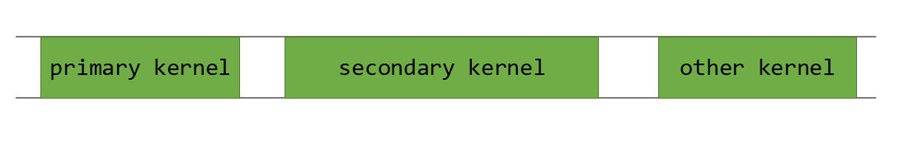

*图 42 GPU 活动时间表*

这里，`secondary_kernel` 在 `primary_kernel` 执行完成后启动。串行执行通常是必要的，因为 `secondary_kernel` 取决于 `primary_kernel` 生成的结果数据。如果 `secondary_kernel` 不依赖于 `primary_kernel`，则可以使用 [CUDA 流](#section-2-5-2) 同时启动两者。即使 `secondary_kernel` 依赖于 `primary_kernel`，并发执行也有一定的潜力。例如，几乎所有内核都有某种 *序言* 部分，在此期间执行诸如清零缓冲区或加载常量值之类的任务。


*图 43 secondary_kernel 的前导码部分*

[图 43](#section-4-5-1) 展示了 `secondary_kernel` 中可以并发执行而不影响应用程序的部分。并发启动还可以把 `secondary_kernel` 的启动延迟隐藏在 `primary_kernel` 的执行期间。

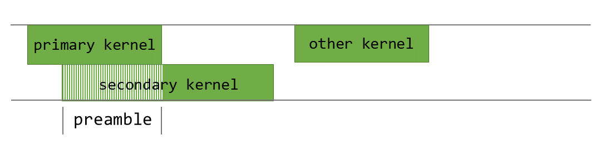

*图 44 primary_kernel 与 secondary_kernel 的并发执行*

[图 44](#section-4-5-1) 中所示的并发启动和执行 `secondary_kernel` 可以使用 *程序化依赖启动* 来实现。

*程序化依赖启动* 引入了对 CUDA 内核启动 API 的更改，如以下部分所述。这些 API 至少需要计算能力 9.0 才能提供重叠执行。

### 4.5.2. API 说明

在程序化依赖启动中，主内核和次内核会启动到同一个 CUDA 流中。当主内核已为次内核的启动做好准备时，它的所有线程块都应执行 `cudaTriggerProgrammaticLaunchCompletion`。次内核必须如图所示，使用可扩展启动 API 启动。

```cpp
__global__ void primary_kernel() {
   // Initial work that should finish before starting secondary kernel

   // Trigger the secondary kernel
   cudaTriggerProgrammaticLaunchCompletion();

   // Work that can coincide with the secondary kernel
}

__global__ void secondary_kernel()
{
   // Independent work

   // Will block until all primary kernels the secondary kernel is dependent on have completed and flushed results to global memory
   cudaGridDependencySynchronize();

   // Dependent work
}

cudaLaunchAttribute attribute[1];
attribute[0].id = cudaLaunchAttributeProgrammaticStreamSerialization;
attribute[0].val.programmaticStreamSerializationAllowed = 1;
configSecondary.attrs = attribute;
configSecondary.numAttrs = 1;

primary_kernel<<<grid_dim, block_dim, 0, stream>>>();
cudaLaunchKernelEx(&configSecondary, secondary_kernel);
```

使用 `cudaLaunchAttributeProgrammaticStreamSerialization` 属性启动次内核时，CUDA 驱动程序可以安全地提前启动它，而不必等到主内核执行完成并刷新其内存写入。

所有主内核线程块都已启动并执行 `cudaTriggerProgrammaticLaunchCompletion` 后，CUDA 驱动程序即可启动次内核。如果主内核不执行该触发器，则在主内核的所有线程块退出后隐式触发。

无论哪种情况，次内核的线程块都可能在主内核写入的数据可见之前启动。因此，为次内核配置*程序化依赖启动*时，它必须始终使用 `cudaGridDependencySynchronize` 或其他方式确认主内核产生的结果数据已经可用。

请注意，这些方法只是为主内核和次内核提供并发执行的机会；这种行为是机会性的，并不保证内核会并发执行。程序不能依赖这种并发，否则可能发生死锁。

### 4.5.3. 在 CUDA 图中使用

可以通过[流捕获](#section-4-2-2-1-2)在 [CUDA 图](#section-4-2)中使用程序化依赖启动，也可以直接通过[边数据](#section-4-2-1-2)使用。要在带有边数据的 CUDA 图中使用此功能，应在连接两个内核节点的边上把 `cudaGraphDependencyType` 设为 `cudaGraphDependencyTypeProgrammatic`。该边类型使下游内核中的 `cudaGridDependencySynchronize()` 能够感知并等待上游内核。此类型必须与 `cudaGraphKernelNodePortLaunchCompletion` 或 `cudaGraphKernelNodePortProgrammatic` 两种输出端口之一配合使用。

流捕获的结果图等效如下：

| 流代码（缩写） | 生成的图边 |
| --- | --- |
| `cudaLaunchAttribute attribute; attribute.id = cudaLaunchAttributeProgrammaticStreamSerialization; attribute.val.programmaticStreamSerializationAllowed = 1;` | `cudaGraphEdgeData edgeData; edgeData.type = cudaGraphDependencyTypeProgrammatic; edgeData.from_port = cudaGraphKernelNodePortProgrammatic;` |
| `cudaLaunchAttribute attribute; attribute.id = cudaLaunchAttributeProgrammaticEvent; attribute.val.programmaticEvent.triggerAtBlockStart = 0;` | `cudaGraphEdgeData edgeData; edgeData.type = cudaGraphDependencyTypeProgrammatic; edgeData.from_port = cudaGraphKernelNodePortProgrammatic;` |
| `cudaLaunchAttribute attribute; attribute.id = cudaLaunchAttributeProgrammaticEvent; attribute.val.programmaticEvent.triggerAtBlockStart = 1;` | `cudaGraphEdgeData edgeData; edgeData.type = cudaGraphDependencyTypeProgrammatic; edgeData.from_port = cudaGraphKernelNodePortLaunchCompletion;` |

---

## 4.6. 绿色上下文

*英文原题：Green Contexts*  
*官方原文：[https://docs.nvidia.com/cuda/cuda-programming-guide/04-special-topics/green-contexts.html](https://docs.nvidia.com/cuda/cuda-programming-guide/04-special-topics/green-contexts.html)*

绿色上下文（GC）是一种轻量级上下文，从创建时起便与一组特定 GPU 资源关联。创建绿色上下文时，用户可以对 GPU 资源进行分区；目前可分区的资源包括流式多处理器（SM）和工作队列（WQ）。面向某个绿色上下文的 GPU 工作只能使用为该上下文配置的 SM 和工作队列，从而减少或更好地控制共享资源造成的干扰。一个应用程序可以拥有多个绿色上下文。

使用绿色上下文无需修改任何 GPU 代码（内核），只需少量调整主机端代码，例如创建绿色上下文以及属于该上下文的流。绿色上下文适用于多种场景：在没有其他约束时，它可以确保始终有部分 SM 可供延迟敏感的内核开始执行；也可以在不修改内核的情况下，快速测试减少可用 SM 数量所产生的影响。

绿色上下文最初通过 [CUDA 驱动程序 API](https://docs.nvidia.com/cuda/cuda-driver-api/group__CUDA__GREEN__CONTEXTS.html#group__CUDA__GREEN__CONTEXTS) 提供。从 CUDA 13.1 开始，CUDA 运行时通过执行上下文（EC）抽象公开上下文。目前，执行上下文可以对应主上下文（运行时 API 用户始终与其隐式交互），也可以对应绿色上下文。在讨论绿色上下文时，本节会交替使用*执行上下文*和*绿色上下文*这两个术语。

既然运行时已经公开绿色上下文，强烈建议直接使用 CUDA 运行时 API；本节也将只使用运行时 API。

本节的其余部分组织如下：[第 4.6.1 节](#section-4-6-1) 提供了一个激励示例，[第 4.6.2 节](#section-4-6-2) 强调了易用性，[第 4.6.3 节](#section-4-6-3) 介绍了设备资源和资源描述符结构。 [第 4.6.4 节](#section-4-6-4) 解释了如何创建绿色上下文，[第 4.6.5 节](#section-4-6-5) 如何启动针对它的工作，[第 4.6.6 节](#section-4-6-6) 重点介绍了一些其他绿色上下文 API。最后，[第 4.6.7 节](#section-4-6-7) 用一个例子来总结。

### 4.6.1. 动机/何时使用

当启动 CUDA 内核时，用户无法直接控制内核将执行的 SM 的数量。人们只能通过改变内核的启动几何形状或任何可能影响内核每个 SM 的最大活动线程块数量的方式来间接影响这一点。此外，当多个内核在 GPU 上并行执行时（内核在不同的 CUDA 流上运行或作为 CUDA 图的一部分运行），它们也可能会争用相同的 SM 资源。

然而，在某些用例中，用户需要确保始终有 GPU 资源可供延迟敏感的工作使用，使其尽快开始并完成。绿色上下文可对 SM 资源进行分区，使某个绿色上下文只能使用创建时为其配置的特定 SM。

[图 45](#section-4-6-1)展示了一个示例。假设应用程序在两个不同的非阻塞 CUDA 流中运行相互独立的内核 A 和 B。内核 A 先启动并占用全部可用 SM；随后启动对延迟敏感的内核 B 时，已无空闲 SM。只有当内核 A 的部分线程块执行完毕、SM 开始空闲时，内核 B 才能开始执行。第一幅图展示了关键工作 B 因此被延迟的情况；纵轴表示 SM 占用率，横轴表示时间。

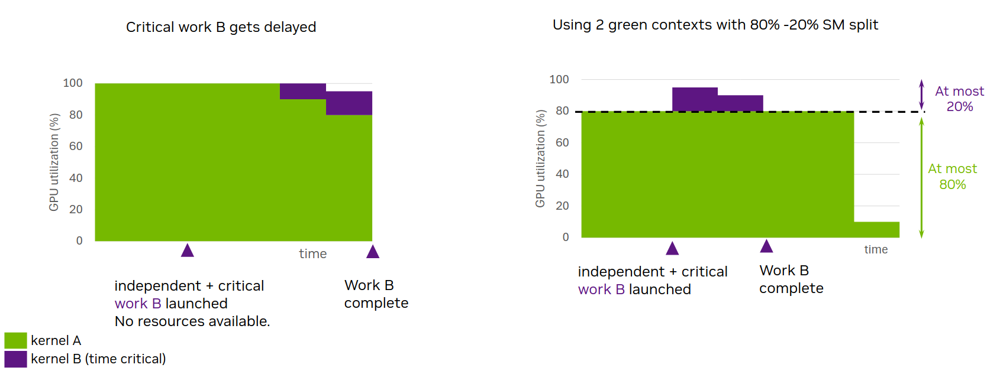

*图 45 动机：GC 的静态资源分区使延迟敏感的工作 B 能够更快地开始和完成*

绿色上下文可以划分 GPU 的 SM：面向内核 A 的绿色上下文 A 使用其中一部分，面向内核 B 的绿色上下文 B 使用其余部分。在这种配置下，无论启动配置如何，内核 A 都只能使用分配给绿色上下文 A 的 SM。因此，除非受到其他资源限制，关键内核 B 启动时总有可用 SM，可立即开始执行。如[图 45](#section-4-6-1)第二幅图所示，尽管内核 A 的执行时间可能增加，但延迟敏感的工作 B 不再因缺少 SM 而延迟。为便于说明，图中为绿色上下文 A 配置了 GPU 约 80% 的 SM。

这一行为无需对内核 A 和 B 进行任何代码修改即可实现。只需确保它们在属于相应绿色上下文的 CUDA 流上启动即可。每个绿色上下文将有权访问的 SM 数量应由用户在创建绿色上下文期间根据具体情况决定。

**工作队列：**

流式多处理器是一种可为绿色上下文配置的资源类型，工作队列则是另一种。工作队列可以视为一种黑盒资源抽象，它还会影响 GPU 工作的执行并发性等因素。如果相互独立的 GPU 工作任务（例如在不同 CUDA 流上提交的内核）被映射到同一工作队列，任务之间可能会产生错误依赖，导致它们串行执行。用户可通过 `CUDA_DEVICE_MAX_CONNECTIONS` 环境变量影响 GPU 上工作队列数量的上限（请参阅[第 5.2 节](#section-5-2)和[第 3.1 节](#section-3-1)）。

在上一个示例的基础上，假设工作 B 与工作 A 映射到同一工作队列。在这种情况下，即使有可用的 SM 资源（即绿色上下文的情况），工作 B 仍可能必须等待工作 A 全部完成。与 SM 类似，用户无法直接控制底层具体使用哪些工作队列。但是，绿色上下文允许用户以预期同时执行的流序工作负载数量来表达所需的最大并发度。驱动程序随后可将该值作为提示，尽量避免不同执行上下文的工作使用同一工作队列，从而防止执行上下文之间发生不必要的干扰。

> [!CAUTION]
> **注意**
> 即使为各绿色上下文配置不同的 SM 资源和工作队列，也不保证彼此独立的 GPU 工作一定并发执行。应把[绿色上下文](#section-4-6)中介绍的技术理解为消除可能阻碍并发执行的因素，即减少潜在干扰。

**绿色上下文与 MIG 或 MPS**

为了完整起见，本节简要比较绿色上下文与其他两种资源分区机制： [MIG（多实例 GPU）](https://docs.nvidia.com/datacenter/tesla/mig-user-guide/index.html) 和 [MPS（多进程服务）](https://docs.nvidia.com/deploy/mps/index.html)。

MIG 将支持 MIG 的 GPU 静态划分为多个 MIG 实例（“更小的 GPU”）。必须在启动应用程序前完成划分，不同的应用程序可以使用不同的 MIG 实例。如果应用程序总是无法充分利用可用 GPU 资源，MIG 可能会给用户带来收益；随着 GPU 规模增大，这个问题会更加突出。使用 MIG 时，用户可以在不同 MIG 实例上运行这些应用程序，从而提高 GPU 利用率。对云服务提供商（CSP）而言，MIG 的吸引力不仅在于提高这类应用程序的 GPU 利用率，还在于它能够在运行于不同 MIG 实例上的客户之间提供服务质量（QoS）和隔离性。更多详细信息请参阅上文链接的 MIG 文档。

但使用 MIG 无法解决前面描述的有问题的场景，其中关键工作 B 被延迟，因为所有 SM 资源都被来自同一应用程序的其他 GPU 工作占用。对于在单个 MIG 实例上运行的应用程序，此问题仍然存在。为了解决这个问题，可以使用绿色上下文和 MIG。在这种情况下，可用于分区的 SM 资源将是给定 MIG 实例的资源。

MPS 主要针对不同的进程（例如 MPI 程序），允许它们同时在 GPU 上运行，而无需时间切片。它需要在应用程序启动之前运行 MPS 守护进程。默认情况下，MPS 客户端将争夺它们正在运行的 GPU 或 MIG 实例的所有可用 SM 资源。在此多客户端进程设置中，MPS 可以使用活动的线程百分比选项支持 SM 资源的动态分区，该选项对 MPS 客户端进程可以使用的 SM 百分比设置上限。与绿色上下文不同，活动线程百分比分区在进程级别与 MPS 一起发生，并且该百分比通常在应用程序启动之前由环境变量指定。 MPS 活动线程百分比表示给定客户端应用程序不能使用超过 GPU 的 SM 的 x%，令其为 N SM。然而，这些 SM 可以是 GPU 的任意 N 个 SM，其也可以随时间变化。另一方面，在创建期间配置了 N SM 的绿色上下文只能使用这些特定的 N SM。

从 CUDA 13.1 开始，如果启动 MPS 控制守护进程时显式启用，MPS 还支持静态分区。采用静态分区时，用户必须在启动应用程序时指定 MPS 客户端进程可使用的分区，活动线程百分比所提供的动态共享不再适用。静态分区模式下的 MPS 与绿色上下文有一个关键区别：MPS 面向不同进程，而绿色上下文也可在单个进程内使用。此外，MPS 静态分区不允许对 SM 资源进行超额分配，绿色上下文则允许。

使用 MPS 时，也可以对通过驱动程序 API `cuCtxCreate` 创建的 CUDA 上下文进行 SM 资源的可编程分区，并建立执行亲和性。这种分区允许来自一个或多个进程的不同客户端 CUDA 上下文分别使用不超过指定数量的 SM。与活动线程百分比划分相同，这些 SM 可以是 GPU 上的任意 SM，并可随时间变化，这一点不同于绿色上下文。即使已采用静态 MPS 分区，仍可使用此选项。请注意，创建绿色上下文比创建 MPS 上下文轻量得多，因为许多底层结构归主上下文所有并由多个绿色上下文共享。

### 4.6.2. 绿色上下文：易于使用

为了说明绿色上下文使用起来非常简单，假设有如下代码片段：它创建两个 CUDA 流，然后调用一个函数，由该函数通过 `<<<>>>` 在这两个 CUDA 流上启动内核。如前所述，除了改变内核的启动几何配置外，用户无法影响这些内核可以使用的 SM 数量。

```cpp
int gpu_device_index = 0; // GPU ordinal
CUDA_CHECK(cudaSetDevice(gpu_device_index));

cudaStream_t strm1, strm2;
CUDA_CHECK(cudaStreamCreateWithFlags(&strm1, cudaStreamNonBlocking));
CUDA_CHECK(cudaStreamCreateWithFlags(&strm2, cudaStreamNonBlocking));

// No control over how many SMs kernel(s) running on each stream can use
code_that_launches_kernels_on_streams(strm1, strm2); // what is abstracted in this function + the kernels is the vast majority of your code

// cleanup code not shown
```

从 CUDA 13.1 开始，可以使用绿色上下文控制给定内核可以访问的 SM 的数量。下面的代码片段显示了做到这一点是多么容易。通过一些额外的行并且无需任何内核修改，您可以控制在这些不同的流上启动的 SM 资源内核可以使用。

```cpp
int gpu_device_index = 0; // GPU ordinal
CUDA_CHECK(cudaSetDevice(gpu_device_index));

/* ------------------ Code required to create green contexts --------------------------- */

// Get all available GPU SM resources
cudaDevResource initial_GPU_SM_resources {};
CUDA_CHECK(cudaDeviceGetDevResource(gpu_device_index, &initial_GPU_SM_resources, cudaDevResourceTypeSm));

// Split SM resources. This example creates one group with 16 SMs and one with 8. Assuming your GPU has >= 24 SMs
cudaDevSmResource result[2] {{}, {}};
cudaDevSmResourceGroupParams group_params[2] =  {
        {.smCount=16, .coscheduledSmCount=0, .preferredCoscheduledSmCount=0, .flags=0},
        {.smCount=8,  .coscheduledSmCount=0, .preferredCoscheduledSmCount=0, .flags=0}};
CUDA_CHECK(cudaDevSmResourceSplit(&result[0], 2, &initial_GPU_SM_resources, nullptr, 0, &group_params[0]));

// Generate resource descriptors for each resource
cudaDevResourceDesc_t resource_desc1 {};
cudaDevResourceDesc_t resource_desc2 {};
CUDA_CHECK(cudaDevResourceGenerateDesc(&resource_desc1, &result[0], 1));
CUDA_CHECK(cudaDevResourceGenerateDesc(&resource_desc2, &result[1], 1));

// Create green contexts
cudaExecutionContext_t my_green_ctx1 {};
cudaExecutionContext_t my_green_ctx2 {};
CUDA_CHECK(cudaGreenCtxCreate(&my_green_ctx1, resource_desc1, gpu_device_index, 0));
CUDA_CHECK(cudaGreenCtxCreate(&my_green_ctx2, resource_desc2, gpu_device_index, 0));

/* ------------------ Modified code --------------------------- */

// You just need to use a different CUDA API to create the streams
cudaStream_t strm1, strm2;
CUDA_CHECK(cudaExecutionCtxStreamCreate(&strm1, my_green_ctx1, cudaStreamDefault, 0));
CUDA_CHECK(cudaExecutionCtxStreamCreate(&strm2, my_green_ctx2, cudaStreamDefault, 0));

/* ------------------ Unchanged code --------------------------- */

// No need to modify any code in this function or in your kernel(s).
// Reminder: what is abstracted in this function + kernels is the vast majority of your code
// Now kernel(s) running on stream strm1 will use at most 16 SMs and kernel(s) on strm2 at most 8 SMs.
code_that_launches_kernels_on_streams(strm1, strm2);

// cleanup code not shown
```

各种执行上下文 API（前面的示例已展示其中一部分）接受显式 `cudaExecutionContext_t` 句柄，因此会忽略调用线程的当前上下文。此前，不使用驱动程序 API 的 CUDA 运行时用户默认只与主上下文交互；该主上下文通过 `cudaSetDevice()` 隐式设为线程的当前上下文。与此前依赖线程局部状态（TLS）的隐式上下文编程相比，这种显式上下文编程方式语义更清晰，还可能带来其他收益。

以下部分将详细解释前面代码片段中显示的所有步骤。

### 4.6.3. 绿色上下文：设备资源和资源描述符

绿色上下文的核心是与特定 GPU 设备绑定的设备资源（`cudaDevResource`）。资源可以组合并封装到描述符（`cudaDevResourceDesc_t`）中。绿色上下文只能访问创建它时所用描述符中封装的资源。

目前`cudaDevResource`数据结构定义为：

```cpp
struct {
     enum cudaDevResourceType type;
     union {
         struct cudaDevSmResource sm;
         struct cudaDevWorkqueueConfigResource wqConfig;
         struct cudaDevWorkqueueResource wq;
     };
 };
```

支持的有效资源类型为 `cudaDevResourceTypeSm`、 `cudaDevResourceTypeWorkqueueConfig` 和 `cudaDevResourceTypeWorkqueue`，而 `cudaDevResourceTypeInvalid` 标识无效资源类型。

有效的设备资源可以与：

- 一组特定的流式多处理器 (SM)(资源类型 `cudaDevResourceTypeSm` ),
- 特定工作队列配置（资源类型为 `cudaDevResourceTypeWorkqueueConfig`），或
- 预先存在的工作队列资源（资源类型为 `cudaDevResourceTypeWorkqueue`）。

可以分别使用 `cudaExecutionCtxGetDevResource` 和 `cudaStreamGetDevResource` API 查询给定执行上下文或 CUDA 流是否与给定类型的 `cudaDevResource` 资源关联。对于执行上下文来说，也可以与不同类型的设备资源（例如 SM 和工作队列）关联，而流只能与 SM 类型的资源关联。

默认情况下，给定的 GPU 设备具有所有三种设备资源类型：包含 GPU 的所有 SM 的 SM 类型资源，包含所有可用工作队列及其相应工作队列资源的工作队列配置资源。这些资源可以通过 `cudaDeviceGetDevResource` API 检索。

**相关设备资源结构概述**

不同的资源类型结构具有由用户或相关 CUDA API 调用显式设置的字段。建议对所有设备资源结构进行零初始化。

- SM 类型的设备资源 ( `cudaDevSmResource` ) 具有以下相关字段：
上述字段要么由创建该 SM 类型资源时使用的相应划分 API（`cudaDevSmResourceSplitByCount` 或 `cudaDevSmResourceSplit`）设置，要么由检索给定 GPU 设备 SM 资源的 `cudaDeviceGetDevResource` API 填充。用户绝不应直接设置这些字段。更多详细信息请参阅下一节。
- `unsigned int smCount`：此资源中可用的 SM 数量
- `unsigned int minSmPartitionSize`：分区此资源所需的最小 SM 计数
- `unsigned int smCoscheduledAlignment`：资源中保证在同一 GPU 处理集群上共同调度的 SM 数量，与线程块簇相关。当 `flags` 为零时，`smCount` 是该值的倍数。
- `unsigned int flags`：支持的标志为 0（默认）和 `cudaDevSmResourceGroupBackfill`(请参阅 `cudaDevSmResourceGroup` 标志)。
- 工作队列配置设备资源（`cudaDevWorkqueueConfigResource`）具有以下相关字段：
这些字段需要由用户设置。没有类似于生成工作队列配置资源的拆分 API 的 CUDA API，但由 `cudaDeviceGetDevResource` API 填充的工作队列配置资源除外。 API 可以检索给定 GPU 设备的工作队列配置资源。
- `int device`：工作队列资源可用的设备
- `unsigned int wqConcurrencyLimit`：预计避免错误依赖关系的流有序工作负载的数量
- `enum cudaDevWorkqueueConfigScope sharingScope`：工作队列资源的共享范围。支持的值为： `cudaDevWorkqueueConfigScopeDeviceCtx` （默认）和 `cudaDevWorkqueueConfigScopeGreenCtxBalanced`。使用默认选项时，所有工作队列资源在所有上下文之间共享，而使用平衡选项时，驱动程序尝试尽可能在绿色上下文上使用非重叠工作队列资源，并使用用户指定的 `wqConcurrencyLimit` 作为提示。
- 最后，预先存在的工作队列资源 ( `cudaDevResourceTypeWorkqueue` ) 没有可由用户设置的字段。与其他资源类型一样，`cudaDevGetDevResource` 可以检索给定 GPU 设备的预先存在的工作队列资源。

### 4.6.4. 绿色上下文创建示例

绿色上下文创建涉及四个主要步骤：

- 步骤 1：从一组初始资源开始，例如，通过获取 GPU 的可用资源
- 步骤 2：将 SM 资源划分为一个或多个分区（使用可用的拆分 API 之一）。
- 步骤 3：创建一个资源描述符（如果需要）组合不同的资源
- 步骤 4：从描述符创建绿色上下文，配置其资源

创建绿色上下文后，您可以创建属于该绿色上下文的 CUDA 流。随后在此类流上启动的 GPU 工作，例如通过 `<<< >>>` 启动的内核，将只能访问此绿色上下文的配置资源。图书馆还可以轻松利用绿色上下文，只要用户将属于绿色上下文的流传递给它们即可。有关详细信息，请参阅 [绿色上下文 - 启动工作](#section-4-6-5)。

#### 4.6.4.1. 步骤1：获取可用的 GPU 资源

创建绿色上下文的第一步是获取可用的设备资源并填充 `cudaDevResource` 结构。当前有三个可能的起点：设备、执行上下文或 CUDA 流。

下面列出了相关的 CUDA 运行时 API 函数签名：

- 对于**设备**：`cudaError_t cudaDeviceGetDevResource(int device, cudaDevResource* resource, cudaDevResourceType type)`
- 对于**执行上下文**：`cudaError_t cudaExecutionCtxGetDevResource(cudaExecutionContext_t ctx, cudaDevResource* resource, cudaDevResourceType type)`
- 对于**流**：`cudaError_t cudaStreamGetDevResource(cudaStream_t hStream, cudaDevResource* resource, cudaDevResourceType type)`

这些 API 中的每一个都允许所有有效的 `cudaDevResourceType` 类型，但 `cudaStreamGetDevResource` 除外，它仅支持 SM 类型资源。

通常，起点是 GPU 设备。下面的代码片段显示了如何获取给定 GPU 设备的可用 SM 资源。成功调用 `cudaDeviceGetDevResource` 后，用户可以查看此资源中可用的 SM 数量。

```cpp
int current_device = 0; // assume device ordinal of 0
CUDA_CHECK(cudaSetDevice(current_device));

cudaDevResource initial_SM_resources = {};
CUDA_CHECK(cudaDeviceGetDevResource(current_device /* GPU device */,
                                   &initial_SM_resources /* device resource to populate */,
                                   cudaDevResourceTypeSm /* resource type*/));

std::cout << "Initial SM resources: " << initial_SM_resources.sm.smCount << " SMs" << std::endl; // number of available SMs

// Special fields relevant for partitioning (see Step 3 below)
std::cout << "Min. SM partition size: " <<  initial_SM_resources.sm.minSmPartitionSize << " SMs" << std::endl;
std::cout << "SM co-scheduled alignment: " <<  initial_SM_resources.sm.smCoscheduledAlignment << " SMs" << std::endl;
```

还可以获得可用的工作队列配置。资源，如下面的代码片段所示。

```cpp
int current_device = 0; // assume device ordinal of 0
CUDA_CHECK(cudaSetDevice(current_device));

cudaDevResource initial_WQ_config_resources = {};
CUDA_CHECK(cudaDeviceGetDevResource(current_device /* GPU device */,
                                   &initial_WQ_config_resources /* device resource to populate */,
                                   cudaDevResourceTypeWorkqueueConfig /* resource type*/));

std::cout << "Initial WQ config. resources: " << std::endl;
std::cout << "  - WQ concurrency limit: " << initial_WQ_config_resources.wqConfig.wqConcurrencyLimit << std::endl;
std::cout << "  - WQ sharing scope: " << initial_WQ_config_resources.wqConfig.sharingScope << std::endl;
```

成功调用 `cudaDeviceGetDevResource` 后，用户可以查看此资源的 `wqConcurrencyLimit`。当起始点是 GPU 设备时，`wqConcurrencyLimit` 将匹配 `CUDA_DEVICE_MAX_CONNECTIONS` 环境变量的值或其默认值。

#### 4.6.4.2. 步骤2：对 SM 资源进行分区

绿色上下文创建的第二步是将可用的 `cudaDevResource` SM 资源静态拆分为一个或多个分区，并可能在剩余分区中留下一些 SM。使用 `cudaDevSmResourceSplitByCount()` 或 `cudaDevSmResourceSplit()` API 可以进行此分区。 `cudaDevSmResourceSplitByCount()` API 只能创建一个或多个 *同质* 分区，以及潜在的 *剩余* 分区，而 `cudaDevSmResourceSplit()` API 还可以创建 *异质的* 分区，以及潜在的 *剩余* 分区。后续部分详细描述了这两个 API 的功能。这两个 API 仅适用于 SM 类型的设备资源。

**cudaDevSmResourceSplitByCount API**

`cudaDevSmResourceSplitByCount` 运行时 API 签名为：

`cudaError_t cudaDevSmResourceSplitByCount(cudaDevResource* result, unsigned int* nbGroups, const cudaDevResource* input, cudaDevResource* remaining, unsigned int useFlags, unsigned int minCount)`

正如 [图 46](#section-4-6-4-2) 所强调的，用户请求将 `input` SM 类型的设备资源拆分为 `*nbGroups` 同质组，每个组为 `minCount` SM。然而，最终结果将包含可能更新的 `*nbGroups` 数量的同质组，每个组具有 `N` SM。可能更新的 `*nbGroups` 将小于或等于最初请求的组号，而 `N` 将等于或大于 `minCount`。这些调整可能是由于某些特定于架构的粒度和对齐要求而发生的。

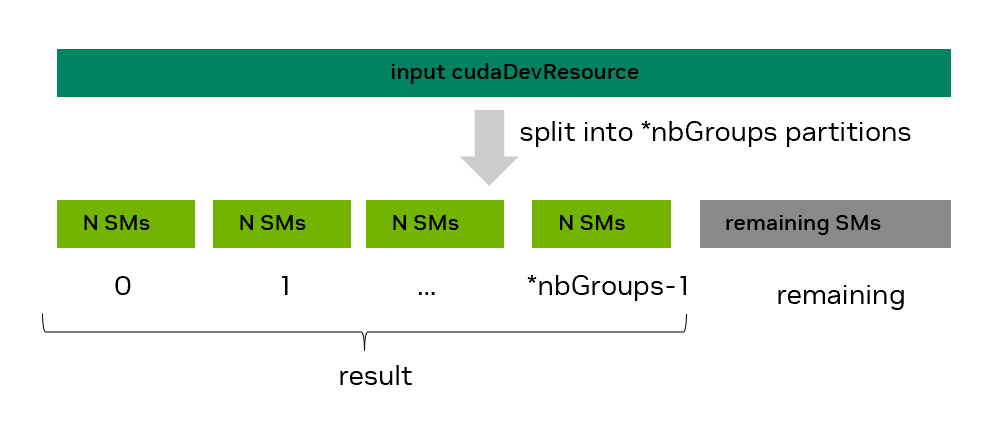

*图 46 SM 使用 cudaDevSmResourceSplitByCount API 进行资源分割*

[表 30](#section-5-1-3) 列出了默认 `useFlags=0` 情况下所有当前支持的计算功能的最小 SM 分区大小和 SM 共同调度对齐。还可以通过 `cudaDevSmResource` 的 `minSmPartitionSize` 和 `smCoscheduledAlignment` 字段检索这些值，如 [第 1 步：获取可用的 GPU 资源](#section-4-6-4-1) 中所示。其中一些要求可以通过不同的 `useFlags` 值来降低。 [表 14](#section-4-6-4-2) 提供了一些相关示例，突出显示了请求内容与最终结果之间的差异，并进行了解释。表重点关注计算能力 (CC 9.0)，其中每个分区的 SM 的最小数量为 8，如果 `useFlags` 为零，则 SM 计数必须是 8 的倍数。

**表 14 分割功能**

| 已请求 |  |  | 实际（对于具有 132 SM 的 GH200） |  |  |
| --- | --- | --- | --- | --- | --- |
| `*nbGroups` | 最小计数 | 使用标志 | `*nbGroups with N SMs` | 剩余 SM | 原因 |
| 2 | 72 | 0 | 1组72个 SM | 60 | 不能超过 132 SM |
| 6 | 11 | 0 | 6组16个 SM | 36 | 8的倍数要求 |
| 6 | 11 | `CU_DEV_SM_RESOURCE_SPLIT_IGNORE_SM_COSCHEDULING` | 6组，每组12个 SM | 60 | 降低至 2 要求的倍数。 |
| 2 | 1 | 0 | 2组，每组8个 SM | 116 | 分钟。 8 SM 要求 |

以下代码片段请求将可用的 SM 资源分成五组，每组 8 个 SM:

```cpp
cudaDevResource avail_resources = {};
// Code that has populated avail_resources not shown

unsigned int min_SM_count = 8;
unsigned int actual_split_groups = 5; // may be updated

cudaDevResource actual_split_result[5] = {{}, {}, {}, {}, {}};
cudaDevResource remaining_partition = {};

CUDA_CHECK(cudaDevSmResourceSplitByCount(&actual_split_result[0],
                                         &actual_split_groups,
                                         &avail_resources,
                                         &remaining_partition,
                                         0 /*useFlags */,
                                         min_SM_count));

std::cout << "Split " << avail_resources.sm.smCount << " SMs into " << actual_split_groups << " groups " \
          << "with " << actual_split_result[0].sm.smCount << " each " \
          << "and a remaining group with " << remaining_partition.sm.smCount << " SMs" << std::endl;
```

请注意：

- 可以使用 `result=nullptr` 查询将创建的组的数量
- 如果不关心剩余分区的 SM，可以设置 `remaining=nullptr`
- 剩余的（剩余）分区不具有与结果中的同质组相同的功能或性能保证。
- 默认情况下，`useFlags` 预计为 0，但也支持 `cudaDevSmResourceSplitIgnoreSmCoscheduling` 和 `cudaDevSmResourceSplitMaxPotentialClusterSize` 的值
- 如果不首先创建资源描述符和绿色上下文（即下面的步骤 3 和 4），则无法对任何生成的 `cudaDevResource` 进行重新分区

更多详细信息，请参阅 [cudaDevSmResourceSplitByCount](https://docs.nvidia.com/cuda/cuda-runtime-api/group__CUDART__EXECUTION__CONTEXT.html#group__CUDART__EXECUTION__CONTEXT_1g10ef763a79ff53245bec99b96a7abb73) 运行时 API 参考。

**cudaDevSmResourceSplit API**

如前所述，单个 `cudaDevSmResourceSplitByCount` API 调用只能创建同构分区，即具有相同数量的 SM 的分区，加上剩余的分区。这可能会限制异构工作负载，其中在不同绿色上下文上运行的工作具有不同的 SM 计数要求。要使用按计数分割 API 实现异构分区，通常需要通过重复步骤 1-4（多次）来对现有资源进行重新分区。或者，在某些情况下，作为步骤 2 的一部分，可以创建同质分区，每个分区的 SM 计数等于所有异构分区的 GCD（最大公约数），然后作为步骤 3 的一部分将所需数量的分区合并在一起。但不建议使用最后一种方法，因为如果预先请求更大的大小，CUDA 驱动程序可能能够创建更好的分区。

`cudaDevSmResourceSplit` API 旨在通过允许用户在单个调用中创建非重叠异构分区来解决这些限制。 `cudaDevSmResourceSplit` 运行时 API 签名为：

`cudaError_t cudaDevSmResourceSplit(cudaDevResource* result, unsigned int nbGroups, const cudaDevResource* input, cudaDevResource* remainder, unsigned int flags, cudaDevSmResourceGroupParams* groupParams)`

该 API 会根据 `groupParams` 数组中为各组指定的要求，尝试将 `input` SM 类型资源划分为 `nbGroups` 个有效设备资源（组），并将其放入 `result` 数组。API 还可以创建一个可选的剩余分区。成功划分后，如 [图 47](#section-4-6-4-2) 所示，`result` 中各资源的 SM 数量可以不同，但绝不会为零。

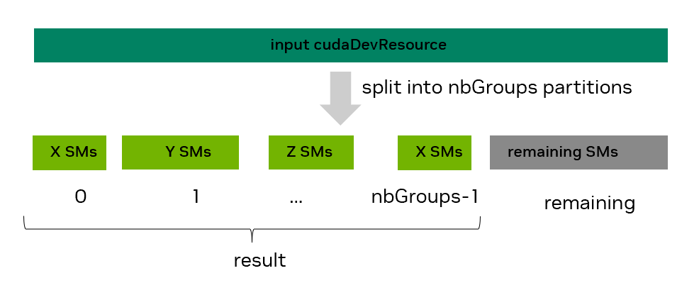

*图 47 SM 使用 cudaDevSmResourceSplit API 进行资源分割*

请求异构划分时，需要通过相应 `groupParams` 条目的 `smCount` 字段，为 `result` 中的每个资源指定 SM 数量。SM 数量必须始终是 2 的倍数。对于上图所示场景，`groupParams[0].smCount` 为 `X`，`groupParams[1].smCount` 为 `Y`，依此类推。但是，如果应用程序使用 [线程块簇](#section-1-2-2-1-1)，仅指定 SM 数量并不足够。由于保证会同时调度簇中的所有线程块，用户还需要通过相应 `groupParams` 条目的 `coscheduledSmCount` 字段，指定给定资源组应支持的最大簇大小（如果需要支持簇）。对于计算能力 10.0 及更高版本（CC 10.0+）的 GPU，簇还可以具有首选维度，其大小是默认簇维度的倍数。在受支持的系统上单次启动内核时，会尽可能使用较大的首选簇维度，否则使用较小的默认簇维度。用户可以通过相应 `groupParams` 条目的 `preferredCoscheduledSmCount` 字段表达此首选簇维度提示。最后，用户有时可能希望放宽 SM 数量要求，将给定组中更多可用 SM 纳入其中；可以将相应 `groupParams` 条目的 `flags` 字段设为非默认标志值，以表达该回填选项。

为了提供更大的灵活性，`cudaDevSmResourceSplit` API 还具有 **发现** 模式，当提前未知一个或多个组的确切 SM 计数时使用。例如，用户可能希望创建具有尽可能多的 SM 的设备资源，同时满足一些协同调度要求（例如，允许大小为 4 的集群）。为了执行此发现模式，用户可以将相关 `groupParams` 条目（或多个条目）的 `smCount` 字段设置为零。成功调用 `cudaDevSmResourceSplit` 后，`groupParams` 的 `smCount` 字段将填充有效的非零值；我们将此称为 **实际的** `smCount` 值。如果 `result` 不为空（因此这不是空运行），则 `result` 的相关组也将其 `smCount` 设置为相同的值。 `nbGroups` `groupParams` 条目的指定顺序很重要，因为它们是从左（索引 0）到右（索引 nbGroups-1）进行评估的。

[表 15](#section-4-6-4-2) 提供了 `cudaDevSmResourceSplit` API 支持的参数的高级视图。

**表 15 cudaDevSmResourceSplit 拆分概述 API**

|  |  |  |  |  | 组参数数组；显示条目 i 和 i [0, nbGroups) | 组参数数组；显示条目 i 和 i [0, nbGroups) | 组参数数组；显示条目 i 和 i [0, nbGroups) | 组参数数组；显示条目 i 和 i [0, nbGroups) |
| --- | --- | --- | --- | --- | --- | --- | --- | --- |
| 结果 | nb 组 | 输入 | 余数 | 旗帜 | sm 计数 | 协同调度 SmCount | 首选 CoscheduledSmCount | 旗帜 |
| nullptr 用于探索性试运行；否则不为 null ptr | 组数 | 要拆分为 nbGroups 组的资源 | nullptr 如果您不想要剩余组 | 0 | 0 表示发现模式或其他有效 smCount | 0（默认）或有效的协同调度 SM 计数 | 0（默认）或有效的首选协同调度 SM 计数（提示） | 0（默认）或 cudaDevSmResourceGroupBackfill |

注意事项：

1. `cudaDevSmResourceSplit` API 的返回值取决于 `result`：

> - `result != nullptr`：仅当拆分成功，并创建了满足指定要求的 `nbGroups` 组有效 `cudaDevResource` 时，API 才返回 `cudaSuccess`；否则返回错误。由于不同类型的错误可能返回相同错误码（例如 `CUDA_ERROR_INVALID_RESOURCE_CONFIGURATION`），建议在开发期间使用 `CUDA_LOG_FILE` 环境变量获取更具说明性的错误描述。
> - `result == nullptr`：即使组的结果 `smCount` 为零，API 也可能返回 `cudaSuccess`，这种情况会返回非 nullptr `result` 的错误。将此模式视为您可以在探索支持的内容时使用的空运行测试，尤其是在发现模式下。

1. 当调用成功且 `result != nullptr` 时，对于 `[0, nbGroups)` 范围内的 `i`，所得设备资源 `result[i]` 的类型为 `cudaDevResourceTypeSm`，其 `result[i].sm.smCount` 要么是用户指定的非零 `groupParams[i].smCount` 值，要么是检测得到的值。在这两种情况下，`result[i].sm.smCount` 都将满足以下所有约束：

> - 是 `multiple of 2` 并且
> - 在 `[2, input.sm.smCount]` 范围内并且
> - `(flags == 0) ? (multiple of actual group_params[i].coscheduledSmCount) : (>= groups_params[i].coscheduledSmCount)`

1. 为任何 `coscheduledSmCount` 和 `preferredCoscheduledSmCount` 字段指定零表示应使用这些字段的默认值；这些可能因 GPU 而异。这些默认值都等于通过给定设备的 `cudaDeviceGetDevResource` API 检索的 SM 资源的 `smCoscheduledAlignment`（而不是任何 SM 资源）。要查看这些默认值，可以在成功进行 `cudaDevSmResourceSplit` 调用后在相关 `groupParams` 条目中检查它们的更新值，这些值最初设置为 0；见下文。

> ```cpp
> int gpu_device_index = 0;
> cudaDevResource initial_GPU_SM_resources {};
> CUDA_CHECK(cudaDeviceGetDevResource(gpu_device_index, &initial_GPU_SM_resources, cudaDevResourceTypeSm));
> std::cout << "Default value will be equal to " << initial_GPU_SM_resources.sm.smCoscheduledAlignment << std::endl;
>
> int default_split_flags = 0;
> cudaDevSmResourceGroupParams group_params_tmp = {.smCount=0, .coscheduledSmCount=0, .preferredCoscheduledSmCount=0, .flags=0};
> CUDA_CHECK(cudaDevSmResourceSplit(nullptr, 1, &initial_GPU_SM_resources, nullptr /*remainder*/, default_split_flags, &group_params_tmp));
> std::cout << "coscheduledSmcount default value: " << group_params.coscheduledSmCount << std::endl;
> std::cout << "preferredCoscheduledSmcount default value: " << group_params.preferredCoscheduledSmCount << std::endl;
> ```

1. 剩余组（如果存在）对其 SM 计数或协同调度要求没有任何限制。这将由用户来探索。

在提供各种 `cudaDevSmResourceGroupParams` 字段的更详细信息之前，[表 16](#section-4-6-4-2) 展示了这些值对于某些示例用例的可能含义。假设已填充 `initial_GPU_SM_resources` 设备资源（如前面的代码片段所示），并且是将要拆分的资源。表中的每一行都将具有相同的起点。为简单起见，表将仅显示每个用例的 `nbGroups` 值和 `groupParams` 字段，这些字段可在如下代码片段中使用。

```cpp
int nbGroups = 2; // update as needed
unsigned int default_split_flags = 0;
cudaDevResource remainder {}; // update as needed
cudaDevResource result_use_case[2] = {{}, {}}; // Update depending on number of groups planned. Increase size if you plan to also use a workqueue resource
cudaDevSmResourceGroupParams group_params_use_case[2] = {{.smCount = X, .coscheduledSmCount=0, .preferredCoscheduledSmCount = 0, .flags = 0},
                                                         {.smCount = Y, .coscheduledSmCount=0, .preferredCoscheduledSmCount = 0, .flags = 0}}
CUDA_CHECK(cudaDevSmResourceSplit(&result_use_case[0], nbGroups, &initial_GPU_SM_resources, remainder, default_split_flags, &group_params_use_case[0]));
```

**表 16 个分割 API 用例**

|  |  |  |  | groupParams[i] 字段（i 按升序显示；请参阅最后一列） | groupParams[i] 字段（i 按升序显示；请参阅最后一列） | groupParams[i] 字段（i 按升序显示；请参阅最后一列） | groupParams[i] 字段（i 按升序显示；请参阅最后一列） | 我 |
| --- | --- | --- | --- | --- | --- | --- | --- | --- |
| # | 目标/用例 | nb 组 | 余数 | sm 计数 | 协同调度 SmCount | 首选 CoscheduledSmCount | 旗帜 |  |
| 1 | 资源具有 16 SM。不关心剩余的 SM。可以使用集群。 | 1 | 空指针 | 16 | 0 | 0 | 0 | 0 |
|  |  |  |  |  |  |  |  |  |
| 2a | 一种资源包含 16 SM，另一种资源包含其他所有内容。不会使用集群。 （说明：显示两个选项：在选项（2a）中，第二个资源是余数；在选项（2b）中，它是 result_use_case[1]。） | 1 (2a) | 不为空指针 | 16 | 2 | 2 | 0 | 0 |
|  | 一种资源包含 16 SM，另一种资源包含其他所有内容。不会使用集群。 （说明：显示两个选项：在选项（2a）中，第二个资源是余数；在选项（2b）中，它是 result_use_case[1]。） |  |  |  |  |  |  |  |
| 2b | 一种资源包含 16 SM，另一种资源包含其他所有内容。不会使用集群。 （说明：显示两个选项：在选项（2a）中，第二个资源是余数；在选项（2b）中，它是 result_use_case[1]。） | 2(2b) | 空指针 | 16 | 2 | 2 | 0 | 0 |
| 2b | 一种资源包含 16 SM，另一种资源包含其他所有内容。不会使用集群。 （说明：显示两个选项：在选项（2a）中，第二个资源是余数；在选项（2b）中，它是 result_use_case[1]。） | 2(2b) | 空指针 | 0 | 2 | 2 | cudaDevSmResourceGroupBackfill | 1 |
| 2b | 一种资源包含 16 SM，另一种资源包含其他所有内容。不会使用集群。 （说明：显示两个选项：在选项（2a）中，第二个资源是余数；在选项（2b）中，它是 result_use_case[1]。） | 2(2b) | 空指针 |  |  |  |  |  |
|  |  |  |  |  |  |  |  |  |
| 3 | 两个资源分别具有 28 和 32 个 SM，将使用大小为 4 的簇。 | 2 | 空指针 | 28 | 4 | 4 | 0 | 0 |
| 3 | 两个资源分别具有 28 和 32 个 SM，将使用大小为 4 的簇。 | 2 | 空指针 | 32 | 4 | 4 | 0 | 1 |
| 3 | 两个资源分别具有 28 和 32 个 SM，将使用大小为 4 的簇。 | 2 | 空指针 |  |  |  |  |  |
|  |  |  |  |  |  |  |  |  |
| 4 | 一种资源具有尽可能多的 SM，可运行大小为 8 的集群，其余为 1 个。 | 1 | 不为空指针 | 0 | 8 | 8 | 0 | 0 |
|  |  |  |  |  |  |  |  |  |
| 5 | 一种资源具有尽可能多的 SM，可以运行大小为 4 的集群，另一种资源具有 8 个 SM。 （说明：顺序很重要！更改 groupParams 数组中条目的顺序可能意味着 8-SM 组没有 SM 剩余） | 2 | 空指针 | 8 | 2 | 2 | 0 | 0 |
| 5 | 一种资源具有尽可能多的 SM，可以运行大小为 4 的集群，另一种资源具有 8 个 SM。 （说明：顺序很重要！更改 groupParams 数组中条目的顺序可能意味着 8-SM 组没有 SM 剩余） | 2 | 空指针 | 0 | 4 | 4 | 0 | 1 |
| 5 | 一种资源具有尽可能多的 SM，可以运行大小为 4 的集群，另一种资源具有 8 个 SM。 （说明：顺序很重要！更改 groupParams 数组中条目的顺序可能意味着 8-SM 组没有 SM 剩余） | 2 | 空指针 |  |  |  |  |  |

**有关各种 cudaDevSmResourceGroupParams 结构字段的详细信息**

`smCount` :

- 控制结果中相应组的 SM 计数。
- **取值：** 0（发现模式）或有效的非零值（非发现模式）
- 有效的非零 `smCount` 值要求：`(multiple of 2) and in [2, input->sm.smCount] and ((flags == 0) ? multiple of actual coscheduledSmCount : greater than or equal to coscheduledSmCount)`
- **使用案例**：使用发现模式探索当 SM 计数未知/固定时可能发生的情况；使用非发现模式请求特定数量的 SM。
- 说明：在发现模式下，实际的 SM 计数，在成功分割调用且结果为非 nullptr 后，将满足有效的非零值要求

`coscheduledSmCount` :

- 控制分组在一起（“共同调度”）的 SM 数量，以启用在计算能力 9.0+ 上启动不同的集群。因此，它可能会影响生成的组中 SM 的数量以及它们可以支持的集群大小。
- **取值：** 0（当前架构的默认值）或有效的非零值
- 有效的非零值要求：`(multiple of 2)` 高达最大限制
- **使用案例**：对集群使用默认值或手动选择的值，请记住最大值。给定架构上的可移植集群大小。如果您的代码不使用集群，则可以使用支持的最小值 2 或默认值。
- 说明：使用默认值时，拆分成功后实际的 `coscheduledSmCount` 也会满足有效非零值的要求。如果 `flags` 非零，则结果中的 `smCount >= coscheduledSmCount`。可以把 `coscheduledSmCount` 理解为对有效结果组底层“结构”的保证：即使在最坏情况下，该组也至少能运行一个大小为 `coscheduledSmCount` 的簇。此类结构保证不适用于剩余资源组；用户需要自行探查该组可启动的簇大小。

`preferredCoscheduledSmCount` :

- 充当驱动程序的提示，以尝试将实际 `coscheduledSmCount` SM 组合并到更大的 `preferredCoscheduledSmCount` 组（如果可能）。这样做可以允许代码利用具有计算能力 (CC) 10.0 及以上版本的设备上可用的首选集群尺寸功能。请参阅 [cudaLaunchAttributeValue::preferredClusterDim](https://docs.nvidia.com/cuda/cuda-runtime-api/unioncudaLaunchAttributeValue.html#unioncudaLaunchAttributeValue_17862864bbc2343700bae285345d188ca)。
- **取值：** 0（当前架构的默认值）或有效的非零值
- 有效的非零值要求：`(multiple of actual coscheduledSmCount)`
- **使用案例**：如果您使用首选集群并且位于计算能力 10.0 (Blackwell) 或更高版本的设备上，请使用手动选择的大于 2 的值。如果您不使用集群，请选择与 `coscheduledSmCount` 相同的值：选择支持的最小值 2 或两者都使用 0
- 说明：当使用默认值时，实际的 `preferredCoscheduledSmCount` 在成功分割调用后也将满足有效的非零值要求。

`flags` :

- 控制组的 SM 计数是否是实际协同调度的 SM 计数（默认）的倍数，或者 SM 是否可以回填到该组中（回填）。在回填情况下，生成的 SM 计数 ( `result[i].sm.smCount` ) 将大于或等于指定的 `groupParams[i].smCount`。
- **取值：** 0（默认）或 `cudaDevSmResourceGroupBackfill`
- **使用案例**：使用零（默认），因此生成的组具有支持 coScheduledSmCount 大小的多个集群的保证灵活性。如果您希望在组中获得尽可能多的 SM，其中一些 SM（回填的），请使用回填选项，而不提供任何协同调度保证。
- 说明：使用 backfill 标志创建的组仍然可以支持集群（例如，保证支持至少一个 coscheduledSmCount 大小）。

#### 4.6.4.3. 步骤 2（续）：添加工作队列资源

如果您还想指定工作队列资源，则需要显式完成。以下示例演示如何为具有平衡共享范围且并发限制为 4 的特定设备创建工作队列配置资源。

```cpp
cudaDevResource split_result[2] = {{}, {}};
// code to populate split_result[0] not shown; used split API with nbGroups=1

// The last resource will be a workqueue resource.
split_result[1].type = cudaDevResourceTypeWorkqueueConfig;
split_result[1].wqConfig.device = 0; // assume device ordinal of 0
split_result[1].wqConfig.sharingScope = cudaDevWorkqueueConfigScopeGreenCtxBalanced;
split_result[1].wqConfig.wqConcurrencyLimit = 4;
```

工作队列并发限制为 4 个，提示驱动程序用户预计最多有 4 个并发流有序工作负载。如果可能的话，驱动程序将分配工作队列，尝试遵守此提示。

#### 4.6.4.4. 第 3 步：创建资源描述符

资源分割后，下一步是使用 `cudaDevResourceGenerateDesc` API 为预计可用于绿色上下文的所有资源生成资源描述符。

相关的 CUDA 运行时 API 函数签名为：

`cudaError_t cudaDevResourceGenerateDesc(cudaDevResourceDesc_t *phDesc, cudaDevResource *resources, unsigned int nbResources)`

可以组合多个 `cudaDevResource` 资源。例如，下面的代码片段展示了如何生成封装三组资源的资源描述符。您只需确保这些资源都在 `resources` 数组中连续分配即可。

```cpp
cudaDevResource actual_split_result[5] = {};
// code to populate actual_split_result not shown

// Generate resource desc. to encapsulate 3 resources: actual_split_result[2] to [4]
cudaDevResourceDesc_t resource_desc;
CUDA_CHECK(cudaDevResourceGenerateDesc(&resource_desc, &actual_split_result[2], 3));
```

还支持组合不同类型的资源。例如，可以生成具有 SM 和工作队列资源的描述符。

要使 `cudaDevResourceGenerateDesc` 调用成功：

- 所有 `nbResources` 资源应属于同一 GPU 设备。
- 如果组合多个 SM 类型资源，则它们应从同一拆分 API 调用生成，并具有相同的 `coscheduledSmCount` 值（如果不是余数的一部分）
- 只能存在单个工作队列配置或工作队列类型资源。

#### 4.6.4.5. 第四步：创建绿色上下文

最后一步是使用 `cudaGreenCtxCreate` API 从资源描述符创建绿色上下文。该绿色上下文只能访问封装在其创建期间指定的资源描述符中的资源（例如，SM、工作队列）。这些资源将在此步骤中配置。

相关的 CUDA 运行时 API 函数签名为：

`cudaError_t cudaGreenCtxCreate(cudaExecutionContext_t *phCtx, cudaDevResourceDesc_t desc, int device, unsigned int flags)`

`flags` 参数应设置为 0。还建议在通过 `cudaInitDevice` API 或 `cudaSetDevice` API 创建绿色上下文之前显式初始化设备的主上下文，这也会设置主上下文作为调用线程的当前值。这样做可以确保在创建绿色上下文期间不会有额外的主上下文初始化开销。

请参阅下面的代码片段。

```cpp
int current_device = 0; // assume single GPU
CUDA_CHECK(cudaSetDevice(current_device)); // Or cudaInitDevice

cudaDevResourceDesc_t resource_desc {};
// Code to generate resource_desc not shown

// Create a green_ctx on GPU with current_device ID with access to resources from resource_desc
cudaExecutionContext_t green_ctx {};
CUDA_CHECK(cudaGreenCtxCreate(&green_ctx, resource_desc, current_device, 0));
```

成功创建绿色上下文后，用户可以通过在每个资源类型的执行上下文上调用 `cudaExecutionCtxGetDevResource` 来验证其资源。

**创建多个绿色上下文**

一个应用程序可以拥有多个绿色上下文；此时需要重复执行上述部分步骤。对大多数用例而言，这些绿色上下文各自拥有一组独立且不重叠的已配置 SM。例如，当有五个同构 `cudaDevResource` 组（即 `actual_split_result` 数组）时，一个绿色上下文的描述符可以封装 `actual_split_result[2]` 到 `actual_split_result[4]` 的资源，另一个绿色上下文的描述符则可以封装 `actual_split_result[0]` 到 `actual_split_result[1]` 的资源。在这种情况下，某个具体 SM 只会为应用程序的两个绿色上下文之一进行配置。

但也可以超额分配 SM，并在某些场景中加以利用。例如，第二个绿色上下文的描述符可以纳入 `actual_split_result[0]` 到 `[2]`。此时，`actual_split_resource[2]` 对应的 `cudaDevResource` 中所有 SM 都会被超额分配，即同时向两个绿色上下文提供资源；而 `actual_split_resource[0]` 到 `[1]` 以及 `actual_split_resource[3]` 到 `[4]` 中的资源则分别只能由其中一个绿色上下文使用。是否超额分配 SM，应根据具体场景审慎决定。

### 4.6.5. 绿色上下文 - 启动工作

要启动针对使用前面步骤创建的绿色上下文的内核，您首先需要使用 `cudaExecutionCtxStreamCreate` API 为该绿色上下文创建流。使用 `<<< >>>` 或 `cudaLaunchKernel` API 在该流上启动内核将确保内核只能使用可用的资源（SM，工作队列） 流通过其执行上下文。例如：

```cpp
// Create green_ctx_stream CUDA stream for previously created green_ctx green context
cudaStream_t green_ctx_stream;
int priority = 0;
CUDA_CHECK(cudaExecutionCtxStreamCreate(&green_ctx_stream,
                                        green_ctx,
                                        cudaStreamDefault,
                                        priority));

// Kernel my_kernel will only use the resources (SMs, work queues, as applicable) available to green_ctx_stream's execution context
my_kernel<<<grid_dim, block_dim, 0, green_ctx_stream>>>();
CUDA_CHECK(cudaGetLastError());
```

传递给上面的流创建 API 的默认流创建标志相当于 `cudaStreamNonBlocking`，因为 `green_ctx` 是绿色的上下文。

**CUDA 图**

对于作为 CUDA 图一部分启动的内核（请参阅 [CUDA 图](#section-4-2)），还存在一些细微之处。CUDA 流启动 CUDA 图时，与直接启动内核的情况不同，**不能**由该流确定使用哪些 SM 资源，因为此时流只用于依赖关系跟踪。

内核节点（以及其他适用类型的节点）的执行上下文在创建节点时设定。若通过流捕获创建 CUDA 图，参与捕获的流所对应的执行上下文将决定相关图节点的执行上下文。若通过图 API 创建图，则应为每个相关节点显式指定执行上下文。例如，添加内核节点时，应使用类型为 `cudaGraphNodeTypeKernel` 的多态 `cudaGraphAddNode` API，并显式设置 `cudaKernelNodeParamsV2` 结构中 `.kernel` 下的 `.ctx` 字段。`cudaGraphAddKernelNode` 无法指定执行上下文，因此应避免使用。请注意，同一图中的不同节点可以属于不同的执行上下文。

验证时，可以在节点跟踪模式（`--cuda-graph-trace node`）下使用 Nsight Systems，观察特定图节点将在哪个绿色上下文中执行。请注意，在默认的 *图* 跟踪模式下，整个图会显示在启动流所属的绿色上下文中；但如前所述，这并不提供各图节点实际执行上下文的信息。

要以编程方式进行验证，可以使用 CUDA 驱动程序 API `cuGraphKernelNodeGetParams(graph_node, &node_params)`，并将 `node_params.ctx` 上下文句柄字段与该图节点的预期上下文句柄比较。由于 `CUgraphNode` 和 `cudaGraphNode_t` 可以互换使用，因此可以调用驱动程序 API；但用户需要包含相应的 `cuda.h` 头文件，并直接链接驱动程序（`-lcuda`）。

**线程块簇**

使用线程块簇的内核（请参阅[第 1.2.2.1.1 节](#section-1-2-2-1-1)）也可以像其他内核一样在绿色上下文流上启动，从而使用为该绿色上下文配置的资源。[第 4.6.4.2 节](#section-4-6-4-2)说明了拆分设备资源时，如何指定需要协同调度的 SM 数量以支持线程块簇。与任何使用线程块簇的内核一样，用户应通过 `cudaOccupancyMaxPotentialClusterSize` 等占用率 API 确定内核可能采用的最大簇大小；必要时，还可通过 `cudaOccupancyMaxActiveClusters` 确定活动簇的最大数量。如果把绿色上下文流指定为相应 `cudaLaunchConfig` 的 `stream` 字段，这些占用率 API 会计入为该绿色上下文配置的 SM 资源。此用例尤其适用于这样的库：库从用户处接收绿色上下文 CUDA 流，并利用设备的剩余资源创建其他绿色上下文。

下面的代码片段显示了如何使用这些 API。

```cpp
// Assume cudaStream_t gc_stream  has already been created and a __global__ void cluster_kernel exists.

// Uncomment to support non portable cluster size, if possible
// CUDA_CHECK(cudaFuncSetAttribute(cluster_kernel, cudaFuncAttributeNonPortableClusterSizeAllowed, 1))

cudaLaunchConfig_t config = {0};
config.gridDim          = grid_dim; // has to be a multiple of cluster dim.
config.blockDim         = block_dim;
config.dynamicSmemBytes = expected_dynamic_shared_mem;

cudaLaunchAttribute attribute[1];
attribute[0].id = cudaLaunchAttributeClusterDimension;
attribute[0].val.clusterDim.x = 1;
attribute[0].val.clusterDim.y = 1;
attribute[0].val.clusterDim.z = 1;
config.attrs = attribute;
config.numAttrs = 1;

config.stream=gc_stream; // Need to pass the CUDA stream that will be used for that kernel

int max_potential_cluster_size = 0;
// the next call will ignore cluster dims in launch config
CUDA_CHECK(cudaOccupancyMaxPotentialClusterSize(&max_potential_cluster_size, cluster_kernel, &config));
std::cout << "max potential cluster size is " << max_potential_cluster_size << " for CUDA stream gc_stream" << std::endl;

// Could choose to update launch config's clusterDim with max_potential_cluster_size.
// Doing so would result in a successful cudaLaunchKernelEx call for the same kernel and launch config.

int num_clusters= 0;
CUDA_CHECK(cudaOccupancyMaxActiveClusters(&num_clusters, cluster_kernel, &config));
std::cout << "Potential max. active clusters count is " << num_clusters << std::endl;
```

**验证绿色上下文使用**

除了根据内核执行时间的变化作经验判断，用户还可以借助 [Nsight Systems](https://developer.nvidia.com/nsight-systems) 或 [Nsight Compute](https://developer.nvidia.com/nsight-compute) CUDA 开发工具，在一定程度上验证绿色上下文是否使用正确。

例如，在属于不同绿色上下文的 CUDA 流上启动的内核，会显示在 Nsight Systems 报告中 CUDA HW 时间线部分的不同绿色上下文行内。Nsight Compute 会在会话页给出绿色上下文资源概览，在详情页的 Launch Statistics 中更新 `# SM`，并以可视位掩码显示已配置的资源。应用程序使用多个绿色上下文时，这尤其有用：用户可以确认这些上下文之间不存在 SM 重叠；若有意进行 SM 超额分配，也可以确认预期的非零重叠。

[图 48](#section-4-6-5) 以两个绿色上下文为例展示这些资源：二者分别配置了 112 个和 16 个 SM，且没有 SM 重叠。该视图可帮助用户核对为每个绿色上下文配置的 SM 资源数量，也可确认不存在 SM 超额分配，因为没有任何方框同时被标记为两个绿色上下文所用。


*图 48 绿色上下文来自 Nsight Compute 的资源部分*

“启动统计”部分还明确列出了为该绿色上下文配置、因而可供内核使用的 SM 数量。请注意，这表示内核执行期间可以访问的 SM 数量，并非内核实际运行时使用的 SM 数量；前述资源概览同样如此。实际使用的 SM 数量取决于多种因素，包括内核自身的启动几何结构以及 GPU 上同时运行的其他工作等。

### 4.6.6. 附加执行上下文 API

本节涉及一些其他绿色上下文 API。完整列表请参考相关 CUDA 运行时 API [部分](https://docs.nvidia.com/cuda/cuda-runtime-api/group__CUDART__EXECUTION__CONTEXT.html)。

使用 CUDA 事件进行同步时，可以利用 `cudaError_t cudaExecutionCtxRecordEvent(cudaExecutionContext_t ctx, cudaEvent_t event)` 和 `cudaError_t cudaExecutionCtxWaitEvent(cudaExecutionCtxWaitEvent(cudaExecutionContext_t ctx, cudaEvent_t event)` API。`cudaExecutionCtxRecordEvent` 记录一个 CUDA 事件，捕获调用时指定执行上下文的所有工作和活动；`cudaExecutionCtxWaitEvent` 则使之后提交给该执行上下文的所有工作，都等待指定事件所捕获的工作。

如果执行上下文有多个 CUDA 流，则使用 `cudaExecutionCtxRecordEvent` 比 `cudaEventRecord` 更方便。要在没有此执行上下文 API 的情况下实现等效行为，需要在每次执行上下文流时通过 `cudaEventRecord` 记录单独的 CUDA 事件，然后让相关工作分别等待所有这些事件。同样，如果需要所有执行上下文流等待事件完成，则 `cudaExecutionCtxWaitEvent` 比 `cudaStreamWaitEvent` 更方便。另一种选择是针对此执行上下文中的每个流单独的 `cudaStreamWaitEvent`。

要在 CPU 一侧阻止同步，可以使用 `cudaError_t cudaExecutionCtxSynchronize(cudaExecutionContext_t ctx)`。此调用将阻塞，直到指定的执行上下文完成其所有工作。如果指定的执行上下文不是通过 `cudaGreenCtxCreate` 创建的，而是通过 `cudaDeviceGetExecutionCtx` 获得的，因此是设备的主上下文，调用该函数还将同步在同一设备上创建的所有绿色上下文。

要检索与给定执行上下文关联的设备，可以使用 `cudaExecutionCtxGetDevice`。要检索给定执行上下文的唯一标识符，可以使用 `cudaExecutionCtxGetId`。

最后，可以通过 `cudaError_t cudaExecutionCtxDestroy(cudaExecutionContext_t ctx)` API 销毁显式创建的执行上下文。

### 4.6.7. 绿色上下文示例

本节说明绿色上下文如何使关键工作能够更快地开始和完成。与 [第 4.6.1 节](#section-4-6-1) 中使用的场景类似，该应用程序有两个内核，它们将在两个不同的非阻塞 CUDA 流上运行。从 CPU 方面来看，时间线如下。长时间运行的内核 (delay_kernel_us) 在完整的 GPU 上进行多次波，首先在 CUDA 流 strm1 上启动。然后，经过短暂的等待时间（小于内核持续时间）后，在流 strm2 上启动更短但关键的内核 (ritic_kernel)。测量内核的 GPU 持续时间和从 CPU 启动到完成的时间。

作为长时间运行的内核的代理，使用延迟内核，其中每个线程块运行固定的微秒数，并且线程块的数量超过 GPU 的可用 SM。

最初，不使用绿色上下文，但关键的内核在 CUDA 流上启动，其优先级高于长时间运行的内核。由于其高优先级流，关键内核可以在长时间运行的内核的某些线程块完成后立即开始执行。但是，它仍然需要等待一些可能长时间运行的线程块完成，这将延迟其执行开始。

[图 49](#section-4-6-7) 在 Nsight Systems 报告中显示了这种情况。长时间运行的内核在流 13上启动，而短暂但关键的内核在流 14上启动，其具有更高的流优先级。如图中突出显示的那样，关键内核在开始执行之前会等待 0.9 毫秒（在本例中）。如果两个流具有相同的优先级，则关键的内核将执行得更晚。

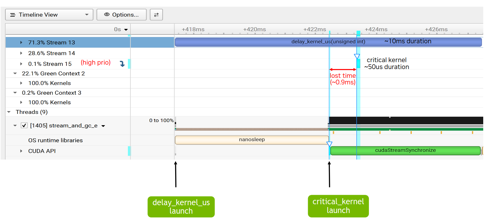

*图 49 Nsight Systems 时间线，无绿色上下文*

为了利用绿色上下文功能，创建了两个绿色上下文，每个都配置有一组不同的非重叠 SM。在本例中，出于说明目的，选择了 H100 的确切 SM 分割，其中 132 SM 为关键内核（绿色上下文 3）,16 SM 和 112 SM 长期运行的内核（绿色上下文 2）。正如 [图 50](#section-4-6-7) 所示，关键的内核现在几乎可以立即启动，因为只有 Green 上下文 3 可以使用 SM。

与单独运行时的持续时间相比，短内核的持续时间可能会增加，因为现在它可以使用的 SM 数量受到限制。长时间运行的内核也是如此，它不能再使用 GPU 的所有 SM，而是受到其绿色上下文配置资源的限制。然而，关键结果是关键的内核工作现在可以比以前更快地开始和完成。这排除了任何其他限制，因为如前所述，无法保证并行执行。

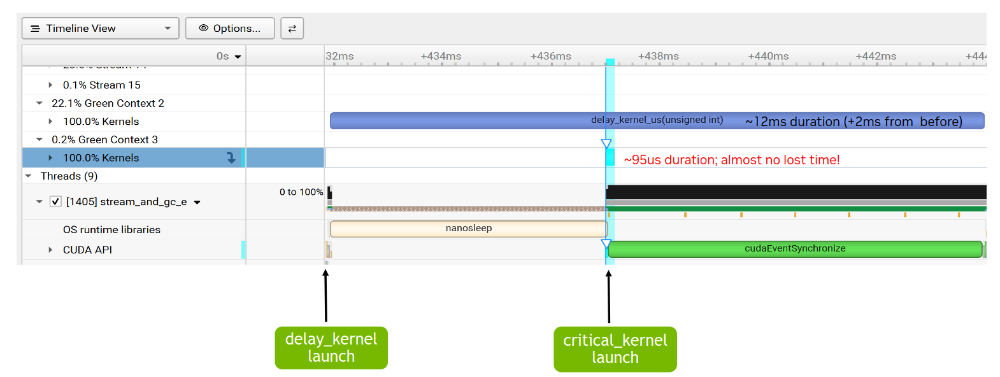

*图 50 Nsight Systems 时间轴，绿色上下文*

在所有情况下，确切的 SM 分割应在实验后根据具体情况决定。

---

## 4.7. 延迟加载

*英文原题：Lazy Loading*  
*官方原文：[https://docs.nvidia.com/cuda/cuda-programming-guide/04-special-topics/lazy-loading.html](https://docs.nvidia.com/cuda/cuda-programming-guide/04-special-topics/lazy-loading.html)*

### 4.7.1. 简介

延迟加载通过等待加载 CUDA 模块直到需要它们来减少程序初始化时间。延迟加载对于仅使用其包含的少量内核的程序特别有效，这在使用库时很常见。延迟加载被设计为当遵循 CUDA 编程模型时对用户不可见。 [潜在危险](#section-4-7-5)对此进行了详细解释。从 CUDA 12.3 开始，延迟加载在所有平台上默认启用，但可以通过 `CUDA_MODULE_LOADING` 环境变量进行控制。

### 4.7.2. 变更历史记录

**表 17 选择 CUDA 版本的延迟加载更改**

| CUDA 版本 | 改变 |
| --- | --- |
| 12.3 | 改善了延迟加载性能。Windows 现在默认启用延迟加载。 |
| 12.2 | Linux 默认启用延迟加载。 |
| 11.7 | 首先引入延迟加载，默认禁用。 |

### 4.7.3. 延迟加载的要求

延迟加载是 CUDA 运行时和驱动程序的联合功能。仅当满足运行时和驱动程序版本要求时，延迟加载才可用。

#### 4.7.3.1. CUDA 运行时版本要求

延迟加载从 CUDA 运行时 11.7 版开始可用。由于 CUDA 运行时通常会静态链接到程序和库中，只有随 CUDA 11.7 及更高版本工具包提供或由这些工具包编译的程序和库，才能从延迟加载中受益。使用较旧 CUDA 运行时版本编译的库会立即加载所有模块。

#### 4.7.3.2. CUDA 驱动程序版本要求

延迟加载需要驱动程序版本 515 或更高版本。延迟加载不适用于早于 515 的驱动程序版本，即使使用 CUDA 工具包 11.7 或更高版本也是如此。

#### 4.7.3.3. 编译器要求

延迟加载不需要任何编译器支持。使用 11.7 之前的编译器编译的 SASS 和 PTX 都可以在启用延迟加载的情况下进行加载，并且将看到该功能的全部优点。但是，如上所述，仍然需要版本 11.7+ CUDA 运行时。

#### 4.7.3.4. 内核要求

延迟加载不适用于包含托管变量的模块；此类模块仍会立即加载。

### 4.7.4. 用途

#### 4.7.4.1. 启用和禁用

通过将 `CUDA_MODULE_LOADING` 环境变量设置为 `LAZY` 来启用延迟加载。可以通过将 `CUDA_MODULE_LOADING` 环境变量设置为 `EAGER` 来禁用延迟加载。从 CUDA 12.3 开始，所有平台上默认启用延迟加载。

#### 4.7.4.2. 检查运行时是否启用延迟加载

CUDA 驱动程序 API `cuModuleGetLoadingMode` 可用于确定是否启用了延迟加载。调用此函数前必须先初始化 CUDA。以下代码片段演示了其用法。

```cpp
#include "<cuda.h>"
#include "<assert.h>"
#include "<iostream>"

int main() {
        CUmoduleLoadingMode mode;

        assert(CUDA_SUCCESS == cuInit(0));
        assert(CUDA_SUCCESS == cuModuleGetLoadingMode(&mode));

        std::cout << "CUDA Module Loading Mode is " << ((mode == CU_MODULE_LAZY_LOADING) ? "lazy" : "eager") << std::endl;

        return 0;
}
```

#### 4.7.4.3. 在运行时强制立即加载模块

加载内核和变量会自动发生，无需显式加载。即使不执行以下操作，也可以显式加载内核：

- `cuModuleGetFunction()` 函数将导致模块被加载到设备内存中
- `cudaFuncGetAttributes()` 函数将导致内核被加载到设备内存

> [!NOTE]
> **说明**
> `cuModuleLoad()` 不保证模块会立即加载。

### 4.7.5. 潜在危险

延迟加载的设计不需要对应用程序进行任何修改即可使用它。也就是说，有一些警告，特别是当应用程序不完全符合 CUDA 编程模型时，如下所述。

#### 4.7.5.1. 对并发内核执行的影响

某些程序错误地认为并发内核的执行是有保证的。如果需要跨内核同步，但内核执行已经序列化，可能会出现死锁。要最大限度地减少延迟加载对并发内核执行的影响，请执行以下操作：

- 在启动前预加载所有希望并发执行的内核；或者
- 将 `CUDA_MODULE_LOADING=EAGER`，以强制应用程序预先加载数据，而不必逐个强制函数立即加载。

#### 4.7.5.2. 大内存分配

延迟加载将 CUDA 模块的内存分配从程序初始化延迟到接近执行时间。如果应用程序在启动时分配整个 VRAM，则 CUDA 可能无法在运行时处为模块分配内存。可能的解决方案：

- 使用 `cudaMallocAsync()` 而不是在启动时分配整个 VRAM 的分配器
- 添加一些缓冲区来补偿内核的延迟加载
- 在尝试初始化分配器之前预加载将在程序中使用的所有内核

#### 4.7.5.3. 对绩效衡量的影响

延迟加载可能会通过将 CUDA 模块初始化移动到测量的执行窗口中来扭曲性能测量。为了避免这种情况：

- 在测量之前至少进行一次预热迭代
- 在启动之前预加载基准测试内核

---

## 4.8. 错误日志管理

*英文原题：Error Log Management*  
*官方原文：[https://docs.nvidia.com/cuda/cuda-programming-guide/04-special-topics/error-log-management.html](https://docs.nvidia.com/cuda/cuda-programming-guide/04-special-topics/error-log-management.html)*

*错误日志管理*机制以易读的英文格式向开发人员报告 CUDA API 错误，并说明问题原因。

### 4.8.1. 背景

传统上，CUDA API 调用失败的唯一指示是返回非零代码。从 CUDA Toolkit 12.9 开始，CUDA 运行时为错误条件定义了 100 多种不同的返回代码，但其中许多是通用的，无法为开发人员调试原因提供任何帮助。

### 4.8.2. 激活

设置 *CUDA_LOG_FILE* 环境变量。可接受的值为 *stdout*、*stderr*，或系统中可写文件的有效路径。即使程序执行前未设置 *CUDA_LOG_FILE*，也可以通过 API 转储日志缓冲区。执行期间若未发生错误，可能不会输出任何日志。

### 4.8.3. 输出

日志输出格式如下：

```cpp
[Time][TID][Source][Severity][API Entry Point] Message
```

以下行是开发人员尝试将错误日志管理日志转储到未分配的缓冲区时生成的实际错误消息：

```cpp
[22:21:32.099][25642][CUDA][E][cuLogsDumpToMemory] buffer cannot be NULL
```

在此之前，开发人员在返回代码中得到的只是 *CUDA_ERROR_INVALID_VALUE*，如果调用 *cuGetErrorString*，则可能得到“无效参数”。

### 4.8.4. API 描述

CUDA 驱动程序提供两类 API，用于与错误日志管理功能进行交互。

此功能允许开发人员注册回调函数，以便在生成错误日志时使用，其中回调签名为：

```cpp
void callbackFunc(void *data, CUlogLevel logLevel, char *message, size_t length)
```

回调使用此 API 注册：

```cpp
CUresult cuLogsRegisterCallback(CUlogsCallback callbackFunc, void *userData, CUlogsCallbackHandle *callback_out)
```

其中，*userData* 会原样传给回调函数；调用方应保存 *callback_out*，以便传给 *cuLogsUnregisterCallback*。

```cpp
CUresult cuLogsUnregisterCallback(CUlogsCallbackHandle callback)
```

另一组 API 函数用于管理日志的输出。一个重要的概念是日志迭代器，它指向缓冲区的当前末尾：

```cpp
CUresult cuLogsCurrent(CUlogIterator *iterator_out, unsigned int flags)
```

如果无需转储整个日志缓冲区，调用方可以保存迭代器位置。目前，`flags` 参数必须为 0；其他取值保留供未来 CUDA 版本使用。

任何时候，都可以使用以下函数将错误日志缓冲区转储到文件或内存中：

```cpp
CUresult cuLogsDumpToFile(CUlogIterator *iterator, const char *pathToFile, unsigned int flags)
CUresult cuLogsDumpToMemory(CUlogIterator *iterator, char *buffer, size_t *size, unsigned int flags)
```

如果 *iterator* 为 NULL，则转储整个缓冲区，最多 100 个条目。如果 *iterator* 不为 NULL，则从它指向的条目开始转储，并把 *iterator* 更新到日志当前末尾，效果如同调用 *cuLogsCurrent*。如果缓冲区累计接收过 100 个以上的日志条目，转储内容开头会添加一条提示。

`flags` 参数必须为 0；其他取值保留供未来 CUDA 版本使用。

*cuLogsDumpToMemory* 函数还有其他注意事项：

1. 缓冲区本身以空字符结尾，但各日志条目之间只用换行符（`\n`）分隔。
2. 缓冲区的最大大小为 25600 字节。
3. 如果 *size* 提供的容量不足以容纳所有所需日志，则首个条目会是一条提示，最旧且无法容纳的条目不会被转储。
4. 函数返回后，*size* 包含实际写入所提供缓冲区的字节数。

### 4.8.5. 限制和已知问题

1. 日志缓冲区最多容纳 100 个条目。达到上限后，最旧条目会被替换，日志转储中会包含一行说明缓冲区已经回卷。
2. 尚未涵盖所有 CUDA API。这是一个正在进行的项目，旨在为所有 API 提供更好的使用错误报告。
3. 除非生成日志，否则不会测试错误日志管理日志位置（如果给定）的有效性。
4. 错误日志管理 API 目前只能通过 CUDA 驱动程序获得。等效 API 将在未来版本中添加到 CUDA 运行时中。
5. 日志消息未本地化为任何语言，并且所有提供的日志均为美国英语。

---

## 4.9. 异步屏障

*英文原题：Asynchronous Barriers*  
*官方原文：[https://docs.nvidia.com/cuda/cuda-programming-guide/04-special-topics/async-barriers.html](https://docs.nvidia.com/cuda/cuda-programming-guide/04-special-topics/async-barriers.html)*

异步屏障在 [高级同步基元](#section-3-2-4) 中引入，将 CUDA 同步扩展到 `__syncthreads()` 和 `__syncwarp()` 之上，从而实现细粒度、非阻塞协调以及更好的通信和计算重叠。

本节详细介绍如何使用异步屏障，主要涉及 `cuda::barrier` API，并在适用时提供指向 `cuda::ptx` 及相关原语的链接。

### 4.9.1. 初始化

必须在任何线程开始参与屏障之前完成初始化。

**CUDA C++ `cuda::barrier`**

| `#include <cuda/barrier> #include <cooperative_groups.h> __global__ void init_barrier() { __shared__ cuda::barrier<cuda::thread_scope_block> bar; auto block = cooperative_groups::this_thread_block(); if (block.thread_rank() == 0) { // A single thread initializes the total expected arrival count. init(&bar, block.size()); } block.sync(); }` |
| --- |

**CUDA C++ `cuda::ptx`**

| `#include <cuda/ptx> #include <cooperative_groups.h> __global__ void init_barrier() { __shared__ uint64_t bar; auto block = cooperative_groups::this_thread_block(); if (block.thread_rank() == 0) { // A single thread initializes the total expected arrival count. cuda::ptx::mbarrier_init(&bar, block.size()); } block.sync(); }` |
| --- |

**CUDA C 原语**

| `#include <cuda_awbarrier_primitives.h> #include <cooperative_groups.h> __global__ void init_barrier() { __shared__ uint64_t bar; auto block = cooperative_groups::this_thread_block(); if (block.thread_rank() == 0) { // A single thread initializes the total expected arrival count. __mbarrier_init(&bar, block.size()); } block.sync(); }` |
| --- |

在任何线程可以参与屏障之前，必须使用 `cuda::barrier::init()` 友元函数初始化屏障。这必须在任何线程到达屏障之前发生。这带来了引导挑战，因为线程必须在参与屏障之前同步，但线程正在创建屏障以便同步。在此示例中，将参与的线程是协作组的一部分，并使用 `block.sync()` 来引导初始化。由于整个线程块正在参与屏障，因此也可以使用 `__syncthreads()`。

`init()` 的第二个参数是 *预期到达计数*，也就是参与线程必须调用 `bar.arrive()` 的次数；达到该次数后，参与线程对 `bar.wait(std::move(token))` 的调用才会解除阻塞。在本示例和前一个示例中，屏障以线程块中的线程数（即 `cooperative_groups::this_thread_block().size()`）初始化，从而使线程块内的所有线程都可以参与该屏障。

异步屏障可以灵活指定线程*如何*参与（把到达与等待拆分）以及*哪些*线程参与。相比之下，`this_thread_block.sync()` 或 `__syncthreads()` 适用于整个线程块，而 `__syncwarp(mask)` 适用于线程束中由掩码指定的子集。不过，如果目标是同步完整线程块或完整线程束，建议分别使用 `__syncthreads()` 和 `__syncwarp()`，以获得更好的性能。

### 4.9.2. 屏障的阶段：到达、倒计时、完成和重置

当参与线程调用 `bar.arrive()` 时，异步屏障的计数器会从预期到达计数递减到零。计数器归零后，屏障的当前阶段完成。最后一次 `bar.arrive()` 调用使计数器归零时，计数器会以原子方式自动重置为预期到达计数，屏障也会推进到下一阶段。

`token=bar.arrive()` 返回的 `cuda::barrier::arrival_token` 对象与屏障的当前阶段关联。只要令牌所关联的阶段仍与屏障阶段相同，`bar.wait(std::move(token))` 就会阻塞调用线程。如果计数器在调用 `bar.wait(std::move(token))` 前已经归零并使阶段推进，线程不会阻塞；如果阶段在线程阻塞于 `bar.wait(std::move(token))` 期间推进，线程便会解除阻塞。

**必须了解何时可能或不可能发生重置，尤其是在重要的到达/等待同步模式中。**

- 线程对 `token=bar.arrive()` 和 `bar.wait(std::move(token))` 的调用必须按顺序排列，以便 `token=bar.arrive()` 在屏障的当前阶段发生，而 `bar.wait(std::move(token))` 在同一阶段或下一阶段发生。
- 当屏障的计数器非零时，必须发生线程对 `bar.arrive()` 的调用。在屏障初始化之后，如果线程对 `bar.arrive()` 的调用导致倒计时达到零，则必须先调用 `bar.wait(std::move(token))`，然后才能将屏障重新用于对 `bar.arrive()` 的后续调用。
- `bar.wait()` 只能使用当前阶段或前一阶段的 `token` 对象来调用。对于 `token` 对象的任何其他值，行为未定义。

对于简单的到达/等待同步模式，遵守这些使用规则很简单。

#### 4.9.2.1. 线程束纠缠

线程束发散影响到达操作更新屏障的次数。如果调用线程束完全收敛，则屏障更新一次。如果调用的线程束完全发散，则 32 个单独的更新将应用于屏障。

> [!NOTE]
> **说明**
> 建议由收敛的线程调用 `arrive-on(bar)`，以尽量减少对屏障对象的更新。如果这些操作之前的代码导致线程发散，则应先使用 `__syncwarp` 使线程束重新收敛，再调用到达操作。

### 4.9.3. 显式相位跟踪

异步屏障可以有多个阶段，具体取决于它用于同步线程和内存操作的次数。我们可以使用通过 `cuda::ptx` 和原语 API 提供的 `mbarrier_try_wait_parity()` 函数系列直接跟踪相位，而不是使用令牌来跟踪屏障相位翻转。

在最简单的形式中，`cuda::ptx::mbarrier_try_wait_parity(uint64_t* bar, const uint32_t& phaseParity)` 函数等待具有特定奇偶校验的阶段。 `phaseParity` 操作数是屏障对象的当前阶段或前一阶段的整数奇偶校验。偶数相位的整数奇偶校验为 0，奇数相位的整数奇偶校验为 1。当我们初始化屏障时，其相位的奇偶校验为 0。因此 `phaseParity` 的有效值为 0 和 1。在跟踪 [异步内存操作](#section-3-2-5) 时，显式相位跟踪非常有用，因为它只允许单个线程到达屏障并设置事务计数，而其他线程仅等待基于奇偶校验的相位翻转。这比让所有线程到达屏障并使用令牌更有效。此功能仅适用于线程块和集群范围内的共享内存屏障。

**CUDA C++ `cuda::barrier`**

| `#include <cuda/ptx> #include <cooperative_groups.h> __device__ void compute(float *data, int iteration); __global__ void split_arrive_wait(int iteration_count, float *data) { using barrier_t = cuda::barrier<cuda::thread_scope_block>; __shared__ barrier_t bar; int parity = 0; // Initial phase parity is 0. auto block = cooperative_groups::this_thread_block(); if (block.thread_rank() == 0) { // Initialize barrier with expected arrival count. init(&bar, block.size()); } block.sync(); for (int i = 0; i < iteration_count; ++i) { /* code before arrive */ // This thread arrives. Arrival does not block a thread. // Get a handle to the native barrier to use with cuda::ptx API. (void)cuda::ptx::mbarrier_arrive(cuda::device::barrier_native_handle(bar)); compute(data, i); // Wait for all threads participating in the barrier to complete mbarrier_arrive(). // Get a handle to the native barrier to use with cuda::ptx API. while (!cuda::ptx::mbarrier_try_wait_parity(cuda::device::barrier_native_handle(bar), parity)) {} // Flip parity. parity ^= 1; /* code after wait */ } }` |
| --- |

**CUDA C++ `cuda::ptx`**

| `#include <cuda/ptx> #include <cooperative_groups.h> __device__ void compute(float *data, int iteration); __global__ void split_arrive_wait(int iteration_count, float *data) { __shared__ uint64_t bar; int parity = 0; // Initial phase parity is 0. auto block = cooperative_groups::this_thread_block(); if (block.thread_rank() == 0) { // Initialize barrier with expected arrival count. cuda::ptx::mbarrier_init(&bar, block.size()); } block.sync(); for (int i = 0; i < iteration_count; ++i) { /* code before arrive */ // This thread arrives. Arrival does not block a thread. (void)cuda::ptx::mbarrier_arrive(&bar); compute(data, i); // Wait for all threads participating in the barrier to complete mbarrier_arrive(). while (!cuda::ptx::mbarrier_try_wait_parity(&bar, parity)) {} // Flip parity. parity ^= 1; /* code after wait */ } }` |
| --- |

**CUDA C 原语**

| `#include <cuda_awbarrier_primitives.h> #include <cooperative_groups.h> __device__ void compute(float *data, int iteration); __global__ void split_arrive_wait(int iteration_count, float *data) { __shared__ __mbarrier_t bar; bool parity = false; // Initial phase parity is false. auto block = cooperative_groups::this_thread_block(); if (block.thread_rank() == 0) { // Initialize barrier with expected arrival count. __mbarrier_init(&bar, block.size()); } block.sync(); for (int i = 0; i < iteration_count; ++i) { /* code before arrive */ // This thread arrives. Arrival does not block a thread. (void)__mbarrier_arrive(&bar); compute(data, i); // Wait for all threads participating in the barrier to complete __mbarrier_arrive(). while(!__mbarrier_try_wait_parity(&bar, parity, 1000)) {} parity ^= 1; /* code after wait */ } }` |
| --- |

### 4.9.4. 提前退出

当参与同步序列的线程必须提前退出该序列时，该线程必须在退出之前显式退出参与。其余参与的线程可以正常进行后续的到达和等待操作。

**CUDA C++ `cuda::barrier`**

| `#include <cuda/barrier> #include <cooperative_groups.h> __device__ bool condition_check(); __global__ void early_exit_kernel(int N) { __shared__ cuda::barrier<cuda::thread_scope_block> bar; auto block = cooperative_groups::this_thread_block(); if (block.thread_rank() == 0) { init(&bar, block.size()); } block.sync(); for (int i = 0; i < N; ++i) { if (condition_check()) { bar.arrive_and_drop(); return; } // Other threads can proceed normally. auto token = bar.arrive(); /* code between arrive and wait */ // Wait for all threads to arrive. bar.wait(std::move(token)); /* code after wait */ } }` |
| --- |

**CUDA C 原语**

| `#include <cuda_awbarrier_primitives.h> #include <cooperative_groups.h> __device__ bool condition_check(); __global__ void early_exit_kernel(int N) { __shared__ __mbarrier_t bar; auto block = cooperative_groups::this_thread_block(); if (block.thread_rank() == 0) { __mbarrier_init(&bar, block.size()); } block.sync(); for (int i = 0; i < N; ++i) { if (condition_check()) { __mbarrier_token_t token = __mbarrier_arrive_and_drop(&bar); return; } // Other threads can proceed normally. __mbarrier_token_t token = __mbarrier_arrive(&bar); /* code between arrive and wait */ // Wait for all threads to arrive. while (!__mbarrier_try_wait(&bar, token, 1000)) {} /* code after wait */ } }` |
| --- |

`bar.arrive_and_drop()` 操作到达屏障以履行参与线程到达 **当前的** 阶段的义务，然后递减 **下一个** 阶段的预期到达计数，以便该线程不再预期到达屏障。

### 4.9.5. 完成功能

`cuda::barrier` API 支持可选的完成函数。`cuda::barrier<Scope, CompletionFunction>` 的 `CompletionFunction` 每个阶段执行一次：在最后一个线程*到达*之后、任何线程从 `wait` 解除阻塞之前执行。本阶段到达 `barrier` 的线程所执行的内存操作，对执行 `CompletionFunction` 的线程可见；`CompletionFunction` 中执行的所有内存操作，则在等待线程从 `wait` 解除阻塞后对这些线程可见。

**CUDA C++ `cuda::barrier`**

| `#include <cuda/barrier> #include <cooperative_groups.h> #include <functional> namespace cg = cooperative_groups; __device__ int divergent_compute(int *, int); __device__ int independent_computation(int *, int); __global__ void psum(int *data, int n, int *acc) { auto block = cg::this_thread_block(); constexpr int BlockSize = 128; __shared__ int smem[BlockSize]; assert(BlockSize == block.size()); assert(n % BlockSize == 0); auto completion_fn = [&] { int sum = 0; for (int i = 0; i < BlockSize; ++i) { sum += smem[i]; } *acc += sum; }; /* Barrier storage. Note: the barrier is not default-constructible because completion_fn is not default-constructible due to the capture. */ using completion_fn_t = decltype(completion_fn); using barrier_t = cuda::barrier<cuda::thread_scope_block, completion_fn_t>; __shared__ std::aligned_storage<sizeof(barrier_t), alignof(barrier_t)> bar_storage; // Initialize barrier. barrier_t *bar = (barrier_t *)&bar_storage; if (block.thread_rank() == 0) { assert(*acc == 0); assert(blockDim.x == blockDim.y == blockDim.y == 1); new (bar) barrier_t{block.size(), completion_fn}; /* equivalent to: init(bar, block.size(), completion_fn); */ } block.sync(); // Main loop. for (int i = 0; i < n; i += block.size()) { smem[block.thread_rank()] = data[i] + *acc; auto token = bar->arrive(); // We can do independent computation here. bar->wait(std::move(token)); // Shared-memory is safe to re-use in the next iteration // since all threads are done with it, including the one // that did the reduction. } }` |
| --- |

### 4.9.6. 跟踪异步内存操作

异步屏障可用于跟踪 [异步内存复制](#section-3-2-5)。将异步复制操作绑定到屏障时，复制操作会在启动时自动递增屏障当前阶段的预期计数，并在完成时递减该计数。该机制确保屏障的 `wait()` 操作会一直阻塞，直到所有关联的异步内存复制完成，因而为同步多个并发内存操作提供了便利方式。

从计算能力 9.0 开始，位于共享内存中、具有线程块或簇作用域的异步屏障可以*显式*跟踪异步内存操作；这类屏障称为*异步事务屏障*。除预期到达计数外，屏障对象还可接受*事务计数*，用来跟踪异步事务的完成情况。事务计数以异步内存操作指定的单位（通常为字节）表示仍未完成的异步事务量。当前阶段要跟踪的事务计数可以在到达时通过 `cuda::device::barrier_arrive_tx()` 设置，也可以直接通过 `cuda::device::barrier_expect_tx()` 设置。屏障使用事务计数时，等待操作会阻塞线程，直到所有生产者线程都已到达，并且所有事务计数之和达到预期值。

**CUDA C++ `cuda::barrier`**

| `#include <cuda/barrier> #include <cooperative_groups.h> __global__ void track_kernel() { __shared__ cuda::barrier<cuda::thread_scope_block> bar; auto block = cooperative_groups::this_thread_block(); if (block.thread_rank() == 0) { init(&bar, block.size()); } block.sync(); auto token = cuda::device::barrier_arrive_tx(bar, 1, 0); bar.wait(cuda::std::move(token)); }` |
| --- |

**CUDA C++ `cuda::ptx`**

| `#include <cuda/ptx> #include <cooperative_groups.h> __global__ void track_kernel() { __shared__ uint64_t bar; auto block = cooperative_groups::this_thread_block(); if (block.thread_rank() == 0) { cuda::ptx::mbarrier_init(&bar, block.size()); } block.sync(); uint64_t token = cuda::ptx::mbarrier_arrive_expect_tx(cuda::ptx::sem_release, cuda::ptx::scope_cluster, cuda::ptx::space_shared, &bar, 1, 0); while (!cuda::ptx::mbarrier_try_wait(&bar, token)) {} }` |
| --- |

在此示例中，`cuda::device::barrier_arrive_tx()` 操作构造与当前阶段的阶段同步点关联的到达令牌对象。然后，将到达计数减 1，并将预期事务计数增加 0。由于事务计数更新为 0，因此屏障不跟踪任何事务。关于 [使用张量内存加速器（TMA）](#section-4-11-2) 的后续部分包括跟踪异步内存操作的示例。

### 4.9.7. 使用屏障的生产者-消费者模式

线程块可以进行空间分区，以允许不同的线程执行独立的操作。最常见的方法是通过将线程块内不同线程束的线程分配给特定任务来完成。该技术称为 *线程束专业化*。

本节显示生产者-消费者模式中的空间分区示例，其中线程的一个子集生成由线程的另一个（不相交）子集同时使用的数据。生产者-消费者空间分区模式需要两个单侧同步来管理生产者和消费者之间的数据缓冲区。

| 制片人 | 消费者 |
| --- | --- |
| 等待缓冲区准备好被填充 | 信号缓冲区已准备好被填充 |
| 产生数据并填充缓冲区 |  |
| 信号缓冲区已满 | 等待缓冲区被填满 |
|  | 消耗已满缓冲区中的数据 |

生产者线程等待消费者线程发出缓冲区已准备好填充的信号；然而，消费者线程不会等待该信号。消费者线程等待生产者线程发出缓冲区已满的信号；然而，生产者线程不会等待该信号。对于完整的生产者/消费者并发，此模式（至少）具有双缓冲，其中每个缓冲区需要两个屏障。

**CUDA C++ `cuda::barrier`**

| `#include <cuda/barrier> using barrier_t = cuda::barrier<cuda::thread_scope_block>; __device__ void produce(barrier_t ready[], barrier_t filled[], float *buffer, int buffer_len, float *in, int N) { for (int i = 0; i < N / buffer_len; ++i) { ready[i % 2].arrive_and_wait(); /* wait for buffer_(i%2) to be ready to be filled */ /* produce, i.e., fill in, buffer_(i%2) */ barrier_t::arrival_token token = filled[i % 2].arrive(); /* buffer_(i%2) is filled */ } } __device__ void consume(barrier_t ready[], barrier_t filled[], float *buffer, int buffer_len, float *out, int N) { barrier_t::arrival_token token1 = ready[0].arrive(); /* buffer_0 is ready for initial fill */ barrier_t::arrival_token token2 = ready[1].arrive(); /* buffer_1 is ready for initial fill */ for (int i = 0; i < N / buffer_len; ++i) { filled[i % 2].arrive_and_wait(); /* wait for buffer_(i%2) to be filled */ /* consume buffer_(i%2) */ barrier_t::arrival_token token3 = ready[i % 2].arrive(); /* buffer_(i%2) is ready to be re-filled */ } } __global__ void producer_consumer_pattern(int N, float *in, float *out, int buffer_len) { constexpr int warpSize = 32; /* Shared memory buffer declared below is of size 2 * buffer_len so that we can alternatively work between two buffers. buffer_0 = buffer and buffer_1 = buffer + buffer_len */ __shared__ extern float buffer[]; /* bar[0] and bar[1] track if buffers buffer_0 and buffer_1 are ready to be filled, while bar[2] and bar[3] track if buffers buffer_0 and buffer_1 are filled-in respectively */ #pragma nv_diag_suppress static_var_with_dynamic_init __shared__ barrier_t bar[4]; if (threadIdx.x < 4) { init(bar + threadIdx.x, blockDim.x); } __syncthreads(); if (threadIdx.x < warpSize) { produce(bar, bar + 2, buffer, buffer_len, in, N); } else { consume(bar, bar + 2, buffer, buffer_len, out, N); } }` |
| --- |

**CUDA C++ `cuda::ptx`**

| `#include <cuda/ptx> __device__ void produce(barrier ready[], barrier filled[], float *buffer, int buffer_len, float *in, int N) { for (int i = 0; i < N / buffer_len; ++i) { uint64_t token1 = cuda::ptx::mbarrier_arrive(ready[i % 2]); while(!cuda::ptx::mbarrier_try_wait(&ready[i % 2], token1)) {} /* wait for buffer_(i%2) to be ready to be filled */ /* produce, i.e., fill in, buffer_(i%2) */ uint64_t token2 = cuda::ptx::mbarrier_arrive(&filled[i % 2]); /* buffer_(i%2) is filled */ } } __device__ void consume(barrier ready[], barrier filled[], float *buffer, buffer_len, float *out, int N) { uint64_t token1 = cuda::ptx::mbarrier_arrive(&ready[0]); /* buffer_0 is ready for initial fill */ uint64_t token2 = cuda::ptx::mbarrier_arrive(&ready[1]); /* buffer_1 is ready for initial fill */ for (int i = 0; i < N / buffer_len; ++i) { uint64_t token3 = cuda::ptx::mbarrier_arrive(&filled[i % 2]); while(!cuda::ptx::mbarrier_try_wait(&filled[i % 2], token3x)) {} /* wait for buffer_(i%2) to be filled */ /* consume buffer_(i%2) */ uint64_t token4 = cuda::ptx::mbarrier_arrive(&ready[i % 2]); /* buffer_(i%2) is ready to be re-filled */ } } __global__ void producer_consumer_pattern(int N, float *in, float *out, int buffer_len) { constexpr int warpSize = 32; /* Shared memory buffer declared below is of size 2 * buffer_len so that we can alternatively work between two buffers. buffer_0 = buffer and buffer_1 = buffer + buffer_len */ __shared__ extern float buffer[]; /* bar[0] and bar[1] track if buffers buffer_0 and buffer_1 are ready to be filled, while bar[2] and bar[3] track if buffers buffer_0 and buffer_1 are filled-in respectively */ #pragma nv_diag_suppress static_var_with_dynamic_init __shared__ uint64_t bar[4]; if (threadIdx.x < 4) { cuda::ptx::mbarrier_init(bar + block.thread_rank(), block.size()); } __syncthreads(); if (threadIdx.x < warpSize) { produce(bar, bar + 2, buffer, buffer_len, in, N); } else { consume(bar, bar + 2, buffer, buffer_len, out, N); } }` |
| --- |

**CUDA C 原语**

| `#include <cuda_awbarrier_primitives.h> __device__ void produce(__mbarrier_t ready[], __mbarrier_t filled[], float *buffer, int buffer_len, float *in, int N) { for (int i = 0; i < N / buffer_len; ++i) { __mbarrier_token_t token1 = __mbarrier_arrive(&ready[i % 2]); /* wait for buffer_(i%2) to be ready to be filled */ while(!__mbarrier_try_wait(&ready[i % 2], token1, 1000)) {} /* produce, i.e., fill in, buffer_(i%2) */ __mbarrier_token_t token2 = __mbarrier_arrive(filled[i % 2]); /* buffer_(i%2) is filled */ } } __device__ void consume(__mbarrier_t ready[], __mbarrier_t filled[], float *buffer, int buffer_len, float *out, int N) { __mbarrier_token_t token1 = __mbarrier_arrive(&ready[0]); /* buffer_0 is ready for initial fill */ __mbarrier_token_t token2 = __mbarrier_arrive(&ready[1]); /* buffer_1 is ready for initial fill */ for (int i = 0; i < N / buffer_len; ++i) { __mbarrier_token_t token3 = __mbarrier_arrive(&filled[i % 2]); while(!__mbarrier_try_wait(&filled[i % 2], token3, 1000)) {} /* consume buffer_(i%2) */ __mbarrier_token_t token4 = __mbarrier_arrive(&ready[i % 2]); /* buffer_(i%2) is ready to be re-filled */ } } __global__ void producer_consumer_pattern(int N, float *in, float *out, int buffer_len) { constexpr int warpSize = 32; /* Shared memory buffer declared below is of size 2 * buffer_len so that we can alternatively work between two buffers. buffer_0 = buffer and buffer_1 = buffer + buffer_len */ __shared__ extern float buffer[]; /* bar[0] and bar[1] track if buffers buffer_0 and buffer_1 are ready to be filled, while bar[2] and bar[3] track if buffers buffer_0 and buffer_1 are filled-in respectively */ #pragma nv_diag_suppress static_var_with_dynamic_init __shared__ __mbarrier_t bar[4]; if (threadIdx.x < 4) { __mbarrier_init(bar + threadIdx.x, blockDim.x); } __syncthreads(); if (threadIdx.x < warpSize) { produce(bar, bar + 2, buffer, buffer_len, in, N); } else { consume(bar, bar + 2, buffer, buffer_len, out, N); } }` |
| --- |

在此示例中，第一个线程束专用于生产者，其余线程束专用于消费者。所有生产者线程和消费者线程都参与四个屏障（即调用 `bar.arrive()` 或 `bar.arrive_and_wait()`），因此预期到达计数等于 `block.size()`。

生产者线程等待消费者线程发出共享内存缓冲区可以填充的信号。为了等待屏障，生产者线程必须首先到达 `ready[i%2].arrive()` 以获取令牌，然后使用该令牌到达 `ready[i%2].wait(token)`。为了简单起见，`ready[i%2].arrive_and_wait()` 组合了这些操作。

```cpp
bar.arrive_and_wait();
/* is equivalent to */
bar.wait(bar.arrive());
```

生产者线程计算并填充就绪缓冲区，然后通过到达已填充的屏障、`filled[i%2].arrive()` 来发出缓冲区已填充的信号。生产者线程此时不会等待，而是等待直到下一次迭代的缓冲区（双缓冲）准备好被填充。

消费者线程首先发出两个缓冲区已准备好填充的信号。消费者线程此时不会等待，而是等待本次迭代的缓冲区被填充， `filled[i%2].arrive_and_wait()`。消费者线程消耗缓冲区后，他们发出信号表示缓冲区已准备好再次填充， `ready[i%2].arrive()`，然后等待下一次迭代的缓冲区被填充。

---

## 4.10. 流水线

*英文原题：Pipelines*  
*官方原文：[https://docs.nvidia.com/cuda/cuda-programming-guide/04-special-topics/pipelines.html](https://docs.nvidia.com/cuda/cuda-programming-guide/04-special-topics/pipelines.html)*

[高级同步基元](#section-3-2-4) 中引入的流水线是一种用于暂存工作和协调多缓冲区生产者-消费者模式的机制，通常用于与 [异步数据副本](#section-3-2-5) 重叠计算。

本节详细介绍如何主要通过 `cuda::pipeline` API 使用流水线（在适用的情况下带有指向原语的指针）。

### 4.10.1. 初始化

可以在不同的线程作用域处创建 `cuda::pipeline`。对于 `cuda::thread_scope_thread` 以外的范围，需要 `cuda::pipeline_shared_state<scope, count>` 对象来协调参与的线程。此状态封装了有限资源，允许流水线处理最多 `count` 并发阶段。

```cpp
// Create a pipeline at thread scope
constexpr auto scope = cuda::thread_scope_thread;
cuda::pipeline<scope> pipeline = cuda::make_pipeline();
```

```cpp
// Create a pipeline at block scope
constexpr auto scope = cuda::thread_scope_block;
constexpr auto stages_count = 2;
__shared__ cuda::pipeline_shared_state<scope, stages_count> shared_state;
auto pipeline = cuda::make_pipeline(group, &shared_state);
```

流水线可以是 *统一* 或 *分区的*。在统一的流水线中，所有参与的线程既是生产者又是消费者。在分区流水线中，每个参与的线程要么是生产者，要么是消费者，并且其角色在流水线对象的生命周期内不能更改。线程本地流水线无法分区。要创建分区流水线，我们需要向 `cuda::make_pipeline()` 提供生产者数量或线程的角色。

```cpp
// Create a partitioned pipeline at block scope where only thread 0 is a producer
constexpr auto scope = cuda::thread_scope_block;
constexpr auto stages_count = 2;
__shared__ cuda::pipeline_shared_state<scope, stages_count> shared_state;
auto thread_role = (group.thread_rank() == 0) ? cuda::pipeline_role::producer : cuda::pipeline_role::consumer;
auto pipeline = cuda::make_pipeline(group, &shared_state, thread_role);
```

为了支持分区，共享 `cuda::pipeline` 会产生额外的开销，包括在同步的每个阶段使用一组共享内存屏障。即使流水线是统一的并且可以使用 `__syncthreads()` 代替，也会使用这些。因此，最好使用线程本地流水线，这样可以尽可能避免这些开销。

### 4.10.2. 提交工作

将工作提交到流水线阶段涉及：

> - 一组生产者线程使用 `pipeline.producer_acquire()`，共同*获取*流水线的*头部*。
> - 向流水线头提交异步操作，例如 `memcpy_async`。
> - 使用 `pipeline.producer_commit()`，共同*提交*（推进）流水线头部。

如果所有资源都在使用中，则 `pipeline.producer_acquire()` 会阻塞生产者线程，直到下一个流水线阶段的资源被消费者线程释放。

### 4.10.3. 消费工作

消费先前已提交阶段中的工作包括：

> - 一组消费者线程共同等待阶段完成，例如使用 `pipeline.consumer_wait()` 等待尾部（最旧）阶段。
> - 使用 `pipeline.consumer_release()`，共同*释放*该阶段。

使用 `cuda::pipeline<cuda:thread_scope_thread>`，还可以使用 `cuda::pipeline_consumer_wait_prior<N>()` 友元函数来等待除最后 N 个阶段之外的所有阶段完成，类似于原语 API 中的 `__pipeline_wait_prior(N)`。

### 4.10.4. 线程束纠缠

流水线机制在同一个线程束中的 CUDA 线程之间共享。这种共享会导致提交的操作序列纠缠在线程束中，这在某些情况下可能会影响性能。

**提交。** 提交操作会进行合并：对所有调用该操作的收敛线程，流水线序列只递增一次，并将它们提交的操作归入同一批次。如果线程束完全收敛，序列递增 1，所有提交的操作都归入流水线的同一阶段；如果线程束完全发散，序列递增 32，各线程提交的操作分布到不同阶段。

- 令 *PB* 表示线程束共享流水线的*实际*操作序列。
`PB = {BP0, BP1, BP2, ..., BPL}`
- 令 *TB* 表示某个线程*感知到的*操作序列，即仿佛该序列只会因该线程调用提交操作而递增。
`TB = {BT0, BT1, BT2, ..., BTL}`

> `pipeline::producer_commit()` 的返回值来自该线程*感知到的*批次序列。

- 线程感知序列中的索引，总是对应实际线程束共享序列中相同或更大的索引。只有所有提交操作都由完全收敛的线程调用时，两种序列才相同。
`BTn ≡ BPm` 其中 `n <= m`

例如，当线程束完全发散时：

- 线程束共享流水线的实际序列为：`PB = {0, 1, 2, 3, ..., 31}`（`PL=31`）。
- 该线程束的每个线程的感知序列将是：
- 线程 0：`TB = {0}`（`TL=0`）
- 线程 1：`TB = {0}`（`TL=0`）
- `...`
- 线程 31：`TB = {0}`（`TL=0`）

**等待。** CUDA 线程调用 `pipeline::consumer_wait()` 或 `pipeline_consumer_wait_prior<N>()`，等待其*感知到的*序列 `TB` 中的批次完成。请注意，`pipeline::consumer_wait()` 等价于 `pipeline_consumer_wait_prior<N>()`，其中 `N = PL`。

*wait prior* 变体会等待*实际*序列中的批次，至少一直等到并包括 `PL-N`。由于 `TL <= PL`，等待到 `PL-N` 必然包含对 `TL-N` 的等待。因此，当 `TL < PL` 时，线程会无意中额外等待更晚提交的批次。在上面的完全发散极端示例中，每个线程都可能等待全部 32 个批次。

> [!NOTE]
> **说明**
> 为避免过度等待，建议由收敛线程调用提交操作，使线程感知到的批次序列与实际序列保持对齐。
>
> 如果此前的代码使线程发生分支，应在调用提交操作前通过 `__syncwarp` 使线程束重新收敛。

### 4.10.5. 提前退出

当参与流水线的线程必须提前退出时，该线程必须在使用 `cuda::pipeline::quit()` 退出之前显式退出参与。其余参与的线程可以正常进行后续操作。

### 4.10.6. 跟踪异步内存操作

以下示例演示了如何使用异步内存复制，由多个线程协同将数据从全局内存复制到共享内存，并使用流水线跟踪复制操作。每个线程都使用自己的流水线独立提交内存复制，然后等待复制完成并使用数据。有关异步数据复制的更多详细信息，请参阅 [第 3.2.5 节](#section-3-2-5)。

**CUDA C++ `cuda::pipeline`**

| `#include <cuda/pipeline> __global__ void example_kernel(const float *in) { constexpr int block_size = 128; __shared__ __align__(sizeof(float)) float buffer[4 * block_size]; // Create a unified pipeline per thread cuda::pipeline<cuda::thread_scope_thread> pipeline = cuda::make_pipeline(); // First stage of memory copies pipeline.producer_acquire(); // Every thread fetches one element of the first block cuda::memcpy_async(buffer, in, sizeof(float), pipeline); pipeline.producer_commit(); // Second stage of memory copies pipeline.producer_acquire(); // Every thread fetches one element of the second and third block cuda::memcpy_async(buffer + block_size, in + block_size, sizeof(float), pipeline); cuda::memcpy_async(buffer + 2 * block_size, in + 2 * block_size, sizeof(float), pipeline); pipeline.producer_commit(); // Third stage of memory copies pipeline.producer_acquire(); // Every thread fetches one element of the last block cuda::memcpy_async(buffer + 3 * block_size, in + 3 * block_size, sizeof(float), pipeline); pipeline.producer_commit(); // Wait for the oldest stage (waits for first stage) pipeline.consumer_wait(); pipeline.consumer_release(); // __syncthreads(); // Use data from the first stage // Wait for the oldest stage (waits for second stage) pipeline.consumer_wait(); pipeline.consumer_release(); // __syncthreads(); // Use data from the second stage // Wait for the oldest stage (waits for third stage) pipeline.consumer_wait(); pipeline.consumer_release(); // __syncthreads(); // Use data from the third stage }` |
| --- |

**CUDA C 原语**

| `#include <cuda_pipeline.h> __global__ void example_kernel(const float *in) { constexpr int block_size = 128; __shared__ __align__(sizeof(float)) float buffer[4 * block_size]; // First batch of memory copies // Every thread fetches one element of the first block __pipeline_memcpy_async(buffer, in, sizeof(float)); __pipeline_commit(); // Second batch of memory copies // Every thread fetches one element of the second and third block __pipeline_memcpy_async(buffer + block_size, in + block_size, sizeof(float)); __pipeline_memcpy_async(buffer + 2 * block_size, in + 2 * block_size, sizeof(float)); __pipeline_commit(); // Third batch of memory copies // Every thread fetches one element of the last block __pipeline_memcpy_async(buffer + 3 * block_size, in + 3 * block_size, sizeof(float)); __pipeline_commit(); // Wait for all except the last two batches of memory copies (waits for first batch) __pipeline_wait_prior(2); // __syncthreads(); // Use data from the first batch // Wait for all except the last batch of memory copies (waits for second batch) __pipeline_wait_prior(1); // __syncthreads(); // Use data from the second batch // Wait for all batches of memory copies (waits for third batch) __pipeline_wait_prior(0); // __syncthreads(); // Use data from the last batch }` |
| --- |

### 4.10.7. 使用流水线的生产者-消费者模式

在 [第4.9.7节](#section-4-9-7) 中，我们展示了如何对线程块进行空间分区以使用 [异步屏障](#section-4-9) 实现生产者-消费者模式。使用 `cuda::pipeline`，可以使用每个数据缓冲区一个阶段的单个分区流水线来简化这一过程，而不是每个缓冲区使用两个异步屏障。

**CUDA C++ `cuda::pipeline`**

| `#include <cuda/pipeline> #include <cooperative_groups.h> #pragma nv_diag_suppress static_var_with_dynamic_init using pipeline = cuda::pipeline<cuda::thread_scope_block>; __device__ void produce(pipeline &pipe, int num_stages, int stage, int num_batches, int batch, float *buffer, int buffer_len, float *in, int N) { if (batch < num_batches) { pipe.producer_acquire(); /* copy data from in(batch) to buffer(stage) using asynchronous memory copies */ pipe.producer_commit(); } } __device__ void consume(pipeline &pipe, int num_stages, int stage, int num_batches, int batch, float *buffer, int buffer_len, float *out, int N) { pipe.consumer_wait(); /* consume buffer(stage) and update out(batch) */ pipe.consumer_release(); } __global__ void producer_consumer_pattern(float *in, float *out, int N, int buffer_len) { auto block = cooperative_groups::this_thread_block(); /* Shared memory buffer declared below is of size 2 * buffer_len so that we can alternatively work between two buffers. buffer_0 = buffer and buffer_1 = buffer + buffer_len */ __shared__ extern float buffer[]; const int num_batches = N / buffer_len; // Create a partitioned pipeline with 2 stages where half the threads are producers and the other half are consumers. constexpr auto scope = cuda::thread_scope_block; constexpr int num_stages = 2; cuda::std::size_t producer_count = block.size() / 2; __shared__ cuda::pipeline_shared_state<scope, num_stages> shared_state; pipeline pipe = cuda::make_pipeline(block, &shared_state, producer_count); // Fill the pipeline if (block.thread_rank() < producer_count) { for (int s = 0; s < num_stages; ++s) { produce(pipe, num_stages, s, num_batches, s, buffer, buffer_len, in, N); } } // Process the batches int stage = 0; for (size_t b = 0; b < num_batches; ++b) { if (block.thread_rank() < producer_count) { // Prefetch the next batch produce(pipe, num_stages, stage, num_batches, b + num_stages, buffer, buffer_len, in, N); } else { // Consume the oldest batch consume(pipe, num_stages, stage, num_batches, b, buffer, buffer_len, out, N); } stage = (stage + 1) % num_stages; } }` |
| --- |

本例将线程块的一半线程用作生产者，另一半用作消费者。首先创建一个 `cuda::pipeline` 对象。由于不同线程承担不同角色，因此需要使用线程块作用域 `cuda::thread_scope_block` 的**分区式**流水线。分区式流水线通过 `cuda::pipeline_shared_state` 协调参与线程；本例先在线程块作用域初始化两阶段流水线的状态，再调用 `cuda::make_pipeline()`。随后，生产者线程把从 `in` 到 `buffer` 的异步复制提交给流水线，使所有数据复制进入执行中状态。最后，主循环遍历各数据批次：生产者为后续批次提交新的异步复制，消费者则处理当前批次。

---

## 4.11. 异步数据复制

*英文原题：Asynchronous Data Copies*  
*官方原文：[https://docs.nvidia.com/cuda/cuda-programming-guide/04-special-topics/async-copies.html](https://docs.nvidia.com/cuda/cuda-programming-guide/04-special-topics/async-copies.html)*

本节以 [第3.2.5节](#section-3-2-5) 为基础，提供有关 GPU 内存层次结构中的异步数据移动的详细指南和示例。它涵盖了用于逐元素复制的 LDGSTS、用于批量（一维和多维）传输的张量内存加速器 (TMA) 以及用于注册到分布式共享内存副本的 STAS，并展示了这些机制如何与 [异步屏障](#section-4-9) 和 [流水线](#section-4-10) 集成。

### 4.11.1. 使用 LDGSTS

许多 CUDA 应用程序需要频繁地在全局内存与共享内存之间移动数据，这通常涉及复制较小的数据元素或采用不规则的内存访问模式。`LDGSTS`（计算能力 8.0 及以上；请参阅 [PTX 文档](https://docs.nvidia.com/cuda/parallel-thread-execution/#data-movement-and-conversion-instructions-non-bulk-copy)）主要用于提供从全局内存到共享内存的高效异步数据传输机制，适合较小的逐元素传输，并可通过重叠执行更充分地利用计算资源。

**尺寸**。 LDGSTS 支持复制 4、8 或 16 字节。复制 4 或 8 字节总是发生在所谓的 L1 ACCESS 模式中，在这种情况下，数据也缓存在 L1 中，而复制 16 字节则启用 L1 BYPASS 模式，在这种情况下，L1 不会被污染。

**来源和目的地**。使用 LDGSTS 的异步复制操作支持的唯一方向是从全局到共享内存。根据要复制的数据的大小，指针需要对齐到 4、8 或 16 字节。当共享内存和全局内存的对齐都是 128 字节时，可以获得最佳性能。

**异步性。** 使用 LDGSTS 的数据传输是[异步](#section-3-2-2-3)的，并建模为异步线程操作（请参阅[异步线程与异步代理](#section-3-2-2-3-1)）。因此，发起操作的线程可以继续计算，同时由硬件异步复制数据。*数据传输实际上是否异步执行取决于硬件实现，将来可能发生变化。*

当操作完成时，LDGSTS 必须提供信号。 LDGSTS 可以使用 [共享内存屏障](#section-3-2-4-2) 或 [流水线](#section-3-2-4-3) 作为提供完成信号的机制。默认情况下，每个线程仅等待其自己的 LDGSTS 副本。因此，如果您使用 LDGSTS 来预取一些将与其他线程共享的数据，则在与 LDGSTS 完成机制同步后需要 `__syncthreads()`。

**表 18 异步使用 LDGSTS 复制可能的源和目标内存空间以及完成机制。空单元格表示不支持源-目标对。**

| 方向 | 方向 | 异步副本（LDGSTS,CC 8.0+） | 异步副本（LDGSTS,CC 8.0+） |
| --- | --- | --- | --- |
| 来源 | 目的地 | 完成机制 | API |
| global | global |  |  |
| shared::cta | global |  |  |
| global | `shared::cta` | 共享内存屏障、流水线 | [cuda::memcpy_async](https://nvidia.github.io/cccl/unstable/libcudacxx/extended_api/asynchronous_operations/memcpy_async.html)、[cooperative_groups::memcpy_async](#section-5-6-3-2-1)、[__pipeline_memcpy_async](#section-5-6-2) |
| global | shared::cluster |  |  |
| shared::cluster | shared::cta |  |  |
| shared::cta | shared::cta |  |  |

在接下来的章节中，我们将通过示例演示如何使用 LDGSTS，并解释不同 API 之间的差异。

#### 4.11.1.1. 在条件代码中批量加载

在此模板示例中，线程块的第一个线程束负责从中心以及左右光环集中加载所有所需数据。对于同步副本，由于代码的条件性质，编译器可能会选择生成一系列从全局加载 (LDG) 存储到共享 (STS) 指令，而不是 3 个 LDG 后跟 3 个 STS，这将是加载数据以隐藏数据的最佳方式。全局内存延迟。

```cpp
__global__ void stencil_kernel(const float *left, const float *center, const float *right)
{
    // Left halo (8 elements) - center (32 elements) - right halo (8 elements)
    __shared__ float buffer[8 + 32 + 8];
    const int tid = threadIdx.x;

    if (tid < 8) {
        buffer[tid] = left[tid]; // Left halo
    } else if (tid >= 32 - 8) {
        buffer[tid + 16] = right[tid]; // Right halo
    }
    if (tid < 32) {
      buffer[tid + 8] = center[tid]; // Center
    }
    __syncthreads();

    // Compute stencil
}
```

为了确保以最佳方式加载数据，我们可以将同步内存副本替换为异步副本，这些副本直接从全局内存加载数据到共享内存。这不仅通过将数据直接复制到共享内存来减少寄存器的使用，而且还确保来自全局内存的所有加载都在进行中。

**CUDA C++ `cuda::memcpy_async`**

| `#include <cooperative_groups.h> #include <cuda/barrier> __global__ void stencil_kernel(const float *left, const float *center, const float *right) { auto block = cooperative_groups::this_thread_block(); auto thread = cooperative_groups::this_thread(); using barrier_t = cuda::barrier<cuda::thread_scope_block>; __shared__ barrier_t barrier; __shared__ float buffer[8 + 32 + 8]; // Initialize synchronization object. if (block.thread_rank() == 0) { init(&barrier, block.size()); } __syncthreads(); // Version 1: Issue the copies in individual threads. if (tid < 8) { cuda::memcpy_async(buffer + tid, left + tid, cuda::aligned_size_t<4>(sizeof(float)), barrier); // Left halo // or cuda::memcpy_async(thread, buffer + tid, left + tid, cuda::aligned_size_t<4>(sizeof(float)), barrier); } else if (tid >= 32 - 8) { cuda::memcpy_async(buffer + tid + 16, right + tid, cuda::aligned_size_t<4>(sizeof(float)), barrier); // Right halo // or cuda::memcpy_async(thread, buffer + tid + 16, right + tid, cuda::aligned_size_t<4>(sizeof(float)), barrier); } if (tid < 32) { cuda::memcpy_async(buffer + 40, right + tid, cuda::aligned_size_t<4>(sizeof(float)), barrier); // Center // or cuda::memcpy_async(thread, buffer + 40, right + tid, cuda::aligned_size_t<4>(sizeof(float)), barrier); } // Version 2: Cooperatively issue the copies across all threads. cuda::memcpy_async(block, buffer, left, cuda::aligned_size_t<4>(8 * sizeof(float)), barrier); // Left halo cuda::memcpy_async(block, buffer + 8, center, cuda::aligned_size_t<4>(32 * sizeof(float)), barrier); // Center cuda::memcpy_async(block, buffer + 40, right, cuda::aligned_size_t<4>(8 * sizeof(float)), barrier); // Right halo // Wait for all copies to complete. barrier.arrive_and_wait(); __syncthreads(); // Compute stencil }` |
| --- |

**CUDA C++ `cooperative_groups::memcpy_async`**

| `#include <cooperative_groups.h> #include <cooperative_groups/memcpy_async.h> namespace cg = cooperative_groups; __global__ void stencil_kernel(const float *left, const float *center, const float *right) { cg::thread_block block = cg::this_thread_block(); // Left halo (8 elements) - center (32 elements) - right halo (8 elements). __shared__ float buffer[8 + 32 + 8]; // Cooperatively issue the copies across all threads. cg::memcpy_async(block, buffer, left, 8 * sizeof(float)); // Left halo cg::memcpy_async(block, buffer + 8, center, 32 * sizeof(float)); // Center cg::memcpy_async(block, buffer + 40, right, 8 * sizeof(float)); // Right halo cg::wait(block); // Waits for all copies to complete. __syncthreads(); // Compute stencil. }` |
| --- |

**CUDA C 原语**

| `#include <cuda_pipeline.h> __global__ void stencil_kernel(const float *left, const float *center, const float *right) { // Left halo (8 elements) - center (32 elements) - right halo (8 elements). __shared__ float buffer[8 + 32 + 8]; const int tid = threadIdx.x; if (tid < 8) { __pipeline_memcpy_async(buffer + tid, left + tid, sizeof(float)); // Left halo } else if (tid >= 32 - 8) { __pipeline_memcpy_async(buffer + tid + 16, right + tid, sizeof(float)); // Right halo } if (tid < 32) { __pipeline_memcpy_async(buffer + tid + 8, center + tid, sizeof(float)); // Center } __pipeline_commit(); __pipeline_wait_prior(0); __syncthreads(); // Compute stencil. }` |
| --- |

`cuda::barrier` 的 `cuda::memcpy_async` 重载允许使用[异步屏障](#section-3-2-4-2)同步异步数据传输。该重载把复制操作建模为由另一个绑定到屏障的线程执行：创建操作时递增当前阶段的预期计数，复制完成时再将其递减。因此，只有参与屏障的所有线程都已到达、且绑定到当前阶段的所有 `memcpy_async` 操作都已完成，`barrier` 才会推进到下一阶段。本例使用由线程块内所有线程参与的线程块作用域 `barrier`；由于两个阶段之间没有其他工作，代码通过 `arrive_and_wait` 合并到达与等待操作。

请注意，线程级复制（版本 1）和集体复制（版本 2）都能得到相同结果。在版本 2 中，API 会自动处理底层的复制方式。两个版本都使用 `cuda::aligned_size_t<4>()` 告知编译器：数据按 4 字节对齐，且复制大小是 4 的倍数，从而允许使用 LDGSTS。为与 `cuda::barrier` 互操作，此处使用的是 `cuda/barrier` 头文件提供的 `cuda::memcpy_async`。

[cooperative_groups::memcpy_async](#section-5-6-3-2-1) 实现由线程块中的所有线程协同执行内存传输，但通过 `cg::wait(block)` 同步完成，而不是使用显式屏障操作。

基于低级原语的实现使用 `__pipeline_memcpy_async()` 启动逐元素内存传输，`__pipeline_commit()` 提交批量副本，并使用 `__pipeline_wait_prior(0)` 等待流水线中的所有操作完成。与更高级别的 API 相比，这提供了最直接的控制，但代价是更冗长的代码。它还确保 LDGSTS 将在后台使用，而更高级别的 API 无法保证这一点。

> [!NOTE]
> **说明**
> 在本示例中，`cooperative_groups::memcpy_async` API 的效率低于其他 API，因为它在启动时立即自动提交每个复制操作，从而阻止了其他 API 启用的在单个提交操作之前批处理多个副本的优化。

#### 4.11.1.2. 预取数据

在本例中，我们将演示如何使用异步数据将预取数据从全局内存复制到共享内存。在迭代复制和计算模式中，这允许通过当前迭代的计算隐藏未来迭代的数据传输延迟，从而可能增加传输字节数。

**CUDA C++ `cuda::memcpy_async`**

| ```#include <cooperative_groups.h> #include <cuda/pipeline> template <size_t num_stages = 2 /* Pipeline with num_stages stages */> __global__ void prefetch_kernel(int* global_out, int const* global_in, size_t size, size_t batch_size) { auto grid = cooperative_groups::this_grid(); auto block = cooperative_groups::this_thread_block(); auto thread = cooperative_groups::this_thread(); assert(size == batch_size * grid.size()); // Assume input size fits batch_size * grid_size extern __shared__ int shared[]; // num_stages * block.size() * sizeof(int) bytes size_t shared_offset[num_stages]; for (int s = 0; s < num_stages; ++s) shared_offset[s] = s * block.size(); cuda::pipeline<cuda::thread_scope_thread> pipeline = cuda::make_pipeline(); auto block_batch = [&](size_t batch) -> int { return block.group_index().x * block.size() + grid.size() * batch; }; // Fill the pipeline with the first ``num_stages`` batches. for (int s = 0; s < num_stages; ++s) { pipeline.producer_acquire(); cuda::memcpy_async(shared + shared_offset[s] + tid, global_in + block_batch(s) + tid, cuda::aligned_size_t<4>(sizeof(int)), pipeline); pipeline.producer_commit(); } int stage = 0; // compute_batch: next batch to process // fetch_batch: next batch to fetch from global memory for (size_t compute_batch = 0, fetch_batch = num_stages; compute_batch < batch_size; ++compute_batch, ++fetch_batch) { // Wait for the first requested stage to complete. constexpr size_t pending_batches = num_stages - 1; cuda::pipeline_consumer_wait_prior<pending_batches>(pipeline); __syncthreads(); // Not required if each thread works on the data it copied. // Compute on the current batch compute(global_out + block_batch(compute_batch) + tid, shared + shared_offset[stage] + tid); // Release the current stage. pipeline.consumer_release(); __syncthreads(); // Not required if each thread works on the data it copied. // Load future stage ``num_stages`` ahead of current compute batch. pipeline.producer_acquire(); if (fetch_batch < batch_size) { cuda::memcpy_async(shared + shared_offset[stage] + tid, global_in + block_batch(fetch_batch) + tid, cuda::aligned_size_t<4>(sizeof(int)), pipeline); } pipeline.producer_commit(); stage = (stage + 1) % num_stages; } }``` |
| --- |

**CUDA C++ `cooperative_groups::memcpy_async`**

| ```#include <cooperative_groups.h> #include <cooperative_groups/memcpy_async.h> namespace cg = cooperative_groups; template <size_t num_stages = 2 /* Pipeline with num_stages stages */> __global__ void prefetch_kernel(int* global_out, int const* global_in, size_t size, size_t batch_size) { auto grid = cooperative_groups::this_grid(); auto block = cooperative_groups::this_thread_block(); assert(size == batch_size * grid.size()); // Assume input size fits batch_size * grid_size extern __shared__ int shared[]; // num_stages * block.size() * sizeof(int) bytes size_t shared_offset[num_stages]; for (int s = 0; s < num_stages; ++s) shared_offset[s] = s * block.size(); cuda::pipeline<cuda::thread_scope_thread> pipeline = cuda::make_pipeline(); auto block_batch = [&](size_t batch) -> int { return block.group_index().x * block.size() + grid.size() * batch; }; // Fill the pipeline with the first ``num_stages`` batches. for (int s = 0; s < num_stages; ++s) { size_t block_batch_idx = block_batch(s); cg::memcpy_async(block, shared + shared_offset[s], global_in + block_batch_idx, cuda::aligned_size_t<4>(sizeof(int)); } int stage = 0; // compute_batch: next batch to process // fetch_batch: next batch to fetch from global memory for (size_t compute_batch = 0, fetch_batch = num_stages; compute_batch < batch_size; ++compute_batch, ++fetch_batch) { // Wait for the first requested stage to complete. size_t pending_batches = (fetch_batch < batch_size - num_stages) ? num_stages - 1 : batch_size - fetch_batch - 1; cg::wait_prior(pending_batches); __syncthreads(); // Not required if each thread works on the data it copied. // Compute on the current batch. compute(global_out + block_batch(compute_batch) + tid, shared + shared_offset[stage] + tid); __syncthreads(); // Not required if each thread works on the data it copied. // Load future stage ``num_stages`` ahead of current compute batch. size_t fetch_batch_idx = block_batch(fetch_batch); if (fetch_batch < batch_size) { cg::memcpy_async(block, shared + shared_offset[stage], global_in + block_batch(fetch_batch), cuda::aligned_size_t<4>(sizeof(int)) * block.size()); } stage = (stage + 1) % num_stages; } }``` |
| --- |

**CUDA C 原语**

| ```#include <cooperative_groups.h> #include <cuda_awbarrier_primitives.h> template <size_t num_stages = 2 /* Pipeline with num_stages stages */> __global__ void prefetch_kernel(int* global_out, int const* global_in, size_t size, size_t batch_size) { auto grid = cooperative_groups::this_grid(); auto block = cooperative_groups::this_thread_block(); assert(size == batch_size * grid.size()); // Assume input size fits batch_size * grid_size extern __shared__ int shared[]; // num_stages * block.size() * sizeof(int) bytes size_t shared_offset[num_stages]; for (int s = 0; s < num_stages; ++s) shared_offset[s] = s * block.size(); auto block_batch = [&](size_t batch) -> int { return block.group_index().x * block.size() + grid.size() * batch; }; // Fill the pipeline with the first ``num_stages`` batches. for (int s = 0; s < num_stages; ++s) { __pipeline_memcpy_async(shared + shared_offset[s] + tid, global_in + block_batch(s)+ tid, cuda::aligned_size_t<4>(sizeof(int))); __pipeline_commit(); } // compute_batch: next batch to process // fetch_batch: next batch to fetch from global memory for (size_t compute_batch = 0, fetch_batch = num_stages; compute_batch < batch_size; ++compute_batch, ++fetch_batch) { // Wait for the first requested stage to complete. constexpr size_t pending_batches = num_stages - 1; __pipeline_wait_prior<pending_batches>(); __syncthreads(); // Not required if each thread works on the data it copied. // Compute on the current batch. compute(global_out + block_batch(compute_batch) + tid, shared + shared_offset[stage] + tid); __syncthreads(); // Not required if each thread works on the data it copied. // Load future stage ``num_stages`` ahead of current compute batch. if (fetch_batch < batch_size) { __pipeline_memcpy_async(shared + shared_offset[stage] + tid, global_in + block_batch(fetch_batch) + tid, cuda::aligned_size_t<4>(sizeof(int))); } __pipeline_commit(); stage = (stage + 1) % num_stages; } }``` |
| --- |

`cuda::memcpy_async` 实现展示了如何使用 `cuda::pipeline`（请参阅[流水线](#section-3-2-4-3)）和 `cuda::memcpy_async` 进行多阶段数据预取。其步骤如下：

- 初始化线程本地的流水线。
- 通过调度 `num_stages` `memcpy_async` 操作来启动流水线。
- 循环所有批次：它会在当前批次完成时阻塞所有线程，然后对当前批次执行计算，最后调度下一个 `memcpy_async`（如果有）。

`cooperative_groups::memcpy_async` 实现演示了使用 `cooperative_groups::memcpy_async` 进行多阶段数据预取。与之前的实现的主要区别在于，我们不使用流水线对象，而是依靠 `cooperative_groups::memcpy_async` 在后台分阶段调度内存传输。

CUDA C 原语实现使用底层原语演示了多阶段数据预取，其方式与第一种实现非常相似。

在本示例中，高效生成代码的一个关键细节是：即使不再有可预取的批次，也要让流水线中保持 `num_stages` 个批次。具体做法是，即使没有更多批次可预取，仍向流水线提交（调用 `pipeline.producer_commit()` 或 `__pipeline_commit()`）。请注意，协作组 API 无法做到这一点，因为用户无法访问其内部流水线。

#### 4.11.1.3. 通过线程束专业化的生产者-消费者模式

本示例演示如何实现生产者-消费者模式：将一个线程束特化为生产者，负责以异步方式将数据从全局内存复制到共享内存；其余线程束作为消费者，从共享内存取用数据并执行计算。为了使生产者线程与消费者线程能够并发执行，本示例在共享内存中使用双缓冲。当消费者线程束处理一个缓冲区中的数据时，生产者线程束会以异步方式将下一批数据取入另一个缓冲区。

**CUDA C++ `cuda::memcpy_async`**

| `#include <cooperative_groups.h> #include <cuda/pipeline> #pragma nv_diag_suppress static_var_with_dynamic_init using pipeline = cuda::pipeline<cuda::thread_scope_block>; __device__ void produce(pipeline &pipe, int num_stages, int stage, int num_batches, int batch, float *buffer, int buffer_len, float *in, int N) { if (batch < num_batches) { pipe.producer_acquire(); /* copy data from in(batch) to buffer(stage) using asynchronous memory copies */ cuda::memcpy_async(buffer + stage * buffer_len + threadIdx.x, in + batch * buffer_len + threadIdx.x, cuda::aligned_size_t<4>(sizeof(float)), pipe); pipe.producer_commit(); } } __device__ void consume(pipeline &pipe, int num_stages, int stage, int num_batches, int batch, float *buffer, int buffer_len, float *out, int N) { pipe.consumer_wait(); /* consume buffer(stage) and update out(batch) */ pipe.consumer_release(); } __global__ void producer_consumer_pattern(float *in, float *out, int N, int buffer_len) { auto block = cooperative_groups::this_thread_block(); constexpr int warpSize = 32; /* Shared memory buffer declared below is of size 2 * buffer_len so that we can alternatively work between two buffers. buffer_0 = buffer and buffer_1 = buffer + buffer_len */ __shared__ extern float buffer[]; const int num_batches = N / buffer_len; // Create a partitioned pipeline with 2 stages where the first warp is the producer and the other warps are consumers. constexpr auto scope = cuda::thread_scope_block; constexpr int num_stages = 2; cuda::std::size_t producer_count = warpSize; __shared__ cuda::pipeline_shared_state<scope, num_stages> shared_state; pipeline pipe = cuda::make_pipeline(block, &shared_state, producer_count); // Producer fills the pipeline if (block.thread_rank() < producer_count) for (int s = 0; s < num_stages; ++s) produce(pipe, num_stages, s, num_batches, s, buffer, buffer_len, in, N); // Process the batches int stage = 0; for (size_t b = 0; b < num_batches; ++b) { if (block.thread_rank() < producer_count) { // Producers prefetch the next batch produce(pipe, num_stages, stage, num_batches, b + num_stages, buffer, buffer_len, in, N); } else { // Consumers consume the oldest batch consume(pipe, num_stages, stage, num_batches, b, buffer, buffer_len, out, N); } stage = (stage + 1) % num_stages; } }` |
| --- |

**CUDA C 原语**

| `#include <cooperative_groups.h> #include <cuda_awbarrier_primitives.h> __device__ void produce(__mbarrier_t ready[], __mbarrier_t filled[], float *buffer, int buffer_len, float *in, int N) { for (int i = 0; i < N / buffer_len; ++i) { __mbarrier_token_t token = __mbarrier_arrive(&ready[i % 2]); /* wait for buffer_(i%2) to be ready to be filled */ while(!__mbarrier_try_wait(&ready[i % 2], token, 1000)) {} /* produce, i.e., fill in, buffer_(i%2) */ __pipeline_memcpy_async(buffer + i * buffer_len + threadIdx.x, in + i * buffer_len + threadIdx.x, cuda::aligned_size_t<4>(sizeof(float))); __pipeline_arrive_on(filled[i % 2]); __mbarrier_arrive(filled[i % 2]); /* buffer_(i%2) is filled */ } } __device__ void consume(__mbarrier_t ready[], __mbarrier_t filled[], float *buffer, int buffer_len, float *out, int N) { __mbarrier_arrive(&ready[0]); /* buffer_0 is ready for initial fill */ __mbarrier_arrive(&ready[1]); /* buffer_1 is ready for initial fill */ for (int i = 0; i < N / buffer_len; ++i) { __mbarrier_token_t token = __mbarrier_arrive(&filled[i % 2]); while(!__mbarrier_try_wait(&filled[i % 2], token, 1000)) {} /* consume buffer_(i%2) */ __mbarrier_arrive(&ready[i % 2]); /* buffer_(i%2) is ready to be re-filled */ } } __global__ void producer_consumer_pattern(int N, float *in, float *out, int buffer_len) { /* Shared memory buffer declared below is of size 2 * buffer_len so that we can alternatively work between two buffers. buffer_0 = buffer and buffer_1 = buffer + buffer_len */ __shared__ extern float buffer[]; /* bar[0] and bar[1] track if buffers buffer_0 and buffer_1 are ready to be filled, while bar[2] and bar[3] track if buffers buffer_0 and buffer_1 are filled-in respectively */ __shared__ __mbarrier_t bar[4]; // Initialize the barriers auto block = cooperative_groups::this_thread_block(); if (block.thread_rank() < 4) __mbarrier_init(bar + block.thread_rank(), block.size()); __syncthreads(); if (block.thread_rank() < warpSize) produce(bar, bar + 2, buffer, buffer_len, in, N); else consume(bar, bar + 2, buffer, buffer_len, out, N); }` |
| --- |

`cuda::memcpy_async` 实现展示了抽象层级最高的 API，即 `cuda::memcpy_async` 与具有两个阶段的 `cuda::pipeline`。它使用分区式流水线（请参阅[流水线](#section-3-2-4-3)）：第一个线程束充当生产者，其余线程束充当消费者。生产者先填满两个流水线阶段；随后进入主处理循环，在消费者处理当前批次的同时，生产者预取后续批次的数据，从而维持稳定的工作流。

基于原语的 CUDA C 原语实现将 `__pipeline_memcpy_async()` 与 [共享内存屏障](#section-3-2-4-2) 结合起来作为协调异步内存传输的完成机制。 `__pipeline_arrive_on()` 函数将内存副本与屏障相关联。它将屏障到达计数增加 1，并且当在其之前排序的所有异步操作完成时，到达计数将自动减少 1，因此对到达计数的净影响为零。因此，我们还需要使用 `__mbarrier_arrive()` 显式到达屏障。

### 4.11.2. 使用张量内存加速器（TMA）

许多应用程序需要在全局内存中移入和移出大量数据。数据通常以多维数组形式布置在全局内存中，并采用非连续访问模式。为减少全局内存访问，这类数组的子块会在参与计算前复制到共享内存。加载和存储过程涉及重复且容易出错的地址计算。为了卸载这些计算，计算能力 9.0（Hopper）及以上的设备提供了*张量内存加速器*（TMA；请参阅 [PTX 文档](https://docs.nvidia.com/cuda/parallel-thread-execution/#data-movement-and-conversion-instructions-cp-async-bulk)）。TMA 的主要目标是为多维数组提供从全局内存到共享内存的高效数据传输机制。

**命名**。张量内存加速器 (TMA) 是一个广义术语，用于指代本节中描述的功能。为了向前兼容并减少与 PTX ISA 的差异，本节中的文本将 TMA 操作称为 *批量异步副本* 或 *体张量异步副本*，具体取决于所使用的特定副本类型。术语“批量”用于将这些操作与上一节中描述的异步内存操作进行对比。

**维数**。TMA 支持复制一维数组和多维数组（最多五维）。一维连续数组的批量异步复制与多维数组的批量张量异步复制使用不同的编程模型。要对多维数组执行批量张量异步复制，硬件需要一个 [张量映射](https://docs.nvidia.com/cuda/cuda-driver-api/structCUtensorMap.html#structCUtensorMap)。该对象描述多维数组在全局内存和共享内存中的布局。张量映射通常使用 [cuTensorMapEncode API](https://docs.nvidia.com/cuda/cuda-driver-api/group__CUDA__TENSOR__MEMORY.html#group__CUDA__TENSOR__MEMORY) 在主机上创建，然后作为带 `__grid_constant__` 注解的 `const` 内核参数从主机传输到设备（请参阅 [`__grid_constant__` 参数](#section-5-4-1-5)）。张量映射以带 `__grid_constant__` 注解的 `const` 内核参数形式从主机传到设备，并可在设备上用于在共享内存与全局内存之间复制一个数据 Tile。相比之下，对连续的一维数组执行批量异步复制无需张量映射：只需使用指针和大小参数即可在设备上执行。

**源和目标**。TMA 操作的源地址和目标地址可以位于共享内存或全局内存中。这些操作可以把数据从全局内存读入共享内存、从共享内存写入全局内存，还可以从共享内存复制到同一集群内另一线程块的[分布式共享内存](#section-2-3-3-8)。此外，在集群中可将批量异步张量操作指定为 *多播*，把数据从全局内存传输到集群内多个线程块的共享内存。多播功能针对目标架构 `sm_90a` 进行了优化，在其他目标上[性能可能显著降低](https://docs.nvidia.com/cuda/parallel-thread-execution/index.html#data-movement-and-conversion-instructions-cp-async-bulk-tensor)，因此建议与[计算架构](https://docs.nvidia.com/cuda/cuda-compiler-driver-nvcc/index.html#gpu-feature-list) `sm_90a` 配合使用。

**异步性**。使用 TMA 的数据传输是 [异步的](#section-3-2-2-3)，并被建模为异步代理操作（请参阅 [异步线程和异步代理](#section-3-2-2-3-1)）。因此，硬件以异步方式复制数据时，发起操作的线程可以继续计算。*数据传输在实际上是否异步进行取决于硬件实现，并可能在未来发生变化*。批量异步操作可以使用多种 [完成机制](https://docs.nvidia.com/cuda/parallel-thread-execution/index.html#data-movement-and-conversion-instructions-asynchronous-copy-completion-mechanisms) 来通知操作已完成。当操作将数据从全局内存读入共享内存时，线程块中的任意线程都可以通过等待 [共享内存屏障](#section-3-2-4-2)，来等待数据在共享内存中可读。当批量异步操作将数据从共享内存写入全局内存或分布式共享内存时，只有发起操作的线程能够等待操作完成。这是通过基于 *批量异步组* 的完成机制实现的。描述各种完成机制的表格见下文，也可在 [PTX ISA](https://docs.nvidia.com/cuda/parallel-thread-execution/index.html#data-movement-and-conversion-instructions-cp-async-bulk) 中查阅。

**表 19 异步使用 TMA 复制可能的源和目标内存空间以及完成机制。空单元格表示不支持源-目标对。**

| 方向 | 方向 | 异步副本（TMA,CC 9.0+） |
| --- | --- | --- |
| 来源 | 目的地 | 完成机制 |
| global | global |  |
| shared::cta | global | 批量异步组 |
| global | shared::cta | 共享内存屏障 |
| global | shared::cluster | 共享内存屏障（多播） |
| shared::cta | shared::cluster | 共享内存屏障 |
| shared::cta | shared::cta |  |

#### 4.11.2.1. 使用 TMA 传输一维数组

下表汇总了批量异步 TMA 支持的源内存空间、目标内存空间和完成机制，以及公开这些功能的 API。

**表 20 异步使用批量异步 TMA 复制可能的源和目标内存空间以及完成机制。空单元格表示不支持源-目标对。**

| 方向 | 方向 | 批量-异步复制（TMA、CC9.0+） | 批量-异步复制（TMA、CC9.0+） |
| --- | --- | --- | --- |
| 来源 | 目的地 | 完成机制 | API |
| global | global |  |  |
| shared::cta | global | 批量异步组 | [cuda::ptx::cp_async_bulk](https://nvidia.github.io/cccl/unstable/libcudacxx/ptx/instructions/cp_async_bulk.html) |
| global | shared::cta | 共享内存屏障 | [cuda::memcpy_async](https://nvidia.github.io/cccl/unstable/libcudacxx/extended_api/asynchronous_operations/memcpy_async.html)、[cuda::device::memcpy_async_tx](https://nvidia.github.io/cccl/unstable/libcudacxx/extended_api/asynchronous_operations/memcpy_async_tx.html)、[cuda::ptx::cp_async_bulk](https://nvidia.github.io/cccl/unstable/libcudacxx/ptx/instructions/cp_async_bulk.html) |
| global | shared::cluster | 共享内存屏障 | [cuda::ptx::cp_async_bulk](https://nvidia.github.io/cccl/unstable/libcudacxx/ptx/instructions/cp_async_bulk.html) |
| shared::cta | shared::cluster | 共享内存屏障 | [cuda::ptx::cp_async_bulk](https://nvidia.github.io/cccl/unstable/libcudacxx/ptx/instructions/cp_async_bulk.html) |
| shared::cta | shared::cta |  |  |

某些功能需要内联 PTX，目前可通过 [CUDA 标准 C++](https://nvidia.github.io/cccl/unstable/libcudacxx/ptx_api.html) 库中的 `cuda::ptx` 命名空间使用。可以使用以下代码检查这些包装器的可用性：

```cpp
#if defined(__CUDA_MINIMUM_ARCH__) && __CUDA_MINIMUM_ARCH__ < 900
static_assert(false, "Device code is being compiled with older architectures that are incompatible with TMA.");
#endif // __CUDA_MINIMUM_ARCH__
```

如果源地址和目标地址均按 16 字节对齐，且复制大小是 16 字节的倍数，`cuda::memcpy_async` 将使用 TMA；否则，它会回退到同步复制。`cuda::device::memcpy_async_tx` 和 `cuda::ptx::cp_async_bulk` 则始终使用 TMA；如果不满足上述要求，程序将产生未定义行为。

下面通过一个示例演示如何使用批量异步复制。该示例对一维数组执行读取-修改-写入操作。内核按以下步骤执行：

1. 初始化共享内存屏障作为从全局到共享内存的批量异步复制的完成机制。
2. 启动将内存块从全局复制到共享内存。
3. 到达共享内存屏障并等待复制完成。
4. 增加共享内存缓冲区值。
5. 使用代理栅栏确保共享内存写入（通用代理）对后续批量异步副本（异步代理）可见。
6. 启动共享内存中缓冲区的批量异步复制到全局内存。
7. 等待批量异步副本完成读取共享内存。

```cuda
#include <cuda/barrier>
#include <cuda/ptx>

using barrier = cuda::barrier<cuda::thread_scope_block>;
namespace ptx = cuda::ptx;

static constexpr size_t buf_len = 1024;

__device__ inline bool is_elected()
{
    unsigned int tid = threadIdx.x;
    unsigned int warp_id = tid / 32;
    unsigned int uniform_warp_id = __shfl_sync(0xFFFFFFFF, warp_id, 0); // Broadcast from lane 0.
    return (uniform_warp_id == 0 && ptx::elect_sync(0xFFFFFFFF)); // Elect a leader thread among warp 0.
}

__global__ void add_one_kernel(int* data, size_t offset)
{
  // Shared memory buffer. The destination shared memory buffer of
  // a bulk operation should be 16 byte aligned.
  __shared__ alignas(16) int smem_data[buf_len];

  // 1. Initialize shared memory barrier with the number of threads participating in the barrier.
  #pragma nv_diag_suppress static_var_with_dynamic_init
  __shared__ barrier bar;
  if (threadIdx.x == 0) {
    init(&bar, blockDim.x);
  }
  __syncthreads();

  // 2. Initiate TMA transfer to copy global to shared memory from a single thread.
  if (is_elected()) {
    // Launch the async copy and communicate how many bytes are expected to come in (the transaction count).
    
    // Version 1: cuda::memcpy_async
    cuda::memcpy_async(
        smem_data, data + offset, 
        cuda::aligned_size_t<16>(sizeof(smem_data)),
        bar);
    
    // Version 2: cuda::device::memcpy_async_tx
    // cuda::device::memcpy_async_tx(
    //   smem_data, data + offset, 
    //   cuda::aligned_size_t<16>(sizeof(smem_data)),
    //   bar);
    // cuda::device::barrier_expect_tx(
    //     cuda::device::barrier_native_handle(bar),
    //     sizeof(smem_data));

    // Version 3: cuda::ptx::cp_async_bulk
    // ptx::cp_async_bulk(
    //     ptx::space_shared, ptx::space_global,
    //     smem_data, data + offset, 
    //     sizeof(smem_data), 
    //     cuda::device::barrier_native_handle(bar));
    // cuda::device::barrier_expect_tx(
    //     cuda::device::barrier_native_handle(bar),
    //     sizeof(smem_data));
  }
  
  // 3a. All threads arrive on the barrier.
  barrier::arrival_token token = bar.arrive();
  
  // 3b. Wait for the data to have arrived.
  bar.wait(std::move(token));

  // 4. Compute saxpy and write back to shared memory.
  for (int i = threadIdx.x; i < buf_len; i += blockDim.x) {
    smem_data[i] += 1;
  }

  // 5. Wait for shared memory writes to be visible to TMA engine.
  ptx::fence_proxy_async(ptx::space_shared);
  __syncthreads();
  // After syncthreads, writes by all threads are visible to TMA engine.

  // 6. Initiate TMA transfer to copy shared memory to global memory.
  if (is_elected()) {
    ptx::cp_async_bulk(
        ptx::space_global, ptx::space_shared,
        data + offset, smem_data, sizeof(smem_data));
    // 7. Wait for TMA transfer to have finished reading shared memory.
    // Create a "bulk async-group" out of the previous bulk copy operation.
    ptx::cp_async_bulk_commit_group();
    // Wait for the group to have completed reading from shared memory.
    ptx::cp_async_bulk_wait_group_read(ptx::n32_t<0>());
  }
}
```

**屏障初始化**。屏障以参与线程块中的线程数初始化，因此只有所有线程都到达屏障后，屏障才会推进到下一阶段。[共享内存屏障](#section-3-2-4-2)中对此有更详细的说明。

**TMA 读取**。批量异步复制指令要求硬件把大块数据复制到共享内存，并在完成读取后更新共享内存屏障的[事务计数](https://docs.nvidia.com/cuda/parallel-thread-execution/index.html#parallel-synchronization-and-communication-instructions-mbarrier-tracking-async-operations)。通常，尽量减少批量复制次数并增大每次复制的数据量可获得最佳性能。复制由硬件异步执行，无需人为拆成较小的数据块。

发起批量异步复制的线程还会告知屏障预计有多少事务（tx）到达；本例以字节为事务计数单位。`cuda::memcpy_async` 会自动设置该计数，而 `cuda::device::memcpy_async_tx` 和 `cuda::ptx::cp_async_bulk` 不会，使用后两者时必须显式调用 `cuda::ptx::mbarrier_expect_tx`。如果多个线程更新事务计数，预期事务计数等于各次更新之和。只有所有线程都已到达且所有字节都已传输，屏障才会推进到下一阶段。此后，线程和后续批量异步复制都可以安全地从共享内存读取这些字节。有关屏障事务计数的更多信息，请参阅[跟踪异步内存操作](#section-4-9-6)。

**屏障等待。** 使用令牌调用 `bar.wait()`，即可等待屏障翻转。对屏障采用显式阶段跟踪可能更高效（请参阅[显式阶段跟踪](#section-4-9-3)）。

**SMEM 写入和同步**。缓冲区值的增量读取和写入共享内存。为了使写入对后续批量异步副本可见，使用了 `cuda::ptx::fence_proxy_async` 函数。这会在从批量异步复制操作（通过异步代理读取）的后续读取之前对写入共享内存进行排序。因此，每个线程首先通过 `cuda::ptx::fence_proxy_async` 对异步代理中的共享内存中的对象进行写入排序，并且所有线程的这些操作都在使用 `__syncthreads()` 在线程 0 中执行异步操作之前进行排序。

**TMA 写入和同步**。从共享内存到全局内存的写入同样由单个线程发起。共享内存屏障不跟踪写入是否完成；这里改用线程局部的完成机制。多个写入可以归入同一个 *批量异步组*。随后，发起线程可以等待组内所有操作完成对共享内存的读取（如上述代码所示），或等待其完成对全局内存的写入，使结果对发起线程可见。有关更多信息，请参阅 PTX ISA 中的 [cp.async.bulk.wait_group](https://docs.nvidia.com/cuda/parallel-thread-execution/index.html#data-movement-and-conversion-instructions-cp-async-bulk-wait-group)。请注意，批量异步复制与非批量异步复制使用不同的异步组，因此分别提供了 `cp.async.bulk.wait_group` 和 `cp.async.wait_group` 指令。

> [!NOTE]
> **说明**
> 建议由线程块中的单个线程发起 TMA 操作。使用 `if (threadIdx.x == 0)` 看似足够，但编译器无法验证是否确实只有一个线程发起复制，因此可能为所有活动线程插入剥离循环，导致线程束串行化并降低性能。为避免这种情况，本例定义辅助函数 `is_elected()`，使用 `cuda::ptx::elect_sync` 从线程束 0 中选出一个线程执行复制。编译器能够识别这种选择，从而生成效率更高的代码。也可以使用 [cooperative_groups::invoke_one](#section-4-4-6-3) 达到相同效果。

批量异步指令对其源地址和目标地址有特定的对齐要求。更多信息可以在下面的表中找到。

**表 21 一维批量异步操作的对齐要求。**

| 地址/尺寸 | 对准 |
| --- | --- |
| 全局内存地址 | 必须是 16 字节对齐。 |
| 共享内存地址 | 必须是 16 字节对齐。 |
| 共享内存屏障地址 | 必须按 8 字节对齐（`cuda::barrier` 可保证这一点）。 |
| 传输大小 | 必须是 16 字节的倍数。 |

##### 4.11.2.1.1. 预取数据

本示例演示如何使用 TMA 将数据从全局内存预取到共享内存。在迭代式复制和计算模式中，这样做可以用当前迭代的计算来隐藏后续迭代的数据传输延迟，并有可能增加在途字节数。

**CUDA C++ `cuda::device::memcpy_async_tx`**

| ```#include <cooperative_groups.h> #include <cuda/barrier> #include <cuda/ptx> namespace ptx = cuda::ptx; namespace cg = cooperative_groups; __device__ inline bool is_elected() { unsigned int tid = threadIdx.x; unsigned int warp_id = tid / 32; unsigned int uniform_warp_id = __shfl_sync(0xFFFFFFFF, warp_id, 0); // Broadcast from lane 0. return (uniform_warp_id == 0 && ptx::elect_sync(0xFFFFFFFF)); // Elect a leader thread among warp 0. } template <int block_size, int num_stages> __global__ void prefetch_kernel(int* global_out, int const* global_in, size_t size, size_t batch_size) { auto grid = cg::this_grid(); auto block = cg::this_thread_block(); const int tid = threadIdx.x; assert(size == batch_size * grid.size()); // Assume input size fits batch_size * grid_size // 1. Initialization Phase __shared__ int shared[num_stages * block_size]; size_t shared_offset[num_stages]; for (int s = 0; s < num_stages; ++s) shared_offset[s] = s * block.size(); auto block_batch = [&](size_t batch) -> int { return block.group_index().x * block.size() + grid.size() * batch; }; // Initialize shared memory barrier with the number of threads participating in the barrier. // We will use explicit phase tracking for the barrier, which allows us to have only one // thread arrive on the barrier to set the transaction count and other threads wait for // a parity-based phase flip. #pragma nv_diag_suppress static_var_with_dynamic_init __shared__ cuda::barrier<cuda::thread_scope_block> bar[num_stages]; if (tid == 0) { #pragma unroll num_stages for (int i = 0; i < num_stages; i++) { init(&bar[i], 1); } } __syncthreads(); // Fill the pipeline with the first ``num_stages`` batches. if (is_elected()) { size_t num_bytes = block_size * sizeof(int); #pragma unroll num_stages for (int s = 0; s < num_stages; ++s) { cuda::device::memcpy_async_tx(&shared[shared_offset[s]], &global_in[block_batch(s)], cuda::aligned_size_t<16>(num_bytes), bar[s]); (void)cuda::device::barrier_arrive_tx(bar[s], 1, num_bytes); } } // 2. Main Processing Loop. // compute_batch: next batch to process. // fetch_batch: next batch to fetch from global memory. int stage = 0; // current stage in the shared memory buffer. uint32_t parity = 0; // barrierparity for (size_t compute_batch = 0, fetch_batch = num_stages; compute_batch < batch_size; ++compute_batch, ++fetch_batch) { // (a) Wait on current batch. while (!ptx::mbarrier_try_wait_parity(ptx::sem_acquire, ptx::scope_cta, cuda::device::barrier_native_handle(bar[stage]), parity)) {} // (b) Compute on the current batch. compute(global_out + block_batch(compute_batch) + tid, shared + shared_offset[stage] + tid); __syncthreads(); // (c) Load next stage ``num_stages`` ahead of current compute batch. if (is_elected() && fetch_batch < batch_size) { size_t num_bytes = block_size * sizeof(int); cuda::device::memcpy_async_tx(&shared[shared_offset[stage]], &global_in[block_batch(fetch_batch)], cuda::aligned_size_t<16>(num_bytes), bar[stage]); (void)cuda::device::barrier_arrive_tx(bar[stage], 1, num_bytes); } // (d) Stage management. stage++; if (stage == num_stages) { stage = 0; parity ^= 1; } } }``` |
| --- |

此示例使用 `cuda::device::memcpy_async_tx` 实现 TMA 复制的*多阶段数据预取*，通过共享内存屏障同步复制，并显式跟踪屏障阶段。

1. **初始化阶段**：设置共享内存屏障（每个阶段一个）并将第一个 `num_stages` 批次预加载到不同的共享内存部分中。
2. **主处理循环：**
1. **等待**：使用 `mbarrier_try_wait_parity()` 等待当前批次完成复制。
2. **计算**：处理当前批次数据。
3. **预取：** 为后续数据调度下一个 `memcpy_async_tx` 操作，使预取始终领先 `num_stages` 个阶段。
4. **阶段管理**：使用循环缓冲区依次复用各阶段，并跟踪屏障阶段的奇偶性。

#### 4.11.2.2. 使用 TMA 传输多维数组

本节重点介绍多维 TMA 复制。一维和多维复制的主要区别在于：必须在主机端创建张量映射，并将其传递给 CUDA 内核。

下表汇总了批量张量异步 TMA 可能使用的源内存空间、目标内存空间和完成机制，以及在设备代码中公开这些功能的 API。

**表 22 异步使用批量张量异步 TMA 复制可能的源和目标内存空间以及完成机制。空单元格表示不支持源-目标对。**

| 方向 | 方向 | 体张量异步复制（TMA、CC9.0+） | 体张量异步复制（TMA、CC9.0+） |
| --- | --- | --- | --- |
| 来源 | 目的地 | 完成机制 | API |
| global | global |  |  |
| shared::cta | global | 批量异步组 | [cuda::ptx::cp_async_bulk_tensor](https://nvidia.github.io/cccl/unstable/libcudacxx/ptx/instructions/cp_async_bulk_tensor.html) |
| global | shared::cta | 共享内存屏障 | [cuda::ptx::cp_async_bulk_tensor](https://nvidia.github.io/cccl/unstable/libcudacxx/ptx/instructions/cp_async_bulk_tensor.html) |
| global | shared::cluster | 共享内存屏障 | [cuda::ptx::cp_async_bulk_tensor](https://nvidia.github.io/cccl/unstable/libcudacxx/ptx/instructions/cp_async_bulk_tensor.html) |
| shared::cta | shared::cluster | 共享内存屏障 | [cuda::ptx::cp_async_bulk_tensor](https://nvidia.github.io/cccl/unstable/libcudacxx/ptx/instructions/cp_async_bulk_tensor.html) |
| shared::cta | shared::cta |  |  |

所有功能都需要内联 PTX，目前可通过 [CUDA 标准 C++](https://nvidia.github.io/cccl/unstable/libcudacxx/ptx_api.html) 库中的 `cuda::ptx` 命名空间使用。

下面介绍如何使用 CUDA 驱动程序 API 创建张量映射、将其传递到设备，以及在设备上使用它。

**驱动程序 API**。使用 [cuTensorMapEncodeTiled](https://docs.nvidia.com/cuda/cuda-driver-api/group__CUDA__TENSOR__MEMORY.html) 驱动程序 API 创建张量映射。可通过直接链接驱动程序（`-lcuda`），或使用 [cudaGetDriverEntryPointByVersion](https://docs.nvidia.com/cuda/cuda-runtime-api/group__CUDART__DRIVER__ENTRY__POINT.html) API 来访问该函数。下面演示如何获取指向 `cuTensorMapEncodeTiled` API 的指针。有关更多信息，请参阅[驱动程序入口点访问](#section-4-20)。

```cpp
#include <cudaTypedefs.h> // PFN_cuTensorMapEncodeTiled, CUtensorMap

PFN_cuTensorMapEncodeTiled_v12000 get_cuTensorMapEncodeTiled() {
  // Get pointer to cuTensorMapEncodeTiled
  cudaDriverEntryPointQueryResult driver_status;
  void* cuTensorMapEncodeTiled_ptr = nullptr;
  CUDA_CHECK(cudaGetDriverEntryPointByVersion("cuTensorMapEncodeTiled", &cuTensorMapEncodeTiled_ptr, 12000, cudaEnableDefault, &driver_status));
  assert(driver_status == cudaDriverEntryPointSuccess);

  return reinterpret_cast<PFN_cuTensorMapEncodeTiled_v12000>(cuTensorMapEncodeTiled_ptr);
}
```

**创建**。创建张量映射需要多个参数，包括全局内存中数组的基指针、数组大小（以元素数计）、相邻两行之间的步幅（以字节计），以及共享内存缓冲区大小（以元素数计）。以下代码创建一个张量映射，用于描述大小为 `GMEM_HEIGHT x GMEM_WIDTH` 的二维行主序数组。请注意参数顺序：变化最快的维度排在最前面。

```cpp
  CUtensorMap tensor_map{};
  // rank is the number of dimensions of the array.
  constexpr uint32_t rank = 2;
  uint64_t size[rank] = {GMEM_WIDTH, GMEM_HEIGHT};
  // The stride is the number of bytes to traverse from the first element of one row to the next.
  // It must be a multiple of 16.
  uint64_t stride[rank - 1] = {GMEM_WIDTH * sizeof(int)};
  // The box_size is the size of the shared memory buffer that is used as the
  // destination of a TMA transfer.
  uint32_t box_size[rank] = {SMEM_WIDTH, SMEM_HEIGHT};
  // The distance between elements in units of sizeof(element). A stride of 2
  // can be used to load only the real component of a complex-valued tensor, for instance.
  uint32_t elem_stride[rank] = {1, 1};

  // Get a function pointer to the cuTensorMapEncodeTiled driver API.
  auto cuTensorMapEncodeTiled = get_cuTensorMapEncodeTiled();

  // Create the tensor descriptor.
  CUresult res = cuTensorMapEncodeTiled(
    &tensor_map,                // CUtensorMap *tensorMap,
    CUtensorMapDataType::CU_TENSOR_MAP_DATA_TYPE_INT32,
    rank,                       // cuuint32_t tensorRank,
    tensor_ptr,                 // void *globalAddress,
    size,                       // const cuuint64_t *globalDim,
    stride,                     // const cuuint64_t *globalStrides,
    box_size,                   // const cuuint32_t *boxDim,
    elem_stride,                // const cuuint32_t *elementStrides,
    // Interleave patterns can be used to accelerate loading of values that
    // are less than 4 bytes long.
    CUtensorMapInterleave::CU_TENSOR_MAP_INTERLEAVE_NONE,
    // Swizzling can be used to avoid shared memory bank conflicts.
    CUtensorMapSwizzle::CU_TENSOR_MAP_SWIZZLE_NONE,
    // L2 Promotion can be used to widen the effect of a cache-policy to a wider
    // set of L2 cache lines.
    CUtensorMapL2promotion::CU_TENSOR_MAP_L2_PROMOTION_NONE,
    // Any element that is outside of bounds will be set to zero by the TMA transfer.
    CUtensorMapFloatOOBfill::CU_TENSOR_MAP_FLOAT_OOB_FILL_NONE
  );
```

**主机到设备传输。** 设备代码可以通过三种方式访问张量映射。推荐方式是将张量映射作为 `const __grid_constant__` 参数传递给内核。另外两种方式是：使用 `cudaMemcpyToSymbol` 将张量映射复制到设备的 `__constant__` 内存，或通过全局内存访问它。将张量映射作为参数传递时，某些版本的 GCC C++ 编译器会发出警告 `the ABI for passing parameters with 64-byte alignment has changed in GCC 4.6`；该警告可以忽略。

```cuda
#include <cuda.h>

__global__ void kernel(const __grid_constant__ CUtensorMap tensor_map)
{
   // Use tensor_map here.
}
int main() {
  CUtensorMap map;
  // [ ..Initialize map.. ]
  kernel<<<1, 1>>>(map);
}
```

作为 `__grid_constant__` 内核参数的替代方案，可以使用全局 `__constant__` 变量。下面包含一个示例。

```cuda
#include <cuda.h>

__constant__ CUtensorMap global_tensor_map;
__global__ void kernel()
{
  // Use global_tensor_map here.
}
int main() {
  CUtensorMap local_tensor_map;
  // [ ..Initialize map.. ]
  cudaMemcpyToSymbol(global_tensor_map, &local_tensor_map, sizeof(CUtensorMap));
  kernel<<<1, 1>>>();
}
```

最后，也可以将张量映射复制到全局内存。如果通过全局设备内存中的指针使用张量映射，则每个线程块都必须在块内任一线程使用更新后的映射之前执行一次内存栅栏。此后，该线程块继续使用该张量映射时无需再次执行栅栏，除非映射又被修改。请注意，这种机制可能比前述两种机制更慢。

```cuda
#include <cuda.h>
#include <cuda/ptx>
namespace ptx = cuda::ptx;

__device__ CUtensorMap global_tensor_map;
__global__ void kernel(CUtensorMap *tensor_map)
{
  // Fence acquire tensor map:
  ptx::n32_t<128> size_bytes;
  // Since the tensor map was modified from the host using cudaMemcpy,
  // the scope should be .sys.
  ptx::fence_proxy_tensormap_generic(
     ptx::sem_acquire, ptx::scope_sys, tensor_map, size_bytes
 );
 // Safe to use tensor_map after fence inside this thread.
}
int main() {
  CUtensorMap local_tensor_map;
  // [ ..Initialize map.. ]
  cudaMemcpy(&global_tensor_map, &local_tensor_map, sizeof(CUtensorMap), cudaMemcpyHostToDevice);
  kernel<<<1, 1>>>(global_tensor_map);
}
```

**使用**。下面的内核从较大的 2D 数组加载大小为 `SMEM_HEIGHT x SMEM_WIDTH` 的 2D Tile。 Tile 的左上角由索引 `x` 和 `y` 指示。 Tile 被加载到共享内存中，进行修改并写回全局内存。

```cuda
#include <cuda.h>         // CUtensormap
#include <cuda/barrier>

using barrier = cuda::barrier<cuda::thread_scope_block>;
namespace ptx = cuda::ptx;

__device__ inline bool is_elected()
{
    unsigned int tid = threadIdx.x;
    unsigned int warp_id = tid / 32;
    unsigned int uniform_warp_id = __shfl_sync(0xFFFFFFFF, warp_id, 0); // Broadcast from lane 0.
    return (uniform_warp_id == 0 && ptx::elect_sync(0xFFFFFFFF)); // Elect a leader thread among warp 0.
}

__global__ void kernel(const __grid_constant__ CUtensorMap tensor_map, int x, int y) {
  // The destination shared memory buffer of a bulk tensor operation should be
  // 128 byte aligned.
  __shared__ alignas(128) int smem_buffer[SMEM_HEIGHT][SMEM_WIDTH];

  // Initialize shared memory barrier with the number of threads participating in the barrier.
  #pragma nv_diag_suppress static_var_with_dynamic_init
  __shared__ barrier bar;

  if (threadIdx.x == 0) {
    // Initialize barrier. All `blockDim.x` threads in block participate.
    init(&bar, blockDim.x);
  }
  // Syncthreads so initialized barrier is visible to all threads.
  __syncthreads();

  barrier::arrival_token token;
  if (is_elected()) {
    // Initiate bulk tensor copy.
    int32_t tensor_coords[2] = { x, y };
    ptx::cp_async_bulk_tensor(
      ptx::space_shared, ptx::space_global,
      &smem_buffer, &tensor_map, tensor_coords,
      cuda::device::barrier_native_handle(bar));
    // Arrive on the barrier and tell how many bytes are expected to come in.
    token = cuda::device::barrier_arrive_tx(bar, 1, sizeof(smem_buffer));
  } else {
    // Other threads just arrive.
    token = bar.arrive();
  }
  // Wait for the data to have arrived.
  bar.wait(std::move(token));

  // Symbolically modify a value in shared memory.
  smem_buffer[0][threadIdx.x] += threadIdx.x;

  // Wait for shared memory writes to be visible to TMA engine.
  ptx::fence_proxy_async(ptx::space_shared);
  __syncthreads();
  // After syncthreads, writes by all threads are visible to TMA engine.

  // Initiate TMA transfer to copy shared memory to global memory
  if (is_elected()) {
    int32_t tensor_coords[2] = { x, y };
    ptx::cp_async_bulk_tensor(
      ptx::space_global, ptx::space_shared,
      &tensor_map, tensor_coords, &smem_buffer);
    // Wait for TMA transfer to have finished reading shared memory.
    // Create a "bulk async-group" out of the previous bulk copy operation.
    ptx::cp_async_bulk_commit_group();
    // Wait for the group to have completed reading from shared memory.
    ptx::cp_async_bulk_wait_group_read(ptx::n32_t<0>());
  }

  // Destroy barrier. This invalidates the memory region of the barrier. If
  // further computations were to take place in the kernel, this allows the
  // memory location of the shared memory barrier to be reused.
  if (threadIdx.x == 0) {
    (&bar)->~barrier();
  }
}
```

**负索引和越界**。从全局内存向共享内存*读取* Tile 时，如果 Tile 的一部分越界，与越界区域对应的共享内存会填充为零；Tile 左上角的索引也可以为负。从共享内存向全局内存*写入*时，Tile 的一部分可以越界，但其左上角索引不能为负。

**尺寸和步幅**。张量的大小是沿一维的元素数量。所有尺寸必须大于一。步长是相同维度的元素之间的字节数。例如，4 x 4 整数矩阵的大小为 4 和 4。由于每个元素有 4 个字节，因此步幅为 4 和 16 个字节。由于对齐要求，4 x 3 行主整数矩阵的步幅也必须为 4 和 16 字节。每行都填充 4 个额外字节，以确保下一行的开头与 16 字节对齐。有关对齐要求的更多信息可以在下面的表中找到。

**表 23 多维批量张量异步复制操作的对齐要求。**

| 地址/尺寸 | 对准 |
| --- | --- |
| 全局内存地址 | 必须是 16 字节对齐。 |
| 全局内存尺寸 | 必须大于或等于 1。不必是 16 字节的倍数。 |
| 全局内存大步走 | 必须是 16 字节的倍数。 |
| 共享内存地址 | 必须是 128 字节对齐。 |
| 共享内存屏障地址 | 必须按 8 字节对齐（`cuda::barrier` 可保证这一点）。 |
| 转让规模 | 必须是 16 字节的倍数。 |

##### 4.11.2.2.1. 在设备上编码张量映射

前文介绍了如何使用 CUDA 驱动程序 API 在主机端创建张量映射。

本节说明如何在设备上对分块类型张量映射进行编码。当典型的张量映射传输方式（使用 `const __grid_constant__` 内核参数）不合适时，这种方式很有用；例如，在单次内核启动中处理一批大小各异的张量时。

推荐模式如下：

1. 使用主机上的驱动程序 API 创建张量映射“模板” `template_tensor_map`。
2. 在设备内核中，复制 `template_tensor_map`，修改副本，存储在全局内存中，并适当地存储在栅栏中。
3. 在内核中通过适当的内存栅栏使用张量映射。

高级代码结构如下：

```cuda
// Initialize device context:
CUDA_CHECK(cudaDeviceSynchronize());

// Create a tensor map template using the cuTensorMapEncodeTiled driver function
CUtensorMap template_tensor_map = make_tensormap_template();

// Allocate tensor map and tensor in global memory
CUtensorMap* global_tensor_map;
CUDA_CHECK(cudaMalloc(&global_tensor_map, sizeof(CUtensorMap)));
char* global_buf;
CUDA_CHECK(cudaMalloc(&global_buf, 8 * 256));

// Fill global buffer with data.
fill_global_buf<<<1, 1>>>(global_buf);

// Define the parameters of the tensor map that will be created on device.
tensormap_params p{};
p.global_address    = global_buf;
p.rank              = 2;
p.box_dim[0]        = 128; // The box in shared memory has half the width of the full buffer
p.box_dim[1]        = 4;   // The box in shared memory has half the height of the full buffer
p.global_dim[0]     = 256; //
p.global_dim[1]     = 8;   //
p.global_stride[0]  = 256; //
p.element_stride[0] = 1;   //
p.element_stride[1] = 1;   //

// Encode global_tensor_map on device:
encode_tensor_map<<<1, 32>>>(template_tensor_map, p, global_tensor_map);

// Use it from another kernel:
consume_tensor_map<<<1, 1>>>(global_tensor_map);

// Check for errors:
CUDA_CHECK(cudaDeviceSynchronize());
```

以下部分描述了高级步骤。在整个示例中，以下 `tensormap_params` 结构包含要更新的字段的新值。此处包含它以供阅读示例时参考。

```cuda
struct tensormap_params {
  void* global_address;
  int rank;
  uint32_t box_dim[5];
  uint64_t global_dim[5];
  size_t global_stride[4];
  uint32_t element_stride[5];
};
```

##### 4.11.2.2.2. 张量映射的设备端编码和修改

在全局内存中编码张量映射的推荐流程如下。

1. 将现有张量映射 `template_tensor_map` 传递给内核。与通过 `cp.async.bulk.tensor` 指令使用张量映射的内核不同，这里可以采用任意传递方式，例如全局内存指针、内核参数或 `__constant___` 变量。
2. 使用 template_tensor_map 值复制初始化共享内存中的张量映射。
3. 使用 [cuda::ptx::tensormap_replace](https://nvidia.github.io/cccl/unstable/libcudacxx/ptx/instructions/tensormap_replace.html) 函数修改共享内存中的张量映射。这些函数封装了 [tensormap.replace](https://docs.nvidia.com/cuda/parallel-thread-execution/index.html#data-movement-and-conversion-instructions-tensormap-replace) PTX 指令；该指令可修改平铺型张量映射的任意字段，包括基地址、大小和步幅等。
4. 使用 [cuda::ptx::tensormap_copy_fenceproxy](https://nvidia.github.io/cccl/unstable/libcudacxx/ptx/instructions/tensormap_cp_fenceproxy.html#tensormap-cp-fenceproxy) 函数，将修改后的张量映射从共享内存复制到全局内存，并执行所有必要的内存栅栏操作。

以下代码给出了遵循上述步骤的内核。为完整起见，示例修改了张量映射的所有字段；实际内核通常只需修改其中少数字段。

在该内核中，`template_tensor_map` 作为内核参数传入，这是将其从主机传到设备的首选方式。如果内核需要更新设备内存中的现有张量映射，也可以接收指向该映射的指针并直接修改。

> [!NOTE]
> **说明**
> 张量映射的格式可能随时间变化。因此，[cuda::ptx::tensormap_replace](https://nvidia.github.io/cccl/unstable/libcudacxx/ptx/instructions/tensormap_replace.html) 函数和相应的 [tensormap.replace.tile](https://docs.nvidia.com/cuda/parallel-thread-execution/index.html#data-movement-and-conversion-instructions-tensormap-replace) PTX 指令被标记为 `sm_90a` 专用。使用它们时，请通过 `nvcc -arch sm_90a ....` 编译。

> [!TIP]
> **提示**
> 在 `sm_90a` 上，也可以把共享内存中清零的缓冲区作为张量映射的初始值。这样便能完全在设备端编码张量映射，而无需通过驱动程序 API 编码 `template_tensor_map value`。

> [!NOTE]
> **说明**
> 设备端仅支持修改平铺型张量映射；其他类型的张量映射不能在设备端修改。有关张量映射类型的更多信息，请参阅[驱动程序 API 参考](https://docs.nvidia.com/cuda/cuda-driver-api/group__CUDA__TENSOR__MEMORY.html#group__CUDA__TENSOR__MEMORY)。

```cuda
#include <cuda/ptx>

namespace ptx = cuda::ptx;

// launch with 1 warp.
__launch_bounds__(32)
__global__ void encode_tensor_map(const __grid_constant__ CUtensorMap template_tensor_map, tensormap_params p, CUtensorMap* out) {
   __shared__ alignas(128) CUtensorMap smem_tmap;
   if (threadIdx.x == 0) {
      // Copy template to shared memory:
      smem_tmap = template_tensor_map;

      const auto space_shared = ptx::space_shared;
      ptx::tensormap_replace_global_address(space_shared, &smem_tmap, p.global_address);
      // For field .rank, the operand new_val must be ones less than the desired
      // tensor rank as this field uses zero-based numbering.
      ptx::tensormap_replace_rank(space_shared, &smem_tmap, p.rank - 1);

      // Set box dimensions:
      if (0 < p.rank) { ptx::tensormap_replace_box_dim(space_shared, &smem_tmap, ptx::n32_t<0>{}, p.box_dim[0]); }
      if (1 < p.rank) { ptx::tensormap_replace_box_dim(space_shared, &smem_tmap, ptx::n32_t<1>{}, p.box_dim[1]); }
      if (2 < p.rank) { ptx::tensormap_replace_box_dim(space_shared, &smem_tmap, ptx::n32_t<2>{}, p.box_dim[2]); }
      if (3 < p.rank) { ptx::tensormap_replace_box_dim(space_shared, &smem_tmap, ptx::n32_t<3>{}, p.box_dim[3]); }
      if (4 < p.rank) { ptx::tensormap_replace_box_dim(space_shared, &smem_tmap, ptx::n32_t<4>{}, p.box_dim[4]); }
      // Set global dimensions:
      if (0 < p.rank) { ptx::tensormap_replace_global_dim(space_shared, &smem_tmap, ptx::n32_t<0>{}, (uint32_t) p.global_dim[0]); }
      if (1 < p.rank) { ptx::tensormap_replace_global_dim(space_shared, &smem_tmap, ptx::n32_t<1>{}, (uint32_t) p.global_dim[1]); }
      if (2 < p.rank) { ptx::tensormap_replace_global_dim(space_shared, &smem_tmap, ptx::n32_t<2>{}, (uint32_t) p.global_dim[2]); }
      if (3 < p.rank) { ptx::tensormap_replace_global_dim(space_shared, &smem_tmap, ptx::n32_t<3>{}, (uint32_t) p.global_dim[3]); }
      if (4 < p.rank) { ptx::tensormap_replace_global_dim(space_shared, &smem_tmap, ptx::n32_t<4>{}, (uint32_t) p.global_dim[4]); }
      // Set global stride:
      if (1 < p.rank) { ptx::tensormap_replace_global_stride(space_shared, &smem_tmap, ptx::n32_t<0>{}, p.global_stride[0]); }
      if (2 < p.rank) { ptx::tensormap_replace_global_stride(space_shared, &smem_tmap, ptx::n32_t<1>{}, p.global_stride[1]); }
      if (3 < p.rank) { ptx::tensormap_replace_global_stride(space_shared, &smem_tmap, ptx::n32_t<2>{}, p.global_stride[2]); }
      if (4 < p.rank) { ptx::tensormap_replace_global_stride(space_shared, &smem_tmap, ptx::n32_t<3>{}, p.global_stride[3]); }
      // Set element stride:
      if (0 < p.rank) { ptx::tensormap_replace_element_size(space_shared, &smem_tmap, ptx::n32_t<0>{}, p.element_stride[0]); }
      if (1 < p.rank) { ptx::tensormap_replace_element_size(space_shared, &smem_tmap, ptx::n32_t<1>{}, p.element_stride[1]); }
      if (2 < p.rank) { ptx::tensormap_replace_element_size(space_shared, &smem_tmap, ptx::n32_t<2>{}, p.element_stride[2]); }
      if (3 < p.rank) { ptx::tensormap_replace_element_size(space_shared, &smem_tmap, ptx::n32_t<3>{}, p.element_stride[3]); }
      if (4 < p.rank) { ptx::tensormap_replace_element_size(space_shared, &smem_tmap, ptx::n32_t<4>{}, p.element_stride[4]); }

      // These constants are documented in this table:
      // https://docs.nvidia.com/cuda/parallel-thread-execution/index.html#tensormap-new-val-validity
      auto u8_elem_type = ptx::n32_t<0>{};
      ptx::tensormap_replace_elemtype(space_shared, &smem_tmap, u8_elem_type);
      auto no_interleave = ptx::n32_t<0>{};
      ptx::tensormap_replace_interleave_layout(space_shared, &smem_tmap, no_interleave);
      auto no_swizzle = ptx::n32_t<0>{};
      ptx::tensormap_replace_swizzle_mode(space_shared, &smem_tmap, no_swizzle);
      auto zero_fill = ptx::n32_t<0>{};
      ptx::tensormap_replace_fill_mode(space_shared, &smem_tmap, zero_fill);
   }
   // Synchronize the modifications with other threads in warp
   __syncwarp();
   // Copy the tensor map to global memory collectively with threads in the warp.
   // In addition: make the updated tensor map visible to other threads on device that
   // for use with cp.async.bulk.
   ptx::n32_t<128> bytes_128;
   ptx::tensormap_cp_fenceproxy(ptx::sem_release, ptx::scope_gpu, out, &smem_tmap, bytes_128);
}
```

##### 4.11.2.2.3. 使用修改后的张量映射

与使用作为 `const __grid_constant__` 内核参数传递的张量映射相反，在全局内存中使用张量映射需要在修改张量映射的线程和使用它的线程之间的张量映射代理中显式建立释放-获取模式。

上一节显示了该模式的释放部分。它是使用 [cuda::ptx::tensormap.cp_fenceproxy](https://nvidia.github.io/cccl/unstable/libcudacxx/ptx/instructions/tensormap_cp_fenceproxy.html) 函数完成的。

获取部分由 [`cuda::ptx::fence_proxy_tensormap_generic`](https://nvidia.github.io/cccl/unstable/libcudacxx/ptx/instructions/fence.html) 函数完成，该函数封装了 [`fence.proxy.tensormap::generic.acquire`](https://docs.nvidia.com/cuda/parallel-thread-execution/index.html#parallel-synchronization-and-communication-instructions-membar) 指令。如果参与释放-获取模式的两个线程位于同一设备上，`.gpu` 作用域便已足够；如果它们位于不同设备上，则必须使用 `.sys` 作用域。一个线程获取张量映射后，同一线程块中的其他线程可在充分同步后使用该映射，例如先调用 `__syncthreads()`。使用张量映射的线程和执行栅栏的线程必须位于同一线程块中。换言之，如果这些线程分别位于同一簇的不同线程块、同一网格的不同线程块或不同内核中，`cooperative_groups::cluster`、`grid_group::sync()` 等同步 API 或流序同步都不足以为张量映射更新建立顺序约束；其他线程块中的线程仍须在使用更新后的张量映射前，以适当的作用域获取张量映射代理。如果期间未发生修改，则无需在每条 `cp.async.bulk.tensor` 指令之前重复执行栅栏。

以下示例展示 `fence` 及其后对张量映射的使用。

```cuda
// Consumer of tensor map in global memory:
__global__ void consume_tensor_map(CUtensorMap* tensor_map) {
  // Fence acquire tensor map:
  ptx::n32_t<128> size_bytes;
  ptx::fence_proxy_tensormap_generic(ptx::sem_acquire, ptx::scope_sys, tensor_map, size_bytes);
  // Safe to use tensor_map after fence.

  __shared__ uint64_t bar;
  __shared__ alignas(128) char smem_buf[4][128];

  if (threadIdx.x == 0) {
    // Initialize barrier
    ptx::mbarrier_init(&bar, 1);
    // Issue TMA request
    ptx::cp_async_bulk_tensor(ptx::space_cluster, ptx::space_global, smem_buf, tensor_map, {0, 0}, &bar);
    // Arrive on barrier. Expect 4 * 128 bytes.
    ptx::mbarrier_arrive_expect_tx(ptx::sem_release, ptx::scope_cta, ptx::space_shared, &bar, sizeof(smem_buf));
  }
  const int parity = 0;
  // Wait for load to have completed
  while (!ptx::mbarrier_try_wait_parity(&bar, parity)) {}

  // print items:
  printf("Got:\n\n");
  for (int j = 0; j < 4; ++j) {
    for (int i = 0; i < 128; ++i) {
      printf("%3d ", smem_buf[j][i]);
      if (i % 32 == 31) { printf("\n"); };
    }
    printf("\n");
  }
}
```

##### 4.11.2.2.4. 使用驱动程序 API 创建模板张量映射值

以下代码创建一个最小的分块类型张量映射，随后可以在设备端对其进行修改。

```cuda
CUtensorMap make_tensormap_template() {
  CUtensorMap template_tensor_map{};
  auto cuTensorMapEncodeTiled = get_cuTensorMapEncodeTiled();

  uint32_t dims_32         = 16;
  uint64_t dims_strides_64 = 16;
  uint32_t elem_strides    = 1;

  // Create the tensor descriptor.
  CUresult res = cuTensorMapEncodeTiled(
    &template_tensor_map, // CUtensorMap *tensorMap,
    CUtensorMapDataType::CU_TENSOR_MAP_DATA_TYPE_UINT8,
    1,                // cuuint32_t tensorRank,
    nullptr,          // void *globalAddress,
    &dims_strides_64, // const cuuint64_t *globalDim,
    &dims_strides_64, // const cuuint64_t *globalStrides,
    &dims_32,         // const cuuint32_t *boxDim,
    &elem_strides,    // const cuuint32_t *elementStrides,
    CUtensorMapInterleave::CU_TENSOR_MAP_INTERLEAVE_NONE,
    CUtensorMapSwizzle::CU_TENSOR_MAP_SWIZZLE_NONE,
    CUtensorMapL2promotion::CU_TENSOR_MAP_L2_PROMOTION_NONE,
    CUtensorMapFloatOOBfill::CU_TENSOR_MAP_FLOAT_OOB_FILL_NONE);

  CU_CHECK(res);
  return template_tensor_map;
}
```

##### 4.11.2.2.5. 共享内存存储体混排

默认情况下，TMA 引擎按照数据在全局内存中的布局顺序，将其加载到共享内存中。但是，这种布局对某些共享内存访问模式可能并非最优，因为它会引发共享内存存储体冲突。为提高性能并减少存储体冲突，可以应用“混排模式”来改变共享内存布局。

共享内存具有 32 个存储体，其组织方式使连续的 32 位字映射到连续的存储体。每个存储体每个时钟周期的带宽为 32 位。加载和存储共享内存时，如果同一事务多次使用同一存储体，就会发生存储体冲突并降低带宽。请参阅[共享内存访问模式](#section-2-3-4-2)。

为使共享内存中的数据布局便于用户代码规避存储体冲突，可以指示 TMA 引擎在将数据存入共享内存前对其进行“混排”，并在把数据从共享内存复制回全局内存时进行“逆混排”。张量映射会编码“混排模式”，用以指明所采用的具体模式。

示例：矩阵转置

一个例子是矩阵的转置，其中数据首先从行映射到列。数据主要存储在全局内存中，但我们还希望在共享内存中按列访问它，这会导致存储体冲突。然而，通过使用 128 字节“swizzle”模式和新的共享内存索引，它们被消除了。

在示例中，我们加载 `int4` 类型的 8x8 矩阵，以行主存储在全局内存到共享内存中。然后，每组八个线程从共享内存缓冲区加载一行，并将其存储到单独的转置共享内存缓冲区中的列中。这会在存储时产生八路存储体冲突。最后，转置缓冲区被写回到全局内存。

为了避免存储体冲突，可以使用 `CU_TENSOR_MAP_SWIZZLE_128B` 布局。此布局与 128 字节行长度匹配，并以列方式和行方式访问每个事务不需要相同存储体的方式更改了共享内存布局。

下面的两个表 [图 51](#section-4-11-2-2-5) 和 [图 52](#section-4-11-2-2-5) 显示了 `int4` 类型的 8x8 矩阵及其转置矩阵的正常和混合共享内存布局。颜色表示矩阵元素映射到八组四个存储体中的哪一个，边距行和边距列列出了全局内存行索引和列索引。这些条目显示 16 字节矩阵元素的共享内存索引。

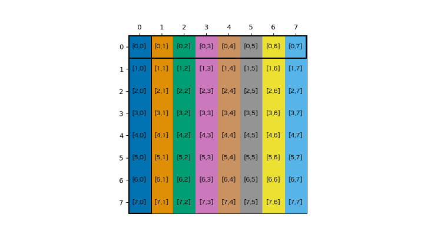

*图 51 在没有混合的共享内存数据布局中，共享内存索引相当于全局内存索引。每个加载指令都会读取一行并将其存储在转置缓冲区的一列中。由于转置中列的所有矩阵元素都落在同一个存储体中，因此必须对存储进行序列化，从而产生八个存储事务，从而为每个存储列提供八路存储体冲突。*

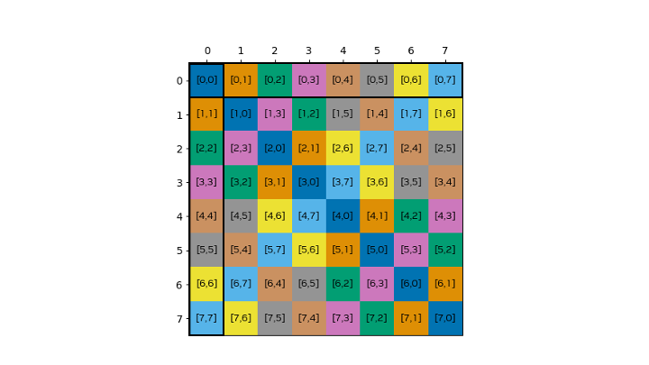

*图 52 共享内存数据布局与 CU_TENSOR_MAP_SWIZZLE_128B 混合。一行存储在一列中，每个矩阵元素都来自行和列的不同存储体，因此没有任何存储体冲突。*

```cpp
__global__ void kernel_tma(const __grid_constant__ CUtensorMap tensor_map) {
   // The destination shared memory buffer of a bulk tensor operation
   // with the 128-byte swizzle mode, it should be 1024 bytes aligned.
   __shared__ alignas(1024) int4 smem_buffer[8][8];
   __shared__ alignas(1024) int4 smem_buffer_tr[8][8];

   // Initialize shared memory barrier
   #pragma nv_diag_suppress static_var_with_dynamic_init
   __shared__ barrier bar;

   if (threadIdx.x == 0) {
     init(&bar, blockDim.x);
   }
   __syncthreads();

   barrier::arrival_token token;
   if (is_elected()) {
     // Initiate bulk tensor copy from global to shared memory,
     // in the same way as without swizzle.
     int32_t tensor_coords[2] = { 0, 0 };
     ptx::cp_async_bulk_tensor(
       ptx::space_shared, ptx::space_global,
       &smem_buffer, &tensor_map, tensor_coords,
       cuda::device::barrier_native_handle(bar));
     token = cuda::device::barrier_arrive_tx(bar, 1, sizeof(smem_buffer));
   } else {
     token = bar.arrive();
   }

   bar.wait(std::move(token));

   /* Matrix transpose
    *  When using the normal shared memory layout, there are eight
    *  8-way shared memory bank conflict when storing to the transpose.
    *  When enabling the 128-byte swizzle pattern and using the according access pattern,
    *  they are eliminated both for load and store. */
   for(int sidx_j =threadIdx.x; sidx_j < 8; sidx_j+= blockDim.x){
      for(int sidx_i = 0; sidx_i < 8; ++sidx_i){
         const int swiz_j_idx = (sidx_i % 8) ^ sidx_j;
         const int swiz_i_idx_tr = (sidx_j % 8) ^ sidx_i;
         smem_buffer_tr[sidx_j][swiz_i_idx_tr] = smem_buffer[sidx_i][swiz_j_idx];
      }
   }

   // Wait for shared memory writes to be visible to TMA engine.
   ptx::fence_proxy_async(ptx::space_shared);
   __syncthreads();

   /* Initiate TMA transfer to copy the transposed shared memory buffer back to global memory,
    * it will 'unswizzle' the data. */
   if (is_elected()) {
       int32_t tensor_coords[2] = { x, y };
       ptx::cp_async_bulk_tensor(
         ptx::space_global, ptx::space_shared,
         &tensor_map, tensor_coords, &smem_buffer_tr);
      ptx::cp_async_bulk_commit_group();
      ptx::cp_async_bulk_wait_group_read(ptx::n32_t<0>());
   }

   // Destroy barrier
   if (threadIdx.x == 0) {
     (&bar)->~barrier();
   }
}

// --------------------------------- main ----------------------------------------

int main(){

...
   void* tensor_ptr = d_data;

   CUtensorMap tensor_map{};
   // rank is the number of dimensions of the array.
   constexpr uint32_t rank = 2;
   // global memory size
   uint64_t size[rank] = {4*8, 8};
   // global memory stride, must be a multiple of 16.
   uint64_t stride[rank - 1] = {8 * sizeof(int4)};
   // The inner shared memory box dimension in bytes, equal to the swizzle span.
   uint32_t box_size[rank] = {4*8, 8};

   uint32_t elem_stride[rank] = {1, 1};

   // Create the tensor descriptor.
   CUresult res = cuTensorMapEncodeTiled(
       &tensor_map,                // CUtensorMap *tensorMap,
       CUtensorMapDataType::CU_TENSOR_MAP_DATA_TYPE_INT32,
       rank,                       // cuuint32_t tensorRank,
       tensor_ptr,                 // void *globalAddress,
       size,                       // const cuuint64_t *globalDim,
       stride,                     // const cuuint64_t *globalStrides,
       box_size,                   // const cuuint32_t *boxDim,
       elem_stride,                // const cuuint32_t *elementStrides,
       CUtensorMapInterleave::CU_TENSOR_MAP_INTERLEAVE_NONE,
       // Using a swizzle pattern of 128 bytes.
       CUtensorMapSwizzle::CU_TENSOR_MAP_SWIZZLE_128B,
       CUtensorMapL2promotion::CU_TENSOR_MAP_L2_PROMOTION_NONE,
       CUtensorMapFloatOOBfill::CU_TENSOR_MAP_FLOAT_OOB_FILL_NONE
   );

   kernel_tma<<<1, 8>>>(tensor_map);
 ...
}
```

**备注。** 此示例仅用于演示 swizzle 的用法；它本身不具备性能优势，也不能直接扩展到给定维度之外。

**解释。** 数据传输期间，TMA 引擎会按照下表所述的 swizzle 模式重新排列数据。这些模式定义了在 swizzle 宽度范围内，16 字节数据块到四个存储体子组的映射。其类型为 `CUtensorMapSwizzle`，共有四个选项：无 swizzle、32 字节、64 字节和 128 字节。请注意，共享内存盒的最内层维度必须小于或等于 swizzle 模式的跨度。

Swizzle 模式

如前所述，共有四种 swizzle 模式。下表给出了各模式以及新旧共享内存索引之间的关系。这些表定义了在 128 字节范围内，16 字节数据块到四个存储体的八个子组的映射。

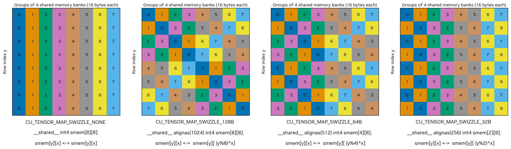

*图 53 TMA Swizzle 模式概述*

**考虑因素。** 应用 TMA swizzle 模式时，遵守特定的内存要求至关重要：

- **全局内存对齐：** 全局内存必须对齐到 128 字节。
- **共享内存对齐：** 为简单起见，共享内存应根据 swizzle 模式重复后的字节数进行对齐。当共享内存缓冲区未按 swizzle 模式重复自身的字节数对齐时，swizzle 模式和共享内存之间存在偏移。请参阅下面的 [评论](#section-4-11-2-2-5)。
- **内部尺寸：** 共享内存块的内部尺寸必须满足 [表 25](#section-4-11-2-2-5) 中指定的尺寸要求。如果不满足这些要求，则该指令被视为无效。此外，如果混合宽度超过内部尺寸，请确保分配共享内存以容纳完整的混合宽度。
- **粒度：** swizzle 映射的粒度固定为16字节。这意味着数据以 16 字节的块进行组织和访问，在规划内存布局和访问模式时必须考虑这一点。

**Swizzle 模式指针偏移计算**。本节介绍当共享内存缓冲区未按 swizzle 周期的字节数对齐时，如何确定 swizzle 模式相对于共享内存的偏移量。使用 TMA 时，共享内存必须按 128 字节对齐。要计算共享内存缓冲区相对于 swizzle 模式偏移了多少个单位，请使用相应的偏移公式。

**表 24 Swizzle Pattern 指针偏移公式及索引关系**

| Swizzle 模式 | 偏移公式 | 索引关系 |
| --- | --- | --- |
| CU_TENSOR_MAP_SWIZZLE_128B | `(reinterpret_cast <uintptr_t>(smem_ptr)/128)%8` | `smem[y][x] <-> smem[y][((y+offset)%8)^x]` |
| CU_TENSOR_MAP_SWIZZLE_64B | `(reinterpret_cast <uintptr_t>(smem_ptr)/128)%4` | `smem[y][x] <-> smem[y][((y+offset)%4)^x]` |
| CU_TENSOR_MAP_SWIZZLE_32B | `(reinterpret_cast <uintptr_t>(smem_ptr)/128)%2` | `smem[y][x] <-> smem[y][((y+offset)%2)^x]` |

在 [图 53](#section-4-11-2-2-5) 中，该偏移量表示初始行偏移量，因此，在 swizzle 索引计算中，它被添加到行索引 `y` 中。以下代码片段显示了如何在 `CU_TENSOR_MAP_SWIZZLE_128B` 模式下访问混合后的共享内存。

```cpp
data_t* smem_ptr = &smem[0][0];
int offset = (reinterpret_cast<uintptr_t>(smem_ptr)/128)%8;
smem[y][((y+offset)%8)^x] = ...
```

**总结。** 下方[表 25](#section-4-11-2-2-5)汇总了计算能力 9.x 上各 swizzle 模式的要求与属性。

**表 25 计算能力 9.x 上各 swizzle 模式的要求与属性**

| 图案 | 搅拌宽度 | 共享盒子内部尺寸 | 之后重复 | 共享内存对齐 | 全局内存对齐 |
| --- | --- | --- | --- | --- | --- |
| CU_TENSOR_MAP_SWIZZLE_128B | 128字节 | <=128 字节 | 1024字节 | 128字节 | 128字节 |
| CU_TENSOR_MAP_SWIZZLE_64B | 64字节 | <=64 字节 | 512字节 | 128字节 | 128字节 |
| CU_TENSOR_MAP_SWIZZLE_32B | 32字节 | <=32 字节 | 256字节 | 128字节 | 128字节 |
| CU_TENSOR_MAP_SWIZZLE_NONE（默认） |  |  |  | 128字节 | 16字节 |

### 4.11.3. 使用 STAS

使用[线程块簇](#section-2-1-10)的 CUDA 应用程序可能需要在簇内的线程块之间移动小型数据元素。STAS 指令（计算能力 9.0 及以上；请参阅 [PTX 文档](https://docs.nvidia.com/cuda/parallel-thread-execution/#data-movement-and-conversion-instructions-st-async)）支持将数据直接从寄存器异步复制到分布式共享内存。STAS 仅通过 [libcu++](https://nvidia.github.io/cccl/unstable/libcudacxx/ptx/instructions/st_async.html?highlight=st_async) 库提供的底层 `cuda::ptx::st_async` API 公开。

**尺寸**。 STAS 支持复制 4、8 或 16 字节。

**来源和目的地**。 STAS 的异步复制操作支持的唯一方向是从寄存器到分布式共享内存。目标指针需要对齐到 4、8 或 16 字节，具体取决于要复制的数据的大小。

**异步性。** 使用 STAS 的数据传输是[异步](#section-3-2-2-3)的，并建模为异步线程操作（请参阅[异步线程与异步代理](#section-3-2-2-3-1)）。因此，发起操作的线程可以继续计算，同时由硬件异步复制数据。*数据传输实际上是否异步执行取决于硬件实现，将来可能发生变化。* STAS 操作使用[共享内存屏障](#section-3-2-4-2)作为完成机制，以发出操作已完成的信号。

在以下示例中，我们展示如何使用 STAS 在线程-线程块簇中实现生产者-消费者模式。这个内核创建了一个循环通信流水线，其中 8 个线程块排列成一个环，并且每个块同时进行：

- 为序列中的下一个块生成数据。
- 使用序列中前一个块的数据。

为实现这一模式，每个线程块需要两个共享内存屏障：一个用于通知消费者线程块数据已复制到共享内存缓冲区（`filled`），另一个用于通知生产者线程块消费者端的缓冲区已可再次填充（`ready`）。

**CUDA C++ `cuda::ptx`**

| `#include <cooperative_groups.h> #include <cuda/barrier> #include <cuda/ptx> __global__ __cluster_dims__(8, 1, 1) void producer_consumer_kernel() { using namespace cooperative_groups; using namespace cuda::device; using namespace cuda::ptx; using barrier_t = cuda::barrier<cuda::thread_scope_block>; auto cluster = this_cluster(); #pragma nv_diag_suppress static_var_with_dynamic_init __shared__ int buffer[BLOCK_SIZE]; __shared__ barrier_t filled; __shared__ barrier_t ready; // Initialize shared memory barriers. if (threadIdx.x == 0) { init(&filled, 1); init(&ready, BLOCK_SIZE); } // Sync cluster to ensure remote barriers are initialized. cluster.sync(); // Define my own and my neighbor's ranks. int rk = cluster.block_rank(); int rk_next = (rk + 1) % 8; int rk_prev = (rk + 7) % 8; // Get addresses of remote buffer we are writing to and remote barriers of previous and next blocks. auto buffer_next = cluster.map_shared_rank(buffer, rk_next); auto bar_next = cluster.map_shared_rank(barrier_native_handle(filled), rk_next); auto bar_prev = cluster.map_shared_rank(barrier_native_handle(ready), rk_prev); int phase = 0; for (int it = 0; it < 1000; ++it) { // As producers, send data to our right neighbor. st_async(&buffer_next[threadIdx.x], rk, bar_next); if (threadIdx.x == 0) { // Thread 0 arrives on local barrier and indicates it expects to receive a certain number of bytes. mbarrier_arrive_expect_tx(sem_release, scope_cluster, space_shared, barrier_native_handle(filled), sizeof(buffer)); } // As consumers, wait on local barrier for data from left neighbor to arrive. while (!mbarrier_try_wait_parity(barrier_native_handle(filled), phase, 1000)) {} // At this point, the data has been copied to our local buffer. int r = buffer[threadIdx.x]; // Use the data to do something. // As consumers, notify our left neighbor that we are done with the data. mbarrier_arrive(sem_release, scope_cluster, space_cluster, bar_prev); // As producers, wait on local barrier until the right neighbor is ready to receive new data. while (!mbarrier_try_wait_parity(barrier_native_handle(ready), phase, 1000)) {} phase ^= 1; } }` |
| --- |

- 共享内存屏障由每个块的第一个线程初始化。屏障 `filled` 初始化为 1，屏障 `ready` 初始化为块中线程的数量。
- 执行集群范围的同步以确保在任何线程开始通信之前所有屏障都已初始化。
- 每个线程确定其邻居的等级，并使用它们来映射远程共享内存屏障和远程共享内存缓冲区以写入数据。
- 在每次迭代中：
1. 作为生产者，每个线程向其右邻居发送数据。
2. 作为消费者，线程 0 到达本地 `filled` 屏障并表示它期望接收一定数量的字节。
3. 作为消费者，每个线程等待本地 `filled` 屏障来自左邻居的数据到达。
4. 作为消费者，每个线程使用数据来做一些事情。
5. 作为消费者，每个线程通知左邻居数据已完成。
6. 作为生产者，每个线程等待本地 `ready` 屏障，直到正确的邻居准备好接收新数据。

请注意，每个屏障都必须使用正确的地址空间：映射后的远程屏障使用 `space_cluster`，本地屏障使用 `space_shared`。

---

## 4.12. 使用簇启动控制实现工作窃取

*英文原题：Work Stealing with Cluster Launch Control*  
*官方原文：[https://docs.nvidia.com/cuda/cuda-programming-guide/04-special-topics/cluster-launch-control.html](https://docs.nvidia.com/cuda/cuda-programming-guide/04-special-topics/cluster-launch-control.html)*

开发 CUDA 应用程序时，经常需要处理数据规模和计算量可变的问题。传统上，CUDA 开发人员主要采用两种方式确定要启动的内核线程块数量：*每线程块固定工作量*和*固定线程块数量*。两种方式各有优缺点。

**每线程块固定工作量：** 线程块数量由问题规模决定，而每个线程块完成的工作量保持不变。

这种方法的主要优点：

- *SM 之间的负载均衡*
当线程块运行时间存在差异，或者线程块数量远大于 GPU 可同时执行的数量（从而产生低尾效应）时，这种方式允许 GPU 调度器在部分 SM 上运行比其他 SM 更多的线程块。
- *抢占*
即使较低优先级内核已经开始执行，GPU 调度器仍可在其部分线程块完成后，调度[更高优先级内核](#section-2-5-9-1)的线程块。高优先级内核执行完毕后，调度器可继续执行低优先级内核。

**固定线程块数量：** 这种方式通常通过块跨步循环或网格跨步循环实现，线程块数量不随问题规模变化；相反，每个线程块的工作量取决于问题规模。线程块数量通常由执行内核的 GPU 所含 SM 数量和目标占用率确定。

这种方法的主要优点：

- *减少线程块开销*
这种方法不仅减少了摊销的线程块启动延迟，而且还最大限度地减少了与所有线程块之间的共享操作相关的计算开销。这些开销可能明显高于启动延迟开销。
例如，在卷积内核中，由于线程块的数量固定，计算卷积系数的序言（独立于线程块索引）可以计算更少的次数，从而减少冗余计算。

**簇启动控制** 是 NVIDIA Blackwell GPU 架构（计算能力 10.0）引入的一项功能，旨在兼得前两种方法的优点。它允许开发者取消线程块或线程块簇，从而对线程块调度拥有更多控制权。该机制可以实现工作窃取。工作窃取是并行计算中的一种动态负载均衡技术：空闲处理器不是等待分配工作，而是主动从繁忙处理器的工作队列中“窃取”任务。

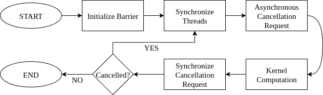

*图 54 簇启动控制流量*

使用簇启动控制时，一个线程块会尝试取消另一个尚未开始执行的线程块。如果取消成功，它便使用被取消线程块的索引执行相应任务，从而“窃取”该线程块的工作。如果已经没有可用的线程块索引，或因更高优先级内核正在等待调度等原因，取消请求会失败。在后一种情况下，发出请求的线程块可以在取消失败后退出，使调度器开始执行更高优先级内核；之后，调度器仍会继续调度当前内核剩余的线程块。上面的[图 54](#section-4-12)展示了这一执行流程。

下面的表总结了三种方法的优缺点：

|  | **每线程块固定工作量** | **固定线程块数量** | **簇启动控制** |
| --- | --- | --- | --- |
| 降低开销 | **\(\textcolor{red}{\textbf{X}}\)** | **\(\textcolor{lime}{\textbf{V}}\)** | **\(\textcolor{lime}{\textbf{V}}\)** |
| 抢占 | **\(\textcolor{lime}{\textbf{V}}\)** | **\(\textcolor{red}{\textbf{X}}\)** | **\(\textcolor{lime}{\textbf{V}}\)** |
| 负载均衡 | **\(\textcolor{lime}{\textbf{V}}\)** | **\(\textcolor{red}{\textbf{X}}\)** | **\(\textcolor{lime}{\textbf{V}}\)** |

### 4.12.1. API 详解

通过簇启动控制 API 取消线程块是异步完成的，并使用共享内存屏障同步完成，遵循类似于 [异步数据副本](#section-3-2-5) 的编程模式。

该 API 由 [libcu++](https://nvidia.github.io/cccl/unstable/libcudacxx/ptx_api.html) 提供，包括：

- 将编码取消结果写入 `__shared__` 变量的请求指令。
- 解码指令，提取成功/失败状态和取消的线程块索引。

请注意，簇启动控制操作建模为异步代理操作（请参阅[异步线程与异步代理](#section-3-2-2-3-1)）。

#### 4.12.1.1. 线程块取消

使用簇启动控制的首选方式是来自单个线程，即一次一个请求。

取消过程包括五个步骤：

- **设置阶段**（步骤1-2）：声明并初始化取消结果和同步变量。
- **工作窃取循环**（步骤3-5）：重复执行请求、同步和处理取消结果。

1. 声明线程块取消的变量：
    ```cpp
    __shared__ uint4 result; // Request result.
    __shared__ uint64_t bar; // Synchronization barrier.
    int phase = 0;           // Synchronization barrier phase.
    ```
2. 使用单个到达计数初始化共享内存屏障：
    ```cpp
    if (cg::thread_block::thread_rank() == 0)
        ptx::mbarrier_init(&bar, 1);
    __syncthreads();
    ```
3. 由单个线程提交异步取消请求并设置事务计数：
    ```cpp
    if (cg::thread_block::thread_rank() == 0) {
        cg::invoke_one(cg::coalesced_threads(), [&](){ptx::clusterlaunchcontrol_try_cancel(&result, &bar);});
        ptx::mbarrier_arrive_expect_tx(ptx::sem_relaxed, ptx::scope_cta, ptx::space_shared, &bar, sizeof(uint4));
    }
    ```
> [!NOTE]
> **说明**
> 线程块取消是一条统一指令，因此建议在 [`invoke_one`](#section-4-4-6-3) 线程选择器中提交请求，使编译器能够消除剥离循环。
4. 同步（完成）异步取消请求：
    ```cpp
    while (!ptx::mbarrier_try_wait_parity(&bar, phase))
    {}
    phase ^= 1;
    ```
5. 检索取消状态和取消的线程块索引：
    ```cpp
    bool success = ptx::clusterlaunchcontrol_query_cancel_is_canceled(result);
    if (success) {
        // Don't need all three for 1D/2D thread blocks:
        int bx = ptx::clusterlaunchcontrol_query_cancel_get_first_ctaid_x(result);
        int by = ptx::clusterlaunchcontrol_query_cancel_get_first_ctaid_y(result);
        int bz = ptx::clusterlaunchcontrol_query_cancel_get_first_ctaid_z(result);
    }
    ```
6. 确保异步和通用 [代理](https://docs.nvidia.com/cuda/parallel-thread-execution/index.html#proxies) 之间的共享内存操作的可见性，并防止工作窃取循环迭代之间的数据竞争。

#### 4.12.1.2. 线程块取消的限制

这些限制与失败的取消请求相关：

- 在 **观察** 先前失败的请求之后提交另一个取消请求是 *未定义的行为*。
在下面的两个代码示例中，假设第一个取消请求失败，则只有第一个示例表现出未定义的行为。第二个示例是正确的，因为取消请求之间没有观察：
**无效代码：**
**有效代码：**
    ```cpp
    // First request:
    ptx::clusterlaunchcontrol_try_cancel(&result0, &bar0);
    
    // First request query:
    [Synchronize bar0 code here.]
    bool success0 = ptx::clusterlaunchcontrol_query_cancel_is_canceled(result0);
    assert(!success0); // Observed failure; second cancellation will be invalid.
    
    // Second request - next line is Undefined Behavior:
    ptx::clusterlaunchcontrol_try_cancel(&result1, &bar1);
    ```
    ```cpp
    // First request:
    ptx::clusterlaunchcontrol_try_cancel(&result0, &bar0);
    
    // Second request:
    ptx::clusterlaunchcontrol_try_cancel(&result1, &bar1);
    
    // First request query:
    [Synchronize bar0 code here.]
    bool success0 = ptx::clusterlaunchcontrol_query_cancel_is_canceled(result0);
    assert(!success0); // Observed failure; second cancellation was valid.
    ```
- 检索失败的取消请求的线程块索引是未定义行为。
- 不建议从多个线程提交取消请求。导致取消多个线程块，需要谨慎处理，例如：
- 每个提交的线程必须提供唯一的 `__shared__` 结果指针以避免数据争用。
- 如果同步使用同一个屏障，则必须相应调整到达计数和事务计数。

### 4.12.2. 示例：矢量标量乘法

在以下小节中，我们通过簇启动控制和矢量标量乘法内核演示工作窃取。我们展示了同一问题的两种变体：一种使用线程块，另一种使用线程块簇。

#### 4.12.2.1. 用例：线程块

下面三个内核分别演示向量标量乘法 \(\overline{v} := \alpha \overline{v}\) 的*每线程块固定工作量*、*固定线程块数量*和*簇启动控制*方式。

- 每线程块固定工作量：
    ```cpp
    __global__
    void kernel_fixed_work (float* data, int n)
    {
        // Prologue:
        float alpha = compute_scalar();
    
        // Computation:
        int i = blockIdx.x * blockDim.x + threadIdx.x;
        if (i < n)
            data[i] *= alpha;
    }
    
    // Launch: kernel_fixed_work<<<(n + 1023) / 1024, 1024>>>(data, n);
    ```
- 固定线程块数量：
    ```cpp
    __global__
    void kernel_fixed_blocks (float* data, int n)
    {
        // Prologue:
        float alpha = compute_scalar();
    
        // Computation:
        int i = blockIdx.x * blockDim.x + threadIdx.x;
        while (i < n) {
            data[i] *= alpha;
            i += gridDim.x * blockDim.x;
        }
    }
    
    // Launch: kernel_fixed_blocks<<<SM_COUNT, 1024>>>(data, n);
    ```
- 簇启动控制：
    ```cpp
    #include <cooperative_groups.h>
    #include <cuda/ptx>
    
    namespace cg = cooperative_groups;
    namespace ptx = cuda::ptx;
    
    __global__
    void kernel_cluster_launch_control (float* data, int n)
    {
        // Cluster launch control initialization:
        __shared__ uint4 result;
        __shared__ uint64_t bar;
        int phase = 0;
    
        if (cg::thread_block::thread_rank() == 0)
            ptx::mbarrier_init(&bar, 1);
    
        // Prologue:
        float alpha = compute_scalar(); // Device function not shown in this code snippet.
    
        // Work-stealing loop:
        int bx = blockIdx.x; // Assuming 1D x-axis thread blocks.
    
        while (true) {
            // Protect result from overwrite in the next iteration,
            // (also ensure barrier initialization at 1st iteration):
            __syncthreads();
    
            // Cancellation request:
            if (cg::thread_block::thread_rank() == 0) {
                // Acquire write of result in the async proxy:
                ptx::fence_proxy_async_generic_sync_restrict(ptx::sem_acquire, ptx::space_cluster, ptx::scope_cluster);
    
                cg::invoke_one(cg::coalesced_threads(), [&](){ptx::clusterlaunchcontrol_try_cancel(&result, &bar);});
                ptx::mbarrier_arrive_expect_tx(ptx::sem_relaxed, ptx::scope_cta, ptx::space_shared, &bar, sizeof(uint4));
            }
    
            // Computation:
            int i = bx * blockDim.x + threadIdx.x;
            if (i < n)
                data[i] *= alpha;
    
            // Cancellation request synchronization:
            while (!ptx::mbarrier_try_wait_parity(ptx::sem_acquire, ptx::scope_cta, &bar, phase))
            {}
            phase ^= 1;
    
            // Cancellation request decoding:
            bool success = ptx::clusterlaunchcontrol_query_cancel_is_canceled(result);
            if (!success)
                break;
    
            bx = ptx::clusterlaunchcontrol_query_cancel_get_first_ctaid_x<int>(result);
    
            // Release read of result to the async proxy:
            ptx::fence_proxy_async_generic_sync_restrict(ptx::sem_release, ptx::space_shared, ptx::scope_cluster);
        }
    }
    
    // Launch: kernel_cluster_launch_control<<<(n + 1023) / 1024, 1024>>>(data, n);
    ```

#### 4.12.2.2. 用例：线程块簇

对于[线程块簇](#section-2-1-10)，线程块取消步骤与非簇配置基本相同，只需少量调整。与非簇情况一样，不建议由簇内多个线程提交取消请求，因为这样会尝试取消多个簇。

- 取消请求由簇中的单个线程提交。
- 簇内每个线程块的共享内存结果都接收相同的已取消线程块索引编码值（即结果被多播）。各线程块收到的结果对应簇内局部块索引 `{0, 0, 0}`，因此还需加上本线程块在簇内的局部索引。
- 每个线程块都使用本地 `__shared__` 内存屏障完成同步；屏障操作必须使用 `ptx::scope_cluster` 作用域。
- 簇模式下的取消要求所有线程块均已驻留。可使用[同步](#section-5-6-3-6-2) API `cg::cluster_group::sync()` 保证所有线程块都在运行。

下面的内核演示了使用线程块簇的簇启动控制方法。

```cpp
#include <cooperative_groups.h>
#include <cuda/ptx>

namespace cg = cooperative_groups;
namespace ptx = cuda::ptx;

__global__ __cluster_dims__(2, 1, 1)
void kernel_cluster_launch_control (float* data, int n)
{
    // Cluster launch control initialization:
    __shared__ uint4 result;
    __shared__ uint64_t bar;
    int phase = 0;

    if (cg::thread_block::thread_rank() == 0) {
        ptx::mbarrier_init(&bar, 1);
        ptx::fence_mbarrier_init(ptx::sem_release, ptx::scope_cluster); // CGA-level fence.
    }

    // Prologue:
    float alpha = compute_scalar(); // Device function not shown in this code snippet.

    // Work-stealing loop:
    int bx = blockIdx.x; // Assuming 1D x-axis thread blocks.

    while (true) {
        // Protect result from overwrite in the next iteration,
        // (also ensure all thread blocks have started at 1st iteration):
        cg::cluster_group::sync();

        // Cancellation request by a single cluster thread:
        if (cg::cluster_group::thread_rank() == 0) {
            // Acquire write of result in the async proxy:
            ptx::fence_proxy_async_generic_sync_restrict(ptx::sem_acquire, ptx::space_cluster, ptx::scope_cluster);

            cg::invoke_one(cg::coalesced_threads(), [&](){ptx::clusterlaunchcontrol_try_cancel_multicast(&result, &bar);});
        }

        // Cancellation completion tracked by each thread block:
        if (cg::thread_block::thread_rank() == 0)
            ptx::mbarrier_arrive_expect_tx(ptx::sem_relaxed, ptx::scope_cluster, ptx::space_shared, &bar, sizeof(uint4));

        // Computation:
        int i = bx * blockDim.x + threadIdx.x;
        if (i < n)
            data[i] *= alpha;

        // Cancellation request synchronization:
        while (!ptx::mbarrier_try_wait_parity(ptx::sem_acquire, ptx::scope_cluster, &bar, phase))
        {}
        phase ^= 1;

        // Cancellation request decoding:
        bool success = ptx::clusterlaunchcontrol_query_cancel_is_canceled(result);
        if (!success)
            break;

        bx = ptx::clusterlaunchcontrol_query_cancel_get_first_ctaid_x<int>(result);
        bx += cg::cluster_group::block_index().x; // Add local offset.

        // Release read of result to the async proxy:
        ptx::fence_proxy_async_generic_sync_restrict(ptx::sem_release, ptx::space_shared, ptx::scope_cluster);
    }
}

// Launch: kernel_cluster_launch_control<<<(n + 1023) / 1024, 1024>>>(data, n);
```

---

## 4.13. L2 缓存控制

*英文原题：L2 Cache Control*  
*官方原文：[https://docs.nvidia.com/cuda/cuda-programming-guide/04-special-topics/l2-cache-control.html](https://docs.nvidia.com/cuda/cuda-programming-guide/04-special-topics/l2-cache-control.html)*

当 CUDA 内核重复访问全局内存中的数据区域时，这样的数据访问可以被认为是持久的。另一方面，如果数据仅被访问一次，则这样的数据访问可以被认为是流式的。

计算能力 8.0 及更高版本的设备能够影响 L2 缓存中数据的持久性，从而可能为全局内存提供更高的带宽和更低的延迟访问。

此功能通过两个主要 API 公开：

- CUDA 运行时 API（从 CUDA 11.0 开始）提供对 L2 缓存持久性的编程控制。
- [libcu++](https://nvidia.github.io/cccl/unstable/libcudacxx/extended_api/memory_access_properties/annotated_ptr.html) 库中的 `cuda::annotated_ptr` API（自 CUDA 11.5 起提供）使用内存访问属性标注 CUDA 内核中的指针，从而实现类似效果。

以下各节重点介绍 CUDA 运行时 API。有关 `cuda::annotated_ptr` 方式的详细信息，请参阅 [libcu++ 文档](https://nvidia.github.io/cccl/unstable/libcudacxx/extended_api/memory_access_properties/annotated_ptr.html)。

### 4.13.1. 用于持久访问的 L2 缓存预留

L2 缓存的一部分可以留出用于对全局内存进行持久数据访问。持久访问优先使用 L2 缓存的这部分预留部分，而对全局内存的正常或流式访问只能在持久访问未使用时使用 L2 的这部分。

用于持久访问的 L2 缓存预留大小可以在限制范围内进行调整：

```cpp
cudaGetDeviceProperties(&prop, device_id);
size_t size = min(int(prop.l2CacheSize * 0.75), prop.persistingL2CacheMaxSize);
cudaDeviceSetLimit(cudaLimitPersistingL2CacheSize, size); /* set-aside 3/4 of L2 cache for persisting accesses or the max allowed*/
```

当 GPU 配置为多实例 GPU (MIG) 模式时，L2 缓存预留功能被禁用。

使用多进程服务 (MPS) 时，L2 缓存预留大小无法通过 `cudaDeviceSetLimit` 更改。相反，预留大小只能在 MPS 服务器启动时通过环境变量 `CUDA_DEVICE_DEFAULT_PERSISTING_L2_CACHE_PERCENTAGE_LIMIT` 指定。

### 4.13.2. 持久访问的 L2 策略

访问策略窗口指定全局内存的连续区域以及 L2 缓存中用于该区域内访问的持久性属性。

下面的代码示例展示了如何使用 CUDA 流设置 L2 持久访问窗口。

**CUDA 流示例**

```cpp
cudaStreamAttrValue stream_attribute;                                         // Stream level attributes data structure
stream_attribute.accessPolicyWindow.base_ptr  = reinterpret_cast<void*>(ptr); // Global Memory data pointer
stream_attribute.accessPolicyWindow.num_bytes = num_bytes;                    // Number of bytes for persistence access.
                                                                              // (Must be less than cudaDeviceProp::accessPolicyMaxWindowSize)
stream_attribute.accessPolicyWindow.hitRatio  = 0.6;                          // Hint for cache hit ratio
stream_attribute.accessPolicyWindow.hitProp   = cudaAccessPropertyPersisting; // Type of access property on cache hit
stream_attribute.accessPolicyWindow.missProp  = cudaAccessPropertyStreaming;  // Type of access property on cache miss.

//Set the attributes to a CUDA stream of type cudaStream_t
cudaStreamSetAttribute(stream, cudaStreamAttributeAccessPolicyWindow, &stream_attribute);
```

当内核随后在 CUDA `stream` 中执行时，全局内存范围 `[ptr..ptr+num_bytes)` 内的内存访问比对其他全局内存位置的访问更有可能保留在 L2 缓存中。

还可以为 CUDA 图内核节点设置 L2 持久性，如下例所示：

**CUDA GraphKernelNode 示例**

```cpp
cudaKernelNodeAttrValue node_attribute;                                     // Kernel level attributes data structure
node_attribute.accessPolicyWindow.base_ptr  = reinterpret_cast<void*>(ptr); // Global Memory data pointer
node_attribute.accessPolicyWindow.num_bytes = num_bytes;                    // Number of bytes for persistence access.
                                                                            // (Must be less than cudaDeviceProp::accessPolicyMaxWindowSize)
node_attribute.accessPolicyWindow.hitRatio  = 0.6;                          // Hint for cache hit ratio
node_attribute.accessPolicyWindow.hitProp   = cudaAccessPropertyPersisting; // Type of access property on cache hit
node_attribute.accessPolicyWindow.missProp  = cudaAccessPropertyStreaming;  // Type of access property on cache miss.

//Set the attributes to a CUDA Graph Kernel node of type cudaGraphNode_t
cudaGraphKernelNodeSetAttribute(node, cudaKernelNodeAttributeAccessPolicyWindow, &node_attribute);
```

`hitRatio` 参数可用于指定获得 `hitProp` 属性的访问比例。在上面的两个示例中，全局内存区域 `[ptr..ptr+num_bytes)` 中 60% 的内存访问具有持久属性，40% 具有流式属性。哪些具体内存访问被归为持久访问（`hitProp`）是随机的，其概率约为 `hitRatio`；概率分布取决于硬件架构和内存范围。

例如，如果二级预留缓存大小为 16KB，`accessPolicyWindow` 中的 `num_bytes` 为 32KB:

- 当 `hitRatio` 为 0.5 时，硬件将随机选择 32KB 窗口中的 16KB 指定为持久并缓存在预留的 L2 缓存区域中。
- 当 `hitRatio` 为 1.0 时，硬件将尝试将整个 32KB 窗口缓存在预留的 L2 缓存区域中。由于预留区域小于窗口，缓存行将被逐出，以将 32KB 数据中最近使用的 16KB 保留在 L2 缓存的预留部分中。

因此，`hitRatio` 可用于避免缓存行的颠簸，并总体减少移入和移出 L2 缓存的数据量。

将 `hitRatio` 设为小于 1.0 的值，可以手动控制并发 CUDA 流中不同 `accessPolicyWindow` 能够在 L2 中缓存的数据量。例如，假设 L2 预留缓存大小为 16 KB，两个不同 CUDA 流各自并发执行一个内核，每个内核都有一个 16 KB 的 `accessPolicyWindow`，且两者的 `hitRatio` 均为 1.0，那么它们在竞争共享 L2 资源时可能会逐出彼此的缓存行。但如果两个 `accessPolicyWindows` 的 `hitRatio` 都为 0.5，则它们逐出自身或对方持久性缓存行的可能性会降低。

### 4.13.3. L2 访问属性

为不同的全局内存数据访问定义了三种类型的访问属性：

1. `cudaAccessPropertyStreaming`：与流属性一起发生的内存访问不太可能保留在 L2 缓存中，因为这些访问会被优先逐出。
2. `cudaAccessPropertyPersisting`：具有持久属性的内存访问更有可能保留在 L2 缓存中，因为这些访问优先保留在 L2 缓存的预留部分中。
3. `cudaAccessPropertyNormal`：此访问属性强制将先前应用的持久访问属性重置为正常状态。具有来自先前 CUDA 内核的持久属性的内存访问可能会在其预期使用后很长时间内保留在 L2 缓存中。这种使用后持久性减少了不使用持久性属性的后续内核可用的 L2 缓存量。使用 `cudaAccessPropertyNormal` 属性重置访问属性窗口会删除先前访问的持久（优先保留）状态，就好像先前访问没有访问属性一样。

### 4.13.4. L2 持久化示例

以下示例显示如何为持久访问预留二级缓存，通过 CUDA 流在 CUDA 内核中使用预留的二级缓存，然后重置二级缓存。

```cpp
cudaStream_t stream;
cudaStreamCreate(&stream);                                                                  // Create CUDA stream

cudaDeviceProp prop;                                                                        // CUDA device properties variable
cudaGetDeviceProperties( &prop, device_id);                                                 // Query GPU properties
size_t size = min( int(prop.l2CacheSize * 0.75) , prop.persistingL2CacheMaxSize );
cudaDeviceSetLimit( cudaLimitPersistingL2CacheSize, size);                                  // set-aside 3/4 of L2 cache for persisting accesses or the max allowed

size_t window_size = min(prop.accessPolicyMaxWindowSize, num_bytes);                        // Select minimum of user defined num_bytes and max window size.

cudaStreamAttrValue stream_attribute;                                                       // Stream level attributes data structure
stream_attribute.accessPolicyWindow.base_ptr  = reinterpret_cast<void*>(data1);               // Global Memory data pointer
stream_attribute.accessPolicyWindow.num_bytes = window_size;                                // Number of bytes for persistence access
stream_attribute.accessPolicyWindow.hitRatio  = 0.6;                                        // Hint for cache hit ratio
stream_attribute.accessPolicyWindow.hitProp   = cudaAccessPropertyPersisting;               // Persistence Property
stream_attribute.accessPolicyWindow.missProp  = cudaAccessPropertyStreaming;                // Type of access property on cache miss

cudaStreamSetAttribute(stream, cudaStreamAttributeAccessPolicyWindow, &stream_attribute);   // Set the attributes to a CUDA Stream

for(int i = 0; i < 10; i++) {
    cuda_kernelA<<<grid_size,block_size,0,stream>>>(data1);                                 // This data1 is used by a kernel multiple times
}                                                                                           // [data1 + num_bytes) benefits from L2 persistence
cuda_kernelB<<<grid_size,block_size,0,stream>>>(data1);                                     // A different kernel in the same stream can also benefit
                                                                                            // from the persistence of data1

stream_attribute.accessPolicyWindow.num_bytes = 0;                                          // Setting the window size to 0 disable it
cudaStreamSetAttribute(stream, cudaStreamAttributeAccessPolicyWindow, &stream_attribute);   // Overwrite the access policy attribute to a CUDA Stream
cudaCtxResetPersistingL2Cache();                                                            // Remove any persistent lines in L2

cuda_kernelC<<<grid_size,block_size,0,stream>>>(data2);                                     // data2 can now benefit from full L2 in normal mode
```

### 4.13.5. 将 L2 访问重置为正常

来自先前 CUDA 内核的持久 L2 缓存行在使用后可能会在 L2 中持久存在很长时间。因此，将 L2 高速缓存重置为正常对于流式或正常存储器访问以利用具有正常优先级的 L2 高速缓存非常重要。可通过三种方式将持久访问重置为正常状态。

1. 使用访问属性 `cudaAccessPropertyNormal` 重置先前的持久内存区域。
2. 通过调用 `cudaCtxResetPersistingL2Cache()` 将所有持久 L2 缓存行重置为正常。
3. **最终** 未触及的线路自动重置为正常。强烈建议不要依赖自动重置，因为自动重置发生所需的时间长度不确定。

### 4.13.6. 管理 L2 预留缓存的使用

在不同的 CUDA 流中同时执行的多个 CUDA 内核可能具有分配给其流的不同访问策略窗口。然而，L2 预留高速缓存部分在所有这些并发 CUDA 内核之间共享。因此，该预留缓存部分的净利用率是所有并发内核单独使用的总和。当持久访问量超过预留的 L2 高速缓存容量时，将内存访问指定为持久访问的好处就会减弱。

要管理预留 L2 缓存部分的利用率，应用程序必须考虑以下因素：

- L2 预留缓存的大小。
- CUDA 内核可能并发执行。
- 所有可能同时执行的 CUDA 内核的访问策略窗口。
- 何时以及如何需要 L2 重置，以允许正常或流式访问以相同的优先级利用先前预留的 L2 缓存。

### 4.13.7. 查询二级缓存属性

与二级缓存相关的属性是 `cudaDeviceProp` 结构体的一部分，可以使用 CUDA 运行时 API `cudaGetDeviceProperties` 进行查询

CUDA 设备属性包括：

- `l2CacheSize` :GPU 上可用的二级缓存量。
- `persistingL2CacheMaxSize`：可以为持久内存访问预留的 L2 缓存的最大数量。
- `accessPolicyMaxWindowSize`：访问策略窗口的最大大小。

### 4.13.8. 控制持久内存访问的 L2 缓存预留大小

使用 CUDA 运行时 API `cudaDeviceGetLimit` 查询用于持久内存访问的 L2 预留缓存大小，并使用 CUDA 运行时 API `cudaDeviceSetLimit` 设置作为 `cudaLimit`。设置此限制的最大值是 `cudaDeviceProp::persistingL2CacheMaxSize`。

```cpp
enum cudaLimit {
    /* other fields not shown */
    cudaLimitPersistingL2CacheSize
};
```

---

## 4.14. 内存同步域

*英文原题：Memory Synchronization Domains*  
*官方原文：[https://docs.nvidia.com/cuda/cuda-programming-guide/04-special-topics/memory-sync-domains.html](https://docs.nvidia.com/cuda/cuda-programming-guide/04-special-topics/memory-sync-domains.html)*

### 4.14.1. 内存栅栏干扰

由于内存栅栏/刷新操作等待的事务数量多于 CUDA 内存一致性模型所需的事务数量，某些 CUDA 应用程序可能会出现性能下降。

| `__managed__ int x = 0; __device__ cuda::atomic<int, cuda::thread_scope_device> a(0); __managed__ cuda::atomic<int, cuda::thread_scope_system> b(0);` |  |  |
| --- | --- | --- |
| 线程 1 (SM) `x = 1; a = 1;` | 线程 2 (SM) `while (a != 1) ; assert(x == 1); b = 1;` | 线程 3 (CPU) `while (b != 1) ; assert(x == 1);` |

考虑上面的示例。CUDA 内存一致性模型保证断言条件成立，因此在线程 2 写入 `b` 之前，线程 1 对 `x` 的写入必须已经对线程 3 可见。

`a` 上的释放与获取是设备作用域操作，其提供的内存序只足以使 `x` 对线程 2 可见，不能直接使其对线程 3 可见。因此，`b` 上的系统作用域释放与获取不仅必须使线程 2 自己发出的写入对线程 3 可见，还必须把其他线程中已经对线程 2 可见的写入一并传播给线程 3；这种性质称为*累积性*。GPU 在执行时无法判断哪些写入由源代码语义保证可见、哪些只是因时序巧合而可见，所以必须以保守方式覆盖较大范围的在途内存操作。

这有时会造成干扰：GPU 可能等待源代码语义并不要求等待的内存操作，使栅栏或刷新操作耗时超过必要程度。

请注意，内存栅栏可以像示例中那样，在代码中以内建函数或原子操作的形式显式出现；也可以为了在任务边界实现 *同步于* 关系而隐式出现。

常见情形是：一个内核在本地 GPU 内存中执行计算，另一个并行内核（例如由 NCCL 启动）则与对等设备通信。本地内核完成时会隐式刷新其写入，以满足与下游工作的任何*同步于*关系；这一过程可能无谓地等待通信内核经较慢的 NVLink 或 PCIe 发出的全部或部分写入。

### 4.14.2. 使用域隔离流量

从计算能力 9.0（Hopper 架构）的 GPU 和 CUDA 12.0 开始，内存同步域可用于减轻此类干扰。在代码显式提供域信息后，GPU 可以缩小栅栏操作需要覆盖的范围。每次内核启动都会获得一个域 ID，写入和栅栏都带有该 ID；栅栏只对与自身域匹配的写入建立顺序约束。在上述计算与通信并发的示例中，可以把通信内核放入另一个域。

使用域时，代码必须遵守以下规则：**同一 GPU 上不同域之间的顺序约束或同步需要系统作用域栅栏。** 在同一域内，设备作用域栅栏仍然足够。该规则是保证累积性所必需的，因为一个域中内核发出的栅栏不会覆盖另一个域中内核的写入；本质上，应提前把跨域流量刷新到系统作用域，才能满足累积性要求。

这会改变 `thread_scope_device` 的定义。不过，内核默认使用域 0（如下所述），因此仍能保持向后兼容。

### 4.14.3. 在 CUDA 中使用域

可通过新的启动属性 `cudaLaunchAttributeMemSyncDomain` 和 `cudaLaunchAttributeMemSyncDomainMap` 使用内存同步域。前者在逻辑域 `cudaLaunchMemSyncDomainDefault` 与 `cudaLaunchMemSyncDomainRemote` 之间选择，后者提供逻辑域到物理域的映射。远程域用于执行远程内存访问的内核，以便将其内存流量与本地内核隔离。需要说明的是，选择哪个域并不影响内核能够合法执行哪些内存访问。

可通过设备属性 `cudaDevAttrMemSyncDomainCount` 查询域的数量。计算能力为 9.0（Hopper）的设备具有 4 个域。为便于编写可移植代码，所有设备都可以使用域功能；在计算能力低于 9.0 的设备上，CUDA 会报告域数量为 1。

逻辑域有助于组合应用程序。栈中较低层的单次内核启动（例如由 NCCL 发起的启动）可以根据语义选择一个逻辑域，而无需关心周边的应用程序架构。更高层可以通过映射来引导逻辑域。如果未设置逻辑域，则其值为默认域；默认映射会将默认域映射到物理域 0，并在 GPU 拥有多于一个物理域时，将远程域映射到物理域 1。在 CUDA 12.0 及更高版本中，特定库可以使用远程域标记启动；例如，NCCL 2.16 就会这样做。这些机制配合起来，为常见应用程序提供了一种开箱即用的有效模式，无需修改其他组件、框架或应用程序层面的代码。另一种使用模式是划分并行流；例如，使用 NVSHMEM 或内核类型没有明确区分的应用程序可以采用这种方式。流 A 可以将两个逻辑域都映射到物理域 0，流 B 可以将它们都映射到物理域 1，依此类推。

```cpp
// Example of launching a kernel with the remote logical domain
cudaLaunchAttribute domainAttr;
domainAttr.id = cudaLaunchAttrMemSyncDomain;
domainAttr.val = cudaLaunchMemSyncDomainRemote;
cudaLaunchConfig_t config;
// Fill out other config fields
config.attrs = &domainAttr;
config.numAttrs = 1;
cudaLaunchKernelEx(&config, myKernel, kernelArg1, kernelArg2...);
```

```cpp
// Example of setting a mapping for a stream
// (This mapping is the default for streams starting on compute capability 9.0 (Hopper) or later if not
// explicitly set, and provided for illustration)
cudaLaunchAttributeValue mapAttr;
mapAttr.memSyncDomainMap.default_ = 0;
mapAttr.memSyncDomainMap.remote = 1;
cudaStreamSetAttribute(stream, cudaLaunchAttributeMemSyncDomainMap, &mapAttr);
```

```cpp
// Example of mapping different streams to different physical domains, ignoring
// logical domain settings
cudaLaunchAttributeValue mapAttr;
mapAttr.memSyncDomainMap.default_ = 0;
mapAttr.memSyncDomainMap.remote = 0;
cudaStreamSetAttribute(streamA, cudaLaunchAttributeMemSyncDomainMap, &mapAttr);
mapAttr.memSyncDomainMap.default_ = 1;
mapAttr.memSyncDomainMap.remote = 1;
cudaStreamSetAttribute(streamB, cudaLaunchAttributeMemSyncDomainMap, &mapAttr);
```

与其他启动属性一样，这些属性在 CUDA 流上统一公开，使用 `cudaLaunchKernelEx` 进行单独启动，以及 CUDA 图中的内核节点。典型的使用将在流级别设置映射，并在启动级别设置逻辑域（或将流使用的一部分括起来），如上所述。

在流捕获期间，这两个属性都会复制到图节点。图从节点本身获取这两个属性，本质上是指定物理域的间接方式。图启动时在流上设置的域相关属性不会在图的执行中使用。

---

## 4.15. 进程间通信

*英文原题：Interprocess Communication*  
*官方原文：[https://docs.nvidia.com/cuda/cuda-programming-guide/04-special-topics/inter-process-communication.html](https://docs.nvidia.com/cuda/cuda-programming-guide/04-special-topics/inter-process-communication.html)*

CUDA 通过进程间通信（IPC）API 和可由 IPC 共享的内存缓冲区，支持由不同主机进程管理的多个 GPU 进行通信。应用程序先创建可跨进程传递的句柄，再使用这些句柄取得指向对等 GPU 设备内存的进程本地设备指针。

主机线程创建的设备内存指针或事件句柄，可由同一进程中的其他线程直接引用；但这些指针和句柄在创建它们的进程之外无效，其他进程中的线程不能直接引用。要跨进程访问设备内存和 CUDA 事件，应用程序必须使用 CUDA IPC 或虚拟内存管理（VMM）API 创建可跨进程传递的句柄，再通过进程间共享内存、文件等标准主机操作系统 IPC 机制与其他进程交换句柄。交换完成后，各进程必须通过 CUDA IPC 或 VMM API 从句柄取得进程本地设备指针；所得指针的使用方式与单进程内的设备指针相同。

单节点、单操作系统实例内的 IPC 所采用的可移植句柄方法，也用于多节点 NVLink 集群中 GPU 之间的对等通信。在多节点环境中，各通信 GPU 由运行在不同集群节点、彼此独立的操作系统实例中的进程管理，因此还需要高于操作系统实例层级的抽象。多节点 GPU 对等方通过创建并交换所谓的 *Fabric 句柄*，再在与各多节点秩对应的参与进程和操作系统实例中取得进程本地设备指针，从而实现对等通信。

有关建立和交换进程可移植句柄，以及可跨节点和操作系统实例传递的句柄所使用的具体 API，请参阅下文的单节点 CUDA IPC 说明和[虚拟内存管理](#section-4-16)；这些句柄最终用于取得供 GPU 通信使用的进程本地设备指针。

> [!NOTE]
> **说明**
> 用于 IPC 时，使用 CUDA IPC API 和虚拟内存管理 (VMM) API 存在各自的优点和限制。
>
> CUDA IPC API 当前仅在 Linux 平台上受支持。
>
> CUDA 虚拟内存管理 API 允许在分配内存时逐项控制各分配的对等可访问性与共享属性，但必须使用 CUDA 驱动程序 API。

### 4.15.1. IPC 使用传统进程间通信 API

要跨进程共享设备内存指针和事件，应用程序必须使用 CUDA 进程间通信 API，参考手册中对此进行了详细描述。 IPC API 允许应用程序使用 `cudaIpcGetMemHandle()` 获取给定设备内存指针的 IPC 句柄。可以使用标准主机操作系统 IPC 机制（例如进程间共享内存或文件）将 CUDA IPC 句柄传递到另一个进程。 `cudaIpcOpenMemHandle()` 使用 IPC 句柄来检索可在其他进程中使用的有效设备指针。事件句柄可以使用类似的入口点共享。

使用 IPC API 的一个示例是，单个主进程生成一批输入数据，使数据可供多个辅助进程使用，而无需重新生成或复制。

> [!NOTE]
> **说明**
> IPC API 仅在 Linux 上受支持。
>
> 请注意，`cudaMallocManaged` 分配不支持 IPC API。
>
> 使用 CUDA IPC 相互通信的应用程序应使用相同的 CUDA 驱动程序和运行时进行编译、链接和运行。
>
> 出于性能考虑，`cudaMalloc()` 返回的分配可能来自一个更大内存块的子分配。此时 CUDA IPC API 会共享整个底层内存块，可能连带共享其他子分配，并造成进程间信息泄露。为避免这种情况，建议只共享大小按 2 MiB 对齐的分配。
>
> L4T 和具有计算能力 7.x 及更高版本的嵌入式 Linux Tegra 设备仅支持 IPC 事件共享 API。 Tegra 平台不支持 IPC 内存共享 API。

### 4.15.2. IPC 使用虚拟内存管理 API

CUDA 虚拟内存管理 API 允许创建 IPC 可共享内存分配，并且它凭借操作系统特定的 IPC 句柄数据结构支持多个操作系统。

---

## 4.16. 虚拟内存管理

*英文原题：Virtual Memory Management*  
*官方原文：[https://docs.nvidia.com/cuda/cuda-programming-guide/04-special-topics/virtual-memory-management.html](https://docs.nvidia.com/cuda/cuda-programming-guide/04-special-topics/virtual-memory-management.html)*

在 CUDA 编程模型中，内存分配调用（例如 `cudaMalloc()`）会返回 GPU 内存中的地址。该地址既可传给任何 CUDA API，也可在设备内核中使用。开发人员可以使用 `cudaEnablePeerAccess` 允许对等设备访问该内存分配，使不同设备上的内核能够访问同一份数据。然而，此操作还会把此前和此后创建的所有用户分配都映射到目标对等设备，用户可能因此在无意中承担将所有 `cudaMalloc` 分配映射到对等设备的运行时开销。大多数应用程序只需与另一设备共享少量分配即可通信，通常不必将全部分配映射到所有设备。此外，这种方法本身也难以扩展到多节点环境。

CUDA 提供了 *虚拟内存管理* (VMM) API 来为开发人员提供对此过程的显式低级控制。

虚拟内存分配是一个由操作系统和内存管理单元 (MMU) 管理的复杂过程，分两个关键阶段进行。首先，操作系统为程序保留连续的虚拟地址范围，而不分配任何物理内存。然后，当程序第一次尝试使用该内存时，操作系统会提交虚拟地址，根据需要将物理存储分配给虚拟页。

CUDA 的 VMM API 为 GPU 内存管理带来了类似的概念，允许开发人员显式保留虚拟地址范围，然后将其映射到物理 GPU 内存。通过 VMM，应用程序可以专门选择某些分配以供其他设备访问。

VMM API 让复杂的应用程序可以跨多个 GPU（和 CPU 内核）更有效地托管内存。通过启用对内存预留、映射和访问权限的手动控制，VMM API 可实现细粒度数据共享、零复制传输和自定义内存分配器等高级技术。 CUDA VMM API 向用户提供细粒度控制，用于管理应用程序中的 GPU 内存。

开发人员可以通过以下几个关键方式从 VMM API 中受益：

- 对虚拟和物理内存管理进行细粒度控制，允许将非连续的物理内存块分配和映射到连续的虚拟地址空间。这有助于减少 GPU 内存碎片并提高内存利用率，特别是对于深度神经网络训练等大型工作负载。
- 通过将虚拟地址空间的保留与物理内存分配分开，实现高效的内存分配和释放。开发人员可以保留大型虚拟内存区域并按需映射物理内存，而无需昂贵的内存复制或重新分配，从而提高动态数据结构和可变大小内存分配的性能。
- 动态增加 GPU 内存分配的能力，无需复制和重新分配所有数据，类似于 `realloc` 或 `std::vector` 在 CPU 内存管理中的工作方式。这支持更灵活、更高效的 GPU 内存使用模式。
- 通过提供低级 API 来增强开发人员的工作效率和应用程序性能，这些 API 允许构建复杂的内存分配器和缓存管理系统，例如动态管理大型语言模型中的键值缓存，从而提高吞吐量和延迟。
- CUDA VMM API 在分布式多 GPU 设置中非常有价值，因为它可以跨多个 GPU 实现高效的内存共享和访问。通过将虚拟地址与物理内存解耦，API 允许开发人员创建统一虚拟地址空间，其中数据可以动态映射到不同的 GPU。这可以优化内存使用并减少数据传输开销。例如，NVIDIA 的 NCCL 和 NVSHMEM 等库积极使用 VMM。

总而言之，CUDA VMM API 为开发人员提供了先进的工具，可以超越传统的类似 malloc 的抽象，进行微调、高效、灵活和可扩展的 GPU 内存管理，这对于高性能和大内存应用程序非常重要

> [!NOTE]
> **说明**
> 本节中描述的 API 套件需要支持 UVA 的系统。请参阅 [虚拟内存管理 API](https://docs.nvidia.com/cuda/cuda-driver-api/group__CUDA__VA.html)。

### 4.16.1. 预备知识

#### 4.16.1.1. 定义

**Fabric 内存：** Fabric 内存是指可通过 NVIDIA NVLink、NVSwitch 等高速互连 Fabric 访问的内存。该 Fabric 在多个 GPU 或节点之间提供内存一致性与高带宽通信层，使它们能够高效共享内存，仿佛内存连接到统一的互连结构，而不是隔离在各个设备上。

CUDA 12.4 及更高版本提供 VMM 分配句柄类型 `CU_MEM_HANDLE_TYPE_FABRIC`。在受支持的平台上，只要 NVIDIA IMEX 守护进程正在运行，该句柄类型既允许通过任意通信机制（例如 MPI）在节点内共享分配，也允许跨节点共享。这使多节点 NVLink 系统中的 GPU 能够映射同一 NVLink Fabric 内其他 GPU 的内存，即使这些 GPU 位于不同节点。

**内存句柄：** 在 VMM 中，句柄是表示物理内存分配的不透明标识符。这些句柄对于管理低级 CUDA VMM API 中的内存至关重要。它们可以灵活控制可映射到虚拟地址空间的物理内存对象。句柄唯一标识物理内存分配。句柄充当对内存资源的抽象引用，而不暴露直接指针。句柄允许跨进程或设备导出和导入内存等操作，从而促进内存共享和虚拟化。

**IMEX 通道：** IMEX 表示*节点间内存交换*，是 NVIDIA 跨节点 GPU 间通信方案的一部分。IMEX 通道属于 GPU 驱动程序功能，可在 IMEX 域内的多用户或多节点环境中提供按用户划分的内存隔离，是一种安全与隔离机制。

IMEX 通道与 Fabric 句柄直接相关；进行多节点 GPU 通信时必须启用该通道。GPU 分配内存并希望另一节点上的 GPU 访问它时，必须先导出该内存的句柄。导出过程中，IMEX 通道会生成安全的 Fabric 句柄；只有拥有相应通道访问权限的远程进程才能导入该句柄。

**单播内存访问：** 在 VMM API 的上下文中，单播内存访问是指特定设备或进程以受控方式，将物理内存直接映射到唯一的虚拟地址范围并进行访问。与面向多个设备的广播访问不同，单播访问会向某个特定 GPU 明确授予读写权限，使其能够访问映射到预留虚拟地址范围的物理内存分配。

**多播内存访问：** VMM API 的上下文中的多播内存访问是指使用多播机制将单个物理内存分配或区域同时映射到多个设备的虚拟地址空间的能力。这使得数据可以在多个 GPU 之间以一对多的方式高效共享，从而减少冗余数据传输并提高通信效率。 NVIDIA 的 CUDA VMM API 支持创建将来自多个设备的物理内存分配绑定在一起的多播对象。

#### 4.16.1.2. 查询支持

应用程序应在尝试使用功能之前查询是否支持这些功能，因为它们的可用性可能会因 GPU 架构、驱动程序版本和所使用的特定软件库而异。以下部分详细介绍了如何以编程方式检查必要的支持。

**VMM 支持** 在尝试使用 VMM API 之前，应用程序必须确保要使用的设备支持 CUDA 虚拟内存管理。以下代码示例显示了查询 VMM 支持：

```cpp
int deviceSupportsVmm;
CUresult result = cuDeviceGetAttribute(&deviceSupportsVmm, CU_DEVICE_ATTRIBUTE_VIRTUAL_MEMORY_MANAGEMENT_SUPPORTED, device);
if (deviceSupportsVmm != 0) {
    // `device` supports Virtual Memory Management
}
```

**Fabric 内存支持：** 尝试使用 Fabric 内存之前，应用程序必须确认目标设备支持 Fabric 内存。以下代码示例演示如何查询该支持能力：

```cpp
int deviceSupportsFabricMem;
CUresult result = cuDeviceGetAttribute(&deviceSupportsFabricMem, CU_DEVICE_ATTRIBUTE_HANDLE_TYPE_FABRIC_SUPPORTED, device);
if (deviceSupportsFabricMem != 0) {
    // `device` supports Fabric Memory
}
```

除了将 `CU_MEM_HANDLE_TYPE_FABRIC` 用作句柄类型，并且交换可共享句柄时不需要操作系统原生的进程间通信机制之外，Fabric 内存的用法与其他分配句柄类型没有区别。

**IMEX 通道支持。** 在 IMEX 域内，IMEX 通道可在多用户环境中实现安全的内存共享。NVIDIA 驱动程序通过创建字符设备 `nvidia-caps-imex-channels` 来提供这一能力。要使用基于 Fabric 句柄的共享，用户应验证以下两点：

- 首先，应用程序必须验证该设备是否存在于 /proc/devices 下：

```cpp
# cat /proc/devices | grep nvidia
195 nvidia
195 nvidiactl
234 nvidia-caps-imex-channels
509 nvidia-nvswitch

The nvidia-caps-imex-channels device should have a major number (e.g., 234).
```

- 其次，要在两个 CUDA 进程（导出进程和导入进程）之间共享内存，这两个进程必须都能访问同一个 IMEX 通道文件。这类文件（例如 `/dev/nvidia-caps-imex-channels/channel0`）是表示各个 IMEX 通道的设备节点，必须由系统管理员创建，例如使用 `mknod()` 命令创建。

```cpp
# mknod /dev/nvidia-caps-imex-channels/channelN c <major_number> 0

This command creates channelN using the major number obtained from
/proc/devices.
```

> [!NOTE]
> **说明**
> 默认情况下，如果指定了 NVreg_CreateImexChannel0 模块参数，驱动程序可以创建通道0。

**多播对象支持：** 在尝试使用多播对象之前，应用程序必须确保它们想要使用的设备支持它们。以下代码示例显示了查询多播对象支持：

```cpp
int deviceSupportsMultiCast;
CUresult result = cuDeviceGetAttribute(&deviceSupportsMultiCast, CU_DEVICE_ATTRIBUTE_MULTICAST_SUPPORTED, device);
if (deviceSupportsMultiCast != 0) {
    // `device` supports Multicast Objects
}
```

### 4.16.2. API 概述

VMM API 为开发人员提供了对虚拟内存管理的精细控制。 VMM 是一个非常低级的 API，需要直接使用 [CUDA 驱动程序 API](#section-3-3)。这种多功能的 API 可用于单节点和多节点环境。

为了有效地使用 VMM，开发人员必须牢牢掌握内存管理中的几个关键概念：

- 了解操作系统的虚拟内存基础知识，包括它如何处理页面和地址空间
- 需要了解内存层次结构和硬件特性
- 熟悉进程间通信 (IPC) 方法，例如套接字或消息传递，
- 内存访问权限安全的基本知识


*图 55 VMM 使用概览。该图概述了使用 VMM 所需的一系列步骤。流程首先评估环境配置，据此决定采用 Fabric 内存句柄还是操作系统专用句柄。两种句柄对应不同的后续步骤，但最终的内存管理操作——映射、保留并设置已分配内存的访问权限——不因句柄类型而异。*

VMM API 工作流包含一系列内存管理步骤，重点是在不同设备或进程之间共享内存。首先，开发人员必须在源设备上分配物理内存。为实现共享，VMM API 通过句柄把必要信息传递给目标设备或进程。用户需要导出可共享句柄，它可以是操作系统专用句柄，也可以是 Fabric 句柄。操作系统专用句柄仅适用于同一节点内的进程间通信，而 Fabric 句柄既可用于单节点环境，也可用于多节点环境，适用范围更广。需要特别注意，使用 Fabric 句柄前必须启用 IMEX 通道。

句柄导出后，必须通过开发人员选择的进程间通信协议将其传递给接收进程，后者再通过 VMM API 导入句柄。完成导出、传递和导入后，源进程与目标进程都必须保留虚拟地址空间，并把已分配的物理内存映射到其中。最后，需要为每个设备设置内存访问权限。附图进一步说明了两种句柄方式的完整流程。

### 4.16.3. 单播内存共享

GPU 内存既可以在一台机器的多个 GPU 之间共享，也可以跨由多台机器组成的网络共享。该过程包括以下步骤：

- 分配和导出：GPU 上的 CUDA 程序分配内存并为其获取可共享句柄。
- 共享和导入：然后使用 IPC、MPI 或 NCCL 等将句柄发送到节点上的其他程序。在接收 GPU 中，CUDA 驱动程序导入句柄并创建必要的内存对象。
- 保留和映射：驱动程序创建从程序的虚拟地址 (VA) 到 GPU 的物理地址 (PA) 再到其网络结构地址 (FA) 的映射。
- 访问权限：设置分配的访问权限。
- 释放内存：程序结束执行时释放所有分配的内存。

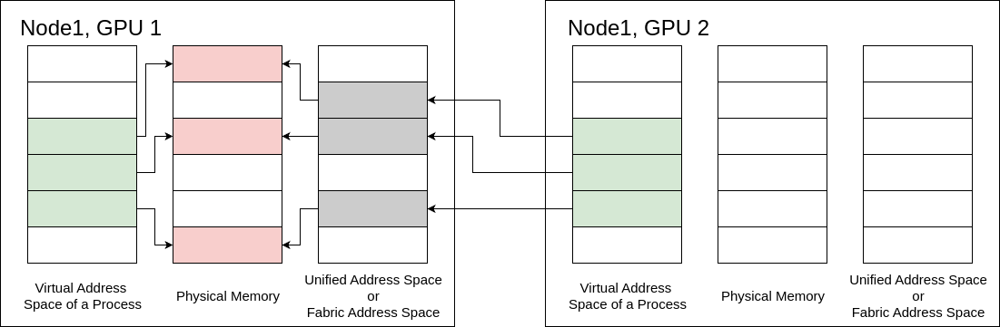

*图 56 单播内存共享示例*

#### 4.16.3.1. 分配和导出

**分配物理内存。** 使用虚拟内存管理 API 分配内存时，第一步是创建一个用作分配后备存储的物理内存块。应用程序必须使用 `cuMemCreate` API 分配物理内存。此函数创建的分配尚未映射到任何设备或主机地址。函数参数 `CUmemAllocationProp` 描述待分配内存的属性，例如分配位置、把分配共享给其他进程或图形 API 时使用的句柄类型，以及待分配内存的物理属性。用户必须确保请求的分配大小满足相应的粒度要求；可使用 `cuMemGetAllocationGranularity` 查询这些要求。

> [!NOTE]
> **原文勘误**
> Release 13.3 正文将上述属性参数误写为 `CUmemGenericAllocationHandle`。`cuMemCreate` 的实际属性参数类型是 `CUmemAllocationProp`；紧随其后的官方示例也以 `CUmemAllocationProp prop` 构造属性，并把 `&prop` 传给 `cuMemCreate`。

**操作系统特定句柄 (Linux)**

```cuda
CUmemGenericAllocationHandle allocatePhysicalMemory(int device, size_t size) {
    CUmemAllocationHandleType handleType = CU_MEM_HANDLE_TYPE_POSIX_FILE_DESCRIPTOR;
    CUmemAllocationProp prop = {};
    prop.type = CU_MEM_ALLOCATION_TYPE_PINNED;
    prop.location.type = CU_MEM_LOCATION_TYPE_DEVICE;
    prop.location.id = device;
    prop.requestedHandleType = handleType;

    size_t granularity = 0;
    cuMemGetAllocationGranularity(&granularity, &prop, CU_MEM_ALLOC_GRANULARITY_MINIMUM);

    // Ensure size matches granularity requirements for the allocation
    size_t padded_size = ROUND_UP(size, granularity);

    // Allocate physical memory
    CUmemGenericAllocationHandle allocHandle;
    cuMemCreate(&allocHandle, padded_size, &prop, 0);

    return allocHandle;
}
```

**Fabric 句柄**

```cuda
CUmemGenericAllocationHandle allocatePhysicalMemory(int device, size_t size) {
    CUmemAllocationHandleType handleType = CU_MEM_HANDLE_TYPE_FABRIC;
    CUmemAllocationProp prop = {};
    prop.type = CU_MEM_ALLOCATION_TYPE_PINNED;
    prop.location.type = CU_MEM_LOCATION_TYPE_DEVICE;
    prop.location.id = device;
    prop.requestedHandleType = handleType;

    size_t granularity = 0;
    cuMemGetAllocationGranularity(&granularity, &prop, CU_MEM_ALLOC_GRANULARITY_MINIMUM);

    // Ensure size matches granularity requirements for the allocation
    size_t padded_size = ROUND_UP(size, granularity);

    // Allocate physical memory
    CUmemGenericAllocationHandle allocHandle;
    cuMemCreate(&allocHandle, padded_size, &prop, 0);

    return allocHandle;
}
```

> [!NOTE]
> **说明**
> `cuMemCreate` 分配的内存由其返回的 `CUmemGenericAllocationHandle` 引用。请注意，该引用不是指针，此时内存也尚不可访问。

> [!NOTE]
> **说明**
> 可以使用 `cuMemGetAllocationPropertiesFromHandle` 查询分配句柄的属性。

**导出内存句柄。** CUDA 虚拟内存管理 API 提供了一种进程间通信机制，通过句柄交换分配及其物理地址空间所需的信息。可以导出操作系统专用 IPC 句柄或 Fabric IPC 句柄；前者只能用于单节点环境，后者既可用于单节点，也可用于多节点环境。

**操作系统特定句柄 (Linux)**

```cuda
CUmemAllocationHandleType handleType = CU_MEM_HANDLE_TYPE_POSIX_FILE_DESCRIPTOR;
CUmemGenericAllocationHandle handle = allocatePhysicalMemory(0, 1<<21);
int fd;
cuMemExportToShareableHandle(&fd, handle, handleType, 0);
```

**Fabric 句柄**

```cuda
CUmemAllocationHandleType handleType = CU_MEM_HANDLE_TYPE_FABRIC;
CUmemGenericAllocationHandle handle = allocatePhysicalMemory(0, 1<<21);
CUmemFabricHandle fh;
cuMemExportToShareableHandle(&fh, handle, handleType, 0);
```

> [!NOTE]
> **说明**
> 特定于操作系统的句柄要求所有进程都属于同一操作系统。

> [!NOTE]
> **说明**
> Fabric 句柄要求系统管理员启用 IMEX 通道。

[memMapIpcDrv](https://github.com/NVIDIA/cuda-samples/tree/master/Samples/3_CUDA_Features/memMapIPCDrv/) 示例可用作将 IPC 与 VMM 分配结合使用的示例。

#### 4.16.3.2. 共享和导入

**共享内存句柄。** 句柄导出后，必须通过进程间通信协议传递给一个或多个接收进程；开发者可以自行选择传递方式。具体 IPC 方法取决于应用程序的设计与环境，常见方式包括操作系统专用的进程间套接字和分布式消息传递。操作系统专用 IPC 传输性能高，但仅限同一台计算机上的进程，且不可移植；Fabric IPC 更简单、可移植性更好，但需要系统级支持。所选方法必须安全、可靠地把句柄数据传给目标进程，使其能够导入内存并建立有效映射。VMM API 因而可集成到从单节点应用到分布式多节点系统的多种架构中。以下代码分别给出通过套接字编程和 MPI 发送、接收句柄的示例。

**发送：特定于操作系统的 IPC (Linux)**

```cuda
int ipcSendShareableHandle(int socket, int fd, pid_t process) {
    struct msghdr msg;
    struct iovec iov[1];

    union {
        struct cmsghdr cm;
        char* control;
    } control_un;

    size_t sizeof_control = CMSG_SPACE(sizeof(int)) * sizeof(char);
    control_un.control = (char*) malloc(sizeof_control);

    struct cmsghdr *cmptr;
    ssize_t readResult;
    struct sockaddr_un cliaddr;
    socklen_t len = sizeof(cliaddr);

    // Construct client address to send this SHareable handle to
    memset(&cliaddr, 0, sizeof(cliaddr));
    cliaddr.sun_family = AF_UNIX;
    char temp[20];
    sprintf(temp, "%s%u", "/tmp/", process);
    strcpy(cliaddr.sun_path, temp);
    len = sizeof(cliaddr);

    // Send corresponding shareable handle to the client
    int sendfd = fd;

    msg.msg_control = control_un.control;
    msg.msg_controllen = sizeof_control;

    cmptr = CMSG_FIRSTHDR(&msg);
    cmptr->cmsg_len = CMSG_LEN(sizeof(int));
    cmptr->cmsg_level = SOL_SOCKET;
    cmptr->cmsg_type = SCM_RIGHTS;

    memmove(CMSG_DATA(cmptr), &sendfd, sizeof(sendfd));

    msg.msg_name = (void *)&cliaddr;
    msg.msg_namelen = sizeof(struct sockaddr_un);

    iov[0].iov_base = (void *)"";
    iov[0].iov_len = 1;
    msg.msg_iov = iov;
    msg.msg_iovlen = 1;

    ssize_t sendResult = sendmsg(socket, &msg, 0);
    if (sendResult <= 0) {
        perror("IPC failure: Sending data over socket failed");
        free(control_un.control);
        return -1;
    }

    free(control_un.control);
    return 0;
}
```

**发送：特定于操作系统的 IPC (WIN)**

```cuda
int ipcSendShareableHandle(HANDLE *handle, HANDLE &shareableHandle, PROCESS_INFORMATION process) {
    HANDLE hProcess = OpenProcess(PROCESS_DUP_HANDLE, FALSE, process.dwProcessId);
    HANDLE hDup = INVALID_HANDLE_VALUE;
    DuplicateHandle(GetCurrentProcess(), shareableHandle, hProcess, &hDup, 0, FALSE, DUPLICATE_SAME_ACCESS);
    DWORD cbWritten;
    WriteFile(handle->hMailslot[i], &hDup, (DWORD)sizeof(hDup), &cbWritten, (LPOVERLAPPED)NULL);
    CloseHandle(hProcess);
    return 0;
}
```

**发送：面料 IPC**

```cuda
MPI_Send(&fh, sizeof(CUmemFabricHandle), MPI_BYTE, 1, 0, MPI_COMM_WORLD);
```

**接收：特定于操作系统的 IPC (Linux)**

```cuda
int ipcRecvShareableHandle(int socket, int* fd) {
    struct msghdr msg = {0};
    struct iovec iov[1];
    struct cmsghdr cm;

    // Union to guarantee alignment requirements for control array
    union {
        struct cmsghdr cm;
        // This will not work on QNX as QNX CMSG_SPACE calls __cmsg_alignbytes
        // And __cmsg_alignbytes is a runtime function instead of compile-time macros
        // char control[CMSG_SPACE(sizeof(int))]
        char* control;
    } control_un;

    size_t sizeof_control = CMSG_SPACE(sizeof(int)) * sizeof(char);
    control_un.control = (char*) malloc(sizeof_control);
    struct cmsghdr *cmptr;
    ssize_t n;
    int receivedfd;
    char dummy_buffer[1];
    ssize_t sendResult;
    msg.msg_control = control_un.control;
    msg.msg_controllen = sizeof_control;

    iov[0].iov_base = (void *)dummy_buffer;
    iov[0].iov_len = sizeof(dummy_buffer);

    msg.msg_iov = iov;
    msg.msg_iovlen = 1;
    if ((n = recvmsg(socket, &msg, 0)) <= 0) {
        perror("IPC failure: Receiving data over socket failed");
        free(control_un.control);
        return -1;
    }

    if (((cmptr = CMSG_FIRSTHDR(&msg)) != NULL) &&
        (cmptr->cmsg_len == CMSG_LEN(sizeof(int)))) {
        if ((cmptr->cmsg_level != SOL_SOCKET) || (cmptr->cmsg_type != SCM_RIGHTS)) {
        free(control_un.control);
        return -1;
        }

        memmove(&receivedfd, CMSG_DATA(cmptr), sizeof(receivedfd));
        *fd = receivedfd;
    } else {
        free(control_un.control);
        return -1;
    }

    free(control_un.control);
    return 0;
}
```

**接收：特定于操作系统的 IPC (WIN)**

```cuda
int ipcRecvShareableHandle(HANDLE &handle, HANDLE *shareableHandle) {
    DWORD cbRead;
    ReadFile(handle, shareableHandle, (DWORD)sizeof(*shareableHandles), &cbRead, NULL);
    return 0;
}
```

**接收：Fabric IPC**

```cuda
MPI_Recv(&fh, sizeof(CUmemFabricHandle), MPI_BYTE, 1, 0, MPI_COMM_WORLD);
```

**导入内存句柄。** 同样，用户可以导入操作系统专用 IPC 句柄或 Fabric IPC 句柄。前者只能用于单节点，后者可用于单节点或多节点。

**操作系统特定句柄 (Linux)**

```cuda
CUmemAllocationHandleType handleType = CU_MEM_HANDLE_TYPE_POSIX_FILE_DESCRIPTOR;
cuMemImportFromShareableHandle(handle, (void*) &fd, handleType);
```

**Fabric 句柄**

```cuda
CUmemAllocationHandleType handleType = CU_MEM_HANDLE_TYPE_FABRIC;
cuMemImportFromShareableHandle(handle, (void*) &fh, handleType);
```

#### 4.16.3.3. 预留并映射

**保留虚拟地址范围**

由于地址和内存的概念在 VMM 中是不同的，因此应用程序必须划出一个可以容纳 `cuMemCreate` 进行的内存分配的地址范围。保留的地址范围必须至少与用户计划放入其中的所有物理内存分配的大小总和一样大。

应用程序可以通过将适当的参数传递给 `cuMemAddressReserve` 来保留虚拟地址范围。获取的地址范围不会有任何与其关联的设备或主机物理内存。保留的虚拟地址范围可以映射到属于系统中任何设备的内存块，从而为应用程序提供由属于不同设备的内存支持和映射的连续 VA 范围。应用程序应使用 `cuMemAddressFree` 将虚拟地址范围返回到 CUDA。用户必须确保在调用 `cuMemAddressFree` 之前取消映射整个 VA 范围。这些函数在概念上类似于 Linux 上的 `mmap` 和 `munmap` 或 Windows 上的 `VirtualAlloc` 和 `VirtualFree`。以下代码片段说明了该函数的用法：

```cpp
CUdeviceptr ptr;
// `ptr` holds the returned start of virtual address range reserved.
CUresult result = cuMemAddressReserve(&ptr, size, 0, 0, 0); // alignment = 0 for default alignment
```

**映射内存**

分配的物理内存和前两节中划分的虚拟地址空间表示 VMM API 引入的内存和地址区别。为了使分配的内存可用，用户必须将内存映射到地址空间。从 `cuMemAddressReserve` 获取的地址范围和从 `cuMemCreate` 或 `cuMemImportFromShareableHandle` 获取的物理分配必须使用 `cuMemMap` 相互关联。

只要用户划分出足够的地址空间，就可以将多个设备的分配关联起来，驻留在连续的虚拟地址范围内。为了解耦物理分配和地址范围，用户必须使用 `cuMemUnmap` 取消映射的地址。用户可以根据需要多次将内存映射和取消映射到同一地址范围，只要他们确保不会尝试在已映射的 VA 范围保留上创建映射即可。以下代码片段说明了该函数的用法：

```cpp
CUdeviceptr ptr;
// `ptr`: address in the address range previously reserved by cuMemAddressReserve.
// `allocHandle`: CUmemGenericAllocationHandle obtained by a previous call to cuMemCreate.
CUresult result = cuMemMap(ptr, size, 0, allocHandle, 0);
```

#### 4.16.3.4. 访问权

CUDA 的虚拟内存管理 API 使应用程序能够通过访问控制机制显式保护其 VA 范围。使用 `cuMemMap` 将分配映射到地址范围的区域不会使该地址可访问，并且如果由 CUDA 内核访问，则会导致程序崩溃。用户必须在源设备和访问设备上使用 `cuMemSetAccess` 函数专门选择访问控制。这允许或限制特定设备对映射地址范围的访问。以下代码片段说明了该函数的用法：

```cpp
void setAccessOnDevice(int device, CUdeviceptr ptr, size_t size) {
    CUmemAccessDesc accessDesc = {};
    accessDesc.location.type = CU_MEM_LOCATION_TYPE_DEVICE;
    accessDesc.location.id = device;
    accessDesc.flags = CU_MEM_ACCESS_FLAGS_PROT_READWRITE;

    // Make the address accessible
    cuMemSetAccess(ptr, size, &accessDesc, 1);
}
```

VMM 公开的访问控制机制允许用户明确他们想要与系统上的其他对等设备共享哪些分配。如前所述，`cudaEnablePeerAccess` 强制使用 `cudaMalloc` 进行的所有先前和未来分配映射到目标对等设备。这在许多情况下都很方便，因为用户不必担心跟踪每个分配到系统中每个设备的映射状态。但这种做法是[对性能有影响](https://devblogs.nvidia.com/introducing-low-level-gpu-virtual-memory-management/)。通过分配粒度的访问控制，VMM 允许以最小的开销进行对等映射。

`vectorAddMMAP` [样品](https://github.com/NVIDIA/cuda-samples/tree/master/Samples/0_Introduction/vectorAddMMAP) 可以用作使用虚拟内存管理 API 的示例。

#### 4.16.3.5. 释放内存

要释放分配的内存和地址空间，源进程和目标进程都应按顺序使用 `cuMemUnmap`、 `cuMemRelease` 和 `cuMemAddressFree` 函数。 `cuMemUnmap` 函数从地址范围取消映射先前映射的内存区域，从而有效地将物理内存从保留的虚拟地址空间中分离。接下来，`cuMemRelease` 释放之前创建的物理内存，将其返回给系统。最后，`cuMemAddressFree` 释放之前保留的虚拟地址范围，以供将来使用。此特定顺序可确保物理内存和虚拟地址空间的干净且完整的释放。

```cpp
cuMemUnmap(ptr, size);
cuMemRelease(handle);
cuMemAddressFree(ptr, size);
```

> [!NOTE]
> **说明**
> 对于操作系统专用句柄，必须使用 `fclose` 关闭导出的句柄；Fabric 句柄不需要此步骤。

### 4.16.4. 组播内存共享

[多播对象管理 API](https://docs.nvidia.com/cuda/cuda-driver-api/group__CUDA__MULTICAST.html#group__CUDA__MULTICAST) 为应用程序提供了创建多播对象的方法。将这些 API 与上述[虚拟内存管理 API](https://docs.nvidia.com/cuda/cuda-driver-api/group__CUDA__VA.html) 结合使用，应用程序便可在由 NVSwitch 互连且支持该功能的 NVLink 连接 GPU 上利用 NVLink SHARP。NVLink SHARP 通过结构内计算来加速这些 GPU 之间的广播和归约操作。为此，需要由多个 NVLink 连接的 GPU 组成一个多播组，并由组中的每个 GPU 使用本地物理内存为多播对象提供后备存储。因此，由 N 个 GPU 组成的多播组拥有多播对象的 N 个物理副本，每个参与 GPU 上各有一个本地副本。[multimem PTX 指令](https://docs.nvidia.com/cuda/parallel-thread-execution/index.html#data-movement-and-conversion-instructions-multimem) 通过多播对象映射对该对象的所有副本进行操作。

要使用多播对象，应用程序需要

- 查询多播支持。
- 使用 `cuMulticastCreate` 创建多播句柄。
- 与控制应参与多播组的 GPU 的所有进程共享多播句柄。如上所述，这与 `cuMemExportToShareableHandle` 一起使用。
- 使用 `cuMulticastAddDevice` 添加应参与多播组的所有 GPU。
- 对于每个参与的 GPU，将如上所述分配有 `cuMemCreate` 的物理内存绑定到多播句柄。在任何设备上绑定内存之前，需要将所有设备添加到多播组中。
- 保留地址范围、映射多播句柄并设置访问权限，如上面针对常规单播映射所述。单播和多播映射到相同的物理内存是可能的。请参阅 [虚拟别名支持](#section-4-16-5-3) 部分，了解如何确保到同一物理内存的多个映射之间的一致性。
- 将 [multimem PTX 指令](https://docs.nvidia.com/cuda/parallel-thread-execution/index.html#data-movement-and-conversion-instructions-multimem) 与多播映射结合使用。

[多种 GPU 编程模型](https://github.com/NVIDIA/multi-gpu-programming-models/) GitHub 仓库中的 `multi_node_p2p` 示例完整演示了如何使用 Fabric 内存（包括多播对象）来利用 NVLink SHARP。请注意，该示例面向 NCCL、NVSHMEM 等库的开发人员，用于展示 NVSHMEM 等高级编程模型在（多节点）NVLink 域内的底层工作方式。应用程序开发人员通常应使用更高层的 MPI、NCCL 或 NVSHMEM 接口，而不是直接使用此 API。

#### 4.16.4.1. 分配组播对象

可以使用 `cuMulticastCreate` 创建多播对象：

```cpp
CUmemGenericAllocationHandle createMCHandle(int numDevices, size_t size) {
    CUmemAllocationProp mcProp = {};
    mcProp.numDevices = numDevices;
    mcProp.handleTypes = CU_MEM_HANDLE_TYPE_FABRIC; // or on single node CU_MEM_HANDLE_TYPE_POSIX_FILE_DESCRIPTOR

    size_t granularity = 0;
    cuMulticastGetGranularity(&granularity, &mcProp, CU_MEM_ALLOC_GRANULARITY_MINIMUM);

    // Ensure size matches granularity requirements for the allocation
    size_t padded_size = ROUND_UP(size, granularity);

    mcProp.size = padded_size;

    // Create Multicast Object this has no devices and no physical memory associated yet
    CUmemGenericAllocationHandle mcHandle;
    cuMulticastCreate(&mcHandle, &mcProp);

    return mcHandle;
}
```

#### 4.16.4.2. 将设备添加到组播对象

可以使用 `cuMulticastAddDevice` 将设备添加到多播组中：

```cpp
cuMulticastAddDevice(&mcHandle, device);
```

在将任何设备上的内存绑定到多播对象之前，需要在参与多播组的所有控制设备的进程上完成此步骤。

#### 4.16.4.3. 将内存绑定到多播对象

创建多播对象并将所有参与设备添加到多播对象后，需要使用为每个设备分配 `cuMemCreate` 的物理内存进行支持：

```cpp
cuMulticastBindMem(mcHandle, mcOffset, memHandle, memOffset, size, 0 /*flags*/);
```

#### 4.16.4.4. 使用组播映射

要在 CUDA C++ 中使用多播映射，必须使用带有内联 PTX 的 [multimem PTX 指令](https://docs.nvidia.com/cuda/parallel-thread-execution/index.html#data-movement-and-conversion-instructions-multimem)：

```cpp
__global__ void all_reduce_norm_barrier_kernel(float* l2_norm,
                                               float* partial_l2_norm_mc,
                                               unsigned int* arrival_counter_uc, unsigned int* arrival_counter_mc,
                                               const unsigned int expected_count) {
    assert( 1 == blockDim.x * blockDim.y * blockDim.z * gridDim.x * gridDim.y * gridDim.z );
    float l2_norm_sum = 0.0;
#if __CUDA_ARCH__ >= 900

    // atomic reduction to all replicas
    // this can be conceptually thought of as __threadfence_system(); atomicAdd_system(arrival_counter_mc, 1);
    cuda::ptx::multimem_red(cuda::ptx::release_t, cuda::ptx::scope_sys_t, cuda::ptx::op_add_t, arrival_counter_mc, n);

    // Need a fence between Multicast (mc) and Unicast (uc) access to the same memory `arrival_counter_uc` and `arrival_counter_mc`:
    // - fence.proxy instructions establish an ordering between memory accesses that may happen through different proxies
    // - Value .alias of the .proxykind qualifier refers to memory accesses performed using virtually aliased addresses to the same memory location.
    // from https://docs.nvidia.com/cuda/parallel-thread-execution/#parallel-synchronization-and-communication-instructions-membar
    cuda::ptx::fence_proxy_alias();

    // spin wait with acquire ordering on UC mapping till all peers have arrived in this iteration
    // Note: all ranks need to reach another barrier after this kernel, such that it is not possible for the barrier to be unblocked by an
    // arrival of a rank for the next iteration if some other rank is slow.
    cuda::atomic_ref<unsigned int,cuda::thread_scope_system> ac(arrival_counter_uc);
    while (expected_count > ac.load(cuda::memory_order_acquire));

    // Atomic load reduction from all replicas. It does not provide ordering so it can be relaxed.
    asm volatile ("multimem.ld_reduce.relaxed.sys.global.add.f32 %0, [%1];" : "=f"(l2_norm_sum) : "l"(partial_l2_norm_mc) : "memory");

#else
    #error "ERROR: multimem instructions require compute capability 9.0 or larger."
#endif

    *l2_norm = std::sqrt(l2_norm_sum);
}
```

### 4.16.5. 高级配置

#### 4.16.5.1. 内存类型

VMM 还为应用程序提供了一种机制来分配某些设备可能支持的特殊类型的内存。借助 `cuMemCreate`，应用程序可以使用 `CUmemAllocationProp::allocFlags` 指定内存类型要求，以选择特定的内存功能。应用程序必须确保设备支持请求的内存类型。

#### 4.16.5.2. 可压缩内存

可压缩内存可用于加速对具有非结构化稀疏性和其他可压缩数据模式的数据的访问。压缩可以根据数据节省 DRAM 带宽、L2读取带宽和 L2容量。想要在支持计算数据压缩的设备上分配可压缩内存的应用程序可以通过将 `CUmemAllocationProp::allocFlags::compressionType` 设置为 `CU_MEM_ALLOCATION_COMP_GENERIC` 来实现。用户必须使用 `CU_DEVICE_ATTRIBUTE_GENERIC_COMPRESSION_SUPPORTED` 查询设备是否支持计算数据压缩。以下代码片段说明了使用 `cuDeviceGetAttribute` 查询可压缩内存支持。

```cpp
int compressionSupported = 0;
cuDeviceGetAttribute(&compressionSupported, CU_DEVICE_ATTRIBUTE_GENERIC_COMPRESSION_SUPPORTED, device);
```

在支持计算数据压缩的设备上，用户必须在分配时选择加入，如下所示：

```cpp
prop.allocFlags.compressionType = CU_MEM_ALLOCATION_COMP_GENERIC;
```

由于硬件资源有限等多种原因，分配可能不具有压缩属性。要验证标志是否有效，用户应使用 `cuMemGetAllocationPropertiesFromHandle` 查询分配的内存的属性。

```cpp
CUmemAllocationProp allocationProp = {};
cuMemGetAllocationPropertiesFromHandle(&allocationProp, allocationHandle);

if (allocationProp.allocFlags.compressionType == CU_MEM_ALLOCATION_COMP_GENERIC)
{
    // Obtained compressible memory allocation
}
```

#### 4.16.5.3. 虚拟别名支持

虚拟内存管理 API 允许使用不同虚拟地址多次调用 `cuMemMap`，为同一分配创建多个虚拟内存映射（或“代理”），这称为虚拟别名。除非 PTX ISA 另有说明，在执行写入的设备操作（网格启动、memcpy、memset 等）完成之前，通过一个代理完成的写入与同一内存的其他代理之间被视为不一致且不相干。即使某个网格在写入操作之前已经驻留于 GPU，只要它在写入操作完成后通过另一代理读取，也仍被视为使用不一致且不相干的代理。

例如，假设设备指针 A 和 B 是同一内存分配的虚拟别名，以下代码片段被视为未定义：

```cpp
__global__ void foo(char *A, char *B) {
  *A = 0x1;
  printf("%d\n", *B);    // Undefined behavior!  *B can take on either
// the previous value or some value in-between.
}
```

以下是定义的行为，假设这两个内核单调排序（按流或事件）。

```cpp
__global__ void foo1(char *A) {
  *A = 0x1;
}

__global__ void foo2(char *B) {
  printf("%d\n", *B);    // *B == *A == 0x1 assuming foo2 waits for foo1
// to complete before launching
}

cudaMemcpyAsync(B, input, size, stream1);    // Aliases are allowed at
// operation boundaries
foo1<<<1,1,0,stream1>>>(A);                  // allowing foo1 to access A.
cudaEventRecord(event, stream1);
cudaStreamWaitEvent(stream2, event);
foo2<<<1,1,0,stream2>>>(B);
cudaStreamWaitEvent(stream3, event);
cudaMemcpyAsync(output, B, size, stream3);  // Both launches of foo2 and
                                            // cudaMemcpy (which both
                                            // read) wait for foo1 (which writes)
                                            // to complete before proceeding
```

如果在同一个内核中需要通过不同的“代理”访问相同的分配，则可以在两次访问之间使用 `fence.proxy.alias`。因此，使用内联 PTX 汇编可以使上面的示例合法：

```cpp
__global__ void foo(char *A, char *B) {
  *A = 0x1;
  cuda::ptx::fence_proxy_alias();
  printf("%d\n", *B);    // *B == *A == 0x1
}
```

#### 4.16.5.4. IPC 的操作系统特定句柄详细信息

使用 `cuMemCreate`，用户可以在分配时指示他们已指定用于进程间通信或图形互操作目的的特定分配。应用程序可以通过将 `CUmemAllocationProp::requestedHandleTypes` 设置为特定于平台的字段来实现此目的。在 Windows 上，当 `CUmemAllocationProp::requestedHandleTypes` 设置为 `CU_MEM_HANDLE_TYPE_WIN32` 时，应用程序还必须在 `CUmemAllocationProp::win32HandleMetaData` 中指定 LPSECURITYATTRIBUTES 属性。此安全属性定义了导出的分配可以传输到其他进程的范围。

用户必须确保在尝试导出使用 `cuMemCreate` 分配的内存之前查询对请求的句柄类型的支持。以下代码片段以特定于平台的方式说明了对句柄类型支持的查询。

```cpp
int deviceSupportsIpcHandle;
#if defined(__linux__)
    cuDeviceGetAttribute(&deviceSupportsIpcHandle, CU_DEVICE_ATTRIBUTE_HANDLE_TYPE_POSIX_FILE_DESCRIPTOR_SUPPORTED, device));
#else
    cuDeviceGetAttribute(&deviceSupportsIpcHandle, CU_DEVICE_ATTRIBUTE_HANDLE_TYPE_WIN32_HANDLE_SUPPORTED, device));
#endif
```

用户应适当设置 `CUmemAllocationProp::requestedHandleTypes`，如下所示：

```cpp
#if defined(__linux__)
    prop.requestedHandleTypes = CU_MEM_HANDLE_TYPE_POSIX_FILE_DESCRIPTOR;
#else
    prop.requestedHandleTypes = CU_MEM_HANDLE_TYPE_WIN32;
    prop.win32HandleMetaData = // Windows specific LPSECURITYATTRIBUTES attribute.
#endif
```

---

## 4.17. 扩展 GPU 内存

*英文原题：Extended GPU Memory*  
*官方原文：[https://docs.nvidia.com/cuda/cuda-programming-guide/04-special-topics/extended-gpu-memory.html](https://docs.nvidia.com/cuda/cuda-programming-guide/04-special-topics/extended-gpu-memory.html)*

扩展 GPU 内存（EGM）功能利用高带宽 NVLink-C2C，使 GPU 能够在单节点和多节点系统中高效访问全部系统内存。EGM 适用于 NVIDIA 集成式 CPU-GPU 系统，允许配置中的任意 GPU 线程访问相应物理内存分配。所有 GPU 都能以 GPU-GPU NVLink 或 NVLink-C2C 的链路速度访问这些资源。

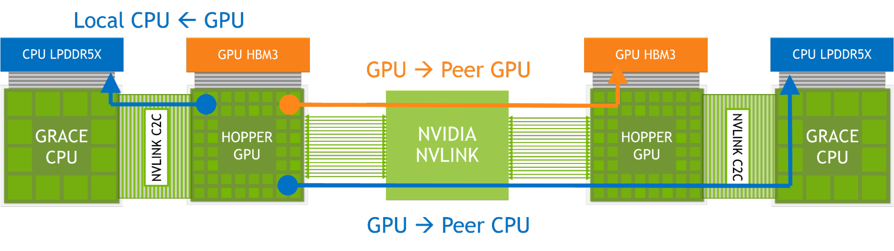

*EGM*

在这种配置中，节点内的内存访问通过高带宽 NVLink-C2C 进行；远程内存访问使用 GPU NVLink，在某些情况下也使用 NVLink-C2C。借助 EGM，GPU 线程可以通过 NVSwitch Fabric 访问所有可用内存资源，包括 CPU 附加内存和 HBM3。

### 4.17.1. 预备知识

在深入研究 EGM 功能的 API 更改之前，我们将介绍当前支持的拓扑、标识符分配、虚拟内存管理的先决条件以及 EGM 的 CUDA 类型。

#### 4.17.1.1. EGM 平台：系统拓扑

目前可在以下多种平台上启用 EGM：**(1) 单节点、单 GPU：** 由一个基于 Arm 的 CPU、CPU 附加内存和一个 GPU 组成，CPU 与 GPU 之间具有高带宽 C2C（芯片到芯片）互连。**(2) 单节点、多 GPU：** 由多个基于 Arm 的 CPU（每个 CPU 均配有附加内存）和多个通过 NVLink 网络连接的 GPU 组成。**(3) 多节点、多 GPU：** 由两个或更多上述 (1) 或 (2) 所示的单节点系统组成，各系统通过 NVLink 网络连接。

> [!NOTE]
> **说明**
> 使用 `cgroups` 限制可用设备将阻止通过 EGM 进行路由并导致性能问题。请改用 `CUDA_VISIBLE_DEVICES`。

#### 4.17.1.2. 处理器插槽标识符：含义与访问方法

NUMA（非一致性内存访问）是多处理器计算机系统使用的一种内存架构：系统内存被划分为多个节点，每个节点拥有自己的处理器和内存。系统会为每个 NUMA 节点分配唯一标识符（`numaID`）。

EGM 使用操作系统分配的 NUMA 节点标识符。请注意，该标识符不同于设备序号，它关联的是距离最近的主机节点。除现有方法外，用户还可调用 [cuDeviceGetAttribute](https://docs.nvidia.com/cuda/cuda-driver-api/group__CUDA__DEVICE.html#group__CUDA__DEVICE_1g9c3e1414f0ad901d3278a4d6645fc266)，并指定属性 `CU_DEVICE_ATTRIBUTE_HOST_NUMA_ID`，以获取主机节点标识符（`numaID`），如下所示：

```cpp
int numaId;
cuDeviceGetAttribute(&numaId, CU_DEVICE_ATTRIBUTE_HOST_NUMA_ID, deviceOrdinal);
```

#### 4.17.1.3. 分配器和 EGM 支持

把系统内存映射为 EGM 不会引入额外的性能问题。事实上，由于 EGM 保证流量经 NVLink 路由，访问映射为 EGM 的远程处理器插槽系统内存会更快。目前，`cuMemCreate` 和 `cudaMemPoolCreate` 分配器支持相应的位置类型与 NUMA 标识符。

#### 4.17.1.4. 对当前 API 的内存管理扩展

目前，可通过虚拟内存分配器（`cuMemCreate`）或流序内存分配器（`cudaMemPoolCreate`）映射 EGM 内存。用户负责分配物理内存，并将其映射到所有处理器插槽的虚拟地址空间。

> [!NOTE]
> **说明**
> 多节点、多 GPU 平台需要进程间通信，建议参阅[第 4.15 节](#section-4-15)。

> [!NOTE]
> **说明**
> 为便于理解，建议先阅读 CUDA 编程指南的[第 4.16 节](#section-4-16)和[第 4.3 节](#section-4-3)。

API 中添加了新的 CUDA 属性类型，允许这些方法使用类似 NUMA 的节点标识符来了解分配位置：

| **CUDA 类型** | **用于** |
| --- | --- |
| `CU_MEM_LOCATION_TYPE_HOST_NUMA` | `cuMemCreate` 的 `CUmemAllocationProp` |
| `cudaMemLocationTypeHostNuma` | `cudaMemPoolCreate` 的 `cudaMemPoolProps` |

> [!NOTE]
> **说明**
> 有关 NUMA 专用 CUDA 类型的更多信息，请参阅 [CUDA 驱动程序 API 数据类型](https://docs.nvidia.com/cuda/cuda-driver-api/group__CUDA__TYPES.html)和 [CUDA 运行时 API 数据类型](https://docs.nvidia.com/cuda/cuda-runtime-api/group__CUDART__TYPES.html)。

### 4.17.2. 使用 EGM 接口

#### 4.17.2.1. 单节点、单 GPU

现有的 CUDA 主机分配器和系统分配内存都能受益于高带宽 C2C。对用户而言，本地访问仍采用现有的主机分配方式。

> [!NOTE]
> **说明**
> 有关内存分配器和页大小的更多信息，请参阅调优指南。

#### 4.17.2.2. 单节点、多 GPU

在多 GPU 系统中，用户必须提供决定内存放置位置的主机信息。EGM 使用 NUMA 节点 ID 表达该信息；用户可以调用 `cuDeviceGetAttribute` 查询距离设备最近的 NUMA 节点 ID（参阅[处理器插槽标识符](#section-4-17-1-2)），再通过虚拟内存管理（VMM）API 或 CUDA 内存池分配和管理 EGM 内存。

##### 4.17.2.2.1. 使用 VMM API

使用虚拟内存管理 API 分配内存时，第一步是创建作为分配后备存储的物理内存块；详见[虚拟内存管理](#section-4-16)。对于 EGM 分配，用户必须显式把位置类型设为 `CU_MEM_LOCATION_TYPE_HOST_NUMA`，并把 `numaID` 用作位置标识符。分配大小还必须满足平台的相应粒度要求。以下代码使用 `cuMemCreate` 分配物理内存：

```cpp
CUmemAllocationProp prop{};
prop.type = CU_MEM_ALLOCATION_TYPE_PINNED;
prop.location.type = CU_MEM_LOCATION_TYPE_HOST_NUMA;
prop.location.id = numaId;
size_t granularity = 0;
cuMemGetAllocationGranularity(&granularity, &prop, MEM_ALLOC_GRANULARITY_MINIMUM);
size_t padded_size = ROUND_UP(size, granularity);
CUmemGenericAllocationHandle allocHandle;
cuMemCreate(&allocHandle, padded_size, &prop, 0);
```

分配物理内存后，还必须预留虚拟地址空间并把物理内存映射到该地址；这些步骤没有 EGM 专用的变化：

```cpp
CUdeviceptr dptr;
cuMemAddressReserve(&dptr, padded_size, 0, 0, 0);
cuMemMap(dptr, padded_size, 0, allocHandle, 0);
```

最后，用户必须为映射后的虚拟地址范围显式设置访问保护，否则访问该映射空间会导致崩溃。与内存分配类似，用户必须将 `CU_MEM_LOCATION_TYPE_HOST_NUMA` 作为位置类型，并将 `numaId` 作为位置标识符。以下代码片段为主机 NUMA 节点和 GPU 分别创建访问描述符，使二者都具有对映射内存的读写权限：

```cpp
CUmemAccessDesc accessDesc[2]{{}};
accessDesc[0].location.type = CU_MEM_LOCATION_TYPE_HOST_NUMA;
accessDesc[0].location.id = numaId;
accessDesc[0].flags = CU_MEM_ACCESS_FLAGS_PROT_READWRITE;
accessDesc[1].location.type = CU_MEM_LOCATION_TYPE_DEVICE;
accessDesc[1].location.id = currentDev;
accessDesc[1].flags = CU_MEM_ACCESS_FLAGS_PROT_READWRITE;
cuMemSetAccess(dptr, size, accessDesc, 2);
```

##### 4.17.2.2.2. 使用 CUDA 内存池

要通过内存池使用 EGM，用户可以在节点上创建内存池，并向对等设备授予访问权限。此时必须显式把位置类型设为 `cudaMemLocationTypeHostNuma`，并把 `numaId` 设为位置标识符。以下代码通过 `cudaMemPoolCreate` 创建内存池：

```cpp
cudaSetDevice(homeDevice);
cudaMemPoolProps props{};
props.allocType = cudaMemAllocationTypePinned;
props.location.type = cudaMemLocationTypeHostNuma;
props.location.id = numaId;
cudaMemPoolCreate(&memPool, &props);
```

对于直连对等访问，还可以使用现有的对等访问 API `cudaMemPoolSetAccess`。以下代码展示如何为 `accessingDevice` 授权：

```cpp
cudaMemAccessDesc desc{};
desc.flags = cudaMemAccessFlagsProtReadWrite;
desc.location.type = cudaMemLocationTypeDevice;
desc.location.id = accessingDevice;
cudaMemPoolSetAccess(memPool, &desc, 1);
```

创建内存池并授予访问权限后，可以把该内存池设为 `residentDevice` 的当前内存池，再通过 `cudaMallocAsync` 分配内存：

```cpp
cudaDeviceSetMemPool(residentDevice, memPool);
cudaMallocAsync(&ptr, size, memPool, stream);
```

> [!NOTE]
> **说明**
> EGM 映射使用 2 MB 页。因此，访问很大的分配时可能产生更多 TLB 未命中。

#### 4.17.2.3. 多节点、多 GPU

除内存分配外，远程对等访问没有 EGM 专用的变化，并遵循 CUDA 进程间通信（IPC）协议。有关 IPC 的详细信息，请参阅[进程间通信](#section-4-15)。

用户应使用 `cuMemCreate` 分配内存，并再次显式指定 `CU_MEM_LOCATION_TYPE_HOST_NUMA` 作为位置类型、`numaID` 作为位置标识符。此外，还应将 `CU_MEM_HANDLE_TYPE_FABRIC` 指定为所请求的句柄类型。以下代码片段展示了如何在节点 A 上分配物理内存：

```cpp
CUmemAllocationProp prop{};
prop.type = CU_MEM_ALLOCATION_TYPE_PINNED;
prop.requestedHandleTypes = CU_MEM_HANDLE_TYPE_FABRIC;
prop.location.type = CU_MEM_LOCATION_TYPE_HOST_NUMA;
prop.location.id = numaId;
size_t granularity = 0;
cuMemGetAllocationGranularity(&granularity, &prop,
                              MEM_ALLOC_GRANULARITY_MINIMUM);
size_t padded_size = ROUND_UP(size, granularity);
size_t page_size = ...;
assert(padded_size % page_size == 0);
CUmemGenericAllocationHandle allocHandle;
cuMemCreate(&allocHandle, padded_size, &prop, 0);
```

使用 `cuMemCreate` 创建分配句柄后，用户可以调用 `cuMemExportToShareableHandle`，将该句柄导出到另一个节点（节点 B）：

```cpp
cuMemExportToShareableHandle(&fabricHandle, allocHandle,
                             CU_MEM_HANDLE_TYPE_FABRIC, 0);
// At this point, fabricHandle should be sent to Node B via TCP/IP.
```

在节点 B 上，可以使用 `cuMemImportFromShareableHandle` 导入该句柄；之后可像使用其他 Fabric 句柄一样使用它：

```cpp
// At this point, fabricHandle should be received from Node A via TCP/IP.
CUmemGenericAllocationHandle allocHandle;
cuMemImportFromShareableHandle(&allocHandle, &fabricHandle,
                               CU_MEM_HANDLE_TYPE_FABRIC);
```

在节点 B 导入句柄后，用户可以按常规方式预留地址空间并在本地建立映射：

```cpp
size_t granularity = 0;
cuMemGetAllocationGranularity(&granularity, &prop,
                              MEM_ALLOC_GRANULARITY_MINIMUM);
size_t padded_size = ROUND_UP(size, granularity);
size_t page_size = ...;
assert(padded_size % page_size == 0);
CUdeviceptr dptr;
cuMemAddressReserve(&dptr, padded_size, 0, 0, 0);
cuMemMap(dptr, padded_size, 0, allocHandle, 0);
```

作为最后一步，用户应该为节点 B 上的每个本地 GPU 提供适当的访问权限。示例代码片段为八个本地 GPU 提供读写访问权限：

```cpp
// Give all 8 local  GPUS access to exported EGM memory located on Node A.                                                               |
CUmemAccessDesc accessDesc[8];
for (int i = 0; i < 8; i++) {
   accessDesc[i].location.type = CU_MEM_LOCATION_TYPE_DEVICE;
   accessDesc[i].location.id = i;
   accessDesc[i].flags = CU_MEM_ACCESS_FLAGS_PROT_READWRITE;
}
cuMemSetAccess(dptr, size, accessDesc, 8);
```

---

## 4.18. CUDA 动态并行

*英文原题：CUDA Dynamic Parallelism*  
*官方原文：[https://docs.nvidia.com/cuda/cuda-programming-guide/04-special-topics/dynamic-parallelism.html](https://docs.nvidia.com/cuda/cuda-programming-guide/04-special-topics/dynamic-parallelism.html)*

### 4.18.1. 简介

#### 4.18.1.1. 概述

CUDA 动态并行（通常缩写为 CDP）是 CUDA 编程模型的一项功能，允许 GPU 上运行的代码创建新的 GPU 工作。换言之，已经在 GPU 上运行的设备代码可以通过额外的内核启动来添加工作。由于设备线程能够在运行时决定启动配置，因此此功能可减少主机与设备之间传递执行控制和数据的需要。

数据相关的并行工作可以由内核在运行时生成。在将 CDP 添加到 CUDA 之前，需要修改一些算法和编程模式以消除递归、不规则循环结构或其他不适合平坦、单级并行性的构造。这些程序结构可以使用 CUDA 动态并行更自然地表达。

> [!NOTE]
> **说明**
> 本节介绍新版 CUDA 动态并行（有时称为 CDP2），它是 CUDA 12.0 及以上版本的默认实现。计算能力 9.0 及以上的设备只能使用 CDP2。对于计算能力低于 9.0 的设备，开发人员仍可通过编译器参数 -DCUDA_FORCE_CDP1_IF_SUPPORTED 选择旧版 CDP1。CDP1 的文档见 [CUDA 编程指南旧版本](https://developer.nvidia.com/cuda-toolkit-archive)。未来的 CUDA 版本预计会移除 CDP1。

### 4.18.2. 执行环境

CUDA 动态并行允许 GPU 线程配置、启动并隐式同步新的网格。网格是一次内核启动的实例，其中包括线程块的具体形状以及由这些线程块组成的网格形状。理解内核函数本身与该内核的一次具体调用（即一个网格）之间的区别，对阅读以下各节十分重要。

#### 4.18.2.1. 父网格与子网格

配置和启动新网格的设备线程属于父网格。由调用创建的新网格称为子网格。

子网格的调用与完成严格嵌套：父网格只有在其线程创建的所有子网格都完成后才视为完成，运行时会保证父网格与子网格之间的隐式同步。

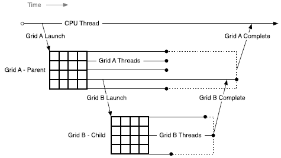

*图 57 父网格与子网格的启动嵌套关系*

#### 4.18.2.2. CUDA 原语的范围

CUDA 动态并行依赖 [CUDA 设备运行时](#section-5-6-4)。设备运行时提供一组可从设备代码调用的有限 API，其语法与 CUDA 运行时 API 相似。设备运行时 API 的行为与对应的主机 API 大体一致，但仍有一些差异；[API 参考](#section-5-6-4-6)中的表格汇总了这些差异。

在主机和设备上，CUDA 运行时都提供了 API，用于启动内核以及通过流和事件跟踪启动之间的依赖关系。在设备上，启动的内核和 CUDA 对象对于调用网格中的所有线程都是可见的。这意味着，例如，流可以由一个线程创建，并由同一网格中的任何其他线程使用。但是，由设备 API 调用创建的 CUDA 对象（例如流和事件）仅在创建它们的网格内有效。

#### 4.18.2.3. 流和事件

CUDA *流*和*事件*可用于控制内核启动之间的依赖关系：启动到同一流中的内核按顺序执行，事件则可用于建立流间依赖。在设备端创建的流和事件具有相同用途。

网格中创建的流和事件具有网格作用域；在创建它们的网格之外使用会导致未定义行为。如上所述，网格退出时会隐式同步该网格启动的全部工作，其中包括提交到流中的工作，并正确解析所有依赖关系。在流所属网格的作用域之外修改该流中的操作，同样会导致未定义行为。

在主机上创建的流和事件在任何内核中使用时具有未定义的行为，就像父网格创建的流和事件在子网格中使用时具有未定义的行为一样。

#### 4.18.2.4. 顺序约束和并发

设备运行时发起的内核启动遵循 CUDA 流的顺序语义。在一个网格中，所有启动到同一流的内核（启动到[即发即弃流](#section-5-6-4-8-2)的内核除外）都会按顺序执行。当同一网格中的多个线程向同一流启动内核时，流中的顺序取决于这些线程在网格内的调度顺序；可以使用 `__syncthreads()` 等同步原语控制该顺序。

请注意，命名流由网格中的所有线程共享，而隐式 *NULL* 流只在线程块内共享。同一线程块中的多个线程向隐式流启动工作时，这些启动按顺序执行；不同线程块中的线程向各自的隐式流启动工作时，则可能并发执行。若要由同一线程块中的多个线程发起并发启动，应使用显式命名的流。

设备运行时在 CUDA 执行模型中没有引入新的并发保证。也就是说，不能保证设备上任意数量的不同线程块之间的并发执行。

父网格与其子网格之间同样不保证并发执行。当父网格启动子网格后，只要满足流依赖关系且硬件资源可用，子网格便可能开始执行；但在父网格到达隐式同步点之前，并不保证子网格一定开始执行。

并发可能会根据设备配置、应用程序工作负载和运行时调度而变化。因此，依赖于不同线程块之间的任何并发都是不安全的。

### 4.18.3. 内存一致性

父网格与子网格共享同一全局内存和常量内存，但各自拥有不同的局部内存和共享内存。下表列出父网格与子网格可通过同一指针访问的内存空间。子网格不能访问父网格的局部内存或共享内存，反之亦然。

**表 26 动态并行：父网格与子网格之间的内存空间可访问性**

| 内存空间 | 父/子使用相同的指针？ |
| --- | --- |
| 全局内存 | 是 |
| 映射内存 | 是 |
| 局部内存 | 否 |
| 共享内存 | 否 |
| 纹理内存 | 是（只读） |

#### 4.18.3.1. 全局内存

父网格和子网格都能一致地访问全局内存，但二者之间只提供较弱的一致性保证。子网格执行期间，其内存视图只有在一个时刻保证与父线程完全一致：父线程调用子网格时。

在调用子网格之前，父线程中的所有全局内存操作对于子网格都是可见的。删除 `cudaDeviceSynchronize()` 后，不再可能从父网格访问子网格中的线程所做的修改。在父网格退出之前访问子网格中的线程所做的修改的唯一方法是通过启动到 `cudaStreamTailLaunch` 流中的内核。

在以下示例中，执行 `child_launch` 的子网格只保证看到启动前对 `data` 所做的修改。由于由父网格的线程 0 发起启动，子网格的内存视图与该线程启动时的视图一致。第一个 `__syncthreads()` 使子网格能够看到 `data[0]=0`、`data[1]=1`、…、`data[255]=255`；如果没有这次同步，则只保证它能看到 `data[0]=0`。子网格所做的修改只保证在隐式同步点后可见，因此不能保证父网格中的线程能直接看到这些修改。若要在父网格退出前访问 `child_launch` 的结果，可把 `tail_launch` 内核启动到 `cudaStreamTailLaunch` 流中。

```cpp
__global__ void tail_launch(int *data) {
   data[threadIdx.x] = data[threadIdx.x]+1;
}

__global__ void child_launch(int *data) {
   data[threadIdx.x] = data[threadIdx.x]+1;
}

__global__ void parent_launch(int *data) {
   data[threadIdx.x] = threadIdx.x;

   __syncthreads();

   if (threadIdx.x == 0) {
       child_launch<<< 1, 256 >>>(data);
       tail_launch<<< 1, 256, 0, cudaStreamTailLaunch >>>(data);
   }
}

void host_launch(int *data) {
    parent_launch<<< 1, 256 >>>(data);
}
```

#### 4.18.3.2. 映射内存

映射系统内存提供与全局内存相同的一致性保证，并遵循上述语义。内核不能分配或释放映射内存，但可以使用主机程序传入的映射内存指针。

#### 4.18.3.3. 共享和局部内存

共享内存属于线程块私有，局部内存属于线程私有；二者在父网格与子网格之间既不可见，也不保证一致性。若在对象所属作用域之外引用这些内存中的对象，会导致未定义行为，并可能触发错误。

如果 NVIDIA 编译器检测到指向局部内存或共享内存的指针被作为内核启动参数传递，它会尽可能发出警告。在运行时，程序员可以使用 `__isGlobal()` 内建函数判断某个指针是否指向全局内存，从而确定能否将其安全地传递给子级启动。

对 `cudaMemcpy*Async()` 或 `cudaMemset*Async()` 的调用可能会调用设备上的新子内核，以便保留流语义。因此，将共享或局部内存指针传递给这些 API 是非法的，并将返回错误。

#### 4.18.3.4. 局部内存

局部内存是执行线程的私有存储，并且在该线程外部不可见。启动子内核时，将指针传递给局部内存作为启动参数是非法的。从子网格取消引用此类局部内存指针的结果是未定义的。

例如，如果 `child_launch` 访问 `x_array`，则以下内容是非法的，具有未定义的行为：

```cpp
int x_array[10];       // Creates x_array in parent's local memory
child_launch<<< 1, 1 >>>(x_array);
```

有时，程序员很难意识到编译器何时将变量放入局部内存中。作为一般规则，传递给子内核的所有存储都应从全局内存堆中显式分配，可以使用 `cudaMalloc()`、 `new()` 或通过在全局范围声明 `__device__` 存储。例如：

```cpp
// Correct - "value" is global storage
__device__ int value;
__device__ void x() {
    value = 5;
    child<<< 1, 1 >>>(&value);
}
```

```cpp
// Invalid - "value" is local storage
__device__ void y() {
    int value = 5;
    child<<< 1, 1 >>>(&value);
}
```

##### 4.18.3.4.1. 纹理内存

对映射到纹理的全局内存区域进行写入时，该写入与纹理访问之间不保证一致性。系统会在调用子网格时以及子网格完成时强制建立纹理内存一致性。因此，启动子内核前对内存的写入会反映在子网格的纹理访问中；但与全局内存的情况相同，不保证子网格的写入会反映在父网格的纹理访问中。若要在父网格退出前访问子网格线程所做的修改，只能通过启动到 `cudaStreamTailLaunch` 流中的内核完成。父网格与子网格并发访问可能导致数据不一致。

### 4.18.4. 编程接口

#### 4.18.4.1. 基础知识

以下示例显示了一个包含动态并行的简单 *你好世界* 程序：

```cpp
#include <stdio.h>

__global__ void childKernel()
{
    printf("Hello ");
}

__global__ void tailKernel()
{
    printf("World!\n");
}

__global__ void parentKernel()
{
    // launch child
    childKernel<<<1,1>>>();
    if (cudaSuccess != cudaGetLastError()) {
        return;
    }

    // launch tail into cudaStreamTailLaunch stream
    // implicitly synchronizes: waits for child to complete
    tailKernel<<<1,1,0,cudaStreamTailLaunch>>>();

}

int main(int argc, char *argv[])
{
    // launch parent
    parentKernel<<<1,1>>>();
    if (cudaSuccess != cudaGetLastError()) {
        return 1;
    }

    // wait for parent to complete
    if (cudaSuccess != cudaDeviceSynchronize()) {
        return 2;
    }

    return 0;
}
```

该程序可以通过命令行一步构建，如下所示：

```text
$ nvcc -arch=sm_75 -rdc=true hello_world.cu -o hello -lcudadevrt
```

#### 4.18.4.2. CDP 的 C++ 语言接口

CUDA C++ 中供动态并行内核使用的语言接口和 API 统称为 [CUDA 设备运行时](#section-5-6-4)。

在可能的情况下，保留了 CUDA 运行时 API 的语法和语义，以便于轻松地重用可在主机或设备环境中运行的例程的代码。

与 CUDA C++ 中的所有代码一样，此处介绍的 API 和代码都按线程执行。因此，每个线程都可以独立、动态地决定接下来启动哪个内核或执行哪项操作。块内线程在调用任何设备运行时 API 时都无需彼此同步，所以这些 API 可以在内核代码的任意分支中调用，而不会导致死锁。

##### 4.18.4.2.1. 设备侧内核启动

内核可以在设备端使用标准 CUDA 三重尖括号语法（`<<< >>>`）启动：

```cpp
kernel_name<<< Dg, Db, Ns, S >>>([kernel arguments]);
```

- `Dg` 的类型为 `dim3`，指定网格的维度和大小。
- `Db` 的类型为 `dim3`，指定各线程块的维度和大小。
- `Ns` 的类型为 `size_t`，指定除静态分配部分之外，本次调用为每个线程块动态分配的共享内存字节数。`Ns` 为可选参数，默认为 0。
- `S` 的类型为 `cudaStream_t`，指定与本次调用关联的流。该流必须在发起调用的同一网格中创建。`S` 为可选参数，默认为 NULL 流。

###### 4.18.4.2.1.1. 启动为异步操作

与主机端启动一样，所有设备端内核启动相对于发起启动的线程都是异步的。也就是说，`<<<>>>` 启动命令会立即返回，发起启动的线程将继续执行，直至到达隐式启动同步点；将内核启动到 `cudaStreamTailLaunch` 流（[尾部启动流](#section-5-6-4-8-3)）便是一个示例。子网格在启动后随时都可能开始执行，但在发起启动的线程到达隐式启动同步点之前，并不保证子网格一定开始执行。

与主机端启动类似，提交到不同流中的工作可能并发运行，但不保证实际并发。CUDA 编程模型不支持依赖子内核并发执行的程序；此类程序会产生未定义行为。

###### 4.18.4.2.1.2. 启动环境配置

所有全局设备配置设置都会从父网格继承，例如 `cudaDeviceGetCacheConfig()` 返回的共享内存和 L1 缓存配置，以及 `cudaDeviceGetLimit()` 返回的设备限制。同样，堆栈大小等设备限制也会保持其配置状态。

对于主机启动的内核，从主机设置的每个内核配置将优先于全局设置。当从设备启动内核时，也会使用这些配置。无法从设备重新配置内核的环境。

##### 4.18.4.2.2. 事件

CUDA 事件只支持流间同步功能。因此，设备运行时支持 `cudaStreamWaitEvent()`，但不支持 `cudaEventSynchronize()`、`cudaEventElapsedTime()` 和 `cudaEventQuery()`。由于不支持 `cudaEventElapsedTime()`，必须通过 `cudaEventCreateWithFlags()` 创建 cudaEvents，并传入 `cudaEventDisableTiming` 标志。

与流一样，事件对象可由创建它的网格中的所有线程共享，但只在该网格内有效，不能传给其他内核。事件句柄不保证在网格之间唯一，因此在创建它的网格之外使用会导致未定义行为。

##### 4.18.4.2.3. 同步

如果调用线程需要与其他线程启动的子网格同步，程序必须自行执行充分的线程间同步，例如使用 CUDA 事件。

由于无法从父线程显式同步子工作，因此无法保证子网格中发生的更改对于父网格内的线程可见。

##### 4.18.4.2.4. 设备管理

内核只能控制其运行所在的设备。这意味着设备运行时不支持 `cudaSetDevice()` 等设备 API。从 GPU 端看到的活动设备（由 `cudaGetDevice()` 返回）与从主机系统看到的设备使用相同编号。由于 `cudaDeviceGetAttribute()` 允许将设备 ID 作为调用参数，因此可以用它查询另一设备的信息。请注意，设备运行时不提供汇总所有属性的 `cudaGetDeviceProperties()` API，必须逐项查询属性。

### 4.18.5. 编程指南

#### 4.18.5.1. 性能

##### 4.18.5.1.1. 启用动态并行性的内核开销

管理动态启动的系统软件在处于活动状态时，可能给当时运行的任何内核带来开销，无论该内核本身是否发起内核启动。这项开销来自设备运行时的执行跟踪与管理逻辑，可能降低性能。通常，只要应用程序链接了设备运行时库，就会产生这项开销。

#### 4.18.5.2. 实现限制

动态并行保证本文档描述的全部语义，但部分硬件和软件资源依赖具体实现，从而限制使用设备运行时的程序规模、性能及其他属性。

##### 4.18.5.2.1. 运行时

###### 4.18.5.2.1.1. 内存占用量

设备运行时系统软件会为多种管理用途预留内存，尤其用于跟踪待处理的网格启动。可以通过配置选项减小预留量，但会相应限制某些启动行为。有关详细信息，请参阅下文[配置选项](#section-5-6-4-2-1)。

###### 4.18.5.2.1.2. 待处理的内核启动

内核启动后，系统会持续跟踪相关配置和参数数据，直至内核完成。这些数据存放在系统管理的启动池中。

固定大小启动池的大小可通过从主机调用 `cudaDeviceSetLimit()` 并指定 `cudaLimitDevRuntimePendingLaunchCount` 进行配置。

#### 4.18.5.3. 兼容性和互操作性

CDP2 是默认值。可以使用 `-DCUDA_FORCE_CDP1_IF_SUPPORTED` 编译函数，以在计算能力小于 9.0 的设备上选择不使用 CDP2。

|  | 使用 CUDA 12.0 及更高版本编译的函数（默认） | 使用 CUDA 12.0 之前的版本编译，或使用 CUDA 12.0 及更高版本并指定 `-DCUDA_FORCE_CDP1_IF_SUPPORTED` 编译的函数 |
| --- | --- | --- |
| 编译 | 如果设备代码引用 `cudaDeviceSynchronize`，则编译错误。 | 如果代码引用 `cudaStreamTailLaunch` 或 `cudaStreamFireAndForget`，则会出现编译错误。如果设备代码引用 `cudaDeviceSynchronize` 并且代码是为 sm_90 或更高版本编译的，则会出现编译错误。 |
| 计算能力 < 9.0 | 使用新界面。 | 使用旧版接口。 |
| 计算能力 9.0 及更高版本 | 使用新接口。 | 使用新接口。如果函数在设备代码中引用 `cudaDeviceSynchronize`，则加载该函数时返回 `cudaErrorSymbolNotFound`（例如，代码面向计算能力低于 9.0 的设备编译，却通过 JIT 在计算能力 9.0 或更高的设备上运行时，可能出现这种情况）。 |

使用 CDP1 和 CDP2 的函数可以在同一上下文中同时加载和运行。CDP1 函数可以使用 CDP1 专用功能（例如 `cudaDeviceSynchronize`），CDP2 函数则可以使用 CDP2 专用功能（例如尾部启动和即发即弃启动）。

使用 CDP1 的函数不能启动使用 CDP2 的函数，反之亦然。如果某个 CDP1 函数的调用图包含 CDP2 函数，或 CDP2 函数的调用图包含 CDP1 函数，加载函数时会产生 `cudaErrorCdpVersionMismatch`。

本文档不再介绍旧版 CDP1 的行为。有关 CDP1 的信息，请参阅 [CUDA 编程指南的旧版本](https://developer.nvidia.com/cuda-toolkit-archive)。

### 4.18.6. PTX 设备端启动

前几节讨论了如何使用 [CUDA 设备运行时](#section-5-6-4)实现动态并行。动态并行也可以直接从 PTX 发起。对于以*并行线程执行*（PTX）为目标，并计划在其语言中支持*动态并行*的语言与编译器实现者，本节给出在 PTX 层支持内核启动所需的底层细节。

#### 4.18.6.1. 内核启动 API

可以使用以下两个 PTX API 实现设备端内核启动：`cudaLaunchDevice()` 和 `cudaGetParameterBuffer()`。`cudaLaunchDevice()` 使用通过 `cudaGetParameterBuffer()` 获取并填入内核启动参数的参数缓冲区来启动指定内核。如果启动的内核没有任何参数，则参数缓冲区可以为 `NULL`，此时无需调用 `cudaGetParameterBuffer()`。

##### 4.18.6.1.1. cudaLaunchDevice

在 PTX 层，使用 `cudaLaunchDevice()` 前必须按以下两种形式之一进行声明。

```cpp
// PTX-level Declaration of cudaLaunchDevice() when .address_size is 64
.extern .func(.param .b32 func_retval0) cudaLaunchDevice
(
  .param .b64 func,
  .param .b64 parameterBuffer,
  .param .align 4 .b8 gridDimension[12],
  .param .align 4 .b8 blockDimension[12],
  .param .b32 sharedMemSize,
  .param .b64 stream
)
;
```

下面的 CUDA 层声明映射到上述某一种 PTX 层声明，可在系统头文件 `cuda_device_runtime_api.h` 中找到。该函数定义在 `cudadevrt` 系统库中；程序必须链接此库，才能使用设备端内核启动功能。

```cpp
// CUDA-level declaration of cudaLaunchDevice()
extern "C" __device__
cudaError_t cudaLaunchDevice(void *func, void *parameterBuffer,
                             dim3 gridDimension, dim3 blockDimension,
                             unsigned int sharedMemSize,
                             cudaStream_t stream);
```

第一个参数是指向待启动内核的指针，第二个参数是保存该内核实参的参数缓冲区。下文[参数缓冲区布局](#section-4-18-6-2)介绍了该缓冲区的布局。其余参数指定启动配置，包括网格维度、块维度、共享内存大小以及与启动关联的流；有关详细说明，请参阅[内核配置](#section-5-4-3)。

##### 4.18.6.1.2. cudaGetParameterBuffer

`cudaGetParameterBuffer()` 在使用之前需要在 PTX 级别声明。 PTX 级声明必须采用下面给出的两种形式之一，具体取决于地址大小：

```cpp
// PTX-level Declaration of cudaGetParameterBuffer() when .address_size is 64
.extern .func(.param .b64 func_retval0) cudaGetParameterBuffer
(
  .param .b64 alignment,
  .param .b64 size
)
;
```

以下 `cudaGetParameterBuffer()` 的 CUDA 级别声明映射到前面提到的 PTX 级别声明：

```cpp
// CUDA-level Declaration of cudaGetParameterBuffer()
extern "C" __device__
void *cudaGetParameterBuffer(size_t alignment, size_t size);
```

第一个参数指定参数缓冲区的对齐要求，第二个参数指定大小要求（以字节为单位）。在当前实现中，`cudaGetParameterBuffer()` 返回的参数缓冲区始终保证为 64 字节对齐，并且忽略对齐要求参数。但是，建议将正确的对齐要求值（这是要放置在参数缓冲区中的任何参数的最大对齐方式）传递给 `cudaGetParameterBuffer()` 以确保将来的可移植性。

#### 4.18.6.2. 参数缓冲区布局

禁止参数缓冲区中的参数重新排序，并且放置在参数缓冲区中的每个单独的参数都需要对齐。也就是说，每个参数必须放置在参数缓冲区中的第 *n* 个字节处，其中 *n* 是参数大小的最小倍数，该大小大于前一个参数所取的最后一个字节的偏移量。参数缓冲区的最大大小为 4KB。

有关 CUDA 编译器生成的 PTX 代码的更详细说明，请参阅 PTX-3.5 规范。

---

## 4.19. CUDA 与其他 API 的互操作

*英文原题：CUDA Interoperability with APIs*  
*官方原文：[https://docs.nvidia.com/cuda/cuda-programming-guide/04-special-topics/graphics-interop.html](https://docs.nvidia.com/cuda/cuda-programming-guide/04-special-topics/graphics-interop.html)*

通过 CUDA 直接访问由其他 API 管理的 GPU 数据，可以使用 CUDA 内核读写这些数据，从而在继续使用其他 API 的同时利用 CUDA 功能。主要有两种机制：一是与 OpenGL 和 Direct3D 9–11 配合的直接[图形互操作](#section-4-19-1)，它将 OpenGL 或 Direct3D 资源映射到 CUDA 地址空间；二是更灵活的[外部资源互操作](#section-4-19-2)，它通过导入和导出操作系统级句柄来访问内存对象和同步对象。Direct3D 11–12、Vulkan 和 NVIDIA Software Communication Interface（NvSci）均支持后一种机制。

### 4.19.1. 图形互操作性

在 CUDA 中访问 Direct3D 或 OpenGL 资源（例如 VBO，即顶点缓冲区对象）之前，必须先注册并映射该资源。使用相应的 CUDA 函数注册资源（见下文示例）时，会返回一个 `struct cudaGraphicsResource` 类型的 CUDA 图形资源句柄；通过该句柄可取得 CUDA 设备指针或数组。内核要访问其中的设备数据，必须先映射资源。资源注册后，可以按需多次映射和取消映射。对于缓冲区，可通过 `cudaGraphicsResourceGetMappedPointer()` 获取映射后的设备内存地址；对于 CUDA 数组，则使用 `cudaGraphicsSubResourceGetMappedArray()`。CUDA 不再需要该资源时，即可将其注销。

主要步骤如下：

1. 使用 CUDA 注册图形缓冲区
2. 映射资源
3. 访问映射资源的设备指针或数组
4. 在 CUDA 内核中使用设备指针或数组
5. 取消资源映射
6. 取消注册资源

注册资源的开销很高，因此理想情况下每个资源只注册一次。不过，每个需要使用该资源的 CUDA 上下文都必须分别注册。可调用 `cudaGraphicsResourceSetMapFlags()` 指定只写、只读等使用提示，供 CUDA 驱动程序优化资源管理。还应注意，资源处于映射状态时，若通过 OpenGL、Direct3D 或其他 CUDA 上下文访问它，将产生未定义结果。

#### 4.19.1.1. OpenGL 互操作性

可以映射到 CUDA 地址空间的 OpenGL 资源是 OpenGL 缓冲区、纹理和渲染缓冲区对象。缓冲区对象是使用 `cudaGraphicsGLRegisterBuffer()` 注册的，在 CUDA 中，它显示为普通的设备指针。纹理或渲染缓冲区对象使用 `cudaGraphicsGLRegisterImage()` 注册，在 CUDA 中，它显示为 CUDA 数组。

如果纹理或渲染缓冲区对象使用 `cudaGraphicsRegisterFlagsSurfaceLoadStore` 标志注册，则可对其进行写入。`cudaGraphicsGLRegisterImage()` 支持所有具有 1、2 或 4 个分量，且内部类型为浮点数（例如 `GL_RGBA_FLOAT32`）、归一化整数（例如 `GL_RGBA8, GL_INTENSITY16`）或非归一化整数（例如 `GL_RGBA8UI`）的纹理格式。

**示例：simpleGL 互操作性**

以下代码示例使用内核动态修改存储在顶点缓冲区对象 (VBO) 中的顶点的 2D `width` x `height` 网格，并执行以下主要步骤：

1. 向 CUDA 注册 VBO
2. 循环：映射 VBO 以从 CUDA 写入
3. 循环：运行 CUDA 内核修改顶点位置
4. 循环：取消映射 VBO
5. 循环：使用 OpenGL 渲染结果
6. 注销并删除 VBO

本节的完整 simpleGL 示例可在 [NVIDIA/cuda-samples](https://github.com/NVIDIA/cuda-samples/tree/master/Samples/5_Domain_Specific/simpleGL) 中找到。

```cuda
__global__ void simple_vbo_kernel(float4 *pos, unsigned int width, unsigned int height, float time)
{
    unsigned int x = blockIdx.x * blockDim.x + threadIdx.x;
    unsigned int y = blockIdx.y * blockDim.y + threadIdx.y;

    // calculate uv coordinates
    float u = x / (float)width;
    float v = y / (float)height;
    u = u * 2.0f - 1.0f;
    v = v * 2.0f - 1.0f;

    // calculate simple sine wave pattern
    float freq = 4.0f;
    float w = sinf(u * freq + time) * cosf(v * freq + time) * 0.5f;

    // write output vertex
    pos[y * width + x] = make_float4(u, w, v, 1.0f);
}

int main(int argc, char **argv)
{
    char *ref_file = NULL;

    pArgc = &argc;
    pArgv = argv;

#if defined(__linux__)
    setenv("DISPLAY", ":0", 0);
#endif

    printf("%s starting...\n", sSDKsample);

    if (argc > 1) {
        if (checkCmdLineFlag(argc, (const char **)argv, "file")) {
            // In this mode, we are running non-OpenGL and doing a compare of the VBO was generated correctly
            getCmdLineArgumentString(argc, (const char **)argv, "file", (char **)&ref_file);
        }
    }

    printf("\n");

    // First initialize OpenGL context
    if (false == initGL(&argc, argv)) {
        return false;
    }

    // register callbacks
    glutDisplayFunc(display);
    glutKeyboardFunc(keyboard);
    glutMouseFunc(mouse);
    glutMotionFunc(motion);
    glutCloseFunc(cleanup);

    // Create an empty vertex buffer object (VBO)
    // 1. Register the VBO with CUDA
    createVBO(&vbo, &cuda_vbo_resource, cudaGraphicsMapFlagsWriteDiscard);

    // start rendering mainloop
    //  5. Render the results using OpenGL
    glutMainLoop();

    printf("%s completed, returned %s\n", sSDKsample, (g_TotalErrors == 0) ? "OK" : "ERROR!");
    exit(g_TotalErrors == 0 ? EXIT_SUCCESS : EXIT_FAILURE);
    
}

void createVBO(GLuint *vbo, struct cudaGraphicsResource **vbo_res, unsigned int vbo_res_flags)
{
    assert(vbo);

    // create buffer object
    glGenBuffers(1, vbo);
    glBindBuffer(GL_ARRAY_BUFFER, *vbo);

    // initialize buffer object
    unsigned int size = mesh_width * mesh_height * 4 * sizeof(float);
    glBufferData(GL_ARRAY_BUFFER, size, 0, GL_DYNAMIC_DRAW);

    glBindBuffer(GL_ARRAY_BUFFER, 0);

    // register this buffer object with CUDA
    checkCudaErrors(cudaGraphicsGLRegisterBuffer(vbo_res, *vbo, vbo_res_flags));

    SDK_CHECK_ERROR_GL();
}

void display()
{
    float4 *dptr;
    // 2. Map the VBO for writing from CUDA
    checkCudaErrors(cudaGraphicsMapResources(1, &cuda_vbo_resource, 0));
    size_t num_bytes;
    checkCudaErrors(cudaGraphicsResourceGetMappedPointer((void **)&dptr, &num_bytes, cuda_vbo_resource));

    // 3. Run CUDA kernel to modify the vertex positions
    //call the CUDA kernel
    dim3 block(8, 8, 1);
    dim3 grid(mesh_width / block.x, mesh_height / block.y, 1);
    simple_vbo_kernel<<<grid, block>>>(dptr, mesh_width, mesh_height, g_fAnim);

    //  4. Unmap the VBO    
    checkCudaErrors(cudaGraphicsUnmapResources(1, &cuda_vbo_resource, 0));

    glClear(GL_COLOR_BUFFER_BIT | GL_DEPTH_BUFFER_BIT);

    // set view matrix
    glMatrixMode(GL_MODELVIEW);
    glLoadIdentity();
    glTranslatef(0.0, 0.0, translate_z);
    glRotatef(rotate_x, 1.0, 0.0, 0.0);
    glRotatef(rotate_y, 0.0, 1.0, 0.0);

    // 5. Render the updated  using OpenGL
    glBindBuffer(GL_ARRAY_BUFFER, vbo);
    glVertexPointer(4, GL_FLOAT, 0, 0);

    glEnableClientState(GL_VERTEX_ARRAY);
    glColor3f(1.0, 0.0, 0.0);
    glDrawArrays(GL_POINTS, 0, mesh_width * mesh_height);
    glDisableClientState(GL_VERTEX_ARRAY);

    glutSwapBuffers();

    g_fAnim += 0.01f;

}

void deleteVBO(GLuint *vbo, struct cudaGraphicsResource *vbo_res)
{
    // 6. Unregister and delete VBO
    checkCudaErrors(cudaGraphicsUnregisterResource(vbo_res));

    glBindBuffer(1, *vbo);
    glDeleteBuffers(1, vbo);

    *vbo = 0;
}

void cleanup()
{

    if (vbo) {
        deleteVBO(&vbo, cuda_vbo_resource);
    }
}
```

**限制和注意事项。**

- 正在共享资源的 OpenGL 上下文对于进行任何 OpenGL 互操作性 API 调用的主机线程来说必须是最新的。
- OpenGL 纹理一旦设为无绑定纹理（例如使用 `glGetTextureHandle` 或 `glGetImageHandle` API 请求图像或纹理句柄），便无法再向 CUDA 注册。应用程序必须在请求图像或纹理句柄之前注册该纹理以供互操作。

#### 4.19.1.2. Direct3D 互操作性

Direct3D 互操作性支持 Direct3D9、Direct3D10 和 Direct3D11，但不支持 Direct3D12，这里我们重点关注 Direct3D11，对于 Direct3D9 和 Direct3D10 请参阅 CUDA 编程指南 12.9。可以映射到 CUDA 地址空间的 Direct3D 资源是 Direct3D 缓冲区、纹理和表面。这些资源使用 `cudaGraphicsD3D11RegisterResource()` 注册。

CUDA 上下文只能与使用 `DriverType` 设置为 `D3D_DRIVER_TYPE_HARDWARE` 创建的 Direct3D11 设备进行互操作。

**示例：2D 纹理 Direct3D11 互操作性**

以下代码片段来自 [NVIDIA/cuda-samples 中的 simpleD3D11Texture 示例](https://github.com/NVIDIA/cuda-samples/tree/master/Samples/5_Domain_Specific/simpleD3D11Texture)。完整示例包含大量 DX11 样板代码，这里仅关注与 CUDA 相关的部分。

CUDA 内核 `cuda_kernel_texture_2d` 在闪烁的蓝色背景上绘制带有移动红色/绿色填充图案的 2D 纹理，它取决于先前的纹理值。底层数据是一个 2D CUDA 数组，其中行偏移由间距定义。

```cuda
/*
 * Paint a 2D texture with a moving red/green hatch pattern on a
 * strobing blue background.  Note that this kernel reads to and
 * writes from the texture, hence why this texture was not mapped
 * as WriteDiscard.
 */
__global__ void cuda_kernel_texture_2d(unsigned char *surface, int width,
                                       int height, size_t pitch, float t) {
  int x = blockIdx.x * blockDim.x + threadIdx.x;
  int y = blockIdx.y * blockDim.y + threadIdx.y;
  float *pixel;

  // in the case where, due to quantization into grids, we have
  // more threads than pixels, skip the threads which don't
  // correspond to valid pixels
  if (x >= width || y >= height) return;

  // get a pointer to the pixel at (x,y)
  pixel = (float *)(surface + y * pitch) + 4 * x;

  // populate it
  float value_x = 0.5f + 0.5f * cos(t + 10.0f * ((2.0f * x) / width - 1.0f));
  float value_y = 0.5f + 0.5f * cos(t + 10.0f * ((2.0f * y) / height - 1.0f));
  pixel[0] = 0.5 * pixel[0] + 0.5 * pow(value_x, 3.0f);  // red
  pixel[1] = 0.5 * pixel[1] + 0.5 * pow(value_y, 3.0f);  // green
  pixel[2] = 0.5f + 0.5f * cos(t);                       // blue
  pixel[3] = 1;                                          // alpha
}

extern "C" void cuda_texture_2d(void *surface, int width, int height,
                                size_t pitch, float t) {
  cudaError_t error = cudaSuccess;

  dim3 Db = dim3(16, 16);  // block dimensions are fixed to be 256 threads
  dim3 Dg = dim3((width + Db.x - 1) / Db.x, (height + Db.y - 1) / Db.y);

  cuda_kernel_texture_2d<<<Dg, Db>>>((unsigned char *)surface, width, height,
                                     pitch, t);

  error = cudaGetLastError();

  if (error != cudaSuccess) {
    printf("cuda_kernel_texture_2d() failed to launch error = %d\n", error);
  }
}
```

为了使指针和数据缓冲区保持在一起，使用以下数据结构：

```cuda
// Data structure for 2D texture shared between DX11 and CUDA
struct {
  ID3D11Texture2D *pTexture;
  ID3D11ShaderResourceView *pSRView;
  cudaGraphicsResource *cudaResource;
  void *cudaLinearMemory;
  size_t pitch;
  int width;
  int height;
  int offsetInShader;
} g_texture_2d;
```

Direct3D 设备和纹理初始化后，资源会向 CUDA 注册一次。为了匹配 Direct3D 像素格式，CUDA 数组被分配相同的宽度和高度，以及与 Direct3D 纹理行间距匹配的间距。

```cuda
    // register the Direct3D resources that are used in the CUDA kernel
    // we'll read to and write from g_texture_2d, so don't set any special map flags for it
    cudaGraphicsD3D11RegisterResource(&g_texture_2d.cudaResource,
                                      g_texture_2d.pTexture,
                                      cudaGraphicsRegisterFlagsNone);
    getLastCudaError("cudaGraphicsD3D11RegisterResource (g_texture_2d) failed");
    // CUDA cannot write into the texture directly : the texture is seen as a
    // cudaArray and can only be mapped as a texture
    // Create a buffer so that CUDA can write into it
    // the pixel fmt is DXGI_FORMAT_R32G32B32A32_FLOAT
    cudaMallocPitch(&g_texture_2d.cudaLinearMemory, &g_texture_2d.pitch,
                    g_texture_2d.width * sizeof(float) * 4,
                    g_texture_2d.height);
    getLastCudaError("cudaMallocPitch (g_texture_2d) failed");
    cudaMemset(g_texture_2d.cudaLinearMemory, 1,
               g_texture_2d.pitch * g_texture_2d.height);
```

在渲染循环中，资源被映射，启动 CUDA 内核来更新纹理数据，然后资源被取消映射。在此步骤之后，使用 Direct3D 设备在屏幕上绘制更新的纹理。

```cuda
    cudaStream_t stream = 0;
    const int nbResources = 3;
    cudaGraphicsResource *ppResources[nbResources] = {
        g_texture_2d.cudaResource, g_texture_3d.cudaResource,
        g_texture_cube.cudaResource,
    };
    cudaGraphicsMapResources(nbResources, ppResources, stream);
    getLastCudaError("cudaGraphicsMapResources(3) failed");

    // run kernels which will populate the contents of those textures
    RunKernels();

    // unmap the resources
    cudaGraphicsUnmapResources(nbResources, ppResources, stream);
    getLastCudaError("cudaGraphicsUnmapResources(3) failed");
```

最后，一旦 CUDA 中不再需要资源，它们就会被取消注册并释放设备阵列。

```cuda
  // unregister the Cuda resources
  cudaGraphicsUnregisterResource(g_texture_2d.cudaResource);
  getLastCudaError("cudaGraphicsUnregisterResource (g_texture_2d) failed");
  cudaFree(g_texture_2d.cudaLinearMemory);
  getLastCudaError("cudaFree (g_texture_2d) failed");
```

#### 4.19.1.3. 可扩展链路接口 (SLI) 配置中的互操作性

在具有多个 GPU 的系统中，所有启用 CUDA 的 GPU 均可作为单独的设备通过 CUDA 驱动程序和运行时进行访问。当系统处于 SLI 模式时，这是不同的。 SLI 是硬件配置的多 GPU 配置，通过将工作负载分配到多个 GPU 来提高渲染性能。不再支持隐式 SLI 模式（其中驱动程序进行假设），但仍支持显式 SLI。显式 SLI 意味着应用程序通过 API（例如 Vulkan、DirectX、GL）了解并管理 SLI 组中所有设备的 SLI 状态。

当系统处于 SLI 模式时，有一些特殊注意事项：

- 在 SLI 配置中，为某个 GPU 上的 CUDA 设备进行分配，也会消耗与 Direct3D 或 OpenGL 设备关联的其他 GPU 上的内存。因此，分配操作可能会比预期更早失败。
- 应用程序应创建多个 CUDA 上下文，一个对应于 SLI 配置中的每个 GPU。虽然这不是严格要求，但它避免了设备之间不必要的数据传输。应用程序可以使用 Direct3D 的 `cudaD3D[9|10|11]GetDevices()` 和 OpenGL 的 `cudaGLGetDevices()` 调用集来识别在当前帧和下一帧中执行渲染的设备的 CUDA 设备句柄。根据此信息，当 `deviceList` 参数设置为 `cudaD3D[9|10|11]DeviceListCurrentFrame` 或 `cudaGLDeviceListCurrentFrame` 时，应用程序通常会选择适当的设备并将 Direct3D 或 OpenGL 资源映射到 `cudaD3D[9|10|11]GetDevices()` 或 `cudaGLGetDevices()` 返回的 CUDA 设备。
- 从 `cudaGraphicsD3D[9|10|11]RegisterResource` 和 `cudaGraphicsGLRegister[Buffer|Image]` 返回的资源必须仅在发生注册的设备上使用。因此，在 SLI 配置中，当在不同的 CUDA 设备上计算不同帧的数据时，有必要分别注册每个设备的资源。

### 4.19.2. 外部资源互操作性

外部资源互操作允许 CUDA 导入由其他 API 显式导出的特定资源。这些对象通常通过操作系统原生句柄导出，例如 Linux 文件描述符或 Windows NT 句柄。这样便能在其他 API 与 CUDA 之间高效共享资源，无需复制数据或重复创建资源。受支持的 API 包括 Direct3D 11–12、Vulkan 和 NVIDIA 软件通信接口（NvSci）。可以导入以下两类资源：

- **内存对象**

  可使用 `cudaImportExternalMemory()` 把外部内存对象导入 CUDA。随后，内核既可以通过 `cudaExternalMemoryGetMappedBuffer()` 取得映射到该对象的设备指针来访问它，也可以通过 `cudaExternalMemoryGetMappedMipmappedArray()` 取得映射到该对象的 CUDA mipmap 数组来访问它。根据对象类型，同一个内存对象可能支持建立多个映射；这些映射必须与导出 API 所建立的映射相匹配，否则行为未定义。必须使用 `cudaDestroyExternalMemory()` 销毁导入的内存对象。销毁对象不会释放其映射，因此还必须分别使用 `cudaFree()` 和 `cudaFreeMipmappedArray()` 显式释放映射的设备指针与 CUDA mipmap 数组。对象销毁后再访问其映射是非法的。
- **同步对象**

  可使用 `cudaImportExternalSemaphore()` 把外部同步对象导入 CUDA。随后可通过 `cudaSignalExternalSemaphoresAsync()` 向该对象发出信号，并通过 `cudaWaitExternalSemaphoresAsync()` 等待它；在对应信号发出前提交等待是非法的。不同类型的同步对象还可能具有后文所述的附加信号与等待约束。必须使用 `cudaDestroyExternalSemaphore()` 销毁导入的信号量对象，并且销毁前所有未完成的信号与等待都必须已经完成。

#### 4.19.2.1. Vulkan 互操作性

在同一硬件上协同执行 Vulkan 图形与计算工作负载，可以最大限度提高 GPU 利用率并避免不必要的数据复制。请注意，本节不是 Vulkan 教程，只讨论 Vulkan 与 CUDA 的互操作；Vulkan 学习资料请参阅 [Vulkan Tutorials](https://www.vulkan.org/learn#vulkan-tutorials)。

实现 Vulkan-CUDA 互操作性的主要步骤包括：

1. 初始化 Vulkan，创建并导出外部缓冲区和/或同步对象
2. 使用匹配的设备 UUID 设置运行 Vulkan 的 CUDA 设备
3. 获取内存和/或同步句柄
4. 使用这些句柄导入 CUDA 中的内存和/或同步对象
5. 把设备指针或 mipmap 数组映射到内存对象
6. 通过在同步对象上发信号和等待来定义执行顺序，可互换地使用 CUDA 和 Vulkan 中导入的内存对象。

本节借助 [NVIDIA/cuda-samples 中的 simpleVulkan 示例](https://github.com/NVIDIA/cuda-samples/tree/master/Samples/5_Domain_Specific/simpleVulkan)说明上述步骤。下文逐步分析该示例，重点介绍 CUDA 互操作所需的部分；部分变体会用独立代码片段说明。

> [!NOTE]
> **说明**
> 本节中使用的代码示例使用直接内存分配和资源创建。由于多种原因，包括对可以创建的实例数量的限制，这不是最先进的。然而，要了解互操作性，需要了解底层 Vulkan 代码和特定标志。有关使用 [Vulkan 内存分配器](https://github.com/GPUOpen-LibrariesAndSDKs/VulkanMemoryAllocator) 的更先进的示例，请参阅 [NVPro 样本](https://github.com/nvpro-samples) 存储库中的 *样本 _cuda_ 互操作*。

整个示例使用以下数据结构：

```cuda
class VulkanCudaSineWave : public VulkanBaseApp {
  typedef struct UniformBufferObject_st {
    mat4x4 modelViewProj;
  } UniformBufferObject;

  VkBuffer m_heightBuffer, m_xyBuffer, m_indexBuffer;
  VkDeviceMemory m_heightMemory, m_xyMemory, m_indexMemory;
  UniformBufferObject m_ubo;
  VkSemaphore m_vkWaitSemaphore, m_vkSignalSemaphore;
  SineWaveSimulation m_sim;
  cudaStream_t m_stream;
  cudaExternalSemaphore_t m_cudaWaitSemaphore, m_cudaSignalSemaphore, m_cudaTimelineSemaphore;
  cudaExternalMemory_t m_cudaVertMem;
  float *m_cudaHeightMap;
  // ...
```

##### 4.19.2.1.1. 设置 Vulkan 设备

为了导出内存对象，必须在启用 `VK_KHR_external_memory_capabilities` 扩展和具有 `VK_KHR_external_memory` 的设备的情况下创建 Vulkan 实例。除了平台特定的句柄类型之外，还必须启用 Windows `VK_KHR_external_memory_win32` 和基于 UNIX 的系统 `VK_KHR_external_memory_fd`。

同样，导出同步对象时，需要在实例级启用 `VK_KHR_external_semaphore_capabilities`，并在设备级启用 `VK_KHR_external_semaphore`。还需启用相应的平台专用句柄扩展，即 Windows 上的 `VK_KHR_external_semaphore_win32`，或类 Unix 系统上的 `VK_KHR_external_semaphore_fd`。

在 *简单的 Vulkan* 示例中，这些扩展通过以下枚举启用。

```cuda
  std::vector<const char *> getRequiredExtensions() const {
    std::vector<const char *> extensions;
    extensions.push_back(VK_KHR_EXTERNAL_MEMORY_CAPABILITIES_EXTENSION_NAME);
    extensions.push_back(VK_KHR_EXTERNAL_SEMAPHORE_CAPABILITIES_EXTENSION_NAME);
    return extensions;
  }

  std::vector<const char *> getRequiredDeviceExtensions() const {
    std::vector<const char *> extensions;
    extensions.push_back(VK_KHR_EXTERNAL_MEMORY_EXTENSION_NAME);
    extensions.push_back(VK_KHR_EXTERNAL_SEMAPHORE_EXTENSION_NAME);
    extensions.push_back(VK_KHR_TIMELINE_SEMAPHORE_EXTENSION_NAME);
#ifdef _WIN64
    extensions.push_back(VK_KHR_EXTERNAL_MEMORY_WIN32_EXTENSION_NAME);
    extensions.push_back(VK_KHR_EXTERNAL_SEMAPHORE_WIN32_EXTENSION_NAME);
#else
    extensions.push_back(VK_KHR_EXTERNAL_MEMORY_FD_EXTENSION_NAME);
    extensions.push_back(VK_KHR_EXTERNAL_SEMAPHORE_FD_EXTENSION_NAME);
#endif /* _WIN64 */
    return extensions;
  }
```

然后将它们添加到 Vulkan 实例和设备创建信息中，有关详细信息，请参阅 *简单的 Vulkan* 示例。

##### 4.19.2.1.2. 使用匹配的设备 UUID 初始化 CUDA

导入由 Vulkan 导出的内存对象和同步对象时，必须在创建这些对象的同一设备上完成导入和映射。可以通过比较 CUDA 设备与创建对象的 Vulkan 物理设备的 UUID，确定与该 Vulkan 设备对应的 CUDA 设备。以下代码片段摘自 simpleVulkan 示例，其中 `vkDeviceUUID` 是 Vulkan API 结构 `vkPhysicalDeviceIDProperties.deviceUUID` 的成员，用于标识当前 Vulkan 实例的物理设备。

```cuda
// from the CUDA example `simpleVulkan`
int SineWaveSimulation::initCuda(uint8_t *vkDeviceUUID, size_t UUID_SIZE) {
  int current_device = 0;
  int device_count = 0;
  int devices_prohibited = 0;

  cudaDeviceProp deviceProp;
  checkCudaErrors(cudaGetDeviceCount(&device_count));

  if (device_count == 0) {
    fprintf(stderr, "CUDA error: no devices supporting CUDA.\n");
    exit(EXIT_FAILURE);
  }

  // Find the GPU which is selected by Vulkan
  while (current_device < device_count) {
    cudaGetDeviceProperties(&deviceProp, current_device);

    if ((deviceProp.computeMode != cudaComputeModeProhibited)) {
      // Compare the cuda device UUID with vulkan UUID
      int ret = memcmp((void *)&deviceProp.uuid, vkDeviceUUID, UUID_SIZE);
      if (ret == 0) {
        checkCudaErrors(cudaSetDevice(current_device));
        checkCudaErrors(cudaGetDeviceProperties(&deviceProp, current_device));
        printf("GPU Device %d: \"%s\" with compute capability %d.%d\n\n",
               current_device, deviceProp.name, deviceProp.major,
               deviceProp.minor);

        return current_device;
      }

    } else {
      devices_prohibited++;
    }

    current_device++;
  }

  if (devices_prohibited == device_count) {
    fprintf(stderr,
            "CUDA error:"
            " No Vulkan-CUDA Interop capable GPU found.\n");
    exit(EXIT_FAILURE);
  }

  return -1;
}
```

请注意，Vulkan 物理设备不能属于包含多个物理设备的设备组。也就是说，对于包含该 Vulkan 物理设备、由 `vkEnumeratePhysicalDeviceGroups` 返回的设备组，其物理设备数量必须为 1。

##### 4.19.2.1.3. 导出 Vulkan 内存对象

要导出 Vulkan 内存对象，必须创建带有相应导出标志的缓冲区。请注意，句柄类型枚举因平台而异。

```cuda
void VulkanBaseApp::createExternalBuffer(
    VkDeviceSize size, VkBufferUsageFlags usage,
    VkMemoryPropertyFlags properties,
    VkExternalMemoryHandleTypeFlagsKHR extMemHandleType, VkBuffer &buffer,
    VkDeviceMemory &bufferMemory) {
  VkBufferCreateInfo bufferInfo = {};
  bufferInfo.sType = VK_STRUCTURE_TYPE_BUFFER_CREATE_INFO;
  bufferInfo.size = size;
  bufferInfo.usage = usage;
  bufferInfo.sharingMode = VK_SHARING_MODE_EXCLUSIVE;

  VkExternalMemoryBufferCreateInfo externalMemoryBufferInfo = {};
  externalMemoryBufferInfo.sType =
      VK_STRUCTURE_TYPE_EXTERNAL_MEMORY_BUFFER_CREATE_INFO;
  externalMemoryBufferInfo.handleTypes = extMemHandleType;
  bufferInfo.pNext = &externalMemoryBufferInfo;

  if (vkCreateBuffer(m_device, &bufferInfo, nullptr, &buffer) != VK_SUCCESS) {
    throw std::runtime_error("failed to create buffer!");
  }

  VkMemoryRequirements memRequirements;
  vkGetBufferMemoryRequirements(m_device, buffer, &memRequirements);

#ifdef _WIN64
  WindowsSecurityAttributes winSecurityAttributes;

  VkExportMemoryWin32HandleInfoKHR vulkanExportMemoryWin32HandleInfoKHR = {};
  vulkanExportMemoryWin32HandleInfoKHR.sType =
      VK_STRUCTURE_TYPE_EXPORT_MEMORY_WIN32_HANDLE_INFO_KHR;
  vulkanExportMemoryWin32HandleInfoKHR.pNext = NULL;
  vulkanExportMemoryWin32HandleInfoKHR.pAttributes = &winSecurityAttributes;
  vulkanExportMemoryWin32HandleInfoKHR.dwAccess =
      DXGI_SHARED_RESOURCE_READ | DXGI_SHARED_RESOURCE_WRITE;
  vulkanExportMemoryWin32HandleInfoKHR.name = (LPCWSTR)NULL;
#endif /* _WIN64 */
  VkExportMemoryAllocateInfoKHR vulkanExportMemoryAllocateInfoKHR = {};
  vulkanExportMemoryAllocateInfoKHR.sType =
      VK_STRUCTURE_TYPE_EXPORT_MEMORY_ALLOCATE_INFO_KHR;
#ifdef _WIN64
  vulkanExportMemoryAllocateInfoKHR.pNext =
      extMemHandleType & VK_EXTERNAL_MEMORY_HANDLE_TYPE_OPAQUE_WIN32_BIT_KHR
          ? &vulkanExportMemoryWin32HandleInfoKHR
          : NULL;
  vulkanExportMemoryAllocateInfoKHR.handleTypes = extMemHandleType;
#else
  vulkanExportMemoryAllocateInfoKHR.pNext = NULL;
  vulkanExportMemoryAllocateInfoKHR.handleTypes =
      VK_EXTERNAL_MEMORY_HANDLE_TYPE_OPAQUE_FD_BIT;
#endif /* _WIN64 */
  VkMemoryAllocateInfo allocInfo = {};
  allocInfo.sType = VK_STRUCTURE_TYPE_MEMORY_ALLOCATE_INFO;
  allocInfo.pNext = &vulkanExportMemoryAllocateInfoKHR;
  allocInfo.allocationSize = memRequirements.size;
  allocInfo.memoryTypeIndex = findMemoryType(
      m_physicalDevice, memRequirements.memoryTypeBits, properties);

  if (vkAllocateMemory(m_device, &allocInfo, nullptr, &bufferMemory) !=
      VK_SUCCESS) {
    throw std::runtime_error("failed to allocate external buffer memory!");
  }

  vkBindBufferMemory(m_device, buffer, bufferMemory, 0);
}
```

##### 4.19.2.1.4. 导出 Vulkan 同步对象

在 GPU 上执行的 Vulkan API 调用是异步的。为了定义执行顺序，Vulkan 提供了可与 CUDA 共享的信号量和栅栏。与内存对象一样，Vulkan 可以导出信号量；创建信号量时必须根据其类型设置相应导出标志。信号量分为二进制信号量和时间线信号量：前者只有一个 1 位状态，表示已发信号或未发信号；后者具有 64 位计数器，可使用同一个信号量表达执行顺序。`simpleVulkan` 示例同时提供了二进制和时间线信号量的代码路径。

```cuda
void VulkanBaseApp::createExternalSemaphore(
    VkSemaphore &semaphore, VkExternalSemaphoreHandleTypeFlagBits handleType) {
  VkSemaphoreCreateInfo semaphoreInfo = {};
  semaphoreInfo.sType = VK_STRUCTURE_TYPE_SEMAPHORE_CREATE_INFO;
  VkExportSemaphoreCreateInfoKHR exportSemaphoreCreateInfo = {};
  exportSemaphoreCreateInfo.sType =
      VK_STRUCTURE_TYPE_EXPORT_SEMAPHORE_CREATE_INFO_KHR;

#ifdef _VK_TIMELINE_SEMAPHORE
  VkSemaphoreTypeCreateInfo timelineCreateInfo;
  timelineCreateInfo.sType = VK_STRUCTURE_TYPE_SEMAPHORE_TYPE_CREATE_INFO;
  timelineCreateInfo.pNext = NULL;
  timelineCreateInfo.semaphoreType = VK_SEMAPHORE_TYPE_TIMELINE;
  timelineCreateInfo.initialValue = 0;
  exportSemaphoreCreateInfo.pNext = &timelineCreateInfo;
#else
  exportSemaphoreCreateInfo.pNext = NULL;
#endif /* _VK_TIMELINE_SEMAPHORE */
  exportSemaphoreCreateInfo.handleTypes = handleType;
  semaphoreInfo.pNext = &exportSemaphoreCreateInfo;

  if (vkCreateSemaphore(m_device, &semaphoreInfo, nullptr, &semaphore) !=
      VK_SUCCESS) {
    throw std::runtime_error(
        "failed to create synchronization objects for a CUDA-Vulkan!");
  }
}
```

##### 4.19.2.1.5. 导入内存对象

Vulkan 导出的专用和非专用内存对象都可以导入到 CUDA 中。导入 Vulkan 专用内存对象时，必须设置标志 `cudaExternalMemoryDedicated`。

在 Windows 上，使用 `VK_EXTERNAL_MEMORY_HANDLE_TYPE_OPAQUE_WIN32_BIT` 导出的 Vulkan 内存对象，可通过与该对象关联的 NT 句柄导入 CUDA，如下所示。CUDA 不接管 NT 句柄的所有权；应用程序必须在不再需要该句柄时将其关闭。NT 句柄持有资源引用，因此必须先显式释放句柄，才能释放底层内存。

在 Linux 上，使用 `VK_EXTERNAL_MEMORY_HANDLE_TYPE_OPAQUE_FD_BIT` 导出的 Vulkan 内存对象，可通过与该对象关联的文件描述符导入 CUDA，如下所示。导入后 CUDA 将接管文件描述符的所有权；成功导入后再次使用该文件描述符会导致未定义行为。

```cuda
  // from the CUDA example `simpleVulkan`
  void importCudaExternalMemory(void **cudaPtr, cudaExternalMemory_t &cudaMem,
                                VkDeviceMemory &vkMem, VkDeviceSize size,
                                VkExternalMemoryHandleTypeFlagBits handleType) {
    cudaExternalMemoryHandleDesc externalMemoryHandleDesc = {};

    if (handleType & VK_EXTERNAL_SEMAPHORE_HANDLE_TYPE_OPAQUE_WIN32_BIT) {
      externalMemoryHandleDesc.type = cudaExternalMemoryHandleTypeOpaqueWin32;
    } else if (handleType &
               VK_EXTERNAL_SEMAPHORE_HANDLE_TYPE_OPAQUE_WIN32_KMT_BIT) {
      externalMemoryHandleDesc.type =
          cudaExternalMemoryHandleTypeOpaqueWin32Kmt;
    } else if (handleType & VK_EXTERNAL_SEMAPHORE_HANDLE_TYPE_OPAQUE_FD_BIT) {
      externalMemoryHandleDesc.type = cudaExternalMemoryHandleTypeOpaqueFd;
    } else {
      throw std::runtime_error("Unknown handle type requested!");
    }

    externalMemoryHandleDesc.size = size;

#ifdef _WIN64
    externalMemoryHandleDesc.handle.win32.handle =
        (HANDLE)getMemHandle(vkMem, handleType);
#else
    externalMemoryHandleDesc.handle.fd =
        (int)(uintptr_t)getMemHandle(vkMem, handleType);
#endif

    checkCudaErrors(
        cudaImportExternalMemory(&cudaMem, &externalMemoryHandleDesc));
```

使用 `VK_EXTERNAL_MEMORY_HANDLE_TYPE_OPAQUE_WIN32_BIT` 导出的 Vulkan 内存对象也可以使用命名句柄导入（如果存在），如下面的独立代码片段所示。

```cuda
cudaExternalMemory_t importVulkanMemoryObjectFromNamedNTHandle(LPCWSTR name, unsigned long long size, bool isDedicated) {
   cudaExternalMemory_t extMem = NULL;
   cudaExternalMemoryHandleDesc desc = {};

   memset(&desc, 0, sizeof(desc));

   desc.type = cudaExternalMemoryHandleTypeOpaqueWin32;
   desc.handle.win32.name = (void *)name;
   desc.size = size;
   if (isDedicated) {
       desc.flags |= cudaExternalMemoryDedicated;
   }

   cudaImportExternalMemory(&extMem, &desc);

   return extMem;
}
```

##### 4.19.2.1.6. 将缓冲区映射到导入的内存对象

导入内存对象后，必须先对其进行映射才能使用。设备指针可以映射到导入的内存对象上，如下所示。映射的偏移量和大小必须与使用相应的 Vulkan API 创建映射时指定的值相匹配。必须使用 `cudaFree()` 释放所有映射的设备指针。

```cuda
    // from the CUDA example `simpleVulkan`, continuation of function `importCudaExternalMemory`
    cudaExternalMemoryBufferDesc externalMemBufferDesc = {};
    externalMemBufferDesc.offset = 0;
    externalMemBufferDesc.size = size;
    externalMemBufferDesc.flags = 0;

    checkCudaErrors(cudaExternalMemoryGetMappedBuffer(cudaPtr, cudaMem,
                                                      &externalMemBufferDesc));
  }
```

##### 4.19.2.1.7. 把 mipmap 数组映射到导入的内存对象

CUDA mipmap 数组可以映射到导入的内存对象，如下所示。偏移量、维度、格式和 mip 级数必须与通过相应 Vulkan API 创建映射时指定的值一致。如果该 mipmap 数组在 Vulkan 中绑定为颜色目标，还必须设置 `cudaArrayColorAttachment` 标志。所有映射的 mipmap 数组都必须使用 `cudaFreeMipmappedArray()` 释放。以下独立代码片段展示了建立此类映射时如何把 Vulkan 参数转换为对应的 CUDA 参数。

```cuda
cudaMipmappedArray_t mapMipmappedArrayOntoExternalMemory(cudaExternalMemory_t extMem, unsigned long long offset, cudaChannelFormatDesc *formatDesc, cudaExtent *extent, unsigned int flags, unsigned int numLevels) {
    cudaMipmappedArray_t mipmap = NULL;
    cudaExternalMemoryMipmappedArrayDesc desc = {};

    memset(&desc, 0, sizeof(desc));

    desc.offset = offset;
    desc.formatDesc = *formatDesc;
    desc.extent = *extent;
    desc.flags = flags;
    desc.numLevels = numLevels;

    // Note: 'mipmap' must eventually be freed using cudaFreeMipmappedArray()
    cudaExternalMemoryGetMappedMipmappedArray(&mipmap, extMem, &desc);

    return mipmap;
}
//end mapMipmappedArrayOntoExternalMemory

//begin getCudaChannelFormatDescForVulkanFormat
cudaChannelFormatDesc getCudaChannelFormatDescForVulkanFormat(VkFormat format)
{
    cudaChannelFormatDesc d;

    memset(&d, 0, sizeof(d));
 
    switch (format) {
       case VK_FORMAT_R8_UINT:             d.x = 8;  d.y = 0;  d.z = 0;  d.w = 0;  d.f = cudaChannelFormatKindUnsigned; break;
       case VK_FORMAT_R8_SINT:             d.x = 8;  d.y = 0;  d.z = 0;  d.w = 0;  d.f = cudaChannelFormatKindSigned;   break;
       case VK_FORMAT_R8G8_UINT:           d.x = 8;  d.y = 8;  d.z = 0;  d.w = 0;  d.f = cudaChannelFormatKindUnsigned; break;
       case VK_FORMAT_R8G8_SINT:           d.x = 8;  d.y = 8;  d.z = 0;  d.w = 0;  d.f = cudaChannelFormatKindSigned;   break;
       case VK_FORMAT_R8G8B8A8_UINT:       d.x = 8;  d.y = 8;  d.z = 8;  d.w = 8;  d.f = cudaChannelFormatKindUnsigned; break;
       case VK_FORMAT_R8G8B8A8_SINT:       d.x = 8;  d.y = 8;  d.z = 8;  d.w = 8;  d.f = cudaChannelFormatKindSigned;   break;
       case VK_FORMAT_R16_UINT:            d.x = 16; d.y = 0;  d.z = 0;  d.w = 0;  d.f = cudaChannelFormatKindUnsigned; break;
       case VK_FORMAT_R16_SINT:            d.x = 16; d.y = 0;  d.z = 0;  d.w = 0;  d.f = cudaChannelFormatKindSigned;   break;
       case VK_FORMAT_R16G16_UINT:         d.x = 16; d.y = 16; d.z = 0;  d.w = 0;  d.f = cudaChannelFormatKindUnsigned; break;
       case VK_FORMAT_R16G16_SINT:         d.x = 16; d.y = 16; d.z = 0;  d.w = 0;  d.f = cudaChannelFormatKindSigned;   break;
       case VK_FORMAT_R16G16B16A16_UINT:   d.x = 16; d.y = 16; d.z = 16; d.w = 16; d.f = cudaChannelFormatKindUnsigned; break;
       case VK_FORMAT_R16G16B16A16_SINT:   d.x = 16; d.y = 16; d.z = 16; d.w = 16; d.f = cudaChannelFormatKindSigned;   break;
       case VK_FORMAT_R32_UINT:            d.x = 32; d.y = 0;  d.z = 0;  d.w = 0;  d.f = cudaChannelFormatKindUnsigned; break;
       case VK_FORMAT_R32_SINT:            d.x = 32; d.y = 0;  d.z = 0;  d.w = 0;  d.f = cudaChannelFormatKindSigned;   break;
       case VK_FORMAT_R32_SFLOAT:          d.x = 32; d.y = 0;  d.z = 0;  d.w = 0;  d.f = cudaChannelFormatKindFloat;    break;
       case VK_FORMAT_R32G32_UINT:         d.x = 32; d.y = 32; d.z = 0;  d.w = 0;  d.f = cudaChannelFormatKindUnsigned; break;
       case VK_FORMAT_R32G32_SINT:         d.x = 32; d.y = 32; d.z = 0;  d.w = 0;  d.f = cudaChannelFormatKindSigned;   break;
       case VK_FORMAT_R32G32_SFLOAT:       d.x = 32; d.y = 32; d.z = 0;  d.w = 0;  d.f = cudaChannelFormatKindFloat;    break;
       case VK_FORMAT_R32G32B32A32_UINT:   d.x = 32; d.y = 32; d.z = 32; d.w = 32; d.f = cudaChannelFormatKindUnsigned; break;
       case VK_FORMAT_R32G32B32A32_SINT:   d.x = 32; d.y = 32; d.z = 32; d.w = 32; d.f = cudaChannelFormatKindSigned;   break;
       case VK_FORMAT_R32G32B32A32_SFLOAT: d.x = 32; d.y = 32; d.z = 32; d.w = 32; d.f = cudaChannelFormatKindFloat;    break;
       default: assert(0);
    }
    return d;
}
//end getCudaChannelFormatDescForVulkanFormat

//begin getCudaExtentForVulkanExtent
cudaExtent getCudaExtentForVulkanExtent(VkExtent3D vkExt, uint32_t arrayLayers, VkImageViewType vkImageViewType) {
    cudaExtent e = { 0, 0, 0 };

    switch (vkImageViewType) {
        case VK_IMAGE_VIEW_TYPE_1D:         e.width = vkExt.width; e.height = 0;            e.depth = 0;           break;
        case VK_IMAGE_VIEW_TYPE_2D:         e.width = vkExt.width; e.height = vkExt.height; e.depth = 0;           break;
        case VK_IMAGE_VIEW_TYPE_3D:         e.width = vkExt.width; e.height = vkExt.height; e.depth = vkExt.depth; break;
        case VK_IMAGE_VIEW_TYPE_CUBE:       e.width = vkExt.width; e.height = vkExt.height; e.depth = arrayLayers; break;
        case VK_IMAGE_VIEW_TYPE_1D_ARRAY:   e.width = vkExt.width; e.height = 0;            e.depth = arrayLayers; break;
        case VK_IMAGE_VIEW_TYPE_2D_ARRAY:   e.width = vkExt.width; e.height = vkExt.height; e.depth = arrayLayers; break;
        case VK_IMAGE_VIEW_TYPE_CUBE_ARRAY: e.width = vkExt.width; e.height = vkExt.height; e.depth = arrayLayers; break;
        default: assert(0);
    }

    return e;
}
//end getCudaExtentForVulkanExtent

//begin getCudaMipmappedArrayFlagsForVulkanImage
unsigned int getCudaMipmappedArrayFlagsForVulkanImage(VkImageViewType vkImageViewType,
                                                      VkImageUsageFlags vkImageUsageFlags,
                                                      bool allowSurfaceLoadStore) {
    unsigned int flags = 0;

    switch (vkImageViewType) {
        case VK_IMAGE_VIEW_TYPE_CUBE:       flags |= cudaArrayCubemap;                    break;
        case VK_IMAGE_VIEW_TYPE_CUBE_ARRAY: flags |= cudaArrayCubemap | cudaArrayLayered; break;
        case VK_IMAGE_VIEW_TYPE_1D_ARRAY:   flags |= cudaArrayLayered;                    break;
        case VK_IMAGE_VIEW_TYPE_2D_ARRAY:   flags |= cudaArrayLayered;                    break;
        default: break;
    }
    if (vkImageUsageFlags & VK_IMAGE_USAGE_COLOR_ATTACHMENT_BIT) {
        flags |= cudaArrayColorAttachment;
    }

    if (allowSurfaceLoadStore) {
        flags |= cudaArraySurfaceLoadStore;
    }
    
    return flags;
}
```

##### 4.19.2.1.8. 导入同步对象

使用 `VK_EXTERNAL_SEMAPHORE_HANDLE_TYPE_OPAQUE_FD_BIT` 导出的 Vulkan 信号量对象，可通过与该对象关联的文件描述符导入 CUDA，如下所示。导入后 CUDA 将接管文件描述符的所有权；成功导入后再次使用该文件描述符会导致未定义行为。

使用 `VK_EXTERNAL_SEMAPHORE_HANDLE_TYPE_OPAQUE_WIN32_BIT` 导出的 Vulkan 信号量对象，则可通过与该对象关联的 NT 句柄导入 CUDA，如下所示。CUDA 不接管 NT 句柄的所有权；应用程序必须在不再需要该句柄时将其关闭。NT 句柄持有资源引用，因此必须先显式释放句柄，才能释放底层信号量。

并且，使用 `VK_EXTERNAL_SEMAPHORE_HANDLE_TYPE_OPAQUE_WIN32_KMT_BIT` 导出的 Vulkan 信号量对象可以使用与该对象关联的全局共享 D3DKMT 句柄导入到 CUDA 中，如下所示。由于全局共享的 D3DKMT 句柄不保存对底层信号量的引用，因此当对该资源的所有其他引用被销毁时，它会自动销毁。

```cuda
  void importCudaExternalSemaphore(
      cudaExternalSemaphore_t &cudaSem, VkSemaphore &vkSem,
      VkExternalSemaphoreHandleTypeFlagBits handleType) {
    cudaExternalSemaphoreHandleDesc externalSemaphoreHandleDesc = {};

#ifdef _VK_TIMELINE_SEMAPHORE
    if (handleType & VK_EXTERNAL_SEMAPHORE_HANDLE_TYPE_OPAQUE_WIN32_BIT) {
      externalSemaphoreHandleDesc.type =
          cudaExternalSemaphoreHandleTypeTimelineSemaphoreWin32;
    } else if (handleType &
               VK_EXTERNAL_SEMAPHORE_HANDLE_TYPE_OPAQUE_WIN32_KMT_BIT) {
      externalSemaphoreHandleDesc.type =
          cudaExternalSemaphoreHandleTypeTimelineSemaphoreWin32;
    } else if (handleType & VK_EXTERNAL_SEMAPHORE_HANDLE_TYPE_OPAQUE_FD_BIT) {
      externalSemaphoreHandleDesc.type =
          cudaExternalSemaphoreHandleTypeTimelineSemaphoreFd;
    }
#else
    if (handleType & VK_EXTERNAL_SEMAPHORE_HANDLE_TYPE_OPAQUE_WIN32_BIT) {
      externalSemaphoreHandleDesc.type =
          cudaExternalSemaphoreHandleTypeOpaqueWin32;
    } else if (handleType &
               VK_EXTERNAL_SEMAPHORE_HANDLE_TYPE_OPAQUE_WIN32_KMT_BIT) {
      externalSemaphoreHandleDesc.type =
          cudaExternalSemaphoreHandleTypeOpaqueWin32Kmt;
    } else if (handleType & VK_EXTERNAL_SEMAPHORE_HANDLE_TYPE_OPAQUE_FD_BIT) {
      externalSemaphoreHandleDesc.type =
          cudaExternalSemaphoreHandleTypeOpaqueFd;
    }
#endif /* _VK_TIMELINE_SEMAPHORE */
    else {
      throw std::runtime_error("Unknown handle type requested!");
    }

#ifdef _WIN64
    externalSemaphoreHandleDesc.handle.win32.handle =
        (HANDLE)getSemaphoreHandle(vkSem, handleType);
#else
    externalSemaphoreHandleDesc.handle.fd =
        (int)(uintptr_t)getSemaphoreHandle(vkSem, handleType);
#endif

    externalSemaphoreHandleDesc.flags = 0;

    checkCudaErrors(
        cudaImportExternalSemaphore(&cudaSem, &externalSemaphoreHandleDesc));
  }
```

##### 4.19.2.1.9. 对导入的同步对象发出信号/等待

可以按如下方式向导入的 Vulkan 信号量发出信号并等待它。发出信号会把信号量置为已发信号状态；对时间线信号量，还会把计数器设为信号调用指定的值。等待该信号的对应操作必须在 Vulkan 中提交。对二进制信号量，必须先发出信号，之后才能提交相应等待。

等待信号量时，会阻塞到信号量进入已发信号状态或达到指定的等待值。对已发信号的二进制信号量执行等待后，该信号量会重置为未发信号状态。此次等待所对应的信号必须在 Vulkan 中发出；对二进制信号量，必须先发出信号，之后才能提交等待。

在以下 `simpleVulkan` 示例代码中，只有当 Vulkan 发出表示顶点缓冲区可用的信号后，才会调用模拟步骤（CUDA 内核）。模拟完成后，CUDA 会向另一个信号量发出信号；若使用时间线信号量，则递增同一信号量的计数器。等待该信号量的 Vulkan 代码随后便可使用更新后的顶点缓冲区继续渲染。

```cuda
#ifdef _VK_TIMELINE_SEMAPHORE
    static uint64_t waitValue = 1;
    static uint64_t signalValue = 2;

    cudaExternalSemaphoreWaitParams waitParams = {};
    waitParams.flags = 0;
    waitParams.params.fence.value = waitValue;

    cudaExternalSemaphoreSignalParams signalParams = {};
    signalParams.flags = 0;
    signalParams.params.fence.value = signalValue;
    // Wait for vulkan to complete it's work
    checkCudaErrors(cudaWaitExternalSemaphoresAsync(&m_cudaTimelineSemaphore,
                                                    &waitParams, 1, m_stream));
    // Now step the simulation, call CUDA kernel
    m_sim.stepSimulation(time, m_stream);
    // Signal vulkan to continue with the updated buffers
    checkCudaErrors(cudaSignalExternalSemaphoresAsync(
        &m_cudaTimelineSemaphore, &signalParams, 1, m_stream));

    waitValue += 2;
    signalValue += 2;
#else
    cudaExternalSemaphoreWaitParams waitParams = {};
    waitParams.flags = 0;
    waitParams.params.fence.value = 0;

    cudaExternalSemaphoreSignalParams signalParams = {};
    signalParams.flags = 0;
    signalParams.params.fence.value = 0;

    // Wait for vulkan to complete it's work
    checkCudaErrors(cudaWaitExternalSemaphoresAsync(&m_cudaWaitSemaphore,
                                                    &waitParams, 1, m_stream));
    // Now step the simulation, call CUDA kernel
    m_sim.stepSimulation(time, m_stream);
    // Signal vulkan to continue with the updated buffers
    checkCudaErrors(cudaSignalExternalSemaphoresAsync(
        &m_cudaSignalSemaphore, &signalParams, 1, m_stream));
#endif /* _VK_TIMELINE_SEMAPHORE */
```

##### 4.19.2.1.10. OpenGL 互操作性

[OpenGL 互操作](#section-4-19-1-1)中介绍的传统 OpenGL-CUDA 互操作方式，是由 CUDA 直接使用 OpenGL 创建的句柄。由于 OpenGL 也能使用 Vulkan 创建的内存与同步对象，还可以采用另一种方式：把 Vulkan 导出的内存和同步对象同时导入 OpenGL 与 CUDA，再用它们协调两者之间的内存访问。有关导入这些 Vulkan 对象的详细信息，请参阅以下 OpenGL 扩展：

- `GL_EXT_memory_object`
- `GL_EXT_memory_object_fd`
- `GL_EXT_memory_object_win32`
- `GL_EXT_semaphore`
- `GL_EXT_semaphore_fd`
- `GL_EXT_semaphore_win32`

#### 4.19.2.2. Direct3D 互操作性

Direct3D11 和 Direct3D12 支持将 Direct3D[11|12] 资源导入到 CUDA。我们只关注 Direct3D12，对于 Direct3D11请参考 CUDA 编程指南12.9。

##### 4.19.2.2.1. 匹配设备 LUID

导入由 Direct3D 12 导出的内存对象和同步对象时，必须在创建这些对象的同一设备上完成导入和映射。可以通过比较 CUDA 设备与 Direct3D 12 设备的 LUID，确定与创建对象的 Direct3D 12 设备对应的 CUDA 设备，如以下代码示例所示。请注意，不得在链接节点适配器上创建 Direct3D 12 设备，即 `ID3D12Device::GetNodeCount` 返回的节点数必须为 1。

```cuda
int getCudaDeviceForD3D12Device(ID3D12Device *d3d12Device) {
    LUID d3d12Luid = d3d12Device->GetAdapterLuid();

    int cudaDeviceCount;
    cudaGetDeviceCount(&cudaDeviceCount);

    for (int cudaDevice = 0; cudaDevice < cudaDeviceCount; cudaDevice++) {
        cudaDeviceProp deviceProp;
        cudaGetDeviceProperties(&deviceProp, cudaDevice);
        char *cudaLuid = deviceProp.luid;

        if (!memcmp(&d3d12Luid.LowPart, cudaLuid, sizeof(d3d12Luid.LowPart)) &&
            !memcmp(&d3d12Luid.HighPart, cudaLuid + sizeof(d3d12Luid.LowPart), sizeof(d3d12Luid.HighPart))) {
            return cudaDevice;
        }
    }
    return cudaInvalidDeviceId;
}
```

##### 4.19.2.2.2. 导入内存对象

可通过多种方式从 NT 句柄导入内存对象。应用程序负责在不再需要时关闭 NT 句柄。NT 句柄持有资源引用，因此必须先显式释放句柄，才能释放底层内存。导入 Direct3D 资源时，必须按以下代码片段设置 `cudaExternalMemoryDedicated` 标志。

通过在调用 `ID3D12Device::CreateHeap` 中设置标志 `D3D12_HEAP_FLAG_SHARED` 创建的可共享 Direct3D12 堆内存对象可以使用与该对象关联的 NT 句柄导入到 CUDA 中，如下所示。

```cuda
cudaExternalMemory_t importD3D12HeapFromNTHandle(HANDLE handle, unsigned long long size) {
    cudaExternalMemory_t extMem = NULL;
    cudaExternalMemoryHandleDesc desc = {};

    memset(&desc, 0, sizeof(desc));

    desc.type = cudaExternalMemoryHandleTypeD3D12Heap;
    desc.handle.win32.handle = (void *)handle;
    desc.size = size;

    cudaImportExternalMemory(&extMem, &desc);

    // Input parameter 'handle' should be closed if it's not needed anymore
    CloseHandle(handle);

    return extMem;
}
```

还可以使用命名句柄导入可共享的 Direct3D12 堆内存对象（如果存在）:

```cuda
cudaExternalMemory_t importD3D12HeapFromNamedNTHandle(LPCWSTR name, unsigned long long size) {
    cudaExternalMemory_t extMem = NULL;
    cudaExternalMemoryHandleDesc desc = {};

    memset(&desc, 0, sizeof(desc));

    desc.type = cudaExternalMemoryHandleTypeD3D12Heap;
    desc.handle.win32.name = (void *)name;
    desc.size = size;

    cudaImportExternalMemory(&extMem, &desc);

    return extMem;
}
```

通过在调用 `D3D12Device::CreateCommittedResource` 中设置标志 `D3D12_HEAP_FLAG_SHARED` 创建的可共享 Direct3D12 提交资源可以使用与该对象关联的 NT 句柄导入到 CUDA 中，如下所示。导入 Direct3D12 提交的资源时，必须设置标志 `cudaExternalMemoryDedicated`。

```cuda
cudaExternalMemory_t importD3D12CommittedResourceFromNTHandle(HANDLE handle, unsigned long long size) {
    cudaExternalMemory_t extMem = NULL;
    cudaExternalMemoryHandleDesc desc = {};

    memset(&desc, 0, sizeof(desc));

    desc.type = cudaExternalMemoryHandleTypeD3D12Resource;
    desc.handle.win32.handle = (void *)handle;
    desc.size = size;
    desc.flags |= cudaExternalMemoryDedicated;

    cudaImportExternalMemory(&extMem, &desc);

    // Input parameter 'handle' should be closed if it's not needed anymore
    CloseHandle(handle);

    return extMem;
}
```

还可以使用命名句柄导入可共享的 Direct3D12 提交资源（如果存在），如下所示。

```cuda
cudaExternalMemory_t importD3D12CommittedResourceFromNamedNTHandle(LPCWSTR name, unsigned long long size) {
    cudaExternalMemory_t extMem = NULL;
    cudaExternalMemoryHandleDesc desc = {};

    memset(&desc, 0, sizeof(desc));

    desc.type = cudaExternalMemoryHandleTypeD3D12Resource;
    desc.handle.win32.name = (void *)name;
    desc.size = size;
    desc.flags |= cudaExternalMemoryDedicated;

    cudaImportExternalMemory(&extMem, &desc);

    return extMem;
}
```

##### 4.19.2.2.3. 将缓冲区映射到导入的内存对象

设备指针可以映射到导入的内存对象上，如下所示。映射的偏移量和大小必须与使用相应的 Direct3D12 API 创建映射时指定的值相匹配。必须使用 `cudaFree()` 释放所有映射的设备指针。

```cuda
void * mapBufferOntoExternalMemory(cudaExternalMemory_t extMem, unsigned long long offset, unsigned long long size) {
    void *ptr = NULL;
    cudaExternalMemoryBufferDesc desc = {};

    memset(&desc, 0, sizeof(desc));

    desc.offset = offset;
    desc.size = size;

    cudaExternalMemoryGetMappedBuffer(&ptr, extMem, &desc);

    // Note: 'ptr' must eventually be freed using cudaFree()
    return ptr;
}
```

##### 4.19.2.2.4. 把 mipmap 数组映射到导入的内存对象

CUDA mipmap 数组可以映射到导入的内存对象，如下所示。偏移量、维度、格式和 mip 级数必须与通过相应 Direct3D12 API 创建映射时指定的值一致。如果该 mipmap 数组可以绑定为 Direct3D12 渲染目标，还必须设置 `cudaArrayColorAttachment` 标志。所有映射的 mipmap 数组都必须使用 `cudaFreeMipmappedArray()` 释放。以下代码展示建立此类映射时如何把相关参数转换为对应的 CUDA 参数。

```cuda
cudaMipmappedArray_t mapMipmappedArrayOntoExternalMemory(cudaExternalMemory_t extMem, unsigned long long offset, cudaChannelFormatDesc *formatDesc, cudaExtent *extent, unsigned int flags, unsigned int numLevels) {
    cudaMipmappedArray_t mipmap = NULL;
    cudaExternalMemoryMipmappedArrayDesc desc = {};

    memset(&desc, 0, sizeof(desc));

    desc.offset = offset;
    desc.formatDesc = *formatDesc;
    desc.extent = *extent;
    desc.flags = flags;
    desc.numLevels = numLevels;

    // Note: 'mipmap' must eventually be freed using cudaFreeMipmappedArray()
    cudaExternalMemoryGetMappedMipmappedArray(&mipmap, extMem, &desc);

    return mipmap;
}

cudaChannelFormatDesc getCudaChannelFormatDescForDxgiFormat(DXGI_FORMAT dxgiFormat)
{
    cudaChannelFormatDesc d;

    memset(&d, 0, sizeof(d));

    switch (dxgiFormat) {
        case DXGI_FORMAT_R8_UINT:            d.x = 8;  d.y = 0;  d.z = 0;  d.w = 0;  d.f = cudaChannelFormatKindUnsigned; break;
        case DXGI_FORMAT_R8_SINT:            d.x = 8;  d.y = 0;  d.z = 0;  d.w = 0;  d.f = cudaChannelFormatKindSigned;   break;
        case DXGI_FORMAT_R8G8_UINT:          d.x = 8;  d.y = 8;  d.z = 0;  d.w = 0;  d.f = cudaChannelFormatKindUnsigned; break;
        case DXGI_FORMAT_R8G8_SINT:          d.x = 8;  d.y = 8;  d.z = 0;  d.w = 0;  d.f = cudaChannelFormatKindSigned;   break;
        case DXGI_FORMAT_R8G8B8A8_UINT:      d.x = 8;  d.y = 8;  d.z = 8;  d.w = 8;  d.f = cudaChannelFormatKindUnsigned; break;
        case DXGI_FORMAT_R8G8B8A8_SINT:      d.x = 8;  d.y = 8;  d.z = 8;  d.w = 8;  d.f = cudaChannelFormatKindSigned;   break;
        case DXGI_FORMAT_R16_UINT:           d.x = 16; d.y = 0;  d.z = 0;  d.w = 0;  d.f = cudaChannelFormatKindUnsigned; break;
        case DXGI_FORMAT_R16_SINT:           d.x = 16; d.y = 0;  d.z = 0;  d.w = 0;  d.f = cudaChannelFormatKindSigned;   break;
        case DXGI_FORMAT_R16G16_UINT:        d.x = 16; d.y = 16; d.z = 0;  d.w = 0;  d.f = cudaChannelFormatKindUnsigned; break;
        case DXGI_FORMAT_R16G16_SINT:        d.x = 16; d.y = 16; d.z = 0;  d.w = 0;  d.f = cudaChannelFormatKindSigned;   break;
        case DXGI_FORMAT_R16G16B16A16_UINT:  d.x = 16; d.y = 16; d.z = 16; d.w = 16; d.f = cudaChannelFormatKindUnsigned; break;
        case DXGI_FORMAT_R16G16B16A16_SINT:  d.x = 16; d.y = 16; d.z = 16; d.w = 16; d.f = cudaChannelFormatKindSigned;   break;
        case DXGI_FORMAT_R32_UINT:           d.x = 32; d.y = 0;  d.z = 0;  d.w = 0;  d.f = cudaChannelFormatKindUnsigned; break;
        case DXGI_FORMAT_R32_SINT:           d.x = 32; d.y = 0;  d.z = 0;  d.w = 0;  d.f = cudaChannelFormatKindSigned;   break;
        case DXGI_FORMAT_R32_FLOAT:          d.x = 32; d.y = 0;  d.z = 0;  d.w = 0;  d.f = cudaChannelFormatKindFloat;    break;
        case DXGI_FORMAT_R32G32_UINT:        d.x = 32; d.y = 32; d.z = 0;  d.w = 0;  d.f = cudaChannelFormatKindUnsigned; break;
        case DXGI_FORMAT_R32G32_SINT:        d.x = 32; d.y = 32; d.z = 0;  d.w = 0;  d.f = cudaChannelFormatKindSigned;   break;
        case DXGI_FORMAT_R32G32_FLOAT:       d.x = 32; d.y = 32; d.z = 0;  d.w = 0;  d.f = cudaChannelFormatKindFloat;    break;
        case DXGI_FORMAT_R32G32B32A32_UINT:  d.x = 32; d.y = 32; d.z = 32; d.w = 32; d.f = cudaChannelFormatKindUnsigned; break;
        case DXGI_FORMAT_R32G32B32A32_SINT:  d.x = 32; d.y = 32; d.z = 32; d.w = 32; d.f = cudaChannelFormatKindSigned;   break;
        case DXGI_FORMAT_R32G32B32A32_FLOAT: d.x = 32; d.y = 32; d.z = 32; d.w = 32; d.f = cudaChannelFormatKindFloat;    break;
        default: assert(0);
    }
    return d;
}

cudaExtent getCudaExtentForD3D12Extent(UINT64 width, UINT height, UINT16 depthOrArraySize, D3D12_SRV_DIMENSION d3d12SRVDimension) {
    cudaExtent e = { 0, 0, 0 };

    switch (d3d12SRVDimension) {
        case D3D12_SRV_DIMENSION_TEXTURE1D:        e.width = width; e.height = 0;      e.depth = 0;                break;
        case D3D12_SRV_DIMENSION_TEXTURE2D:        e.width = width; e.height = height; e.depth = 0;                break;
        case D3D12_SRV_DIMENSION_TEXTURE3D:        e.width = width; e.height = height; e.depth = depthOrArraySize; break;
        case D3D12_SRV_DIMENSION_TEXTURECUBE:      e.width = width; e.height = height; e.depth = depthOrArraySize; break;
        case D3D12_SRV_DIMENSION_TEXTURE1DARRAY:   e.width = width; e.height = 0;      e.depth = depthOrArraySize; break;
        case D3D12_SRV_DIMENSION_TEXTURE2DARRAY:   e.width = width; e.height = height; e.depth = depthOrArraySize; break;
        case D3D12_SRV_DIMENSION_TEXTURECUBEARRAY: e.width = width; e.height = height; e.depth = depthOrArraySize; break;
        default: assert(0);
    }

    return e;
}

unsigned int getCudaMipmappedArrayFlagsForD3D12Resource(D3D12_SRV_DIMENSION d3d12SRVDimension, D3D12_RESOURCE_FLAGS d3d12ResourceFlags, bool allowSurfaceLoadStore) {
    unsigned int flags = 0;

    switch (d3d12SRVDimension) {
        case D3D12_SRV_DIMENSION_TEXTURECUBE:      flags |= cudaArrayCubemap;                    break;
        case D3D12_SRV_DIMENSION_TEXTURECUBEARRAY: flags |= cudaArrayCubemap | cudaArrayLayered; break;
        case D3D12_SRV_DIMENSION_TEXTURE1DARRAY:   flags |= cudaArrayLayered;                    break;
        case D3D12_SRV_DIMENSION_TEXTURE2DARRAY:   flags |= cudaArrayLayered;                    break;
        default: break;
    }

    if (d3d12ResourceFlags & D3D12_RESOURCE_FLAG_ALLOW_RENDER_TARGET) {
        flags |= cudaArrayColorAttachment;
    }
    if (allowSurfaceLoadStore) {
        flags |= cudaArraySurfaceLoadStore;
    }

    return flags;
}
```

##### 4.19.2.2.5. 导入同步对象

调用 `ID3D12Device::CreateFence` 并设置 `D3D12_FENCE_FLAG_SHARED` 标志所创建的可共享 Direct3D12 栅栏对象，可通过与该对象关联的 NT 句柄导入 CUDA，如下所示。应用程序负责在不再需要时关闭该句柄。NT 句柄持有资源引用，因此必须先显式释放句柄，才能释放底层信号量。

```cuda
cudaExternalSemaphore_t importD3D12FenceFromNTHandle(HANDLE handle) {
    cudaExternalSemaphore_t extSem = NULL;
    cudaExternalSemaphoreHandleDesc desc = {};

    memset(&desc, 0, sizeof(desc));

    desc.type = cudaExternalSemaphoreHandleTypeD3D12Fence;
    desc.handle.win32.handle = handle;

    cudaImportExternalSemaphore(&extSem, &desc);

    // Input parameter 'handle' should be closed if it's not needed anymore
    CloseHandle(handle);

    return extSem;
}
```

也可以使用命名句柄导入可共享的 Direct3D12 栅栏对象（如果存在），如下所示。

```cuda
cudaExternalSemaphore_t importD3D12FenceFromNamedNTHandle(LPCWSTR name) {
    cudaExternalSemaphore_t extSem = NULL;
    cudaExternalSemaphoreHandleDesc desc = {};
 
    memset(&desc, 0, sizeof(desc));

    desc.type = cudaExternalSemaphoreHandleTypeD3D12Fence;
    desc.handle.win32.name = (void *)name;

    cudaImportExternalSemaphore(&extSem, &desc);

    return extSem;
}
```

##### 4.19.2.2.6. 对导入的同步对象发出信号/等待

一旦从 Direct3D12 导入带有栅栏的信号量，就可以向它们发出信号并等待它们。

向栅栏对象发出信号会设置其值。与该信号对应的等待操作必须由 Direct3D12 发出，并且只能在发出信号之后提交该等待操作。

```cuda
void signalExternalSemaphore(cudaExternalSemaphore_t extSem, unsigned long long value, cudaStream_t stream) {
    cudaExternalSemaphoreSignalParams params = {};

    memset(&params, 0, sizeof(params));

    params.params.fence.value = value;

    cudaSignalExternalSemaphoresAsync(&extSem, &params, 1, stream);
}
```

等待栅栏对象会阻塞到其值大于或等于指定值。与该等待对应的信号必须由 Direct3D12 发出，并且必须先发出信号，才能提交此等待操作。

```cuda
void waitExternalSemaphore(cudaExternalSemaphore_t extSem, unsigned long long value, cudaStream_t stream) {
    cudaExternalSemaphoreWaitParams params = {};

    memset(&params, 0, sizeof(params));

    params.params.fence.value = value;

    cudaWaitExternalSemaphoresAsync(&extSem, &params, 1, stream);
}
```

#### 4.19.2.3. NVIDIA 软件通信接口互操作性 (NVSCI)

NvSciBuf 和 NvSciSync 是为实现以下目的而开发的接口：

- NvSciBuf：允许应用程序分配和交换内存中的缓冲区
- NvSciSync：允许应用程序在操作边界管理同步对象

有关这些接口的更多详细信息，请访问：[https://docs.nvidia.com/drive](https://docs.nvidia.com/drive)。

##### 4.19.2.3.1. 导入内存对象

要分配与给定 CUDA 设备兼容的 NvSciBuf 对象，必须使用 NvSciBuf 属性列表中的 `NvSciBufGeneralAttrKey_GpuId` 设置相应的 GPU id，如下所示。应用程序可以选择指定以下属性 -

- `NvSciBufGeneralAttrKey_NeedCpuAccess`：指定缓冲区是否需要 CPU 访问
- `NvSciBufRawBufferAttrKey_Align`：指定 `NvSciBufType_RawBuffer` 的对齐要求
- `NvSciBufGeneralAttrKey_RequiredPerm`：可以为每个 NvSciBuf 内存对象实例的不同 UMD 配置不同的访问权限。例如，要为 GPU 提供对缓冲区的只读访问权限，请使用 `NvSciBufObjDupWithReducePerm()` 并以 `NvSciBufAccessPerm_Readonly` 作为输入参数创建一个重复的 NvSciBuf 对象。然后将这个新创建的具有减少权限的重复对象导入到 CUDA 中，如图所示
- `NvSciBufGeneralAttrKey_EnableGpuCache`：控制 GPU L2 缓存能力
- `NvSciBufGeneralAttrKey_EnableGpuCompression`：指定 GPU 压缩

> [!NOTE]
> **说明**
> 有关这些属性及其有效输入选项的更多详细信息，请参阅 NvSciBuf 文档。

以下代码片段说明了它们的示例用法。

```cpp
NvSciBufObj createNvSciBufObject() {
   // Raw Buffer Attributes for CUDA
    NvSciBufType bufType = NvSciBufType_RawBuffer;
    uint64_t rawsize = SIZE;
    uint64_t align = 0;
    bool cpuaccess_flag = true;
    NvSciBufAttrValAccessPerm perm = NvSciBufAccessPerm_ReadWrite;

    NvSciRmGpuId gpuid[] ={};
    CUuuid uuid;
    cuDeviceGetUuid(&uuid, dev);

    memcpy(&gpuid[0].bytes, &uuid.bytes, sizeof(uuid.bytes));
    // Disable cache on dev
    NvSciBufAttrValGpuCache gpuCache[] = {{gpuid[0], false}};
    NvSciBufAttrValGpuCompression gpuCompression[] = {{gpuid[0], NvSciBufCompressionType_GenericCompressible}};
    // Fill in values
    NvSciBufAttrKeyValuePair rawbuffattrs[] = {
         { NvSciBufGeneralAttrKey_Types, &bufType, sizeof(bufType) },
         { NvSciBufRawBufferAttrKey_Size, &rawsize, sizeof(rawsize) },
         { NvSciBufRawBufferAttrKey_Align, &align, sizeof(align) },
         { NvSciBufGeneralAttrKey_NeedCpuAccess, &cpuaccess_flag, sizeof(cpuaccess_flag) },
         { NvSciBufGeneralAttrKey_RequiredPerm, &perm, sizeof(perm) },
         { NvSciBufGeneralAttrKey_GpuId, &gpuid, sizeof(gpuid) },
         { NvSciBufGeneralAttrKey_EnableGpuCache, &gpuCache, sizeof(gpuCache) },
         { NvSciBufGeneralAttrKey_EnableGpuCompression, &gpuCompression, sizeof(gpuCompression) }
    };

    // Create list by setting attributes
    err = NvSciBufAttrListSetAttrs(attrListBuffer, rawbuffattrs,
            sizeof(rawbuffattrs)/sizeof(NvSciBufAttrKeyValuePair));

    NvSciBufAttrListCreate(NvSciBufModule, &attrListBuffer);

    // Reconcile And Allocate
    NvSciBufAttrListReconcile(&attrListBuffer, 1, &attrListReconciledBuffer,
                       &attrListConflictBuffer)
    NvSciBufObjAlloc(attrListReconciledBuffer, &bufferObjRaw);
    return bufferObjRaw;
}
```

```cpp
NvSciBufObj bufferObjRo; // Readonly NvSciBuf memory obj
// Create a duplicate handle to the same memory buffer with reduced permissions
NvSciBufObjDupWithReducePerm(bufferObjRaw, NvSciBufAccessPerm_Readonly, &bufferObjRo);
return bufferObjRo;
```

可使用 NvSciBufObj 句柄将已分配的 NvSciBuf 内存对象导入 CUDA，如下所示。应用程序应查询已分配的 NvSciBufObj，以获取填充 CUDA 外部内存描述符所需的属性。请注意，应用程序必须维护属性列表和 NvSciBuf 对象。如果导入 CUDA 的 NvSciBuf 对象还由其他驱动程序映射，则根据 `NvSciBufGeneralAttrKey_GpuSwNeedCacheCoherency` 输出属性的值，应用程序必须使用 NvSciSync 对象（请参阅[导入同步对象](#section-4-19-2-3-4)）作为适当的屏障，以保持 CUDA 与其他驱动程序之间的一致性。

> [!NOTE]
> **说明**
> 有关如何分配和维护 NvSciBuf 对象的更多详细信息，请参阅 [NvSciBuf API 文档。](https://developer.nvidia.com/docs/drive/drive-os/6.0.6/public/drive-os-linux-sdk/common/topics/nvsci/NvStreams1.html)

```cpp
cudaExternalMemory_t importNvSciBufObject (NvSciBufObj bufferObjRaw) {

    /*************** Query NvSciBuf Object **************/
    NvSciBufAttrKeyValuePair bufattrs[] = {
                { NvSciBufRawBufferAttrKey_Size, NULL, 0 },
                { NvSciBufGeneralAttrKey_GpuSwNeedCacheCoherency, NULL, 0 },
                { NvSciBufGeneralAttrKey_EnableGpuCompression, NULL, 0 }
    };
    NvSciBufAttrListGetAttrs(retList, bufattrs,
        sizeof(bufattrs)/sizeof(NvSciBufAttrKeyValuePair)));
                ret_size = *(static_cast<const uint64_t*>(bufattrs[0].value));

    // Note cache and compression are per GPU attributes, so read values for specific gpu by comparing UUID
    // Read cacheability granted by NvSciBuf
    int numGpus = bufattrs[1].len / sizeof(NvSciBufAttrValGpuCache);
    NvSciBufAttrValGpuCache[] cacheVal = (NvSciBufAttrValGpuCache *)bufattrs[1].value;
    bool ret_cacheVal;
    for (int i = 0; i < numGpus; i++) {
        if (memcmp(gpuid[0].bytes, cacheVal[i].gpuId.bytes, sizeof(CUuuid)) == 0) {
            ret_cacheVal = cacheVal[i].cacheability);
        }
    }

    // Read compression granted by NvSciBuf
    numGpus = bufattrs[2].len / sizeof(NvSciBufAttrValGpuCompression);
    NvSciBufAttrValGpuCompression[] compVal = (NvSciBufAttrValGpuCompression *)bufattrs[2].value;
    NvSciBufCompressionType ret_compVal;
    for (int i = 0; i < numGpus; i++) {
        if (memcmp(gpuid[0].bytes, compVal[i].gpuId.bytes, sizeof(CUuuid)) == 0) {
            ret_compVal = compVal[i].compressionType);
        }
    }

    /*************** NvSciBuf Registration With CUDA **************/

    // Fill up CUDA_EXTERNAL_MEMORY_HANDLE_DESC
    cudaExternalMemoryHandleDesc memHandleDesc;
    memset(&memHandleDesc, 0, sizeof(memHandleDesc));
    memHandleDesc.type = cudaExternalMemoryHandleTypeNvSciBuf;
    memHandleDesc.handle.nvSciBufObject = bufferObjRaw;
    // Set the NvSciBuf object with required access permissions in this step
    memHandleDesc.handle.nvSciBufObject = bufferObjRo;
    memHandleDesc.size = ret_size;
    cudaImportExternalMemory(&extMemBuffer, &memHandleDesc);
    return extMemBuffer;
 }
```

##### 4.19.2.3.2. 将缓冲区映射到导入的内存对象

设备指针可以映射到导入的内存对象上，如下所示。映射的偏移量和大小可以根据分配的 `NvSciBufObj` 的属性进行填充。必须使用 `cudaFree()` 释放所有映射的设备指针。

```cpp
void * mapBufferOntoExternalMemory(cudaExternalMemory_t extMem, unsigned long long offset, unsigned long long size) {
    void *ptr = NULL;
    cudaExternalMemoryBufferDesc desc = {};

    memset(&desc, 0, sizeof(desc));

    desc.offset = offset;
    desc.size = size;

    cudaExternalMemoryGetMappedBuffer(&ptr, extMem, &desc);

    // Note: 'ptr' must eventually be freed using cudaFree()
    return ptr;
}
```

##### 4.19.2.3.3. 把 mipmap 数组映射到导入的内存对象

CUDA mipmap 数组可以映射到导入的内存对象，如下所示。偏移量、维度和格式可根据已分配 `NvSciBufObj` 的属性填写。所有映射的 mipmap 数组都必须使用 `cudaFreeMipmappedArray()` 释放。以下代码展示建立此类映射时如何把 NvSciBuf 属性转换为对应的 CUDA 参数。

> [!NOTE]
> **说明**
> mip 级别数必须为 1。

```cpp
cudaMipmappedArray_t mapMipmappedArrayOntoExternalMemory(cudaExternalMemory_t extMem, unsigned long long offset, cudaChannelFormatDesc *formatDesc, cudaExtent *extent, unsigned int flags, unsigned int numLevels) {
    cudaMipmappedArray_t mipmap = NULL;
    cudaExternalMemoryMipmappedArrayDesc desc = {};

    memset(&desc, 0, sizeof(desc));

    desc.offset = offset;
    desc.formatDesc = *formatDesc;
    desc.extent = *extent;
    desc.flags = flags;
    desc.numLevels = numLevels;

    // Note: 'mipmap' must eventually be freed using cudaFreeMipmappedArray()
    cudaExternalMemoryGetMappedMipmappedArray(&mipmap, extMem, &desc);

    return mipmap;
}
```

##### 4.19.2.3.4. 导入同步对象

可使用 `cudaDeviceGetNvSciSyncAttributes()` 生成与指定 CUDA 设备兼容的 NvSciSync 属性。返回的属性列表可用于创建 `NvSciSyncObj`，并保证该对象与指定 CUDA 设备兼容。

```cpp
NvSciSyncObj createNvSciSyncObject() {
    NvSciSyncObj nvSciSyncObj
    int cudaDev0 = 0;
    int cudaDev1 = 1;
    NvSciSyncAttrList signalerAttrList = NULL;
    NvSciSyncAttrList waiterAttrList = NULL;
    NvSciSyncAttrList reconciledList = NULL;
    NvSciSyncAttrList newConflictList = NULL;

    NvSciSyncAttrListCreate(module, &signalerAttrList);
    NvSciSyncAttrListCreate(module, &waiterAttrList);
    NvSciSyncAttrList unreconciledList[2] = {NULL, NULL};
    unreconciledList[0] = signalerAttrList;
    unreconciledList[1] = waiterAttrList;

    cudaDeviceGetNvSciSyncAttributes(signalerAttrList, cudaDev0, CUDA_NVSCISYNC_ATTR_SIGNAL);
    cudaDeviceGetNvSciSyncAttributes(waiterAttrList, cudaDev1, CUDA_NVSCISYNC_ATTR_WAIT);

    NvSciSyncAttrListReconcile(unreconciledList, 2, &reconciledList, &newConflictList);

    NvSciSyncObjAlloc(reconciledList, &nvSciSyncObj);

    return nvSciSyncObj;
}
```

可使用 `NvSciSyncObj` 句柄把按上述方式创建的 NvSciSync 对象导入 CUDA，如下所示。即使完成导入，`NvSciSyncObj` 句柄的所有权仍属于应用程序。

```cpp
cudaExternalSemaphore_t importNvSciSyncObject(void* nvSciSyncObj) {
    cudaExternalSemaphore_t extSem = NULL;
    cudaExternalSemaphoreHandleDesc desc = {};

    memset(&desc, 0, sizeof(desc));

    desc.type = cudaExternalSemaphoreHandleTypeNvSciSync;
    desc.handle.nvSciSyncObj = nvSciSyncObj;

    cudaImportExternalSemaphore(&extSem, &desc);

    // Deleting/Freeing the nvSciSyncObj beyond this point will lead to undefined behavior in CUDA

    return extSem;
}
```

##### 4.19.2.3.5. 对导入的同步对象发出信号/等待

可以按如下方式向导入的 `NvSciSyncObj` 对象发出信号。向以 NvSciSync 为后备的信号量发出信号时，会初始化作为输入传入的*栅栏*参数；与该信号对应的等待操作随后等待此栅栏。等待必须在信号发出后提交。如果把标志设为 `cudaExternalSemaphoreSignalSkipNvSciBufMemSync`，则会跳过信号操作默认执行的内存同步（涉及本进程导入的所有 NvSciBuf）。当 `NvsciBufGeneralAttrKey_GpuSwNeedCacheCoherency` 为 `FALSE` 时，应设置该标志。

```cpp
void signalExternalSemaphore(cudaExternalSemaphore_t extSem, cudaStream_t stream, void *fence) {
    cudaExternalSemaphoreSignalParams signalParams = {};

    memset(&signalParams, 0, sizeof(signalParams));

    signalParams.params.nvSciSync.fence = (void*)fence;
    signalParams.flags = 0; //OR cudaExternalSemaphoreSignalSkipNvSciBufMemSync

    cudaSignalExternalSemaphoresAsync(&extSem, &signalParams, 1, stream);

}
```

可以按如下方式等待导入的 `NvSciSyncObj` 对象。等待以 NvSciSync 为后备的信号量时，会一直阻塞到相应信号方发出信号并更新输入的*栅栏*参数；必须先发出信号，之后才能提交等待。如果把标志设为 `cudaExternalSemaphoreWaitSkipNvSciBufMemSync`，则会跳过等待操作默认执行的内存同步（涉及本进程导入的所有 NvSciBuf）。当 `NvsciBufGeneralAttrKey_GpuSwNeedCacheCoherency` 为 `FALSE` 时，应设置该标志。

```cpp
void waitExternalSemaphore(cudaExternalSemaphore_t extSem, cudaStream_t stream, void *fence) {
     cudaExternalSemaphoreWaitParams waitParams = {};

    memset(&waitParams, 0, sizeof(waitParams));

    waitParams.params.nvSciSync.fence = (void*)fence;
    waitParams.flags = 0; //OR cudaExternalSemaphoreWaitSkipNvSciBufMemSync

    cudaWaitExternalSemaphoresAsync(&extSem, &waitParams, 1, stream);
}
```

---

## 4.20. Driver 入口点访问

*英文原题：Driver Entry Point Access*  
*官方原文：[https://docs.nvidia.com/cuda/cuda-programming-guide/04-special-topics/driver-entry-point-access.html](https://docs.nvidia.com/cuda/cuda-programming-guide/04-special-topics/driver-entry-point-access.html)*

### 4.20.1. 简介

`Driver Entry Point Access APIs` 提供了一种检索 CUDA 驱动程序函数的地址的方法。从 CUDA 11.3 开始，用户可以使用从这些 API 获取的函数指针来调用可用的 CUDA 驱动程序 API。

这些 API 提供的功能类似于 POSIX 平台上的 dlsym 和 Windows 上的 GetProcAddress。提供的 API 将允许用户：

- 使用 `CUDA Driver API.` 检索驱动程序函数的地址
- 使用 `CUDA Runtime API.` 检索驱动程序函数的地址
- 请求 CUDA 驱动程序函数的 *per-线程默认流* 版本。有关更多详细信息，请参阅 [检索每个线程默认流版本](#section-4-20-3-3)。
- 在较旧的工具包上但使用较新的驱动程序访问新的 CUDA 功能。

### 4.20.2. 驱动程序函数类型定义

为便于获取 CUDA 驱动程序 API 入口点，CUDA 工具包提供了包含所有驱动程序 API 函数指针类型定义的头文件。这些头文件随 CUDA 工具包安装，位于工具包的 `include/` 目录中。下表列出每个 CUDA API 头文件所对应的类型定义头文件。

**表 27 CUDA 驱动程序 API 的 Typedefs 头文件**

| API 头文件 | API 类型定义头文件 |
| --- | --- |
| `cuda.h` | `cudaTypedefs.h` |
| `cudaGL.h` | `cudaGLTypedefs.h` |
| `cudaProfiler.h` | `cudaProfilerTypedefs.h` |
| `cudaVDPAU.h` | `cudaVDPAUTypedefs.h` |
| `cudaEGL.h` | `cudaEGLTypedefs.h` |
| `cudaD3D9.h` | `cudaD3D9Typedefs.h` |
| `cudaD3D10.h` | `cudaD3D10Typedefs.h` |
| `cudaD3D11.h` | `cudaD3D11Typedefs.h` |

上面的头文件本身并没有定义实际的函数指针；它们定义了函数指针的 typedef。例如， `cudaTypedefs.h` 的驱动程序 API `cuMemAlloc` 具有以下类型定义：

```cpp
typedef CUresult (CUDAAPI *PFN_cuMemAlloc_v3020)(CUdeviceptr_v2 *dptr, size_t bytesize);
typedef CUresult (CUDAAPI *PFN_cuMemAlloc_v2000)(CUdeviceptr_v1 *dptr, unsigned int bytesize);
```

CUDA 驱动程序符号采用基于版本的命名方案：除第一个版本外，符号名称都带有 `_v*` 后缀。当某个 CUDA 驱动程序 API 的特定签名或语义发生变化时，相应驱动程序符号的版本号会递增。以 `cuMemAlloc` 驱动程序 API 为例，第一个驱动程序符号名为 `cuMemAlloc`，下一个则为 `cuMemAlloc_v2`。CUDA 2.0（2000）引入的第一个版本 typedef 为 `PFN_cuMemAlloc_v2000`；CUDA 3.2（3020）引入的下一个版本 typedef 为 `PFN_cuMemAlloc_v3020`。

`typedefs` 可用于更轻松地在代码中定义适当类型的函数指针：

```cpp
PFN_cuMemAlloc_v3020 pfn_cuMemAlloc_v2;
PFN_cuMemAlloc_v2000 pfn_cuMemAlloc_v1;
```

### 4.20.3. 驱动程序函数检索

使用驱动程序入口点访问 API 和适当的 typedef，我们可以获得指向任何 CUDA 驱动程序 API 的函数指针。

#### 4.20.3.1. 使用驱动程序 API

驱动程序 API 需要 CUDA 版本作为参数，以获得所请求的驱动程序符号的 ABI 兼容版本。 CUDA 驱动程序 API 具有用 `_v*` 扩展名表示的每函数 ABI。例如，考虑 `cuStreamBeginCapture` 的版本及其对应的 `cudaTypedefs.h` 中的 `typedefs`：

```cpp
// cuda.h
CUresult CUDAAPI cuStreamBeginCapture(CUstream hStream);
CUresult CUDAAPI cuStreamBeginCapture_v2(CUstream hStream, CUstreamCaptureMode mode);

// cudaTypedefs.h
typedef CUresult (CUDAAPI *PFN_cuStreamBeginCapture_v10000)(CUstream hStream);
typedef CUresult (CUDAAPI *PFN_cuStreamBeginCapture_v10010)(CUstream hStream, CUstreamCaptureMode mode);
```

从上述代码片段中的`typedefs`来看，版本后缀`_v10000`和`_v10010`表明上述 API 分别是在 CUDA 10.0和 CUDA 10.1中引入的。

```cpp
#include <cudaTypedefs.h>

// Declare the entry points for cuStreamBeginCapture
PFN_cuStreamBeginCapture_v10000 pfn_cuStreamBeginCapture_v1;
PFN_cuStreamBeginCapture_v10010 pfn_cuStreamBeginCapture_v2;

// Get the function pointer to the cuStreamBeginCapture driver symbol
cuGetProcAddress("cuStreamBeginCapture", &pfn_cuStreamBeginCapture_v1, 10000, CU_GET_PROC_ADDRESS_DEFAULT, &driverStatus);
// Get the function pointer to the cuStreamBeginCapture_v2 driver symbol
cuGetProcAddress("cuStreamBeginCapture", &pfn_cuStreamBeginCapture_v2, 10010, CU_GET_PROC_ADDRESS_DEFAULT, &driverStatus);
```

参考上面的代码片段，要检索驱动程序 API `cuStreamBeginCapture` 的 `_v1` 版本的地址，CUDA 版本参数应恰好为 10.0 (10000)。同样，用于检索 API 的 `_v2` 版本的地址的 CUDA 版本应为 10.1 (10010)。指定较高的 CUDA 版本来检索驱动程序 API 的特定版本可能并不总是可移植的。例如，此处使用 11030 仍将返回 `_v2` 符号，但如果在 CUDA 11.3 中发布假设的 `_v3` 版本，则 `cuGetProcAddress` API 将开始返回较新的 `_v3` 符号，而不是与 CUDA 11.3 驱动程序。由于 ABI 和 `_v2` 和 `_v3` 符号的函数签名可能不同，因此使用用于 `_v2` 符号的 `_v10010` typedef 调用 `_v3` 函数将表现出未定义的行为。

如果为驱动程序 API 指定无效的 CUDA 版本，请求将返回 `CUDA_ERROR_NOT_FOUND`。在上述示例中，传入小于 10000（CUDA 10.0）的版本号无效。

#### 4.20.3.2. 使用运行时 API

运行时 API `cudaGetDriverEntryPointByVersion` 使用提供的 CUDA 版本来获取所请求的驱动程序符号的 ABI 兼容版本，其方式与 `cuGetProcAddress` 相同。在下面的代码片段中，所需的最低 CUDA 版本将是 CUDA 11.2，因为当时引入了 `cuMemAllocAsync`。

```cpp
#include <cudaTypedefs.h>

int cudaVersion;
// Ensure a CUDA driver >= 11.2 is installed or we will get an error from cuGetProcAddress
status = cuDriverGetVersion(&cudaVersion);
if (cudaVersion >= 11020) {

   // Declare the entry point
   PFN_cuMemAllocAsync_v11020 pfn_cuMemAllocAsync;

   // Initialize the entry point
   cudaGetDriverEntryPointByVersion("cuMemAllocAsync", &pfn_cuMemAllocAsync, 11020, cudaEnableDefault, &driverStatus);

   // Call the entry point
   if(driverStatus == cudaDriverEntryPointSuccess && pfn_cuMemAllocAsync) {
       pfn_cuMemAllocAsync(...);
   }
}
```

#### 4.20.3.3. 检索每个线程默认流版本

某些 CUDA 驱动程序 API 可以配置为具有 *默认流* 或 *per-线程默认流* 语义。具有 *per-线程默认流* 语义的驱动程序 API 在其名称中带有 *_ptsz* 或 *_ptds* 后缀。例如， `cuLaunchKernel` 有一个名为 `cuLaunchKernel_ptsz` 的 *per-线程默认流* 变体。通过驱动程序入口点访问 API，用户可以请求驱动程序 API `cuLaunchKernel` 版本的 *per-线程默认流* 版本，而不是 *默认流* 版本。为 *默认流* 或 *per-线程默认流* 语义配置 CUDA 驱动程序 API 会影响同步行为。更多详情可参见[这里](https://docs.nvidia.com/cuda/cuda-driver-api/stream-sync-behavior.html#stream-sync-behavior__default-stream)。

驱动程序 API 的 *默认流* 或 *per-线程默认流* 版本可以通过以下方式之一获取：

- 使用编译标志 `--default-stream per-thread` 或定义宏 `CUDA_API_PER_THREAD_DEFAULT_STREAM` 来获取 *per-线程默认流* 行为。
- 分别使用标志 `CU_GET_PROC_ADDRESS_LEGACY_STREAM/cudaEnableLegacyStream` 或 `CU_GET_PROC_ADDRESS_PER_THREAD_DEFAULT_STREAM/cudaEnablePerThreadDefaultStream` 强制 *默认流* 或 *per-线程默认流* 行为。

#### 4.20.3.4. 访问新的 CUDA 功能

始终建议安装最新的 CUDA 工具包来访问新的 CUDA 驱动程序功能，但如果由于某种原因，用户不想更新或无法访问最新的工具包，则可以使用 API 来访问新的 CUDA 功能，只需更新 CUDA 驱动程序。为了进行讨论，我们假设用户使用的是 CUDA 12.3，并且想要使用 CUDA 12.5 驱动程序中提供的新驱动程序 API `cuFoo`。下面的代码片段说明了这个用例：

```cpp
int main()
{
    // Manually define the prototype as cudaTypedefs.h in CUDA 12.3 does not have the cuFoo typedef
    typedef CUresult (CUDAAPI *PFN_cuFoo_v12050)(...);
    PFN_cuFoo_v12050 pfn_cuFoo = NULL;
    CUdriverProcAddressQueryResult driverStatus;
    int cudaVersion;

    // Ensure a CUDA driver >= 12.5 is installed or we will get an error from cuGetProcAddress
    CUresult status = cuDriverGetVersion(&cudaVersion);
    if (cudaVersion >= 12050) {
        // Get the address for cuFoo API using cuGetProcAddress. Specify CUDA version as
        // 12050 since cuFoo was introduced then
        CUresult status = cuGetProcAddress("cuFoo", &pfn_cuFoo, 12050, CU_GET_PROC_ADDRESS_DEFAULT, &driverStatus);

        if (status == CUDA_SUCCESS && pfn_cuFoo) {
            pfn_cuFoo(...);
        }
        else {
            printf("Cannot retrieve the address to cuFoo - driverStatus = %d\n", driverStatus);
            assert(0);
        }
    }

    // rest of code here
}
```

下一个示例说明如何获取在 CUDA 工具包次要版本中发布的新版 API。请注意，在 `cuda.h` 头文件中，用于将 `cuDeviceGetUuid` 提升到 `_v2` 的版本宏要到下一个主版本边界才会更新。因此，在 CUDA 11.4 及其后续的同一主版本发行版中，可按以下示例获取 `_v2` 版本。

请注意，在这种情况下，原始版本（而非 `_v2` 版本）的 typedef 如下：

```cpp
typedef CUresult (CUDAAPI *PFN_cuDeviceGetUuid_v9020)(CUuuid *uuid, CUdevice_v1 dev);
```

但 _v2 版本的 typedef 看起来像：

```cpp
typedef CUresult (CUDAAPI *PFN_cuDeviceGetUuid_v11040)(CUuuid *uuid, CUdevice_v1 dev);
```

```cpp
#include <cudaTypedefs.h>

CUuuid uuid;
CUdevice dev;
CUresult status;
int cudaVersion;
CUdriverProcAddressQueryResult driverStatus;

status = cuDeviceGet(&dev, 0); // Get device 0
// handle status

// Ensure a CUDA driver >= 11.4 is installed or we will get an error from cuGetProcAddress
status = cuDriverGetVersion(&cudaVersion);
if (cudaVersion >= 11040) {
   PFN_cuDeviceGetUuid_v11040 pfn_cuDeviceGetUuid;
   status = cuGetProcAddress("cuDeviceGetUuid", &pfn_cuDeviceGetUuid, 11040, CU_GET_PROC_ADDRESS_DEFAULT, &driverStatus);
   if(CUDA_SUCCESS == status && pfn_cuDeviceGetUuid) {
      pfn_cuDeviceGetUuid(&uuid, dev);
   }
}
```

### 4.20.4. cuGetProcAddress 指南

以下是使用 `cuGetProcAddress` 时要记住的准则。

- 对传递给 `cuGetProcAddress` 的 CUDA 版本进行编码，使其与 typedef 版本匹配（不要使用 `CUDA_VERSION` 等编译时常量，也不要使用 `cuDriverGetVersion` 返回值等动态版本）
- 在调用 `cuGetProcAddress` 之前检查当前驱动程序版本（例如 `cuDriverGetVersion` 返回的版本）是否足够，否则会产生错误或可能返回非预期符号

#### 4.20.4.1. 运行时 API 使用指南

除非另有指定，否则 CUDA 运行时 API `cudaGetDriverEntryPointByVersion` 将具有与驱动程序入口点 `cuGetProcAddress` 类似的准则，因为它允许用户请求特定的 CUDA 驱动程序版本。

### 4.20.5. 确定 cuGetProcAddress 失败原因

cuGetProcAddress 有两种类型的错误。这些是 (1) API/使用错误和 (2) 无法找到所请求的驱动程序 API。第一个错误类型将通过 CUresult 返回值从 API 返回错误代码。例如传递 NULL 作为 `pfn` 变量或传递无效的 `flags`。

第二种错误类型在 `CUdriverProcAddressQueryResult *symbolStatus` 中进行编码，可用于帮助区分驱动程序无法找到所请求符号的潜在问题。举个例子：

```cpp
// cuDeviceGetExecAffinitySupport was introduced in release CUDA 11.4
#include <cuda.h>
CUdriverProcAddressQueryResult driverStatus;
cudaVersion = ...;
status = cuGetProcAddress("cuDeviceGetExecAffinitySupport", &pfn, cudaVersion, 0, &driverStatus);
if (CUDA_SUCCESS == status) {
    if (CU_GET_PROC_ADDRESS_VERSION_NOT_SUFFICIENT == driverStatus) {
        printf("We can use the new feature when you upgrade cudaVersion to 11.4, but CUDA driver is good to go!\n");
        // Indicating cudaVersion was < 11.4 but run against a CUDA driver >= 11.4
    }
    else if (CU_GET_PROC_ADDRESS_SYMBOL_NOT_FOUND == driverStatus) {
        printf("Please update both CUDA driver and cudaVersion to at least 11.4 to use the new feature!\n");
        // Indicating driver is < 11.4 since string not found, doesn't matter what cudaVersion was
    }
    else if (CU_GET_PROC_ADDRESS_SUCCESS == driverStatus && pfn) {
        printf("You're using cudaVersion and CUDA driver >= 11.4, using new feature!\n");
        pfn();
    }
}
```

第一个返回码为 `CU_GET_PROC_ADDRESS_VERSION_NOT_SUFFICIENT` 的情况表示在 CUDA 驱动程序中搜索时找到了 `symbol`，但它的添加时间晚于提供的 `cudaVersion`。在示例中，将 `cudaVersion` 指定为 11030 或更少，并且当针对 CUDA 驱动程序 >= CUDA 11.4 运行时，将给出 `CU_GET_PROC_ADDRESS_VERSION_NOT_SUFFICIENT` 的结果。这是因为 `cuDeviceGetExecAffinitySupport` 是在 CUDA 11.4 (11040) 中添加的。

第二种情况的返回码为 `CU_GET_PROC_ADDRESS_SYMBOL_NOT_FOUND`，表示在 CUDA 驱动程序中未找到所搜索的 `symbol`。造成这种情况的原因可能有多种，例如旧版 CUDA 驱动程序不支持相应功能，或者符号名中存在拼写错误。对于后一种情况，与上一个示例类似，如果用户将 `symbol` 写成 `CUDeviceGetExecAffinitySupport`（注意字符串开头是大写的 `CU`），`cuGetProcAddress` 将因字符串不匹配而找不到该 API。对于前一种情况，应用程序可能是针对支持新 API 的 CUDA 驱动程序开发的，却部署在旧版 CUDA 驱动程序上。延续上一个示例，如果开发时使用 CUDA 11.4 或更高版本、部署时却使用 CUDA 11.3 驱动程序，那么 `cuGetProcAddress` 在开发环境中可能成功，而在运行 CUDA 11.3 驱动程序的部署环境中会失败，并通过 `driverStatus` 返回 `CU_GET_PROC_ADDRESS_SYMBOL_NOT_FOUND`。

---

## 5.1. 计算能力

*英文原题：Compute Capabilities*  
*官方原文：[https://docs.nvidia.com/cuda/cuda-programming-guide/05-appendices/compute-capabilities.html](https://docs.nvidia.com/cuda/cuda-programming-guide/05-appendices/compute-capabilities.html)*

计算设备的一般规格和功能取决于其计算能力（请参阅[计算能力与流式多处理器版本](#section-1-3-1)）。

[表 29](#section-5-1-3)、[表 30](#section-5-1-3) 和[表 31](#section-5-1-3)列出了与当前支持的各计算能力相关的功能和技术规格。

所有 NVIDIA GPU 架构均采用小端表示。

### 5.1.1. 获取 GPU 计算能力

[CUDA GPU 计算能力](https://developer.nvidia.com/cuda-gpus)页面提供了 NVIDIA GPU 型号与其计算能力之间的完整对应关系。

也可以使用随 [NVIDIA 驱动程序](https://www.nvidia.com/en-us/drivers/)提供的 [`nvidia-smi`](https://docs.nvidia.com/deploy/nvidia-smi/index.html) 工具获取 GPU 的计算能力。例如，以下命令会输出系统中可用的 GPU 名称和计算能力：

```bash
nvidia-smi --query-gpu=name,compute_cap
```

在运行时，可以通过 CUDA 运行时 API [`cudaDeviceGetAttribute()`](https://docs.nvidia.com/cuda/cuda-runtime-api/group__CUDART__DEVICE.html#group__CUDART__DEVICE_1gb22e8256592b836df9a9cc36c9db7151)、CUDA 驱动程序 API [`cuDeviceGetAttribute()`](https://docs.nvidia.com/cuda/cuda-driver-api/group__CUDA__DEVICE.html#group__CUDA__DEVICE_1g9c3e1414f0ad901d3278a4d6645fc266) 或 NVML API [`nvmlDeviceGetCudaComputeCapability()`](https://docs.nvidia.com/deploy/nvml-api/group__nvmlDeviceQueries.html#group__nvmlDeviceQueries_1g1f803a2fb4b7dfc0a8183b46b46ab03a) 获取计算能力：

```cpp
#include <cuda_runtime_api.h>

int computeCapabilityMajor, computeCapabilityMinor;
cudaDeviceGetAttribute(&computeCapabilityMajor, cudaDevAttrComputeCapabilityMajor, device_id);
cudaDeviceGetAttribute(&computeCapabilityMinor, cudaDevAttrComputeCapabilityMinor, device_id);
```

```cpp
#include <cuda.h>

int computeCapabilityMajor, computeCapabilityMinor;
cuDeviceGetAttribute(&computeCapabilityMajor, CU_DEVICE_ATTRIBUTE_COMPUTE_CAPABILITY_MAJOR, device_id);
cuDeviceGetAttribute(&computeCapabilityMinor, CU_DEVICE_ATTRIBUTE_COMPUTE_CAPABILITY_MINOR, device_id);
```

```cpp
#include <nvml.h> // required linking with -lnvidia-ml

int computeCapabilityMajor, computeCapabilityMinor;
nvmlDeviceGetCudaComputeCapability(nvmlDevice, &computeCapabilityMajor, &computeCapabilityMinor);
```

### 5.1.2. 功能可用性

随某一计算架构引入的大多数计算功能，预期也可用于所有后续架构。[表 29](#section-5-1-3)以“是”表示某项功能在引入后的计算能力上可用。

#### 5.1.2.1. 架构特定功能

从计算能力 9.0 的设备开始，随某一架构引入的专用计算功能不一定保证可用于所有后续计算能力。这些功能称为*架构特定功能*，目标是加速专用操作（例如 Tensor Core 操作）；这些操作并非面向所有类别的计算能力，或者可能在后续世代中发生重大变化。要启用架构特定功能，代码必须使用架构特定编译器目标进行编译（请参阅[功能集编译器目标](#section-5-1-2-3)）。使用架构特定编译器目标编译的代码，只能在编译时所针对的确切计算能力上运行。

#### 5.1.2.2. 系列特定功能

从计算能力 10.0 的设备开始，一些架构特定功能由不止一种计算能力的设备共同具备。包含这些功能的设备属于同一系列，因此这些功能也称为*系列特定功能*。系列特定功能保证可用于同一系列的所有设备。必须使用系列特定编译器目标才能启用系列特定功能。请参阅[第 5.1.2.3 节](#section-5-1-2-3)。针对系列特定目标编译的代码，只能在属于该系列的 GPU 上运行。

#### 5.1.2.3. 功能集编译器目标

编译器可针对以下三种计算功能集：

**基线功能集**：随计算架构引入、且预期可用于后续计算架构的主要计算功能集合。[表 29](#section-5-1-3)汇总了这些功能及其可用性。

**架构特定功能集**：一组规模较小且高度专用的架构特定功能，用于加速专用操作；这些功能不保证可用于后续计算架构，或者可能在后续架构中发生重大变化。相应的“计算能力 #.#”小节汇总了这些功能。架构特定功能集是系列特定功能集的超集。架构特定编译器目标随计算能力 9.0 的设备引入，通过在编译目标中使用后缀 **a** 来选择，例如将 `compute_100a` 或 `compute_120a` 指定为计算目标。

**系列特定功能集**：一些架构特定功能由不止一种计算能力的 GPU 共同具备。相应的“计算能力 #.#”小节汇总了这些功能。除少数例外，主计算能力相同的后续世代设备属于同一系列。[表 28](#section-5-1-2-3)列出了系列特定目标与设备计算能力的兼容性，包括例外情况。系列特定功能集是基线功能集的超集。系列特定编译器目标随计算能力 10.0 的设备引入，通过在编译目标中使用后缀 **f** 来选择，例如将 `compute_100f` 或 `compute_120f` 指定为计算目标。

从计算能力 9.0 开始，所有设备都具有一组架构特定功能。要在某一 GPU 上使用完整的此类功能集，必须使用后缀为 **a** 的架构特定编译器目标。此外，从计算能力 10.0 开始，某些功能集会出现在次计算能力不同的多个设备上。这些指令集称为系列特定功能，共享这些功能的设备被视为同一系列的成员。系列特定功能是该 GPU 系列所有成员共同具备的架构特定功能子集。后缀为 **f** 的系列特定编译器目标允许编译器生成使用这一架构特定功能公共子集的代码。

例如：

- `compute_100` 编译目标不允许使用架构特定功能。该目标与计算能力 10.0 及更高版本的所有设备兼容。
- `compute_100f` *系列特定*编译目标允许使用 GPU 系列共有的架构特定功能子集。该目标仅与属于该 GPU 系列的设备兼容。在本例中，它与计算能力 10.0 和计算能力 10.3 的设备兼容。系列特定 `compute_100f` 目标所提供的功能，是基线 `compute_100` 目标所提供功能的超集。
- `compute_100a` *架构特定*编译目标允许使用计算能力 10.0 设备上的完整架构特定功能集。该目标仅与计算能力 10.0 的设备兼容，不与其他设备兼容。`compute_100a` 目标所提供的功能，是 `compute_100f` 目标所提供功能的超集。

**表 28 系列特定兼容性**

| 编译目标 | 兼容的计算能力 | 兼容的计算能力 |
| --- | --- | --- |
| `compute_100f` | 10.0 | 10.3 |
| `compute_103f` | 10.3 [^1] | 10.3 [^1] |
| `compute_110f` | 11.0 [^1] | 11.0 [^1] |
| `compute_120f` | 12.0 | 12.1 |
| `compute_121f` | 12.1 [^1] | 12.1 [^1] |

[^1]: 某些系列在创建时仅包含一个成员；将来可能会扩展为包含更多设备。

### 5.1.3. 功能与技术规格

**表 29 各计算能力的功能支持**

| **功能支持** | **计算能力** | **计算能力** | **计算能力** | **计算能力** | **计算能力** | **计算能力** |
| --- | --- | --- | --- | --- | --- | --- |
| （未列出的功能受所有计算能力支持） | 7.x | 8.x | 9.0 | 10.x | 11.0 | 12.x |
| 对共享内存和全局内存中的 128 位整数值执行操作的原子函数（[原子函数](#section-5-4-5)） | 否 | 否 | 是 | 是 | 是 | 是 |
| 对全局内存中的 `float2` 和 `float4` 浮点向量执行原子加法（[`atomicAdd()`](#section-5-4-5-1-1)） | 否 | 否 | 是 | 是 | 是 | 是 |
| 线程束归约函数（[线程束归约函数](#section-5-4-6-4)） | 否 | 是 | 是 | 是 | 是 | 是 |
| Bfloat16 精度浮点运算 | 否 | 是 | 是 | 是 | 是 | 是 |
| 128 位精度浮点运算 | 否 | 否 | 否 | 是 | 是 | 是 |
| 硬件加速的 `memcpy_async`（[管线](#section-4-10)） | 否 | 是 | 是 | 是 | 是 | 是 |
| 硬件加速的分离到达/等待屏障（[异步屏障](#section-4-9)） | 否 | 是 | 是 | 是 | 是 | 是 |
| L2 缓存驻留管理（[L2 缓存控制](#section-4-13)） | 否 | 是 | 是 | 是 | 是 | 是 |
| 用于加速动态规划的 DPX 指令（[动态规划扩展（DPX）指令](#section-5-4-8-6)） | 多条指令 | 多条指令 | 原生 | 原生 | 多条指令 | 多条指令 |
| 分布式共享内存 | 否 | 否 | 是 | 是 | 是 | 是 |
| 线程块簇（[线程块簇](#section-2-1-10)） | 否 | 否 | 是 | 是 | 是 | 是 |
| 张量内存加速器（TMA）单元（[使用张量内存加速器（TMA）](#section-4-11-2)） | 否 | 否 | 是 | 是 | 是 | 是 |

请注意，下表中的 KB 和 K 分别表示 1024 字节（即一个 KiB）和 1024。

**表 30 各计算能力的设备和流式多处理器（SM）信息**

|  | **计算能力** | **计算能力** | **计算能力** | **计算能力** | **计算能力** | **计算能力** | **计算能力** | **计算能力** | **计算能力** | **计算能力** |
| --- | --- | --- | --- | --- | --- | --- | --- | --- | --- | --- |
|  | 7.5 | 8.0 | 8.6 | 8.7 | 8.9 | 9.0 | 10.0 | 10.3 | 11.0 | 12.x |
| FP32 与 FP64 吞吐量之比 [^2] | 32:1 | 2:1 | 64:1 | 64:1 | 64:1 | 2:1 | 2:1 | 64:1 | 64:1 | 64:1 |
| 每台设备的最大驻留网格数（并发内核执行） | 128 | 128 | 128 | 128 | 128 | 128 | 128 | 128 | 128 | 128 |
| 网格的最大维数 | 3 | 3 | 3 | 3 | 3 | 3 | 3 | 3 | 3 | 3 |
| 网格 x 维的最大值 | 2^31 - 1 | 2^31 - 1 | 2^31 - 1 | 2^31 - 1 | 2^31 - 1 | 2^31 - 1 | 2^31 - 1 | 2^31 - 1 | 2^31 - 1 | 2^31 - 1 |
| 网格 y 维或 z 维的最大值 | 65535 | 65535 | 65535 | 65535 | 65535 | 65535 | 65535 | 65535 | 65535 | 65535 |
| 线程块的最大维数 | 3 | 3 | 3 | 3 | 3 | 3 | 3 | 3 | 3 | 3 |
| 线程块 x 维或 y 维的最大值 | 1024 | 1024 | 1024 | 1024 | 1024 | 1024 | 1024 | 1024 | 1024 | 1024 |
| 线程块 z 维的最大值 | 64 | 64 | 64 | 64 | 64 | 64 | 64 | 64 | 64 | 64 |
| 每个线程块的最大线程数 | 1024 | 1024 | 1024 | 1024 | 1024 | 1024 | 1024 | 1024 | 1024 | 1024 |
| 线程束大小 | 32 | 32 | 32 | 32 | 32 | 32 | 32 | 32 | 32 | 32 |
| 每个 SM 的最大驻留块数 | 16 | 32 | 16 | 16 | 24 | 32 | 32 | 32 | 24 | 24 |
| 每个 SM 的最大驻留线程束数 | 32 | 64 | 48 | 48 | 48 | 64 | 64 | 64 | 48 | 48 |
| 每个 SM 的最大驻留线程数 | 1024 | 2048 | 1536 | 1536 | 1536 | 2048 | 2048 | 2048 | 1536 | 1536 |
| 绿色上下文：`useFlags` 为 0 时的最小 SM 分区大小 | 2 | 4 | 4 | 4 | 4 | 8 | 8 | 8 | 8 | 8 |
| 绿色上下文：`useFlags` 为 0 时每个分区的 SM 协同调度对齐值 | 2 | 2 | 2 | 2 | 2 | 8 | 8 | 8 | 8 | 8 |

[^2]: 非 Tensor Core 吞吐量。有关吞吐量的更多信息，请参阅 [CUDA Best Practices Guide](https://docs.nvidia.com/cuda/cuda-c-best-practices-guide/index.html#arithmetic-instructions-throughput-native-arithmetic-instructions)。

**表 31 各计算能力的内存信息**

|  | **计算能力** | **计算能力** | **计算能力** | **计算能力** | **计算能力** | **计算能力** | **计算能力** | **计算能力** | **计算能力** |
| --- | --- | --- | --- | --- | --- | --- | --- | --- | --- |
|  | 7.5 | 8.0 | 8.6 | 8.7 | 8.9 | 9.0 | 10.x | 11.0 | 12.x |
| 每个 SM 的 32 位寄存器数 | 64 K | 64 K | 64 K | 64 K | 64 K | 64 K | 64 K | 64 K | 64 K |
| 每个线程块的最大 32 位寄存器数 | 64 K | 64 K | 64 K | 64 K | 64 K | 64 K | 64 K | 64 K | 64 K |
| 每个线程的最大 32 位寄存器数 | 255 | 255 | 255 | 255 | 255 | 255 | 255 | 255 | 255 |
| 每个 SM 的最大共享内存量 | 64 KB | 164 KB | 100 KB | 164 KB | 100 KB | 228 KB | 228 KB | 228 KB | 100 KB |
| 每个线程块的最大共享内存量 [^3] | 64 KB | 163 KB | 99 KB | 163 KB | 99 KB | 227 KB | 227 KB | 227 KB | 99 KB |
| 共享内存存储体数 | 32 | 32 | 32 | 32 | 32 | 32 | 32 | 32 | 32 |
| 每个线程的最大局部内存量 | 512 KB | 512 KB | 512 KB | 512 KB | 512 KB | 512 KB | 512 KB | 512 KB | 512 KB |
| 常量内存大小 | 64 KB | 64 KB | 64 KB | 64 KB | 64 KB | 64 KB | 64 KB | 64 KB | 64 KB |
| 常量内存在每个 SM 上的缓存工作集 | 8 KB | 8 KB | 8 KB | 8 KB | 8 KB | 8 KB | 8 KB | 8 KB | 8 KB |
| 纹理内存在每个 SM 上的缓存工作集 | 32 或 64 KB | 28 KB ~ 192 KB | 28 KB ~ 128 KB | 28 KB ~ 192 KB | 28 KB ~ 128 KB | 28 KB ~ 256 KB | 28 KB ~ 256 KB | 28 KB ~ 256 KB | 28 KB ~ 128 KB |

[^3]: 依赖每个线程块超过 48 KB 共享内存分配的内核，必须使用动态共享内存并显式选择启用；请参阅[配置 L1/共享内存平衡](#section-3-2-6)。

**表 32 各计算能力的共享内存容量**

| 计算能力 | 统一数据缓存大小（KB） | SMEM 容量（KB） |
| --- | --- | --- |
| 7.5 | 96 | 32, 64 |
| 8.0 | 192 | 0, 8, 16, 32, 64, 100, 132, 164 |
| 8.6 | 128 | 0, 8, 16, 32, 64, 100 |
| 8.7 | 192 | 0, 8, 16, 32, 64, 100, 132, 164 |
| 8.9 | 128 | 0, 8, 16, 32, 64, 100 |
| 9.0 | 256 | 0, 8, 16, 32, 64, 100, 132, 164, 196, 228 |
| 10.x | 256 | 0, 8, 16, 32, 64, 100, 132, 164, 196, 228 |
| 11.0 | 256 | 0, 8, 16, 32, 64, 100, 132, 164, 196, 228 |
| 12.x | 128 | 0, 8, 16, 32, 64, 100 |

[表 33](#section-5-1-3)列出了 Tensor Core 加速支持的输入数据类型。Tensor Core 功能集可通过内联 PTX 在 CUDA 编译工具链中使用。强烈建议应用程序通过 CUDA-X 库（例如 cuDNN、cuBLAS 和 cuFFT）使用此功能集，或使用 [CUTLASS](https://docs.nvidia.com/cutlass/index.html)，即一组 CUDA C++ 模板抽象和 Python 领域特定语言（DSL），旨在支持 CUDA 各层级的高性能矩阵-矩阵乘法（GEMM）及相关计算。

**表 33 各计算能力上 Tensor Core 加速支持的输入数据类型**

| 计算能力 | Tensor Core 输入数据类型 | Tensor Core 输入数据类型 | Tensor Core 输入数据类型 | Tensor Core 输入数据类型 | Tensor Core 输入数据类型 | Tensor Core 输入数据类型 | Tensor Core 输入数据类型 | Tensor Core 输入数据类型 | Tensor Core 输入数据类型 |
| --- | --- | --- | --- | --- | --- | --- | --- | --- | --- |
|  | FP64 | TF32 | BF16 | FP16 | FP8 | FP6 | FP4 | INT8 | INT4 |
| 7.5 |  |  |  | 是 |  |  |  | 是 | 是 |
| 8.0 | 是 | 是 | 是 | 是 |  |  |  | 是 | 是 |
| 8.6 |  | 是 | 是 | 是 |  |  |  | 是 | 是 |
| 8.7 |  | 是 | 是 | 是 |  |  |  | 是 | 是 |
| 8.9 |  | 是 | 是 | 是 | 是 |  |  | 是 | 是 |
| 9.0 | 是 | 是 | 是 | 是 | 是 |  |  | 是 |  |
| 10.0 | 是 | 是 | 是 | 是 | 是 | 是 | 是 | 是 |  |
| 10.3 |  | 是 | 是 | 是 | 是 | 是 | 是 | 是 |  |
| 11.0 |  | 是 | 是 | 是 | 是 | 是 | 是 | 是 |  |
| 12.x |  | 是 | 是 | 是 | 是 | 是 | 是 | 是 |  |

---

## 5.2. CUDA 环境变量

*英文原题：CUDA Environment Variables*  
*官方原文：[https://docs.nvidia.com/cuda/cuda-programming-guide/05-appendices/environment-variables.html](https://docs.nvidia.com/cuda/cuda-programming-guide/05-appendices/environment-variables.html)*

以下各节列出了 CUDA 环境变量。与多进程服务（MPS）相关的环境变量记录在 [GPU 部署与管理指南](https://docs.nvidia.com/deploy/mps/appendix-tools-and-interface-reference.html#environment-variables)中。

### 5.2.1. 设备枚举和属性

#### 5.2.1.1. `CUDA_VISIBLE_DEVICES`

此环境变量控制 CUDA 应用程序可见的 GPU 设备及其枚举顺序。

- 如果未设置该变量，则所有 GPU 设备均可见。
- 如果该变量设置为空字符串，则 GPU 设备不可见。

**可能的值**：以逗号分隔的 GPU 标识符序列。

GPU 标识符可采用以下形式：

- **整数索引**：对应于系统中从 0 开始的 GPU 设备序号，可通过 `nvidia-smi` 确定。例如，设置 `CUDA_VISIBLE_DEVICES=2,1` 会使设备 0 不可见，并在设备 1 之前枚举设备 2。
    - 如果遇到无效索引，则仅可见列表中索引出现在无效索引之前的设备。例如，设置 `CUDA_VISIBLE_DEVICES=0,2,-1,1` 使设备 0 和 2 可见，而设备 1 不可见，因为它出现在无效索引 `-1` 之后。
- **GPU UUID 字符串**：应采用与 `nvidia-smi -L` 输出相同的格式，例如 `GPU-8932f937-d72c-4106-c12f-20bd9faed9f6`。为方便使用，也允许缩写形式：只需从 GPU UUID 开头给出足以在目标系统中唯一标识 GPU 的字符即可。例如，若系统中没有其他 GPU 具有相同前缀，则 `CUDA_VISIBLE_DEVICES=GPU-8932f937` 可以有效引用上述 GPU UUID。
- 支持[多实例 GPU（MIG）](https://docs.nvidia.com/datacenter/tesla/mig-user-guide/)：`MIG-<GPU-UUID>/<GPU instance ID>/<compute instance ID>`。例如，`MIG-GPU-8932f937-d72c-4106-c12f-20bd9faed9f6/1/2`。只能枚举一个 MIG 实例。

`cudaGetDeviceCount()` API 返回的设备数仅包括可见设备，因此，采用整数设备标识符的 CUDA API 只支持 `[0, 可见设备数 - 1]` 范围内的设备序号。GPU 设备的枚举顺序决定其设备序号。例如，当 `CUDA_VISIBLE_DEVICES=2,1` 时，调用 `cudaSetDevice(0)` 会将设备 2 设为当前设备，因为设备 2 最先被枚举并被赋予设备序号 0。随后调用 `cudaGetDevice(&device_ordinal)` 也会将 `device_ordinal` 设为 0；该值对应设备 2。

**示例**：

```bash
nvidia-smi -L # Get list of GPU UUIDs
CUDA_VISIBLE_DEVICES=0,1
CUDA_VISIBLE_DEVICES=GPU-8932f937-d72c-4106-c12f-20bd9faed9f6
CUDA_VISIBLE_DEVICES=MIG-GPU-8932f937-d72c-4106-c12f-20bd9faed9f6/1/2
```

---

#### 5.2.1.2. `CUDA_DEVICE_ORDER`

此环境变量控制 CUDA 枚举可用设备的顺序。

**可能的值**：

- `FASTEST_FIRST`：使用简单的启发式方法，按从最快到最慢的顺序枚举可用设备（默认值）。
- `PCI_BUS_ID`：按 PCI 总线 ID 的升序枚举可用设备。可通过 `nvidia-smi --query-gpu=name,pci.bus_id` 获取 PCI 总线 ID。

**示例**：

```bash
CUDA_DEVICE_ORDER=FASTEST_FIRST
CUDA_DEVICE_ORDER=PCI_BUS_ID
nvidia-smi --query-gpu=name,pci.bus_id # Get list of PCI bus IDs
```

---

#### 5.2.1.3. `CUDA_MANAGED_FORCE_DEVICE_ALLOC`

此环境变量改变[统一内存](#section-2-6-2)在多 GPU 系统中的物理存储方式。

**可能的值**：数值，可以为零或非零。

- **非零值**：强制驱动程序使用设备内存作为物理存储。进程使用的所有支持托管内存的设备都必须彼此支持对等访问，否则返回 `cudaErrorInvalidDevice`。
- `0`：默认行为。

**示例**：

```bash
CUDA_MANAGED_FORCE_DEVICE_ALLOC=0
CUDA_MANAGED_FORCE_DEVICE_ALLOC=1 # force device memory
```

---

### 5.2.2. JIT 编译

#### 5.2.2.1. `CUDA_CACHE_DISABLE`

此环境变量控制磁盘上[即时（JIT）编译](#section-1-3-4-3)缓存的行为。禁用 JIT 缓存后，每次执行 CUDA 应用程序时都会强制将 PTX 编译为 CUBIN，除非二进制文件中包含当前运行架构的 CUBIN 代码。

禁用 JIT 缓存会增加应用程序在初始执行期间的加载时间。但是，它对于减少应用程序的磁盘空间以及诊断驱动程序版本或构建标志之间的差异非常有用。

**可能的值**：

- `1`：禁用 PTX JIT 缓存。
- `0`：启用 PTX JIT 缓存（默认值）。

**示例**：

```bash
CUDA_CACHE_DISABLE=1 # disables caching
CUDA_CACHE_DISABLE=0 # enables caching
```

---

#### 5.2.2.2. `CUDA_CACHE_PATH`

此环境变量指定[即时（JIT）编译](#section-1-3-4-3)缓存的目录路径。

**可能的值**：缓存目录的绝对路径（应具有适当的访问权限）。默认值为：

- Windows：`%APPDATA%\NVIDIA\ComputeCache`
- Linux：`~/.nv/ComputeCache`

**示例**：

```bash
CUDA_CACHE_PATH=~/tmp
```

---

#### 5.2.2.3. `CUDA_CACHE_MAXSIZE`

此环境变量指定[即时（JIT）编译](#section-1-3-4-3)缓存的大小（以字节为单位）。超过此大小的二进制文件不会被缓存。必要时会从缓存中逐出旧二进制文件，为新二进制文件腾出空间。

**可能的值**：字节数。默认值为：

- 桌面/服务器平台：`1073741824`（1 GiB）
- 嵌入式平台：`268435456`（256 MiB）

最大值为 `4294967296`（4 GiB）。

**示例**：

```bash
CUDA_CACHE_MAXSIZE=268435456 # 256 MiB
```

---

#### 5.2.2.4. `CUDA_FORCE_PTX_JIT` 和 `CUDA_FORCE_JIT`

这些环境变量指示 CUDA 驱动程序忽略应用程序中嵌入的所有 CUBIN，转而对嵌入的 PTX 代码执行[即时（JIT）编译](#section-1-3-4-3)。

强制 JIT 编译会增加应用程序首次执行时的加载时间。不过，可以借此验证应用程序是否嵌入 PTX 代码，以及这些代码能否正确进行即时编译，从而确保与未来架构的[向前兼容性](https://docs.nvidia.com/deploy/cuda-compatibility/)。

`CUDA_FORCE_PTX_JIT` 覆盖 `CUDA_FORCE_JIT`。

**可能的值**：

- `1`：强制执行 PTX JIT 编译。
- `0`：默认行为。

**示例**：

```bash
CUDA_FORCE_PTX_JIT=1
```

---

#### 5.2.2.5. `CUDA_DISABLE_PTX_JIT` 和 `CUDA_DISABLE_JIT`

这些环境变量禁用嵌入式 PTX 代码的[即时（JIT）编译](#section-1-3-4-3)，并使用应用程序中嵌入的兼容 CUBIN。

如果某个内核没有嵌入二进制代码，或者嵌入的二进制代码是为不兼容的架构编译的，该内核将无法加载。可以使用这些环境变量验证应用程序是否已为每个内核生成兼容的 CUBIN 代码。有关更多详细信息，请参阅[二进制兼容性](#section-1-3-4-1)一节。

`CUDA_DISABLE_PTX_JIT` 覆盖 `CUDA_DISABLE_JIT`。

**可能的值**：

- `1`：禁用 PTX JIT 编译。
- `0`：默认行为。

**示例**：

```bash
CUDA_DISABLE_PTX_JIT=1
```

---

#### 5.2.2.6. `CUDA_FORCE_PRELOAD_LIBRARIES`

此环境变量会影响 [NVVM](https://docs.nvidia.com/cuda/nvvm-ir-spec/) 和[即时（JIT）编译](#section-1-3-4-3)所需库的预加载。

**可能的值**：

- `1`：强制驱动程序在初始化期间预加载 [NVVM](https://docs.nvidia.com/cuda/nvvm-ir-spec/) 和[即时（JIT）编译](#section-1-3-4-3)所需的库。这会增加内存占用和 CUDA 驱动程序初始化时间。为避免某些涉及多个线程的死锁情形，必须设置此环境变量。
- `0`：默认行为。

**示例**：

```bash
CUDA_FORCE_PRELOAD_LIBRARIES=1
```

---

### 5.2.3. 执行

#### 5.2.3.1. `CUDA_LAUNCH_BLOCKING`

此环境变量指定是否禁用异步内核启动。

禁用异步执行会导致执行速度变慢，但对于调试很有用。它强制 GPU 工作从 CPU 的角度同步运行。这允许在触发 CUDA API 错误的确切 API 调用中观察到它们，而不是在执行的后期。同步执行对于调试目的很有用。

**可能的值**：

- `1`：禁用异步执行。
- `0`：异步执行（默认值）。

**示例**：

```bash
CUDA_LAUNCH_BLOCKING=1
```

---

#### 5.2.3.2. `CUDA_DEVICE_MAX_CONNECTIONS`

此环境变量控制并发计算引擎连接和复制引擎连接（工作队列）的数量，并将两者都设为指定值。如果相互独立的 GPU 任务（即从不同 CUDA 流启动的内核或复制操作）映射到同一工作队列，就会产生虚假依赖关系；由于这些任务使用同一底层资源，这种依赖关系可能导致 GPU 工作串行化。为降低产生此类虚假依赖关系的概率，建议将此环境变量控制的工作队列数设为大于或等于每个上下文中的活动 CUDA 流数量。

设置此环境变量还会修改复制连接的数量，除非通过 `CUDA_DEVICE_MAX_COPY_CONNECTIONS` 环境变量显式设置它们。

**可能的值**：`1` 到 `32` 个连接；默认为 `8`（假设未使用 MPS）。

**示例**：

```bash
CUDA_DEVICE_MAX_CONNECTIONS=16
```

---

#### 5.2.3.3. `CUDA_DEVICE_MAX_COPY_CONNECTIONS`

此环境变量控制复制操作所使用的并发复制连接（工作队列）数。它仅影响[计算能力](#section-5-1) 8.0 及更高版本的设备。

如果同时设置了这两个环境变量，`CUDA_DEVICE_MAX_COPY_CONNECTIONS` 会覆盖由 `CUDA_DEVICE_MAX_CONNECTIONS` 设置的复制连接数。

**可能的值**：`1` 到 `32` 个连接；默认为 `8`（假设未使用 MPS）。

**示例**：

```bash
CUDA_DEVICE_MAX_COPY_CONNECTIONS=16
```

---

#### 5.2.3.4. `CUDA_SCALE_LAUNCH_QUEUES`

此环境变量指定用于启动工作的队列（命令缓冲区）大小缩放因子，即可在设备上排队的待处理内核或主机/设备复制操作总数的缩放因子。

**可能的值**：`0.25x`、`0.5x`、`2x`、`4x`

- 除 `0.25x`、`0.5x`、`2x` 和 `4x` 之外的任何值均按 `1x` 解释。

**示例**：

```bash
CUDA_SCALE_LAUNCH_QUEUES=2x
```

---

#### 5.2.3.5. `CUDA_GRAPHS_USE_NODE_PRIORITY`

此环境变量控制 CUDA 图的执行优先级是采用节点优先级，还是采用从启动该图的流继承的流优先级。

`CUDA_GRAPHS_USE_NODE_PRIORITY` 会覆盖图实例化时的 [`cudaGraphInstantiateFlagUseNodePriority`](https://docs.nvidia.com/cuda/cuda-runtime-api/group__CUDART__GRAPH.html#group__CUDART__GRAPH_1gd4d586536547040944c05249ee26bc62) 标志。

**可能的值**：

- `0`：继承用于启动图的流的优先级（默认值）。
- `1`：采用各节点的启动优先级。CUDA 运行时将节点级优先级视为调度已就绪图节点时的提示。

**示例**：

```bash
CUDA_GRAPHS_USE_NODE_PRIORITY=1
```

---

#### 5.2.3.6. `CUDA_DEVICE_WAITS_ON_EXCEPTION`

此环境变量控制 CUDA 应用程序发生异常（错误）时的行为。

启用后，CUDA 应用程序会在发生设备端异常时停止并等待，以便附加调试器（例如 [`cuda-gdb`](https://docs.nvidia.com/cuda/cuda-gdb/index.html)），在进程退出或继续执行之前检查实时 GPU 状态。

**可能的值**：

- `0`：默认行为。
- `1`：发生设备异常时停止。

**示例**：

```bash
CUDA_DEVICE_WAITS_ON_EXCEPTION=1
```

---

#### 5.2.3.7. `CUDA_DEVICE_DEFAULT_PERSISTING_L2_CACHE_PERCENTAGE_LIMIT`

此环境变量控制为[持久访问](#section-4-13-1)保留的 GPU L2 缓存默认“预留”部分，以 L2 缓存大小的百分比表示。

此变量适用于支持持久 L2 缓存的 GPU，尤其适用于使用 [CUDA 多进程服务（MPS）](https://docs.nvidia.com/deploy/mps/index.html)的[计算能力](#section-5-1) 8.0 或更高版本设备。必须在启动 CUDA MPS 控制守护进程之前（即运行 `nvidia-cuda-mps-control -d` 命令之前）设置此环境变量。

**可能的值**：0 到 100 之间的百分比；默认为 0。

**示例**：

```bash
CUDA_DEVICE_DEFAULT_PERSISTING_L2_CACHE_PERCENTAGE_LIMIT=25 # 25%
```

---

#### 5.2.3.8. `CUDA_DISABLE_PERF_BOOST`

在 Linux 主机上，将此环境变量设为 1 可阻止提升设备性能状态；此时可根据多种启发式方法隐式选择 pstate。该选项可能有助于降低功耗，但由于性能状态会动态选择，在某些情况下也可能导致延迟增大。

**示例**：

```bash
CUDA_DISABLE_PERF_BOOST=1 # perf boost disabled, Linux only.
CUDA_DISABLE_PERF_BOOST=0 # default behavior
```

#### 5.2.3.9. `CUDA_AUTO_BOOST`（已弃用）

此环境变量影响 GPU 时钟的“自动提升”行为，即动态时钟提升。它会覆盖 `nvidia-smi` 工具的“自动提升”选项，即 `nvidia-smi --auto-boost-default=0`。

> [!NOTE]
> **说明**
> 此环境变量已弃用。强烈建议使用 `nvidia-smi --applications-clocks=<memory,graphics>` 或 [NVML API](https://docs.nvidia.com/deploy/nvml-api/group__nvmlDeviceCommands.html#group__nvmlDeviceCommands)，而不要使用 `CUDA_AUTO_BOOST` 环境变量。

---

### 5.2.4. 模块加载

#### 5.2.4.1. `CUDA_MODULE_LOADING`

此环境变量影响 CUDA 运行时加载模块的方式，尤其会影响设备代码的初始化方式。

**可能的值**：

- `DEFAULT`：默认行为，等同于 `LAZY`。
- `LAZY`：延迟加载特定内核，直到通过 `cuModuleGetFunction()` 或 `cuKernelGetFunction()` API 调用提取 CUDA 函数句柄 `CUfunc`。在这种情况下，当加载 CUBIN 中的第一个内核或访问 CUBIN 中的第一个变量时，才会加载该 CUBIN 中的数据。
    - 驱动程序在第一次调用内核时加载所需的代码；后续调用不会产生额外的开销。这减少了启动时间和 GPU 内存占用。
- `EAGER`：在程序初始化时完整加载 CUDA 模块和内核。相应的 `cuModuleLoad*` 和 `cuLibraryLoad*` 驱动程序 API 被调用时，会完整加载 CUBIN、FATBIN 或 PTX 文件中的所有内核和数据。
    - 更高的启动时间和 GPU 内存占用。内核启动开销是可以预测的。

**示例**：

```bash
CUDA_MODULE_LOADING=EAGER
CUDA_MODULE_LOADING=LAZY
```

---

#### 5.2.4.2. `CUDA_MODULE_DATA_LOADING`

此环境变量影响 CUDA 运行时加载模块关联数据的方式。

这是对 `CUDA_MODULE_LOADING` 中以内核为中心的设置的补充。此环境变量不会影响内核的 `LAZY` 或 `EAGER` 加载。如果未设置此环境变量，则数据加载行为将从 `CUDA_MODULE_LOADING` 继承。

**可能的值**：

- `DEFAULT`：默认行为，等同于 `LAZY`。
- `LAZY`：延迟加载模块数据，直到需要 CUDA 函数句柄 `CUfunc`。在这种情况下，当加载 CUBIN 中的第一个内核或访问 CUBIN 中的第一个变量时，才会加载该 CUBIN 中的数据。
    - 延迟数据加载可能需要上下文同步，这会减慢并发的执行速度。
- `EAGER`：相应的 `cuModuleLoad*` 和 `cuLibraryLoad*` API 被调用时，会完整加载 CUBIN、FATBIN 或 PTX 文件中的所有数据。

**示例**：

```bash
CUDA_MODULE_DATA_LOADING=EAGER
```

#### 5.2.4.3. `CUDA_BINARY_LOADER_THREAD_COUNT`

设置加载设备二进制文件时使用的 CPU 线程数。当设为 0 时，CPU 线程数采用默认值 1。

**可能的值**：

> - 表示所用线程数的整数。默认为 0，即使用 1 个线程。

**示例**：

```bash
CUDA_BINARY_LOADER_THREAD_COUNT=4
```

---

### 5.2.5. CUDA 错误日志管理

#### 5.2.5.1. `CUDA_LOG_FILE`

此环境变量指定描述性错误日志消息的输出位置；当受支持的 CUDA API 调用返回错误时，会将该消息输出到此位置。

例如，如果尝试以无效的网格配置（例如 `kernel<<<1, dim3(1,1,128)>>>(...)`）启动内核，该内核会启动失败，且 `cudaGetLastError()` 会返回通用的 `invalid configuration argument` 错误。如果设置了 `CUDA_LOG_FILE` 环境变量，用户可在日志中看到描述性错误消息 `[CUDA][E] Block Dimensions (1,1,128) include one or more values that exceed the device limit of (1024,1024,64)`，从而轻松判断所指定的线程块 z 维无效。有关更多详细信息，请参阅[错误日志管理](#section-4-8)。

**可能的值**：`stdout`、`stderr` 或有效的文件路径（应具有适当的访问权限）。

**示例**：

```bash
CUDA_LOG_FILE=stdout
CUDA_LOG_FILE=/tmp/dbg_cuda_log
```

---

## 5.3. C++ 语言支持

*英文原题：C++ Language Support*  
*官方原文：[https://docs.nvidia.com/cuda/cuda-programming-guide/05-appendices/cpp-language-support.html](https://docs.nvidia.com/cuda/cuda-programming-guide/05-appendices/cpp-language-support.html)*

`nvcc`按照以下规格加工 CUDA 和设备代码：

- **C++03** (ISO/IEC 14882:2003)，`--std=c++03` 标志。
- **C++11**(ISO/IEC 14882:2011)，`--std=c++11` 标志。
- **C++14** (ISO/IEC 14882:2014)、`--std=c++14` 标志。
- **C++17**(ISO/IEC 14882:2017)、`--std=c++17` 标志。
- **C++20**(ISO/IEC 14882:2020)，`--std=c++20` 标志。
- **C++23** (ISO/IEC 14882:2024)，`--std=c++23` 标志。

传递 `nvcc` `-std=c++<version>` 标志将打开与指定版本相关的所有 C++ 功能，并使用相应的 C++ 方言选项调用主机预处理器编译器和链接器。

编译器支持所支持标准的所有语言功能，但须遵守以下各节中报告的限制。

### 5.3.1. C++11 语言特性

**表 34 C++11 设备代码的 NVCC 支持的语言功能**

| 语言特性 | C++11 提案 | NVCC/CUDA 工具包 7.x |
| --- | --- | --- |
| [右值参考](#section-5-3-11-8) | [N2118](http://www.open-std.org/jtc1/sc22/wg21/docs/papers/2006/n2118.html) | ✅ |
| `*this` 的右值参考 | [N2439](http://www.open-std.org/jtc1/sc22/wg21/docs/papers/2007/n2439.htm) | ✅ |
| 通过右值初始化类对象 | [N1610](http://www.open-std.org/jtc1/sc22/wg21/docs/papers/2004/n1610.html) | ✅ |
| 非静态数据成员初始值设定项 | [N2756](http://www.open-std.org/JTC1/SC22/WG21/docs/papers/2008/n2756.htm) | ✅ |
| 可变参数模板 | [N2242](http://www.open-std.org/jtc1/sc22/wg21/docs/papers/2007/n2242.pdf) | ✅ |
| 扩展可变参数模板模板参数 | [N2555](http://www.open-std.org/jtc1/sc22/wg21/docs/papers/2008/n2555.pdf) | ✅ |
| [初始化列表](#section-5-3-11-7) | [N2672](http://www.open-std.org/jtc1/sc22/wg21/docs/papers/2008/n2672.htm) | ✅ |
| 静态断言 | [N1720](http://www.open-std.org/jtc1/sc22/wg21/docs/papers/2004/n1720.html) | ✅ |
| `auto` -typed 变量 | [N1984](http://www.open-std.org/jtc1/sc22/wg21/docs/papers/2006/n1984.pdf) | ✅ |
| 多重声明符 `auto` | [N1737](http://www.open-std.org/jtc1/sc22/wg21/docs/papers/2004/n1737.pdf) | ✅ |
| 删除 auto 作为存储类说明符 | [N2546](http://www.open-std.org/jtc1/sc22/wg21/docs/papers/2008/n2546.htm) | ✅ |
| 新函数声明符语法 | [N2541](http://www.open-std.org/jtc1/sc22/wg21/docs/papers/2008/n2541.htm) | ✅ |
| [Lambda 表达式](#section-5-3-8) | [N2927](http://www.open-std.org/JTC1/SC22/WG21/docs/papers/2009/n2927.pdf) | ✅ |
| 表达式的声明类型 | [N2343](http://www.open-std.org/jtc1/sc22/wg21/docs/papers/2007/n2343.pdf) | ✅ |
| 返回类型不完整 | [N3276](http://www.open-std.org/jtc1/sc22/wg21/docs/papers/2011/n3276.pdf) | ✅ |
| 直角括号 | [N1757](http://www.open-std.org/jtc1/sc22/wg21/docs/papers/2005/n1757.html) | ✅ |
| 函数模板的默认模板参数 | [DR226](http://www.open-std.org/jtc1/sc22/wg21/docs/cwg_defects.html#226) | ✅ |
| 解决表达式的 SFINAE 问题 | [DR339](http://www.open-std.org/jtc1/sc22/wg21/docs/papers/2008/n2634.html) | ✅ |
| 别名模板 | [N2258](http://www.open-std.org/jtc1/sc22/wg21/docs/papers/2007/n2258.pdf) | ✅ |
| 外部模板 | [N1987](http://www.open-std.org/jtc1/sc22/wg21/docs/papers/2006/n1987.htm) | ✅ |
| 空指针常量 | [N2431](http://www.open-std.org/jtc1/sc22/wg21/docs/papers/2007/n2431.pdf) | ✅ |
| 强类型枚举 | [N2347](http://www.open-std.org/jtc1/sc22/wg21/docs/papers/2007/n2347.pdf) | ✅ |
| 枚举的前向声明 | [N2764](http://www.open-std.org/jtc1/sc22/wg21/docs/papers/2008/n2764.pdf) / [DR1206](http://www.open-std.org/jtc1/sc22/wg21/docs/cwg_defects.html#1206) | ✅ |
| 标准化属性语法 | [N2761](http://www.open-std.org/jtc1/sc22/wg21/docs/papers/2008/n2761.pdf) | ✅ |
| [广义常量表达式](#section-5-3-11-3) | [N2235](http://www.open-std.org/jtc1/sc22/wg21/docs/papers/2007/n2235.pdf) | ✅ |
| 对齐支持 | [N2341](http://www.open-std.org/jtc1/sc22/wg21/docs/papers/2007/n2341.pdf) | ✅ |
| 有条件支持的行为 | [N1627](http://www.open-std.org/jtc1/sc22/wg21/docs/papers/2004/n1627.pdf) | ✅ |
| 将未定义的行为更改为可诊断的错误 | [N1727](http://www.open-std.org/jtc1/sc22/wg21/docs/papers/2004/n1727.pdf) | ✅ |
| 委托构造函数 | [N1986](http://www.open-std.org/jtc1/sc22/wg21/docs/papers/2006/n1986.pdf) | ✅ |
| 继承构造函数 | [N2540](http://www.open-std.org/jtc1/sc22/wg21/docs/papers/2008/n2540.htm) | ✅ |
| 显式转换运算符 | [N2437](http://www.open-std.org/jtc1/sc22/wg21/docs/papers/2007/n2437.pdf) | ✅ |
| 新的角色类型 | [N2249](http://www.open-std.org/jtc1/sc22/wg21/docs/papers/2007/n2249.html) | ✅ |
| Unicode 字符串字面量 | [N2442](http://www.open-std.org/jtc1/sc22/wg21/docs/papers/2007/n2442.htm) | ✅ |
| 原始字符串字面量 | [N2442](http://www.open-std.org/jtc1/sc22/wg21/docs/papers/2007/n2442.htm) | ✅ |
| 字面量中的通用字符名称 | [N2170](http://www.open-std.org/jtc1/sc22/wg21/docs/papers/2007/n2170.html) | ✅ |
| 用户定义字面量 | [N2765](http://www.open-std.org/jtc1/sc22/wg21/docs/papers/2008/n2765.pdf) | ✅ |
| 标准布局类型 | [N2342](http://www.open-std.org/jtc1/sc22/wg21/docs/papers/2007/n2342.htm) | ✅ |
| [默认函数](#section-5-3-11-6) | [N2346](http://www.open-std.org/jtc1/sc22/wg21/docs/papers/2007/n2346.htm) | ✅ |
| 已删除函数 | [N2346](http://www.open-std.org/jtc1/sc22/wg21/docs/papers/2007/n2346.htm) | ✅ |
| 扩展好友声明 | [N1791](http://www.open-std.org/jtc1/sc22/wg21/docs/papers/2005/n1791.pdf) | ✅ |
| 扩展 `sizeof` | [N2253](http://www.open-std.org/jtc1/sc22/wg21/docs/papers/2007/n2253.html) / [DR850](http://www.open-std.org/jtc1/sc22/wg21/docs/cwg_defects.html#850) | ✅ |
| [内联命名空间](#section-5-3-11-1) | [N2535](http://www.open-std.org/jtc1/sc22/wg21/docs/papers/2008/n2535.htm) | ✅ |
| 不受限制的工会 | [N2544](http://www.open-std.org/jtc1/sc22/wg21/docs/papers/2008/n2544.pdf) | ✅ |
| [本地和未命名类型作为模板参数](#section-5-3-10-7) | [N2657](http://www.open-std.org/jtc1/sc22/wg21/docs/papers/2008/n2657.htm) | ✅ |
| 基于范围的 | [N2930](http://www.open-std.org/JTC1/SC22/WG21/docs/papers/2009/n2930.html) | ✅ |
| 显式 `virtual` 覆盖 | [N2928](http://www.open-std.org/JTC1/SC22/WG21/docs/papers/2009/n2928.htm) / [N3206](http://www.open-std.org/jtc1/sc22/wg21/docs/papers/2010/n3206.htm) / [N3272](http://www.open-std.org/jtc1/sc22/wg21/docs/papers/2011/n3272.htm) | ✅ |
| 对垃圾收集和基于可达性的泄漏检测的最低支持 | [N2670](http://www.open-std.org/jtc1/sc22/wg21/docs/papers/2008/n2670.htm) | ❌ |
| 允许移动构造函数抛出 [noexcept] | [N3050](http://www.open-std.org/jtc1/sc22/wg21/docs/papers/2010/n3050.html) | ✅ |
| 定义移动特殊成员函数 | [N3053](http://www.open-std.org/jtc1/sc22/wg21/docs/papers/2010/n3053.html) | ✅ |
| **并发** | **并发** | **并发** |
| 序列点 | [N2239](http://www.open-std.org/jtc1/sc22/wg21/docs/papers/2007/n2239.html) | ❌ |
| 原子操作 | [N2427](http://www.open-std.org/jtc1/sc22/wg21/docs/papers/2007/n2427.html) | ❌ |
| 强大的比较和交流 | [N2748](http://www.open-std.org/jtc1/sc22/wg21/docs/papers/2008/n2748.html) | ❌ |
| 双向围栏 | [N2752](http://www.open-std.org/jtc1/sc22/wg21/docs/papers/2008/n2752.htm) | ❌ |
| 内存模型 | [N2429](http://www.open-std.org/jtc1/sc22/wg21/docs/papers/2007/n2429.htm) | ❌ |
| 数据依赖性排序：原子和内存模型 | [N2664](http://www.open-std.org/jtc1/sc22/wg21/docs/papers/2008/n2664.htm) | ❌ |
| 传播异常 | [N2179](http://www.open-std.org/jtc1/sc22/wg21/docs/papers/2007/n2179.html) | ❌ |
| 允许在信号处理程序中使用原子 | [N2547](http://www.open-std.org/jtc1/sc22/wg21/docs/papers/2008/n2547.htm) | ❌ |
| 线程-本地存储 | [N2659](http://www.open-std.org/jtc1/sc22/wg21/docs/papers/2008/n2659.htm) | ❌ |
| 使用并发进行动态初始化和销毁 | [N2660](http://www.open-std.org/jtc1/sc22/wg21/docs/papers/2008/n2660.htm) | ❌ |
| **C99 C++11 中的功能** | **C99 C++11 中的功能** | **C99 C++11 中的功能** |
| `__func__` 预定义标识符 | [N2340](http://www.open-std.org/jtc1/sc22/wg21/docs/papers/2007/n2340.htm) | ✅ |
| C99 预处理器 | [N1653](http://www.open-std.org/jtc1/sc22/wg21/docs/papers/2004/n1653.htm) | ✅ |
| `long long` | [N1811](http://www.open-std.org/jtc1/sc22/wg21/docs/papers/2005/n1811.pdf) | ✅ |
| 扩展整数类型 | [N1988](http://www.open-std.org/jtc1/sc22/wg21/docs/papers/2006/n1988.pdf) | ❌ |

### 5.3.2. C++14 语言特性

**表 35 C++14 NVCC 对于设备代码支持的语言功能**

| 语言特性 | C++14 提案 | NVCC/CUDA 工具包 9.x |
| --- | --- | --- |
| 调整某些 C++ 上下文转换 | [N3323](http://www.open-std.org/jtc1/sc22/wg21/docs/papers/2012/n3323.pdf) | ✅ |
| 二进制字面量 | [N3472](http://www.open-std.org/jtc1/sc22/wg21/docs/papers/2012/n3472.pdf) | ✅ |
| [具有推导返回类型的函数](#section-5-3-12-1) | [N3638](https://isocpp.org/files/papers/N3638.html) | ✅ |
| 广义 lambda 捕获（init-capture）| [N3648](https://isocpp.org/files/papers/N3648.html) | ✅ |
| 通用（多态）lambda 表达式 | [N3649](https://isocpp.org/files/papers/N3649.html) | ✅ |
| [可变模板](#section-5-3-12-2) | [N3651](https://isocpp.org/files/papers/N3651.pdf) | ✅ |
| 放宽对 constexpr 函数的要求 | [N3652](https://isocpp.org/files/papers/N3652.html) | ✅ |
| 成员初始值设定项和聚合 | [N3653](http://www.open-std.org/jtc1/sc22/wg21/docs/papers/2013/n3653.html) | ✅ |
| 澄清内存分配 | [N3664](http://www.open-std.org/jtc1/sc22/wg21/docs/papers/2013/n3664.html) | ❌ |
| 大小释放 | [N3778](https://isocpp.org/files/papers/n3778.html) | ❌ |
| `[[deprecated]]` 属性 | [N3760](http://www.open-std.org/jtc1/sc22/wg21/docs/papers/2013/n3760.html) | ✅ |
| 单引号作为数字分隔符 | [N3781](http://www.open-std.org/jtc1/sc22/wg21/docs/papers/2013/n3781.pdf) | ✅ |

### 5.3.3. C++17 语言特性

**表 36 C++17 NVCC 对于设备代码支持的语言功能**

| 语言特性 | C++17 提案 | NVCC/CUDA 工具包 11.x |
| --- | --- | --- |
| 删除三字母组 | [N4086](https://www.open-std.org/jtc1/sc22/wg21/docs/papers/2014/n4086.html) | ✅ |
| `u8` 字符字面量 | [N4267](https://www.open-std.org/jtc1/sc22/wg21/docs/papers/2014/n4267.html) | ✅ |
| 折叠表达式 | [N4295](https://www.open-std.org/jtc1/sc22/wg21/docs/papers/2014/n4295.html) | ✅ |
| 命名空间和枚举器的属性 | [N4266](https://www.open-std.org/jtc1/sc22/wg21/docs/papers/2014/n4266.html) | ✅ |
| 嵌套命名空间定义 | [N4230](https://www.open-std.org/jtc1/sc22/wg21/docs/papers/2014/n4230.html) | ✅ |
| 允许对所有非类型模板参数进行持续评估 | [N4268](https://www.open-std.org/jtc1/sc22/wg21/docs/papers/2014/n4268.html) | ✅ |
| 扩展 `static_assert` | [N3928](https://www.open-std.org/jtc1/sc22/wg21/docs/papers/2014/n3928.pdf) | ✅ |
| 从花括号初始化列表中扣除 `auto` 的新规则 | [N3922](https://www.open-std.org/jtc1/sc22/wg21/docs/papers/2014/n3922.html) | ✅ |
| 允许在模板模板参数中使用 typename | [N4051](https://www.open-std.org/jtc1/sc22/wg21/docs/papers/2014/n4051.html) | ✅ |
| `[[fallthrough]]` 属性 | [P0188R1](https://www.open-std.org/jtc1/sc22/wg21/docs/papers/2016/p0188r1.pdf) | ✅ |
| `[[nodiscard]]` 属性 | [P0189R1](https://www.open-std.org/jtc1/sc22/wg21/docs/papers/2016/p0189r1.pdf) | ✅ |
| `[[maybe_unused]]` 属性 | [P0212R1](https://www.open-std.org/jtc1/sc22/wg21/docs/papers/2016/p0212r1.pdf) | ✅ |
| 聚合初始化的扩展 | [P0017R1](https://www.open-std.org/jtc1/sc22/wg21/docs/papers/2015/p0017r1.html) | ✅ |
| `constexpr` lambda 的措辞 | [P0170R1](https://www.open-std.org/jtc1/sc22/wg21/docs/papers/2016/p0170r1.pdf) | ✅ |
| 一元折叠和空参数包 | [P0036R0](https://www.open-std.org/jtc1/sc22/wg21/docs/papers/2015/p0036r0.pdf) | ✅ |
| 推广基于范围的 For 循环 | [P0184R0](https://www.open-std.org/jtc1/sc22/wg21/docs/papers/2016/p0184r0.html) | ✅ |
| 按值捕获 `*this` 的 Lambda | [P0018R3](https://www.open-std.org/jtc1/sc22/wg21/docs/papers/2016/p0018r3.html) | ✅ |
| `enum class` 变量的构造规则 | [P0138R2](https://www.open-std.org/jtc1/sc22/wg21/docs/papers/2016/p0138r2.pdf) | ✅ |
| C++ 的十六进制浮点数 | [P0245R1](https://www.open-std.org/jtc1/sc22/wg21/docs/papers/2016/p0245r1.html) | ✅ |
| 过度对齐数据的动态内存分配 | [P0035R4](https://wg21.link/p0035) | ✅ |
| 保证复制省略 | [P0135R1](https://wg21.link/p0135) | ✅ |
| 细化惯用 C++ 的表达式求值顺序 | [P0145R3](https://wg21.link/p0145) | ✅ |
| `constexpr if` | [P0292R2](https://wg21.link/p0292) | ✅ |
| 带初始值设定项的选择语句 | [P0305R1](https://wg21.link/p0305) | ✅ |
| 类模板的模板参数推导 | [P0091R3](https://wg21.link/p0091) / [P0512R0](https://wg21.link/p0512r0) | ✅ |
| 使用 `auto` 声明非类型模板参数 | [P0127R2](https://wg21.link/p0127) | ✅ |
| 使用不重复的属性命名空间 | [P0028R4](https://wg21.link/p0028) | ✅ |
| 忽略不支持的非标准属性 | [P0283R2](https://wg21.link/p0283) | ✅ |
| [结构化绑定](#section-5-3-13-2) | [P0217R3](https://wg21.link/p0217) | ✅ |
| 删除已弃用的 `register` 关键字 | [P0001R1](https://wg21.link/p0001) | ✅ |
| 删除已弃用的 `operator++(bool)` | [P0002R1](https://wg21.link/p0002) | ✅ |
| 使异常规范成为类型系统的一部分 | [P0012R1](https://wg21.link/p0012) | ✅ |
| `__has_include` 为 C++17 | [P0061R1](https://wg21.link/p0061) | ✅ |
| 重写继承构造函数（核心问题 1941 等）| [P0136R1](https://wg21.link/p0136) | ✅ |
| [内联变量](#section-5-3-13-1) | [P0386R2](https://wg21.link/p0386r2) | ✅ |
| DR 150，模板模板参数的匹配 | [P0522R0](https://wg21.link/p0522r0) | ✅ |
| 删除动态异常规范 | [P0003R5](https://wg21.link/p0003r5) | ✅ |
| 在 using 声明中打包扩展 | [P0195R2](https://wg21.link/p0195r2) | ✅ |
| `byte` 类型定义 | [P0298R0](https://wg21.link/p0298r0) | ✅ |
| DR 727，类内显式实例化 | [CWG727](https://cplusplus.github.io/CWG/issues/727.html) | ✅ |

### 5.3.4. C++20 语言特性

GCC 版本 ≥ 10.0、Clang 版本 ≥ 10.0、Microsoft Visual Studio ≥ 2022 和 nvc++ 版本 ≥ 20.7。

> [!NOTE]
> **说明**
> 前缀为“DR：”的条目是缺陷报告解决方案。它们修正了标准并适用于早期的 C++ 标准模式（例如 C++17）；此处列出它们是为了完整性，并非特定于 C++20。

**表 37 C++20 NVCC 对于设备代码支持的语言功能**

| 语言特性 | C++20提案 | NVCC/CUDA 工具包 12.x |
| --- | --- | --- |
| 位域的默认成员初始值设定项 | [P0683R1](https://wg21.link/p0683r1) | ✅ |
| 修复 `const` -qualified 指向成员的指针 | [P0704R1](https://wg21.link/p0704r1) | ✅ |
| 允许 lambda 捕获 `[=, this]` | [P0409R2](https://wg21.link/p0409r2) | ✅ |
| `__VA_OPT__` 用于预处理器逗号省略 | [P0306R4](https://wg21.link/p0306r4) / [P1042R1](https://wg21.link/p1042r1) | ✅ |
| 指定的初始化器 | [P0329R4](https://wg21.link/p0329r4) | ✅ |
| 通用 lambda 的熟悉模板语法 | [P0428R2](https://wg21.link/p0428r2) | ✅ |
| 向量的列表推导 | [P0702R1](https://wg21.link/p0702r1) | ✅ |
| 概念 | [P0734R0](https://wg21.link/p0734r0) / [P0857R0](https://wg21.link/p0857r0) / [P1084R2](https://wg21.link/p1084r2) / [P1141R2](https://wg21.link/p1141r2) / [P0848R3](https://wg21.link/p0848r3) / [P1616R1](https://wg21.link/p1616r1) / [P1452R2](https://wg21.link/p1452r2) / [P1972R0](https://wg21.link/p1972r0) / [P1980R0](https://wg21.link/p1980r0) / [P2092R0](https://wg21.link/p2092r0) / [P2103R0](https://wg21.link/p2103r0) / [P2113R0](https://wg21.link/p2113r0) | ✅ |
| 带有初始值设定项的基于范围的 for 语句 | [P0614R1](https://wg21.link/p0614r1) | ✅ |
| 简化隐式 lambda 捕获 | [P0588R1](https://wg21.link/p0588r1) | ✅ |
| ADL 和不可见的函数模板 | [P0846R0](https://wg21.link/p0846r0) | ✅ |
| `const` 与默认的复制构造函数不匹配 | [P0641R2](https://wg21.link/p0641r2) | ✅ |
| `constexpr` 函数的不太急切的实例化 | [P0859R0](https://wg21.link/p0859r0) | ✅ |
| [一致比较](#section-5-3-14-1) ( `operator<=>` ) | [P0515R3](https://wg21.link/p0515r3) / [P0905R1](https://wg21.link/p0905r1) / [P1120R0](https://wg21.link/p1120r0) / [P1185R2](https://wg21.link/p1185r2) / [P1186R3](https://wg21.link/p1186r3) / [P1630R1](https://wg21.link/p1630r1) / [P1946R0](https://wg21.link/p1946r0) / [P1959R0](https://wg21.link/p1959r0) / [P2002R1](https://wg21.link/p2002r1) / [P2085R0](https://wg21.link/p2085r0) | ✅ |
| 专业化访问检查 | [P0692R1](https://wg21.link/p0692r1) | ✅ |
| 默认可构造和可分配的无状态 lambda | [P0624R2](https://wg21.link/p0624r2) | ✅ |
| 未计算的上下文中的 Lambda 表达式 | [P0315R4](https://wg21.link/p0315r4) | ✅ |
| 对空对象的语言支持 | [P0840R2](https://wg21.link/p0840r2) | ✅ |
| 放宽 range-for 循环自定义点查找规则 | [P0962R1](https://wg21.link/p0962r1) | ✅ |
| [允许对可访问成员进行结构化绑定](#section-5-3-13-2) | [P0969R0](https://wg21.link/p0969r0) | ✅ |
| 放宽结构化绑定定制点查找规则 | [P0961R1](https://wg21.link/p0961r1) | ✅ |
| 打倒类型名！ | [P0634R3](https://wg21.link/p0634r3) | ✅ |
| 允许在 lambda init-capture 中进行包扩展 | [P0780R2](https://wg21.link/p0780r2) / [P2095R0](https://wg21.link/p2095r0) | ✅ |
| `likely` 和 `unlikely` 属性的拟议措辞 | [P0479R5](https://wg21.link/p0479r5) | ✅ |
| 弃用通过 `[=]` 隐式捕获此内容 | [P0806R2](https://wg21.link/p0806r2) | ✅ |
| 非类型模板参数中的类类型 | [P0732R2](https://wg21.link/p0732r2) | ✅ |
| 与非类型模板参数不一致 | [P1907R1](https://wg21.link/p1907r1) | ✅ |
| 带填充位的原子比较和交换 | [P0528R3](https://wg21.link/p0528r3) | ✅ |
| 对可变大小的类进行有效大小的删除 | [P0722R3](https://wg21.link/p0722r3) | ✅ |
| 允许在常量表达式中调用虚函数 | [P1064R0](https://wg21.link/p1064r0) | ✅ |
| 禁止使用用户声明的构造函数进行聚合 | [P1008R1](https://wg21.link/p1008r1) | ✅ |
| `explicit(bool)` | [P0892R2](https://wg21.link/p0892r2) | ✅ |
| 有符号整数是二进制补码 | [P1236R1](https://wg21.link/p1236r1) | ✅ |
| `char8_t` | [P0482R6](https://wg21.link/p0482r6) | ✅ |
| [立即函数](#section-5-3-14-2) ( `consteval` ) | [P1073R3](https://wg21.link/p1073r3) / [P1937R2](https://wg21.link/p1937r2) | ✅ |
| `std::is_constant_evaluated` | [P0595R2](https://wg21.link/p0595r2) | ✅ |
| 嵌套 `inline` 命名空间 | [P1094R2](https://wg21.link/p1094r2) | ✅ |
| `constexpr` 限制的放宽 | [P1002R1](https://wg21.link/p1002r1) / [P1327R1](https://wg21.link/p1327r1) / [P1330R0](https://wg21.link/p1330r0) / [P1331R2](https://wg21.link/p1331r2) / [P1668R1](https://wg21.link/p1668r1) / [P0784R7](https://wg21.link/p0784r7) | ✅ |
| 功能测试宏 | [P0941R2](https://wg21.link/p0941r2) | ✅ |
| 模块 | [P1103R3](https://wg21.link/p1103r3) / [P1766R1](https://wg21.link/p1766r1) / [P1811R0](https://wg21.link/p1811r0) / [P1703R1](https://wg21.link/p1703r1) / [P1874R1](https://wg21.link/p1874r1) / [P1979R0](https://wg21.link/p1979r0) / [P1779R3](https://wg21.link/p1779r3) / [P1857R3](https://wg21.link/p1857r3) / [P2115R0](https://wg21.link/p2115r0) / [P1815R2](https://wg21.link/p1815r2) | ❌ |
| 协程 | [P0912R5](https://wg21.link/p0912r5) | ❌ |
| 带括号的聚合初始化 | [P0960R3](https://wg21.link/p0960r3) / [P1975R0](https://wg21.link/p1975r0) | ✅ |
| DR：new-表达式中的数组大小扣除 | [P1009R2](https://wg21.link/p1009r2) | ✅ |
| DR：从 `T*` 转换为 bool 应考虑缩小 | [P1957R2](https://wg21.link/p1957r2) | ✅ |
| 更严格的 Unicode 要求 | [P1041R4](https://wg21.link/p1041r4) / [P1139R2](https://wg21.link/p1139r2) | ✅ |
| 结构化绑定扩展 | [P1091R3](https://wg21.link/p1091r3) / [P1381R1](https://wg21.link/p1381r1) | ✅ |
| 弃用 `a[b,c]` | [P1161R3](https://wg21.link/p1161r3) | ✅ |
| 弃用 `volatile` 的某些用途 | [P1152R4](https://wg21.link/p1152r4) | ✅ |
| `[[nodiscard("with reason")]]` | [P1301R4](https://wg21.link/p1301r4) | ✅ |
| `using enum` | [P1099R5](https://wg21.link/p1099r5) | ✅ |
| 聚合的类模板参数推导 | [P1816R0](https://wg21.link/p1816r0) / [P2082R1](https://wg21.link/p2082r1) | ✅ |
| 别名模板的类模板参数推导 | [P1814R0](https://wg21.link/p1814r0) | ✅ |
| 允许转换为未知边界的数组 | [P0388R4](https://wg21.link/p0388r4) | ✅ |
| `constinit` | [P1143R2](https://wg21.link/p1143r2) | ✅ |
| 布局兼容性和指针互换特性 | [P0466R5](https://wg21.link/p0466r5) | ✅ |
| DR：检查抽象类类型 | [P0929R2](https://wg21.link/p0929r2) | ✅ |
| DR：更多隐性举动 | [P1825R0](https://wg21.link/p1825r0) | ✅ |
| DR：伪析构函数结束对象生命周期 | [P0593R6](https://wg21.link/p0593r6) | ✅ |

### 5.3.5. C++23 语言特性

GCC 版本 ≥ 14.0、Clang 版本 ≥ 18.0、Microsoft Visual Studio（不支持）和 nvc++ 版本 ≥ 24.3。

> [!NOTE]
> **说明**
> 前缀为“DR：”的条目是缺陷报告解决方案。它们修正了标准并适用于早期的 C++ 标准模式（例如 C++17、C++20）；此处列出它们是为了完整性，并非特定于 C++23。

> [!NOTE]
> **说明**
> NVCC 列中的 **不适用** 表示该功能不适用于设备代码（例如，删除未使用的标准措辞，例如垃圾收集支持或主机定义的行为）。

**表 38 C++23 NVCC 对于设备代码支持的语言功能**

| 语言特性 | C++23提案 | NVCC/CUDA 工具包 |
| --- | --- | --- |
| 核心问题 411、1656 和 2333 的拟议决议；字符和字符串字面量中的数字与通用字符转义 | [P2029R4](https://wg21.link/p2029r4) | ✅ |
|（带符号）`size_t` 的字面量后缀 | [P0330R8](https://wg21.link/p0330r8) | ✅ |
| lambda 的 `()` 可进一步省略（“去掉 `()`！”） | [P1102R2](https://wg21.link/p1102r2) | ✅ |
| 如果保守 | [P1938R3](https://wg21.link/p1938r3) | ✅ |
| 删除垃圾收集支持 | [P2186R2](https://wg21.link/p2186r2) | 不适用 |
| DR：使用 Unicode 标准附件 31 的 C++ 标识符语法 | [P1949R7](https://wg21.link/p1949r7) | ✅ |
| DR：允许重复属性 | [P2156R1](https://wg21.link/p2156r1) | ✅ |
| 将上下文转换范围缩小为 bool | [P1401R5](https://wg21.link/p1401r5) | ❌ |
| 在行拼接之前修剪空格 | [P2223R2](https://wg21.link/p2223r2) | ✅ |
| 强制申报顺序布局 | [P1847R4](https://wg21.link/p1847r4) | ✅ |
| 混合字符串字面量连接 | [P2201R1](https://wg21.link/p2201r1) | 不适用 |
| constexpr 函数中的非字面量变量（以及标签和 goto）| [P2242R3](https://wg21.link/p2242r3) | ✅ |
| 推论这个 | [P0847R7](https://wg21.link/p0847r7) | ✅ |
| 一致的字符字面量编码 | [P2316R2](https://wg21.link/p2316r2) | ✅ |
| 添加对预处理指令 elifdef 和 elifndef 的支持 | [P2334R1](https://wg21.link/p2334r1) | ✅ |
| 诊断文本的字符编码 | [P2246R1](https://wg21.link/p2246r1) | ✅ |
| 扩展 init 语句以允许别名声明 | [P2360R0](https://wg21.link/p2360r0) | ✅ |
| 更改 lambda 尾随返回类型的范围 | [P2036R3](https://wg21.link/p2036r3) | ✅ |
| 多维下标运算符 | [P2128R6](https://wg21.link/p2128r6) | ✅ |
| 字符集和编码 | [P2314R4](https://wg21.link/p2314r4) | ✅ |
| auto(x) 和 auto {x} | [P0849R8](https://wg21.link/p0849r8) | ✅ |
| C++20 核心论文缺少功能测试宏 | [P2493R0](https://wg21.link/p2493r0) | ✅ |
| lambda 表达式的属性 | [P2173R1](https://wg21.link/p2173r1) | ✅ |
| 支持#警告 | [P2437R1](https://wg21.link/p2437r1) | ✅ |
| 删除不可编码的宽字符字面量和多字符宽字符字面量 | [P2362R3](https://wg21.link/p2362r3) | ✅ |
| 复合语句末尾的标签（C 兼容性）| [P2324R2](https://wg21.link/p2324r2) | ✅ |
| 分隔转义序列 | [P2290R3](https://wg21.link/p2290r3) | ✅ |
| 放宽一些 constexpr 限制 | [P2448R2](https://wg21.link/p2448r2) | ❌ |
| 更简单的隐式移动 | [P2266R3](https://wg21.link/p2266r3) | ✅ |
| 命名通用字符转义 | [P2071R2](https://wg21.link/p2071r2) | ✅ |
| 静态运算符（）| [P1169R4](https://wg21.link/p1169r4) | ✅ |
| 静态运算符[] | [P2589R1](https://wg21.link/p2589r1) | ✅ |
| 扩展浮点类型和标准名称 | [P1467R9](https://wg21.link/p1467r9) | ✅ |
| 可移植假设 `[[assume]]` | [P1774R8](https://wg21.link/p1774r8) | ✅ |
| 支持 UTF-8 作为便携式源文件编码 | [P2295R6](https://wg21.link/p2295r6) | ✅ |
| DR：char8_t 兼容性和可移植性修复 | [P2513R4](https://wg21.link/p2513r4) | ✅ |
| DR：弃用易失性按位复合赋值操作 | [P2327R1](https://wg21.link/p2327r1) | ❌ |
| DR：放宽对 wchar_t 的要求以匹配现有实践 | [P2460R2](https://wg21.link/p2460r2) | 不适用 |
| DR：在常量表达式中使用未知的指针和引用 | [P2280R4](https://wg21.link/p2280r4) | ❌ |
| DR：您正在寻找的平等运算符 | [P2468R2](https://wg21.link/p2468r2) | ❌ |
| 允许 constexpr 函数中的静态 constexpr 变量 | [P2647R1](https://wg21.link/p2647r1) | ✅ |
| 延长基于范围的 for 循环初始值设定项中临时变量的生命周期 | [P2644R1](https://wg21.link/p2644r1) / [P2718R0](https://wg21.link/p2718r0) | ✅ |
| DR：保守需要向上传播 | [P2564R3](https://wg21.link/p2564r3) | ✅ |

### 5.3.6. CUDA C++ 标准库

CUDA 提供了 C++ 标准库 (STL) 的实现，称为 [库++](https://nvidia.github.io/cccl/unstable/libcudacxx/standard_api.html)。该库具有以下优点：

- 这些功能在主机和设备上均可用。
- 与 CUDA 工具包支持的所有 [Linux](https://docs.nvidia.com/cuda/cuda-installation-guide-linux/index.html#id59) 和 [Windows](https://docs.nvidia.com/cuda/cuda-installation-guide-microsoft-windows/index.html#id2) 平台兼容。
- 与 CUDA 工具包最后两个主要版本支持的所有 [GPU 架构](https://developer.nvidia.com/cuda-gpus) 兼容。
- 与当前和以前的主要版本的所有 [CUDA 工具包](https://developer.nvidia.com/cuda-toolkit-archive) 兼容。
- 提供最新标准版本中可用的 C++ 标准库功能的 C++17 向后移植，包括 C++20、C++23 和 C++26。
- 支持扩展数据类型，例如 128 位整数 ( `__int128` )、半精度浮点数 ( `__half` )、Bfloat16 ( `__nv_bfloat16` ) 和四精度浮点数 ( `__float128` )。
- 针对设备代码进行了高度优化。

此外，`libcu++` 还提供了 C++ 标准库中没有的 [扩展功能](https://nvidia.github.io/cccl/unstable/libcudacxx/extended_api.html)，以提高生产力和应用程序性能。这些功能包括数学函数、内存操作、同步原语、容器扩展、CUDA 内建函数、C++ PTX 包装器的高级抽象等等。

`libcu++` 作为 [CUDA 工具包](https://developer.nvidia.com/cuda-downloads) 的一部分以及开源 [CCCL](https://nvidia.github.io/cccl/unstable/) 存储库的一部分提供。

### 5.3.7. C 标准库函数

#### 5.3.7.1. `clock()` 和 `clock64()`

```cuda
__host__ __device__ clock_t   clock();
__device__          long long clock64();
```

在设备代码中执行时，该函数返回一个每多处理器计数器的值；此计数器在每个时钟周期递增。在内核开始和结束时分别对此计数器采样，将两次采样值相减，并记录每个线程的结果，可以估算设备执行该线程所用的时钟周期数。不过，该值并不表示设备执行该线程指令实际使用的时钟周期数。由于线程按时间片执行，前一个数值大于后一个数值。

> [!TIP]
> **提示**
> - 相应的 [CUDA C++ 函数](https://en.cppreference.com/w/cpp/chrono/c/clock.html) `cuda::std::clock()` 在 `<cuda/std/ctime>` 头文件中提供。
> - 出于类似目的，`<cuda/std/chrono>` [头文件](https://nvidia.github.io/cccl/unstable/libcudacxx/standard_api/time_library.html#libcudacxx-standard-api-time) 中还提供了可移植的 [C++](https://en.cppreference.com/w/cpp/header/chrono) `<chrono>` 实现。

#### 5.3.7.2. `printf()`

```cuda
__host__ __device__ __tile__ int printf(const char* format[, arg, ...]);
```

该函数将格式化输出从内核打印到主机端输出流。

in-内核 `printf()` 函数的行为与标准 C 库 `printf()` 函数类似。用户应参阅其主机系统的手册页以获取 `printf()` 行为的完整描述。本质上，作为 `format` 传入的字符串将输出到主机上的流。

`printf()` 命令的执行方式与任何其他设备端函数类似：根据线程以及调用线程的上下文中。在多线程内核中，每个线程将使用该线程指定的数据执行对 `printf()` 的直接调用。因此，输出字符串的多个版本将出现在主机流上，每个版本对应于遇到 `printf()` 的线程。

与 C 标准 `printf()` 返回打印的字符数不同，CUDA 的 `printf()` 返回解析的参数数。如果格式字符串后面没有参数，则返回 0。如果格式字符串为 `NULL`，则返回 `-1`。如果发生内部错误，则返回-2。

在内部，`printf()` 使用共享数据结构，因此调用 `printf()` 可能会改变线程的执行顺序。特别是，调用 `printf()` 的线程可能比不调用 `printf()` 的线程需要更长的执行路径，并且该路径的长度取决于 `printf()` 的参数。但是，CUDA 的说明不保证线程执行的顺序，除非在显式 `__syncthreads()` 障碍处。因此，无法判断执行顺序是被`printf()`修改还是被硬件中的其他调度行为修改。

`printf()` 函数在 Tile 代码中的行为与在 SIMT 设备代码中的行为不同。在 Tile 代码中，

- 除了标量之外，参数还可以是 Tile。当传递 Tile 参数时，根据相应的格式说明符打印 Tile 的每个元素。
- 即使格式字符串是 `NULL` 或发生内部错误，返回值始终是提供的参数数量。
- 格式字符串必须是字面量。
- 如果参数的数量与格式说明符的数量不匹配，则会发出错误。在 SIMT 设备代码中，此场景会导致警告。

---

**格式说明符**

对于标准 `printf()`，格式说明符采用以下形式：`%[flags][width][.precision][size]type`

支持以下字段。有关所有行为的完整描述，请参阅广泛可用的文档。

- 标志： `#`、 `' '`、 `0`、 `+`、 `-`
- 宽度：`*`、`0-9`
- 精度：`0-9`
- 尺码： `h`、`l`、`ll`
- 类型：`%cdiouxXpeEfgGaAs`

---

**局限性**

`printf()` 输出的最终格式化发生在主机系统上。这意味着主机系统的编译器和 C 库必须能够理解格式字符串。虽然我们已尽一切努力确保 CUDA 的 `printf()` 函数支持的格式说明符是最常见主机编译器支持的格式说明符的通用子集，但确切的行为将取决于主机操作系统。

`printf()` 接受所有有效的标志和类型组合。这是因为它无法确定什么在最终输出格式化的主机系统上有效，什么无效。因此，如果程序发出包含无效组合的格式字符串，则输出可能是未定义的。

除格式字符串外，`printf()` 函数最多可接受 32 个参数。任何附加参数都将被忽略，格式说明符将按原样输出。

由于 Windows 平台（32 位）和 Linux 平台（64 位）上 `long` 类型的大小不同，在 Linux 机器上编译然后在 Windows 机器上运行的内核将为所有格式字符串生成损坏的输出，其中包括`%ld`。为了保证安全，建议编译平台和执行平台匹配。

---

**主机端缓冲区**

`printf()` 的输出缓冲区在内核启动之前设置为固定大小。缓冲区是循环的，因此如果内核执行期间产生的输出多于缓冲区所能容纳的输出，则较旧的输出将被覆盖。仅当执行以下操作之一时才会刷新缓冲区：

- 内核启动 via `<<< >>>` 或 `cuLaunchKernel()`：在启动开始时，如果 `CUDA_LAUNCH_BLOCKING` 环境变量设置为 1，则也在启动结束时，
- 同步通过 `cudaDeviceSynchronize()`、 `cuCtxSynchronize()`、 `cudaStreamSynchronize()`、 `cuStreamSynchronize()`、 `cudaEventSynchronize()` 或 `cuEventSynchronize()`，
- 通过 `cudaMemcpy*()` 或 `cuMemcpy*()` 的任何阻塞版本进行内存复制，
- 模块通过 `cuModuleLoad()` 或 `cuModuleUnload()` 加载/卸载，
- 通过 `cudaDeviceReset()` 或 `cuCtxDestroy()` 销毁上下文。
- 在执行由 `cudaLaunchHostFunc()` 或 `cuLaunchHostFunc()` 添加的流回调之前。

这意味着程序退出时不会自动刷新缓冲区。

以下 API 函数设置和检索用于将 `printf()` 参数和内部元数据传输到主机的缓冲区的大小。默认大小为一兆字节。

- `cudaDeviceGetLimit(size_t* size,cudaLimitPrintfFifoSize)`
- `cudaDeviceSetLimit(cudaLimitPrintfFifoSize, size_t size)`

---

**示例**

以下代码示例：

```cuda
#include <stdio.h>

__global__ void helloCUDA(float value) {
    printf("Hello thread %d, value=%f\n", threadIdx.x, value);
}

int main() {
    helloCUDA<<<1, 5>>>(1.2345f);
    cudaDeviceSynchronize();
    return 0;
}
```

将输出：

```text
Hello thread 2, value=1.2345
Hello thread 1, value=1.2345
Hello thread 4, value=1.2345
Hello thread 0, value=1.2345
Hello thread 3, value=1.2345
```

请注意，每个线程都会遇到 `printf()` 命令。因此，网格中的线程就有多少行输出。

请参阅 [编译器浏览器](https://cuda.godbolt.org/z/d4MPj7qG8) 上的示例。

---

以下代码示例：

```cuda
#include <stdio.h>

__global__ void helloCUDA(float value) {
    if (threadIdx.x == 0)
        printf("Hello thread %d, value=%f\n", threadIdx.x, value);
}

int main() {
    helloCUDA<<<1, 5>>>(1.2345f);
    cudaDeviceSynchronize();
    return 0;
}
```

将输出：

```text
Hello thread 0, value=1.2345
```

显然， `if()` 语句限制了线程调用 `printf()`，因此只能看到一行输出。

请参阅 [编译器浏览器](https://cuda.godbolt.org/z/YqEss81sf) 上的示例。

---

以下代码示例：

```cuda
#include "cuda_tile.h"
#include <cstdio>

namespace ct = cuda::tiles;

__tile_global__ void kernel() {
  auto ints = ct::iota<ct::tile<int, ct::shape<4, 4>>>();
  printf("%i\n", ints);
}

int main() {
  kernel<<<1,1>>>();
  cudaDeviceSynchronize();
  return 0;
}
```

将输出：

```text
[[0, 1, 2, 3], [4, 5, 6, 7], [8, 9, 10, 11], [12, 13, 14, 15]]
```

#### 5.3.7.3. `memcpy()` 和 `memset()`

```cuda
__host__ __device__ __tile__ void* memcpy(void* dest, const void* src, size_t size);
```

该函数将 `size` 字节从 `src` 指向的内存位置复制到 `dest` 指向的内存位置。

```cuda
__host__ __device__ __tile__ void* memset(void* ptr, int value, size_t size);
```

该函数将 `ptr` 指向的内存块的 `size` 字节设置为 `value`，解释为 `unsigned char`。

> [!TIP]
> **提示**
> 建议使用 `<cuda/std/cstring>` [头文件](https://nvidia.github.io/cccl/unstable/libcudacxx/standard_api/c_library/cstring.html#libcudacxx-standard-api-cstring) 中提供的 `cuda::std::memcpy()` 和 `cuda::std::memset()` 函数作为 `memcpy` 和 `memset` 的更安全版本。

#### 5.3.7.4. `malloc()` 和 `free()`

```cuda
__host__ __device__ void* malloc(size_t size);
// or cuda::std::malloc(), cuda::std::calloc() in the <cuda/std/cstdlib> header
```

函数 `malloc()`（设备端）、 `cuda::std::malloc()` 和 `cuda::std::calloc()` 从设备堆中分配至少 `size` 字节，并返回指向已分配内存的指针。如果内存不足以满足请求，则返回 `NULL`。返回的指针保证与 16 字节边界对齐。

```cuda
__device__ void* __nv_aligned_device_malloc(size_t size, size_t align);
// or cuda::std::aligned_alloc() in the <cuda/std/cstdlib> header
```

函数 `__nv_aligned_device_malloc()` 和 [C++](https://en.cppreference.com/w/cpp/memory/c/aligned_alloc) `cuda::std::aligned_alloc()` 从设备堆中分配至少 `size` 字节，并返回指向已分配内存的指针。如果没有足够的内存来满足请求的大小或对齐方式，则返回 `NULL`。分配的内存的地址是 `align` 的倍数。 `align` 必须是 2 的非零幂。

```cuda
__host__ __device__ void free(void* ptr);
// or cuda::std::free() in the <cuda/std/cstdlib> header
```

设备端函数 `free()` 和 `cuda::std::free()` 释放 `ptr` 所指向的内存；`ptr` 必须由先前调用 `malloc()`、`cuda::std::malloc()`、`cuda::std::calloc()`、`__nv_aligned_device_malloc()` 或 `cuda::std::aligned_alloc()` 返回。如果 `ptr` 为 `NULL`，则忽略对 `free()` 或 `cuda::std::free()` 的调用。以同一个 `ptr` 重复调用 `free()` 或 `cuda::std::free()` 的行为未定义。

由给定 CUDA 线程通过 `malloc()`、 `cuda::std::malloc()`、 `cuda::std::calloc()`、 `__nv_aligned_device_malloc()` 或 `cuda::std::aligned_alloc()` 分配的内存在 CUDA 的生命周期内保持分配状态上下文，或者直到通过调用 `free()` 或 `cuda::std::free()` 显式释放它。该内存可以被其他 CUDA 线程使用，甚至可以被后续内核启动的内存使用。任何 CUDA 线程都可以释放另一个线程分配的内存；但是，应注意确保同一指针不会被释放多次。

---

**堆内存 API**

必须在任何分配或释放设备代码中内存的程序之前指定设备内存堆的大小，包括 `new` 和 `delete` 关键字。如果任何程序使用设备内存堆而未显式指定堆大小，则会分配 8 MB 的默认堆。

以下 API 函数获取和设置堆大小：

- `cudaDeviceGetLimit(size_t* size, cudaLimitMallocHeapSize)`
- `cudaDeviceSetLimit(cudaLimitMallocHeapSize, size_t size)`

授予的堆大小至少为 `size` 字节。 [cuCtxGetLimit()](https://docs.nvidia.com/cuda/cuda-driver-api/group__CUDA__CTX.html#group__CUDA__CTX_1g9f2d47d1745752aa16da7ed0d111b6a8) 和 [cudaDeviceGetLimit()](https://docs.nvidia.com/cuda/cuda-runtime-api/group__CUDART__DEVICE.html#group__CUDART__DEVICE_1g720e159aeb125910c22aa20fe9611ec2) 返回当前请求的堆大小。

当模块加载到上下文时，堆的实际内存分配会发生，无论是显式地通过 CUDA 驱动程序 API（参见 [模块](#section-3-3-2)）还是隐式地通过 CUDA 运行时 API。如果内存分配失败，模块加载会生成 `CUDA_ERROR_SHARED_OBJECT_INIT_FAILED` 错误。

加载模块后，堆大小无法更改，并且不会根据需要动态调整大小。

为设备堆保留的内存不包括通过主机端 CUDA API 调用（例如 `cudaMalloc()`）分配的内存。

---

**与主机内存 API 的互操作性**

通过设备端函数 `malloc()`、`cuda::std::malloc()`、`cuda::std::calloc()`、`__nv_aligned_device_malloc()`、`cuda::std::aligned_alloc()` 或关键字 `new` 分配的内存，不能由 `cudaMalloc`、`cudaMemcpy` 或 `cudaMemset` 等运行时 API 或驱动程序 API 使用或释放。同样，通过主机端运行时 API 分配的内存，不能使用设备端函数 `free()`、`cuda::std::free()` 或关键字 `delete` 释放。

---

每个线程分配示例：

```cuda
#include <stdlib.h>
#include <stdio.h>

__global__ void single_thread_allocation_kernel() {
    size_t size = 123;
    char*  ptr  = (char*) malloc(size);
    memset(ptr, 0, size);
    printf("Thread %d got pointer: %p\n", threadIdx.x, ptr);
    free(ptr);
}

int main() {
    // Set a heap size of 128 megabytes.
    // Note that this must be done before any kernel is launched.
    cudaDeviceSetLimit(cudaLimitMallocHeapSize, 128 * 1024 * 1024);
    single_thread_allocation_kernel<<<1, 5>>>();
    cudaDeviceSynchronize();
    return 0;
}
```

将输出：

```cuda
Thread 0 got pointer: 0x20d5ffe20
Thread 1 got pointer: 0x20d5ffec0
Thread 2 got pointer: 0x20d5fff60
Thread 3 got pointer: 0x20d5f97c0
Thread 4 got pointer: 0x20d5f9720
```

请注意每个线程如何遇到 `malloc()` 和 `memset()` 命令，从而接收并初始化其自己的分配。

请参阅 [编译器浏览器](https://cuda.godbolt.org/z/z7K191z58) 上的示例。

---

每线程块分配示例：

```cuda
#include <stdlib.h>

__global__ void block_level_allocation_kernel() {
    __shared__ int* data;
    // The first thread in the block performs the allocation and shares the pointer
    // with all other threads through shared memory, so that access can be coalesced.
    if (threadIdx.x == 0) {
        size_t size = blockDim.x * 64; // 64 bytes per thread are allocated.
        data = (int*) malloc(size);
    }
    __syncthreads();
    // Check for failure
    if (data == nullptr)
        return;

    // Threads index into the memory, ensuring coalescence
    for (int i = 0; i < 64; ++i)
        data[i * blockDim.x + threadIdx.x] = threadIdx.x;
    // Ensure all threads complete before freeing
    __syncthreads();

    // Only one thread may free the memory!
    if (threadIdx.x == 0)
        free(data);
}

int main() {
    cudaDeviceSetLimit(cudaLimitMallocHeapSize, 128 * 1024 * 1024);
    block_level_allocation_kernel<<<10, 128>>>();
    cudaDeviceSynchronize();
    return 0;
}
```

请参阅 [编译器浏览器](https://cuda.godbolt.org/z/7s8x7oonz) 上的示例。

---

内核启动之间持续的分配示例：

```cuda
#include <stdlib.h>
#include <stdio.h>

const int NUM_BLOCKS = 20;

__device__ int* data_ptrs[NUM_BLOCKS]; // Per-block pointer

__global__ void allocate_memory_kernel() {
    // Only the first thread in the block performs the allocation
    // since we need only one allocation per block.
    if (threadIdx.x == 0)
        data_ptrs[blockIdx.x] = (int*) malloc(blockDim.x * 4);
    __syncthreads();
    // Check for failure
    if (data_ptrs[blockIdx.x] == nullptr)
        return;
    // Zero the data with all threads in parallel
    data_ptrs[blockIdx.x][threadIdx.x] = 0;
}

// Simple example: store the thread ID into each element
__global__ void use_memory_kernel() {
    int* ptr = data_ptrs[blockIdx.x];
    if (ptr != nullptr)
        ptr[threadIdx.x] += threadIdx.x;
}

// Print the content of the buffer before freeing it
__global__ void free_memory_kernel() {
    int* ptr = data_ptrs[blockIdx.x];
    if (ptr != nullptr)
        printf("Block %d, Thread %d: final value = %d\n",
            blockIdx.x, threadIdx.x, ptr[threadIdx.x]);
    // Only free from one thread!
    if (threadIdx.x == 0)
        free(ptr);
}

int main() {
    cudaDeviceSetLimit(cudaLimitMallocHeapSize, 128*1024*1024);
    // Allocate memory
    allocate_memory_kernel<<<NUM_BLOCKS, 10>>>();

    // Use memory
    use_memory_kernel<<<NUM_BLOCKS, 10>>>();
    use_memory_kernel<<<NUM_BLOCKS, 10>>>();
    use_memory_kernel<<<NUM_BLOCKS, 10>>>();

    // Free memory
    free_memory_kernel<<<NUM_BLOCKS, 10>>>();
    cudaDeviceSynchronize();
    return 0;
}
```

请参阅 [编译器浏览器](https://cuda.godbolt.org/z/h7r6G3dGP) 上的示例。

#### 5.3.7.5. `alloca()`

```cuda
__host__ __device__ void* alloca(size_t size);
```

`alloca()` 函数在调用者的堆栈帧内分配 `size` 字节的内存。返回值是指向已分配内存的指针。当从设备代码调用该函数时，内存的开头是 16 字节对齐的。当调用者从 `alloca()` 返回时，内存会自动释放。

> [!NOTE]
> **说明**
> 在 Windows 平台上，使用`alloca()`函数之前必须包含`<malloc.h>`头文件。调用`alloca()`可能会导致堆栈溢出；用户需要相应地调整堆栈大小。

示例：

```cuda
__device__ void device_function(int num_items) {
    int4* ptr = (int4*) alloca(num_items * sizeof(int4));
    // use of ptr
    ...
}
```

### 5.3.8. Lambda 表达式

编译器通过将 lambda 表达式或闭包类型 (C++11) 与最内层封闭函数作用域的执行空间关联来确定其执行空间。如果没有封闭函数作用域，则执行空间指定为 `__host__`。

执行空间也可以使用 [扩展 lambda 语法](#section-5-3-8-2) 显式指定。

示例：

```cuda
auto global_lambda = [](){ return 0; }; // __host__

void host_function() {
  auto lambda1 = [](){ return 1; };   // __host__
  [](){ return 3; };                  // __host__, closure type (body of a lambda expression)
}

__device__ void device_function() {
  auto lambda2 = [](){ return 2; };   // __device__
}

__global__ void kernel_function(void) {
  auto lambda3 = [](){ return 3; };   // __device__
}

__host__ __device__ void host_device_function() {
  auto lambda4 = [](){ return 4; };   // __host__ __device__
}

__tile__ void tile_function() {
  auto lambda5 = [](){ return 5; };   // __tile__
}

__tile__ __device__ void tile_device_function() {
  auto lambda6 = [](){ return 6; };   // __tile__ __device__
}

using function_ptr_t = int (*)();

__device__ void device_function(float          value,
                                function_ptr_t ptr = [](){ return 4; } /* __host__ */) {}
```

请参阅 [编译器浏览器](https://godbolt.org/z/scv4vcczr) 上的示例。

#### 5.3.8.1. Lambda 表达式和 `__global__` 函数参数

如果执行空间为 `__device__` 或 `__host__ __device__`，则 lambda 表达式或闭包类型只能用作 `__global__` 函数的参数。全局或命名空间范围 lambda 表达式不能用作 `__global__` 函数中的参数。

示例：

```cuda
template <typename T>
 __global__ void kernel(T input) {}

 __device__ void device_function() {
     // device kernel call requires separate compilation (-rdc=true flag)
     kernel<<<1, 1>>>([](){});
     kernel<<<1, 1>>>([] __device__() {});          // extended lambda
     kernel<<<1, 1>>>([] __host__ __device__() {}); // extended lambda
 }

 auto global_lambda = [] __host__ __device__() {};

 void host_function() {
     kernel<<<1, 1>>>([] __device__() {});          // CORRECT, extended lambda
     kernel<<<1, 1>>>([] __host__ __device__() {}); // CORRECT, extended lambda
 //  kernel<<<1, 1>>>([](){});                      // ERROR, closure type with host execution space
 //  kernel<<<1, 1>>>(global_lambda);               // ERROR, extended lambda, but at global scope
 }
```

请参阅 [编译器浏览器](https://godbolt.org/z/ajrsn5z5Y) 上的示例。

#### 5.3.8.2. 扩展 Lambda

`nvcc` 标志 `--extended-lambda` 允许对 lambda 表达式中的执行空间进行显式注释。这些注释应出现在 lambda 引入符之后和可选 lambda 声明符之前。

当指定 `--extended-lambda` 标志时，`nvcc` 定义宏 `__CUDACC_EXTENDED_LAMBDA__`。

- *扩展 Lambda* 是在 `__host__` 或 `__host__ __device__` 函数的直接块作用域或嵌套块作用域内定义的。
- *扩展设备 lambda* 是用 `__device__` 关键字注释的 lambda 表达式。
- *扩展主机设备 Lambda* 是以 `__host__ __device__` 关键字修饰的 Lambda 表达式。

与标准 lambda 表达式不同，扩展 lambda 可以用作 `__global__` 函数中的类型参数。

示例：

```cuda
void host_function() {
    auto lambda1 = [] {};                      // NOT an extended lambda: no explicit execution space annotations
    auto lambda2 = [] __device__ {};           // extended lambda
    auto lambda3 = [] __host__ __device__ {};  // extended lambda
    auto lambda4 = [] __host__ {};             // NOT an extended lambda
}

__host__ __device__ void host_device_function() {
    auto lambda1 = [] {};                      // NOT an extended lambda: no explicit execution space annotations
    auto lambda2 = [] __device__ {};           // extended lambda
    auto lambda3 = [] __host__ __device__ {};  // extended lambda
    auto lambda4 = [] __host__ {};             // NOT an extended lambda
}

__device__ void device_function() {
    // none of the lambdas within this function are extended lambdas,
    // because the enclosing function is not a __host__ or __host__ __device__  function.
    auto lambda1 = [] {};
    auto lambda2 = [] __device__ {};
    auto lambda3 = [] __host__ __device__ {};
    auto lambda4 = [] __host__ {};
}

auto global_lambda = [] __host__ __device__ { }; // NOT an extended lambda because it is not defined
                                                 // within a __host__ or __host__ __device__ function
```

#### 5.3.8.3. 扩展 Lambda 类型特征

编译器提供类型特征来在编译时检测扩展 lambda 的闭包类型。

```cuda
bool __nv_is_extended_device_lambda_closure_type(type);
```

如果 `type` 是为扩展 `__device__` lambda 创建的闭包类，则该函数返回 `true`，否则返回 `false`。

```cuda
bool __nv_is_extended_device_lambda_with_preserved_return_type(type);
```

如果 `type` 是为扩展 `__device__` lambda 创建的闭包类，并且 lambda 是使用尾随返回类型定义的，则该函数返回 `true`，否则返回 `false`。如果尾随返回类型定义引用任何 lambda 参数名称，则不会保留返回类型。

```cuda
bool __nv_is_extended_host_device_lambda_closure_type(type);
```

如果 `type` 是为扩展 `__host__ __device__` lambda 创建的闭包类，则该函数返回 `true`，否则返回 `false`。

---

lambda 类型特征可以在所有编译模式中使用，无论是否启用 lambda 或扩展 lambda。如果扩展 lambda 模式处于非活动状态，则特征将始终返回 `false`。

示例：

```cuda
auto lambda0 = [] __host__ __device__ { };

void host_function() {
    auto lambda1 = [] { };
    auto lambda2 = [] __device__ { };
    auto lambda3 = [] __host__ __device__ { };
    auto lambda4 = [] __device__ () -> double { return 3.14; }
    auto lambda5 = [] __device__ (int x) -> decltype(&x) { return 0; }

    using lambda0_t = decltype(lambda0);
    using lambda1_t = decltype(lambda1);
    using lambda2_t = decltype(lambda2);
    using lambda3_t = decltype(lambda3);
    using lambda4_t = decltype(lambda4);
    using lambda5_t = decltype(lambda5);

    // 'lambda0' is not an extended lambda because it is defined outside function scope
    static_assert(!__nv_is_extended_device_lambda_closure_type(lambda0_t));
    static_assert(!__nv_is_extended_device_lambda_with_preserved_return_type(lambda0_t));
    static_assert(!__nv_is_extended_host_device_lambda_closure_type(lambda0_t));

    // 'lambda1' is not an extended lambda because it has no execution space annotations
    static_assert(!__nv_is_extended_device_lambda_closure_type(lambda1_t));
    static_assert(!__nv_is_extended_device_lambda_with_preserved_return_type(lambda1_t));
    static_assert(!__nv_is_extended_host_device_lambda_closure_type(lambda1_t));

    // 'lambda2' is an extended device-only lambda
    static_assert(__nv_is_extended_device_lambda_closure_type(lambda2_t));
    static_assert(!__nv_is_extended_device_lambda_with_preserved_return_type(lambda2_t));
    static_assert(!__nv_is_extended_host_device_lambda_closure_type(lambda2_t));

    // 'lambda3' is an extended host-device lambda
    static_assert(!__nv_is_extended_device_lambda_closure_type(lambda3_t));
    static_assert(!__nv_is_extended_device_lambda_with_preserved_return_type(lambda3_t));
    static_assert(__nv_is_extended_host_device_lambda_closure_type(lambda3_t));

    // 'lambda4' is an extended device-only lambda with preserved return type
    static_assert(__nv_is_extended_device_lambda_closure_type(lambda4_t));
    static_assert(__nv_is_extended_device_lambda_with_preserved_return_type(lambda4_t));
    static_assert(!__nv_is_extended_host_device_lambda_closure_type(lambda4_t));

    // 'lambda5' is not an extended device-only lambda with preserved return type
    // because it references the operator()'s parameter types in the trailing return type.
    static_assert(__nv_is_extended_device_lambda_closure_type(lambda5_t));
    static_assert(!__nv_is_extended_device_lambda_with_preserved_return_type(lambda5_t));
    static_assert(!__nv_is_extended_host_device_lambda_closure_type(lambda5_t));
}
```

#### 5.3.8.4. 扩展 Lambda 限制

在调用主机编译器之前，CUDA 编译器将扩展 lambda 表达式替换为命名空间范围中定义的占位符类型的实例。占位符类型的模板参数需要获取包含原始扩展 lambda 表达式的函数的地址。这对于正确执行任何 `__global__` 函数模板（其模板参数涉及扩展 lambda 的闭包类型）是必要的。封闭函数计算如下。

根据定义，扩展 lambda 存在于 `__host__` 或 `__host__ __device__` 函数的直接或嵌套块作用域内。

- 如果该函数不是 lambda 表达式的 `operator()`，则将其视为扩展 lambda 的封闭函数。
- 否则，扩展 lambda 是在一个或多个封闭 lambda 表达式的 `operator()` 的直接或嵌套块作用域内定义的。
    - 如果最外层 lambda 表达式是在函数 `F` 的直接或嵌套块作用域内定义的，则 `F` 是计算的封闭函数。
    - 否则，封闭函数不存在。

示例：

```cuda
void host_function() {
    auto lambda1 = [] __device__ { }; // enclosing function for lambda1 is "host_function()"
    auto lambda2 = [] {
        auto lambda3 = [] {
            auto lambda4 = [] __host__ __device__ { }; // enclosing function for lambda4 is "host_function"
        };
    };
}

auto global_lambda = [] {
    auto lambda5 = [] __host__ __device__ { }; // enclosing function for lambda5 does not exist
};
```

---

扩展 Lambda 限制

1. 扩展 lambda 不能在另一个扩展 lambda 表达式内定义。例子：
    ```cuda
    void host_function() {
        auto lambda1 = [] __host__ __device__  {
             // ERROR, extended lambda defined within another extended lambda
            auto lambda2 = [] __host__ __device__ { };
        };
    }
    ```
2. 扩展 lambda 不能在通用 lambda 表达式内定义。示例：
    ```cuda
    void host_function() {
        auto lambda1 = [] (auto) {
             // ERROR, extended lambda defined within a generic lambda
            auto lambda2 = [] __host__ __device__ { };
        };
    }
    ```
3. 如果扩展 lambda 是在一个或多个嵌套 lambda 表达式的直接或嵌套块作用域内定义的，则最外层 lambda 表达式必须在函数的直接或嵌套块作用域内定义。示例：
    ```cuda
    auto lambda1 = []  {
        // ERROR, outer enclosing lambda is not defined within a non-lambda-operator() function
        auto lambda2 = [] __host__ __device__ { };
    };
    ```
4. 扩展 lambda 的封闭函数必须命名，并且其地址必须可访问。如果封闭函数是类成员，则必须满足以下条件：
    示例：
    - 所有包含成员函数的类都必须有一个名称。
    - 成员函数在其父类中不得具有私有或受保护的访问权限。
    - 所有封闭类在其各自的父类中不得具有私有或受保护的访问权限。
    ```cuda
    void host_function() {
        auto lambda1 = [] __device__ { return 0; }; // OK
        {
            auto lambda2 = [] __device__          { return 0; }; // OK
            auto lambda3 = [] __device__ __host__ { return 0; }; // OK
        }
    }
    
    struct MyStruct1 {
        MyStruct1() {
            auto lambda4 = [] __device__ { return 0; }; // ERROR, address of the enclosing function is not accessible
        }
    };
    
    class MyStruct2 {
        void foo() {
            auto temp1 = [] __device__ { return 10; }; // ERROR, enclosing function has private access in parent class
        }
    
        struct MyStruct3 {
            void foo() {
                auto temp1 = [] __device__ { return 10; };  // ERROR, enclosing class MyStruct3 has private access in its parent class
            }
        };
    };
    ```
5. 在定义扩展 lambda 时，必须能够明确地获取封闭例程的地址。但是，这可能并不总是可行，例如，当别名声明隐藏同名的模板类型参数时。示例：
    ```cuda
    template <typename T>
    struct A {
        using Bar = void;
        void test();
    };
    
    template<>
    struct A<void> { };
    
    template <typename Bar>
    void A<Bar>::test() {
        // In code sent to host compiler, nvcc will inject an address expression here, of the form:
        //   (void (A< Bar> ::*)(void))(&A::test))
        //  However, the class typedef 'Bar' (to void) shadows the template argument 'Bar',
        //  causing the address expression in A<int>::test to actually refer to:
        //    (void (A< void> ::*)(void))(&A::test))
        //  which doesn't take the address of the enclosing routine 'A<int>::test' correctly.
        auto lambda1 = [] __host__ __device__ { return 4; };
    }
    
    int main() {
        A<int> var;
        var.test();
    }
    ```
6. 扩展 lambda 不能在函数本地的类中定义。示例：
    ```cuda
    void host_function() {
        struct MyStruct {
            void bar() {
                // ERROR, bar() is member of a class that is local to a function
                auto lambda2 = [] __host__ __device__ { return 0; };
            }
        };
    }
    ```
7. 扩展 lambda 的封闭函数不能具有推导的返回类型。示例：
    ```cuda
    auto host_function() {
        // ERROR, the return type of host_function() is deduced
        auto lambda3 = [] __host__ __device__ { return 0; };
    }
    ```
8. 主机设备扩展 Lambda 不能是泛型 Lambda，即不能具有 `auto` 参数类型。例如：
    ```cuda
    void host_function() {
        // ERROR, __host__ __device__ extended lambdas cannot be a generic lambda
        auto lambda1 = [] __host__ __device__ (auto i) { return i; };
    
        // ERROR, a host-device extended lambda cannot be a generic lambda
        auto lambda2 = [] __host__ __device__ (auto... i) {
            return sizeof...(i);
        };
    }
    ```
9. 如果封闭函数是函数或成员模板的实例化，或者函数是类模板的成员，则模板必须满足以下约束：
    示例1：
    示例2：
    - 模板最多只能有一个可变参数，并且它必须列在模板参数列表的最后。
    - 模板参数必须命名。
    - 模板实例化参数类型不能涉及函数本地类型（扩展 lambda 的闭包类型除外），或者是 `private` 或 `protected` 类成员。
    ```cuda
    template <template <typename...> class T,
              typename... P1,
              typename... P2>
    void bar1(const T<P1...>, const T<P2...>) {
        // ERROR, enclosing function has multiple parameter packs
        auto lambda = [] __device__ { return 10; };
    }
    
    template <template <typename...> class T,
              typename... P1,
              typename    T2>
    void bar2(const T<P1...>, T2) {
        // ERROR, for enclosing function, the parameter pack is not last in the template parameter list
        auto lambda = [] __device__ { return 10; };
    }
    
    template <typename T, T>
    void bar3() {
        // ERROR, for enclosing function, the second template parameter is not named
        auto lambda = [] __device__ { return 10; };
    }
    ```
    ```cuda
    template <typename T>
    void bar4() {
        auto lambda1 = [] __device__ { return 10; };
    }
    
    class MyStruct {
        struct MyNestedStruct {};
    
        friend int main();
    };
    
    int main() {
        struct MyLocalStruct {};
        // ERROR, enclosing function for device lambda in bar4() is instantiated with a type local to main
        bar4<MyLocalStruct>();
    
        // ERROR, enclosing function for device lambda in bar4 is instantiated with a type
        //        that is a private member of a class
        bar4<MyStruct::MyNestedStruct>();
    }
    ```
10. 对于 Microsoft Visual Studio 主机编译器，封闭函数必须具有外部链接。存在此限制是因为主机编译器不支持使用非外部链接函数的地址作为模板参数。 CUDA 编译器转换要求这些地址支持扩展 lambda。
11. 对于 Microsoft Visual Studio 主机编译器，不应在 `if constexpr` 块的主体内定义扩展 lambda。
12. 扩展 lambda 对捕获的变量有以下限制：
    示例：
    - 在用于直接初始化表示扩展 lambda 的闭包类型的类类型的字段之前，该变量可以按值传递到发送到主机编译器的代码中的一系列辅助函数。然而，C++ 标准指定捕获的变量应该用于直接初始化闭包类型的字段。
    - 变量只能通过值来捕获。
    - 如果数组维数大于 7，则无法捕获数组类型的变量。
    - 对于数组类型变量，首先默认初始化闭包类型的数组字段，然后从发送到主机编译器的代码中捕获的数组变量的相应元素复制分配每个数组元素。因此，数组元素类型在主机代码中必须既可默认构造又可复制分配。
    - 无法捕获作为可变参数包元素的函数参数。
    - 捕获的变量类型不能是函数的本地变量，扩展 lambda 闭包类型或 `private` 或 `protected` 类成员除外。
    - 主机设备扩展 Lambda 不支持初始化捕获。不过，设备扩展 Lambda 支持初始化捕获，但初始化器为数组或 `std::initializer_list` 类型时除外。
    - 扩展 lambda 的函数调用运算符不是 `constexpr`。扩展 lambda 的闭包类型不是字面量类型。声明扩展 lambda 时不能使用 `constexpr` 和 `consteval` 说明符。
    - 无法在按词法嵌套在扩展 lambda 内的 `if-constexpr` 块内隐式捕获变量，除非该变量已在 `if-constexpr` 块外部隐式捕获或出现在扩展 lambda 的显式捕获列表中。
    ```cuda
    void host_function() {
        // CORRECT, an init-capture is allowed for an extended device-only lambda
        auto lambda1 = [x = 1] __device__ () { return x; };
    
        // ERROR, an init-capture is not allowed for an extended host-device lambda
        auto lambda2 = [x = 1] __host__ __device__ () { return x; };
    
        int a = 1;
        // ERROR, an extended __device__ lambda cannot capture variables by reference
        auto lambda3 = [&a] __device__ () { return a; };
    
        // ERROR, by-reference capture is not allowed for an extended device-only lambda
        auto lambda4 = [&x = a] __device__ () { return x; };
    
        struct MyStruct {};
        MyStruct s1;
        // ERROR, a type local to a function cannot be used in the type of a captured variable
        auto lambda6 = [s1] __device__ () { };
    
        // ERROR, an init-capture cannot be of type std::initializer_list
        auto lambda7 = [x = {11}] __device__ () { };
    
        std::initializer_list<int> b = {11,22,33};
        // ERROR, an init-capture cannot be of type std::initializer_list
        auto lambda8 = [x = b] __device__ () { };
    
        int  var     = 4;
        auto lambda9 = [=] __device__ {
            int result = 0;
            if constexpr(false) {
                //ERROR, An extended device-only lambda cannot first-capture 'var' in if-constexpr context
                result += var;
            }
            return result;
        };
    
        auto lambda10 = [var] __device__ {
            int result = 0;
            if constexpr(false) {
                // CORRECT, 'var' already listed in explicit capture list for the extended lambda
                result += var;
            }
            return result;
        };
    
        auto lambda11 = [=] __device__ {
            int result = var;
            if constexpr(false) {
                // CORRECT, 'var' already implicit captured outside the 'if-constexpr' block
                result += var;
            }
            return result;
        };
    }
    ```
13. 解析函数时，CUDA 编译器为函数中的每个扩展 lambda 分配一个计数器值。该计数器值用在传递给主机编译器的替换命名类型中。因此，函数中是否存在扩展 lambda 不应取决于 `__CUDA_ARCH__` 的特定值，也不应取决于未定义的 `__CUDA_ARCH__`。例子：
    ```cuda
    template <typename T>
    __global__ void kernel(T in) { in(); }
    
    __host__ __device__ void host_device_function() {
        // ERROR, the number and relative declaration order of
        //        extended lambdas depend on __CUDA_ARCH__
    #if defined(__CUDA_ARCH__)
        auto lambda1 = [] __device__ { return 0; };
        auto lambda2 = [] __host__ __device__ { return 10; };
    #endif
        auto lambda3 = [] __device__ { return 4; };
        kernel<<<1, 1>>>(lambda3);
    }
    ```
14. 如上所述，CUDA 编译器将主机函数中定义的设备扩展 lambda 替换为命名空间范围中定义的占位符类型。占位符类型不会定义与原始 lambda 声明等效的 `operator()` 函数，除非特征 `__nv_is_extended_device_lambda_with_preserved_return_type()` 返回扩展 lambda 的闭包类型的 `true`。因此，尝试确定此类 lambda 的 `operator()` 函数的返回类型或参数类型可能会在主机代码中无法正常工作，因为主机编译器处理的代码在语义上与 CUDA 编译器处理的输入代码不同。但是，在设备代码中内省 `operator()` 函数的返回类型或参数类型是可以接受的。说明该限制不适用于特征 `__nv_is_extended_device_lambda_with_preserved_return_type()` 返回 `true` 的主机或设备扩展 lambda。示例：
    ```cuda
    #include <cuda/std/type_traits>
    
    const char& getRef(const char* p) { return *p; }
    
    void foo() {
        auto lambda1 = [] __device__ { return "10"; };
    
        // ERROR, attempt to extract the return type of a device lambda in host code
        cuda::std::result_of<decltype(lambda1)()>::type xx1 = "abc";
    
        auto lambda2 = [] __host__ __device__ { return "10"; };
    
        // CORRECT, lambda2 represents a host-device extended lambda
        cuda::std::result_of<decltype(lambda2)()>::type xx2 = "abc";
    
        auto lambda3 = [] __device__ () -> const char* { return "10"; };
    
        // CORRECT, lambda3 represents a device extended lambda with preserved return type
        cuda::std::result_of<decltype(lambda3)()>::type xx2 = "abc";
        static_assert(cuda::std::is_same_v<cuda::std::result_of<decltype(lambda3)()>::type, const char*>);
    
        auto lambda4 = [] __device__ (char x) -> decltype(getRef(&x)) { return 0; };
        // lambda4's return type is not preserved because it references the operator()'s
        // parameter types in the trailing return type.
        static_assert(!__nv_is_extended_device_lambda_with_preserved_return_type(decltype(lambda4)));
    }
    ```
15. 对于扩展的仅设备 lambda：
    - 仅在设备代码中支持对 `operator()` 的参数类型进行自省。
    - 仅在设备代码中支持对 `operator()` 返回类型的自省，除非特征函数 `__nv_is_extended_device_lambda_with_preserved_return_type()` 返回 `true`。
16. 例如，如果将扩展 lambda 作为 `__global__` 函数的参数从主机传递到设备代码，则 lambda 主体中捕获变量的任何表达式都必须保持不变，无论是否定义了 `__CUDA_ARCH__` 宏以及它具有什么值。出现此限制是因为 lambda 的闭包类布局取决于编译器在处理 lambda 表达式时遇到捕获的变量的顺序。如果设备和主机编译之间的闭包类布局不同，程序可能会错误执行。示例：
    ```cuda
    __device__ int result;
    
    template <typename T>
    __global__ void kernel(T in) { result = in(); }
    
    void foo(void) {
        int x1 = 1;
        // ERROR, "x1" is only captured when __CUDA_ARCH__ is defined.
        auto lambda1 = [=] __host__ __device__ {
    #ifdef __CUDA_ARCH__
            return x1 + 1;
    #else
            return 10;
    #endif
        };
        kernel<<<1, 1>>>(lambda1);
    }
    ```
17. 如前所述，CUDA 编译器会在发送给主机编译器的代码中，将仅设备扩展 Lambda 表达式替换为占位符类型的实例。该占位符类型在主机代码中未定义函数指针转换运算符，但在设备代码中提供了该转换运算符。请注意，此限制不适用于主机设备扩展 Lambda。例如：
    ```cuda
    template <typename T>
    __global__ void kernel(T in) {
        int (*fp)(double) = in;
        fp(0); // CORRECT, conversion in device code is supported
        auto lambda1 = [](double) { return 1; };
    }
    
    void foo() {
        auto lambda_device      = [] __device__ (double) { return 1; };
        auto lambda_host_device = [] __host__ __device__ (double) { return 1; };
        kernel<<<1, 1>>>(lambda_device);
        kernel<<<1, 1>>>(lambda_host_device);
    
        // CORRECT, conversion for a __host__ __device__ lambda is supported in host code
        int (*fp1)(double) = lambda_host_device;
    
        // ERROR, conversion for a device lambda is not supported in host code
        int (*fp2)(double) = lambda_device;
    }
    ```
18. 如前所述，CUDA 编译器会在发送给主机编译器的代码中，将仅设备扩展 Lambda 或主机设备扩展 Lambda 表达式替换为占位符类型的实例。该占位符类型可以定义构造函数、析构函数等 C++ 特殊成员函数。因此，对于扩展 Lambda 的闭包类型，某些标准 C++ 类型特征在 CUDA 前端编译器与主机编译器中可能产生不同结果。受影响的类型特征包括：`std::is_trivially_copyable`、`std::is_trivially_constructible`、`std::is_trivially_copy_constructible`、`std::is_trivially_move_constructible` 和 `std::is_trivially_destructible`。必须确保这些特征的结果不用于实例化 `__global__`、`__device__`、`__constant__` 或 `__managed__` 函数模板或变量模板。例如：
    ```cuda
    #include <cstdio>
    #include <type_traits>
    
    template <bool b>
    void __global__ kernel() { printf("hi"); }
    
    template <typename T>
    void kernel_launch() {
        // ERROR, this kernel launch may fail, because CUDA frontend compiler and host compiler
        //        may disagree on the result of std::is_trivially_copyable_v trait on the
        //        closure type of the extended lambda
        kernel<std::is_trivially_copyable_v<T>><<<1,1>>>();
        cudaDeviceSynchronize();
    }
    
    int main() {
        int  x       = 0;
        auto lambda1 = [=] __host__ __device__ () { return x; };
        kernel_launch<decltype(lambda1)>();
    }
    ```

CUDA 编译器将为 `1-12` 中描述的案例子集生成编译器诊断；对于 `13-17` 情况，不会生成任何诊断信息，但主机编译器可能无法编译生成的代码。

#### 5.3.8.5. 主机设备 Lambda 优化说明

与仅设备 Lambda 不同，主机设备 Lambda 可以从主机代码调用。如前所述，CUDA 编译器会将主机代码中定义的扩展 Lambda 表达式替换为某个具名占位符类型的实例。扩展主机设备 Lambda 的占位符类型通过间接函数调用来调用原始 Lambda 的 `operator()`。如果未启用扩展 Lambda 模式，这些类型特征始终返回 `false`。

由于存在间接函数调用，主机编译器对扩展主机设备 Lambda 的优化程度可能低于对隐式或显式仅 `__host__` Lambda 的优化程度。对于后者，主机编译器可以轻松地将 Lambda 主体内联到调用上下文中；而在遇到扩展主机设备 Lambda 时，主机编译器可能无法轻松内联原始 Lambda 主体。

#### 5.3.8.6. `*this` 按值捕获

根据 C++11/C++14 规则，如果在非 `static` 类成员函数中定义 Lambda，且 Lambda 主体引用了类成员变量，则必须按值捕获该类的 `this` 指针，而不是捕获所引用的成员变量。如果该 Lambda 是在主机函数中定义、并在 GPU 上执行的仅设备扩展 Lambda 或主机设备扩展 Lambda，那么当 `this` 指针指向主机内存时，在 GPU 上访问所引用的成员变量将导致运行时错误。

示例：

```cuda
#include <cstdio>

template <typename T>
__global__ void foo(T in) { printf("value = %d\n", in()); }

struct MyStruct {
    int var;

    __host__ __device__ MyStruct() : var(10) {};

    void run() {
        auto lambda1 = [=] __device__ {
            // reference to "var" causes the 'this' pointer (MyStruct*) to be captured by value
            return var + 1;
        };
        // Kernel launch fails at run time because 'this->var' is not accessible from the GPU
        foo<<<1, 1>>>(lambda1);
        cudaDeviceSynchronize();
    }
};

int main() {
    MyStruct s1;
    s1.run();
}
```

C++17通过引入新的`*this`捕获模式解决了这个问题。在此模式下，编译器复制 `*this` 表示的对象，而不是按值捕获 `this` 指针。 `*this` 捕获模式在 [P0018R3](http://www.open-std.org/jtc1/sc22/wg21/docs/papers/2016/p0018r3.html) 中有更详细的描述。

当使用 `--extended-lambda` 标志时，CUDA 编译器支持 `*this` 捕获模式，用于 `__device__` 和 `__global__` 函数中定义的 lambda 以及主机代码中定义的扩展仅设备 lambda。

以下是将上面的示例修改为使用 `*this` 捕获模式：

```cuda
#include <cstdio>

template <typename T>
__global__ void foo(T in) { printf("\n value = %d", in()); }

struct MyStruct {
    int var;
    __host__ __device__ MyStruct() : var(10) { };

    void run() {
        // note the "*this" capture specification
        auto lambda1 = [=, *this] __device__ {
            // reference to "var" causes the object denoted by '*this' to be captured by
            // value, and the GPU code will access 'copy_of_star_this->var'
            return var + 1;
        };
        // Kernel launch succeeds
        foo<<<1, 1>>>(lambda1);
        cudaDeviceSynchronize();
    }
};

int main() {
    MyStruct s1;
    s1.run();
}
```

对于主机代码中定义的未修饰 Lambda 或扩展主机设备 Lambda，除非所选语言方言启用了 `*this` 捕获，否则不允许使用 `*this` 捕获方式。以下示例给出了支持和不支持的用法：

```cuda
struct MyStruct {
    int var;
    __host__ __device__ MyStruct() : var(10) { };

    void host_function() {
        // CORRECT, use in an extended device-only lambda
        auto lambda1 = [=, *this] __device__ { return var; };

        // Use in an extended host-device lambda
        // Error if *this capture not enabled by language dialect
        auto lambda2 = [=, *this] __host__ __device__ { return var; };

        // Use in an non-annotated lambda in host function
        // Error if *this capture not enabled by language dialect
        auto lambda3 = [=, *this]  { return var; };
    }

    __device__ void device_function() {
        // CORRECT, use in a lambda defined in a device-only function
        auto lambda1 = [=, *this] __device__ { return var; };

        // CORRECT, use in a lambda defined in a device-only function
        auto lambda2 = [=, *this] __host__ __device__ { return var; };

        // CORRECT, use in a lambda defined in a device-only function
        auto lambda3 = [=, *this]  { return var; };
    }

    __host__ __device__ void host_device_function() {
        // CORRECT, use in an extended device-only lambda
        auto lambda1 = [=, *this] __device__ { return var; };

        // Use in an extended host-device lambda
        // Error if *this capture not enabled by language dialect
        auto lambda2 = [=, *this] __host__ __device__ { return var; };

        // Use in an unannotated lambda in a host-device function
        // Error if *this capture not enabled by language dialect
        auto lambda3 = [=, *this]  { return var; };
    }
};
```

#### 5.3.8.7. 参数相关查找 (ADL)

如前所述，CUDA 编译器会在调用主机编译器之前，将扩展 Lambda 表达式替换为占位符类型。该占位符类型的一个模板实参使用了包围原始 Lambda 表达式的函数地址。对于实参类型涉及扩展 Lambda 闭包类型的主机函数调用，这可能使额外的命名空间参与[参数相关查找（ADL）](https://en.cppreference.com/w/cpp/language/adl.html)。因此，主机编译器可能选中错误的函数。

示例：

```cuda
namespace N1 {

struct MyStruct {};

template <typename T>
void my_function(T);

}; // namespace N1

namespace N2 {

template <typename T>
int my_function(T);

template <typename T>
void run(T in) { my_function(in); }

} // namespace N2

void bar(N1::MyStruct in) {
    // For extended device-only lambda, the code sent to the host compiler is replaced with
    // the placeholder type instantiation expression
    //    ' __nv_dl_wrapper_t< __nv_dl_tag<void (*)(N1::MyStruct in),(&bar),1> > { }'
    //
    // As a result, the namespace 'N1' participates in ADL lookup of the
    // call to "my_function()" in the body of N2::run, causing ambiguity.
    auto lambda1 = [=] __device__ { };
    N2::run(lambda1);
}
```

在上面的示例中，CUDA 编译器将扩展 lambda 替换为涉及 `N1` 命名空间的占位符类型。因此， `N1` 命名空间参与 `N2::run()` 主体中 `my_function(in)` 的 ADL 查找，从而由于发现多个重载候选者而导致主机编译失败： `N1::my_function` 和 `N2::my_function`。

### 5.3.9. 多态函数包装器

`nvfunctional` 头文件提供了多态函数包装类模板 `nvstd::function`。此类模板的实例可以存储、复制和调用任何可调用目标，例如 lambda 表达式。 `nvstd::function` 可以在主机和设备代码中使用。

示例：

```cuda
#include <nvfunctional>

__host__            int host_function()        { return 1; }
__device__          int device_function()      { return 2; }
__host__ __device__ int host_device_function() { return 3; }

__global__ void kernel(int* result) {
    nvstd::function<int()> fn1 = device_function;
    nvstd::function<int()> fn2 = host_device_function;
    nvstd::function<int()> fn3 = [](){ return 10; };
    *result                    = fn1() + fn2() + fn3();
}

__host__ __device__ void host_device_test(int* result) {
    nvstd::function<int()> fn1 = host_device_function;
    nvstd::function<int()> fn2 = [](){ return 10; };
    *result                    = fn1() + fn2();
}

__host__ void host_test(int* result) {
    nvstd::function<int()> fn1 = host_function;
    nvstd::function<int()> fn2 = host_device_function;
    nvstd::function<int()> fn3 = [](){ return 10; };
    *result                    = fn1() + fn2() + fn3();
}
```

---

无效情况：

- 主机代码中的 `nvstd::function` 实例不能使用 `__device__` 函数的地址或 `operator()` 是 `__device__` 函数的函子进行初始化。
- 同样，设备代码中的 `nvstd::function` 实例不能使用 `__host__` 函数的地址或 `operator()` 是 `__host__` 函数的函子进行初始化。
- `nvstd::function` 实例无法从运行时处的主机代码传递到设备代码（反之亦然）。
- 如果从主机代码启动 `__global__` 函数，则 `nvstd::function` 不能在 `__global__` 函数的参数类型中使用。

无效案例举例：

```cuda
#include <nvfunctional>

__device__ int device_function() { return 1; }
__host__   int host_function() { return 3; }
auto       lambda_host  = [] { return 0; };

__global__ void k() {
    nvstd::function<int()> fn1 = host_function; // ERROR, initialized with address of __host__ function
    nvstd::function<int()> fn2 = lambda_host;   // ERROR, initialized with address of functor with
                                                //        __host__ operator() function
}

__global__ void kernel(nvstd::function<int()> f1) {}

void foo(void) {
    auto lambda_device = [=] __device__ { return 1; };

    nvstd::function<int()> fn1 = device_function; // ERROR, initialized with address of __device__ function
    nvstd::function<int()> fn2 = lambda_device;   // ERROR, initialized with address of functor with
                                                  //        __device__ operator() function
    kernel<<<1, 1>>>(fn2);                        // ERROR, passing nvstd::function from host to device
}
```

---

`nvstd::function` 在 `nvfunctional` 头文件中定义如下：

```cuda
namespace nvstd {

template <typename RetType, typename ...ArgTypes>
class function<RetType(ArgTypes...)> {
public:
    // constructors
    __device__ __host__ function() noexcept;
    __device__ __host__ function(nullptr_t) noexcept;
    __device__ __host__ function(const function&);
    __device__ __host__ function(function&&);

    template<typename F>
    __device__ __host__ function(F);

    // destructor
    __device__ __host__ ~function();

    // assignment operators
    __device__ __host__ function& operator=(const function&);
    __device__ __host__ function& operator=(function&&);
    __device__ __host__ function& operator=(nullptr_t);
    template<typename F>
    __device__ __host__ function& operator=(F&&);

    // swap
    __device__ __host__ void swap(function&) noexcept;

    // function capacity
    __device__ __host__ explicit operator bool() const noexcept;

    // function invocation
    __device__ RetType operator()(ArgTypes...) const;
};

// null pointer comparisons
template <typename R, typename... ArgTypes>
__device__ __host__
bool operator==(const function<R(ArgTypes...)>&, nullptr_t) noexcept;

template <typename R, typename... ArgTypes>
__device__ __host__
bool operator==(nullptr_t, const function<R(ArgTypes...)>&) noexcept;

template <typename R, typename... ArgTypes>
__device__ __host__
bool operator!=(const function<R(ArgTypes...)>&, nullptr_t) noexcept;

template <typename R, typename... ArgTypes>
__device__ __host__
bool operator!=(nullptr_t, const function<R(ArgTypes...)>&) noexcept;

// specialized algorithms
template <typename R, typename... ArgTypes>
__device__ __host__
void swap(function<R(ArgTypes...)>&, function<R(ArgTypes...)>&);

} // namespace nvstd
```

### 5.3.10. C/C++ 语言限制

#### 5.3.10.1. 不支持的功能

- 设备代码不支持运行时类型信息 (RTTI) 和异常：
    - `typeid` 关键字
    - `dynamic_cast` 关键字
    - `try/catch/throw` 关键词
- 设备代码不支持 `long double`。
- 任何平台都不支持 Trigraph。 Windows 不支持二合字母。
- 用户定义的 `operator new`、 `operator new[]`、 `operator delete` 或 `operator delete[]` 不能用于替换编译器提供的相应内置函数，并且在主机和设备上都被视为未定义行为。

#### 5.3.10.2. 命名空间预留

除非另有说明，否则向顶级命名空间 `cuda::`、`nv::` 或 `cooperative_groups::`，或者向其中的任何嵌套命名空间添加定义，均会导致未定义行为。允许将 `cuda::` 用作子命名空间，如下所示：

示例：

```cuda
namespace cuda {   // same for "nv" and "cooperative_groups" namespaces

struct foo;        // ERROR, class declaration in the "cuda" namespace

void bar();        // ERROR, function declaration in the "cuda" namespace

namespace utils {} // ERROR, namespace declaration in the "cuda" namespace

} // namespace cuda
```

```cuda
namespace utils {
namespace cuda {

// CORRECT, namespace "cuda" may be used nested within a non-reserved namespace
void bar();

} // namespace cuda
} // namespace utils

// ERROR, Equivalent to adding symbols to namespace "cuda" at global scope
using namespace utils;
```

#### 5.3.10.3. 指针和内存地址

仅允许在关联内存所在的同一执行空间中进行指针取消引用（`*pointer`、 `pointer->member`、 `pointer[0]`）。以下情况会导致未定义的行为，最常见的是分段错误和应用程序终止。

- 取消引用主机上的 [全局内存](#section-2-3-3-1)、 [共享内存](#section-2-3-3-2) 或 [常量内存](#section-2-3-3-5) 的指针。
- 在设备代码中取消引用指向主机内存的指针。

以下限制适用于函数：

- 不允许在主机代码中获取 `__device__` 函数的地址。
- 主机代码中获取的 `__global__` 函数的地址不能在设备代码中使用。同样，在设备代码中获取的 `__global__` 函数的地址不能在主机代码中使用。

如 [内存空间说明符](#section-5-4-1-2) 部分所述，通过 `cudaGetSymbolAddress()` 获得的 `__device__` 或 `__constant__` 变量的地址只能在主机代码中使用。

#### 5.3.10.4. 变量

##### 5.3.10.4.1. 局部变量

在主机上执行的函数内的非 `extern` 变量声明中不允许使用 `__device__`、 `__tile__`、 `__shared__`、 `__managed__` 和 `__constant__` 内存空间说明符。

示例：

```cuda
__host__ void host_function() {
    int x;                   // CORRECT, __host__ variable
    __device__   int y;      // ERROR,   __device__ variable declaration within a host function
    __tile__     int z;      // ERROR,   __tile__ variable declaration within a host function
    __shared__   int w;      // ERROR,   __shared__ variable declaration within a host function
    __managed__  int h;      // ERROR,   __managed__ variable  declaration within a host function
    __constant__ int i;      // ERROR,   __constant__ variable declaration within a host function
    extern __device__ int j; // CORRECT, extern __device__ variable
}
```

在设备上执行的函数内，既不是 `extern` 也不是 `static` 的变量声明上不允许使用 `__device__`、 `__tile__`、 `__constant__` 和 `__managed__` 内存空间说明符。

```cuda
__device__ void device_function() {
    int x;                   // CORRECT, __device__ variable
    __constant__      int y; // ERROR,   __constant__ variable declaration within a device function
    __managed__       int z; // ERROR,   __managed__ variable  declaration within a device function
    extern __device__ int k; // CORRECT, extern __device__ variable
}
```

另请参见 [静态变量](#section-5-3-10-4-4) 部分。

##### 5.3.10.4.2. `const` -qualified 变量

在全局、命名空间或类作用域中声明的没有内存空间注释（`__device__`、 `__tile__` 或 `__constant__`）的 `const` -qualified 变量被视为主变量。设备代码不能包含引用或获取变量的地址。

该变量可以直接在设备代码中使用，如果

- 它在使用前已用常量表达式初始化，
- 类型不是 `volatile` -qualified，并且
- 它具有以下类型之一：
    - 内置积分型，或
    - 内置浮点类型，除非主机编译器是 Microsoft Visual Studio。

从 C++14 开始，建议使用 `constexpr` 或 `inline constexpr` (C++17) 变量而不是 `const` -qualified 变量。 `constexpr` 变量不受相同类型限制，可以直接在设备代码中使用。

`__managed__` 变量不支持 `const` -qualified 类型。

示例：

```cuda
const            int   ConstVar          = 10;
const            float ConstFloatVar     = 5.0f;
inline constexpr float ConstexprFloatVar = 5.0f; // C++17

struct MyStruct {
    static const            int   ConstVar          = 20;
//  static const             float ConstFloatVar     = 5.0f; // ERROR, static const variables cannot be float
    static inline constexpr float ConstexprFloatVar = 5.0f; // CORRECT
};

extern const int ExternVar;

__device__ void foo() {
    int array1[ConstVar];                     // CORRECT
    int array2[MyStruct::ConstVar];           // CORRECT

    const     float var1 = ConstFloatVar;     // CORRECT, except when the host compiler is Microsoft Visual Studio.
    constexpr float var2 = ConstexprFloatVar; // CORRECT
//  int             var3 = ExternVar;          // ERROR, "ExternVar" is not initialized with a constant expression
//  int&            var4 = ConstVar;           // ERROR, reference to host variable
//  int*            var5 = &ConstVar;          // ERROR, address of host variable
}
```

请参阅 [编译器浏览器](https://godbolt.org/z/eWG8KxK94) 上的示例。

##### 5.3.10.4.3. `volatile` -qualified 变量

> [!NOTE]
> **说明**
> 为保持与 ISO C++ 的兼容性，支持 `volatile` 关键字。不过，其[尚未弃用的用途](https://www.open-std.org/jtc1/sc22/wg21/docs/papers/2018/p1152r0.html#prop)很少适用于 GPU（如果确有适用情形的话）。

对 `volatile` -qualified 对象的读取和写入不是原子的，并且会被编译为一个或多个 [易失指令](https://docs.nvidia.com/cuda/parallel-thread-execution/index.html#volatile-operation)，但不保证：

- 内存操作的顺序，或
- 硬件执行的内存操作数量与 PTX 指令数量相匹配。

在 Tile 代码中，`volatile` 关键字对内存访问的行为没有影响。

CUDA C++ `volatile` 不适用于以下用途：

- **线程间同步**：通过 [cuda::atomic_ref](https://nvidia.github.io/cccl/unstable/libcudacxx/extended_api/synchronization_primitives/atomic_ref.html)、[cuda::atomic](https://nvidia.github.io/cccl/unstable/libcudacxx/extended_api/synchronization_primitives/atomic.html)或[原子函数](#section-5-4-5)使用原子操作。
    原子内存操作提供了线程同步间的保证，并提供比 `volatile` 操作更好的性能。但是，CUDA C++ `volatile` 操作不提供任何线程同步间保证，因此不适合此目的。以下示例显示如何使用原子操作在两个线程之间传递消息。
    **cuda::atomic_ref**
    
    | `#include <cuda/atomic> __global__ void kernel(int* flag, int* data) { cuda::atomic_ref<int, cuda::thread_scope_device> atomic_ref{*flag}; if (threadIdx.x == 0) { // Consumer: blocks until flag is set by producer, then reads data while(atomic_ref.load(cuda::memory_order_acquire) == 0) ; if (*data != 42) __trap(); // Errors if wrong data read } else if (threadIdx.x == 1) { // Producer: writes data then sets flag *data = 42; atomic_ref.store(1, cuda::memory_order_release); } }` |
    | --- |
    
    **cuda::atomic**
    
    | `#include <cuda/atomic> __global__ void kernel(cuda::atomic<int, cuda::thread_scope_device>* flag, int* data) { if (threadIdx.x == 0) { // Consumer: blocks until flag is set by producer, then reads data while(flag->load(cuda::memory_order_acquire) == 0) ; if (*data != 42) __trap(); // Errors if wrong data read } else if (threadIdx.x == 1) { // Producer: writes data then sets flag *data = 42; flag->store(1, cuda::memory_order_release); } }` |
    | --- |
    
    **原子函数（`atomicAdd` 和 `atomicExch`）**
    
    | `__global__ void kernel(int* flag, int* data) { if (threadIdx.x == 0) { // Consumer: blocks until flag is set by producer, then reads data while(atomicAdd(flag, 0) == 0) ; // Load with Relaxed Read-Modify-Write __threadfence(); // SequentiallyConsistent fence if (*data != 42) __trap(); // Errors if wrong data read } else if (threadIdx.x == 1) { // Producer: writes data then sets flag *data = 42; __threadfence(); // SequentiallyConsistent fence atomicExch(flag, 1); // Store with Relaxed Read-Modify-Write } }` |
    | --- |
- **内存映射 I/O（MMIO）：**通过内联 PTX 使用 [PTX MMIO 操作](https://docs.nvidia.com/cuda/parallel-thread-execution/index.html#mmio-operation)。
    PTX MMIO 操作严格保留执行的内存访问次数。但是，CUDA C++ `volatile` 操作不会保留所执行的内存访问次数，并且可能会以不确定的方式执行比请求的访问次数更多或更少的访问次数。这使得它们不适合 MMIO。以下示例显示如何使用 PTX MMIO 操作读取和写入寄存器。
    ```cuda
    __global__ void kernel(int* mmio_reg0, int* mmio_reg1) {
        // Write to MMIO register:
        int value = 13;
        asm volatile("st.relaxed.mmio.sys.u32 [%0], %1;"
            :
            : "l"(mmio_reg0), "r"(value) : "memory");
    
        // Read MMIO register:
        asm volatile("ld.relaxed.mmio.sys.u32 %0, [%1];"
            : "=r"(value)
            : "l"(mmio_reg1) : "memory");
    
        if (value != 42)
            __trap(); // Errors if wrong data read
    }
    ```

##### 5.3.10.4.4. `static` 变量

设备函数中允许使用 `static` 局部变量。

封闭函数的每个执行空间都使用不同的静态变量。例如，

- `__host__ __device__` 函数具有一份用于主机执行的静态变量副本和一份用于设备执行的静态变量副本。
- `__tile__ __device__` 函数具有一份用于 Tile 执行的副本和一份用于 SIMT 执行的副本。

如果函数具有 `__host__` 执行空间说明符，则仅当定义 `__CUDA_ARCH__` 时才允许具有显式内存空间的 `static` 变量，例如 `static __device__/__tile__/__constant__/__shared__/__managed__`。

下面显示了函数范围 `static` 变量的合法和非法使用示例。

```cuda
struct TrivialStruct {
    int x;
};

struct NonTrivialStruct {
    __device__ NonTrivialStruct(int x) {}
};

__device__ void device_function(int x) {
    static int v1;              // CORRECT, implicit __device__ memory space specifier
    static int v2 = 11;         // CORRECT, implicit __device__ memory space specifier
//  static int v3 = x;           // ERROR, dynamic initialization is not allowed

    static __managed__  int v4; // CORRECT, explicit
    static __device__   int v5; // CORRECT, explicit
    static __constant__ int v6; // CORRECT, explicit
    static __shared__   int v7; // CORRECT, explicit

    static TrivialStruct    s1;     // CORRECT, implicit __device__ memory space specifier
    static TrivialStruct    s2{22}; // CORRECT, implicit __device__ memory space specifier
//  static TrivialStruct    s3{x};   // ERROR, dynamic initialization is not allowed
//  static NonTrivialStruct s4{3};   // ERROR, dynamic initialization is not allowed
}
```

请参阅 [编译器浏览器](https://godbolt.org/z/TdYKaTq3f) 上的示例。

---

```cuda
__host__ __device__ void host_device_function() {
    static            int v1; // CORRECT, implicit __device__ memory space specifier
//  static __device__ int v2;  // ERROR, __device__-only variable inside a host-device function
#ifdef __CUDA_ARCH__
    static __device__ int v3; // CORRECT, declaration is only visible during device compilation
#else
    static int v4;            // CORRECT, declaration is only visible during host compilation
#endif
}
```

请参阅 [编译器浏览器](https://godbolt.org/z/18qhjn8P1) 上的示例。

---

```cuda
#include <cassert>

__host__ __device__ int host_device_function() {
    static int v = 0;
    v++;
    return v;
}

__global__ void kernel() {
    int ret = host_device_function(); // v = 1
    assert(ret == 4);                 // FAIL
}

int main() {
    host_device_function();           // v = 1
    host_device_function();           // v = 2
    int ret = host_device_function(); // v = 3
    assert(ret == 3);                 // OK
    kernel<<<1, 1>>>();
    cudaDeviceSynchronize();
}
```

请参阅 [编译器浏览器](https://godbolt.org/z/Wqo9WjvYY) 上的示例。

##### 5.3.10.4.5. `extern` 变量

在[整个程序编译模式](#section-2-7-3-3)下编译时，不能使用 `extern` 关键字以外部链接定义 `__device__`、`__tile__`、`__shared__`、`__managed__` 和 `__constant__` 变量。此限制也适用于[分离编译](#section-2-7-3-3)模式下的 `__tile__` 变量。

唯一的例外是动态分配的 `__shared__` 变量，如 [共享内存动态分配](#section-2-3-3-2-2) 部分中所述。

```cuda
__device__        int x; // OK
extern __device__ int y; // ERROR in whole program compilation mode
extern __shared__ int z; // OK
```

#### 5.3.10.5. 函数

##### 5.3.10.5.1. 递归

`__global__`、 `__tile_global__` 和 `__tile__` 函数不支持递归，而 `__device__` 和 `__host__ __device__` 函数没有此类限制。

##### 5.3.10.5.2. 外部链接

跨多个翻译单元使用具有外部链接的设备变量或函数时，需要采用[分离编译](#section-2-7-3-3)模式。

在分离编译模式下，如果要求 `__device__` 或 `__global__` 函数的定义存在于某个特定翻译单元中，则该函数的参数类型和返回类型必须在该翻译单元中完整。此概念也称为“单一定义规则使用”或“ODR 使用”。

示例：

```cuda
//first.cu:
struct S;                   // forward declaration
__device__ void foo(S);     // ERROR, type 'S' is an incomplete type
__device__ auto* ptr = foo; // ODR-use, address taken

int main() {}
```

```cuda
//second.cu:
struct S {};               // struct definition
__device__ void foo(S) {}  // function definition
```

```console
# compiler invocation
$ nvcc -std=c++14 -rdc=true first.cu second.cu -o prog
nvlink error   : Prototype doesn't match for '_Z3foo1S' in '/tmp/tmpxft_00005c8c_00000000-18_second.o',
                 first defined in '/tmp/tmpxft_00005c8c_00000000-18_second.o'
nvlink fatal   : merge_elf failed
```

##### 5.3.10.5.3. 形式参数

形式参数上不允许使用 `__device__`、 `__tile__`、 `__shared__`、 `__managed__` 和 `__constant__` 内存空间说明符。

```cuda
void device_function1(__device__ int x) { } // ERROR, __device__ parameter
void device_function2(__shared__ int x) { } // ERROR, __shared__ parameter
```

##### 5.3.10.5.4. `__global__` 函数形参

`__global__` 或 `__tile_global__` 函数具有以下限制：

- 它不能具有可变数量的参数，即 C 省略语法 `...` 和 `va_list` 类型。允许 C++11 可变参数模板，但须遵守 [__global__ 可变参数模板](#section-5-3-11-5) 部分中描述的限制。
- 函数参数通过 [常量内存](#section-5-6-4-2-2-1-4) 传递到设备，其总大小限制为 32,764 字节。
- 函数参数不能是 `std::initializer_list` 类型。
- 多态类参数 ( `virtual` ) 被视为未定义行为。
- 允许使用 Lambda 表达式和闭包类型，但须遵守 [Lambda 表达式和 __global__ 函数参数](#section-5-3-8-1) 部分中描述的限制。
- 对于 `__tile_global__` 函数，函数参数不能是按值传递的类、结构或联合。

##### 5.3.10.5.5. `__global__` 函数参数传递

当启动 `__global__` 函数 [来自设备代码](#section-2-1-2-2) 时，每个参数必须是可轻松复制和可轻松破坏的。

从主机代码启动 `__global__` 函数时，各实参的类型可以是非平凡可复制或非平凡可析构类型。不过，对这些类型的处理并不遵循标准 C++ 模型，具体如下。用户代码必须确保这一处理流程不会影响程序正确性。该流程在两个方面不同于标准 C++：

1. **原始内存复制而不是复制构造函数调用**
    CUDA 运行时通过复制原始内存内容（最终使用 `memcpy`）将内核参数传递给 `__global__` 函数。如果参数不可简单复制并提供用户定义的复制构造函数，则在主机到设备的复制中将跳过调用的操作和副作用。
    示例：
    请参阅 [编译器浏览器](https://godbolt.org/z/xhqe16dec) 上的示例。
    ```cuda
    #include <cassert>
    
    struct MyStruct {
        int  value = 1;
        int* ptr;
    
        MyStruct() = default;
    
        __host__ __device__ MyStruct(const MyStruct&) { ptr = &value; }
    };
    
    __global__ void device_function(MyStruct my_struct) {
        // this assert fails because "my_struct" is obtained by copying
        // the raw memory content and the copy constructor is skipped.
        assert(my_struct.ptr == &my_struct.value); // FAIL
    }
    
    void host_function(MyStruct my_struct) {
        assert(my_struct.ptr == &my_struct.value); // CORRECT
    }
    
    int main() {
        MyStruct my_struct;
        host_function(my_struct);
        device_function<<<1, 1>>>(my_struct); // copy constructor invoked in the host-side only
        cudaDeviceSynchronize();
    }
    ```
2. **析构函数可能在** `__global__` **函数执行完毕前运行**
    内核启动相对于主机执行是异步的。因此，如果 `__global__` 函数实参具有非平凡析构函数，该析构函数甚至可能在 `__global__` 函数执行完毕前就在主机代码中运行。如果析构函数具有副作用，这可能会破坏程序的正确性。
    示例：
    请参阅 [编译器浏览器](https://godbolt.org/z/cn6Y5W6zs) 上的示例。
    ```cuda
    #include <cassert>
    
    __managed__ int var = 0;
    
    struct MyStruct {
        __host__ __device__ ~MyStruct() { var = 3; }
    };
    
    __global__ void device_function(MyStruct my_struct) {
        assert(var == 0); // FAIL, MyStruct::~MyStruct() sets the value to 3
    }
    
    int main() {
        MyStruct my_struct;
        // GPU kernel execution is asynchronous with host execution.
        // As a result, MyStruct::~MyStruct() could be executed before
        // the kernel finishes executing.
        device_function<<<1, 1>>>(my_struct);
        cudaDeviceSynchronize();
    }
    ```

#### 5.3.10.6. 类

##### 5.3.10.6.1. 类类型变量

使用 `__device__`、 `__tile__`、 `__constant__`、 `__managed__` 或 `__shared__` 内存空间的变量定义不能具有带有非空构造函数或非空析构函数的类类型。如果类类型的构造函数很简单或者在翻译单元中的某个点满足以下所有条件，则该构造函数被视为空：

- 构造函数已经定义。
- 构造函数没有参数、空的初始值设定项列表和空的复合语句函数体。
- 它的类没有 `virtual` 函数、`virtual` 基类或非 `static` 数据成员初始值设定项。
- 它的所有基类的默认构造函数都可以被认为是空的。
- 对于属于类类型（或其数组）的类的所有非 `static` 数据成员，默认构造函数可以被视为空。

如果类的析构函数很简单或者在翻译单元中的某个点满足以下所有条件，则该类的析构函数被视为空：

- 析构函数已经定义。
- 析构函数体是一个空的复合语句。
- 它的类没有 `virtual` 函数或 `virtual` 基类。
- 它的所有基类的析构函数都可以被认为是空的。
- 对于属于类类型（或其数组）的类的所有非 `static` 数据成员，析构函数可以被视为空。

##### 5.3.10.6.2. 数据成员

`__device__`、 `__tile__`、 `__shared__`、 `__managed__` 和 `__constant__` 内存空间说明符在 `class`、 `struct` 和 `union` 数据成员上不允许。

仅支持在编译时评估的 `static` 数据成员，例如 [const 限定的](#section-5-3-10-4-2) 和 `constexpr` 变量。

```cuda
struct MyStruct {
   static inline constexpr int value1 = 10; // C++17
   static constexpr        int value2 = 10; // C++11
   static const            int value3 = 10;
// static                  int value4; // ERROR
};
```

##### 5.3.10.6.3. 成员函数

`__global__` 和 `__tile_global__` 函数不能是 `struct`、`class` 或 `union` 的成员。

`friend` 声明中允许使用 `__global__` 或 `__tile_global__` 函数，但不能定义。

示例：

```cuda
struct MyStruct {
    friend __global__ void f();   // CORRECT, friend declaration only

//  friend __global__ void g() {} // ERROR, friend definition
};
```

请参阅 [编译器浏览器](https://godbolt.org/z/rv6cP3b9j) 上的示例。

##### 5.3.10.6.4. 隐式声明和非虚拟显式默认函数

隐式声明的特殊成员函数是编译器在用户未声明时为类声明的那些函数；显式默认函数是用户声明但用 `= default` 标记的函数。隐式声明或显式默认的特殊成员函数是默认构造函数、复制构造函数、移动构造函数、复制赋值运算符、移动赋值运算符和析构函数。

令 `F` 表示一个非 `virtual` 函数，且该函数在其首次声明处被隐式声明或显式默认。`F` 的执行空间说明符是调用它的所有函数的执行空间说明符的并集。请注意，在此分析中，`__global__` 调用者按 `__device__` 调用者处理。例如：

```cuda
class Base {
    int x;
public:
    __host__ __device__ Base() : x(10) {}
};

class Derived : public Base {
    int y;
};

class Other: public Base {
    int z;
};

__device__ void foo() {
    Derived D1;
    Other D2;
}

__host__ void bar() {
    Other D3;
}
```

在这种情况下，隐式声明的构造函数 `Derived::Derived()` 将被视为 `__device__` 函数，因为它仅从 `__device__` 函数 `foo()` 调用。隐式声明的构造函数 `Other::Other()` 将被视为 `__host__ __device__` 函数，因为它是从 `__device__` 函数 `foo()` 和 `__host__` 函数 `bar()` 调用的。

此外，如果 `F` 是隐式声明的 `virtual` 函数（例如，`virtual` 析构函数），则被 `F` 覆盖的每个虚拟函数 `D` 的执行空间将添加到 `F` 的执行空间集中，如果`D` 未隐式声明。

例如：

```cuda
struct Base1 {
    virtual __host__ __device__ ~Base1() {}
};

struct Derived1 : Base1 {}; // implicitly-declared virtual destructor
                            // ~Derived1() has __host__ __device__  execution space specifiers

struct Base2 {
    virtual __device__ ~Base2() = default;
};

struct Derived2 : Base2 {}; // implicitly-declared virtual destructor
                            // ~Derived2() has __device__ execution space specifiers
```

##### 5.3.10.6.5. 多态类

多态类，即具有 `virtual` 函数、派生自其他多态类或具有多态数据成员的类，受到以下限制：

- 将多态对象从设备复制到主机或从主机复制到设备（包括 `__global__` 函数参数）是未定义的行为。
- 重写的 `virtual` 函数的执行空间必须与基类中函数的执行空间匹配。

示例：

```cuda
struct MyClass {
    virtual __host__ __device__ void f() {}
};

__global__ void kernel(MyClass my_class) {
    my_class.f(); // undefined behavior
}

int main() {
    MyClass my_class;
    kernel<<<1, 1>>>(my_class);
    cudaDeviceSynchronize();
}
```

请参阅 [编译器浏览器](https://godbolt.org/z/To39sGTrW) 上的示例。

---

```cuda
struct BaseClass {
    virtual __host__ __device__ void f() {}
};

struct DerivedClass : BaseClass {
    __device__ void f() override {} // ERROR
};
```

请参阅 [编译器浏览器](https://godbolt.org/z/xfKhEGfdG) 上的示例。

##### 5.3.10.6.6. Windows 特定的类布局

CUDA 编译器遵循 IA64 ABI 的类布局，而 Microsoft Visual Studio 则不然。这可以防止主机和设备代码之间特殊对象的按位复制，如下所述。

令 `T` 表示指向成员类型的指针，或满足以下任何条件的类类型：

- `T` 是 [多态类](#section-5-3-10-6-5)
- `T` 具有多重继承，具有多个直接或间接的 [空基类](#section-5-3-10-6-1)。
- 所有直接和间接基类 `B` 均为 [空的](#section-5-3-10-6-1)，并且 `T` 的第一个字段 `F` 的类型在其定义中使用 `B`，使得 `B` 布置在 `F` 定义中的偏移量 0 处。

使用 Microsoft Visual Studio 编译时，具有 `T` 类型的基类或具有 `T` 类型的数据成员的 `T` 类型的类在主机和设备之间可能具有不同的类布局和大小。

将此类对象从设备复制到主机或从主机复制到设备（包括 `__global__` 函数参数）是未定义的行为。

#### 5.3.10.7. 模板

如果出现以下情况，则类型不能用作 `__global__` 函数或 `__device__/__constant__` 变量 (C++14) 的模板参数：

- 该类型在 `__host__` 或 `__host__ __device__` 函数范围内定义。
- 该类型是未命名的，例如匿名结构体或 lambda 表达式，除非该类型是 `__device__` 或 `__global__` 函数的本地类型。
- 该类型是具有 `private` 或 `protected` 的类成员，除非该类是 `__device__` 或 `__global__` 函数的本地类。
- 该类型是由上述任何类型组合而成的。

示例：

```cuda
template <typename T>
__global__ void kernel() {}

template <typename T>
__device__ int device_var; // C++14

struct {
    int v;
} unnamed_struct;

void host_function() {
    struct LocalStruct {};
//  kernel<LocalStruct><<<1, 1>>>(); // ERROR, LocalStruct is defined within a host function
    int data = 4;
//  cudaMemcpyToSymbol(device_var<LocalStruct>, &data, sizeof(data)); // ERROR, same as above

    auto lambda = [](){};
//  kernel<decltype(lambda)><<<1, 1>>>();         // ERROR, unnamed type
//  kernel<decltype(unnamed_struct)><<<1, 1>>>(); // ERROR, unnamed type
}

class MyClass {
private:
    struct PrivateStruct {};
public:
    static void launch() {
//      kernel<PrivateStruct><<<1, 1>>>(); // ERROR, private type
    }
};
```

请参阅 [编译器浏览器](https://godbolt.org/z/EhTn3GT3z) 上的示例。

#### 5.3.10.8. Tile 代码中的限制

使用 `__tile__` 或 `__tile_global__` 注释的函数具有以下附加限制：

- Tile 代码不支持以下语言结构：
    - 返回 `do`、 `while` 或 `for` 循环内的语句。
    - 虚函数调用。
    - 转到声明。
    - 切换语句。
    - 产生函数指针、函数引用、成员变量指针或成员函数指针的表达式。
    - 函数指针和指向成员函数调用的指针。
    - 指向成员变量访问的指针。
    - 128 位整数或浮点类型。
    - 包含位域的类型。
    - 大小超过 16 MB 的类型。
    - 具有虚拟基类或虚拟函数的类型。
    - 使用非放置运算符 `new` 或 `delete` 进行动态内存分配或释放。
- `__tile__` 或 `__tile_global__` 函数必须在声明它的同一翻译单元中具有函数体。
- 不支持使用 `__tile__` 修饰虚函数。
- 使用 C 省略语法 `...`，`__tile_global__` 或 `__tile__` 函数可能没有可变数量的参数。
- `__tile_global__` 或 `__tile__` 函数可能不是直接或间接递归的。
- 对于 `__tile_global__` 函数，函数参数不能是按值传递的类、结构或联合。
- Tile 代码可能无法执行设备端内核启动和 Tile 内核可能无法从设备端内核调用启动。
- Tile 代码中不支持直接访问 `__half`、 `__nv_bfloat16` 和相关扩展浮点类型的 `__x` 成员变量。

### 5.3.11. C++11 限制

#### 5.3.11.1. `inline` 命名空间

当封闭命名空间中定义了具有相同名称和类型签名的另一个实体时，不允许在 `inline` 命名空间中定义以下实体之一：

- `__global__` 或 `__tile_global__` 函数。
- `__device__`、 `__tile__`、 `__constant__`、 `__managed__`、 `__shared__` 变量。
- 具有表面或纹理类型的变量，例如 `cudaSurfaceObject_t` 或 `cudaTextureObject_t`。

示例：

```cuda
__device__ int my_var; // global scope

inline namespace NS {

__device__ int my_var; // namespace scope

} // namespace NS
```

#### 5.3.11.2. `inline` 未命名命名空间

不能在 `inline` 未命名命名空间内的命名空间范围内声明以下实体：

- `__global__` 或 `__tile_global__` 函数。
- `__device__`、 `__tile__`、 `__constant__`、 `__managed__`、 `__shared__` 变量。
- 具有表面或纹理类型的变量，例如 `cudaSurfaceObject_t` 或 `cudaTextureObject_t`。

#### 5.3.11.3. `constexpr` 函数

`__global__` 函数不能声明为 `constexpr`。默认情况下，与普通函数相同，不能从执行空间不兼容的函数中调用 `constexpr` 函数。本节示例代码中的 `UB` 表示“未定义行为”。

- 在主机编译阶段（当 `__CUDA_ARCH__` 宏未定义时）从主机函数调用没有显式或隐式 `__host__` 注释的 `constexpr` 函数具有未定义的行为。示例：
    > ```cuda
    > constexpr __device__             int  device_func() { return 0; }
    > constexpr __tile__               int  tile_func()   { return 0; }
    >
    > constexpr __device__ __host___   int host_device_func() { return 0; }
    >
    > int main() {
    >     constexpr int x1 = device_func(); // UB：从主机代码调用仅限 __device__ 的 constexpr 函数
    >     constexpr int x2 = tile_func();   // UB：从主机代码调用仅限 __tile__ 的 constexpr 函数
    >     constexpr int x3 = host_device_func(); // OK
    >
    > }
    > ```
- 在设备编译阶段（当定义 `__CUDA_ARCH__` 宏时）从 `__device__` 或 `__global__` 函数调用没有显式或隐式 `__device__` 注释的 `constexpr` 函数具有未定义的行为。例子：
    > ```cuda
    > constexpr  int host_func() { return 0; }
    >
    > __device__ void dmain()
    > {
    >     int x = host_func();  // UB：从设备代码调用仅限主机的 constexpr 函数
    > }
    > ```
- 在设备编译阶段（当定义 `__CUDA_ARCH__` 宏时）从 `__tile__` 或 `__tile_global__` 函数调用没有显式或隐式 `__tile__` 注释的 `constexpr` 函数具有未定义的行为。例子：
    > ```cuda
    > constexpr  int host_func() { return 0; }
    >
    > __tile__ void dmain()
    > {
    >     int x = host_func();  // UB：从 Tile 代码调用仅限主机的 constexpr 函数
    > }
    > ```

请注意，即使相应的函数模板以关键字 `constexpr` 标记，函数模板特化也不一定是 `constexpr` 函数。

**宽松的 constexpr-函数支持**

实验性 `nvcc` 标志 `--expt-relaxed-constexpr` 可用于放松此约束，如下所述。 `nvcc` 还将定义宏 `__CUDACC_RELAXED_CONSTEXPR__`。在本节列出的示例代码中，`UB` 代表“未定义行为”。

指定 `--expt-relaxed-constexpr` 标志后，编译器按如下方式支持跨执行空间调用：

1. 如果对 `constexpr` 函数的跨执行空间调用出现在需要常量求值的上下文中（例如在 constexpr 变量的初始值设定项中），则支持该调用。示例：
    > ```cuda
    > constexpr __host__ int host_func(int x) { return x + 1; };
    >
    > __global__ void doit() {
    >      constexpr int val = host_func(1); // OK：调用位于要求进行常量求值的
    >                                        // 上下文中。
    > }
    >
    > __tile_global__ void tile_doit() {
    >      constexpr int val = host_func(1); // OK：调用位于要求进行常量求值的
    >                                        // 上下文中。
    > }
    >
    >
    > constexpr __device__ int device_func(int x) { return x + 1; }
    >
    > constexpr __tile__ int tile_func(int x) { return x + 2; }
    >
    > int main() {
    > constexpr int val = device_func(1) + tile_func(1); // OK：调用位于要求进行常量求值的
    >                                                    // 上下文中。
    > }
    > ```
2. 否则：
    > 1. 在语言规则需要常量折叠的上下文之外，不支持从 Tile 代码到没有显式或隐式 `__tile__` 注释的 `constexpr` 函数的交叉执行空间调用。例子：
    >     > ```cuda
    >     > constexpr __host__ int host_func(int x) { return x + 1; }
    >     >
    >     > __tile__ int doit(int in) {
    >     >     in = host_func(in); // UB：调用发生在不要求进行常量求值的
    >     >                         // 上下文中。
    >     >     constexpr int other = host_func(10); // 使用 -expt-relaxed-constexpr 时为 OK：
    >     >                                          // 要求在编译时对调用求值
    >     > }
    >     > ```
    > 2. 在 SIMT 设备代码生成期间，为仅主机 `constexpr` 函数 `host_func` 的主体生成设备代码，除非 `host_func` 未使用或仅在常量评估上下文中调用。例子：
    >     > ```cuda
    >     > // 注意：由于设备代码在非 constexpr 上下文中调用了 "host_func"，
    >     > // 生成的设备代码中会包含 "host_func"
    >     > constexpr __host__ int host_func(int x) { return x + 1; }
    >     >
    >     > __device__ int doit(int in) {
    >     >     in = host_func(in);  // OK，即使实参不是常量表达式
    >     >     return in;
    >     > }
    >     > ```
    > 3. 适用于 `__device__` 函数的所有代码限制，也适用于由 SIMT 设备代码调用的 `constexpr` 纯主机函数 `H`。不过，编译器可能不会针对 `H` 的这些限制发出任何构建时诊断。原因是诊断通常在解析期间生成，而 `H` 可能已完成解析，之后才在翻译单元中遇到设备代码对 `H` 的调用。
    >     例如，`H` 主体中不支持以下代码模式（与任何 `__device__` 函数一样），但可能不会生成编译器诊断：
    >     > - ODR - 使用主机变量或仅主机非 `constexpr` 函数。示例：
    >     >     > ```cuda
    >     >     > int host_var1, host_var2;
    >     >     >
    >     >     > constexpr __host__ int* host_func(bool b) { return b ? &host_var1 : &host_var2; };
    >     >     >
    >     >     > __device__ int doit(bool flag) {
    >     >     >     int *ptr;
    >     >     >     ptr = host_func(flag); // UB：host_func() 尝试引用主机变量 'host_var1' 和 'host_var2'。
    >     >     >                  // 代码可以通过编译，但无法正确执行。
    >     >     >     return *ptr;
    >     >     > }
    >     >     > ```
    >     > - 使用异常 ( `throw/catch` ) 和 RTTI ( `typeid, dynamic_cast` )。示例：
    >     >     > ```cuda
    >     >     > struct Base { };
    >     >     > struct Derived : public Base { };
    >     >     >
    >     >     > // 注意：生成的设备代码中会包含 "host_func"
    >     >     > constexpr int host_func(bool b, Base *ptr) {
    >     >     >   if (b) {
    >     >     >     return 1;
    >     >     >   } else if (typeid(ptr) == typeid(Derived)) { // UB：在 GPU 上执行的代码中使用 typeid
    >     >     >     return 2;
    >     >     >   } else {
    >     >     >     throw int{4}; // UB：在 GPU 上执行的代码中使用 throw
    >     >     >   }
    >     >     > }
    >     >     >
    >     >     > __device__ void doit(bool flag) {
    >     >     >     int val;
    >     >     >     Derived d;
    >     >     >     val = host_func(flag, &d); //UB：host_func() 尝试使用 GPU 上执行的代码所不允许的 typeid 和 throw()
    >     >     > }
    >     >     > ```
    >
    > > 1. 在主机代码生成期间，`constexpr` 非主机函数 `F` 的主体保留在发送到主机编译器的代码中。如果 `F` 的主体尝试 ODR 使用名称空间作用域设备或 `__tile__` 变量或非主机非 `constexpr` 函数，则不支持从主机代码调用 `F`（代码可以在没有编译器诊断的情况下构建，但在运行时可能表现不正确）。示例：
    > >     ```cuda
    > >     __device__ int device_var1, device_var2;
    > >     
    > >     constexpr __device__ int* device_func(bool b) { return b ? &device_var1 : &device_var2; };
    > >     
    > >     __tile__ int tile_var1, tile_var2;
    > >     
    > >     constexpr __tile__ int* tile_func(bool b) { return b ? &tile_var1 : &tile_var2; };
    > >     
    > >     int doit1(bool flag) {
    > >         int *ptr;
    > >         ptr = device_func(flag); // UB：device_func() 尝试引用设备变量 'device_var1' 和 'device_var2'
    > >                                  // 代码可以通过编译，但无法正确执行。
    > >         return *ptr;
    > >     }
    > >     
    > >     int doit2(bool flag) {
    > >         int *ptr;
    > >         ptr = tile_func(flag); // UB：tile_func() 尝试引用 __tile__ 变量 'tile_var1' 和 'tile_var2'
    > >                                // 代码可以通过编译，但无法正确执行。
    > >         return *ptr;
    > >     }
    > >     ```

> [!WARNING]
> **警告**
> 由于上述限制，而且编译器不会诊断所有错误用法，建议避免从设备代码调用标准 C++ 头文件中 `std::` 命名空间的函数。这些函数的实现会随主机平台而异。应改用 `cuda::std::` 命名空间中 CUDA C++ 标准库 [libcu++](#section-5-3-6) 提供的等价功能。

#### 5.3.11.4. `constexpr` 变量

默认情况下，与标准变量一样，`constexpr` 变量不能在执行空间不兼容的函数中使用。

在以下情况下，`constexpr` 变量可以直接在设备代码中使用：

- C++ 标量类型，不包括指针和指向成员的指针类型：
    - `nullptr_t` .
    - `bool` .
    - 整体型：`char`、`signed char`、`unsigned`、`long long`等
    - 浮点类型： `float`、 `double`。
    - 枚举器： `enum` 和 `enum class`。
- 类类型： `class`、 `struct` 和 `union` 以及 `constexpr` 构造函数。
- 上述类型的原始数组（例如 `int[]`），但仅限在 `constexpr` `__device__` 或 `__host__ __device__` 函数内部使用时。

不允许使用 `constexpr __managed__` 和 `constexpr __shared__` 变量。

示例：

```cuda
constexpr int ConstexprVar = 4; // scalar type

struct MyStruct {
    static constexpr int ConstexprVar = 100;
};

constexpr MyStruct my_struct = MyStruct{}; // class type

constexpr int array[] = {1, 2, 3};

__device__ constexpr int get_value(int idx) {
    return array[idx];                      // CORRECT
}

__device__ void foo(int idx) {
    int        v1 = ConstexprVar;           // CORRECT
    int        v2 = MyStruct::ConstexprVar; // CORRECT
//  const int &v3 = ConstexprVar1;          // ERROR, reference to host constexpr variable
//  const int *v4 = &ConstexprVar1;         // ERROR, address of host constexpr variable
    int        v5 = get_value(2);           // CORRECT, 'get_value(2)' is a constant expression.
//  int        v6 = get_value(idx);         // ERROR, 'get_value(idx)' is not a constant expression
//  int        v7 = array[2];               // ERROR, 'array' is not scalar type.
    MyStruct   v8 = my_struct;              // CORRECT
}
```

请参阅 [编译器浏览器](https://godbolt.org/z/MWa1o3c9z) 上的示例。

#### 5.3.11.5. `__global__` 可变参数模板

可变参数 `__global__` 或 `__tile_global__` 函数模板具有以下限制：

- 只允许使用单个包参数。
- pack 参数必须列在模板参数列表的最后。

示例：

```cuda
template <typename... Pack>
__global__ void kernel1(); // CORRECT

// template <typename... Pack, template T>
// __global__ void kernel2(); // ERROR, parameter pack is not the last parameter

template <typename... TArgs>
struct MyStruct {};

// template <typename... Pack1, typename... Pack2>
// __global__ void kernel3(MyStruct<Pack1...>, MyStruct<Pack2...>); // ERROR, more than one parameter pack
```

请参阅 [编译器浏览器](https://godbolt.org/z/x48KnPbbY) 上的示例。

#### 5.3.11.6. 默认函数 `= default`

CUDA 编译器推断显式默认成员函数的执行空间，如 [隐式声明和显式默认函数](#section-5-3-10-6-4) 中所述。

显式默认函数上的执行空间说明符将被编译器忽略，除非该函数定义为外联函数或者是 `virtual` 函数。

示例：

```cuda
struct MyStruct1 {
    MyStruct1() = default;
};

void host_function() {
    MyStruct1 my_struct; // __host__ __device__ constructor
}

__device__ void device_function() {
    MyStruct1 my_struct; // __host__ __device__ constructor
}

struct MyStruct2 {
    __device__ MyStruct2() = default; // WARNING: __device__ annotation is ignored
};

struct MyStruct3 {
    __host__ MyStruct3();
};
MyStruct3::MyStruct3() = default; // out-of-line definition, not ignored

__device__ void device_function2() {
//  MyStruct3 my_struct; // ERROR, __host__ constructor
}

struct MyStruct4 {
    //  MyStruct4::~MyStruct4 has host execution space, not ignored because virtual
    virtual __host__ ~MyStruct4() = default;
};

__device__ void device_function3() {
    MyStruct4 my_struct4;
    // implicit destructor call for 'my_struct4':
    //    ERROR: call from a __device__ function 'device_function3' to a
    //    __host__ function 'MyStruct4::~MyStruct4'
}
```

请参阅 [编译器浏览器](https://godbolt.org/z/q1M4j8YYf) 上的示例。

#### 5.3.11.7. `[cuda::]std::initializer_list`

默认情况下，CUDA 编译器隐式认为 `[cuda::]std::initializer_list` 的成员函数具有 `__host__ __device__ __tile__` 执行空间说明符，因此可以直接从设备代码调用它们。

`nvcc` 标志 `--no-host-device-initializer-list` 禁用此行为； `[cuda::]std::initializer_list` 的成员函数将被视为 `__host__` 函数，并且不会直接从设备代码调用。

`__global__` 或 `__tile_global__` 函数不能具有 `[cuda::]std::initializer_list` 类型的参数。

示例：

```cuda
#include <initializer_list>

__device__ void foo(std::initializer_list<int> in) {}

__device__ void bar() {
    foo({4,5,6}); // (a) initializer list containing only constant expressions.
    int i = 4;
    foo({i,5,6}); // (b) initializer list with at least one  non-constant element.
                  // This form may have better performance than (a).
}
```

请参阅 [编译器浏览器](https://godbolt.org/z/xeah7r44T) 上的示例。

#### 5.3.11.8. `[cuda::]std::move` , `[cuda::]std::forward`

默认情况下，CUDA 编译器隐式认为 `std::move` 和 `std::forward` 函数模板具有 `__host__ __device__ __tile__` 执行空间说明符，因此可以直接从设备代码调用它们。 `nvcc` 标志 `--no-host-device-move-forward` 禁用此行为； `std::move` 和 `std::forward` 将被视为 `__host__` 函数，并且不会直接从设备代码调用。

> [!TIP]
> **提示**
> 相反，`cuda::std::move` 和 `cuda::std::forward` 始终具有 `__host__ __device__` 执行空间。

### 5.3.12. C++14 限制

#### 5.3.12.1. 具有推导返回类型的函数

`__global__` 或 `__tile_global__` 函数不能具有推导的返回类型 `auto`。

主机代码中不允许使用推导的返回类型自省 `__device__` 函数的返回类型。

> [!NOTE]
> **说明**
> 在调用主机编译器之前，CUDA 前端编译器更改函数声明以具有 `void` 返回类型。这可能会破坏主机代码中 `__device__` 函数的推导返回类型的自省。因此，CUDA 编译器将在设备函数主体之外引用此类推导的返回类型时发出编译时错误。

示例：

```cuda
 __device__ auto device_function(int x) { // deduced return type
     return x;                            // decltype(auto) has the same behavior
 }

 __global__ void kernel() {
     int x = sizeof(device_function(2));         // CORRECT, device code scope
 }

 // const int size = sizeof(device_function(2)); // ERROR, return type deduction on host

 void host_function() {
 //  using T = decltype(device_function(2));     // ERROR, return type deduction on host
 }

void host_fn1() {
  // ERROR, referenced outside device function bodies
  int (*p1)(int) = fn1;

  struct S_local_t {
    // ERROR, referenced outside device function bodies
    decltype(fn2(10)) m1;

    S_local_t() : m1(10) { }
  };
}

// ERROR, referenced outside device function bodies
template <typename T = decltype(fn2)>
void host_fn2() { }

template<typename T> struct MyStruct { };

// ERROR, referenced outside device function bodies
struct S1_derived_t : MyStruct<decltype(fn1)> { };
```

#### 5.3.12.2. 变量模板

使用 Microsoft 编译器时， `__device__`、 `__tile__` 或 `__constant__` 变量模板不能是 `const` -qualified。

示例：

```cuda
// ERROR on Windows (non-portable), const-qualified
template <typename T>
__device__ const T var = 0;

 // CORRECT, ptr1 is not const-qualified
template <typename T>
__device__ const T* ptr1 = nullptr;

// ERROR on Windows (non-portable), ptr2 is const-qualified
template <typename T>
__device__ const T* const ptr2 = nullptr;
```

请参阅 [编译器浏览器](https://godbolt.org/z/8hM5Yh7db) 上的示例。

### 5.3.13. C++17 限制

#### 5.3.13.1. `inline` 变量

在单个翻译单元中，使用 `inline` 变量不提供常规变量之外的附加功能，并且不提供任何实际优势。

`nvcc` 仅在[分离编译](#section-2-7-3-3)模式下，或变量具有内部链接时，才允许 `inline` 变量使用 `__device__`、`__tile__`、`__constant__` 或 `__managed__` 内存空间。

> [!NOTE]
> **说明**
> 使用 `gcc/g++` 主机编译器时，使用 `__managed__` 内存空间说明符声明的 `inline` 变量可能对调试器不可见。

示例：

```cuda
inline        __device__ int device_var1;  // CORRECT, when compiled in Separate Compilation mode (-rdc=true or -dc)
                                           // ERROR, when compiled in Whole Program Compilation mode

static inline __device__ int device_var2;  // CORRECT, internal linkage

namespace {

inline __device__ int device_var3;         // CORRECT, internal linkage

inline __shared__ int shared_var;          // CORRECT, internal linkage

static inline __device__ int device_var4;  // CORRECT, internal linkage

inline __device__ int device_var5;         // CORRECT, internal linkage

} // namespace
```

请参阅 [编译器浏览器](https://godbolt.org/z/oraqeGTzY) 上的示例。

#### 5.3.13.2. 结构化绑定

结构化绑定不能使用内存空间说明符声明，例如 `__device__`、 `__tile__`、 `__shared__`、 `__constant__` 或 `__managed__`。

示例：

```cuda
struct S {
    int x, y;
};
// __device__ auto [a, b] = S{4, 5}; // ERROR
```

### 5.3.14. C++20 限制

#### 5.3.14.1. 三路比较运算符

`__device__` 和 `__global__` 函数支持三路比较运算符（`<=>`），但某些用法会隐式依赖由主机实现提供的 C++ 标准库功能。使用这些运算符可能需要指定 `--expt-relaxed-constexpr` 标志以消除警告，并且要求主机实现满足设备代码的需求。

示例：

```cuda
#include <compare> // std::strong_ordering implementation

struct S {
    int x, y;

    auto operator<=>(const S&) const = default; // (a)

    __host__ __device__ bool operator<=>(int rhs) const { return false; } // (b)
};

__host__ __device__ bool host_device_function(S a, S b) {
    if (a <=> 1)  // CORRECT, calls a user-defined host-device overload (b)
        return true;
    return a < b; // CORRECT, call to an implicitly-declared function (a)
                  // Note: it requires a device-compatible std::strong_ordering
                  //       implementation provided in the header <compare>
                  //       and the flag --expt-relaxed-constexpr
}
```

请参阅 [编译器浏览器](https://godbolt.org/z/qzs5arfx4) 上的示例。

#### 5.3.14.2. `consteval` 函数

`consteval` 函数可以从主机和设备代码调用，与其执行空间无关。

示例：

```cuda
consteval int host_consteval() {
    return 10;
}

__device__ consteval int device_consteval() {
    return 10;
}

__device__ int device_function() {
    return host_consteval();   // CORRECT, even if called from device code
}

__host__ __device__ int host_device_function() {
    return device_function();  // CORRECT, even if called from host-device code
}
```

### 5.3.15. C++23 限制

除了上述 [C++23 语言特性表](#section-5-3-5) 中指示的不支持或不适用的功能之外，没有已知的 C++23 特定限制。表（包括缺陷报告解决方案）中标记为 ❌ 或 N/A 的条目反映了缺失或不适用的功能，而不是其他行为限制。

#### 5.3.15.1. 相等运算符 (P2468R2)

尽管 NVCC 尚未完全实现 **DR：您要找的相等运算符**（P2468R2），但它近似实现了该行为，而且目前没有发现这种近似会导致用户代码出错。

---

## 5.4. C/C++ 语言扩展

*英文原题：C/C++ Language Extensions*  
*官方原文：[https://docs.nvidia.com/cuda/cuda-programming-guide/05-appendices/cpp-language-extensions.html](https://docs.nvidia.com/cuda/cuda-programming-guide/05-appendices/cpp-language-extensions.html)*

### 5.4.1. 函数和变量注解

#### 5.4.1.1. 执行空间说明符

执行空间说明符 `__host__`、 `__device__`、 `__tile__`、 `__global__` 和 `__tile_global__` 指示函数是否在主机、 SIMT 或 Tile 中执行上下文。

**表 39 执行空间说明符**

| 执行空间说明符 | 执行于 | 执行于 | 执行于 | 可调用自 | 可调用自 | 可调用自 |
| --- | --- | --- | --- | --- | --- | --- |
| 执行空间说明符 | 主机 | SIMT | Tile | 主机 | SIMT | Tile |
| `__host__`，无说明符 | ✅ | ❌ | ❌ | ✅ | ❌ | ❌ |
| `__device__` | ❌ | ✅ | ❌ | ❌ | ✅ | ❌ |
| `__global__` | ❌ | ✅ | ❌ | ✅ | ✅ | ❌ |
| `__tile__` | ❌ | ❌ | ✅ | ❌ | ❌ | ✅ |
| `__tile_global__` | ❌ | ❌ | ✅ | ✅ | ❌ | ❌ |
| `__host__ __device__ __tile__` | ✅ | ✅ | ✅ | ✅ | ✅ | ✅ |

---

`__global__` 和 `__tile_global__` 函数的约束：

- 必须返回 `void`。
- 不能是 `class`、 `struct` 或 `union` 的成员。
- 需要 [内核配置](#section-5-4-3) 中所述的执行配置。
- 不支持递归。
- 有关其他限制，请参阅 `__global__` [函数形参](#section-5-3-10-5-4)。

对 `__global__` 和 `__tile_global__` 函数的调用是异步。它们在设备完成执行之前返回到主机线程。

---

使用多个执行空间声明的函数（例如， `__host__ __device__`）针对每个上下文进行编译。 `__CUDA_ARCH__` [宏](#section-5-4-7-1) 可用于区分主机和设备代码路径：

```cuda
__host__ __device__ void func() {
#if defined(__CUDA_ARCH__)
    // Device code path
#else
    // Host code path
#endif
}
```

#### 5.4.1.2. 内存空间说明符

内存空间说明符 `__device__`、 `__tile__`、 `__managed__`、 `__constant__` 和 `__shared__` 指示设备上变量的存储位置。

下面的表总结了内存空间属性：

**表 40 内存空间说明符**

| 内存空间说明符 | 地点 | 可通过以下方式访问 | 终身 | 唯一实例 |
| --- | --- | --- | --- | --- |
| `__device__` | 设备全局内存 | 设备线程（网格）/ CUDA 运行时 API | 程序/ [CUDA 上下文](#section-3-3-1) | 每台设备 |
| `__tile__` | 设备全局内存 | Tile 块 / CUDA 运行时 API | 程序/ [CUDA 上下文](#section-3-3-1) | 每台设备 |
| `__constant__` | 设备常量内存 | 设备线程（网格）/ CUDA 运行时 API | 程序/ [CUDA 上下文](#section-3-3-1) | 每台设备 |
| `__managed__` | 主机和设备（自动）| 主机/设备线程 | 节目 | 每个程序 |
| `__shared__` | 设备（流式多处理器）| 块线程 | 块 | 块 |
| 无说明符 | 设备（寄存器）| 单线程 | 单线程 | 单线程 |

---

- 可以从主机使用 [CUDA 运行时 API](https://docs.nvidia.com/cuda/cuda-runtime-api/group__CUDART__MEMORY.html)函数 `cudaGetSymbolAddress()`、`cudaGetSymbolSize()`、`cudaMemcpyToSymbol()` 和 `cudaMemcpyFromSymbol()` 访问 `__device__`、`__tile__` 和 `__constant__` 变量。
- `__constant__` 变量在设备代码中是只读的，只能使用 [CUDA 运行时 API](https://docs.nvidia.com/cuda/cuda-runtime-api/group__CUDART__MEMORY.html) 从主机进行修改。

以下示例说明了如何使用这些 API：

```cuda
__device__   float device_var       = 4.0f; // Variable in device memory
__constant__ float constant_mem_var = 4.0f; // Variable in constant memory
                                            // For readability, the following example focuses on a device variable.
int main() {
    float* device_ptr;
    cudaGetSymbolAddress((void**) &device_ptr, device_var);        // Gets address of device_var

    size_t symbol_size;
    cudaGetSymbolSize(&symbol_size, device_var);                   // Retrieves the size of the symbol (4 bytes).

    float host_var;
    cudaMemcpyFromSymbol(&host_var, device_var, sizeof(host_var)); // Copies from device to host.

    host_var = 3.0f;
    cudaMemcpyToSymbol(device_var, &host_var, sizeof(host_var));   // Copies from host to device.
}
```

请参阅 [编译器浏览器](https://godbolt.org/z/vYjP8GGv3) 上的示例。

##### 5.4.1.2.1. `__shared__` 内存

`__shared__` 内存变量可以具有静态大小（在编译时确定）或动态大小（在内核启动时确定）。有关在运行时指定共享内存大小的详细信息，请参阅 [内核配置](#section-5-4-3) 部分。

共享内存约束：

- 具有动态大小的变量必须声明为外部数组或指针。
- 具有静态大小的变量不能在其声明中初始化。

以下示例说明如何声明 `__shared__` 变量并调整其大小：

```cuda
extern __shared__ char dynamic_smem_pointer[];
// extern __shared__ char* dynamic_smem_pointer; alternative syntax

__global__ void kernel() { // or a __device__ function
    __shared__ int smem_var1[4];                  // static size
    auto smem_var2 = (int*) dynamic_smem_pointer; // dynamic size
}

int main() {
    size_t shared_memory_size = 16;
    kernel<<<1, 1, shared_memory_size>>>();
    cudaDeviceSynchronize();
}
```

请参阅 [编译器浏览器](https://godbolt.org/z/nPjvd1frb) 上的示例。

##### 5.4.1.2.2. `__managed__` 内存

`__managed__` 变量具有以下限制：

- `__managed__` 变量的地址不是常量表达式。
- `__managed__` 变量不得具有引用类型 `T&`。
- 当 CUDA 运行时可能不处于有效状态时，不得使用 `__managed__` 变量的地址或值，包括以下情况：
    - 在具有 `static` 或 `thread_local` 存储持续时间的对象的静态/动态初始化或销毁中。
    - 在调用 `exit()` 后执行的代码中。例如，标有 `__attribute__((destructor))` 的函数。
    - 在 CUDA 运行时可能未初始化时执行的代码中。例如，标有 `__attribute__((constructor))` 的函数。
- `__managed__` 变量不能用作 `decltype()` 表达式的无括号 id 表达式参数。
- `__managed__` 变量具有与 [动态分配托管内存](#section-2-6-2) 指定的相同的连贯性和一致性行为。
- 另请参阅 [局部变量](#section-5-3-10-4-1) 的限制。

以下是 `__managed__` 变量的合法和非法使用的示例：

```cuda
#include <cassert>

__device__ __managed__ int global_var = 10; // OK

int* ptr = &global_var;                     // ERROR: use of a managed variable in static initialization

struct MyStruct1 {
    int field;
    MyStruct1() : field(global_var) {};
};

struct MyStruct2 {
    ~MyStruct2() { global_var = 10; }
};

MyStruct1 temp1; // ERROR: use of managed variable in dynamic initialization

MyStruct2 temp2; // ERROR: use of managed variable in the destructor of
                 //        object with static storage duration

__device__ __managed__ const int const_var = 10;         // ERROR: const-qualified type

__device__ __managed__ int&      reference = global_var; // ERROR: reference type

template <int* Addr>
struct MyStruct3 {};

MyStruct3<&global_var> temp;     // ERROR: address of managed variable is not a constant expression

__global__ void kernel(int* ptr) {
    assert(ptr == &global_var);  // OK
    global_var = 20;             // OK
}

int main() {
    int* ptr = &global_var;      // OK
    kernel<<<1, 1>>>(ptr);
    cudaDeviceSynchronize();
    global_var++;                // OK
    decltype(global_var) var1;   // ERROR: managed variable used as unparenthesized argument to decltype

    decltype((global_var)) var2; // OK
}
```

##### 5.4.1.2.3. `__tile__` 变量

`__tile__` 内存空间说明符类似于 `__device__`。标有 `__tile__` 的变量在设备全局内存中分配，并且可以通过 CUDA 运行时 API 函数访问。与 `__device__` 变量不同，`__tile__` 变量可以直接从 Tile 代码访问。

通常，`__tile__` 或 `__tile_global__` 代码不能直接按名称访问 `__device__` 变量，`__device__` 或 `__global__` 代码也不能直接按名称访问 `__tile__` 变量。不过，这两类变量均分配在设备全局内存中，指向相应内存的指针可在任一上下文中访问。

以下示例显示了 Tile 变量的合法和非法使用：

```cuda
__device__ int x_device = 0;
__tile__   int x_tile = 0;

// ERROR: Variable cannot be both device and tile
__device__ __tile__ int x_device_tile = 0;

__global__ void simt_function(int* in) {
  x_device = 1; // OK: __device__ variable accessed from SIMT code
  x_tile = 1;   // ERROR: __tile__ variable accessed from SIMT code

  *in = 1; // OK: May point to any device global memory, including x_tile.
}

__tile_global__ void tile_function(int* in) {
  x_device = 1; // ERROR: __device__ variable accessed from tile code
  x_tile = 1;   // OK: __tile__ variable accessed from tile code

  *in = 1; // OK: May point to any device global memory, including x_device.
}

int main() {
  int* x_device_ptr;
  cudaGetSymbolAddress((void**) &x_device_ptr, x_device);    // Gets address of x_device

  int* x_tile_ptr;
  cudaGetSymbolAddress((void**) &x_tile_ptr, x_tile);        // Gets address of x_tile

  // OK: Passing pointer to tile variable into SIMT kernel
  simt_function<<<1,1>>>(x_tile_ptr);
  cudaDeviceSynchronize();

  // OK: Passing pointer to device variable into tile kernel
  tile_function<<<1,1>>>(x_device_ptr);
  cudaDeviceSynchronize();
}
```

`__tile__` 变量不能包含指针或引用类型的子对象。例如：

```cuda
__tile__ int* ptr; // ERROR

struct S1 { int* ptr; };
__tile__ S1 val; // ERROR
```

#### 5.4.1.3. 内联说明符

以下说明符可用于控制 `__host__` 和 `__device__` 函数的内联：

- `__noinline__`：指示 `nvcc` 不要内联该函数。
- `__forceinline__`：强制 `nvcc` 在单个翻译单元内内联函数。
- `__inline_hint__`：使用 [链接时间优化](#section-2-7-4-4) 时启用跨翻译单元的主动内联。

这些说明符是互斥的。当应用于 `__tile__` 函数时，这些说明符将被忽略。

#### 5.4.1.4. `__restrict__` 指针

`nvcc` 通过 `__restrict__` 关键字支持受限指针。

当两个或多个指针引用重叠的内存区域时，就会发生指针别名。这可能会抑制代码重新排序和公共子表达式消除等优化。

限制限定指针是程序员的一个承诺，即在指针的生命周期内，它指向的内存只能通过该指针访问。这允许编译器执行更积极的优化。

- 所有访问设备函数的线程仅从中读取；或
- 最多有一个线程对其进行写入，并且没有其他线程从中读取。

以下示例说明了别名问题，并演示了使用受限指针如何帮助编译器减少指令数量：

```cuda
__device__
void device_function(const float* a, const float* b, float* c) {
    c[0] = a[0] * b[0];
    c[1] = a[0] * b[0];
    c[2] = a[0] * b[0] * a[1];
    c[3] = a[0] * a[1];
    c[4] = a[0] * b[0];
    c[5] = b[0];
    ...
}
```

由于指针 `a`、 `b` 和 `c` 可能存在别名，因此通过 `c` 的任何写入都可能修改 `a` 或 `b` 的元素。为了保证功能正确性，编译器无法将 `a[0]` 和 `b[0]` 加载到寄存器中，将它们相乘，并将结果存储在 `c[0]` 和 `c[1]` 中。这是因为如果 `a[0]` 和 `c[0]` 位于同一位置，结果将与抽象执行模型不同。编译器无法利用公共子表达式。同样，编译器无法将 `c[4]` 的计算与 `c[0]` 和 `c[1]` 的计算重新排序，因为之前对 `c[3]` 的写入可能会更改 `c[4]` 计算的输入。

通过将 `a`、 `b` 和 `c` 声明为受限指针，程序员通知编译器这些指针没有别名。这意味着写入 `c` 永远不会覆盖 `a` 或 `b` 的元素。这将函数原型更改如下：

```cuda
__device__
void device_function(const float* __restrict__ a, const float* __restrict__ b, float* __restrict__ c);
```

请注意，只有将所有指针参数都声明为受限指针，编译器优化器才能有效发挥作用。添加 `__restrict__` 关键字后，编译器可以自由重排操作并消除公共子表达式，同时保持与抽象执行模型相同的功能。

```cuda
__device__
void device_function(const float* __restrict__ a, const float* __restrict__ b, float* __restrict__ c) {
    float t0 = a[0];
    float t1 = b[0];
    float t2 = t0 * t1;
    float t3 = a[1];
    c[0]     = t2;
    c[1]     = t2;
    c[4]     = t2;
    c[2]     = t2 * t3;
    c[3]     = t0 * t3;
    c[5]     = t1;
    ...
}
```

请参阅 [编译器浏览器](https://godbolt.org/z/6KeTqarnW) 上的示例。

这样可以减少内存访问和计算次数，但代价是：将加载值和公共子表达式缓存在寄存器中会增大寄存器压力。

由于寄存器压力是许多 CUDA 代码中的关键问题，因此使用受限指针会减少占用率，从而对性能产生负面影响。

---

对 `__global__` 函数中以 `__restrict__` 修饰的 `const` 指针所执行的访问，会被编译为只读缓存加载，类似于 [PTX](https://docs.nvidia.com/cuda/parallel-thread-execution/index.html#data-movement-and-conversion-instructions-ld-global-nc) 的 `ld.global.nc` 指令或 [`__ldg()` 低级加载函数](#section-5-4-8-3)。

```cuda
__global__
void kernel1(const float* in, float* out) {
    *out = *in; // PTX: ld.global
}

__global__
void kernel2(const float* __restrict__ in, float* out) {
    *out = *in;  // PTX: ld.global.nc
}
```

请参阅 [编译器浏览器](https://godbolt.org/z/drsTEPa8s) 上的示例。

#### 5.4.1.5. `__grid_constant__`参数

使用 `__grid_constant__` 注解 `__global__` 函数形参，可防止编译器为该形参创建逐线程副本。网格中的所有线程会改为通过同一地址访问该形参，从而可能提高性能。

`__grid_constant__` 参数具有以下属性：

- 它具有内核的生命周期。
- 它是单个内核私有的，这意味着线程无法从其他网格（包括子网格）访问该对象。
- 所有线程在内核中看到相同的地址。
- 它是只读的。修改 `__grid_constant__` 对象或其任何子对象（包括 `mutable` 成员）是未定义的行为。

要求：

- 以 `__grid_constant__` 注解的内核形参必须是经 `const` 限定的非引用类型。
- 所有函数声明必须与任何 `__grid_constant__` 参数一致。
- 函数模板特化必须与任何 `__grid_constant__` 参数的主模板声明相匹配。
- 函数模板实例化还必须与任何 `__grid_constant__` 参数的主模板声明相匹配。
- `__tile_global__` 函数形参上的 `__grid_constant__` 注解会被忽略。

示例：

```cuda
struct MyStruct {
    int         x;
    mutable int y;
};

__device__ void external_function(const MyStruct&);

__global__ void kernel(const __grid_constant__ MyStruct s) {
    // s.x++; // Compile error: tried to modify read-only memory
    // s.y++; // Undefined Behavior: tried to modify read-only memory

    // Compiler will NOT create a per-thread local copy of "s":
    external_function(s);
}
```

请参阅 [编译器浏览器](https://godbolt.org/z/Goq9jrEeo) 上的示例。

#### 5.4.1.6. 注解汇总

下表汇总了 CUDA 注解，并列出各注解适用的执行空间以及可以使用的位置。

**表 41 注解汇总**

| 注解 | `__host__` / `__device__` / `__host__ __device__` | `__global__` |
| --- | --- | --- |
| [__noinline__](#section-5-4-1-3)，[__forceinline__](#section-5-4-1-3)，[__inline_hint__](#section-5-4-1-3) | 函数 | ❌ |
| [__restrict__](#section-5-4-1-4) | 指针参数 | 指针参数 |
| [__grid_constant__](#section-5-4-1-5) | ❌ | 参数 |
| [__launch_bounds__](#section-5-4-3-2) | ❌ | 函数 |
| [__maxnreg__](#section-5-4-3-3) | ❌ | 函数 |
| [__cluster_dims__](#section-5-4-3-1) | ❌ | 函数 |

### 5.4.2. 内置类型和变量

#### 5.4.2.1. 主机编译器类型扩展

CUDA 允许使用非标准算术类型，只要主机编译器支持即可。支持以下类型：

- 128 位整数类型 `__int128`。
    - 当主机编译器定义 `__SIZEOF_INT128__` 宏时，在 Linux 上受支持。
- 128 位浮点类型 `__float128` 和 `_Float128` 在具有计算能力 10.0 及更高版本的 GPU 器件上可用。 `__float128` 类型的常量表达式可以由编译器以较低精度的浮点表示形式进行处理。
    - 当主机编译器定义 `__SIZEOF_FLOAT128__` 或 `__FLOAT128__` 宏时，在 Linux x86 上受支持。
- `_Complex` [类型](https://www.gnu.org/software/c-intro-and-ref/manual/html_node/Complex-Data-Types.html) 仅在主机代码中受支持。

Tile 代码不支持 128 位整数和浮点类型。

#### 5.4.2.2. 内置变量

用于指定和检索网格和沿 x、y 和 z 维度的块的内核配置的值的类型为 `dim3`。用于获取块和线程索引的变量的类型为 `uint3`。 `dim3` 和 `uint3` 都是普通结构，由三个名为 `x`、 `y` 和 `z` 的无符号值组成。在 C++11及更高版本中，`dim3`所有组件的默认值为1。

内置设备专用变量：

- `dim3 gridDim`：包含网格的维度，即沿 x、y 和 z 维度的线程块的数量。
- `dim3 blockDim`：包含线程块的维度，即沿 x、y 和 z 维度的线程的数量。
- `uint3 blockIdx`：包含网格内沿 x、y 和 z 维度的块索引。
- `uint3 threadIdx`：包含块内沿 x、y 和 z 维度的线程索引。
- `int warpSize`：运行时值，定义为线程束中线程的数量，通常为 `32`。另请参阅 [线程束和 SIMT](#section-1-2-2-2) 了解线程束的定义。

Tile 代码不支持这些变量。要检索 Tile 代码中的块 ID 或网格大小，请使用 `cuda::tiles::bid()` 和 `cuda::tiles::num_blocks()` API。

#### 5.4.2.3. 内置类型

CUDA 提供从主机和设备都支持的基本整数和浮点类型派生的向量类型。以下表显示可用的向量类型。

**表 42 种矢量类型**

| C++ 基本类型 | 矢量 X1 | 矢量 X2 | 矢量 X3 | 矢量 X4 |
| --- | --- | --- | --- | --- |
| `signed char` | `char1` | `char2` | `char3` | `char4` |
| `unsigned char` | `uchar1` | `uchar2` | `uchar3` | `uchar4` |
| `signed short` | `short1` | `short2` | `short3` | `short4` |
| `unsigned short` | `ushort1` | `ushort2` | `ushort3` | `ushort4` |
| `signed int` | `int1` | `int2` | `int3` | `int4` |
| `unsigned` | `uint1` | `uint2` | `uint3` | `uint4` |
| `signed long` | `long1` | `long2` | `long3` | `long4_16a/long4_32a` |
| `unsigned long` | `ulong1` | `ulong2` | `ulong3` | `ulong4_16a/ulong4_32a` |
| `signed long long` | `longlong1` | `longlong2` | `longlong3` | `longlong4_16a/longlong4_32a` |
| `unsigned long long` | `ulonglong1` | `ulonglong2` | `ulonglong3` | `ulonglong4_16a/ulonglong4_32a` |
| `float` | `float1` | `float2` | `float3` | `float4` |
| `double` | `double1` | `double2` | `double3` | `double4_16a/double4_32a` |

请注意，`long4`、`ulong4`、`longlong4`、`ulonglong4` 和 `double4` 已在 CUDA 13 中弃用，并且可能在后续版本中移除。

---

以下表详细说明了向量类型的字节大小和对齐要求：

**表 43 对准要求**

| 类型 | 尺寸 | 对准 |
| --- | --- | --- |
| `char1` , `uchar1` | 1 | 1 |
| `char2` , `uchar2` | 2 | 2 |
| `char3` , `uchar3` | 3 | 1 |
| `char4` , `uchar4` | 4 | 4 |
| `short1` , `ushort1` | 2 | 2 |
| `short2` , `ushort2` | 4 | 4 |
| `short3` , `ushort3` | 6 | 2 |
| `short4` , `ushort4` | 8 | 8 |
| `int1` , `uint1` | 4 | 4 |
| `int2` , `uint2` | 8 | 8 |
| `int3` , `uint3` | 12 | 4 |
| `int4` , `uint4` | 16 | 16 |
| `long1` , `ulong1` | 4/8 ***** | 4/8 ***** |
| `long2` , `ulong2` | 8/16 ***** | 8/16 ***** |
| `long3` , `ulong3` | 12/24 ***** | 4/8 ***** |
| `long4`、 `ulong4`（已弃用）| 16/32 ***** | 16 ***** |
| `long4_16a` , `ulong4_16a` | 16/32 ***** | 16 |
| `long4_32a` , `ulong4_32a` | 16/32 ***** | 32 |
| `longlong1` , `ulonglong1` | 8 | 8 |
| `longlong2` , `ulonglong2` | 16 | 16 |
| `longlong3` , `ulonglong3` | 24 | 8 |
| `longlong4`、 `ulonglong4`（已弃用）| 32 | 16 |
| `longlong4_16a` , `ulonglong4_16a` | 32 | 16 |
| `longlong4_32a` , `ulonglong4_32a` | 32 | 32 |
| `float1` | 4 | 4 |
| `float2` | 8 | 8 |
| `float3` | 12 | 4 |
| `float4` | 16 | 16 |
| `double1` | 8 | 8 |
| `double2` | 16 | 16 |
| `double3` | 24 | 8 |
| `double4`（已弃用）| 32 | 16 |
| `double4_16a` | 32 | 16 |
| `double4_32a` | 32 | 32 |

***** `long` 在 C++ LLP64 数据模型（Windows 64 位）上为 4 字节，而在 C++ LP64 数据模型（Linux 64 位）上为 8 字节。

---

向量类型是结构。它们的第一、第二、第三和第四个组件可分别通过 `x`、 `y`、 `z` 和 `w` 字段访问。

```cuda
int sum(int4 value) {
    return value.x + value.y + value.z + value.w;
}
```

它们都具有 `make_<type_name>()` 形式的工厂函数；例如：

```cuda
int4 add_one(int x, int y, int z, int w) {
    return make_int4(x + 1, y + 1, z + 1, w + 1);
}
```

如果主机代码不是使用 `nvcc` 编译的，则可以通过包含 CUDA 工具包中提供的 `cuda_runtime.h` 头文件来导入向量类型和相关函数。

### 5.4.3. 内核配置

每次调用 `__global__` 或 `__tile_global__` 函数时，都必须为该调用指定*执行配置*。执行配置定义用于在设备上执行该函数的网格维度、线程块维度以及关联的[流](#section-2-5-2)。

通过在函数名称和带括号的参数列表之间插入 `<<<grid_dim, block_dim, dynamic_smem_bytes, stream>>>` 形式的表达式来指定执行配置，其中：

- `grid_dim` 的类型为 [`dim3`](#section-5-4-2-2)，用于指定网格的维度和大小；`grid_dim.x * grid_dim.y * grid_dim.z` 等于所启动的线程块数。
- `block_dim` 的类型为 [`dim3`](#section-5-4-2-2)，用于指定各线程块的维度和大小；`block_dim.x * block_dim.y * block_dim.z` 等于每个线程块的线程数。对于 `__tile_global__` 内核，`block_dim` 必须为 `1`，因为启动 Tile 内核时调度多少线程由编译器决定。
- `dynamic_smem_bytes` 是可选的 `size_t` 参数，默认为零。它指定除了静态分配的内存之外，共享内存中为此调用每块动态分配的字节数。该内存由 `extern __shared__` 数组使用（请参阅 [__shared__ 内存](#section-5-4-1-2-1)）。
- `stream` 的类型为 `cudaStream_t`（指针），并指定关联的流。 `stream` 是一个可选参数，默认为 `NULL`。

以下示例显示了内核函数声明和调用：

```cuda
__global__ void kernel(float* parameter);

kernel<<<grid_dim, block_dim, dynamic_smem_bytes>>>(parameter);
```

执行配置的参数在实际函数的参数之前进行评估。

如果 `grid_dim` 或 `block_dim` 超过了设备允许的最大大小（如 [计算能力](#section-5-1) 中指定），或者如果 `dynamic_smem_bytes` 在考虑静态分配的内存后大于可用的共享内存，则函数调用失败。

#### 5.4.3.1. 线程块簇

计算能力 9.0 及更高版本允许用户指定编译时线程块簇维度，以便内核可以在 CUDA 中使用 [簇层次结构](#section-2-1-10)。可以使用 `__cluster_dims__` 属性通过以下语法指定编译时簇维度： `__cluster_dims__([x, [y, [z]]])`。下面的示例显示 X 维度上的编译时簇大小为 2，Y 和 Z 维度上的编译时簇大小为 1。

```cuda
__global__ void __cluster_dims__(2, 1, 1) kernel(float* parameter);
```

`__cluster_dims__()` 的默认形式指定将内核作为网格簇启动。若未给出簇维度，用户可以在启动时指定；若启动时仍未指定，则会产生启动错误。不能在 `__tile_global__` 内核上指定 `__cluster_dims__` 属性，因为 Tile 内核如何跨簇调度由编译器决定。

线程块簇的维度也可以在运行时指定，并可使用 `cudaLaunchKernelEx` API 启动采用线程块簇的内核。该 API 接受 `cudaLaunchConfig_t` 类型的配置实参、内核函数指针和内核实参。以下示例展示运行时内核配置。

```cuda
__global__ void kernel(float parameter1, int parameter2) {}

int main() {
    cudaLaunchConfig_t config = {0};
    // The grid dimension is not affected by cluster launch, and is still enumerated
    // using the number of blocks.
    // The grid dimension should be a multiple of cluster size.
    config.gridDim          = dim3{4};  // 4 blocks
    config.blockDim         = dim3{32}; // 32 threads per block
    config.dynamicSmemBytes = 1024;     // 1 KB

    cudaLaunchAttribute attribute[1];
    attribute[0].id               = cudaLaunchAttributeClusterDimension;
    attribute[0].val.clusterDim.x = 2; // Cluster size in X-dimension
    attribute[0].val.clusterDim.y = 1;
    attribute[0].val.clusterDim.z = 1;
    config.attrs    = attribute;
    config.numAttrs = 1;

    float parameter1 = 3.0f;
    int   parameter2 = 4;
    cudaLaunchKernelEx(&config, kernel, parameter1, parameter2);
}
```

请参阅 [编译器浏览器](https://cuda.godbolt.org/z/M67r3a5zM) 上的示例。

#### 5.4.3.2. 启动边界

正如 [内核启动和占用率](#section-2-3-7) 部分中所讨论的，使用更少的寄存器可以让更多的线程和线程块驻留在多处理器上，从而提高性能。

因此，编译器使用启发式方法最大限度地减少寄存器使用，同时将 [寄存器溢出](#section-2-3-3-3) 和指令数保持在最低限度。应用程序可以选择通过以启动边界的形式向编译器提供附加信息来帮助这些启发式方法，这些信息是使用 `__global__` 函数定义中的 `__launch_bounds__()` 限定符指定的：

```cuda
__global__ void
__launch_bounds__(maxThreadsPerBlock, minBlocksPerMultiprocessor, maxBlocksPerCluster)
MyKernel(...) {
    ...
}
```

- `maxThreadsPerBlock` 指定应用程序启动 `MyKernel()` 时允许使用的每线程块最大线程数；它会编译为 PTX 指令 `.maxntid`。
- `minBlocksPerMultiprocessor` 是可选的，指定每个多处理器所需的最小驻留块数；它编译为 `.minnctapersm` PTX 指令。
- `maxBlocksPerCluster` 为可选参数，指定应用程序启动 `MyKernel()` 时每个簇所需的最大线程块数；它会编译为 PTX 指令 `.maxclusterrank`。

如果指定了启动边界，编译器会先推导出内核应使用的寄存器数上限 `L`。该上限确保 `minBlocksPerMultiprocessor` 个、每个具有 `maxThreadsPerBlock` 个线程的线程块（若未指定 `minBlocksPerMultiprocessor`，则为一个线程块）可以驻留在多处理器上。有关内核寄存器用量与每个线程块所分配寄存器数之间的关系，请参阅[占用率](#section-2-3-7)一节。随后，编译器按以下方式优化寄存器使用：

- 如果初始寄存器使用量超过 `L`，则编译器会减少它，直到它小于或等于 `L`。这通常会导致局部内存使用量增加和/或指令数量增加。
- 如果初始寄存器用量低于 `L`：
    - 如果指定了 `maxThreadsPerBlock` 但未指定 `minBlocksPerMultiprocessor`，则编译器使用 `maxThreadsPerBlock` 来确定 `n` 和 `n + 1` 驻留块之间转换的寄存器使用阈值。当少使用一个寄存器为额外的常驻块腾出空间时，就会发生这种情况。然后，编译器应用与未指定启动边界时类似的启发式方法。
    - 如果同时指定了 `minBlocksPerMultiprocessor` 和 `maxThreadsPerBlock`，则编译器可能会将寄存器使用量增加到 `L`，以减少指令数量并更好地隐藏单线程指令的延迟。

如果使用以下命令执行内核将无法启动：

- 每个块的线程比其启动绑定 `maxThreadsPerBlock` 多。
- 每个簇的线程块数超过启动边界 `maxBlocksPerCluster`。

CUDA 内核所需的每线程资源可能会以不期望的方式限制最大块大小。为了保持与未来硬件和工具包的前向兼容性，并确保至少一个线程块可以在流式多处理器上运行，开发人员应包含单个参数 `__launch_bounds__(maxThreadsPerBlock)`，该参数指定内核将启动的最大块大小。否则可能会导致“启动时请求的资源过多”错误。在某些情况下，提供 `__launch_bounds__(maxThreadsPerBlock,minBlocksPerMultiprocessor)` 的两个参数版本可以提高性能。 `minBlocksPerMultiprocessor` 的最佳值应通过对每个内核的详细分析来确定。

内核的最佳启动边界通常会随架构的主要修订版本而异。以下代码示例说明如何在设备代码中使用 [`__CUDA_ARCH__` 宏](#section-5-4-7-1)处理这种差异。

```cuda
#define THREADS_PER_BLOCK  256

#if __CUDA_ARCH__ >= 900
    #define MY_KERNEL_MAX_THREADS  (2 * THREADS_PER_BLOCK)
    #define MY_KERNEL_MIN_BLOCKS   3
#else
    #define MY_KERNEL_MAX_THREADS  THREADS_PER_BLOCK
    #define MY_KERNEL_MIN_BLOCKS   2
#endif

__global__ void
__launch_bounds__(MY_KERNEL_MAX_THREADS, MY_KERNEL_MIN_BLOCKS)
MyKernel(...) {
    ...
}
```

以每块最大线程数调用 `MyKernel` 时（该上限由 `__launch_bounds__()` 的第一个参数指定），可直接在执行配置中使用 `MY_KERNEL_MAX_THREADS` 作为每块线程数：

```cuda
// Host code
MyKernel<<<blocksPerGrid, MY_KERNEL_MAX_THREADS>>>(...);
```

但是，这不起作用，因为 `__CUDA_ARCH__` 在主机代码中未定义，如 [执行空间说明符](#section-5-4-1-1) 部分中所述。因此，`MyKernel` 将以每个区块 256 个线程的形式启动。应确定每个块的线程数量：

- 例如，在编译时使用不依赖于 `__CUDA_ARCH__` 的宏或常量
    ```cuda
    // Host code
    MyKernel<<<blocksPerGrid, THREADS_PER_BLOCK>>>(...);
    ```
- 或者在基于计算能力的运行时
    ```cuda
    // Host code
    cudaGetDeviceProperties(&deviceProp, device);
    int threadsPerBlock = (deviceProp.major >= 9) ? 2 * THREADS_PER_BLOCK : THREADS_PER_BLOCK;
    MyKernel<<<blocksPerGrid, threadsPerBlock>>>(...);
    ```

`--resource-usage` 编译器选项用于报告寄存器使用情况。[CUDA 性能分析器](https://docs.nvidia.com/nsight-compute/NsightCompute/index.html#occupancy-calculator)会报告占用率，据此可推导驻留线程块的数量。

#### 5.4.3.3. 每个线程的最大寄存器数

为了实现低级性能调整，CUDA C++ 提供了 `__maxnreg__()` 函数限定符，它将性能调整信息传递到后端优化编译器。 `__maxnreg__()` 限定符指定可分配给线程块中单个线程的寄存器的最大数量。在 `__global__` 函数的定义中：

```cuda
__global__ void
__maxnreg__(maxNumberRegistersPerThread)
MyKernel(...) {
    ...
}
```

变量 `maxNumberRegistersPerThread` 指定可分配给内核 `MyKernel()` 的一个线程块中单个线程的最大寄存器数；它会被编译为 PTX 指令 `.maxnreg`。

`__launch_bounds__()` 和 `__maxnreg__()` 限定符不能一起应用于同一个内核。

`--maxrregcount <N>` 编译器选项可用于控制文件中所有 `__global__` 函数的寄存器使用。对于带有 `__maxnreg__` 限定符的内核函数，此选项将被忽略。

### 5.4.4. 同步基元

#### 5.4.4.1. 线程块同步函数

```cuda
void __syncthreads();
int  __syncthreads_count(int predicate);
int  __syncthreads_and(int predicate);
int  __syncthreads_or(int predicate);
```

内建函数协调同一块内线程之间的通信。当块中的线程访问共享或全局内存中的相同地址时，可能会发生先读后写、先写后读或先写后写危险。通过在此类访问之间同步线程可以避免这些危险。

内建函数具有以下语义：

- `__syncthreads*()` 等待，直到线程块中所有未退出的线程同时到达程序中相同的 `__syncthreads*()` 内建函数调用或退出。
- `__syncthreads*()` 在参与的线程中提供内存顺序：对 `__syncthreads*()` 内建函数的调用强烈发生在（参见 [C++ 规范 [intro.races]](https://eel.is/c++draft/intro.races)）任何参与的线程从等待或退出中解除阻塞之前。

以下示例演示如何使用 `__syncthreads()` 在线程块内同步线程并安全地对线程之间共享的数组元素求和：

```cuda
#include <cuda_runtime_api.h>
#include <memory.h>
#include <cstdlib>
#include <ctime>
#include <stdio.h>

// assuming blockDim.x is 128
__global__ void example_syncthreads(int* input_data, int* output_data) 
{
    __shared__ int shared_data[128];
    shared_data[threadIdx.x] = input_data[blockDim.x*blockIdx.x + threadIdx.x];

    // All threads synchronize, guaranteeing all writes to 'shared_data' are ordered 
    // before any thread is unblocked from '__syncthreads()':
    __syncthreads();

    // A single thread safely reads 'shared_data':
    if (threadIdx.x == 0) {
        float sum = 0;
        for (int i = 0; i < blockDim.x; ++i) {
            sum += shared_data[i];
        }
        output_data[blockIdx.x] = sum;
    }
}

void initArray(int* A, int length)
{
     std::srand(std::time({}));
    for(int i=0; i<length; i++)
    {
        A[i] = int(10.f * (rand() / (float)RAND_MAX));
    }
}

int main(int argc, char** arg)
{
    constexpr int block_size = 128;
    constexpr int input_length = 1024;
    constexpr int output_length = input_length / block_size;

    // Pointers to memory vectors
    int* input = nullptr;
    int* output = nullptr;
    int* comparisonResult = (int*)malloc(output_length*sizeof(int));

    // Use unified memory to allocate buffers
    cudaMallocManaged(&input, input_length*sizeof(int));
    cudaMallocManaged(&output, output_length*sizeof(int));
    
    initArray(input, input_length);
    int grid_size = input_length / block_size;

    example_syncthreads<<<grid_size, block_size>>>(input, output);
    cudaDeviceSynchronize();

    for(int i=0; i<output_length; i++)
    {
        comparisonResult[i] = 0;
        for(int j=0; j < block_size; j++)
        {
            comparisonResult[i] += input[i*block_size + j];
        }
    }
    
    for(int i=0; i< output_length; i++)
    {
        if(output[i] != comparisonResult[i])
        {
            printf("Results do not match at index %d: %d != %d\n", i, output[i], comparisonResult[i]);
            exit(-1);
        }
    }
    printf("Test passed\n");

    return 0;
}
```

`__syncthreads*()` 内建函数允许在条件代码中使用，但前提是条件在整个线程块中统一计算。否则，执行可能会挂起或产生意想不到的副作用。

以下示例演示了有效的行为：

```cuda
// assuming blockDim.x is 128
__global__ void syncthreads_valid_behavior(int* input_data, int* output_data) {
    __shared__ int shared_data[128];
    shared_data[threadIdx.x] = input_data[threadIdx.x];
    if (blockIdx.x > 0) { // CORRECT, uniform condition across all block threads
        __syncthreads();
        output_data[threadIdx.x] = shared_data[128 - threadIdx.x];
    }
}
```

而以下示例会表现出无效行为（例如内核挂起），或者导致未定义行为：

```cuda
// assuming blockDim.x is 128
__global__ void syncthreads_invalid_behavior1(int* input_data, int* output_data) {
    __shared__ int shared_data[256];
    shared_data[threadIdx.x] = input_data[threadIdx.x];
    if (threadIdx.x > 0) { // WRONG, non-uniform condition
        __syncthreads();   // Undefined Behavior
        output_data[threadIdx.x] = shared_data[128 - threadIdx.x];
    }
}
```

```cuda
// assuming blockDim.x is 128
__global__ void syncthreads_invalid_behavior2(int* input_data, int* output_data) {
    __shared__ int shared_data[256];
    shared_data[threadIdx.x] = input_data[threadIdx.x];
    for (int i = 0; i < blockDim.x; ++i) {
        if (i == threadIdx.x) { // WRONG, non-uniform condition
            __syncthreads();    // Undefined Behavior
        }
    }
    output_data[threadIdx.x] = shared_data[128 - threadIdx.x];
}
```

---

`__syncthreads()` **带谓词的变体**：

```cuda
int __syncthreads_count(int predicate);
```

与 `__syncthreads()` 相同，只是它评估块中所有非退出线程的谓词，并返回谓词评估为非零值的线程的数量。

```cuda
int __syncthreads_and(int predicate);
```

与 `__syncthreads()` 相同，只是它评估块中所有未退出的线程的谓词。当且仅当所有谓词的计算结果都为非零值时，它才返回非零值。

```cuda
int __syncthreads_or(int predicate);
```

与 `__syncthreads()` 相同，只是它评估块中所有未退出的线程的谓词。当且仅当谓词计算出其中一个或多个非零值时，它才返回非零值。

#### 5.4.4.2. 线程束同步函数

```cuda
void __syncwarp(unsigned mask = 0xFFFFFFFF);
```

内建函数 `__syncwarp()` 用于协调同一线程束内线程之间的通信。当线程束中的多个线程访问共享内存或全局内存中的同一地址时，可能出现读后写、写后读或写后写冒险；在这些访问之间同步线程可以避免此类数据冒险。

调用 `__syncwarp(mask)` 会在 `mask` 指定的线程束参与线程之间提供内存顺序约束：对 `__syncwarp(mask)` 的调用强先发生于（请参阅 [C++ 规范 [intro.races]](https://eel.is/c++draft/intro.races)）`mask` 指定的任何线程束线程解除等待阻塞或退出。

这些函数受[带 `__sync` 后缀的线程束内建函数约束](#section-5-4-6-6)的限制。

以下示例演示如何使用 `__syncwarp()` 同步线程束内的线程以安全访问共享内存数组：

```cuda
__global__ void example_syncwarp(int* input_data, int* output_data) {
    if (threadIdx.x < warpSize) {
        __shared__ int shared_data[warpSize];
        shared_data[threadIdx.x] = input_data[threadIdx.x];

        __syncwarp(); // equivalent to __syncwarp(0xFFFFFFFF)
        if (threadIdx.x == 0)
            output_data[0] = shared_data[1];
    }
}
```

#### 5.4.4.3. 内存栅栏函数

CUDA 编程模型采用弱顺序内存模型。换言之，CUDA 线程向共享内存、全局内存、页锁定主机内存或对等设备内存写入数据的顺序，不一定与另一个 CUDA 线程或主机线程观察到这些写入的顺序相同。在没有内存栅栏或同步的情况下读取或写入同一内存位置，会导致未定义行为。

在以下示例中， 线程 1 执行 `writeXY()`，而线程 2 执行 `readXY()`。

```cuda
__device__ int X = 1, Y = 2;

__device__ void writeXY() {
    X = 10;
    Y = 20;
}

__device__ void readXY() {
    int B = Y;
    int A = X;
}
```

两个线程同时读取和写入相同的内存位置 `X` 和 `Y`。任何数据竞争都会导致未定义的行为并且没有定义的语义。因此，`A` 和 `B` 的结果值可以是任何值。

内存栅栏和同步函数强制以内存访问的[顺序一致性顺序](https://en.cppreference.com/w/cpp/atomic/memory_order)执行排序。这些函数的区别在于强制排序所覆盖的[线程作用域](https://nvidia.github.io/cccl/unstable/libcudacxx/extended_api/memory_model.html#thread-scopes)，而与访问的内存空间无关；适用的内存空间包括共享内存、全局内存、页锁定主机内存和对等设备内存。

> [!TIP]
> **提示**
> 出于安全性和可移植性的原因，建议尽可能使用 [libcu++](https://nvidia.github.io/cccl/unstable/libcudacxx/extended_api/synchronization_primitives/atomic/atomic_thread_fence.html) 提供的 `cuda::atomic_thread_fence`。

**块级内存栅栏**

**CUDA C++**

```cuda
// <cuda/atomic> header
cuda::atomic_thread_fence(cuda::memory_order_seq_cst, cuda::thread_scope_block);
```

确保：

- 在调用 `cuda::atomic_thread_fence()` 之前调用线程对所有内存进行的所有写入都会被调用线程块中的所有线程观察到，就像在调用 `cuda::atomic_thread_fence()` 之后调用线程对所有内存进行的所有写入之前发生的那样；
- 在调用 `cuda::atomic_thread_fence()` 之前调用线程进行的所有内存读取均在调用 `cuda::atomic_thread_fence()` 之后调用线程进行的所有内存读取之前排序。

**内建函数**

```cuda
void __threadfence_block();
```

确保：

- 在调用 `__threadfence_block()` 之前调用线程对所有内存进行的所有写入都会被调用线程块中的所有线程观察到，就像在调用 `__threadfence_block()` 之后调用线程对所有内存进行的所有写入之前发生的那样；
- 在调用 `__threadfence_block()` 之前调用线程从所有内存中进行的所有读取都排序在调用 `__threadfence_block()` 之后调用线程从所有内存中进行的所有读取之前。

**设备级内存栅栏**

**CUDA C++**

```cuda
cuda::atomic_thread_fence(cuda::memory_order_seq_cst, cuda::thread_scope_device);
```

确保：

- 设备中的任何线程都不会观察到：调用线程在 `cuda::atomic_thread_fence()` 之后执行的任一内存写入，发生在该调用线程于 `cuda::atomic_thread_fence()` 调用之前执行的任一内存写入之前。

**内建函数**

```cuda
void __threadfence();
```

确保：

- 设备中的任何线程都不会观察到：调用线程在 `__threadfence()` 之后执行的任一内存写入，发生在该调用线程于 `__threadfence()` 调用之前执行的任一内存写入之前。

**系统级内存栅栏**

**CUDA C++**

```cuda
cuda::atomic_thread_fence(cuda::memory_order_seq_cst, cuda::thread_scope_system);
```

确保：

- 设备中的所有线程、主机线程以及对等设备中的所有线程都会观察到：调用线程在 `cuda::atomic_thread_fence()` 之前执行的所有内存写入，发生在该调用线程于 `cuda::atomic_thread_fence()` 调用之后执行的所有内存写入之前。

**内建函数**

```cuda
void __threadfence_system();
```

确保：

- 设备中的所有线程、主机线程以及对等设备中的所有线程都会观察到：调用线程在 `__threadfence_system()` 之前执行的所有内存写入，发生在该调用线程于 `__threadfence_system()` 调用之后执行的所有内存写入之前。

在前面的代码示例中，我们可以在代码中插入内存栅栏，如下所示：

**CUDA C++**

```cuda
#include <cuda/atomic>

__device__ int X = 1, Y = 2;

__device__ void writeXY() {
    X = 10;
    cuda::atomic_thread_fence(cuda::memory_order_seq_cst, cuda::thread_scope_device);
    Y = 20;
}

__device__ void readXY() {
    int B = Y;
    cuda::atomic_thread_fence(cuda::memory_order_seq_cst, cuda::thread_scope_device);
    int A = X;
}
```

**内建函数**

```cuda
__device__ int X = 1, Y = 2;

__device__ void writeXY() {
    X = 10;
    __threadfence();
    Y = 20;
}

__device__ void readXY() {
    int B = Y;
    __threadfence();
    int A = X;
}
```

对于此代码，可以观察到以下结果：

- `A` 等于 1，`B` 等于 2，即 `readXY()` 在 `writeXY()` 之前执行，
- `A` 等于 10，`B` 等于 20，即 `writeXY()` 在 `readXY()` 之前执行。
- `A` 等于 10，`B` 等于 2。
- `A` 为 1 且 `B` 为 20 的情况是不可能的，因为内存栅栏确保在写入 `Y` 之前对 `X` 的写入可见。

如果线程 1 和线程 2 属于同一线程块，使用线程块级栅栏即可。如果二者不属于同一线程块：当它们是同一设备上的 CUDA 线程时，必须使用设备级栅栏；当它们是来自两个不同设备的 CUDA 线程时，必须使用系统级栅栏。

以下代码示例给出了一个常见用例，其中线程使用其他线程产生的数据。该内核通过一次调用计算含 N 个数的数组之和。

- 每个块首先对数组的子集求和，并将结果存储在全局内存中。
- 当所有块完成后，最后一个块从全局内存中读取这些部分和中的每一个，并将它们相加以获得最终结果。
- 为了确定哪个块最后完成，每个块自动递增一个计数器，以表示计算和存储其部分和的完成（有关更多详细信息，请参阅 [原子函数](#section-5-4-5) 部分）。最后一个块接收等于 `gridDim.x - 1` 的计数器值。

如果在存储部分和与递增计数器之间没有栅栏，则计数器可能会在存储部分和之前递增。这可能会导致计数器达到 `gridDim.x - 1` 并允许最后一个块在内存中更新之前开始读取部分和。

> [!NOTE]
> **说明**
> 内存栅栏仅影响内存操作的执行顺序；它不保证这些操作对其他线程的可见性。

在下面的代码示例中，通过将 `result` 变量声明为 `volatile` 来确保其内存操作的可见性。有关更多详细信息，请参阅 `volatile` - [限定变量](#section-5-3-10-4-3) 部分。

```cuda
#include <cuda/atomic>

__device__ int count = 0;

__global__ void sum(const float*    array,
                    int             N,
                    volatile float* result) {
    __shared__ bool isLastBlockDone;
    // Each block sums a subset of the input array.
    float partialSum = calculatePartialSum(array, N);

    if (threadIdx.x == 0) {
        // Thread 0 of each block stores the partial sum to global memory.
        // The compiler will use a store operation that bypasses the L1 cache
        // since the "result" variable is declared as volatile.
        // This ensures that the threads of the last block will read the correct
        // partial sums computed by all other blocks.
        result[blockIdx.x] = partialSum;

        // Thread 0 makes sure that the increment of the "count" variable is
        // only performed after the partial sum has been written to global memory.
        cuda::atomic_thread_fence(cuda::memory_order_seq_cst, cuda::thread_scope_device);

        // Thread 0 signals that it is done.
        int count_old = atomicInc(&count, gridDim.x);

        // Thread 0 determines if its block is the last block to be done.
        isLastBlockDone = (count_old == (gridDim.x - 1));
    }
    // Synchronize to make sure that each thread reads the correct value of
    // isLastBlockDone.
    __syncthreads();

    if (isLastBlockDone) {
        // The last block sums the partial sums stored in result[0 .. gridDim.x-1]
        float totalSum = calculateTotalSum(result);

        if (threadIdx.x == 0) {
            // Thread 0 of last block stores the total sum to global memory and
            // resets the count variable, so that the next kernel call works
            // properly.
            result[0] = totalSum;
            count     = 0;
        }
    }
}
```

### 5.4.5. 原子函数

原子函数对共享数据执行读取-修改-写入操作，使它们看起来像是一步执行的。原子性确保每个操作要么完全完成，要么根本不完成，为所有参与的线程提供一致的数据视图。

CUDA 通过五种方式提供原子函数：

**扩展 CUDA C++ 原子函数、[cuda::atomic](https://nvidia.github.io/cccl/unstable/libcudacxx/extended_api/synchronization_primitives/atomic.html) 和 [cuda::atomic_ref](https://nvidia.github.io/cccl/unstable/libcudacxx/extended_api/synchronization_primitives/atomic_ref.html)。**

- 它们在主机和设备代码中都是允许的。
- 它们遵循 [C++ 标准原子操作](https://en.cppreference.com/w/cpp/atomic/atomic.html) 语义。
- 它们允许指定原子操作的 [线程作用域](https://nvidia.github.io/cccl/unstable/libcudacxx/extended_api/memory_model.html#libcudacxx-extended-api-memory-model-thread-scopes)。

**标准 C++ 原子函数 [cuda::std::atomic](https://en.cppreference.com/w/cpp/atomic/atomic.html) 和 [cuda::std::atomic_ref](https://en.cppreference.com/w/cpp/atomic/atomic_ref.html)。**

- 它们在主机和设备代码中都是允许的。
- 它们遵循 [C++ 标准原子操作](https://en.cppreference.com/w/cpp/atomic/atomic.html) 语义。
- 它们不允许指定原子操作的 [线程作用域](https://nvidia.github.io/cccl/unstable/libcudacxx/extended_api/memory_model.html#libcudacxx-extended-api-memory-model-thread-scopes)。

**编译器 [内置原子函数](#section-5-4-5-2)，`__nv_atomic_<op>()` .**

- 它们自 CUDA 12.8 起可用。
- 它们仅允许在设备代码中使用。
- 它们遵循 [C++ 标准原子内存顺序](https://en.cppreference.com/w/cpp/atomic/memory_order.html) 语义。
- 它们允许指定原子操作的 [线程作用域](https://nvidia.github.io/cccl/unstable/libcudacxx/extended_api/memory_model.html#libcudacxx-extended-api-memory-model-thread-scopes)。
- 它们具有与 [C++ 标准原子操作](https://en.cppreference.com/w/cpp/atomic/atomic.html) 相同的内存顺序语义。
- 它们支持 [cuda::std::atomic](https://nvidia.github.io/cccl/libcudacxx/extended_api/synchronization_primitives/atomic.html) 和 [cuda::std::atomic_ref](https://nvidia.github.io/cccl/libcudacxx/extended_api/synchronization_primitives/atomic_ref.html) 允许的数据类型的子集（128 位数据类型除外）。
- Tile 代码不支持它们。

**CUDA Tile C++ 原子函数（例如， `cuda::tiles::atomic_load`）：**

- 它们仅在 Tile 代码中允许。
- 它们遵循 [C++ 标准原子内存顺序](https://en.cppreference.com/w/cpp/atomic/memory_order.html) 语义。
- 它们允许通过 `cuda::tiles::thread_scope` 指定线程作用域。

**[遗留原子函数](#section-5-4-5-1) , `atomic<Op>()` .**

- 它们仅允许在设备代码中使用。
- 它们仅支持 `memory_order_relaxed` [C++ 原子内存语义](https://en.cppreference.com/w/cpp/atomic/memory_order.html)。
- 它们允许将原子操作的 [线程作用域](https://nvidia.github.io/cccl/unstable/libcudacxx/extended_api/memory_model.html#libcudacxx-extended-api-memory-model-thread-scopes) 指定为函数名称的一部分。
- 与 [内置原子函数](#section-5-4-5-2) 不同，遗留原子函数仅确保原子性，不会引入同步点（栅栏）。
- 它们支持 [内置原子函数](#section-5-4-5-2) 允许的数据类型的子集。原子 `add` 操作支持其他数据类型。

> [!TIP]
> **提示**
> 为了提高效率、安全性和便携性，建议使用 `libcu++` 提供的 [扩展 CUDA C++ 原子函数](https://nvidia.github.io/cccl/unstable/libcudacxx/extended_api/synchronization_primitives.html)。

#### 5.4.5.1. 遗留原子函数

传统原子函数对存储在全局或共享内存中的 32 位、64 位或 128 位字执行原子读-修改-写操作。例如，`atomicAdd()` 函数读取全局或共享内存中特定地址处的字，向其添加一个数字，然后将结果写回同一地址。

- 原子函数只能在设备函数中使用。
- 对于 `__half2`、 `__nv_bfloat162`、 `float2` 和 `float4` 等向量类型，对向量的每个元素执行读取-修改-写入操作。不保证整个向量在单次访问中是原子的。

本节中描述的原子函数的 [内存顺序](https://en.cppreference.com/w/cpp/atomic/memory_order) 为 `cuda::std::memory_order_relaxed` 并且仅在特定的 [线程作用域](https://nvidia.github.io/cccl/unstable/libcudacxx/extended_api/memory_model.html#thread-scopes) 处是原子的：

- 不带后缀的原子 API（例如 `atomicAdd`）在 `cuda::thread_scope_device` 范围内是原子的。
- 带 `_block` 后缀的原子 API（例如 `atomicAdd_block`）在 `cuda::thread_scope_block` 作用域内具有原子性。
- 具有 `_system` 后缀的原子 API（例如 `atomicAdd_system`）如果满足特定的 [状况](https://nvidia.github.io/cccl/unstable/libcudacxx/extended_api/memory_model.html#atomicity)，则在范围 `cuda::thread_scope_system` 中是原子的。

以下示例显示 CPU 和 GPU 以原子方式更新地址 `addr` 处的整数值：

```cuda
#include <cuda_runtime.h>

__global__ void atomicAdd_kernel(int* addr) {
    atomicAdd_system(addr, 10);
}

void test_atomicAdd(int device_id) {
    int* addr;
    cudaMallocManaged(&addr, 4);
    *addr = 0;

    cudaDeviceProp deviceProp;
    cudaGetDeviceProperties(&deviceProp, device_id);
    if (deviceProp.concurrentManagedAccess != 1) {
        return; // the device does not coherently access managed memory concurrently with the CPU
    }

    atomicAdd_kernel<<<...>>>(addr);
    __sync_fetch_and_add(addr, 10);  // CPU atomic operation
}
```

---

说明任何原子操作都可以基于`atomicCAS()`（比较和交换）实现。例如，单精度浮点数的 `atomicAdd()` 可以实现如下：

```cuda
#include <cuda/memory>
#include <cuda/std/bit>

__device__ float customAtomicAdd(float* d_ptr, float value) {
    volatile unsigned* d_ptr_unsigned = reinterpret_cast<unsigned*>(d_ptr);
    unsigned  old_value      = *d_ptr_unsigned;
    unsigned  assumed;
    do {
        assumed                          = old_value;
        float    assumed_float           = cuda::std::bit_cast<float>(assumed);
        float    expected_value          = assumed_float + value;
        unsigned expected_value_unsigned = cuda::std::bit_cast<unsigned>(expected_value);
        old_value                        = atomicCAS(d_ptr_unsigned, assumed, expected_value_unsigned);
    // Note: uses integer comparison to avoid hang in case of NaN (since NaN != NaN)
    } while (assumed != old_value);
    return cuda::std::bit_cast<float>(old_value);
}
```

请参阅 [编译器浏览器](https://godbolt.org/z/676e5bc7a) 上的示例。

##### 5.4.5.1.1. `atomicAdd()`

```cuda
T atomicAdd(T* address, T val);
```

该函数在一个原子事务中执行以下操作：

1. 读取位于全局地址 `address` 或共享内存处的 `old` 值。
2. 计算 `old + val`。
3. 将结果存储回内存中的同一地址。

该函数返回 `old` 值。

`atomicAdd()` 支持以下数据类型：

- `int` , `unsigned` , `unsigned long long` , `float` , `double` , `__half2` , `__half` .
- 计算能力 8.x 及更高版本的设备上的 `__nv_bfloat16`、 `__nv_bfloat162`。
- `float2`、`float4`：适用于计算能力 9.x 及更高版本的设备，并且仅支持全局内存地址。

应用于向量类型（例如 `__half2` 或 `float4`）的 `atomicAdd()` 的原子性是针对每个组件单独保证的；不保证整个向量作为单次访问是原子的。

##### 5.4.5.1.2. `atomicSub()`

```cuda
T atomicSub(T* address, T val);
```

该函数在一个原子事务中执行以下操作：

1. 读取位于全局地址 `address` 或共享内存处的 `old` 值。
2. 计算 `old - val`。
3. 将结果存储回内存中的同一地址。

该函数返回 `old` 值。

`atomicSub()` 支持以下数据类型：

- `int` , `unsigned`

##### 5.4.5.1.3. `atomicInc()`

```cuda
unsigned atomicInc(unsigned* address, unsigned val);
```

该函数在一个原子事务中执行以下操作：

1. 读取位于全局地址 `address` 或共享内存处的 `old` 值。
2. 计算 `old >= val ? 0 : (old + 1)`。
3. 将结果存储回内存中的同一地址。

该函数返回 `old` 值。

##### 5.4.5.1.4. `atomicDec()`

```cuda
unsigned atomicDec(unsigned* address, unsigned val);
```

该函数在一个原子事务中执行以下操作：

1. 读取位于全局地址 `address` 或共享内存处的 `old` 值。
2. 计算 `(old == 0 || old > val) ? val : (old - 1)`。
3. 将结果存储回内存中的同一地址。

该函数返回 `old` 值。

##### 5.4.5.1.5. `atomicAnd()`

```cuda
T atomicAnd(T* address, T val);
```

该函数在一个原子事务中执行以下操作：

1. 读取位于全局地址 `address` 或共享内存处的 `old` 值。
2. 计算 `old & val`。
3. 将结果存储回内存中的同一地址。

该函数返回 `old` 值。

`atomicAnd()` 支持以下数据类型：

- `int` , `unsigned` , `unsigned long long` .

##### 5.4.5.1.6. `atomicOr()`

```cuda
T atomicOr(T* address, T val);
```

该函数在一个原子事务中执行以下操作：

1. 读取位于全局地址 `address` 或共享内存处的 `old` 值。
2. 计算 `old | val`。
3. 将结果存储回内存中的同一地址。

该函数返回 `old` 值。

`atomicOr()` 支持以下数据类型：

- `int` , `unsigned` , `unsigned long long` .

##### 5.4.5.1.7. `atomicXor()`

```cuda
T atomicXor(T* address, T val);
```

该函数在一个原子事务中执行以下操作：

1. 读取位于全局地址 `address` 或共享内存处的 `old` 值。
2. 计算 `old ^ val`。
3. 将结果存储回内存中的同一地址。

该函数返回 `old` 值。

`atomicXor()` 支持以下数据类型：

- `int` , `unsigned` , `unsigned long long` .

##### 5.4.5.1.8. `atomicMin()`

```cuda
T atomicMin(T* address, T val);
```

该函数在一个原子事务中执行以下操作：

1. 读取位于全局地址 `address` 或共享内存处的 `old` 值。
2. 计算 `old` 和 `val` 的最小值。
3. 将结果存储回内存中的同一地址。

该函数返回 `old` 值。

`atomicMin()` 支持以下数据类型：

- `int` , `unsigned` , `unsigned long long` , `long long` .

##### 5.4.5.1.9. `atomicMax()`

```cuda
T atomicMax(T* address, T val);
```

该函数在一个原子事务中执行以下操作：

1. 读取位于全局地址 `address` 或共享内存处的 `old` 值。
2. 计算 `old` 和 `val` 的最大值。
3. 将结果存储回内存中的同一地址。

该函数返回 `old` 值。

`atomicMax()` 支持以下数据类型：

- `int` , `unsigned` , `unsigned long long` , `long long` .

##### 5.4.5.1.10. `atomicExch()`

```cuda
T atomicExch(T* address, T val);
```

```cuda
template<typename T>
T atomicExch(T* address, T val); // only 128-bit types, compute capability 9.x and higher
```

该函数在一个原子事务中执行以下操作：

1. 读取位于全局地址 `address` 或共享内存处的 `old` 值。
2. 将 `val` 存储回内存中的同一地址。

该函数返回 `old` 值。

`atomicExch()` 支持以下数据类型：

- `int` , `unsigned` , `unsigned long long` , `float` .

C++ 模板函数 `atomicExch()` 支持 128 位类型，具有以下要求：

- 计算能力 9.x 及更高版本。
- `T` 必须对齐到 16 字节，即 `alignof(T) >= 16`。
- `T` 必须是平凡可复制的，即 `std::is_trivially_copyable_v<T>`。
- 对于 C++03 及更早版本： `T` 必须是可简单构造的，即 `std::is_default_constructible_v<T>`。

##### 5.4.5.1.11. `atomicCAS()`

```cuda
T atomicCAS(T* address, T compare, T val);
```

```cuda
template<typename T>
T atomicCAS(T* address, T compare, T val);  // only 128-bit types, compute capability 9.x and higher
```

该函数在一个原子事务中执行以下操作：

1. 读取位于全局地址 `address` 或共享内存处的 `old` 值。
2. 计算 `old == compare ? val : old`。
3. 将结果存储回内存中的同一地址。

该函数返回 `old` 值。

`atomicCAS()` 支持以下数据类型：

- `int` , `unsigned` , `unsigned long long` , `unsigned short` .

C++ 模板函数 `atomicCAS()` 支持 128 位类型，具有以下要求：

- 计算能力 9.x 及更高版本。
- `T` 必须对齐到 16 字节，即 `alignof(T) >= 16`。
- `T` 必须是平凡可复制的，即 `std::is_trivially_copyable_v<T>`。
- 对于 C++03 及更早版本： `T` 必须是可简单构造的，即 `std::is_default_constructible_v<T>`。

#### 5.4.5.2. 内置原子函数

CUDA 12.8 及更高版本支持 CUDA 编译器原子操作内置函数，遵循与 [C++ 标准原子操作](https://en.cppreference.com/w/cpp/atomic/atomic.html) 和 CUDA [线程作用域](https://nvidia.github.io/cccl/unstable/libcudacxx/extended_api/memory_model.html#libcudacxx-extended-api-memory-model-thread-scopes) 相同的内存顺序语义。这些函数遵循 [GNU 的原子内置函数签名](https://gcc.gnu.org/onlinedocs/gcc/_005f_005fatomic-Builtins.html) 并带有线程作用域的额外参数。

当支持内置原子函数时，`nvcc` 定义宏 `__CUDACC_DEVICE_ATOMIC_BUILTINS__`。

下面列出了 [记忆顺序](https://en.cppreference.com/w/cpp/atomic/atomic.html) 和 [线程作用域](https://nvidia.github.io/cccl/unstable/libcudacxx/extended_api/memory_model.html#libcudacxx-extended-api-memory-model-thread-scopes) 的原始枚举器，它们用作内置原子函数的 `order` 和 `scope` 参数：

```cuda
// atomic memory orders
enum {
   __NV_ATOMIC_RELAXED,
   __NV_ATOMIC_CONSUME,
   __NV_ATOMIC_ACQUIRE,
   __NV_ATOMIC_RELEASE,
   __NV_ATOMIC_ACQ_REL,
   __NV_ATOMIC_SEQ_CST
};
```

```cuda
// thread scopes
enum {
   __NV_THREAD_SCOPE_THREAD,
   __NV_THREAD_SCOPE_BLOCK,
   __NV_THREAD_SCOPE_CLUSTER,
   __NV_THREAD_SCOPE_DEVICE,
   __NV_THREAD_SCOPE_SYSTEM
};
```

- 内存顺序对应于 [C++ 标准原子操作的内存顺序](https://en.cppreference.com/w/cpp/atomic/memory_order)。
- 线程作用域遵循 `cuda::thread_scope` [定义](https://nvidia.github.io/cccl/unstable/libcudacxx/extended_api/memory_model.html#thread-scopes)。
- `__NV_ATOMIC_CONSUME` 内存顺序目前使用更强的 `__NV_ATOMIC_ACQUIRE` 内存顺序来实现。
- `__NV_THREAD_SCOPE_THREAD` 线程作用域目前使用更宽的 `__NV_THREAD_SCOPE_BLOCK` 线程作用域来实现。

示例：

```cuda
__device__ T __nv_atomic_load_n(T*  pointer,
                                int memory_order,
                                int thread_scope = __NV_THREAD_SCOPE_SYSTEM);
```

原子内置函数有以下限制：

- 它们只能在设备函数中使用。
- 它们不能在局部内存上运行。
- 无法获取这些函数的地址。
- `order` 和 `scope` 参数必须是整数字面量，不能是变量。
- 线程作用域 `__NV_THREAD_SCOPE_CLUSTER` 在 `sm_90` 及更高架构上受支持。

不支持的情况示例：

```cuda
 // Not permitted in a host function
 __host__ void bar() {
     unsigned u1 = 1, u2 = 2;
     __nv_atomic_load(&u1, &u2, __NV_ATOMIC_RELAXED, __NV_THREAD_SCOPE_SYSTEM);
 }

 // Not permitted to be applied to local memory
__device__ void foo() {
   unsigned a = 1, b;
   __nv_atomic_load(&a, &b, __NV_ATOMIC_RELAXED, __NV_THREAD_SCOPE_SYSTEM);
}

 // Not permitted as a template default argument.
 // The function address cannot be taken.
 template<void *F = __nv_atomic_load_n>
 class X {
     void *f = F; // The function address cannot be taken.
 };

 // Not permitted to be called in a constructor initialization list.
 class Y {
     int a;
 public:
     __device__ Y(int *b): a(__nv_atomic_load_n(b, __NV_ATOMIC_RELAXED)) {}
 };
```

##### 5.4.5.2.1. `__nv_atomic_fetch_add()` , `__nv_atomic_add()`

```cuda
__device__ T    __nv_atomic_fetch_add(T* address, T val, int order, int scope = __NV_THREAD_SCOPE_SYSTEM);
__device__ void __nv_atomic_add      (T* address, T val, int order, int scope = __NV_THREAD_SCOPE_SYSTEM);
```

这些函数在一个原子事务中执行以下操作：

1. 读取位于全局地址 `address` 或共享内存处的 `old` 值。
2. 计算 `old + val`。
3. 将结果存储回内存中的同一地址。

- `__nv_atomic_fetch_add` 返回 `old` 值。
- `__nv_atomic_add` 无返回值。

这些函数支持以下数据类型：

- `int` , `unsigned` , `unsigned long long` , `float` , `double` .

##### 5.4.5.2.2. `__nv_atomic_fetch_sub()` , `__nv_atomic_sub()`

```cuda
__device__ T    __nv_atomic_fetch_sub(T* address, T val, int order, int scope = __NV_THREAD_SCOPE_SYSTEM);
__device__ void __nv_atomic_sub      (T* address, T val, int order, int scope = __NV_THREAD_SCOPE_SYSTEM);
```

这些函数在一个原子事务中执行以下操作：

1. 读取位于全局地址 `address` 或共享内存处的 `old` 值。
2. 计算 `old - val`。
3. 将结果存储回内存中的同一地址。

- `__nv_atomic_fetch_sub` 返回 `old` 值。
- `__nv_atomic_sub` 没有返回值。

这些函数支持以下数据类型：

- `int` , `unsigned` , `unsigned long long` , `float` , `double` .

##### 5.4.5.2.3. `__nv_atomic_fetch_and()` , `__nv_atomic_and()`

```cuda
__device__ T    __nv_atomic_fetch_and(T* address, T val, int order, int scope = __NV_THREAD_SCOPE_SYSTEM);
__device__ void __nv_atomic_and      (T* address, T val, int order, int scope = __NV_THREAD_SCOPE_SYSTEM);
```

这些函数在一个原子事务中执行以下操作：

1. 读取位于全局地址 `address` 或共享内存处的 `old` 值。
2. 计算 `old & val`。
3. 将结果存储回内存中的同一地址。

- `__nv_atomic_fetch_and` 返回 `old` 值。
- `__nv_atomic_and`没有返回值。

这些函数支持以下数据类型：

- 任何大小为 4 或 8 字节的整型。

##### 5.4.5.2.4. `__nv_atomic_fetch_or()` , `__nv_atomic_or()`

```cuda
__device__ T    __nv_atomic_fetch_or(T* address, T val, int order, int scope = __NV_THREAD_SCOPE_SYSTEM);
__device__ void __nv_atomic_or      (T* address, T val, int order, int scope = __NV_THREAD_SCOPE_SYSTEM);
```

这些函数在一个原子事务中执行以下操作：

1. 读取位于全局地址 `address` 或共享内存处的 `old` 值。
2. 计算 `old | val`。
3. 将结果存储回内存中的同一地址。

- `__nv_atomic_fetch_or` 返回 `old` 值。
- `__nv_atomic_or` 无返回值。

这些函数支持以下数据类型：

- 任何大小为 4 或 8 字节的整型。

##### 5.4.5.2.5. `__nv_atomic_fetch_xor()` , `__nv_atomic_xor()`

```cuda
__device__ T    __nv_atomic_fetch_xor(T* address, T val, int order, int scope = __NV_THREAD_SCOPE_SYSTEM);
__device__ void __nv_atomic_xor      (T* address, T val, int order, int scope = __NV_THREAD_SCOPE_SYSTEM);
```

这些函数在一个原子事务中执行以下操作：

1. 读取位于全局地址 `address` 或共享内存处的 `old` 值。
2. 计算 `old ^ val`。
3. 将结果存储回内存中的同一地址。

- `__nv_atomic_fetch_xor` 返回 `old` 值。
- `__nv_atomic_xor`没有返回值。

这些函数支持以下数据类型：

- 任何大小为 4 或 8 字节的整型。

##### 5.4.5.2.6. `__nv_atomic_fetch_min()` , `__nv_atomic_min()`

```cuda
__device__ T    __nv_atomic_fetch_min(T* address, T val, int order, int scope = __NV_THREAD_SCOPE_SYSTEM);
__device__ void __nv_atomic_min      (T* address, T val, int order, int scope = __NV_THREAD_SCOPE_SYSTEM);
```

这些函数在一个原子事务中执行以下操作：

1. 读取位于全局地址 `address` 或共享内存处的 `old` 值。
2. 计算 `old` 和 `val` 的最小值。
3. 将结果存储回内存中的同一地址。

- `__nv_atomic_fetch_min` 返回 `old` 值。
- `__nv_atomic_min` 无返回值。

这些函数支持以下数据类型：

- `unsigned` , `int` , `unsigned long long` , `long long` .

##### 5.4.5.2.7. `__nv_atomic_fetch_max()` , `__nv_atomic_max()`

```cuda
__device__ T    __nv_atomic_fetch_max(T* address, T val, int order, int scope = __NV_THREAD_SCOPE_SYSTEM);
__device__ void __nv_atomic_max      (T* address, T val, int order, int scope = __NV_THREAD_SCOPE_SYSTEM);
```

这些函数在一个原子事务中执行以下操作：

1. 读取位于全局地址 `address` 或共享内存处的 `old` 值。
2. 计算 `old` 和 `val` 的最大值。
3. 将结果存储回内存中的同一地址。

- `__nv_atomic_fetch_max` 返回 `old` 值。
- `__nv_atomic_max` 无返回值。

这些函数支持以下数据类型：

- `unsigned` , `int` , `unsigned long long` , `long long`

##### 5.4.5.2.8. `__nv_atomic_exchange()` , `__nv_atomic_exchange_n()`

```cuda
__device__ T    __nv_atomic_exchange_n(T* address, T val,          int order, int scope = __NV_THREAD_SCOPE_SYSTEM);
__device__ void __nv_atomic_exchange  (T* address, T* val, T* ret, int order, int scope = __NV_THREAD_SCOPE_SYSTEM);
```

这些函数在一个原子事务中执行以下操作：

1. 读取位于全局地址 `address` 或共享内存处的 `old` 值。
2. 
    `__nv_atomic_exchange_n` 将 `val` 存储到 `address` 指向的位置。
    
    `__nv_atomic_exchange` 将 `old` 存储到 `ret` 指向的位置，并将位于地址 `val` 处的值存储到 `address` 指向的位置。

- `__nv_atomic_exchange_n` 返回 `old` 值。
- `__nv_atomic_exchange` 无返回值。

这些函数支持以下数据类型：

- 大小为 4、8 或 16 字节的任何数据类型。
- 计算能力 9.x 及更高版本的设备支持 16 字节数据类型。

##### 5.4.5.2.9. `__nv_atomic_compare_exchange()` , `__nv_atomic_compare_exchange_n()`

```cuda
__device__ bool __nv_atomic_compare_exchange  (T* address, T* expected, T* desired, bool weak, int success_order, int failure_order,
                                               int scope = __NV_THREAD_SCOPE_SYSTEM);

__device__ bool __nv_atomic_compare_exchange_n(T* address, T* expected, T desired, bool weak, int success_order, int failure_order,
                                               int scope = __NV_THREAD_SCOPE_SYSTEM);
```

这些函数在一个原子事务中执行以下操作：

1. 读取位于全局地址 `address` 或共享内存处的 `old` 值。
2. 将 `old` 与 `expected` 指向的值进行比较。
3. 如果相等，则返回值为 `true`，并且 `desired` 存储到 `address` 指向的位置。否则，它返回 `false` 并将 `old` 存储到 `expected` 指向的位置。

参数 `weak` 被忽略，它选择 `success_order` 和 `failure_order` 之间较强的内存顺序来执行比较和交换操作。

这些函数支持以下数据类型：

- 大小为 2、4、8 或 16 字节的任何数据类型。
- 计算能力 9.x 及更高版本的设备支持 16 字节数据类型。

##### 5.4.5.2.10. `__nv_atomic_load()` , `__nv_atomic_load_n()`

```cuda
__device__ void __nv_atomic_load  (T* address, T* ret, int order, int scope = __NV_THREAD_SCOPE_SYSTEM);
__device__ T    __nv_atomic_load_n(T* address,         int order, int scope = __NV_THREAD_SCOPE_SYSTEM);
```

这些函数在一个原子事务中执行以下操作：

1. 读取位于全局地址 `address` 或共享内存处的 `old` 值。
2. 
    `__nv_atomic_load` 将 `old` 存储到 `ret` 指向的位置。
    
    `__nv_atomic_load_n` 返回 `old`。

这些函数支持以下数据类型：

- 大小为 1、2、4、8 或 16 字节的任何数据类型。

`order` 不能是 `__NV_ATOMIC_RELEASE` 或 `__NV_ATOMIC_ACQ_REL`。

##### 5.4.5.2.11. `__nv_atomic_store()` , `__nv_atomic_store_n()`

```cuda
__device__ void __nv_atomic_store  (T* address, T* val, int order, int scope = __NV_THREAD_SCOPE_SYSTEM);
__device__ void __nv_atomic_store_n(T* address, T  val, int order, int scope = __NV_THREAD_SCOPE_SYSTEM);
```

这些函数在一个原子事务中执行以下操作：

1. 读取位于全局地址 `address` 或共享内存处的 `old` 值。
2. 
    `__nv_atomic_store` 读取 `val` 所指向位置的值，并将其存储到 `address` 所指向的位置。
    
    `__nv_atomic_store_n` 将 `val` 存储到 `address` 指向的位置。

`order` 不能是 `__NV_ATOMIC_CONSUME`、`__NV_ATOMIC_ACQUIRE` 或 `__NV_ATOMIC_ACQ_REL`。

##### 5.4.5.2.12. `__nv_atomic_thread_fence()`

```cuda
__device__ void __nv_atomic_thread_fence(int order, int scope = __NV_THREAD_SCOPE_SYSTEM);
```

该原子函数根据指定的内存顺序在线程请求的内存访问之间建立排序。线程作用域参数指定可以观察此操作的排序效果的线程集合。

### 5.4.6. 线程束函数

以下部分介绍了线程束函数，这些函数允许线程束内的线程相互通信并执行计算。

> [!TIP]
> **提示**
> 出于效率、安全性和可移植性的原因，建议尽可能使用 `CUB` [线程束-宽“集体”原语](https://nvidia.github.io/cccl/unstable/cub/api_docs/warp_wide.html#warp-wide-collective-primitives) 执行线程束操作。

#### 5.4.6.1. 线程束活跃掩码

```cuda
unsigned __activemask();
```

该函数返回一个 32 位整数掩码，表示调用线程束中所有当前活动的线程。如果调用 `__activemask()` 时线程束中的第 N 个通道处于活动状态，则设置第 N 位。 [无效线程](#section-3-2-2-1-1) 在返回的掩码中由 0 位表示。已退出程序的线程始终标记为非活动状态。

> [!WARNING]
> **警告**
> `__activemask()` 不能用于确定哪些线程束通道执行给定分支。该函数旨在用于机会主义的线程束级编程，并且仅提供线程束内活动线程的瞬时快照。
>
> ```cuda
> // Check whether at least one thread's predicate evaluates to true
> if (pred) {
>     // Invalid: the value of 'at_least_one' is non-deterministic
>     // and could vary between executions.
>     at_least_one = __activemask() > 0;
> }
> ```

说明在 `__activemask()` 调用时收敛的线程不保证在后续指令中保持收敛，除非这些指令是线程束同步内建函数 ( `__sync` )。

例如，编译器可以重新排序指令，并且活动的线程集可能不会被保留：

```cuda
unsigned mask      = __activemask();              // Assume mask == 0xFFFFFFFF (all bits set, all threads active)
int      predicate = threadIdx.x % 2 == 0;        // 1 for even threads, 0 for odd threads
int      result    = __any_sync(mask, predicate); // Active threads might not be preserved
```

#### 5.4.6.2. 线程束投票函数

```cuda
int      __all_sync   (unsigned mask, int predicate);
int      __any_sync   (unsigned mask, int predicate);
unsigned __ballot_sync(unsigned mask, int predicate);
```

线程束投票函数使给定[线程束](#section-1-2-2-2)中的线程能够执行归约和广播操作。这些函数以线程束中每个尚未退出线程的整数 `predicate` 为输入，并将其与零比较。随后，比较结果以以下方式之一在该线程束的[活动线程](#section-3-2-2-1-1)上组合（归约），再向每个参与线程广播单个返回值：

**`__all_sync(unsigned mask, predicate)` :**

对 `mask` 中所有尚未退出的线程求值 `predicate`；如果 `predicate` 对所有这些线程的求值结果均非零，则返回非零值。

**`__any_sync(unsigned mask, predicate)` :**

计算 `mask` 中所有非退出线程的 `predicate` 值，如果其中一个或多个 `predicate` 计算结果为非零，则返回非零。

**`__ballot_sync(unsigned mask, predicate)` :**

计算 `mask` 中所有非退出线程的 `predicate` 并返回一个整数，如果 `predicate` 对于线程束的第 N 个线程和第 N 个线程计算结果为非零，则返回第 N 位被设置的整数是活跃的。否则，第 N 位为零。

这些函数受[带 `__sync` 后缀的线程束内建函数约束](#section-5-4-6-6)的限制。

> [!WARNING]
> **警告**
> 这些内建函数不提供任何内存顺序。

#### 5.4.6.3. 线程束匹配函数

> [!TIP]
> **提示**
> 建议使用 [libcu++](https://nvidia.github.io/cccl/unstable/libcudacxx/extended_api/warp/warp_match_all.html) `cuda::device::warp_match_all()` 函数作为 `__match_all_sync` 函数的通用且更安全的替代方法。

```cuda
unsigned __match_any_sync(unsigned mask, T value);
unsigned __match_all_sync(unsigned mask, T value, int *pred);
```

线程束匹配函数在 [线程束](#section-1-2-2-2) 内的非退出线程之间执行变量的广播和比较操作。

**`__match_any_sync`**

返回在 `mask` 中具有相同按位 `value` 的非退出线程的掩码。

**`__match_all_sync`**

如果 `mask` 中所有未退出的线程具有相同的按位 `value`，则返回 `mask`；否则返回 0。如果 `mask` 中所有未退出的线程具有相同的按位 `value`，则谓词 `pred` 设置为 `true`；否则谓词设置为 false。

`T` 可以是 `int`、`unsigned`、`long`、`unsigned long`、`long long`、`unsigned long long`、`float` 或 `double`。

这些函数受[带 `__sync` 后缀的线程束内建函数约束](#section-5-4-6-6)的限制。

> [!WARNING]
> **警告**
> 这些内建函数不提供任何内存顺序。

#### 5.4.6.4. 线程束化简函数

> [!TIP]
> **提示**
> 出于效率、安全性和可移植性考虑，建议尽可能使用 `CUB` [线程束级“集体”原语](https://nvidia.github.io/cccl/unstable/cub/api/classcub_1_1WarpReduce.html#_CPPv4I0_iEN3cub10WarpReduceE)执行线程束归约。

计算能力 8.x 或更高版本的设备支持。

```cuda
T        __reduce_add_sync(unsigned mask, T value);
T        __reduce_min_sync(unsigned mask, T value);
T        __reduce_max_sync(unsigned mask, T value);

unsigned __reduce_and_sync(unsigned mask, unsigned value);
unsigned __reduce_or_sync (unsigned mask, unsigned value);
unsigned __reduce_xor_sync(unsigned mask, unsigned value);
```

`__reduce_<op>_sync` 内建函数在同步 `mask` 中命名的所有未退出的线程后，对 `value` 中提供的数据执行归约操作。

**`__reduce_add_sync` , `__reduce_min_sync` , `__reduce_max_sync`**

返回对 `mask` 指定的每个尚未退出线程所提供的 `value` 应用算术加法、最小值或最大值归约操作的结果。`T` 可以是 `unsigned` 或 `signed` 整数。

**`__reduce_and_sync` , `__reduce_or_sync` , `__reduce_xor_sync`**

返回对 `mask` 中指定的每个非退出线程在 `value` 中提供的值应用按位 AND、OR 或 XOR 归约运算的结果。

这些函数受[带 `__sync` 后缀的线程束内建函数约束](#section-5-4-6-6)的限制。

> [!WARNING]
> **警告**
> 这些内建函数不提供任何内存顺序。

#### 5.4.6.5. 线程束洗牌函数

> [!TIP]
> **提示**
> 建议使用 [libcu++](https://nvidia.github.io/cccl/unstable/libcudacxx/extended_api/warp/warp_shuffle.html#libcudacxx-extended-api-warp-warp-shuffle) `cuda::device::warp_shuffle()` 函数作为 `__shfl_sync()` 和 `__shfl_<op>_sync()` 内建函数的通用且更安全的替代方案。

```cuda
T __shfl_sync     (unsigned mask, T value, int      srcLane,  int width=warpSize);
T __shfl_up_sync  (unsigned mask, T value, unsigned delta,    int width=warpSize);
T __shfl_down_sync(unsigned mask, T value, unsigned delta,    int width=warpSize);
T __shfl_xor_sync (unsigned mask, T value, int      laneMask, int width=warpSize);
```

线程束洗牌函数在 [线程束](#section-1-2-2-2) 内的非退出线程之间交换值，而不使用共享内存。

**`__shfl_sync()`：从索引通道直接复制。**

该内建函数返回由 `srcLane` 指定的线程通道所持有的 `value` 值。

- 如果 `width` 小于 `warpSize`，则线程束的每个子部分都表现为起始逻辑通道 ID 为 0 的单独实体。
- 如果 `srcLane` 超出范围 `[0, width - 1]`，则结果对应于 `srcLane % width` 保存的值，该值位于同一小节内。

---

**`__shfl_up_sync()`：从 ID 低于调用者 ID 的通道复制。**

该内建函数从调用线程的通道 ID 中减去 `delta`，得到源通道 ID，并返回该源通道所持有的 `value`。其效果是将 `value` 在线程束中向上移动 `delta` 个通道。

- 如果 `width` 小于 `warpSize`，则线程束的每个子部分都表现为起始逻辑通道 ID 为 0 的单独实体。
- 源通道索引不会环绕 `width` 的值，因此较低的 `delta` 通道将保持不变。 /

---

**`__shfl_down_sync()`：从 ID 高于调用者 ID 的通道复制。**

该内建函数把 `delta` 加到调用线程的通道 ID 上，得到源通道 ID，并返回该源通道所持有的 `value`。其效果是将 `value` 在线程束中向下移动 `delta` 个通道。

- 如果 `width` 小于 `warpSize`，则线程束的每个子部分都表现为起始逻辑通道 ID 为 0 的单独实体。
- 对于 `__shfl_up_sync()`，源通道的 ID 号不会环绕宽度值，因此上面的 `delta` 通道将有效地保持不变。 /

---

**`__shfl_xor_sync()`：根据自己通道 ID 的按位 XOR 从通道复制。**

该内建函数通过对调用线程的通道 ID 与 `laneMask` 执行按位 XOR 来计算源通道 ID，并返回结果通道 ID 所持有的 `value`。这种模式实现了用于树形归约和广播的蝶形寻址模式。

- 如果 `width` 小于 `warpSize`，则 `width` 连续线程的每组都能够访问较早组中的元素。但是，如果它们尝试访问后面的线程组中的元素，则将返回它们自己的 `value` 值。

---

`T` 可以是：

- `int`、`unsigned`、`long`、`unsigned long`、`long long`、`unsigned long long`、`float` 或 `double`。
- `__half` 和 `__half2` 需包含 `cuda_fp16.h` 头文件。
- `__nv_bfloat16` 和 `__nv_bfloat162` 需包含 `cuda_bf16.h` 头文件。

线程只能从积极参与内建函数的另一个线程读取数据。如果目标线程是 [不活跃的](#section-3-2-2-1-1)，则检索到的值未定义。

`width` 必须是 `[1, warpSize]` 范围内的 2 的幂，即 1、2、4、8、16 或 32。其他值将产生未定义的结果。

这些函数受[带 `__sync` 后缀的线程束内建函数约束](#section-5-4-6-6)的限制。

线程束洗牌的有效用法示例：

```cuda
int laneId = threadIdx.x % warpSize;
int data   = ...

// all warp threads get 'data' from lane 0
int result1 = __shfl_sync(0xFFFFFFFF, data, 0);

if (laneId < 4) {
    // lanes 0, 1, 2, 3 get 'data' from lane 1
    int result2 = __shfl_sync(0xb1111, data, 1);
}

// lanes [0 - 15] get 'data' from lane 0
// lanes [16 - 31] get 'data' from lane 16
int result3 = __shfl_sync(0xFFFFFFFF, value, warpSize / 2);

// each lane gets 'data' from the lane two positions above
// lanes 30, 31 get their original value
int result4 = __shfl_down_sync(0xFFFFFFFF, data, 2);
```

无效的线程束 shuffle 使用示例：

```cuda
int laneId = threadIdx.x % warpSize;
int value  = ...
 // undefined behavior: lane 0 does not participate in the call
int result = (laneId > 0) ? __shfl_sync(0xFFFFFFFF, value, 0) : 0;

if (laneId <= 4) {
    // undefined behavior: destination lanes 5, 6 are not active for lanes 3, 4
    result = __shfl_down_sync(0b11111, value, 2);
}

// undefined behavior: width is not a power of 2
__shfl_sync(0xFFFFFFFF, value, 0, /*width=*/31);
```

> [!WARNING]
> **警告**
> 这些内建函数不隐含内存栅栏，也不保证任何内存顺序。

示例 1：通过线程束广播单个值

**CUDA C++**

```cuda
#include <cassert>
#include <cuda/warp>

__global__ void warp_broadcast_kernel(int input) {
    int laneId = threadIdx.x % 32;
    int value;
    if (laneId == 0) { // unused variable for all threads except lane 0
        value = input;
    }
    value = cuda::device::warp_shuffle_idx(value, 0); // Synchronize all threads in warp, and get "value" from lane 0
    assert(value == input);
}

int main() {
    warp_broadcast_kernel<<<1, 32>>>(1234);
    cudaDeviceSynchronize();
    return 0;
}
```

**内建函数**

```cuda
#include <assert.h>

__global__ void warp_broadcast_kernel(int input) {
    int laneId = threadIdx.x % 32;
    int value;
    if (laneId == 0) { // unused variable for all threads except lane 0
        value = input;
    }
    value = __shfl_sync(0xFFFFFFFF, value, 0); // Synchronize all threads in warp, and get "value" from lane 0
    assert(value == input);
}

int main() {
    warp_broadcast_kernel<<<1, 32>>>(1234);
    cudaDeviceSynchronize();
    return 0;
}
```

请参阅 [编译器浏览器](https://cuda.godbolt.org/z/E3E3Y5e4e) 上的示例。

示例 2：跨 8 个线程的子分区进行包含式加扫描

> [!TIP]
> **提示**
> 建议使用 [cub::WarpScan](https://nvidia.github.io/cccl/unstable/cub/api/classcub_1_1WarpScan.html) 函数来实现高效且通用的线程束扫描函数。

**CUDA C++**

```cuda
#include <cstdio>
#include <cub/cub.cuh>

__global__ void scan_sub_partition_with_8_threads_kernel() {
    using WarpScan    = cub::WarpScan<int, 8>;
    using TempStorage = typename WarpScan::TempStorage;
    __shared__ TempStorage temp_storage;

    int laneId = threadIdx.x % 32;
    int value  = 31 - laneId; // starting value to accumulate
    int partial_sum;
    WarpScan(temp_storage).InclusiveSum(value, partial_sum);
    printf("Thread %d final value = %d\n", threadIdx.x, partial_sum);
}

int main() {
    scan_sub_partition_with_8_threads_kernel<<<1, 32>>>();
    cudaDeviceSynchronize();
    return 0;
}
```

**内建函数**

```cuda
#include <stdio.h>

__global__ void scan_sub_partition_with_8_threads_kernel() {
    int laneId = threadIdx.x % 32;
    int value  = 31 - laneId; // starting value to accumulate
    // Loop to accumulate scan within my partition.
    // Scan requires log2(8) == 3 steps for 8 threads
    for (int delta = 1; delta <= 4; delta *= 2) {
        int tmp         = __shfl_up_sync(0xFFFFFFFF, value, delta, /*width=*/8); // read from laneId - delta
        int source_lane = laneId % 8 - delta;
        if (source_lane >= 0) // lanes with 'source_lane < 0' have their value unchanged
            value += tmp;
    }
    printf("Thread %d final value = %d\n", threadIdx.x, value);
}

int main() {
    scan_sub_partition_with_8_threads_kernel<<<1, 32>>>();
    cudaDeviceSynchronize();
    return 0;
}
```

请参阅 [编译器浏览器](https://cuda.godbolt.org/z/Tohd38edc) 上的示例。

示例 3：通过线程束进行归约

> [!TIP]
> **提示**
> 建议使用 [cub::WarpReduce](https://nvidia.github.io/cccl/unstable/cub/api/classcub_1_1WarpReduce.html) 函数来实现高效且通用的线程束归约函数。

**CUDA C++**

```cuda
#include <cstdio>
#include <cub/cub.cuh>
#include <cuda/warp>

__global__ void warp_reduce_kernel() {
    using WarpReduce  = cub::WarpReduce<int>;
    using TempStorage = typename WarpReduce::TempStorage;
    __shared__ TempStorage temp_storage;

    int laneId     = threadIdx.x % 32;
    int value      = 31 - laneId; // starting value to accumulate
    auto aggregate = WarpReduce(temp_storage).Sum(value);
    aggregate      = cuda::device::warp_shuffle_idx(aggregate, 0);
    printf("Thread %d final value = %d\n", threadIdx.x, aggregate);
}

int main() {
    warp_reduce_kernel<<<1, 32>>>();
    cudaDeviceSynchronize();
    return 0;
}
```

**内建函数**

```cuda
#include <stdio.h>

__global__ void warp_reduce_kernel() {
    int laneId = threadIdx.x % 32;
    int value  = 31 - laneId; // starting value to accumulate
    // Use XOR mode to perform butterfly reduction
    // A full-warp reduction requires log2(32) == 5 steps
    for (int i = 1; i <= 16; i *= 2)
        value += __shfl_xor_sync(0xFFFFFFFF, value, i);
    // "value" now contains the sum across all threads
    printf("Thread %d final value = %d\n", threadIdx.x, value);
}

int main() {
    warp_reduce_kernel<<<1, 32>>>();
    cudaDeviceSynchronize();
    return 0;
}
```

请参阅 [编译器浏览器](https://cuda.godbolt.org/z/T94nfGMzG) 上的示例。

#### 5.4.6.6. 带 `__sync` 后缀的线程束内建函数约束

所有带 `__sync` 后缀的线程束内建函数，例如：

- `__shfl_sync` , `__shfl_up_sync` , `__shfl_down_sync` , `__shfl_xor_sync`
- `__match_any_sync` , `__match_all_sync`
- `__reduce_add_sync` , `__reduce_min_sync` , `__reduce_max_sync` , `__reduce_and_sync` , `__reduce_or_sync` , `__reduce_xor_sync`
- `__syncwarp`

使用 `mask` 参数指示哪个线程束线程参与呼叫。该参数确保硬件执行内建函数之前正确收敛。

`mask` 中的每一位对应于线程的通道 ID ( `threadIdx.x % warpSize` )。内建函数等待，直到 `mask` 中指定的所有未退出的线程束线程到达调用。

为了正确执行，必须满足以下约束：

- 每个调用线程必须在 `mask` 中设置其相应的位。
- 每个非调用线程必须在 `mask` 中将其相应位设置为零。退出的线程被忽略。
- `mask` 中指定的所有非退出线程必须以相同的 `mask` 值执行内建函数。
- 线程束线程可以使用不同的 `mask` 值同时调用内建函数，前提是掩码不相交。即使在发散的控制流中，这种条件也是有效的。

出现以下情况时，带 `__sync` 后缀的线程束函数行为无效（例如导致内核挂起）或未定义：

- `mask` 中未指定调用线程。
- `mask` 中指定的非退出线程无法最终退出或在同一程序点使用相同的 `mask` 值调用内建函数。
- 在条件代码中，所有条件必须在 `mask` 中指定的所有非退出线程中进行相同的评估。

> [!NOTE]
> **说明**
> 当所有线程束线程参与调用时，即当 `mask` 设置为 `0xFFFFFFFF` 时，内建函数达到最佳效率。

有效的线程束内建函数用法示例：

```cuda
__global__ void valid_examples() {
    if (threadIdx.x < 4) {        // threads 0, 1, 2, 3 are active
        __all_sync(0b1111, pred); // CORRECT, threads 0, 1, 2, 3 participate in the call
    }

    if (threadIdx.x == 0)
        return; // exit
    // CORRECT, all non-exited threads participate in the call
    __all_sync(0xFFFFFFFF, pred);
}
```

不相交的 `mask` 示例：

```cuda
__global__ void example_syncwarp_with_mask(int* input_data, int* output_data) {
    if (threadIdx.x < warpSize) {
        __shared__ int shared_data[warpSize];
        shared_data[threadIdx.x] = input_data[threadIdx.x];

        unsigned mask = threadIdx.x < 16 ? 0xFFFF : 0xFFFF0000; // CORRECT
        __syncwarp(mask);
        if (threadIdx.x == 0 || threadIdx.x == 16)
            output_data[threadIdx.x] = shared_data[threadIdx.x + 1];
    }
}
```

```cuda
__global__ void example_syncwarp_with_mask_branches(int* input_data, int* output_data) {
    if (threadIdx.x < warpSize) {
        __shared__ int shared_data[warpSize];
        shared_data[threadIdx.x] = input_data[threadIdx.x];

        if (threadIdx.x < 16) {
            unsigned mask = 0xFFFF; // CORRECT
            __syncwarp(mask);
            output_data[threadIdx.x] = shared_data[15 - threadIdx.x];
        }
        else {
            unsigned mask = 0xFFFF0000; // CORRECT
            __syncwarp(mask);
            output_data[threadIdx.x] = shared_data[31 - threadIdx.x];
        }
    }
}
```

无效的线程束内建函数用法示例：

```cuda
if (threadIdx.x < 4) {           // threads 0, 1, 2, 3 are active
    __all_sync(0b0000011, pred); // WRONG, threads 2, 3 are active but not set in mask
    __all_sync(0b1111111, pred); // WRONG, threads 4, 5, 6 are not active but set in mask
}

// WRONG, participating threads have a different and overlapping mask
__all_sync(threadIdx.x == 0 ? 1 : 0xFFFFFFFF, pred);
```

### 5.4.7. CUDA 特定宏

#### 5.4.7.1. `__CUDA_ARCH__`

宏 `__CUDA_ARCH__` 表示正在为其编译代码的 NVIDIA GPU 的 [虚拟架构](https://docs.nvidia.com/cuda/cuda-compiler-driver-nvcc/#virtual-architecture-macros)。它的值可能与设备的实际计算能力不同。该宏允许编写专门用于特定 GPU 架构的代码路径，这可能是获得最佳性能或使用特定于架构的功能和指令所必需的。该宏还可用于区分主机和设备代码。

`__CUDA_ARCH__` 仅在设备代码中定义，即在 `__device__`、 `__host__ __device__` 和 `__global__` 函数中定义。宏的值与 `nvcc` 选项 `compute_<version>` 相关联，关系为 `__CUDA_ARCH__ = <version> * 10`。

示例：

```bash
nvcc --generate-code arch=compute_80,code=sm_90 prog.cu
```

将 `__CUDA_ARCH__` 定义为 `800`。

---

`__CUDA_ARCH__` **约束条件**

**1.** 以下实体的类型签名不应取决于是否定义了 `__CUDA_ARCH__`，也不取决于其值。

- `__global__` 函数和函数模板。
- `__device__` 和 `__constant__` 变量。
- 纹理和表面。

示例：

```cuda
#if !defined(__CUDA_ARCH__)
    typedef int my_type;
#else
    typedef double my_type;
#endif

__device__ my_type my_var;           // ERROR: my_var's type depends on __CUDA_ARCH__

__global__ void kernel(my_type in) { // ERROR: kernel's type depends on __CUDA_ARCH__
    ...
}
```

**2.** `__global__` 函数模板的实例化不得依赖于 `__CUDA_ARCH__` 是否已定义或其值。也就是说，具有等效模板参数的相同实例化必须存在于 *全部* 设备程序和主机程序中（无论这些实例化中的任何一个是否曾在运行时上启动）。

示例：

```cuda
__device__ int result;

template <typename T>
__global__ void kernel(T in) {
    result = in;
}

__host__ __device__ void host_device_function(void) {
#if !defined(__CUDA_ARCH__)
    kernel<<<1, 1>>>(1); // ERROR: "kernel<int>" instantiation only
                            //        when __CUDA_ARCH__ is undefined!
#endif
}

int main(void) {
    host_device_function();
    cudaDeviceSynchronize();
    return 0;
}
```

通过将计算从 `__global__` 函数移动到由前者调用的 `__device__` 函数模板中，可以避免此问题。在 `__global__` 函数中，`__CUDA_ARCH__` 可用于有条件地实例化具有不同参数的 `__device__` 函数模板。

**3.** 在分离编译模式下，具有外部链接的函数或变量定义是否存在，不应取决于是否定义了 `__CUDA_ARCH__` 或其值。

示例：

```cuda
#if !defined(__CUDA_ARCH__)
    void host_function(void) {} // ERROR: The definition of host_function()
                                //        is only present when __CUDA_ARCH__
                                //        is undefined
#endif
```

**4.** 进行分离编译时，不得在头文件中使用预处理器宏 `__CUDA_ARCH__`，以免不同对象产生不同行为；或者，所有对象都必须针对同一虚拟架构编译。如果头文件中定义了行为依赖 `__CUDA_ARCH__` 的弱函数或模板函数，而各对象又针对不同计算架构编译，则这些对象中的函数实例可能发生冲突。

例如，如果头文件 `a.h` 包含：

```cuda
template<typename T>
__device__ T* get_ptr() {
#if __CUDA_ARCH__ == 900
    return nullptr; /* no address */
#else
    __shared__ T arr[256];
    return arr;
#endif
}
```

然后，如果 `a.cu` 和 `b.cu` 都包含 `a.h` 并实例化相同类型的 `get_ptr()`，并且 `b.cu` 需要非 `NULL` 地址，并使用以下命令进行编译：

```text
nvcc -arch=compute_70 -dc a.cu
nvcc -arch=compute_80 -dc b.cu
nvcc -arch=sm_80 a.o b.o

Only one version of the ``get_ptr()`` function is used at link time, so the behavior depends on which version is chosen. To avoid this issue, either ``a.cu`` and ``b.cu`` must be compiled for the same compute architecture, or ``__CUDA_ARCH__`` should not be used in the shared header function.
```

编译器不保证将为上述 `__CUDA_ARCH__` 不受支持的使用生成诊断。

#### 5.4.7.2. `__CUDA_ARCH_SPECIFIC__` 和 `__CUDA_ARCH_FAMILY_SPECIFIC__`

宏 `__CUDA_ARCH_SPECIFIC__` 和 `__CUDA_ARCH_FAMILY_SPECIFIC__` 分别用于标识具有[架构特定](#section-5-1-2-1)功能和[系列特定](#section-5-1-2-2)功能的 GPU 设备。有关更多信息，请参阅[功能集编译器目标](#section-5-1-2-3)一节。

与 `__CUDA_ARCH__` 类似，`__CUDA_ARCH_SPECIFIC__` 和 `__CUDA_ARCH_FAMILY_SPECIFIC__` 仅在设备代码中定义，即在 `__device__`、`__host__ __device__` 和 `__global__` 函数中定义。这些宏分别与 `nvcc` 选项 `compute_<version>a` 和 `compute_<version>f` 相关联。

```bash
nvcc --generate-code arch=compute_100a,code=sm_100a prog.cu
```

- `__CUDA_ARCH__ == 1000` .
- `__CUDA_ARCH_SPECIFIC__ == 1000` .
- `__CUDA_ARCH_FAMILY_SPECIFIC__ == 1000` .

```bash
nvcc --generate-code arch=compute_100f,code=sm_103f prog.cu
```

- `__CUDA_ARCH__ == 1000` .
- `__CUDA_ARCH_FAMILY_SPECIFIC__ == 1000` .
- `__CUDA_ARCH_SPECIFIC__` 未定义。

```bash
nvcc -arch=sm_100 prog.cu
```

- `__CUDA_ARCH__ == 1000` .
- `__CUDA_ARCH_FAMILY_SPECIFIC__` 未定义。
- `__CUDA_ARCH_SPECIFIC__` 未定义。

```bash
nvcc -arch=sm_100a prog.cu
# equivalent to:
nvcc --generate-code arch=sm_100a,compute_100,compute_100a prog.cu
```

- `__CUDA_ARCH__ == 1000` .
- `__CUDA_ARCH_FAMILY_SPECIFIC__` 未定义。
- 未定义的 `__CUDA_ARCH_SPECIFIC__ == 1000` 和 `__CUDA_ARCH_SPECIFIC__` 均生成。

#### 5.4.7.3. CUDA 功能测试宏

`nvcc` 提供以下预处理器宏用于功能测试。当 CUDA 前端编译器支持特定功能时定义这些宏。

- `__CUDACC_DEVICE_ATOMIC_BUILTINS__`：支持[设备原子编译器内置函数](#section-5-4-5-2)。
- `__NVCC_DIAG_PRAGMA_SUPPORT__`：支持[诊断控制指令](#section-5-4-10-3)。
- `__CUDACC_EXTENDED_LAMBDA__`：支持[扩展 lambda](#section-5-3-8-2)。通过 `--expt-extended-lambda` 或 `--extended-lambda` 标志启用。
- `__CUDACC_RELAXED_CONSTEXPR__`：支持[宽松的 constexpr 函数](#section-5-3-11-3)。由 `--expt-relaxed-constexpr` 标志启用。

#### 5.4.7.4. `__nv_pure__` 属性

在 C/C++ 中，纯函数对其参数没有副作用，并且可以访问全局变量，但不会修改它们。

CUDA 提供主机函数和设备函数均支持的 `__nv_pure__` 属性。编译器将 `__nv_pure__` 转换为 GNU `pure` 属性或 Microsoft Visual Studio `noalias` 属性。

```cuda
__device__ __nv_pure__
int add(int a, int b) {
    return a + b;
}
```

### 5.4.8. CUDA 专用函数

#### 5.4.8.1. 地址空间谓词函数

地址空间谓词函数用于确定指针的地址空间。

> [!TIP]
> **提示**
> 建议使用 [libcu++](https://nvidia.github.io/cccl/unstable/libcudacxx/extended_api/memory/is_address_from.html) 提供的 `cuda::device::is_address_from()` 和 `cuda::device::is_object_from()`，作为地址空间谓词内建函数的可移植且更安全的替代方案。

```cuda
__device__ unsigned __isGlobal      (const void* ptr);
__device__ unsigned __isShared      (const void* ptr);
__device__ unsigned __isConstant    (const void* ptr);
__device__ unsigned __isGridConstant(const void* ptr);
__device__ unsigned __isLocal       (const void* ptr);
```

如果 `ptr` 包含指定地址空间中对象的通用地址，则函数返回 `1`，否则返回 `0`。如果参数是 `NULL` 指针，则它们的行为未指定。

- `__isGlobal()`：全局内存空间。
- `__isShared()`：共享内存空间。
- `__isConstant()`：常量内存空间。
- `__isGridConstant()`：以 `__grid_constant__` 注解的内核形参。
- `__isLocal()`：局部内存空间。

#### 5.4.8.2. 地址空间转换函数

CUDA 指针（`T*`）可访问对象，而不受对象存储位置限制。例如，`int*` 可以访问位于全局内存或共享内存中的 `int` 对象。

地址空间转换函数用于在通用地址和特定地址空间中的地址之间进行转换。当编译器无法确定指针的地址空间时，例如，当跨越翻译单元或与 PTX 指令交互时，这些函数非常有用。

```cuda
__device__ size_t __cvta_generic_to_global  (const void* ptr); // PTX: cvta.to.global
__device__ size_t __cvta_generic_to_shared  (const void* ptr); // PTX: cvta.to.shared
__device__ size_t __cvta_generic_to_constant(const void* ptr); // PTX: cvta.to.const
__device__ size_t __cvta_generic_to_local   (const void* ptr); // PTX: cvta.to.local
```

```cuda
__device__ void* __cvta_global_to_generic  (size_t raw_ptr); // PTX: cvta.global
__device__ void* __cvta_shared_to_generic  (size_t raw_ptr); // PTX: cvta.shared
__device__ void* __cvta_constant_to_generic(size_t raw_ptr); // PTX: cvta.const
__device__ void* __cvta_local_to_generic   (size_t raw_ptr); // PTX: cvta.local
```

作为与 PTX 指令互操作的示例，`ld.shared.s32 r0, [ptr];` PTX 指令期望 `ptr` 引用共享内存地址空间。具有指向 `__shared__` 内存中对象的 `int*` 指针的 CUDA 程序需要将此指针转换为共享地址空间，然后通过调用 `__cvta_generic_to_shared` 将其传递给 PTX 指令，如下所示：

```cuda
__shared__ int smem_var;
smem_var        = 42;
size_t smem_ptr = __cvta_generic_to_shared(&smem_var);
int    output;
asm volatile("ld.shared.s32 %0, [%1];" : "=r"(output) : "l"(smem_ptr) : "memory");
assert(output == 42);
```

利用这些地址表示的一种常见优化，是借助共享、局部和常量地址空间的地址范围小于 32 位这一事实来缩小数据结构：可以存储 32 位地址而非 64 位指针，从而节省寄存器。此外，32 位算术运算也快于 64 位算术运算。要取得这些地址的 32 位整数表示，可通过从无符号 64 位整数转换为无符号 32 位整数，将 64 位值截断为 32 位：

```cuda
__shared__ int smem_var;
uint32_t       smem_ptr_32bit = static_cast<uint32_t>(__cvta_generic_to_shared(&smem_var));
```

要从此类 32 位表示恢复通用地址，请将地址零扩展回无符号 64 位整数，然后调用相应的地址空间转换函数：

```cuda
size_t smem_ptr_64bit = static_cast<size_t>(smem_ptr_32bit); // zero-extend to 64 bits
void*  generic_ptr    = __cvta_shared_to_generic(smem_ptr_64bit);
assert(generic_ptr == &smem_var);
```

---

#### 5.4.8.3. 低级加载和存储函数

```cuda
T __ldg(const T* address);
```

函数 `__ldg()` 执行只读 L1/Tex 缓存加载。它支持所有 C++ 基本类型、 CUDA 向量类型（x3 分量除外）和扩展浮点类型，例如 `__half`、 `__half2`、 `__nv_bfloat16` 和 `__nv_bfloat162`。

---

```cuda
T __ldcg(const T* address);
T __ldca(const T* address);
T __ldcs(const T* address);
T __ldlu(const T* address);
T __ldcv(const T* address);
```

这些函数使用 [PTX ISA](https://docs.nvidia.com/cuda/parallel-thread-execution/index.html#cache-operators) 指南中指定的缓存运算符执行加载。它们支持所有 C++ 基本类型、 CUDA 向量类型（x3 分量除外）和扩展浮点类型，例如 `__half`、 `__half2`、 `__nv_bfloat16` 和 `__nv_bfloat162`。

---

```cuda
void __stwb(T* address, T value);
void __stcg(T* address, T value);
void __stcs(T* address, T value);
void __stwt(T* address, T value);
```

这些函数使用 [PTX ISA](https://docs.nvidia.com/cuda/parallel-thread-execution/index.html#cache-operators) 指南中指定的缓存运算符执行存储。它们支持所有 C++ 基本类型、 CUDA 向量类型（x3 分量除外）和扩展浮点类型，例如 `__half`、 `__half2`、 `__nv_bfloat16` 和 `__nv_bfloat162`。

#### 5.4.8.4. `__trap()`

> [!TIP]
> **提示**
> 建议使用 [libcu++](https://nvidia.github.io/cccl/unstable/libcudacxx/standard_api.html) ([C++参考](https://en.cppreference.com/w/cpp/error/terminate.html)) 提供的 `cuda::std::terminate()` 函数作为 `__trap()` 的便携式替代函数。

可以通过从任何设备线程调用 `__trap()` 函数来启动陷阱操作。

```cuda
void __trap();
```

内核的执行被中止，从而在主机程序中引发中断。调用 `__trap()` 会导致 CUDA 上下文损坏，从而导致后续 CUDA 调用和内核调用失败。

#### 5.4.8.5. `__nanosleep()`

```cuda
__device__ void __nanosleep(unsigned nanoseconds);
```

函数 `__nanosleep(ns)` 将线程暂停大约 `ns` 纳秒的睡眠持续时间。最长睡眠持续时间约为一毫秒。

示例：

以下代码实现了具有指数退避的互斥锁。

```cuda
__device__ void mutex_lock(unsigned* mutex) {
    unsigned ns = 8;
    while (atomicCAS(mutex, 0, 1) == 1) {
        __nanosleep(ns);
        if (ns < 256) {
            ns *= 2;
        }
    }
}

__device__ void mutex_unlock(unsigned *mutex) {
    atomicExch(mutex, 0);
}
```

#### 5.4.8.6. 动态规划扩展 (DPX) 指令

DPX 函数集可以查找最小值和最大值，以及最多三个 16 位或 32 位有符号或无符号整数参数的融合加法和最小值/最大值。有一个可选的 ReLU（即钳位至零）功能。

比较函数：

- 三个参数。语义：`max(a, b, c)`、`min(a, b, c)`。

```cuda
     int __vimax3_s32  (     int,      int,      int);
unsigned __vimax3_s16x2(unsigned, unsigned, unsigned);
unsigned __vimax3_u32  (unsigned, unsigned, unsigned);
unsigned __vimax3_u16x2(unsigned, unsigned, unsigned);

     int __vimin3_s32  (     int,      int,      int);
unsigned __vimin3_s16x2(unsigned, unsigned, unsigned);
unsigned __vimin3_u32  (unsigned, unsigned, unsigned);
unsigned __vimin3_u16x2(unsigned, unsigned, unsigned);
```

- 两个参数，带有 ReLU。语义：`max(a, b, 0)`、`max(min(a, b), 0)`。

```cuda
     int __vimax_s32_relu  (     int,      int);
unsigned __vimax_s16x2_relu(unsigned, unsigned);

     int __vimin_s32_relu  (     int,      int);
unsigned __vimin_s16x2_relu(unsigned, unsigned);
```

- 三个参数，带有 ReLU。语义：`max(a, b, c, 0)`、`max(min(a, b, c), 0)`。

```cuda
     int __vimax3_s32_relu  (     int,      int,      int);
unsigned __vimax3_s16x2_relu(unsigned, unsigned, unsigned);

     int __vimin3_s32_relu  (     int,      int,      int);
unsigned __vimin3_s16x2_relu(unsigned, unsigned, unsigned);
```

- 两个参数，还返回哪个参数更小/更大：

```cuda
     int __vibmax_s32  (     int,      int, bool* pred);
unsigned __vibmax_u32  (unsigned, unsigned, bool* pred);
unsigned __vibmax_s16x2(unsigned, unsigned, bool* pred);
unsigned __vibmax_u16x2(unsigned, unsigned, bool* pred);

     int __vibmin_s32  (     int,      int, bool* pred);
unsigned __vibmin_u32  (unsigned, unsigned, bool* pred);
unsigned __vibmin_s16x2(unsigned, unsigned, bool* pred);
unsigned __vibmin_u16x2(unsigned, unsigned, bool* pred);
```

融合加法和最小值/最大值：

- 三个参数，将（第一个+第二个）与第三个进行比较。语义：`max(a + b, c)`、`min(a + b, c)`

```cuda
     int __viaddmax_s32  (     int,     int,       int);
unsigned __viaddmax_s16x2(unsigned, unsigned, unsigned);
unsigned __viaddmax_u32  (unsigned, unsigned, unsigned);
unsigned __viaddmax_u16x2(unsigned, unsigned, unsigned);

     int __viaddmin_s32  (     int,     int,       int);
unsigned __viaddmin_s16x2(unsigned, unsigned, unsigned);
unsigned __viaddmin_u32  (unsigned, unsigned, unsigned);
unsigned __viaddmin_u16x2(unsigned, unsigned, unsigned);
```

- 三个参数，使用 ReLU，将（第一个 + 第二个）与第三个和零进行比较。语义： `max(a + b, c, 0)`、 `max(min(a + b, c), 0)`

```cuda
     int __viaddmax_s32_relu  (     int,      int,      int);
unsigned __viaddmax_s16x2_relu(unsigned, unsigned, unsigned);

     int __viaddmin_s32_relu  (     int,      int,      int);
unsigned __viaddmin_s16x2_relu(unsigned, unsigned, unsigned);
```

这些指令是硬件加速的还是软件模拟的，具体取决于计算能力。有关计算能力要求，请参阅 [算术指令](https://docs.nvidia.com/cuda/cuda-c-best-practices-guide/index.html#throughput-of-native-arithmetic-instructions) 部分。

完整的 API 可以在 [CUDA 数学 API 文档](https://docs.nvidia.com/cuda/cuda-math-api/cuda_math_api/group__CUDA__MATH__INTRINSIC__SIMD.html) 中找到。

---

DPX 是一个非常有用的工具，用于实现动态规划算法，例如基因组学中的 Smith-Waterman 和 Needleman-Wunsch 算法以及路线优化中的 Floyd-Warshall 算法。

三个有符号 32 位整数的最大值，使用 ReLU：

```cuda
int a           = -15;
int b           = 8;
int c           = 5;
int max_value_0 = __vimax3_s32_relu(a, b, c); // max(-15, 8, 5, 0) = 8
int d           = -2;
int e           = -4;
int max_value_1 = __vimax3_s32_relu(a, d, e); // max(-15, -2, -4, 0) = 0
```

两个 32 位有符号整数之和、另一个 32 位有符号整数及零三者中的最大值（ReLU）：

```cuda
int a           = -5;
int b           = 6;
int c           = -2;
int max_value_0 = __viaddmax_s32_relu(a, b, c); // max(-5 + 6, -2, 0) = max(1, -2, 0) = 1
int d           = 4;
int max_value_1 = __viaddmax_s32_relu(a, d, c); // max(-5 + 4, -2, 0) = max(-1, -2, 0) = 0
```

两个无符号 32 位整数的最小值并确定哪个值较小：

```cuda
unsigned a = 9;
unsigned b = 6;
bool     smaller_value;
unsigned min_value = __vibmin_u32(a, b, &smaller_value); // min_value is 6, smaller_value is true
```

三对无符号 16 位整数的最大值：

```cuda
unsigned a         = 0x00050002;
unsigned b         = 0x00070004;
unsigned c         = 0x00020006;
unsigned max_value = __vimax3_u16x2(a, b, c); // max(5, 7, 2) and max(2, 4, 6), so max_value is 0x00070006
```

### 5.4.9. 编译器优化提示

编译器优化提示用附加信息装饰代码，以帮助编译器优化生成的代码。

- 设备代码中始终提供这些内建函数。
- 主机代码支持取决于主机编译器。

#### 5.4.9.1. `#pragma unroll`

默认情况下，编译器会展开迭代次数已知的小型循环。`#pragma unroll` 编译指示可用于控制任意给定循环的展开；它必须紧邻放在该循环之前，并且只对该循环生效。

可以选择跟随整型常量表达式。以下是整型常量表达式的情况：

- 如果不存在，则在其行程计数恒定的情况下，循环将完全展开。
- 如果其计算结果为 `0` 或 `1`，则不会展开循环。
- 如果它是非正整数或大于 `INT_MAX`，则该编译指示将被忽略，并且将发出警告。

示例：

```cuda
struct MyStruct {
    static constexpr int value = 4;
};

inline constexpr int Count = 4;

__device__ void foo(int* p1, int* p2) {
    // no argument specified, the loop will be completely unrolled
    #pragma unroll
    for (int i = 0; i < 12; ++i)
        p1[i] += p2[i] * 2;

    // unroll value = 5
    #pragma unroll (Count + 1)
    for (int i = 0; i < 12; ++i)
        p1[i] += p2[i] * 4;

    // unroll value = 1, loop unrolling disabled
    #pragma unroll 1
    for (int i = 0; i < 12; ++i)
        p1[i] += p2[i] * 8;

    // unroll value = 4
    #pragma unroll (MyStruct::value)
    for (int i = 0; i < 12; ++i)
        p1[i] += p2[i] * 16;

    // negative value, pragma unroll ignored
    #pragma unroll -1
    for (int i = 0; i < 12; ++i)
        p1[i] += p2[i] * 2;
}
```

请参阅 [编译器浏览器](https://godbolt.org/z/fPMK55PxE) 上的示例。

#### 5.4.9.2. `__builtin_assume_aligned()`

> [!TIP]
> **提示**
> 建议使用 [libcu++](https://nvidia.github.io/cccl/unstable/libcudacxx/standard_api.html) ( [C++参考](https://en.cppreference.com/w/cpp/memory/assume_aligned.html) ) 提供的 `cuda::std::assume_aligned()` 函数作为内置函数的便携式且更安全的替代方案。

```cuda
void* __builtin_assume_aligned(const void* ptr, size_t align)
void* __builtin_assume_aligned(const void* ptr, size_t align, <integral type> offset)
```

内置函数使编译器能够假定返回的指针至少与 `align` 字节对齐。

- 三参数版本使编译器能够假设 `(char*) ptr - offset` 至少与 `align` 字节对齐。

`align` 必须是 2 的幂且为整数字面量。

示例：

```cuda
void* res1 = __builtin_assume_aligned(ptr, 32);    // compiler can assume 'res1' is at least 32-byte aligned
void* res2 = __builtin_assume_aligned(ptr, 32, 8); // compiler can assume 'res2 = (char*) ptr - 8' is at least 32-byte aligned
```

#### 5.4.9.3. `__builtin_assume()` 和 `__assume()`

```cuda
void __builtin_assume(bool predicate)
void __assume        (bool predicate) // only with Microsoft Compiler
```

内置函数使编译器能够假定布尔参数为 true。如果运行时的参数为 false，则行为未定义。说明如果参数有副作用，则行为未指定。

示例：

```cuda
__device__ bool is_greater_than_zero(int value) {
    return value > 0;
}

__device__ bool f(int value) {
    __builtin_assume(value > 0);
    return is_greater_than_zero(value); // returns true, without evaluating the condition
}
```

#### 5.4.9.4. `__builtin_expect()`

```cuda
long __builtin_expect(long input, long expected)
```

内置函数告诉编译器 `input` 应等于 `expected`，并返回 `input` 的值。它通常用于向编译器提供分支预测信息。它的行为类似于 C++20 `[[likely]]` 和 `[[unlikely]]` [属性](https://en.cppreference.com/w/cpp/language/attributes/likely)。

示例：

```cuda
// indicate to the compiler that likely "var == 0"
if (__builtin_expect(var, 0))
    doit();
```

#### 5.4.9.5. `__builtin_unreachable()`

```cuda
void __builtin_unreachable(void)
```

内置函数告诉编译器控制流永远不会到达调用该函数的点。如果控制流确实到达运行时处的这一点，则程序具有未定义的行为。

此函数对于避免生成无法访问的分支的代码以及禁用针对无法访问的代码的编译器警告非常有用。

示例：

```cuda
// indicates to the compiler that the default case label is never reached.
switch (in) {
    case 1:  return 4;
    case 2:  return 10;
    default: __builtin_unreachable();
}
```

#### 5.4.9.6. 自定义 ABI 编译指示

`#pragma nv_abi` 编译指示允许以[分离编译](#section-2-7-3-3)模式构建的应用程序，通过保持函数所使用的寄存器数量，获得接近[全程序编译](#section-2-7-3-3)的性能。

使用此编译指示的语法如下，其中 `EXPR` 指任何整型常量表达式：

```cuda
#pragma nv_abi preserve_n_data(EXPR) preserve_n_control(EXPR)
```

- `#pragma nv_abi` 后面的参数是可选的，可以按任何顺序提供；然而，至少需要一个参数。
- `preserve_n` 参数限制函数调用期间保留的寄存器数量：
    - `preserve_n_data(EXPR)` 限制数据寄存器的数量。
    - `preserve_n_control(EXPR)` 限制控制寄存器的数量。

`#pragma nv_abi` 编译指示可以紧邻放在设备函数声明或定义之前。

```cuda
#pragma nv_abi preserve_n_data(16)
__device__ void dev_func();

#pragma nv_abi preserve_n_data(16) preserve_n_control(8)
__device__ int dev_func() {
    return 0;
}
```

或者，它可以直接放置在设备函数内的 C++ 表达式语句内的间接函数调用之前。说明虽然支持对自由函数的间接函数调用，但不支持对函数引用或类成员函数的间接调用。

```cuda
__device__ int dev_func1();

struct MyStruct {
    __device__ int member_func2();
};

__device__ void test() {
    auto* dev_func_ptr = &dev_func1; // type: int (*)(void)
    #pragma nv_abi preserve_n_control(8)
    int v1 = dev_func_ptr();         // CORRECT, indirect call

    #pragma nv_abi preserve_n_control(8)
    int v2 = dev_func1();            // WRONG, direct call; the pragma has no effect
                                     // dev_func1 has type: int(void)

    auto& dev_func_ref = &dev_func1; // type: int (&)(void)
    #pragma nv_abi preserve_n_control(8)
    int v3 = dev_func_ref();         // WRONG, call to a reference
                                     // the pragma has no effect

    auto member_function_ptr = &MyStruct::member_func2; // type: int (MyStruct::*)(void)
    #pragma nv_abi preserve_n_control(8)
    int v4 = member_function_ptr();  // WRONG, indirect call to member function
                                     // the pragma has no effect
}
```

当应用于设备函数的声明或定义时，该编译指示会修改对该函数的所有调用的自定义 ABI 属性。放在间接函数调用点时，它只影响该次调用的 ABI 属性。请注意，编译指示放在调用点时只影响间接函数调用，对直接函数调用没有影响。

```cuda
#pragma nv_abi preserve_n_control(8)
__device__ int dev_func3();

__device__ int dev_func4();

__device__ void test() {
    int v1 = dev_func3();            // CORRECT, the pragma affects the direct call

    auto* dev_func_ptr = &dev_func4; // type: int (*)(void)
    #pragma nv_abi preserve_n_control(8)
    int v2 = dev_func_ptr();         // CORRECT, the pragma affects the indirect call

    int v3 = dev_func_ptr();         // WRONG, the pragma has no effect
}
```

说明如果函数声明的编译指示参数与其相应的定义不匹配，则程序格式错误。

#### 5.4.9.7. MMA 吞吐量编译指示

`nv_mma_throughput` 编译指示会启用专门针对矩阵乘累加运算调优的编译器优化。它只在入口函数作用域内有效，也就是作用于 `__global__` 函数；这些优化会沿调用路径传播，因此也可影响该入口函数调用的 `__device__` 函数。

示例：

```cuda
#pragma nv_mma_throughput
__global__  void kernel(){
...
}
```

> [!NOTE]
> **说明**
> `nv_mma_throughput` 编译指示仍处于实验阶段。它启用的设置是在一组有限的内部 NVIDIA 工作负载上进行调整的。不保证每个内核都能提高性能。

### 5.4.10. 调试和诊断

#### 5.4.10.1. 断言

```cuda
#define assert(expression) /* unspecified */
```

如果 `expression` 等于 0，`assert()` 宏将停止内核执行。如果程序在调试器中运行，则会触发断点，从而允许使用调试器检查设备的当前状态。否则，在通过 `cudaDeviceSynchronize()`、 `cudaStreamSynchronize()` 或 `cudaEventSynchronize()` 与主机同步后，每个 `expression` 等于 0 的线程都会向 stderr 打印一条消息。该消息的格式如下：

```text
<filename>:<line number>:<function>:
block: [blockIdx.x,blockIdx.y,blockIdx.z],
thread: [threadIdx.x,threadIdx.y,threadIdx.z]
Assertion `<expression>` failed.
```

内核的执行被中止，从而在主机程序中引发中断。 `assert()` 宏会导致 CUDA 上下文损坏，从而导致任何后续 CUDA 调用或内核调用失败并显示 `cudaErrorAssert`。

如果 `expression` 不为零，则内核执行不受影响。

例如，源文件 `test.cu` 中的以下程序

```cuda
#include <assert.h>

 __global__ void testAssert(void) {
     int is_one        = 1;
     int should_be_one = 0;

     // This will have no effect
     assert(is_one);

     // This will halt kernel execution
     assert(should_be_one);
 }

 int main(void) {
     testAssert<<<1,1>>>();
     cudaDeviceSynchronize();
     return 0;
 }
```

将输出：

```text
test.cu:11: void testAssert(): block: [0,0,0], thread: [0,0,0] Assertion `should_be_one` failed.
```

断言用于调试。由于断言会影响性能，建议在生产代码中禁用。可在包含 `assert.h` 或 `<cassert>` 之前定义 `NDEBUG` 预处理器宏，或使用编译器标志 `-DNDEBUG`，在编译时禁用断言。请注意，断言表达式不应具有副作用；否则，禁用断言会改变代码行为。

`assert()` 宏在 `__device__` 和 `__tile__` 代码中均可用。

#### 5.4.10.2. 断点函数

可以通过从任何设备线程调用 `__brkpt()` 函数来暂停内核函数的执行。

```cuda
void __brkpt();
```

#### 5.4.10.3. 诊断编译指示

以下编译指示可用于管理引发特定诊断消息时触发的错误的严重性。

```cuda
#pragma nv_diag_suppress
#pragma nv_diag_warning
#pragma nv_diag_error
#pragma nv_diag_default
#pragma nv_diag_once
```

这些编译指示的用途如下：

```cuda
#pragma nv_diag_xxx <error_number1>, <error_number2> ...
```

使用警告消息中显示的错误编号指定受影响的诊断。任何诊断都可以改为错误，但只有警告在改为错误后才能抑制或恢复其严重性。`nv_diag_default` pragma 将诊断严重性恢复为发出任何其他 pragma 之前的严重性，即经命令行选项调整后的消息正常严重性。以下示例抑制 `foo()` 的 `declared but never referenced` 警告：

```cuda
#pragma nv_diag_suppress 177 // "declared but never referenced"
void foo() {
    int i = 0;
}

#pragma nv_diag_default 177
void bar() {
    int i = 0;
}
```

以下编译指示可用于保存和恢复当前诊断编译指示状态：

```cuda
#pragma nv_diagnostic push
#pragma nv_diagnostic pop
```

示例：

```cuda
#pragma nv_diagnostic push
#pragma nv_diag_suppress 177 // "declared but never referenced"
void foo() {
    int i = 0;
}

#pragma nv_diagnostic pop
void bar() {
    int i = 0; // raise a warning
}
```

请注意，这些编译指示只影响 `nvcc` CUDA 前端编译器，不影响主机编译器。

当支持诊断编译指示时，`nvcc` 定义宏 `__NVCC_DIAG_PRAGMA_SUPPORT__`。

### 5.4.11. 线程束矩阵函数

C++ 线程束矩阵运算利用 Tensor Core 来加速 `D=A*B+C` 形式的矩阵问题。计算能力 7.0 或更高版本的设备的混合精度浮点数据支持这些操作。这需要 [线程束](#section-1-2-2-2) 中所有线程的合作。此外，仅当条件在整个 [线程束](#section-1-2-2-2) 中计算结果相同时，才允许在条件代码中执行这些操作，否则代码执行可能会挂起。

#### 5.4.11.1. 描述

以下所有函数和类型均在命名空间 `nvcuda::wmma` 中定义。子字节操作被视为预览版，即它们的数据结构和 API 可能会发生变化，并且可能与未来版本不兼容。此额外功能在 `nvcuda::wmma::experimental` 命名空间中定义。

```cuda
template<typename Use, int m, int n, int k, typename T, typename Layout=void> class fragment;

void load_matrix_sync(fragment<...> &a, const T* mptr, unsigned ldm);
void load_matrix_sync(fragment<...> &a, const T* mptr, unsigned ldm, layout_t layout);
void store_matrix_sync(T* mptr, const fragment<...> &a, unsigned ldm, layout_t layout);
void fill_fragment(fragment<...> &a, const T& v);
void mma_sync(fragment<...> &d, const fragment<...> &a, const fragment<...> &b, const fragment<...> &c, bool satf=false);
```

**`fragment`**

一个重载类，包含分布在线程束中所有线程上的矩阵的一部分。矩阵元素到 `fragment` 内部存储的映射未指定，并且可能在未来架构中发生变化。

仅允许某些模板参数组合。第一个模板参数指定片段将如何参与矩阵运算。 `Use` 可接受的值为：

- `matrix_a` 当片段用作第一个被乘数时， `A`，
- `matrix_b` 当片段用作第二个被乘数时， `B`，或
- `accumulator` 当片段用作源或目标累加器时（分别为 `C` 或 `D`）。
    `m`、 `n` 和 `k` 大小描述了参与乘法累加运算的线程束宽矩阵 Tile 的形状。每个 Tile 的维度取决于其角色。对于 `matrix_a`，Tile 采用尺寸 `m x k`；对于 `matrix_b`，尺寸为 `k x n`，而 `accumulator` Tile 为 `m x n`。
    数据类型 `T` 对于乘数可以是 `double`、`float`、`__half`、`__nv_bfloat16`、`char` 或 `unsigned char`，对于累加器可以是 `double`、`float`、`int` 或 `__half`。如[元素类型和矩阵大小](#section-5-4-11-6)所述，仅支持有限的累加器类型与乘数类型组合。必须为 `matrix_a` 和 `matrix_b` 片段指定 `Layout` 参数。`row_major` 和 `col_major` 分别表示矩阵的一行或一列内的元素在内存中连续。`accumulator` 矩阵的 `Layout` 参数应保留默认值 `void`。仅当按下文所述加载或存储累加器时，才指定行布局或列布局。

**`load_matrix_sync`**

等待所有线程束通道都到达 load_matrix_sync，然后从内存加载矩阵片段 a。 `mptr` 必须是指向内存中矩阵的第一个元素的 256 位对齐指针。 `ldm` 描述连续行（对于行主要布局）或列（对于列主要布局）之间的元素跨度，对于 `__half` 元素类型必须是 8 的倍数，对于 `float` 元素类型必须是 4 的倍数。（即，两种情况都是 16 字节的倍数）。如果片段是 `accumulator`，则 `layout` 参数必须指定为 `mem_row_major` 或 `mem_col_major`。对于 `matrix_a` 和 `matrix_b` 片段，布局是根据片段的 `layout` 参数推断的。对于线程束中的所有线程，`mptr`、 `ldm`、 `layout` 和 `a` 的所有模板参数的值必须相同。该函数必须被线程束中的所有线程调用，否则结果未定义。

**`store_matrix_sync`**

等待所有线程束通道都到达 store_matrix_sync，然后将矩阵片段 a 存储到内存。 `mptr` 必须是指向内存中矩阵的第一个元素的 256 位对齐指针。 `ldm` 描述连续行（对于行主要布局）或列（对于列主要布局）之间的元素跨度，对于 `__half` 元素类型必须是 8 的倍数，对于 `float` 元素类型必须是 4 的倍数。（即，两种情况都是 16 字节的倍数）。输出矩阵的布局必须指定为 `mem_row_major` 或 `mem_col_major`。 `mptr`、 `ldm`、 `layout` 的值以及 a 的所有模板参数对于线程束中的所有线程必须相同。

**`fill_fragment`**

使用常量值 `v` 填充矩阵片段。由于矩阵元素到每个片段的映射未指定，因此该函数通常由线程束中的所有线程调用，并具有 `v` 的公共值。

**`mma_sync`**

等待所有线程束通道都到达 mma_sync，然后执行线程束-同步矩阵乘法累加操作 `D=A*B+C`。还支持就地操作 `C=A*B+C`。对于线程束中的所有线程，每个矩阵片段的 `satf` 和模板参数的值必须相同。此外，模板参数 `m`、 `n` 和 `k` 必须在片段 `A`、 `B`、 `C` 和 `D` 之间匹配。该函数必须由线程束中的所有线程调用，否则结果未定义。

如果 `satf`（饱和到有限值）模式为 `true`，则以下附加数值属性适用于目标累加器：

- 如果元素结果为+Infinity，则相应的累加器将包含 `+MAX_NORM`
- 如果元素结果为 -Infinity，则对应的累加器将包含 `-MAX_NORM`
- 如果元素结果为 NaN，则相应的累加器将包含 `+0`

由于矩阵元素到每个线程的 `fragment` 的映射未指定，因此在调用 `store_matrix_sync` 后必须从内存（共享或全局）访问各个矩阵元素。在特殊情况下，线程束中的所有线程将对所有片段元素统一应用逐元素操作，可以使用以下 `fragment` 类成员来实现直接元素访问。

```cuda
enum fragment<Use, m, n, k, T, Layout>::num_elements;
T fragment<Use, m, n, k, T, Layout>::x[num_elements];
```

例如，以下代码将 `accumulator` 矩阵 Tile 缩放一半。

```cuda
wmma::fragment<wmma::accumulator, 16, 16, 16, float> frag;
float alpha = 0.5f; // Same value for all threads in warp
/*...*/
for(int t=0; t<frag.num_elements; t++)
frag.x[t] *= alpha;
```

#### 5.4.11.2. 替代浮点格式

Tensor Core 在计算能力 8.0 及更高版本的设备上支持替代类型的浮点运算。

**`__nv_bfloat16`**

此数据格式是替代的 fp16 格式，其范围与 f32 相同，但精度降低（7 位）。您可以将此数据格式直接与 `cuda_bf16.h` 中提供的 `__nv_bfloat16` 类型一起使用。具有 `__nv_bfloat16` 数据类型的矩阵片段需要由 `float` 类型的累加器组成。支持的形状和操作与 `__half` 相同。

**`tf32`**

该数据格式是 Tensor Core 支持的特殊浮点格式，其范围与 f32相同，但精度降低（>=10位）。该格式的内部布局是实现定义的。要将此浮点格式与 WMMA 运算结合使用，必须手动将输入矩阵转换为 tf32 精度。

为了方便转换，提供了新的内建函数 `__float_to_tf32`。虽然内建函数的输入和输出参数为 `float` 类型，但输出将为 `tf32` 数字形式。此新精度旨在仅与 Tensor Core 一起使用，如果与其他 `float` 类型运算混合，结果的精度和范围将是未定义的。

输入矩阵（`matrix_a` 或 `matrix_b`）转换为 tf32 精度后，向 `load_matrix_sync` 传入精度为 `precision::tf32`、数据类型为 `float` 的 `fragment`，即可利用这一新功能。两个累加器片段的数据类型都必须为 `float`。唯一受支持的矩阵尺寸是 16x16x8（m-n-k）。

片段的元素表示为 `float`，因此从 `element_type<T>` 到 `storage_element_type<T>` 的映射为：

```cuda
precision::tf32 -> float
```

#### 5.4.11.3. 双精度

Tensor Core 在计算能力 8.0 及更高版本的设备上支持双精度浮点运算。要使用此新功能，必须使用 `double` 类型的 `fragment`。 `mma_sync` 操作将使用 .rn（舍入到最接近的偶数）舍入修饰符执行。

#### 5.4.11.4. 子字节操作

子字节 WMMA 操作提供了一种访问 Tensor Core 低精度功能的方法。它们被视为预览功能，即它们的数据结构和 API 可能会发生变化，并且可能与未来版本不兼容。此功能可通过 `nvcuda::wmma::experimental` 命名空间使用：

```cuda
namespace experimental {
    namespace precision {
        struct u4; // 4-bit unsigned
        struct s4; // 4-bit signed
        struct b1; // 1-bit
   }
    enum bmmaBitOp {
        bmmaBitOpXOR = 1, // compute_75 minimum
        bmmaBitOpAND = 2  // compute_80 minimum
    };
    enum bmmaAccumulateOp { bmmaAccumulateOpPOPC = 1 };
}
```

对于 4 位精度，可用的 API 保持不变，但您必须指定 `experimental::precision::u4` 或 `experimental::precision::s4` 作为片段数据类型。由于片段的元素打包在一起，因此该片段的 `num_storage_elements` 将小于 `num_elements`。子字节片段的 `num_elements` 变量因此返回子字节类型 `element_type<T>` 的元素数量。对于单位精度也是如此，在这种情况下，从 `element_type<T>` 到 `storage_element_type<T>` 的映射如下：

```cuda
experimental::precision::u4 -> unsigned (8 elements in 1 storage element)
experimental::precision::s4 -> int (8 elements in 1 storage element)
experimental::precision::b1 -> unsigned (32 elements in 1 storage element)
T -> T  //all other types
```

子字节片段允许的布局始终为 `matrix_a` 的 `row_major` 和 `matrix_b` 的 `col_major`。

对于子字节操作，对于元素类型 `experimental::precision::u4` 和 `experimental::precision::s4`，`load_matrix_sync` 中的 `ldm` 的值应该是 32 的倍数，对于元素类型 `experimental::precision::b1` 应该是 128 的倍数（即，在两种情况下都是 16 字节的倍数）。

> [!NOTE]
> **说明**
> 对 MMA 指令的以下变体的支持已弃用，并将在 sm_90 中删除：
>
> > - `experimental::precision::u4`
> > - `experimental::precision::s4`
> > - `experimental::precision::b1`，其中 `bmmaBitOp` 设置为 `bmmaBitOpXOR`

**`bmma_sync`**

等待所有线程束通道执行完 bmma_sync，然后执行线程束-同步位矩阵乘法累加操作 `D = (A op B) + C`，其中 `op` 由逻辑操作 `bmmaBitOp` 和 `bmmaAccumulateOp` 定义的累加组成。可用的操作有：

`bmmaBitOpXOR`，`matrix_a` 中一行的 128 位 XOR 以及 `matrix_b` 的 128 位列

`bmmaBitOpAND`，`matrix_a` 中一行的 128 位 AND 以及 `matrix_b` 的 128 位列，可在具有计算能力 8.0 及更高版本的设备上使用。

累加操作始终是 `bmmaAccumulateOpPOPC`，它计算设置位的数量。

#### 5.4.11.5. 限制

对于每个主要和次要设备架构，Tensor Core 所需的特殊格式可能不同。线程仅保存整个矩阵的一个片段（不透明架构特定的 ABI 数据结构），这使得情况变得更加复杂，开发人员不允许假设各个参数如何映射到参与矩阵乘法累加的寄存器。

由于片段是特定于体系结构的，因此如果函数已针对不同的链接兼容体系结构进行编译并链接在一起到同一设备可执行文件中，则将它们从函数 A 传递到函数 B 是不安全的。在这种情况下，片段的大小和布局将特定于一种体系结构，而在另一种体系结构中使用 WMMA API 将导致不正确的结果或可能导致损坏。

sm_70 和 sm_75 是两个链路兼容架构的示例，其中片段的布局不同。

```cuda
fragA.cu: void foo() { wmma::fragment<...> mat_a; bar(&mat_a); }
fragB.cu: void bar(wmma::fragment<...> *mat_a) { // operate on mat_a }
```

```cuda
// sm_70 fragment layout
$> nvcc -dc -arch=compute_70 -code=sm_70 fragA.cu -o fragA.o
// sm_75 fragment layout
$> nvcc -dc -arch=compute_75 -code=sm_75 fragB.cu -o fragB.o
// Linking the two together
$> nvcc -dlink -arch=sm_75 fragA.o fragB.o -o frag.o
```

这种未定义的行为在编译时和运行时的工具也可能无法检测到，因此需要格外小心以确保片段的布局一致。当与为不同的链接兼容架构构建并期望传递 WMMA 片段的遗留库链接时，最有可能出现这种链接危险。

说明在弱链接的情况下（例如，CUDA C++ 内联函数），链接器可以选择任何可用的函数定义，这可能会导致编译单元之间的隐式传递。

为了避免此类问题，矩阵应始终存储到内存中，以便通过外部接口（例如 `wmma::store_matrix_sync(dst, ...);`）传输，然后可以将其作为指针类型安全地传递给 `bar()` [例如`float *dst`]。

由于 sm_70 代码可以在 sm_75 上运行，因此可将上述示例中的 sm_75 代码改为 sm_70，并仍在 sm_75 上正确执行。不过，当它与其他针对 sm_75 分离编译的二进制文件链接时，建议应用程序仍包含 sm_75 原生代码。

#### 5.4.11.6. 元素类型和矩阵大小

Tensor Core 支持多种元素类型和矩阵大小。以下表介绍了支持的 `matrix_a`、 `matrix_b` 和 `accumulator` 矩阵的各种组合：

| 矩阵 A | 矩阵 B | 累加器 | 矩阵大小 (m-n-k) |
| --- | --- | --- | --- |
| __ 一半 | __ 一半 | 浮动 | 16x16x16 |
| __ 一半 | __ 一半 | 浮动 | 32x8x16 |
| __ 一半 | __ 一半 | 浮动 | 8x32x16 |
| __ 一半 | __ 一半 | __ 一半 | 16x16x16 |
| __ 一半 | __ 一半 | __ 一半 | 32x8x16 |
| __ 一半 | __ 一半 | __ 一半 | 8x32x16 |
| 无符号字符 | 无符号字符 | 整数 | 16x16x16 |
| 无符号字符 | 无符号字符 | 整数 | 32x8x16 |
| 无符号字符 | 无符号字符 | 整数 | 8x32x16 |
| 签名字符 | 签名字符 | 整数 | 16x16x16 |
| 签名字符 | 签名字符 | 整数 | 32x8x16 |
| 签名字符 | 签名字符 | 整数 | 8x32x16 |

备用浮点支持：

| 矩阵 A | 矩阵 B | 累加器 | 矩阵大小 (m-n-k) |
| --- | --- | --- | --- |
| __nv_bfloat16 | __nv_bfloat16 | 浮动 | 16x16x16 |
| __nv_bfloat16 | __nv_bfloat16 | 浮动 | 32x8x16 |
| __nv_bfloat16 | __nv_bfloat16 | 浮动 | 8x32x16 |
| 精度：：tf32 | 精度：：tf32 | 浮动 | 16x16x8 |

双精度支持：

| 矩阵 A | 矩阵 B | 累加器 | 矩阵大小 (m-n-k) |
| --- | --- | --- | --- |
| 双 | 双 | 双 | 8x8x4 |

对子字节操作的实验支持：

| 矩阵 A | 矩阵 B | 累加器 | 矩阵大小 (m-n-k) |
| --- | --- | --- | --- |
| 精度：：u4 | 精度：：u4 | 整数 | 8x8x32 |
| 精度：：s4 | 精度：：s4 | 整数 | 8x8x32 |
| 精度：：b1 | 精度：：b1 | 整数 | 8x8x128 |

#### 5.4.11.7. 示例

以下代码在单个线程束中实现 16x16x16 矩阵乘法。

```cuda
#include <mma.h>
using namespace nvcuda;

__global__ void wmma_ker(half *a, half *b, float *c) {
   // Declare the fragments
   wmma::fragment<wmma::matrix_a, 16, 16, 16, half, wmma::col_major> a_frag;
   wmma::fragment<wmma::matrix_b, 16, 16, 16, half, wmma::row_major> b_frag;
   wmma::fragment<wmma::accumulator, 16, 16, 16, float> c_frag;

   // Initialize the output to zero
   wmma::fill_fragment(c_frag, 0.0f);

   // Load the inputs
   wmma::load_matrix_sync(a_frag, a, 16);
   wmma::load_matrix_sync(b_frag, b, 16);

   // Perform the matrix multiplication
   wmma::mma_sync(c_frag, a_frag, b_frag, c_frag);

   // Store the output
   wmma::store_matrix_sync(c, c_frag, 16, wmma::mem_row_major);
}
```

---

## 5.5. 浮点计算

*英文原题：Floating-Point Computation*  
*官方原文：[https://docs.nvidia.com/cuda/cuda-programming-guide/05-appendices/mathematical-functions.html](https://docs.nvidia.com/cuda/cuda-programming-guide/05-appendices/mathematical-functions.html)*

### 5.5.1. 浮点简介

自 1985 年 IEEE-754 二进制浮点运算标准问世以来，几乎所有主流计算系统（包括 NVIDIA CUDA 架构）都采用了该标准。[IEEE-754 标准](https://ieeexplore.ieee.org/stamp/stamp.jsp?tp=&arnumber=8766229)规定了浮点运算结果的近似方式。

要在所需精度下获得准确结果和最佳性能，必须综合考虑浮点运算行为的多个方面。在由不同类型硬件共同执行运算的异构计算环境中，这一点尤为重要。

以下各节回顾浮点计算的基本属性，并介绍融合乘加（FMA）运算和点积。这些示例说明不同的实现选择会如何影响准确度。

#### 5.5.1.1. 浮点格式

浮点格式及其行为由 [IEEE-754 标准](https://ieeexplore.ieee.org/stamp/stamp.jsp?tp=&arnumber=8766229)定义。

该标准要求使用三个字段对二进制浮点数据进行编码：

- **符号**：用一位表示正负号。
- **指数**：使用偏置值对以 2 为底的指数进行编码。
- **有效数**（也称*尾数*或*小数部分*）：对数值的小数部分进行编码。


*浮点编码*

最新版 IEEE-754 标准定义了以下二进制格式的编码和属性：

- 16 位，又称半精度，对应 CUDA 中的 `__half` 数据类型。
- 32 位，又称单精度，对应 C、C++ 和 CUDA 中的 `float` 数据类型。
- 64 位，又称双精度，对应 C、C++ 和 CUDA 中的 `double` 数据类型。
- 128 位，又称四精度，对应 CUDA 中的 `__float128` 或 `_Float128` 数据类型。

这些类型具有以下位长度：


*IEEE-754 浮点编码*

[正规](#section-5-5-1-2)值的浮点编码所对应的数值按下式计算：

$$
(-1)^\mathrm{sign} \times 1.\mathrm{mantissa} \times 2^{\mathrm{exponent} - \mathrm{bias}}
$$

对于[次正规](#section-5-5-1-2)值，公式改为：

$$
(-1)^\mathrm{sign} \times 0.\mathrm{mantissa} \times 2^{1-\mathrm{bias}}
$$

单精度和双精度的指数偏置分别为 \(127\) 和 \(1023\)。小数部分隐含了 \(1.\) 的整数部分。

例如，\(-192 = (-1)^1 \times 2^7 \times 1.5\)，其编码由负号、指数 \(7\) 和小数部分 \(0.5\) 组成。因此，指数 \(7\) 在 `float` 中表示为 `7 + 127 = 134 = 10000110`，在 `double` 中表示为 `7 + 1023 = 1030 = 10000000110`。尾数 `0.5 = 2^-1` 的二进制表示在第一位为 `1`。下图给出了 \(-192\) 的单精度和双精度二进制编码：


*“-192”的浮点表示*

由于小数字段使用的位数有限，并非所有实数都能精确表示。例如，分数 \(2 / 3\) 的数学值在二进制中表示为 `0.10101010...`，小数点后有无限多个二进制位。因此，必须先对 \(2 / 3\) 舍入，才能将其表示为精度有限的浮点数。IEEE-754 规定了舍入规则和模式，其中最常用的是*舍入到最近值，恰好居中时取偶数*（round-to-nearest-ties-to-even），简称舍入到最近值。

#### 5.5.1.2. 正规值和次正规值

指数字段既不全为零也不全为一的浮点值称为*正规数*。

浮点值的一个重要特征是：最小可表示正正规数 `FLT_MIN` 与零之间存在很大的间隔。该间隔远大于 `FLT_MIN` 与第二小正规数之间的间隔。

为解决这一问题，引入了浮点*次正规数*（subnormal number，亦称*非规格化数*）。次正规浮点值的指数字段全为零，而有效数中至少有一位为一。次正规数是 IEEE-754 浮点标准的必要组成部分。

次正规数允许精度逐渐损失，避免数值突然向零舍入。不过，次正规数的计算成本更高。因此，对准确度要求不严格的应用程序可以选择禁用它们以提高性能。`nvcc` 编译器可通过设置 `-ftz=true`（flush-to-zero，清零）选项来禁用次正规数；`--use_fast_math` 也包含该设置。

下图简要展示了单精度格式中最小正规值与次正规值的编码：


*最小正规值和次正规值的表示*

其中 `X` 表示 `0` 和 `1`。

#### 5.5.1.3. 特殊值

IEEE-754 标准定义了浮点数的三个特殊值：

**零：**

- 数学零。
- 说明浮点零有两种可能的表示形式： `+0` 和 `-0`。这与整数零的表示不同。
- `+0 == -0` 计算结果为 `true`。
- 零通过指数和尾数中设置为 `0` 的所有位进行编码。

**无穷大：**

- 浮点数的行为根据饱和算术，其中溢出可表示范围的操作会导致 `+Infinity` 或 `-Infinity`。
- 无穷大的编码方式是将指数中的所有位设置为 `1` 并将有效数中的所有位设置为 `0`。无穷大值恰好有两种编码。
- 涉及无穷大和有限非零值的算术运算通常会导致无穷大。诸如 `Inf * 0.0`、 `Inf - Inf`、 `Inf / Inf` 和 `0.0 / 0.0` 等不确定形式会导致 NaN。

**非数（NaN）：**

- NaN 是一个特殊符号，表示未定义或不可表示的值。常见示例有 `0.0 / 0.0`、`sqrt(-1.0)` 或 `+Inf - Inf`。
- NaN 使用指数中的所有位设置为 `1` 和有效数中的任何位模式进行编码，除了设置为 0 的所有位之外。有 \(2^{\mathrm{mantissa} + 1} - 2\) 可能的编码。
- 任何涉及 NaN 的算术运算都将得到 NaN。
- 任何涉及 NaN 的有序比较（`<`、 `<=`、 `>`、 `>=`、 `==`）都将导致 `false`，包括 `NaN == NaN`（非自反）。无序比较 `NaN != NaN` 返回 `true`。
- NaN 以两种形式提供：
    - 静默 NaN（`qNaN`）用于传播因无效操作或无效值产生的错误。无效算术运算通常会产生静默 NaN；其编码将有效数的最高有效位设为 `1`。
    - 信号 NaN（`sNaN`）用于触发无效操作异常，通常需要显式创建；其编码将有效数的最高有效位设为 `0`。
    - 静默 NaN 和信号 NaN 的确切位模式由实现定义。CUDA 提供 [cuda::std::numeric_limits<T>::quiet_NaN](https://en.cppreference.com/w/cpp/types/numeric_limits/quiet_NaN.html) 和 [cuda::std::numeric_limits<T>::signaling_NaN](https://en.cppreference.com/w/cpp/types/numeric_limits/signaling_NaN.html) 常量来获取这些特殊值。

以下图显示了特殊值编码的简化可视化：

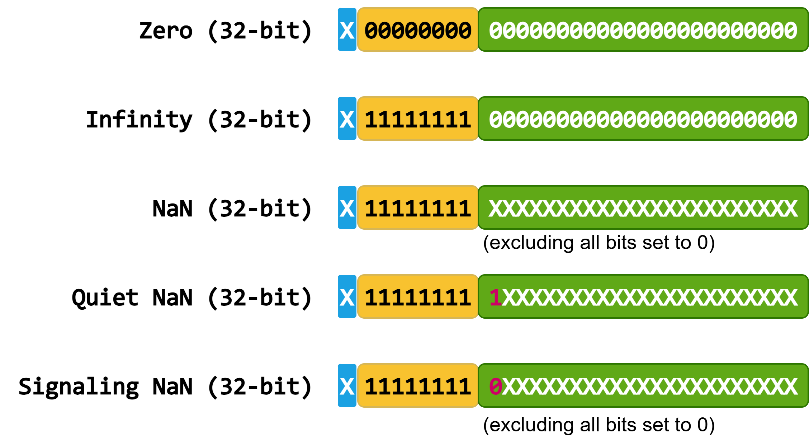

*无穷大和 NaN 的浮点表示*

其中 `X` 表示 `0` 和 `1`。

#### 5.5.1.4. 结合性

需要注意的是，由于浮点运算的精度有限，数学算术的规则和性质不能直接套用于浮点运算。下面的示例给出单精度值 `A`、`B` 和 `C`，以及按不同结合顺序计算其总和时对应的精确数学值。

$$
\begin{split}\begin{aligned} A &= 2^{1} \times 1.00000000000000000000001 \\ B &= 2^{0} \times 1.00000000000000000000001 \\ C &= 2^{3} \times 1.00000000000000000000001 \\ (A + B) + C &= 2^{3} \times 1.01100000000000000000001011 \\ A + (B + C) &= 2^{3} \times 1.01100000000000000000001011 \end{aligned}\end{split}
$$

从数学上讲， \((A + B) + C\) 等于 \(A + (B + C)\)。

让 \(\mathrm{rn}(x)\) 表示 \(x\) 上的一个舍入步骤。根据 IEEE-754 在单精度浮点运算中以舍入到最近模式进行相同的计算，我们得到：

$$
\begin{split}\begin{aligned} A + B &= 2^{1} \times 1.1000000000000000000000110000\ldots \\ \mathrm{rn}(A+B) &= 2^{1} \times 1.10000000000000000000010 \\ B + C &= 2^{3} \times 1.0010000000000000000000100100\ldots \\ \mathrm{rn}(B+C) &= 2^{3} \times 1.00100000000000000000001 \\ A + B + C &= 2^{3} \times 1.0110000000000000000000101100\ldots \\ \mathrm{rn}\big(\mathrm{rn}(A+B) + C\big) &= 2^{3} \times 1.01100000000000000000010 \\ \mathrm{rn}\big(A + \mathrm{rn}(B+C)\big) &= 2^{3} \times 1.01100000000000000000001 \end{aligned}\end{split}
$$

作为参考，上面还计算了精确的数学结果。根据 IEEE-754计算的结果与精确的数学结果不同。此外，与 \(\mathrm{rn}(\mathrm{rn}(A + B) + C)\) 和 \(\mathrm{rn}(A + \mathrm{rn}(B + C))\) 之和相对应的结果彼此不同。在这种情况下， \(\mathrm{rn}(A + \mathrm{rn}(B + C))\) 比 \(\mathrm{rn}(\mathrm{rn}(A + B) + C)\) 更接近正确的数学结果。

此示例表明，即使所有基本操作都符合 IEEE-754，看似相同的计算也可能产生不同的结果。

#### 5.5.1.5. 融合乘加（FMA）

融合乘加（FMA）运算只需一次舍入即可计算结果。如果不使用 FMA，则需要两次舍入：乘法一次、加法一次。由于 FMA 只进行一次舍入，因此结果通常更准确。

融合乘加运算传播 NaN 的方式可能不同于两个分立运算，而且各目标上的 FMA NaN 处理并非完全一致。当存在多个 NaN 操作数时，不同实现可能优先选择静默 NaN，或传播某个操作数的有效负载；IEEE-754 也未严格规定确定性的有效负载选择顺序。NaN 还可能在中间计算中产生，例如 \(\infty \times 0 + 1\) 或 \(1 \times \infty - \infty\)，从而得到由实现定义的 NaN 有效负载。

---

为了清楚起见，首先考虑一个使用十进制算术的示例来说明 FMA 运算的工作原理。我们将使用总共五位精度（小数点后四位）来计算 \(x^2 - 1\)。

- 对于 \(x = 1.0008\)，正确的数学结果是 \(x^2 - 1 = 1.60064 \times 10^{-4}\)。仅使用小数点后四位数字的最接近的数字是 \(1.6006 \times 10^{-4}\)。
- 融合乘加运算仅使用一个舍入步骤 \(\mathrm{rn}(x \times x - 1) = 1.6006 \times 10^{-4}\) 即可获得正确的结果。
- 另一种方法是分别计算乘法和加法步骤。 \(x^2 = 1.00160064\) 转换为 \(\mathrm{rn}(x \times x) = 1.0016\)。最终结果是 \(\mathrm{rn}(\mathrm{rn}(x \times x) -1) = 1.6000 \times 10^{-4}\)。

分别对乘法和加法进行舍入所得结果的误差为 \(0.00064\)。相应的 FMA 计算误差仅为 \(0.00004\)，其结果最接近正确的数学答案。结果汇总如下：

$$
\begin{split}\begin{aligned} x &= 1.0008 \\ x^{2} &= 1.00160064 \\ x^{2} - 1 &= 1.60064 \times 10^{-4} && \text{true value} \\ \mathrm{rn}\big(x^{2} - 1\big) &= 1.6006 \times 10^{-4} && \text{fused multiply-add} \\ \mathrm{rn}\big(x^{2}\big) &= 1.0016 \\ \mathrm{rn}\big(\mathrm{rn}(x^{2}) - 1\big) &= 1.6000 \times 10^{-4} && \text{multiply, then add} \end{aligned}\end{split}
$$

---

下面是另一个使用二进制单精度值的示例：

$$
\begin{split}\begin{aligned} A &= 2^{0} \times 1.00000000000000000000001 \\ B &= -2^{0} \times 1.00000000000000000000010 \\ \mathrm{rn}\big(A \times A + B\big) &= 2^{-46} \times 1.00000000000000000000000 && \text{fused multiply-add} \\ \mathrm{rn}\big(\mathrm{rn}(A \times A) + B\big) &= 0 && \text{multiply, then add} \end{aligned}\end{split}
$$

- 分别计算乘法和加法会导致所有精度位丢失，产生 \(0\)。
- 另一方面，计算 FMA 提供的结果等于数学值。

融合乘加有助于防止减法消除期间精度损失。当大小相似但符号相反的数量相加时，就会发生减法抵消。在这种情况下，许多前导位被抵消，导致有意义的位减少。融合乘加在乘法期间计算双宽度乘积。因此，即使在加法过程中发生减法抵消，乘积中仍然有足够的有效位来产生精确的结果。

---

**CUDA 中的融合乘加支持：**

CUDA 以多种方式为 `float` 和 `double` 数据类型提供融合乘加运算：

- 使用标志 `-fmad=true` 或 `--use_fast_math` 编译时的 `x * y + z`。
- `fma(x, y, z)` 和 `fmaf(x, y, z)` [C 标准库函数](https://en.cppreference.com/w/c/numeric/math/fma)。
- `__fmaf_[rd, rn, ru, rz]`、`__fmaf_ieee_[rd, rn, ru, rz]` 和 `__fma_[rd, rn, ru, rz]` [CUDA 数学内建函数](https://docs.nvidia.com/cuda/cuda-math-api/cuda_math_api/group__CUDA__MATH__INTRINSIC__SINGLE.html)。
- `cuda::std::fma(x, y, z)` 和 `cuda::std::fmaf(x, y, z)` [CUDA C++ 标准库函数](https://en.cppreference.com/w/cpp/numeric/math/fma.html)。

---

**主机平台上的融合乘加支持：**

是否使用融合操作取决于该操作在平台上的可用性以及代码的编译方式。在比较 CPU 和 GPU 结果时，了解主机平台对融合乘加的支持非常重要。

- 编译器标志和融合乘加硬件支持：
    - `-mfma` 与 [GCC](https://gcc.gnu.org/onlinedocs/gcc/x86-Options.html#index-mmmx) 和 [Clang](https://clang.llvm.org/docs/UsersManual.html#cmdoption-ffp-contract)、`-Mfma` 与 [NVC++](https://docs.nvidia.com/hpc-sdk/compilers/hpc-compilers-user-guide/index.html#gpu) 以及 `/fp:contract` 与 [Microsoft Visual Studio](https://learn.microsoft.com/en-us/cpp/preprocessor/fp-contract)。
    - 例如，使用 AVX2 ISA 的 x86 平台，使用 GCC 或 Clang 以及 `/arch:AVX2` 和 Microsoft Visual Studio 使用 `-mavx2` 标志编译的代码。
    - 具有高级 SIMD (Neon) ISA 的 Arm64 (AArch64) 平台。
- `fma(x, y, z)` 和 `fmaf(x, y, z)` [C 标准库函数](https://en.cppreference.com/w/c/numeric/math/fma)。
- `std::fma(x, y, z)` 和 `std::fmaf(x, y, z)` [C++ 标准库函数](https://en.cppreference.com/w/cpp/numeric/math/fma.html)。
- `cuda::std::fma(x, y, z)` 和 `cuda::std::fmaf(x, y, z)` [CUDA C++ 标准库函数](https://en.cppreference.com/w/cpp/numeric/math/fma.html)。

#### 5.5.1.6. 点积示例

考虑寻找两个具有四个元素的短向量 \(\overrightarrow{a}\) 和 \(\overrightarrow{b}\) 的点积的问题。

$$
\begin{split}\overrightarrow{a} = \begin{bmatrix} a_{1} \\ a_{2} \\ a_{3} \\ a_{4} \end{bmatrix} \qquad \overrightarrow{b} = \begin{bmatrix} b_{1} \\ b_{2} \\ b_{3} \\ b_{4} \end{bmatrix} \qquad \overrightarrow{a} \cdot \overrightarrow{b} = a_{1}b_{1} + a_{2}b_{2} + a_{3}b_{3} + a_{4}b_{4}\end{split}
$$

尽管此操作很容易用数学方法写下来，但在软件中实现它涉及多种替代方案，这些替代方案可能会导致略有不同的结果。此处介绍的所有策略均使用完全符合 IEEE-754 的操作。

**示例算法 1：** 计算点积的最简单方法是使用乘积的顺序和，将乘法和加法分开。

> 最终结果可以表示为 \(((((a_1 \times b_1) + (a_2 \times b_2)) + (a_3 \times b_3)) + (a_4 \times b_4))\)。

**示例算法 2：** 使用融合乘加顺序计算点积。

> 最终结果可以表示为 \((a_4 \times b_4) + ((a_3 \times b_3) + ((a_2 \times b_2) + (a_1 \times b_1 + 0)))\)。

**算法示例 3：** 使用分治策略计算点积。首先，我们求向量前半部分和后半部分的点积。然后，我们使用加法将这些结果结合起来。该算法被称为“并行算法”，因为两个子问题彼此独立，可以并行计算。然而，该算法不需要并行实现；它可以用单个线程来实现。

> 最终结果可以表示为 \(((a_1 \times b_1) + (a_2 \times b_2)) + ((a_3 \times b_3) + (a_4 \times b_4))\)。

#### 5.5.1.7. 舍入

IEEE-754 标准需要支持多种操作。其中包括算术运算，例如加法、减法、乘法、除法、平方根、乘加融合、求余、转换、缩放、符号和比较运算。对于给定格式和舍入模式，这些操作的结果保证在所有标准实现中保持一致。

---

**舍入模式**

IEEE-754 标准定义了四种舍入模式：*舍入到最近值*、*向正无穷方向舍入*、*向负无穷方向舍入*和*向零舍入*。CUDA 支持全部四种模式。默认情况下，运算使用*舍入到最近值*模式。可通过[内建数学函数](#section-5-5-9)为单个运算选择其他舍入模式。

| 舍入模式 | 解读 |
| --- | --- |
| `rn` | 舍入到最近值，恰好居中时取偶数 |
| `rz` | 向零舍入 |
| `ru` | 朝 \(\infty\) 方向舍入 |
| `rd` | 朝 \(-\infty\) 方向舍入 |

#### 5.5.1.8. 主机/设备计算精度注意事项

浮点计算结果的精度受多种因素影响。本节总结了在浮点计算中获得可靠结果的重要注意事项。其中一些方面已在前面的章节中进行了更详细的描述。

在比较 CPU 和 GPU 之间的结果时，这些方面也很重要。必须仔细解释主机和设备执行之间的差异。存在差异并不一定意味着 GPU 的结果不正确或 GPU 有问题。

**结合性：**

> 有限精度浮点加法和乘法[不满足结合律](#section-5-5-1-4)，因为其数学结果往往无法直接用目标格式表示，必须进行舍入。运算的求值顺序会影响舍入误差的累积方式，并可能显著改变最终结果。

**乘加融合**：

> [融合乘加](#section-5-5-1-5)在一次运算中计算 \(a \times b + c\)，因而能获得更高的准确度和更快的执行速度。是否使用融合乘加可能影响最终结果的准确度。融合乘加依赖硬件支持，可通过调用相关函数显式启用，也可通过编译器优化选项隐式启用。

**精度**：

> 提高浮点精度可能改善结果的准确度。更高的精度可以减少有效数字损失，并能表示范围更广的值。不过，更高精度的类型吞吐量较低且会占用更多寄存器；若用其显式存储输入和输出，还会增加内存占用和数据传输量。

**编译器标志和优化**：

> 所有主要编译器都提供各种优化标志来控制浮点运算的行为。
>
> - GCC ( `-O3` )、Clang ( `-O3` )、nvcc ( `-O3` ) 和 Microsoft Visual Studio ( `/O2` ) 的最高优化级别不会影响浮点语义。但是，内联、循环展开、向量化和公共子表达式消除可能会影响结果。 NVC++ 编译器还需要标志 `-Kieee -Mnofma` 来实现符合 IEEE-754 的语义。
> - 有关影响浮点行为的选项的详细信息，请参阅 [GCC](https://gcc.gnu.org/wiki/FloatingPointMath)、 [Clang](https://clang.llvm.org/docs/UsersManual.html#controlling-floating-point-behavior)、 [Microsoft Visual Studio 编译器](https://learn.microsoft.com/en-us/cpp/build/reference/fp-specify-floating-point-behavior)、 [NV++](https://docs.nvidia.com/hpc-sdk/compilers/hpc-compilers-user-guide/index.html#gpu) 和 [Arm C/C++ 编译器](https://developer.arm.com/documentation/101458/2404/Compiler-options?lang=en) 文档。
> - 另请参阅 `nvcc` [用户手册](https://docs.nvidia.com/cuda/cuda-compiler-driver-nvcc/index.html#use-fast-math-use-fast-math)，其中详细说明了会直接影响 CUDA 设备代码浮点行为的编译器标志：`-ftz`、`-prec-div`、`-prec-sqrt`、`-fmad` 和 `--use_fast_math`。除这些浮点选项外，还必须在用户程序的具体上下文中验证其他编译器优化的影响。建议用户通过充分测试验证结果的正确性，并比较启用优化所得结果与禁用所有设备代码优化所得结果；另请参阅编译器标志 `-G`。

**库的实现**：

> 在 IEEE-754 标准之外定义的函数不能保证正确舍入，并且取决于实现定义的行为。因此，不同平台（包括主机、设备和不同设备架构之间）的结果可能会有所不同。

**确定性结果**：

> 确定性结果是指每次在相同的指定条件下使用相同的输入运行时计算相同的按位数字输出。这些条件包括：
>
> - 硬件依赖性，例如在同一 CPU 处理器或 GPU 设备上执行。
> - 编译器方面，例如编译器和 [编译器标志和优化](#section-5-5-1-8) 的版本。
> - 影响计算的运行时条件，例如 [舍入模式](#section-5-5-1-7) 或环境变量。
> - 计算的相同输入。
> - 线程配置，包括参与计算的线程的数量及其组织，例如块和网格大小。
> - [算术原子操作](#section-5-4-5) 的顺序取决于硬件调度，硬件调度在运行之间可能有所不同。

**利用 CUDA 库**：

> [CUDA 数学库](https://developer.nvidia.com/gpu-accelerated-libraries)、 [C 标准库数学函数](https://docs.nvidia.com/cuda/cuda-math-api/index.html) 和 [C++ 标准库数学函数](https://nvidia.github.io/cccl/unstable/libcudacxx/standard_api.html) 旨在提高开发人员使用常见功能的工作效率，特别是浮点数学和数字密集型例程。这些功能提供一致的高级接口，经过优化，并跨平台和边缘情况进行了广泛测试。鼓励用户充分利用这些库并避免繁琐的手动重新实现。

### 5.5.2. 浮点数据类型

CUDA 支持 Bfloat16、半精度、单精度、双精度和四精度浮点数据类型。下面的表总结了 CUDA 中支持的浮点数据类型及其要求。

**表 44 支持的浮点类型**

| 精度/名称 | 数据类型 | IEEE-754 | 头文件/内置类型 | 要求 |
| --- | --- | --- | --- | --- |
| B 浮点16 | `__nv_bfloat16` | ❌ | `<cuda_bf16.h>` | 计算能力 8.0 或更高版本。 |
| 半精度 | `__half` | ✅ | `<cuda_fp16.h>` |  |
| 单精度 | `float` | ✅ | 内置 |  |
| 双精度 | `double` | ✅ | 内置 |  |
| 四精度 | `__float128` / `_Float128` | ✅ | 内置 `<crt/device_fp128_functions.h>` 用于数学函数 | 主机编译器支持和计算能力 10.0 或更高版本。 C 或 C++ 拼写分别为 `_Float128` 和 `__float128`，也取决于主机编译器支持。 |

CUDA 还支持 [TensorFloat-32](https://blogs.nvidia.com/blog/tensorfloat-32-precision-format/)（`TF32`）、[微尺度（MX）](https://www.opencompute.org/documents/ocp-microscaling-formats-mx-v1-0-spec-final-pdf)浮点类型和其他[低精度数值格式](https://resources.nvidia.com/en-us-blackwell-architecture)。这些类型不用于通用计算，而是面向涉及 Tensor Core 的专用场景，包括 4 位、6 位和 8 位浮点类型。更多信息请参阅 [CUDA 数学 API](https://docs.nvidia.com/cuda/cuda-math-api/cuda_math_api/structs.html)。

以下图报告支持的浮点数据类型的尾数和指数大小。


*浮点类型：尾数和指数大小*

以下表报告支持的浮点数据类型的范围。

**表 45 支持的浮点类型属性**

| 精度/名称 | 最大值 | 最大值 | 最小正值 | 最小正值 | 最小正次正规值 | Epsilon |
| --- | --- | --- | --- | --- | --- | --- |
| B 浮点16 | \(\approx 2^{128}\) | \(\approx 3.39 \cdot 10^{38}\) | \(2^{-126}\) | \(\approx 1.18 \cdot 10^{-38}\) | \(2^{-133}\) | \(2^{-7}\) |
| 半精度 | \(\approx 2^{16}\) | \(65504\) | \(2^{-14}\) | \(\approx 6.1 \cdot 10^{-5}\) | \(2^{-24}\) | \(2^{-10}\) |
| 单精度 | \(\approx 2^{128}\) | \(\approx 3.40 \cdot 10^{38}\) | \(2^{-126}\) | \(\approx 1.18 \cdot 10^{-38}\) | \(2^{-149}\) | \(2^{-23}\) |
| 双精度 | \(\approx 2^{1024}\) | \(\approx 1.8 \cdot 10^{308}\) | \(2^{-1022}\) | \(\approx 2.22 \cdot 10^{-308}\) | \(2^{-1074}\) | \(2^{-52}\) |
| 四精度 | \(\approx 2^{16384}\) | \(\approx 1.19 \cdot 10^{4932}\) | \(2^{-16382}\) | \(\approx 3.36 \cdot 10^{-4932}\) | \(2^{-16494}\) | \(2^{-112}\) |

> [!TIP]
> **提示**
> [CUDA C++ 标准库](#section-5-3-6)在 `<cuda/std/limits>` 头文件中提供 `cuda::std::numeric_limits`，用于查询受支持浮点类型（包括[微缩放格式（MX）](https://www.opencompute.org/documents/ocp-microscaling-formats-mx-v1-0-spec-final-pdf)）的属性和范围。可查询属性的列表见 [C++ 参考文档](https://en.cppreference.com/w/cpp/types/numeric_limits.html)。

**复数支持：**

- [CUDA C++ 标准库](#section-5-3-6)支持 `<cuda/std/complex>` 头文件中定义的 [`cuda::std::complex`](https://en.cppreference.com/w/cpp/numeric/complex) 复数类型。更多详细信息见 [libcu++ 文档](https://nvidia.github.io/cccl/unstable/libcudacxx/standard_api/numerics_library/complex.html)。
- CUDA 还通过 `cuComplex.h` 头文件中的 `cuComplex` 和 `cuDoubleComplex` 类型提供基本的复数支持。

---

### 5.5.3. CUDA 和 IEEE-754 合规性

所有 GPU 器件均遵循二进制浮点运算的 [IEEE 754-2019](https://ieeexplore.ieee.org/stamp/stamp.jsp?tp=&arnumber=8766229) 标准，但具有以下限制：

- 不支持动态配置舍入模式；不过，大多数操作支持若干固定的 IEEE 舍入模式，可通过专门命名的[设备内建函数](#section-5-5-9)进行选择。
- 不提供检测浮点异常的机制，因此所有运算都表现得如同 IEEE-754 异常始终被屏蔽。发生异常事件时，将采用 IEEE-754 定义的默认屏蔽响应。因此，虽然支持信号 NaN（`SNaN`）编码，但它们不会发出信号，而会按静默异常处理。
- 浮点运算可能会改变输入 NaN 有效负载的位模式。绝对值和求反等运算也可能不符合 IEEE 754 要求，这可能导致 NaN 的符号以实现定义的方式更新。

为了最大限度地提高结果的可移植性，建议用户使用 `nvcc` 编译器浮点选项的默认设置： `-ftz=false`、 `-prec-div=true` 和 `-prec-sqrt=true`，而不是使用 `--use_fast_math` 选项。说明默认情况下允许浮点表达式重新关联和收缩，类似于 `--fmad=true` 选项。有关这些编译标志的详细说明，另请参阅 `nvcc` [用户手册](https://docs.nvidia.com/cuda/cuda-compiler-driver-nvcc/index.html#use-fast-math-use-fast-math)。

IEEE-754 和 C/C++ 语言标准并未明确规定：当舍入后的整数值超出目标整数格式范围时，应如何把浮点值转换为整数。GPU 设备上的范围钳制行为见 [PTX ISA 转换指令](https://docs.nvidia.com/cuda/parallel-thread-execution/index.html#data-movement-and-conversion-instructions-cvt)一节。不过，如果越界转换不是直接通过 PTX 指令调用，编译器优化可能利用这种未指定行为，进而产生未定义行为并使 CUDA 程序无效。CUDA 数学文档会针对各函数或内建函数给出警告；例如，请参阅 [`__double2int_rz()`](https://docs.nvidia.com/cuda/cuda-math-api/cuda_math_api/group__CUDA__MATH__INTRINSIC__CAST.html#_CPPv415__double2int_rzd)。这种行为可能不同于主机编译器和库实现。

**原子函数非规范化行为**：

无论编译器标志 `-ftz` 的设置如何，原子操作在浮点非正规化方面都具有以下行为：

- 全局内存上的原子单精度浮点加法始终以清零模式运行，即行为等效于 PTX `add.rn.ftz.f32` 语义。
- 共享内存上的原子单精度浮点加法始终支持次正规数，其行为等同于 PTX `add.rn.f32` 语义。

### 5.5.4. CUDA 和 C/C++ 合规性

**浮点异常：**

与主机实现不同，设备代码支持的数学运算符和函数既不会设置全局 `errno` 变量，也不会报告[浮点异常](https://en.cppreference.com/w/cpp/numeric/fenv/FE_exceptions)来指示错误。因此，如果需要错误诊断机制，用户应对这些函数额外实施输入和输出筛查。

**浮点运算的未定义行为：**

数学运算未定义行为的常见条件包括：

- 数学运算符和函数的无效参数：
    - 使用未初始化的浮点变量。
    - 在浮点变量的生命周期之外使用它。
    - 有符号整数溢出。
    - 取消引用无效指针。
- 浮点特定的未定义行为：
    - 将浮点值转换为结果不可表示的整数类型是未定义的行为。这还包括 NaN 和无穷大。

用户有责任确保 CUDA 程序的有效性。无效参数可能会导致未定义的行为并受到编译器优化的影响。

与整数除以零不同，浮点除以零不是未定义行为，也不受编译器优化影响；其结果由实现定义。符合 [IEC-60559](https://en.cppreference.com/w/cpp/types/numeric_limits/is_iec559.html)（IEEE-754）的 C++ 实现（包括 CUDA）会产生无穷大。请注意，无效的浮点运算会产生 NaN，不应将其误解为未定义行为；例如零除以零或无穷大除以无穷大。

**浮点字面量的可移植性：**

C 和 C++ 都允许以十进制或十六进制记法表示浮点值。[C99](https://en.cppreference.com/w/c/language/floating_constant.html) 和 [C++17](https://en.cppreference.com/w/cpp/language/floating_literal.html)支持十六进制浮点字面量，用科学记数法表示可在二进制中精确表示的实数。但这并不保证字面量会映射为目标变量中实际存储的值（见下一段）。相反，十进制浮点字面量可能表示无法用二进制精确表示的数值。

根据 [C++ 标准规则](https://eel.is/c++draft/lex.fcon#3)，十六进制和十进制浮点字面量会舍入到相邻两个可表示值之一（取较大者还是较小者由实现定义）。主机与设备的舍入行为可能不同。

```cpp
float f1 = 0.5f;    // 0.5, '0.5f' is a decimal floating-point literal
float f2 = 0x1p-1f; // 0.5, '0x1p-1f' is a hexadecimal floating-point literal
float f3 = 0.1f;
// f1, f2 are represented as 0 01111110 00000000000000000000000
// f3     is represented as  0 01111011 10011001100110011001101
```

同一浮点表达式的运行时和编译时计算存在以下可移植性问题：

- 浮点表达式的运行时求值可能受所选舍入模式、浮点收缩（FMA）与重新结合编译器设置以及浮点异常影响。请注意，CUDA 不支持浮点异常，并且[舍入模式](#section-5-5-1-7)默认为*舍入到最近值，恰好居中时取偶数*。可以使用[内建函数](#section-5-5-9)选择其他舍入模式。
- 编译器可以对常量表达式使用更高精度的内部表示。
- 编译器可能会执行优化，例如常量折叠、常量传播和公共子表达式消除，这可能会导致不同的最终值或比较结果。

**C 标准数学库注释：**

常用数学函数的主机实现以平台特定的方式映射到 [C 标准数学库函数](https://en.cppreference.com/w/c/header/math.html)。这些函数由主机编译器以及相应的主机 `libm`（若可用）提供。

- 主机编译器不可用的函数在 `crt/math_functions.h` 头文件中实现。例如，`erfinv()` 就是在那里实现的。
- 不太常见的函数，例如 `rhypot()` 和 `cyl_bessel_i0()`，仅在设备代码中可用。

如前所述，数学函数的主机和设备实现是独立的。有关这些函数行为的更多详细信息，请参阅主机实现的文档。

---

### 5.5.5. 浮点功能的提供方式

CUDA 支持的数学函数通过以下方法暴露：

[内置 C/C++ 语言算术运算符](#section-5-5-6)：

- `x + y` , `x - y` , `x * y` , `x / y` , `x++` , `x--` , `x += y` , `x -= y` , `x *= y` , `x /= y` .
- 支持单精度、双精度和四精度类型，分别为 `float`、 `double` 和 `__float128/_Float128`。
    - 分别包含 `<cuda_fp16.h>` 和 `<cuda_bf16.h>` 头文件后，还支持 `__half` 和 `__nv_bfloat16` 类型。
    - `__float128/_Float128` 类型支持依赖于主机编译器和设备计算能力，请参阅 [支持的浮点类型](#section-5-5-2) 表。
- 它们在主机和设备代码中均可用。
- 它们的行为受 `nvcc` [优化标志](https://docs.nvidia.com/cuda/cuda-compiler-driver-nvcc/index.html#use-fast-math-use-fast-math) 的影响。

[CUDA C++ 标准库数学函数](#section-5-5-7) :

- 通过 `<cuda/std/cmath>` 头文件和 `cuda::std::` 命名空间提供完整的 C++ `<cmath>` [头文件函数](https://en.cppreference.com/w/cpp/header/cmath)。
- 支持 IEEE-754 标准浮点类型、 `__half`、 `float`、 `double`、 `__float128` 以及 Bfloat16 `__nv_bfloat16`。
    - `__float128` 支持依赖于主机编译器和设备计算能力，请参阅 [支持的浮点类型](#section-5-5-2) 表。
- 它们在主机和设备代码中均可用。
- 它们通常依赖 [CUDA 数学 API 函数](https://docs.nvidia.com/cuda/cuda-math-api/cuda_math_api/group__CUDA__MATH__SINGLE.html)，因此主机代码和设备代码的准确度可能不同。
- 它们的行为受 `nvcc` [优化标志](#section-2-7-4-3) 的影响。
- 根据 C++23 和 C++26 标准规范，其中一部分功能（例如 `constexpr` 函数）也可用于常量表达式。

[CUDA C 标准库数学函数](#section-5-5-7) ( [CUDA 数学 API](https://docs.nvidia.com/cuda/cuda-math-api/index.html) ):

- 提供 C `<math.h>` [头文件函数](https://en.cppreference.com/w/c/header/math.html)的一个子集。
- 支持单精度和双精度类型，分别为`float`和`double`。
    - 它们在主机和设备代码中均可用。
    - 它们不需要额外的头文件。
    - 它们的行为受 `nvcc` [优化标志](#section-2-7-4-3) 的影响。
- `<math.h>` 头文件中的部分功能也适用于 `__half`、`__nv_bfloat16` 和 `__float128/_Float128` 类型。这些函数的名称与 C 标准库中的名称相似。
    - `__half` 和 `__nv_bfloat16` 类型分别需要 `<cuda_fp16.h>` 和 `<cuda_bf16.h>` 头文件。它们是否可用于主机代码和设备代码因函数而异。
    - `__float128/_Float128` 类型支持取决于主机编译器和设备计算能力，参见[支持的浮点类型](#section-5-5-2)表。相关函数需要 `crt/device_fp128_functions.h` 头文件，并且仅可用于设备代码。
- 主机和设备代码之间的精度可能不同。

[非标准 CUDA 数学函数](#section-5-5-8) ( [CUDA 数学 API](https://docs.nvidia.com/cuda/cuda-math-api/index.html) ):

- 公开不属于 C/C++ 标准库的数学功能。
- 主要支持单精度和双精度类型，分别为`float`和`double`。
    - 它们是否可用于主机代码和设备代码因函数而异。
    - 它们不需要额外的头文件。
    - 主机和设备代码之间的精度可能不同。
- `__nv_bfloat16`、 `__half`、 `__float128/_Float128` 支持一组有限的函数。
    - `__half` 和 `__nv_bfloat16` 类型分别需要 `<cuda_fp16.h>` 和 `<cuda_bf16.h>` 头文件。
    - `__float128/_Float128` 类型支持取决于主机编译器和设备计算能力，参见[支持的浮点类型](#section-5-5-2)表。相关函数需要 `crt/device_fp128_functions.h` 头文件。
    - 它们仅在设备代码中可用。
- 它们的行为受 `nvcc` [优化选项](#section-2-7-4-3)影响。

[内建数学函数](#section-5-5-9)（[CUDA 数学 API](https://docs.nvidia.com/cuda/cuda-math-api/index.html)）：

- 支持单精度和双精度类型，分别为 `float` 和 `double`。
- 它们仅在设备代码中可用。
- 它们比相应的 [CUDA 数学 API 函数](https://docs.nvidia.com/cuda/cuda-math-api/index.html)更快，但准确度较低。
- 它们的行为不受 `nvcc` [浮点优化标志](#section-2-7-4-3) `-prec-div=false`、 `-prec-sqrt=false` 和 `-fmad=true` 的影响。唯一的例外是 `-ftz=true`，它也包含在 `-use_fast_math` 中。

**表 46 数学功能特性概览**

| 函数 | 支持的类型 | 主机 | 设备 | 是否受浮点优化选项影响（仅适用于 `float` 和 `double`）|
| --- | --- | --- | --- | --- |
| [内置 C/C++ 语言算术运算符](#section-5-5-6) | `float`、`double`、`__half`、`__nv_bfloat16`、`__float128/_Float128`、`cuda::std::complex` | ✅ | ✅ | ✅ |
| [CUDA C++ 标准库数学函数](#section-5-5-7) | `float`、`double`、`__half`、`__nv_bfloat16`、`__float128`、`cuda::std::complex` | ✅ | ✅ | ✅ |
| [CUDA C++ 标准库数学函数](#section-5-5-7) | `__nv_fp8_e4m3` , `__nv_fp8_e5m2` , `__nv_fp8_e8m0` , `__nv_fp6_e2m3` , `__nv_fp6_e3m2` , `__nv_fp4_e2m1` ***** | ✅ | ✅ | ✅ |
| [CUDA C 标准库数学函数](#section-5-5-7) | `float` , `double` | ✅ | ✅ | ✅ |
| [CUDA C 标准库数学函数](#section-5-5-7) | `__nv_bfloat16`、`__half` 支持有限，且函数名称相似 | 因函数而异 | 因函数而异 | ✅ |
| [CUDA C 标准库数学函数](#section-5-5-7) | `__float128/_Float128` 具有有限的支持和类似的名称 | ❌ | ✅ | ✅ |
| [非标准 CUDA 数学函数](#section-5-5-8) | `float`、`double` | 因函数而异 | 因函数而异 | ✅ |
| [非标准 CUDA 数学函数](#section-5-5-8) | `__nv_bfloat16`、 `__half`、 `__float128/_Float128` 提供有限支持 | ❌ | ✅ | ✅ |
| [内建函数](#section-5-5-9) | `float`、`double` | ❌ | ✅ | 仅适用于 `-ftz=true`（也包含在 `-use_fast_math` 中）|

***** [CUDA C++ 标准库函数](#section-5-3-6)支持查询小型浮点类型的属性，例如 [`numeric_limits<T>`](https://en.cppreference.com/w/cpp/types/numeric_limits.html)、[`fpclassify()`](https://en.cppreference.com/w/cpp/numeric/math/fpclassify)、[`isfinite()`](https://en.cppreference.com/w/cpp/numeric/math/isfinite.html)、[`isnormal()`](https://en.cppreference.com/w/cpp/numeric/math/isnormal.html)、[`isinf()`](https://en.cppreference.com/w/cpp/numeric/math/isinf.html) 和 [`isnan()`](https://en.cppreference.com/w/cpp/numeric/math/isnan.html)。

以下各节在适用时给出部分函数的准确度信息，并使用 ULP 进行量化。有关[末位单位（ULP）](https://en.wikipedia.org/wiki/Unit_in_the_last_place)的定义，参见 Jean-Michel Muller 的论文[关于 ulp(x) 的定义](https://inria.hal.science/inria-00070503v1/file/RR2005-09.pdf)。

---

### 5.5.6. 内置算术运算符

内置 C/C++ 语言运算符（例如 `x + y`、`x - y`、`x * y`、`x / y`、`x++`、`x--` 和倒数 `1 / x`）对单精度、双精度和四精度类型的运算符合 IEEE-754 标准。采用*舍入到最近值，恰好居中时取偶数*模式时，它们保证最大 ULP 误差为零。它们在主机代码和设备代码中均可用。

`nvcc` 编译标志 `-fmad=true` 也包含在 `--use_fast_math` 中，它允许将浮点乘法和加/减转换为浮点乘加运算，并对单精度类型 `float` 的最大 ULP 误差有以下影响：

- `x * y + z` → [__fmaf_rn(x, y, z)](https://docs.nvidia.com/cuda/cuda-math-api/cuda_math_api/group__CUDA__MATH__INTRINSIC__SINGLE.html#_CPPv49__fmaf_rnfff) : 0 ULP

`nvcc` 编译标志 `-prec-div=false`（也包含在 `--use_fast_math` 中）对单精度类型 `float` 的除法运算符 `/` 的最大 ULP 误差有以下影响：

- `x / y` → [__fdividef(x, y)](https://docs.nvidia.com/cuda/cuda-math-api/cuda_math_api/group__CUDA__MATH__INTRINSIC__SINGLE.html#group__cuda__math__intrinsic__single_1gac996beec34f94f6376d0674a6860e107) : 2 ULP
- `1 / x` : 1 ULP

---

### 5.5.7. CUDA C++ 数学标准库函数

CUDA 通过 `cuda::std::` 命名空间全面支持 [C++ 标准库数学函数](https://en.cppreference.com/w/cpp/header/cmath.html)。这些函数由 `<cuda/std/cmath>` 头文件提供，可在主机代码和设备代码中使用。

以下各节给出与 [CUDA 数学 API](https://docs.nvidia.com/cuda/cuda-math-api/index.html) 的映射，以及各函数在设备上执行时的误差界限。

- 最大 ULP 误差，是指函数返回值与按*舍入到最近值，恰好居中时取偶数*模式得到的相应精度正确舍入结果之间，所观测到的最大 ULP 差值绝对值。
- 误差范围来自广泛但并非详尽的测试。因此，它们不受保证。

#### 5.5.7.1. 基本操作

用于基本操作的 [CUDA 数学 API](https://docs.nvidia.com/cuda/cuda-math-api/index.html) 在主机和设备代码中均可用，但 `__float128` 除外。

以下所有函数的最大 ULP 误差为零。

**表 47 C++ 数学标准库函数到 C 数学 API 的映射：基本运算**

| `cuda::std` 函数 | 含义 | `__nv_bfloat16` | `__half` | `float` | `double` | `__float128` |
| --- | --- | --- | --- | --- | --- | --- |
| [fabs(x)](https://en.cppreference.com/w/cpp/numeric/math/fabs.html) | \(\|x\|\) | [__habs(x)](https://docs.nvidia.com/cuda/cuda-math-api/cuda_math_api/group__CUDA__MATH____BFLOAT16__ARITHMETIC.html#_CPPv46__habsK13__nv_bfloat16) | [__habs(x)](https://docs.nvidia.com/cuda/cuda-math-api/cuda_math_api/group__CUDA__MATH____HALF__ARITHMETIC.html#_CPPv46__habsK6__half) | [fabsf(x)](https://docs.nvidia.com/cuda/cuda-math-api/cuda_math_api/group__CUDA__MATH__SINGLE.html#_CPPv45fabsff) | [fabs(x)](https://docs.nvidia.com/cuda/cuda-math-api/cuda_math_api/group__CUDA__MATH__DOUBLE.html#_CPPv44fabsd) | [__nv_fp128_fabs(x)](https://docs.nvidia.com/cuda/cuda-math-api/cuda_math_api/group__CUDA__MATH__QUAD.html#_CPPv415__nv_fp128_fabsg) |
| [fmod(x, y)](https://en.cppreference.com/w/cpp/numeric/math/fmod.html) | \(\dfrac{x}{y}\) 的余数，计算为 \(x - \mathrm{trunc}\left(\dfrac{x}{y}\right) \cdot y\) | 不适用 | 不适用 | [fmodf(x, y)](https://docs.nvidia.com/cuda/cuda-math-api/cuda_math_api/group__CUDA__MATH__SINGLE.html#_CPPv45fmodfff) | [fmod(x, y)](https://docs.nvidia.com/cuda/cuda-math-api/cuda_math_api/group__CUDA__MATH__DOUBLE.html#_CPPv44fmoddd) | [__nv_fp128_fmod(x, y)](https://docs.nvidia.com/cuda/cuda-math-api/cuda_math_api/group__CUDA__MATH__QUAD.html#_CPPv415__nv_fp128_fmodgg) |
| [remainder(x, y)](https://en.cppreference.com/w/cpp/numeric/math/remainder.html) | \(\dfrac{x}{y}\) 的余数，计算为 \(x - \mathrm{rint}\left(\dfrac{x}{y}\right) \cdot y\) | 不适用 | 不适用 | [remainderf(x, y)](https://docs.nvidia.com/cuda/cuda-math-api/cuda_math_api/group__CUDA__MATH__SINGLE.html#_CPPv410remainderfff) | [remainder(x, y)](https://docs.nvidia.com/cuda/cuda-math-api/cuda_math_api/group__CUDA__MATH__DOUBLE.html#_CPPv49remainderdd) | [__nv_fp128_remainder(x, y)](https://docs.nvidia.com/cuda/cuda-math-api/cuda_math_api/group__CUDA__MATH__QUAD.html#_CPPv420__nv_fp128_remaindergg) |
| [remquo(x, y, iptr)](https://en.cppreference.com/w/cpp/numeric/math/remquo.html) | \(\dfrac{x}{y}\) 的余数和商 | 不适用 | 不适用 | [remquof(x, y, iptr)](https://docs.nvidia.com/cuda/cuda-math-api/cuda_math_api/group__CUDA__MATH__SINGLE.html#_CPPv47remquofffPi) | [remquo(x, y, iptr)](https://docs.nvidia.com/cuda/cuda-math-api/cuda_math_api/group__CUDA__MATH__DOUBLE.html#_CPPv46remquoddPi) | 不适用 |
| [fma(x, y, z)](https://en.cppreference.com/w/cpp/numeric/math/fma.html) | \(x \cdot y + z\) | [__hfma(x, y, z)](https://docs.nvidia.com/cuda/cuda-math-api/cuda_math_api/group__CUDA__MATH____BFLOAT16__ARITHMETIC.html#_CPPv46__hfmaK13__nv_bfloat16K13__nv_bfloat16K13__nv_bfloat16)，仅限设备 | [__hfma(x, y, z)](https://docs.nvidia.com/cuda/cuda-math-api/cuda_math_api/group__CUDA__MATH____HALF__ARITHMETIC.html#_CPPv46__hfmaK6__halfK6__halfK6__half)，仅限设备 | [fmaf(x, y, z)](https://docs.nvidia.com/cuda/cuda-math-api/cuda_math_api/group__CUDA__MATH__SINGLE.html#_CPPv44fmaffff) | [fma(x, y, z)](https://docs.nvidia.com/cuda/cuda-math-api/cuda_math_api/group__CUDA__MATH__DOUBLE.html#_CPPv43fmaddd) | [__nv_fp128_fma(x, y, z)](https://docs.nvidia.com/cuda/cuda-math-api/cuda_math_api/group__CUDA__MATH__QUAD.html#_CPPv414__nv_fp128_fmaggg) |
| [fmax(x, y)](https://en.cppreference.com/w/cpp/numeric/math/fmax.html) | \(\max(x, y)\) | [__hmax(x, y)](https://docs.nvidia.com/cuda/cuda-math-api/cuda_math_api/group__CUDA__MATH____BFLOAT16__COMPARISON.html#_CPPv46__hmaxK13__nv_bfloat16K13__nv_bfloat16) | [__hmax(x, y)](https://docs.nvidia.com/cuda/cuda-math-api/cuda_math_api/group__CUDA__MATH____HALF__COMPARISON.html#_CPPv46__hmaxK6__halfK6__half) | [fmaxf(x, y)](https://docs.nvidia.com/cuda/cuda-math-api/cuda_math_api/group__CUDA__MATH__SINGLE.html#_CPPv45fmaxfff) | [fmax(x, y)](https://docs.nvidia.com/cuda/cuda-math-api/cuda_math_api/group__CUDA__MATH__DOUBLE.html#_CPPv44fmaxdd) | [__nv_fp128_fmax(x, y)](https://docs.nvidia.com/cuda/cuda-math-api/cuda_math_api/group__CUDA__MATH__QUAD.html#_CPPv415__nv_fp128_fmaxgg) |
| [fmin(x, y)](https://en.cppreference.com/w/cpp/numeric/math/fmin.html) | \(\min(x, y)\) | [__hmin(x, y)](https://docs.nvidia.com/cuda/cuda-math-api/cuda_math_api/group__CUDA__MATH____BFLOAT16__COMPARISON.html#_CPPv46__hminK13__nv_bfloat16K13__nv_bfloat16) | [__hmin(x, y)](https://docs.nvidia.com/cuda/cuda-math-api/cuda_math_api/group__CUDA__MATH____HALF__COMPARISON.html#_CPPv46__hminK6__halfK6__half) | [fminf(x, y)](https://docs.nvidia.com/cuda/cuda-math-api/cuda_math_api/group__CUDA__MATH__SINGLE.html#_CPPv45fminfff) | [fmin(x, y)](https://docs.nvidia.com/cuda/cuda-math-api/cuda_math_api/group__CUDA__MATH__DOUBLE.html#_CPPv44fmindd) | [__nv_fp128_fmin(x, y)](https://docs.nvidia.com/cuda/cuda-math-api/cuda_math_api/group__CUDA__MATH__QUAD.html#_CPPv415__nv_fp128_fmingg) |
| [fdim(x, y)](https://en.cppreference.com/w/cpp/numeric/math/fdim.html) | \(\max(x-y, 0)\) | 不适用 | 不适用 | [fdimf(x, y)](https://docs.nvidia.com/cuda/cuda-math-api/cuda_math_api/group__CUDA__MATH__SINGLE.html#_CPPv45fdimfff) | [fdim(x, y)](https://docs.nvidia.com/cuda/cuda-math-api/cuda_math_api/group__CUDA__MATH__DOUBLE.html#_CPPv44fdimdd) | [__nv_fp128_fdim(x, y)](https://docs.nvidia.com/cuda/cuda-math-api/cuda_math_api/group__CUDA__MATH__QUAD.html#_CPPv415__nv_fp128_fdimgg) |
| [nan(str)](https://en.cppreference.com/w/cpp/numeric/math/nan.html) | 来自字符串表示的 NaN 值 | 不适用 | 不适用 | [nanf(str)](https://docs.nvidia.com/cuda/cuda-math-api/cuda_math_api/group__CUDA__MATH__SINGLE.html#_CPPv44nanfPKc) | [nan(str)](https://docs.nvidia.com/cuda/cuda-math-api/cuda_math_api/group__CUDA__MATH__DOUBLE.html#_CPPv43nanPKc) | 不适用 |

***** 标有“N/A”的数学函数本身不适用于 CUDA 扩展浮点类型，例如 __half 和 __nv_bfloat16。在这些情况下，通过转换为浮点类型然后将结果转换回来来模拟函数。

#### 5.5.7.2. 指数函数

用于指数函数的 [CUDA 数学 API](https://docs.nvidia.com/cuda/cuda-math-api/index.html) 在主机和设备代码中均可用，仅适用于 `float` 和 `double` 类型。

**表 48 C++ 数学标准库函数到 C 数学 API 的映射及精度（最大 ULP）：指数函数**

| `cuda::std` 函数 | 含义 | `__nv_bfloat16` | `__half` | `float` | `double` | `__float128` |
| --- | --- | --- | --- | --- | --- | --- |
| / [exp(x)](https://en.cppreference.com/w/cpp/numeric/math/exp.html) | / \(e^x\) | [hexp(x)](https://docs.nvidia.com/cuda/cuda-math-api/cuda_math_api/group__CUDA__MATH____BFLOAT16__FUNCTIONS.html#_CPPv44hexpK13__nv_bfloat16) / / 0 ULP | [hexp(x)](https://docs.nvidia.com/cuda/cuda-math-api/cuda_math_api/group__CUDA__MATH____HALF__FUNCTIONS.html#_CPPv44hexpK6__half) / / 0 ULP | [expf(x)](https://docs.nvidia.com/cuda/cuda-math-api/cuda_math_api/group__CUDA__MATH__SINGLE.html#_CPPv44expff) / / 2 ULP | [exp(x)](https://docs.nvidia.com/cuda/cuda-math-api/cuda_math_api/group__CUDA__MATH__DOUBLE.html#_CPPv43expd) / / 1 ULP | [__nv_fp128_exp(x)](https://docs.nvidia.com/cuda/cuda-math-api/cuda_math_api/group__CUDA__MATH__QUAD.html#_CPPv414__nv_fp128_expg) / / 1 ULP |
| / [exp2(x)](https://en.cppreference.com/w/cpp/numeric/math/exp2.html) | / \(2^x\) | [hexp2(x)](https://docs.nvidia.com/cuda/cuda-math-api/cuda_math_api/group__CUDA__MATH____BFLOAT16__FUNCTIONS.html#_CPPv45hexp2K13__nv_bfloat16) / / 0 ULP | [hexp2(x)](https://docs.nvidia.com/cuda/cuda-math-api/cuda_math_api/group__CUDA__MATH____HALF__FUNCTIONS.html#_CPPv45hexp2K6__half) / / 0 ULP | [exp2f(x)](https://docs.nvidia.com/cuda/cuda-math-api/cuda_math_api/group__CUDA__MATH__SINGLE.html#_CPPv45exp2ff) / / 2 ULP | [exp2(x)](https://docs.nvidia.com/cuda/cuda-math-api/cuda_math_api/group__CUDA__MATH__DOUBLE.html#_CPPv44exp2d) / / 1 ULP | [__nv_fp128_exp2(x)](https://docs.nvidia.com/cuda/cuda-math-api/cuda_math_api/group__CUDA__MATH__QUAD.html#_CPPv415__nv_fp128_exp2g) / / 1 ULP |
| / [expm1(x)](https://en.cppreference.com/w/cpp/numeric/math/expm1.html) | / \(e^x - 1\) | / 不适用 | / 不适用 | [expm1f(x)](https://docs.nvidia.com/cuda/cuda-math-api/cuda_math_api/group__CUDA__MATH__SINGLE.html#_CPPv46expm1ff) / / 1 ULP | [expm1(x)](https://docs.nvidia.com/cuda/cuda-math-api/cuda_math_api/group__CUDA__MATH__DOUBLE.html#_CPPv45expm1d) / / 1 ULP | [__nv_fp128_expm1(x)](https://docs.nvidia.com/cuda/cuda-math-api/cuda_math_api/group__CUDA__MATH__QUAD.html#_CPPv416__nv_fp128_expm1g) / / 1 ULP |
| / [log(x)](https://en.cppreference.com/w/cpp/numeric/math/log.html) | / \(\ln(x)\) | [hlog(x)](https://docs.nvidia.com/cuda/cuda-math-api/cuda_math_api/group__CUDA__MATH____BFLOAT16__FUNCTIONS.html#_CPPv44hlogK13__nv_bfloat16) / / 0 ULP | [hlog(x)](https://docs.nvidia.com/cuda/cuda-math-api/cuda_math_api/group__CUDA__MATH____HALF__FUNCTIONS.html#_CPPv44hlogK6__half) / / 0 ULP | [logf(x)](https://docs.nvidia.com/cuda/cuda-math-api/cuda_math_api/group__CUDA__MATH__SINGLE.html#_CPPv44logff) / / 1 ULP | [log(x)](https://docs.nvidia.com/cuda/cuda-math-api/cuda_math_api/group__CUDA__MATH__DOUBLE.html#_CPPv43logd) / / 1 ULP | [__nv_fp128_log(x)](https://docs.nvidia.com/cuda/cuda-math-api/cuda_math_api/group__CUDA__MATH__QUAD.html#_CPPv414__nv_fp128_logg) / / 1 ULP |
| / [log10(x)](https://en.cppreference.com/w/cpp/numeric/math/log10.html) | / \(\log_{10}(x)\) | [hlog10(x)](https://docs.nvidia.com/cuda/cuda-math-api/cuda_math_api/group__CUDA__MATH____BFLOAT16__FUNCTIONS.html#_CPPv46hlog10K13__nv_bfloat16) / / 0 ULP | [hlog10(x)](https://docs.nvidia.com/cuda/cuda-math-api/cuda_math_api/group__CUDA__MATH____HALF__FUNCTIONS.html#_CPPv46hlog10K6__half) / / 0 ULP | [log10f(x)](https://docs.nvidia.com/cuda/cuda-math-api/cuda_math_api/group__CUDA__MATH__SINGLE.html#_CPPv46log10ff) / / 2 ULP | [log10(x)](https://docs.nvidia.com/cuda/cuda-math-api/cuda_math_api/group__CUDA__MATH__DOUBLE.html#_CPPv45log10d) / / 1 ULP | [__nv_fp128_log10(x)](https://docs.nvidia.com/cuda/cuda-math-api/cuda_math_api/group__CUDA__MATH__QUAD.html#_CPPv416__nv_fp128_log10g) / / 1 ULP |
| / [log2(x)](https://en.cppreference.com/w/cpp/numeric/math/log2.html) | / \(\log_2(x)\) | [hlog2(x)](https://docs.nvidia.com/cuda/cuda-math-api/cuda_math_api/group__CUDA__MATH____BFLOAT16__FUNCTIONS.html#_CPPv45hlog2K13__nv_bfloat16) / / 0 ULP | [hlog2(x)](https://docs.nvidia.com/cuda/cuda-math-api/cuda_math_api/group__CUDA__MATH____HALF__FUNCTIONS.html#_CPPv45hlog2K6__half) / / 0 ULP | [log2f(x)](https://docs.nvidia.com/cuda/cuda-math-api/cuda_math_api/group__CUDA__MATH__SINGLE.html#_CPPv45log2ff) / / 1 ULP | [log2(x)](https://docs.nvidia.com/cuda/cuda-math-api/cuda_math_api/group__CUDA__MATH__DOUBLE.html#_CPPv44log2d) / / 1 ULP | [__nv_fp128_log2(x)](https://docs.nvidia.com/cuda/cuda-math-api/cuda_math_api/group__CUDA__MATH__QUAD.html#_CPPv415__nv_fp128_log2g) / / 1 ULP |
| / [log1p(x)](https://en.cppreference.com/w/cpp/numeric/math/log1p.html) | / \(\ln(1+x)\) | / 不适用 | / 不适用 | [log1pf(x)](https://docs.nvidia.com/cuda/cuda-math-api/cuda_math_api/group__CUDA__MATH__SINGLE.html#_CPPv46log1pff) / / 1 ULP | [log1p(x)](https://docs.nvidia.com/cuda/cuda-math-api/cuda_math_api/group__CUDA__MATH__DOUBLE.html#_CPPv45log1pd) / / 1 ULP | [__nv_fp128_log1p(x)](https://docs.nvidia.com/cuda/cuda-math-api/cuda_math_api/group__CUDA__MATH__QUAD.html#_CPPv416__nv_fp128_log1pg) / / 1 ULP |

***** 标有“N/A”的数学函数本身不适用于 CUDA 扩展浮点类型，例如 __half 和 __nv_bfloat16。在这些情况下，通过转换为浮点类型然后将结果转换回来来模拟函数。

#### 5.5.7.3. 幂函数

[CUDA 数学 API](https://docs.nvidia.com/cuda/cuda-math-api/index.html)中的幂函数在主机代码和设备代码中均可用，但只支持 `float` 和 `double` 类型。

**表 49 C++ 数学标准库函数到 C 数学 API 的映射及精度（最大 ULP）：幂函数**

| `cuda::std` 函数 | 含义 | `__nv_bfloat16` | `__half` | `float` | `double` | `__float128` |
| --- | --- | --- | --- | --- | --- | --- |
| / [pow(x, y)](https://en.cppreference.com/w/cpp/numeric/math/pow.html) | / \(x^y\) | / 不适用 | / 不适用 | [powf(x, y)](https://docs.nvidia.com/cuda/cuda-math-api/cuda_math_api/group__CUDA__MATH__SINGLE.html#_CPPv44powfff) / / 4 ULP | [pow(x, y)](https://docs.nvidia.com/cuda/cuda-math-api/cuda_math_api/group__CUDA__MATH__DOUBLE.html#_CPPv43powdd) / / 2 ULP | [__nv_fp128_pow(x, y)](https://docs.nvidia.com/cuda/cuda-math-api/cuda_math_api/group__CUDA__MATH__QUAD.html#_CPPv414__nv_fp128_powgg) / / 1 ULP |
| / [sqrt(x)](https://en.cppreference.com/w/cpp/numeric/math/sqrt.html) | / \(\sqrt{x}\) | [hsqrt(x)](https://docs.nvidia.com/cuda/cuda-math-api/cuda_math_api/group__CUDA__MATH____BFLOAT16__FUNCTIONS.html#_CPPv45hsqrtK13__nv_bfloat16) / / 0 ULP | [hsqrt(x)](https://docs.nvidia.com/cuda/cuda-math-api/cuda_math_api/group__CUDA__MATH____HALF__FUNCTIONS.html#_CPPv45hsqrtK6__half) / / 0 ULP | [sqrtf(x)](https://docs.nvidia.com/cuda/cuda-math-api/cuda_math_api/group__CUDA__MATH__SINGLE.html#_CPPv45sqrtff) / / ▪ 0 ULP / ▪ 使用 `--use_fast_math` 时为 1 ULP | [sqrt(x)](https://docs.nvidia.com/cuda/cuda-math-api/cuda_math_api/group__CUDA__MATH__DOUBLE.html#_CPPv44sqrtd) / / 0 ULP | [__nv_fp128_sqrt(x)](https://docs.nvidia.com/cuda/cuda-math-api/cuda_math_api/group__CUDA__MATH__QUAD.html#_CPPv415__nv_fp128_sqrtg) / / 0 ULP |
| / [cbrt(x)](https://en.cppreference.com/w/cpp/numeric/math/cbrt.html) / / | / \(\sqrt[3]{x}\) | / 不适用 | / 不适用 | [cbrtf(x)](https://docs.nvidia.com/cuda/cuda-math-api/cuda_math_api/group__CUDA__MATH__SINGLE.html#_CPPv45cbrtff) / / 1 ULP | [cbrt(x)](https://docs.nvidia.com/cuda/cuda-math-api/cuda_math_api/group__CUDA__MATH__DOUBLE.html#_CPPv44cbrtd) / / 1 ULP | / 不适用 |
| / [hypot(x, y)](https://en.cppreference.com/w/cpp/numeric/math/hypot.html) | / \(\sqrt{x^2 + y^2}\) | / 不适用 | / 不适用 | [hypotf(x, y)](https://docs.nvidia.com/cuda/cuda-math-api/cuda_math_api/group__CUDA__MATH__SINGLE.html#_CPPv46hypotfff) / / 3 ULP | [hypot(x, y)](https://docs.nvidia.com/cuda/cuda-math-api/cuda_math_api/group__CUDA__MATH__DOUBLE.html#_CPPv45hypotdd) / / 2 ULP | [__nv_fp128_hypot(x, y)](https://docs.nvidia.com/cuda/cuda-math-api/cuda_math_api/group__CUDA__MATH__QUAD.html#_CPPv416__nv_fp128_hypotgg) / / 1 ULP |

***** 标有“N/A”的数学函数本身不适用于 CUDA 扩展浮点类型，例如 __half 和 __nv_bfloat16。在这些情况下，通过转换为浮点类型然后将结果转换回来来模拟函数。

#### 5.5.7.4. 三角函数

[CUDA 数学 API](https://docs.nvidia.com/cuda/cuda-math-api/index.html)中的三角函数仅针对 `float` 和 `double` 类型同时提供主机代码和设备代码版本。

**表 50 C++ 数学标准库函数到 C 数学 API 的映射及精度（最大 ULP）：三角函数**

| `cuda::std` 函数 | 含义 | `__nv_bfloat16` | `__half` | `float` | `double` | `__float128` |
| --- | --- | --- | --- | --- | --- | --- |
| / [sin(x)](https://en.cppreference.com/w/cpp/numeric/math/sin.html) | / \(\sin(x)\) | [hsin(x)](https://docs.nvidia.com/cuda/cuda-math-api/cuda_math_api/group__CUDA__MATH____BFLOAT16__FUNCTIONS.html#_CPPv44hsinK13__nv_bfloat16) / / 0 ULP | [hsin(x)](https://docs.nvidia.com/cuda/cuda-math-api/cuda_math_api/group__CUDA__MATH____HALF__FUNCTIONS.html#_CPPv44hsinK6__half) / / 0 ULP | [sinf(x)](https://docs.nvidia.com/cuda/cuda-math-api/cuda_math_api/group__CUDA__MATH__SINGLE.html#_CPPv44sinff) / / 2 ULP | [sin(x)](https://docs.nvidia.com/cuda/cuda-math-api/cuda_math_api/group__CUDA__MATH__DOUBLE.html#_CPPv43sind) / / 2 ULP | [__nv_fp128_sin(x)](https://docs.nvidia.com/cuda/cuda-math-api/cuda_math_api/group__CUDA__MATH__QUAD.html#_CPPv414__nv_fp128_sing) / / 1 ULP |
| / [cos(x)](https://en.cppreference.com/w/cpp/numeric/math/cos.html) | / \(\cos(x)\) | [hcos(x)](https://docs.nvidia.com/cuda/cuda-math-api/cuda_math_api/group__CUDA__MATH____BFLOAT16__FUNCTIONS.html#_CPPv44hcosK13__nv_bfloat16) / / 0 ULP | [hcos(x)](https://docs.nvidia.com/cuda/cuda-math-api/cuda_math_api/group__CUDA__MATH____HALF__FUNCTIONS.html#_CPPv44hcosK6__half) / / 0 ULP | [cosf(x)](https://docs.nvidia.com/cuda/cuda-math-api/cuda_math_api/group__CUDA__MATH__SINGLE.html#_CPPv44cosff) / / 2 ULP | [cos(x)](https://docs.nvidia.com/cuda/cuda-math-api/cuda_math_api/group__CUDA__MATH__DOUBLE.html#_CPPv43cosd) / / 2 ULP | [__nv_fp128_cos(x)](https://docs.nvidia.com/cuda/cuda-math-api/cuda_math_api/group__CUDA__MATH__QUAD.html#_CPPv414__nv_fp128_cosg) / / 1 ULP |
| / [tan(x)](https://en.cppreference.com/w/cpp/numeric/math/tan.html) | / \(\tan(x)\) | / 不适用 | / 不适用 | [tanf(x)](https://docs.nvidia.com/cuda/cuda-math-api/cuda_math_api/group__CUDA__MATH__SINGLE.html#_CPPv44tanff) / / 4 ULP | [tan(x)](https://docs.nvidia.com/cuda/cuda-math-api/cuda_math_api/group__CUDA__MATH__DOUBLE.html#_CPPv43tand) / / 2 ULP | [__nv_fp128_tan(x)](https://docs.nvidia.com/cuda/cuda-math-api/cuda_math_api/group__CUDA__MATH__QUAD.html#_CPPv414__nv_fp128_tang) / / 1 ULP |
| / [asin(x)](https://en.cppreference.com/w/cpp/numeric/math/asin.html) | / \(\sin^{-1}(x)\) | / 不适用 | / 不适用 | [asinf(x)](https://docs.nvidia.com/cuda/cuda-math-api/cuda_math_api/group__CUDA__MATH__SINGLE.html#_CPPv45asinff) / / 2 ULP | [asin(x)](https://docs.nvidia.com/cuda/cuda-math-api/cuda_math_api/group__CUDA__MATH__DOUBLE.html#_CPPv44asind) / / 2 ULP | [__nv_fp128_asin(x)](https://docs.nvidia.com/cuda/cuda-math-api/cuda_math_api/group__CUDA__MATH__QUAD.html#_CPPv415__nv_fp128_asing) / / 1 ULP |
| / [acos(x)](https://en.cppreference.com/w/cpp/numeric/math/acos.html) | / \(\cos^{-1}(x)\) | / 不适用 | / 不适用 | [acosf(x)](https://docs.nvidia.com/cuda/cuda-math-api/cuda_math_api/group__CUDA__MATH__SINGLE.html#_CPPv45acosff) / / 2 ULP | [acos(x)](https://docs.nvidia.com/cuda/cuda-math-api/cuda_math_api/group__CUDA__MATH__DOUBLE.html#_CPPv44acosd) / / 2 ULP | [__nv_fp128_acos(x)](https://docs.nvidia.com/cuda/cuda-math-api/cuda_math_api/group__CUDA__MATH__QUAD.html#_CPPv415__nv_fp128_acosg) / / 1 ULP |
| / [atan(x)](https://en.cppreference.com/w/cpp/numeric/math/atan.html) | / \(\tan^{-1}(x)\) | / 不适用 | / 不适用 | [atanf(x)](https://docs.nvidia.com/cuda/cuda-math-api/cuda_math_api/group__CUDA__MATH__SINGLE.html#_CPPv45atanff) / / 2 ULP | [atan(x)](https://docs.nvidia.com/cuda/cuda-math-api/cuda_math_api/group__CUDA__MATH__DOUBLE.html#_CPPv44atand) / / 2 ULP | [__nv_fp128_atan(x)](https://docs.nvidia.com/cuda/cuda-math-api/cuda_math_api/group__CUDA__MATH__QUAD.html#_CPPv415__nv_fp128_atang) / / 1 ULP |
| / [atan2(y, x)](https://en.cppreference.com/w/cpp/numeric/math/atan2.html) | / \(\tan^{-1}\left(\dfrac{y}{x}\right)\) | / 不适用 | / 不适用 | [atan2f(y, x)](https://docs.nvidia.com/cuda/cuda-math-api/cuda_math_api/group__CUDA__MATH__SINGLE.html#_CPPv46atan2fff) / / 3 ULP | [atan2(y, x)](https://docs.nvidia.com/cuda/cuda-math-api/cuda_math_api/group__CUDA__MATH__DOUBLE.html#_CPPv45atan2dd) / / 2 ULP | / 不适用 |

***** 标有“N/A”的数学函数本身不适用于 CUDA 扩展浮点类型，例如 __half 和 __nv_bfloat16。在这些情况下，通过转换为浮点类型然后将结果转换回来来模拟函数。

#### 5.5.7.5. 双曲函数

用于双曲函数的 [CUDA 数学 API](https://docs.nvidia.com/cuda/cuda-math-api/index.html) 在主机和设备代码中均可用，仅适用于 `float` 和 `double` 类型。

**表 51 C++ 数学标准库函数到 C 数学 API 的映射及精度（最大 ULP）：双曲函数**

| `cuda::std` 函数 | 含义 | `__nv_bfloat16` | `__half` | `float` | `double` | `__float128` |
| --- | --- | --- | --- | --- | --- | --- |
| / [sinh(x)](https://en.cppreference.com/w/cpp/numeric/math/sinh.html) | / \(\sinh(x)\) | / 不适用 | / 不适用 | [sinhf(x)](https://docs.nvidia.com/cuda/cuda-math-api/cuda_math_api/group__CUDA__MATH__SINGLE.html#_CPPv45sinhff) / / 3 ULP | [sinh(x)](https://docs.nvidia.com/cuda/cuda-math-api/cuda_math_api/group__CUDA__MATH__DOUBLE.html#_CPPv44sinhd) / / 2 ULP | [__nv_fp128_sinh(x)](https://docs.nvidia.com/cuda/cuda-math-api/cuda_math_api/group__CUDA__MATH__QUAD.html#_CPPv415__nv_fp128_sinhg) / / 1 ULP |
| / [cosh(x)](https://en.cppreference.com/w/cpp/numeric/math/cosh.html) | / \(\cosh(x)\) | / 不适用 | / 不适用 | [coshf(x)](https://docs.nvidia.com/cuda/cuda-math-api/cuda_math_api/group__CUDA__MATH__SINGLE.html#_CPPv45coshff) / / 2 ULP | [cosh(x)](https://docs.nvidia.com/cuda/cuda-math-api/cuda_math_api/group__CUDA__MATH__DOUBLE.html#_CPPv44coshd) / / 1 ULP | [__nv_fp128_cosh(x)](https://docs.nvidia.com/cuda/cuda-math-api/cuda_math_api/group__CUDA__MATH__QUAD.html#_CPPv415__nv_fp128_coshg) / / 1 ULP |
| / [tanh(x)](https://en.cppreference.com/w/cpp/numeric/math/tanh.html) | / \(\tanh(x)\) | [htanh(x)](https://docs.nvidia.com/cuda/cuda-math-api/cuda_math_api/group__CUDA__MATH____BFLOAT16__FUNCTIONS.html#_CPPv45htanhK13__nv_bfloat16) / / 0 ULP | [htanh(x)](https://docs.nvidia.com/cuda/cuda-math-api/cuda_math_api/group__CUDA__MATH____HALF__FUNCTIONS.html#_CPPv45htanhK6__half) / / 0 ULP | [tanhf(x)](https://docs.nvidia.com/cuda/cuda-math-api/cuda_math_api/group__CUDA__MATH__SINGLE.html#_CPPv45tanhff) / / 2 ULP | [tanh(x)](https://docs.nvidia.com/cuda/cuda-math-api/cuda_math_api/group__CUDA__MATH__DOUBLE.html#_CPPv44tanhd) / / 1 ULP | [__nv_fp128_tanh(x)](https://docs.nvidia.com/cuda/cuda-math-api/cuda_math_api/group__CUDA__MATH__QUAD.html#_CPPv415__nv_fp128_tanhg) / / 1 ULP |
| / [asinh(x)](https://en.cppreference.com/w/cpp/numeric/math/asinh.html) | / \(\operatorname{sinh}^{-1}(x)\) | / 不适用 | / 不适用 | [asinhf(x)](https://docs.nvidia.com/cuda/cuda-math-api/cuda_math_api/group__CUDA__MATH__SINGLE.html#_CPPv46asinhff) / / 3 ULP | [asinh(x)](https://docs.nvidia.com/cuda/cuda-math-api/cuda_math_api/group__CUDA__MATH__DOUBLE.html#_CPPv45asinhd) / / 3 ULP | [__nv_fp128_asinh(x)](https://docs.nvidia.com/cuda/cuda-math-api/cuda_math_api/group__CUDA__MATH__QUAD.html#_CPPv416__nv_fp128_asinhg) / / 1 ULP |
| / [acosh(x)](https://en.cppreference.com/w/cpp/numeric/math/acosh.html) | / \(\operatorname{cosh}^{-1}(x)\) | / 不适用 | / 不适用 | [acoshf(x)](https://docs.nvidia.com/cuda/cuda-math-api/cuda_math_api/group__CUDA__MATH__SINGLE.html#_CPPv46acoshff) / / 4 ULP | [acosh(x)](https://docs.nvidia.com/cuda/cuda-math-api/cuda_math_api/group__CUDA__MATH__DOUBLE.html#_CPPv45acoshd) / / 3 ULP | [__nv_fp128_acosh(x)](https://docs.nvidia.com/cuda/cuda-math-api/cuda_math_api/group__CUDA__MATH__QUAD.html#_CPPv416__nv_fp128_acoshg) / / 1 ULP |
| / [atanh(x)](https://en.cppreference.com/w/cpp/numeric/math/atanh.html) | / \(\operatorname{tanh}^{-1}(x)\) | / 不适用 | / 不适用 | [atanhf(x)](https://docs.nvidia.com/cuda/cuda-math-api/cuda_math_api/group__CUDA__MATH__SINGLE.html#_CPPv46atanhff) / / 3 ULP | [atanh(x)](https://docs.nvidia.com/cuda/cuda-math-api/cuda_math_api/group__CUDA__MATH__DOUBLE.html#_CPPv45atanhd) / / 2 ULP | [__nv_fp128_atanh(x)](https://docs.nvidia.com/cuda/cuda-math-api/cuda_math_api/group__CUDA__MATH__QUAD.html#_CPPv416__nv_fp128_atanhg) / / 1 ULP |

***** 标有“N/A”的数学函数本身不适用于 CUDA 扩展浮点类型，例如 __half 和 __nv_bfloat16。在这些情况下，通过转换为浮点类型然后将结果转换回来来模拟函数。

#### 5.5.7.6. 误差和伽玛函数

[CUDA 数学 API](https://docs.nvidia.com/cuda/cuda-math-api/index.html)中的误差函数和伽玛函数针对 `float` 和 `double` 类型同时提供主机代码和设备代码版本。

误差和 Gamma 函数本身不适用于 CUDA 扩展浮点类型，例如 `__half` 和 `__nv_bfloat16`。在这些情况下，通过转换为 `float` 类型然后将结果转换回来来模拟函数。

**表 52 C++ 数学标准库函数到 C 数学 API 的映射及精度（最大 ULP）：误差函数和伽玛函数**

| `cuda::std` 函数 | 含义 | `float` | `double` |
| --- | --- | --- | --- |
| / [erf(x)](https://en.cppreference.com/w/cpp/numeric/math/erf.html) | / \(\dfrac{2}{\sqrt{\pi}} \int_0^x e^{-t^2} dt\) | [erff(x)](https://docs.nvidia.com/cuda/cuda-math-api/cuda_math_api/group__CUDA__MATH__SINGLE.html#_CPPv44erfff) / / 2 ULP | [erf(x)](https://docs.nvidia.com/cuda/cuda-math-api/cuda_math_api/group__CUDA__MATH__DOUBLE.html#_CPPv43erfd) / / 2 ULP |
| / [erfc(x)](https://en.cppreference.com/w/cpp/numeric/math/erfc.html) | / \(1 - \mathrm{erf}(x)\) | [erfcf(x)](https://docs.nvidia.com/cuda/cuda-math-api/cuda_math_api/group__CUDA__MATH__SINGLE.html#_CPPv45erfcff) / / 4 ULP | [erfc(x)](https://docs.nvidia.com/cuda/cuda-math-api/cuda_math_api/group__CUDA__MATH__DOUBLE.html#_CPPv44erfcd) / / 5 ULP |
| / [tgamma(x)](https://en.cppreference.com/w/cpp/numeric/math/tgamma.html) | / \(\Gamma(x)\) | [tgammaf(x)](https://docs.nvidia.com/cuda/cuda-math-api/cuda_math_api/group__CUDA__MATH__SINGLE.html#_CPPv47tgammaff) / / 5 ULP | [tgamma(x)](https://docs.nvidia.com/cuda/cuda-math-api/cuda_math_api/group__CUDA__MATH__DOUBLE.html#_CPPv46tgammad) / / 10 ULP |
| / [lgamma(x)](https://en.cppreference.com/w/cpp/numeric/math/lgamma.html) | / \(\ln \|\Gamma(x)\|\) | [lgammaf(x)](https://docs.nvidia.com/cuda/cuda-math-api/cuda_math_api/group__CUDA__MATH__SINGLE.html#_CPPv47lgammaff) / / ▪ 6 ULP 用于 \(x \notin [-10.001, -2.264]\) / ▪ 较大，否则 | [lgamma(x)](https://docs.nvidia.com/cuda/cuda-math-api/cuda_math_api/group__CUDA__MATH__DOUBLE.html#_CPPv46lgammad) / / ▪ 4 ULP 用于 \(x \notin [-23.0001, -2.2637]\) / ▪ 较大，否则 |

#### 5.5.7.7. 最近的整数浮点运算

[CUDA 数学 API](https://docs.nvidia.com/cuda/cuda-math-api/index.html)中的最近整数浮点运算函数仅针对 `float` 和 `double` 类型同时提供主机代码和设备代码版本。

以下所有函数的最大 ULP 误差为零。

**表 53 C++ 数学标准库函数到 C 数学 API 的映射：最近整数浮点运算**

| `cuda::std` 函数 | 含义 | `__nv_bfloat16` | `__half` | `float` | `double` | `__float128` |
| --- | --- | --- | --- | --- | --- | --- |
| [ceil(x)](https://en.cppreference.com/w/cpp/numeric/math/ceil.html) | \(\lceil x \rceil\) | [hceil(x)](https://docs.nvidia.com/cuda/cuda-math-api/cuda_math_api/group__CUDA__MATH____BFLOAT16__FUNCTIONS.html#_CPPv45hceilK13__nv_bfloat16) | [hceil(x)](https://docs.nvidia.com/cuda/cuda-math-api/cuda_math_api/group__CUDA__MATH____HALF__FUNCTIONS.html#_CPPv45hceilK6__half) | [ceilf(x)](https://docs.nvidia.com/cuda/cuda-math-api/cuda_math_api/group__CUDA__MATH__SINGLE.html#_CPPv45ceilff) | [ceil(x)](https://docs.nvidia.com/cuda/cuda-math-api/cuda_math_api/group__CUDA__MATH__DOUBLE.html#_CPPv44ceild) | [__nv_fp128_ceil(x)](https://docs.nvidia.com/cuda/cuda-math-api/cuda_math_api/group__CUDA__MATH__QUAD.html#_CPPv415__nv_fp128_ceilg) |
| [floor(x)](https://en.cppreference.com/w/cpp/numeric/math/floor.html) | \(\lfloor x \rfloor\) | [hfloor(x)](https://docs.nvidia.com/cuda/cuda-math-api/cuda_math_api/group__CUDA__MATH____BFLOAT16__FUNCTIONS.html#_CPPv46hfloorK13__nv_bfloat16) | [hfloor(x)](https://docs.nvidia.com/cuda/cuda-math-api/cuda_math_api/group__CUDA__MATH____HALF__FUNCTIONS.html#_CPPv46hfloorK6__half) | [floorf(x)](https://docs.nvidia.com/cuda/cuda-math-api/cuda_math_api/group__CUDA__MATH__SINGLE.html#_CPPv46floorff) | [floor(x)](https://docs.nvidia.com/cuda/cuda-math-api/cuda_math_api/group__CUDA__MATH__DOUBLE.html#_CPPv45floord) | [__nv_fp128_floor(x)](https://docs.nvidia.com/cuda/cuda-math-api/cuda_math_api/group__CUDA__MATH__QUAD.html#_CPPv416__nv_fp128_floorg) |
| [trunc(x)](https://en.cppreference.com/w/cpp/numeric/math/trunc.html) | 截断为整数 | [htrunc(x)](https://docs.nvidia.com/cuda/cuda-math-api/cuda_math_api/group__CUDA__MATH____BFLOAT16__FUNCTIONS.html#_CPPv46htruncK13__nv_bfloat16) | [htrunc(x)](https://docs.nvidia.com/cuda/cuda-math-api/cuda_math_api/group__CUDA__MATH____HALF__FUNCTIONS.html#_CPPv46htruncK6__half) | [truncf(x)](https://docs.nvidia.com/cuda/cuda-math-api/cuda_math_api/group__CUDA__MATH__SINGLE.html#_CPPv46truncff) | [trunc(x)](https://docs.nvidia.com/cuda/cuda-math-api/cuda_math_api/group__CUDA__MATH__DOUBLE.html#_CPPv45truncd) | [__nv_fp128_trunc(x)](https://docs.nvidia.com/cuda/cuda-math-api/cuda_math_api/group__CUDA__MATH__QUAD.html#_CPPv416__nv_fp128_truncg) |
| [round(x)](https://en.cppreference.com/w/cpp/numeric/math/round.html) | 舍入到最近整数，恰好居中时向远离零的方向舍入 | 不适用 | 不适用 | [roundf(x)](https://docs.nvidia.com/cuda/cuda-math-api/cuda_math_api/group__CUDA__MATH__SINGLE.html#_CPPv46roundff) | [round(x)](https://docs.nvidia.com/cuda/cuda-math-api/cuda_math_api/group__CUDA__MATH__DOUBLE.html#_CPPv45roundd) | [__nv_fp128_round(x)](https://docs.nvidia.com/cuda/cuda-math-api/cuda_math_api/group__CUDA__MATH__QUAD.html#_CPPv416__nv_fp128_roundg) |
| [nearbyint(x)](https://en.cppreference.com/w/cpp/numeric/math/nearbyint.html) | 舍入到最近整数，恰好居中时取偶数 | 不适用 | 不适用 | [nearbyintf(x)](https://docs.nvidia.com/cuda/cuda-math-api/cuda_math_api/group__CUDA__MATH__SINGLE.html#_CPPv410nearbyintff) | [nearbyint(x)](https://docs.nvidia.com/cuda/cuda-math-api/cuda_math_api/group__CUDA__MATH__DOUBLE.html#_CPPv49nearbyintd) | 不适用 |
| [rint(x)](https://en.cppreference.com/w/cpp/numeric/math/rint.html) | 舍入到最近整数，恰好居中时取偶数 | [hrint(x)](https://docs.nvidia.com/cuda/cuda-math-api/cuda_math_api/group__CUDA__MATH____BFLOAT16__FUNCTIONS.html#_CPPv45hrintK13__nv_bfloat16) | [hrint(x)](https://docs.nvidia.com/cuda/cuda-math-api/cuda_math_api/group__CUDA__MATH____HALF__FUNCTIONS.html#_CPPv45hrintK6__half) | [rintf(x)](https://docs.nvidia.com/cuda/cuda-math-api/cuda_math_api/group__CUDA__MATH__SINGLE.html#_CPPv45rintff) | [rint(x)](https://docs.nvidia.com/cuda/cuda-math-api/cuda_math_api/group__CUDA__MATH__DOUBLE.html#_CPPv44rintd) | [__nv_fp128_rint(x)](https://docs.nvidia.com/cuda/cuda-math-api/cuda_math_api/group__CUDA__MATH__QUAD.html#_CPPv415__nv_fp128_rintg) |
| [lrint(x)](https://en.cppreference.com/w/cpp/numeric/math/rint.html) | 舍入到最接近的整数，恰好居中时取偶数（返回 `long int`）| 不适用 | 不适用 | [lrintf(x)](https://docs.nvidia.com/cuda/cuda-math-api/cuda_math_api/group__CUDA__MATH__SINGLE.html#_CPPv46lrintff) | [lrint(x)](https://docs.nvidia.com/cuda/cuda-math-api/cuda_math_api/group__CUDA__MATH__DOUBLE.html#_CPPv45lrintd) | 不适用 |
| [llrint(x)](https://en.cppreference.com/w/cpp/numeric/math/rint.html) | 舍入到最接近的整数，恰好居中时取偶数（返回 `long long int`）| 不适用 | 不适用 | [llrintf(x)](https://docs.nvidia.com/cuda/cuda-math-api/cuda_math_api/group__CUDA__MATH__SINGLE.html#_CPPv47llrintff) | [llrint(x)](https://docs.nvidia.com/cuda/cuda-math-api/cuda_math_api/group__CUDA__MATH__DOUBLE.html#_CPPv46llrintd) | 不适用 |
| [lround(x)](https://en.cppreference.com/w/cpp/numeric/math/round.html) | 舍入到最接近的整数，恰好居中时远离零（返回 `long int`）| 不适用 | 不适用 | [lroundf(x)](https://docs.nvidia.com/cuda/cuda-math-api/cuda_math_api/group__CUDA__MATH__SINGLE.html#_CPPv47lroundff) | [lround(x)](https://docs.nvidia.com/cuda/cuda-math-api/cuda_math_api/group__CUDA__MATH__DOUBLE.html#_CPPv46lroundd) | 不适用 |
| [llround(x)](https://en.cppreference.com/w/cpp/numeric/math/round.html) | 舍入到最接近的整数，恰好居中时远离零（返回 `long long int`）| 不适用 | 不适用 | [llroundf(x)](https://docs.nvidia.com/cuda/cuda-math-api/cuda_math_api/group__CUDA__MATH__SINGLE.html#_CPPv48llroundff) | [llround(x)](https://docs.nvidia.com/cuda/cuda-math-api/cuda_math_api/group__CUDA__MATH__DOUBLE.html#_CPPv47llroundd) | 不适用 |

***** 标有“N/A”的数学函数本身不适用于 CUDA 扩展浮点类型，例如 __half 和 __nv_bfloat16。在这些情况下，通过转换为浮点类型然后将结果转换回来来模拟函数。

**性能考虑因素**

将单精度或双精度浮点操作数舍入为整数时，建议使用 `rintf()` 和 `rint()`，而不是 `roundf()` 和 `round()`。这是因为 `roundf()` 和 `round()` 在设备代码中映射为多条指令，而 `rintf()` 和 `rint()` 只映射为一条指令。`truncf()`、`trunc()`、`ceilf()`、`ceil()`、`floorf()` 和 `floor()` 也分别映射为一条指令。

#### 5.5.7.8. 浮点运算函数

用于浮点操作的 [CUDA 数学 API](https://docs.nvidia.com/cuda/cuda-math-api/index.html) 在主机和设备代码中均可用，但 `__float128` 除外。

浮点操作函数本身不适用于 CUDA 扩展浮点类型，例如 `__half` 和 `__nv_bfloat16`。在这些情况下，通过转换为 `float` 类型然后将结果转换回来来模拟函数。

以下所有函数的最大 ULP 误差为零。

**表 54 C++ 数学标准库函数到 C 数学 API 的映射：浮点操作函数**

| `cuda::std` 函数 | 含义 | `float` | `double` | `__float128` |
| --- | --- | --- | --- | --- |
| [frexp(x, exp)](https://en.cppreference.com/w/cpp/numeric/math/frexp.html) | 提取尾数和指数 | [frexpf(x, exp)](https://docs.nvidia.com/cuda/cuda-math-api/cuda_math_api/group__CUDA__MATH__SINGLE.html#_CPPv46frexpffPi) | [frexp(x, exp)](https://docs.nvidia.com/cuda/cuda-math-api/cuda_math_api/group__CUDA__MATH__DOUBLE.html#_CPPv45frexpdPi) | [__nv_fp128_frexp(x, nptr)](https://docs.nvidia.com/cuda/cuda-math-api/cuda_math_api/group__CUDA__MATH__QUAD.html#_CPPv416__nv_fp128_frexpgPi) |
| [ldexp(x, n)](https://en.cppreference.com/w/cpp/numeric/math/ldexp.html) | \(x \cdot 2^{\mathrm{n}}\) | [ldexpf(x, n)](https://docs.nvidia.com/cuda/cuda-math-api/cuda_math_api/group__CUDA__MATH__SINGLE.html#_CPPv46ldexpffi) | [ldexp(x, n)](https://docs.nvidia.com/cuda/cuda-math-api/cuda_math_api/group__CUDA__MATH__DOUBLE.html#_CPPv45ldexpdi) | [__nv_fp128_ldexp(x, n)](https://docs.nvidia.com/cuda/cuda-math-api/cuda_math_api/group__CUDA__MATH__QUAD.html#_CPPv416__nv_fp128_ldexpgi) |
| [modf(x, iptr)](https://en.cppreference.com/w/cpp/numeric/math/modf.html) | 提取整数和小数部分 | [modff(x, iptr)](https://docs.nvidia.com/cuda/cuda-math-api/cuda_math_api/group__CUDA__MATH__SINGLE.html#_CPPv45modfffPf) | [modf(x, iptr)](https://docs.nvidia.com/cuda/cuda-math-api/cuda_math_api/group__CUDA__MATH__DOUBLE.html#_CPPv44modfdPd) | [__nv_fp128_modf(x, iptr)](https://docs.nvidia.com/cuda/cuda-math-api/cuda_math_api/group__CUDA__MATH__QUAD.html#_CPPv415__nv_fp128_modfgPg) |
| [scalbn(x, n)](https://en.cppreference.com/w/cpp/numeric/math/scalbn.html) | \(x \cdot 2^n\) | [scalbnf(x, n)](https://docs.nvidia.com/cuda/cuda-math-api/cuda_math_api/group__CUDA__MATH__SINGLE.html#_CPPv47scalbnffi) | [scalbn(x, n)](https://docs.nvidia.com/cuda/cuda-math-api/cuda_math_api/group__CUDA__MATH__DOUBLE.html#_CPPv46scalbndi) | 不适用 |
| [scalbln(x, n)](https://en.cppreference.com/w/cpp/numeric/math/scalbn.html) | \(x \cdot 2^n\) | [scalblnf(x, n)](https://docs.nvidia.com/cuda/cuda-math-api/cuda_math_api/group__CUDA__MATH__SINGLE.html#_CPPv48scalblnffl) | [scalbln(x, n)](https://docs.nvidia.com/cuda/cuda-math-api/cuda_math_api/group__CUDA__MATH__DOUBLE.html#_CPPv47scalblndl) | 不适用 |
| [ilogb(x)](https://en.cppreference.com/w/cpp/numeric/math/ilogb.html) | \(\lfloor \log_2(\|x\|) \rfloor\) | [ilogbf(x)](https://docs.nvidia.com/cuda/cuda-math-api/cuda_math_api/group__CUDA__MATH__SINGLE.html#_CPPv46ilogbff) | [ilogb(x)](https://docs.nvidia.com/cuda/cuda-math-api/cuda_math_api/group__CUDA__MATH__DOUBLE.html#_CPPv45ilogbd) | [__nv_fp128_ilogb(x)](https://docs.nvidia.com/cuda/cuda-math-api/cuda_math_api/group__CUDA__MATH__QUAD.html#_CPPv416__nv_fp128_ilogbg) |
| [logb(x)](https://en.cppreference.com/w/cpp/numeric/math/logb.html) | \(\lfloor \log_2(\|x\|) \rfloor\) | [logbf(x)](https://docs.nvidia.com/cuda/cuda-math-api/cuda_math_api/group__CUDA__MATH__SINGLE.html#_CPPv45logbff) | [logb(x)](https://docs.nvidia.com/cuda/cuda-math-api/cuda_math_api/group__CUDA__MATH__DOUBLE.html#_CPPv44logbd) | 不适用 |
| [nextafter(x, y)](https://en.cppreference.com/w/cpp/numeric/math/nextafter.html) | \(y\) 的下一个可代表价值 | [nextafterf(x, y)](https://docs.nvidia.com/cuda/cuda-math-api/cuda_math_api/group__CUDA__MATH__SINGLE.html#_CPPv410nextafterfff) | [nextafter(x, y)](https://docs.nvidia.com/cuda/cuda-math-api/cuda_math_api/group__CUDA__MATH__DOUBLE.html#_CPPv49nextafterdd) | 不适用 |
| [copysign(x, y)](https://en.cppreference.com/w/cpp/numeric/math/copysign.html) | 将 \(y\) 的符号复制到 \(x\) | [copysignf(x, y)](https://docs.nvidia.com/cuda/cuda-math-api/cuda_math_api/group__CUDA__MATH__SINGLE.html#_CPPv49copysignfff) | [copysign(x, y)](https://docs.nvidia.com/cuda/cuda-math-api/cuda_math_api/group__CUDA__MATH__DOUBLE.html#_CPPv48copysigndd) | [__nv_fp128_copysign(x, y)](https://docs.nvidia.com/cuda/cuda-math-api/cuda_math_api/group__CUDA__MATH__QUAD.html#_CPPv419__nv_fp128_copysigngg) |

#### 5.5.7.9. 分类与比较

[CUDA 数学 API](https://docs.nvidia.com/cuda/cuda-math-api/index.html)中的分类与比较函数在主机代码和设备代码中均可用，但不支持 `__float128`。

以下所有函数的最大 ULP 误差为零。

**表 55 C++ 数学标准库函数到 C 数学 API 的映射：分类和比较函数**

| `cuda::std` 函数 | 含义 | `__nv_bfloat16` | `__half` | `float` | `double` | `__float128` |
| --- | --- | --- | --- | --- | --- | --- |
| [fpclassify(x)](https://en.cppreference.com/w/cpp/numeric/math/fpclassify.html) | 分类 \(x\) | 不适用 | 不适用 | 不适用 | 不适用 | 不适用 |
| [isfinite(x)](https://en.cppreference.com/w/cpp/numeric/math/isfinite.html) | 检查 \(x\) 是否有限 | 不适用 | 不适用 | [isfinite(x)](https://docs.nvidia.com/cuda/cuda-math-api/cuda_math_api/group__CUDA__MATH__SINGLE.html#_CPPv48isfinitef) | [isfinite(x)](https://docs.nvidia.com/cuda/cuda-math-api/cuda_math_api/group__CUDA__MATH__DOUBLE.html#_CPPv48isfinited) | 不适用 |
| [isinf(x)](https://en.cppreference.com/w/cpp/numeric/math/isinf.html) | 检查 \(x\) 是否无限 | [__hisinf(x)](https://docs.nvidia.com/cuda/cuda-math-api/cuda_math_api/group__CUDA__MATH____BFLOAT16__COMPARISON.html#_CPPv48__hisinfK13__nv_bfloat16) | [__hisinf(x)](https://docs.nvidia.com/cuda/cuda-math-api/cuda_math_api/group__CUDA__MATH____HALF__COMPARISON.html#_CPPv48__hisinfK6__half) | [isinf(x)](https://docs.nvidia.com/cuda/cuda-math-api/cuda_math_api/group__CUDA__MATH__SINGLE.html#_CPPv45isinff) | [isinf(x)](https://docs.nvidia.com/cuda/cuda-math-api/cuda_math_api/group__CUDA__MATH__DOUBLE.html#_CPPv45isinfd) | 不适用 |
| [isnan(x)](https://en.cppreference.com/w/cpp/numeric/math/isnan.html) | 检查 \(x\) 是否为 NaN | [__hisnan(x)](https://docs.nvidia.com/cuda/cuda-math-api/cuda_math_api/group__CUDA__MATH____BFLOAT16__COMPARISON.html#_CPPv48__hisnanK13__nv_bfloat16) | [__hisnan(x)](https://docs.nvidia.com/cuda/cuda-math-api/cuda_math_api/group__CUDA__MATH____HALF__COMPARISON.html#_CPPv48__hisnanK6__half) | [isnan(x)](https://docs.nvidia.com/cuda/cuda-math-api/cuda_math_api/group__CUDA__MATH__SINGLE.html#_CPPv45isnanf) | [isnan(x)](https://docs.nvidia.com/cuda/cuda-math-api/cuda_math_api/group__CUDA__MATH__DOUBLE.html#_CPPv45isnand) | [__nv_fp128_isnan(x)](https://docs.nvidia.com/cuda/cuda-math-api/cuda_math_api/group__CUDA__MATH__QUAD.html#_CPPv416__nv_fp128_isnang) |
| [isnormal(x)](https://en.cppreference.com/w/cpp/numeric/math/isnormal.html) | 检查\(x\)是否正常 | 不适用 | 不适用 | 不适用 | 不适用 | 不适用 |
| [signbit(x)](https://en.cppreference.com/w/cpp/numeric/math/signbit.html) | 检查符号位是否设置 | 不适用 | 不适用 | [signbit(x)](https://docs.nvidia.com/cuda/cuda-math-api/cuda_math_api/group__CUDA__MATH__SINGLE.html#_CPPv47signbitf) | [signbit(x)](https://docs.nvidia.com/cuda/cuda-math-api/cuda_math_api/group__CUDA__MATH__DOUBLE.html#_CPPv47signbitd) | 不适用 |
| [isgreater(x, y)](https://en.cppreference.com/w/cpp/numeric/math/isgreater.html) | 检查是否 \(x > y\) | [__hgt(x, y)](https://docs.nvidia.com/cuda/cuda-math-api/cuda_math_api/group__CUDA__MATH____BFLOAT16__COMPARISON.html#_CPPv45__hgtK13__nv_bfloat16K13__nv_bfloat16) | [__hgt(x, y)](https://docs.nvidia.com/cuda/cuda-math-api/cuda_math_api/group__CUDA__MATH____HALF__COMPARISON.html#_CPPv45__hgtK6__halfK6__half) | 不适用 | 不适用 | 不适用 |
| [isgreaterequal(x, y)](https://en.cppreference.com/w/cpp/numeric/math/isgreaterequal.html) | 检查是否 \(x \geq y\) | [__hge(x, y)](https://docs.nvidia.com/cuda/cuda-math-api/cuda_math_api/group__CUDA__MATH____BFLOAT16__COMPARISON.html#_CPPv45__hgeK13__nv_bfloat16K13__nv_bfloat16) | [__hge(x, y)](https://docs.nvidia.com/cuda/cuda-math-api/cuda_math_api/group__CUDA__MATH____HALF__COMPARISON.html#_CPPv45__hgeK6__halfK6__half) | 不适用 | 不适用 | 不适用 |
| [isless(x, y)](https://en.cppreference.com/w/cpp/numeric/math/isless.html) | 检查是否 \(x < y\) | [__hlt(x, y)](https://docs.nvidia.com/cuda/cuda-math-api/cuda_math_api/group__CUDA__MATH____BFLOAT16__COMPARISON.html#_CPPv45__hltK13__nv_bfloat16K13__nv_bfloat16) | [__hlt(x, y)](https://docs.nvidia.com/cuda/cuda-math-api/cuda_math_api/group__CUDA__MATH____HALF__COMPARISON.html#_CPPv45__hltK6__halfK6__half) | 不适用 | 不适用 | 不适用 |
| [islessequal(x, y)](https://en.cppreference.com/w/cpp/numeric/math/islessequal.html) | 检查是否为 \(x \leq y\) | [__hle(x, y)](https://docs.nvidia.com/cuda/cuda-math-api/cuda_math_api/group__CUDA__MATH____BFLOAT16__COMPARISON.html#_CPPv45__hleK13__nv_bfloat16K13__nv_bfloat16) | [__hle(x, y)](https://docs.nvidia.com/cuda/cuda-math-api/cuda_math_api/group__CUDA__MATH____HALF__COMPARISON.html#_CPPv45__hleK6__halfK6__half) | 不适用 | 不适用 | 不适用 |
| [islessgreater(x, y)](https://en.cppreference.com/w/cpp/numeric/math/islessgreater.html) | 检查是否为 \(x < y\) 或 \(x > y\) | [__hne(x, y)](https://docs.nvidia.com/cuda/cuda-math-api/cuda_math_api/group__CUDA__MATH____BFLOAT16__COMPARISON.html#_CPPv45__hneK13__nv_bfloat16K13__nv_bfloat16) | [__hne(x, y)](https://docs.nvidia.com/cuda/cuda-math-api/cuda_math_api/group__CUDA__MATH____HALF__COMPARISON.html#_CPPv45__hneK6__halfK6__half) | 不适用 | 不适用 | 不适用 |
| [isunordered(x, y)](https://en.cppreference.com/w/cpp/numeric/math/isunordered.html) | 检查 \(x\)、 \(y\) 或两者是否为 NaN | 不适用 | 不适用 | 不适用 | 不适用 | [__nv_fp128_isunordered(x, y)](https://docs.nvidia.com/cuda/cuda-math-api/cuda_math_api/group__CUDA__MATH__QUAD.html#_CPPv422__nv_fp128_isunorderedgg) |

***** 标有“N/A”的数学函数本身不适用于 CUDA 扩展浮点类型，例如 __half 和 __nv_bfloat16。

### 5.5.8. 非标准 CUDA 数学函数

CUDA 提供的数学函数不属于 C/C++ 标准库，而是作为扩展提供。对于单精度和双精度函数，主机和设备代码可用性是根据每个函数定义的。

本节给出各函数在设备上执行时的误差界限。

- 最大 ULP 误差，是指函数返回值与按*舍入到最近值，恰好居中时取偶数*模式得到的相应精度正确舍入结果之间，所观测到的最大 ULP 差值绝对值。
- 误差范围来自广泛但并非详尽的测试。因此，它们不受保证。

**表 56 非标准 CUDA 数学函数的 `float`/`double` 映射及精度（最大 ULP）**

| 含义 | `float` | `double` |
| --- | --- | --- |
| \(\dfrac{x}{y}\) | [fdividef(x, y)](https://docs.nvidia.com/cuda/cuda-math-api/cuda_math_api/group__CUDA__MATH__SINGLE.html#_CPPv48fdividefff)，仅设备 / / 0 ULP，与 `x / y` 相同 | / 不适用 |
| / \(10^x\) | [exp10f(x)](https://docs.nvidia.com/cuda/cuda-math-api/cuda_math_api/group__CUDA__MATH__SINGLE.html#_CPPv46exp10ff) / / 2 ULP | [exp10(x)](https://docs.nvidia.com/cuda/cuda-math-api/cuda_math_api/group__CUDA__MATH__DOUBLE.html#_CPPv45exp10d) / / 1 ULP |
| / \(\sqrt{x^2 + y^2 + z^2}\) | [norm3df(x, y, z)](https://docs.nvidia.com/cuda/cuda-math-api/cuda_math_api/group__CUDA__MATH__SINGLE.html#_CPPv47norm3dffff)，仅设备 / / 3 ULP | [norm3d(x, y, z)](https://docs.nvidia.com/cuda/cuda-math-api/cuda_math_api/group__CUDA__MATH__DOUBLE.html#_CPPv46norm3dddd)，仅设备 / / 2 ULP |
| / \(\sqrt{x^2 + y^2 + z^2 + t^2}\) | [norm4df(x, y, z, t)](https://docs.nvidia.com/cuda/cuda-math-api/cuda_math_api/group__CUDA__MATH__SINGLE.html#_CPPv47norm4dfffff)，仅设备 / / 3 ULP | [norm4d(x, y, z, t)](https://docs.nvidia.com/cuda/cuda-math-api/cuda_math_api/group__CUDA__MATH__DOUBLE.html#_CPPv46norm4ddddd)，仅设备 / / 2 ULP |
| / \(\sqrt{\sum_{i=0}^{\mathrm{dim}-1} p_i^{2}}\) | [normf(dim, p)](https://docs.nvidia.com/cuda/cuda-math-api/cuda_math_api/group__CUDA__MATH__SINGLE.html#_CPPv45normfiPKf)，仅设备 / / 无法提供误差界限，因为使用快速算法，但由于舍入而导致精度损失 | [norm(dim, p)](https://docs.nvidia.com/cuda/cuda-math-api/cuda_math_api/group__CUDA__MATH__DOUBLE.html#_CPPv44normiPKd)，仅设备 / / 无法提供误差界限，因为使用快速算法，但由于舍入而导致精度损失 |
| \(\dfrac{1}{\sqrt{x}}\) | [rsqrtf(x)](https://docs.nvidia.com/cuda/cuda-math-api/cuda_math_api/group__CUDA__MATH__SINGLE.html#_CPPv46rsqrtff) / / 2 ULP | [rsqrt(x)](https://docs.nvidia.com/cuda/cuda-math-api/cuda_math_api/group__CUDA__MATH__DOUBLE.html#_CPPv45rsqrtd) / / 1 ULP |
| \(\dfrac{1}{\sqrt[3]{x}}\) | [rcbrtf(x)](https://docs.nvidia.com/cuda/cuda-math-api/cuda_math_api/group__CUDA__MATH__SINGLE.html#_CPPv46rcbrtff) / / 1 ULP | [rcbrt(x)](https://docs.nvidia.com/cuda/cuda-math-api/cuda_math_api/group__CUDA__MATH__DOUBLE.html#_CPPv45rcbrtd) / / 1 ULP |
| \(\dfrac{1}{\sqrt{x^2 + y^2}}\) | [rhypotf(x, y)](https://docs.nvidia.com/cuda/cuda-math-api/cuda_math_api/group__CUDA__MATH__SINGLE.html#_CPPv47rhypotfff)，仅设备 / / 2 ULP | [rhypot(x, y)](https://docs.nvidia.com/cuda/cuda-math-api/cuda_math_api/group__CUDA__MATH__DOUBLE.html#_CPPv46rhypotdd)，仅设备 / / 1 ULP |
| \(\dfrac{1}{\sqrt{x^2 + y^2 + z^2}}\) | [rnorm3df(x, y, z)](https://docs.nvidia.com/cuda/cuda-math-api/cuda_math_api/group__CUDA__MATH__SINGLE.html#_CPPv48rnorm3dffff)，仅设备 / / 2 ULP | [rnorm3d(x, y, z)](https://docs.nvidia.com/cuda/cuda-math-api/cuda_math_api/group__CUDA__MATH__DOUBLE.html#_CPPv47rnorm3dddd)，仅设备 / / 1 ULP |
| \(\dfrac{1}{\sqrt{x^2 + y^2 + z^2 + t^2}}\) | [rnorm4df(x, y, z, t)](https://docs.nvidia.com/cuda/cuda-math-api/cuda_math_api/group__CUDA__MATH__SINGLE.html#_CPPv48rnorm4dfffff)，仅设备 / / 2 ULP | [rnorm4d(x, y, z, t)](https://docs.nvidia.com/cuda/cuda-math-api/cuda_math_api/group__CUDA__MATH__DOUBLE.html#_CPPv47rnorm4ddddd)，仅设备 / / 1 ULP |
| / \(\dfrac{1}{\sqrt{\sum_{i=0}^{\mathrm{dim}-1} p_i^{2}}}\) | [rnormf(dim, p)](https://docs.nvidia.com/cuda/cuda-math-api/cuda_math_api/group__CUDA__MATH__SINGLE.html#_CPPv46rnormfiPKf)，仅设备 / / 无法提供误差界限，因为使用快速算法，但由于舍入而导致精度损失 | [rnorm(dim, p)](https://docs.nvidia.com/cuda/cuda-math-api/cuda_math_api/group__CUDA__MATH__DOUBLE.html#_CPPv45rnormiPKd)，仅设备 / / 无法提供误差界限，因为使用快速算法，但由于舍入而导致精度损失 |
| / \(\cos(\pi x)\) | [cospif(x)](https://docs.nvidia.com/cuda/cuda-math-api/cuda_math_api/group__CUDA__MATH__SINGLE.html#_CPPv46cospiff) / / 1 ULP | [cospi(x)](https://docs.nvidia.com/cuda/cuda-math-api/cuda_math_api/group__CUDA__MATH__DOUBLE.html#_CPPv45cospid) / / 2 ULP |
| / \(\sin(\pi x)\) | [sinpif(x)](https://docs.nvidia.com/cuda/cuda-math-api/cuda_math_api/group__CUDA__MATH__SINGLE.html#_CPPv46sinpiff) / / 1 ULP | [sinpi(x)](https://docs.nvidia.com/cuda/cuda-math-api/cuda_math_api/group__CUDA__MATH__DOUBLE.html#_CPPv45sinpid) / / 2 ULP |
| / \(\sin(\pi x), \cos(\pi x)\) | [sincospif(x, sptr, cptr)](https://docs.nvidia.com/cuda/cuda-math-api/cuda_math_api/group__CUDA__MATH__SINGLE.html#_CPPv49sincospiffPfPf) / / 1 ULP | [sincospi(x, sptr, cptr)](https://docs.nvidia.com/cuda/cuda-math-api/cuda_math_api/group__CUDA__MATH__DOUBLE.html#_CPPv48sincospidPdPd) / / 2 ULP |
| / \(\Phi(x)\) | [normcdff(x)](https://docs.nvidia.com/cuda/cuda-math-api/cuda_math_api/group__CUDA__MATH__SINGLE.html#_CPPv48normcdfff) / / 5 ULP | [normcdf(x)](https://docs.nvidia.com/cuda/cuda-math-api/cuda_math_api/group__CUDA__MATH__DOUBLE.html#_CPPv47normcdfd) / / 5 ULP |
| / \(\Phi^{-1}(x)\) | [normcdfinvf(x)](https://docs.nvidia.com/cuda/cuda-math-api/cuda_math_api/group__CUDA__MATH__SINGLE.html#_CPPv411normcdfinvff) / / 5 ULP | [normcdfinv(x)](https://docs.nvidia.com/cuda/cuda-math-api/cuda_math_api/group__CUDA__MATH__DOUBLE.html#_CPPv410normcdfinvd) / / 8 ULP |
| / \(\mathrm{erfc}^{-1}(x)\) | [erfcinvf(x)](https://docs.nvidia.com/cuda/cuda-math-api/cuda_math_api/group__CUDA__MATH__SINGLE.html#_CPPv48erfcinvff) / / 4 ULP | [erfcinv(x)](https://docs.nvidia.com/cuda/cuda-math-api/cuda_math_api/group__CUDA__MATH__DOUBLE.html#_CPPv47erfcinvd) / / 6 ULP |
| / \(e^{x^2}\mathrm{erfc}(x)\) | [erfcxf(x)](https://docs.nvidia.com/cuda/cuda-math-api/cuda_math_api/group__CUDA__MATH__SINGLE.html#_CPPv46erfcxff) / / 4 ULP | [erfcx(x)](https://docs.nvidia.com/cuda/cuda-math-api/cuda_math_api/group__CUDA__MATH__DOUBLE.html#_CPPv45erfcxd) / / 4 ULP |
| / \(\mathrm{erf}^{-1}(x)\) | [erfinvf(x)](https://docs.nvidia.com/cuda/cuda-math-api/cuda_math_api/group__CUDA__MATH__SINGLE.html#_CPPv47erfinvff) / / 2 ULP | [erfinv(x)](https://docs.nvidia.com/cuda/cuda-math-api/cuda_math_api/group__CUDA__MATH__DOUBLE.html#_CPPv46erfinvd) / / 5 ULP |
| / \(I_0(x)\) | [cyl_bessel_i0f(x)](https://docs.nvidia.com/cuda/cuda-math-api/cuda_math_api/group__CUDA__MATH__SINGLE.html#_CPPv414cyl_bessel_i0ff)，仅设备 / / 6 ULP | [cyl_bessel_i0(x)](https://docs.nvidia.com/cuda/cuda-math-api/cuda_math_api/group__CUDA__MATH__DOUBLE.html#_CPPv413cyl_bessel_i0d)，仅设备 / / 6 ULP |
| / \(I_1(x)\) | [cyl_bessel_i1f(x)](https://docs.nvidia.com/cuda/cuda-math-api/cuda_math_api/group__CUDA__MATH__SINGLE.html#_CPPv414cyl_bessel_i1ff)，仅设备 / / 6 ULP | [cyl_bessel_i1(x)](https://docs.nvidia.com/cuda/cuda-math-api/cuda_math_api/group__CUDA__MATH__DOUBLE.html#_CPPv413cyl_bessel_i1d)，仅设备 / / 6 ULP |
| / \(J_0(x)\) | [j0f(x)](https://docs.nvidia.com/cuda/cuda-math-api/cuda_math_api/group__CUDA__MATH__SINGLE.html#_CPPv43j0ff) / / ▪ 9 ULP 对于 \(\|x\| < 8\) / ▪ 最大绝对误差 \(= 2.2 \cdot 10^{-6}\)，否则 | [j0(x)](https://docs.nvidia.com/cuda/cuda-math-api/cuda_math_api/group__CUDA__MATH__DOUBLE.html#_CPPv42j0d) / / ▪ 7 ULP 对于 \(\|x\| < 8\) / ▪ 最大绝对误差 \(= 5 \cdot 10^{-12}\)，否则 |
| / \(J_1(x)\) | [j1f(x)](https://docs.nvidia.com/cuda/cuda-math-api/cuda_math_api/group__CUDA__MATH__SINGLE.html#_CPPv43j1ff) / / ▪ 9 ULP 对于 \(\|x\| < 8\) / ▪ 最大绝对误差 \(= 2.2 \cdot 10^{-6}\)，否则 | [j1(x)](https://docs.nvidia.com/cuda/cuda-math-api/cuda_math_api/group__CUDA__MATH__DOUBLE.html#_CPPv42j1d) / / ▪ 7 ULP 表示 \(\|x\| < 8\) / ▪ 最大绝对误差 \(= 5 \cdot 10^{-12}\)，否则 |
| / \(J_n(x)\) | [jnf(n, x)](https://docs.nvidia.com/cuda/cuda-math-api/cuda_math_api/group__CUDA__MATH__SINGLE.html#_CPPv43jnfif) / / 对于 \(n = 128\)，最大绝对误差 \(= 2.2 \cdot 10^{-6}\) | [jn(n, x)](https://docs.nvidia.com/cuda/cuda-math-api/cuda_math_api/group__CUDA__MATH__DOUBLE.html#_CPPv42jnid) / / 对于 \(n = 128\)，最大绝对误差 \(= 5 \cdot 10^{-12}\) |
| / \(Y_0(x)\) | [y0f(x)](https://docs.nvidia.com/cuda/cuda-math-api/cuda_math_api/group__CUDA__MATH__SINGLE.html#_CPPv43y0ff) / / ▪ 9 ULP 对于 \(\|x\| < 8\) / ▪ 最大绝对误差 \(= 2.2 \cdot 10^{-6}\)，否则 | [y0(x)](https://docs.nvidia.com/cuda/cuda-math-api/cuda_math_api/group__CUDA__MATH__DOUBLE.html#_CPPv42y0d) / / ▪ 7 ULP 对于 \(\|x\| < 8\) / ▪ 最大绝对误差 \(= 5 \cdot 10^{-12}\)，否则 |
| / \(Y_1(x)\) | [y1f(x)](https://docs.nvidia.com/cuda/cuda-math-api/cuda_math_api/group__CUDA__MATH__SINGLE.html#_CPPv43y1ff) / / ▪ 9 ULP 对于 \(\|x\| < 8\) / ▪ 最大绝对误差 \(= 2.2 \cdot 10^{-6}\)，否则 | [y1(x)](https://docs.nvidia.com/cuda/cuda-math-api/cuda_math_api/group__CUDA__MATH__DOUBLE.html#_CPPv42y1d) / / ▪ 7 ULP 对于 \(\|x\| < 8\) / ▪ 最大绝对误差 \(= 5 \cdot 10^{-12}\)，否则 |
| / \(Y_n(x)\) | [ynf(n, x)](https://docs.nvidia.com/cuda/cuda-math-api/cuda_math_api/group__CUDA__MATH__SINGLE.html#_CPPv43ynfif) / / ▪ \(\lceil 2 + 2.5n \rceil\) 对于 \(\|x\| < n\) / ▪ 最大绝对误差 \(= 2.2 \cdot 10^{-6}\)，否则 | [yn(n, x)](https://docs.nvidia.com/cuda/cuda-math-api/cuda_math_api/group__CUDA__MATH__DOUBLE.html#_CPPv42ynid) / / 对于 \(\|x\| > 1.5n\)，最大绝对误差 \(= 5 \cdot 10^{-12}\) |

非标准 CUDA `__half`、 `__nv_bfloat16` 和 `__float128/_Float128` 的数学函数仅在设备代码中可用。

**表 57 非标准 CUDA 数学函数的 `__nv_bfloat16`、`__half`、`__float128/_Float128` 映射及精度（最大 ULP）**

| 含义 | `__nv_bfloat16` | `__half` | `__float128/_Float128` |
| --- | --- | --- | --- |
| \(\dfrac{1}{x}\) | [hrcp(x)](https://docs.nvidia.com/cuda/cuda-math-api/cuda_math_api/group__CUDA__MATH____BFLOAT16__FUNCTIONS.html#_CPPv44hrcpK13__nv_bfloat16) / / 0 ULP | [hrcp(x)](https://docs.nvidia.com/cuda/cuda-math-api/cuda_math_api/group__CUDA__MATH____HALF__FUNCTIONS.html#_CPPv44hrcpK6__half) / / 0 ULP | / 不适用 |
| / \(10^x\) | [hexp10(x)](https://docs.nvidia.com/cuda/cuda-math-api/cuda_math_api/group__CUDA__MATH____BFLOAT16__FUNCTIONS.html#_CPPv46hexp10K13__nv_bfloat16) / / 0 ULP | [hexp10(x)](https://docs.nvidia.com/cuda/cuda-math-api/cuda_math_api/group__CUDA__MATH____HALF__FUNCTIONS.html#_CPPv46hexp10K6__half) / / 0 ULP | [__nv_fp128_exp10(x)](https://docs.nvidia.com/cuda/cuda-math-api/cuda_math_api/group__CUDA__MATH__QUAD.html#_CPPv416__nv_fp128_exp10g) / / 1 ULP |
| \(\dfrac{1}{\sqrt{x}}\) | [hrsqrt(x)](https://docs.nvidia.com/cuda/cuda-math-api/cuda_math_api/group__CUDA__MATH____BFLOAT16__FUNCTIONS.html#_CPPv46hrsqrtK13__nv_bfloat16) / / 0 ULP | [hrsqrt(x)](https://docs.nvidia.com/cuda/cuda-math-api/cuda_math_api/group__CUDA__MATH____HALF__FUNCTIONS.html#_CPPv46hrsqrtK6__half) / / 0 ULP | / 不适用 |
| / \(\tanh(x)\)（近似值）| [htanh_approx(x)](https://docs.nvidia.com/cuda/cuda-math-api/cuda_math_api/group__CUDA__MATH____BFLOAT16__FUNCTIONS.html#_CPPv412htanh_approxK13__nv_bfloat16) / / 1 ULP | [htanh_approx(x)](https://docs.nvidia.com/cuda/cuda-math-api/cuda_math_api/group__CUDA__MATH____HALF__FUNCTIONS.html#_CPPv412htanh_approxK6__half) / / 1 ULP | / 不适用 |

### 5.5.9. 内建函数

数学内建函数是相应 [CUDA C 标准库数学函数](https://docs.nvidia.com/cuda/cuda-math-api/cuda_math_api/group__CUDA__MATH__SINGLE.html)的低精度高速版本。

- 它们具有相同的名称，前缀为 `__`，例如 `__sinf(x)`。
- 它们仅在设备代码中可用。
- 它们速度更快，因为它们映射到更少的本机指令。
- `--use_fast_math` 标志会自动将相应的 [CUDA 数学 API 函数](https://docs.nvidia.com/cuda/cuda-math-api/cuda_math_api/group__CUDA__MATH__SINGLE.html)转换为内建函数。完整的受影响函数列表见[该标志的影响](#section-5-5-9-3)。

#### 5.5.9.1. 基本内建函数

一部分数学内建函数允许指定舍入模式：

- 后缀为 `_rn` 的函数使用*舍入到最近值，恰好居中时取偶数*模式。
- 后缀为 `_rz` 的函数使用 *向零舍入* 舍入模式进行操作。
- 后缀为 `_ru` 的函数使用 *向上舍入*（朝向正无穷大）舍入模式进行操作。
- 以 `_rd` 为后缀的函数使用 *向下舍入*（向负无穷大）舍入模式进行操作。

`__fadd_[rn,rz,ru,rd]()`、 `__dadd_[rn,rz,ru,rd]()`、 `__fmul_[rn,rz,ru,rd]()` 和 `__dmul_[rn,rz,ru,rd]()` 函数映射到编译器永远不会合并到 `FFMA` 或 `DFMA` 指令中的加法和乘法运算。相反，从 `*` 和 `+` 运算符生成的加法和乘法通常组合成 `FFMA` 或 `DFMA`。

下表列出单精度和双精度浮点内建函数。所有这些函数的最大 ULP 误差均为 0，并且符合 IEEE 标准。

**表 58 单精度和双精度浮点内建函数**

| 含义 | `float` | `double` |
| --- | --- | --- |
| \(x + y\) | [__fadd_[rn,rz,ru,rd](x, y)](https://docs.nvidia.com/cuda/cuda-math-api/cuda_math_api/group__CUDA__MATH__INTRINSIC__SINGLE.html#_CPPv49__fadd_rnff) | [__dadd_[rn,rz,ru,rd](x, y)](https://docs.nvidia.com/cuda/cuda-math-api/cuda_math_api/group__CUDA__MATH__INTRINSIC__DOUBLE.html#_CPPv49__dadd_rndd) |
| \(x - y\) | [__fsub_[rn,rz,ru,rd](x, y)](https://docs.nvidia.com/cuda/cuda-math-api/cuda_math_api/group__CUDA__MATH__INTRINSIC__SINGLE.html#_CPPv49__fsub_rnff) | [__dsub_[rn,rz,ru,rd](x, y)](https://docs.nvidia.com/cuda/cuda-math-api/cuda_math_api/group__CUDA__MATH__INTRINSIC__DOUBLE.html#_CPPv49__dsub_rndd) |
| \(x \cdot y\) | [__fmul_[rn,rz,ru,rd](x, y)](https://docs.nvidia.com/cuda/cuda-math-api/cuda_math_api/group__CUDA__MATH__INTRINSIC__SINGLE.html#_CPPv49__fmul_rnff) | [__dmul_[rn,rz,ru,rd](x, y)](https://docs.nvidia.com/cuda/cuda-math-api/cuda_math_api/group__CUDA__MATH__INTRINSIC__DOUBLE.html#_CPPv49__dmul_rndd) |
| \(x \cdot y + z\) | [__fmaf_[rn,rz,ru,rd](x, y, z)](https://docs.nvidia.com/cuda/cuda-math-api/cuda_math_api/group__CUDA__MATH__INTRINSIC__SINGLE.html#_CPPv49__fmaf_rnfff) | [__fma_[rn,rz,ru,rd](x, y, z)](https://docs.nvidia.com/cuda/cuda-math-api/cuda_math_api/group__CUDA__MATH__INTRINSIC__DOUBLE.html#_CPPv48__fma_rnddd) |
| \(\dfrac{x}{y}\) | [__fdiv_[rn,rz,ru,rd](x, y)](https://docs.nvidia.com/cuda/cuda-math-api/cuda_math_api/group__CUDA__MATH__INTRINSIC__SINGLE.html#_CPPv49__fdiv_rnff) | [__ddiv_[rn,rz,ru,rd](x, y)](https://docs.nvidia.com/cuda/cuda-math-api/cuda_math_api/group__CUDA__MATH__INTRINSIC__DOUBLE.html#_CPPv49__ddiv_rndd) |
| \(\dfrac{1}{x}\) | [__frcp_[rn,rz,ru,rd](x)](https://docs.nvidia.com/cuda/cuda-math-api/cuda_math_api/group__CUDA__MATH__INTRINSIC__SINGLE.html#_CPPv49__frcp_rnf) | [__drcp_[rn,rz,ru,rd](x)](https://docs.nvidia.com/cuda/cuda-math-api/cuda_math_api/group__CUDA__MATH__INTRINSIC__DOUBLE.html#_CPPv49__drcp_rnd) |
| \(\sqrt{x}\) | [__fsqrt_[rn,rz,ru,rd](x)](https://docs.nvidia.com/cuda/cuda-math-api/cuda_math_api/group__CUDA__MATH__INTRINSIC__SINGLE.html#_CPPv410__fsqrt_rnf) | [__dsqrt_[rn,rz,ru,rd](x)](https://docs.nvidia.com/cuda/cuda-math-api/cuda_math_api/group__CUDA__MATH__INTRINSIC__DOUBLE.html#_CPPv410__dsqrt_rnd) |

#### 5.5.9.2. 仅限单精度的内建函数

下表列出单精度浮点内建函数及其最大 ULP 误差。

- 最大 ULP 误差，是函数返回值与采用*舍入到最近值，恰好居中时取偶数*模式得到的相应精度正确舍入结果之间，所观测到的 ULP 差值绝对值上限。
- 误差界限来自广泛但并不穷尽的测试，因此不作保证。

**表 59 仅限单精度的浮点内建函数映射及精度（最大 ULP）**

| 函数 | 含义 | 最大 ULP 误差 |
| --- | --- | --- |
| [__fdividef(x, y)](https://docs.nvidia.com/cuda/cuda-math-api/cuda_math_api/group__CUDA__MATH__INTRINSIC__SINGLE.html#_CPPv410__fdividefff) | \(\dfrac{x}{y}\) | \(2\) 为 \(\|y\| \in [2^{-126}, 2^{126}]\) |
| [__frsqrt_rn(x)](https://docs.nvidia.com/cuda/cuda-math-api/cuda_math_api/group__CUDA__MATH__INTRINSIC__SINGLE.html#_CPPv411__frsqrt_rnf) | \(\dfrac{1}{\sqrt{x}}\) | 0 ULP |
| [__expf(x)](https://docs.nvidia.com/cuda/cuda-math-api/cuda_math_api/group__CUDA__MATH__INTRINSIC__SINGLE.html#_CPPv46__expff) | \(e^x\) | \(2 + \lfloor \|1.173 \cdot x\| \rfloor\) |
| [__exp10f(x)](https://docs.nvidia.com/cuda/cuda-math-api/cuda_math_api/group__CUDA__MATH__INTRINSIC__SINGLE.html#_CPPv48__exp10ff) | \(10^x\) | \(2 + \lfloor \|2.97 \cdot x\| \rfloor\) |
| [__powf(x, y)](https://docs.nvidia.com/cuda/cuda-math-api/cuda_math_api/group__CUDA__MATH__INTRINSIC__SINGLE.html#_CPPv46__powfff) | \(x^y\) | 源自 `exp2f(y * __log2f(x))` |
| [__logf(x)](https://docs.nvidia.com/cuda/cuda-math-api/cuda_math_api/group__CUDA__MATH__INTRINSIC__SINGLE.html#_CPPv46__logff) | \(\ln(x)\) | ▪ \(2^{-21.41}\) \(x \in [0.5, 2]\) / 的绝对误差 ▪ 3 ULP，否则 |
| [__log2f(x)](https://docs.nvidia.com/cuda/cuda-math-api/cuda_math_api/group__CUDA__MATH__INTRINSIC__SINGLE.html#_CPPv47__log2ff) | \(\log_2(x)\) | ▪ \(2^{-22}\) \(x \in [0.5, 2]\) / 的绝对误差 ▪ 2 ULP，否则 |
| [__log10f(x)](https://docs.nvidia.com/cuda/cuda-math-api/cuda_math_api/group__CUDA__MATH__INTRINSIC__SINGLE.html#_CPPv48__log10ff) | \(\log_{10}(x)\) | ▪ \(2^{-24}\) \(x \in [0.5, 2]\) / 的绝对误差 ▪ 3 ULP，否则 |
| [__sinf(x)](https://docs.nvidia.com/cuda/cuda-math-api/cuda_math_api/group__CUDA__MATH__INTRINSIC__SINGLE.html#_CPPv46__sinff) | \(\sin(x)\) | ▪ \(2^{-21.41}\) \(x \in [-\pi, \pi]\) / 的绝对误差 ▪ 否则较大 |
| [__cosf(x)](https://docs.nvidia.com/cuda/cuda-math-api/cuda_math_api/group__CUDA__MATH__INTRINSIC__SINGLE.html#_CPPv46__cosff) | \(\cos(x)\) | ▪ \(2^{-21.41}\) \(x \in [-\pi, \pi]\) / 的绝对误差 ▪ 否则较大 |
| [__sincosf(x, sptr, cptr)](https://docs.nvidia.com/cuda/cuda-math-api/cuda_math_api/group__CUDA__MATH__INTRINSIC__SINGLE.html#_CPPv49__sincosffPfPf) | \(\sin(x), \cos(x)\) | 逐分量分别与 `__sinf(x)` 和 `__cosf(x)` 相同 |
| [__tanf(x)](https://docs.nvidia.com/cuda/cuda-math-api/cuda_math_api/group__CUDA__MATH__INTRINSIC__SINGLE.html#_CPPv46__tanff) | \(\tan(x)\) | 源自 `__sinf(x) * (1 / __cosf(x))` |
| [__tanhf(x)](https://docs.nvidia.com/cuda/cuda-math-api/cuda_math_api/group__CUDA__MATH__INTRINSIC__SINGLE.html#_CPPv47__tanhff) | \(\tanh(x)\) | ▪ 最大相对误差：\(2^{-11}\) / ▪ 即使使用 `-ftz=true` 编译器选项，次正规结果也不会被清零。 |

#### 5.5.9.3. `--use_fast_math` 效果

`nvcc` 编译器标志 `--use_fast_math` 会将设备代码中调用的一部分 [CUDA 数学 API 函数](https://docs.nvidia.com/cuda/cuda-math-api/cuda_math_api/group__CUDA__MATH__SINGLE.html)转换为对应的内建函数。请注意，[CUDA C++ 标准库函数](#section-5-5-7)也受此标志影响。有关以内建函数替代 CUDA 数学 API 函数的具体影响，详见[内建函数](#section-5-5-9)一节。

> 更稳健的方法是仅在性能增益证明合理且更改的属性（例如降低的精度和不同的特殊情况处理）可接受的情况下，有选择地用内建函数版本替换数学函数调用。

**表 60 直接受 --use_fast_math 影响的函数**

| 设备函数 | 内建函数 |
| --- | --- |
| [x/y, fdividef(x, y)](https://docs.nvidia.com/cuda/cuda-math-api/cuda_math_api/group__CUDA__MATH__SINGLE.html#_CPPv48fdividefff) | [__fdividef(x, y)](https://docs.nvidia.com/cuda/cuda-math-api/cuda_math_api/group__CUDA__MATH__INTRINSIC__SINGLE.html#_CPPv410__fdividefff) |
| [sinf(x)](https://docs.nvidia.com/cuda/cuda-math-api/cuda_math_api/group__CUDA__MATH__SINGLE.html#_CPPv44sinff) | [__sinf(x)](https://docs.nvidia.com/cuda/cuda-math-api/cuda_math_api/group__CUDA__MATH__INTRINSIC__SINGLE.html#_CPPv46__sinff) |
| [cosf(x)](https://docs.nvidia.com/cuda/cuda-math-api/cuda_math_api/group__CUDA__MATH__SINGLE.html#_CPPv44cosff) | [__cosf(x)](https://docs.nvidia.com/cuda/cuda-math-api/cuda_math_api/group__CUDA__MATH__INTRINSIC__SINGLE.html#_CPPv46__cosff) |
| [tanf(x)](https://docs.nvidia.com/cuda/cuda-math-api/cuda_math_api/group__CUDA__MATH__SINGLE.html#_CPPv44tanff) | [__tanf(x)](https://docs.nvidia.com/cuda/cuda-math-api/cuda_math_api/group__CUDA__MATH__INTRINSIC__SINGLE.html#_CPPv46__tanff) |
| [sincosf(x, sptr, cptr)](https://docs.nvidia.com/cuda/cuda-math-api/cuda_math_api/group__CUDA__MATH__SINGLE.html#_CPPv47sincosffPfPf) | [__sincosf(x, sptr, cptr)](https://docs.nvidia.com/cuda/cuda-math-api/cuda_math_api/group__CUDA__MATH__INTRINSIC__SINGLE.html#_CPPv49__sincosffPfPf) |
| [logf(x)](https://docs.nvidia.com/cuda/cuda-math-api/cuda_math_api/group__CUDA__MATH__SINGLE.html#_CPPv44logff) | [__logf(x)](https://docs.nvidia.com/cuda/cuda-math-api/cuda_math_api/group__CUDA__MATH__INTRINSIC__SINGLE.html#_CPPv46__logff) |
| [log2f(x)](https://docs.nvidia.com/cuda/cuda-math-api/cuda_math_api/group__CUDA__MATH__SINGLE.html#_CPPv45log2ff) | [__log2f(x)](https://docs.nvidia.com/cuda/cuda-math-api/cuda_math_api/group__CUDA__MATH__INTRINSIC__SINGLE.html#_CPPv47__log2ff) |
| [log10f(x)](https://docs.nvidia.com/cuda/cuda-math-api/cuda_math_api/group__CUDA__MATH__SINGLE.html#_CPPv46log10ff) | [__log10f(x)](https://docs.nvidia.com/cuda/cuda-math-api/cuda_math_api/group__CUDA__MATH__INTRINSIC__SINGLE.html#_CPPv48__log10ff) |
| [expf(x)](https://docs.nvidia.com/cuda/cuda-math-api/cuda_math_api/group__CUDA__MATH__SINGLE.html#_CPPv44expff) | [__expf(x)](https://docs.nvidia.com/cuda/cuda-math-api/cuda_math_api/group__CUDA__MATH__INTRINSIC__SINGLE.html#_CPPv46__expff) |
| [exp10f(x)](https://docs.nvidia.com/cuda/cuda-math-api/cuda_math_api/group__CUDA__MATH__SINGLE.html#_CPPv46exp10ff) | [__exp10f(x)](https://docs.nvidia.com/cuda/cuda-math-api/cuda_math_api/group__CUDA__MATH__INTRINSIC__SINGLE.html#_CPPv48__exp10ff) |
| [powf(x,y)](https://docs.nvidia.com/cuda/cuda-math-api/cuda_math_api/group__CUDA__MATH__SINGLE.html#_CPPv44powfff) | [__powf(x,y)](https://docs.nvidia.com/cuda/cuda-math-api/cuda_math_api/group__CUDA__MATH__INTRINSIC__SINGLE.html#_CPPv46__powfff) |
| [tanhf(x)](https://docs.nvidia.com/cuda/cuda-math-api/cuda_math_api/group__CUDA__MATH__SINGLE.html#_CPPv45tanhff) | [__tanhf(x)](https://docs.nvidia.com/cuda/cuda-math-api/cuda_math_api/group__CUDA__MATH__INTRINSIC__SINGLE.html#_CPPv47__tanhff) |

### 5.5.10. 参考文献

1. [IEEE 754-2019 浮点运算标准](https://ieeexplore.ieee.org/stamp/stamp.jsp?tp=&arnumber=8766229)。
2. 让-米歇尔·穆勒。 [关于 ulp(x) 的定义](https://inria.hal.science/inria-00070503v1/file/RR2005-09.pdf)。 INRIA/LIP 研究报告，2005 年。
3. Nathan Whitehead，Alex Fit-Florea。[精度与性能：NVIDIA GPU 的浮点运算和 IEEE 754 一致性](https://developer.nvidia.com/content/precision-performance-floating-point-and-ieee-754-compliance-nvidia-gpus)。NVIDIA 报告，2011 年。
4. 大卫·戈德堡。 [每个计算机科学家都应该了解的浮点运算知识](https://docs.oracle.com/cd/E19957-01/806-3568/ncg_goldberg.html)。 ACM 计算调查，1991 年 3 月。
5. 大卫·蒙尼奥克斯。 [验证浮点计算的陷阱](https://dl.acm.org/doi/pdf/10.1145/1353445.1353446)。 ACM 编程语言和系统汇刊，2008 年 5 月。
6. Peter Dinda，Conor Hetland。[开发者了解 IEEE 浮点吗？](https://ieeexplore.ieee.org/stamp/stamp.jsp?tp=&arnumber=8425212)。IEEE 国际并行与分布式处理研讨会（IPDPS），2018 年。

---

## 5.6. 设备端可调用 API 与内建函数

*英文原题：Device-Callable APIs and Intrinsics*  
*官方原文：[https://docs.nvidia.com/cuda/cuda-programming-guide/05-appendices/device-callable-apis.html](https://docs.nvidia.com/cuda/cuda-programming-guide/05-appendices/device-callable-apis.html)*

本章包含 API 和内建函数的参考材料和 API 文档，可从 CUDA 内核和设备代码调用。

### 5.6.1. 内存屏障原语接口

原语 API 是 `cuda::barrier` 功能的类 C 接口。包含 `<cuda_awbarrier_primitives.h>` 头文件即可使用这些原语。

#### 5.6.1.1. 数据类型

```cuda
typedef /* implementation defined */ __mbarrier_t;
typedef /* implementation defined */ __mbarrier_token_t;
```

#### 5.6.1.2. 内存屏障原语 API

```cuda
uint32_t __mbarrier_maximum_count();
void __mbarrier_init(__mbarrier_t* bar, uint32_t expected_count);
```

- `bar` 必须是指向 `__shared__` 内存的指针。
- `expected_count <= __mbarrier_maximum_count()`
- 将当前和下一阶段的 `*bar` 预计到达计数初始化为 `expected_count`。

```cuda
void __mbarrier_inval(__mbarrier_t* bar);
```

- `bar` 必须是指向驻留在共享内存中的屏障对象的指针。
- 在重新使用相应的共享内存之前，需要先使 `*bar` 失效。

```cuda
__mbarrier_token_t __mbarrier_arrive(__mbarrier_t* bar);
```

- `*bar` 的初始化必须在此调用之前进行。
- 待处理计数不得为零。
- 以原子方式递减屏障当前阶段的待处理计数。
- 返回与递减之前的屏障状态关联的到达令牌。

```cuda
__mbarrier_token_t __mbarrier_arrive_and_drop(__mbarrier_t* bar);
```

- `*bar` 的初始化必须在此调用之前进行。
- 待处理计数不得为零。
- 以原子方式递减屏障当前阶段的待处理计数和下一阶段的预期计数。
- 返回与递减之前的屏障状态关联的到达令牌。

```cuda
bool __mbarrier_test_wait(__mbarrier_t* bar, __mbarrier_token_t token);
```

- `token` 必须与 `*bar` 的前一阶段或当前阶段相关联。
- 如果 `token` 与 `*bar` 的前一阶段关联，则返回 `true`，否则返回 `false`。

```cuda
bool __mbarrier_test_wait_parity(__mbarrier_t* bar, bool phase_parity);
```

- `phase_parity` 必须指示 `*bar` 的当前相位或前一相位的奇偶校验。 `true` 的值对应于奇数相，`false` 的值对应于偶数相。
- 如果 `phase_parity` 指示 `*bar` 的前一阶段的整数奇偶校验，则返回 `true`，否则返回 `false`。

```cpp
bool __mbarrier_try_wait(__mbarrier_t* bar, __mbarrier_token_t token, uint32_t max_sleep_nanosec);
```

- `token` 必须与 `*bar` 的前一阶段或当前阶段相关联。
- 如果 `token` 与 `*bar` 的前一阶段关联，则返回 `true`。否则，正在执行的线程可能会被挂起。挂起的线程会在指定阶段完成时恢复执行并返回 `true`；或者在达到系统相关的时间限制、但该阶段尚未完成时提前恢复执行并返回 `false`。
- `max_sleep_nanosec` 指定时间限制（以纳秒为单位），可用于时间限制而不是系统相关的限制。

```cpp
bool __mbarrier_try_wait_parity(__mbarrier_t* bar, bool phase_parity, uint32_t max_sleep_nanosec);
```

- `phase_parity` 必须指示 `*bar` 的当前相位或前一相位的奇偶校验。 `true` 的值对应于奇数相，`false` 的值对应于偶数相。
- 如果 `phase_parity` 指示 `*bar` 前一阶段的整数奇偶性，则返回 `true`。否则，正在执行的线程可能会被挂起。挂起的线程会在指定阶段完成时恢复执行并返回 `true`；或者在达到系统相关的时间限制、但该阶段尚未完成时提前恢复执行并返回 `false`。
- `max_sleep_nanosec` 指定时间限制（以纳秒为单位），可用于时间限制而不是系统相关的限制。

### 5.6.2. 管道原语接口

管道原语为 `<cuda/pipeline>` 中提供的功能提供类 C 接口。包含 `<cuda_pipeline.h>` 头文件即可使用管道原语接口。若编译时不要求兼容 ISO C++ 2011，请包含 `<cuda_pipeline_primitives.h>` 头文件。

> [!NOTE]
> **说明**
> 管道原语 API 仅支持跟踪从全局内存到共享内存的具有特定大小和对齐要求的异步副本。它提供与 `cuda::thread_scope_thread` 的 `cuda::pipeline` 对象等效的功能。

#### 5.6.2.1. `memcpy_async` 原语

```cuda
void __pipeline_memcpy_async(void* __restrict__ dst_shared,
                             const void* __restrict__ src_global,
                             size_t size_and_align,
                             size_t zfill=0);
```

- 请求提交以下操作以进行异步评估：
    ```cuda
    size_t i = 0;
    for (; i < size_and_align - zfill; ++i) ((char*)dst_shared)[i] = ((char*)src_global)[i]; /* copy */
    for (; i < size_and_align; ++i) ((char*)dst_shared)[i] = 0; /* zero-fill */
    ```
- 要求：
    - `dst_shared` 必须是指向 `memcpy_async` 的共享内存目标的指针。
    - `src_global` 必须是指向 `memcpy_async` 的全局内存源的指针。
    - `size_and_align` 必须为 4、8 或 16。
    - `zfill <= size_and_align` .
    - `size_and_align` 必须是 `dst_shared` 和 `src_global` 的对齐方式。
- 在等待 `memcpy_async` 操作完成之前，任何线程修改源内存或观察目标内存都会产生竞态条件。从提交 `memcpy_async` 操作到等待其完成期间，执行以下任何操作都会引入竞态条件：
    - 从 `dst_shared` 加载。
    - 存储到 `dst_shared` 或 `src_global`。
    - 对 `dst_shared` 或 `src_global` 应用原子更新。

#### 5.6.2.2. 提交原语

```cuda
void __pipeline_commit();
```

- 提交将 `memcpy_async` 作为当前批次提交到管道。

#### 5.6.2.3. 等待原语

```cuda
void __pipeline_wait_prior(size_t N);
```

- 令 `{0, 1, 2, ..., L}` 为与给定线程调用 `__pipeline_commit()` 关联的索引序列。
- 等待批次 *至少* 直至（包括 `L-N`）完成。

#### 5.6.2.4. 到达屏障原语

```cuda
void __pipeline_arrive_on(__mbarrier_t* bar);
```

- `bar`指向共享内存中的屏障。
- 将屏障到达计数加一，当在此调用之前排序的所有 memcpy_async 操作完成时，到达计数将减一，因此对到达计数的净影响为零。用户有责任确保到达计数的增量不超过 `__mbarrier_maximum_count()`。

### 5.6.3. 协作组 API

#### 5.6.3.1. cooperative_groups.h

##### 5.6.3.1.1. `thread_block` 类

任何 CUDA 程序员都已经熟悉线程的某个组：线程块。协作组扩展引入了一种新的数据类型 `thread_block`，以在内核中明确表示此概念。

`class thread_block;`

通过构建：

```cpp
thread_block g = this_thread_block();
```

**公有成员函数：**

`static void sync()`：同步该组所表示的线程，等价于 `g.barrier_wait(g.barrier_arrive())`

`thread_block::arrival_token barrier_arrive()`：到达 thread_block 屏障，返回需要传递到 `barrier_wait()` 的令牌。

`void barrier_wait(thread_block::arrival_token&& t)`：等待 `thread_block` 屏障，将从 `barrier_arrive()` 返回的到达令牌作为右值引用。

`static unsigned int thread_rank()`：调用线程在 `[0, num_threads())` 范围内的秩

`static dim3 group_index()`：所启动网格中调用线程块的三维索引

`static dim3 thread_index()`：所启动线程块中调用线程的三维索引

`static dim3 dim_threads()`：已启动块的尺寸（以线程为单位）

`static unsigned int num_threads()`：组中线程的总数

旧成员函数（别名）：

`static unsigned int size()`：组中线程的总数（`num_threads()` 的别名）

`static dim3 group_dim()`：启动块的尺寸（`dim_threads()` 的别名）

**示例：**

```cpp
/// Loading an integer from global into shared memory
__global__ void kernel(int *globalInput) {
    __shared__ int x;
    thread_block g = this_thread_block();
    // Choose a leader in the thread block
    if (g.thread_rank() == 0) {
        // load from global into shared for all threads to work with
        x = (*globalInput);
    }
    // After loading data into shared memory, you want to synchronize
    // if all threads in your thread block need to see it
    g.sync(); // equivalent to __syncthreads();
}
```

**说明：** 组内所有线程都必须参与集体操作，否则行为未定义。

**相关：** `thread_block` 数据类型派生自更通用的 `thread_group` 数据类型；后者可用于表示范围更广的组类别。

##### 5.6.3.1.2. `cluster_group` 类

该组对象表示在单个簇中启动的所有线程。这些 API 可用于计算能力 9.0 及以上的所有硬件；启动非簇网格时，API 会假定簇维度为 1×1×1。

`class cluster_group;`

通过构建：

```cpp
cluster_group g = this_cluster();
```

**公有成员函数：**

`static void sync()`：同步该组所表示的线程，等价于 `g.barrier_wait(g.barrier_arrive())`

`static cluster_group::arrival_token barrier_arrive()`：到达簇屏障，并返回需要传给 `barrier_wait()` 的令牌。

`static void barrier_wait(cluster_group::arrival_token&& t)`：等待簇屏障；以右值引用接收 `barrier_arrive()` 返回的到达令牌。

`static unsigned int thread_rank()`：调用线程在 `[0, num_threads())` 范围内的秩

`static unsigned int block_rank()`：调用线程块在 `[0, num_blocks())` 范围内的秩

`static unsigned int num_threads()`：组中线程的总数

`static unsigned int num_blocks()`：组中的块总数

`static dim3 dim_threads()`：所启动簇的维度（以线程为单位）

`static dim3 dim_blocks()`：所启动簇的维度（以线程块为单位）

`static dim3 block_index()`：调用线程块在所启动簇内的三维索引

`static unsigned int query_shared_rank(const void *addr)`：获取共享内存地址所属线程块的秩

`static T* map_shared_rank(T *addr, int rank)`：取得簇中另一线程块内相应共享内存变量的地址

旧成员函数（别名）：

`static unsigned int size()`：组中线程的总数（`num_threads()` 的别名）

##### 5.6.3.1.3. `grid_group` 类

该组对象代表在单个网格中启动的所有线程。除 `sync()` 之外的 API 随时可用，但为了能够跨网格同步，您需要使用协作启动 API。

`class grid_group;`

通过构建：

```cpp
grid_group g = this_grid();
```

**公有成员函数：**

`bool is_valid() const`：返回 grid_group 是否可以同步

`void sync() const`：同步该组所表示的线程，等价于 `g.barrier_wait(g.barrier_arrive())`

`grid_group::arrival_token barrier_arrive()`：到达网格屏障，返回需要传递到 `barrier_wait()` 的令牌。

`void barrier_wait(grid_group::arrival_token&& t)`：等待网格屏障，将从 `barrier_arrive()` 返回的到达令牌作为右值引用。

`static unsigned long long thread_rank()`：调用线程在 `[0, num_threads())` 范围内的秩

`static unsigned long long block_rank()`：调用线程块在 `[0, num_blocks())` 范围内的秩

`static unsigned long long cluster_rank()`：调用簇在 `[0, num_clusters())` 范围内的秩

`static unsigned long long num_threads()`：组中线程的总数

`static unsigned long long num_blocks()`：组中的块总数

`static unsigned long long num_clusters()`：组中的簇总数

`static dim3 dim_blocks()`：已启动网格的尺寸（以块为单位）

`static dim3 dim_clusters()`：已启动的网格的尺寸（以簇为单位）

`static dim3 block_index()`：调用线程块在所启动网格内的三维索引

`static dim3 cluster_index()`：调用簇在所启动网格内的三维索引

旧成员函数（别名）：

`static unsigned long long size()`：组中线程的总数（`num_threads()` 的别名）

`static dim3 group_dim()`：已启动网格的尺寸（`dim_blocks()` 的别名）

##### 5.6.3.1.4. `thread_block_tile` 类

这是 Tile 组的模板化版本，以模板参数指定 Tile 大小。由于该大小在编译时已知，因此可能实现更优的执行。

```cpp
template <unsigned int Size, typename ParentT = void>
class thread_block_tile;
```

通过构建：

```cpp
template <unsigned int Size, typename ParentT>
_CG_QUALIFIER thread_block_tile<Size, ParentT> tiled_partition(const ParentT& g)
```

`Size` 必须是 2 的幂且不大于 1024。“注意事项”部分介绍了在计算能力 7.5 或更低的硬件上创建大小超过 32 的 Tile 所需的额外步骤。

`ParentT` 是划分出该组的父组类型。它会被自动推导；若其值为 `void`，这项父组信息将存储在组句柄中，而不是编码在类型中。

**公有成员函数：**

`void sync() const`：同步该组所表示的线程

`unsigned long long num_threads() const`：组中线程的总数

`unsigned long long thread_rank() const`：调用线程在 `[0, num_threads())` 范围内的秩

`unsigned long long meta_group_size() const`：返回对父组进行分区时创建的组数。

`unsigned long long meta_group_rank() const`：该组在从父组划分出的 Tile 集合中的线性秩（上界为 `meta_group_size()`）

`T shfl(T var, unsigned int src_rank) const`：参见[线程束洗牌函数](#section-5-4-6-5)。**注意：当组大小大于 32 时，组内所有线程必须指定相同的 `src_rank`，否则行为未定义。**

`T shfl_up(T var, int delta) const`：参见[线程束洗牌函数](#section-5-4-6-5)，仅适用于大小不超过 32 的组。

`T shfl_down(T var, int delta) const`：参见[线程束洗牌函数](#section-5-4-6-5)，仅适用于大小不超过 32 的组。

`T shfl_xor(T var, int delta) const`：参见[线程束洗牌函数](#section-5-4-6-5)，仅适用于大小不超过 32 的组。

`int any(int predicate) const`：参见[线程束投票函数](#section-5-4-6-2)。

`int all(int predicate) const`：参见[线程束投票函数](#section-5-4-6-2)。

`unsigned int ballot(int predicate) const`：参见[线程束投票函数](#section-5-4-6-2)，仅适用于大小不超过 32 的组。

`unsigned int match_any(T val) const`：请参阅 [线程束匹配函数](#section-5-4-6-3)，仅适用于小于或等于 32 的尺寸。

`unsigned int match_all(T val, int &pred) const`：请参阅 [线程束匹配函数](#section-5-4-6-3)，仅适用于小于或等于 32 的尺寸。

旧成员函数（别名）：

`unsigned long long size() const`：组中线程的总数（`num_threads()` 的别名）

**注意事项：**

- 这里使用 `thread_block_tile` 模板化数据结构，组的大小作为模板参数而不是参数传递给 `tiled_partition` 调用。
- 当用 C++11 或更高版本编译时，`shfl, shfl_up, shfl_down, and shfl_xor` 函数接受任何类型的对象。这意味着只要满足以下约束，就可以对非整数类型进行洗牌：
    - 满足平凡可复制条件，即 `is_trivially_copyable<T>::value == true`
    - `sizeof(T) <= 32` 适用于 Tile 尺寸小于或等于 32，`sizeof(T) <= 8` 适用于较大的 Tile
- 在计算能力 7.5 或更低版本的硬件上，大小大于 32 的 Tile 需要为其保留少量内存。这可以使用必须驻留在共享或全局内存中的 `cooperative_groups::block_tile_memory` 结构模板来完成。
    `MaxBlockSize` 指定当前线程块的最大线程数。当内核只以较少的线程启动时，该参数可用于尽量减少 `block_tile_memory` 的共享内存用量。
    随后需要将此 `block_tile_memory` 传给 `cooperative_groups::this_thread_block`，这样便可将得到的 `thread_block` 划分为大小超过 32 的 Tile。接受 `block_tile_memory` 参数的 `this_thread_block` 重载是一项集体操作，必须由 `thread_block` 中的所有线程调用。
    也可以在计算能力 8.0 或更高的硬件上使用 `block_tile_memory`，从而编写一份可面向多种计算能力的源代码。在不需要该存储的情况下，即使在共享内存中实例化，它也不应占用内存。
    ```cpp
    template <unsigned int MaxBlockSize = 1024>
    struct block_tile_memory;
    ```

**示例：**

```cpp
/// The following code will create two sets of tiled groups, of size 32 and 4 respectively:
/// The latter has the provenance encoded in the type, while the first stores it in the handle
thread_block block = this_thread_block();
thread_block_tile<32> tile32 = tiled_partition<32>(block);
thread_block_tile<4, thread_block> tile4 = tiled_partition<4>(block);
```

```cpp
/// The following code will create tiles of size 128 on all Compute Capabilities.
/// block_tile_memory can be omitted on Compute Capability 8.0 or higher.
__global__ void kernel(...) {
    // reserve shared memory for thread_block_tile usage,
    //   specify that block size will be at most 256 threads.
    __shared__ block_tile_memory<256> shared;
    thread_block thb = this_thread_block(shared);

    // Create tiles with 128 threads.
    auto tile = tiled_partition<128>(thb);

    // ...
}
```

##### 5.6.3.1.5. `coalesced_group` 类

在 CUDA 的 SIMT 架构中，多处理器会在硬件层面以每组 32 个线程执行，这样的组称为线程束。如果应用程序代码包含与数据相关的条件分支，导致线程束内线程发生分歧，线程束就会串行执行各分支，并禁用不在当前路径上的线程。路径上保持活动的线程称为合并线程。协作组可以发现这些线程，并创建包含当前全部合并线程的组。

通过 `coalesced_threads()` 构造组句柄是一种临机操作：它返回调用时刻的活动线程集合，但不保证具体包含哪些线程（只要它们处于活动状态），也不保证这些线程在后续整个执行过程中始终保持合并。执行集体操作时它们会再次会合，但之后仍可能重新分歧。

`class coalesced_group;`

通过构建：

```cpp
coalesced_group active = coalesced_threads();
```

**公有成员函数：**

`void sync() const`：同步该组所表示的线程

`unsigned long long num_threads() const`：组中线程的总数

`unsigned long long thread_rank() const`：调用线程在 `[0, num_threads())` 范围内的秩

`unsigned long long meta_group_size() const`：返回对父组进行分区时创建的组数。如果该组是通过查询活动线程集合创建的，例如 `coalesced_threads()`，则 `meta_group_size()` 的值将为 1。

**代码生成要求：** 计算能力最低 5.0，计算能力 8.0 用于异步，C++11

`T shfl(T var, unsigned int src_rank) const`：参见[线程束洗牌函数](#section-5-4-6-5)。

`T shfl_up(T var, int delta) const`：参见[线程束洗牌函数](#section-5-4-6-5)。

`T shfl_down(T var, int delta) const`：参见[线程束洗牌函数](#section-5-4-6-5)。

`int any(int predicate) const`：参见[线程束投票函数](#section-5-4-6-2)。

`int all(int predicate) const`：参见[线程束投票函数](#section-5-4-6-2)。

`unsigned int ballot(int predicate) const`：参见[线程束投票函数](#section-5-4-6-2)。

`unsigned int match_any(T val) const`：参见[线程束匹配函数](#section-5-4-6-3)。

`unsigned int match_all(T val, int &pred) const`：参见[线程束匹配函数](#section-5-4-6-3)。

旧版成员函数（别名）：

`unsigned long long size() const`：组中的线程总数（`num_threads()` 的别名）。

**注意事项：**

使用 C++11 或更高版本编译时，`shfl`、`shfl_up` 和 `shfl_down` 函数可接受任意类型的对象。因此，只要满足以下约束，也可以对非整数类型执行洗牌操作：

- 满足平凡可复制条件，即 `is_trivially_copyable<T>::value == true`
- `sizeof(T) <= 32`

**示例：**

```cpp
/// Consider a situation whereby there is a branch in the
/// code in which only the 2nd, 4th and 8th threads in each warp are
/// active. The coalesced_threads() call, placed in that branch, will create (for each
/// warp) a group, active, that has three threads (with
/// ranks 0-2 inclusive).
__global__ void kernel(int *globalInput) {
    // Lets say globalInput says that threads 2, 4, 8 should handle the data
    if (threadIdx.x == *globalInput) {
        coalesced_group active = coalesced_threads();
        // active contains 0-2 inclusive
        active.sync();
    }
}
```

#### 5.6.3.2. `cooperative_groups/async.h`

##### 5.6.3.2.1. `memcpy_async`

`memcpy_async` 是组范围的协作式 `memcpy`，利用硬件加速支持从全局内存到共享内存的非阻塞内存事务。对于组中指定的一组线程，`memcpy_async` 通过一个流水线阶段移动指定字节数或指定数量的输入类型元素。为获得最佳性能，共享内存和全局内存均应按 16 字节对齐。需要注意的是，一般情况下该操作仍是普通 `memcpy`；只有当源位于全局内存、目标位于共享内存，并且二者可按 16、8 或 4 字节对齐寻址时，复制才会异步执行。只有调用 `wait` 或 `wait_prior`，确认相应阶段已将数据移入共享内存后，才能读取异步复制的数据。

等待所有未完成请求虽然简单，却可能损失一定灵活性。为了有效重叠数据传输与执行，必须能够在等待并处理请求 **N** 的同时启动第 **N+1** 个 `memcpy_async` 请求。为此，应使用 `memcpy_async`，并通过基于协作式阶段的 `wait_prior` API 等待请求。详见 [`wait` 和 `wait_prior`](#section-5-6-3-2-2)。

用法 1

```cpp
template <typename TyGroup, typename TyElem, typename TyShape>
void memcpy_async(
  const TyGroup &group,
  TyElem *__restrict__ _dst,
  const TyElem *__restrict__ _src,
  const TyShape &shape
);
```

复制 **`shape` 个字节**。

用法 2

```cpp
template <typename TyGroup, typename TyElem, typename TyDstLayout, typename TySrcLayout>
void memcpy_async(
  const TyGroup &group,
  TyElem *__restrict__ dst,
  const TyDstLayout &dstLayout,
  const TyElem *__restrict__ src,
  const TySrcLayout &srcLayout
);
```

复制 **`min(dstLayout, srcLayout)` 个元素**。如果布局类型为 `cuda::aligned_size_t<N>`，则两种布局必须指定相同的对齐方式。

**勘误表** CUDA 11.1 中引入的 `memcpy_async` API 具有 src 和 dst 输入布局，期望布局以元素而不是字节形式提供。元素类型是从 `TyElem` 推断出来的，大小为 `sizeof(TyElem)`。如果使用`cuda::aligned_size_t<N>`类型作为布局，则指定次数`sizeof(TyElem)`的元素数量必须是 N 的倍数，建议使用`std::byte`或`char`作为元素类型。

如果复制操作所指定的形状或布局类型为 `cuda::aligned_size_t<N>`，则保证对齐至少为 `min(16, N)`。此时，`dst` 和 `src` 指针都必须按 N 字节对齐，并且复制的字节数必须是 N 的倍数。

**代码生成要求：** 最低计算能力 5.0；异步执行需要计算能力 8.0；C++11。

需要包含 `cooperative_groups/memcpy_async.h` 头文件。

**示例：**

```cpp
/// This example streams elementsPerThreadBlock worth of data from global memory
/// into a limited sized shared memory (elementsInShared) block to operate on.
#include <cooperative_groups.h>
#include <cooperative_groups/memcpy_async.h>

namespace cg = cooperative_groups;

__global__ void kernel(int* global_data) {
    cg::thread_block tb = cg::this_thread_block();
    const size_t elementsPerThreadBlock = 16 * 1024;
    const size_t elementsInShared = 128;
    __shared__ int local_smem[elementsInShared];

    size_t copy_count;
    size_t index = 0;
    while (index < elementsPerThreadBlock) {
        cg::memcpy_async(tb, local_smem, elementsInShared, global_data + index, elementsPerThreadBlock - index);
        copy_count = min(elementsInShared, elementsPerThreadBlock - index);
        cg::wait(tb);
        // Work with local_smem
        index += copy_count;
    }
}
```

##### 5.6.3.2.2. `wait` 和 `wait_prior`

```cpp
template <typename TyGroup>
void wait(TyGroup & group);

template <unsigned int NumStages, typename TyGroup>
void wait_prior(TyGroup & group);
```

`wait` 和 `wait_prior` 协作式操作用于等待 `memcpy_async` 复制完成。`wait` 会阻塞调用线程，直到此前的所有复制均完成。`wait_prior` 允许最近的 `NumStages` 个阶段仍处于未完成状态，并等待更早的所有请求。因此，在总共有 `N` 次复制请求时，它会等待前 `N-NumStages` 次复制完成，而最后 `NumStages` 次复制可以继续进行。`wait` 和 `wait_prior` 都会同步指定的组。

**代码生成要求：** 最低计算能力 5.0；异步执行需要计算能力 8.0；C++11。

需要包含 `cooperative_groups/memcpy_async.h` 头文件。

**示例：**

```cpp
/// This example streams elementsPerThreadBlock worth of data from global memory
/// into a limited sized shared memory (elementsInShared) block to operate on in
/// multiple (two) stages. As stage N is kicked off, we can wait on and operate on stage N-1.
#include <cooperative_groups.h>
#include <cooperative_groups/memcpy_async.h>

namespace cg = cooperative_groups;

__global__ void kernel(int* global_data) {
    cg::thread_block tb = cg::this_thread_block();
    const size_t elementsPerThreadBlock = 16 * 1024 + 64;
    const size_t elementsInShared = 128;
    __align__(16) __shared__ int local_smem[2][elementsInShared];
    int stage = 0;
    // First kick off an extra request
    size_t copy_count = elementsInShared;
    size_t index = copy_count;
    cg::memcpy_async(tb, local_smem[stage], elementsInShared, global_data, elementsPerThreadBlock - index);
    while (index < elementsPerThreadBlock) {
        // Now we kick off the next request...
        cg::memcpy_async(tb, local_smem[stage ^ 1], elementsInShared, global_data + index, elementsPerThreadBlock - index);
        // ... but we wait on the one before it
        cg::wait_prior<1>(tb);

        // Its now available and we can work with local_smem[stage] here
        // (...)
        //

        // Calculate the amount of data that was actually copied, for the next iteration.
        copy_count = min(elementsInShared, elementsPerThreadBlock - index);
        index += copy_count;

        // A cg::sync(tb) might be needed here depending on whether
        // the work done with local_smem[stage] can release threads to race ahead or not
        // Wrap to the next stage
        stage ^= 1;
    }
    cg::wait(tb);
    // The last local_smem[stage] can be handled here
}
```

#### 5.6.3.3. `cooperative_groups/partition.h`

##### 5.6.3.3.1. `tiled_partition`

```cpp
template <unsigned int Size, typename ParentT>
thread_block_tile<Size, ParentT> tiled_partition(const ParentT& g);
```

```cpp
thread_group tiled_partition(const thread_group& parent, unsigned int tilesz);
```

`tiled_partition` 方法是一种集体操作，它将父组划分为一维、行优先排列的平铺子组。总共会创建 `size(parent) / tilesz` 个子组，因此父组大小必须能被 `Size` 整除。允许的父组类型为 `thread_block` 或 `thread_block_tile`。

该实现可能会使调用线程等待，直至父组的所有成员均调用此操作后才恢复执行。该功能仅支持原生硬件大小 1、2、4、8、16 和 32，且 `cg::size(parent)` 必须大于 `Size` 参数。`tiled_partition` 的模板版本还支持 64、128、256 和 512；但在计算能力 7.5 或更低的设备上需要执行一些额外步骤，详见 [`thread_block_tile` 类](#section-5-6-3-1-4)。

**代码生成要求：** 计算能力最低 5.0，C++11（尺寸大于 32）

##### 5.6.3.3.2. `labeled_partition`

```cpp
template <typename Label>
coalesced_group labeled_partition(const coalesced_group& g, Label label);
```

```cpp
template <unsigned int Size, typename Label>
coalesced_group labeled_partition(const thread_block_tile<Size>& g, Label label);
```

`labeled_partition` 方法是一种集体操作，它将父组划分为一维、线程保持合并的子组。该实现会计算标签，并将标签值相同的线程分配到同一组。

`Label` 可以是任何整数类型。

该实现可能会导致调用线程等待，直到父组的所有成员都调用了该操作，然后才恢复执行。

**说明：** 此功能仍在评估中，将来可能会略有变化。

**代码生成要求：** 计算能力最低 7.0，C++11

##### 5.6.3.3.3. `binary_partition`

```cpp
coalesced_group binary_partition(const coalesced_group& g, bool pred);
```

```cpp
template <unsigned int Size>
coalesced_group binary_partition(const thread_block_tile<Size>& g, bool pred);
```

`binary_partition()` 方法是一种集体操作，它将父组划分为一维、线程保持合并的子组。该实现会计算谓词，并将谓词值相同的线程分配到同一组。它是 `labeled_partition()` 的一种特殊形式，其中标签只能为 0 或 1。

该实现可能会导致调用线程等待，直到父组的所有成员都调用了该操作，然后才恢复执行。

**示例：**

```cpp
/// This example divides a 32-sized tile into a group with odd
/// numbers and a group with even numbers
__global__ void oddEven(int *inputArr) {
    auto block = cg::this_thread_block();
    auto tile32 = cg::tiled_partition<32>(block);

    // inputArr contains random integers
    int elem = inputArr[block.thread_rank()];
    // after this, tile32 is split into 2 groups,
    // a subtile where elem&1 is true and one where its false
    auto subtile = cg::binary_partition(tile32, (elem & 1));
}
```

> [!NOTE]
> **原文勘误**
> CUDA Programming Guide 13.3 的 `oddEven` 示例将 CUDA 内核属性误写为 `_global__`；此处修正为可编译的 `__global__`。

#### 5.6.3.4. `cooperative_groups/reduce.h`

##### 5.6.3.4.1. `Reduce` 运算符

以下是可以使用 `reduce` 完成的一些基本操作的函数对象的原型。

```cpp
namespace cooperative_groups {
  template <typename Ty>
  struct cg::plus;

  template <typename Ty>
  struct cg::less;

  template <typename Ty>
  struct cg::greater;

  template <typename Ty>
  struct cg::bit_and;

  template <typename Ty>
  struct cg::bit_xor;

  template <typename Ty>
  struct cg::bit_or;
}
```

`reduce` 只能利用实现于编译时可获得的信息。因此，为了使用计算能力 8.0 中引入的内建函数，`cg::` 命名空间提供了若干与硬件操作相对应的函数对象。除 `less/greater` 外，这些对象看起来与 C++ STL 中的对应对象相似；它们与 STL 对象之间之所以存在差异，是因为这些函数对象旨在准确反映硬件内建函数的操作。

**函数对象说明：**

- `cg::plus:` 接受两个值，并返回二者执行 `operator+` 后的和。
- `cg::less:` 接受两个值，并使用 `operator<` 返回其中较小者。不同之处在于，它**返回较小的值**，而不是布尔值。
- `cg::greater:` 接受两个值，并使用 `operator<` 返回其中较大者。不同之处在于，它**返回较大的值**，而不是布尔值。
- `cg::bit_and:` 接受两个值，并返回 `operator&` 的结果。
- `cg::bit_xor:` 接受两个值，并返回 `operator^` 的结果。
- `cg::bit_or:` 接受两个值，并返回 `operator|` 的结果。

**示例：**

```cpp
{
    // cg::plus<int> is specialized within cg::reduce and calls __reduce_add_sync(...) on CC 8.0+
    cg::reduce(tile, (int)val, cg::plus<int>());

    // cg::plus<float> fails to match with an accelerator and instead performs a standard shuffle based reduction
    cg::reduce(tile, (float)val, cg::plus<float>());

    // While individual components of a vector are supported, reduce will not use hardware intrinsics for the following
    // It will also be necessary to define a corresponding operator for vector and any custom types that may be used
    int4 vec = {...};
    cg::reduce(tile, vec, cg::plus<int4>())

    // Finally lambdas and other function objects cannot be inspected for dispatch
    // and will instead perform shuffle based reductions using the provided function object.
    cg::reduce(tile, (int)val, [](int l, int r) -> int {return l + r;});
}
```

##### 5.6.3.4.2. `reduce`

```cpp
template <typename TyGroup, typename TyArg, typename TyOp>
auto reduce(const TyGroup& group, TyArg&& val, TyOp&& op) -> decltype(op(val, val));
```

`reduce` 对传入组所表示的每个线程提供的数据执行归约操作。在计算能力 8.0 或更高的设备上，算术加法、最小值、最大值以及逻辑 AND、OR、XOR 操作可利用硬件加速；在较早代的硬件上则使用软件回退。只有 4 字节类型可由硬件加速。

`group`：有效组类型为 `coalesced_group` 和 `thread_block_tile`。

`val`：满足以下要求的任何类型：

- 满足平凡可复制条件，即 `is_trivially_copyable<TyArg>::value == true`
- `sizeof(T) <= 32` 适用于尺寸小于或等于 32 的 `coalesced_group` 和 Tile，`sizeof(T) <= 8` 适用于尺寸较大的 Tile
- 对于给定的函数对象具有合适的算术或比较运算符。

**说明：** 组中的不同线程可以为此参数传递不同的值。

`op`：可为整数类型提供硬件加速的有效函数对象包括 `plus()`、`less()`、`greater()`、`bit_and()`、`bit_xor()` 和 `bit_or()`。这些函数对象必须先构造，因此需要指定 `TyVal` 模板实参，例如 `plus<int>()`。`reduce` 还支持 Lambda 表达式，以及其他可通过 `operator()` 调用的函数对象。

异步归约

```cpp
template <typename TyGroup, typename TyArg, typename TyAtomic, typename TyOp>
void reduce_update_async(const TyGroup& group, TyAtomic& atomic, TyArg&& val, TyOp&& op);

template <typename TyGroup, typename TyArg, typename TyAtomic, typename TyOp>
void reduce_store_async(const TyGroup& group, TyAtomic& atomic, TyArg&& val, TyOp&& op);

template <typename TyGroup, typename TyArg, typename TyOp>
void reduce_store_async(const TyGroup& group, TyArg* ptr, TyArg&& val, TyOp&& op);
```

API 的 `*_async` 变体由某个参与线程异步计算结果，并将其存入指定目标或用其更新指定目标，而不是向每个线程返回结果。要观察这些异步调用的效果，必须同步调用线程所在的组，或包含该组的更大组。

- 对于原子存储或更新变体，`atomic` 参数可以是 [CUDA C++ 标准库](https://nvidia.github.io/cccl/unstable/libcudacxx/extended_api/synchronization_primitives.html) 提供的 `cuda::atomic` 或 `cuda::atomic_ref`。仅当平台和设备上的 CUDA C++ 标准库支持这些类型时，此 API 变体才可用。归约结果会按照指定的 `op` 对该原子对象执行原子更新；例如，使用 `cg::plus()` 时，结果会以原子方式加到该原子对象上。`atomic` 保存的类型必须与 `TyArg` 的类型匹配。原子对象的作用域必须涵盖组中的所有线程；如果多个组并发使用同一个原子对象，则其作用域必须涵盖所有这些组中使用该对象的全部线程。原子更新采用宽松内存序。
- 对于指针存储变体，归约结果会以弱存储方式写入 `dst` 指针。

#### 5.6.3.5. `cooperative_groups/scan.h`

##### 5.6.3.5.1. `inclusive_scan` 和 `exclusive_scan`

```cpp
template <typename TyGroup, typename TyVal, typename TyFn>
auto inclusive_scan(const TyGroup& group, TyVal&& val, TyFn&& op) -> decltype(op(val, val));

template <typename TyGroup, typename TyVal>
TyVal inclusive_scan(const TyGroup& group, TyVal&& val);

template <typename TyGroup, typename TyVal, typename TyFn>
auto exclusive_scan(const TyGroup& group, TyVal&& val, TyFn&& op) -> decltype(op(val, val));

template <typename TyGroup, typename TyVal>
TyVal exclusive_scan(const TyGroup& group, TyVal&& val);
```

`inclusive_scan` 和 `exclusive_scan` 对传入组所表示的每个线程提供的数据执行扫描操作。对于 `exclusive_scan`，每个线程得到的结果是对所有 `thread_rank` 小于该线程的线程数据进行归约所得的值；`inclusive_scan` 的结果还会把调用线程自身的数据纳入归约。

`group`：有效组类型为 `coalesced_group` 和 `thread_block_tile`。

`val`：满足以下要求的任何类型：

- 满足平凡可复制条件，即 `is_trivially_copyable<TyArg>::value == true`
- `sizeof(T) <= 32` 适用于尺寸小于或等于 32 的 `coalesced_group` 和 Tile，`sizeof(T) <= 8` 适用于尺寸较大的 Tile
- 对于给定的函数对象具有合适的算术或比较运算符。

**说明：** 组中的不同线程可以为此参数传递不同的值。

`op`：可使用 [`cooperative_groups/reduce.h`](#section-5-6-3-4) 中介绍的便捷函数对象 `plus()`、`less()`、`greater()`、`bit_and()`、`bit_xor()` 和 `bit_or()`。这些函数对象必须先构造，因此需要指定 `TyVal` 模板参数，例如 `plus<int>()`。`inclusive_scan` 和 `exclusive_scan` 还支持 Lambda 表达式，以及其他可通过 `operator()` 调用的函数对象。不带此参数的重载使用 `cg::plus<TyVal>()`。

**扫描更新**

```cpp
template <typename TyGroup, typename TyAtomic, typename TyVal, typename TyFn>
auto inclusive_scan_update(const TyGroup& group, TyAtomic& atomic, TyVal&& val, TyFn&& op) -> decltype(op(val, val));

template <typename TyGroup, typename TyAtomic, typename TyVal>
TyVal inclusive_scan_update(const TyGroup& group, TyAtomic& atomic, TyVal&& val);

template <typename TyGroup, typename TyAtomic, typename TyVal, typename TyFn>
auto exclusive_scan_update(const TyGroup& group, TyAtomic& atomic, TyVal&& val, TyFn&& op) -> decltype(op(val, val));

template <typename TyGroup, typename TyAtomic, typename TyVal>
TyVal exclusive_scan_update(const TyGroup& group, TyAtomic& atomic, TyVal&& val);
```

`*_scan_update` 集体操作还接受一个 `atomic` 参数；该参数可以是 [CUDA C++ 标准库](https://nvidia.github.io/cccl/unstable/libcudacxx/extended_api/synchronization_primitives.html) 提供的 `cuda::atomic` 或 `cuda::atomic_ref`。仅当平台和设备上的 CUDA C++ 标准库支持这些类型时，这些 API 变体才可用。它们会使用组内所有线程输入值之和，并按照 `op` 更新 `atomic`。`atomic` 的先前值会与每个线程的扫描结果组合后返回。`atomic` 保存的类型必须与 `TyVal` 的类型匹配。原子对象的作用域必须涵盖组中的所有线程；如果多个组并发使用同一个原子对象，则其作用域必须涵盖所有这些组中使用该对象的全部线程。原子更新采用宽松内存序。

以下伪代码说明了 scan 的更新变体如何工作：

```cpp
/*
 inclusive_scan_update behaves as the following block,
 except both reduce and inclusive_scan is calculated simultaneously.
auto total = reduce(group, val, op);
TyVal old;
if (group.thread_rank() == selected_thread) {
    atomically {
        old = atomic.load();
        atomic.store(op(old, total));
    }
}
old = group.shfl(old, selected_thread);
return op(inclusive_scan(group, val, op), old);
*/
```

需要包含 `cooperative_groups/scan.h` 头文件。

**使用 Exclusive_scan 的流压缩示例：**

```cpp
#include <cooperative_groups.h>
#include <cooperative_groups/scan.h>
namespace cg = cooperative_groups;

// put data from input into output only if it passes test_fn predicate
template<typename Group, typename Data, typename TyFn>
__device__ int stream_compaction(Group &g, Data *input, int count, TyFn&& test_fn, Data *output) {
    int per_thread = count / g.num_threads();
    int thread_start = min(g.thread_rank() * per_thread, count);
    int my_count = min(per_thread, count - thread_start);

    // get all passing items from my part of the input
    //  into a contagious part of the array and count them.
    int i = thread_start;
    while (i < my_count + thread_start) {
        if (test_fn(input[i])) {
            i++;
        }
        else {
            my_count--;
            input[i] = input[my_count + thread_start];
        }
    }

    // scan over counts from each thread to calculate my starting
    //  index in the output
    int my_idx = cg::exclusive_scan(g, my_count);

    for (i = 0; i < my_count; ++i) {
        output[my_idx + i] = input[thread_start + i];
    }
    // return the total number of items in the output
    return g.shfl(my_idx + my_count, g.num_threads() - 1);
}
```

**使用 exclusive_scan_update 动态缓冲区空间分配的示例：**

```cpp
#include <cooperative_groups.h>
#include <cooperative_groups/scan.h>
namespace cg = cooperative_groups;

// Buffer partitioning is static to make the example easier to follow,
// but any arbitrary dynamic allocation scheme can be implemented by replacing this function.
__device__ int calculate_buffer_space_needed(cg::thread_block_tile<32>& tile) {
    return tile.thread_rank() % 2 + 1;
}

__device__ int my_thread_data(int i) {
    return i;
}

__global__ void kernel() {
    __shared__ extern int buffer[];
    __shared__ cuda::atomic<int, cuda::thread_scope_block> buffer_used;

    auto block = cg::this_thread_block();
    auto tile = cg::tiled_partition<32>(block);
    buffer_used = 0;
    block.sync();

    // each thread calculates buffer size it needs
    int buf_needed = calculate_buffer_space_needed(tile);

    // scan over the needs of each thread, result for each thread is an offset
    // of that thread’s part of the buffer. buffer_used is atomically updated with
    // the sum of all thread's inputs, to correctly offset other tile’s allocations
    int buf_offset =
        cg::exclusive_scan_update(tile, buffer_used, buf_needed);

    // each thread fills its own part of the buffer with thread specific data
    for (int i = 0 ; i < buf_needed ; ++i) {
        buffer[buf_offset + i] = my_thread_data(i);
    }

    block.sync();
    // buffer_used now holds total amount of memory allocated
    // buffer is {0, 0, 1, 0, 0, 1 ...};
}
```

#### 5.6.3.6. `cooperative_groups/sync.h`

##### 5.6.3.6.1. `barrier_arrive` 和 `barrier_wait`

```cpp
T::arrival_token T::barrier_arrive();
void T::barrier_wait(T::arrival_token&&);
```

成员函数 `barrier_arrive` 和 `barrier_wait` 提供与 [`cuda::barrier`](#section-4-9)类似的同步 API。协作组会自动初始化组屏障，但由于这些操作具有集体性质，到达和等待操作还受到一项额外限制：组中的所有线程必须在每个阶段各到达并等待屏障一次。对一个组调用 `barrier_arrive` 后，在通过 `barrier_wait` 调用观察到该屏障阶段完成之前，使用同一组调用任何集体操作或再次到达另一个屏障，结果均未定义。阻塞于 `barrier_wait` 的线程可能在其他线程调用 `barrier_wait` 之前解除同步，但前提是组中的所有线程都已调用 `barrier_arrive`。组类型 `T` 可以是任一[隐式组](#section-4-4-3)。这使线程可以在到达后、等待同步完成前执行独立工作，从而隐藏部分同步延迟。`barrier_arrive` 返回一个 `arrival_token` 对象，该对象必须传给相应的 `barrier_wait`。令牌会以这种方式被消耗，不能再用于另一次 `barrier_wait` 调用。

**使用 `barrier_arrive` 和 `barrier_wait` 跨簇同步共享内存初始化的示例：**

```cpp
#include <cooperative_groups.h>

using namespace cooperative_groups;

void __device__ init_shared_data(const thread_block& block, int *data);
void __device__ local_processing(const thread_block& block);
void __device__ process_shared_data(const thread_block& block, int *data);

__global__ void cluster_kernel() {
    extern __shared__ int array[];
    auto cluster = this_cluster();
    auto block   = this_thread_block();

    // Use this thread block to initialize some shared state
    init_shared_data(block, &array[0]);

    auto token = cluster.barrier_arrive(); // Let other blocks know this block is running and data was initialized

    // Do some local processing to hide the synchronization latency
    local_processing(block);

    // Map data in shared memory from the next block in the cluster
    int *dsmem = cluster.map_shared_rank(&array[0], (cluster.block_rank() + 1) % cluster.num_blocks());

    // Make sure all other blocks in the cluster are running and initialized shared data before accessing dsmem
    cluster.barrier_wait(std::move(token));

    // Consume data in distributed shared memory
    process_shared_data(block, dsmem);
    cluster.sync();
}
```

##### 5.6.3.6.2. `sync`

```cpp
static void T::sync();

template <typename T>
void sync(T& group);
```

`sync` 同步该组所表示的线程。组类型 `T` 可以是任一现有组类型，因为所有组类型都支持同步。该操作既可作为各组类型的成员函数使用，也可作为接受一个组参数的自由函数使用。

###### 5.6.3.6.2.1. 网格同步

在引入协作组之前，CUDA 编程模型仅允许在内核完成边界处的线程块之间使用同步。内核边界带有隐式的状态失效，以及潜在的性能影响。

例如，在某些用例中，应用程序包含大量小型内核，每个内核分别代表处理流水线中的一个阶段。当前 CUDA 编程模型需要以这些内核作为边界，以确保在某个流水线阶段运行的线程块已生成数据，之后下一阶段的线程块才会开始使用这些数据。在这种情况下，如果能够提供全局的线程块间同步，应用程序便可重构为使用持久线程块，并在某个阶段完成时直接在设备上进行同步。

要从内核内部同步网格，您只需使用 `grid.sync()` 函数：

```cpp
grid_group grid = this_grid();
grid.sync();
```

启动内核时，必须使用 CUDA 运行时启动 API `cudaLaunchCooperativeKernel` 或等效的 CUDA 驱动 API，而不能使用 `<<<...>>>` 执行配置语法。

**示例：**

为了保证线程块在 GPU 上共同驻留，必须仔细考虑所启动的线程块数量。例如，可以按如下方式启动与 SM 数量相同的线程块：

```cpp
int dev = 0;
cudaDeviceProp deviceProp;
cudaGetDeviceProperties(&deviceProp, dev);
// initialize, then launch
cudaLaunchCooperativeKernel((void*)my_kernel, deviceProp.multiProcessorCount, numThreads, args);
```

或者，您可以通过使用占用率计算器计算每个 SM 可以同时容纳多少个块来最大化暴露的并行性，如下所示：

```cpp
/// This will launch a grid that can maximally fill the GPU, on the default stream with kernel arguments
int numBlocksPerSm = 0;
 // Number of threads my_kernel will be launched with
int numThreads = 128;
cudaDeviceProp deviceProp;
cudaGetDeviceProperties(&deviceProp, dev);
cudaOccupancyMaxActiveBlocksPerMultiprocessor(&numBlocksPerSm, my_kernel, numThreads, 0);
// launch
void *kernelArgs[] = { /* add kernel args */ };
dim3 dimBlock(numThreads, 1, 1);
dim3 dimGrid(deviceProp.multiProcessorCount*numBlocksPerSm, 1, 1);
cudaLaunchCooperativeKernel((void*)my_kernel, dimGrid, dimBlock, kernelArgs);
```

最好首先通过查询设备属性 `cudaDevAttrCooperativeLaunch` 确保设备支持协作启动：

```cpp
int dev = 0;
int supportsCoopLaunch = 0;
cudaDeviceGetAttribute(&supportsCoopLaunch, cudaDevAttrCooperativeLaunch, dev);
```

如果设备 0 支持该属性，则将 `supportsCoopLaunch` 设置为 1。仅支持计算能力为 6.0 及更高版本的设备。此外，您需要运行以下任意一个：

- 不含 MPS 的 Linux 平台
- 具有 MPS 的 Linux 平台以及具有计算能力 7.0 或更高版本的设备
- 最新 Windows 平台

### 5.6.4. CUDA 设备运行时

CUDA 设备运行时是内核代码中可用的 API，它提供许多与主机上的 CUDA 运行时 API 相同的功能。这些 API 最常在 [CUDA 动态并行](#section-4-18) 或 [设备图启动](#section-4-2-6) 的上下文中使用。

#### 5.6.4.1. 在 CUDA 代码中包含设备运行时 API

与主机端运行时 API 类似，CUDA 设备运行时 API 的原型会在程序编译期间自动包含。无需显式包含 `cuda_device_runtime_api.h`。

#### 5.6.4.2. CUDA 设备中的内存运行时

##### 5.6.4.2.1. 配置选项

设备运行时系统软件的资源分配通过主机程序的 `cudaDeviceSetLimit()` API 进行控制。必须在启动任何内核之前设置限制，并且在 GPU 正在运行程序时不得更改。

可以设置以下命名限制：

| 限制 | 行为 |
| --- | --- |
| `cudaLimitDevRuntimePendingLaunchCount` | 控制为缓冲由于未解决的依赖性或缺乏执行资源而尚未开始执行的内核启动和事件预留的内存量。当缓冲区已满时，在设备端内核启动期间尝试分配启动槽将失败并返回 `cudaErrorLaunchOutOfResources`，而尝试分配事件槽将失败并返回 `cudaErrorMemoryAllocation`。启动槽的默认数量为 2048。应用程序可以通过设置 `cudaLimitDevRuntimePendingLaunchCount` 来增加启动和/或事件槽的数量。分配的事件时隙数是该限制值的两倍。 |
| `cudaLimitStackSize` | 控制每个 GPU 线程的堆栈大小（以字节为单位）。 CUDA 驱动程序根据需要自动增加每个内核启动的每个线程堆栈大小。每次启动后，此大小不会重置回原始值。要将每个线程堆栈大小设置为不同的值，可以调用 `cudaDeviceSetLimit()` 来设置此限制。堆栈将立即调整大小，如有必要，设备将阻塞，直到所有先前请求的任务完成。可以调用 `cudaDeviceGetLimit()` 来获取当前每个线程堆栈大小。 |

##### 5.6.4.2.2. 分配和生命周期

`cudaMalloc()` 和 `cudaFree()` 在主机和设备环境之间具有不同的语义。当从主机调用时，`cudaMalloc()` 从未使用的设备内存分配新区域。当从设备运行时调用时，这些函数映射到设备端 `malloc()` 和 `free()`。这意味着在设备环境内，总的可分配内存仅限于设备 `malloc()` 堆大小，该大小可能小于可用的未使用设备内存。此外，从主机程序在设备上由 `cudaMalloc()` 分配的指针上调用 `cudaFree()` 也是错误的，反之亦然。

|  | 主机上的 `cudaMalloc()` | 设备上的 `cudaMalloc()` |
| --- | --- | --- |
| 主机上的 `cudaFree()` | 支持 | 不支持 |
| 设备上的 `cudaFree()` | 不支持 | 支持 |
| 分配限额 | 可用设备内存 | `cudaLimitMallocHeapSize` |

###### 5.6.4.2.2.1. 内存声明

###### 5.6.4.2.2.1.1. 设备和常量内存

使用 `__device__` 或 `__constant__` 内存空间说明符在文件作用域声明的内存，在使用设备运行时时具有相同的行为。无论内核最初由主机还是设备运行时启动，所有内核都可以读取或写入设备变量。同样，所有内核对在模块作用域声明的 `__constant__` 变量都具有相同的视图。

###### 5.6.4.2.2.1.2. 纹理和表面

> 设备运行时不允许从设备代码内部创建或销毁纹理或表面对象。从主机创建的纹理和表面对象可以在设备上自由使用和传递。无论在何处创建，动态创建的纹理对象始终有效，并且可以从父级传递给子级内核。

> [!NOTE]
> **说明**
> 设备运行时不支持在设备端启动的内核中使用旧式模块作用域（即计算能力 2.0 或 Fermi 风格）的纹理和表面。模块作用域的旧式纹理可以由主机创建，并像在其他内核中一样用于设备代码，但只能由顶层内核使用（即由主机启动的内核）。

###### 5.6.4.2.2.1.3. 共享内存变量声明

在 CUDA C++ 中，共享内存可以声明为静态大小的文件范围或函数范围变量，或者声明为 `extern` 变量，其大小由内核的调用者通过启动配置参数在运行时确定。两种类型的声明在设备运行时下均有效。

```cpp
__global__ void permute(int n, int *data) {
   extern __shared__ int smem[];
   if (n <= 1)
       return;

   smem[threadIdx.x] = data[threadIdx.x];
   __syncthreads();

   permute_data(smem, n);
   __syncthreads();

   // Write back to GMEM since we can't pass SMEM to children.
   data[threadIdx.x] = smem[threadIdx.x];
   __syncthreads();

   if (threadIdx.x == 0) {
       permute<<< 1, 256, n/2*sizeof(int) >>>(n/2, data);
       permute<<< 1, 256, n/2*sizeof(int) >>>(n/2, data+n/2);
   }
}

void host_launch(int *data) {
    permute<<< 1, 256, 256*sizeof(int) >>>(256, data);
}
```

###### 5.6.4.2.2.1.4. 常量内存

不能从设备修改常量。它们只能从主机修改，但是当并发网格在其生命周期内的任何时候访问该常量时，从主机修改常量的行为是未定义的。

###### 5.6.4.2.2.1.5. 符号地址

设备端符号（即标记为 `__device__` 的符号）可以简单地通过 `&` 运算符从内核内引用，因为所有全局范围的设备变量都在内核的可见地址空间中。这也适用于 `__constant__` 符号，尽管在这种情况下指针将引用只读数据。

由于可以直接引用设备端符号，因此那些引用符号（例如 `cudaMemcpyToSymbol()` 或 `cudaGetSymbolAddress()`）的 CUDA 运行时 API 是不必要的，并且不受设备运行时支持。这意味着即使在子内核启动之前，也无法在正在运行的内核中更改常量数据，因为对 `__constant__` 空间的引用是只读的。

#### 5.6.4.3. SM ID 和线程束 ID

请注意，PTX 中的 `%smid` 和 `%warpid` 被定义为易变值。设备运行时可以将线程块重新调度到不同的 SM 上，以便更高效地管理资源。因此，不能安全地假定 `%smid` 或 `%warpid` 在线程或线程块的整个生命周期内保持不变。

#### 5.6.4.4. 启动设置 API

[设备侧内核启动](#section-4-18-4-2-1)介绍了从设备代码启动内核的语法；它使用与主机 CUDA 运行时 API 相同的三重尖括号启动语法。

内核启动是通过设备运行时库公开的系统级机制。也可通过 `cudaGetParameterBuffer()` 和 `cudaLaunchDevice()` API 直接从 PTX 获取。允许 CUDA 应用程序本身调用这些 API，其要求与 PTX 相同。在这两种情况下，用户都有责任根据规范以正确的格式正确填充所有必要的数据结构。这些数据结构保证了向后兼容性。

与主机端启动一样，设备端运算符 `<<<>>>` 映射到底层内核启动 API。这允许目标为 PTX 的用户执行启动。 NVCC 编译器前端将 `<<<>>>` 转换为这些调用。

**表 61 新的仅设备端启动实现函数**

| 运行时 API 启动函数 | 与主机运行时行为差异的描述（如果没有描述，则行为相同）|
| --- | --- |
| `cudaGetParameterBuffer` | 从 `<<<>>>` 自动生成。说明与 API 等价于主机。 |
| `cudaLaunchDevice` | 从 `<<<>>>` 自动生成。说明与 API 等价于主机。 |

这些启动函数的 API 与 CUDA 运行时 API 的 API 不同，定义如下：

```cpp
extern   device   cudaError_t cudaGetParameterBuffer(void **params);
extern __device__ cudaError_t cudaLaunchDevice(void *kernel,
                                        void *params, dim3 gridDim,
                                        dim3 blockDim,
                                        unsigned int sharedMemSize = 0,
                                        cudaStream_t stream = 0);
```

#### 5.6.4.5. 设备管理

设备运行时不支持多 GPU；设备运行时只能在当前正在执行的设备上运行。但是，允许查询系统中任何支持 CUDA 的设备的属性。

#### 5.6.4.6. API 参考

此处详细介绍了设备运行时中支持的 CUDA 运行时 API 部分。主机和设备运行时 API 具有相同的语法；除非另有说明，语义是相同的。以下表提供了 API 相对于主机可用版本的概述。

**表 62 支持的 API 函数**

| 运行时 API 函数 | 详情 |
| --- | --- |
| `cudaDeviceGetCacheConfig` |  |
| `cudaDeviceGetLimit` |  |
| `cudaGetLastError` | 最后一个错误是每个线程状态，而不是每个块状态 |
| `cudaPeekAtLastError` |  |
| `cudaGetErrorString` |  |
| `cudaGetDeviceCount` |  |
| `cudaDeviceGetAttribute` | 将返回任何设备的属性 |
| `cudaGetDevice` | 始终返回从主机看到的当前设备 ID |
| `cudaStreamCreateWithFlags` | 必须通过 `cudaStreamNonBlocking` 标志 |
| `cudaStreamDestroy` |  |
| `cudaStreamWaitEvent` |  |
| `cudaEventCreateWithFlags` | 必须通过 `cudaEventDisableTiming` 标志 |
| `cudaEventRecord` |  |
| `cudaEventDestroy` |  |
| `cudaFuncGetAttributes` |  |
| `cudaMemcpyAsync` | 关于所有 `memcpy/memset` 函数的注意事项： 仅支持异步 `memcpy/set` 函数仅允许设备到设备 `memcpy` 不得传入本地或共享内存指针 |
| `cudaMemcpy2DAsync` | 关于所有 `memcpy/memset` 函数的注意事项： 仅支持异步 `memcpy/set` 函数仅允许设备到设备 `memcpy` 不得传入本地或共享内存指针 |
| `cudaMemcpy3DAsync` | 关于所有 `memcpy/memset` 函数的注意事项： 仅支持异步 `memcpy/set` 函数仅允许设备到设备 `memcpy` 不得传入本地或共享内存指针 |
| `cudaMemsetAsync` | 关于所有 `memcpy/memset` 函数的注意事项： 仅支持异步 `memcpy/set` 函数仅允许设备到设备 `memcpy` 不得传入本地或共享内存指针 |
| `cudaMemset2DAsync` |  |
| `cudaMemset3DAsync` |  |
| `cudaRuntimeGetVersion` |  |
| `cudaMalloc` | 不能在主机上创建的指针上调用设备上的 `cudaFree`，反之亦然 |
| `cudaFree` | 不能在主机上创建的指针上调用设备上的 `cudaFree`，反之亦然 |
| `cudaOccupancyMaxActiveBlocksPerMultiprocessor` |  |
| `cudaOccupancyMaxPotentialBlockSize` |  |
| `cudaOccupancyMaxPotentialBlockSizeVariableSMem` |  |

#### 5.6.4.7. API 错误和启动失败

与 CUDA 运行时一样，任何函数都可能返回错误代码。最后返回的错误代码会被记录下来，并且可以通过 `cudaGetLastError()` 调用进行检索。错误按线程进行记录，以便每个线程都可以识别其生成的最新错误。错误代码的类型为 `cudaError_t`。

与主机端启动类似，设备端启动可能会因多种原因（无效参数等）而失败。用户必须调用 `cudaGetLastError()` 来确定启动是否生成错误，但是启动后没有错误并不意味着子内核成功完成。

对于设备端异常，例如访问无效地址，子网格中的错误将返回给主机。

#### 5.6.4.8. 设备运行时流

CUDA 设备运行时公开了特殊的命名流，它们为从设备启动的内核和图提供特定行为。与设备图启动相关的命名流记录在[设备启动](#section-4-2-6-2)一节中。CUDA 设备运行时中还有两个可用于内核和 memcpy 操作的命名流：`cudaStreamFireAndForget` 和 `cudaStreamTailLaunch`。本节记录这些命名流的具体行为。

> [!NOTE]
> **原文勘误：** Release 13.3 的上述概述段将前一个命名流误写为 `cudaStreamTailLaunch`；后续“即发即弃流”和“尾部启动流”两个专节及其示例表明，正确名称分别为 `cudaStreamFireAndForget` 和 `cudaStreamTailLaunch`。

设备运行时同时提供命名流和未命名（NULL）流。流句柄不能传递给父网格或子网格。换言之，应将流视为创建它的网格所私有。

设备不支持主机端 NULL 流的跨流屏障语义（详细信息见下文）。为保持与主机运行时的语义兼容性，必须使用 `cudaStreamCreateWithFlags()` API 并传入 `cudaStreamNonBlocking` 标志来创建所有设备流。CUDA 设备运行时不提供 `cudaStreamCreate()` API。

设备运行时不支持 `cudaStreamSynchronize()` 和 `cudaStreamQuery()`。当应用程序需要得知从流启动的子内核已经完成时，应改为使用启动到 `cudaStreamTailLaunch` 流中的内核。

##### 5.6.4.8.1. 隐式（NULL）流

在主机程序中，未命名（NULL）流与其他流之间具有额外的屏障同步语义（详细信息请参阅[阻塞流、非阻塞流与默认流](#section-2-5-6)）。设备运行时提供一个由线程块中所有线程共享的隐式未命名流；但由于所有命名流都必须使用 `cudaStreamNonBlocking` 标志创建，启动到 NULL 流的工作不会对任何其他流中的待处理工作插入隐式依赖关系，其中也包括其他线程块的 NULL 流。

##### 5.6.4.8.2. 即发即弃流

即发即弃命名流（`cudaStreamFireAndForget`）允许用户用更少的样板代码启动即发即弃工作，并避免流跟踪开销。其功能等同于每次启动时创建新流并将工作启动到该流中，但速度更快。

即发即弃启动会立即被调度执行，不依赖先前已启动网格的完成。除父网格末尾的隐式同步外，其他任何网格启动都不能依赖即发即弃启动的完成。因此，在父网格的即发即弃工作完成之前，尾部启动或父网格流中的下一个网格都不会启动。

```cpp
// In this example, C2's launch will not wait for C1's completion
__global__ void P( ... ) {
   C1<<< ... , cudaStreamFireAndForget >>>( ... );
   C2<<< ... , cudaStreamFireAndForget >>>( ... );
}
```

即发即弃流不能用于记录或等待事件；尝试这样做会产生 `cudaErrorInvalidValue`。定义了 `CUDA_FORCE_CDP1_IF_SUPPORTED` 进行编译时，不支持即发即弃流。使用即发即弃流要求以 64 位模式编译。

##### 5.6.4.8.3. 尾部启动流

尾部启动命名流（`cudaStreamTailLaunch`）允许网格安排一个新网格在自身完成后启动。在大多数情况下，可以使用尾部启动实现与 `cudaDeviceSynchronize()` 相同的功能。

每个网格都有自己的尾部启动流。一个网格启动的所有非尾部启动工作都会在尾部流开始执行前隐式同步。也就是说，只有在父网格以及父网格启动到普通流、每线程流或即发即弃流中的所有工作均已完成后，父网格的尾部启动才会开始。如果两个网格被启动到同一网格的尾部启动流，后一个网格要等到前一个网格及其所有后代工作完成后才会启动。

```cpp
// In this example, C2 will only launch after C1 completes.
__global__ void P( ... ) {
   C1<<< ... , cudaStreamTailLaunch >>>( ... );
   C2<<< ... , cudaStreamTailLaunch >>>( ... );
}
```

启动到尾部启动流中的网格，要等到父网格的所有工作完成后才会启动。这包括父网格在所有非尾部启动流中启动的其他所有网格及其后代，也包括尾部启动之后执行或启动的工作。

```cpp
// In this example, C will only launch after all X, F and P complete.
__global__ void P( ... ) {
   C<<< ... , cudaStreamTailLaunch >>>( ... );
   X<<< ... , cudaStreamPerThread >>>( ... );
   F<<< ... , cudaStreamFireAndForget >>>( ... )
}
```

在父网格的尾部启动工作完成之前，父网格流中的下一个网格不会启动。换言之，尾部启动流的行为如同插在其父网格与父网格流中的下一个网格之间。

```cpp
// In this example, P2 will only launch after C completes.
__global__ void P1( ... ) {
   C<<< ... , cudaStreamTailLaunch >>>( ... );
}

__global__ void P2( ... ) {
}

int main ( ... ) {
   ...
   P1<<< ... >>>( ... );
   P2<<< ... >>>( ... );
   ...
}
```

每个网格只有一个尾部启动流。要以尾部启动方式并发启动多个网格，可采用下面的示例方法。

```cpp
// In this example,  C1 and C2 will launch concurrently after P's completion
__global__ void T( ... ) {
   C1<<< ... , cudaStreamFireAndForget >>>( ... );
   C2<<< ... , cudaStreamFireAndForget >>>( ... );
}

__global__ void P( ... ) {
   ...
   T<<< ... , cudaStreamTailLaunch >>>( ... );
}
```

尾部启动流不能用于记录或等待事件；尝试这样做会产生 `cudaErrorInvalidValue`。定义了 `CUDA_FORCE_CDP1_IF_SUPPORTED` 进行编译时，不支持尾部启动流。使用尾部启动流要求以 64 位模式编译。

#### 5.6.4.9. ECC 错误

没有 ECC 错误通知可用于 CUDA 内核内的代码。一旦整个启动树完成，主机端就会报告 ECC 错误。执行嵌套程序期间出现的任何 ECC 错误都将生成异常或继续执行（取决于错误和配置）。

---

## 5.7. CUDA C++ 内存模型

*英文原题：CUDA C++ Memory Model*  
*官方原文：[https://docs.nvidia.com/cuda/cuda-programming-guide/05-appendices/cuda-cpp-memory-model.html](https://docs.nvidia.com/cuda/cuda-programming-guide/05-appendices/cuda-cpp-memory-model.html)*

标准 C++ 所呈现的模型认为，同步线程的成本是一致且较低的。

CUDA C++ 则有所不同：线程之间的距离越远，同步成本越高。同一线程块内各线程之间的同步成本较低，但在运行于多个 GPU 和 CPU 的系统中，任意线程之间的同步成本较高。

为应对这种并不总是较低的非一致线程同步成本，CUDA C++ 使用**线程作用域**扩展了 `cuda::` 命名空间中的标准 C++ 内存模型和并发设施，同时默认保留标准 C++ 的语法和语义。

### 5.7.1. 线程作用域

**线程作用域**指定能够使用同步原语（例如 [cuda::atomic](https://nvidia.github.io/cccl/unstable/libcudacxx/extended_api/synchronization_primitives/atomic.html) 或 [cuda::barrier](https://nvidia.github.io/cccl/unstable/libcudacxx/extended_api/synchronization_primitives/barrier.html)）彼此同步的线程类别。

```cuda
namespace cuda {

enum thread_scope {
  thread_scope_system,
  thread_scope_device,
  thread_scope_block,
  thread_scope_thread
};

}  // namespace cuda
```

#### 5.7.1.1. 作用域关系

**每个程序线程通过一种或多种线程作用域关系与其他各程序线程相关：**

- 系统中的每个线程都通过*系统*线程作用域 `cuda::thread_scope_system` 与系统中的其他各线程相关。
- 每个 GPU 线程都通过*设备*线程作用域 `cuda::thread_scope_device`，与同一 CUDA 设备且位于同一[内存同步域](#section-4-14)中的其他各 GPU 线程相关。
- 每个 GPU 线程都通过*线程块*线程作用域 `cuda::thread_scope_block`，与同一 CUDA 线程块中的其他各 GPU 线程相关。
- 每个线程都通过*线程*线程作用域 `cuda::thread_scope_thread` 与自身相关。

### 5.7.2. 同步原语

当使用 `cuda::thread_scope_system` 作用域实例化时，命名空间 `std::` 和 `cuda::std::` 中的类型与命名空间 `cuda::` 中的对应类型具有相同行为。

### 5.7.3. 原子性

满足以下条件之一时，原子操作在其指定的作用域内具有原子性：

- 指定的作用域不是 `cuda::thread_scope_system`；**或者**
- 指定的作用域是 `cuda::thread_scope_system`，**并且**满足以下条件之一：
    - 操作影响[系统分配内存](#section-4-1)中的对象，且 [pageableMemoryAccess](https://docs.nvidia.com/cuda/cuda-runtime-api/structcudaDeviceProp.html#structcudaDeviceProp_146116bab1064b5d7d0642d78f6c27ce1) 为 `1` [0]；**或者**
    - 操作影响[托管内存](#section-4-1)中的对象，且 [concurrentManagedAccess](https://docs.nvidia.com/cuda/cuda-runtime-api/structcudaDeviceProp.html#structcudaDeviceProp_116f9619ccc85e93bc456b8c69c80e78b) 为 `1`；**或者**
    - 操作影响[映射内存](#section-2-6-3-1)中的对象，且 [hostNativeAtomicSupported](https://docs.nvidia.com/cuda/cuda-runtime-api/structcudaDeviceProp.html#structcudaDeviceProp_1ef82fd7d1d0413c7d6f33287e5b6306f) 为 `1`；**或者**
    - 该操作是加载或存储，影响[映射内存](#section-2-6-3-1)上大小为 `1`、`2`、`4`、`8` 或 `16` 字节且自然对齐的对象 [1]；**或者**
    - 操作影响 GPU 内存中的对象，只有 GPU 线程访问该对象，**并且**满足以下条件之一：
        - 对于每个发起访问的 `srcDev`，在该设备与对象所在 GPU `dstDev` 之间调用 [cudaDeviceGetP2PAttribute](https://docs.nvidia.com/cuda/cuda-runtime-api/group__CUDART__TYPES.html#group__CUDART__TYPES_1g2f597e2acceab33f60bd61c41fea0c1b) `(&val, cudaDevP2PAttrNativeAtomicSupported, srcDev, dstDev)` 所得值为 `1`；**或者**
        - 仅来自单个 GPU 的 GPU 线程并发访问该对象。

> [!NOTE]
> **说明**
> - [0] 如果 [PageableMemoryAccessUsesHostPagetables](https://docs.nvidia.com/cuda/cuda-runtime-api/structcudaDeviceProp.html#structcudaDeviceProp_1e9f1ed6bffd5606eb81d438728a844ca) 为 `0`，则对内存映射文件或 `hugetlbfs` 分配执行的原子操作不具有原子性。
> - [1] 如果 [hostNativeAtomicSupported](https://docs.nvidia.com/cuda/cuda-runtime-api/structcudaDeviceProp.html#structcudaDeviceProp_1ef82fd7d1d0413c7d6f33287e5b6306f) 为 `0`，则在系统作用域内，对[系统分配内存](#section-4-1)或[映射内存](#section-2-6-3-1)中自然对齐的 16 字节对象执行原子加载或存储操作时，需要系统提供支持。NVIDIA 尚不知道有任何系统缺少这种支持，也没有可用于检测此类系统的 CUDA API 查询。

有关[系统分配内存](#section-4-1)、[托管内存](#section-4-1)、[映射内存](#section-2-6-3-1)、CPU 内存和 GPU 内存的更多信息，请参阅本指南的相关章节。

### 5.7.4. 数据竞争

对 ISO/IEC IS 14882（C++ 标准）的 [intro.races 第 21 段](https://eel.is/c++draft/intro.races)作如下修改：

> 如果程序执行包含两个可能并发且相互冲突的操作，其中至少一个操作在**不包含执行另一操作之线程的作用域内不是原子的**，并且两者均不先发生于另一者，则程序执行包含数据竞争；下文所述信号处理程序的特殊情况除外。任何此类数据竞争都会导致未定义行为。[...]

对 ISO/IEC IS 14882（C++ 标准）的 [thread.barrier.class 第 4 段](https://eel.is/c++draft/thread.barrier.class#4)作如下修改：

> 4. 对 `barrier` 成员函数（析构函数除外）的并发调用不会引入数据竞争，**如同这些调用是原子操作**。[...]

对 ISO/IEC IS 14882（C++ 标准）的 [thread.latch.class 第 2 段](https://eel.is/c++draft/thread.latch.class#2)作如下修改：

> 2. 对 `latch` 成员函数（析构函数除外）的并发调用不会引入数据竞争，**如同这些调用是原子操作**。[...]

对 ISO/IEC IS 14882（C++ 标准）的 [thread.sema.cnt 第 3 段](https://eel.is/c++draft/thread.sema.cnt#3)作如下修改：

> 3. 对 `counting_semaphore` 成员函数（析构函数除外）的并发调用不会引入数据竞争，**如同这些调用是原子操作**。

对 ISO/IEC IS 14882（C++ 标准）的 [thread.stoptoken.intro 第 5 段](https://eel.is/c++draft/thread#stoptoken.intro-5)作如下修改：

> 对函数 `request_stop`、`stop_requested` 和 `stop_possible` 的调用不会引入数据竞争，**如同这些调用是原子操作**。[...]

对 ISO/IEC IS 14882（C++ 标准）的 [atomics.fences 第 2 至第 4 段](https://eel.is/c++draft/atomics.fences#2)作如下修改：

> 如果存在都作用于某个原子对象 M 的原子操作 X 和 Y，且 A 先序于 X、X 修改 M、Y 先序于 B，并且 Y 读取由 X 写入的值，或者读取假设 X 为释放操作时以 X 为首的释放序列中任一副作用写入的值，**并且每个操作（A、B、X 和 Y）指定的作用域都包含执行其他每个操作的线程**，则释放栅栏 A 同步于获取栅栏 B。
>
> 如果存在原子操作 X，且 A 先序于 X、X 修改原子对象 M，并且 B 读取由 X 写入的值，或者读取假设 X 为释放操作时以 X 为首的释放序列中任一副作用写入的值，**并且每个操作（A、B 和 X）指定的作用域都包含执行其他每个操作的线程**，则释放栅栏 A 同步于对原子对象 M 执行获取操作的原子操作 B。
>
> 如果原子对象 M 上存在某个原子操作 X，且 X 先序于 B，并读取由 A 写入的值或以 A 为首的释放序列中任一副作用写入的值，**并且每个操作（A、B 和 X）指定的作用域都包含执行其他每个操作的线程**，则原子对象 M 上作为释放操作的原子操作 A 同步于获取栅栏 B。

### 5.7.5. 示例：消息传递

以下示例通过标志 `f`，将线程块 `0` 中某线程存入变量 `x` 的消息传递给线程块 `1` 中的某线程：

| **初始状态** |
| --- |
| `int x = 0, f = 0;` |
| **线程块 0，线程 0** |
| `x = 42; cuda::atomic_ref<int, cuda::thread_scope_device> flag(f); flag.store(1, memory_order_release);` |
| **线程块 1，线程 0** |
| `cuda::atomic_ref<int, cuda::thread_scope_device> flag(f); while(flag.load(memory_order_acquire) != 1); assert(x == 42);` |

在上述示例的以下变体中，两个线程在没有同步的情况下并发访问对象 `f`，这会导致**数据竞争**并表现出**未定义行为**：

| **初始状态** |
| --- |
| `int x = 0, f = 0;` |
| **线程块 0，线程 0** |
| `x = 42; cuda::atomic_ref<int, cuda::thread_scope_block> flag(f); flag.store(1, memory_order_release); // UB: data race` |
| **线程块 1，线程 0** |
| `cuda::atomic_ref<int, cuda::thread_scope_device> flag(f); while(flag.load(memory_order_acquire) != 1); // UB: data race assert(x == 42);` |

虽然对 `f` 的内存操作（存储和加载）具有原子性，但存储操作的作用域是“线程块作用域”。由于存储由线程块 0 的线程 0 执行，其作用域只包含线程块 0 的其他所有线程。而执行加载的线程位于线程块 1，即不在由线程块 0 中存储操作所包含的作用域内，因此存储和加载并不彼此“原子”，并由此引入数据竞争。

有关更多示例，请参阅 [PTX 内存一致性模型试验测试](https://docs.nvidia.com/cuda/parallel-thread-execution/index.html#axioms)。

---

## 5.8. CUDA C++ 执行模型

*英文原题：CUDA C++ Execution model*  
*官方原文：[https://docs.nvidia.com/cuda/cuda-programming-guide/05-appendices/cuda-cpp-execution-model.html](https://docs.nvidia.com/cuda/cuda-programming-guide/05-appendices/cuda-cpp-execution-model.html)*

CUDA C++ 旨在为所有设备执行线程提供[并行前向进度 [intro.progress.9]](https://eel.is/c++draft/intro.progress#9)，从而便于使用 CUDA C++ 对现有 C++ 应用程序进行并行化。

**[[intro.progress]](https://eel.is/c++draft/intro.progress)**

- [[intro.progress.7]](https://eel.is/c++draft/intro.progress#7)：对于提供[并发前向进度保证](https://eel.is/c++draft/intro.progress#def:concurrent_forward_progress_guarantees)的执行线程，只要该线程尚未终止，实现就确保它最终取得进展。
    [说明 5：无论其他执行线程（如果存在）是否已经或正在取得进展，此规定都适用。“最终”满足此要求，是指将在未指定但有限的时间内发生。——说明结束]
- [[intro.progress.9]](https://eel.is/c++draft/intro.progress#9)：对于提供[并行前向进度保证](https://eel.is/c++draft/intro.progress#9)的执行线程，如果该线程尚未执行任何执行步骤，实现无须确保它最终取得进展；一旦该线程执行了一个步骤，它便提供[并发前向进度保证](https://eel.is/c++draft/intro.progress#def:concurrent_forward_progress_guarantees)。
    > [说明 6：此处未规定何时开始此执行线程；该时机通常由创建此执行线程的实体规定。例如，一个提供并发前向进度保证、并以任意顺序逐个执行某一任务集合中各项任务的执行线程，满足这些任务的并行前向进度要求。——说明结束]

CUDA C++ 编程语言是 C++ 编程语言的扩展。本节记录了对当前 [ISO 国际标准 ISO/IEC 14882——编程语言 C++](https://eel.is/c++draft/)草案中 [[intro.progress]](https://eel.is/c++draft/intro.progress) 一节所作的修改和扩展。修改部分会明确指出，其差异以**粗体**显示。其余各节均为新增内容。

### 5.8.1. 主机线程

主机实现为执行 [main](https://en.cppreference.com/w/cpp/language/main_function)、[std::thread](https://en.cppreference.com/w/cpp/thread/thread) 和 [std::jthread](https://en.cppreference.com/w/cpp/thread/jthread) 而创建的执行线程，其提供的前向进度是主机实现 [[intro.progress]](https://eel.is/c++draft/intro.progress) 所规定的实现定义行为。通用主机实现应提供并发前向进度。

如果主机实现提供[并发前向进度 [intro.progress.7]](https://eel.is/c++draft/intro.progress#7)，则 CUDA C++ 为设备线程提供[并行前向进度 [intro.progress.9]](https://eel.is/c++draft/intro.progress#9)。

### 5.8.2. 设备线程

一旦设备线程取得进展：

- 如果该线程属于[协作网格](https://docs.nvidia.com/cuda/cuda-runtime-api/group__CUDART__EXECUTION.html#group__CUDART__EXECUTION_1g504b94170f83285c71031be6d5d15f73)，则其网格中的所有设备线程最终都必须取得进展。
- 否则，其[线程块簇](#section-2-1-10)中的所有设备线程最终都必须取得进展。
    > [说明：不保证其他线程块簇中的线程最终取得进展。——说明结束。]
    >
    > [说明：这意味着其线程块内的所有设备线程最终都必须取得进展。——说明结束。]

对 [[intro.progress.1]](https://eel.is/c++draft/intro.progress#1)作如下修改（修改内容以**粗体**显示）：

实现可以假设任何**主机**线程最终都会执行以下操作之一：

> 1. 终止，
> 2. 调用 [`std::this_thread::yield`](https://en.cppreference.com/w/cpp/thread/yield) 函数（[[thread.thread.this]](http://eel.is/c++draft/thread.thread.this)），
> 3. 调用库 I/O 函数，
> 4. 通过 volatile 广义左值执行访问，
> 5. 执行同步操作或原子操作，或者
> 6. 继续执行一个平凡无限循环（[[stmt.iter.general]](http://eel.is/c++draft/stmt.iter.general)）。

**实现可以假设任何设备线程最终都会执行以下操作之一：**

> 1. **终止，**
> 2. **调用库 I/O 函数，**
> 3. **通过 volatile 广义左值执行访问，但所指对象具有自动存储期时除外；或者**
> 4. **执行同步操作或原子读取操作，但所指对象具有自动存储期时除外。**
>
> [说明：设备线程相对于主机线程的某些现有限制，是我们已知且以后可能修复的实现缺陷。例如，设备线程最终只对具有自动存储期的对象执行 volatile 操作或原子操作时会产生未定义行为。不过，设备线程相对于主机线程的其他限制则是有意作出的选择。如果设备线程严格遵循 C++ 标准，某些性能优化将无法实现。例如，为最终只执行原子写入或栅栏的程序提供前向进度，会降低整体性能而几乎没有实际收益。——说明结束。]

**以下示例说明因修改 [[intro.progress.1]](https://eel.is/c++draft/intro.progress#1)而产生的主机线程与设备线程前向进度保证差异。**

以下示例分别以“host.threads.<id>”和“device.threads.<id>”引用上述有关主机线程和设备线程的实现假设中的分项子条款。

```cuda
1// Example: Execution.Model.Device.0
2// Outcome: grid eventually terminates per device.threads.4 because the atomic object does not have automatic storage duration.
3__global__ void ex0(cuda::atomic_ref<int, cuda::thread_scope_device> atom) {
4    if (threadIdx.x == 0) {
5        while(atom.load(cuda::memory_order_relaxed) == 0);
6    } else if (threadIdx.x == 1) {
7        atom.store(1, cuda::memory_order_relaxed);
8    }
9}
```

```cuda
1// Example: Execution.Model.Device.1
2// Allowed outcome: No thread makes progress because device threads don't support host.threads.2.
3__global__ void ex1() {
4    while(true) cuda::std::this_thread::yield();
5}
```

```cuda
1// Example: Execution.Model.Device.2
2// Allowed outcome: No thread makes progress because device threads don't support host.threads.4
3// for objects with automatic storage duration (see exception in device.threads.3).
4__global__ void ex2() {
5    volatile bool True = true;
6    while(True);
7}
```

```cuda
1// Example: Execution.Model.Device.3
2// Allowed outcome: No thread makes progress because device threads don't support host.threads.5
3// for objects with automatic storage duration (see exception in device.threads.4).
4__global__ void ex3() {
5    cuda::atomic<bool, cuda::thread_scope_thread> True = true;
6    while(True.load());
7}
```

```cuda
1// Example: Execution.Model.Device.4
2// Allowed outcome: No thread makes progress because device threads don't support host.thread.6.
3__global__ void ex4() {
4    while(true) { /* empty */ }
5}
```

> [!NOTE]
> **原文勘误**
> CUDA Programming Guide 13.3 的上述示例将函数属性误写为 `__global`。这里修正为可编译的 `__global__`；除该属性拼写外，非注释代码保持不变。

### 5.8.3. CUDA API

CUDA API 调用最终必须返回，或者确保至少一个设备线程取得进展。

在没有设备线程取得进展的情况下，CUDA 查询函数（例如 [cudaStreamQuery](https://docs.nvidia.com/cuda/cuda-runtime-api/group__CUDART__STREAM.html#group__CUDART__STREAM_1g2021adeb17905c7ec2a3c1bf125c5435)、[cudaEventQuery](https://docs.nvidia.com/cuda/cuda-runtime-api/group__CUDART__EVENT.html#group__CUDART__EVENT_1g2bf738909b4a059023537eaa29d8a5b7) 等）不得持续返回 `cudaErrorNotReady`。

> [说明：设备线程无须与 API 调用“相关”。例如，作用于一个流或进程的 API 可以确保另一流或进程中的设备线程取得进展。——说明结束。]
>
> [说明：测试程序是否符合 CUDA API 前向进度要求的一种简单但不充分的方法，是在设置以下环境变量后运行程序：`CUDA_DEVICE_MAX_CONNECTIONS=1 CUDA_LAUNCH_BLOCKING=1`，然后检查程序是否仍会终止。如果不会终止，则程序存在错误。该方法并不充分，因为它无法捕获所有前向进度错误，但确实能够捕获其中许多错误。——说明结束。]

**CUDA API 前向进度保证示例。**

```cuda
 1// Example: Execution.Model.API.1
 2// Outcome: if no other device threads (e.g., from other processes) are making progress,
 3// this program terminates and returns cudaSuccess.
 4// Rationale: CUDA guarantees that if the device is empty:
 5// - `cudaDeviceSynchronize` eventually ensures that at least one device-thread makes progress, which implies that eventually `hello_world` grid and one of its device-threads start.
 6// - All thread-block threads eventually start (due to "if a device thread makes progress, all other threads in its thread-block cluster eventually make progress").
 7// - Once all threads in thread-block arrive at `__syncthreads` barrier, all waiting threads are unblocked.
 8// - Therefore all device threads eventually exit the `hello_world`` grid.
 9// - And `cudaDeviceSynchronize`` eventually unblocks.
10__global__ void hello_world() { __syncthreads(); }
11int main() {
12    hello_world<<<1,2>>>();
13    return (int)cudaDeviceSynchronize();
14}
```

```cuda
 1// Example: Execution.Model.API.2
 2// Allowed outcome: eventually, no thread makes progress.
 3// Rationale: the `cudaDeviceSynchronize` API below is only called if a device thread eventually makes progress and sets the flag.
 4// However, CUDA only guarantees that `producer` device thread eventually starts if the synchronization API is called.
 5// Therefore, the host thread may never be unblocked from the flag spin-loop.
 6cuda::atomic<int, cuda::thread_scope_system> flag = 0;
 7__global__ void producer() { flag.store(1); }
 8int main() {
 9    cudaHostRegister(&flag, sizeof(flag));
10    producer<<<1,1>>>();
11    while (flag.load() == 0);
12    return cudaDeviceSynchronize();
13}
```

```cuda
 1// Example: Execution.Model.API.3
 2// Allowed outcome: eventually, no thread makes progress.
 3// Rationale: same as Example.Model.API.2, with the addition that a single CUDA query API call does not guarantee
 4// the device thread eventually starts, only repeated CUDA query API calls do (see Execution.Model.API.4).
 5cuda::atomic<int, cuda::thread_scope_system> flag = 0;
 6__global__ void producer() { flag.store(1); }
 7int main() {
 8    cudaHostRegister(&flag, sizeof(flag));
 9    producer<<<1,1>>>();
10    (void)cudaStreamQuery(0);
11    while (flag.load() == 0);
12    return cudaDeviceSynchronize();
13}
```

```cuda
 1// Example: Execution.Model.API.4
 2// Outcome: terminates.
 3// Rationale: same as Execution.Model.API.3, but this example repeatedly calls
 4// a CUDA query API in within the flag spin-loop, which guarantees that the device thread
 5// eventually makes progress.
 6cuda::atomic<int, cuda::thread_scope_system> flag = 0;
 7__global__ void producer() { flag.store(1); }
 8int main() {
 9    cudaHostRegister(&flag, sizeof(flag));
10    producer<<<1,1>>>();
11    while (flag.load() == 0) {
12        (void)cudaStreamQuery(0);
13    }
14    return cudaDeviceSynchronize();
15}
```

#### 5.8.3.1. 依赖关系

设备线程必须等到其所有依赖关系均已完成后才能启动。

> [说明：可以创建阻止设备线程开始取得进展的依赖关系，例如通过 [CUDA 流命令](#section-2-5-2)创建。此类依赖关系可以包括对 [CUDA 事件](#section-2-5-3)、[CUDA 内核](#section-2-1-2)等完成状态的依赖。——说明结束。]

**因依赖关系而产生的 CUDA API 前向进度保证示例**

```cuda
 1// Example: Execution.Model.Stream.0
 2// Allowed outcome: eventually, no thread makes progress.
 3// Rationale: while CUDA guarantees that one device thread makes progress, since there
 4// is no dependency between `first` and `second`, it does not guarantee which thread,
 5// and therefore it could always pick the device thread from `second`, which then never
 6// unblocks from the spin-loop.
 7// That is, `second` may starve `first`.
 8cuda::atomic<int, cuda::thread_scope_system> flag = 0;
 9__global__ void first() { flag.store(1, cuda::memory_order_relaxed); }
10__global__ void second() { while(flag.load(cuda::memory_order_relaxed) == 0) {} }
11int main() {
12    cudaHostRegister(&flag, sizeof(flag));
13    cudaStream_t s0, s1;
14    cudaStreamCreate(&s0);
15    cudaStreamCreate(&s1);
16    first<<<1,1,0,s0>>>();
17    second<<<1,1,0,s1>>>();
18    return cudaDeviceSynchronize();
19}
```

```cuda
 1// Example: Execution.Model.Stream.1
 2// Outcome: terminates.
 3// Rationale: same as Execution.Model.Stream.0, but this example has a stream dependency
 4// between first and second, which requires CUDA to run the grids in order.
 5cuda::atomic<int, cuda::thread_scope_system> flag = 0;
 6__global__ void first() { flag.store(1, cuda::memory_order_relaxed); }
 7__global__ void second() { while(flag.load(cuda::memory_order_relaxed) == 0) {} }
 8int main() {
 9    cudaHostRegister(&flag, sizeof(flag));
10    cudaStream_t s0;
11    cudaStreamCreate(&s0);
12    first<<<1,1,0,s0>>>();
13    second<<<1,1,0,s0>>>();
14    return cudaDeviceSynchronize();
15}
```

---

## 6.1. 声明

*英文原题：Notice*  
*官方原文：[https://docs.nvidia.com/cuda/cuda-programming-guide/notices.html#notice](https://docs.nvidia.com/cuda/cuda-programming-guide/notices.html#notice)*

本文档仅供参考，不得视为对产品特定功能、状况或质量的保证。NVIDIA Corporation（以下简称“NVIDIA”）不对本文档所含信息的准确性或完整性作出任何明示或默示的陈述或保证，也不对本文档中的任何错误承担责任。对于使用此类信息所产生的后果，或因使用此类信息而可能造成的专利权或其他第三方权利侵害，NVIDIA 概不负责。本文档并不构成对开发、发布或交付任何材料（定义见下文）、代码或功能的承诺。

NVIDIA 保留随时更正、修改、增强、改进本文档以及对本文档作出任何其他变更而不另行通知的权利。

客户应在下单前获取最新的相关信息，并应核实这些信息是最新且完整的。

NVIDIA 产品的销售适用订单确认时提供的 NVIDIA 标准销售条款和条件，除非 NVIDIA 与客户的授权代表签署的单独销售协议（“销售条款”）另有约定。对于购买本文档所述 NVIDIA 产品时适用任何客户的一般条款和条件，NVIDIA 在此明确表示反对。本文档不会直接或间接产生任何合同义务。

NVIDIA 产品的设计、授权或保证均不涵盖将其用于医疗、军事、航空器、航天或生命支持设备，也不涵盖将其用于 NVIDIA 产品一旦失效或发生故障即可被合理预期会造成人身伤害、死亡、财产损失或环境损害的应用。对于在此类设备或应用中包含和/或使用 NVIDIA 产品，NVIDIA 不承担任何责任；因此，此类包含和/或使用的风险由客户自行承担。

NVIDIA 不陈述或保证基于本文档的产品适合任何指定用途。NVIDIA 不一定会测试每种产品的所有参数。客户应全权负责评估和确定本文档所含任何信息的适用性，确保产品适合并符合客户计划的应用，并为该应用执行必要的测试，以避免应用或产品发生失效。客户产品设计中的缺陷可能影响 NVIDIA 产品的质量和可靠性，并可能导致超出本文档所含条件和/或要求的附加或不同条件和/或要求。对于可能基于或归因于以下原因的任何失效、损害、成本或问题，NVIDIA 不承担任何相关责任：(i) 以任何违反本文档的方式使用 NVIDIA 产品；或 (ii) 客户的产品设计。

本文档并未就任何 NVIDIA 专利权、著作权或其他 NVIDIA 知识产权授予任何明示或默示的许可。NVIDIA 发布的有关第三方产品或服务的信息，不构成 NVIDIA 对使用此类产品或服务的许可，也不构成对其作出的保证或认可。使用此类信息可能需要依照第三方的专利权或其他知识产权取得第三方许可，或者依照 NVIDIA 的专利权或其他知识产权取得 NVIDIA 许可。

仅当事先获得 NVIDIA 的书面批准、未经改动地完整复制、完全遵守所有适用的出口法律和法规，并随附所有相关条件、限制和声明时，方可复制本文档中的信息。

本文档以及所有 NVIDIA 设计规范、参考板、文件、图纸、诊断、清单和其他文档（合称或单独称为“材料”）均按“原样”提供。对于这些材料，NVIDIA 不作任何明示、默示、法定或其他形式的保证，并明确否认有关不侵权、适销性以及适合特定用途的一切默示保证。在法律不禁止的最大范围内，对于因使用本文档而产生的任何损害，包括但不限于任何直接、间接、特殊、附带、惩罚性或后果性损害，无论其成因如何，也无论依据何种责任理论，即使 NVIDIA 已被告知发生此类损害的可能性，NVIDIA 在任何情况下均不承担责任。无论客户因任何原因可能遭受何种损害，NVIDIA 就本文所述产品对客户承担的合计及累计责任，均应按照该产品的销售条款加以限制。

---

## 6.2. OpenCL

*英文原题：OpenCL*  
*官方原文：[https://docs.nvidia.com/cuda/cuda-programming-guide/notices.html#opencl](https://docs.nvidia.com/cuda/cuda-programming-guide/notices.html#opencl)*

OpenCL 是 Apple Inc. 的商标，经许可由 Khronos Group Inc. 使用。

---

## 6.3. 商标

*英文原题：Trademarks*  
*官方原文：[https://docs.nvidia.com/cuda/cuda-programming-guide/notices.html#trademarks](https://docs.nvidia.com/cuda/cuda-programming-guide/notices.html#trademarks)*

NVIDIA 和 NVIDIA 徽标是 NVIDIA Corporation 在美国及其他国家/地区的商标或注册商标。其他公司和产品名称可能是其各自关联公司的商标。
