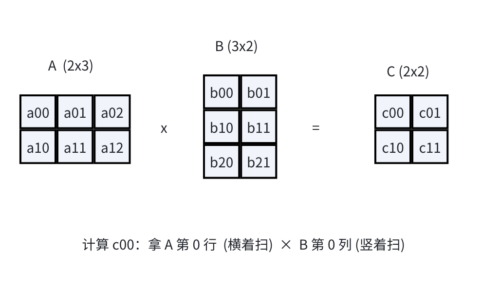

# 从零理解 GEMM：从 CPU 矩阵乘到 Hopper GPU 高性能实现

高性能 GEMM 模板库，学习 GPU Tensor Core 编程范式

[CUTLASS GitHub](https://github.com/NVIDIA/cutlass)

> 本文是给初学者的中文教程，目标是把「矩阵乘法（GEMM）为什么要这么优化」讲清楚。 我们从 CPU 上最朴素的三重循环开始，一步步过渡到 GPU，再一步步优化， 最后概述 NVIDIA Hopper 架构（H100 / H20）上的新特性 TMA 和 WGMMA。
>
> 本文暂未附完整的可编译实验程序；你可以把代码片段补全并保存为 `hopper_gemm.cpp`，再按第 12 节的方法编译运行。
>
> 这是**初版**。Hopper 的高级特性（TMA / WGMMA / 软件流水线 / Warp 专用化）以后再详解 本版先讲清楚「是什么、为什么」
>
> **说明：** 文中的代码片段是便于讲解优化思路的教学骨架；为突出主线，部分边界判断、资源检查和错误处理有所省略，实际运行前请补全。

------

## 目录

1. [什么是矩阵乘法 GEMM](#section-1)
2. [CPU 上的基础实现](#section-2)
3. [为什么慢？内存墙问题](#section-3)
4. [CPU 上的第一步优化：分块（Tiling）](#section-4)
5. [过渡到 GPU：并行的思想](#section-5)
6. [GPU 内存层次与线程层次](#section-6)
7. [GPU 优化第一步：Naive Kernel](#section-7)
8. [GPU 优化第二步：共享内存分块](#section-8)
9. [GPU 优化第三步：Tensor Core](#section-9)
10. [Hopper 架构的新武器：TMA 与 WGMMA](#section-10)
11. [更深的优化：流水线与 Warp 专用化](#section-11)
12. [如何验证正确性和性能](#section-12)

------

## 1. 什么是矩阵乘法 GEMM

GEMM = **GE**neral **M**atrix **M**ultiply，通用矩阵乘法。

我们要算的是 `C = A × B`：

- `A` 是 `M × K` 的矩阵（M 行，K 列）
- `B` 是 `K × N` 的矩阵（K 行，N 列）
- `C` 是 `M × N` 的矩阵（M 行，N 列）

数学定义：C 中第 i 行第 j 列的元素，等于 A 的第 i 行和 B 的第 j 列做「点积」：

```text
C[i][j] = A[i][0]*B[0][j] + A[i][1]*B[1][j] + ... + A[i][K-1]*B[K-1][j]
```

用图来看（M=2, K=3, N=2 的小例子）：



**关键观察**：算一个 C 元素需要 K 次乘加；整个 C 有 M×N 个元素， 所以总共约 `2·M·N·K` 次浮点运算（FLOP，乘和加各算一次）。 这就是我们后面衡量性能的分母。

> **为什么 GEMM 这么重要？** 神经网络里几乎所有的核心计算（全连接层、卷积、注意力机制） 最终都归结为矩阵乘法。GPU 之所以能撑起现代 AI，本质上就是因为它能 极快地做矩阵乘法。所以「把 GEMM 优化到极致」是 GPU 编程的核心课题。

------

## 2. CPU 上的基础实现

最直白的写法就是照着数学定义写三重循环：

```cpp
// A: M×K, B: K×N, C: M×N   (按行主序 row-major 存储)
void gemm_cpu_naive(int M, int N, int K,
                    const float* A, const float* B, float* C) {
    for (int i = 0; i < M; ++i) {          // 遍历 C 的每一行
        for (int j = 0; j < N; ++j) {      // 遍历 C 的每一列
            float acc = 0.0f;
            for (int k = 0; k < K; ++k) {  // 点积累加
                acc += A[i*K + k] * B[k*N + j];
            }
            C[i*N + j] = acc;
        }
    }
}
```

这段代码**逻辑完全正确**，也是我们后面用来「对答案」的标准（ground truth）。

问题是：它**慢**。为什么？

------

## 3. 为什么慢？内存墙问题

现代 CPU/GPU 的算术单元（ALU）非常快，但从内存里搬数据很慢。 一个经典的对比：

```text
  操作                      大致延迟（周期）
  ─────────────────────────────────────────
  一次浮点乘加               ~ 1
  从 L1 缓存读一个数         ~ 4
  从 L2 缓存读一个数         ~ 12
  从主内存（DRAM）读一个数   ~ 200+   ◄── 慢 200 倍！
```

再看 naive 实现干了什么。算 C 的每一行时，内层循环要**完整扫一遍 B 的一列**。 算下一列时，又要重新读 B 的下一列……**B 矩阵被反复地从内存里搬进搬出**。

```text
   算 C 第 0 行：           读了 B 的全部 N 列
   算 C 第 1 行：           又把 B 的全部 N 列重新读了一遍
   ...
   算 C 第 M-1 行：         再读一遍
   → B 总共被读了 M 次！A 每个元素也被读了 N 次。
```

数据量一大，缓存装不下，就得反复访问慢速主内存。 **计算单元大部分时间在「等数据」，而不是在算**。这就是内存墙。

**核心优化思想**（贯穿全文）：

> 让每个从慢速内存搬进来的数据，被**尽可能多地复用**，再扔掉。 也就是提高「计算 / 访存」的比值（算术强度，arithmetic intensity）。

------

## 4. CPU 上的第一步优化：分块（Tiling）

既然反复读整个 B 不划算，那就**分块**：把大矩阵切成小方块， 一次只处理能塞进缓存的小块，把它们「用干净」再换下一块。

```text
        A                    B                     C
   ┌────┬────┐          ┌────┬────┐          ┌────┬────┐
   │ A0 │ A1 │          │ B0 │ B1 │          │ C0 │ C1 │
   ├────┼────┤    ×     ├────┼────┤    =     ├────┼────┤
   │ A2 │ A3 │          │ B2 │ B3 │          │ C2 │ C3 │
   └────┴────┘          └────┴────┘          └────┴────┘

   C0 = A0×B0 + A1×B2   ← 每个小块结果 = 若干小块乘积之和
   C1 = A0×B1 + A1×B3
   ...
```

代码上就是在外面再套一层「块循环」：

```cpp
const int T = 64;  // 块大小，要让 A块+B块+C块 能塞进 L1/L2 缓存
for (int i0 = 0; i0 < M; i0 += T)
  for (int j0 = 0; j0 < N; j0 += T)
    for (int k0 = 0; k0 < K; k0 += T)
      // ── 下面处理一个 T×T 的小块，此时数据都在缓存里，反复用 ──
      for (int i = i0; i < i0+T; ++i)
        for (int j = j0; j < j0+T; ++j)
          for (int k = k0; k < k0+T; ++k)
            C[i*N+j] += A[i*K+k] * B[k*N+j];
```

一个块被载入缓存后，块内的元素被复用 T 次才被换出，访存次数大幅下降。

**这个「分块」思想是 GEMM 优化的灵魂，GPU 上会一层层重复使用它。**

------

## 5. 过渡到 GPU：并行的思想

回到 naive 三重循环的本质：

```cpp
for (int i = 0; i < M; ++i)      // 这两层循环之间
  for (int j = 0; j < N; ++j)    // 彼此完全独立！
    C[i][j] = <A第i行 · B第j列>;  // 算 c[i][j] 不依赖 c[其他]
```

**关键洞察**：C 的每个元素 `C[i][j]` 都可以**独立、同时**计算， 互不干扰。CPU 只有几十个核，只能一个个（或几十个）算。 而 **GPU 有上万个计算单元**，天生适合「同时算几万个 C 元素」。

于是 GPU 的策略是：

```text
   CPU 思维：   一个循环，跑 M×N 次
   GPU 思维：   开 M×N 个「线程」，每个线程只负责算 1 个 C[i][j]
              →  这 M×N 个线程「同时」跑
```

只保留最内层的 K 循环（点积累加没法拆），外面的 i、j 循环 交给 GPU 硬件的「线程并行」去做。这就是从 CPU 到 GPU 的思维转变。

------

## 6. GPU 内存层次与线程层次

要在 GPU 上做好优化，必须理解它的两个「层次结构」，它们是一一对应的。

### 6.1 内存层次（从大慢到小快）

```text
  ┌──────────────────────────────────────────────┐
  │  全局内存 GMEM / HBM   ~几十 GB   最慢          │  ← 整个 GPU 共享
  │  (显存)                ~3 TB/s                │
  ├──────────────────────────────────────────────┤
  │  共享内存 SMEM         ~228 KB/SM  快很多       │  ← 每个 SM 一份
  │  (片上,可编程,类似手动管理的缓存)                 │    (一个线程块独占)
  ├──────────────────────────────────────────────┤
  │  寄存器 RMEM           几百 KB/SM  最快         │  ← 每个线程私有
  └──────────────────────────────────────────────┘
```

与 CPU 缓存最大的不同：**共享内存（SMEM）是程序员手动管理的**。 你自己决定把哪块数据搬进来、什么时候搬。这既是负担也是优化空间。

### 6.2 线程层次（从粗到细）

```text
   Grid（网格，整个 kernel 的所有线程）
     └─ Block（线程块 / CTA，跑在一个 SM 上）
          └─ Warp（32 个线程，硬件调度的最小单位，锁步执行）
               └─ Thread（单个线程，有自己的寄存器）
```

### 6.3 两个层次的对应关系

这是 GPU GEMM 的核心设计原则：**每下降一个内存层次，就对应线程层次的一层分块。**

```text
   内存层次              线程层次           分块动作
   ──────────────────────────────────────────────────────
   GMEM  ──搬到──►  SMEM   ↔  Block   ：大块 A、B 搬进共享内存
   SMEM  ──搬到──►  RMEM   ↔  Warp/Thread：小块搬进寄存器
   在 RMEM 里             ↔  Thread   ：真正做乘加运算
```

换句话说：**第 4 节 CPU 上的「分块」思想，在 GPU 上被套了好几层**—— 一层给线程块（切进共享内存），一层给线程（切进寄存器）。

------

## 7. GPU 优化第一步：Naive Kernel

先把 naive 三重循环直接搬上 GPU：每个线程算一个 C 元素。

```cpp
__global__ void gemm_gpu_naive(int M, int N, int K,
                               const float* A, const float* B, float* C) {
    // 用线程的二维编号定位这个线程负责哪个 C[row][col]
    int row = blockIdx.y * blockDim.y + threadIdx.y;
    int col = blockIdx.x * blockDim.x + threadIdx.x;
    if (row < M && col < N) {
        float acc = 0.0f;
        for (int k = 0; k < K; ++k)             // 只剩这一层循环
            acc += A[row*K + k] * B[k*N + col];
        C[row*N + col] = acc;
    }
}
```

启动方式（把 C 切成 16×16 的线程块网格）：

```cpp
dim3 block(16, 16);
dim3 grid((N + 15)/16, (M + 15)/16);
gemm_gpu_naive<<<grid, block>>>(M, N, K, A, B, C);
        整个 C 矩阵被切成很多 16×16 的小块
   ┌──────┬──────┬──────┐
   │block │block │block │   每个 block = 一个 16×16 的线程块
   ├──────┼──────┼──────┤   block 里每个线程 → 算 1 个 C 元素
   │block │block │block │
   └──────┴──────┴──────┘
```

**它比 CPU 快很多**（几万个线程并行），但**远没到 GPU 的极限**。 问题和 CPU naive 一样：每个线程都从慢速 GMEM 反复读 A、B。 相邻线程读的数据大量重叠，却各读各的，浪费了带宽。

------

## 8. GPU 优化第二步：共享内存分块

思路和第 4 节完全一样：**先把一块数据从 GMEM 搬到快速的 SMEM， 让整个线程块的线程共享复用，用完再搬下一块。**

一个线程块负责算 C 的一个 `TILE×TILE` 块。沿 K 方向一步步推进：

```text
   沿 K 方向循环，每一步：
   ┌────────────────────────────────────────────────┐
   │ 1. 全块协作，把 A 的一个子块搬进 SMEM (As)       │
   │    把 B 的一个子块搬进 SMEM (Bs)                 │
   │ 2. __syncthreads()  等所有线程搬完                │
   │ 3. 每个线程从 SMEM 里读数据，累加自己那个 C 元素 │
   │ 4. __syncthreads()  等所有线程算完，再搬下一块    │
   └────────────────────────────────────────────────┘

     GMEM              SMEM (共享,快)           寄存器
   ┌───────┐  搬一次   ┌────────┐   块内       ┌──────┐
   │ A 大块│ ───────► │As 小块 │ ──复用多次──►│ acc  │
   │ B 大块│ ───────► │Bs 小块 │              │(每线程│
   └───────┘          └────────┘              │ 私有)│
                                              └──────┘
```

核心代码骨架：

```cpp
#define TILE 16
__global__ void gemm_gpu_tiled(int M, int N, int K,
                               const float* A, const float* B, float* C) {
    __shared__ float As[TILE][TILE];   // 共享内存里的 A 子块
    __shared__ float Bs[TILE][TILE];   // 共享内存里的 B 子块

    int row = blockIdx.y*TILE + threadIdx.y;
    int col = blockIdx.x*TILE + threadIdx.x;
    float acc = 0.0f;

    for (int t = 0; t < K; t += TILE) {         // 沿 K 分块推进
        As[threadIdx.y][threadIdx.x] = A[row*K + (t + threadIdx.x)];
        Bs[threadIdx.y][threadIdx.x] = B[(t + threadIdx.y)*N + col];
        __syncthreads();                        // 等大家都搬完

        for (int k = 0; k < TILE; ++k)          // 只在 SMEM 里算
            acc += As[threadIdx.y][k] * Bs[k][threadIdx.x];
        __syncthreads();                        // 等大家都算完
    }
    C[row*N + col] = acc;
}
```

**为什么快了？** 一个 A/B 元素搬进 SMEM 后，会被块里 TILE 个线程复用， 访问 GMEM 的次数降到原来的约 `1/TILE`。这是最经典、性价比最高的 GPU GEMM 优化。

> 再往下还能继续分块：让**每个线程算多个 C 元素**（寄存器分块 register tiling）， 进一步提高复用。原理还是「分块 + 复用」，只是层次更细，本版先不展开。

------

## 9. GPU 优化第三步：Tensor Core

到这里我们用的都是普通 CUDA 核心（SIMT core），一次做一个标量乘加。

从 Volta 架构开始，NVIDIA GPU 加入了 **Tensor Core**： 一种专门做「小矩阵块乘加」的硬件单元，一条指令直接算一小块矩阵乘， 比标量乘加快好几倍（尤其在 FP16/TF32 等低精度下）。

```text
   普通 CUDA 核心：      一次算   c += a * b      （标量）
   Tensor Core：        一次算   D = A×B + C      （比如 16×16 的小矩阵块！）
                        └── 一条指令干几百次乘加
```

要用 Tensor Core，编程接口是 **WMMA**（Warp Matrix Multiply Accumulate）： 一个 warp（32 线程）协作，用 `wmma::` API 加载小矩阵片段（fragment）、 做矩阵乘累加、再写回。数据类型通常是 FP16 输入、FP32 累加。

关键点：

- **精度**：输入用 half（FP16），累加器用 float（FP32），兼顾速度和精度。
- **粒度**：不再是「一个线程一个元素」，而是「一个 warp 一小块矩阵」。
- **对齐**：矩阵维度通常要按 16 对齐。

将前面的代码骨架整理成实验程序后，可以加入一个使用 WMMA 的 Tensor Core 版本，直接比较它与 naive 和 tiled 版本的性能差异。

------

## 10. Hopper 架构的新武器：TMA 与 WGMMA

H20 / H100 属于 **Hopper 架构**（计算能力 sm_90）。 它在 Tensor Core 基础上又加了两个专门加速 GEMM 的硬件特性。 **本版只讲清楚「是什么、解决什么问题」，实现细节等你要深入时我再补。**

### 10.1 WGMMA —— 更大的 Tensor Core 指令

WGMMA = **W**arp**G**roup **M**atrix **M**ultiply **A**ccumulate。

- 老的 WMMA 是**一个 warp（32 线程）**协作算一小块。
- WGMMA 是**一个 warp group（4 个 warp = 128 线程）**协作， 一条指令算更大的块（比如 `64×N×16`），Tensor Core 利用率更高。
- 而且 WGMMA 是**异步**的：发起指令后线程可以去干别的，算完再来收结果。

```text
   WMMA：   1 warp (32 线程)   →  较小的块
   WGMMA：  1 warp group (128 线程) → 更大的块 + 异步执行
                                      └── 更适合喂饱 Hopper 的 Tensor Core
```

### 10.2 TMA —— 专用的数据搬运引擎

TMA = **T**ensor **M**emory **A**ccelerator。

之前把数据从 GMEM 搬到 SMEM，是让**每个线程各搬几个元素**（`cp.async`）， 线程一边搬一边还要算地址，占用寄存器和指令。

TMA 是一个**专门的硬件 DMA 引擎**：

```text
   传统方式：      每个线程自己算地址、自己搬自己那份 → 线程很忙
   TMA 方式：      只让 1 个线程说一句「把这块 tile 搬过去」
                  → 硬件引擎独立完成整块搬运，其他线程去干别的
                  → 异步，配合「屏障 barrier」通知搬完了
```

好处：

- 一条指令搬一大块，线程从「搬运工」里解放出来专心计算。
- 异步：搬数据和算数据可以**重叠**（这是下一节流水线的基础）。
- 自动处理复杂的 SMEM「swizzle」排布（避免 bank 冲突），这块很繁琐，交给硬件。

### 10.3 TMA + WGMMA 配合

Hopper 上高性能 GEMM 的典型套路：

```text
   TMA  负责：GMEM ──异步搬──► SMEM      （数据供给）
   WGMMA 负责：SMEM ──异步算──► 累加到寄存器  （矩阵计算）
              两者异步 + 重叠 → Tensor Core 几乎不空闲
```

原论文里提到，仅仅用上 TMA + WGMMA（还没加流水线）， 性能就比基础 CuTe 版本提升了约 **7 倍**。

------

## 11. 更深的优化：流水线与 Warp 专用化

这些是把性能从「不错」推到「接近极限」的高级技巧，概述一下， 本版不展开代码，等你需要时我再细讲。

**（1）软件流水线（Software Pipelining）** 准备多个 SMEM 缓冲区（多 buffer）。当 Tensor Core 在算第 t 块时， TMA 已经在偷偷搬第 t+1 块了。**搬运和计算重叠**，隐藏内存延迟。

```text
   无流水线：  搬块0 → 算块0 → 搬块1 → 算块1 → ...  (搬的时候算力闲着)
   有流水线：  搬块0 → 搬块1 → 搬块2 ...
                      算块0 → 算块1 ...            (搬和算同时进行)
```

**（2）Warp 专用化（Warp Specialization）** 把线程块里的 warp 分工：一部分当「生产者」专门用 TMA 搬数据， 另一部分当「消费者」专门用 WGMMA 算。生产者-消费者模式，配合队列同步。

**（3）持久化 Kernel（Persistent Kernel）** 让线程块「常驻」在 SM 上，一个块干完一个输出 tile 接着干下一个， 避免反复启动 kernel 的开销。

**（4）Ping-Pong 调度** 两组消费者 warp group 各算一个输出 tile，一组在写结果（epilogue）时， 另一组在算下一块，让 Tensor Core 一刻不停。原论文说这一招是 逼近 280 TFLOPS 的关键。

这些优化正是 CUTLASS / CuTe 库帮你封装好的，手写非常复杂。 本教程的代码走「纯手写 CUDA」路线，重点让你看懂 naive → 分块 → Tensor Core 这条主线；Hopper 的极致优化用 cuBLAS 做性能上界的对照。

------

## 12. 如何验证正确性和性能

可以按下面的建议工作流组织实验程序：

1. 随机生成 A（M×K）、B（K×N），数据类型是 **half（FP16）**。

2. 用 **CPU** 算一份标准答案（FP32 累加）。

3. 用多个 GPU kernel 各算一份：

   - naive kernel（一个线程一个元素）
   - 共享内存分块 kernel
   - Tensor Core（WMMA）kernel
   - cuBLAS（NVIDIA 官方库，作为性能上界参考）

4. **正确性**：把每个 GPU 结果和 CPU 结果逐元素比较， FP16 有精度误差，所以用「相对误差 + 绝对误差」容忍阈值判断 PASS/FAIL。

5. **性能**：每个版本用 CUDA event 计时，换算成 **GFLOPS** （= `2·M·N·K / 时间`），打印对比表格。

### 编译命令

如果你将前文代码片段补全并保存为 `hopper_gemm.cpp`，可以使用：

```bash
nvcc -O3 -arch=sm_90a -lcublas hopper_gemm.cpp -o hopper_gemm
```

> 说明：
>
> - `-arch=sm_90a`：H20 / H100 是 Hopper，计算能力 sm_90， 后缀 `a` 开放 Hopper 专属指令。
> - `-lcublas`：链接 cuBLAS 库（用作性能对照）。
> - 文件名是 `.cpp`，nvcc 也能编译（它会按 CUDA 处理里面的 `__global__`）。

### 运行命令

程序参数就是 **A 的行、A 的列、B 的行、B 的列**：

```bash
# 用法： ./hopper_gemm  A_rows  A_cols  B_rows  B_cols
./hopper_gemm 1024 1024 1024 1024
```

- `A_cols` 必须等于 `B_rows`（否则矩阵不能相乘，程序会报错）。
- 于是 `M = A_rows`, `K = A_cols = B_rows`, `N = B_cols`。

### 输出示例（示意）

```text
Matrix: A(1024x1024) x B(1024x1024) = C(1024x1024)
─────────────────────────────────────────────────────────
Version           Time(ms)     GFLOPS    Correctness
─────────────────────────────────────────────────────────
CPU (baseline)    xxxx.xx        x.x        --
GPU naive           xx.xx      xxx.x       PASS
GPU tiled(SMEM)      x.xx      xxx.x       PASS
GPU TensorCore       x.xx     xxxx.x       PASS
cuBLAS               x.xx     xxxx.x       PASS
─────────────────────────────────────────────────────────
```

------

## 小结与下一步

我们走过的主线：

```text
   CPU naive 三重循环
        │  发现内存墙：数据反复搬，算力空转
        ▼
   CPU 分块 (tiling)  —— 复用缓存
        │  发现 C 各元素独立可并行
        ▼
   GPU naive —— 一个线程一个 C 元素，大规模并行
        │  还是反复读 GMEM
        ▼
   GPU 共享内存分块 —— 块内复用 SMEM   ★经典优化
        │  标量乘加不够快
        ▼
   Tensor Core (WMMA) —— 硬件加速小矩阵块乘
        │
        ▼
   Hopper: TMA(搬运) + WGMMA(计算) + 流水线 + Warp专用化 —— 逼近硬件极限
                                                        (CUTLASS/cuBLAS 封装)
```

**贯穿始终的一个思想**：想办法让搬进快速内存的数据被复用得越多越好， 让计算单元（尤其 Tensor Core）尽量别闲着。
