# CCF-CSP 总结

## 语言基操（C++）

### 一、头文件

```c++
#include <iostream>
#include <cstring> // 可用于memset操作
#include <string>
#include <sstream>
#include <algorithm>
#include <vector>
#include <unordered_set>
#include <iomanip> (格式化输出)
#include <initial
#include <initializer_list> (它让函数／构造函数之类的东西能接受用 { … } 花括号包起来的一批同类型常量值。)
#include <climits> (里面有INT_MAX)
#include <numeric> //求和函数
```


### 二、输入操作

#### ①分割以空格间隔的多字符串输入

```C++
#include <iostream>
#include <sstream>
#include <vector>
#include <string>
using namespace std;

int main() {
    string input;
    getline(cin, input);  // 读取整行输入[[3]]
    
    vector<string> arr;
    istringstream iss(input);
    string token;
    
    while (iss >> token) {  // 自动按空格分割[[9]]
        arr.push_back(token);
    }
    
    // 输出验证
    for (const auto& s : arr) {
        cout << s << endl;
    }
    return 0;
}

```


#### ②去重添加元素

**方法 1：使用 std::find 遍历检查（适合小规模数据）**

```c++
#include <iostream>
#include <vector>
#include <algorithm> // 需要包含此头文件以使用 std::find

using namespace std;

int main() {
    vector<int> arr;
    int num;
    
    while (cin >> num) {
        // 检查元素是否已存在
        if (find(arr.begin(), arr.end(), num) == arr.end()) {
            arr.push_back(num);
        }
    }
    
    // 打印结果
    for (int x : arr) {
        cout << x << " ";
    }
    return 0;
}

```

**方法 2：使用 `std::unordered_set` 辅助去重（适合大规模数据）**

```C++
#include <iostream>
#include <vector>
#include <unordered_set>

using namespace std;

int main() {
    vector<int> arr;
    unordered_set<int> seen; // 辅助哈希集合
    int num;
    
    while (cin >> num) {
        // 检查元素是否已存在
        if (seen.find(num) == seen.end()) {
            arr.push_back(num);
            seen.insert(num); // 更新集合
        }
    }
    
    // 打印结果
    for (int x : arr) {
        cout << x << " ";
    }
    return 0;
}
```

**方法 3：先添加再去重（适合允许后处理的场景）**(只能处理相邻重复如1122334455)

```C++
#include <iostream>
#include <vector>
#include <algorithm>

using namespace std;

int main() {
    vector<int> arr;
    int num;
    
    while (cin >> num) {
        arr.push_back(num); // 先全部添加
    }
    
    // 去重操作
    sort(arr.begin(), arr.end());
    auto last = unique(arr.begin(), arr.end());
    arr.erase(last, arr.end());
    
    // 打印结果
    for (int x : arr) {
        cout << x << " ";
    }
    return 0;
}
```


### 三、结构体

#### ①结构体的构造函数

```C++
struct State {
    int pos;       // 当前节点编号
    int used;      // 已使用的新增路由数
    int steps;     // 已走过的步数
    State(int p, int u, int s) : pos(p), used(u), steps(s) {}
};
```


### 四、STL算法（函数）

#### （1）sort（首元素地址（必填)、尾元素地址的下一个地址（必填）、比较函数（非必填））

```c++
#include <algorithm>

vector<int> arr(n);
sort(arr.begin(), arr.end());
//默认升序，O(n log n)

compare函数（自定义规则排序）（参数不一定要const和引用，变量内存大的时候比较有用）：
1.从大到小来排序：
bool cmp(int a, int b)
{
    return a>b; //理解为当a>b时把a放在b的前面
}
2.结构体数组排序：
struct node
{
    int x, y;
}ssd[10];

①一级排序
bool cmp(node a, node b)
{
    return a.x > b.x; //按x值从大到小对结构体数组排序
}

②二级排序
bool cmp(node a, node b)
{
    if(a.x != b.x)
        return a.x>b.x;
    else
        return a.y<b.y //先按x从大到小排序，x相等的时候，按y从小到大排序
}

3.容器的排序（vector/string/queue)
sort(vi.begin(), vi.end(), cmp);
```

#### （2）min_element()

```C++
#include <algorithm>
#include <iostream>

int main() {
    int arr[] = {3, -5, 2, 7, -1};
    int n = sizeof(arr) / sizeof(arr[0]);
    // 返回一个指向数组中最小元素的指针（迭代器）
    int* min_it = std::min_element(arr, arr + n);
    if (min_it != arr + n) {
        std::cout << "最小值是: " << *min_it << std::endl;
    }
    return 0;
}
```

#### （3）min()

```C++
std::min 在 <algorithm> 中有多个重载。其中有一个版本是：
template< class T >
T min(std::initializer_list<T> ilist);
这个版本让你可以这么写：
std::min({3, 7, 2, 9, 4})
意思是：将 {3,7,2,9,4} 构造成一个 initializer_list<int>，然后 std::min 在这个列表里找最小值。实现上它内部可能调用 std::min_element(ilist.begin(), ilist.end()) 来找最小值。
```

#### （4）accumulate()和reduce()

```C++
std::accumulate 是 C++ 标准库 <numeric> 中定义的一个函数，用于计算指定范围内元素的累积值，通常用于求和。
#include <iostream>
#include <vector>
#include <numeric>

int main() {
    std::vector<int> vec = {1, 2, 3, 4, 5};
    int sum = std::accumulate(vec.begin(), vec.end(), 0);
    std::cout << "Sum: " << sum << std::endl;
    return 0;
}
说明：
vec.begin() 和 vec.end() 定义了要累加的范围。
0 是累加的初始值。
std::accumulate 会将初始值与范围内的每个元素依次相加，返回最终的累积结果。
```

```C++
std::reduce 是 C++17 引入的一个算法，类似于 std::accumulate，但支持并行执行，适用于大规模数据的求和。
#include <iostream>
#include <vector>
#include <numeric>

int main() {
    std::vector<int> vec = {1, 2, 3, 4, 5};
    int sum = std::reduce(vec.begin(), vec.end(), 0);
    std::cout << "Sum: " << sum << std::endl;
    return 0;
}

```

#### （5）stoi()

***stoi* 是 C++ 标准库中的一个函数，用于将字符串转换为整数。它可以处理不同进制的字符串，并将其转换为十进制整数。**

**示例代码:**

```C++
#include <iostream>

#include <string>

int main() {

std::string str = "123";

int num = std::stoi(str);

std::cout << "转换后的整数是: " << num << std::endl; // 输出: 123

return 0;

}


```

**使用方法**:

*stoi* 函数的定义如下：

int stoi(const std::string& str, std::size_t* pos = nullptr, int base = 10);

- **str**: 待转换的字符串。
- **pos**: 用于存储第一个未转换字符的位置（可选）。
- **base**: 字符串中数字的进制，默认为10。

**进制转换示例**:

```c++
#include <iostream>

#include <string>

int main() {

std::string binaryStr = "100";

int num = std::stoi(binaryStr, nullptr, 2); // 将二进制字符串 "100" 转换为十进制整数

std::cout << "二进制字符串转换后的整数是: " << num << std::endl; // 输出: 4

return 0;

}
```

**异常处理**:

在使用 *stoi* 时，建议加入异常处理，以防止输入无效字符串或超出范围。

```c++
#include <iostream>

#include <string>

#include <stdexcept>

int main() {

try {

std::string str = "abc";

int num = std::stoi(str);

} catch (const std::invalid_argument& e) {

std::cerr << "无效参数: " << e.what() << std::endl;

} catch (const std::out_of_range& e) {

std::cerr << "超出范围: " << e.what() << std::endl;

}

return 0;

}
```


#### （6）reverse()

C++ 提供了一个通用算法 `std::reverse()`，可以用来反转 `std::string` 的字符

```c++
#include <algorithm>
#include <string>

std::string s = "hello";
std::reverse(s.begin(), s.end()); // 原地反转
```

这个函数接收一对迭代器，表示要反转的范围（开始到结束），并直接 **修改原字符串**。


### 五、格式化输出操作

#### ①输出固定小数位数

```C++
#include <iostream>
#include <iomanip>  // 必须包含这个头文件

// 假设已经计算出 max_val 和 min_val
std::cout << std::fixed << std::setprecision(3); // 固定小数点 + 保留3位
std::cout << "Max: " << max_val << "\n";
std::cout << "Min: " << min_val << std::endl;

std::cout.unsetf(std::ios::fixed);  // 取消固定小数点
std::cout << std::setprecision(6);  // 恢复默认精度（通常为6）
```


### 六、STL数据结构

#### ①map和unordered_map区别及其优缺点

##### 前言

C++的STL库实现有两种字典结构，即map和unordered_map（也就是通俗意义上的hash map）。这两者虽然都称为Map，但其实它们的底层实现原理具有很大差距，因此它们的使用场景也不尽相同。

今天特意研究了一下，下面从几个方面具体谈谈它们的差别及其具体的使用场景。

##### 介绍

字典类型又被称为关联数组（associative array），关联数组和正常数组的使用方法是相似的，但其不同之处在于字典结构的下标不必是整数，而可以是任意类型。

map和unordered_map这两种**字典结构**都是通过键值对（key-value）存储数据的，**键（key）和值（value）的数据类型可以不同**。但是字典中的**key只能存在一个，即必须唯一**（如果不唯一，则被称为multimap）。上述这点保证了值（value）可以直接通过键（key）来访问，这便是字典结构最为便捷之处。

##### 区别

1. **使用方法不同**
使用方法是最直观的区别，这两种结构虽然都在STL库中，但是所使用的头文件不同。

map：#include <map>
unordered_map：#include <unordered_map>

2. **底层实现的数据结构不同**
数据结构其实是两种类型最为根本的区别，其他的不同都是这种区别产生的结果。

map是基于**红黑树**结构实现的。红黑树是一种平衡二叉查找树的变体结构，它的左右子树的高度差有可能会大于 1。所以红黑树不是严格意义上的平衡二叉树AVL，但对之进行平衡的代价相对于AVL较低， 其平均统计性能要强于AVL。红黑树具有自动排序的功能，因此它使得map也具有按键（key）排序的功能，因此在map中的元素排列都是有序的。在map中，红黑树的每个节点就代表一个元素，因此实现对map的增删改查，也就是相当于对红黑树的操作。**对于这些操作的复杂度都为O(logn)，复杂度即为红黑树的高度。**
unordered_map是基于**哈希表（也叫散列表）**实现的。散列表是根据关键码值而直接进行访问的数据结构。也就是说，它通过把关键码值映射到表中一个位置来访问记录，以加快查找的速度。这个映射函数叫做散列函数，存放记录的数组叫做散列表。散列表使得**unordered_map的插入和查询速度接近于O(1)（在没有冲突的情况下），但是其内部元素的排列顺序是无序的**。

3. 元素排列顺序不同
在2中已经解释过了，现在单独列出该点不同之处。

map：基于红黑树，元素有序存储
unordered_map：基于散列表，元素无序存储
4. 插入和查询的时间复杂度不同
这点也已经在2中已经解释过了，现在单独列出该点不同。

map：基于红黑树，复杂度与树高相同，**即O(logn)。**
unordered_map：基于散列表，复杂度依赖于散列函数产生的冲突多少，**但大多数情况下其复杂度接近于O(1)。**

5. 效率及其稳定性不同
这点实际上也是由底层的数据结构决定的。

存储空间：unordered_map的散列空间**会存在部分未被使用的位置，所以其内存效率不是100%的。而map的红黑树的内存效率接近于100%。**
查找性能的稳定性：map的查找类似于平衡二叉树的查找，**其性能十分稳定**。例如在1M数据中查找一个元素，需要多少次比较呢？20次。map的查找次数几乎与存储数据的分布与大小无关。而unordered_map依赖于散列表，如果哈希函数映射的关键码出现的冲突过多，**则最坏时间复杂度可以达到是O(n)**。因此unordered_map的查找次数是与存储数据的分布与大小有密切关系的，它的效率是**不稳定**的。

##### 优缺点及适用场景

map：
优点：
map元素**有序**（这是map最大的优点，其元素的有序性在很多应用中都会简化很多的操作）；
其红黑树的结构使得map的很多操作都可在**O(logn)下完成；**
map的各项性能较为稳定，与元素**插入顺序无关；**
map支持范围查找。
缺点：
占用的空间大：红黑树的每一个节点需要保存其父节点位置、孩子节点位置及红/黑性质，因此每一个**节点占用空间大**。
查询**平均时间不如unordered_map。**
适用场景：
元素需要有序；
对于单次查询时间较为敏感，必须保持查询性能的稳定性，比如实时应用等等。
unordered_map
优点：
查询**速度快**，平均性能接近于**常数时间O(1)；**
缺点：
元素无序；
unordered_map相对于map**空间占用更大，且其利用率不高；**
查询性能不太稳定，**最坏时间复杂度可达到O(n)。**
适用场景：
要求查找速率快，且对单次查询性能要求不敏感。
结语
map和unordered_map并无好坏之分，它们都有各自应用的场景。它们之间的区别归根结底来源于使用的数据结构不同。

最后一句话，总结一下它们的适用场景：
在需要元素**有序性或者对单次查询性能**要求较为敏感时，请使用map，其余情况下应使用unordered_map。
因此在需要使用字典结构进行算法编程的大部分情况下，都需要使用unordered_map而不是map。

##### 拓展 ：

c++ std中set与unordered_set区别和map与unordered_map区别类似：

**set 基于红黑树实现**，红黑树具有自动排序的功能，因此 set 内部所有的数据，在任何时候，都是有序的。
**unordered_set 基于哈希表**，数据插入和查找的时间复杂度很低，几乎是常数时间，而代价是**消耗比较多的内存，无自动排序功能**。底层实现上，使用一个下标范围比较大的数组来存储元素，形成很多的桶，利用 hash 函数对 key 进行映射到不同区域进行保存。


#### ②汇总（CSDN)

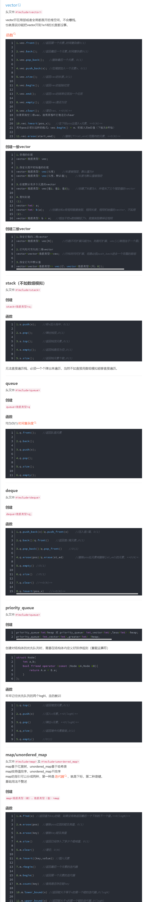

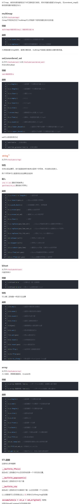

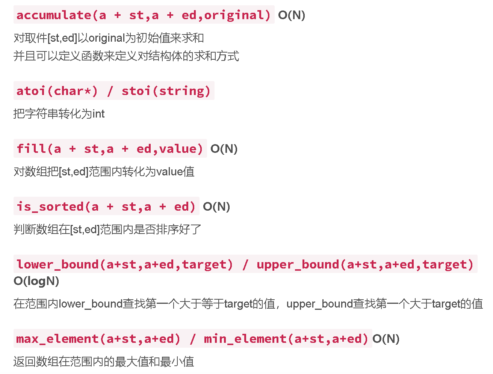

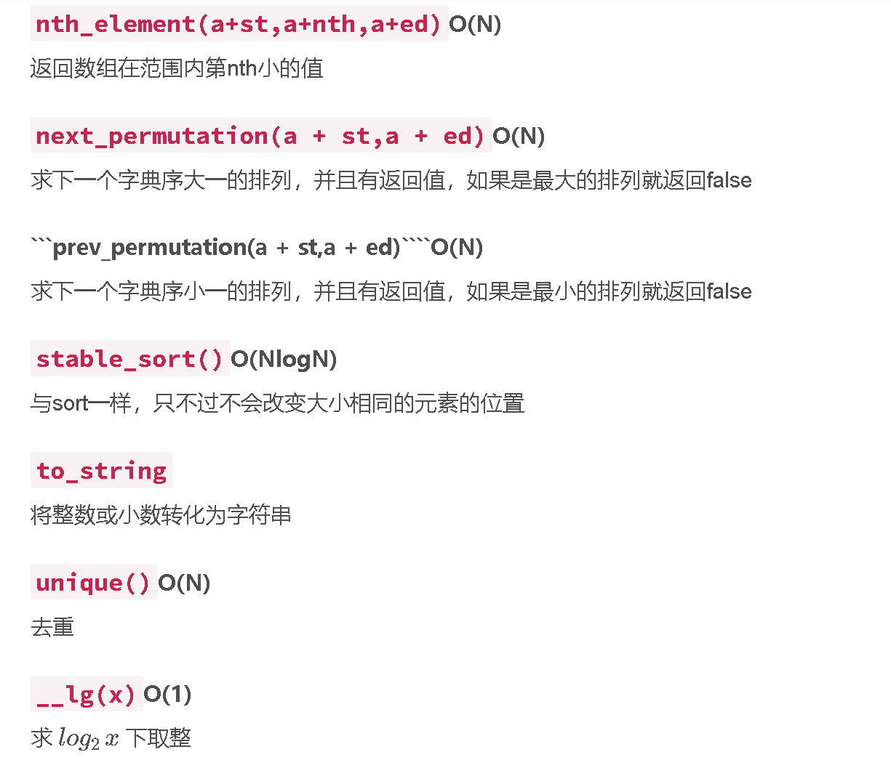


#### ③list

##### 1. 初始化双向链表
使用`std::list`的构造函数或初始化列表直接创建链表。

```cpp
#include <list>
#include <algorithm> // 用于 std::find

std::list<int> myList = {1, 2, 3, 4}; // 初始化链表
或
int n = 5; // 假设初始化 5 个节点
std::list<int> myList(n, -1); // 创建包含 5 个 -1 的链表
或
int n = 5;
std::list<int> myList;
for (int i = 0; i < n; ++i) {
    myList.push_back(-1); // 插入 n 个 -1
}
```

---

##### 2. 删除节点
**方法一：根据值删除**

用`remove`方法删除所有匹配值的节点。
```cpp
myList.remove(3); // 删除所有值为3的节点
```

**方法二：根据迭代器删除**

用`erase`删除指定位置的节点。
```cpp
auto it = std::find(myList.begin(), myList.end(), 3);
if (it != myList.end()) {
    myList.erase(it); // 删除迭代器指向的节点
}
```

---

##### 3. 移动节点到头部或尾部
使用`splice`方法高效移动节点（**时间复杂度O(1)**）。

**移动到头部**

```cpp
auto it = std::find(myList.begin(), myList.end(), 3);
if (it != myList.end()) {
    myList.splice(myList.begin(), myList, it); // 移动到头部
}
// 示例：1,2,3,4 → 3,1,2,4
```

**移动到尾部**

```cpp
auto it = std::find(myList.begin(), myList.end(), 3);
if (it != myList.end()) {
    myList.splice(myList.end(), myList, it); // 移动到尾部
}
// 示例：1,2,3,4 → 1,2,4,3
```

---

##### 4.获取 `std::list<int>` 中最后一个元素的值

**方法 1：使用 `back()` 成员函数**

`std::list` 提供了 `back()` 方法，直接返回最后一个元素的引用。

```cpp
#include <list>

int main() {
    std::list<int> myList = {1, 2, 3, 4};

    if (!myList.empty()) {  // 先检查列表是否为空
        int lastValue = myList.back();
        // 输出: 最后一个元素的值是 4
        std::cout << "最后一个元素的值是 " << lastValue << std::endl;
    } else {
        std::cout << "列表为空！" << std::endl;
    }
    return 0;
}
```

---

**方法 2：使用迭代器**

通过 `end()` 获取尾后迭代器，再回退一步（注意需要检查非空）。

```cpp
#include <list>
#include <iterator> // 需要包含此头文件以使用 std::prev

int main() {
    std::list<int> myList = {1, 2, 3, 4};

    if (!myList.empty()) {
        auto lastIt = std::prev(myList.end()); // end() 的前一个位置是最后一个元素
        int lastValue = *lastIt;
        std::cout << "最后一个元素的值是 " << lastValue << std::endl; // 输出 4
    } else {
        std::cout << "列表为空！" << std::endl;
    }
    return 0;
}
```

---

**方法 3：使用反向迭代器**

通过 `rbegin()` 获取反向迭代器的起始位置（即最后一个元素）。

```cpp
#include <list>

int main() {
    std::list<int> myList = {1, 2, 3, 4};

    if (!myList.empty()) {
        int lastValue = *myList.rbegin(); // 反向迭代器指向最后一个元素
        std::cout << "最后一个元素的值是 " << lastValue << std::endl; // 输出 4
    } else {
        std::cout << "列表为空！" << std::endl;
    }
    return 0;
}
```


#### ④map

---

**C++ `map` 基本操作总结**

`map` 是 C++ STL 中的关联容器，基于红黑树实现，存储**唯一键值对**（key-value pairs），按键自动排序。以下是其基本操作及时间复杂度分析：

---

##### **一、初始化 `map`**

1. **默认初始化**  
   创建一个空的 `map`，键类型为 `Key`，值类型为 `T`。
   
   ```cpp
   #include <map>
   std::map<Key, T> m;
   ```
   
2. **初始化列表**  
   直接通过键值对初始化。
   ```cpp
   std::map<int, std::string> m = {{1, "Alice"}, {2, "Bob"}};
   ```

3. **拷贝初始化**  
   复制另一个 `map` 的内容。
   ```cpp
   std::map<int, std::string> m1 = {{1, "A"}, {2, "B"}};
   std::map<int, std::string> m2(m1); // 拷贝构造
   ```

---

##### **二、访问元素**

1. **`operator[]`**  
   - 通过键访问值。  
   - **若键不存在**：插入一个默认初始化的值，返回其引用。  
   - **时间复杂度**：O(log n)（查找或插入）。
   ```cpp
   m[3] = "Charlie";  // 插入键3（若不存在）
   std::string name = m[2]; // 访问键2的值
   ```

2. **`at()`**  
   
   - 通过键访问值。  
   - **若键不存在**：抛出 `std::out_of_range` 异常。  
   - **时间复杂度**：O(log n)。
   ```cpp
   try {
       std::string name = m.at(2); // 访问键2的值
   } catch (const std::out_of_range& e) {
       std::cout << "Key not found!";
   }
   ```

---

##### **三、插入元素**

1. **`insert()`**  
   - 插入单个键值对或一组键值对。  
   - 返回值为 `pair<iterator, bool>`：  
     - `first`：指向插入元素的迭代器。  
     - `second`：是否插入成功（键不存在时为 `true`）。  
   - **时间复杂度**：O(log n)。
   ```cpp
   auto ret = m.insert({3, "Charlie"}); // 插入键3
   if (ret.second) {
       std::cout << "Inserted successfully!";
   }
   ```

2. **`emplace()`**  
   - 直接构造元素，避免临时对象的复制。  
   - 参数为构造键值对所需的参数。  
   - **时间复杂度**：O(log n)。
   ```cpp
   m.emplace(4, "David"); // 构造并插入 {4, "David"}
   ```

---

##### **四、删除元素**

1. **`erase()`**  
   - **通过键删除**：返回删除的元素数量（0或1）。  
   - **通过迭代器删除**：无返回值。  
   - **时间复杂度**：O(log n)。
   ```cpp
   size_t count = m.erase(3); // 删除键3
   auto it = m.find(2);
   if (it != m.end()) {
       m.erase(it); // 通过迭代器删除
   }
   ```

2. **`clear()`**  
   - 清空所有元素。  
   - **时间复杂度**：O(n)。
   ```cpp
   m.clear(); // 清空map
   ```

---

##### **五、查找元素**

1. **`find()`**  
   - 返回指向键的迭代器，若未找到则返回 `end()`。  
   - **时间复杂度**：O(log n)。
   ```cpp
   auto it = m.find(2);
   if (it != m.end()) {
       std::cout << "Found: " << it->second;
   }
   ```

2. **`count()`**  
   
   - 返回键存在的次数（0或1）。  
   - **时间复杂度**：O(log n)。
   ```cpp
   if (m.count(2) > 0) {
       std::cout << "Key 2 exists!";
   }
   ```

---

##### **六、容量查询**

1. **`size()`**  
   - 返回元素数量。  
   - **时间复杂度**：O(1)。
   ```cpp
   std::cout << "Size: " << m.size();
   ```

2. **`empty()`**  
   - 判断map是否为空。  
   - **时间复杂度**：O(1)。
   ```cpp
   if (m.empty()) {
       std::cout << "Map is empty!";
   }
   ```

---

##### **七、其他常用操作**

1. **`lower_bound()` 和 `upper_bound()`**  
   - 用于范围查询，返回键的边界迭代器。  
   - **时间复杂度**：O(log n)。
   ```cpp
   auto it_low = m.lower_bound(2); // 第一个 >= 2的键
   auto it_high = m.upper_bound(5); // 第一个 > 5的键
   ```

2. **`begin()` 和 `end()`**  
   - 获取首尾迭代器，用于遍历。
   ```cpp
   for (auto it = m.begin(); it != m.end(); ++it) {
       std::cout << it->first << ": " << it->second << "\n";
   }
   ```

---

##### **八、时间复杂度总览**

| **操作**                   | **时间复杂度** | **说明**           |
| -------------------------- | -------------- | ------------------ |
| 插入（`insert`/`emplace`） | O(log n)       | 红黑树插入操作     |
| 删除（`erase`）            | O(log n)       | 红黑树删除操作     |
| 查找（`find`/`count`）     | O(log n)       | 红黑树搜索操作     |
| 访问（`operator[]`/`at`）  | O(log n)       | 搜索或插入         |
| 容量查询（`size`/`empty`） | O(1)           | 直接返回内部计数器 |

---

##### **九、注意事项**

- **键的唯一性**：`map` 中每个键只能出现一次，若需允许重复键，使用 `multimap`。
- **`operator[]` 的副作用**：访问不存在的键时会插入默认值，可能意外改变 `map` 的大小。
- **迭代器失效**：插入或删除操作可能导致迭代器失效（除指向被删除元素的迭代器）。

通过合理使用 `map`，可以高效管理有序的键值对数据，适用于需要快速查找、插入和删除的场景。


#### ⑤set

---

**C++ `set` 基本操作总结**

`set` 是 C++ STL 中的关联容器，基于红黑树实现，存储**唯一元素**并自动按升序排序。以下是其基本操作及时间复杂度分析：

---

##### **一、初始化 `set`**

1. **默认初始化**  
   创建一个空的 `set`，元素类型为 `T`。
   
   ```cpp
   #include <set>
   std::set<T> s;
   ```
   
2. **初始化列表**  
   直接通过元素列表初始化。
   
   ```cpp
   std::set<int> s = {3, 1, 5, 2}; // 自动排序为 {1, 2, 3, 5}
   ```
   
3. **拷贝初始化**  
   复制另一个 `set` 的内容。
   
   ```cpp
   std::set<int> s1 = {2, 4, 6};
   std::set<int> s2(s1); // s2 = {2, 4, 6}
   ```

---

##### **二、访问元素**

1. **迭代器访问**  
   
   - `set` 不提供直接通过下标访问元素的方式，需通过迭代器遍历。
   - **时间复杂度**：遍历所有元素为 O(n)。
   ```cpp
   for (auto it = s.begin(); it != s.end(); ++it) {
       std::cout << *it << " ";
   }
   ```
   
2. **范围访问（C++11+）**  
   
   ```cpp
   for (const auto& val : s) {
       std::cout << val << " ";
   }
   ```

---

**三、插入元素**

1. **`insert()`**  
   - 插入单个元素或一组元素。  
   - 返回值为 `pair<iterator, bool>`：  
     - `first`：指向插入元素的迭代器。  
     - `second`：是否插入成功（元素不存在时为 `true`）。  
   - **时间复杂度**：O(log n)。
   ```cpp
   auto ret = s.insert(4); 
   if (ret.second) {
       std::cout << "4 inserted!";
   }
   ```

2. **`emplace()`**  
   - 直接构造元素，避免临时对象的复制。  
   - **时间复杂度**：O(log n)。
   ```cpp
   s.emplace(6); // 直接插入 6
   ```

---

**四、删除元素**

1. **`erase()`**  
   - **通过值删除**：返回删除的元素数量（0或1）。  
   - **通过迭代器删除**：无返回值。  
   - **时间复杂度**：O(log n)。
   ```cpp
   size_t count = s.erase(3); // 删除元素 3
   auto it = s.find(2);
   if (it != s.end()) {
       s.erase(it); // 通过迭代器删除
   }
   ```

2. **`clear()`**  
   - 清空所有元素。  
   - **时间复杂度**：O(n)。
   ```cpp
   s.clear(); // 清空 set
   ```

---

**五、查找元素**

1. **`find()`**  
   - 返回指向元素的迭代器，若未找到则返回 `end()`。  
   - **时间复杂度**：O(log n)。
   ```cpp
   auto it = s.find(5);
   if (it != s.end()) {
       std::cout << "Found: " << *it;
   }
   ```

2. **`count()`**  
   
   - 返回元素存在的次数（0或1）。  
   - **时间复杂度**：O(log n)。
   ```cpp
   if (s.count(5) > 0) {
       std::cout << "5 exists!";
   }
   ```

---

**六、容量查询**

1. **`size()`**  
   - 返回元素数量。  
   - **时间复杂度**：O(1)。
   ```cpp
   std::cout << "Size: " << s.size();
   ```

2. **`empty()`**  
   
   - 判断 set 是否为空。  
   - **时间复杂度**：O(1)。
   ```cpp
   if (s.empty()) {
       std::cout << "Set is empty!";
   }
   ```

---

**七、其他常用操作**

1. **`lower_bound()` 和 `upper_bound()`**  
   - 用于范围查询，返回元素的边界迭代器。  
   - **时间复杂度**：O(log n)。
   ```cpp
   auto it_low = s.lower_bound(3); // 第一个 >= 3 的元素
   auto it_high = s.upper_bound(6); // 第一个 > 6 的元素
   ```

2. **`equal_range()`**  
   - 返回一个 `pair<iterator, iterator>`，表示等于某值的元素范围。  
   - **时间复杂度**：O(log n)。
   ```cpp
   auto range = s.equal_range(4);
   for (auto it = range.first; it != range.second; ++it) {
       std::cout << *it << " "; // 最多输出一个元素（set 元素唯一）
   }
   ```

---

**八、时间复杂度总览**

| **操作**                   | **时间复杂度** | **说明**           |
| -------------------------- | -------------- | ------------------ |
| 插入（`insert`/`emplace`） | O(log n)       | 红黑树插入操作     |
| 删除（`erase`）            | O(log n)       | 红黑树删除操作     |
| 查找（`find`/`count`）     | O(log n)       | 红黑树搜索操作     |
| 遍历（迭代器）             | O(n)           | 遍历所有元素       |
| 容量查询（`size`/`empty`） | O(1)           | 直接返回内部计数器 |

---

**九、注意事项**

- **元素唯一性**：`set` 中每个元素唯一，若需允许重复元素，使用 `multiset`。
- **不可修改元素**：直接修改元素会破坏红黑树结构，需先删除再插入。
- **迭代器失效**：插入或删除操作可能导致迭代器失效（除指向被删除元素的迭代器）。

通过合理使用 `set`，可以高效管理有序的唯一元素集合，适用于需要快速查找、插入和删除的场景。


#### ⑥unordered_map

**1. 基础信息：头文件、模板参数、核心概念**

```cpp
#include <unordered_map>
// template<class Key, class T, class Hash=std::hash<Key>, class KeyEqual=std::equal_to<Key>, class Alloc=...>
```

- **Key**：键类型
- **T**：值类型（mapped_type）
- **Hash**：哈希函数对象（决定落在哪个桶）

> [!NOTE]
>
> `unordered_map` 内部维护了 **很多个 bucket**（可以想象成一个数组，数组的每个格子就是一个 bucket）。
>
> **每个元素会被放进某一个 bucket**；同一个 bucket 里可能有多个元素（这就是哈希冲突时的情况）。
>
> 查找时大概流程是：先算 `hash(key)` → 定位到某个 bucket → 在该 bucket 里再找等价 key 的元素。

- **KeyEqual**：键相等判断（决定“等价 key”）
- 要点：如果 `KeyEqual(a,b)==true`，那么 **Hash(a) 必须等于 Hash(b)**（否则 unordered_map 的行为就不对）。

> [!NOTE]
>
> **冲突**是指：两个 *不同的 key*（`KeyEqual(a,b)==false`）却得到相同 hash（`Hash(a)==Hash(b)`）。
>  这很正常、也允许；`unordered_map` 会把它们放在同一个 bucket 里，再用 `KeyEqual` 做二次比较区分。
>
> 这里说的是反过来：
>
> - `KeyEqual(a,b)==true`（容器认为它俩是同一个 key）
> - 但 `Hash(a)!=Hash(b)`
>
> 这**不是冲突**，而是**错误**：因为 `unordered_map` 先按 hash 决定放在哪个 bucket。若两个“等价 key”哈希值不同，它们会被分到**不同 bucket**，容器就可能：
>
> - `find(a)` 找不到之前用 `b` 插入的元素
> - 甚至出现看起来“重复 key”的怪现象（因为根本没在同一桶里比较到）
>
> 所以标准要求：**等价 key 必须哈希相同**，即分到同一个bucket中。

------

**2. 创建 / 初始化（常用构造姿势）**

**2.1 默认构造**

```cpp
std::unordered_map<std::string, int> mp;
```

**2.2 初始化列表**

```cpp
std::unordered_map<std::string, int> mp = {{"a",1},{"b",2}};
```

**2.3 指定 bucket 数 / 自定义 hash / 自定义 equal**

```cpp
std::unordered_map<Key, Val, MyHash, MyEq> mp(bucket_count, MyHash{}, MyEq{});
```

构造函数允许你**传入** `bucket_count`、`hash`、`equal` 等。

------

**3. 查找 / 访问（最常用一组）**

**3.1 `find`（最推荐）**

```cpp
auto it = mp.find(key);
if (it != mp.end()) {
    // it->first, it->second
}
```

`find` 平均 O(1)，找不到返回 `end()`。

**3.2 `count` / `contains`**

```cpp
if (mp.count(key)) { }      // 0 或 1
if (mp.contains(key)) { }   // C++20
```

（`unordered_map` key 唯一，所以 `count` 不是 0 就是 1。）

**3.3 `at`（不插入，找不到就抛异常）**

```cpp
int v = mp.at(key); // key 不存在 -> out_of_range
```

**3.4 `operator[]`（会“自动插入默认值”）**

```cpp
mp[key] = 123;          // key 不存在：先插入 {key, T{}} 再赋值
auto& v = mp[key];      // 也会插入
```

它是 non-const，就是因为 **不存在时会插入一个默认构造的 mapped_type**。

> 经验：如果只是“查一下有没有”，别用 `[]`，用 `find/contains`。

------

**4. 插入 / 构造 / 更新（常用写法对比）**

**4.1 `insert`**

```cpp
mp.insert({key, val}); // 已存在就不插入
```

**4.2 `emplace`（原地构造，返回 {iterator, bool}）**

```cpp
auto [it, ok] = mp.emplace(key, val); //C++17 的结构化绑定（structured binding）语法：把一个“可分解”的对象（比如 std::pair / std::tuple / struct / 数组）拆开，分别绑定到 it 和 ok 两个变量上。
```

返回值：`ok==true` 才表示插入成功。

`first`（也就是这里的 `it`）：指向“插入后的元素”的迭代器；如果没插入成功（key 已存在），就指向“阻止插入的那个已存在元素”

`second`（也就是这里的 `ok`）：是否真的发生了插入（插入成功为 `true`，否则 `false`）

**4.3 `try_emplace`（C++17：只在 key 不存在时才构造 value，并且“失败不移动右值”）**

```cpp
mp.try_emplace(key, ctor_arg1, ctor_arg2);
```

> [!NOTE]
>
> `try_emplace(k, args...)` 的语义是：**先拿 `k` 去查；如果不存在，再用 `args...` 直接“就地”构造 `V`**，相当于插入：`pair(piecewise_construct, tuple(k), tuple(args...))`

它把 key 和 mapped 的构造参数分开处理，且如果未插入，**不会从右值参数 move。**

> [!NOTE]
>
> 标准允许 `emplace/insert` 的实现为了性能先**尝试用你的参数构造节点/对象**，构造过程中就可能发生 move；之后才发现 key 冲突、插不进去，于是节点丢弃——但你的右值参数已经被 move-from 了。
>  而 `try_emplace` 明确禁止这种“先 move 了再说”的行为（插入不发生就不 move）。

**4.4 `insert_or_assign`（C++17：有则赋值，无则插入）**

```cpp
mp.insert_or_assign(key, val);
```

------

**5. 删除 / 清空 / 交换**

```cpp
mp.erase(key);      // 按 key 删
mp.erase(it);       // 按迭代器删
mp.clear();         // 清空
mp.swap(other);     // 交换,把两个容器的“内容”整体互换——交换后，mp 里原来的所有键值对会跑到 other 里，other 里原来的会跑到 mp 里。
```

C++20 还有 `erase_if(mp, pred)`（按条件删）。

------

**6. 遍历（range-for 最常用）**

```cpp
for (auto& [k, v] : mp) {
    // ...
}
```

提醒：`unordered_map` **不保证遍历顺序稳定**（桶结构决定）。

------

**7. 性能与哈希表参数（写竞赛/工程都常用）**

**7.1 `reserve`（按“元素数量”预留，减少 rehash）**

```cpp
mp.reserve(n);  // 实际等价于 rehash(ceil(n / max_load_factor()))
```

**7.2 `rehash`（按“桶数量”重建）**

```cpp
mp.rehash(bucket_cnt);
```

**7.3 负载因子**

```cpp
float lf = mp.load_factor();
mp.max_load_factor(0.7f);
```

> 经验：知道大概元素规模时，`reserve` 基本是“免费性能”。（尤其是循环插入很多元素时。）

------

**8. 迭代器 / 引用失效规则（很容易踩坑）**

- **发生 rehash 时：所有迭代器会失效**；但**指向元素的指针/引用通常仍有效**（除非元素被 erase）。
- **erase 某个元素**：只会让那个元素的引用/指针失效。

------


#### ⑦string

##### 1.要把一个单字符转换成字符串，有几种标准写法：

**✔ 方法 1 — 使用 `std::string` 的构造函数**

```c++
stk.push(std::string(1, s[i]));
```

这会构造一个长度为 1、内容为 `s[i]` 的字符串。

**✔ 方法 2 — 使用 `push_back`**

如果你先定义一个空字符串，也可以这样：

```c++
string tmp;
tmp.push_back(s[i]);
stk.push(tmp);
```

##### 2.string类型不能直接和char类型进行“==”比较

正确做法：将单引号换成双引号即可，或先进行1中的单字符转换成字符串


### 七、降低时间复杂度

#### ①优化输入输出性能

##### **1. `ios::sync_with_stdio(false);`**

Q：ios::sync_with_stdio(false)这里的::是什么含义？这里的ios是类还是命名空间？

A：在C++中，`::` 是 **作用域解析运算符**（Scope Resolution Operator），用于明确指定访问某个命名空间、类、结构体或枚举中的成员。在 `ios::sync_with_stdio(false)` 中：

---

**1） `::` 的作用**

- `ios::sync_with_stdio` 表示访问 `ios` 作用域内的 `sync_with_stdio` 成员。
- **用途**：当成员（函数、变量、类型）属于某个类、命名空间或结构体时，需要通过 `::` 来定位它。

---

**2） `ios` 是类还是命名空间？**

`ios` 是 **类**，更准确地说，它是 `std` 命名空间中的一个类，全称是 `std::ios`。具体来说：

- **类层次**：`std::ios` 是 C++ 输入输出流类（如 `istream`、`ostream`）的基类，继承自 `std::ios_base`。
- **功能**：提供输入输出流的通用操作（如格式控制、错误状态等）。

---

**3） 为什么 `sync_with_stdio` 要通过 `::` 调用？**

`sync_with_stdio` 是 `std::ios_base` 类的 **静态成员函数**，而 `std::ios` 继承自 `std::ios_base`。因此：

- **静态函数调用**：静态成员函数属于类本身（而非类的对象），必须通过类名和作用域解析运算符 `::` 调用。
- **语法**：
  ```cpp
  类名::静态成员函数名(参数);
  ```

---

**4） 对比命名空间和类**

| **特性**     | **命名空间（Namespace）**              | **类（Class）**                             |
| ------------ | -------------------------------------- | ------------------------------------------- |
| **定义**     | 用于组织代码，避免名称冲突             | 用于定义对象的行为和属性                    |
| **成员访问** | 通过 `命名空间::成员`                  | 通过 `类名::静态成员` 或 `对象.成员`        |
| **示例**     | `std::cout`（`cout`属于`std`命名空间） | `std::ios::sync_with_stdio`（静态成员函数） |

---


**作用：关闭C++标准输入输出流与C标准输入输出流的同步**。

**默认行为**

- C++的输入输出流（如`cin`/`cout`）默认与C的标准输入输出函数（如`printf`/`scanf`）**同步**。
- 这是为了确保混合使用C++和C的输入输出函数时，输出顺序不会错乱。

**性能问题**

- 同步机制需要额外的锁和检查，导致性能下降。
- 当程序仅使用C++的输入输出流时（如算法竞赛），同步是多余的。

**关闭同步的优势**

- **大幅提升输入输出速度**（尤其是大量数据时）。
- 代价：**不能混合使用C++和C的输入输出函数**（如`cout`和`printf`混用会导致输出顺序混乱）。

**示例**

```C++
#include <iostream>
using namespace std;
int main() {
    ios::sync_with_stdio(false);  // 关闭同步
    cout << "Hello\n";
    printf("World\n");  // 此时输出顺序可能错乱！
    return 0;
}
```

------

##### **2. `cin.tie(nullptr);`**

**作用**

**解除`cin`与`cout`的绑定**。

**默认行为**

- `cin`（标准输入流）默认与`cout`（标准输出流）**绑定**。
- 绑定意味着：**每次从`cin`读取输入前，`cout`的缓冲区会被自动刷新**（确保之前的输出已显示）。

**性能问题**

- 自动刷新会增加不必要的开销（例如，大量输入时频繁刷新缓冲区）。

**解除绑定的优势**

- **减少不必要的缓冲区刷新**，提升输入性能。
- 代价：**需要手动控制输出刷新**（如使用`cout << endl`或`cout.flush()`）。

**示例**

```C++
#include <iostream>
using namespace std;
int main() {
    cin.tie(nullptr);  // 解除绑定
    int x;
    cout << "Enter a number: ";  // 输出可能不会立即显示！
    cin >> x;  // 输入操作不会自动刷新cout的缓冲区
    return 0;
}
```

------

**何时使用？**

- **适用场景**
  - 算法竞赛、高性能计算等需要快速输入输出的场景。
  - 程序仅使用C++的输入输出流（如`cin`/`cout`）。
- **不适用场景**
  - 需要混合使用C++和C的输入输出函数（如`cout`和`printf`混用）。
  - 需要即时显示输出的交互式程序（如命令行工具）。

------

**完整优化代码示例**

```C++
#include <iostream>
using namespace std;

int main() {
    // 关闭同步，解除绑定
    ios::sync_with_stdio(false);
    cin.tie(nullptr);

    int x;
    cin >> x;
    cout << "You entered: " << x << "\n";  // 使用"\n"代替endl避免自动刷新
    return 0;
}
```

**注意事项**

1. 使用`"\n"`代替`endl`：`endl`会强制刷新缓冲区，而`"\n"`不会。
2. 避免混用C++和C的输入输出函数。

------

**总结**

| 操作                          | 作用                    | 性能影响               | 风险                   |
| :---------------------------- | :---------------------- | :--------------------- | :--------------------- |
| `ios::sync_with_stdio(false)` | 关闭C++与C的IO同步      | 输入输出速度大幅提升   | 不能混用C++和C的IO函数 |
| `cin.tie(nullptr)`            | 解除`cin`与`cout`的绑定 | 减少不必要的缓冲区刷新 | 需要手动控制输出刷新   |

通过这两行代码，可以显著优化程序的输入输出性能，适用于需要处理大规模数据的场景。


#### ②数据结构优化

##### 例1：

| 组件               | 原代码                   | 优化代码                            | 时间复杂度变化  |
| :----------------- | :----------------------- | :---------------------------------- | :-------------- |
| **缓存存在性检查** | 遍历数组 `O(n)`          | `map` 直接查询 `O(log n)`           | O(n) → O(log n) |
| **LRU顺序维护**    | `list` + 线性查找 `O(n)` | `set<pair<时间戳,块号>>` `O(log n)` | O(n) → O(log n) |
| **空闲块查找**     | 遍历数组 `O(n)`          | 直接通过集合大小判断 `O(1)`         | O(n) → O(1)     |

- **示例**：当 `n=1e5` 时，原代码的 `O(n)` 操作需要 1e5 次循环，优化后仅需约 17 次操作（log2(1e5) ≈ 17）。

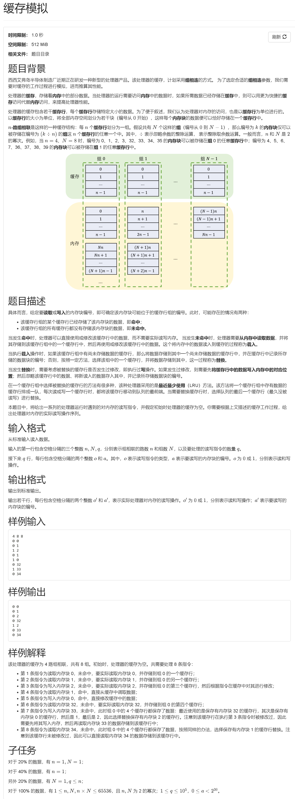

**90分做法**

```C++
#include <iostream>
#include <vector>
#include <list>
#include <algorithm>
using namespace std;

int main() {
    int n, N, q;
    cin >> n >> N >> q;
    vector<int> cache(n * N, -1);
    vector<bool> writen(n * N, 0);
    vector<list<int>> lru(N);

    for (int i = 0; i < N; i++) {
        for (int j = 0; j < n; j++) {
            lru[i].push_back(j);
        }
    }

    for (int i = 0; i < q; i++) {
        bool o;
        int a;
        cin >> o >> a;
        bool is_find = false;
        bool is_leisure = false;
        int group;

        if (n == 1 && N == 1)
            group = 0;
        else
            group = (a % (n * N)) / n;

        if (o) { // 写操作
            for (int j = group * n; j < (group + 1) * n; j++) {
                if (cache[j] == a) {
                    is_find = true;
                    writen[j] = true;
                    int rel_j = j - group * n;
                    auto it = find(lru[group].begin(), lru[group].end(), rel_j);
                    lru[group].splice(lru[group].begin(), lru[group], it);
                    break;
                }
            }
            if (!is_find) {
                for (int j = group * n; j < (group + 1) * n; j++) {
                    if (cache[j] == -1) {
                        is_leisure = true;
                        cache[j] = a;
                        writen[j] = true;
                        cout << "0 " << a << endl;
                        int rel_j = j - group * n;
                        auto it = find(lru[group].begin(), lru[group].end(), rel_j);
                        lru[group].splice(lru[group].begin(), lru[group], it);
                        break;
                    }
                }
                if (!is_leisure) {
                    int replace = lru[group].back();
                    int global_replace = group * n + replace;
                    if (writen[global_replace]) {
                        cout << "1 " << cache[global_replace] << endl;
                    }
                    cout << "0 " << a << endl;
                    cache[global_replace] = a;
                    writen[global_replace] = true;
                    lru[group].pop_back();
                    lru[group].push_front(replace);
                }
            }
        } else { // 读操作
            for (int j = group * n; j < (group + 1) * n; j++) {
                if (cache[j] == a) {
                    is_find = true;
                    int rel_j = j - group * n;
                    auto it = find(lru[group].begin(), lru[group].end(), rel_j);
                    lru[group].splice(lru[group].begin(), lru[group], it);
                    break;
                }
            }
            if (!is_find) {
                for (int j = group * n; j < (group + 1) * n; j++) {
                    if (cache[j] == -1) {
                        is_leisure = true;
                        cache[j] = a;
                        writen[j] = false; // 读操作标记为未修改
                        cout << "0 " << a << endl;
                        int rel_j = j - group * n;
                        auto it = find(lru[group].begin(), lru[group].end(), rel_j);
                        lru[group].splice(lru[group].begin(), lru[group], it);
                        break;
                    }
                }
                if (!is_leisure) {
                    int replace = lru[group].back();
                    int global_replace = group * n + replace;
                    if (writen[global_replace]) {
                        cout << "1 " << cache[global_replace] << endl;
                    }
                    cout << "0 " << a << endl;
                    cache[global_replace] = a;
                    writen[global_replace] = false; // 读操作标记为未修改
                    lru[group].pop_back();
                    lru[group].push_front(replace);
                }
            }
        }
    }
    return 0;
}
```


**满分做法：**

```C++
#include <iostream>
#include <vector>
#include <set>
#include <map>
using namespace std;

int main() {
    ios::sync_with_stdio(false);  // 关闭同步，加速输入输出
    cin.tie(nullptr);             // 解除 cin 与 cout 的绑定

    int n, N, q, nowtime = 0;
    cin >> n >> N >> q;

    // 每组缓存的信息：块号 -> 时间戳
    vector<map<int, int>> cache(N);
    // 每组缓存的LRU顺序：按时间戳排序的集合 {时间戳, 块号}
    vector<set<pair<int, int>>> lru(N);
    // 写标记：块号 -> 是否被修改过
    map<int, bool> writen;

    while (q--) {
        bool o; int a;
        cin >> o >> a;
        int group = (a % (n * N)) / n;  // 计算组号

        if (cache[group].find(a) != cache[group].end()) {
            // --------------- 缓存命中 ---------------
            // 1. 更新LRU时间戳
            int old_time = cache[group][a];
            lru[group].erase({old_time, a});       // 删除旧时间戳
            lru[group].insert({nowtime, a});        // 插入新时间戳
            cache[group][a] = nowtime;             // 更新缓存时间戳
            // 2. 如果是写操作，标记为已修改
            if (o) writen[a] = true;
        } else {
            // --------------- 缓存未命中 ---------------
            // 1. 如果缓存已满，替换LRU块
            if (lru[group].size() >= n) {
                auto lru_block = *lru[group].begin();  // 获取最久未使用的块
                int old_block = lru_block.second;
                // 如果需要写回
                if (writen[old_block]) {
                    cout << "1 " << old_block << "\n";
                    writen[old_block] = false;  // 清除写标记
                }
                // 从LRU和缓存中删除旧块
                lru[group].erase(lru_block);
                cache[group].erase(old_block);
            }
            // 2. 插入新块
            lru[group].insert({nowtime, a});
            cache[group][a] = nowtime;
            cout << "0 " << a << "\n";  // 输出加载操作
            // 3. 更新写标记
            if (o) writen[a] = true;
            else writen[a] = false;
        }
        nowtime++;  // 时间戳递增
    }
    return 0;
}
```

**例1总结：**

1）查找find：map O(logn)快于数组和vector O(n)

2）时间顺序的模拟可以用时间戳，降低数据结构的复杂度


### 八、数组初始化

在 C++ 中，写 `int dp[n] = { INT_MIN };` 的效果是：**第一个元素**被初始化为 `INT_MIN`，其余元素被初始化为 **0**。“初始化为同一个数”如果是 0，C++ 提供了特殊支持（如 `{0}` 或 `{}`），能一次性把所有设为 0。如果是非零值，就通常要靠循环、`fill`, `fill_n`, `.fill()` 方法，或者初始化列表明确每个元素（不实用数组很大或值在运行时确定的情况）。

```C++
#include <limits>  // 里面有 INT_MIN
#include <algorithm> // std::fill

int dp[n];
std::fill(dp, dp + n, INT_MIN);
```


## 数据结构和算法

### 1.BFS（适用于无权图和有向图的最短路径问题）

#### BFS的基本框架

BFS的基本框架包括以下几个步骤：

1. **初始化**：创建一个队列，并将起始节点加入队列。
2. **遍历**：从队列中取出节点，访问其所有未访问的相邻节点，并将这些节点加入队列。
3. **记录路径**：使用一个二维数组或哈希表记录每个节点的最短路径长度。
4. **终止条件**：当队列为空或找到目标节点时终止。

```C++
#include <iostream>
#include <vector>
#include <queue>
#include <climits>

using namespace std;

// 定义图的邻接矩阵
const int MAX节点数 = 100;
vector<vector<int>> graph(MAX节点数, vector<int>(MAX节点数, 0));
vector<int> shortestPath(MAX节点数, INT_MAX); // 记录最短路径长度
bool visited[MAX节点数] = {false}; // 访问标记数组

void bfs(int startNode) {
    queue<int> q;
    q.push (startNode);
    visited[startNode] = true;
    shortestPath[startNode] = 0;

    while (!q.empty ()) {
        int currentNode = q.front ();
        q.pop ();

        for (int neighbor = 0; neighbor < MAX节点数; ++neighbor) {
            if (graph[currentNode][neighbor] != 0 && !visited[neighbor]) {
                visited[neighbor] = true;
                shortestPath[neighbor] = shortestPath[currentNode] + 1;
                q.push (neighbor);
            }
        }
    }
}

int main() {
    // 示例图的邻接矩阵
    graph[0][1] = 1; graph[0][2] = 1;
    graph[1][3] = 1; graph[1][4] = 1;
    graph[2][5] = 1;
    graph[3][6] = 1;
    graph[4][6] = 1;

    int startNode = 0; // 起始节点
    bfs(startNode);

    // 输出最短路径
    for (int i = 0; i < MAX节点数; ++i) {
        cout << "Shortest path from " << startNode << " to " << i << ": " << shortestPath[i] << endl;
    }

    return 0;
}
```


### 2.DP动态规划问题

#### 通用思路：

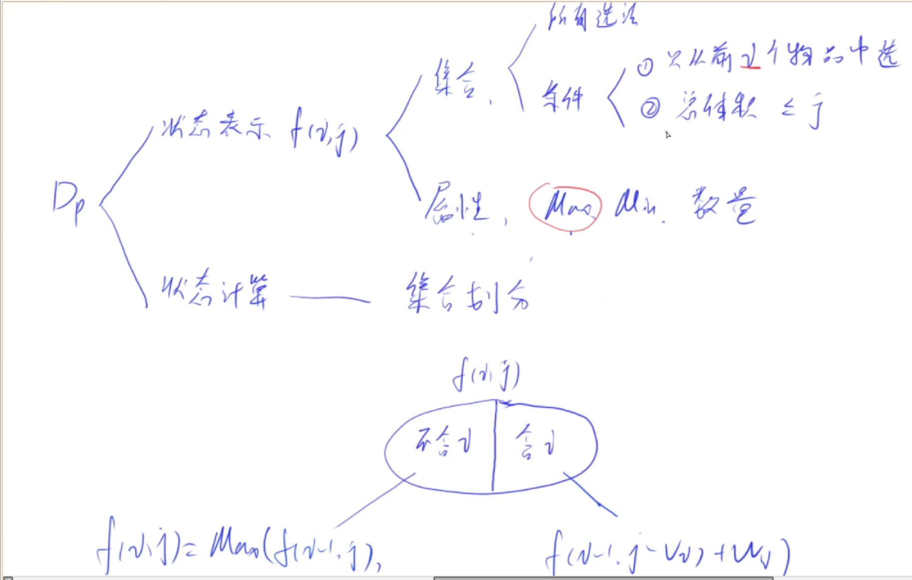

#### ①01背包问题

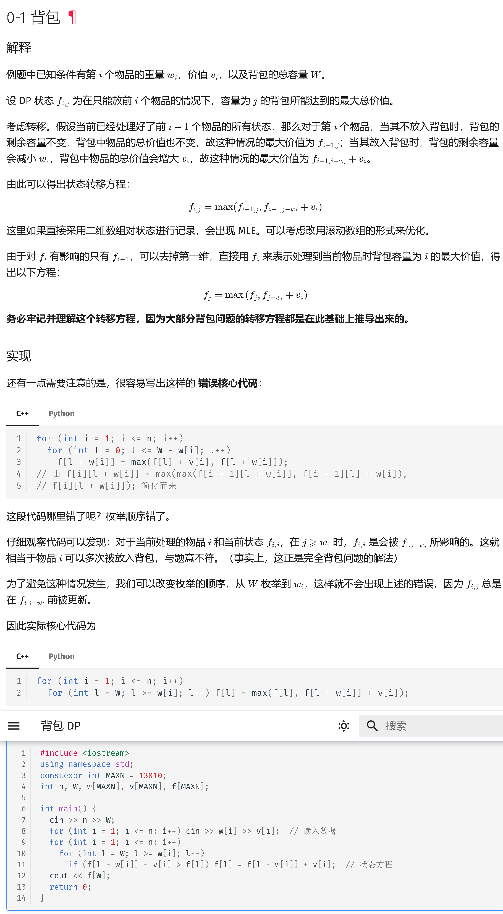

##### ·二维解法

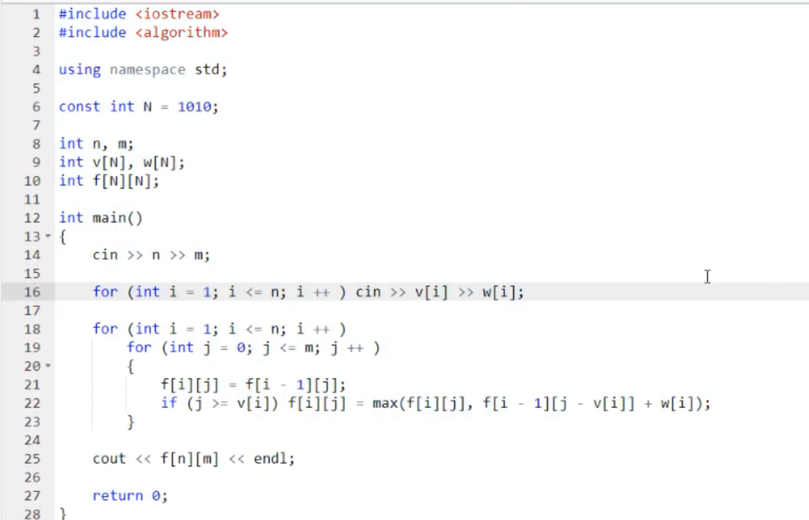


##### ·一维解法

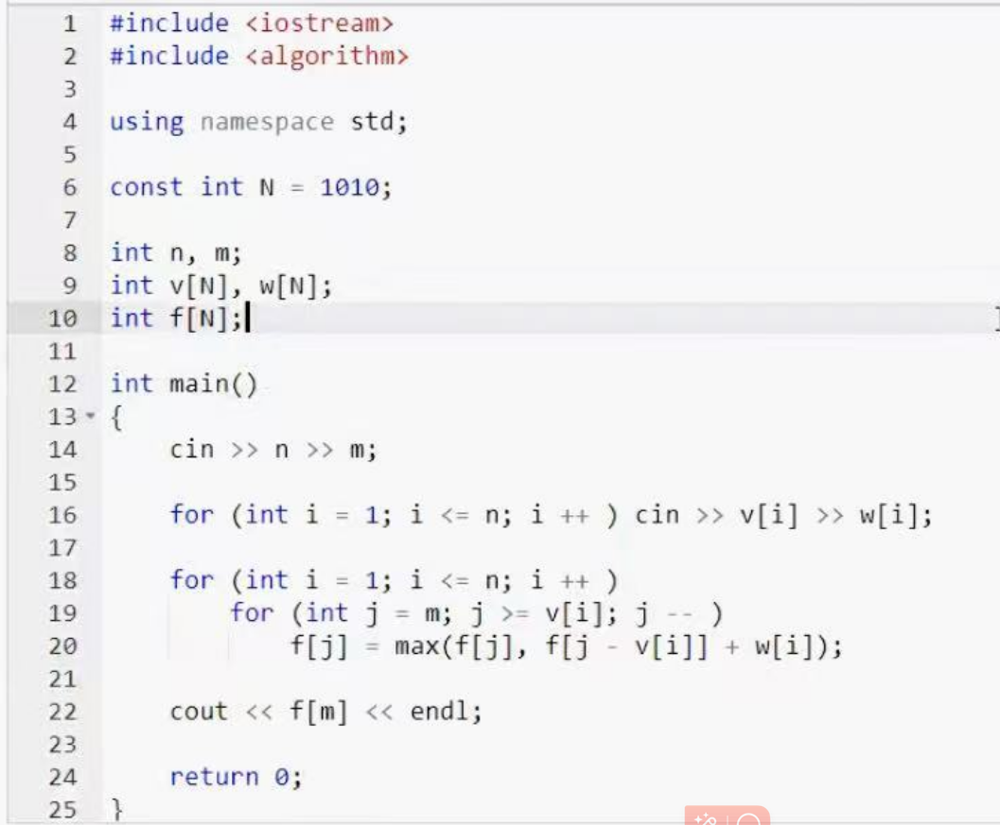

**注：dp数组使用前（定义后）要先用memset(dp, 0,  sizeof(dp))；来清空初始化（在string.h或cstring里）**


### 3.前缀和＋后缀和

#### 例题：

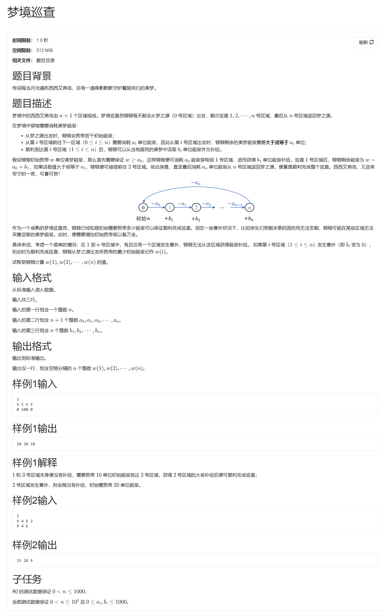

```C++
#include <iostream>
#include <algorithm>
using namespace std;

const int MAXN = 1e5 + 5;

int main() {
    int n;
    cin >> n;
    
    int a[MAXN], b[MAXN];
    for (int i = 0; i <= n; ++i) cin >> a[i];
    for (int i = 1; i <= n; ++i) cin >> b[i];

    // 构建前缀和数组
    int sum[MAXN];
    sum[0] = a[0];
    for (int i = 1; i <= n; ++i)
        sum[i] = sum[i-1] + a[i] - b[i];

    // 预处理前缀最大值
    int pre_max[MAXN];
    pre_max[0] = sum[0];
    for (int i = 1; i <= n; ++i)
        pre_max[i] = max(sum[i], pre_max[i-1]);

    // 处理后缀最大值
    int suf_max[MAXN];
    suf_max[n] = sum[n];
    for (int i = n-1; i >= 0; --i)
        suf_max[i] = max(sum[i], suf_max[i+1]);

    // 计算结果
    for (int k = 1; k <= n; ++k) {
        int ans = max(pre_max[k-1], suf_max[k] + b[k]);
        cout << ans << (k < n ? " " : "\n");
    }

    return 0;
}
```

##### 解析和理解：

让我们通过一个类比来理解这个公式的意义，就像计算银行账户的余额变化：

---

第一步：把问题想象成银行账户

- **初始存款**：`w = a[0]`（必须保证账户最低有这么多钱）
- **每个月的收支**：
  - **固定支出**：必须花掉`a[i]`元（阶段i的最低资源需求）
  - **额外收入**：月底能获得`b[i]`元（调整后的额外收入）

---

第二步：理解sum数组的含义

`sum[i]`记录的是到第i个月为止，账户的**累计收支差**。计算公式：
```cpp
sum[i] = sum[i-1] + a[i]（本月支出） - b[i]（本月收入）
```
这相当于说：
- 当`sum[i]`为**正数**：表示到第i个月为止，累计支出大于收入
- 当`sum[i]`为**负数**：表示累计收入有结余

---

第三步：关键观察

整个过程中，初始资金`w`必须满足：
```
w ≥ 所有sum[i]的最大值
```
因为当某个`sum[i]`达到最大值时，此时是资金最紧张的阶段，需要保证初始资金足够覆盖这个缺口。

---

第四步：举例说明

假设有以下收支记录（n=2）：
```
月份 | 固定支出a | 额外收入b
0   | 5        | -
1   | 3        | 4
2   | 7        | 5
3   | 2        | 6
```
计算sum数组：
```
sum[0] = 5（初始资金）
sum[1] = 5 + 3 - 4 = 4（累计缺口4元）
sum[2] = 4 + 7 - 5 = 6（累计缺口6元）
sum[3] = 6 + 2 - 6 = 2（累计缺口2元）
```
此时最大sum值是6，说明初始资金至少需要6元才能满足所有阶段需求。

---

第五步：与原始代码对比

你的原始代码通过实时计算资金变化：
```cpp
tmp = tmp - a[i] + b[i+1]; // 模拟资金流动
if (tmp < a[i+1]) 补足资金
```
这相当于在重复计算sum数组的等效过程，但没有利用以下关键特性：
1. 资金缺口的最大值可以通过预处理快速获得
2. 调整操作的影响可以分解为前后两部分独立计算

---

第六步：优化代码的智慧

通过建立sum数组：
1. **空间换时间**：用O(n)空间存储**所有中间状态**
2. **极值预处理**：通过pre_max/suf_max数组，将每次**查询降为O(1)**
3. **问题转化**：将动态的资金流动问题**转化为静态**的极值查找问题

---

第七步：公式的深层含义

当我们在位置k进行调整（增加b[k]）时：
- **前半段**（0~k-1）：仍受原始最大缺口`pre_max[k-1]`制约
- **后半段**（k~n）：所有sum值增加b[k]，因此新的最大缺口是`suf_max[k] + b[k]`

这完美解释了最终答案的计算方式：
```cpp
ans = max(pre_max[k-1], suf_max[k] + b[k])
```

---

总结升华

这个公式的本质是：
**将动态过程转化为静态数据分析**
通过建立数学模型（sum数组），我们避开了繁琐的实时模拟，转而使用预处理技术快速获取关键信息。这是算法优化的经典思路——找到问题中隐藏的数学规律，用空间换时间，将复杂度从O(n²)降为O(n)。

------


##### ·为什么一定需要后缀和？

这个问题需要同时处理**调整前后两个独立区间的最大值**，这正是必须使用后缀最大值的原因。让我们通过一个生动的类比和分步分析来理解其中的必要性。

---

**现实类比：跨河大桥的承重检测**

假设你负责检测一座多段桥梁的安全性：
- 桥梁分为n段（对应n+1个阶段）
- 每段桥的**基础承重**为sum[i]
- 当在k号桥墩进行加固（增加承重b[k]）后：
  - 加固**不影响**前面桥段（0~k-1）
  - **增强**后面桥段（k~n）的承重能力

要保证全桥安全，需要同时考虑：
1. 加固前段的最大承重需求 → `pre_max[k-1]`
2. ##### 加固后段的新承重需求 → `suf_max[k] + b[k]`

---

**第一部分：为什么不能只用前缀最大值？**

假设我们只有pre_max数组：
```
阶段 | 0 | 1 | 2 | 3 
sum  |5 |4 |6 |2
pre_max |5 |5 |6 |6
```
当在k=1调整时：
- 前段最大值：pre_max[0] =5
- **后段实际需求**：sum[1]+4=8，sum[2]+4=10，sum[3]+4=6 → 最大10

但pre_max[3]=6无法反映后段调整后的真实最大值10。这说明：
> 前缀最大值只能反映原始数据的前段特征，无法捕捉调整后的后段变化

---

**第二部分：后缀最大值的关键作用**

通过suf_max数组：
```
阶段 | 0 |1 |2 |3
sum  |5 |4 |6 |2
suf_max |6 |6 |6 |2
```
调整k=1时：
- 后段最大需求 = suf_max[1] + b[1] =6 +4=10 → 正确值
- 前段需求 = pre_max[0]=5
- 最终需求max(5,10)=10

这个结果准确反映了：
- 前段保持原始最大需求
- 后段通过suf_max快速获得调整后的最大需求

---

**第三部分：时空特性分析**

调整操作的时空影响范围

| 调整位置    | 影响范围     | 数据处理方式 |
| ----------- | ------------ | ------------ |
| 前段(0~k-1) | 保持原始状态 | 使用pre_max  |
| 后段(k~n)   | 全部增强b[k] | 使用suf_max  |

极值特征对比

| 数组类型 | 数据方向 | 时间复杂度 | 空间复杂度 |
| -------- | -------- | ---------- | ---------- |
| pre_max  | 前向扫描 | O(n)       | O(n)       |
| suf_max  | 反向扫描 | O(n)       | O(n)       |

---

**第四部分：算法设计思想图示**

```
        调整点k
        ↓
[ 前段 ][ 后段 ]
│     │       │
pre_max   suf_max
[k-1]    [k]
```
- **红区(pre_max)**：使用原始数据的前缀最大值
- **蓝区(suf_max)**：使用调整后的后缀最大值

---

**第五部分：关键结论**

1. **物理隔离原则**：调整操作将问题分割为两个物理隔离的区间
2. **极值独立性**：前段和后段的极值变化相互独立
3. **时空效率最优**：双极值预处理是O(n)复杂度下的最优方案

---

**第六部分：假设不用后缀数组的后果**

如果强行只用pre_max，将面临：
1. 每次调整需要重新计算后段 → **退化到O(n²)复杂度**
2. 无法利用调整操作的规律性（后段统一增加b[k]）
3. 失去算法优化的核心思想——预处理重用

---

通过这种分治思想，我们成功将复杂的问题拆解为两个独立的极值问题。这种"分而治之+预处理"的组合策略，正是处理大规模数据问题的经典范式。


### 4.数组循环左移

```C++
#include <iostream>
#include <cstdio>
 
using namespace std;
 
void reverse(int a[], int head, int rear)
{
    int tmp;
    for(int i=0; i<(rear-head+1)/2; i++)
    {
        tmp = a[head+i];
        a[head+i] = a[rear-i];
        a[rear-i] = tmp;
    }
}
 
void converse(int a[], int n, int p)
{
    reverse(a, 0, p-1);
    reverse(a, p, n-1);
    reverse(a, 0, n-1);
}
 
int main()
{
    int n;//number of integer
    int p;//number of shift
    scanf("%d %d", &n, &p);
    int *R = new int[n];
    for(int i=0; i < n; i++)
    {
        scanf("%d", R+i);
    }
 
    converse(R, n, p);
 
    for(int i=0; i < n; i++)
    {
        printf("%d ", *(R+i));
    }
    return  0;
}
```


### 5.两等长升序序列求中位数

```C++
#include <cstdio>
#include <iostream>
 
using namespace std;
 
int find(int A[], int B[], int length) //时间复杂度为O（n）
{
    
    int i = 0;
    int j = 0;
    int minor;
    while((i+j) != length/2)
    {
        if(A[i] <= B[j])
        {
            minor = A[i];
            i++;
        }
        else
        {
            minor = B[j];
            j++;
        }
    }
    return minor;
}
 
int find2(int A[], int B[], int length)//时间复杂度为O(logn)的解法（类递归/二分思想）
{
    int mida;
    int midb;
    int mid;
    int sa=0,da=length-1;
    int sb=0,db=length-1;
    while((sa != da) && (sb != db))
    {
        
        if((da-sa+1)%2==0)
        {
            
            mida=A[(sa+da)/2];
            midb=B[(sb+db)/2];
            //if(da - sa == 1)
           // {
               // return mida>midb ? mida : midb;
           // }
            if(mida < midb)
            { 
                sa = (sa+da)/2+1;
                db = (db+sb)/2;
            }
            else
            {
                da=(da+sa)/2;
                sb=(sb+db)/2+1;   //偶数个时mid小的舍弃前半部分，大的舍弃后半部分
            }
        }
        else{
            mida=A[(sa+da)/2];
            midb=B[(sb+db)/2];
            if(mida < midb)
            { 
                sa = (sa+da)/2;
                db = (db+sb)/2 - 1;
            }
            else
            { 
                sb = (sb+db)/2;
                da = (sa+da)/2 - 1; //奇数个时mid小的保留中间点，大的不保留
            }
        }
        if(mida == midb)
        {
            return mida;
        }
    }
    mid = A[da]<B[db] ? A[da] : B[db];
 
    return mid;
}
 
int main()
{
    int a[6] = {INT_MIN, 1, 2, 3, 4, INT_MAX};
    int b[6] = {INT_MIN, -1, 0, 5, 6, INT_MAX};
    //int length = (sizeof(a)/sizeof(a[0]))*2;//数组名在作为参数传入函数的时候会退化为指针，没法用于sizeof，所以不能在函数里面使用sizeof
    int length2 = sizeof(a)/sizeof(a[0]);
    int result = find2(a,b,length2);
    
    printf("%d", result);
    return 0;
}
```


### 6.寻找主元素/Boyer-Moore大多数投票算法

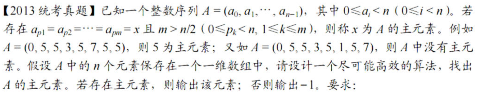

```C++
#include <cstdio>
#include <vector>
 
using namespace std;
 
int findMain(int n, vector<int> arr) // 时间复杂度O（n），空间复杂度O(n)
{
    int map[n] = {0};
    int max = 0;
    int order;
    for (int i = 0; i < n; i++)
    {
        map[arr[i]]++;
    }
    for (int i = 0; i < n; i++)
    {
        if (map[i] > max)
        {
            max = map[i];
            order = i;
        }
    }
    if (max > n / 2)
    {
        return order;
    }
    else
        return -1;
}
 
int findMain2(int n, vector<int> arr) // Boyer-Moore 大多数投票算法，时间复杂度O（n），空间复杂度O(1)
{
    int m = arr[0];
    int count = 1;
    for (int i = 1; i < n; i++) // 第一轮循环确定获胜的选手
    {
        if (count == 0)
        {
            m = arr[i];
            count++;
        }
        else
        {
            if (arr[i] == m)
            {
                count++;
            }
            else
                count--;
        }
    }
    if (count > 0)
    {
        count = 0;
        for (int j = 0; j < n; j++) // 第二轮循环验证是否超过半数
        {
            if (arr[j] == m)
                count++;
        }
        if(count > n/2)
        {
            return m;
        }
        else
            return -1;
    }
    else
        return -1;
}
int main()
{
    int a;
    vector<int> arr;
    while (scanf("%d", &a) == 1)
    {
        arr.push_back(a);
    }
    int n = arr.size();
    printf("%d", findMain(n, arr));
    printf("%d", findMain2(n, arr));
 
    return 0;
}
```


### 7.中缀转后缀表达式并求和

```C++
题目：

请写一个整数计算器，支持加减乘三种运算和括号。

数据范围：0≤∣s∣≤1000≤∣s∣≤100，保证计算结果始终在整型范围内

要求：空间复杂度： O(n)O(n)，时间复杂度 O(n)O(n)

using namespace std;
class Solution
{
public:
    /**
     * 代码中的类名、方法名、参数名已经指定，请勿修改，直接返回方法规定的值即可
     *
     * 返回表达式的值
     * @param s string字符串 待计算的表达式
     * @return int整型
     */
 
    int solve(string s)
    { //<string>
        stack<int> num;
        stack<char> operators;
        // s+='+';
        int length = s.length();
        for (int i = 0; i < length; i++)
        {
            if (isdigit(s[i]))
            {               //<cctype>
                string tmp; // 注意：std::string tmp = s[1]不合法，s[1] 返回的是 单个字符（类型为 char），string会默认初始化为空字符串
                while (i < length &&
                       isdigit(s[i]))
                { // 直接往后循环找到这个完整的数，不影响时间复杂度
                    tmp += s[i];
                    i++;
                }
                i--;
                int tmp_num = stoi(tmp); //<string>
                num.push(tmp_num);
            }
            else
            {
                if (s[i] == '(')
                {
                    operators.push(s[i]);
                }
                else if (s[i] == ')')
                {
                    while (operators.top() != '(')
                    {
                        char ope = operators.top();
                        operators.pop();
                        int rnum = num.top();
                        num.pop(); // pop不会返回弹出元素，先用top获取栈顶元素
                        int lnum = num.top();
                        num.pop();
                        switch (ope)
                        {
                        case '+':
                            lnum += rnum;
                            break;
                        case '-':
                            lnum -= rnum;
                            break;
                        case '*':
                            lnum *= rnum;
                            break;
                        }
                        num.push(lnum);
                    }
                    operators.pop(); // 弹出左括号
                }
                else if (s[i] == '+' || s[i] == '-')
                {
                    while (!operators.empty() && operators.top() != '(')
                    { // 注意此处是与逻辑而不是或逻辑，即其中一个不满足就停止
                        char ope = operators.top();
                        operators.pop();
                        int rnum = num.top();
                        num.pop(); // pop不会返回弹出元素，先用top获取栈顶元素
                        int lnum = num.top();
                        num.pop();
                        switch (ope)
                        {
                        case '+':
                            lnum += rnum;
                            break;
                        case '-':
                            lnum -= rnum;
                            break;
                        case '*':
                            lnum *= rnum;
                            break;
                        }
                        num.push(lnum);
                    }
                    operators.push(s[i]); // 不管operators是否为空，最后都得入栈，所以不需要再冗余讨论入栈前operators是否为空
                }
                else if (s[i] == '*')
                {
                    while (!operators.empty() && operators.top() == '*') // 注意：一定要有!operators.empty()，不能省略，因为如果栈为空的时候，调用top()会访问不存在的元素，这会导致段错误（访问违规）
                    {
                        operators.pop(); // 要注意虽然不用判断操作符类型了，但是别忘了pop出来
                        int rnum = num.top();
                        num.pop(); // pop不会返回弹出元素，先用top获取栈顶元素
                        int lnum = num.top();
                        num.pop();
                        lnum *= rnum;
                        num.push(lnum);
                    }
                    operators.push(s[i]);
                }
            }
        }
 
        while (!operators.empty()) // 表达式的最后一个字符入栈后检查是否还有剩余的操作符没完成，将其完全计算完
        {
            char ope = operators.top();
            operators.pop();
            int rnum = num.top();
            num.pop(); // pop不会返回弹出元素，先用top获取栈顶元素
            int lnum = num.top();
            num.pop();
            switch (ope)
            {
            case '+':
                lnum += rnum;
                break;
            case '-':
                lnum -= rnum;
                break;
            case '*':
                lnum *= rnum;
                break;
            }
            num.push(lnum);
        }
 
        return num.top();
    }
};
 
/*
进一步优化代码，可以将以下具体计算过程封装为一个函数，然后在operators的判断逻辑中分别调用三次，可以简化代码量，并且else if的三个逻辑可以按照运算符的优先级来进行，可以减少不必要的重复逻辑判断：
char ope = operators.top();
            operators.pop();
            int rnum = num.top();
            num.pop(); // pop不会返回弹出元素，先用top获取栈顶元素
            int lnum = num.top();
            num.pop();
            switch (ope)
            {
            case '+':
                lnum += rnum;
                break;
            case '-':
                lnum -= rnum;
                break;
            case '*':
                lnum *= rnum;
                break;
            }
            num.push(lnum);
如：
private:
    void calculate(stack<int>& num, stack<char>& ops) {
        int right = num.top(); num.pop();
        int left = num.top(); num.pop();
        char op = ops.top(); ops.pop();
        int result = 0;
        switch (op) {
            case '+': result = left + right; break;
            case '-': result = left - right; break;
            case '*': result = left * right; break;
        }
        num.push(result);
    }
*/
```


### 8.三元组最小距离算法

```C++
#include <cstdio>
#include <initializer_list>
#include <algorithm>
#include <climits>
#include <iostream>

using namespace std;

int findmin(int a[], int b[], int c[], int na, int nb, int nc)
{
    int i=0,j=0,k=0;
    int min_result = INT_MAX;
    while(i < na && j < nb && k < nc)
    {
        int mini = min({a[i], b[j], c[k]});
        int maxi = max({a[i], b[j], c[k]});
        min_result = 2*(maxi-mini) < min_result ? 2*(maxi-mini) : min_result;
        if(a[i] == mini)
        {
            i++;
        }
        else if(b[j] == mini)
        {
            j++;
        }
        else if(c[k] == mini)
        {
            k++;
        }
    }
    return min_result;
}

int main()
{
    int a[3]={-1,0,9};
    int b[4]={-25,-10,10,11};
    int c[5]={2,9,17,30,41};
    
    printf("%d",findmin(a,b,c,3,4,5));
    return 0;
}
```

