# Docker学习记录

## 一、腾讯云 CNB 环境

微信登录 → 创建组织 → 创建仓库 → 点击“云原生开发”一键初始化。

---

## 二、Docker 相关命令

### 1. `docker --version`

查看 Docker 版本。

### 2. `docker pull library/hello-world`

拉取镜像。镜像引用的一般形式为：

```text
[registry-host[:port]/][namespace/]repository[:tag]
```

`library/hello-world` 对应 Docker Hub 的官方镜像命名空间。`library` 是 Docker Hub 为官方镜像保留的特殊命名空间，并不是普通用户组织。未指定 registry 时默认使用 Docker Hub（`docker.io`），未指定 namespace 时默认使用 `library`，未指定 tag 时默认使用 `latest`。`latest` 只是默认标签，并不保证它一定是时间上最新的版本。

### 3. `docker images`

查看本地镜像。

### 4. `docker run library/hello-world`

基于镜像创建并运行容器。

### 5. `docker ps -a`

`docker ps` 默认列出**正在运行的容器**；使用 `docker ps -a` 可以同时查看已停止的容器。`ps` 沿用 Unix 命令名，通常解释为 **process status**（进程状态）。

### 6. `docker run -it ubuntu bash`

运行 Ubuntu 容器并进入 `bash`。

> [!NOTE]
>
> Docker 里 `-t` 的长选项是：
>
> ```bash
> --tty
> ```
>
> 其中 **TTY** 原本指 *Teletypewriter*，在现代 Unix/Linux 语境中通常泛指**终端设备**。
>
> 在 Docker 中，`-t` 的作用是：
>
> > 为容器分配一个**伪终端（pseudo-TTY）**。
>
> 例如：
>
> ```bash
> docker run -it ubuntu bash
> ```
>
> 这里：
>
> - `-i`：`--interactive`，保持标准输入开启；
> - `-t`：`--tty`，分配伪终端。
>
> 二者常配合使用，才能让容器中的 `bash` 像本机终端一样可交互使用、正确显示提示符和部分命令的格式。Docker 官方对 `-t, --tty` 的定义就是“Allocate a pseudo-TTY”。

```
➜  /workspace git:(main) docker run -it ubuntu bash
Unable to find image 'ubuntu:latest' locally
latest: Pulling from library/ubuntu
d1f56e4c7f2f: Pull complete
81e2f2053c8f: Pull complete
Digest: sha256:53958ec7b67c2c9355df922dd08dbf0360611f8c3cdb656875e81873db9ffdba
Status: Downloaded newer image for ubuntu:latest
root@8aecb273d78d:/# ls
bin  boot  dev  etc  home  lib  lib64  media  mnt  opt  proc  root  run  sbin  srv  sys  tmp  usr  var
root@8aecb273d78d:/# exit
exit
➜  /workspace git:(main)
```

退出 `bash` 后，容器主进程结束，容器也会停止。

#### 后台运行容器

```
➜  /workspace git:(main) docker run -dit ubuntu bash
7f2ce79b0dc9bf7f5eb703ff2d919db2d435e9808db524cb360aa870b797e3ad
➜  /workspace git:(main) docker ps
CONTAINER ID   IMAGE     COMMAND       CREATED         STATUS         PORTS     NAMES
7f2ce79b0dc9   ubuntu    "/bin/bash"   5 seconds ago   Up 5 seconds             adoring_payne
➜  /workspace git:(main) docker ps -a
CONTAINER ID   IMAGE         COMMAND       CREATED          STATUS                      PORTS     NAMES
7f2ce79b0dc9   ubuntu        "/bin/bash"   13 seconds ago   Up 12 seconds                         adoring_payne
8aecb273d78d   ubuntu        "bash"        7 minutes ago    Exited (0) 4 minutes ago              laughing_cohen
7a04315e84e5   hello-world   "/hello"      26 minutes ago   Exited (0) 26 minutes ago             tender_hodgkin
➜  /workspace git:(main)
```

`-d` 即 `--detach`，表示让容器在后台运行。容器是否持续运行取决于其主进程（PID 1）是否仍在运行；实际服务通常应以前台方式启动 Web 服务、数据库或其他长期运行进程。

#### 进入后台运行的容器

可以通过 `docker exec -it 7f2ce79b0dc9 bash` 进入容器；`7f2ce79b0dc9` 是刚才后台运行的 Ubuntu 容器 ID。

```
➜  /workspace git:(main) docker exec -it 7f2ce79b0dc9 bash
root@7f2ce79b0dc9:/# exit
exit
➜  /workspace git:(main) docker ps
CONTAINER ID   IMAGE     COMMAND       CREATED         STATUS         PORTS     NAMES
7f2ce79b0dc9   ubuntu    "/bin/bash"   4 minutes ago   Up 4 minutes             adoring_payne
```

`exit` 只会退出本次通过 `exec` 启动的 `bash`，不会停止原容器的主进程。

#### 停止容器

使用 `docker stop 7f2ce79b0dc9`，即 `docker stop` 加容器 ID。

```
➜  /workspace git:(main) docker stop 7f2ce79b0dc9

7f2ce79b0dc9
➜  /workspace git:(main)
➜  /workspace git:(main) docker ps
CONTAINER ID   IMAGE     COMMAND   CREATED   STATUS    PORTS     NAMES
➜  /workspace git:(main) docker ps -a
CONTAINER ID   IMAGE         COMMAND       CREATED          STATUS                        PORTS     NAMES
7f2ce79b0dc9   ubuntu        "/bin/bash"   7 minutes ago    Exited (137) 16 seconds ago             adoring_payne
8aecb273d78d   ubuntu        "bash"        14 minutes ago   Exited (0) 11 minutes ago               laughing_cohen
7a04315e84e5   hello-world   "/hello"      34 minutes ago   Exited (0) 34 minutes ago               tender_hodgkin
```

### 7. `docker rm <container-id> ...`

删除已停止的容器，而不只是隐藏 `docker ps -a` 中的记录。运行中的容器需要先停止，或在明确了解影响后使用 `docker rm -f`。

```
➜  /workspace git:(main) docker rm 7f2ce79b0dc9
7f2ce79b0dc9
➜  /workspace git:(main) docker ps -a
CONTAINER ID   IMAGE         COMMAND    CREATED          STATUS                      PORTS     NAMES
8aecb273d78d   ubuntu        "bash"     15 minutes ago   Exited (0) 12 minutes ago             laughing_cohen
7a04315e84e5   hello-world   "/hello"   34 minutes ago   Exited (0) 34 minutes ago             tender_hodgkin
➜  /workspace git:(main) docker rm 8aecb273d78d 7a04315e84e5
8aecb273d78d
7a04315e84e5
➜  /workspace git:(main) docker ps -a
CONTAINER ID   IMAGE     COMMAND   CREATED   STATUS    PORTS     NAMES
```

### 8. `docker rmi <image-id> <image-name> ...`

删除本地镜像。若仍有容器依赖该镜像，需要先删除相关容器，或确认强制删除的影响。

```
➜  /workspace git:(main) docker images
REPOSITORY    TAG       IMAGE ID       CREATED        SIZE
ubuntu        latest    53958ec7b67c   3 weeks ago    155MB
hello-world   latest    96498ffd522e   3 months ago   16.3kB
➜  /workspace git:(main) docker rmi 53958ec7b67c
Untagged: ubuntu:latest
Deleted: sha256:53958ec7b67c2c9355df922dd08dbf0360611f8c3cdb656875e81873db9ffdba
➜  /workspace git:(main) docker images
REPOSITORY    TAG       IMAGE ID       CREATED        SIZE
hello-world   latest    96498ffd522e   3 months ago   16.3kB
➜  /workspace git:(main) docker rmi 96498ffd522e
Untagged: hello-world:latest
Deleted: sha256:96498ffd522e70807ab6384a5c0485a79b9c7c08ca79ba08623edcad1054e62d
➜  /workspace git:(main) docker images
REPOSITORY   TAG       IMAGE ID   CREATED   SIZE
```

### 9. `docker logs <container-id>`

查看指定容器写入标准输出（stdout）和标准错误（stderr）的日志。例如：

```
➜  /workspace git:(main) docker logs 00a913763c7e
[2026-07-05T19:05:08.527Z] info  code-server 4.127.0 1e6ed874e3138141a5636f6e0dbe8570aa6cd001
[2026-07-05T19:05:08.528Z] info  Using user-data-dir /root/.local/share/code-server
[2026-07-05T19:05:08.535Z] info  Using config file /root/.config/code-server/config.yaml
[2026-07-05T19:05:08.535Z] info  HTTP server listening on http://0.0.0.0:8000/
[2026-07-05T19:05:08.535Z] info    - Authentication is disabled
[2026-07-05T19:05:08.535Z] info    - Not serving HTTPS
[2026-07-05T19:05:08.535Z] info  Session server listening on /root/.local/share/code-server/code-server-ipc.sock
```

---

## 三、制作自己的 Docker 镜像

### 1. 创建带端口映射的 Ubuntu 容器

```
➜  /workspace git:(main) docker run -it -p 8000:8000 ubuntu bash
Unable to find image 'ubuntu:latest' locally
latest: Pulling from library/ubuntu
2c1ce1d0a589: Download complete
a9be9fd915e9: Download complete
Digest: sha256:b7f48194d4d8b763a478a621cdc81c27be222ba2206ca3ca6bc42b49685f3d9e
Status: Downloaded newer image for ubuntu:latest
```

`-p` 用于发布容器端口，使宿主机能够访问容器内的网络服务。

> [!NOTE]
>
> `-p 8000:8000` 是 **端口映射（port publishing）**，格式为：
>
> ```
> -p 宿主机端口:容器端口
> ```
>
> 因此：
>
> ```
> -p 8000:8000
> ```
>
> 表示把：
>
> - 你电脑上的 `8000` 端口
> - 映射到 Docker 容器内部的 `8000` 端口
>
> 假设容器里启动了一个监听 `8000` 端口的 Web 服务，例如：
>
> ```
> python3 -m http.server 8000
> ```
>
> 那么你可以在宿主机浏览器访问：
>
> ```
> http://localhost:8000
> ```
>
> 请求会被 Docker 转发到容器里的 `8000` 端口。
>
> 如果没有写宿主机 IP，`-p 8000:8000` 默认绑定宿主机的所有网络接口，外部网络可能也能访问该端口。仅需本机访问时可写成 `-p 127.0.0.1:8000:8000`；在 CNB 这类受控云开发环境中，则根据平台的端口访问控制决定绑定方式。

### 2. 安装 `curl` 与 code-server

接下来执行两个命令：

```bash
apt-get update
apt-get install -y curl ca-certificates
```

使用 `curl` 进行后续 code-server 安装。`curl` 是一个**命令行网络数据传输工具**，通常用于通过 URL 下载内容、上传数据或测试网络请求。

接下来安装 code-server，对应命令可从官方文档或 GitHub 仓库获取：

[coder/code-server: VS Code in the browser](https://github.com/coder/code-server)

可先用 `--dry-run` 查看安装脚本将执行的操作，再正式安装：

```bash
curl -fsSL https://code-server.dev/install.sh | sh -s -- --dry-run
curl -fsSL https://code-server.dev/install.sh | sh
```

然后再做以下操作：

```bash
root@ee5dbce07d54:/# code-server
[2026-07-02T17:20:39.840Z] info  Wrote default config file to /root/.config/code-server/config.yaml
[2026-07-02T17:20:39.947Z] info  code-server 4.127.0 1e6ed874e3138141a5636f6e0dbe8570aa6cd001
[2026-07-02T17:20:39.948Z] info  Using user-data-dir /root/.local/share/code-server
[2026-07-02T17:20:39.955Z] info  Using config file /root/.config/code-server/config.yaml
[2026-07-02T17:20:39.955Z] info  HTTP server listening on http://127.0.0.1:8080/
[2026-07-02T17:20:39.955Z] info    - Authentication is enabled
[2026-07-02T17:20:39.955Z] info      - Using password from /root/.config/code-server/config.yaml
[2026-07-02T17:20:39.955Z] info    - Not serving HTTPS
[2026-07-02T17:20:39.955Z] info  Session server listening on /root/.local/share/code-server/code-server-ipc.sock

^Croot@ee5dbce07d54:/#
root@ee5dbce07d54:/# code-server --bind-addr=0.0.0.0:8000 --auth=none
[2026-07-02T17:23:00.066Z] info  code-server 4.127.0 1e6ed874e3138141a5636f6e0dbe8570aa6cd001
[2026-07-02T17:23:00.067Z] info  Using user-data-dir /root/.local/share/code-server
[2026-07-02T17:23:00.075Z] info  Using config file /root/.config/code-server/config.yaml
[2026-07-02T17:23:00.075Z] info  HTTP server listening on http://0.0.0.0:8000/
[2026-07-02T17:23:00.075Z] info    - Authentication is disabled
[2026-07-02T17:23:00.075Z] info    - Not serving HTTPS
[2026-07-02T17:23:00.075Z] info  Session server listening on /root/.local/share/code-server/code-server-ipc.sock
[17:41:50]
```

`--bind-addr` 用于指定监听地址与端口，以便从容器外部访问。

其中：

```
--bind-addr=0.0.0.0:8000
```

是让 `code-server` **监听网络地址 `0.0.0.0` 的 8000 端口**。

| 部分      | 含义                                 |
| --------- | ------------------------------------ |
| `0.0.0.0` | 监听当前机器的**所有 IPv4 网络接口** |
| `8000`    | code-server 对外提供 Web 服务的端口  |

也就是说，code-server 不仅能通过本机访问，还会接收来自网卡、局域网或 Docker 网络的请求。

`--auth=none` 表示禁用认证。

> [!NOTE]
> **安全提示：**不应把关闭认证的 code-server 直接暴露到公网，否则他人可能通过内置终端控制运行环境。这里只适用于 CNB 已提供访问控制的临时开发环境；其他场景应保留认证，并配合 HTTPS、反向代理或受限网络。

之后可通过 CNB 的 **PORTS** 面板提供的地址访问浏览器中的 code-server。该地址可能随工作区变化，因此不在笔记中保存临时 URL。

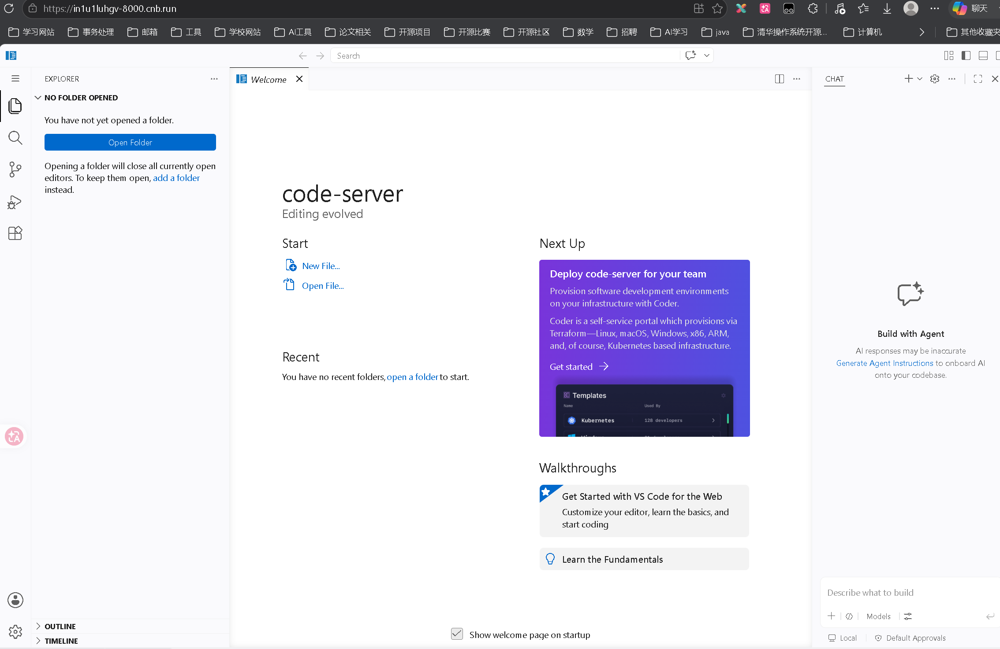

以上步骤仍然接近“打开一台虚拟机后手动安装软件”，不利于重复执行和版本管理。下面将环境固化为镜像。

一共有两种方法：

### 3. 通过交互式容器打包镜像：`docker commit`

```text
docker commit <container-id> [image-name[:tag]]
docker run <image> → container
```

`docker commit` 会把容器当前的文件系统状态创建为新镜像；它适合学习和临时快照，但难以复现、审查与自动化。正式项目应优先使用 Dockerfile。

```
➜  /workspace git:(main) docker ps
CONTAINER ID   IMAGE     COMMAND   CREATED          STATUS          PORTS                                         NAMES
7bd8b92526c3   ubuntu    "bash"    36 minutes ago   Up 36 minutes   0.0.0.0:8000->8000/tcp, [::]:8000->8000/tcp   focused_brahmagupta
➜  /workspace git:(main) docker commit 7bd8b92526c3
sha256:97f491c9e63c5f73fd3913372e404ccd7f7481003edd9297d7a628e49737f136
➜  /workspace git:(main) docker images
REPOSITORY   TAG       IMAGE ID       CREATED          SIZE
<none>       <none>    97f491c9e63c   17 minutes ago   1.48GB
ubuntu       latest    b7f48194d4d8   8 days ago       155MB
➜  /workspace git:(main) docker run -it -p 8000:8000 97f491c9e63c code-server --bind-addr=0.0.0.0:8000 --auth=none
[2026-07-05T16:31:13.386Z] info  code-server 4.127.0 1e6ed874e3138141a5636f6e0dbe8570aa6cd001
[2026-07-05T16:31:13.386Z] info  Using user-data-dir /root/.local/share/code-server
[2026-07-05T16:31:13.394Z] info  Using config file /root/.config/code-server/config.yaml
[2026-07-05T16:31:13.394Z] info  HTTP server listening on http://0.0.0.0:8000/
[2026-07-05T16:31:13.394Z] info    - Authentication is disabled
[2026-07-05T16:31:13.394Z] info    - Not serving HTTPS
[2026-07-05T16:31:13.394Z] info  Session server listening on /root/.local/share/code-server/code-server-ipc.sock
[16:31:18]
```

前台运行时，退出终端会结束 code-server。若要让它作为容器主进程在后台运行，可以执行：

```
➜  /workspace git:(main) docker run -d -p 8000:8000 --entrypoint code-server 97f491c9e63c --bind-addr=0.0.0.0:8000 --auth=none
00a913763c7e5f5d80297bc6949d5d3d0840c57abb3575d3ff34e6838d13e029
➜  /workspace git:(main) docker ps
CONTAINER ID   IMAGE          COMMAND                   CREATED          STATUS          PORTS                                         NAMES
00a913763c7e   97f491c9e63c   "code-server --bind-…"   27 seconds ago   Up 26 seconds   0.0.0.0:8000->8000/tcp, [::]:8000->8000/tcp   vigilant_cannon
➜  /workspace git:(main) docker logs 00a913763c7e
[2026-07-05T19:05:08.527Z] info  code-server 4.127.0 1e6ed874e3138141a5636f6e0dbe8570aa6cd001
[2026-07-05T19:05:08.528Z] info  Using user-data-dir /root/.local/share/code-server
[2026-07-05T19:05:08.535Z] info  Using config file /root/.config/code-server/config.yaml
[2026-07-05T19:05:08.535Z] info  HTTP server listening on http://0.0.0.0:8000/
[2026-07-05T19:05:08.535Z] info    - Authentication is disabled
[2026-07-05T19:05:08.535Z] info    - Not serving HTTPS
[2026-07-05T19:05:08.535Z] info  Session server listening on /root/.local/share/code-server/code-server-ipc.sock
```

`--entrypoint code-server` 用于覆盖镜像默认入口程序，使容器直接以 code-server 启动；`-d` 用于后台运行。这里无需 `-it`，因为服务不需要交互式终端。

### 4. 通过 Dockerfile 构建镜像

首先在代码仓库中创建 `Dockerfile`：

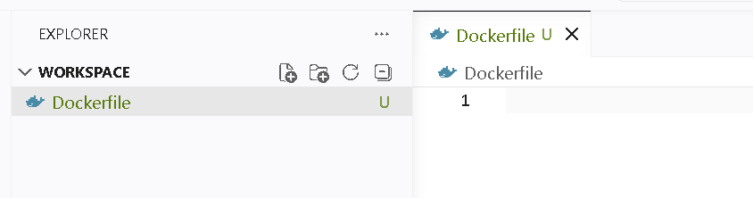

把前面的手动操作转换成 Dockerfile 指令：

```dockerfile
FROM ubuntu:latest # 使用 ubuntu:latest 镜像作为基础镜像

RUN apt update && apt install -y curl

RUN curl -fsSL https://code-server.dev/install.sh | sh
```

这样就能得到一个最简单的 Dockerfile。然后执行 `docker build`：

```bash
docker build -t docker.cnb.cool/kyle-cnb/docker-learning:v1.0.0 .
```

其中 `-t` 用于设置镜像名称和版本标签，末尾的 `.` 表示使用当前目录作为构建上下文。

后续若要预装 code-server 扩展，只需继续迭代 Dockerfile 并更新镜像版本。例如：

```dockerfile
RUN code-server --install-extension golang.go
```

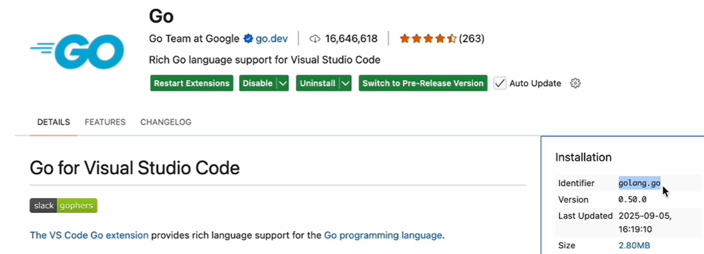

扩展命令使用详情页 **Identifier** 字段中的唯一标识，这里是 `golang.go`。

**将 Dockerfile 保存到 CNB 代码仓库**

```bash
git add Dockerfile
git commit -m "feat: add Dockerfile"
git push --set-upstream origin main
```

`git push --set-upstream origin main` 会把本地 `main` 推送到名为 `origin` 的远程仓库，并建立本地 `main` 与 `origin/main` 的跟踪关系。`origin` 只是 Git 常用的默认远程名称，实际可以指向 CNB、GitHub、GitLab 或其他 Git 服务，并不特指 GitHub。

建立跟踪关系后，后续通常只需执行 `git push`。如果 Git 已配置：

```bash
git config --global push.autoSetupRemote true
```

那么首次执行普通 `git push` 时，也可能自动建立上游分支。可用下面的命令检查该配置：

```bash
git config --get push.autoSetupRemote
```

---

## 四、将镜像推送至制品库（镜像仓库）并使用

Docker 官方镜像仓库是 [Docker Hub Container Image Library](https://hub.docker.com/)，可以上传自己的 Docker 镜像，也可以下载其他镜像。

### 第一步：登录镜像仓库

登录 Docker Hub：

```bash
docker login
```

登录私有仓库时，以 CNB 的镜像仓库为例，可以在制品页面找到 Docker 镜像制品：

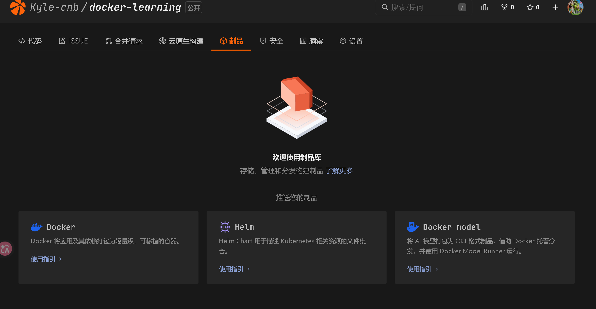

在制品 tag 的“使用指引”中，选择“本地命令行推送”可获得登录、构建、推送和拉取命令：

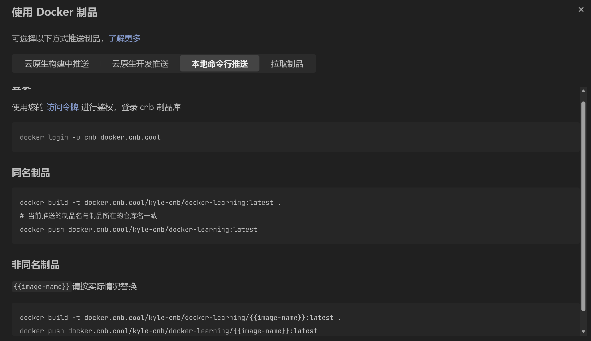

CNB 使用访问令牌进行鉴权。可在个人设置的“访问令牌”中创建令牌：

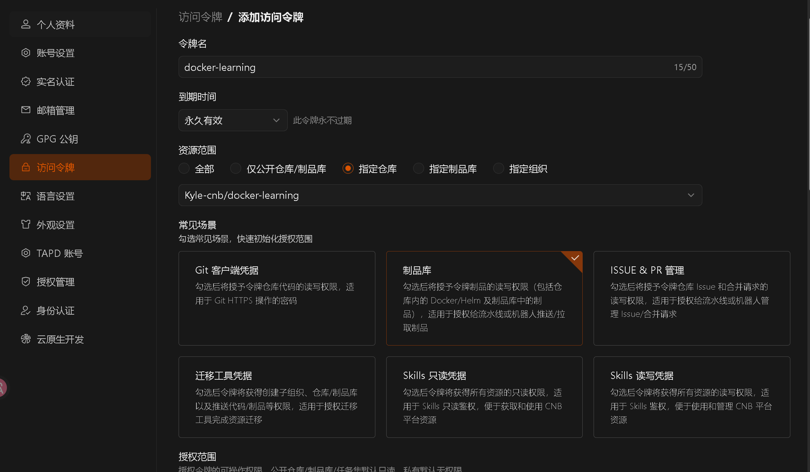

创建令牌后，可将 Token 通过标准输入传给 Docker，避免它出现在命令历史中：

```bash
read -rsp "CNB Token: " CNB_TOKEN; echo
printf '%s' "$CNB_TOKEN" | docker login docker.cnb.cool \
  --username <cnb-username> --password-stdin
unset CNB_TOKEN
```

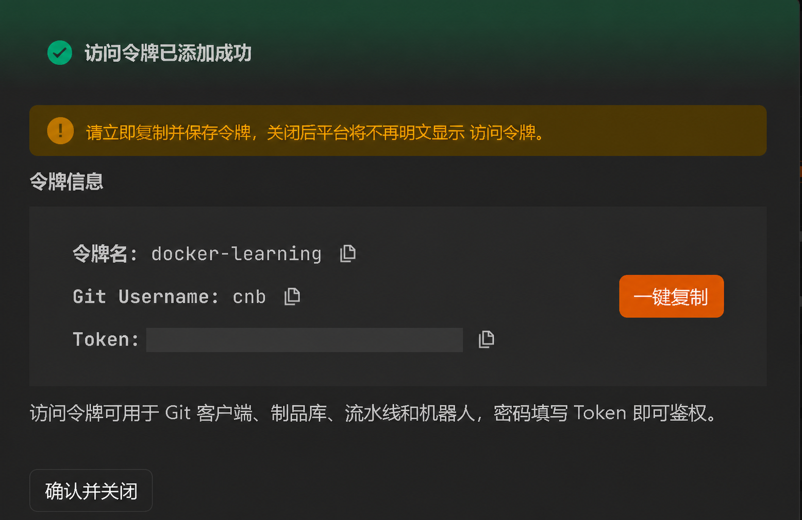

公开笔记和截图中不要保留真实 Token。Docker 可能把登录凭据写入用户目录下的配置文件；在非 Docker Desktop 环境中应配置 credential helper，使用完也可执行 `docker logout docker.cnb.cool`。

### 第二步：为镜像添加仓库标签

```text
➜  /workspace git:(main) docker tag 97f491c9e63c docker.cnb.cool/kyle-cnb/docker-learning:latest
➜  /workspace git:(main) docker images
REPOSITORY                                 TAG       IMAGE ID       CREATED       SIZE
docker.cnb.cool/kyle-cnb/docker-learning   latest    97f491c9e63c   4 hours ago   1.48GB
ubuntu                                     latest    b7f48194d4d8   8 days ago    155MB
```

`docker tag` 不会重命名或复制镜像，而是为同一个镜像 ID 新增一个指向目标仓库的引用。若在 [`docker build` 时](#section-20)已经使用完整仓库名和版本标签（例如 `:v1.0.0`），则不需要再次执行 `docker tag`。

### 第三步：上传镜像

```text
➜  /workspace git:(main) docker push docker.cnb.cool/kyle-cnb/docker-learning:latest
The push refers to repository [docker.cnb.cool/kyle-cnb/docker-learning]
18582ffa9453: Pushed
a9be9fd915e9: Pushed
2c1ce1d0a589: Pushed
latest: digest: sha256:97f491c9e63c5f73fd3913372e404ccd7f7481003edd9297d7a628e49737f136 size: 1172
```

建议显式写出标签，避免误以为 `latest` 自动代表最新版本。Dockerfile 构建出的版本也可以单独推送：

```bash
docker push docker.cnb.cool/kyle-cnb/docker-learning:v1.0.0
```

上传完成后，可以在 CNB 的“制品”标签中看到镜像：

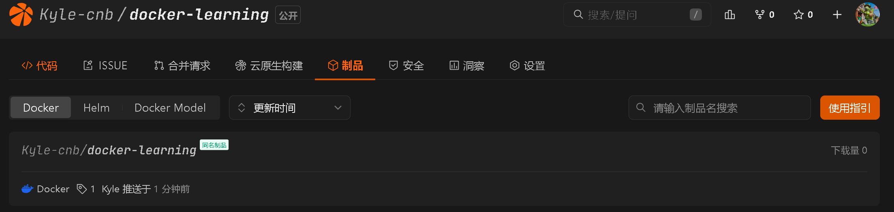

镜像详情页会展示标签、摘要、大小与镜像层信息：

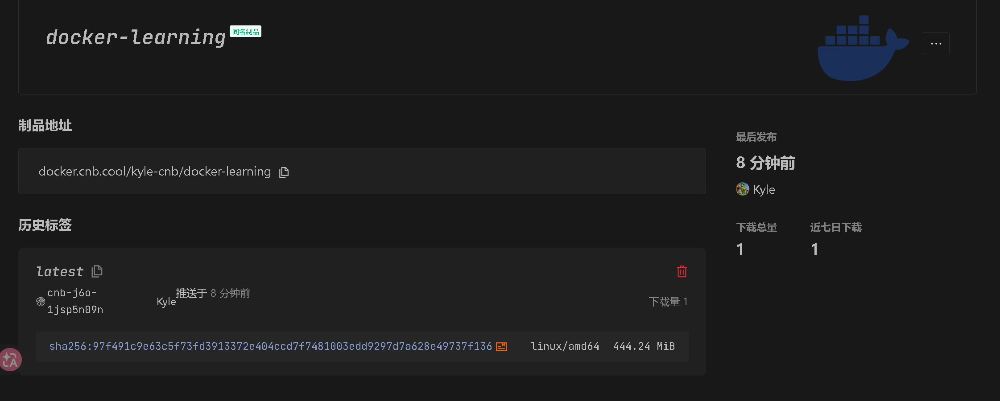

### 第四步：使用镜像

```bash
docker run -d --name code-server -p 8000:8000 \
  --entrypoint code-server \
  docker.cnb.cool/kyle-cnb/docker-learning:v1.0.0 \
  --bind-addr=0.0.0.0:8000 --auth=none
```

如果本地没有该镜像，`docker run` 会先从指定仓库拉取镜像，再创建并启动容器。这个简单 Dockerfile 没有定义默认启动命令，因此仍需通过 `--entrypoint code-server` 显式指定入口。若要使用前面通过 `docker commit` 生成的镜像，可把标签改为 `latest`。

------

## 五、使用自定义镜像作为云原生开发环境

CNB 云原生开发文档：[云原生开发介绍](https://docs.cnb.cool/zh/workspaces/intro.html)、[自定义开发环境](https://docs.cnb.cool/zh/workspaces/custom-dev-env.html)、[单/双容器模式](https://docs.cnb.cool/zh/workspaces/double-container.html)。

云原生开发的主要特点之一是**声明式**：基于 Docker 生态，可以直接使用已有镜像，也可以通过 Dockerfile 声明并构建开发环境，并与代码同源管理。

云原生开发的默认环境镜像为 [cnbcool/default-dev-env](https://cnb.cool/cnb/cool/default-dev-env)。

### 1. 通过 Docker 镜像指定开发环境

在 `.cnb.yml` 中编写云原生开发事件流水线，通过 `pipeline.docker.image` 指定开发环境镜像。

如果指定镜像中已安装 `code-server`，将使用**单容器模式**启动；未安装则使用**双容器模式**。

> [!NOTE]
>
> 这里的“单容器”和“双容器”，指的是 **CNB 云原生开发工作区中，开发环境与 WebIDE（`code-server`）如何部署**，不是指你的项目最终要部署几个容器。
>
> ## 先理解两个角色
>
> - **开发环境**：由自定义镜像、`.ide/Dockerfile` 或 CNB 默认镜像创建的容器，里面可能有 Node.js、Java、Python、GCC、Git 等工具。
> - **`code-server`**：运行在服务器上的 VS Code，负责提供浏览器中的 WebIDE 界面。
>
> ------
>
> ## 单容器模式
>
> 开发工具和 `code-server` 全部运行在**同一个容器**中：
>
> ```text
> 浏览器
>    │
>    ▼
> ┌──────────────────────────────┐
> │       开发环境容器            │
> │                              │
> │  code-server（WebIDE）        │
> │  Git / GCC / Node / Python   │
> │  项目代码 /workspace          │
> └──────────────────────────────┘
> ```
>
> 只有当你指定的镜像中**已经安装了 `code-server`** 时，CNB 才能直接这样启动。官方也推荐优先使用单容器模式。
>
> 例如：
>
> ```yaml
> $:
>   vscode:
>     - docker:
>         image: cnbcool/default-dev-env:latest
>       services:
>         - vscode
>       stages:
>         - name: check
>           script: code-server --version
> ```
>
> 这个镜像已经包含 `code-server`，所以：
>
> - WebIDE 在该容器中运行；
> - 终端命令也在该容器中执行；
> - VS Code 插件、调试器、编译器、运行时都处于同一个环境；
> - 文件系统、进程和网络环境比较统一。
>
> 因此，单容器模式通常兼容性更好，特别是使用 Debug、语言服务器和开发类 VS Code 插件时。
>
> ------
>
> ## 双容器模式
>
> 你指定的镜像里没有 `code-server`，CNB 就会**额外启动一个 `code-server` 容器**：
>
> ```text
> 浏览器
>    │
>    ▼
> ┌──────────────────────┐
> │ code-server 容器      │
> │                      │
> │ WebIDE                │
> │ VS Code 插件          │
> │ /workspace ───────────┼────┐
> └──────────────────────┘    │
>                             │ 共享工作区
> ┌──────────────────────┐    │
> │ 开发环境容器          │    │
> │                      │    │
> │ Node / Java / GCC    │    │
> │ Git / Python         │    │
> │ /workspace ◄─────────┼────┘
> └──────────────────────┘
> ```
>
> 两个容器通过共享的 `/workspace` 目录访问同一份代码。浏览器实际上连接的是 `code-server` 容器，而 CNB 默认提供名为 `CNB` 的跨容器终端，用它进入开发环境容器执行命令。
>
> 例如：
>
> ```yaml
> $:
>   vscode:
>     - docker:
>         image: node:22
>       services:
>         - vscode
>       stages:
>         - name: check-node
>           script: node --version
> ```
>
> 官方 `node:22` 镜像通常只包含 Node.js 开发环境，并没有安装 `code-server`，因此 CNB 会补充一个 `code-server` 容器，形成双容器模式。官方文档也直接用 `node:22` 作为双容器模式的示例。

```yaml title=".cnb.yml"
$:
  vscode:  # 定义一个名为 vscode 的云原生开发事件
    - docker:
        # 指定开发环境使用的 Docker 镜像
        image: cnbcool/default-dev-env:latest

        # 也可以改为通过 Dockerfile 构建自定义开发镜像
        # build: .ide/Dockerfile

      services:
        # 启动 WebIDE，即浏览器中的 VS Code
        - vscode

        # 启动 Docker 服务，使开发环境中可以执行 docker 命令
        - docker

      stages:
        # 定义一个名为 ls 的流水线阶段
        - name: ls

          # 列出当前工作目录中的所有文件，包括隐藏文件及详细信息
          script: ls -al
```

支持两种方式指定开发环境镜像：

* `image`：直接使用**已有镜像**（适用于预置镜像场景）
* `build`：通过 **Dockerfile** 自定义构建；若与 `image` 同时指定，`build` 优先，`image` 作为构建失败时的回退镜像

### 2. 通过 Dockerfile 自定义开发环境

如果指定镜像无法满足需求，可在仓库根目录创建 `.ide/Dockerfile` 来自定义开发环境。

**未自定义启动流水线时**，系统会优先使用 `.ide/Dockerfile` 构建镜像作为基础镜像。
如果 `.ide/Dockerfile` 不存在或构建失败，会回退使用默认镜像。

```dockerfile
# .ide/Dockerfile

# 可将 node 替换为需要的基础镜像
FROM node:20

# 安装 code-server 和常用 vscode 插件
RUN curl -fsSL https://code-server.dev/install.sh | sh \
  && code-server --install-extension cnbcool.cnb-welcome \
  && code-server --install-extension redhat.vscode-yaml \
  && code-server --install-extension dbaeumer.vscode-eslint \
  && code-server --install-extension mhutchie.git-graph \
  && echo done

# 安装 ssh 服务，用于支持 VSCode 等客户端通过 Remote-SSH 访问开发环境（也可按需安装其他软件）
RUN apt-get update && apt-get install -y git wget unzip openssh-server

# 指定字符集支持命令行输入中文（根据需要选择字符集）
ENV LANG C.UTF-8
ENV LANGUAGE C.UTF-8
```

### 3. 同时自定义开发环境和启动流程

如果需要同时自定义开发环境和启动流程，可编写 `.ide/Dockerfile` 和 `.cnb.yml`。
`Dockerfile` 内容与上文相同，不再重复。

在 `.cnb.yml` 中使用 `build: .ide/Dockerfile` 指定构建文件，并可同时指定 `image` 作为回退镜像。

将 `.cnb.yml` 提交到代码仓库后，下次启动云原生开发环境时，CNB 会按照该流水线配置创建并初始化工作区。

------

## 六、使用云原生构建自动构建并推送镜像

目标：当代码（例如 `Dockerfile`）推送到 `main` 分支时，自动构建镜像并将其推送到 CNB Docker 制品库。

参考文档：[云原生构建介绍](https://docs.cnb.cool/zh/build/intro.html)、[Docker 制品库](https://docs.cnb.cool/zh/artifact/docker.html)。

### 使用 `.cnb.yml` 声明构建流水线

在仓库根目录的 `.cnb.yml` 中添加：

```yaml title=".cnb.yml"
main:  # 匹配 main 分支
  push:  # 每次向 main 分支推送提交时触发
    - services:
        # 提供 Docker daemon 和 CLI，并自动登录当前仓库的 CNB Docker 制品库
        - docker
      stages:
        - name: docker build
          script: docker build -t ${CNB_DOCKER_REGISTRY}/${CNB_REPO_SLUG_LOWERCASE}:latest .
        - name: docker push
          script: docker push ${CNB_DOCKER_REGISTRY}/${CNB_REPO_SLUG_LOWERCASE}:latest
```

`CNB_DOCKER_REGISTRY` 和 `CNB_REPO_SLUG_LOWERCASE` 是 CNB 提供的环境变量，会组合成当前仓库对应的镜像地址。声明 `services: docker` 后，流水线可以直接使用 Docker daemon 和 CLI，并能把镜像推送到当前仓库的 CNB Docker 制品库。

将 `.cnb.yml` 提交并推送到 `main` 后，后续每次向 `main` 推送提交都会触发这条流水线；修改 `Dockerfile` 并推送只是其中一种触发场景。如果只希望在 `Dockerfile` 发生变化时运行，可在该流水线中增加 `ifModify: Dockerfile`。

示例使用可变的 `latest` 标签：重复推送时，`latest` 会指向新构建的镜像。若需要保留可追溯的发布版本，可以同时推送版本号或提交 SHA 标签。

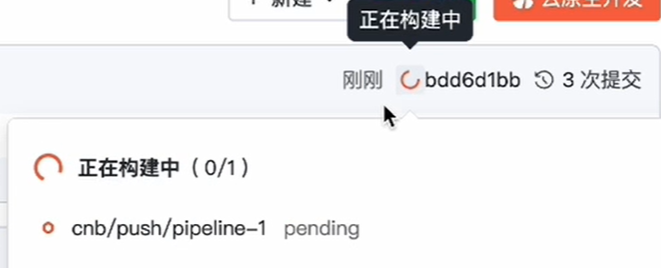

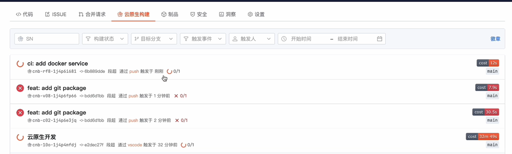

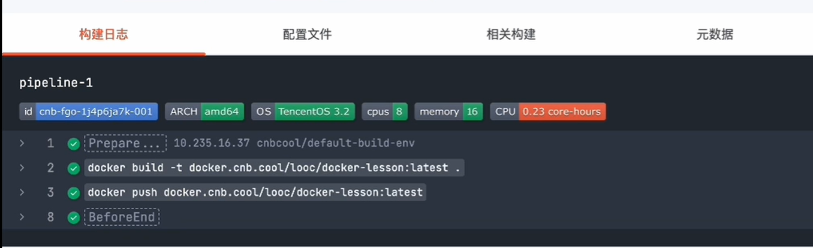
