# FreeRTOS 学习记录

> 本文整理自百问网《FreeRTOS 入门与工程实践——基于 STM32F103》教程第 2～19 章。原教程：[百问网 FreeRTOS 入门与工程实践](https://rtos.100ask.net/zh/FreeRTOS/DShanMCU-F103/)。

## 第1章 单片机程序设计模式

本章目标

- 理解裸机程序设计模式
- 了解多任务系统中程序设计的不同

### 1.1 裸机程序设计模式

裸机程序的设计模式可以分为：轮询、前后台、定时器驱动、基于状态机。前面三种方法都无法解决一个问题：假设有A、B两个都很耗时的函数，无法降低它们相互之间的影响。第4种方法可以解决这个问题，但是实践起来有难度。

假设一位职场妈妈需要同时解决2个问题：给小孩喂饭、回复工作信息，场景如图所示，后面将会演示各类模式下如何写程序：


#### 1.1.1 轮询模式

示例代码如下：

```c
// 经典单片机程序: 轮询
void main()
{
    while (1)
    {
        喂一口饭();
        回一个信息();
    }
}
```

在main函数中是一个while循环，里面依次调用2个函数，这两个函数相互之间有影响：如果“喂一口饭”太花时间，就会导致迟迟无法“回一个信息”；如果“回一个信息”太花时间，就会导致迟迟无法“喂下一口饭”。

使用轮询模式编写程序看起来很简单，但是要求while循环里调用到的函数要执行得非常快，在复杂场景里反而增加了编程难度。

#### 1.1.2 前后台

所谓“前后台”就是使用中断程序。假设收到同事发来的信息时，电脑会发出“滴”的一声，这时候妈妈才需要去回复信息。示例程序如下：

```c
// 前后台程序
void main()
{
    while (1)
    {
        // 后台程序
        喂一口饭();
    }
}

// 前台程序
void 滴_中断()
{
    回一个信息();
}
```

- main函数里while循环里的代码是后台程序，平时都是while循环在运行；
- 当同事发来信息，电脑发出“滴”的一声，触发了中断。妈妈暂停喂饭，去执行“滴_中断”给同事回复信息；

在这个场景里，给同事回复信息非常及时：即使正在喂饭也会暂停下来去回复信息。“喂一口饭”无法影响到“回一个信息”。但是，如果“回一个信息”太花时间，就会导致 “喂一口饭”迟迟无法执行。

继续改进，假设小孩吞下饭菜后会发出“啊”的一声，妈妈听到后才会喂下一口饭。喂饭、回复信息都是使用中断函数来处理。示例程序如下：

```c
// 前后台程序
void main()
{
    while (1)
    {
        // 后台程序
    }
}

// 前台程序
void 滴_中断()
{
    回一个信息();
}

// 前台程序
void 啊_中断()
{
    喂一口饭();
}
```

main函数中的while循环是空的，程序的运行靠中断来驱使。如果电脑声音“滴”、小孩声音“啊”不会同时、相近发出，那么“回一个信息”、“喂一口饭”相互之间没有影响。在不能满足这个前提的情况下，比如“滴”、“啊”同时响起，先“回一个信息”时就会耽误“喂一口饭”，这种场景下程序遭遇到了轮询模式的缺点：函数相互之间有影响。

#### 1.1.3 定时器驱动

定时器驱动模式，是前后台模式的一种，可以按照不用的频率执行各种函数。比如需要每2分钟给小孩喂一口饭，需要每5分钟给同事回复信息。那么就可以启动一个定时器，让它每1分钟产生一次中断，让中断函数在合适的时间调用对应函数。示例代码如下：

```c
// 前后台程序: 定时器驱动
void main()
{
    while (1)
    {
        // 后台程序
    }
}

// 前台程序: 每1分钟触发一次中断
void 定时器_中断()
{
    static int cnt = 0;
    cnt++;
    if (cnt % 2 == 0)
    {
        喂一口饭();
    }
    else if (cnt % 5 == 0)
    {
        回一个信息();
    }
}
```

- main函数中的while循环是空的，程序的运行靠定时器中断来驱使。
- 定时器中断每1分钟发生一次，在中断函数里让cnt变量累加（代码第14行）。
- 第15行：进行求模运算，如果对2取模为0，就“喂一口饭”。这相当于每发生2次中断就“喂一口饭”。
- 第19行：进行求模运算，如果对5取模为0，就“回一个信息”。这相当于每发生5次中断就“回一个信息”。

这种模式适合调用周期性的函数，并且每一个函数执行的时间不能超过一个定时器周期。如果“喂一口饭”很花时间，比如长达10分钟，那么就会耽误“回一个信息”；反过来也是一样的，如果“回一个信息”很花时间也会影响到“喂一口饭”；这种场景下程序遭遇到了轮询模式的缺点：函数相互之间有影响。

#### 1.1.4 基于状态机

当“喂一口饭”、“回一个信息”都需要花很长的时间，无论使用前面的哪种设计模式，都会退化到轮询模式的缺点：函数相互之间有影响。可以使用状态机来解决这个缺点，示例代码如下：

```c
// 状态机
void main()
{
    while (1)
    {
        喂一口饭();
        回一个信息();
    }
}
```

在main函数里，还是使用轮询模式依次调用2个函数。

关键在于这2个函数的内部实现：使用状态机，每次只执行一个状态的代码，减少每次执行的时间，代码如下：

```c
void 喂一口饭(void)
{
    static int state = 0;
    switch (state)
    {
        case 0:
        {
            /* 舀饭 */
            /* 进入下一个状态 */
            state++;
            break;
        }
        case 1:
        {
            /* 喂饭 */
            /* 进入下一个状态 */
            state++;
            break;
        }
        case 2:
        {
            /* 舀菜 */
            /* 进入下一个状态 */
            state++;
            break;
        }
        case 3:
        {
            /* 喂菜 */
            /* 恢复到初始状态 */
            state = 0;
            break;
        }
    }
}

void 回一个信息(void)
{
    static int state = 0;

    switch (state)
    {
        case 0:
        {
            /* 查看信息 */
            /* 进入下一个状态 */
            state++;
            break;
        }
        case 1:
        {
            /* 打字 */
            /* 进入下一个状态 */
            state++;
            break;
        }
        case 2:
        {
            /* 发送 */
            /* 恢复到初始状态 */
            state = 0;
            break;
        }
    }
}
```

以“喂一口饭”为例，函数内部拆分为4个状态：舀饭、喂饭、舀菜、喂菜。每次执行“喂一口饭”函数时，都只会执行其中的某一状态对应的代码。以前执行一次“喂一口饭”函数可能需要4秒钟，现在可能只需要1秒钟，就降低了对后面“回一个信息”的影响。

同样的，“回一个信息”函数内部也被拆分为3个状态：查看信息、打字、发送。每次执行这个函数时，都只是执行其中一小部分代码，降低了对“喂一口饭”的影响。

使用状态机模式，可以解决裸机程序的难题：假设有A、B两个都很耗时的函数，怎样降低它们相互之间的影响。但是很多场景里，函数A、B并不容易拆分为多个状态，并且这些状态执行的时间并不好控制。所以这并不是最优的解决方法，需要使用多任务系统。 

### 1.2 多任务系统

#### 1.2.1 多任务模式

对于裸机程序，无论使用哪种模式进行精心的设计，在最差的情况下都无法解决这个问题：假设有A、B两个都很耗时的函数，无法降低它们相互之间的影响。使用状态机模式时，如果函数拆分得不好，也会导致这个问题。本质原因是：函数是轮流执行的。假设“喂一口饭”需要t1~t5这5段时间，“回一个信息需要”ta~te这5段时间，轮流执行时：先执行完t1~t5，再执行ta~te，如下图所示：

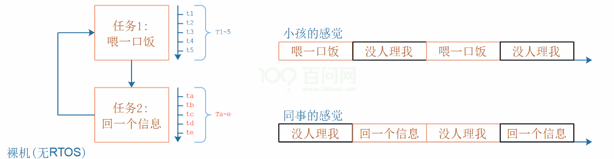

对于职场妈妈，她怎么解决这个问题呢？她是一个眼明手快的人，可以一心多用，她这样做：

- 左手拿勺子，给小孩喂饭
- 右手敲键盘，回复同事
- 两不耽误，小孩“以为”妈妈在专心喂饭，同事“以为”她在专心聊天
- 但是脑子只有一个啊，虽然说“一心多用”，但是谁能同时思考两件事？
- 只是她反应快，上一秒钟在考虑夹哪个菜给小孩，下一秒钟考虑给同事回复什么信息
- 本质是：交叉执行，t1~t5和ta~te交叉执行，如下图所示：

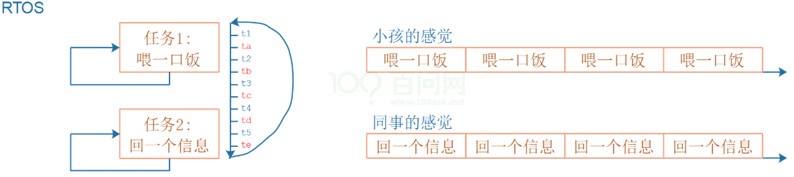

基于多任务系统编写程序时，示例代码如下：

```c
// RTOS程序
喂饭任务()
{
    while (1)
    {
        喂一口饭();
    }
}

回信息任务()
{
    while (1)
    {
        回一个信息();
    }
}

void main()
{
    // 创建2个任务
    create_task(喂饭任务);
    create_task(回信息任务);

    // 启动调度器
    start_scheduler();
}
```

- 第21、22行，创建2个任务；
- 第25行，启动调度器；
- 之后，这2个任务就会交叉执行了；

基于多任务系统编写程序时，反而更简单了：

1) 上面第2~8行是“喂饭任务”的代码；
2) 第10~16行是“回信息任务”的代码，编写它们时甚至都不需要考虑它和其他函数的相互影响。就好像有2个单板：一个只运行“喂饭任务”这个函数、另一个只运行“回信息任务”这个函数。

多任务系统会依次给这些任务分配时间：你执行一会，我执行一会，如此循环。只要切换的间隔足够短，用户会“感觉这些任务在同时运行”。如下图所示：

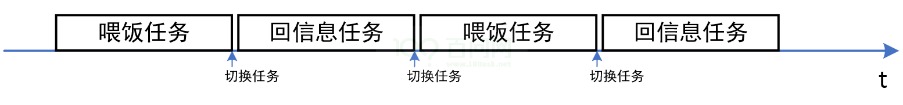

#### 1.2.2 互斥操作

多任务系统中，多个任务可能会“同时”访问某些资源，需要增加保护措施以防止混乱。比如任务A、B都要使用串口，能否使用一个全局变量让它们独占地、互斥地使用串口？示例代码如下：

```c
// RTOS程序
int g_canuse = 1;

void uart_print(char *str)
{
    if (g_canuse)
    {
        g_canuse = 0;
        printf(str);
        g_canuse = 1;
    }
}

task_A()
{
    while (1)
    {
        uart_print("0123456789\n");
    }
}

task_B()
{
    while (1)
    {
        uart_print("abcdefghij");
    }
}

void main()
{
    // 创建2个任务
    create_task(task_A);
    create_task(task_B);
    // 启动调度器
    start_scheduler();
}
```

程序的意图是：task_A打印“0123456789”，task_B打印“abcdefghij”。在task_A或task_B打印的过程中，另一个任务不能打印，以避免数字、字母混杂在一起，比如避免打印这样的字符：“012abc”。

第6行使用全局变量g_canuse实现互斥打印，它等于1时表示“可以打印”。在进行实际打印之前，先把g_canuse设置为0，目的是防止别的任务也来打印。

这个程序大部分时间是没问题的，但是只要它运行的时间足够长，就会出现数字、字母混杂的情况。下图把uart_print函数标记为①~④个步骤：

```c
void uart_print(char *str)
{
    if( g_canuse )     ①
    {
        g_canuse = 0;  ②
        printf(str);   ③
        g_canuse = 1;  ④
    }
}
```

如果task_A执行完①，进入if语句里面执行②之前被切换为task_B：在这一瞬间，g_canuse还是1。

task_B执行①时也会成功进入if语句，假设它执行到③，在printf打印完部分字符比如“abc”后又再次被切换为task_A。

task_A继续从上次被暂停的地方继续执行，即从②那里继续执行，成功打印出“0123456789”。这时在串口上可以看到打印的结果为：“abc0123456789”。

是不是“①判断”、“②清零”间隔太远了，uart_print函数改进成如下的代码呢？

```c
void uart_print(char *str)
{
    g_canuse--;            ① 减一
    if( g_canuse == 0 )    ② 判断
    {
        printf(str);     ③ 打印
    }
    g_canuse++;          ④ 加一
}
```

即使改进为上述代码，仍然可能产生两个任务同时使用串口的情况。因为“①减一”这个操作会分为3个步骤：a.从内存读取变量的值放入寄存器里，b.修改寄存器的值让它减一，c.把寄存器的值写到内存上的变量上去。

如果task_A执行完步骤a、b，还没来得及把新值写到内存的变量里，就被切换为task_B：在这一瞬间，g_canuse还是1。

task_B执行①②时也会成功进入if语句，假设它执行到③，在printf打印完部分字符比如“abc”后又再次被切换为task_A。

task_A继续从上次被暂停的地方继续执行，即从步骤c那里继续执行，成功打印出“0123456789”。这时在串口上可以看到打印的结果为：“abc0123456789”。

从上面的例子可以看到，基于多任务系统编写程序时，访问公用的资源的时候要考虑“互斥操作”。任何一种多任务系统都会提供相应的函数。

#### 1.2.3 同步操作

如果任务之间有依赖关系，比如任务A执行了某个操作之后，需要任务B进行后续的处理。如果代码如下编写的话，任务B大部分时间做的都是无用功。

```c
// RTOS程序
int flag = 0;

void task_A()
{
    while (1)
    {
        // 做某些复杂的事情
        // 完成后把flag设置为1
        flag = 1;
    }
}

void task_B()
{
    while (1)
    {
        if (flag)
        {
            // 做后续的操作
        }
    }
}

void main()
{
    // 创建2个任务
    create_task(task_A);
    create_task(task_B);
    // 启动调度器
    start_scheduler();
}
```

上述代码中，在任务A没有设置flag为1之前，任务B的代码都只是去判断flag。而任务A、B的函数是依次轮流运行的，假设系统运行了100秒，其中任务A总共运行了50秒，任务B总共运行了50秒，任务A在努力处理复杂的运算，任务B仅仅是浪费CPU资源。

如果可以让任务B阻塞，即让任务B不参与调度，那么任务A就可以独占CPU资源加快处理复杂的事情。当任务A处理完事情后，再唤醒任务B。示例代码如下：

```c
// RTOS程序
void task_A()
{
    while (1)
    {
        // 做某些复杂的事情
        // 释放信号量,会唤醒任务B;
    }
}

void task_B()
{
    while (1)
    {
        // 等待信号量, 会让任务B阻塞
        // 做后续的操作
    }
}

void main()
{
    // 创建2个任务
    create_task(task_A);
    create_task(task_B);
    // 启动调度器
    start_scheduler();
}
```

- 第15行：任务B运行时，等待信号量，不成功时就会阻塞，不在参与任务调度。
- 第7行：任务A处理完复杂的事情后，释放信号量会唤醒任务B。
- 第16行：任务B被唤醒后，从这里继续运行。

在这个过程中，任务A处理复杂事情的时候可以独占CPU资源，加快处理速度。

---

## 第2章 搭建开发环境安装

### 2.1 安装Keil MDK

#### 2.1.1 软件下载

开发板配套资料里有Keil MDK软件包：

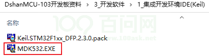

也可以（但是不建议）在Keil官网（https://www.keil.com/download/product/）直接下载“MDK-Arm”，如图所示：

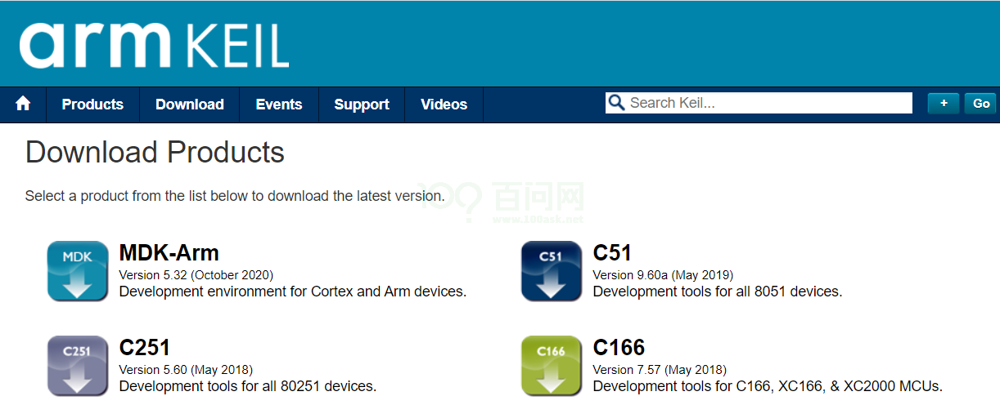

#### 2.1.2 软件安装

双击运行“MDK532.EXE”，进入安装界面，选择“Next >>”，如图所示：

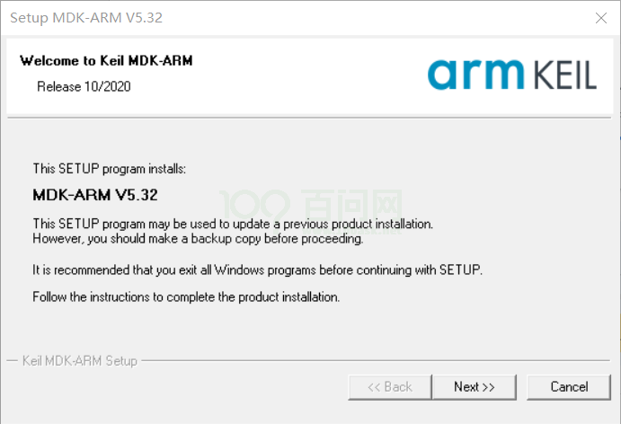

接着进入用户协议界面，勾选同意协议，点击“Next >>”，如图所示：

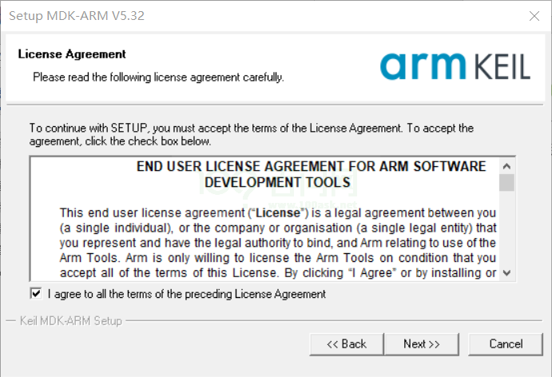

然后设置安装路径，第一个“Core”是软件的安装路径，第二个“Pack”是芯片的硬件支持包的安装路径，读者保持默认路径或者设置为如下图图所示一样的即可，如果是自定义设置，建议为全英文路径，不建议为包含有中文的路径。选择好之后点击“Next >>”后：

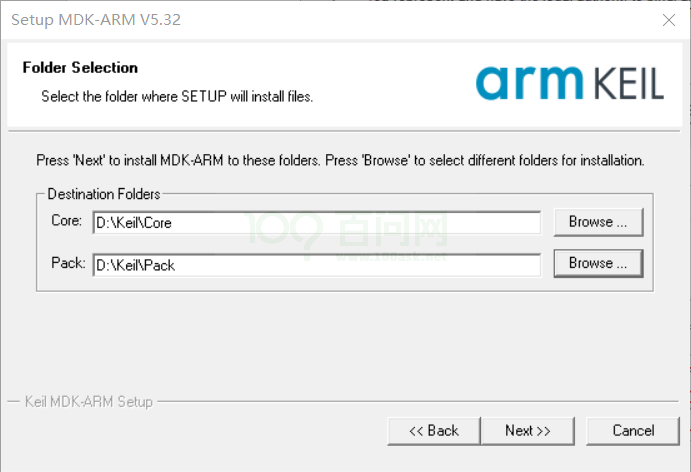

随后需要设置个人信息，随便填写即可，如图所示：

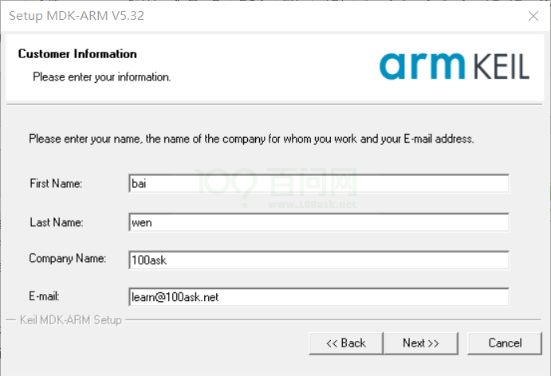

之后便进入安装进度界面，如下图所示，等待安装完成。

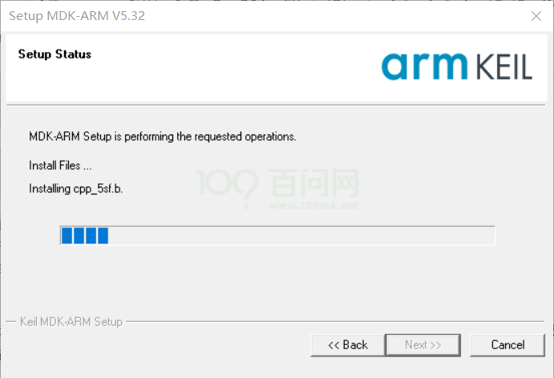

安装过程中，回弹出驱动安装界面，勾选“始终信任来自‘ARM Ltd’的软件”，然后点击“安装”，如下图所示。

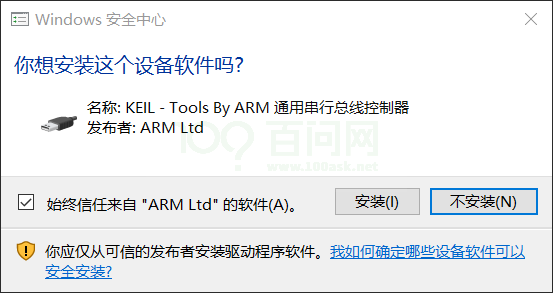

如下图所示即安装完成，“Show Release Notes”为查看当前版版本说明，可以不勾选，最后点击“Filash”。

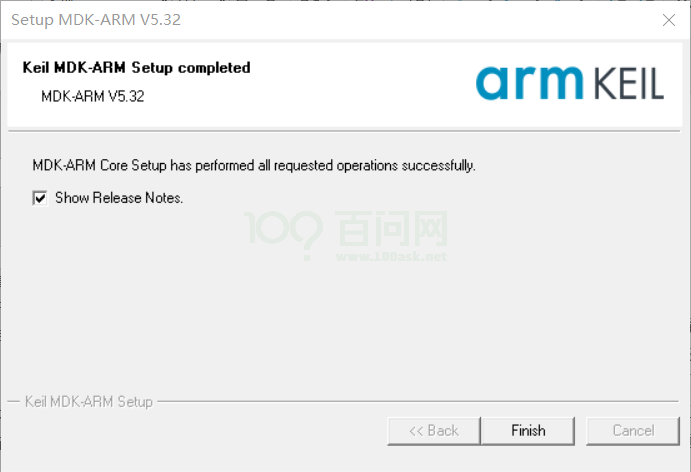

之后会自动进入“Pack Installer”界面，这里会检查安装的编译器、CMSIS等是否是最新的，由于我们安装的是官网提供的最新的MDK，所以这里一般情况下都是不需要更新的。

至此Keil就安装完成了，但这不是Keil开发环境的全部。一个Keil的开发环境，除了Keil软件，还需要安装对应的Pack，比如这里目标机的MCU是STM32F103C8T6，就需要下载该系列的的Pack，如果是STM32F4系列，就需要下其它系列Pack。

#### 2.1.3 PACK安装

Keil只是一个开发工具，它里面有一些芯片的软件包；但是它肯定不会事先安装好所有芯片的软件包。我们要开发某款芯片，就需要先安装这款芯片的软件包，这被称为“Pack”。

可以双击运行开发板配套资料中的Pack安装包：

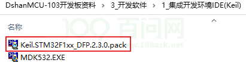

也可以在线安装，下面演示一下如何在线安装。

打开Keil之后，点击如下按钮启动“Pack Installer”：

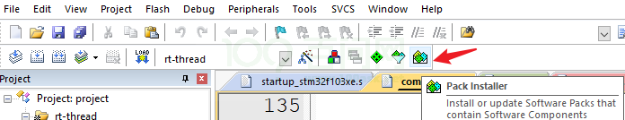

使用“Pack Installer”可以方便的对Pack安装和管理。在左上角搜索框输入“STM32F103”，展开搜索结果，可以看到STM32F103ZE，点击右边的简介链接即可跳转到Pack下载页面，如下图所示。

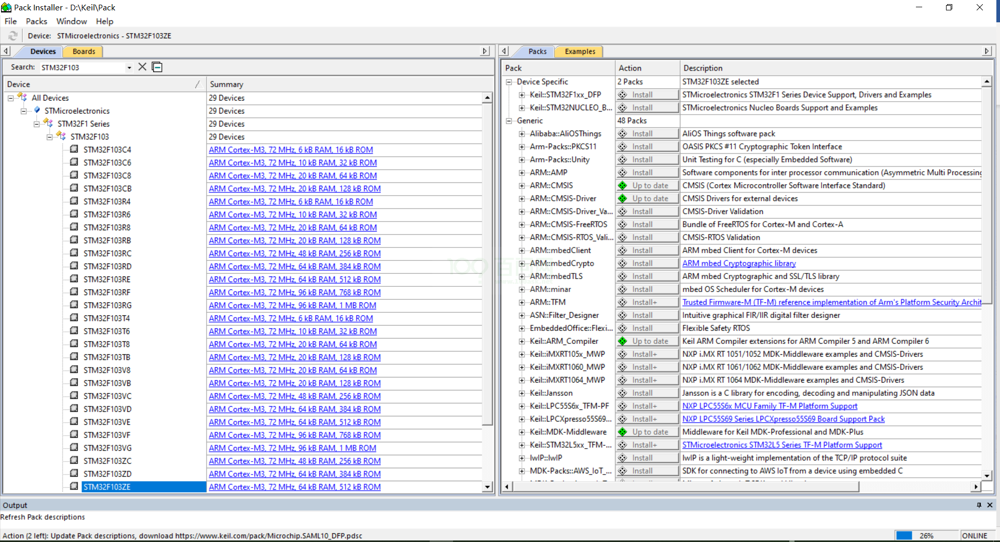

如果跳转网页无法打开，可直接打开Pack下载总入口（[www.keil.com/dd2/Pack/](http://www.keil.com/dd2/Pack/)）。进入Pack下载总入口后，找到“STMicroelectronics STM32F1 Series Device Support, Drivers and”，点击右边的下载图标即可，如下图所示（实测部分网络环境打开该链接无Pack列表，请尝试换个网络环境测试，仍旧不行则使用配套资料Pack）。

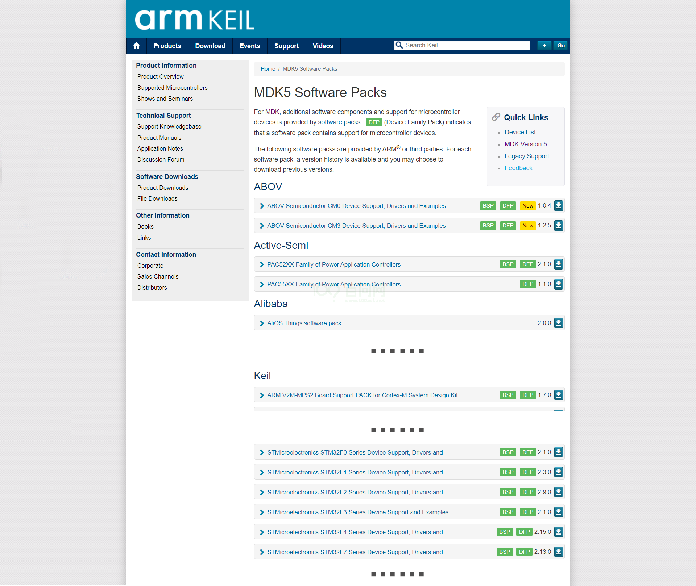

下载之前会弹出Pack用户协议，点击“Accept”即可：


下载完成得到“Keil.STM32F1xx_DFP.2.3.0.pack”，直接双击该文件，随后弹出如图所示界面，点击“Next”进行安装。

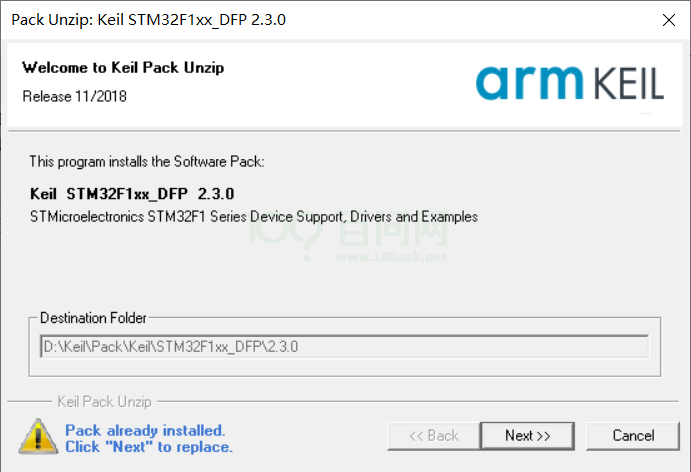

### 2.2 安装STM32CubeMX

STM32CubeMX是ST意法半导体推出的STM32系列芯片可视化的图形配置工具，用户可以通过图形化向导为Cortex-M系列MCU生成含有初始化代码的工程模板。

使用STM32CubeMX创建STM32的工程，步骤少、上手快。

在开发板配套资料里，有STM32CubeMX的安装软件：

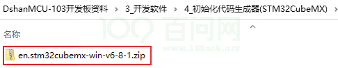

也可以从ST官网（https://www.st.com/zh/development-tools/stm32cubemx.html）下载STM32CubeMX。

解压安装包后，即可安装，如下图所示：

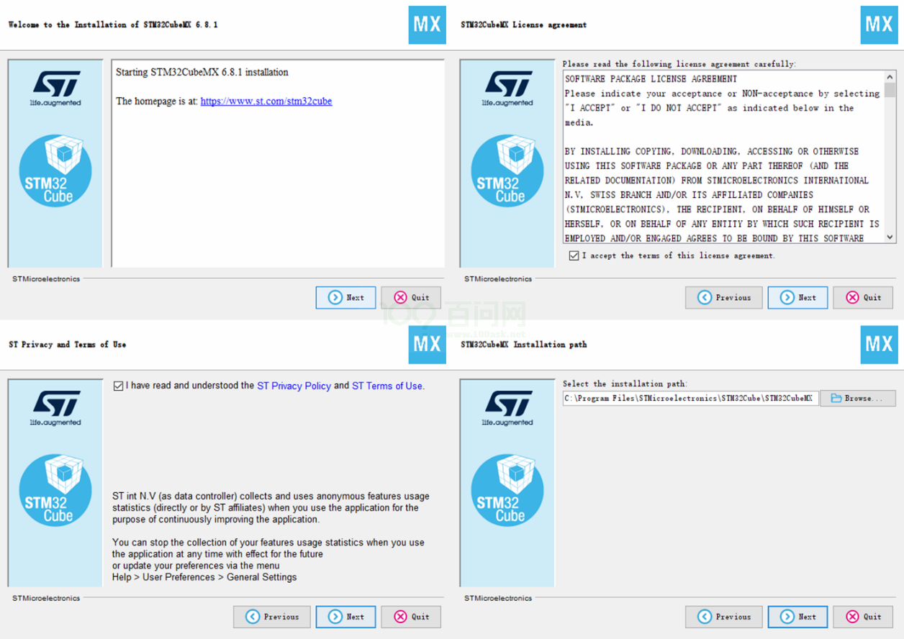

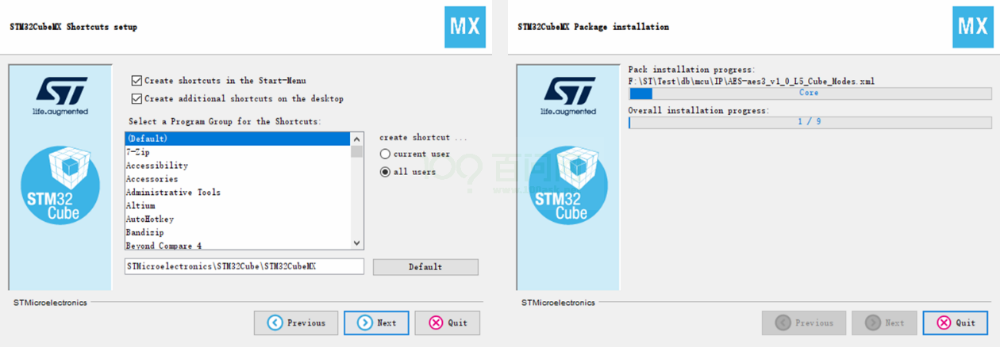

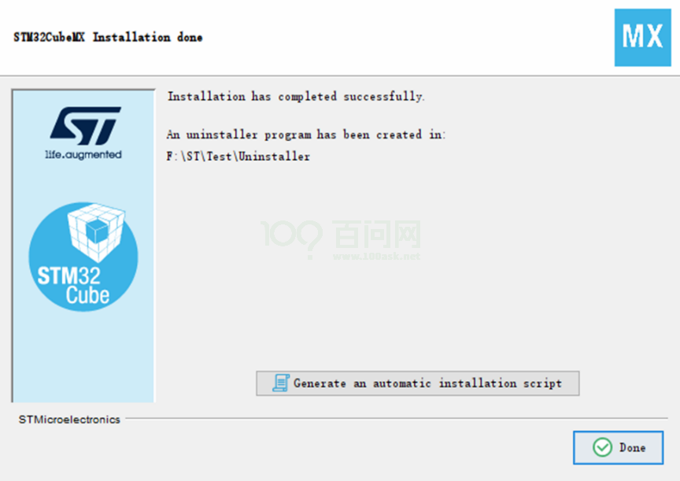

### 2.3 安装STM32CubeProgrammer

STM32CubeProgrammer是烧写工具，用户可以通过此工具使用ST-Link、UART、USB等通信接口往STM32处理器烧录Hex、Bin文件。也可以使用Keil通过ST-Link烧写程序，无需使用STM32CubeProgrammer。

开发板配套的资料里有安装软件：

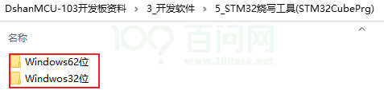

也可以从ST官网（https://www.st.com/zh/development-tools/stm32cubeprog.html）下载。

把软件包解压后即可安装，安装步骤如下面的组图所示：

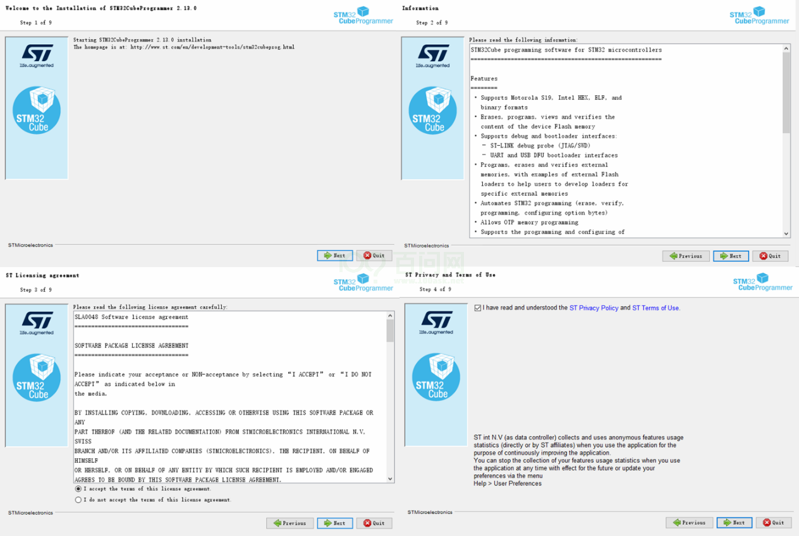

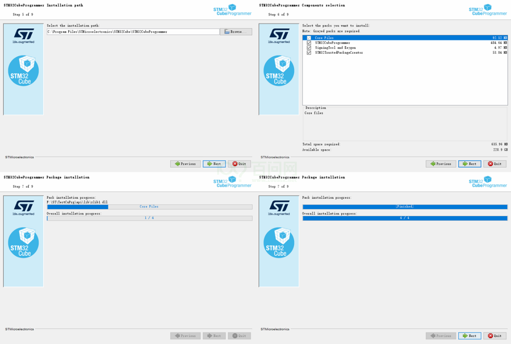

在安装STM32CubeProgrammer过程中会弹出安装ST-Link驱动，根据提示点击下一页或者完成即可：

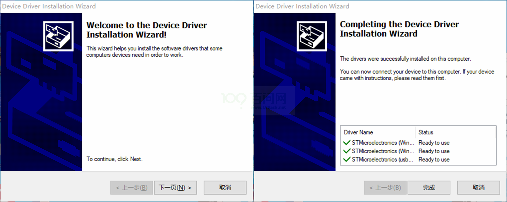

最后等待安装完成即可：

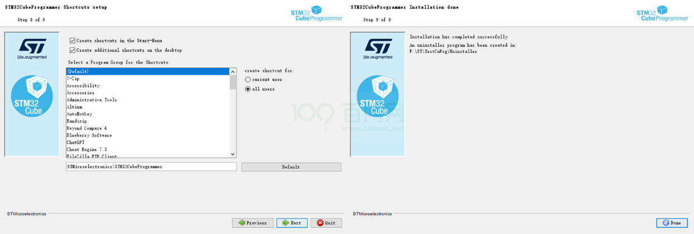

### 2.4 安装ST-Link驱动

本开发板使用ST-Link进行下载调试程序，还需要安装ST-Link驱动。

在开发板配套资料里有该驱动：

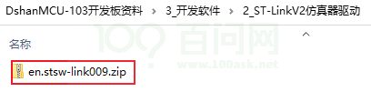

解压“en.stsw-link009.zip”，双击运行“dpinst_amd64.exe”（如果电脑为32位系统，运行“dpinst_x86.exe”），出现如图所示安装界面，点击“下一步”。

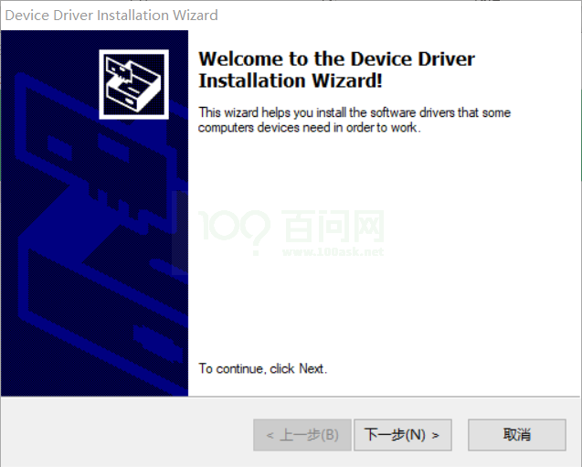

在安装过程中，出现如图所示的Windows安全警告，选择“安装”

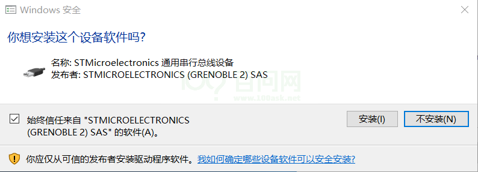

最后安装完成提示如图所示，点击“完成”退出安装程序。

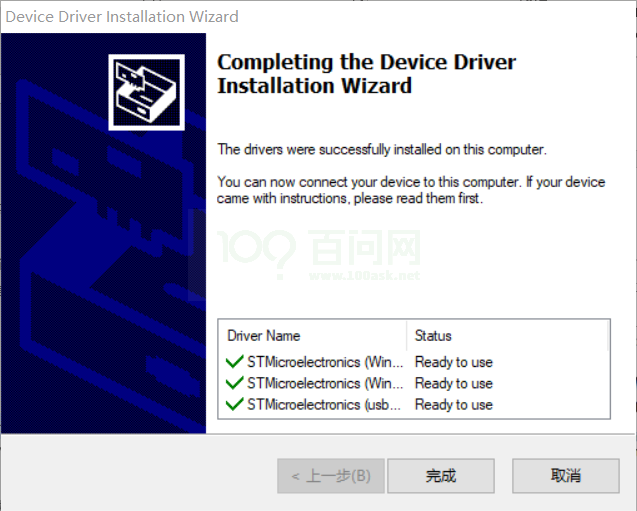

### 2.5 安装CH340驱动

在开发板配套资料中，有如下安装包：

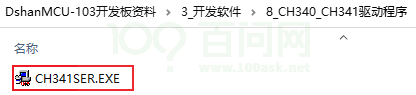

双击运行，直接点击“安装”即可：

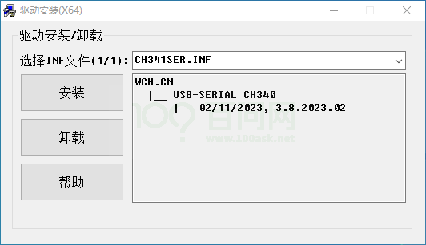

安装成功会有提示：

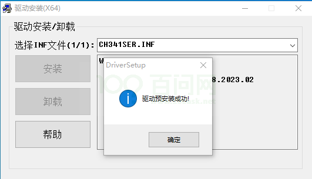

---

## 第3章 开发板使用

### 3.1 硬件连接

#### 3.1.1 连接ST-Link

本课程使用ST-Link给开发板供电、烧录、调试。

DshanMCU-103上有4个插针，它们分别是GND、SWCLK、SWDIO、3.3V。ST-Link上有10个插针，它们的功能在外壳上有标注。接线方法如下图所示：

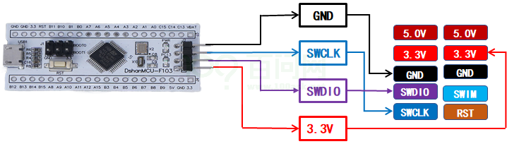

连接好的实物图像如下（ST-Link的USB口要插到电脑上）：

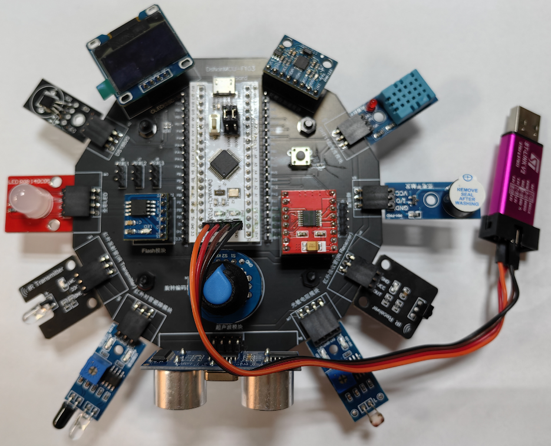

#### 3.1.2 连接USB串口

本课程后面部分会使用串口来打印信息，请按照下图连线：底板的TXD、RXD和USB串口RXD、TXD交叉连接，GND要互相连接。

注意：ST-Link也要保持连接，我们使用ST-Link进行供电、烧录、调试。

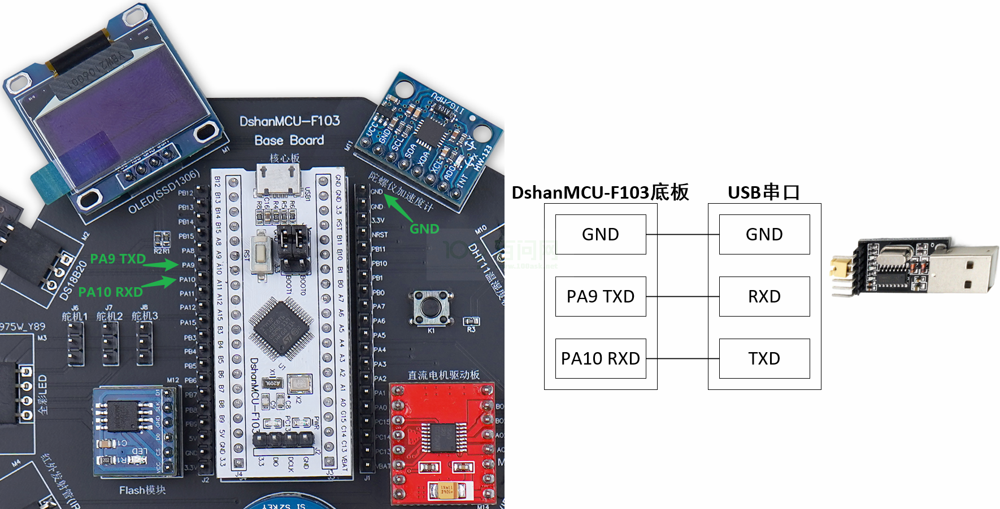

### 3.2 编译、下载、运行

#### 3.2.1 编译工程

把开发板配套资料中如下程序复制到“目录名里没有空格、没有中文字符”的目录下并解压开：

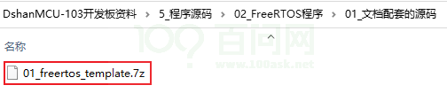

在工程的“MDK-ARM”目录下，双击如下文件，就会使用Keil打开工程：

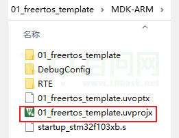

在Keil界面，点击一下红框中任意一个按钮即可编译程序：

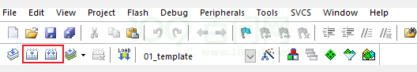

左边的按钮名为“Build”，点击这个按钮后，这些文件将会被编译：

- 所有没有被编译过的C文件
- 所被修改了但是尚未再次编译的C文件

如果你曾经编译过工程，但是只是修改了某些文件，使用“Buld”按钮时，只会编译这些被修改的文件，这会加快编译速度。

右边的按钮名为“Rebuild”，点击这个按钮后，所有的文件都会被再次编译。

#### 3.2.2 配置调试器

先点击如下图所示按钮：

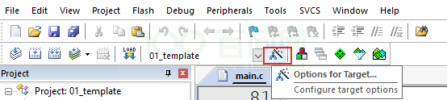

然后如下图依次点击“Debug”，选择“ST-Link Debugger”，点击“Setting”（可能会一是升级固件，见本节后面部分）：

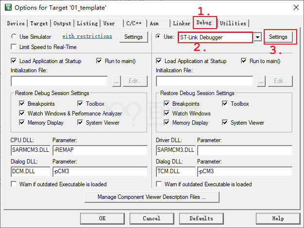

如一切正常，ST-Link会自动识别出芯片，如下图所示：

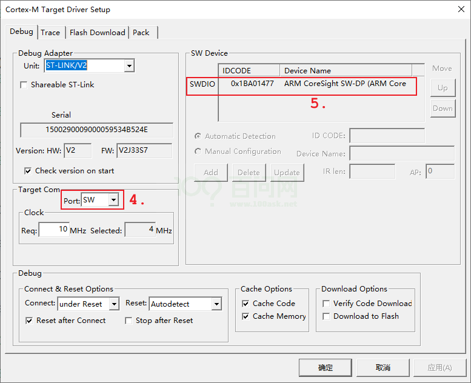

然后入下图选择：

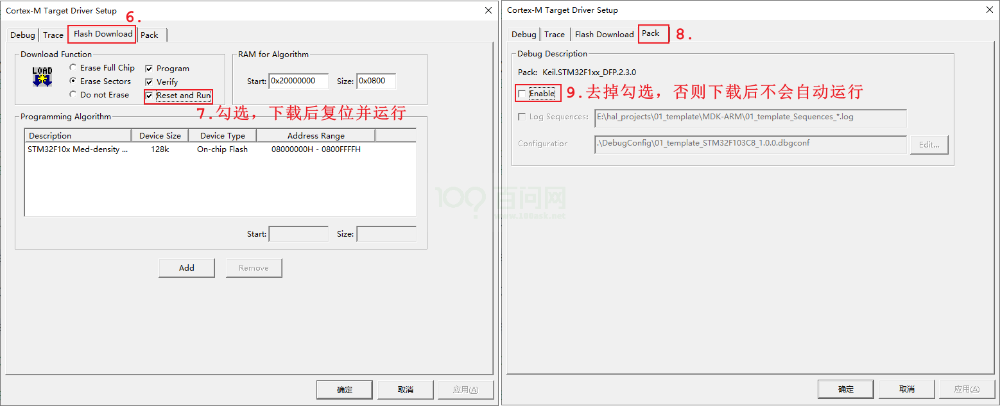

注意：如果你的ST-Link是第1次使用，它的固件可能已经很老了。设置调试器时可能会提示升级固件。如下图所示：点击“Yes”表示升级：

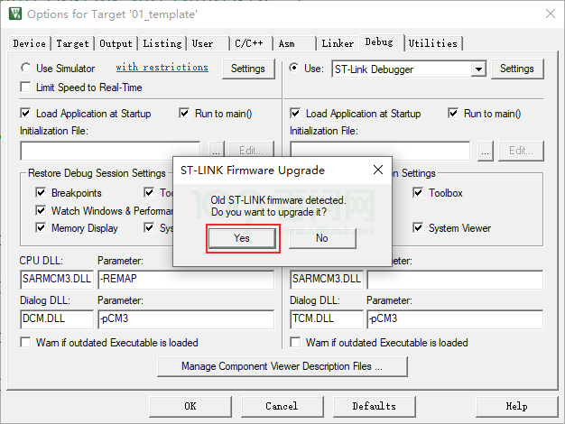

然后会弹出升级界面，点击“Device Connect”，表示连接设备；再点击“Yes”开始升级。如下图所示：

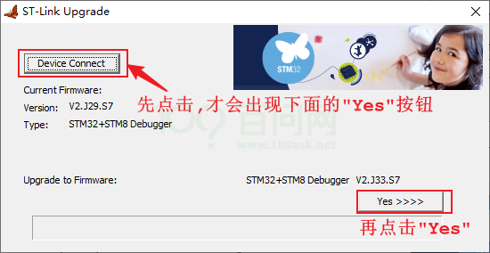

#### 3.2.3 烧录运行

点击如下按钮，即可烧写、运行程序：

 

如果一切正常，可以看到DshanMCU-103上的LED闪烁。

### 3.3 修改代码

“01_freertos_template”里已经支持了所有的模块，这些模块不能同时测试。要测试哪个模块，需要如下图修改代码：

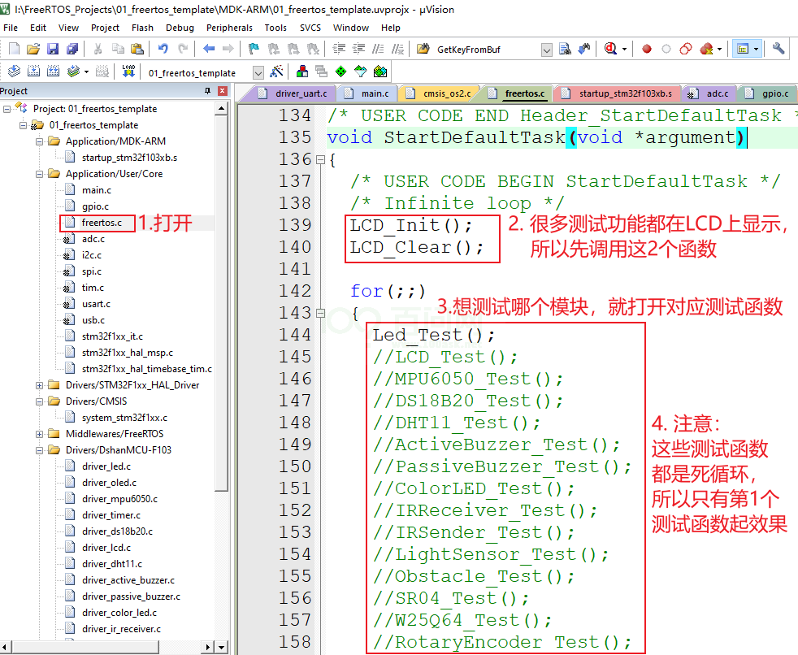

### 3.4 注意事项

有些模块的引脚是共用的，所以它们要么不能同时接，要么不能同时使用。打开底板原理图，里面有说明：

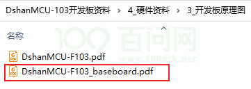

为方便大家使用，列表如下：

| **模块1**        | **模块2**              | **备注**                      |
| ---------------- | -------------------- | ---------------------------- |
| M2(DS18B20)      | M10(DHT11温湿度模块) | 不能同时接                   |
| M4(红外发射模块) | M9(蜂鸣器)           | 不能同时接                   |
| M6(超声波模块)   | M12(Flash模块)       | 可以同时接，但是不能同时访问 |

图示如下：

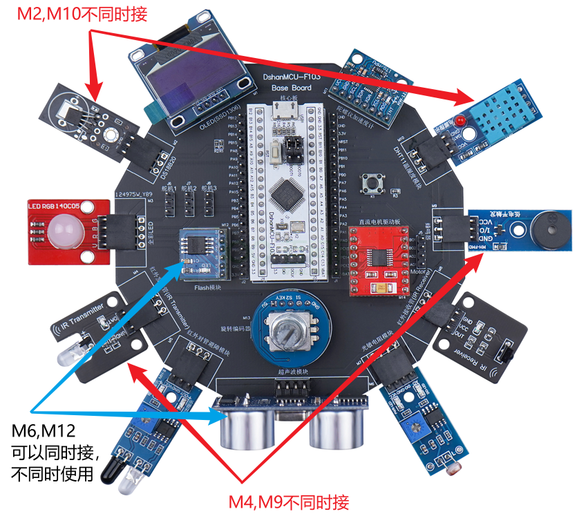

---

## 第4章 模块使用说明与STM32CubeMX配置

### 4.1 硬件模块和驱动对应关系

对于每一个模块，我们都编写了驱动程序。这些驱动程序依赖于STM32CubeMX提供的初始化代码。比如driver_oled.c里面要使用I2C1通道，I2C1的初始化代码是STM32CubeMX生成的：MX_I2C1_Init被用来初始I2C1本身，HAL_I2C_MspInit被用来初始化I2C引脚。driver_oled.c只使用I2C1的函数收发数据，它不涉及I2C1的初始化。换句话说，你要在自己的工程里使用driver_oled.c，还需要初始化相应的I2C通道、引脚。

观看模块的头文件就可以知道接口函数的用法，每个驱动文件里都有一个测试函数，参考测试函数也可以知道怎么使用这个驱动。硬件模块和驱动文件对应关系如下表所示：

| 模块                              | 驱动                                             |
| --------------------------------- | ------------------------------------------------ |
| 板载单色LED                       | driver_led.cdriver_led.h                         |
| 按键(K1)                          | driver_key.cdriver_key.h                         |
| 蜂鸣器模块（有源）                | driver_active_buzzer.cdriver_active_buzzer.h     |
| 蜂鸣器模块（无源）                | driver_passive_buzzer.cdriver_passive_buzzer.h   |
| 温湿度模块（DHT11）               | driver_dht11.cdriver_dht11.h                     |
| 温度模块（DS18B20）               | driver_ds18b20.cdriver_ds18b20.h                 |
| 红外避障模块（LM393）             | driver_ir_obstacle.cdriver_ir_obstacle.h         |
| 超声波测距模块（HC-SR04）         | driver_ultrasonic_sr04.cdriver_ultrasonic_sr04.h |
| 旋转编码器模块（EC11）            | driver_rotary_encoder.cdriver_rotary_encoder.h   |
| 红外接收模块（1838）              | driver_ir_receiver.cdriver_ir_receiver.h         |
| 红外发射模块（38KHz）             | driver_ir_sender.cdriver_ir_sender.h             |
| RGB全彩LED模块                    | driver_color_led.cdriver_color_led.h             |
| 光敏电阻模块                      | driver_light_sensor.cdriver_light_sensor.h       |
| 舵机（SG90）                      |                                                  |
| IIC OLED屏幕（SSD1306）           | driver_oled.cdriver_oled.h                       |
| IIC 陀螺仪加速度计模块（MPU6050） | driver_mpu6050.cdriver_mpu6050.h                 |
| SPI FLASH模块（W25Q64）           | driver_spiflash_w25q64.cdriver_spiflash_w25q64.h |
| 直流电机（DRV8833）               | driver_motor.cdriver_motor.h                     |
| 步进电机（ULN2003）               |                                                  |

### 4.2 调试引脚与定时器

DshanMCU-103使用SWD调试接口，可以节省出TDI（PA15）、TDO（PB3）、TRST（PB4）三个引脚。其中PA15、PB3用于全彩LED，PB4用于直流电机。所以需要在STM32CubeMX里配置调试接口为SWD，否则全彩LED、直流电机无法使用。

DshanMCU-103中使用PA8来控制红外发射模块、无源蜂鸣器，PA8作为TIM1_CH1时用到TIMER1；全彩LED使用PA15、PB3、PA2作为绿色（G）、蓝色（B）、红色（R）的驱动线，这3个引脚被分别配置为TIM2_CHN1、TIM2_CHN2、TIM2_CHN3，用到TIMER2；直流电机的通道B使用PB4作为PWM引脚（TM3_CHN1），用到TIMER3。所以TIMER1、2、3都被使用了，只剩下TIMER4作为HAL时钟。

如下配置：

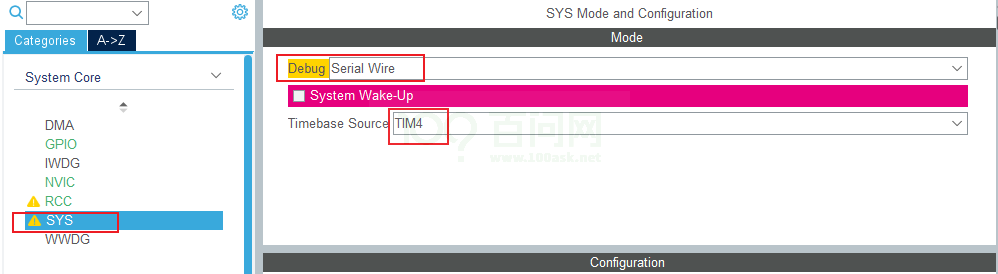

### 4.3 LED驱动使用方法

本节介绍板载LED灯驱动的使用方法，最终实现控制LED灯的亮灭。

#### 4.3.1 硬件接线

这里我们不需要进行额外接模块的操作，因为DShanMCU-F103板载了一颗LED灯，其位于正面，丝印名称是PC13，如下图所示：

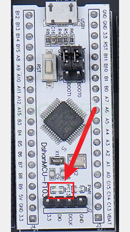

#### 4.3.2 STM32CubeMX配置

LED使用PC13引脚，配置如下：

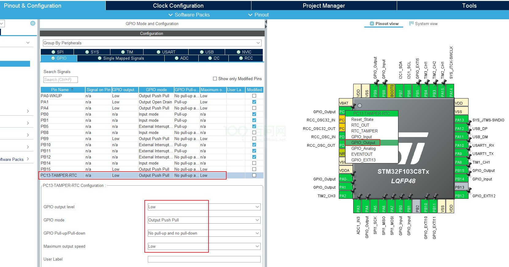

#### 4.3.3 代码调用

这里使用到的驱动以及测试代码位于 “Drivers/DShanMCU-F103/driver_led.c” 和 “Drivers/DShanMCU-F103/driver_led.h” 中。其中，**Led_Test** 函数完成了 led 灯的初始化与测试工作。

**Led_Test** 函数在 “Core/Src/freertos.c” 文件中被 **StartDefaultTask** 函数调用。

打开 “Core/Src/freertos.c” 文件，将 **StartDefaultTask** 函数中的 **Led_Test** 前面的注释去掉，并检查是否有其他函数未被注释(因为每个测试函数中都使用到死循环，所以每次只能运行位于最前面的测试项)，如下所示：

```c
void StartDefaultTask(void *argument)
{
  /* USER CODE BEGIN StartDefaultTask */
  /* Infinite loop */
  LCD_Init();
  LCD_Clear();

  for(;;)
  {
    Led_Test();
    //LCD_Test();
    //MPU6050_Test();
    //DS18B20_Test();
    //DHT11_Test();
    //ActiveBuzzer_Test();
    //PassiveBuzzer_Test();
    //ColorLED_Test();
    //IRReceiver_Test();
    //IRSender_Test();
    //LightSensor_Test();
    //Obstacle_Test();
    //SR04_Test();
    //W25Q64_Test();
    //RotaryEncoder_Test();
    //Motor_Test();
    //Key_Test();
    //UART_Test();
  }
  /* USER CODE END StartDefaultTask */
}
```

#### 4.3.4 机实验

会看到板载的LED灯亮500毫秒之后灭500毫秒，不停的重复这个过程。

### 4.4 IIC OLED屏驱动使用方法

本节介绍OLED屏幕驱动的使用方法，最终实现通过OLED屏幕显示字符或字符串。

#### 4.4.1 硬件接线

将OLED屏幕接到配套的DShanMCU-F103 Base Board学习底板上即可，具体位置是印有 “OLED(SSD1036)”丝印的排母接口，如下图所示：

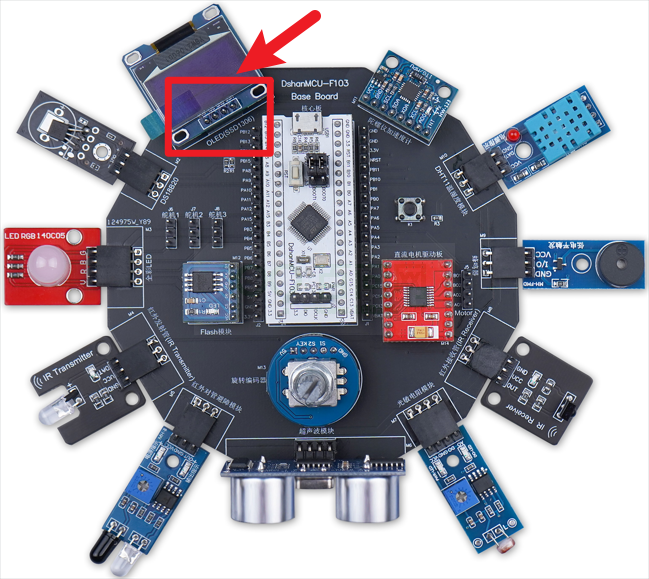

#### 4.4.2 STM32CubeMX配置

OLED屏幕使用I2C1通道，I2C1使用PB6、PB7作为SCL、SDA引脚，配置如下：

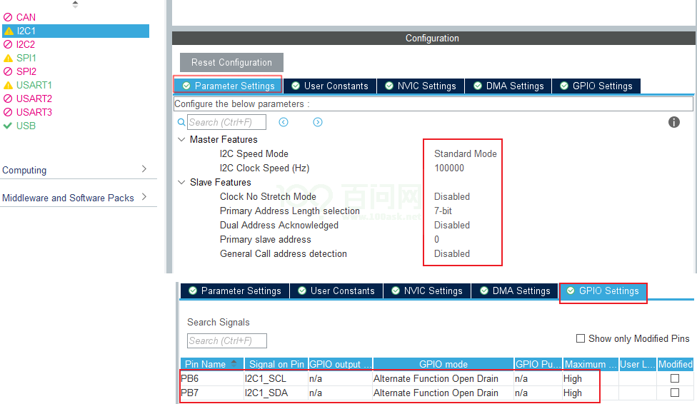


#### 4.4.3 代码调用

这里使用到的驱动以及测试代码位于 “Drivers/DShanMCU-F103/driver_oled.c” 和 “Drivers/DShanMCU-F103/driver_oled.h” 中。其中，**OLED_Test** 函数完成了 OLED 屏幕的初始化与测试工作。

**OLED_Test** 函数在 “Core/Src/freertos.c” 文件中被 **StartDefaultTask** 函数调用。

打开 “Core/Src/freertos.c” 文件，将 **StartDefaultTask** 函数中的 **OLED_Test** 前面的注释去掉，并检查是否有其他函数未被注释(因为每个测试函数中都使用到死循环，所以每次只能运行位于最前面的测试项)，如下所示：

```c
void StartDefaultTask(void *argument)
{
  /* USER CODE BEGIN StartDefaultTask */
  /* Infinite loop */
  LCD_Init();
  LCD_Clear();

  for(;;)
  {
    //Led_Test();
    LCD_Test();
    //MPU6050_Test();
    //DS18B20_Test();
    //DHT11_Test();
    //ActiveBuzzer_Test();
    //PassiveBuzzer_Test();
    //ColorLED_Test();
    //IRReceiver_Test();
    //IRSender_Test();
    //LightSensor_Test();
    //Obstacle_Test();
    //SR04_Test();
    //W25Q64_Test();
    //RotaryEncoder_Test();
    //Motor_Test();
    //Key_Test();
    //UART_Test();
  }
  /* USER CODE END StartDefaultTask */
}
```

#### 4.4.4 上机实验

会看到OLED屏幕上显示 **OLED_Test** 函数中指定的字符或字符串。

### 4.5 按键驱动使用方法

本节介绍按键驱动的使用方法，最终实现通过按键控制LED灯。

#### 4.5.1 硬件接线

这里我们不需要进行额外接模块的操作，因为DShanMCU-F103 Base Board底板板载了一个按键，如下图所示：

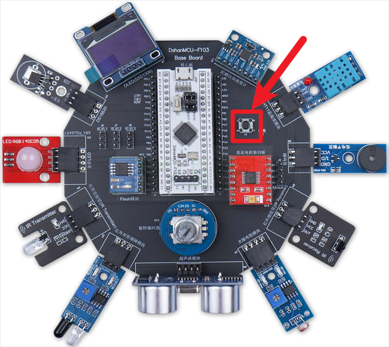


#### 4.5.2 STM32CubeMX配置

按键使用PB14引脚，配置如下：

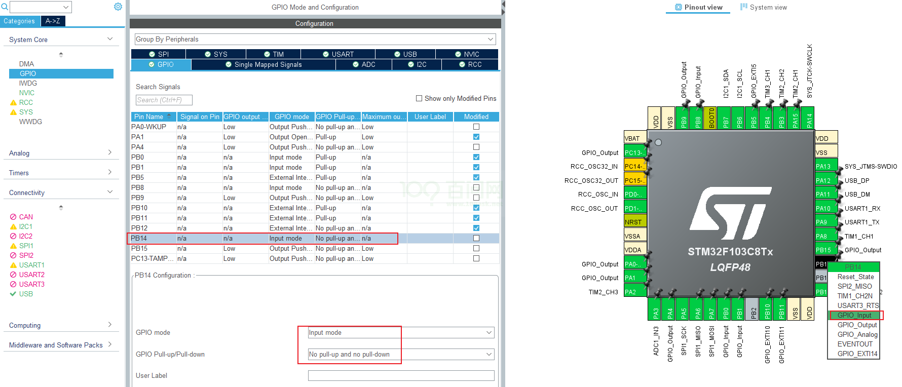

#### 4.5.3 代码调用

这里使用到的驱动以及测试代码位于 “Drivers/DShanMCU-F103/driver_key.c” 和 “Drivers/DShanMCU-F103/driver_key.h” 中。其中，**Key_Test** 函数完成了按键和LED灯的初始化与测试工作。

**Key_Test** 函数在 “Core/Src/freertos.c” 文件中被 **StartDefaultTask** 函数调用。

打开 “Core/Src/freertos.c” 文件，将 **StartDefaultTask** 函数中的 **Key_Test** 前面的注释去掉，并检查是否有其他函数未被注释(因为每个测试函数中都使用到死循环，所以每次只能运行位于最前面的测试项)，如下所示：

```c
void StartDefaultTask(void *argument)
{
  /* USER CODE BEGIN StartDefaultTask */
  /* Infinite loop */
  LCD_Init();
  LCD_Clear();

  for(;;)
  {
    //Led_Test();
    //LCD_Test();
    //MPU6050_Test();
    //DS18B20_Test();
    //DHT11_Test();
    //ActiveBuzzer_Test();
    //PassiveBuzzer_Test();
    //ColorLED_Test();
    //IRReceiver_Test();
    //IRSender_Test();
    //LightSensor_Test();
    //Obstacle_Test();
    //SR04_Test();
    //W25Q64_Test();
    //RotaryEncoder_Test();
    //Motor_Test();
    Key_Test();
    //UART_Test();
  }
  /* USER CODE END StartDefaultTask */
}
```

#### 4.5.4 上机实验

按下或者松开按键，会看到OLED屏幕上按键的当前状态（按下或松开）；同时，可以通过按键控制LED灯的亮灭，按下按键LED灯亮起，松开按键LED灯熄灭。。

### 4.6 有源蜂鸣器模块驱动使用方法

本节介绍有源蜂鸣器模块驱动的使用方法，最终实现让有源蜂鸣器发出声音。

#### 4.6.1 硬件接线

将有源蜂鸣器模块接到配套的DShanMCU-F103 Base Board学习底板上即可，具体位置是印有“蜂鸣器”丝印的排母接口，如下图所示：

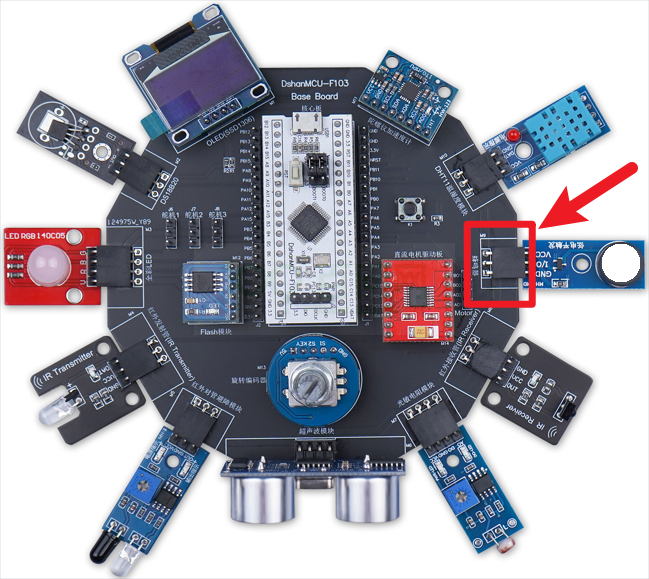

#### 4.6.2 STM32CubeMX配置

有源蜂鸣器使用PA8，把它配置为推挽输出引脚即可。但是无源蜂鸣器也使用PA8，需要把它配置为TIM1_CH1引脚。我们的程序可以既使用有源蜂鸣器，也使用无源蜂鸣器。所以需要使用代码来配置PA8。

在driver_active_buzzer.c文件的ActiveBuzzer_Init函数里，已经把PA8配置为推挽输出。

在driver_passive_buzzer.c文件的PassiveBuzzer_Init函数里，已经把PA8配置为TIM1_CH1。

无需在STM32CubeMX里配置PA8。

#### 4.6.3 代码调用

这里使用到的驱动以及测试代码位于 “Drivers/DShanMCU-F103/driver_active_buzzer.c” 和 “Drivers/DShanMCU-F103/driver_active_buzzer.h” 中。其中，**ActiveBuzzer_Test** 函数完成了有源蜂鸣器模块的初始化与测试工作。

**ActiveBuzzer_Test** 函数在 “Core/Src/freertos.c” 文件中被 **StartDefaultTask**  函数调用。

打开 “Core/Src/freertos.c” 文件，将 **StartDefaultTask** 函数中的 **ActiveBuzzer_Test** 前面的注释去掉，并检查是否有其他函数未被注释(因为每个测试函数中都使用到死循环，所以每次只能运行位于最前面的测试项)，如下所示：

```c
void StartDefaultTask(void *argument)
{
  /* USER CODE BEGIN StartDefaultTask */
  /* Infinite loop */
  LCD_Init();
  LCD_Clear();

  for(;;)
  {
    //Led_Test();
    //LCD_Test();
    //MPU6050_Test();
    //DS18B20_Test();
    //DHT11_Test();
    ActiveBuzzer_Test();
    //PassiveBuzzer_Test();
    //ColorLED_Test();
    //IRReceiver_Test();
    //IRSender_Test();
    //LightSensor_Test();
    //Obstacle_Test();
    //SR04_Test();
    //W25Q64_Test();
    //RotaryEncoder_Test();
    //Motor_Test();
    //Key_Test();
    //UART_Test();
  }
  /* USER CODE END StartDefaultTask */
}
```

#### 4.6.4 上机实验

有源蜂鸣器保持响1秒之后保持不响1秒，不停的重复这个过程；同时会看到OLED屏幕上显示有源蜂鸣器的状态(ON/OFF)。

### 4.7 无源蜂鸣器模块驱动使用方法

本节介绍无源蜂鸣器模块驱动的使用方法，最终实现让无源蜂鸣器发出声音。

#### 4.7.1 硬件接线

将无源蜂鸣器模块接到配套的DShanMCU-F103 Base Board学习底板上即可，具体位置是印有“蜂鸣器”丝印的排母接口，如下图所示：

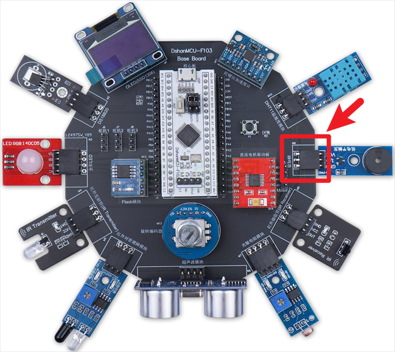

#### 4.7.2 STM32CubeMX配置

有源蜂鸣器使用PA8，把它配置为推挽输出引脚即可。但是无源蜂鸣器也使用PA8，需要把它配置为TIM1_CH1引脚。我们的程序可以既使用有源蜂鸣器，也使用无源蜂鸣器。所以需要使用代码来配置PA8。

在driver_active_buzzer.c文件的ActiveBuzzer_Init函数里，已经把PA8配置为推挽输出。

在driver_passive_buzzer.c文件的PassiveBuzzer_Init函数里，已经把PA8配置为TIM1_CH1。

无需在STM32CubeMX里配置PA8。

下图仅仅是一个示例，演示如何配置TIMER1、如何把PA8配置为TIM1_CH1：

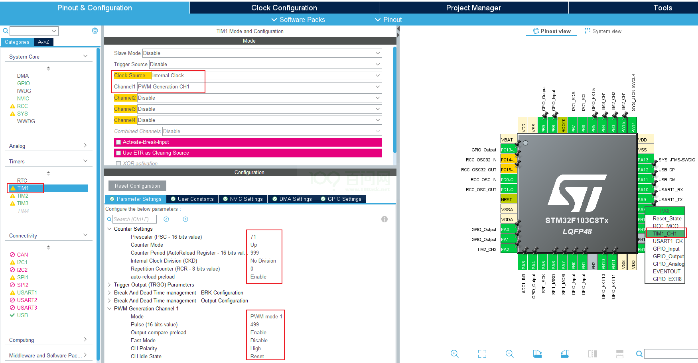

#### 4.7.3 代码调用

这里使用到的驱动以及测试代码位于 “Drivers/DShanMCU-F103/driver_passive_buzzer.c” 和 “Drivers/DShanMCU-F103/driver_passive_buzzer.h” 中。其中，**PassiveBuzzer_Test** 函数完成了无源蜂鸣器模块的初始化与测试工作。

**PassiveBuzzer_Test** 函数在 “Core/Src/freertos.c” 文件中被 **StartDefaultTask** 函数调用。

打开 “Core/Src/freertos.c” 文件，将 **StartDefaultTask** 函数中的 **PassiveBuzzer_Test** 前面的注释去掉，并检查是否有其他函数未被注释(因为每个测试函数中都使用到死循环，所以每次只能运行位于最前面的测试项)，如下所示：

```c
void StartDefaultTask(void *argument)
{
  /* USER CODE BEGIN StartDefaultTask */
  /* Infinite loop */
  LCD_Init();
  LCD_Clear();

  for(;;)
  {
    //Led_Test();
    //LCD_Test();
    //MPU6050_Test();
    //DS18B20_Test();
    //DHT11_Test();
    //ActiveBuzzer_Test();
    PassiveBuzzer_Test();
    //ColorLED_Test();
    //IRReceiver_Test();
    //IRSender_Test();
    //LightSensor_Test();
    //Obstacle_Test();
    //SR04_Test();
    //W25Q64_Test();
    //RotaryEncoder_Test();
    //Motor_Test();
    //Key_Test();
    //UART_Test();
  }
  /* USER CODE END StartDefaultTask */
}
```

#### 4.7.4 上机实验

有源蜂鸣器保持响1秒之后保持不响1秒，不停的重复这个过程；同时会看到OLED屏幕上显示有源蜂鸣器的状态(ON/OFF)。

### 4.8 DHT11温湿度模块驱动使用方法

本节介绍DHT11温湿度模块驱动的使用方法，最终实现通过DHT11温湿度模块采集温湿度信息。

#### 4.8.1 硬件接线

将DHT11温湿度模块接到配套的DShanMCU-F103 Base Board学习底板上即可，具体位置是印有“DHT11温湿度模块” 丝印的排母接口，如下图所示：

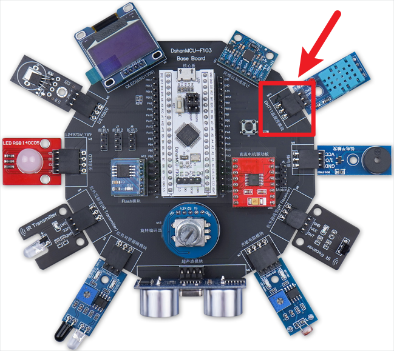

#### 4.8.2 STM32CubeMX配置

DHT11使用PA1，初始状态为“open drain，pull-up”，如下图：


#### 4.8.3 代码调用

这里使用到的驱动以及测试代码位于 “Drivers/DShanMCU-F103/driver_dht11.c” 和 “Drivers/DShanMCU-F103/driver_dht11.h” 中。其中，**DHT11_Test** 函数完成了DHT11温湿度模块的初始化与测试工作。

**DHT11_Test** 函数在 “Core/Src/freertos.c” 文件中被 **StartDefaultTask** 函数调用。

打开 “Core/Src/freertos.c” 文件，将 **StartDefaultTask** 函数中的 **DHT11_Test** 前面的注释去掉，并检查是否有其他函数未被注释(因为每个测试函数中都使用到死循环，所以每次只能运行位于最前面的测试项)，如下所示：

```c
void StartDefaultTask(void *argument)
{
  /* USER CODE BEGIN StartDefaultTask */
  /* Infinite loop */
  LCD_Init();
  LCD_Clear();

  for(;;)
  {
    //Led_Test();
    //LCD_Test();
    //MPU6050_Test();
    //DS18B20_Test();
    DHT11_Test();
    //ActiveBuzzer_Test();
    //PassiveBuzzer_Test();
    //ColorLED_Test();
    //IRReceiver_Test();
    //IRSender_Test();
    //LightSensor_Test();
    //Obstacle_Test();
    //SR04_Test();
    //W25Q64_Test();
    //RotaryEncoder_Test();
    //Motor_Test();
    //Key_Test();
    //UART_Test();
  }
  /* USER CODE END StartDefaultTask */
}
```

会看到OLED屏幕上显示DHT11温湿度模块实时采集的温度与湿度信息。

### 4.9 DS18B20温度模块驱动使用方法

本节介绍DS18B20温度模块驱动的使用方法，最终实现通过DS18B20温度模块采集温度信息。

#### 4.9.1 硬件接线

将有DS18B20温度模块接到配套的DShanMCU-F103 Base Board学习底板上即可，具体位置是印有“DS18B20” 丝印的排母接口，如下图所示：

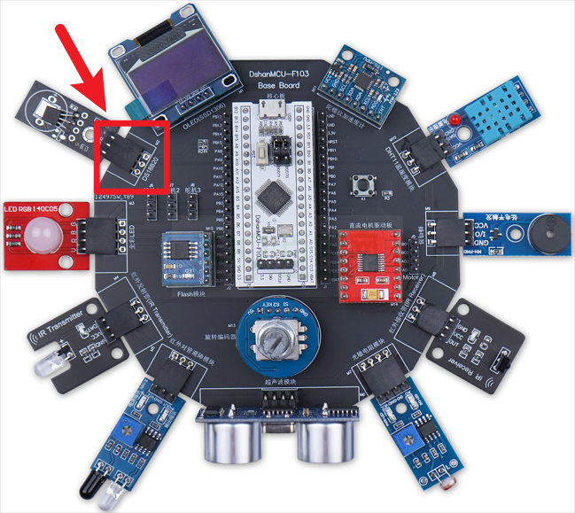

#### 4.9.2 STM32CubeMX配置

DS18B20使用PA1，初始状态为“open drain，pull-up”，如下图：

 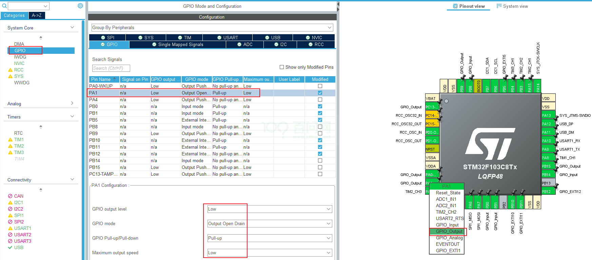

#### 4.9.3 代码调用

这里使用到的驱动以及测试代码位于 “Drivers/DShanMCU-F103/driver_ds18b20.c” 和 “Drivers/DShanMCU-F103/driver_ds18b20.h” 中。其中，**DS18B20_Test** 函数完成了DS18B20温度模块的初始化与测试工作。

**DS18B20_Test** 函数在 “Core/Src/freertos.c” 文件中被 **StartDefaultTask** 函数调用。

打开 “Core/Src/freertos.c” 文件，将 **StartDefaultTask** 函数中的 **DS18B20_Test** 前面的注释去掉，并检查是否有其他函数未被注释(因为每个测试函数中都使用到死循环，所以每次只能运行位于最前面的测试项)，如下所示：

```c
void StartDefaultTask(void *argument)
{
  /* USER CODE BEGIN StartDefaultTask */
  /* Infinite loop */
  LCD_Init();
  LCD_Clear();

  for(;;)
  {
    //Led_Test();
    //LCD_Test();
    //MPU6050_Test();
    DS18B20_Test();
    //DHT11_Test();
    //ActiveBuzzer_Test();
    //PassiveBuzzer_Test();
    //ColorLED_Test();
    //IRReceiver_Test();
    //IRSender_Test();
    //LightSensor_Test();
    //Obstacle_Test();
    //SR04_Test();
    //W25Q64_Test();
    //RotaryEncoder_Test();
    //Motor_Test();
    //Key_Test();
    //UART_Test();
  }
  /* USER CODE END StartDefaultTask */
}
```

#### 4.9.4 上机实验

会看到OLED屏幕上显示DS18B20温度模块实时采集的温度信息。

### 4.10 红外避障模块驱动使用方法

本节介绍红外避障模块驱动的使用方法，最终实现碰撞检测功能。

#### 4.10.1 硬件接线

将红外避障模块接到配套的DShanMCU-F103 Base Board学习底板上即可，具体位置是印有“红外对管避障模块” 丝印的排母接口，如下图所示：

 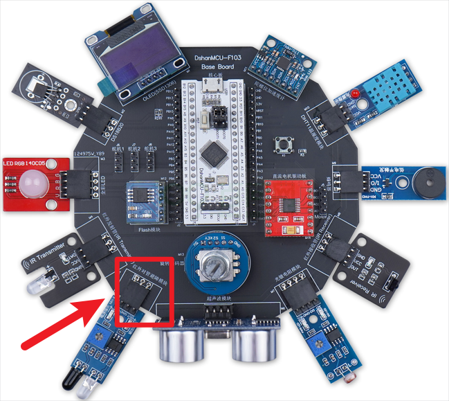

#### 4.10.2 STM32CubeMX配置

红外避障模块使用PB13，把它配置为输入引脚即可，如下图：

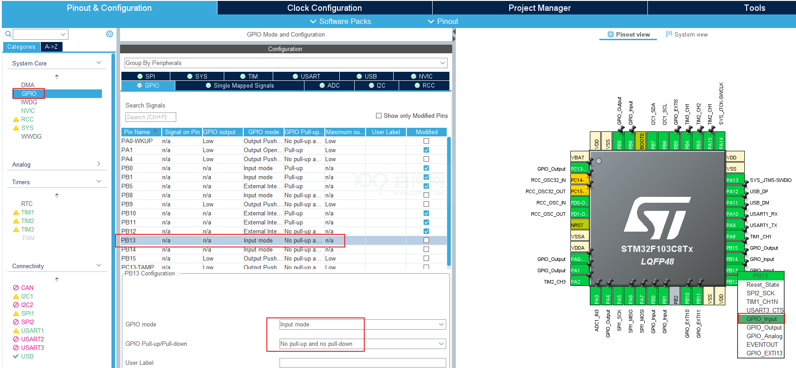

#### 4.10.3 代码调用

这里使用到的驱动以及测试代码位于 “Drivers/DShanMCU-F103/driver_ir_obstacle.c” 和 “Drivers/DShanMCU-F103/driver_ir_obstacle.h” 中。其中，**IRObstacle_Test** 函数完成了红外避障模块的初始化与测试工作。

**IRObstacle_Test** 函数在 “Core/Src/freertos.c” 文件中被**StartDefaultTask** 函数调用。

打开 “Core/Src/freertos.c” 文件，将 **StartDefaultTask** 函数中的 **IRObstacle_Test** 前面的注释去掉，并检查是否有其他函数未被注释(因为每个测试函数中都使用到死循环，所以每次只能运行位于最前面的测试项)，如下所示：

```c
void StartDefaultTask(void *argument)
{
  /* USER CODE BEGIN StartDefaultTask */
  /* Infinite loop */
  LCD_Init();
  LCD_Clear();

  for(;;)
  {
    //Led_Test();
    //LCD_Test();
    //MPU6050_Test();
    //DS18B20_Test();
    //DHT11_Test();
    //ActiveBuzzer_Test();
    //PassiveBuzzer_Test();
    //ColorLED_Test();
    //IRReceiver_Test();
    //IRSender_Test();
    //LightSensor_Test();
    Obstacle_Test();
    //SR04_Test();
    //W25Q64_Test();
    //RotaryEncoder_Test();
    //Motor_Test();
    //Key_Test();
    //UART_Test();
  }
  /* USER CODE END StartDefaultTask */
}
```

会看到OLED屏幕上显示红外避障模块实时检测的状态信息(是否碰撞到障碍物)。

### 4.11 超声波测距模块驱动使用方法

本节介绍超声波测距模块驱动的使用方法，最终实现测距功能。

#### 4.11.1 硬件接线

将超声波测距模块接到配套的DShanMCU-F103 Base Board学习底板上即可，具体位置是印有“超声波模块” 丝印的排母接口，如下图所示：

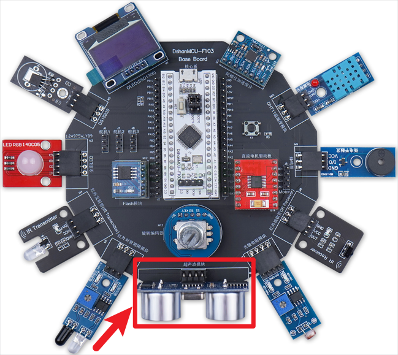

#### 4.11.2 STM32CubeMX配置

超声测距模块SR04使用 PB9 作为 Trig 引脚，使用 PB8 作为 Echo 引脚。把 PB9 设置为输出、把PB8设置为输入即可。如下图所示：

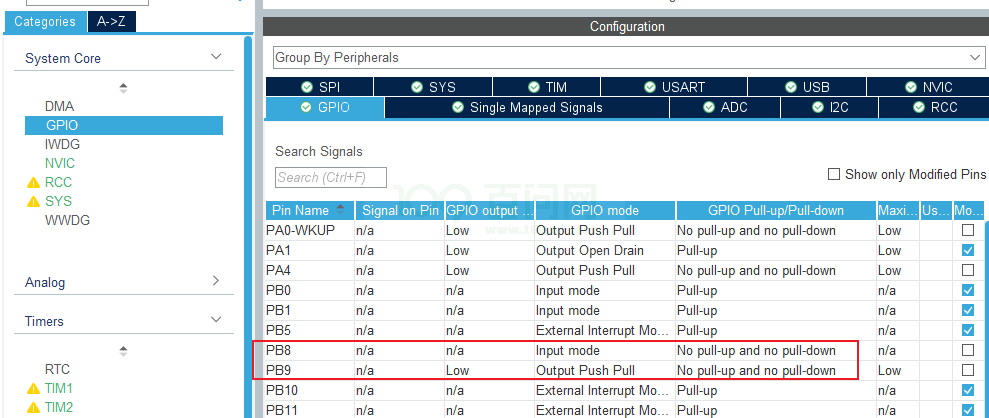

#### 4.11.3 代码调用

这里使用到的驱动以及测试代码位于 “Drivers/DShanMCU-F103/driver_ultrasonic_sr04.c” 和 “Drivers/DShanMCU-F103/driver_ultrasonic_sr04.h” 中。其中，**SR04_Test** 函数完成了超声波测距模块的初始化与测试工作。

**SR04_Test** 函数在 “Core/Src/freertos.c” 文件中被 **StartDefaultTask** 函数调用。

打开 “Core/Src/freertos.c” 文件，将 **StartDefaultTask** 函数中的 **SR04_Test** 前面的注释去掉，并检查是否有其他函数未被注释(因为每个测试函数中都使用到死循环，所以每次只能运行位于最前面的测试项)，如下所示：

```c
void StartDefaultTask(void *argument)
{
  /* USER CODE BEGIN StartDefaultTask */
  /* Infinite loop */
  LCD_Init();
  LCD_Clear();

  for(;;)
  {
    //Led_Test();
    //LCD_Test();
    //MPU6050_Test();
    //DS18B20_Test();
    //DHT11_Test();
    //ActiveBuzzer_Test();
    //PassiveBuzzer_Test();
    //ColorLED_Test();
    //IRReceiver_Test();
    //IRSender_Test();
    //LightSensor_Test();
    //Obstacle_Test();
    SR04_Test();
    //W25Q64_Test();
    //RotaryEncoder_Test();
    //Motor_Test();
    //Key_Test();
    //UART_Test();
  }
  /* USER CODE END StartDefaultTask */
}
```

#### 4.11.4 上机实验

会看到OLED屏幕上显示超声波测距模块实时检测的距离信息(单位cm)。

### 4.12 旋转编码器模块驱动使用方法

本节介绍旋转编码器模块驱动的使用方法，最终实现旋转编码器的操作功能(正反转、按下)。

#### 4.12.1 硬件接线

将旋转编码器模块接到配套的DShanMCU-F103 Base Board学习底板上即可，具体位置是印有“旋转编码器” 丝印的排母接口，如下图所示：

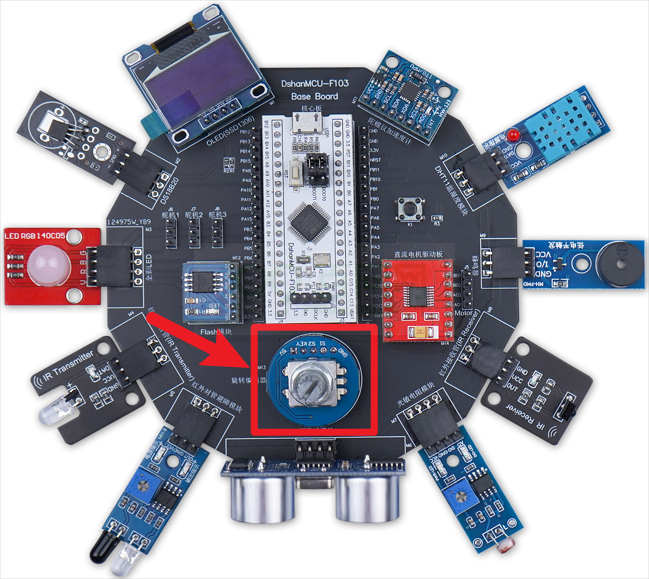

#### 4.12.2 STM32CubeMX配置

旋转编码器使用PB12作为S1引脚（作为中断引脚，上升沿触发），使用PB0作为S2引脚（作为输入引脚），使用PB1作为Key引脚（作为输入引脚）。配置如下：

PB0、PB1：

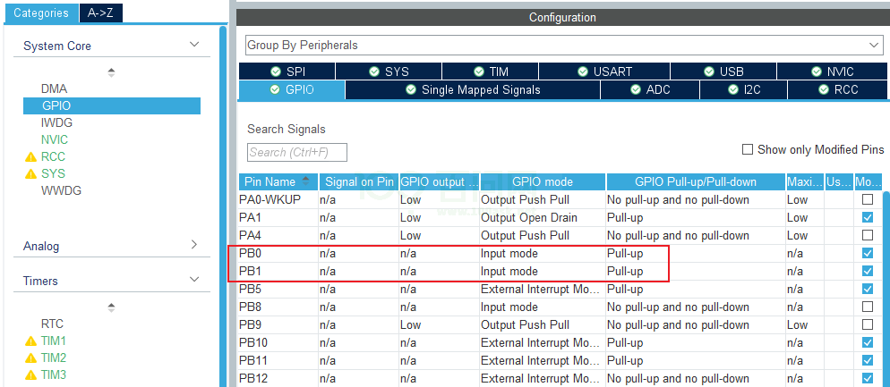

PB12:

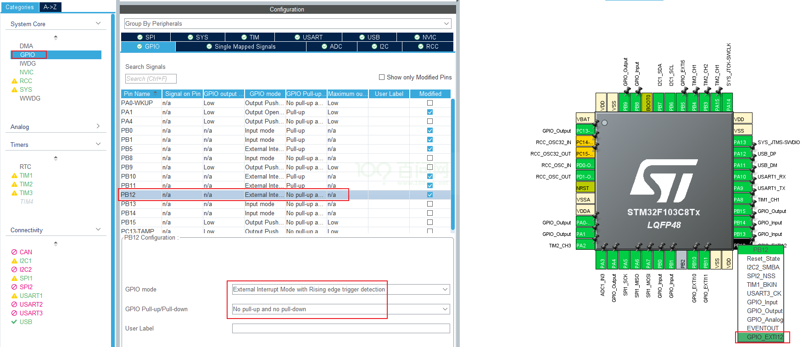

#### 4.12.3 代码调用

这里使用到的驱动以及测试代码位于 “Drivers/DShanMCU-F103/driver_rotary_encoder.c” 和 “Drivers/DShanMCU-F103/driver_rotary_encoder.h” 中。其中，**RotaryEncoder_Test** 函数完成了旋转编码器模块的初始化与测试工作。

**RotaryEncoder_Test** 函数在 “Core/Src/freertos.c” 文件中被 **StartDefaultTask** 函数调用。

打开 “Core/Src/freertos.c” 文件，将 **StartDefaultTask** 函数中的 **RotaryEncoder_Test** 前面的注释去掉，并检查是否有其他函数未被注释(因为每个测试函数中都使用到死循环，所以每次只能运行位于最前面的测试项)，如下所示：

```c
void StartDefaultTask(void *argument)
{
  /* USER CODE BEGIN StartDefaultTask */
  /* Infinite loop */
  LCD_Init();
  LCD_Clear();

  for(;;)
  {
    //Led_Test();
    //LCD_Test();
    //MPU6050_Test();
    //DS18B20_Test();
    //DHT11_Test();
    //ActiveBuzzer_Test();
    //PassiveBuzzer_Test();
    //ColorLED_Test();
    //IRReceiver_Test();
    //IRSender_Test();
    //LightSensor_Test();
    //Obstacle_Test();
    //SR04_Test();
    //W25Q64_Test();
    RotaryEncoder_Test();
    //Motor_Test();
    //Key_Test();
    //UART_Test();
  }
  /* USER CODE END StartDefaultTask */
}
```

#### 4.12.4 上机实验

会看到OLED屏幕上显示旋转编码器模块的状态信息(正反转及计数、按下)。

### 4.13 红外接收模块驱动使用方法

本节介绍红外接收模块驱动的使用方法，最终实现红外接收模块的接收功能。

#### 4.13.1 硬件接线

将红外接收模块接到配套的DShanMCU-F103 Base Board学习底板上即可，具体位置是印有“红外接收管(IR Receiver)” 丝印的排母接口，如下图所示：

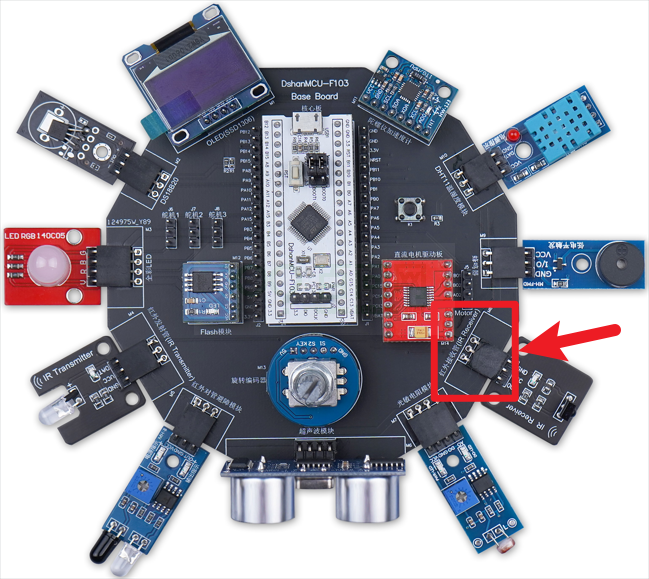

#### 4.13.2 STM32CubeMX配置

红外接收模块使用PB10作为中断引脚，双边沿触发。要使能内部上拉，因为没有外部上拉电阻。配置如下：

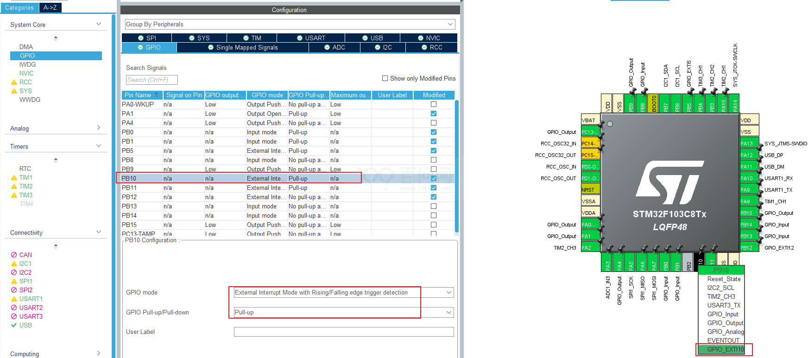

#### 4.13.3 代码调用

这里使用到的驱动以及测试代码位于 “Drivers/DShanMCU-F103/driver_ir_receiver.c” 和 “Drivers/DShanMCU-F103/driver_ir_receiver.h” 中。其中，**IRReceiver_Test** 函数完成了红外接收模块的初始化与测试工作。

**IRReceiver_Test** 函数在 “Core/Src/freertos.c” 文件中被 **StartDefaultTask** 函数调用。

打开 “Core/Src/freertos.c” 文件，将 **StartDefaultTask** 函数中的 **IRReceiver_Test** 前面的注释去掉，并检查是否有其他函数未被注释(因为每个测试函数中都使用到死循环，所以每次只能运行位于最前面的测试项)，如下所示：

```c
void StartDefaultTask(void *argument)
{
  /* USER CODE BEGIN StartDefaultTask */
  /* Infinite loop */
  LCD_Init();
  LCD_Clear();

  for(;;)
  {
    //Led_Test();
    //LCD_Test();
    //MPU6050_Test();
    //DS18B20_Test();
    //DHT11_Test();
    //ActiveBuzzer_Test();
    //PassiveBuzzer_Test();
    //ColorLED_Test();
    IRReceiver_Test();
    //IRSender_Test();
    //LightSensor_Test();
    //Obstacle_Test();
    //SR04_Test();
    //W25Q64_Test();
    //RotaryEncoder_Test();
    //Motor_Test();
    //Key_Test();
    //UART_Test();
  }
  /* USER CODE END StartDefaultTask */
}
```

#### 4.13.4 上机实验

会看到OLED屏幕上显示红外接收模块接收到的信息(发送方的哪个按键被按下)。

### 4.14 红外发射模块驱动使用方法

本节介绍红外发射模块驱动的使用方法，最终实现红外发射模块的发射功能。

#### 4.14.1 硬件接线

将红外发射模块接到配套的DShanMCU-F103 Base Board学习底板上即可，具体位置是印有“红外发射管(IR Transmitter)” 丝印的排母接口，如下图所示：

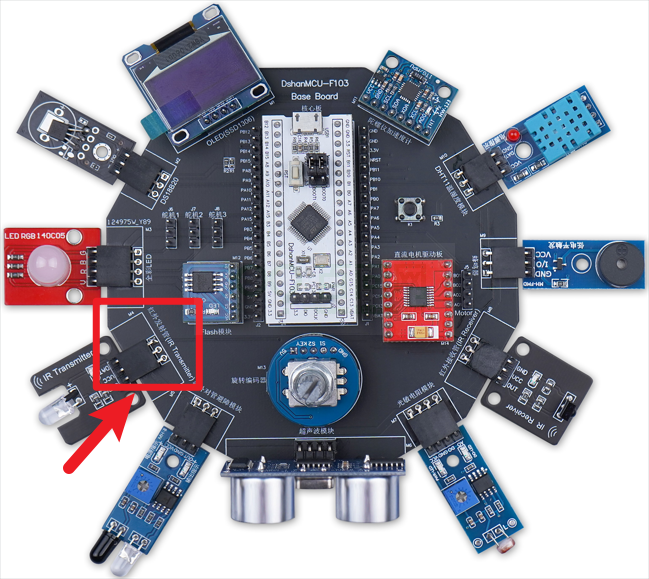

#### 4.14.2 STM32CubeMX配置

红外发射模块、有源蜂鸣器、无源蜂鸣器共用PA8。

有源蜂鸣器驱动driver_active_buzzer.c文件的ActiveBuzzer_Init函数里，已经把PA8配置为推挽输出。

无源蜂鸣器驱动driver_passive_buzzer.c文件的PassiveBuzzer_Init函数里，已经把PA8配置为TIM1_CH1。

红外发射模块驱动driver_ir_sender.c文件的IRSender_Init函数里，已经把PA8配置为TIM1_CH1。

无需使用STM32CubeMX来配置PA8。

#### 4.14.3 代码调用

这里使用到的驱动以及测试代码位于 “Drivers/DShanMCU-F103/driver_ir_sender.c” 和 “Drivers/DShanMCU-F103/driver_ir_sender.h” 中。其中，**IRSender_Test** 函数完成了红外发射模块的初始化与测试工作。

**IRSender_Test** 函数在 “Core/Src/freertos.c” 文件中被**StartDefaultTask** 函数调用。

打开 “Core/Src/freertos.c” 文件，将 **StartDefaultTask** 函数中的 **IRSender_Test** 前面的注释去掉，并检查是否有其他函数未被注释(因为每个测试函数中都使用到死循环，所以每次只能运行位于最前面的测试项)，如下所示：

```c
void StartDefaultTask(void *argument)
{
  /* USER CODE BEGIN StartDefaultTask */
  /* Infinite loop */
  LCD_Init();
  LCD_Clear();

  for(;;)
  {
    //Led_Test();
    //LCD_Test();
    //MPU6050_Test();
    //DS18B20_Test();
    //DHT11_Test();
    //ActiveBuzzer_Test();
    //PassiveBuzzer_Test();
    //ColorLED_Test();
    //IRReceiver_Test();
    IRSender_Test();
    //LightSensor_Test();
    //Obstacle_Test();
    //SR04_Test();
    //W25Q64_Test();
    //RotaryEncoder_Test();
    //Motor_Test();
    //Key_Test();
    //UART_Test();
  }
  /* USER CODE END StartDefaultTask */
}
```

#### 4.14.4 上机实验

会看到OLED屏幕上显示红外发射模块发送的信息(哪个按键信息被发射出去)。

### 4.15 RGB全彩LED模块驱动使用方法

本节介绍RGB全彩LED模块驱动的使用方法，最终实现让RGB全彩LED模块显示不同的颜色。

#### 4.15.1 硬件接线

将RGB全彩LED模块接到配套的DShanMCU-F103 Base Board学习底板上即可，具体位置是印有“全彩LED”丝印的排母接口，如下图所示：

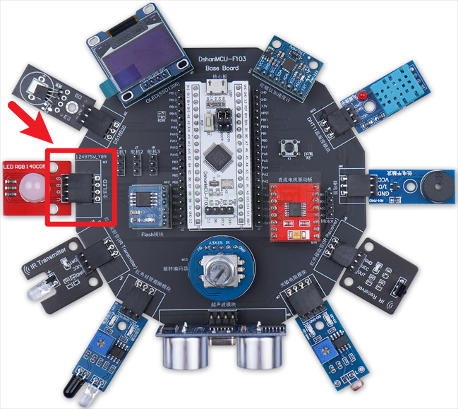

#### 4.15.2 STM32CubeMX配置

全彩LED使用PA15、PB3、PA2作为绿色（G）、蓝色（B）、红色（R）的驱动线，这3个引脚被分别配置为TIM2_CHN1、TIM2_CHN2、TIM2_CHN3。TIMER2的配置如下图所示：

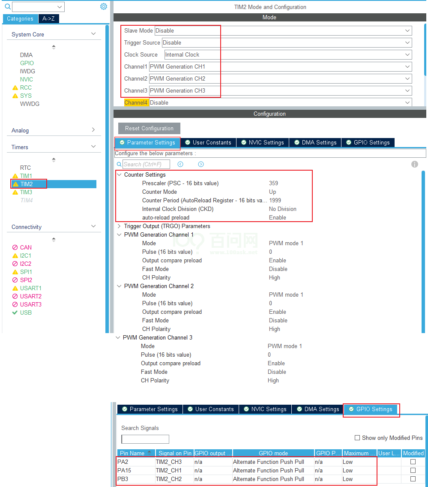

#### 4.15.3 代码调用

这里使用到的驱动以及测试代码位于 “Drivers/DShanMCU-F103/driver_color_led.c” 和 “Drivers/DShanMCU-F103/driver_color_led.h” 中。其中，**ColorLED_Test** 函数完成了RGB全彩LED模块的初始化与测试工作。

**ColorLED_Test** 函数在 “Core/Src/freertos.c” 文件中被 **StartDefaultTask** 函数调用。

打开 “Core/Src/freertos.c” 文件，将 **StartDefaultTask** 函数中的 ***ColorLED_Test** 前面的注释去掉，并检查是否有其他函数未被注释(因为每个测试函数中都使用到死循环，所以每次只能运行位于最前面的测试项)，如下所示：

```c
void StartDefaultTask(void *argument)
{
  /* USER CODE BEGIN StartDefaultTask */
  /* Infinite loop */
  LCD_Init();
  LCD_Clear();

  for(;;)
  {
    //Led_Test();
    //LCD_Test();
    //MPU6050_Test();
    //DS18B20_Test();
    //DHT11_Test();
    //ActiveBuzzer_Test();
    //PassiveBuzzer_Test();
    ColorLED_Test();
    //IRReceiver_Test();
    //IRSender_Test();
    //LightSensor_Test();
    //Obstacle_Test();
    //SR04_Test();
    //W25Q64_Test();
    //RotaryEncoder_Test();
    //Motor_Test();
    //Key_Test();
    //UART_Test();
  }
  /* USER CODE END StartDefaultTask */
}
```

#### 4.15.4 上机实验

会看到RGB全彩LED模块每隔1秒切换为不同的颜色；同时会看到OLED屏幕上显示当前颜色的hex值。

### 4.16 光敏电阻模块驱动使用方法

本节介绍光敏电阻模块驱动的使用方法，最终实现通过光敏电阻模块采集亮度信息。

#### 4.16.1 硬件接线

将有光敏电阻模块接到配套的DShanMCU-F103 Base Board学习底板上即可，具体位置是印有“光敏电阻模块” 丝印的排母接口，如下图所示：

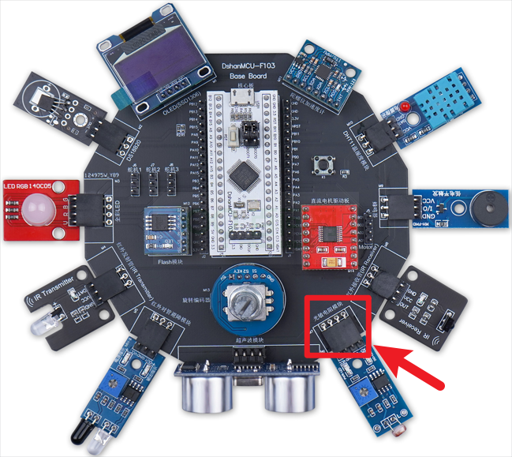

#### 4.16.2 STM32CubeMX配置

光敏电阻模块使用PA3作为ADC引脚，配置如下：

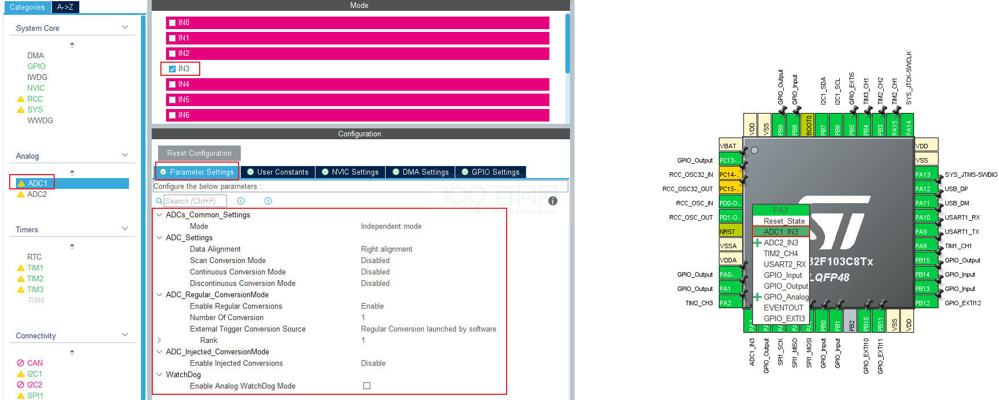

#### 4.16.3 代码调用

这里使用到的驱动以及测试代码位于 “Drivers/DShanMCU-F103/driver_light_sensor.c” 和 “Drivers/DShanMCU-F103/driver_light_sensor.h” 中。其中，**LightSensor_Test** 函数完成了光敏电阻模块的初始化与测试工作。

**LightSensor_Test** 函数在 “Core/Src/freertos.c” 文件中被**StartDefaultTask** 函数调用。

打开 “Core/Src/freertos.c” 文件，将 **StartDefaultTask** 函数中的 **LightSensor_Test** 前面的注释去掉，并检查是否有其他函数未被注释(因为每个测试函数中都使用到死循环，所以每次只能运行位于最前面的测试项)，如下所示：

```c
void StartDefaultTask(void *argument)
{
  /* USER CODE BEGIN StartDefaultTask */
  /* Infinite loop */
  LCD_Init();
  LCD_Clear();

  for(;;)
  {
    //Led_Test();
    //LCD_Test();
    //MPU6050_Test();
    //DS18B20_Test();
    //DHT11_Test();
    //ActiveBuzzer_Test();
    //PassiveBuzzer_Test();
    //ColorLED_Test();
    //IRReceiver_Test();
    //IRSender_Test();
    LightSensor_Test();
    //Obstacle_Test();
    //SR04_Test();
    //W25Q64_Test();
    //RotaryEncoder_Test();
    //Motor_Test();
    //Key_Test();
    //UART_Test();
  }
  /* USER CODE END StartDefaultTask */
}
```

#### 4.16.4 上机实验

会看到OLED屏幕上显示光敏电阻模块实时采集的亮度信息。

### 4.17 SG90舵机驱动使用方法

### 4.18 IIC 陀螺仪加速度计模块驱动使用方法

本节介绍IIC 陀螺仪加速度计模块驱动的使用方法，最终实现通过IIC 陀螺仪加速度计模块采集X/Y/Z轴的加速度与角速度信息。

#### 4.18.1 硬件接线

将有IIC 陀螺仪加速度计模块接到配套的DShanMCU-F103 Base Board学习底板上即可，具体位置是印有“陀螺仪加速度计” 丝印的排母接口，如下图所示：

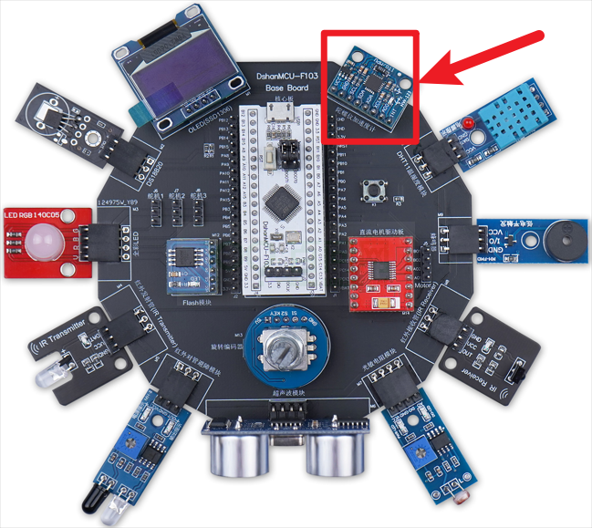

#### 4.18.2 STM32CubeMX配置

陀螺仪使用I2C1通道，I2C1使用PB6、PB7作为SCL、SDA引脚，配置如下：

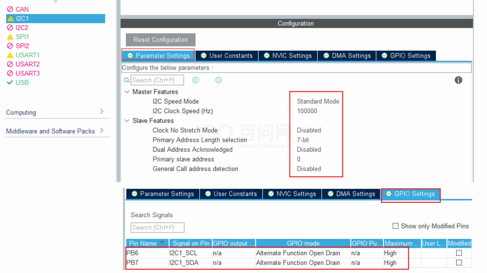

#### 4.18.3 代码调用

这里使用到的驱动以及测试代码位于 “Drivers/DShanMCU-F103/driver_mpu6050.c” 和 “Drivers/DShanMCU-F103/driver_mpu6050.h” 中。其中，**MPU6050_Test** 函数完成了IIC 陀螺仪加速度计模块的初始化与测试工作。

**MPU6050_Test** 函数在 “Core/Src/freertos.c” 文件中被**StartDefaultTask** 函数调用。

打开 “Core/Src/freertos.c” 文件，将 **StartDefaultTask** 函数中的 **MPU6050_Test** 前面的注释去掉，并检查是否有其他函数未被注释(因为每个测试函数中都使用到死循环，所以每次只能运行位于最前面的测试项)，如下所示：

```c
void StartDefaultTask(void *argument)
{
  /* USER CODE BEGIN StartDefaultTask */
  /* Infinite loop */
  LCD_Init();
  LCD_Clear();

  for(;;)
  {
    //Led_Test();
    //LCD_Test();
    MPU6050_Test();
    //DS18B20_Test();
    //DHT11_Test();
    //ActiveBuzzer_Test();
    //PassiveBuzzer_Test();
    //ColorLED_Test();
    //IRReceiver_Test();
    //IRSender_Test();
    //LightSensor_Test();
    //Obstacle_Test();
    //SR04_Test();
    //W25Q64_Test();
    //RotaryEncoder_Test();
    //Motor_Test();
    //Key_Test();
    //UART_Test();
  }
  /* USER CODE END StartDefaultTask */
}
```

#### 4.18.4 上机实验

会看到OLED屏幕上显示IIC 陀螺仪加速度计模块实时采集的X/Y/Z轴的加速度与角速度信息。

### 4.19 SPI FLASH模块驱动使用方法

本节介绍SPI FLASH模块驱动的使用方法，最终实现通过SPI FLASH模块采集亮度信息。

#### 4.19.1 硬件接线

将有SPI FLASH模块接到配套的DShanMCU-F103 Base Board学习底板上即可，具体位置是印有“FLASH模块” 丝印的排母接口，如下图所示：

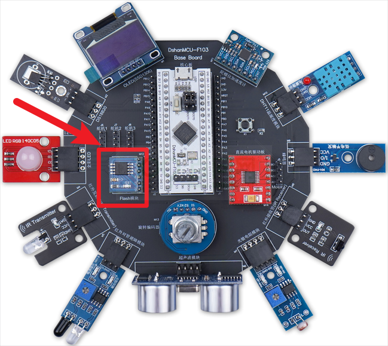

#### 4.19.2 STM32CubeMX配置

SPI Flash模块使用SPI1通道，PA7作为SPI1_MOSI、PA5作为SPI1_SCK、PA6作为SPI1_MISO。另外使用PB9作为片选引脚。

SPI1配置如下图所示：

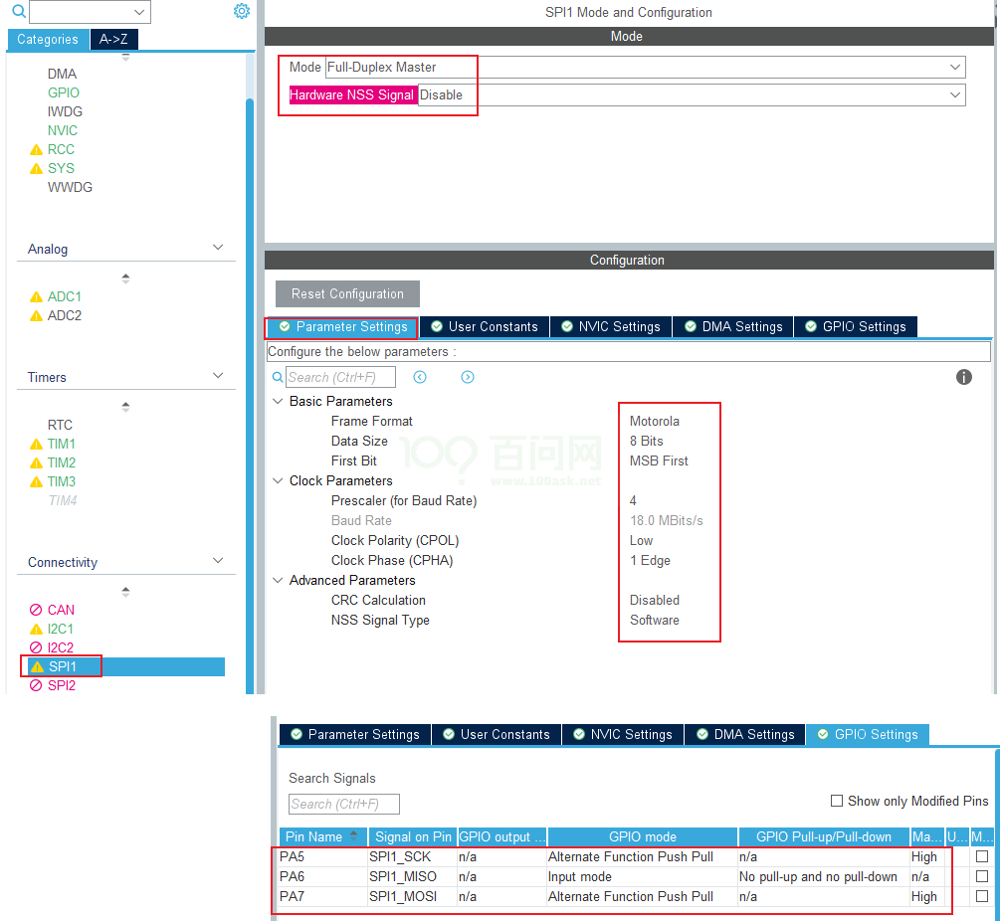

PB9配置如下图所示：

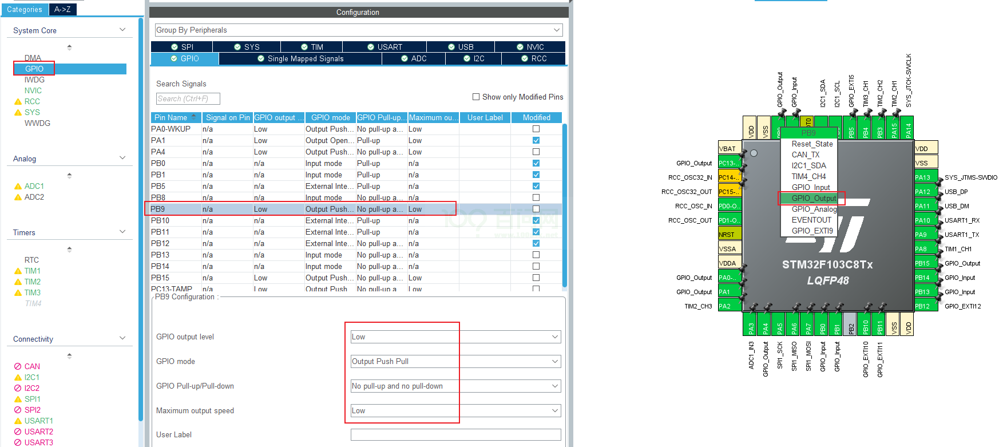

#### 4.19.3 代码调用

这里使用到的驱动以及测试代码位于 “Drivers/DShanMCU-F103/driver_spiflash_w25q64.c” 和 “Drivers/DShanMCU-F103/driver_spiflash_w25q64.h” 中。其中，**W25Q64_Test** 函数完成了SPI FLASH模块的初始化与测试工作。

**W25Q64_Test** 函数在 “Core/Src/freertos.c” 文件中被**StartDefaultTask** 函数调用。

打开 “Core/Src/freertos.c” 文件，将 **StartDefaultTask** 函数中的 **W25Q64_Test** 前面的注释去掉，并检查是否有其他函数未被注释(因为每个测试函数中都使用到死循环，所以每次只能运行位于最前面的测试项)，如下所示：

```c
void StartDefaultTask(void *argument)
{
  /* USER CODE BEGIN StartDefaultTask */
  /* Infinite loop */
  LCD_Init();
  LCD_Clear();

  for(;;)
  {
    //Led_Test();
    //LCD_Test();
    //MPU6050_Test();
    //DS18B20_Test();
    //DHT11_Test();
    //ActiveBuzzer_Test();
    //PassiveBuzzer_Test();
    //ColorLED_Test();
    //IRReceiver_Test();
    //IRSender_Test();
    //LightSensor_Test();
    //Obstacle_Test();
    //SR04_Test();
    W25Q64_Test();
    //RotaryEncoder_Test();
    //Motor_Test();
    //Key_Test();
    //UART_Test();
  }
  /* USER CODE END StartDefaultTask */
}
```

#### 4.19.4 上机实验

会看到OLED屏幕上显示SPI FLASH模块的工作状态信息。

### 4.20 直流电机驱动使用方法

本节介绍直流电机驱动的使用方法，最终实现通过直流电机驱动模块驱动直流电机。

#### 4.20.1 硬件接线

将有直流电机驱动模块接到配套的DShanMCU-F103 Base Board学习底板上即可，具体位置是印有“直流电机驱动模块板” 丝印的排母接口，如下图所示：

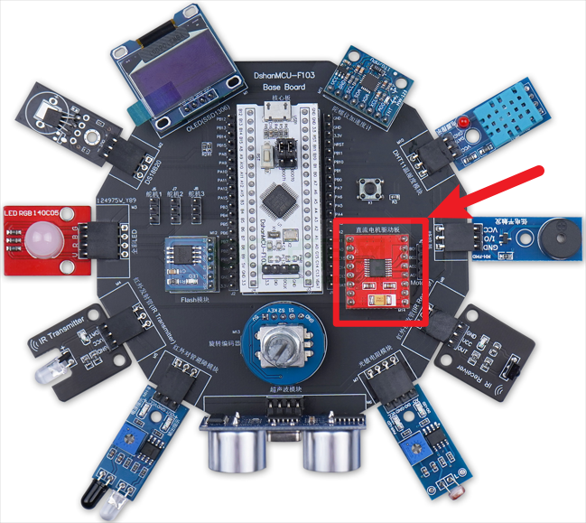

#### 4.20.2 STM32CubeMX配置

直流电机驱动模块的通道A使用PA4、PA0来控制，这2个引脚没有PWM功能，所以只需要配置为输出即可。

通道B使用PB4、PB15来控制，PB4可以配置为PWM引脚（TM3_CHN1），PB15仍然配置为输出引脚。

这3个输出引脚配置如下：

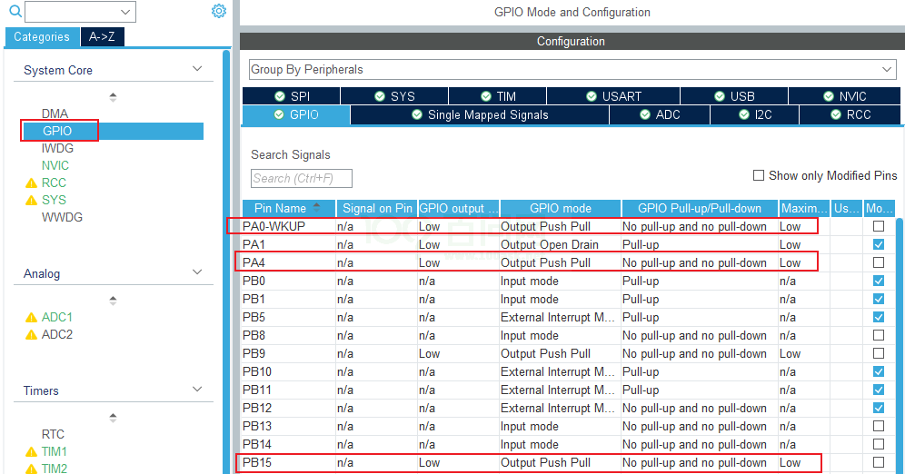

PB4配置为PWM引脚（TM3_CHN1），如下图所示：

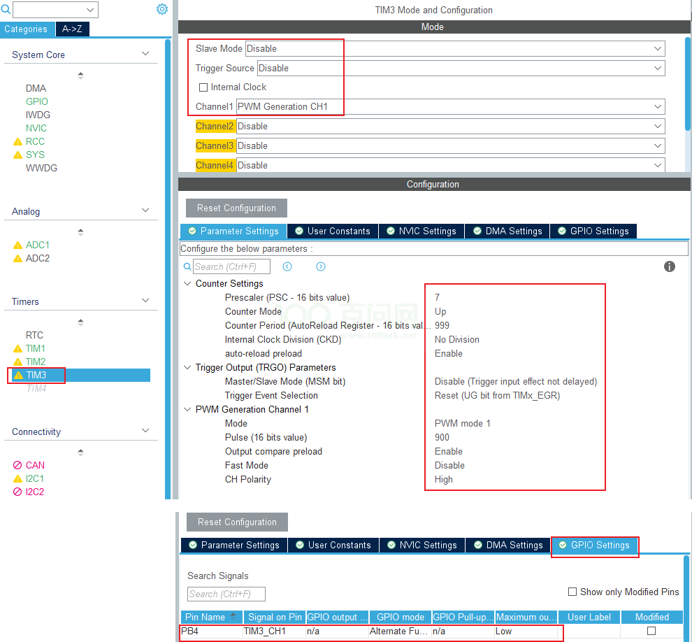

#### 4.20.3 代码调用

这里使用到的驱动以及测试代码位于 “Drivers/DShanMCU-F103/driver_motor.c” 和 “Drivers/DShanMCU-F103/driver_motor.h” 中。其中，**Motor_Test** 函数完成了直流电机驱动模块的初始化与测试工作。

**Motor_Test** 函数在 “Core/Src/freertos.c” 文件中被**StartDefaultTask** 函数调用。

打开 “Core/Src/freertos.c” 文件，将**StartDefaultTask** 函数中的 **Moto_Test** 前面的注释去掉，并检查是否有其他函数未被注释(因为每个测试函数中都使用到死循环，所以每次只能运行位于最前面的测试项)，如下所示：

```c
void StartDefaultTask(void *argument)
{
  /* USER CODE BEGIN StartDefaultTask */
  /* Infinite loop */
  LCD_Init();
  LCD_Clear();

  for(;;)
  {
    //Led_Test();
    //LCD_Test();
    //MPU6050_Test();
    //DS18B20_Test();
    //DHT11_Test();
    //ActiveBuzzer_Test();
    //PassiveBuzzer_Test();
    //ColorLED_Test();
    //IRReceiver_Test();
    //IRSender_Test();
    //LightSensor_Test();
    //Obstacle_Test();
    //SR04_Test();
    //W25Q64_Test();
    //RotaryEncoder_Test();
    Motor_Test();
    //Key_Test();
    //UART_Test();
  }
  /* USER CODE END StartDefaultTask */
}
```

#### 4.20.4 上机实验

会看到OLED屏幕上显示直流电机的工作状态信息。

### 4.21 步进电机驱动使用方法

---

## 第5章 创建FreeRTOS工程

### 5.1 创建STM32CubeMX工程

双击运行STM32CubeMX，在首页面选择“Access to MCU Selector”，如下图所示：

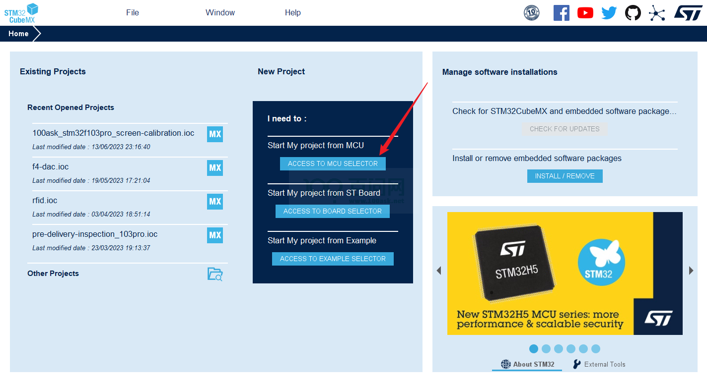

然后来到MCU选型界面，在序列号那里输入想要开发的芯片，例如STM32F103C8T6：

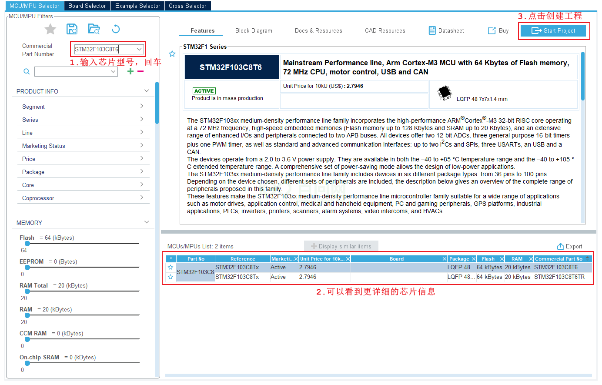

### 5.2 配置时钟

先配置处理器的时钟，在“System Core”的“RCC”处选择外部高速时钟源和低速时钟源。DshanMCU-F103使用了外部高速时钟源，如下图所示：

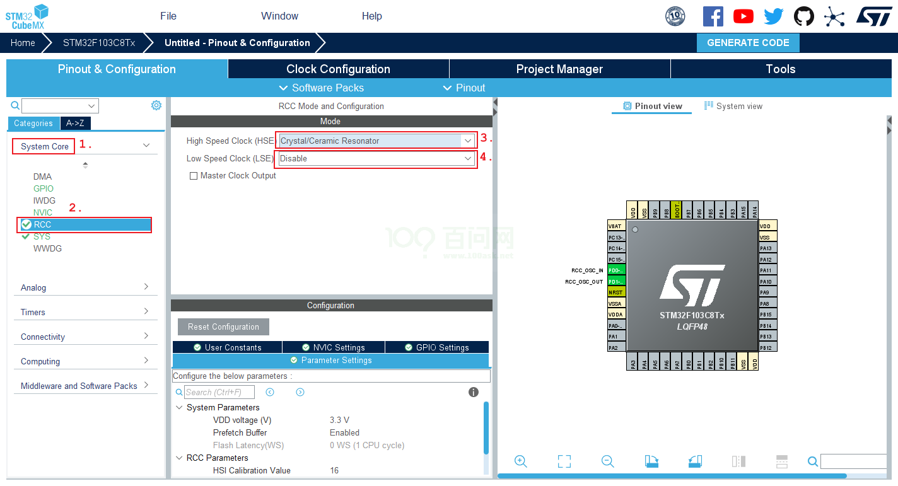

另外，本实验使用了FreeRTOS，FreeRTOS的时基使用的是Systick，而STM32CubeMX中默认的HAL库时基也是Systick，为了避免可能的冲突，最好将HAL库的时基换做其它的硬件定时器：

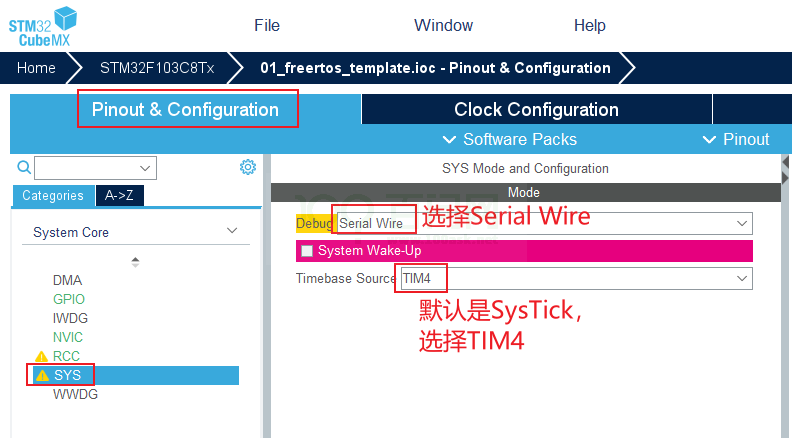


最后去时钟配置界面配置系统时钟频率。直接在HCLK时钟那里输入MCU允许的最高时钟频率。F103的最高频率是72Mhz，所以直接在那里输入72然后按回车：

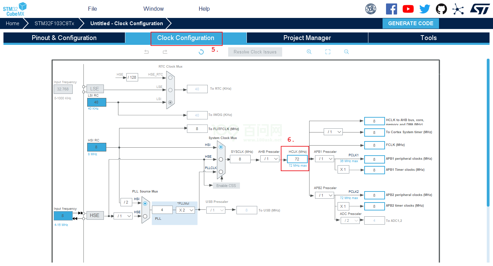

回车后，STM32CubeMX会自动计算得到各个分频系数和倍频系数：

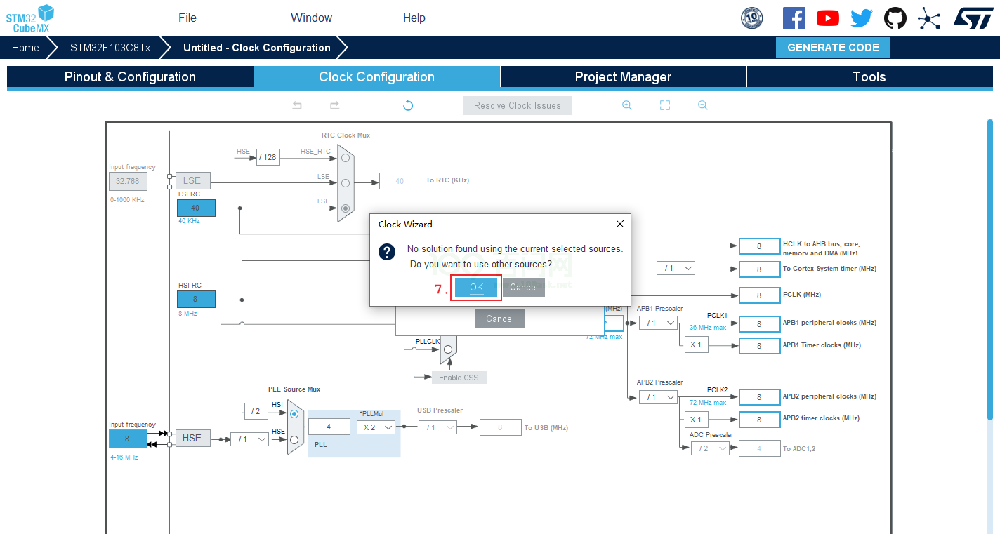

在上图中点击“OK”，就开始自动配置时钟，配置成功后，结果如下图所示：

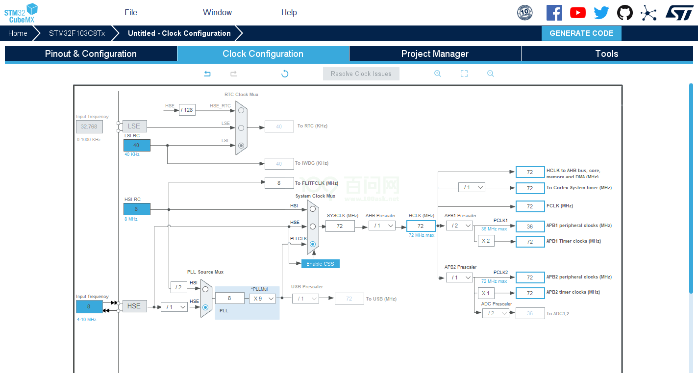

### 5.3 配置GPIO

板载LED的使用的GPIO是PC13，如下图所示：

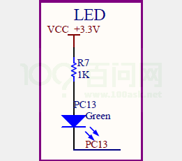

所以在STM32CubeMX的引脚配置界面，找到PC13：

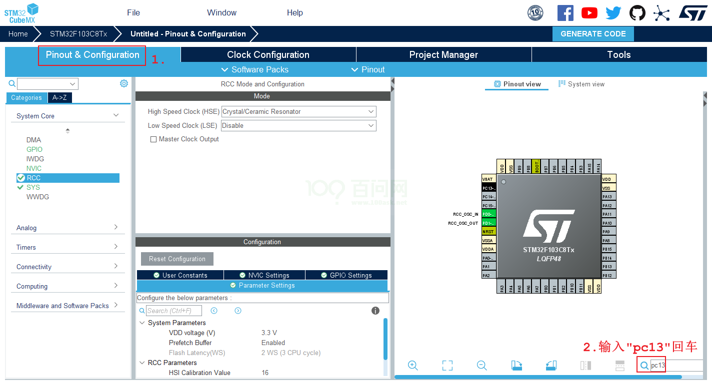

在芯片图中，使用鼠标左键点击PC13，会弹出此IO支持的模式：

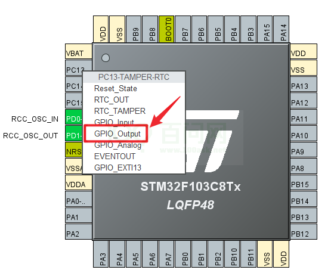

这里选择GPIO Output，让PC13配置为通用输出IO，以便用来驱动LED的亮灭。

### 5.4 配置FreeRTOS

STM32CubeMX已经将FreeRTOS集成到工具中，并且将RTOS的接口进行了封装CMSIS-RTOS V1/V2，相较之于V1版本的CMSIS-RTOS API，V2版本的API的兼容性更高，为了将来的开发和移
植，建议开发者使用V2版本的API：

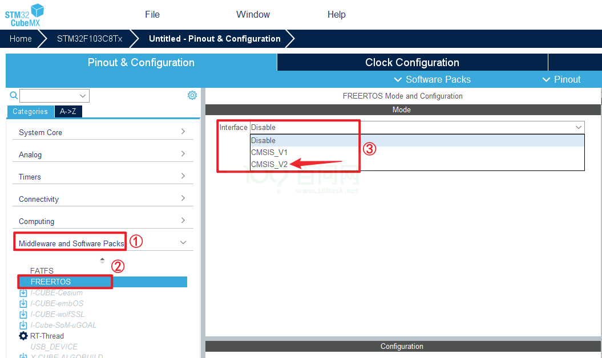

选择CMSIS V2接口后，还要进一步配置FreeRTOS的参数和功能。

#### 5.4.1 配置参数

FreeRTOS的参数包括时基频率、任务堆栈大小、是否使能互斥锁等等，需要开发者根据自己对FreeRTOS的了解以及项目开发的需求，来定制参数。
先如下图进行配置：

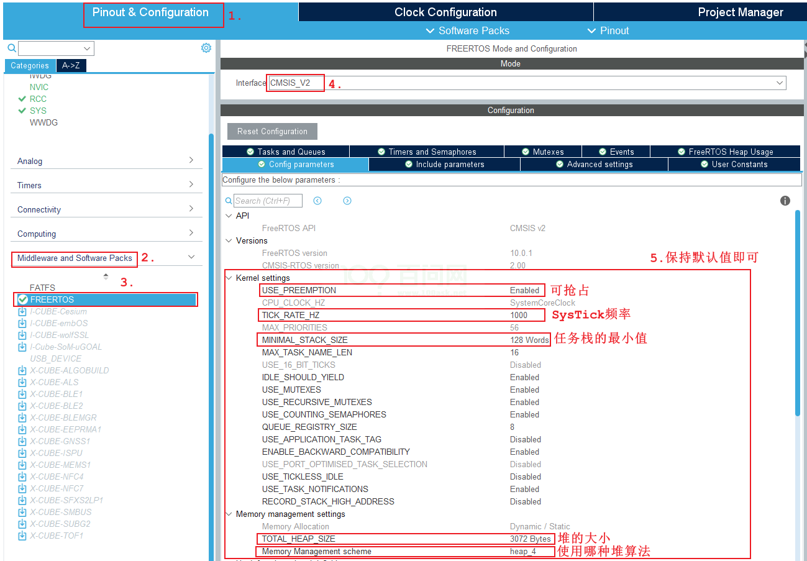

#### 5.4.2 添加任务

使用STM32CubeMX，可以手工添加任务、队列、信号量、互斥锁、定时器等等。但是本课程不想严重依赖STM32CubeMX，所以不会使用STM32CubeMX来添加这些对象，而是手写代码来使用这些对象。

使用STM32CubeMX时，有一个默认任务，此任务无法删除，只能修改其名称和函数类型，如下图所示：

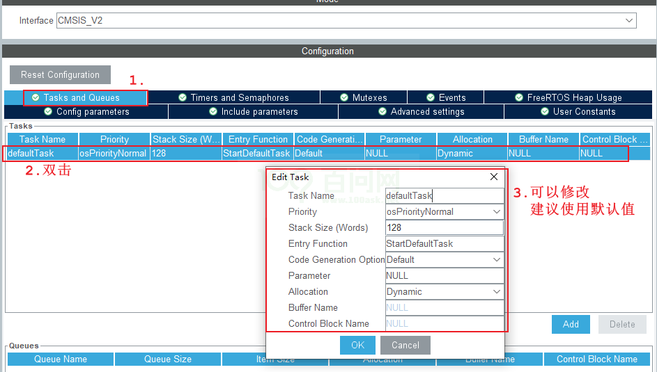

### 5.5 生成Keil MDK的工程

当对外设配置完成后，就去“Project Manager”中设置工程的名称、存储路径和开发IDE：

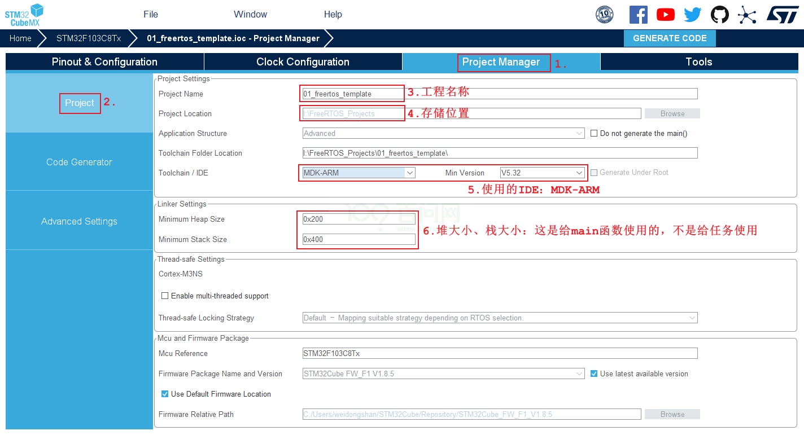

随后去同界面的“Code Generator”设置、生成工程：

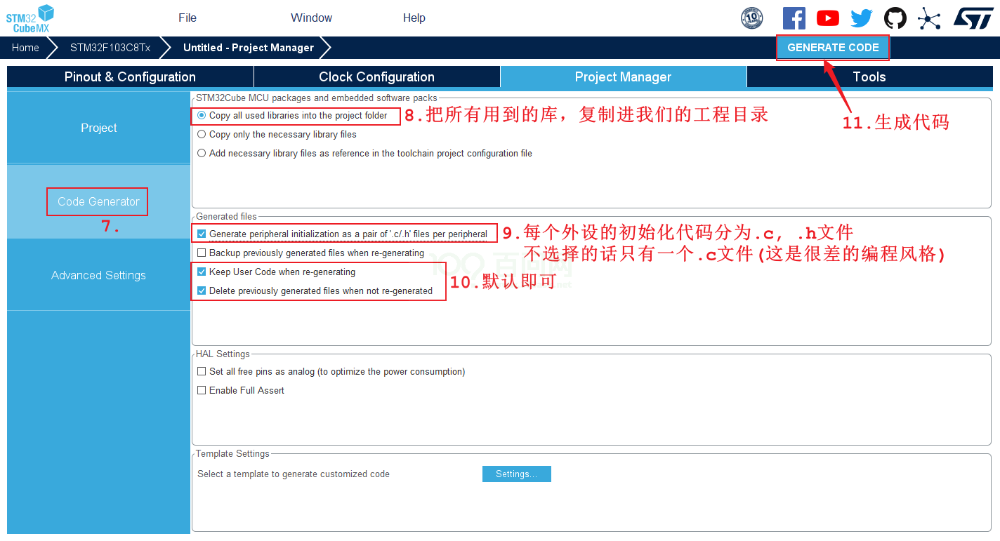

可能会有如下提示，选择“Yes”下载所依赖的文件即可：

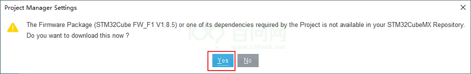


一切正常的话，可以看到如下提示：

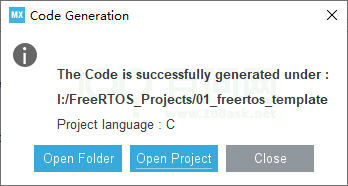

点击“Open Folder”可以打开工程目录，看到如下文件：

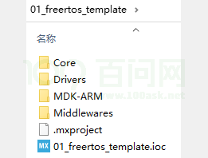

### 5.6 添加用户代码

STM32CubeMX只是帮我们初始化了所配置的硬件模块，你要实现什么功能，需要自己添加代码。

#### 5.6.1 打开工程

在工程的“MDK-ARM”目录下，双击如下文件，就会使用Keil打开工程：

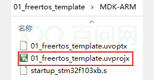

#### 5.6.2 修改文件

双击打开freertos.c文件，找到StartDefaultTask函数里的循环。我们编写的代码，需要位于“USER CODE BEGIN xxx”和“USER CODE END xxx”之间，否则以后再次使用STM32CubeMX配置工程时，不在这些位置的用户代码会被删除。

如下图加入代码：

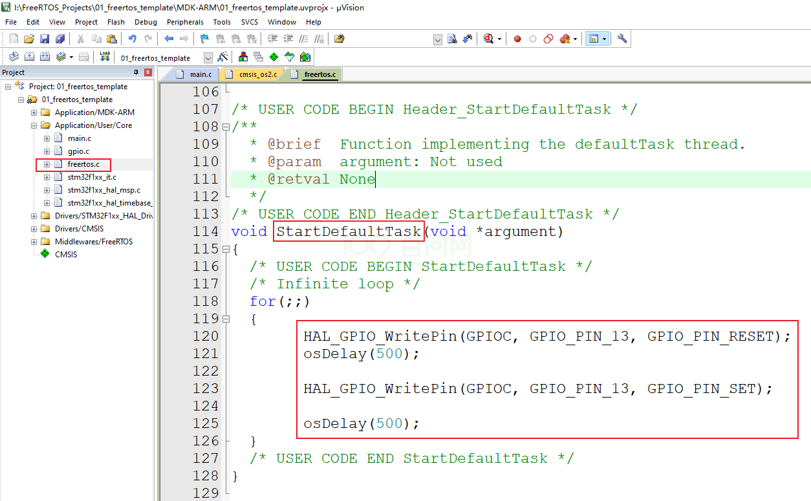

然后就可以参考《第3章 开发板使用》编译、烧写、运行了。

---

## 第6章 FreeRTOS源码概述

### 6.1 FreeRTOS目录结构

使用STM32CubeMX创建的FreeRTOS工程中，FreeRTOS相关的源码如下:

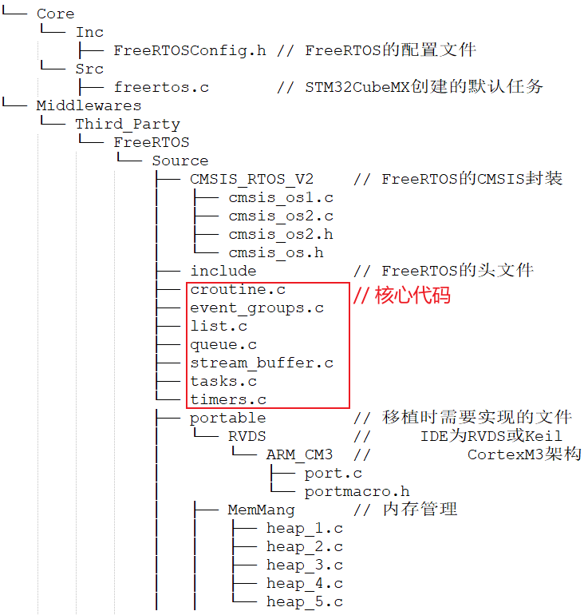

主要涉及2个目录：
- Core
	- Inc目录下的FreeRTOSConfig.h是配置文件
	- Src目录下的freertos.c是STM32CubeMX创建的默认任务
- Middlewares\Third_Party\FreeRTOS\Source
	- 根目录下是核心文件，这些文件是通用的
	- portable目录下是移植时需要实现的文件
		- 目录名为：[compiler]/[architecture]
		- 比如：RVDS/ARM_CM3，这表示cortexM3架构在RVDS工具上的移植文件

### 6.2 核心文件
FreeRTOS的最核心文件只有2个：
- FreeRTOS/Source/tasks.c

- FreeRTOS/Source/list.c

  其他文件的作用也一起列表如下：

  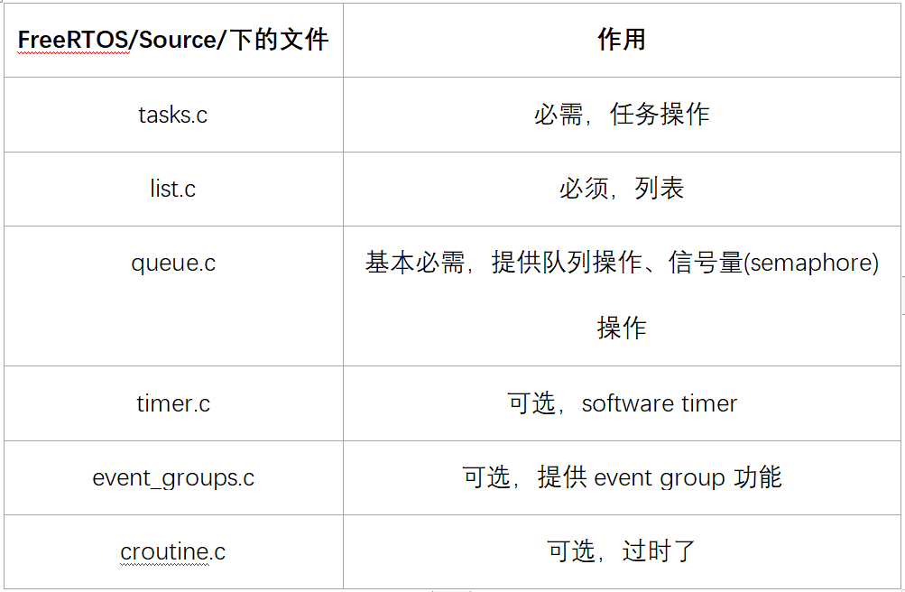

### 6.3 移植时涉及的文件

移植FreeRTOS时涉及的文件放在 **FreeRTOS/Source/portable/[compiler]/[architecture]** 目录下，比如：RVDS/ARM_CM3，这表示cortexM3架构在RVDS或Keil工具上的移植文件。
里面有2个文件：

- port.c
- portmacro.h


### 6.4 头文件相关

#### 6.4.1 头文件目录

FreeRTOS需要3个头文件目录：

- FreeRTOS本身的头文件：

`Middlewares\Third_Party\FreeRTOS\Source\include`

- 移植时用到的头文件：

`Middlewares\Third_Party\FreeRTOS\Source\portable\[compiler]\[architecture]`

- 含有配置文件FreeRTOSConfig.h的目录：`Core\Inc`

#### 6.4.2 头文件

列表如下：

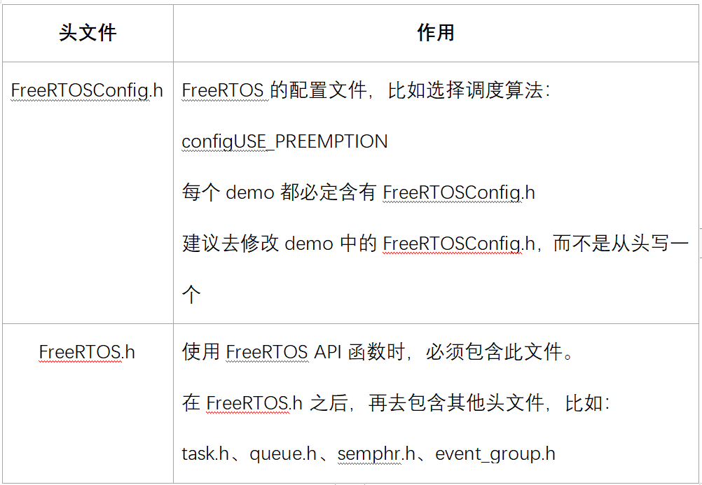


### 6.5 内存管理

文件在Middlewares\Third_Party\FreeRTOS\Source\portable\MemMang下，它也是放在“portable”目录下，表示你可以提供自己的函数。

源码中默认提供了5个文件，对应内存管理的5种方法。

后续章节会详细讲解。

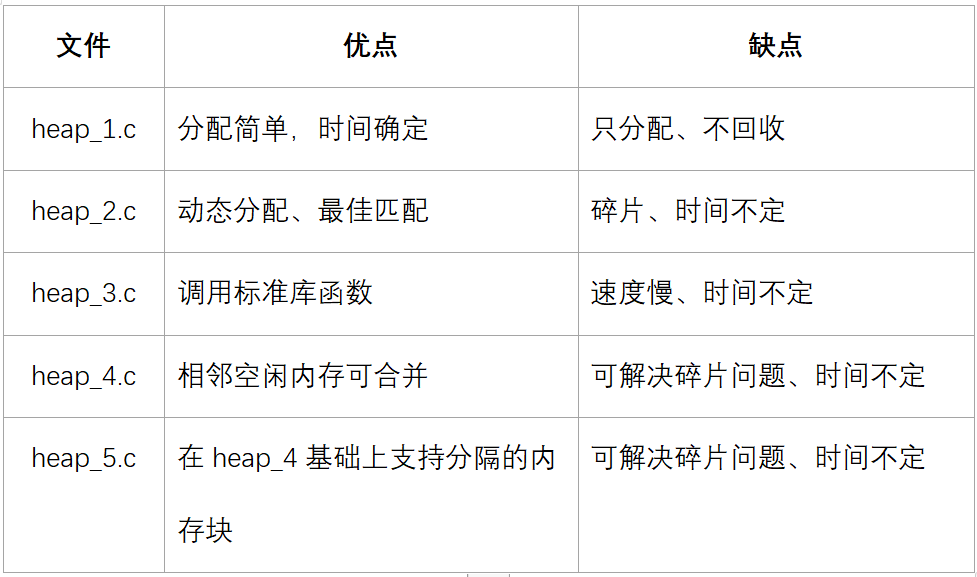

### 6.6 入口函数

在Core\Src\main.c的main函数里，初始化了FreeRTOS环境、创建了任务，然后启动调度器。源码如下：

```c
/* Init scheduler */
  osKernelInitialize();  /* 初始化FreeRTOS运行环境 */
  MX_FREERTOS_Init();    /* 创建任务 */

  /* Start scheduler */
  osKernelStart();       /* 启动调度器 */
```

### 6.7 数据类型和编程规范

#### 6.7.1 数据类型

每个移植的版本都含有自己的portmacro.h头文件，里面定义了2个数据类型：
- TickType_t：
  - FreeRTOS配置了一个周期性的时钟中断：Tick Interrupt
  - 每发生一次中断，中断次数累加，这被称为tick count
  - tick count这个变量的类型就是TickType_t
  - TickType_t可以是16位的，也可以是32位的
  - FreeRTOSConfig.h中定义configUSE_16_BIT_TICKS时，TickType_t就是uint16_t
  - 否则TickType_t就是uint32_t
  - 对于32位架构，建议把TickType_t配置为uint32_t
- BaseType_t：
  - 这是该架构最高效的数据类型
  - 32位架构中，它就是uint32_t
  - 16位架构中，它就是uint16_t
  - 8位架构中，它就是uint8_t
  - BaseType_t通常用作简单的返回值的类型，还有逻辑值，比如pdTRUE/pdFALSE

#### 6.7.2 变量名

变量名有前缀：

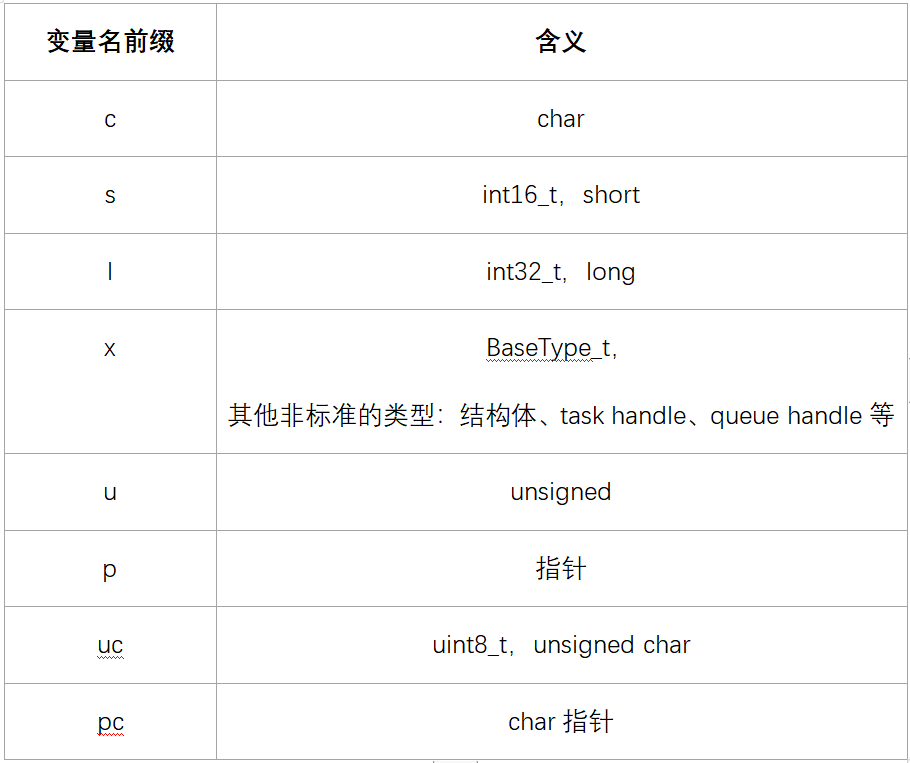

#### 6.7.3 函数名

函数名的前缀有2部分：返回值类型、在哪个文件定义。

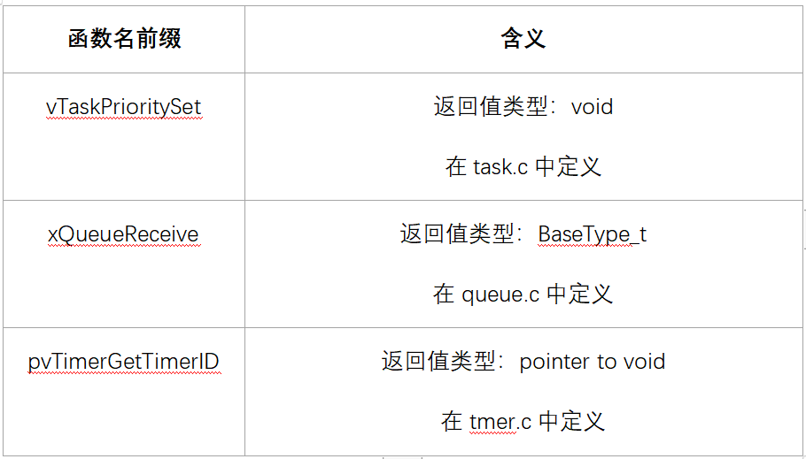

#### 6.7.4 宏的名

宏的名字是大小，可以添加小写的前缀。前缀是用来表示：宏在哪个文件中定义。

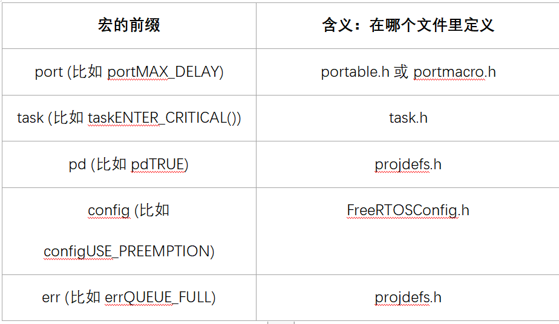

通用的宏定义如下：

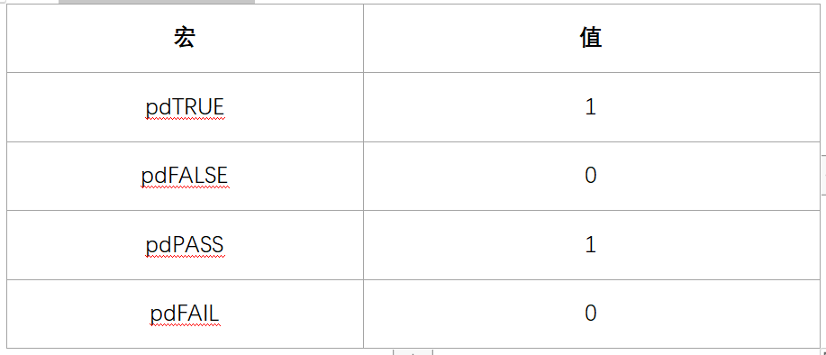

---

## 第7章 内存管理

### 7.1 为什么要自己实现内存管理

后续的章节涉及这些内核对象：task、queue、semaphores和event group等。为了让FreeRTOS更容易使用，这些内核对象一般都是动态分配：用到时分配，不使用时释放。使用内存的动态管理功能，简化了程序设计：不再需要小心翼翼地提前规划各类对象，简化API函数的涉及，甚至可以减少内存的使用。

内存的动态管理是C程序的知识范畴，并不属于FreeRTOS的知识范畴，但是它跟FreeRTOS关系是如此紧密，所以我们先讲解它。

在C语言的库函数中，有mallc、free等函数，但是在FreeRTOS中，它们不适用：

- 不适合用在资源紧缺的嵌入式系统中
- 这些函数的实现过于复杂、占据的代码空间太大
- 并非线程安全的(thread- safe)
- 运行有不确定性：每次调用这些函数时花费的时间可能都不相同
- 内存碎片化
- 使用不同的编译器时，需要进行复杂的配置
- 有时候难以调试

注意：我们经常"堆栈"混合着说，其实它们不是同一个东西：
- 堆，heap，就是一块空闲的内存，需要提供管理函数
  - malloc：从堆里划出一块空间给程序使用
  - free：用完后，再把它标记为"空闲"的，可以再次使用
- 栈，stack，函数调用时局部变量保存在栈中，当前程序的环境也是保存在栈中
  - 可以从堆中分配一块空间用作栈

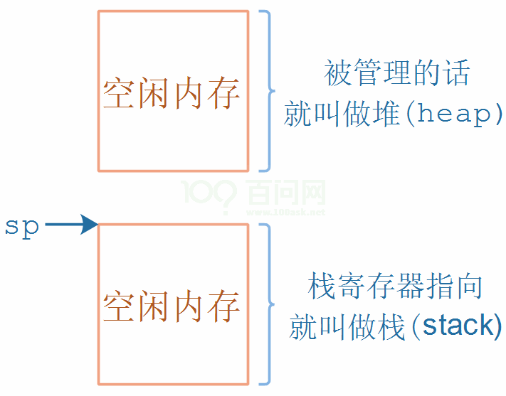

### 7.2 FreeRTOS的5中内存管理方法

FreeRTOS中内存管理的接口函数为：pvPortMalloc 、vPortFree，对应于C库的malloc、free。
文件在FreeRTOS/Source/portable/MemMang下，它也是放在portable目录下，表示你可以提供自己的函数。

源码中默认提供了5个文件，对应内存管理的5种方法。

参考文章：[FreeRTOS说明书吐血整理【适合新手+入门】](https://blog.csdn.net/qq_43212092/article/details/104845158)

| **文件** | **优点**                       | **缺点**                 |
| -------- | ------------------------------ | ------------------------ |
| heap_1.c | 分配简单，时间确定             | 只分配、不回收           |
| heap_2.c | 动态分配、最佳匹配             | 碎片、时间不定           |
| heap_3.c | 调用标准库函数                 | 速度慢、时间不定         |
| heap_4.c | 相邻空闲内存可合并             | 可解决碎片问题、时间不定 |
| heap_5.c | 在heap_4基础上支持分隔的内存块 | 可解决碎片问题、时间不定 |

#### 7.2.1 Heap_1

它只实现了pvPortMalloc，没有实现vPortFree。

如果你的程序不需要删除内核对象，那么可以使用heap_1：

- 实现最简单
- 没有碎片问题
- 一些要求非常严格的系统里，不允许使用动态内存，就可以使用heap_1

它的实现原理很简单，首先定义一个大数组：

```c
/* Allocate the memory for the heap. */
##if ( configAPPLICATION_ALLOCATED_HEAP == 1 )

/* The application writer has already defined the array used for the RTOS
* heap -  probably so it can be placed in a special segment or address. */
    extern uint8_t ucHeap[ configTOTAL_HEAP_SIZE ];
##else
    static uint8_t ucHeap[ configTOTAL_HEAP_SIZE ];
##endif /* configAPPLICATION_ALLOCATED_HEAP */
```

然后，对于pvPortMalloc调用时，从这个数组中分配空间。

FreeRTOS在创建任务时，需要2个内核对象：task control block(TCB)、stack。
使用heap_1时，内存分配过程如下图所示：

- A：创建任务之前整个数组都是空闲的
- B：创建第1个任务之后，蓝色区域被分配出去了
- C：创建3个任务之后的数组使用情况

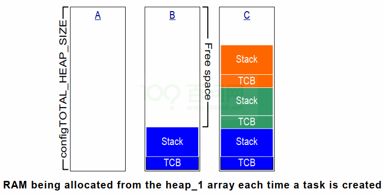

#### 7.2.2 Heap_2

Heap_2之所以还保留，只是为了兼容以前的代码。新设计中不再推荐使用Heap_2。建议使用Heap_4来替代Heap_2，更加高效。

Heap_2也是在数组上分配内存，跟Heap_1不一样的地方在于：

- Heap_2使用最佳匹配算法(best fit)来分配内存
- 它支持vPortFree

最佳匹配算法：

- 假设heap有3块空闲内存：5字节、25字节、100字节
- pvPortMalloc想申请20字节
- 找出最小的、能满足pvPortMalloc的内存：25字节
- 把它划分为20字节、5字节
  - 返回这20字节的地址
  - 剩下的5字节仍然是空闲状态，留给后续的pvPortMalloc使用

与Heap_4相比，Heap_2不会合并相邻的空闲内存，所以Heap_2会导致严重的"碎片化"问题。

但是，如果申请、分配内存时大小总是相同的，这类场景下Heap_2没有碎片化的问题。所以它适合这种场景：频繁地创建、删除任务，但是任务的栈大小都是相同的(创建任务时，需要分配TCB和栈，TCB总是一样的)。

虽然不再推荐使用heap_2，但是它的效率还是远高于malloc、free。

使用heap_2时，内存分配过程如下图所示：

-  A：创建了3个任务
-  B：删除了一个任务，空闲内存有3部分：顶层的、被删除任务的TCB空间、被删除任务的Stack空间
-  C：创建了一个新任务，因为TCB、栈大小跟前面被删除任务的TCB、栈大小一致，所以刚好分配到原来的内存

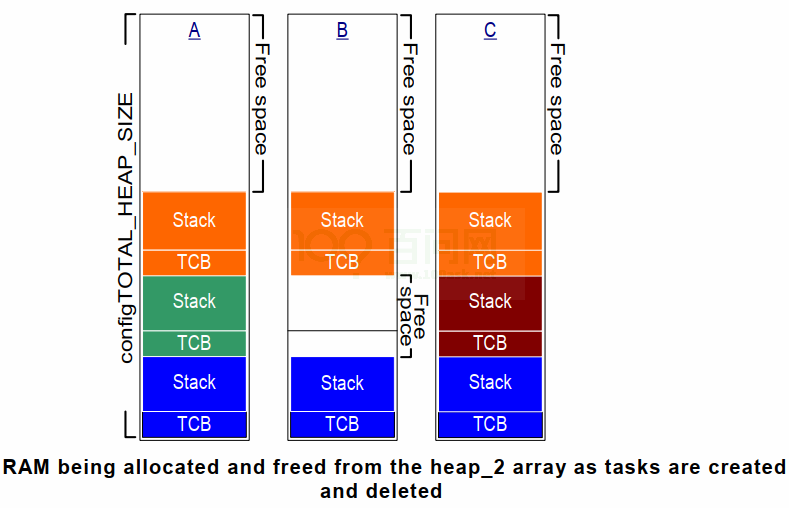

#### 7.2.3 Heap_3

Heap_3使用标准C库里的malloc、free函数，所以堆大小由链接器的配置决定，配置项configTOTAL_HEAP_SIZE不再起作用。

C库里的malloc、free函数并非线程安全的，Heap_3中先暂停FreeRTOS的调度器，再去调用这些函数，使用这种方法实现了线程安全。

#### 7.2.4 Heap_4

跟Heap_1、Heap_2一样，Heap_4也是使用大数组来分配内存。

Heap_4使用 **首次适应算法(first fit)来分配内存** 。它还会把相邻的空闲内存合并为一个更大的空闲内存，这有助于较少内存的碎片问题。

首次适应算法：

- 假设堆中有3块空闲内存：5字节、200字节、100字节
- pvPortMalloc想申请20字节
- 找出第1个能满足pvPortMalloc的内存：200字节
- 把它划分为20字节、180字节
- 返回这20字节的地址
- 剩下的180字节仍然是空闲状态，留给后续的pvPortMalloc使用

Heap_4会把相邻空闲内存合并为一个大的空闲内存，可以较少内存的碎片化问题。适用于这种场景：频繁地分配、释放不同大小的内存。

Heap_4的使用过程举例如下：

- A：创建了3个任务
- B：删除了一个任务，空闲内存有2部分：
- 顶层的
- 被删除任务的TCB空间、被删除任务的Stack空间合并起来的
- C：分配了一个Queue，从第1个空闲块中分配空间
- D：分配了一个User数据，从Queue之后的空闲块中分配
- E：释放的Queue，User前后都有一块空闲内存
- F：释放了User数据，User前后的内存、User本身占据的内存，合并为一个大的空闲内存

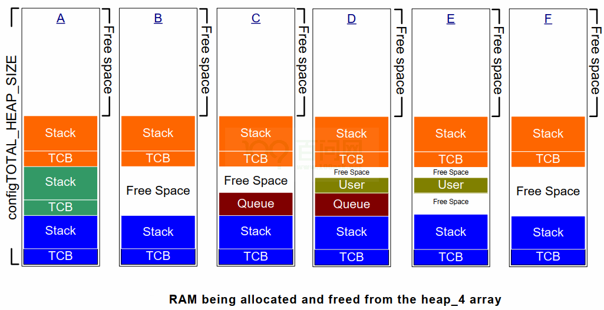

Heap_4执行的时间是不确定的，但是它的效率高于标准库的malloc、free。

#### 7.2.5  Heap_5

Heap_5分配内存、释放内存的算法跟Heap_4是一样的。

相比于Heap_4，Heap_5并不局限于管理一个大数组：它可以管理多块、分隔开的内存。

在嵌入式系统中，内存的地址可能并不连续，这种场景下可以使用Heap_5。

既然内存是分隔开的，那么就需要进行初始化：确定这些内存块在哪、多大：

- 在使用pvPortMalloc之前，必须先指定内存块的信息
- 使用vPortDefineHeapRegions来指定这些信息

怎么指定一块内存？使用如下结构体：

```c
typedef struct HeapRegion
{
    uint8_t * pucStartAddress; // 起始地址
    size_t xSizeInBytes;       // 大小
} HeapRegion_t;
```

怎么指定多块内存？使用一个HeapRegion_t数组，在这个数组中，低地址在前、高地址在后。
比如：

```c
HeapRegion_t xHeapRegions[] =
{
  { ( uint8_t * ) 0x80000000UL, 0x10000 }, // 起始地址0x80000000，大小0x10000
  { ( uint8_t * ) 0x90000000UL, 0xa0000 }, // 起始地址0x90000000，大小0xa0000
  { NULL, 0 } // 表示数组结束
 };
```

vPortDefineHeapRegions函数原型如下：

```c
void vPortDefineHeapRegions( const HeapRegion_t * const pxHeapRegions );
```


把xHeapRegions数组传给vPortDefineHeapRegions函数，即可初始化Heap_5。

### 7.3 Heap相关的函数

#### 7.3.1 pvPortMalloc/vPortFree

函数原型：

```c
void * pvPortMalloc( size_t xWantedSize );
void vPortFree( void * pv );
```

作用：分配内存、释放内存。

如果分配内存不成功，则返回值为NULL。

#### 7.3.2 xPortGetFreeHeapSize

函数原型：

```c
size_t xPortGetFreeHeapSize( void );
```

当前还有多少空闲内存，这函数可以用来优化内存的使用情况。比如当所有内核对象都分配好后，执行此函数返回2000，那么configTOTAL_HEAP_SIZE就可减小2000。

注意：在heap_3中无法使用。

#### 7.3.3 xPortGetMinimumEverFreeHeapSize

函数原型：

```c
size_t xPortGetMinimumEverFreeHeapSize( void );
```

返回：程序运行过程中，空闲内存容量的最小值。

注意：只有heap_4、heap_5支持此函数。

#### 7.3.4 malloc失败的钩子函数

在pvPortMalloc函数内部：

```c
void * pvPortMalloc( size_t xWantedSize )vPortDefineHeapRegions
{
    ......
    #if ( configUSE_MALLOC_FAILED_HOOK == 1 )
        {
            if( pvReturn == NULL )
            {
                extern void vApplicationMallocFailedHook( void );
                vApplicationMallocFailedHook();
            }
        }
    #endif

    return pvReturn;
}
```


所以，如果想使用这个钩子函数：

- 在FreeRTOSConfig.h中，把configUSE_MALLOC_FAILED_HOOK定义为1
- 提供vApplicationMallocFailedHook函数
- pvPortMalloc失败时，才会调用此函数

---

## 第8章 任务管理

在本章中，会涉及如下内容：

- FreeRTOS如何给每个任务分配CPU时间
- 如何选择某个任务来运行
- 任务优先级如何起作用
- 任务有哪些状态
- 如何实现任务
- 如何使用任务参数
- 怎么修改任务优先级
- 怎么删除任务
- 怎么实现周期性的任务
- 如何使用空闲任务

### 8.1 基本概念

对于整个单片机程序，我们称之为application，应用程序。

使用FreeRTOS时，我们可以在application中创建多个任务(task)，有些文档把任务也称为线程(thread)。


以日常生活为例，比如这个母亲要同时做两件事：
- 喂饭：这是一个任务
- 回信息：这是另一个任务
这可以引入很多概念：
- 任务状态(State)：
  - 当前正在喂饭，它是running状态；另一个"回信息"的任务就是"not running"状态
  - "not running"状态还可以细分：
    - ready：就绪，随时可以运行
    - blocked：阻塞，卡住了，母亲在等待同事回信息
    - suspended：挂起，同事废话太多，不管他了
- 优先级(Priority)
  - 我工作生活兼顾：喂饭、回信息优先级一样，轮流做
  - 我忙里偷闲：还有空闲任务，休息一下
  - 厨房着火了，什么都别说了，先灭火：优先级更高
- 栈(Stack)
  - 喂小孩时，我要记得上一口喂了米饭，这口要喂青菜了
  - 回信息时，我要记得刚才聊的是啥
  - 做不同的任务，这些细节不一样
  - 对于人来说，当然是记在脑子里
  - 对于程序，是记在栈里
  - 每个任务有自己的栈
- 事件驱动
  - 孩子吃饭太慢：先休息一会，等他咽下去了、等他提醒我了，再喂下一口
- 协助式调度(Co-operative Scheduling)
  - 你在给同事回信息
    - 同事说：好了，你先去给小孩喂一口饭吧，你才能离开
    - 同事不放你走，即使孩子哭了你也不能走
  - 你好不容易可以给孩子喂饭了
    - 孩子说：好了，妈妈你去处理一下工作吧，你才能离开
    - 孩子不放你走，即使同事连发信息你也不能走
    这涉及很多概念，后续章节详细分析。

### 8.2 任务创建与删除

#### 8.2.1 什么是任务

在FreeRTOS中，任务就是一个函数，原型如下：

```c
void ATaskFunction( void *pvParameters );
```

要注意的是：

- 这个函数不能返回
- 同一个函数，可以用来创建多个任务；换句话说，多个任务可以运行同一个函数
- 函数内部，尽量使用局部变量：
  - 每个任务都有自己的栈
  - 每个任务运行这个函数时
    - 任务A的局部变量放在任务A的栈里、任务B的局部变量放在任务B的栈里
    - 不同任务的局部变量，有自己的副本
  - 函数使用全局变量、静态变量的话
    - 只有一个副本：多个任务使用的是同一个副本
    - 要防止冲突(后续会讲)
    下面是一个示例：

```c
void ATaskFunction( void *pvParameters )
{
	/* 对于不同的任务，局部变量放在任务的栈里，有各自的副本 */
	int32_t lVariableExample = 0;

    /* 任务函数通常实现为一个无限循环 */
	for( ;; )
	{
		/* 任务的代码 */
	}

    /* 如果程序从循环中退出，一定要使用vTaskDelete删除自己
     * NULL表示删除的是自己
     */
	vTaskDelete( NULL );

    /* 程序不会执行到这里, 如果执行到这里就出错了 */
}
```

#### 8.2.2 创建任务

创建任务时使用的函数如下：

```c
BaseType_t xTaskCreate( TaskFunction_t pxTaskCode, // 函数指针, 任务函数
                        const char * const pcName, // 任务的名字
                        const configSTACK_DEPTH_TYPE usStackDepth, // 栈大小,单位为word,10表示40字节
                        void * const pvParameters, // 调用任务函数时传入的参数
                        UBaseType_t uxPriority,    // 优先级
                        TaskHandle_t * const pxCreatedTask ); // 任务句柄, 以后使用它来操作这个任务
```

参数说明：

| **参数**          | **描述**                                                         |
| ------------- | ------------------------------------------------------------ |
| pvTaskCode    | 函数指针，任务对应的 C 函数。任务应该永远不退出，或者在退出时调用 "vTaskDelete(NULL)"。 |
| pcName        | 任务的名称，仅用于调试目的，FreeRTOS 内部不使用。pcName 的长度为 configMAX_TASK_NAME_LEN。 |
| usStackDepth  | 每个任务都有自己的栈，usStackDepth 指定了栈的大小，单位为 word。例如，如果传入 100，表示栈的大小为 100 word，即 400 字节。最大值为 uint16_t 的最大值。确定栈的大小并不容易，通常是根据估计来设定。精确的办法是查看反汇编代码。 |
| pvParameters  | 调用 pvTaskCode 函数指针时使用的参数：pvTaskCode(pvParameters)。 |
| uxPriority    | 任务的优先级范围为 0~(configMAX_PRIORITIES – 1)。数值越小，优先级越低。如果传入的值过大，xTaskCreate 会将其调整为 (configMAX_PRIORITIES – 1)。 |
| pxCreatedTask | 用于保存 xTaskCreate 的输出结果，即任务的句柄（task handle）。如果以后需要对该任务进行操作，如修改优先级，则需要使用此句柄。如果不需要使用该句柄，可以传入 NULL。 |
| 返回值        | 成功时返回 pdPASS，失败时返回 errCOULD_NOT_ALLOCATE_REQUIRED_MEMORY（失败原因是内存不足）。请注意，文档中提到的失败返回值是 pdFAIL 是不正确的。pdFAIL 的值为 0，而 errCOULD_NOT_ALLOCATE_REQUIRED_MEMORY 的值为 -1。 |

使用静态分配内存的函数如下：

```c
TaskHandle_t xTaskCreateStatic (
    TaskFunction_t pxTaskCode,   // 函数指针, 任务函数
    const char * const pcName,   // 任务的名字
    const uint32_t ulStackDepth, // 栈大小,单位为word,10表示40字节
    void * const pvParameters,   // 调用任务函数时传入的参数
    UBaseType_t uxPriority,      // 优先级
    StackType_t * const puxStackBuffer, // 静态分配的栈，就是一个buffer
    StaticTask_t * const pxTaskBuffer // 静态分配的任务结构体的指针，用它来操作这个任务
);
```

相比于使用动态分配内存创建任务的函数，最后2个参数不一样：

| **参数** | **描述**                                               |
| -------------- | ------------------------------------------------------------ |
| pvTaskCode     | 函数指针，可以简单地认为任务就是一个C函数。 它稍微特殊一点：永远不退出，或者退出时要调用"vTaskDelete(NULL)" |
| pcName         | 任务的名字，FreeRTOS内部不使用它，仅仅起调试作用。 长度为：configMAX_TASK_NAME_LEN |
| usStackDepth   | 每个任务都有自己的栈，这里指定栈大小。 单位是word，比如传入100，表示栈大小为100 word，也就是400字节。 最大值为uint16_t的最大值。 怎么确定栈的大小，并不容易，很多时候是估计。 精确的办法是看反汇编码。 |
| pvParameters   | 调用pvTaskCode函数指针时用到：pvTaskCode(pvParameters)       |
| uxPriority     | 优先级范围：0~(configMAX_PRIORITIES – 1) 数值越小优先级越低， 如果传入过大的值，xTaskCreate会把它调整为(configMAX_PRIORITIES – 1) |
| puxStackBuffer | 静态分配的栈内存，比如可以传入一个数组， 它的大小是usStackDepth*4。 |
| pxTaskBuffer   | 静态分配的StaticTask_t结构体的指针                           |
| 返回值         | 成功：返回任务句柄； 失败：NULL                              |

#### 8.2.3 示例1: 创建任务

代码为： **05_create_task**

使用动态、静态分配内存的方式，分别创建多个任务：监测遥控器并在LCD上显示、LED闪烁、全彩LED渐变颜色、使用无源蜂鸣器播放音乐。

#### 8.2.4 示例2: 使用任务参数

代码为：06_create_task_use_params

我们说过，多个任务可以使用同一个函数，怎么体现它们的差别？

- 栈不同
- 创建任务时可以传入不同的参数

我们创建2个任务，使用同一个函数，但是在LCD上打印不一样的信息。

```c
struct  DisplayInfo {
    int x;
    int y;
    const char *str;
};
void vTaskFunction( void *pvParameters )
{
	struct  DisplayInfo *info = pvParameters;
	uint32_t cnt = 0;
uint32_t len;

	/* 任务函数的主体一般都是无限循环 */
	for( ;; )
	{
		/* 打印任务的信息 */
		len = LCD_PrintString(info->x, info->y, info->str);
		LCD_PrintSignedVal(len+1, info->y, cnt++);

		mdelay(500);
	}
}
```

上述代码中的info来自参数pvParameters，pvParameters来自哪里？创建任务时传入的。

代码如下：

- 使用xTaskCreate创建任务时，第4个参数就是pvParameters
- 不同的任务，pvParameters不一样

```c
/* 使用同一个函数创建不同的任务 */
  xTaskCreate(LcdPrintTask, "task1", 128, &g_Task1Info, osPriorityNormal, NULL);
  xTaskCreate(LcdPrintTask, "task2", 128, &g_Task2Info, osPriorityNormal, NULL);
  xTaskCreate(LcdPrintTask, "task3", 128, &g_Task3Info, osPriorityNormal, NULL);
```

#### 8.2.5 任务的删除

删除任务时使用的函数如下：

```c
void vTaskDelete( TaskHandle_t xTaskToDelete );
```

参数说明：

| **参数** | **描述**                                               |
| -------------- | ------------------------------------------------------------ |
| pvTaskCode     | 任务句柄，使用xTaskCreate创建任务时可以得到一个句柄。 也可传入NULL，这表示删除自己。 |

怎么删除任务？举个不好的例子：

- 自杀：vTaskDelete(NULL)
- 被杀：别的任务执行vTaskDelete(pvTaskCode)，pvTaskCode是自己的句柄
- 杀人：执行vTaskDelete(pvTaskCode)，pvTaskCode是别的任务的句柄

#### 8.2.6 示例3: 删除任务

代码为： **07_delete_task**

功能为：当监测到遥控器的Power按键被按下后，删除音乐播放任务。

代码如下：

```c
while (1)
    {
        /* 读取红外遥控器 */
		if (0 == IRReceiver_Read(&dev, &data))
		{
			if (data == 0xa8) /* play */
			{
				/* 创建播放音乐的任务 */
			  extern void PlayMusic(void *params);
			  if (xSoundTaskHandle == NULL)
			  {
					LCD_ClearLine(0, 0);
					LCD_PrintString(0, 0, "Create Task");
					ret = xTaskCreate(PlayMusic, "SoundTask", 128, NULL, osPriorityNormal, &xSoundTaskHandle);
			  }
			}

			else if (data == 0xa2) /* power */
			{
				/* 删除播放音乐的任务 */
				if (xSoundTaskHandle != NULL)
				{
					LCD_ClearLine(0, 0);
					LCD_PrintString(0, 0, "Delete Task");
					vTaskDelete(xSoundTaskHandle);
					PassiveBuzzer_Control(0); /* 停止蜂鸣器 */
					xSoundTaskHandle = NULL;
				}
			}
		}
    }
```


任务运行图：

### 8.3 任务优先级和Tick

#### 8.3.1 任务优先级

怎么让播放的音乐更动听？提高优先级。

优先级的取值范围是：0~(configMAX_PRIORITIES – 1)，数值越大优先级越高。

FreeRTOS的调度器可以使用2种方法来快速找出优先级最高的、可以运行的任务。使用不同的方法时，configMAX_PRIORITIES 的取值有所不同。

- 通用方法

使用C函数实现，对所有的架构都是同样的代码。对configMAX_PRIORITIES的取值没有限制。但是configMAX_PRIORITIES的取值还是尽量小，因为取值越大越浪费内存，也浪费时间。

configUSE_PORT_OPTIMISED_TASK_SELECTION被定义为0、或者未定义时，使用此方法。

- 架构相关的优化的方法

架构相关的汇编指令，可以从一个32位的数里快速地找出为1的最高位。使用这些指令，可以快速找出优先级最高的、可以运行的任务。使用这种方法时，configMAX_PRIORITIES的取值不能超过32。

configUSE_PORT_OPTIMISED_TASK_SELECTION被定义为1时，使用此方法。

在学习调度方法之前，你只要初略地知道：

- FreeRTOS会确保最高优先级的、可运行的任务，马上就能执行
- 对于相同优先级的、可运行的任务，轮流执行

这无需记忆，就像我们举的例子：

- 厨房着火了，当然优先灭火
- 喂饭、回复信息同样重要，轮流做

#### 8.3.2 Tick

对于同优先级的任务，它们“轮流”执行。怎么轮流？你执行一会，我执行一会。

"一会"怎么定义？

人有心跳，心跳间隔基本恒定。

FreeRTOS中也有心跳，它使用定时器产生固定间隔的中断。这叫Tick、滴答，比如每10ms发生一次时钟中断。

如下图：

- 假设t1、t2、t3发生时钟中断
- 两次中断之间的时间被称为时间片(time slice、tick period)
- 时间片的长度由configTICK_RATE_HZ 决定，假设configTICK_RATE_HZ为100，那么时间片长度就是10ms

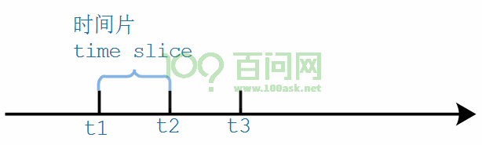

相同优先级的任务怎么切换呢？请看下图：

- 任务2从t1执行到t2
- 在t2发生tick中断，进入tick中断处理函数：
  - 选择下一个要运行的任务
  - 执行完中断处理函数后，切换到新的任务：任务1
- 任务1从t2执行到t3
- 从图中可以看出，任务运行的时间并不是严格从t1,t2,t3哪里开始

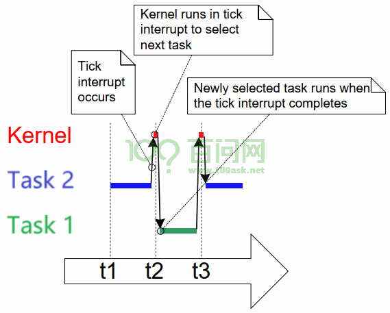

有了Tick的概念后，我们就可以使用Tick来衡量时间了，比如：

```c
vTaskDelay(2);  // 等待2个Tick，假设configTICK_RATE_HZ=100, Tick周期时10ms, 等待20ms

// 还可以使用pdMS_TO_TICKS宏把ms转换为tick
vTaskDelay(pdMS_TO_TICKS(100));	 // 等待100ms
```


注意，基于Tick实现的延时并不精确，比如vTaskDelay(2)的本意是延迟2个Tick周期，有可能经过1个Tick多一点就返回了。
如下图：

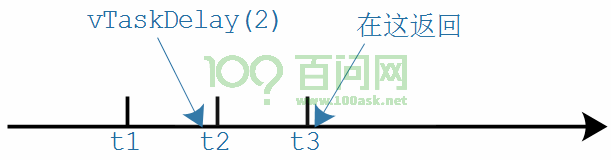

使用vTaskDelay函数时，建议以ms为单位，使用pdMS_TO_TICKS把时间转换为Tick。

这样的代码就与configTICK_RATE_HZ无关，即使配置项configTICK_RATE_HZ改变了，我们也不用去修改代码。

#### 8.3.3 示例4: 优先级实验

代码为：08_task_priority
本程序会：提高音乐播放任务的优先级，使用vTaskDelay进行延时。

代码如下：

```c
 while (1)
    {
        /* 读取红外遥控器 */
		if (0 == IRReceiver_Read(&dev, &data))
		{
			if (data == 0xa8) /* play */
			{
				/* 创建播放音乐的任务 */
			  extern void PlayMusic(void *params);
			  if (xSoundTaskHandle == NULL)
			  {
					LCD_ClearLine(0, 0);
					LCD_PrintString(0, 0, "Create Task");
					ret = xTaskCreate(PlayMusic, "SoundTask", 128, NULL, osPriorityNormal+1, &xSoundTaskHandle);
			  }
			}

			else if (data == 0xa2) /* power */
			{
				/* 删除播放音乐的任务 */
				if (xSoundTaskHandle != NULL)
				{
					LCD_ClearLine(0, 0);
					LCD_PrintString(0, 0, "Delete Task");
					vTaskDelete(xSoundTaskHandle);
					PassiveBuzzer_Control(0); /* 停止蜂鸣器 */
					xSoundTaskHandle = NULL;
				}
			}
		}
    }
```


调度情况如下图所示：

#### 8.3.4 修改优先级

使用uxTaskPriorityGet来获得任务的优先级：

```c
UBaseType_t uxTaskPriorityGet( const TaskHandle_t xTask );
```
使用参数xTask来指定任务，设置为NULL表示获取自己的优先级。

使用vTaskPrioritySet 来设置任务的优先级：

```c
void vTaskPrioritySet( TaskHandle_t xTask,
                       UBaseType_t uxNewPriority );
```

使用参数xTask来指定任务，设置为NULL表示获取自己的优先级。

使用vTaskPrioritySet 来设置任务的优先级：

```c
void vTaskPrioritySet( TaskHandle_t xTask,
                       UBaseType_t uxNewPriority );
```

使用参数xTask来指定任务，设置为NULL表示设置自己的优先级；

参数uxNewPriority表示新的优先级，取值范围是0~(configMAX_PRIORITIES – 1)。

### 8.4 任务状态

以前我们很简单地把任务的状态分为2中：运行(Runing)、非运行(Not Running)。
对于非运行的状态，还可以继续细分，比如前面的FreeRTOS_04_task_priority中：

- Task3执行vTaskDelay后：处于非运行状态，要过3秒种才能再次运行
- Task3运行期间，Task1、Task2也处于非运行状态，但是它们随时可以运行
- 这两种"非运行"状态就不一样，可以细分为：
- 阻塞状态(Blocked)
- 暂停状态(Suspended)
- 就绪状态(Ready)

#### 8.4.1 阻塞状态(Blocked)

在日常生活的例子中，母亲在电脑前跟同事沟通时，如果同事一直没回复，那么母亲的工作就被卡住了、被堵住了、处于阻塞状态(Blocked)。重点在于：母亲在等待。

在FreeRTOS_04_task_priority实验中，如果把任务3中的vTaskDelay调用注释掉，那么任务1、任务2根本没有执行的机会，任务1、任务2被"饿死"了(starve)。

在实际产品中，我们不会让一个任务一直运行，而是使用"事件驱动"的方法让它运行：

- 任务要等待某个事件，事件发生后它才能运行
- 在等待事件过程中，它不消耗CPU资源
- 在等待事件的过程中，这个任务就处于阻塞状态(Blocked)

在阻塞状态的任务，它可以等待两种类型的事件：

- 时间相关的事件
  - 可以等待一段时间：我等2分钟
  - 也可以一直等待，直到某个绝对时间：我等到下午3点
- 同步事件：这事件由别的任务，或者是中断程序产生
  - 例子1：任务A等待任务B给它发送数据
  - 例子2：任务A等待用户按下按键
  - 同步事件的来源有很多(这些概念在后面会细讲)：
    - 队列(queue)
    - 二进制信号量(binary semaphores)
    - 计数信号量(counting semaphores)
    - 互斥量(mutexes)
    - 递归互斥量、递归锁(recursive mutexes)
    - 事件组(event groups)
    - 任务通知(task notifications)

在等待一个同步事件时，可以加上超时时间。比如等待队里数据，超时时间设为10ms：
- 10ms之内有数据到来：成功返回
- 10ms到了，还是没有数据：超时返回

#### 8.4.2 暂停状态(Suspended)

在日常生活的例子中，母亲正在电脑前跟同事沟通，母亲可以暂停：

- 好烦啊，我暂停一会
- 领导说：你暂停一下

FreeRTOS中的任务也可以进入暂停状态，唯一的方法是通过vTaskSuspend函数。函数原型如下：

```c
void vTaskSuspend( TaskHandle_t xTaskToSuspend );
```

参数xTaskToSuspend表示要暂停的任务，如果为NULL，表示暂停自己。

要退出暂停状态，只能由别人来操作：

- 别的任务调用：vTaskResume
- 中断程序调用：xTaskResumeFromISR

实际开发中，暂停状态用得不多。

#### 8.4.3 就绪状态(Ready)

这个任务完全准备好了，随时可以运行：只是还轮不到它。这时，它就处于就绪态(Ready)。

#### 8.4.4 完整的状态转换图

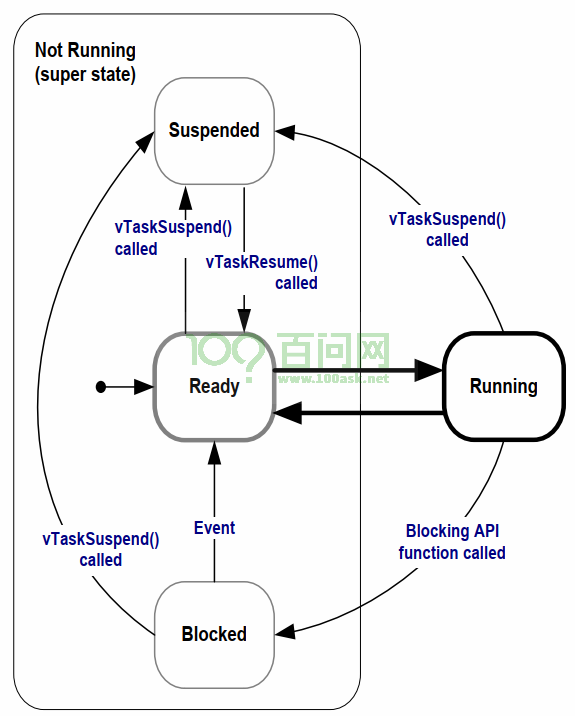

### 8.5 示例5: 任务暂停

代码为：09_task_suspend

本程序会：使用vTaskSuspend暂停音乐播放任务，使用vTaskResume恢复它，实现音乐的暂停播放、继续播放功能。

关键代码如下:

```c
01 while (1)

02 {

03   /* 读取红外遥控器 */

04		if (0 == IRReceiver_Read(&dev, &data))

05		{

06			if (data == 0xa8) /* play */

07			{

08				/* 创建播放音乐的任务 */

09			 extern void PlayMusic(void *params);

10			 if (xSoundTaskHandle == NULL)

11			 {

12					LCD_ClearLine(0, 0);

13					LCD_PrintString(0, 0, "Create Task");

14					ret = xTaskCreate(PlayMusic, "SoundTask", 128, NULL, osPriorityNormal+1, &xSoundTaskHandle);

15					bRunning = 1;

16			 }

17			 else

18			 {

19				 /* 要么suspend要么resume */

20				 if (bRunning)

21				 {

22					 LCD_ClearLine(0, 0);

23					 LCD_PrintString(0, 0, "Suspend Task");

24					 vTaskSuspend(xSoundTaskHandle);

25					 PassiveBuzzer_Control(0); /* 停止蜂鸣器 */

26					 bRunning = 0;

27				 }

28				 else

29				 {

30					 LCD_ClearLine(0, 0);

31					 LCD_PrintString(0, 0, "Resume Task");

32					 vTaskResume(xSoundTaskHandle);

33					 bRunning = 1;

34				 }

35			 }

36			}

37

38			else if (data == 0xa2) /* power */

39			{

40				/* 删除播放音乐的任务 */

41				if (xSoundTaskHandle != NULL)

42				{

43					LCD_ClearLine(0, 0);

44					LCD_PrintString(0, 0, "Delete Task");

45					vTaskDelete(xSoundTaskHandle);

46					PassiveBuzzer_Control(0); /* 停止蜂鸣器 */

47					xSoundTaskHandle = NULL;

48				}

49			}

50		}

51  }
```

第1次按下红外遥控器的播放按钮时，执行第14行的代码来创建音乐任务。

后续按下红外遥控器的播放按钮时，要么使用第24行的代码来暂停音乐任务，要么使用第32行的代码来恢复音乐任务。

按下红外遥控器的电源按钮时，执行第46行的代码来删除音乐任务。

### 8.6 Delay函数

#### 8.6.1 两个Delay函数

有两个Delay函数：

- vTaskDelay：至少等待指定个数的Tick Interrupt才能变为就绪状态
- vTaskDelayUntil：等待到指定的绝对时刻，才能变为就绪态。

这2个函数原型如下：

```c
void vTaskDelay( const TickType_t xTicksToDelay ); /* xTicksToDelay: 等待多少给Tick */

/* pxPreviousWakeTime: 上一次被唤醒的时间
 * xTimeIncrement: 要阻塞到(pxPreviousWakeTime + xTimeIncrement)
 * 单位都是Tick Count
 */
BaseType_t xTaskDelayUntil( TickType_t * const pxPreviousWakeTime,
                            const TickType_t xTimeIncrement );
```

下面画图说明：

- 使用vTaskDelay(n)时，进入、退出vTaskDelay的时间间隔至少是n个Tick中断
- 使用xTaskDelayUntil(&Pre, n)时，前后两次退出xTaskDelayUntil的时间至少是n个Tick中断
  - 退出xTaskDelayUntil时任务就进入的就绪状态，一般都能得到执行机会
  - 所以可以使用xTaskDelayUntil来让任务周期性地运行


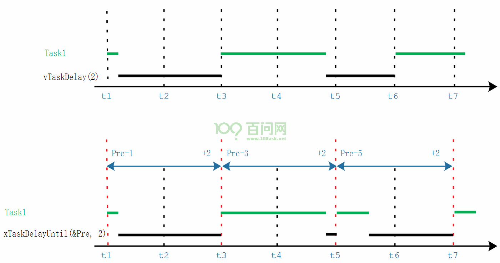

#### 8.6.2 示例5:  Delay

本节代码为：11_taskdelay。
本程序会比较vTaskDelay和vTaskDelayUntil实际阻塞的时间，并在LCD上打印出来。

代码如下：

```c
void LcdPrintTask(void *params)
{
	struct TaskPrintInfo *pInfo = params;
	uint32_t cnt = 0;
	int len;
	BaseType_t preTime;
	uint64_t t1, t2;

	preTime = xTaskGetTickCount();
	while (1)
	{
		/* 打印信息 */
		if (g_LCDCanUse)
		{
			g_LCDCanUse = 0;
			len = LCD_PrintString(pInfo->x, pInfo->y, pInfo->name);
			len += LCD_PrintString(len, pInfo->y, ":");
			LCD_PrintSignedVal(len, pInfo->y, cnt++);
			g_LCDCanUse = 1;
			mdelay(cnt & 0x3);
		}

		t1 = system_get_ns();
		//vTaskDelay(500);  // 500000000

		vTaskDelayUntil(&preTime, 500);
		t2 = system_get_ns();

		LCD_ClearLine(pInfo->x, pInfo->y+2);
		LCD_PrintSignedVal(pInfo->x, pInfo->y+2, t2-t1);
	}
}

```

### 8.7 空闲任务及其钩子函数

#### 8.7.1 介绍

空闲任务(Idle任务)的作用之一：释放被删除的任务的内存。

除了上述目的之外，为什么必须要有空闲任务？一个良好的程序，它的任务都是事件驱动的：平时大部分时间处于阻塞状态。有可能我们自己创建的所有任务都无法执行，但是调度器必须能找到一个可以运行的任务：所以，我们要提供空闲任务。在使用vTaskStartScheduler()函数来创建、启动调度器时，这个函数内部会创建空闲任务：

- 空闲任务优先级为0：它不能阻碍用户任务运行
- 空闲任务要么处于就绪态，要么处于运行态，永远不会阻塞

空闲任务的优先级为0，这意味着一旦某个用户的任务变为就绪态，那么空闲任务马上被切换出去，让这个用户任务运行。在这种情况下，我们说用户任务"抢占"(pre-empt)了空闲任务，这是由调度器实现的。

要注意的是：如果使用vTaskDelete()来删除任务，那么你就要确保空闲任务有机会执行，否则就无法释放被删除任务的内存。

我们可以添加一个空闲任务的钩子函数(Idle Task Hook Functions)，空闲任务的循环每执行一次，就会调用一次钩子函数。钩子函数的作用有这些：

- 执行一些低优先级的、后台的、需要连续执行的函数
- 测量系统的空闲时间：空闲任务能被执行就意味着所有的高优先级任务都停止了，所以测量空闲任务占据的时间，就可以算出处理器占用率。
- 让系统进入省电模式：空闲任务能被执行就意味着没有重要的事情要做，当然可以进入省电模式了。
- 空闲任务的钩子函数的限制：
- 不能导致空闲任务进入阻塞状态、暂停状态
- 如果你会使用vTaskDelete()来删除任务，那么钩子函数要非常高效地执行。如果空闲任务移植卡在钩子函数里的话，它就无法释放内存。

#### 8.7.2  使用钩子函数的前提

在FreeRTOS\Source\tasks.c中，可以看到如下代码，所以前提就是：

- 把这个宏定义为1：configUSE_IDLE_HOOK
- 实现vApplicationIdleHook函数

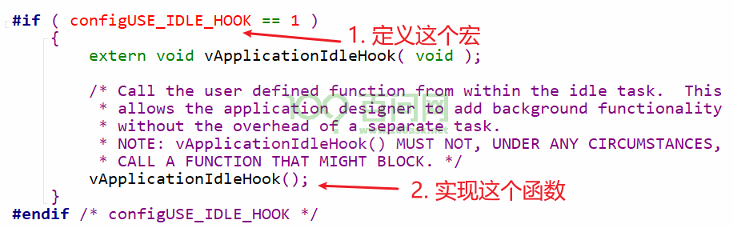

### 8.8 调度算法

#### 8.8.1 重要概念

这些知识在前面都提到过了，这里总结一下。

正在运行的任务，被称为"正在使用处理器"，它处于运行状态。在单处理系统中，任何时间里只能有一个任务处于运行状态。

非运行状态的任务，它处于这3中状态之一：阻塞(Blocked)、暂停(Suspended)、就绪(Ready)。就绪态的任务，可以被调度器挑选出来切换为运行状态，调度器永远都是挑选最高优先级的就绪态任务并让它进入运行状态。

阻塞状态的任务，它在等待"事件"，当事件发生时任务就会进入就绪状态。事件分为两类：时间相关的事件、同步事件。所谓时间相关的事件，就是设置超时时间：在指定时间内阻塞，时间到了就进入就绪状态。使用时间相关的事件，可以实现周期性的功能、可以实现超时功能。同步事件就是：某个任务在等待某些信息，别的任务或者中断服务程序会给它发送信息。怎么"发送信息"？方法很多，有：任务通知(task notification)、队列(queue)、事件组(event group)、信号量(semaphoe)、互斥量(mutex)等。这些方法用来发送同步信息，比如表示某个外设得到了数据。

#### 8.8.2 配置调度算法

所谓调度算法，就是怎么确定哪个就绪态的任务可以切换为运行状态。

通过配置文件FreeRTOSConfig.h的两个配置项来配置调度算法：configUSE_PREEMPTION、configUSE_TIME_SLICING。

还有第三个配置项：configUSE_TICKLESS_IDLE，它是一个高级选项，用于关闭Tick中断来实现省电，后续单独讲解。现在我们假设configUSE_TICKLESS_IDLE被设为0，先不使用这个功能。
调度算法的行为主要体现在两方面：高优先级的任务先运行、同优先级的就绪态任务如何被选中。调度算法要确保同优先级的就绪态任务，能"轮流"运行，策略是"轮转调度"(Round Robin Scheduling)。轮转调度并不保证任务的运行时间是公平分配的，我们还可以细化时间的分配方法。
从3个角度统一理解多种调度算法：

- 可否抢占？高优先级的任务能否优先执行(配置项: configUSE_PREEMPTION)
  - 可以：被称作"可抢占调度"(Pre-emptive)，高优先级的就绪任务马上执行，下面再细化。
  - 不可以：不能抢就只能协商了，被称作"合作调度模式"(Co-operative Scheduling)
    - 当前任务执行时，更高优先级的任务就绪了也不能马上运行，只能等待当前任务主动让出CPU资源。
    - 其他同优先级的任务也只能等待：更高优先级的任务都不能抢占，平级的更应该老实点
- 可抢占的前提下，同优先级的任务是否轮流执行(配置项：configUSE_TIME_SLICING)
  - 轮流执行：被称为"时间片轮转"(Time Slicing)，同优先级的任务轮流执行，你执行一个时间片、我再执行一个时间片
  - 不轮流执行：英文为"without Time Slicing"，当前任务会一直执行，直到主动放弃、或者被高优先级任务抢占
- 在"可抢占"+"时间片轮转"的前提下，进一步细化：空闲任务是否让步于用户任务(配置项：configIDLE_SHOULD_YIELD)
  - 空闲任务低人一等，每执行一次循环，就看看是否主动让位给用户任务
  - 空闲任务跟用户任务一样，大家轮流执行，没有谁更特殊
  列表如下：

| **配置项**        | **A** | **B** | **C** | **D** | **E** |
| ----------------------- | ----------- | ----------- | ----------- | ----------- | ----------- |
| configUSE_PREEMPTION    | 1           | 1           | 1           | 1           | 0           |
| configUSE_TIME_SLICING  | 1           | 1           | 0           | 0           | x           |
| configIDLE_SHOULD_YIELD | 1           | 0           | 1           | 0           | x           |
| 说明                    | 常用        | 很少用      | 很少用      | 很少用      | 几乎不用    |

注：
- A：可抢占+时间片轮转+空闲任务让步
- B：可抢占+时间片轮转+空闲任务不让步
- C：可抢占+非时间片轮转+空闲任务让步
- D：可抢占+非时间片轮转+空闲任务不让步
- E：合作调度

#### 8.8.3 示例6: 调度


#### 8.8.4 对比效果: 抢占与否

在 **FreeRTOSConfig.h** 中，定义这样的宏，对比逻辑分析仪的效果：

```c
// 实验1：抢占
##define configUSE_PREEMPTION		1
##define configUSE_TIME_SLICING      1
##define configIDLE_SHOULD_YIELD		1

// 实验2：不抢占
##define configUSE_PREEMPTION		0
##define configUSE_TIME_SLICING      1
##define configIDLE_SHOULD_YIELD		1
```

对比结果为：

- 抢占时：高优先级任务就绪时，就可以马上执行
- 不抢占时：优先级失去意义了，既然不能抢占就只能协商了，图中任务1一直在运行(一点都没有协商精神)，其他任务都无法执行。即使任务3的vTaskDelay已经超时、即使它的优先级更高，都没办法执行。

#### 8.8.5 对比效果: 时间片轮转与否

在 **FreeRTOSConfig.h** 中，定义这样的宏，对比逻辑分析仪的效果：

```c
// 实验1：时间片轮转
##define configUSE_PREEMPTION		1
##define configUSE_TIME_SLICING      1
##define configIDLE_SHOULD_YIELD		1

// 实验2：时间片不轮转
##define configUSE_PREEMPTION		1
##define configUSE_TIME_SLICING      0
##define configIDLE_SHOULD_YIELD		1
```

从下面的对比图可以知道：

- 时间片轮转：在Tick中断中会引起任务切换
- 时间片不轮转：高优先级任务就绪时会引起任务切换，高优先级任务不再运行时也会引起任务切换。可以看到任务3就绪后可以马上执行，它运行完毕后导致任务切换。其他时间没有任务切换，可以看到任务1、任务2都运行了很长时间。

#### 8.8.6 对比效果: 空闲任务让步

在 **FreeRTOSConfig.h** 中，定义这样的宏，对比逻辑分析仪的效果：

```c
// 实验1：空闲任务让步
##define configUSE_PREEMPTION		1
##define configUSE_TIME_SLICING      1
##define configIDLE_SHOULD_YIELD		1

// 实验2：空闲任务不让步
##define configUSE_PREEMPTION		1
##define configUSE_TIME_SLICING      1
##define configIDLE_SHOULD_YIELD		0
```

从下面的对比图可以知道：

- 让步时：在空闲任务的每个循环中，会主动让出处理器，从图中可以看到flagIdelTaskrun的波形很小
- 不让步时：空闲任务跟任务1、任务2同等待遇，它们的波形宽度是差不多的

---

## 第9章 同步互斥与通信

本章是概述性的内容。可以把多任务系统当做一个团队，里面的每一个任务就相当于团队里的一个人。团队成员之间要协调工作进度(同步)、争用会议室(互斥)、沟通(通信)。多任务系统中所涉及的概念，都可以在现实生活中找到例子。

各类RTOS都会涉及这些概念：任务通知(task notification)、队列(queue)、事件组(event group)、信号量(semaphoe)、互斥量(mutex)等。我们先站在更高角度来讲解这些概念。

### 9.1 同步与互斥的概念

一句话理解同步与互斥：我等你用完厕所，我再用厕所。

什么叫同步？就是：哎哎哎，我正在用厕所，你等会。
什么叫互斥？就是：哎哎哎，我正在用厕所，你不能进来。

同步与互斥经常放在一起讲，是因为它们之的关系很大，“互斥”操作可以使用“同步”来实现。我“等”你用完厕所，我再用厕所。这不就是用“同步”来实现“互斥”吗？

再举一个例子。在团队活动里，同事A先写完报表，经理B才能拿去向领导汇报。经理B必须等同事A完成报表，AB之间有依赖，B必须放慢脚步，被称为同步。在团队活动中，同事A已经使用会议室了，经理B也想使用，即使经理B是领导，他也得等着，这就叫互斥。经理B跟同事A说：你用完会议室就提醒我。这就是使用"同步"来实现"互斥"。

有时候看代码更容易理解，伪代码如下：

```c
 void  抢厕所(void)
 {
   if (有人在用) 我眯一会;
   用厕所;
   喂，醒醒，有人要用厕所吗;
 }
```

假设有A、B两人早起抢厕所，A先行一步占用了；B慢了一步，于是就眯一会；当A用完后叫醒B，B也就愉快地上厕所了。

在这个过程中，A、B是互斥地访问“厕所”，“厕所”被称之为临界资源。我们使用了“休眠-唤醒”的同步机制实现了“临界资源”的“互斥访问”。

同一时间只能有一个人使用的资源，被称为临界资源。比如任务A、B都要使用串口来打印，串口就是临界资源。如果A、B同时使用串口，那么打印出来的信息就是A、B混杂，无法分辨。所以使用串口时，应该是这样：A用完，B再用；B用完，A再用。

### 9.2 同步与互斥并不简单

在裸机程序里，可以使用一个全局变量或静态变量实现互斥操作，比如要互斥地使用LCD，可以使用如下代码：

```c
 int LCD_PrintString(int x, int y, char *str)
 {
   static int bCanUse = 1;
   if (bCanUse)
   {
     bCanUse = 0;
     /* 使用LCD */
     bCanUse = 1;
     return 0;
   }
   return -1;
 }
```

但是在RTOS里，使用上述代码实现互斥操作时，大概率是没问题的，但是无法确保万无一失。

假设如下场景：有两个任务A、B都想调用LCD_PrintString，任务A执行到第4行代码时发现bCanUse为1，可以进入if语句块，它还没执行第6句指令就被切换出去了；然后任务B也调用LCD_PrintString，任务B执行到第4行代码时也发现bCanUse为1，也可以进入if语句块使用LCD。在这种情况下，使用静态变量并不能实现互斥操作。

上述例子中，是因为第4、第6两条指令被打断了，那么如下改进：在函数入口处先然让bCanUse减一。这能否实现万无一失的互斥操作呢？

```c
 int LCD_PrintString(int x, int y, char *str)
 {
   static int bCanUse = 1;
   bCanUse--;
   if (bCanUse == 0)
   {
     /* 使用LCD */
     bCanUse++;
     return 0;
   }
   else
   {
     bCanUse++;
     return -1;
   }
 }
```

把第4行的代码使用汇编指令表示如下：

```c
04.1 LDR R0, [bCanUse]  	// 读取bCanUse的值，存入寄存器R0

04.2 DEC R0, #1     	    // 把R0的值减一

04.3 STR R0, [bCanUse]      // 把R0写入变量bCanUse
```

假设如下场景：有两个任务A、B都想调用LCD_PrintString，任务A执行到第04.1行代码时读到的bCanUse为1，存入寄存器R0就被切换出去了；然后任务B也调用LCD_PrintString，任务B执行到第4行时发现bCanUse为1并把它减为0，执行到第5行代码时发现条件成立可以进入if语句块使用LCD，然后任务B也被切换出去了；现在任务A继续运行第04.2行代码时R0为1，运行到第04.3行代码时把bCanUse设置为0，后续也能成功进入if的语句块。在这种情况下，任务A、B都能使用LCD。

上述方法不能保证万无一失的原因在于：在判断过程中，被打断了。如果能保证这个过程不被打断，就可以了：通过关闭中断来实现。

示例1的代码改进如下：在第5~7行前关闭中断。

```c
 int LCD_PrintString(int x, int y, char *str)
 {
   static int bCanUse = 1;
   disable_irq();
   if (bCanUse)
   {
        bCanUse = 0;
        enable_irq();
       /* 使用LCD */
        bCanUse = 1;
        return 0;
   }
   enable_irq();
   return -1;
 }
```

示例2的代码改进如下：在第5行前关闭中断。

```c
 int LCD_PrintString(int x, int y, char *str)
 {
   static int bCanUse = 1;
   disable_irq();
   bCanUse--;
   enable_irq();
   if (bCanUse == 0)
   {
     /* 使用LCD */
     bCanUse++;
     return 0;
   }
   else
   {
     disable_irq();
     bCanUse++;
     enable_irq();
     return -1;
   }
 }
```

### 9.3 各类方法的对比

能实现同步、互斥的内核方法有：任务通知(task notification)、队列(queue)、事件组(event group)、信号量(semaphoe)、互斥量(mutex)。

它们都有类似的操作方法：获取/释放、阻塞/唤醒、超时。比如：

- 任务A获取资源，用完后任务A释放资源
- 任务A获取不到资源则阻塞，任务B释放资源并把任务A唤醒
- 任务A获取不到资源则阻塞，并定个闹钟；A要么超时返回，要么在这段时间内因为任务B释放资源而被唤醒。

这些内核对象五花八门，记不住怎么办？我也记不住，通过对比的方法来区分它们。

- 能否传信息？还是只能传递状态？
- 为众生（所有任务都可以使用）？只为你（只能指定任务使用）？
- 我生产，你们消费？
- 我上锁，只能由我开锁

| **内核对象** | **生产者** | **消费者** | **数据/状态** | **说明** |
| ------------------ | ---------------- | ---------------- | ------------------------------------------------------------ | ------------------------------------------------------------ |
| 队列               | ALL              | ALL              | 数据：若干个数据 谁都可以往队列里扔数据， 谁都可以从队列里读数据 | 用来传递数据， 发送者、接收者无限制， 一个数据只能唤醒一个接收者 |
| 事件组             | ALL              | ALL              | 多个位：或、与 谁都可以设置(生产)多个位， 谁都可以等待某个位、若干个位 | 用来传递事件， 可以是N个事件， 发送者、接受者无限制， 可以唤醒多个接收者：像广播 |
| 信号量             | ALL              | ALL              | 数量：0~n 谁都可以增加一个数量， 谁都可消耗一个数量          | 用来维持资源的个数， 生产者、消费者无限制， 1个资源只能唤醒1个接收者 |
| 任务通知           | ALL              | 只有我           | 数据、状态都可以传输， 使用任务通知时， 必须指定接受者       | N对1的关系： 发送者无限制， 接收者只能是这个任务             |
| 互斥量             | 只能A开锁        | A上锁            | 位：0、1 我上锁：1变为0， 只能由我开锁：0变为1               | 就像一个空厕所， 谁使用谁上锁， 也只能由他开锁               |

使用图形对比如下：

- 队列：

  - 里面可以放任意数据，可以放多个数据
  - 任务、ISR都可以放入数据；任务、ISR都可以从中读出数据

- 事件组：

  - 一个事件用一bit表示，1表示事件发生了，0表示事件没发生
  - 可以用来表示事件、事件的组合发生了，不能传递数据
  - 有广播效果：事件或事件的组合发生了，等待它的多个任务都会被唤醒

- 信号量：

  - 核心是"计数值"
  - 任务、ISR释放信号量时让计数值加1
  - 任务、ISR获得信号量时，让计数值减1

- 任务通知：

  - 核心是任务的TCB里的数值
  - 会被覆盖
  - 发通知给谁？必须指定接收任务
  - 只能由接收任务本身获取该通知

- 互斥量：

  - 数值只有0或1
  - 谁获得互斥量，就必须由谁释放同一个互斥量

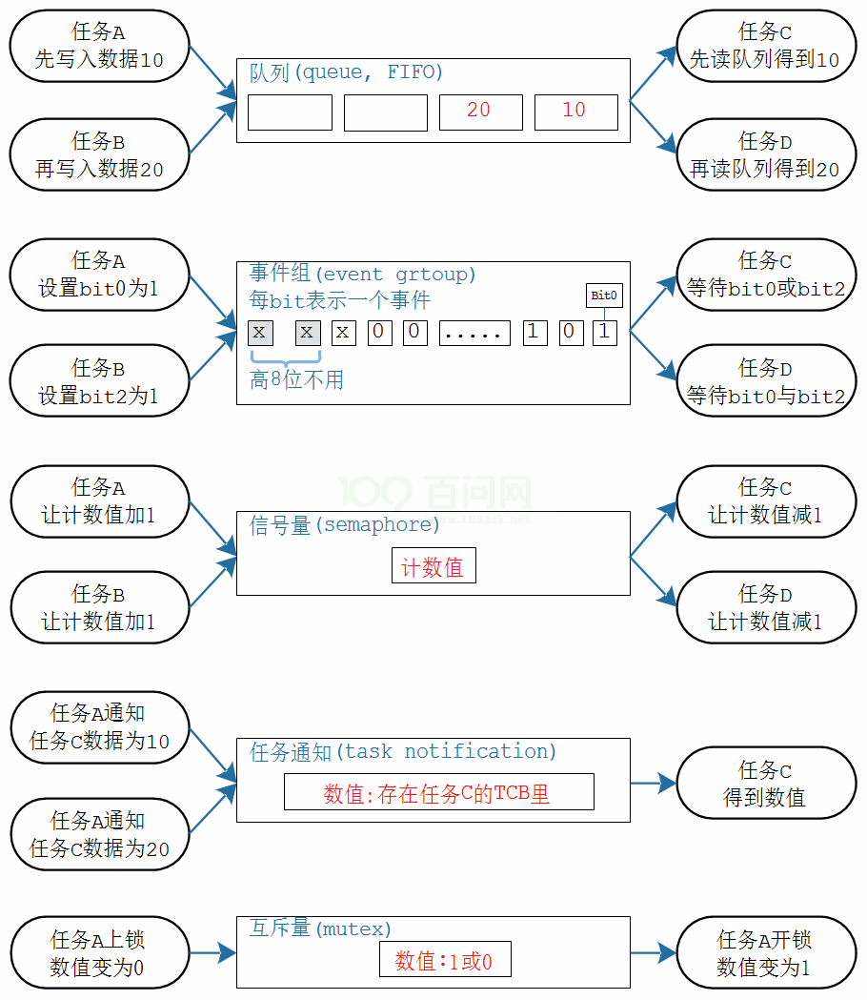

### 9.4 各类方法的本质

---

## 第10章 队列(queue)

队列(queue)可以用于"任务到任务"、"任务到中断"、"中断到任务"直接传输信息。

本章涉及如下内容：

- 怎么创建、清除、删除队列
- 队列中消息如何保存
- 怎么向队列发送数据、怎么从队列读取数据、怎么覆盖队列的数据
- 在队列上阻塞是什么意思
- 怎么在多个队列上阻塞
- 读写队列时如何影响任务的优先级

### 10.1 队列的特性

#### 10.1.1 常规操作

队列的简化操如入下图所示，从此图可知：

- 队列可以包含若干个数据：队列中有若干项，这被称为"长度"(length)
- 每个数据大小固定
- 创建队列时就要指定长度、数据大小
- 数据的操作采用先进先出的方法(FIFO，First In First Out)：写数据时放到尾部，读数据时从头部读
- 也可以强制写队列头部：覆盖头部数据

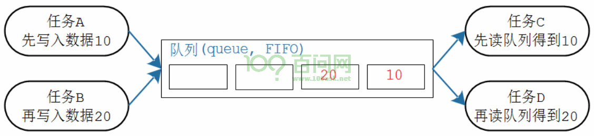

更详细的操作入下图所示：

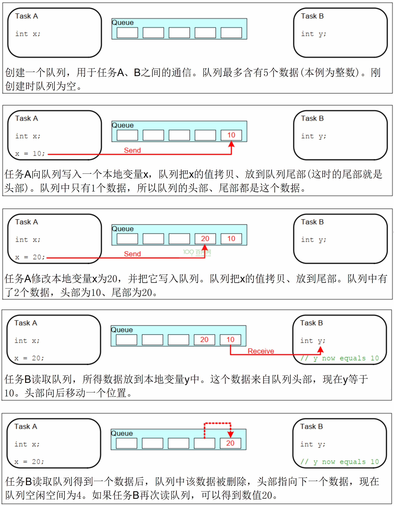

#### 10.1.2 传输数据的两种方法

使用队列传输数据时有两种方法：

- 拷贝：把数据、把变量的值复制进队列里
- 引用：把数据、把变量的地址复制进队列里

FreeRTOS使用拷贝值的方法，这更简单：

- 局部变量的值可以发送到队列中，后续即使函数退出、局部变量被回收，也不会影响队列中的数据
- 无需分配buffer来保存数据，队列中有buffer
- 局部变量可以马上再次使用
- 发送任务、接收任务解耦：接收任务不需要知道这数据是谁的、也不需要发送任务来释放数据
- 如果数据实在太大，你还是可以使用队列传输它的地址
- 队列的空间有FreeRTOS内核分配，无需任务操心
- 对于有内存保护功能的系统，如果队列使用引用方法，也就是使用地址，必须确保双方任务对这个地址都有访问权限。使用拷贝方法时，则无此限制：内核有足够的权限，把数据复制进队列、再把数据复制出队列。

#### 10.1.3 队列的阻塞访问

只要知道队列的句柄，谁都可以读、写该队列。任务、ISR都可读、写队列。可以多个任务读写队列。

任务读写队列时，简单地说：如果读写不成功，则阻塞；可以指定超时时间。口语化地说，就是可以定个闹钟：如果能读写了就马上进入就绪态，否则就阻塞直到超时。

某个任务读队列时，如果队列没有数据，则该任务可以进入阻塞状态：还可以指定阻塞的时间。如果队列有数据了，则该阻塞的任务会变为就绪态。如果一直都没有数据，则时间到之后它也会进入就绪态。

既然读取队列的任务个数没有限制，那么当多个任务读取空队列时，这些任务都会进入阻塞状态：有多个任务在等待同一个队列的数据。当队列中有数据时，哪个任务会进入就绪态？

- 优先级最高的任务
- 如果大家的优先级相同，那等待时间最久的任务会进入就绪态

跟读队列类似，一个任务要写队列时，如果队列满了，该任务也可以进入阻塞状态：还可以指定阻塞的时间。如果队列有空间了，则该阻塞的任务会变为就绪态。如果一直都没有空间，则时间到之后它也会进入就绪态。

既然写队列的任务个数没有限制，那么当多个任务写"满队列"时，这些任务都会进入阻塞状态：有多个任务在等待同一个队列的空间。当队列中有空间时，哪个任务会进入就绪态？

- 优先级最高的任务
- 如果大家的优先级相同，那等待时间最久的任务会进入就绪态

### 10.2 队列函数

使用队列的流程：创建队列、写队列、读队列、删除队列。

#### 10.2.1 创建

队列的创建有两种方法：动态分配内存、静态分配内存，

- 动态分配内存：xQueueCreate，队列的内存在函数内部动态分配

函数原型如下：

```c
QueueHandle_t xQueueCreate( UBaseType_t uxQueueLength, UBaseType_t uxItemSize );
```

| **参数** | **说明**                                               |
| -------------- | ------------------------------------------------------------ |
| uxQueueLength  | 队列长度，最多能存放多少个数据(item)                         |
| uxItemSize     | 每个数据(item)的大小：以字节为单位                           |
| 返回值         | 非0：成功，返回句柄，以后使用句柄来操作队列 NULL：失败，因为内存不足 |

- 静态分配内存：xQueueCreateStatic，队列的内存要事先分配好

函数原型如下：

```c
QueueHandle_t xQueueCreateStatic(*
                    UBaseType_t uxQueueLength,*
                    UBaseType_t uxItemSize,*
                    uint8_t *pucQueueStorageBuffer,*
                    StaticQueue_t *pxQueueBuffer*
                 );
```

| **参数**        | **说明**                                               |
| --------------------- | ------------------------------------------------------------ |
| uxQueueLength         | 队列长度，最多能存放多少个数据(item)                         |
| uxItemSize            | 每个数据(item)的大小：以字节为单位                           |
| pucQueueStorageBuffer | 如果uxItemSize非0，pucQueueStorageBuffer必须指向一个uint8_t数组， 此数组大小至少为"uxQueueLength * uxItemSize" |
| pxQueueBuffer         | 必须执行一个StaticQueue_t结构体，用来保存队列的数据结构      |
| 返回值                | 非0：成功，返回句柄，以后使用句柄来操作队列 NULL：失败，因为pxQueueBuffer为NULL |

示例代码：

```c
// 示例代码
 #define QUEUE_LENGTH 10
 #define ITEM_SIZE sizeof( uint32_t )

 // xQueueBuffer用来保存队列结构体
 StaticQueue_t xQueueBuffer;

// ucQueueStorage 用来保存队列的数据

// 大小为：队列长度 * 数据大小
 uint8_t ucQueueStorage[ QUEUE_LENGTH * ITEM_SIZE ];

 void vATask( void *pvParameters )
 {
	QueueHandle_t xQueue1;

	// 创建队列: 可以容纳QUEUE_LENGTH个数据，每个数据大小是ITEM_SIZE
	xQueue1 = xQueueCreateStatic( QUEUE_LENGTH,
							ITEM_SIZE,
                            ucQueueStorage,
                            &xQueueBuffer );
  }
```

#### 10.2.2 复位

队列刚被创建时，里面没有数据；使用过程中可以调用 **xQueueReset()** 把队列恢复为初始状态，此函数原型为：

```c
/*  pxQueue : 复位哪个队列;
 * 返回值: pdPASS(必定成功)
*/
BaseType_t xQueueReset( QueueHandle_t pxQueue);
```

#### 10.2.3 删除

删除队列的函数为 **vQueueDelete()** ，只能删除使用动态方法创建的队列，它会释放内存。原型如下：

```c
void vQueueDelete( QueueHandle_t xQueue );
```

#### 10.2.4 写队列

可以把数据写到队列头部，也可以写到尾部，这些函数有两个版本：在任务中使用、在ISR中使用。函数原型如下：

```c
/* 等同于xQueueSendToBack
 * 往队列尾部写入数据，如果没有空间，阻塞时间为xTicksToWait
 */
BaseType_t xQueueSend(
                                QueueHandle_t    xQueue,
                                const void       *pvItemToQueue,
                                TickType_t       xTicksToWait
                            );

/*
 * 往队列尾部写入数据，如果没有空间，阻塞时间为xTicksToWait
 */
BaseType_t xQueueSendToBack(
                                QueueHandle_t    xQueue,
                                const void       *pvItemToQueue,
                                TickType_t       xTicksToWait
                            );


/*
 * 往队列尾部写入数据，此函数可以在中断函数中使用，不可阻塞
 */
BaseType_t xQueueSendToBackFromISR(
                                      QueueHandle_t xQueue,
                                      const void *pvItemToQueue,
                                      BaseType_t *pxHigherPriorityTaskWoken
                                   );

/*
 * 往队列头部写入数据，如果没有空间，阻塞时间为xTicksToWait
 */
BaseType_t xQueueSendToFront(
                                QueueHandle_t    xQueue,
                                const void       *pvItemToQueue,
                                TickType_t       xTicksToWait
                            );

/*
 * 往队列头部写入数据，此函数可以在中断函数中使用，不可阻塞
 */
BaseType_t xQueueSendToFrontFromISR(
                                      QueueHandle_t xQueue,
                                      const void *pvItemToQueue,
                                      BaseType_t *pxHigherPriorityTaskWoken
                                   );
```

这些函数用到的参数是类似的，统一说明如下：

| 参数          | 说明                                                         |
| ------------- | ------------------------------------------------------------ |
| xQueue        | 队列句柄，要写哪个队列                                       |
| pvItemToQueue | 数据指针，这个数据的值会被复制进队列， 复制多大的数据？在创建队列时已经指定了数据大小 |
| xTicksToWait  | 如果队列满则无法写入新数据，可以让任务进入阻塞状态， xTicksToWait表示阻塞的最大时间(Tick Count)。 如果被设为0，无法写入数据时函数会立刻返回； 如果被设为portMAX_DELAY，则会一直阻塞直到有空间可写 |
| 返回值        | pdPASS：数据成功写入了队列 errQUEUE_FULL：写入失败，因为队列满了。 |

#### 10.2.5 读队列

使用 **xQueueReceive()** 函数读队列，读到一个数据后，队列中该数据会被移除。这个函数有两个版本：在任务中使用、在ISR中使用。函数原型如下：

```c
BaseType_t xQueueReceive( QueueHandle_t xQueue,
                          void * const pvBuffer,
                          TickType_t xTicksToWait );

BaseType_t xQueueReceiveFromISR(
                                    QueueHandle_t    xQueue,
                                    void             *pvBuffer,
                                    BaseType_t       *pxTaskWoken
                                );
```

参数说明如下：

| **参数** | **说明**                                               |
| -------------- | ------------------------------------------------------------ |
| xQueue         | 队列句柄，要读哪个队列                                       |
| pvBuffer       | bufer指针，队列的数据会被复制到这个buffer 复制多大的数据？在创建队列时已经指定了数据大小 |
| xTicksToWait   | 果队列空则无法读出数据，可以让任务进入阻塞状态， xTicksToWait表示阻塞的最大时间(Tick Count)。 如果被设为0，无法读出数据时函数会立刻返回； 如果被设为portMAX_DELAY，则会一直阻塞直到有数据可写 |
| 返回值         | pdPASS：从队列读出数据入 errQUEUE_EMPTY：读取失败，因为队列空了。 |

#### 10.2.6 查询

可以查询队列中有多少个数据、有多少空余空间。函数原型如下：

```c
/*
 * 返回队列中可用数据的个数
 */
UBaseType_t uxQueueMessagesWaiting( const QueueHandle_t xQueue );

/*
 * 返回队列中可用空间的个数
 */
UBaseType_t uxQueueSpacesAvailable( const QueueHandle_t xQueue );
```

#### 10.2.7 覆盖/偷看

当队列长度为1时，可以使用 **xQueueOverwrite()** 或 **xQueueOverwriteFromISR()** 来覆盖数据。

注意，队列长度必须为1。当队列满时，这些函数会覆盖里面的数据，这也以为着这些函数不会被阻塞。

函数原型如下：

```c
/* 覆盖队列
 * xQueue: 写哪个队列
 * pvItemToQueue: 数据地址
 * 返回值: pdTRUE表示成功, pdFALSE表示失败
 */
BaseType_t xQueueOverwrite(
                           QueueHandle_t xQueue,
                           const void * pvItemToQueue
                      );

BaseType_t xQueueOverwriteFromISR(
                           QueueHandle_t xQueue,
                           const void * pvItemToQueue,
                           BaseType_t *pxHigherPriorityTaskWoken
                      );
```

如果想让队列中的数据供多方读取，也就是说读取时不要移除数据，要留给后来人。那么可以使用"窥视"，也就是**xQueuePeek()**或**xQueuePeekFromISR()**。这些函数会从队列中复制出数据，但是不移除数据。这也意味着，如果队列中没有数据，那么"偷看"时会导致阻塞；一旦队列中有数据，以后每次"偷看"都会成功。

函数原型如下：

```c
/* 偷看队列
 * xQueue: 偷看哪个队列
 * pvItemToQueue: 数据地址, 用来保存复制出来的数据
 * xTicksToWait: 没有数据的话阻塞一会
 * 返回值: pdTRUE表示成功, pdFALSE表示失败
 */
BaseType_t xQueuePeek(
                          QueueHandle_t xQueue,
                          void * const pvBuffer,
                          TickType_t xTicksToWait
                      );

BaseType_t xQueuePeekFromISR(
                                 QueueHandle_t xQueue,
                                 void *pvBuffer,
                             );
```

### 10.3 示例: 队列的基本使用

本节代码为：13_queue_game。以前使用环形缓冲区传输红外遥控器的数据，本程序改为使用队列。

#### 10.3.1 程序框架

01_game_template使用轮询的方式从环形缓冲区读取红外遥控器的键值，13_queue_game把环形缓冲区改为队列。

13_queue_game程序的框架如下：

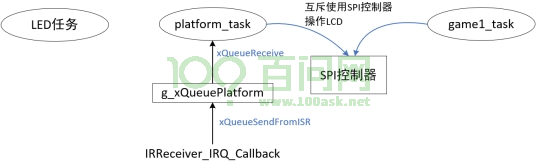

game1_task：游戏的主要逻辑判断，每次循环就移动一下球，判断球是否跟边沿、砖块、挡球板相碰，进而调整球的移动方向、消减砖块、统计分数。

platform_task：挡球板任务，根据遥控器左右移动挡球板。

IRReceiver_IRQ_Callback解析出遥控器键值后，写队列g_xQueuePlatform。


#### 10.3.2 源码分析

IRReceiver_IRQ_Callback中断回调函数里，识别出红外遥控键值后，构造一个struct input_data结构体，然后使用xQueueSendFromISR函数把它写入队列g_xQueuePlatform。

写队列的代码如下：

```c
struct input_data idata;

idata.dev = 0;

idata.val = 0;

xQueueSendToBackFromISR(g_xQueuePlatform, &idata, NULL);

挡球板任务从队列g_xQueuePlatform中读取数据，操作挡球板。代码如下：

01 /* 挡球板任务 */

02 static void platform_task(void *params)

03 {

04   byte platformXtmp = platformX;

05   uint8_t dev, data, last_data;

06	 struct input_data idata;

07

08  // Draw platform

09  draw_bitmap(platformXtmp, g_yres - 8, platform, 12, 8, NOINVERT, 0);

10  draw_flushArea(platformXtmp, g_yres - 8, 12, 8);

11

12  while (1)

13  {

14    /* 读取红外遥控器 */

15		//if (0 == IRReceiver_Read(&dev, &data))

16		if (pdPASS == xQueueReceive(g_xQueuePlatform, &idata, portMAX_DELAY))

17		{

18					 data = idata.val;

19      if (data == 0x00)

20      {

21        data = last_data;

22      }

23

24      if (data == 0xe0) /* Left */

25      {

26        btnLeft();

27      }

28

29      if (data == 0x90)  /* Right */

30      {

31        btnRight();

32      }

33      last_data = data;
```

第15行是原来的代码，它使用轮询的方式读取遥控键值，效率很低。

第16行开始改为读取队列，如果没有数据，挡球板任务阻塞，在第16行的函数里不出来；当IRReceiver_IRQ_Callback中断回调函数把数据写入队列后，挡球板任务马上被唤醒，从第16行的函数里出来，继续执行后续代码。


#### 10.3.3 上机实验

烧录程序后，使用红外遥控器的左、右按键移动挡球板。


### 10.4 示例: 使用队列实现多设备输入

本节代码为：14_queue_game_multi_input。

### 10.5 队列集

假设有2个输入设备：红外遥控器、旋转编码器，它们的驱动程序应该专注于“产生硬件数据”，不应该跟“业务有任何联系”。比如：红外遥控器驱动程序里，它只应该把键值记录下来、写入某个队列，它不应该把键值转换为游戏的控制键。在红外遥控器的驱动程序里，不应该有游戏相关的代码，这样，切换使用场景时，这个驱动程序还可以继续使用。

把红外遥控器的按键转换为游戏的控制键，应该在游戏的任务里实现。

要支持多个输入设备时，我们需要实现一个“InputTask”，它读取各个设备的队列，得到数据后再分别转换为游戏的控制键。

InputTask如何及时读取到多个队列的数据？要使用队列集。

队列集的本质也是队列，只不过里面存放的是“队列句柄”。使用过程如下：

- 创建队列A，它的长度是n1
- 创建队列B，它的长度是n2
- 创建队列集S，它的长度是“n1+n2”
- 把队列A、B加入队列集S
- 这样，写队列A的时候，会顺便把队列A的句柄写入队列集S
- 这样，写队列B的时候，会顺便把队列B的句柄写入队列集S
- InputTask先读取队列集S，它的返回值是一个队列句柄，这样就可以知道哪个队列有有数据了；然后InputTask再读取这个队列句柄得到数据。

#### 10.5.1 创建队列集

函数原型如下：

```c
QueueSetHandle_t xQueueCreateSet( const UBaseType_t uxEventQueueLength )
```


| **参数**      | **说明**                                                     |
| ------------- | ------------------------------------------------------------ |
| uxQueueLength | 队列集长度，最多能存放多少个数据(队列句柄)                   |
| 返回值        | 非0：成功，返回句柄，以后使用句柄来操作队列NULL：失败，因为内存不足 |


#### 10.5.2 把队列加入队列集

函数原型如下：

```c
BaseType_t xQueueAddToSet( QueueSetMemberHandle_t xQueueOrSemaphore,

                QueueSetHandle_t xQueueSet );


```


| **参数**          | **说明**                       |
| ----------------- | ------------------------------ |
| xQueueOrSemaphore | 队列句柄，这个队列要加入队列集 |
| xQueueSet         | 队列集句柄                     |
| 返回值            | pdTRUE：成功pdFALSE：失败      |


#### 10.5.3 读取队列集

函数原型如下：

```c
QueueSetMemberHandle_t xQueueSelectFromSet( QueueSetHandle_t xQueueSet,

                        TickType_t const xTicksToWait );
```


| **参数**     | **说明**                                                     |
| ------------ | ------------------------------------------------------------ |
| xQueueSet    | 队列集句柄                                                   |
| xTicksToWait | 如果队列集空则无法读出数据，可以让任务进入阻塞状态，xTicksToWait表示阻塞的最大时间(Tick Count)。如果被设为0，无法读出数据时函数会立刻返回；如果被设为portMAX_DELAY，则会一直阻塞直到有数据可写 |
| 返回值       | NULL：失败，队列句柄：成功                                   |


### 10.6 示例: 使用队列集改善程序框架

本节代码为：15_queueset_game。

### 10.7  示例12: 遥控器数据分发给多个任务

本节代码为：17_queue_car_dispatch。

#### 10.7.1 程序框架

17_queue_car_dispatch实现了另一个游戏：使用红外遥控器的1、2、3分别控制3辆汽车。

框架如下：

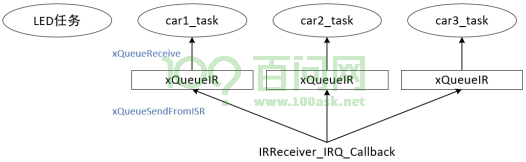

car1_task、car2_task、car3_task：创建自己的队列，并注册给devices\irda\dev_irda.c；读取队列，根据遥控器键值移动汽车。

IRReceiver_IRQ_Callback解析出遥控器键值后，写多个队列。

#### 10.7.2 源码分析

从上往上分析，任务入口函数代码如下：

```c
01 static void CarTask(void *params)

02 {

03	struct car *pcar = params;

04	struct ir_data idata;

05

06	/* 创建自己的队列 */

07	QueueHandle_t xQueueIR = xQueueCreate(10, sizeof(struct ir_data));

08

09	/* 注册队列 */

10	RegisterQueueHandle(xQueueIR);

11

12	/* 显示汽车 */

13	ShowCar(pcar);

14

15	while (1)

16	{

17		/* 读取按键值:读队列 */

18		xQueueReceive(xQueueIR, &idata, portMAX_DELAY);

19

20		/* 控制汽车往右移动 */

21		if (idata.val == pcar->control_key)

22		{

23			if (pcar->x < g_xres - CAR_LENGTH)

24			{

25				/* 隐藏汽车 */

26				HideCar(pcar);

27

28				/* 调整位置 */

29				pcar->x += 20;

30				if (pcar->x > g_xres - CAR_LENGTH)

31				{

32					pcar->x = g_xres - CAR_LENGTH;

33				}

34

35				/* 重新显示汽车 */

36				ShowCar(pcar);

37		  }

38	  }

39   }

40 }
```

第07行创建自己的队列，第10行把这个队列注册进底层的红外驱动。

红外驱动程序解析出按键值后，把数据写入多个队列，代码如下：

```
	/* 创建3个汽车任务 */

\#if 0

	for (i = 0; i < 3; i++)

	{

		draw_bitmap(g_cars[i].x, g_cars[i].y, carImg, 15, 16, NOINVERT, 0);

		draw_flushArea(g_cars[i].x, g_cars[i].y, 15, 16);

	}

\#endif

  xTaskCreate(CarTask, "car1", 128, &g_cars[0], osPriorityNormal, NULL);

  xTaskCreate(CarTask, "car2", 128, &g_cars[1], osPriorityNormal, NULL);

  xTaskCreate(CarTask, "car3", 128, &g_cars[2], osPriorityNormal, NULL);

}
```

#### 10.7.3 上机实验

烧录程序后，使用红外遥控器的1、2、3按键分别移动三辆汽车。

---

## 第11章 信号量(semaphore)

前面介绍的队列(queue)可以用于传输数据：在任务之间、任务和中断之间。

消息队列用于传输多个数据，但是有时候我们只需要传递状态，这个状态值需要用一个数值表示，比如：

- 卖家：做好了1个包子！做好了2个包子！做好了3个包子！
- 买家：买了1个包子，包子数量减1
- 这个停车位我占了，停车位减1
- 我开车走了，停车位加1

在这种情况下我们只需要维护一个数值，使用信号量效率更高、更节省内存
本章涉及如下内容：

- 怎么创建、删除信号量
- 怎么发送、获得信号量
- 什么是计数型信号量？什么是二进制信号量？

### 11.1 信号量的特性

#### 11.1.1 信号量的常规操作

信号量这个名字很恰当：

- 信号：起通知作用
- 量：还可以用来表示资源的数量
  - 当"量"没有限制时，它就是"计数型信号量"(Counting Semaphores)
  - 当"量"只有0、1两个取值时，它就是"二进制信号量"(Binary Semaphores)
- 支持的动作："give"给出资源，计数值加1；"take"获得资源，计数值减1

计数型信号量的典型场景是：

- 计数：事件产生时"give"信号量，让计数值加1；处理事件时要先"take"信号量，就是获得信号量，让计数值减1。
- 资源管理：要想访问资源需要先"take"信号量，让计数值减1；用完资源后"give"信号量，让计数值加1。
信号量的"give"、"take"双方并不需要相同，可以用于生产者-消费者场合：
- 生产者为任务A、B，消费者为任务C、D
- 一开始信号量的计数值为0，如果任务C、D想获得信号量，会有两种结果：
  - 阻塞：买不到东西咱就等等吧，可以定个闹钟(超时时间)
  - 即刻返回失败：不等
- 任务A、B可以生产资源，就是让信号量的计数值增加1，并且把等待这个资源的顾客唤醒
- 唤醒谁？谁优先级高就唤醒谁，如果大家优先级一样就唤醒等待时间最长的人

二进制信号量跟计数型的唯一差别，就是计数值的最大值被限定为1。

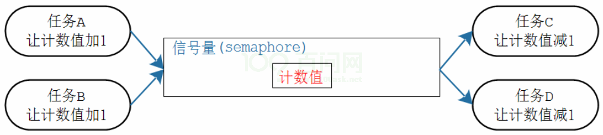

#### 11.1.2 信号量跟队列的对比

差异列表如下：

| 队列                                                         | 信号量                                                       |
| ------------------------------------------------------------ | ------------------------------------------------------------ |
| 可以容纳多个数据， 创建队列时有2部分内存: 队列结构体、存储数据的空间 | 只有计数值，无法容纳其他数据。 创建信号量时，只需要分配信号量结构体 |
| 生产者：没有空间存入数据时可以阻塞                           | 生产者：用于不阻塞，计数值已经达到最大时返回失败             |
| 消费者：没有数据时可以阻塞                                   | 消费者：没有资源时可以阻塞                                   |

#### 11.1.3 两种信号量的对比

信号量的计数值都有限制：限定了最大值。如果最大值被限定为1，那么它就是二进制信号量；如果最大值不是1，它就是计数型信号量。

差别列表如下：

| 二进制信号量      | 技术型信号量           |
| ----------------- | ---------------------- |
| 被创建时初始值为0 | 被创建时初始值可以设定 |
| 其他操作是一样的  | 其他操作是一样的       |

### 11.2 信号量函数
使用信号量时，先创建、然后去添加资源、获得资源。使用句柄来表示一个信号量。

#### 11.2.1 创建

使用信号量之前，要先创建，得到一个句柄；使用信号量时，要使用句柄来表明使用哪个信号量。
对于二进制信号量、计数型信号量，它们的创建函数不一样：

|          | 二进制信号量                                   | 计数型信号量                   |
| -------- | ---------------------------------------------- | ------------------------------ |
| 动态创建 | xSemaphoreCreateBinary 计数值初始值为0         | xSemaphoreCreateCounting       |
|          | vSemaphoreCreateBinary(过时了) 计数值初始值为1 |                                |
| 静态创建 | xSemaphoreCreateBinaryStatic                   | xSemaphoreCreateCountingStatic |

创建二进制信号量的函数原型如下：

```c
/* 创建一个二进制信号量，返回它的句柄。
 * 此函数内部会分配信号量结构体
 * 返回值: 返回句柄，非NULL表示成功
 */
SemaphoreHandle_t xSemaphoreCreateBinary( void );

/* 创建一个二进制信号量，返回它的句柄。
 * 此函数无需动态分配内存，所以需要先有一个StaticSemaphore_t结构体，并传入它的指针
 * 返回值: 返回句柄，非NULL表示成功
 */
SemaphoreHandle_t xSemaphoreCreateBinaryStatic( StaticSemaphore_t *pxSemaphoreBuffer );
```

创建计数型信号量的函数原型如下：

```c
/* 创建一个计数型信号量，返回它的句柄。
 * 此函数内部会分配信号量结构体
 * uxMaxCount: 最大计数值
 * uxInitialCount: 初始计数值
 * 返回值: 返回句柄，非NULL表示成功
 */
SemaphoreHandle_t xSemaphoreCreateCounting(UBaseType_t uxMaxCount, UBaseType_t uxInitialCount);

/* 创建一个计数型信号量，返回它的句柄。
 * 此函数无需动态分配内存，所以需要先有一个StaticSemaphore_t结构体，并传入它的指针
 * uxMaxCount: 最大计数值
 * uxInitialCount: 初始计数值
 * pxSemaphoreBuffer: StaticSemaphore_t结构体指针
 * 返回值: 返回句柄，非NULL表示成功
 */
SemaphoreHandle_t xSemaphoreCreateCountingStatic( UBaseType_t uxMaxCount,
                                                 UBaseType_t uxInitialCount,
                                                 StaticSemaphore_t *pxSemaphoreBuffer );
```

#### 11.2.2 删除

对于动态创建的信号量，不再需要它们时，可以删除它们以回收内存。

vSemaphoreDelete可以用来删除二进制信号量、计数型信号量，函数原型如下：

```c
/*
 * xSemaphore: 信号量句柄，你要删除哪个信号量
 */
void vSemaphoreDelete( SemaphoreHandle_t xSemaphore );
```

#### 11.2.3 give/take

二进制信号量、计数型信号量的give、take操作函数是一样的。这些函数也分为2个版本：给任务使用，给ISR使用。列表如下：

|      | 在任务中使用   | 在ISR中使用           |
| ---- | -------------- | --------------------- |
| give | xSemaphoreGive | xSemaphoreGiveFromISR |
| take | xSemaphoreTake | xSemaphoreTakeFromISR |

xSemaphoreGive的函数原型如下：

```c
BaseType_t xSemaphoreGive( SemaphoreHandle_t xSemaphore );
```

xSemaphoreGive函数的参数与返回值列表如下：

| 参数       | 说明                                                         |
| ---------- | ------------------------------------------------------------ |
| xSemaphore | 信号量句柄，释放哪个信号量                                   |
| 返回值     | pdTRUE表示成功, 如果二进制信号量的计数值已经是1，再次调用此函数则返回失败； 如果计数型信号量的计数值已经是最大值，再次调用此函数则返回失败 |

pxHigherPriorityTaskWoken的函数原型如下：

```c
BaseType_t xSemaphoreGiveFromISR(
                        SemaphoreHandle_t xSemaphore,
                        BaseType_t *pxHigherPriorityTaskWoken
                    );
```

xSemaphoreGiveFromISR函数的参数与返回值列表如下：

| 参数                      | 说明                                                         |
| ------------------------- | ------------------------------------------------------------ |
| xSemaphore                | 信号量句柄，释放哪个信号量                                   |
| pxHigherPriorityTaskWoken | 如果释放信号量导致更高优先级的任务变为了就绪态， 则*pxHigherPriorityTaskWoken = pdTRUE |
| 返回值                    | pdTRUE表示成功, 如果二进制信号量的计数值已经是1，再次调用此函数则返回失败； 如果计数型信号量的计数值已经是最大值，再次调用此函数则返回失败 |

xSemaphoreTake的函数原型如下：

```c
BaseType_t xSemaphoreTake(
                   SemaphoreHandle_t xSemaphore,
                   TickType_t xTicksToWait
               );
```

xSemaphoreTake函数的参数与返回值列表如下：

| 参数         | 说明                                                         |
| ------------ | ------------------------------------------------------------ |
| xSemaphore   | 信号量句柄，获取哪个信号量                                   |
| xTicksToWait | 如果无法马上获得信号量，阻塞一会： 0：不阻塞，马上返回 portMAX_DELAY: 一直阻塞直到成功 其他值: 阻塞的Tick个数，可以使用*pdMS_TO_TICKS()*来指定阻塞时间为若干ms |
| 返回值       | pdTRUE表示成功                                               |

xSemaphoreTakeFromISR的函数原型如下：

```c
BaseType_t xSemaphoreTakeFromISR(
                        SemaphoreHandle_t xSemaphore,
                        BaseType_t *pxHigherPriorityTaskWoken
                    );
```

xSemaphoreTakeFromISR函数的参数与返回值列表如下：

| 参数                      | 说明                                                         |
| ------------------------- | ------------------------------------------------------------ |
| xSemaphore                | 信号量句柄，获取哪个信号量                                   |
| pxHigherPriorityTaskWoken | 如果获取信号量导致更高优先级的任务变为了就绪态， 则*pxHigherPriorityTaskWoken = pdTRUE |
| 返回值                    | pdTRUE表示成功                                               |

---

## 第12章 互斥量(mutex)

怎么独享厕所？自己开门上锁，完事了自己开锁。

你当然可以进去后，让别人帮你把门：但是，命运就掌握在别人手上了。

使用队列、信号量，都可以实现互斥访问，以信号量为例：

- 信号量初始值为1
- 任务A想上厕所，"take"信号量成功，它进入厕所
- 任务B也想上厕所，"take"信号量不成功，等待
- 任务A用完厕所，"give"信号量；轮到任务B使用

这需要有2个前提：

- 任务B很老实，不撬门(一开始不"give"信号量)
- 没有坏人：别的任务不会"give"信号量

可以看到，使用信号量确实也可以实现互斥访问，但是不完美。

使用互斥量可以解决这个问题，互斥量的名字取得很好：

- 量：值为0、1
- 互斥：用来实现互斥访问

它的核心在于：谁上锁，就只能由谁开锁。

很奇怪的是，FreeRTOS的互斥锁，并没有在代码上实现这点：

- 即使任务A获得了互斥锁，任务B竟然也可以释放互斥锁。
- 谁上锁、谁释放：只是约定。

本章涉及如下内容：

- 为什么要实现互斥操作
- 怎么使用互斥量
- 互斥量导致的优先级反转、优先级继承

### 12.1 互斥量的使用场合

在多任务系统中，任务A正在使用某个资源，还没用完的情况下任务B也来使用的话，就可能导致问题。

比如对于串口，任务A正使用它来打印，在打印过程中任务B也来打印，客户看到的结果就是A、B的信息混杂在一起。

这种现象很常见：

- 访问外设：刚举的串口例子
- 读、修改、写操作导致的问题

对于同一个变量，比如int a，如果有两个任务同时写它就有可能导致问题。
对于变量的修改，C代码只有一条语句，比如：a=a+8;，它的内部实现分为3步：读出原值、修改、写入。

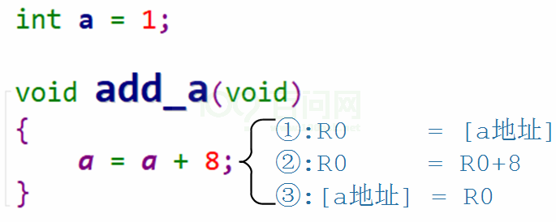

我们想让任务A、B都执行add_a函数，a的最终结果是1+8+8=17。

假设任务A运行完代码①，在执行代码②之前被任务B抢占了：现在任务A的R0等于1。

任务B执行完add_a函数，a等于9。

任务A继续运行，在代码②处R0仍然是被抢占前的数值1，执行完②③的代码，a等于9，这跟预期的17不符合。

- 对变量的非原子化访问

修改变量、设置结构体、在16位的机器上写32位的变量，这些操作都是非原子的。也就是它们的操作过程都可能被打断，如果被打断的过程有其他任务来操作这些变量，就可能导致冲突。

- 函数重入

"可重入的函数"是指：多个任务同时调用它、任务和中断同时调用它，函数的运行也是安全的。可重入的函数也被称为"线程安全"(thread safe)。

每个任务都维持自己的栈、自己的CPU寄存器，如果一个函数只使用局部变量，那么它就是线程安全的。

函数中一旦使用了全局变量、静态变量、其他外设，它就不是"可重入的"，如果该函数正在被调用，就必须阻止其他任务、中断再次调用它。

上述问题的解决方法是：任务A访问这些全局变量、函数代码时，独占它，就是上个锁。这些全局变量、函数代码必须被独占地使用，它们被称为临界资源。

互斥量也被称为互斥锁，使用过程如下：

- 互斥量初始值为1
- 任务A想访问临界资源，先获得并占有互斥量，然后开始访问
- 任务B也想访问临界资源，也要先获得互斥量：被别人占有了，于是阻塞
- 任务A使用完毕，释放互斥量；任务B被唤醒、得到并占有互斥量，然后开始访问临界资源
- 任务B使用完毕，释放互斥量

正常来说：在任务A占有互斥量的过程中，任务B、任务C等等，都无法释放互斥量。
但是FreeRTOS未实现这点：任务A占有互斥量的情况下，任务B也可释放互斥量。

### 12.2 互斥量函数
#### 12.2.1 创建

互斥量是一种特殊的二进制信号量。

使用互斥量时，先创建、然后去获得、释放它。使用句柄来表示一个互斥量。

创建互斥量的函数有2种：动态分配内存，静态分配内存，函数原型如下：

```c
/* 创建一个互斥量，返回它的句柄。
 * 此函数内部会分配互斥量结构体
 * 返回值: 返回句柄，非NULL表示成功
 */
SemaphoreHandle_t xSemaphoreCreateMutex( void );

/* 创建一个互斥量，返回它的句柄。
 * 此函数无需动态分配内存，所以需要先有一个StaticSemaphore_t结构体，并传入它的指针
 * 返回值: 返回句柄，非NULL表示成功
 */
SemaphoreHandle_t xSemaphoreCreateMutexStatic( StaticSemaphore_t *pxMutexBuffer );
```

要想使用互斥量，需要在配置文件FreeRTOSConfig.h中定义：

```c
#define configUSE_MUTEXES 1
```

#### 12.2.2 其他函数

要注意的是，互斥量不能在ISR中使用。

各类操作函数，比如删除、give/take，跟一般是信号量是一样的。

```c
/*
 * xSemaphore: 信号量句柄，你要删除哪个信号量, 互斥量也是一种信号量
 */
void vSemaphoreDelete( SemaphoreHandle_t xSemaphore );

/* 释放 */
BaseType_t xSemaphoreGive( SemaphoreHandle_t xSemaphore );


/* 获得 */
BaseType_t xSemaphoreTake(
                   SemaphoreHandle_t xSemaphore,
                   TickType_t xTicksToWait
               );
```

### 12.3 示例: 优先级继承

本节代码为：22_mutex_priority_inversion，主要看nwatch\game2.c。

12章12.5示例的问题在于，car1低优先级任务获得了锁，但是它优先级太低而无法运行。

如果能提升car1任务的优先级，让它能尽快运行、释放锁，"优先级反转"的问题不就解决了吗？

把car1任务的优先级提升到什么水平？car3也想获得同一个互斥锁，不成功而阻塞时，它会把car1的优先级提升得跟car3一样。


这就是优先级继承：

- 假设持有互斥锁的是任务A，如果更高优先级的任务B也尝试获得这个锁
- 任务B说：你既然持有宝剑，又不给我，那就继承我的愿望吧
- 于是任务A就继承了任务B的优先级
- 这就叫：优先级继承
- 等任务A释放互斥锁时，它就恢复为原来的优先级
- 互斥锁内部就实现了优先级的提升、恢复


在22_mutex_priority_inversion里，创建的是互斥量，代码如下：

```c
259 void car_game(void)

260 {

261	int x;

262	int i, j;

263	g_framebuffer = LCD_GetFrameBuffer(&g_xres, &g_yres, &g_bpp);

264	draw_init();

265	draw_end();

267

268	//g_xSemTicks = xSemaphoreCreateCounting(1, 1);

269	g_xSemTicks = xSemaphoreCreateMutex();
```

把第268行打开、第269行去掉，就会有优先级反转的问题。

把第268行去掉、第269行打开，就解决了优先级反转的问题。

22_mutex_priority_inversion的实验现象为：car1先运行一会；然后car2运行一会；接着car3任务启动，但是它无法获得互斥量而阻塞，并且提升了car1的优先级；于是：car1、car2交替运行（虽然car1的优先级高于car2，但是car1会使用vTaskDelay阻塞，car2就有机会运行了）；当car1运行到终点，是否了互斥量，car3就可以运行了。

### 12.4 递归锁

#### 12.4.1 死锁的概念

日常生活的死锁：我们只招有工作经验的人！我没有工作经验怎么办？那你就去找工作啊！

假设有2个互斥量M1、M2，2个任务A、B：

- A获得了互斥量M1
- B获得了互斥量M2
- A还要获得互斥量M2才能运行，结果A阻塞
- B还要获得互斥量M1才能运行，结果B阻塞
- A、B都阻塞，再无法释放它们持有的互斥量
- 死锁发生！

#### 12.4.2 自我死锁

假设这样的场景：

- 任务A获得了互斥锁M
- 它调用一个库函数
- 库函数要去获取同一个互斥锁M，于是它阻塞：任务A休眠，等待任务A来释放互斥锁！
- 死锁发生！

#### 12.4.3 函数

怎么解决这类问题？可以使用递归锁(Recursive Mutexes)，它的特性如下：

- 任务A获得递归锁M后，它还可以多次去获得这个锁
-  "take"了N次，要"give"N次，这个锁才会被释放

递归锁的函数根一般互斥量的函数名不一样，参数类型一样，列表如下：

|      | **递归锁**                     | **一般互斥量**        |
| ---- | ------------------------------ | --------------------- |
| 创建 | xSemaphoreCreateRecursiveMutex | xSemaphoreCreateMutex |
| 获得 | xSemaphoreTakeRecursive        | xSemaphoreTake        |
| 释放 | xSemaphoreGiveRecursive        | xSemaphoreGive        |

函数原型如下：

```c
/* 创建一个递归锁，返回它的句柄。*

 * 此函数内部会分配互斥量结构体*

 * 返回值: 返回句柄，非NULL表示成功*

 */

SemaphoreHandle_t xSemaphoreCreateRecursiveMutex( void );

*/ 释放 */

BaseType_t xSemaphoreGiveRecursive( SemaphoreHandle_t xSemaphore );

*/ 获得 */

BaseType_t xSemaphoreTakeRecursive(

         SemaphoreHandle_t xSemaphore,

         TickType_t xTicksToWait

        );
```

### 12.5 常见问题

使用互斥量的两个任务是相同优先级时的注意事项。

---

## 第13章 事件组(event group)

学校组织秋游，组长在等待：

- 张三：我到了
- 李四：我到了
- 王五：我到了
- 组长说：好，大家都到齐了，出发！

秋游回来第二天就要提交一篇心得报告，组长在焦急等待：张三、李四、王五谁先写好就交谁的。

在这个日常生活场景中：

- 出发：要等待这3个人都到齐，他们是"与"的关系
- 交报告：只需等待这3人中的任何一个，他们是"或"的关系

在FreeRTOS中，可以使用事件组(event group)来解决这些问题。

本章涉及如下内容：

- 事件组的概念与操作函数
- 事件组的优缺点
- 怎么设置、等待、清除事件组中的位
- 使用事件组来同步多个任务

### 13.1 事件组概念与操作

#### 13.1.1 事件组的概念

事件组可以简单地认为就是一个整数：

- 的每一位表示一个事件
- 每一位事件的含义由程序员决定，比如：Bit0表示用来串口是否就绪，Bit1表示按键是否被按下
- 这些位，值为1表示事件发生了，值为0表示事件没发生
- 一个或多个任务、ISR都可以去写这些位；一个或多个任务、ISR都可以去读这些位
- 可以等待某一位、某些位中的任意一个，也可以等待多位

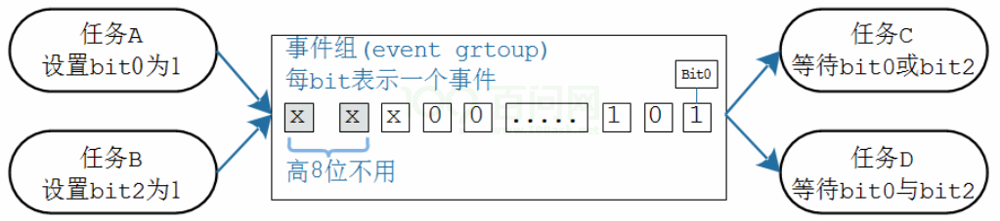

事件组用一个整数来表示，其中的高8位留给内核使用，只能用其他的位来表示事件。那么这个整数是多少位的？

- 如果configUSE_16_BIT_TICKS是1，那么这个整数就是16位的，低8位用来表示事件
- 如果configUSE_16_BIT_TICKS是0，那么这个整数就是32位的，低24位用来表示事件
- configUSE_16_BIT_TICKS是用来表示Tick Count的，怎么会影响事件组？这只是基于效率来考虑
  - 如果configUSE_16_BIT_TICKS是1，就表示该处理器使用16位更高效，所以事件组也使用16位
  - 如果configUSE_16_BIT_TICKS是0，就表示该处理器使用32位更高效，所以事件组也使用32位

#### 13.1.2 事件组的操作

事件组和队列、信号量等不太一样，主要集中在2个地方：

- 唤醒谁？
  - 队列、信号量：事件发生时，只会唤醒一个任务
  - 事件组：事件发生时，会唤醒所有符号条件的任务，简单地说它有"广播"的作用
- 是否清除事件？
  - 队列、信号量：是消耗型的资源，队列的数据被读走就没了；信号量被获取后就减少了
  - 事件组：被唤醒的任务有两个选择，可以让事件保留不动，也可以清除事件

以上图为列，事件组的常规操作如下：

- 先创建事件组
- 任务C、D等待事件：
  - 等待什么事件？可以等待某一位、某些位中的任意一个，也可以等待多位。简单地说就是"或"、"与"的关系。
  - 得到事件时，要不要清除？可选择清除、不清除。
- 任务A、B产生事件：设置事件组里的某一位、某些位

### 13.2 事件组函数

#### 13.2.1 创建

使用事件组之前，要先创建，得到一个句柄；使用事件组时，要使用句柄来表明使用哪个事件组。

有两种创建方法：动态分配内存、静态分配内存。函数原型如下：

```c
/* 创建一个事件组，返回它的句柄。
 * 此函数内部会分配事件组结构体
 * 返回值: 返回句柄，非NULL表示成功
 */
EventGroupHandle_t xEventGroupCreate( void );

/* 创建一个事件组，返回它的句柄。
 * 此函数无需动态分配内存，所以需要先有一个StaticEventGroup_t结构体，并传入它的指针
 * 返回值: 返回句柄，非NULL表示成功
 */
EventGroupHandle_t xEventGroupCreateStatic( StaticEventGroup_t * pxEventGroupBuffer );
```

#### 13.2.2 删除

对于动态创建的事件组，不再需要它们时，可以删除它们以回收内存。

**vEventGroupDelete**可以用来删除事件组，函数原型如下：

```c
/*
 * xEventGroup: 事件组句柄，你要删除哪个事件组
 */
void vEventGroupDelete( EventGroupHandle_t xEventGroup )
```

#### 13.2.3 设置事件

可以设置事件组的某个位、某些位，使用的函数有2个：

- 在任务中使用**xEventGroupSetBits()**
- 在ISR中使用**xEventGroupSetBitsFromISR()**

有一个或多个任务在等待事件，如果这些事件符合这些任务的期望，那么任务还会被唤醒。

函数原型如下：

```c
/* 设置事件组中的位
 * xEventGroup: 哪个事件组
 * uxBitsToSet: 设置哪些位?
 *              如果uxBitsToSet的bitX, bitY为1, 那么事件组中的bitX, bitY被设置为1
 *              可以用来设置多个位，比如 0x15 就表示设置bit4, bit2, bit0
 * 返回值: 返回原来的事件值(没什么意义, 因为很可能已经被其他任务修改了)
 */
EventBits_t xEventGroupSetBits( EventGroupHandle_t xEventGroup,
                                    const EventBits_t uxBitsToSet );

/* 设置事件组中的位
 * xEventGroup: 哪个事件组
 * uxBitsToSet: 设置哪些位?
 *              如果uxBitsToSet的bitX, bitY为1, 那么事件组中的bitX, bitY被设置为1
 *              可以用来设置多个位，比如 0x15 就表示设置bit4, bit2, bit0
 * pxHigherPriorityTaskWoken: 有没有导致更高优先级的任务进入就绪态? pdTRUE-有, pdFALSE-没有
 * 返回值: pdPASS-成功, pdFALSE-失败
 */
BaseType_t xEventGroupSetBitsFromISR( EventGroupHandle_t xEventGroup,
									  const EventBits_t uxBitsToSet,
									  BaseType_t * pxHigherPriorityTaskWoken );
```

值得注意的是，ISR中的函数，比如队列函数**xQueueSendToBackFromISR**、信号量函数**xSemaphoreGiveFromISR**，它们会唤醒某个任务，最多只会唤醒1个任务。

但是设置事件组时，有可能导致多个任务被唤醒，这会带来很大的不确定性。所以**xEventGroupSetBitsFromISR**函数不是直接去设置事件组，而是给一个FreeRTOS后台任务(daemon task)发送队列数据，由这个任务来设置事件组。

如果后台任务的优先级比当前被中断的任务优先级高，**xEventGroupSetBitsFromISR**会设置**pxHigherPriorityTaskWoken**为pdTRUE。

如果daemon task成功地把队列数据发送给了后台任务，那么**xEventGroupSetBitsFromISR**的返回值就是pdPASS。

#### 13.2.4 等待事件

使用**xEventGroupWaitBits**来等待事件，可以等待某一位、某些位中的任意一个，也可以等待多位；等到期望的事件后，还可以清除某些位。

函数原型如下：

```c
EventBits_t xEventGroupWaitBits( EventGroupHandle_t xEventGroup,
                                 const EventBits_t uxBitsToWaitFor,
                                 const BaseType_t xClearOnExit,
                                 const BaseType_t xWaitForAllBits,
                                 TickType_t xTicksToWait );
```

先引入一个概念：unblock condition。一个任务在等待事件发生时，它处于阻塞状态；当期望的时间发生时，这个状态就叫"unblock condition"，非阻塞条件，或称为"非阻塞条件成立"；当"非阻塞条件成立"后，该任务就可以变为就绪态。

函数参数说明列表如下：

|    **参数**     | **说明**                                                     |
| :-------------: | :----------------------------------------------------------- |
|   xEventGroup   | 等待哪个事件组？                                             |
| uxBitsToWaitFor | 等待哪些位？哪些位要被测试？                                 |
| xWaitForAllBits | 怎么测试？是"AND"还是"OR"？ pdTRUE: 等待的位，全部为1; pdFALSE: 等待的位，某一个为1即可 |
|  xClearOnExit   | 函数提出前是否要清除事件？ pdTRUE: 清除uxBitsToWaitFor指定的位 pdFALSE: 不清除 |
|  xTicksToWait   | 如果期待的事件未发生，阻塞多久。 可以设置为0：判断后即刻返回； 可设置为portMAX_DELAY：一定等到成功才返回； 可以设置为期望的Tick Count，一般用*pdMS_TO_TICKS()*把ms转换为Tick Count |
|     返回值      | 返回的是事件值， 如果期待的事件发生了，返回的是"非阻塞条件成立"时的事件值； 如果是超时退出，返回的是超时时刻的事件值。 |

举例如下：

| 事件组的值 | uxBitsToWaitFor | xWaitForAllBits | 说明                                                         |
| :--------: | :-------------: | :-------------: | :----------------------------------------------------------- |
|    0100    |      0101       |     pdTRUE      | 任务期望bit0,bit2都为1， 当前值只有bit2满足，任务进入阻塞态； 当事件组中bit0,bit2都为1时退出阻塞态 |
|    0100    |      0110       |     pdFALSE     | 任务期望bit0,bit2某一个为1， 当前值满足，所以任务成功退出    |
|    0100    |      0110       |     pdTRUE      | 任务期望bit1,bit2都为1， 当前值不满足，任务进入阻塞态； 当事件组中bit1,bit2都为1时退出阻塞态 |

你可以使用*xEventGroupWaitBits()*等待期望的事件，它发生之后再使用*xEventGroupClearBits()*来清除。但是这两个函数之间，有可能被其他任务或中断抢占，它们可能会修改事件组。

可以使用设置*xClearOnExit*为pdTRUE，使得对事件组的测试、清零都在*xEventGroupWaitBits()*函数内部完成，这是一个原子操作。

#### 13.2.5 同步点

有一个事情需要多个任务协同，比如：

- 任务A：炒菜
- 任务B：买酒
- 任务C：摆台
- A、B、C做好自己的事后，还要等别人做完；大家一起做完，才可开饭

使用 **xEventGroupSync()** 函数可以同步多个任务：

- 可以设置某位、某些位，表示自己做了什么事
- 可以等待某位、某些位，表示要等等其他任务
- 期望的时间发生后， **xEventGroupSync()** 才会成功返回。
- **xEventGroupSync**成功返回后，会清除事件

**xEventGroupSync** 函数原型如下：

```
EventBits_t xEventGroupSync(    EventGroupHandle_t xEventGroup,
                                const EventBits_t uxBitsToSet,
                                const EventBits_t uxBitsToWaitFor,
                                TickType_t xTicksToWait );
```

 参数列表如下：

|    **参数**     | **说明**                                                     |
| :-------------: | ------------------------------------------------------------ |
|   xEventGroup   | 哪个事件组？                                                 |
|   uxBitsToSet   | 要设置哪些事件？我完成了哪些事件？ 比如0x05(二进制为0101)会导致事件组的bit0,bit2被设置为1 |
| uxBitsToWaitFor | 等待那个位、哪些位？ 比如0x15(二级制10101)，表示要等待bit0,bit2,bit4都为1 |
|  xTicksToWait   | 如果期待的事件未发生，阻塞多久。 可以设置为0：判断后即刻返回； 可设置为portMAX_DELAY：一定等到成功才返回； 可以设置为期望的Tick Count，一般用*pdMS_TO_TICKS()*把ms转换为Tick Count |
|     返回值      | 返回的是事件值， 如果期待的事件发生了，返回的是"非阻塞条件成立"时的事件值； 如果是超时退出，返回的是超时时刻的事件值。 |

参数列表如下：

|    **参数**     | **说明**                                                     |
| :-------------: | :----------------------------------------------------------- |
|   xEventGroup   | 哪个事件组？                                                 |
|   uxBitsToSet   | 要设置哪些事件？我完成了哪些事件？ 比如0x05(二进制为0101)会导致事件组的bit0,bit2被设置为1 |
| uxBitsToWaitFor | 等待那个位、哪些位？ 比如0x15(二级制10101)，表示要等待bit0,bit2,bit4都为1 |
|  xTicksToWait   | 如果期待的事件未发生，阻塞多久。 可以设置为0：判断后即刻返回； 可设置为portMAX_DELAY：一定等到成功才返回； 可以设置为期望的Tick Count，一般用*pdMS_TO_TICKS()*把ms转换为Tick Count |
|     返回值      | 返回的是事件值， 如果期待的事件发生了，返回的是"非阻塞条件成立"时的事件值； 如果是超时退出，返回的是超时时刻的事件值。 |

###  13.3 示例: 广播

本节代码为：23_eventgroup_broadcast，主要看nwatch\game2.c。

car1运行到终点后，会设置bit0事件；car2、car3都等待bit0事件。car1设置bit0事件时，会通知到car2、car3，这就是一个广播作用。

创建事件组，代码如下：

```c
265 void car_game(void)

266 {

267	int x;

268	int i, j;

269	g_framebuffer = LCD_GetFrameBuffer(&g_xres, &g_yres, &g_bpp);

270	draw_init();

271	draw_end();

272

273	//g_xSemTicks = xSemaphoreCreateCounting(1, 1);

274	//g_xSemTicks = xSemaphoreCreateMutex();

275	g_xEventCar = xEventGroupCreate();
```

第275行，创建了一个事件组。

car2等待事件，代码如下（car3的代码是一样的）：

```c
165  /* 等待事件:bit0 */

166   xEventGroupWaitBits(g_xEventCar, (1<<0), pdTRUE, pdFALSE, portMAX_DELAY);
```

car1运行到终点后，设置事件，代码如下：

```c
139  /* 设置事件组: bit0 */

140  xEventGroupSetBits(g_xEventCar, (1<<0));

141   vTaskDelete(NULL);
```

实验现象：car1运行到终点后，car2、car3同时启动。

### 13.4 示例: 等待任意一个事件

本节代码为：24_eventgroup_or，主要看nwatch\game2.c。

使用遥控器控制car1、car2。car1运行到终点后，会设置bit0事件；car2运行到终点后，会设置bit1事件；car3等待bit0、bit1的任意一个事件

car1运行到终点后，设置事件，代码如下：

```c
139  	/* 设置事件组: bit0 */

140		xEventGroupSetBits(g_xEventCar, (1<<0));

141		vTaskDelete(NULL);
```

car2运行到终点后，设置事件，代码如下：

```c
199 	/* 设置事件组: bit1 */

200		xEventGroupSetBits(g_xEventCar, (1<<1));
```

car3等待bit0、bit1事件，实验“或”的关系（倒数第2个参数），代码如下：

```c
228  /* 等待事件:bit0 or bit1 */

229  xEventGroupWaitBits(g_xEventCar, (1<<0)|(1<<1), pdTRUE, pdFALSE, portMAX_DELAY);
```

实验现象：实验遥控器的1、2控制car1、car2，它们任何一个到了终点，car3就会启动。

### 13.5 示例: 等待多个事件都发生

本节代码为：25_eventgroup_and，主要看nwatch\game2.c。

使用遥控器控制car1、car2。car1运行到终点后，会设置bit0事件；car2运行到终点后，会设置bit1事件；car3等待bit0、bit1的所有事件

跟1302_eventgroup_or相比，只是car3的代码发生了变化。car3等待bit0、bit1事件，实验“与”的关系（倒数第2个参数），代码如下：

```c
225   /* 等待事件:bit0 or bit1 */

226   xEventGroupWaitBits(g_xEventCar, (1<<0)|(1<<1), pdTRUE, pdTRUE, portMAX_DELAY);
```

实验现象：实验遥控器的1、2控制car1、car2，它们都到达终点后，car3才会启动。

---

## 第14章 任务通知(Task Notifications)

所谓"任务通知"，你可以反过来读"通知任务"。

我们使用队列、信号量、事件组等等方法时，并不知道对方是谁。使用任务通知时，可以明确指定：通知哪个任务。

使用队列、信号量、事件组时，我们都要事先创建对应的结构体，双方通过中间的结构体通信：

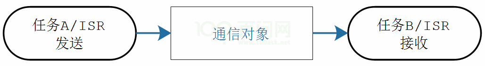

使用任务通知时，任务结构体TCB中就包含了内部对象，可以直接接收别人发过来的"通知"：

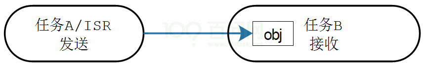

本章涉及如下内容：

- 任务通知：通知状态、通知值
- 任务通知的使用场合
- 任务通知的优势

### 14.1 任务通知的特性

#### 14.1.1 优势及限制

任务通知的优势：

- 效率更高：使用任务通知来发送事件、数据给某个任务时，效率更高。比队列、信号量、事件组都有大的优势。
- 更节省内存：使用其他方法时都要先创建对应的结构体，使用任务通知时无需额外创建结构体。

任务通知的限制：

- 不能发送数据给ISR：
- ISR并没有任务结构体，所以无法使用任务通知的功能给ISR发送数据。但是ISR可以使用任务通知的功能，发数据给任务。
- 数据只能给该任务独享
- 使用队列、信号量、事件组时，数据保存在这些结构体中，其他任务、ISR都可以访问这些数据。使用任务通知时，数据存放入目标任务中，只有它可以访问这些数据。
- 在日常工作中，这个限制影响不大。因为很多场合是从多个数据源把数据发给某个任务，而不是把一个数据源的数据发给多个任务。
- 无法缓冲数据
- 使用队列时，假设队列深度为N，那么它可以保持N个数据。
- 使用任务通知时，任务结构体中只有一个任务通知值，只能保持一个数据。
- 无法广播给多个任务
- 使用事件组可以同时给多个任务发送事件。
- 使用任务通知，只能发个一个任务。
- 如果发送受阻，发送方无法进入阻塞状态等待
- 假设队列已经满了，使用 **xQueueSendToBack()** 给队列发送数据时，任务可以进入阻塞状态等待发送完成。
- 使用任务通知时，即使对方无法接收数据，发送方也无法阻塞等待，只能即刻返回错误。

#### 14.1.2 通知状态和通知值

每个任务都有一个结构体：TCB(Task Control Block)，里面有2个成员：

- 一个是uint8_t类型，用来表示通知状态
- 一个是uint32_t类型，用来表示通知值

```c
typedef struct tskTaskControlBlock
{
    ......
    /* configTASK_NOTIFICATION_ARRAY_ENTRIES = 1 */
    volatile uint32_t ulNotifiedValue[ configTASK_NOTIFICATION_ARRAY_ENTRIES ];
    volatile uint8_t ucNotifyState[ configTASK_NOTIFICATION_ARRAY_ENTRIES ];
    ......
} tskTCB;
```

通知状态有3种取值：

- taskNOT_WAITING_NOTIFICATION：任务没有在等待通知
- taskWAITING_NOTIFICATION：任务在等待通知
- taskNOTIFICATION_RECEIVED：任务接收到了通知，也被称为pending(有数据了，待处理)

```c
##define taskNOT_WAITING_NOTIFICATION              ( ( uint8_t ) 0 )  /* 也是初始状态 */
##define taskWAITING_NOTIFICATION                  ( ( uint8_t ) 1 )
##define taskNOTIFICATION_RECEIVED                 ( ( uint8_t ) 2 )
```

通知值可以有很多种类型：

- 计数值
- 位(类似事件组)
- 任意数值

### 14.2 任务通知的使用

使用任务通知，可以实现轻量级的队列(长度为1)、邮箱(覆盖的队列)、计数型信号量、二进制信号量、事件组。

#### 14.2.1 两类函数

任务通知有2套函数，简化版、专业版，列表如下：

- 简化版函数的使用比较简单，它实际上也是使用专业版函数实现的
- 专业版函数支持很多参数，可以实现很多功能

|          | 简化版                                 | 专业版                         |
| -------- | -------------------------------------- | ------------------------------ |
| 发出通知 | xTaskNotifyGive vTaskNotifyGiveFromISR | xTaskNotify xTaskNotifyFromISR |
| 取出通知 | ulTaskNotifyTake                       | xTaskNotifyWait                |

#### 14.2.2 xTaskNotifyGive/ulTaskNotifyTake

在任务中使用xTaskNotifyGive函数，在ISR中使用vTaskNotifyGiveFromISR函数，都是直接给其他任务发送通知：

- 使得通知值加一
- 并使得通知状态变为"pending"，也就是**taskNOTIFICATION_RECEIVED**，表示有数据了、待处理

可以使用ulTaskNotifyTake函数来取出通知值：

- 如果通知值等于0，则阻塞(可以指定超时时间)
- 当通知值大于0时，任务从阻塞态进入就绪态
- 在ulTaskNotifyTake返回之前，还可以做些清理工作：把通知值减一，或者把通知值清零

使用ulTaskNotifyTake函数可以实现轻量级的、高效的二进制信号量、计数型信号量。

这几个函数的原型如下：

```c
BaseType_t xTaskNotifyGive( TaskHandle_t xTaskToNotify );

void vTaskNotifyGiveFromISR( TaskHandle_t xTaskHandle, BaseType_t *pxHigherPriorityTaskWoken );

uint32_t ulTaskNotifyTake( BaseType_t xClearCountOnExit, TickType_t xTicksToWait );
```

xTaskNotifyGive函数的参数说明如下：

|   **参数**    | **说明**                                   |
| :-----------: | ------------------------------------------ |
| xTaskToNotify | 任务句柄(创建任务时得到)，给哪个任务发通知 |
|    返回值     | 必定返回pdPASS                             |

vTaskNotifyGiveFromISR函数的参数说明如下：

|         **参数**          | **说明**                                                     |
| :-----------------------: | ------------------------------------------------------------ |
|        xTaskHandle        | 任务句柄(创建任务时得到)，给哪个任务发通知                   |
| pxHigherPriorityTaskWoken | 被通知的任务，可能正处于阻塞状态。 此函数发出通知后，会把它从阻塞状态切换为就绪态。 如果被唤醒的任务的优先级，高于当前任务的优先级， 则"*pxHigherPriorityTaskWoken"被设置为pdTRUE， 这表示在中断返回之前要进行任务切换。 |

ulTaskNotifyTake函数的参数说明如下：

|     **参数**      | **说明**                                                     |
| :---------------: | ------------------------------------------------------------ |
| xClearCountOnExit | 函数返回前是否清零： pdTRUE：把通知值清零 pdFALSE：如果通知值大于0，则把通知值减一 |
|   xTicksToWait    | 任务进入阻塞态的超时时间，它在等待通知值大于0。 0：不等待，即刻返回； portMAX_DELAY：一直等待，直到通知值大于0； 其他值：Tick Count，可以用*pdMS_TO_TICKS()*把ms转换为Tick Count |
|      返回值       | 函数返回之前，在清零或减一之前的通知值。 如果xTicksToWait非0，则返回值有2种情况： 1. 大于0：在超时前，通知值被增加了 2. 等于0：一直没有其他任务增加通知值，最后超时返回0 |

#### 14.2.3 xTaskNotify/xTaskNotifyWait

**xTaskNotify** 函数功能更强大，可以使用不同参数实现各类功能，比如：

- 让接收任务的通知值加一：这时 **xTaskNotify()** 等同于 **xTaskNotifyGive()**
- 设置接收任务的通知值的某一位、某些位，这就是一个轻量级的、更高效的事件组
- 把一个新值写入接收任务的通知值：上一次的通知值被读走后，写入才成功。这就是轻量级的、长度为1的队列
- 用一个新值覆盖接收任务的通知值：无论上一次的通知值是否被读走，覆盖都成功。类似 **xQueueOverwrite()** 函数，这就是轻量级的邮箱。

**xTaskNotify()** 比 **xTaskNotifyGive()** 更灵活、强大，使用上也就更复杂。**xTaskNotifyFromISR()** 是它对应的ISR版本。

这两个函数用来发出任务通知，使用哪个函数来取出任务通知呢？

使用 **xTaskNotifyWait()** 函数！它比 **ulTaskNotifyTake()** 更复杂：

- 可以让任务等待(可以加上超时时间)，等到任务状态为"pending"(也就是有数据)
- 还可以在函数进入、退出时，清除通知值的指定位

这几个函数的原型如下：

```c
BaseType_t xTaskNotify( TaskHandle_t xTaskToNotify, uint32_t ulValue, eNotifyAction eAction );

BaseType_t xTaskNotifyFromISR( TaskHandle_t xTaskToNotify,
                               uint32_t ulValue,
                               eNotifyAction eAction,
                               BaseType_t *pxHigherPriorityTaskWoken );

BaseType_t xTaskNotifyWait( uint32_t ulBitsToClearOnEntry,
                            uint32_t ulBitsToClearOnExit,
                            uint32_t *pulNotificationValue,
                            TickType_t xTicksToWait );
```

xTaskNotify函数的参数说明如下：

|   **参数**    | **说明**                                                     |
| :-----------: | ------------------------------------------------------------ |
| xTaskToNotify | 任务句柄(创建任务时得到)，给哪个任务发通知                   |
|    ulValue    | 怎么使用ulValue，由eAction参数决定                           |
|    eAction    | 见下表                                                       |
|    返回值     | pdPASS：成功，大部分调用都会成功 pdFAIL：只有一种情况会失败，当eAction为eSetValueWithoutOverwrite，  并且通知状态为"pending"(表示有新数据未读)，这时就会失败。 |

eNotifyAction参数说明：

|   **eNotifyAction取值**   | **说明**                                                     |
| :-----------------------: | ------------------------------------------------------------ |
|         eNoAction         | 仅仅是更新通知状态为"pending"，未使用ulValue。 这个选项相当于轻量级的、更高效的二进制信号量。 |
|         eSetBits          | 通知值 = 原来的通知值 \| ulValue，按位或。 相当于轻量级的、更高效的事件组。 |
|        eIncrement         | 通知值 = 原来的通知值 + 1，未使用ulValue。 相当于轻量级的、更高效的二进制信号量、计数型信号量。 相当于**xTaskNotifyGive()**函数。 |
| eSetValueWithoutOverwrite | 不覆盖。 如果通知状态为"pending"(表示有数据未读)， 则此次调用xTaskNotify不做任何事，返回pdFAIL。 如果通知状态不是"pending"(表示没有新数据)， 则：通知值 = ulValue。 |
|  eSetValueWithOverwrite   | 覆盖。 无论如何，不管通知状态是否为"pendng"， 通知值 = ulValue。 |

xTaskNotifyFromISR函数跟xTaskNotify很类似，就多了最后一个参数**pxHigherPriorityTaskWoken**。在很多ISR函数中，这个参数的作用都是类似的，使用场景如下：

- 被通知的任务，可能正处于阻塞状态
- **xTaskNotifyFromISR**函数发出通知后，会把接收任务从阻塞状态切换为就绪态
- 如果被唤醒的任务的优先级，高于当前任务的优先级，则"*pxHigherPriorityTaskWoken"被设置为pdTRUE，这表示在中断返回之前要进行任务切换。

xTaskNotifyWait函数列表如下：

|       **参数**       | **说明**                                                     |
| :------------------: | ------------------------------------------------------------ |
| ulBitsToClearOnEntry | 在xTaskNotifyWait入口处，要清除通知值的哪些位？ 通知状态不是"pending"的情况下，才会清除。 它的本意是：我想等待某些事件发生，所以先把"旧数据"的某些位清零。 能清零的话：通知值 = 通知值 & ~(ulBitsToClearOnEntry)。 比如传入0x01，表示清除通知值的bit0； 传入0xffffffff即ULONG_MAX，表示清除所有位，即把值设置为0 |
| ulBitsToClearOnExit  | 在xTaskNotifyWait出口处，如果不是因为超时推出，而是因为得到了数据而退出时： 通知值 = 通知值 & ~(ulBitsToClearOnExit)。 在清除某些位之前，通知值先被赋给"*pulNotificationValue"。 比如入0x03，表示清除通知值的bit0、bit1； 传入0xffffffff即ULONG_MAX，表示清除所有位，即把值设置为0 |
| pulNotificationValue | 用来取出通知值。 在函数退出时，使用ulBitsToClearOnExit清除之前，把通知值赋给"*pulNotificationValue"。 如果不需要取出通知值，可以设为NULL。 |
|     xTicksToWait     | 任务进入阻塞态的超时时间，它在等待通知状态变为"pending"。 0：不等待，即刻返回； portMAX_DELAY：一直等待，直到通知状态变为"pending"； 其他值：Tick Count，可以用*pdMS_TO_TICKS()*把ms转换为Tick Count |
|        返回值        | 1. pdPASS：成功 这表示xTaskNotifyWait成功获得了通知： 可能是调用函数之前，通知状态就是"pending"； 也可能是在阻塞期间，通知状态变为了"pending"。 2. pdFAIL：没有得到通知。 |

### 14.3 示例: 基本操作

本节代码为：27_tasknotification_car_game，主要看nwatch\game2.c。

car1运行到终点后，给car2发送轻量级信号量，给car3发送数值。car2等待轻量级信号量，car3等待特定的通知值。

使用任务通知时，需要知道对方的任务句柄，创建任务时要记录任务句柄，代码如下：

```c
40 static TaskHandle_t g_TaskHandleCar2;

41 static TaskHandle_t g_TaskHandleCar3;

/* 省略 */

315 xTaskCreate(Car1Task, "car1", 128, &g_cars[0], osPriorityNormal, NULL);

316 xTaskCreate(Car2Task, "car2", 128, &g_cars[1], osPriorityNormal+2, &g_TaskHandleCar2);

317 xTaskCreate(Car3Task, "car3", 128, &g_cars[2], osPriorityNormal+2, &g_TaskHandleCar3);
```

car2等待轻量级信号量，代码如下：

```c
176   ulTaskNotifyTake(pdTRUE, portMAX_DELAY);

```

car3等待通知值为100，代码如下：

```c
224   uint32_t val;

/* 省略 */

241   do

242   {

243      xTaskNotifyWait(~0, ~0, &val, portMAX_DELAY);

244  } while (val != 100);
```

car1到达终点后，向car2、car3发出任务通知，代码如下：

```c
145                   /* 发出任务通知给car2,car3 */

146                   xTaskNotifyGive(g_TaskHandleCar2);

147

148                  xTaskNotify(g_TaskHandleCar3, 100, eSetValueWithOverwrite);
```

实验现象：car1到达终点后，car2、car3才会启动。

---

## 第15章 软件定时器(software timer)

软件定时器就是"闹钟"，你可以设置闹钟，

- 在30分钟后让你起床工作
- 每隔1小时让你例行检查机器运行情况

软件定时器也可以完成两类事情：

- 在"未来"某个时间点，运行函数
- 周期性地运行函数

日常生活中我们可以定无数个"闹钟"，这无数的"闹钟"要基于一个真实的闹钟。

在FreeRTOS里，我们也可以设置无数个"软件定时器"，它们都是基于系统滴答中断(Tick Interrupt)。

本章涉及如下内容：

- 软件定时器的特性
- Daemon Task
- 定时器命令队列
- 一次性定时器、周期性定时器的差别
- 怎么操作定时器：创建、启动、复位、修改周期

### 15.1 软件定时器的特性

我们在手机上添加闹钟时，需要指定时间、指定类型(一次性的，还是周期性的)、指定做什么事；还有一些过时的、不再使用的闹钟。如下图所示：

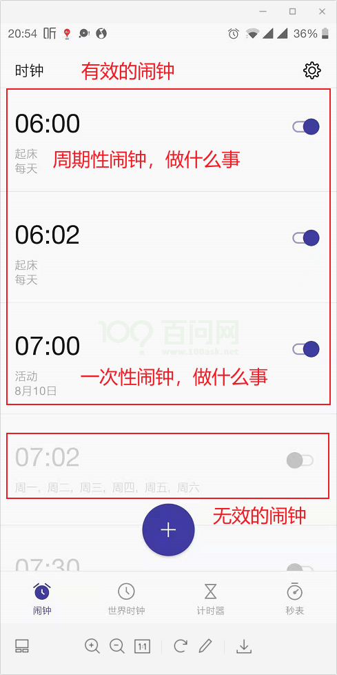

使用定时器跟使用手机闹钟是类似的：

- 指定时间：启动定时器和运行回调函数，两者的间隔被称为定时器的周期(period)。
- 指定类型，定时器有两种类型：
  - 一次性(One-shot timers)：
    这类定时器启动后，它的回调函数只会被调用一次；
    可以手工再次启动它，但是不会自动启动它。
  - 自动加载定时器(Auto-reload timers )：
    这类定时器启动后，时间到之后它会自动启动它；
    这使得回调函数被周期性地调用。
- 指定要做什么事，就是指定回调函数

实际的闹钟分为：有效、无效两类。软件定时器也是类似的，它由两种状态：

- 运行(Running、Active)：运行态的定时器，当指定时间到达之后，它的回调函数会被调用
- 冬眠(Dormant)：冬眠态的定时器还可以通过句柄来访问它，但是它不再运行，它的回调函数不会被调用

定时器运行情况示例如下：

- Timer1：它是一次性的定时器，在t1启动，周期是6个Tick。经过6个tick后，在t7执行回调函数。它的回调函数只会被执行一次，然后该定时器进入冬眠状态。
- Timer2：它是自动加载的定时器，在t1启动，周期是5个Tick。每经过5个tick它的回调函数都被执行，比如在t6、t11、t16都会执行。

 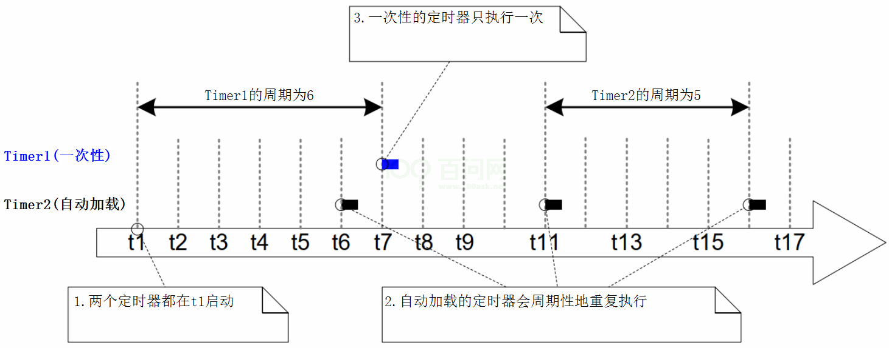

### 15.2 软件定时器的上下文

#### 15.2.1 守护任务

要理解软件定时器API函数的参数，特别是里面的*xTicksToWait*，需要知道定时器执行的过程。

FreeRTOS中有一个Tick中断，软件定时器基于Tick来运行。在哪里执行定时器函数？第一印象就是在Tick中断里执行：

- 在Tick中断中判断定时器是否超时
- 如果超时了，调用它的回调函数

FreeRTOS是RTOS，它不允许在内核、在中断中执行不确定的代码：如果定时器函数很耗时，会影响整个系统。

所以，FreeRTOS中，不在Tick中断中执行定时器函数。

在哪里执行？在某个任务里执行，这个任务就是：RTOS Damemon Task，RTOS守护任务。以前被称为"Timer server"，但是这个任务要做并不仅仅是定时器相关，所以改名为：RTOS Damemon Task。

当FreeRTOS的配置项*configUSE_TIMERS*被设置为1时，在启动调度器时，会自动创建RTOS Damemon Task。

我们自己编写的任务函数要使用定时器时，是通过"定时器命令队列"(timer command queue)和守护任务交互，如下图所示：

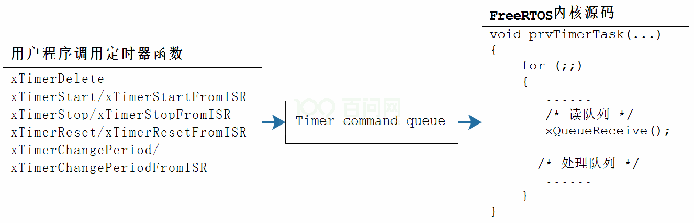

守护任务的优先级为：configTIMER_TASK_PRIORITY；定时器命令队列的长度为configTIMER_QUEUE_LENGTH。

#### 15.2.2 守护任务的调度

守护任务的调度，跟普通的任务并无差别。当守护任务是当前优先级最高的就绪态任务时，它就可以运行。它的工作有两类：

- 处理命令：从命令队列里取出命令、处理
- 执行定时器的回调函数

能否及时处理定时器的命令、能否及时执行定时器的回调函数，严重依赖于守护任务的优先级。下面使用2个例子来演示。

例子1：守护任务的优先性级较低

- t1：Task1处于运行态，守护任务处于阻塞态。
  守护任务在这两种情况下会退出阻塞态切换为就绪态：命令队列中有数据、某个定时器超时了。
  至于守护任务能否马上执行，取决于它的优先级。
- t2：Task1调用 **xTimerStart()**
  要注意的是，**xTimerStart()** 只是把"start timer"的命令发给"定时器命令队列"，使得守护任务退出阻塞态。
  在本例中，Task1的优先级高于守护任务，所以守护任务无法抢占Task1。
- t3：Task1执行完 **xTimerStart()**
  但是定时器的启动工作由守护任务来实现，所以*xTimerStart()*返回并不表示定时器已经被启动了。
- t4：Task1由于某些原因进入阻塞态，现在轮到守护任务运行。
  守护任务从队列中取出"start timer"命令，启动定时器。
- t5：守护任务处理完队列中所有的命令，再次进入阻塞态。Idel任务时优先级最高的就绪态任务，它执行。
- 注意：假设定时器在后续某个时刻tX超时了，超时时间是"tX-t2"，而非"tX-t4"，从 **xTimerStart()** 函数被调用时算起。

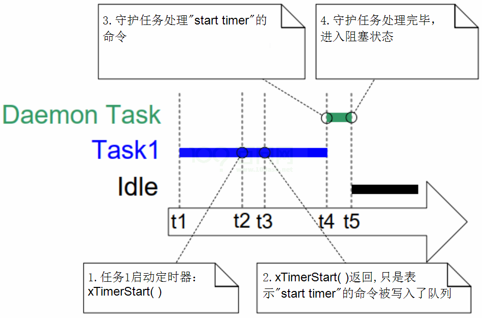

例子2：守护任务的优先性级较高

- t1：Task1处于运行态，守护任务处于阻塞态。
  守护任务在这两种情况下会退出阻塞态切换为就绪态：命令队列中有数据、某个定时器超时了。
  至于守护任务能否马上执行，取决于它的优先级。
- t2：Task1调用*xTimerStart()*
  要注意的是，*xTimerStart()*只是把"start timer"的命令发给"定时器命令队列"，使得守护任务退出阻塞态。
  在本例中，守护任务的优先级高于Task1，所以守护任务抢占Task1，守护任务开始处理命令队列。
  Task1在执行*xTimerStart()*的过程中被抢占，这时它无法完成此函数。

- t3：守护任务处理完命令队列中所有的命令，再次进入阻塞态。
  此时Task1是优先级最高的就绪态任务，它开始执行。
- t4：Task1之前被守护任务抢占，对*xTimerStart()*的调用尚未返回。现在开始继续运行次函数、返回。
- t5：Task1由于某些原因进入阻塞态，进入阻塞态。Idel任务时优先级最高的就绪态任务，它执行。

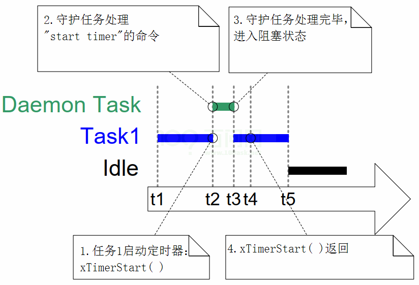

注意，定时器的超时时间是基于调用 **xTimerStart()** 的时刻tX，而不是基于守护任务处理命令的时刻tY。假设超时时间是10个Tick，超时时间是"tX+10"，而非"tY+10"。

#### 15.2.3 回调函数

定时器的回调函数的原型如下：

void ATimerCallback( TimerHandle_t xTimer );

定时器的回调函数是在守护任务中被调用的，守护任务不是专为某个定时器服务的，它还要处理其他定时器。

所以，定时器的回调函数不要影响其他人：

- 回调函数要尽快实行，不能进入阻塞状态
- 不要调用会导致阻塞的API函数，比如 **vTaskDelay()**
- 可以调用 **xQueueReceive()** 之类的函数，但是超时时间要设为0：即刻返回，不可阻塞

### 15.3 软件定时器的函数

根据定时器的状态转换图，就可以知道所涉及的函数：

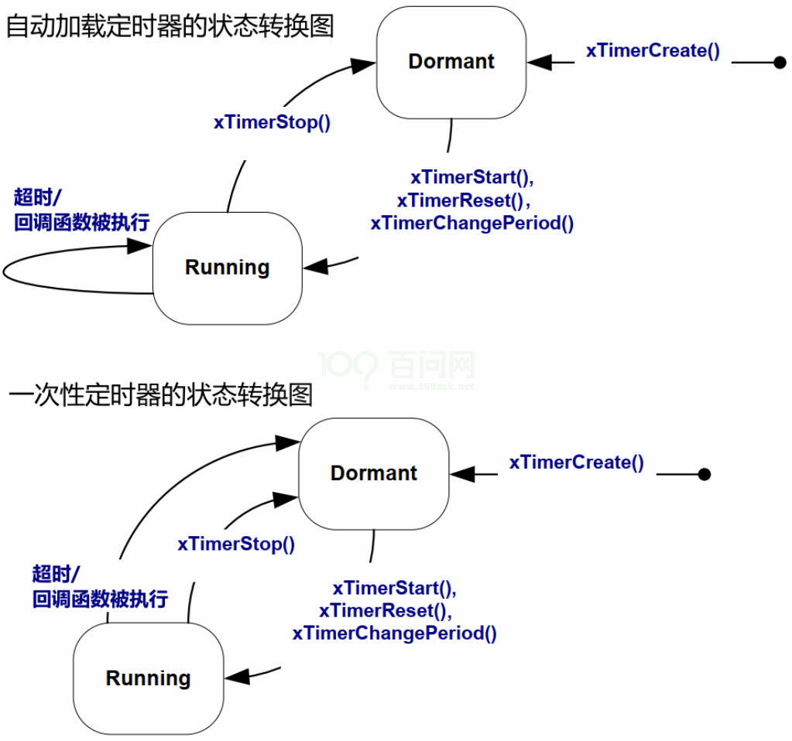

#### 15.3.1 创建

要使用定时器，需要先创建它，得到它的句柄。

有两种方法创建定时器：动态分配内存、静态分配内存。函数原型如下：

```c
/* 使用动态分配内存的方法创建定时器
 * pcTimerName:定时器名字, 用处不大, 尽在调试时用到
 * xTimerPeriodInTicks: 周期, 以Tick为单位
 * uxAutoReload: 类型, pdTRUE表示自动加载, pdFALSE表示一次性
 * pvTimerID: 回调函数可以使用此参数, 比如分辨是哪个定时器
 * pxCallbackFunction: 回调函数
 * 返回值: 成功则返回TimerHandle_t, 否则返回NULL
 */
TimerHandle_t xTimerCreate( const char * const pcTimerName,
							const TickType_t xTimerPeriodInTicks,
							const UBaseType_t uxAutoReload,
							void * const pvTimerID,
							TimerCallbackFunction_t pxCallbackFunction );

/* 使用静态分配内存的方法创建定时器
 * pcTimerName:定时器名字, 用处不大, 尽在调试时用到
 * xTimerPeriodInTicks: 周期, 以Tick为单位
 * uxAutoReload: 类型, pdTRUE表示自动加载, pdFALSE表示一次性
 * pvTimerID: 回调函数可以使用此参数, 比如分辨是哪个定时器
 * pxCallbackFunction: 回调函数
 * pxTimerBuffer: 传入一个StaticTimer_t结构体, 将在上面构造定时器
 * 返回值: 成功则返回TimerHandle_t, 否则返回NULL
 */
TimerHandle_t xTimerCreateStatic(const char * const pcTimerName,
                                 TickType_t xTimerPeriodInTicks,
                                 UBaseType_t uxAutoReload,
                                 void * pvTimerID,
                                 TimerCallbackFunction_t pxCallbackFunction,
                                 StaticTimer_t *pxTimerBuffer );
```

回调函数的类型是：

```c
void ATimerCallback( TimerHandle_t xTimer );

typedef void (* TimerCallbackFunction_t)( TimerHandle_t xTimer );
```

#### 15.3.2 删除

动态分配的定时器，不再需要时可以删除掉以回收内存。删除函数原型如下：

```c
/* 删除定时器
 * xTimer: 要删除哪个定时器
 * xTicksToWait: 超时时间
 * 返回值: pdFAIL表示"删除命令"在xTicksToWait个Tick内无法写入队列
 *        pdPASS表示成功
*/
BaseType_t xTimerDelete( TimerHandle_t xTimer, TickType_t xTicksToWait );
```

定时器的很多API函数，都是通过发送"命令"到命令队列，由守护任务来实现。

如果队列满了，"命令"就无法即刻写入队列。我们可以指定一个超时时间 **xTicksToWait** ，等待一会。

#### 15.3.3 启动/停止

启动定时器就是设置它的状态为运行态(Running、Active)。

停止定时器就是设置它的状态为冬眠(Dormant)，让它不能运行。

涉及的函数原型如下：

```c
/* 启动定时器
 * xTimer: 哪个定时器
 * xTicksToWait: 超时时间
 * 返回值: pdFAIL表示"启动命令"在xTicksToWait个Tick内无法写入队列
 *        pdPASS表示成功
 */
BaseType_t xTimerStart( TimerHandle_t xTimer, TickType_t xTicksToWait );

/* 启动定时器(ISR版本)
 * xTimer: 哪个定时器
 * pxHigherPriorityTaskWoken: 向队列发出命令使得守护任务被唤醒,
 *                            如果守护任务的优先级比当前任务的高,
 *                            则"*pxHigherPriorityTaskWoken = pdTRUE",
 *                            表示需要进行任务调度
 * 返回值: pdFAIL表示"启动命令"无法写入队列
 *        pdPASS表示成功
 */
BaseType_t xTimerStartFromISR(   TimerHandle_t xTimer,
                                 BaseType_t *pxHigherPriorityTaskWoken );

/* 停止定时器
 * xTimer: 哪个定时器
 * xTicksToWait: 超时时间
 * 返回值: pdFAIL表示"停止命令"在xTicksToWait个Tick内无法写入队列
 *        pdPASS表示成功
 */
BaseType_t xTimerStop( TimerHandle_t xTimer, TickType_t xTicksToWait );

/* 停止定时器(ISR版本)
 * xTimer: 哪个定时器
 * pxHigherPriorityTaskWoken: 向队列发出命令使得守护任务被唤醒,
 *                            如果守护任务的优先级比当前任务的高,
 *                            则"*pxHigherPriorityTaskWoken = pdTRUE",
 *                            表示需要进行任务调度
 * 返回值: pdFAIL表示"停止命令"无法写入队列
 *        pdPASS表示成功
 */
BaseType_t xTimerStopFromISR(    TimerHandle_t xTimer,
                                 BaseType_t *pxHigherPriorityTaskWoken );
```

注意，这些函数的 **xTicksToWait** 表示的是，把命令写入命令队列的超时时间。命令队列可能已经满了，无法马上把命令写入队列里，可以等待一会。

**xTicksToWait** 不是定时器本身的超时时间，不是定时器本身的"周期"。

创建定时器时，设置了它的周期(period)。**xTimerStart()** 函数是用来启动定时器。假设调用 **xTimerStart()** 的时刻是tX，定时器的周期是n，那么在*tX+n*时刻定时器的回调函数被调用。

如果定时器已经被启动，但是它的函数尚未被执行，再次执行 **xTimerStart()** 函数相当于执行 **xTimerReset()** ，重新设定它的启动时间。

#### 15.3.4 复位

从定时器的状态转换图可以知道，使用 **xTimerReset()** 函数可以让定时器的状态从冬眠态转换为运行态，相当于使用 **xTimerStart()** 函数。

如果定时器已经处于运行态，使用 **xTimerReset()** 函数就相当于重新确定超时时间。假设调用 **xTimerReset()** 的时刻是tX，定时器的周期是n，那么*tX+n*就是重新确定的超时时间。

复位函数的原型如下：

```c
/* 复位定时器
 * xTimer: 哪个定时器
 * xTicksToWait: 超时时间
 * 返回值: pdFAIL表示"复位命令"在xTicksToWait个Tick内无法写入队列
 *        pdPASS表示成功
 */
BaseType_t xTimerReset( TimerHandle_t xTimer, TickType_t xTicksToWait );

/* 复位定时器(ISR版本)
 * xTimer: 哪个定时器
 * pxHigherPriorityTaskWoken: 向队列发出命令使得守护任务被唤醒,
 *                            如果守护任务的优先级比当前任务的高,
 *                            则"*pxHigherPriorityTaskWoken = pdTRUE",
 *                            表示需要进行任务调度
 * 返回值: pdFAIL表示"停止命令"无法写入队列
 *        pdPASS表示成功
 */
BaseType_t xTimerResetFromISR(   TimerHandle_t xTimer,
                                 BaseType_t *pxHigherPriorityTaskWoken );
```

#### 15.3.5 修改周期

从定时器的状态转换图可以知道，使用 **xTimerChangePeriod()** 函数，处理能修改它的周期外，还可以让定时器的状态从冬眠态转换为运行态。

修改定时器的周期时，会使用新的周期重新计算它的超时时间。假设调用 **xTimerChangePeriod()** 函数的时间tX，新的周期是n，则*tX+n*就是新的超时时间。

相关函数的原型如下：

```c
/* 修改定时器的周期
 * xTimer: 哪个定时器
 * xNewPeriod: 新周期
 * xTicksToWait: 超时时间, 命令写入队列的超时时间
 * 返回值: pdFAIL表示"修改周期命令"在xTicksToWait个Tick内无法写入队列
 *        pdPASS表示成功
 */
BaseType_t xTimerChangePeriod(   TimerHandle_t xTimer,
                                 TickType_t xNewPeriod,
                                 TickType_t xTicksToWait );

/* 修改定时器的周期
 * xTimer: 哪个定时器
 * xNewPeriod: 新周期
 * pxHigherPriorityTaskWoken: 向队列发出命令使得守护任务被唤醒,
 *                            如果守护任务的优先级比当前任务的高,
 *                            则"*pxHigherPriorityTaskWoken = pdTRUE",
 *                            表示需要进行任务调度
 * 返回值: pdFAIL表示"修改周期命令"在xTicksToWait个Tick内无法写入队列
 *        pdPASS表示成功
 */
BaseType_t xTimerChangePeriodFromISR( TimerHandle_t xTimer,
                                      TickType_t xNewPeriod,
                                      BaseType_t *pxHigherPriorityTaskWoken );
```

#### 15.3.6 定时器ID

定时器的结构体如下，里面有一项 **pvTimerID** ，它就是定时器ID：

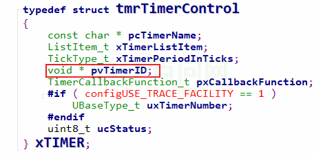

怎么使用定时器ID，完全由程序来决定：

- 可以用来标记定时器，表示自己是什么定时器
- 可以用来保存参数，给回调函数使用

它的初始值在创建定时器时由 **xTimerCreate()** 这类函数传入，后续可以使用这些函数来操作：

- 更新ID：使用 **vTimerSetTimerID()** 函数
- 查询ID：查询 **pvTimerGetTimerID()** 函数

这两个函数不涉及命令队列，它们是直接操作定时器结构体。

函数原型如下：

```c
/* 获得定时器的ID
 * xTimer: 哪个定时器
 * 返回值: 定时器的ID
 */
void *pvTimerGetTimerID( TimerHandle_t xTimer );

/* 设置定时器的ID
 * xTimer: 哪个定时器
 * pvNewID: 新ID
 * 返回值: 无
 */
void vTimerSetTimerID( TimerHandle_t xTimer, void *pvNewID );
```

### 15.4 示例: 实现游戏音效

本节代码为：28_timer_game_sound，主要看nwatch\beep.c。

对于无源蜂鸣器，只要设置PWM输出方波，它就会发出声音。在game1游戏中，什么时候发出声音？球与挡球板、转块碰撞时发出声音。什么时候停止声音？发出声音后，过一阵子就应该停止声音。这使用软件定时器来实现。

在初始化蜂鸣器时，创建定时器，代码如下：

```c
25 static TimerHandle_t g_TimerSound;

/* 省略 */

52 void buzzer_init(void)

53 {

54   /* 初始化蜂鸣器 */

55   PassiveBuzzer_Init();

56

57   /* 创建定时器 */

58   g_TimerSound = xTimerCreate( "GameSound",

59                           200,

60                           pdFALSE,

61                           NULL,

62                           GameSoundTimer_Func);

63 }
```

想发出声音时，调用buzzer_buzz函数，代码如下：

```c
78 void buzzer_buzz(int freq, int time_ms)

79 {

80   PassiveBuzzer_Set_Freq_Duty(freq, 50);

81

82   /* 启动定时器 */

83   xTimerChangePeriod(g_TimerSound, time_ms, 0);

84 }
```

第80行：设置PWM频率。

第83行：启动定时器。

当定时器超时后，GameSoundTimer_Func函数被调用，它会停止蜂鸣器，代码如下：

```c
37 static void GameSoundTimer_Func( TimerHandle_t xTimer )

38 {

39   PassiveBuzzer_Control(0);

40 }
```

game1里如何使用音效？先初始化，代码如下：

```c
297 void game1_task(void *params)

298 {

299	g_framebuffer = LCD_GetFrameBuffer(&g_xres, &g_yres, &g_bpp);

300	draw_init();

301	draw_end();

302

303	buzzer_init();
```

第303行：初始化蜂鸣器。

game1里使用buzzer_buzz函数发出声音，比如碰到砖块时：

```c
412        buzzer_buzz(2000, 100);
```

第412行会发出2000Hz的声音，维持100ms。

---

## 第16章 中断管理(Interrupt Management)

在RTOS中，需要应对各类事件。这些事件很多时候是通过硬件中断产生，怎么处理中断呢？

假设当前系统正在运行Task1时，用户按下了按键，触发了按键中断。这个中断的处理流程如下：

- CPU跳到固定地址去执行代码，这个固定地址通常被称为中断向量，这个跳转时硬件实现的
- 执行代码做什么？
  - 保存现场：Task1被打断，需要先保存Task1的运行环境，比如各类寄存器的值
  - 分辨中断、调用处理函数(这个函数就被称为ISR，interrupt service routine)
  - 恢复现场：继续运行Task1，或者运行其他优先级更高的任务

你要注意到，ISR是在内核中被调用的，ISR执行过程中，用户的任务无法执行。ISR要尽量快，否则：

- 其他低优先级的中断无法被处理：实时性无法保证
- 用户任务无法被执行：系统显得很卡顿

如果这个硬件中断的处理，就是非常耗费时间呢？对于这类中断的处理就要分为2部分：

- ISR：尽快做些清理、记录工作，然后触发某个任务
- 任务：更复杂的事情放在任务中处理
- 所以：需要ISR和任务之间进行通信

要在FreeRTOS中熟练使用中断，有几个原则要先说明：

- FreeRTOS把任务认为是硬件无关的，任务的优先级由程序员决定，任务何时运行由调度器决定
- ISR虽然也是使用软件实现的，但是它被认为是硬件特性的一部分，因为它跟硬件密切相关
  - 何时执行？由硬件决定
  - 哪个ISR被执行？由硬件决定
- ISR的优先级高于任务：即使是优先级最低的中断，它的优先级也高于任务。任务只有在没有中断的情况下，才能执行。

本章涉及如下内容：

- FreeRTOS的哪些API函数能在ISR中使用
- 怎么把中断的处理分为两部分：ISR、任务
- ISR和任务之间的通信

### 16.1 两套API函数

#### 16.1.1 为什么需要两套API

在任务函数中，我们可以调用各类API函数，比如队列操作函数：xQueueSendToBack。但是在ISR中使用这个函数会导致问题，应该使用另一个函数：xQueueSendToBackFromISR，它的函数名含有后缀"FromISR"，表示"从ISR中给队列发送数据"。

FreeRTOS中很多API函数都有两套：一套在任务中使用，另一套在ISR中使用。后者的函数名含有"FromISR"后缀。

为什么要引入两套API函数？

- 很多API函数会导致任务计入阻塞状态：
  - 运行这个函数的 **任务** 进入阻塞状态
  - 比如写队列时，如果队列已满，可以进入阻塞状态等待一会
- ISR调用API函数时，ISR不是"任务"，ISR不能进入阻塞状态
- 所以，在任务中、在ISR中，这些函数的功能是有差别的

为什么不使用同一套函数，比如在函数里面分辨当前调用者是任务还是ISR呢？示例代码如下：

```c
BaseType_t xQueueSend(...)
{
    if (is_in_isr())
    {
        /* 把数据放入队列 */

        /* 不管是否成功都直接返回 */
    }
    else /* 在任务中 */
    {
        /* 把数据放入队列 */
        /* 不成功就等待一会再重试 */
    }
}
```

FreeRTOS使用两套函数，而不是使用一套函数，是因为有如下好处：

- 使用同一套函数的话，需要增加额外的判断代码、增加额外的分支，是的函数更长、更复杂、难以测试
- 在任务、ISR中调用时，需要的参数不一样，比如：
  - 在任务中调用：需要指定超时时间，表示如果不成功就阻塞一会
  - 在ISR中调用：不需要指定超时时间，无论是否成功都要即刻返回
  - 如果强行把两套函数揉在一起，会导致参数臃肿、无效
- 移植FreeRTOS时，还需要提供监测上下文的函数，比如 **is_in_isr()**
- 有些处理器架构没有办法轻易分辨当前是处于任务中，还是处于ISR中，就需要额外添加更多、更复杂的代码

使用两套函数可以让程序更高效，但是也有一些缺点，比如你要使用第三方库函数时，即会在任务中调用它，也会在ISR总调用它。这个第三方库函数用到了FreeRTOS的API函数，你无法修改库函数。这个问题可以解决：

- 把中断的处理推迟到任务中进行(Defer interrupt processing)，在任务中调用库函数
- 尝试在库函数中使用"FromISR"函数：
  - 在任务中、在ISR中都可以调用"FromISR"函数
  - 反过来就不行，非FromISR函数无法在ISR中使用
- 第三方库函数也许会提供OS抽象层，自行判断当前环境是在任务还是在ISR中，分别调用不同的函数

#### 16.1.2 两套API函数列表

<table>
    <tr>
        <th>类型</th>
        <th>在任务中</th>
        <th>在ISR中</th>
    </tr>
    <tr>
        <td rowspan="5">队列(queue)</td>
        <td>xQueueSendToBack</td>
        <td>xQueueSendToBackFromISR</td>
    </tr>
    <tr>
        <td>xQueueSendToFront</td>
        <td>xQueueSendToFrontFromISR</td>
    </tr>
    <tr>
        <td>xQueueReceive</td>
        <td>xQueueReceiveFromISR</td>
    </tr>
    <tr>
        <td>xQueueOverwrite</td>
        <td>xQueueOverwriteFromISR</td>
    </tr>
    <tr>
        <td>xQueuePeek</td>
        <td>xQueuePeekFromISR</td>
    </tr>
    <tr>
        <td rowspan="2">信号量(semaphore)</td>
        <td>xSemaphoreGive</td>
        <td>xSemaphoreGiveFromISR</td>
    </tr>
    <tr>
        <td>xSemaphoreTake</td>
        <td>xSemaphoreTakeFromISR</td>
    </tr>
    <tr>
        <td rowspan="2">事件组(event group)</td>
        <td>xEventGroupSetBits</td>
        <td>xEventGroupSetBitsFromISR</td>
    </tr>
    <tr>
        <td>xEventGroupGetBits</td>
        <td>xEventGroupGetBitsFromISR</td>
    </tr>
    <tr>
        <td rowspan="2">任务通知(task notification)</td>
        <td>xTaskNotifyGive</td>
        <td>vTaskNotifyGiveFromISR</td>
    </tr>
    <tr>
        <td>xTaskNotify</td>
        <td>xTaskNotifyFromISR</td>
    </tr>
    <tr>
        <td rowspan="4">软件定时器(software timer)</td>
        <td>xTimerStart</td>
        <td>xTimerStartFromISR</td>
    </tr>
    <tr>
        <td>xTimerStop</td>
        <td>xTimerStopFromISR</td>
    </tr>
    <tr>
        <td>xTimerReset</td>
        <td>xTimerResetFromISR</td>
    </tr>
    <tr>
        <td>xTimerChangePeriod</td>
        <td>xTimerChangePeriodFromISR</td>
    </tr>
</table>
#### 16.1.3 xHigherPriorityTaskWoken参数

xHigherPriorityTaskWoken的含义是：是否有更高优先级的任务被唤醒了。如果为pdTRUE，则意味着后面要进行任务切换。

还是以写队列为例。

任务A调用 **xQueueSendToBack()** 写队列，有几种情况发生：

- 队列满了，任务A阻塞等待，另一个任务B运行
- 队列没满，任务A成功写入队列，但是它导致另一个任务B被唤醒，任务B的优先级更高：任务B先运行
- 队列没满，任务A成功写入队列，即刻返回

可以看到，在任务中调用API函数可能导致任务阻塞、任务切换，这叫做"context switch"，上下文切换。这个函数可能很长时间才返回，在函数的内部实现了任务切换。

**xQueueSendToBackFromISR()** 函数也可能导致任务切换，但是不会在函数内部进行切换，而是返回一个参数：表示是否需要切换，函数原型与用法如下：

```c
/*
 * 往队列尾部写入数据，此函数可以在中断函数中使用，不可阻塞
 */
BaseType_t xQueueSendToBackFromISR(
                                      QueueHandle_t xQueue,
                                      const void *pvItemToQueue,
                                      BaseType_t *pxHigherPriorityTaskWoken
                                   );

/* 用法示例 */

BaseType_t xHigherPriorityTaskWoken = pdFALSE;
xQueueSendToBackFromISR(xQueue, pvItemToQueue, &xHigherPriorityTaskWoken);

if (xHigherPriorityTaskWoken == pdTRUE)
{
    /* 任务切换 */
}
```

pxHigherPriorityTaskWoken参数，就是用来保存函数的结果：是否需要切换

- *pxHigherPriorityTaskWoken等于pdTRUE：函数的操作导致更高优先级的任务就绪了，ISR应该进行任务切换
- *pxHigherPriorityTaskWoken等于pdFALSE：没有进行任务切换的必要

为什么不在"FromISR"函数内部进行任务切换，而只是标记一下而已呢？为了效率！示例代码如下：

```c
void XXX_ISR()
{
    int i;
    for (i = 0; i < N; i++)
    {
        xQueueSendToBackFromISR(...); /* 被多次调用 */
    }
}
```

ISR中有可能多次调用"FromISR"函数，如果在"FromISR"内部进行任务切换，会浪费时间。解决方法是：

- 在"FromISR"中标记是否需要切换
- 在ISR返回之前再进行任务切换
- 示例代码如下

```c
void XXX_ISR()
{
    int i;
    BaseType_t xHigherPriorityTaskWoken = pdFALSE;

    for (i = 0; i < N; i++)
    {
        xQueueSendToBackFromISR(..., &xHigherPriorityTaskWoken); /* 被多次调用 */
    }

    /* 最后再决定是否进行任务切换 */
    if (xHigherPriorityTaskWoken == pdTRUE)
	{
        /* 任务切换 */
	}
}
```

上述的例子很常见，比如UART中断：在UART的ISR中读取多个字符，发现收到回车符时才进行任务切换。

在ISR中调用API时不进行任务切换，而只是在"xHigherPriorityTaskWoken"中标记一下，除了效率，还有多种好处：

- 效率高：避免不必要的任务切换
- 让ISR更可控：中断随机产生，在API中进行任务切换的话，可能导致问题更复杂
- 可移植性
- 在Tick中断中，调用 **vApplicationTickHook()** ：它运行与ISR，只能使用"FromISR"的函数

使用"FromISR"函数时，如果不想使用xHigherPriorityTaskWoken参数，可以设置为NULL。

#### 16.1.4 怎么切换任务

FreeRTOS的ISR函数中，使用两个宏进行任务切换：

```c
	portEND_SWITCHING_ISR( xHigherPriorityTaskWoken );
或
	portYIELD_FROM_ISR( xHigherPriorityTaskWoken );
```

这两个宏做的事情是完全一样的，在老版本的FreeRTOS中，

- **portEND_SWITCHING_ISR** 使用汇编实现
- **portYIELD_FROM_ISR** 使用C语言实现

新版本都统一使用**portYIELD_FROM_ISR**。

使用示例如下：

```c
void XXX_ISR()
{
    int i;
    BaseType_t xHigherPriorityTaskWoken = pdFALSE;

    for (i = 0; i < N; i++)
    {
        xQueueSendToBackFromISR(..., &xHigherPriorityTaskWoken); /* 被多次调用 */
    }

    /* 最后再决定是否进行任务切换
     * xHigherPriorityTaskWoken为pdTRUE时才切换
     */
    portYIELD_FROM_ISR(xHigherPriorityTaskWoken);
}
```

### 16.2 中断的延迟处理

前面讲过，ISR要尽量快，否则：

- 其他低优先级的中断无法被处理：实时性无法保证
- 用户任务无法被执行：系统显得很卡顿
- 如果运行中断嵌套，这会更复杂，ISR越快执行约有助于中断嵌套

如果这个硬件中断的处理，就是非常耗费时间呢？对于这类中断的处理就要分为2部分：

- ISR：尽快做些清理、记录工作，然后触发某个任务
- 任务：更复杂的事情放在任务中处理

这种处理方式叫"中断的延迟处理"(Deferring interrupt processing)，处理流程如下图所示：

- t1：任务1运行，任务2阻塞
- t2：发生中断，
- 该中断的ISR函数被执行，任务1被打断
- ISR函数要尽快能快速地运行，它做一些必要的操作(比如清除中断)，然后唤醒任务2
- t3：在创建任务时设置任务2的优先级比任务1高(这取决于设计者)，所以ISR返回后，运行的是任务2，它要完成中断的处理。任务2就被称为"deferred processing task"，中断的延迟处理任务。
- t4：任务2处理完中断后，进入阻塞态以等待下一个中断，任务1重新运行

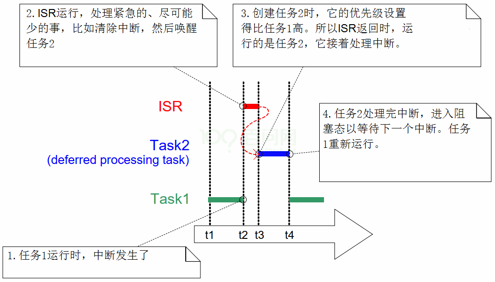

### 16.3 中断与任务间的通信

前面讲解过的队列、信号量、互斥量、事件组、任务通知等等方法，都可使用。

要注意的是，在ISR中使用的函数要有"FromISR"后缀。

###  16.4 示例: 优化实时性

本节代码为：29_fromisr_game，主要看DshanMCU-F103\driver_ir_receiver.c。

以前，在中断函数里写队列时，代码如下：

```c
150 static void DispatchKey(struct ir_data *pidata)

151 {

152 #if 0

153   extern QueueHandle_t g_xQueueCar1;

154   extern QueueHandle_t g_xQueueCar2;

155   extern QueueHandle_t g_xQueueCar3;

156   xQueueSendFromISR(g_xQueueCar1, pidata, NULL);

157   xQueueSendFromISR(g_xQueueCar2, pidata, NULL);

158   xQueueSendFromISR(g_xQueueCar3, pidata, NULL);

159 #else

160   int i;

161    for (i = 0; i < g_queue_cnt; i++)

162    {

163        xQueueSendFromISR(g_xQueues[i], pidata, NULL);

164    }

165 #endif

166 }
```

假设当前运行的是任务A，它的优先级比较低，在它运行过程中发生了中断，中断函数调用了DispatchKey函数写了队列，使得任务B被唤醒了。任务B的优先级比较高，它应该在中断执行完后马上就能运行。但是上述代码无法实现这个目标，xQueueSendFromISR函数会把任务B调整为就绪态，但是不会发起一次调度。

需要如下修改代码：

```c
150 static void DispatchKey(struct ir_data *pidata)

151 {

152 #if 0

153   extern QueueHandle_t g_xQueueCar1;

154   extern QueueHandle_t g_xQueueCar2;

155   extern QueueHandle_t g_xQueueCar3;

156   xQueueSendFromISR(g_xQueueCar1, pidata, NULL);

157    xQueueSendFromISR(g_xQueueCar2, pidata, NULL);

158    xQueueSendFromISR(g_xQueueCar3, pidata, NULL);

159 #else

160    int i;

161   BaseType_t xHigherPriorityTaskWoken = pdFALSE;

162    for (i = 0; i < g_queue_cnt; i++)

163    {

164        xQueueSendFromISR(g_xQueues[i], pidata, &xHigherPriorityTaskWoken);

165    }

166   portYIELD_FROM_ISR(xHigherPriorityTaskWoken);

167 #endif

168 }
```

在第164行传入一个变量的地址：&xHigherPriorityTaskWoken，它的初始值是pdFALSE，表示无需发起调度。如果xQueueSendFromISR函数发现唤醒了更高优先级的任务，那么就会把这个变量设置为pdTRUE。

第166行，如果xHigherPriorityTaskWoken为pdTRUE，它就会发起一次调度。

本程序上机时，我们感觉不到有什么不同。

---

## 第17章 资源管理(Resource Management)

在前面讲解互斥量时，引入过临界资源的概念。在前面课程里，已经实现了临界资源的互斥访问。

本章节的内容比较少，只是引入两个功能：屏蔽/使能中断、暂停/恢复调度器。

要独占式地访问临界资源，有3种方法：

- 公平竞争：比如使用互斥量，谁先获得互斥量谁就访问临界资源，这部分内容前面讲过。
- 谁要跟我抢，我就灭掉谁：
  - 中断要跟我抢？我屏蔽中断
  - 其他任务要跟我抢？我禁止调度器，不运行任务切换

### 17.1 屏蔽中断

屏蔽中断有两套宏：任务中使用、ISR中使用：

- 任务中使用：**taskENTER_CRITICA()/taskEXIT_CRITICAL()**
- ISR中使用：**taskENTER_CRITICAL_FROM_ISR()/taskEXIT_CRITICAL_FROM_ISR()**

#### 17.1.1 在任务中屏蔽中断

在任务中屏蔽中断的示例代码如下：

```c
/* 在任务中，当前时刻中断是使能的
 * 执行这句代码后，屏蔽中断
 */
taskENTER_CRITICAL();

/* 访问临界资源 */

/* 重新使能中断 */
taskEXIT_CRITICAL();
```

在 **taskENTER_CRITICA()/taskEXIT_CRITICAL()** 之间：

- 低优先级的中断被屏蔽了：优先级低于、等于 **configMAX_SYSCALL_INTERRUPT_PRIORITY**
- 高优先级的中断可以产生：优先级高于 **configMAX_SYSCALL_INTERRUPT_PRIORITY**
  - 但是，这些中断ISR里，不允许使用FreeRTOS的API函数
- 任务调度依赖于中断、依赖于API函数，所以：这两段代码之间，不会有任务调度产生

这套 **taskENTER_CRITICA()/taskEXIT_CRITICAL()** 宏，是可以递归使用的，它的内部会记录嵌套的深度，只有嵌套深度变为0时，调用 **taskEXIT_CRITICAL()** 才会重新使能中断。

使用 **taskENTER_CRITICA()/taskEXIT_CRITICAL()** 来访问临界资源是很粗鲁的方法：

- 中断无法正常运行
- 任务调度无法进行
- 所以，之间的代码要尽可能快速地执行

#### 17.1.2 在ISR中屏蔽中断

要使用含有"FROM_ISR"后缀的宏，示例代码如下：

```c
void vAnInterruptServiceRoutine( void )
{
    /* 用来记录当前中断是否使能 */
    UBaseType_t uxSavedInterruptStatus;

    /* 在ISR中，当前时刻中断可能是使能的，也可能是禁止的
     * 所以要记录当前状态, 后面要恢复为原先的状态
     * 执行这句代码后，屏蔽中断
     */
    uxSavedInterruptStatus = taskENTER_CRITICAL_FROM_ISR();

    /* 访问临界资源 */

    /* 恢复中断状态 */
    taskEXIT_CRITICAL_FROM_ISR( uxSavedInterruptStatus );
    /* 现在，当前ISR可以被更高优先级的中断打断了 */
}
```

在 **taskENTER_CRITICA_FROM_ISR()/taskEXIT_CRITICAL_FROM_ISR()** 之间：

- 低优先级的中断被屏蔽了：优先级低于、等于 **configMAX_SYSCALL_INTERRUPT_PRIORITY**
- 高优先级的中断可以产生：优先级高于 **configMAX_SYSCALL_INTERRUPT_PRIORITY**
  - 但是，这些中断ISR里，不允许使用FreeRTOS的API函数
- 任务调度依赖于中断、依赖于API函数，所以：这两段代码之间，不会有任务调度产生

### 17.2 暂停调度器

如果有别的任务来跟你竞争临界资源，你可以把中断关掉：这当然可以禁止别的任务运行，但是这代价太大了。它会影响到中断的处理。

如果只是禁止别的任务来跟你竞争，不需要关中断，暂停调度器就可以了：在这期间，中断还是可以发生、处理。

使用这2个函数来暂停、恢复调度器：

```c
/* 暂停调度器 */
void vTaskSuspendAll( void );

/* 恢复调度器
 * 返回值: pdTRUE表示在暂定期间有更高优先级的任务就绪了
 *        可以不理会这个返回值
 */
BaseType_t xTaskResumeAll( void );
```

示例代码如下：

```c
vTaskSuspendScheduler();

/* 访问临界资源 */

xTaskResumeScheduler();
```

这套 **vTaskSuspendScheduler()/xTaskResumeScheduler()** 宏，是可以递归使用的，它的内部会记录嵌套的深度，只有嵌套深度变为0时，调用 **taskEXIT_CRITICAL()** 才会重新使能中断。

---

## 第18章 调试与优化

本节视频源码为：**28_freertos_example_stats**

### 18.1 调试

FreeRTOS提供了很多调试手段：

- 打印
- 断言：**configASSERT**
- Trace
- Hook函数(回调函数)

#### 18.1.1 打印

printf：FreeRTOS工程里使用了microlib，里面实现了printf函数。

我们只需实现一下函数即可使用printf：

```c
int fputc( int ch, FILE *f );
```

#### 18.1.2 断言

一般的C库里面，断言就是一个函数：

```c
void assert(scalar expression);
```

它的作用是：确认expression必须为真，如果expression为假的话就中止程序。

在FreeRTOS里，使用 **configASSERT()**，比如：

```c
##define configASSERT(x)  if (!x) while(1);
```

我们可以让它提供更多信息，比如：

```c
##define configASSERT(x)  \
	if (!x) \
	{
		printf("%s %s %d\r\n", __FILE__, __FUNCTION__, __LINE__); \
        while(1); \
    }
```

configASSERT(x)中，如果x为假，表示发生了很严重的错误，必须停止系统的运行。

它用在很多场合，比如：

- 队列操作

```c
 BaseType_t xQueueGenericSend( QueueHandle_t xQueue,
                              const void * const pvItemToQueue,
                              TickType_t xTicksToWait,
                              const BaseType_t xCopyPosition )
{
    BaseType_t xEntryTimeSet = pdFALSE, xYieldRequired;
    TimeOut_t xTimeOut;
    Queue_t * const pxQueue = xQueue;

    configASSERT( pxQueue );
    configASSERT(!((pvItemToQueue == NULL) && (pxQueue->uxItemSize != (UBaseType_t)0U)));
    configASSERT( !((xCopyPosition == queueOVERWRITE) && (pxQueue->uxLength != 1 )));
```

- 中断级别的判断

```c
 void vPortValidateInterruptPriority( void )
{
	uint32_t ulCurrentInterrupt;
	uint8_t ucCurrentPriority;

	/* Obtain the number of the currently executing interrupt. */
	ulCurrentInterrupt = vPortGetIPSR();

	/* Is the interrupt number a user defined interrupt? */
	if( ulCurrentInterrupt >= portFIRST_USER_INTERRUPT_NUMBER )
	{
		/* Look up the interrupt's priority. */
		ucCurrentPriority = pcInterruptPriorityRegisters[ ulCurrentInterrupt ];

		configASSERT( ucCurrentPriority >= ucMaxSysCallPriority );
	}
```

#### 18.1.3 Trace

FreeRTOS中定义了很多trace开头的宏，这些宏被放在系统个关键位置。

它们一般都是空的宏，这不会影响代码：不影响编程处理的程序大小、不影响运行时间。

我们要调试某些功能时，可以修改宏：修改某些标记变量、打印信息等待。

|                 **trace宏**                 | **描述**                                                     |
| :-----------------------------------------: | ------------------------------------------------------------ |
|    traceTASK_INCREMENT_TICK(xTickCount)     | 当tick计数自增之前此宏函数被调用。参数xTickCount当前的Tick值，它还没有增加。 |
|          traceTASK_SWITCHED_OUT()           | vTaskSwitchContext中，把当前任务切换出去之前调用此宏函数。   |
|           traceTASK_SWITCHED_IN()           | vTaskSwitchContext中，新的任务已经被切换进来了，就调用此函数。 |
|   traceBLOCKING_ON_QUEUE_RECEIVE(pxQueue)   | 当正在执行的当前任务因为试图去读取一个空的队列、信号或者互斥量而进入阻塞状态时，此函数会被立即调用。参数pxQueue保存的是试图读取的目标队列、信号或者互斥量的句柄，传递给此宏函数。 |
|    traceBLOCKING_ON_QUEUE_SEND(pxQueue)     | 当正在执行的当前任务因为试图往一个已经写满的队列或者信号或者互斥量而进入了阻塞状态时，此函数会被立即调用。参数pxQueue保存的是试图写入的目标队列、信号或者互斥量的句柄，传递给此宏函数。 |
|          traceQUEUE_SEND(pxQueue)           | 当一个队列或者信号发送成功时，此宏函数会在内核函数xQueueSend(),xQueueSendToFront(),xQueueSendToBack(),以及所有的信号give函数中被调用，参数pxQueue是要发送的目标队列或信号的句柄，传递给此宏函数。 |
|       traceQUEUE_SEND_FAILED(pxQueue)       | 当一个队列或者信号发送失败时，此宏函数会在内核函数xQueueSend(),xQueueSendToFront(),xQueueSendToBack(),以及所有的信号give函数中被调用，参数pxQueue是要发送的目标队列或信号的句柄，传递给此宏函数。 |
|         traceQUEUE_RECEIVE(pxQueue)         | 当读取一个队列或者接收信号成功时，此宏函数会在内核函数xQueueReceive()以及所有的信号take函数中被调用，参数pxQueue是要接收的目标队列或信号的句柄，传递给此宏函数。 |
|     traceQUEUE_RECEIVE_FAILED(pxQueue)      | 当读取一个队列或者接收信号失败时，此宏函数会在内核函数xQueueReceive()以及所有的信号take函数中被调用，参数pxQueue是要接收的目标队列或信号的句柄，传递给此宏函数。 |
|      traceQUEUE_SEND_FROM_ISR(pxQueue)      | 当在中断中发送一个队列成功时，此函数会在xQueueSendFromISR()中被调用。参数pxQueue是要发送的目标队列的句柄。 |
|  traceQUEUE_SEND_FROM_ISR_FAILED(pxQueue)   | 当在中断中发送一个队列失败时，此函数会在xQueueSendFromISR()中被调用。参数pxQueue是要发送的目标队列的句柄。 |
|    traceQUEUE_RECEIVE_FROM_ISR(pxQueue)     | 当在中断中读取一个队列成功时，此函数会在xQueueReceiveFromISR()中被调用。参数pxQueue是要发送的目标队列的句柄。 |
| traceQUEUE_RECEIVE_FROM_ISR_FAILED(pxQueue) | 当在中断中读取一个队列失败时，此函数会在xQueueReceiveFromISR()中被调用。参数pxQueue是要发送的目标队列的句柄。 |
|           traceTASK_DELAY_UNTIL()           | 当一个任务因为调用了vTaskDelayUntil()进入了阻塞状态的前一刻此宏函数会在vTaskDelayUntil()中被立即调用。 |
|              traceTASK_DELAY()              | 当一个任务因为调用了vTaskDelay()进入了阻塞状态的前一刻此宏函数会在vTaskDelay中被立即调用。 |

#### 18.1.4 Malloc Hook函数

编程时，一般的逻辑错误都容易解决。难以处理的是内存越界、栈溢出等。

内存越界经常发生在堆的使用过程总：堆，就是使用malloc得到的内存。

并没有很好的方法检测内存越界，但是可以提供一些回调函数：

- 使用pvPortMalloc失败时，如果在FreeRTOSConfig.h里配置 **configUSE_MALLOC_FAILED_HOOK** 为1，会调用：

```c
 void vApplicationMallocFailedHook( void );
```

#### 18.1.5 栈溢出Hook函数

在切换任务(vTaskSwitchContext)时调用taskCHECK_FOR_STACK_OVERFLOW来检测栈是否溢出，如果溢出会调用：

```c
void vApplicationStackOverflowHook( TaskHandle_t xTask, char * pcTaskName );
```

怎么判断栈溢出？有两种方法：

- 方法1：
  - 当前任务被切换出去之前，它的整个运行现场都被保存在栈里，这时 **很可能** 就是它对栈的使用到达了峰值。
  - 这方法很高效，但是并不精确
  - 比如：任务在运行过程中调用了函数A大量地使用了栈，调用完函数A后才被调度。

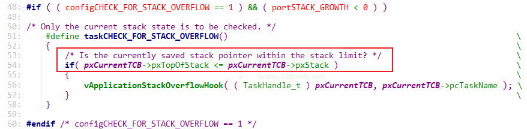

- 方法2：

  - 创建任务时，它的栈被填入固定的值，比如：0xa5
  - 检测栈里最后16字节的数据，如果不是0xa5的话表示栈即将、或者已经被用完了
  - 没有方法1快速，但是也足够快
  - 能捕获 **几乎所有** 的栈溢出
  - 为什么是几乎所有？可能有些函数使用栈时，非常凑巧地把栈设置为0xa5：几乎不可能

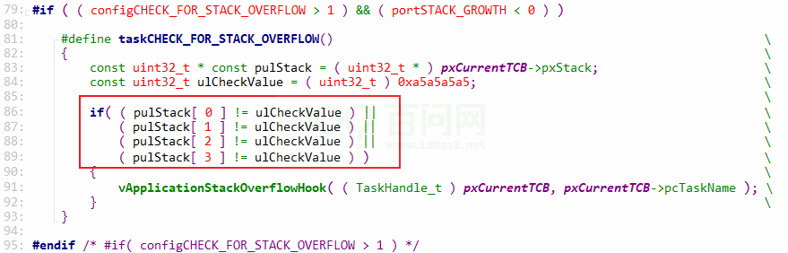

### 18.2 优化

在Windows中，当系统卡顿时我们可以查看任务管理器找到最消耗CPU资源的程序。

在FreeRTOS中，我们也可以查看任务使用CPU的情况、使用栈的情况，然后针对性地进行优化。

这就是查看"任务的统计"信息。

#### 18.2.1 栈使用情况

在创建任务时分配了栈，可以填入固定的数值比如0xa5，以后可以使用以下函数查看"栈的高水位"，也就是还有多少空余的栈空间：

```c
UBaseType_t uxTaskGetStackHighWaterMark( TaskHandle_t xTask );
```

原理是：从栈底往栈顶逐个字节地判断，它们的值持续是0xa5就表示它是空闲的。

函数说明：

| **参数/返回值** |                           **说明**                           |
| :-------------: | :----------------------------------------------------------: |
|      xTask      |                           哪个任务                           |
|     返回值      | 任务运行时、任务被切换时，都会用到栈。栈里原来值(0xa5)就会被覆盖。 逐个函数从栈的尾部判断栈的值连续为0xa5的个数， 它就是任务运行过程中空闲内存容量的最小值。 注意：假设从栈尾开始连续为0xa5的栈空间是N字节，返回值是N/4。 |

#### 18.2.2 任务运行时间统计

对于同优先级的任务，它们按照时间片轮流运行：你执行一个Tick，我执行一个Tick。

是否可以在Tick中断函数中，统计当前任务的累计运行时间？

不行！很不精确，因为有更高优先级的任务就绪时，当前任务还没运行一个完整的Tick就被抢占了。

我们需要比Tick更快的时钟，比如Tick周期时1ms，我们可以使用另一个定时器，让它发生中断的周期时0.1ms甚至更短。

使用这个定时器来衡量一个任务的运行时间，原理如下图所示：

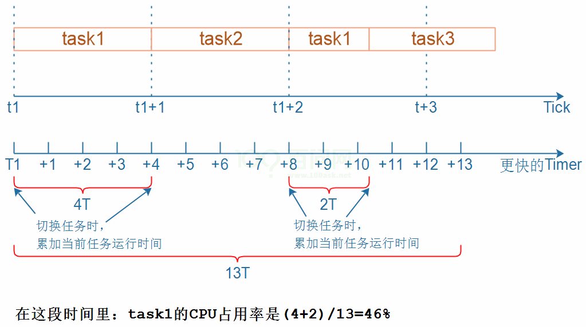

- 切换到Task1时，使用更快的定时器记录当前时间T1
- Task1被切换出去时，使用更快的定时器记录当前时间T4
- (T4-T1)就是它运行的时间，累加起来
- 关键点：在 **vTaskSwitchContext** 函数中，使用 **更快的定时器** 统计运行时间

#### 18.2.3 涉及的代码

- 配置

```c
 #define configGENERATE_RUN_TIME_STATS 1
 #define configUSE_TRACE_FACILITY    1
 #define configUSE_STATS_FORMATTING_FUNCTIONS  1
```

- 实现宏 **portCONFIGURE_TIMER_FOR_RUN_TIME_STATS()**，它用来初始化更快的定时器
- 实现这两个宏之一，它们用来返回当前时钟值(更快的定时器)
  - portGET_RUN_TIME_COUNTER_VALUE()：直接返回时钟值
  - portALT_GET_RUN_TIME_COUNTER_VALUE(Time)：设置Time变量等于时钟值

代码执行流程：

- 初始化更快的定时器：启动调度器时

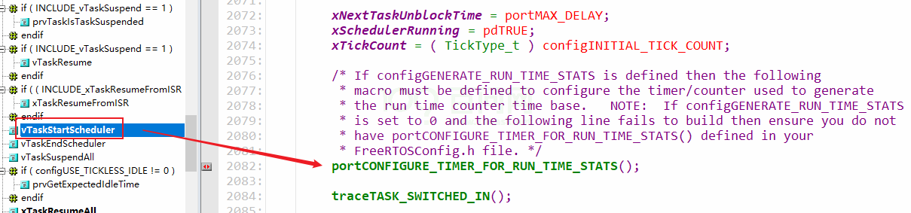

在任务切换时统计运行时间

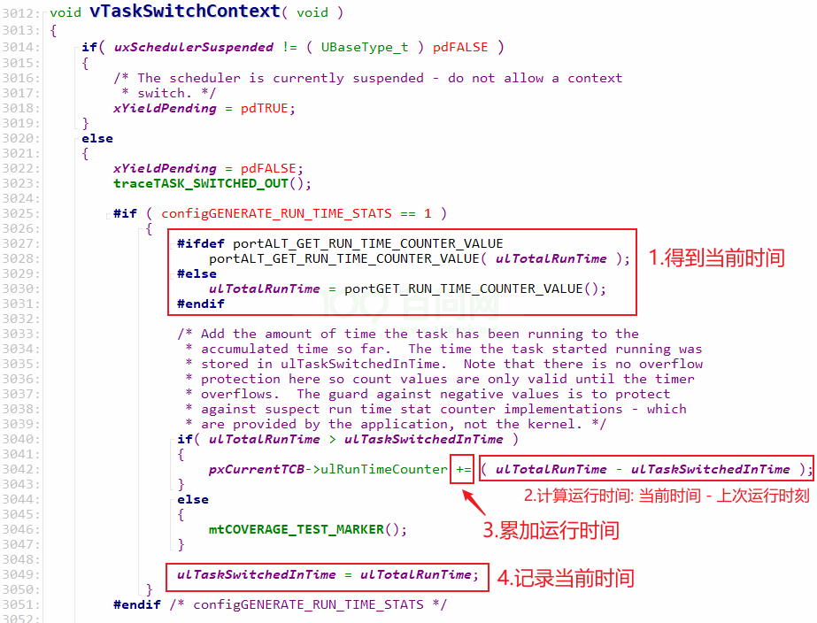

- 获得统计信息，可以使用下列函数
  - uxTaskGetSystemState：对于每个任务它的统计信息都放在一个TaskStatus_t结构体里
  - vTaskList：得到的信息是可读的字符串，比如
  - vTaskGetRunTimeStats： 得到的信息是可读的字符串

#### 18.2.4 函数说明

- uxTaskGetSystemState：获得任务的统计信息

```c
UBaseType_t uxTaskGetSystemState( TaskStatus_t * const pxTaskStatusArray,
                                        const UBaseType_t uxArraySize,
                                        uint32_t * const pulTotalRunTime );
```

|     **参数**      |                           **描述**                           |
| :---------------: | :----------------------------------------------------------: |
| pxTaskStatusArray | 指向一个TaskStatus_t结构体数组，用来保存任务的统计信息。 有多少个任务？可以用 **uxTaskGetNumberOfTasks()** 来获得。 |
|    uxArraySize    | 数组大小、数组项个数，必须大于或等于 **uxTaskGetNumberOfTasks()** |
|  pulTotalRunTime  |     用来保存当前总的运行时间(更快的定时器)，可以传入NULL     |
|      返回值       | 传入的pxTaskStatusArray数组，被设置了几个数组项。 注意：如果传入的uxArraySize小于 **uxTaskGetNumberOfTasks()** ，返回值就是0 |

- vTaskList ：获得任务的统计信息，形式为可读的字符串。注意，pcWriteBuffer必须足够大。

```c
 void vTaskList( signed char *pcWriteBuffer );
```

可读信息格式如下：

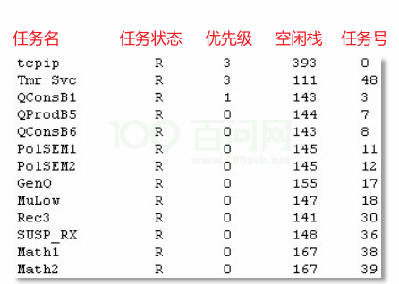

- vTaskGetRunTimeStats：获得任务的运行信息，形式为可读的字符串。注意，pcWriteBuffer必须足够大。

```c
void vTaskGetRunTimeStats( signed char *pcWriteBuffer );
```

 可读信息格式如下：

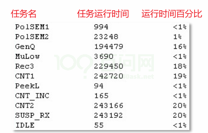
