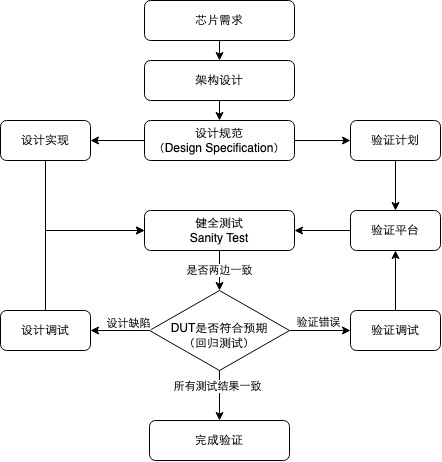
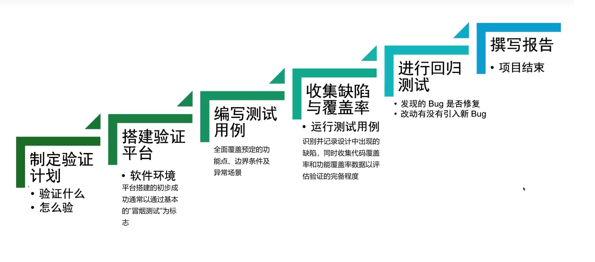
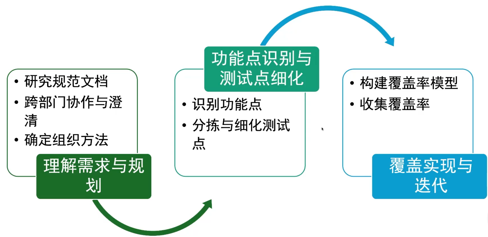
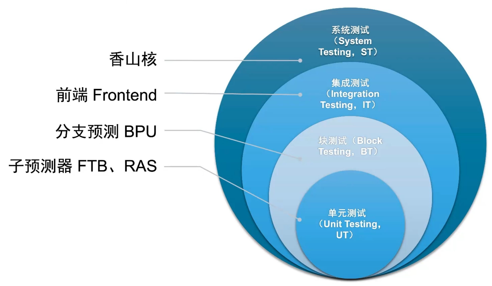
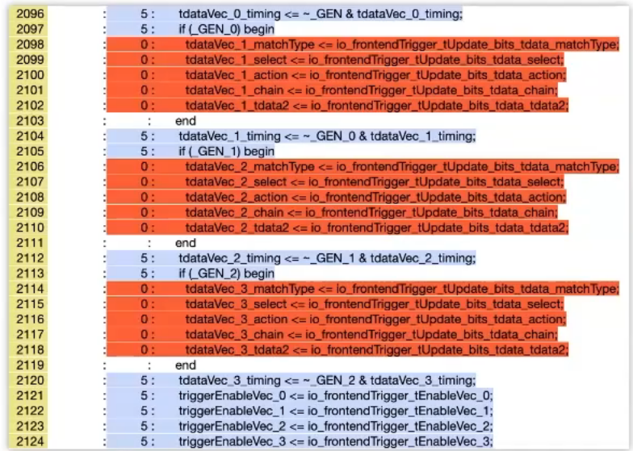
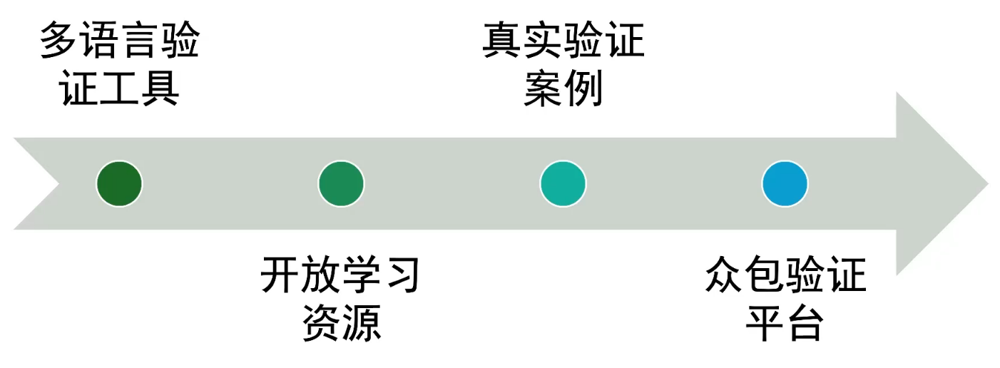

# 一、芯片验证的基本概念

## 1.芯片验证的定义

芯片验证的目标是确保设计的芯片在**功能、性能和功耗**等方面都满足预定的**规范**要求。

在本课程中，我们主要关注的是**功能验证**，也就是验证设计的电路逻辑是否满足既定需求，回答的核心问题是：**“这个设计真的能按照预期工作吗？”**

> [!NOTE]
>
> > 💡 **提示**：芯片验证并不等同于芯片测试。验证发生在设计阶段，通过各种方法（如仿真）在芯片制造前发现问题；而测试则是在芯片制造后，通过物理手段检查实际芯片是否工作正常。

## 2.为什么芯片验证如此重要？

一旦芯片被制造出来，修改错误的成本将会非常高昂。以下是几个验证不足导致灾难性后果的经典案例：

- **Intel Pentium FDIV Bug （1994）**: 浮点单元的一个计算错误导致 Intel 不得不召回大量处理器，造成约 4.75 亿美元的损失。
- **AMD Barcelona Bug （2007）**: TLB 错误导致系统不稳定，AMD 不得不降低处理器频率并推迟产品发布。
- **Intel Sandy Bridge 芯片组缺陷（2011）**：缺陷源于芯片组电路设计中的问题，SATA 端口可能在某些情况下退化，影响设备性能。根据[ CNET - Intel’s Sandy Bridge chipset flaw: The fallout](https://www.cnet.com/science/intels-sandy-bridge-chipset-flaw-the-fallout/)，Intel 预计 2011 年第一季度损失约 3 亿美元的销售收入，并支付 7 亿美元的维修和更换费用，总计约 10 亿美元的损失。

> [!NOTE]
>
> 🔍 **深入思考**：在芯片设计中，早期发现问题的成本远低于后期修复的成本。在设计阶段发现 bug 的成本可能只是数小时的工程师时间，而在产品发布后修复同样的问题可能需要数百万美元的成本。

------

# 二、验证流程与敏捷方法

## 1.验证与设计的关系

芯片验证并不是设计完成后的一个简单检查步骤，而是**与设计过程并行进行**的关键活动。

设计团队和验证团队通常从**同一份规范**出发，但有着不同的实现方式和关注点：

- **设计团队**：开发 **DUT**，关注功能实现、代码的可综合性和电路效率。
- **验证团队**：开发验证平台，专注于验证功能的正确实现。

这种设计与验证的分离确保了两个团队能够独立理解规范，从而提高发现潜在错误的概率。

> [!NOTE]
>
> 这里的 **DUT** 是芯片设计与验证里非常常见的缩写：
>
> > **DUT = Design Under Test**
> >  即：**被测设计 / 待验证设计**。
>
> 可以把它理解成：
>
> **设计团队负责“造东西”，验证团队负责“测这个东西”，而这个被测的东西就是 DUT。**



## 2.完整的验证流程



### 2.1.深入剖析：功能点和测试点的整理(在制定验证计划这个阶段)

**功能点**是指芯片设计中需要验证的具体功能或特性，通常从**设计规范和要求文档**中提取。

**测试点**是从功能点派生出的具体测试用例或场景，用于确保功能点的每个方面都被彻底测试。

功能点和测试点的定义与拆分是贯穿整个验证过程的核心活动，**它们的明确性和完备性直接影响验证的质量和效率**。

如果测试点分解过于粗糙，可能导致不同验证人员对测试用例的理解不同，从而遗漏边角案例，甚至造成项目延期。

因此，测试点的分解通常需要多次审查和完善，确保无论哪个验证人员执行测试，验证质量都有保证。

#### 功能点和测试点的拆分步骤

**第一阶段：需求理解与规划**

1. **深入研究规范文档**

   1. 反复、仔细地阅读功能规范、架构规范。
   2. 在需要时参考详细设计规范，以挖掘和覆盖边界情况

   3. 目标是全面理解设计意图、功能、接口、性能指标和操作模式。

2. **跨部门协作与澄清**

   1. 与架构师、设计师以及其他验证工程师紧密合作。
   2. 采用多种沟通方式**确保理解一致**：
      - **串讲：** 由需求提出者（如架构师）向验证/设计团队讲解需求。
      - **反串讲：** 由验证/设计团队向需求提出者复述他们的理解，以确认无误。
      - **评审：** 组织正式的会议，共同审查需求的准确性、完整性和可测试性。

   3. 此阶段的目标是消除歧义，就需求达成共识。

3. **确定组织方法**

   当我们完成上一阶段之后，需要开始制定验证计划。在制定验证计划时，我们需要组织需求和功能点，主要有两种方法：

- **自下而上**

  1. **核心**：设计的具体模块或接口出发，强调设计视角。
  2. **优点**：易提取具体需求，便于链接到代码覆盖点，适合模块级验证。
  3. **缺点**：能产生大量低层需求，不易把握系统全局。
  4. **适用**：模块验证、控制逻辑复杂的单元、有详细实现文档时。

- **自上而下**

  1. **核心**：系统级的使用场景或数据流出发，强调客户/验证视角。
  2. **优点**：能更好地把握系统级功能和性能，可在早期进行。

  3. **缺点**：需要清晰的高层规划，用例可能非常多，覆盖点可能偏宏观。
  4. **适用**：SoC（片上系统）验证、数据流为主的设计、有清晰架构或用例定义时。

- **实践中，** 常常将两者**结合**，先用“自上而下”定义整体框架和主要场景，再用“自下而上”细化关键模块或接口的需求 。选择哪种方式取决于项目特点和可用信息。

**第二阶段：功能点识别与测试点细化**

1. **识别功能点**

   1. 明确需求之后，我们需要识别设计规范和文档中需要验证的内容，例如关键功能、配置组合方式、操作模式、数据流、时序关系、协议规则等。它们构成了需要验证的功能点。
   2. 对功能点进行**优先级排序**，重点关注**高风险、新设计、关键性能或客户要求**的部分。

2. **分解与细化测试点**：

   1. 将每个功能点进一步分解为具体的、可测量的**测试点**或**覆盖项**。这是定义如何衡量功能点是否被覆盖的关键步骤。
   2. 我们可以从不同维拆分测试点，例如：
      - **场景**：不同的特权状态，如RISC-V 中某条指令在 M、S、U 特权模式下的行为，应该是什么样的。
      - **功能**：设计的核心操作，如算法计算、数据转换、控制逻辑。
      - **白盒**：关注内部实现细节，如状态机状态和跳转、内部计数器边界值、流水线状态等。
      - **接口**：模块或芯片与外部的交互，如总线协议时序、握手信号、中断处理。
      - **异常**：错误处理、故障注入、超时、边界条件下的行为、非法配置或输入。
      - **复位与初始化**：注复位后所有相关逻辑都恢复到预期默认值。

   3. **链接测试点与需求**：在验证计划中，把每个需求明确地链接到一个或多个具体的测试点其实现类型。

**第三阶段：覆盖实现与迭代**

此阶段，我们通过“**覆盖率**”这一**量化指标**来评定验证的**完备性**。

在仿真过程中，我们需要了解各个**测试点**是否被测试激励有效“命中”。为准确获取并体现这一覆盖情况，我们会针对这些测试点编写专门的**覆盖代码**，用以在仿真时监测和记录它们的激活状态，最终得到覆盖率信息。

我们需要知道的是，**验证是一个持续迭代的过程**。这意味着需要分析覆盖率报告，找出“**覆盖盲区**”（即未被充分测试的部分），并据此指导后续的测试用例开发，如此**循环**，直至各项覆盖率达到预设的验收目标。



## 3.敏捷验证

**然而，在实践中**，尤其是在追求快速迭代和市场响应的 **创业公司或新兴业务** 中，情况往往更加复杂。有时，为了快速验证想法或抢占市场先机，**芯片开发本身也越来越多地借鉴和实践“敏捷开发”的原则**：设计实现可能在规范细节尚未完全冻结时就已经开始，甚至出现“设计先行，规范后补”或者设计与规范频繁迭代的情况。

在这种快速变化、规范可能不完全成熟的环境下，传统的、依赖稳定规范的验证方法会面临巨大挑战。如果严格等待规范最终确定再开始验证，可能会错失市场窗口；而如果基于不稳定的规范进行验证，则可能需要大量的重复工作。 因此，**敏捷验证**的概念应运而生。

敏捷验证强调：

- **早期介入与持续集成**：验证工作**尽早开始**，与设计**紧密迭代**，持续集成（自动化工具，提交一点就能自动验证）和测试新功能。
- **适应性与灵活性**：能够快速响应需求和设计的变更，调整验证计划和策略。
- **风险驱动**：优先验证最高风险或最不确定的部分。
- **紧密协作**：设计与验证团队之间需要更频繁、更紧密的沟通与协作。

虽然敏捷验证带来了灵活性，但也对验证团队的技术能力、工具链的自动化程度以及团队协作模式提出了更高的要求。如何在快速迭代和保证质量之间找到平衡点，是许多现代芯片开发团队需要面对的课题。

------

# 三 、芯片验证的层次

芯片验证可以按照验证对象的规模分为四个主要层次，从小到大依次为：

1. **单元测试（Unit Testing，UT）**：单元测试关注的是最小的功能单元，即单个模块或组件。
2. **块测试（Block Testing，BT）**：当多个模块之间存在紧密**耦合**关系时，单独测试每个模块可能效率不高。块测试将这些相互**关联**的模块组合在一起进行测试。
3. **集成测试（Integration Testing，IT）**：集成测试将多个功能块组合在一起，验证它们能否正确协同工作，通常用于验证**子系统级别**的功能。
4. **系统测试（System Testing，ST）**：系统测试也称为 Top 验证，是将**所有子系统**组合起来，验证**整个芯片系统**的功能是否符合预期。

> 🧩 在实际项目中，验证层次的选择应根据项目规模、团队经验和时间预算灵活调整。对于小型项目，可能只需要 UT 和 ST 两个层次；而对于复杂的 SoC 设计，通常需要所有四个层次的验证。
>
> 

------

# 四、芯片验证指标

如何知道我们的验证工作做得是否足够充分？这就需要一系列指标来评估验证质量，下面是芯片验证中的一些关键指标：

## 1.功能正确性

**功能正确性**是最基本也是最重要的指标，即芯片是否能正确执行设计规范中定义的所有功能。功能正确性是一个**定性指标**（无法直接用数值来衡量），通常通过以下方式验证：

- 正常工作条件下的功能测试。
- 极端条件下的边界测试。
- 异常情况下的健壮性测试。

## 2.缺陷密度

缺陷密度是指在**单位代码量**中发现的缺陷数量。随着验证的深入，新发现的缺陷应该逐渐减少，缺陷密度曲线应趋于平稳。如果在项目后期仍然有大量新缺陷被发现，这通常意味着验证工作不够充分。

> [!NOTE]
>
> 这里的 **“单位代码量”**，就是把“代码规模”作为分母，用来消除不同模块大小带来的影响。最常见的衡量方式是 **LOC（Lines of Code，代码行数）**，实际工程中经常使用 **KLOC（Kilo Lines of Code，千行代码）**。ISTQB 对缺陷密度的定义也是“缺陷数 ÷ 组件或系统规模”，规模可以用代码行数、类数量、功能点等表示。
>
> 比如：
>
> > **缺陷密度 = 缺陷数量 ÷ 代码规模**
>
> 假设某个 RTL 模块有：
>
> ```
> SystemVerilog 代码：10,000 行
> 验证过程中发现：30 个设计缺陷
> ```
>
> 那么它有：
>
> ```
> 10,000 行 = 10 KLOC
>
> 缺陷密度 = 30 / 10
>         = 3 个缺陷 / KLOC
> ```
>
> 也就是说：
>
> > **平均每 1000 行 RTL 代码中发现了 3 个缺陷。**

## 3.验证效率与成本

验证效率是指在**有限的时间和资源**下完成的验证**工作量**。验证成本则包括人力、设备、时间等各类资源消耗。

提高验证效率、降低验证成本是芯片设计企业的重要目标。

## 4.（测试）覆盖率

测试覆盖率是评估验证进展和验证完整性**最重要的量化指标**，主要包括代码覆盖率和功能覆盖率。

### 4.1.代码覆盖率

代码覆盖率是一种**隐式覆盖率指标**，用于衡量在**仿真过程中设计源代码**的执行情况。它通过**分析代码结构**（如行、语句、分支等）来识别哪些部分在测试中被激活，哪些未被执行。

代码覆盖率包括以下几种常见类型：

- **翻转覆盖率**：跟踪寄存器或连线中每一位从 0 到 1 和从 1 到 0 的翻转情况，用于检查基本连接性。
- **行覆盖率**：记录哪些代码行在模拟中被执行。
- **语句覆盖率**：比行覆盖率更细粒度，跟踪每个语句的执行情况。
- **分支覆盖率**：确保控制结构（如 if、case）的布尔表达式在测试中评估为真和假。
- **表达式覆盖率**：验证表达式中的每个条件独立地评估为真和假。
- **有限状态机覆盖率**：测量状态机的状态访问和状态间转换情况。



如图蓝色的就是执行到的，红色是没执行到的。

##### **优点**

- **自动化生成**：代码覆盖率可以**由工具自动提取并分析**，无需手动定义，易于集成到现有验证流程。
- **识别未执行代码**：帮助发现测试中未覆盖的代码区域，提示**需要调整输入激励**。

##### **局限性**

- **不保证功能正确性**：即使达到 100%的代码覆盖率，也无法确保设计没有错误或功能符合规范，因为它**不涉及功能需求的验证**。
- **缺乏规范关联**：无法判断是否测试了规范中定义的所有功能，仅关注代码的结构执行。

### 4.2.功能覆盖率

功能覆盖率是一种**显式覆盖率指标**，用于衡量在验证仿真的过程中，设计规范中定义的功能需求是否被测试到。与代码覆盖率不同，功能覆盖率**需要手动创建**，通常基于设计规范或设计的实现细节完成功能点、测试点的划分后，再编写测试点的触发条件在仿真时**采样**，然后收集结果得到功能覆盖率。

功能覆盖率主要分为以下两种模型：

- **覆盖组模型**：在特定时间点**采样状态值**，例如使用 Toffee 的`CovGroup`收集功能点和测试点。
- **覆盖属性模型**：观察**事件序列的时间关系**，例如使用断言验证总线协议的握手序列或状态机的状态转换。

##### **功能覆盖率的优点**

- **与规范直接关联**：能够追踪功能需求的测试进度。
- **识别未测试功能**：帮助发现规范中定义但未被测试的功能。

##### **功能覆盖率的局限性**

- **手动创建**：需要工程师根据规范定义覆盖模型，过程复杂且耗时。
- **可能遗漏功能**：如果覆盖模型设计不全面，可能无法覆盖所有功能需求。

> 🔍思考：如果功能覆盖率很高，但是代码覆盖率不是很高，说明什么？
>
> > [!TIP]
> >
> > **功能覆盖率很高，但代码覆盖率不高，说明从“验证计划/设计规范”的角度看，定义的功能点大多已经被测试到了；但从 DUT 的具体 RTL 实现来看，仍然有不少代码、分支、状态、信号翻转等没有在仿真中真正被激活。**
> >  此时不能直接得出“验证已经充分”的结论，而应该进一步分析这些代码覆盖率空洞为什么存在。

### 4.3.两者的关系

代码覆盖率和功能覆盖率**相辅相成**，共同提供更全面的验证视图：

- **代码覆盖率**从底层视角检查代码执行的完整性，但无法验证功能是否符合设计意图。例如，100%的代码覆盖率可能仍遗漏关键功能测试。
- **功能覆盖率**从顶层视角确保规范中的需求被测试，但可能无法发现未实现的代码或冗余代码。
- **结合使用**：通过结合两者，验证团队可以同时识别未执行的代码（通过代码覆盖率）和未测试的功能（通过功能覆盖率），从而更准确地评估验证质量和进度。

### 小结

**代码覆盖率**是一种**自动化**的指标，关注设计实现的执行情况，帮助发现测试中的盲点，但不涉及功能正确性。

**功能覆盖率**是一种**手动**的指标，关注设计规范的测试情况，确保功能需求的实现和验证，但依赖于覆盖模型的完备性。

在实际验证中，这两者应**协同使用**，以实现从代码结构到功能需求的全面覆盖，确保设计的可靠性和规范符合性。通常认为**代码覆盖率达到 90%以上，功能覆盖率达到 100%**时，验证工作才算充分。

> ⚖️ **覆盖率 100%是否意味着设计没有错误？**答案是否定的。
>
> 高覆盖率是**必要条件，但不是充分条件**。我们无法测试所有可能的输入组合和状态，因此即使达到 100%的覆盖率，设计中仍可能存在未被发现的错误。这也是为什么验证工作需要综合运用多种方法和技术。
>
------

# 五、芯片验证的现状与挑战

随着芯片复杂度的提高，验证工作面临越来越多的挑战。本部分将揭示当前芯片验证行业的现状及其面临的主要困境，为理解众包验证的必要性奠定基础。

## 当前芯片验证面临的主要挑战

1. 验证工作量巨大：对于现代复杂芯片，验证工作量已经远超设计工作量，占整个芯片开发工作的 70%以上。一个典型的高端处理器验证可能需要数百万个测试用例和数万亿个时钟周期的仿真。
2. 人力成本高昂：为了应对巨大的验证工作量，芯片公司往往需要配备大量验证工程师。在许多大型芯片设计公司中，验证工程师的数量是设计工程师的 2-3 倍。例如，某知名处理器公司的三千人团队中，约有一千名设计工程师和两千名验证工程师。
3. 验证外包困难：与软件测试不同，芯片验证通常需要访问设计源代码，而这些代码往往是公司的核心商业机密。这使得芯片验证难以像软件测试那样进行外包，大多数公司只能在内部进行验证工作。
4. 工具学习曲线陡峭：芯片验证使用的工具多为商业软件，价格昂贵且学习曲线陡峭。普通工程师难以接触和学习这些工具，这限制了验证人才的培养和流动。
5. 学习资料匮乏：由于商业保密的原因，公开的芯片验证详细资料相对匮乏，这进一步提高了入门的门槛

------

# 六、高级语言在芯片验证中的价值

面对验证复杂性、成本和人才方面的挑战，业界也在不断探索新的方法和工具。其中，**在验证中使用高级编程语言（如 Python、Java、C++ 等）**显示出越来越大的价值，原因在于：

1. **更广泛的人才基础和生态系统**：相比传统的硬件描述/验证语言，高级语言拥有更庞大的开发者社区、更丰富的学习资源和成熟的软件库（生态系统），这有助于降低学习门槛，吸引更多不同背景的人才进入验证领域。学术界也认识到，[吸引软件工程师参与硬件领域](https://aha.stanford.edu/life-post-moores-law-new-cad-frontier)对于应对后摩尔定律时代挑战的重要性。
2. **与软件测试实践的共通性：**虽然领域不同，但芯片功能验证与软件测试在目标（发现缺陷）、流程（测试规划、用例编写、Bug 管理）、度量（覆盖率）以及环境（大多基于软件仿真）等方面存在诸多共通之处。高级语言及其测试框架（如 pytest）可以更容易地引入软件工程中的最佳实践（如单元测试、持续集成、自动化测试等），提升验证的效率和规范性。
3. **提升抽象层次和开发效率：**高级语言通常提供更强的抽象能力和更简洁的语法，使得验证工程师可以更专注于验证逻辑本身，而不是底层的信号交互细节（尽管这需要如 Picker 这样的工具进行桥接），从而可能提高验证环境的开发效率和可维护性。

**正是这些优势，使得基于高级语言的验证方法成为降低验证门槛、提高效率、促进验证众包模式发展的关键推动力之一。**

> 💡[Picker](https://github.com/XS-MLVP/picker) 正是实现这一目标的关键工具之一，它能够将 RTL 设计代码转换为多种高级语言（如 Python、C++、Java 等）的接口，让开发者可以使用自己熟悉的语言来驱动和验证硬件设计。

------

# 七、芯片验证众包 - 未来的解决方案

面对验证成本高企和人才短缺的挑战，芯片验证众包提供了一种创新解决方案。

## 1.芯片验证众包的可行性

尽管芯片验证众包存在诸多挑战，但从技术角度看，众包验证是可行的，主要基于以下几点：

1. **开源芯片项目的兴起**：越来越多的开源芯片项目（如香山）提供了公开的设计代码，为学习验证提供了真实案例。
2. **开源验证工具的发展**：Verilator、GTKWave 等开源工具使得不依赖商业工具也能进行有效验证。
3. **成功的众包模式参考**：Linux 内核和 ImageNet 数据标注等项目证明了众包模式在复杂技术任务中的可行性。
4. **加密技术的应用**：对于商业设计，可以通过特殊加密方式保护设计代码，同时允许验证工作进行（Picker 可以直接将电路设计转换为二进制，避免代码泄露）。

## 2.芯片验证众包的技术路线

为了推动芯片验证众包的发展，提出以下技术路线：

1. **多语言验证工具**：开发如 **Picker** 等工具，允许验证人员使用自己熟悉的编程语言（如 Python、Java、C++或 Go）参与验证，降低入门门槛。
2. **开放学习资源**：提供全面、系统的在线学习材料，让任何人都能自学芯片验证知识。
3. **真实验证案例**：基于开源处理器（如"香山昆明湖"RISC-V 处理器）提供实际验证案例，让学习者能够实践所学。
4. **众包验证平台**：建立专门的众包验证平台，连接芯片设计公司和验证人才，组织验证任务的分发和管理。


